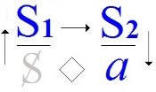
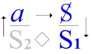
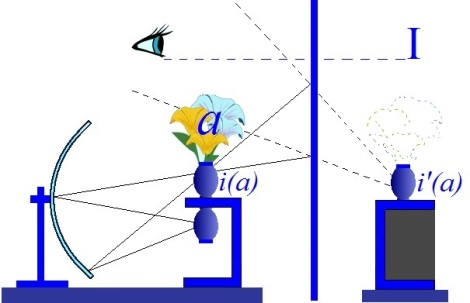

# Leçon 25 | 22 Juin 1960

  

    <label><input type="checkbox" data-lacan-toggle="original" checked> 原文</label>
    <label><input type="checkbox" data-lacan-toggle="notes" checked> 注释</label>
    <label><input type="checkbox" data-lacan-toggle="commentary" checked> 个人解读评论</label>
  

  <form class="lacan-tool-search" role="search">
    <input class="lacan-tool-search-input" type="search" placeholder="搜索全文" aria-label="搜索全文">
    <button class="lacan-tool-button" type="submit" title="搜索">搜索</button>
  </form>
  <button class="lacan-tool-button lacan-back-to-top" type="button" title="回到页面最上方" aria-label="回到页面最上方">↑</button>

<section class="parallel-paragraph" data-paragraph-ids="s7-25-0001">

s7-25-0001

原文 · s7-25-0001

Dans un *Rapport* [^71] qui doit paraître dans le prochain numéro de notre revue…

[无对应译文]

</section>

<section class="parallel-paragraph" data-paragraph-ids="s7-25-0002">

s7-25-0002

原文 · s7-25-0002

> qui est le rapport que j’ai fait il y a deux ans à Royaumont, rapport qui était un peu jeté, comme je l’ai expliqué, puisque je l’ai composé entre deux séminaires d’ici, j’en garderai la forme improvisée, tout en essayant
>
> quand même de compléter et de rectifier certaines des choses qui y sont contenues

[无对应译文]

</section>

<section class="parallel-paragraph" data-paragraph-ids="s7-25-0003">

s7-25-0003

原文 · s7-25-0003

…je dis quelque part que l’analyste doit payer quelque chose pour tenir sa fonction, qu’il paye de mots : ses *interprétations*, *qu’il paye de sa personne en ceci* - dont on peut dire que toute l’évolution présente de l’analyse est la méconnaissance - *que par le transfert il en est littéralement dépossédé*. Je veux dire que, quoi qu’il en pense, et quel que soit son recours panique à « *the counter-transference* », il faut bien qu’il en passe par là. Ce n’est pas seulement lui qui est là avec celui vis-à-vis de qui il a pris un certain engagement. Et enfin, qu’il faut qu’il paye d’un jugement concernant son action.

[无对应译文]

</section>

<section class="parallel-paragraph" data-paragraph-ids="s7-25-0004">

s7-25-0004

原文 · s7-25-0004

C’est quand même tout de même un minimum d’exigence. L’analyse est un jugement. Je dirai que ce qu’il fait, c’est exigible partout ailleurs et qu’à la vérité - ce qui peut paraître scandaleux de l’avancer - c’est probablement pour quelque raison. C’est pour la raison que, par un certain côté, il a hautement conscience *qu’il ne peut pas le savoir* ce qu’il fait en psychanalyse.

[无对应译文]

</section>

<section class="parallel-paragraph" data-paragraph-ids="s7-25-0005">

s7-25-0005

原文 · s7-25-0005

Il y a une part de cette action qui lui reste à lui-même voilée. C’est ce qui justifie le point où je voulais vous amener, où je vous ai amenés cette année. Je veux dire que si je vous ai proposé de me suivre cette année sur ce point, point qui pose la question de ce qu’une pareille possibilité, celle qui nous est donnée par le rapport à *l’inconscient* tel qu’il a été ouvert par FREUD, de ce que ça comporte comme conséquences éthiques générales, c’est bien évidemment pour nous rapprocher de la nôtre, d’éthique.

[无对应译文]

</section>

<section class="parallel-paragraph" data-paragraph-ids="s7-25-0006">

s7-25-0006

原文 · s7-25-0006

D’où cet aspect tout de même de détour, qui fait qu’il n’a pas pu ne pas vous apparaître, cet intérêt des notions kantiennes qui ont été apportées la dernière fois, mais qu’avant même de demander à celui qui vous a parlé la dernière fois d’y apporter quelques compléments que je crois utiles, je ne crois pas moins utile de resituer pour vous, en fin de compte, au moment où nous nous approchons de la fin de notre détour de cette année, ce qu’il veut dire.

[无对应译文]

</section>

<section class="parallel-paragraph" data-paragraph-ids="s7-25-0007">

s7-25-0007

原文 · s7-25-0007

Je rappellerai simplement des choses très simples, articulées dans les termes qui sont ceux que j’ai produits pour vous les années précédentes. Ce dont il s’agit, ce que j’ai voulu vous rappeler avant de vous ramener d’une façon plus proche à la pratique de l’analyse, aux problèmes techniques qui ne sauraient tout de même, dans l’état actuel des choses, être résolus sans ces rappels, ce sont des choses simples que je vais vous rappeler tout de suite.

[无对应译文]

</section>

<section class="parallel-paragraph" data-paragraph-ids="s7-25-0008">

s7-25-0008

原文 · s7-25-0008

Premièrement, la fin de l’analyse est-elle ce qu’on nous demande ? Si ce qu’on nous demande est en fin de compte ce qu’il faut bien appeler d’un mot simple, qui est bien effectivement *ce que l’on nous demande*, le *bonheur*. Je n’apporte là rien de nouveau. *Cette demande du bonheur*, ou encore *de la happiness*, comme écrivent les auteurs anglais dans leur langage, *c’est bien de cela qu’il s’agit*.

[无对应译文]

</section>

<section class="parallel-paragraph" data-paragraph-ids="s7-25-0009">

s7-25-0009

原文 · s7-25-0009

Dans le *Rapport* auquel je faisais allusion tout à l’heure, évidemment dans cette rédaction, il m’a paru - maintenant, à le publier - un tout petit peu trop aphorismatique. J’essaie de mettre un peu d’huile dans les gonds. Je fais allusion au fait, sans m’expliquer autrement. L’affaire n’est pas autrement facilitée du fait - comme on l’a dit un jour - que « *Le bonheur est devenu un facteur de la politique* »[^72]. Je n’en dis pas plus long.

[无对应译文]

</section>

<section class="parallel-paragraph" data-paragraph-ids="s7-25-0010">

s7-25-0010

原文 · s7-25-0010

Je voudrais tout de même ici vous faire sentir ce que ça veut dire. C’est la même chose qui m’a fait terminer la conférence par laquelle j’avais terminé une certaine ère de mon activité dans un certain groupe, dont nous nous sommes séparés depuis, par ce propos sur lequel je terminais « *La psychanalyse, dialectique* ». Tel était *le titre* que j’avais donné à ce que je proférai ce jour-là. Je terminai par le propos suivant : « *Il ne saurait y avoir de satisfaction d’aucun hors de la satisfaction de tous.* »

[无对应译文]

</section>

<section class="parallel-paragraph" data-paragraph-ids="s7-25-0011">

s7-25-0011

原文 · s7-25-0011

Mon propos, qui consistait à faire recentrer l’analyse sur ce nom de dialectique, vient présentifier pour nous que l’affaire apparaît - le but - comme indéfiniment reculé. Ce n’est donc pas la faute de l’analyse, si vous voulez, qu’à l’heure actuelle, la question du bonheur ne puisse pas s’articuler autrement. Je dirai que c’est dans la mesure où, comme le dit SAINT-JUST :

[无对应译文]

</section>

<section class="parallel-paragraph" data-paragraph-ids="s7-25-0012">

s7-25-0012

原文 · s7-25-0012

« *Le bonheur est devenu un facteur de la politique* »

[无对应译文]

</section>

<section class="parallel-paragraph" data-paragraph-ids="s7-25-0013">

s7-25-0013

原文 · s7-25-0013

c’est un corrélatif, ce n’est pas nouveau que les choses en sont ainsi, que la question du bonheur n’a pas pour nous de solution aristotélicienne possible : *qu’il n’est pas possible que d’aucun isole son bonheur de la satisfaction de tous*.

[无对应译文]

</section>

<section class="parallel-paragraph" data-paragraph-ids="s7-25-0014">

s7-25-0014

原文 · s7-25-0014

Ce qui veut dire quoi ? C’est que du fait de l’entrée du bonheur dans la politique, ces choses pour l’instant, pour nous, concernant le bonheur, sont rejetées comme sur une étape nécessaire, préalable, primordiale au niveau de la satisfaction des besoins pour tous les hommes.

[无对应译文]

</section>

<section class="parallel-paragraph" data-paragraph-ids="s7-25-0015">

s7-25-0015

原文 · s7-25-0015

La dialectique du maître...

[无对应译文]

</section>

<section class="parallel-paragraph" data-paragraph-ids="s7-25-0016">

s7-25-0016

原文 · s7-25-0016

> telle qu’elle permet à ARISTOTE de faire un choix entre les biens qu’il offre au maître,
>
> et de lui dire qu’il y a seulement certain de ces biens qui sont dignes de sa dévotion, à savoir *la contemplation*

[无对应译文]

</section>

<section class="parallel-paragraph" data-paragraph-ids="s7-25-0017">

s7-25-0017

原文 · s7-25-0017

...est quelque chose qui pour nous est dévalorisé - j’y insiste - pour des raisons historiques, pour des raisons du moment historique que nous vivons, et qui s’expriment dans la politique par la formule suivante :

[无对应译文]

</section>

<section class="parallel-paragraph" data-paragraph-ids="s7-25-0018">

s7-25-0018

原文 · s7-25-0018

« *Il ne saurait y avoir de satisfaction d’aucun sans la satisfaction de tous.* »

[无对应译文]

</section>

<section class="parallel-paragraph" data-paragraph-ids="s7-25-0019">

s7-25-0019

原文 · s7-25-0019

[无对应译文]

</section>

<section class="parallel-paragraph" data-paragraph-ids="s7-25-0020">

s7-25-0020

原文 · s7-25-0020

C’est dans ce contexte que l’analyse - sans que nous puissions savoir bien exactement ce qui justifie que ce soit dans ce contexte qu’elle soit apparue - c’est dans ce contexte que l’analyse se produit, que l’analyste s’offre à recevoir - il la reçoit, c’est un fait – la demande du bonheur.

[无对应译文]

</section>

<section class="parallel-paragraph" data-paragraph-ids="s7-25-0021">

s7-25-0021

原文 · s7-25-0021

[无对应译文]

</section>

<section class="parallel-paragraph" data-paragraph-ids="s7-25-0022">

s7-25-0022

原文 · s7-25-0022

Tout ce que j’ai articulé cette année a consisté à montrer comme j’ai pu, je veux dire à choisir parmi quelques termes parmi les plus saillants qui peuvent vous permettre de vous rendre compte que la distance parcourue, disons depuis ARISTOTE, j’ai essayé de vous montrer à quel point nous prenons les choses à un niveau différent, combien, en fin de compte, nous sommes loin de toute formulation d’une discipline du bonheur.

[无对应译文]

</section>

<section class="parallel-paragraph" data-paragraph-ids="s7-25-0023">

s7-25-0023

原文 · s7-25-0023

Car il est bien clair que, dans ARISTOTE - pour le prendre comme exemple, et il le mérite au plus haut degré, il est exemplaire - il y a une discipline du bonheur. Il y a *des chemins qui sont montrés*, où il entend conduire quiconque le suit dans sa problématique, qui sont des voies qui, dans chacun des versants de l’activité possible de l’homme, réalisent une fonction de *la vertu* qui s’obtient par un μεσότης \[mésothes\], qui est loin d’être seulement un juste milieu, un procès lié au principe de l’évitement de tout excès dans un sens comme dans l’autre, mais qui peut permettre à l’homme de choisir ce qui raisonnablement est fait pour le faire se réaliser dans ce qui lui apparaît être son bien propre.

[无对应译文]

</section>

<section class="parallel-paragraph" data-paragraph-ids="s7-25-0024">

s7-25-0024

原文 · s7-25-0024

Il n’y a rien de semblable dans l’analyse. Observez-le bien, nous prétendons, par des voies dont, pour quelqu’un qui arriverait du *Lycée* \[Λύκειον\], si je puis dire, paraîtraient surprenantes, des voies qui doivent permettre au sujet, en quelque sorte, de se mettre dans une sorte de position pour que les choses, mystérieusement, je dirai presque *miraculeusement*, lui arrivent à bien, qu’il les prenne *par le bon bout*. Dieu sait tout de même que nous pouvons sentir *quelles obscurités restent dans une pareille prétention*, tel l’avènement de ce que nous appelons « *l’objectalité génitale* » et comme on ajoute - avec Dieu sait quelle imprudence - de nous mettre en accord avec une réalité.

[无对应译文]

</section>

<section class="parallel-paragraph" data-paragraph-ids="s7-25-0025">

s7-25-0025

原文 · s7-25-0025

Une seule chose fait allusion à une possibilité heureuse de satisfaction de la tendresse, c’est la notion de *sublimation*. Je ne vais pas reprendre aujourd’hui les différentes formules, mais il est tout à fait clair que, pour prendre, premièrement, sa formulation la plus exotérique dans FREUD, je veux dire, quand il nous la représente comme éminemment *réalisée par l’artiste*, par l’activité de l’artiste par exemple, eh bien, qu’est-ce que ça veut dire ?

[无对应译文]

</section>

<section class="parallel-paragraph" data-paragraph-ids="s7-25-0026">

s7-25-0026

原文 · s7-25-0026

C’est littéralement dans FREUD : je n’ai pas besoin de vous rappeler le passage, je vous l’ai mâché assez cette année. Ça veut dire *la possibilité pour l’homme de rendre ses désirs commerciaux, vendables*, sous forme de bouquins ou de produits quelconques, d’une activité esthétique, d’une production de l’art, c’est cela que ça veut dire. Je dirai, la franchise, le cynisme d’une telle formulation, à mes yeux garde un mérite immense, bien entendu, quoiqu’elle n’épuise pas du tout le fond de la question : comment cela est-il possible, bien sûr ?

[无对应译文]

</section>

<section class="parallel-paragraph" data-paragraph-ids="s7-25-0027">

s7-25-0027

原文 · s7-25-0027

L’autre formulation consiste à nous dire que *la sublimation est la satisfaction de la tendance dans le changement de son objet*, ceci sans refoulement. Définition plus profonde, mais qui assurément ouvre, me semble-t-il, une problématique plus épineuse si ce que je vous enseigne ne vous permettait, disons de voir où gît le lièvre.

[无对应译文]

</section>

<section class="parallel-paragraph" data-paragraph-ids="s7-25-0028">

s7-25-0028

原文 · s7-25-0028

La satisfaction dont il s’agit, s’il y en a une, pouvant consister, son progrès, son procès, ou ce dont il s’agit, pour qu’il puisse y avoir d’une façon valable une tendance accompagnée de son changement de ce qui par définition soit satisfaction à la fois de la tendance dans le changement de l’objet, c’est qu’effectivement la tendance est liée à quelque chose qui déjà met, en elle-même, le lapin qu’il s’agit de sortir du chapeau.

[无对应译文]

</section>

<section class="parallel-paragraph" data-paragraph-ids="s7-25-0029">

s7-25-0029

原文 · s7-25-0029

Ce n’est pas un nouvel objet, c’est le changement d’objet en lui-même. C’est parce que la tendance est déjà profondément marquée par l’articulation du signifiant, qu’elle contient en elle-même ce quelque chose qui permet le changement d’objet.

[无对应译文]

</section>

<section class="parallel-paragraph" data-paragraph-ids="s7-25-0030">

s7-25-0030

原文 · s7-25-0030

Autrement dit, c’est parce que dans le graphe, la tendance se situe au niveau de l’articulation inconsciente d’une succession signifiante qui la constitue de ce fait dans une *aliénation fondamentale*,

[无对应译文]

</section>

<section class="parallel-paragraph" data-paragraph-ids="s7-25-0031">

s7-25-0031

原文 · s7-25-0031

- qu’il peut y avoir quelque chose qui, en retour, lie par un facteur commun chacun des signifiants composant cette succession typique,

[无对应译文]

</section>

<section class="parallel-paragraph" data-paragraph-ids="s7-25-0032">

s7-25-0032

原文 · s7-25-0032

- que ce rapport proprement métonymique, d’un signifiant à l’autre, que nous appelons *le désir*, c’est justement non pas le nouvel objet, ni l’objet d’avant, *c’est le changement d’objet en soi-même*,

[无对应译文]

</section>

<section class="parallel-paragraph" data-paragraph-ids="s7-25-0033">

s7-25-0033

原文 · s7-25-0033

- que la satisfaction dont il s’agit donc - puisque dans la définition de la sublimation, le refoulement est éliminé - consiste en ceci, c’est qu’ici il y a, implicite ou explicite, *passage du non-savoir au savoir* sous la forme de la reconnaissance de ceci : c’est que *le désir n’est rien d’autre que la métonymie de ce discours de la demande, que le désir c’est ce changement comme tel*.

[无对应译文]

</section>

<section class="parallel-paragraph" data-paragraph-ids="s7-25-0034">

s7-25-0034

原文 · s7-25-0034

Et si vous me permettez de prendre un exemple, je le prendrai où il me passait par la tête au moment où je préparais ces propos pour vous. J’ai cherché un exemple de quelque chose qui imagerait ce que je veux dire pour vous faire comprendre *la sublimation*, *le passage, disons d’un verbe à ce que la grammaire appelle son complément, à ce qu’une grammaire plus philologique appellera son déterminatif*. Et prenons le verbe le plus radical dans l’évolution des phases de la tendance, le verbe *manger*. Il y a du *manger*, c’est comme ça que dans beaucoup de langues se propose d’abord, bille en tête, *le verbe et l’action*, avant qu’on détermine de quoi il s’agit.

[无对应译文]

</section>

<section class="parallel-paragraph" data-paragraph-ids="s7-25-0035">

s7-25-0035

原文 · s7-25-0035

Ce en quoi se voit bien le facteur secondaire qui compose le sujet. Nous n’avons même pas le sujet, ici, qui nous permette d’exprimer ce quelque chose qu’il peut bien y avoir à manger. Disons qu’il y a du manger. Quoi ? Le livre. Quand nous voyons dans l’*Apocalypse*, cette image de « *manger le livre* », qu’est-ce que cela veut dire, sinon ceci que quelque chose s’est appliqué à donner au livre lui-même la valeur d’une incorporation, que le livre devient, dans cette image puissante, l’incorporation du signifiant lui-même. Il devient le support de *la création* proprement *apocalyptique*. Je veux dire que le signifiant devient dans cette occasion Dieu, l’objet de l’incorporation elle-même.

[无对应译文]

</section>

<section class="parallel-paragraph" data-paragraph-ids="s7-25-0036">

s7-25-0036

原文 · s7-25-0036

Ce que donc nous apportons, pour autant que nous osons formuler quelque chose qui ressemble à une satisfaction qui ne soit pas payée d’un refoulement, c’est le thème mis au centre, promu dans sa *primauté* : qu’est-ce que le désir ? Et à ce propos je ne puis ici que vous rappeler - ce que j’ai articulé en son temps - que réaliser son désir se pose toujours nécessairement dans une perspective de *condition absolue*.

[无对应译文]

</section>

<section class="parallel-paragraph" data-paragraph-ids="s7-25-0037">

s7-25-0037

原文 · s7-25-0037

C’est pour autant que la demande, comme je l’ai dit, est à la fois au-delà et en-deçà d’elle-même, du fait qu’elle s’articule avec du signifiant, qu’elle demande toujours *autre chose*, et dans toute satisfaction du besoin, elle exige *autre chose ,* que la satisfaction formulée s’étend, se cadre dans cette béance, dans ce creux et que le désir se forme comme ce qui supporte, comme telle, cette métonymie, à savoir ce que veut dire la demande au-delà de ce qu’elle formule.

[无对应译文]

</section>

<section class="parallel-paragraph" data-paragraph-ids="s7-25-0038">

s7-25-0038

原文 · s7-25-0038

Aussi bien, ça n’est pas pour rien qu’il est naturel que la question de la réalisation du désir se formule nécessairement dans ce que j’appellerai *une perspective* de jugement dernier. Essayez vous-mêmes de demander ce que ceci peut vouloir dire « *avoir réalisé son désir* », si ce n’est l’avoir réalisé, si l’on peut dire, à la fin. Cet empiètement de la mort sur la vie, c’est cela qui donne son dynamisme à toute question quand elle essaie de se formuler sur le sujet de la réalisation du désir.

[无对应译文]

</section>

<section class="parallel-paragraph" data-paragraph-ids="s7-25-0039">

s7-25-0039

原文 · s7-25-0039

Pour illustrer ce que nous disons, disons que pour juger la question du désir, nous la posons directement à partir de l’absolutisme parménidien, en tant que précisément il annule tout ce qui n’est pas l’être.

[无对应译文]

</section>

<section class="parallel-paragraph" data-paragraph-ids="s7-25-0040">

s7-25-0040

原文 · s7-25-0040

« *L’être est -* dit-il*- le non-être n’est pas. Rien n’est -* affirme-t-il *- de ce qui n’est pas né, et tout ce qui existe, donc, ne vit que dans le manque-à-être.* »

[无对应译文]

</section>

<section class="parallel-paragraph" data-paragraph-ids="s7-25-0041">

s7-25-0041

原文 · s7-25-0041

FREUD a posé la question de savoir si la vie peut être comme la mort, si le support de *ce rapport à la mort* est ce qui sous-tend, comme la corde l’arc, le *sinus* de la montée et de la retombée de la vie, si la vie a quelque chose à faire, en somme, *avec la mort*. Vous savez qu’il suffit que FREUD en fin de compte, ait cru pouvoir à partir de l’expérience, poser la question, et ceci prouve qu’elle est posée par notre expérience.

[无对应译文]

</section>

<section class="parallel-paragraph" data-paragraph-ids="s7-25-0042">

s7-25-0042

原文 · s7-25-0042

Dans ce que je vous dis à l’instant, ce n’est pas de cette mort là qu’il s’agit. Il s’agit de *la seconde mort *:

[无对应译文]

</section>

<section class="parallel-paragraph" data-paragraph-ids="s7-25-0043">

s7-25-0043

原文 · s7-25-0043

- celle qu’on peut encore *viser*, comme je vous l’ai montré dans un contenu concret, dans le texte de SADE, après que la mort soit accomplie,

[无对应译文]

</section>

<section class="parallel-paragraph" data-paragraph-ids="s7-25-0044">

s7-25-0044

原文 · s7-25-0044

- celle que toute la tradition humaine, après tout, n’a jamais cessé de conserver présente devant elle, en y voyant le terme des souffrances.

[无对应译文]

</section>

<section class="parallel-paragraph" data-paragraph-ids="s7-25-0045">

s7-25-0045

原文 · s7-25-0045

Ce qui est la même chose que ceci : que toute cette tradition n’a jamais cessé d’imaginer, elle aussi, une seconde souffrance, souffrance d’au-delà de la mort, indéfiniment soutenue sur l’impossibilité que soit franchie cette limite de *la seconde mort*. C’est pour cela que la tradition des enfers est toujours restée si vivante. Comme je vous l’ai montré, elle est encore présente dans SADE avec cette idée de faire se perpétuer les souffrances infligées à la victime - car il y a ce raffinement, ce détail, attribué à l’un des héros du roman sadique - à les perpétuer en s’assurant de *la damnation* de celui qu’il fait passer de vie à trépas.

[无对应译文]

</section>

<section class="parallel-paragraph" data-paragraph-ids="s7-25-0046">

s7-25-0046

原文 · s7-25-0046

Quelle que soit donc la portée de cette imagination métapsychologique de *l’instinct de mort* - et donc que le fait de l’avoir forgé soit fondé ou pas, la question, par le seul fait qu’elle a été posée pour nous, s’articule sous la forme suivante : comment l’homme, c’est-à-dire un vivant, peut-il accéder, cet instant de mort, à en connaître ?

[无对应译文]

</section>

<section class="parallel-paragraph" data-paragraph-ids="s7-25-0047">

s7-25-0047

原文 · s7-25-0047

La réponse, elle est simple : *par la vertu du signifiant*, et je dirai, sous sa forme la plus radicale. C’est dans le signifiant, et pour autant qu’il articule une *chaîne signifiante,* qu’il peut toucher du doigt qu’il peut manquer à la chaîne de ce qu’il est. À la vérité, c’est bête comme chou de dire cela. Et après tout, le fait de ne pas le reconnaître, de ne pas le promouvoir comme étant ce qui est l’articulation essentielle du non-savoir comme valeur dynamique, je veux dire de reconnaître que c’est là la découverte de l’inconscient, que littéralement, sous la forme de cette parole dernière, ceci veut seulement dire :

[无对应译文]

</section>

<section class="parallel-paragraph" data-paragraph-ids="s7-25-0048">

s7-25-0048

原文 · s7-25-0048

« ...*ils ne savent pas ce qu’ils font.* »

[无对应译文]

</section>

<section class="parallel-paragraph" data-paragraph-ids="s7-25-0049">

s7-25-0049

原文 · s7-25-0049

Ceci, tout bête que ce soit, paraît la chose essentielle à rappeler quand nous constatons que, du point de vue de la théorie, ne pas le rappeler comme principe fondamental entraîne littéralement cette pullulation comme jungle, comme pluie. Il pleut « *comme qui la jette* » - comme on dit en Charente - de ces références dont on ne peut pas ne pas être frappé de la note de désorientation dont elles résonnent.

[无对应译文]

</section>

<section class="parallel-paragraph" data-paragraph-ids="s7-25-0050">

s7-25-0050

原文 · s7-25-0050

J’ai lu, sans doute un peu rapidement, la traduction qui nous a été donnée du dernier ouvrage de BERGLER. Ça n’est assurément pas dépourvu de mordant, ni d’intérêt, tout ce qu’il nous apporte, à ceci près qu’on ne peut vraiment qu’avoir l’impression d’une sorte de *déchaînement délirant* de notions immaîtrisées. Et donc - pour dire ce que je veux dire quand je parle de cette réponse - comment l’homme, c’est-à-dire un vivant, peut-il accéder à son propre rapport à la mort ? Réponse : *par la vertu du signifiant*, je veux vous montrer aussi bien que l’accès est plus tangible que cette référence connotatrice.

[无对应译文]

</section>

<section class="parallel-paragraph" data-paragraph-ids="s7-25-0051">

s7-25-0051

原文 · s7-25-0051

Et c’est ceci que, dans ces dernières rencontres, j’ai essayé de vous faire reconnaître sous une forme esthétique à proprement parler, c’est-à-dire *sensible*, en vous priant de reconnaître à cet endroit la fonction du *beau*, le *beau* étant précisément ce qui nous indique cette place du rapport de l’homme à sa propre mort et qui ne nous l’indique que dans un *éblouissement*. J’ai demandé à Monsieur KAUFMANN la dernière fois de vous rappeler les termes dans lesquels KANT lui-même, à l’orée de cette étape où nous sommes des rapports de l’homme au bonheur, a cru devoir définir la relation du *beau*.

[无对应译文]

</section>

<section class="parallel-paragraph" data-paragraph-ids="s7-25-0052">

s7-25-0052

原文 · s7-25-0052

Certainement, les choses - j’ai pu le contrôler - vous sont parvenues aux oreilles, à cette plainte près que j’ai pu entendre, que la chose ne vous avait pas été, en quelque sorte, *animée par un exemple*. Eh bien, je vais essayer de vous donner un exemple. Rappelez-vous les quatre moments du beau tels qu’ils vous ont été articulés la dernière fois. Je vais essayer de vous montrer, par un procès gradué, ce qui permet de l’illustrer, de le rejoindre. Je l’emprunterai, le premier échelon, à un fait de *mon expérience* la plus familière. Mon expérience n’est pas immense, tel est ce que je me dis bien souvent. Peut-être n’ai-je pas eu pour *l’expérience* toujours le goût qui convient, les choses ne me paraissent pas toujours assez amusantes.

[无对应译文]

</section>

<section class="parallel-paragraph" data-paragraph-ids="s7-25-0053">

s7-25-0053

原文 · s7-25-0053

Mais tout de même, il se trouve toujours à l’occasion quelque ressource pour imager ce chemin de *l’entre-deux* où j’essaie de vous mener. Disons - à la différence de Monsieur TESTE - si la bêtise n’est pas mon fort, je n’en suis pas plus fier pour ça. C’est donc un tout petit fait que je vais vous raconter.

[无对应译文]

</section>

<section class="parallel-paragraph" data-paragraph-ids="s7-25-0054">

s7-25-0054

原文 · s7-25-0054

J’étais un jour à Londres dans une sorte de *home*, comme on dit là-bas, destiné à me recevoir à titre d’invité dans un *Institut* qui répand *la culture française*, dans un de ces charmants petits quartiers éloignés, vers la fin d’octobre, où le temps est radieux souvent à Londres. C’est ainsi que je reçus une hospitalité dans un charmant petit édifice marqué du style d’un certain *conventualisme*, et d’un *conventualisme victorien*. Une bonne odeur de *toast* grillé et l’ombre de ces *gelées immangeables* dont il est d’usage là-bas de se repaître, était ce qui donnait à cette maison son style.

[无对应译文]

</section>

<section class="parallel-paragraph" data-paragraph-ids="s7-25-0055">

s7-25-0055

原文 · s7-25-0055

Je n’y étais pas seul. J’étais avec quelqu’un qui veut bien m’accompagner dans la vie, et dont une caractéristique est une extrême présence à l’unicité, et qui, au matin, me dit tout à trac : « *Le Professeur D. est là.*[^73] ». Il s’agit d’un de mes maîtres, quelqu’un qui fut mon maître à l’*École des langues orientales*. C’était fort tôt le matin. « *Comment le savez-vous ?* » On me répondit - je puis vous dire que le Professeur D. n’est pas un intime - « *J’ai vu ses chaussures* ».

[无对应译文]

</section>

<section class="parallel-paragraph" data-paragraph-ids="s7-25-0056">

s7-25-0056

原文 · s7-25-0056

Je dois dire que je ne manquais pas d’éprouver à cette réponse un certain frisson, et d’autre part quelque ombre de scepticisme. Je veux dire que le caractère hautement caractéristique d’une individualité dans une paire de croquenots posée là, à une porte, ne me paraissait pas porter des caractères d’évidence suffisants. Mais rien, d’autre part, ne m’avait laissé pressentir que le Professeur D. pût être à Londres. Je trouvais plutôt la chose du type humoristique sans y attacher d’importance.

[无对应译文]

</section>

<section class="parallel-paragraph" data-paragraph-ids="s7-25-0057">

s7-25-0057

原文 · s7-25-0057

À l’heure précoce qu’il était, je me rendis sans plus y penser le long des couloirs. C’est alors qu’à ma stupeur je vis se glisser en robe de chambre - laissant voir par l’intervalle de ses pans, un caleçon long hautement universitaire - le professeur D. en personne qui, effectivement, sortait.

[无对应译文]

</section>

<section class="parallel-paragraph" data-paragraph-ids="s7-25-0058">

s7-25-0058

原文 · s7-25-0058

Cette expérience me parait hautement instructive. Je veux dire que c’est par elle que j’entends vous amener à la notion de ce que c’est que *le beau*. Il fallait une expérience où fut aussi intensément conjointe : l’universalité comportant le propre des chaussures chez l’universitaire, avec ce qui pouvait se présenter d’absolument particulier, étant donné la personne du professeur D., pour que je puisse vous faire simplement *remarquer* que...

[无对应译文]

</section>

<section class="parallel-paragraph" data-paragraph-ids="s7-25-0059">

s7-25-0059

原文 · s7-25-0059

> pensez maintenant aux vieux souliers de VAN GOGH
>
> dont il nous fit l’image émerveillante qui fait que c’est une œuvre de beauté

[无对应译文]

</section>

<section class="parallel-paragraph" data-paragraph-ids="s7-25-0060">

s7-25-0060

原文 · s7-25-0060

...il faut que vous imaginiez les croquenots du professeur D. : « *ohne Begriff* », sans la conception de l’universitaire, « *ohne Begriff* », sans aucun rapport avec sa personnalité si attachante, …pour que vous commenciez à voir vivre les croquenots de VAN GOGH dans leur incommensurable *qualité de beau*. C’est-à-dire qu’ils sont là, qu’ils nous font un signe d’intelligence si je puis dire, situé très précisément à cette égale distance qu’on vous a indiquée la dernière fois : entre la puissance de l’imagination et le signifiant.

[无对应译文]

</section>

<section class="parallel-paragraph" data-paragraph-ids="s7-25-0061">

s7-25-0061

原文 · s7-25-0061

Que ce signifiant n’est même plus là un signifiant de la marche, de la fatigue, de tout ce que vous voudrez, de la passion, de la chaleur humaine, il est seulement signifiant de ce que signifie une paire de croquenots abandonnée, c’est-à-dire à la fois d’une présence et d’une absence pure : une chose, si l’on peut dire, inerte, qui est faite pour tous, une chose, par certains côtés - toute muette qu’elle est - qui parle, une empreinte qui émerge à la fonction de l’organique, et pour tout dire, d’un déchet qui évoque le commencement d’une génération spontanée. C’est ce quelque chose qui fait de ces croquenots une sorte d’envers et d’analogue d’une paire de bourgeons qu’il s’agit, comme par magie, de faire que pour nous ce n’est pas de l’imitation. Et c’est cela qui a toujours trompé les auteurs de la paire de *croquenots*, la saisie de ce quelque chose par quoi, de par leur position dans un certain rapport temporel, ils sont eux-mêmes la manifestation visible du beau.

[无对应译文]

</section>

<section class="parallel-paragraph" data-paragraph-ids="s7-25-0062">

s7-25-0062

原文 · s7-25-0062

Si cet exemple ne vous paraît pas convaincant, cherchez-en d’autres. Je veux dire que ce dont il s’agit, c’est de montrer ici que *le beau* n’a rien à faire avec ce qu’on appelle « *le beau idéal »*, que c’est à partir de cette appréhension du *beau*, dans cette ponctualité, cette transition de la vie à la mort, c’est à partir de là seulement que nous pouvons essayer de restaurer, de restituer ce qu’est le beau idéal, à savoir la fonction que peut y prendre, à l’occasion, ce qui se présente à nous comme forme idéale du beau, et nommément, au premier plan, la fameuse forme humaine.

[无对应译文]

</section>

<section class="parallel-paragraph" data-paragraph-ids="s7-25-0063">

s7-25-0063

原文 · s7-25-0063

Si vous lisez « *Laocoon »* de LESSING, qui est une lecture précieuse, assurément riche de toutes sortes de pressentiments, vous le voyez arrêté pourtant au départ devant cette conception de « *la dignité de l’objet* » et tout prêt à nous faire sentir non pas que c’est l’effet d’un progrès historique, mais que cette fameuse « *dignité de l’objet* » a enfin - Dieu merci - été abandonnée car elle l’a été toujours. Je veux dire que tout le laisse apparaître. Il y a là-dessus des textes d’ARISTOPHANE : l’activité des Grecs ne se limitait pas à faire des images de dieux, et l’on achetait très cher les tableaux représentant des oignons. Ce n’est donc pas depuis même les peintres hollandais qu’on s’est aperçu que *n’importe quel objet* peut être le signifiant en question, celui par quoi vient vibrer ce reflet, ce mirage, cet éclat plus ou moins insoutenable qui s’appelle *le beau*.

[无对应译文]

</section>

<section class="parallel-paragraph" data-paragraph-ids="s7-25-0064">

s7-25-0064

原文 · s7-25-0064

Mais si j’ai évoqué les Hollandais, que cela vous soit une occasion de vous rappeler que, si vous prenez un autre exemple, à savoir la nature morte, vous y trouverez précisément, en sens contraire de celui des croquenots de tout à l’heure, commencer à *bourgeonner* le même passage de la ligne, à savoir que...

[无对应译文]

</section>

<section class="parallel-paragraph" data-paragraph-ids="s7-25-0065">

s7-25-0065

原文 · s7-25-0065

comme l’a admirablement démontré CLAUDEL[^74] quand il a fait son étude sur la peinture hollandaise

[无对应译文]

</section>

<section class="parallel-paragraph" data-paragraph-ids="s7-25-0066">

s7-25-0066

原文 · s7-25-0066

...c’est vraiment pour autant que *la nature morte* nous *montre* à la fois et nous *cache* profondément *ce qui en elle menace de dénouement,* *de déroulement, de décomposition*, qu’elle présentifie pour nous *le beau* comme fonction d’un rapport temporel.

[无对应译文]

</section>

<section class="parallel-paragraph" data-paragraph-ids="s7-25-0067">

s7-25-0067

原文 · s7-25-0067

Aussi bien *la question du beau*, pour autant qu’elle fait entrer en fonction *la question de l’idéal*, ne peut se retrouver, à prendre les choses à ce niveau, qu’en fonction d’un passage à la limite. Je veux dire que : c’est pour autant que *la forme du corps se présente comme l’enveloppe de tous les fantasmes possibles du désir humain*, c’est pour autant que dans cette *forme*, j’entends *forme extérieure* *du corps,* est forcément enveloppé *tout ce qui, des fleurs du désir, peut être contenu dans ce certain vase* dont nous essayons de fixer les parois...

[无对应译文]

</section>

<section class="parallel-paragraph" data-paragraph-ids="s7-25-0068">

s7-25-0068

原文 · s7-25-0068

[无对应译文]

</section>

<section class="parallel-paragraph" data-paragraph-ids="s7-25-0069">

s7-25-0069

原文 · s7-25-0069

...c’est pour autant qu’elle est - pour tout dire qu’elle a été, car elle n’est plus - forme divine, que la forme humaine peut encore, au temps de KANT, nous être présentée comme l’*idéal* \[*moi idéal : i(a)*, *idéal du moi* : I\], *Erscheinen, comme la limite des possibilités du beau*.

[无对应译文]

</section>

<section class="parallel-paragraph" data-paragraph-ids="s7-25-0070">

s7-25-0070

原文 · s7-25-0070

Voici donc où nous sommes amenés : c’est à poser la relation de la forme du corps, très précisément de *l’image* telle que je l’ai déjà articulée ici dans *la fonction du narcissisme*, comme étant proprement ce qui représente, dans un certain rapport de l’homme, le rapport à sa *seconde mort*, le signifiant de son *désir*, ἐναργής. Son *désir visible* : ἵμερος ἐναργής \[iméros énargès\], c’est là qu’est le mirage central

[无对应译文]

</section>

<section class="parallel-paragraph" data-paragraph-ids="s7-25-0071">

s7-25-0071

原文 · s7-25-0071

- qui indique à la fois la place de ce désir en tant qu’il est désir de rien,

[无对应译文]

</section>

<section class="parallel-paragraph" data-paragraph-ids="s7-25-0072">

s7-25-0072

原文 · s7-25-0072

- qui est rapport de l’homme à son manque-à-être,

[无对应译文]

</section>

<section class="parallel-paragraph" data-paragraph-ids="s7-25-0073">

s7-25-0073

原文 · s7-25-0073

- qui indique à la fois cette place et celui qui l’empêche de l’avoir.

[无对应译文]

</section>

<section class="parallel-paragraph" data-paragraph-ids="s7-25-0074">

s7-25-0074

原文 · s7-25-0074

C’est ici que quelque chose nous permet de redoubler cette question. S’il en est ainsi :

[无对应译文]

</section>

<section class="parallel-paragraph" data-paragraph-ids="s7-25-0075">

s7-25-0075

原文 · s7-25-0075

- est-ce cette même place, ce même support, cette image, cette *ombre* que représente *la forme du corps*,

[无对应译文]

</section>

<section class="parallel-paragraph" data-paragraph-ids="s7-25-0076">

s7-25-0076

原文 · s7-25-0076

- est-ce cette même *image* qui fait barrière concernant tout de même l’*autre chose* qui est au-delà et qui n’est pas seulement ce rapport avec *la seconde mort*, avec l’homme en tant que *le langage* exige de lui de rendre compte de ceci qu’il n’est pas ?

[无对应译文]

</section>

<section class="parallel-paragraph" data-paragraph-ids="s7-25-0077">

s7-25-0077

原文 · s7-25-0077

Eh bien, il y a la *libido*. À savoir très précisément ceci qui nous importe, qu’il nous emporte en des instants fugitifs au-delà de cet affrontement, qui nous la fait oublier, cette *libido*, pour autant que FREUD, le premier, articule avec autant d’audace et de puissance qu’après tout le seul moment de jouissance que connaisse l’homme, est à la même place où se produisent les fantasmes, qui, pour nous, représentent la même barrière, quant à l’accès à cette jouissance où tout est oublié.

[无对应译文]

</section>

<section class="parallel-paragraph" data-paragraph-ids="s7-25-0078">

s7-25-0078

原文 · s7-25-0078

C’est ici que je voudrais introduire comme parallèle à la fonction du *beau* par rapport à ce que nous désignerons...

[无对应译文]

</section>

<section class="parallel-paragraph" data-paragraph-ids="s7-25-0079">

s7-25-0079

原文 · s7-25-0079

> pour abréger : la fonction de quelque chose que j’ai déjà ici nommé à plusieurs reprises
>
> et sans jamais trop insister, et qui me paraît pourtant essentiel à produire

[无对应译文]

</section>

<section class="parallel-paragraph" data-paragraph-ids="s7-25-0080">

s7-25-0080

原文 · s7-25-0080

…que nous appellerons, si vous le voulez bien, ensemble, l’Αίδώς \[Aidôs\], autrement dit *la pudeur*.

[无对应译文]

</section>

<section class="parallel-paragraph" data-paragraph-ids="s7-25-0081">

s7-25-0081

原文 · s7-25-0081

L’omission de ce quelque chose qui garde l’appréhension directe de ce qu’il y a au centre de la conjonction sexuelle, l’omission de cette barrière me parait à la source de toutes sortes de questions sans issue et nommément concernant ce que nous pouvons dire d’articulé concernant *la sexualité féminine.* Vous voyez ici que l’indication - puisque aussi bien c’est là un sujet où je n’y suis pas absolument pour rien - est celle qui est mise à l’ordre du jour de nos recherches.

[无对应译文]

</section>

<section class="parallel-paragraph" data-paragraph-ids="s7-25-0082">

s7-25-0082

原文 · s7-25-0082

Ce que je veux simplement aujourd’hui produire c’est que, comme nous l’avons vu à propos du problème que nous pose la fin de l’ANTIGONE, à savoir *cette substitution* de je ne sais quelle *image sanglante* de sacrifice qui est celle que réalise *le suicide mystique*, pour autant assurément, à partir d’un certain moment, que nous ne savons plus ce qui se passe au tombeau d’ANTIGONE et que tout nous indique que celui qui vient se meurtrir sur elle, le fait dans une crise de μανία, que tout nous indique qu’il parvient à ce niveau où périssent également AJAX, HERCULE, je laisse de côté le sens de la fin d’ŒDIPE.

[无对应译文]

</section>

<section class="parallel-paragraph" data-paragraph-ids="s7-25-0083">

s7-25-0083

原文 · s7-25-0083

Ceci nous mène à la question pour laquelle je n’ai pas trouvé de meilleure référence que ces aphorismes héraclitéens que nous devons à la référence persécutive de Saint Clément D’ALEXANDRIE \[Clément : *Protreptique*, 34, 5\], qui y voit le signe des abominations païennes. Grâce à cela, nous gardons ce petit morceau qui dit :

[无对应译文]

</section>

<section class="parallel-paragraph" data-paragraph-ids="s7-25-0084">

s7-25-0084

原文 · s7-25-0084

« *Si, certes, ils ne faisaient cortèges et fêtes à* DIONYSOS *en chantant les hymnes* - et c’est ici que commence l’ambiguïté - *qu’est-ce qu’ils feraient ? Les hommages les plus déshonorants à ce qui est honteux*.

[无对应译文]

</section>

<section class="parallel-paragraph" data-paragraph-ids="s7-25-0085">

s7-25-0085

原文 · s7-25-0085

Voilà comment on peut le lire dans un sens, et - continue HÉRACLITE :

[无对应译文]

</section>

<section class="parallel-paragraph" data-paragraph-ids="s7-25-0086">

s7-25-0086

原文 · s7-25-0086

*c’est la même chose qu’*HADÈS *et* DIONYSOS*, pour autant que l’un et l’autre* μαίνονται *ils délirent* *et qu’ils se livrent aux manifestations des hyènes.*

[无对应译文]

</section>

<section class="parallel-paragraph" data-paragraph-ids="s7-25-0087">

s7-25-0087

原文 · s7-25-0087

\[εἰ μὴ γὰρ Διονύσῳ πομπὴν ἐποιοῦντο καὶ ὕμνεον ᾆσμα αἰδοίοισιν, ἀναιδέστατα εἴργαστ᾽ ἄν· ὡυτὸς δὲ Ἀίδης καὶ

[无对应译文]

</section>

<section class="parallel-paragraph" data-paragraph-ids="s7-25-0088">

s7-25-0088

原文 · s7-25-0088

Διόνυσος, ὅτεῳ μαίνονται καὶ ληναΐζουσιν\]

[无对应译文]

</section>

<section class="parallel-paragraph" data-paragraph-ids="s7-25-0089">

s7-25-0089

原文 · s7-25-0089

On ne peut pas traduire autrement. C’est ce dont il s’agit dans les cortèges liés à l’apparition de *toutes sortes de formes de transes*, c’est à proprement parler « *les cortèges bachiques* ». Voici donc que la position héraclitéenne...

[无对应译文]

</section>

<section class="parallel-paragraph" data-paragraph-ids="s7-25-0090">

s7-25-0090

原文 · s7-25-0090

qui comme vous le savez, est en opposition par rapport à toute manifestation religieuse radicale

[无对应译文]

</section>

<section class="parallel-paragraph" data-paragraph-ids="s7-25-0091">

s7-25-0091

原文 · s7-25-0091

...nous amène à l’identification, à la conjonction, à dire que s’il ne s’agissait pas en fin de compte d’une référence à l’HADÈS, toute cette manifestation d’extase pour lequel il n’a qu’éloignement, mais sans doute un éloignement qui n’a rien à faire avec *l’éloignement chrétien*, ni avec *l’éloignement rationaliste*, c’est bien d’autre chose dont il s’agit - ce ne serait qu’odieuses manifestations phalliques et objet de dégoût.

[无对应译文]

</section>

<section class="parallel-paragraph" data-paragraph-ids="s7-25-0092">

s7-25-0092

原文 · s7-25-0092

Cependant, il n’est pas certain non plus qu’on puisse s’en tenir à cette traduction pour autant que le jeu de mots est évidemment entre αἰδοίοισιν, ἀναιδέστατα et Ἀίδης, pour autant qu’Ἀίδης veut dire aussi *invisible*, mais que αἰδοΐα veut dire *les parties honteuses*, peuvent vouloir dire aussi « *respectueuses et vénérables* » et que le terme même de chant n’est pas absent.

[无对应译文]

</section>

<section class="parallel-paragraph" data-paragraph-ids="s7-25-0093">

s7-25-0093

原文 · s7-25-0093

Je veux dire qu’en fin de compte, ce dont il s’agit, est de dire qu’en rendant à DIONYSOS cette pompe et en chantant ces hymnes, ses sectateurs le font sans voir ni sans vraiment savoir ce qu’ils font en chantant ses louanges, et que si HADÈS et DIONYSOS sont une seule et même chose, c’est bien là en effet que la question aussi pour nous se pose, c’est à savoir que :

[无对应译文]

</section>

<section class="parallel-paragraph" data-paragraph-ids="s7-25-0094">

s7-25-0094

原文 · s7-25-0094

- si c’est au même niveau que le fantasme du *phallus* et *la beauté* de l’image humaine ont *leur place légitime*,

[无对应译文]

</section>

<section class="parallel-paragraph" data-paragraph-ids="s7-25-0095">

s7-25-0095

原文 · s7-25-0095

- si au contraire, il y a entre eux cette imperceptible distinction, cette différence irréductible qui est celle sur laquelle ont achoppé toute l’entreprise freudienne, celle autour de quoi FREUD, à la fin d’un de ses derniers articles, celui sur *l’Analyse finie et infinie*, nous dit finalement, se brise en une nostalgie irréductible, l’aspiration du patient au terme dernier, c’est à savoir sur ceci que ce *phallus*, d’aucune façon, il ne saurait l’être et que pour ne pas l’être, il ne saurait l’avoir qu’à la condition du *penisneid* chez la femme et de la *castration* chez l’homme.

[无对应译文]

</section>

<section class="parallel-paragraph" data-paragraph-ids="s7-25-0096">

s7-25-0096

原文 · s7-25-0096

Voici donc ce qu’il convient de rappeler au moment où l’analyste se trouve en somme en position de répondre à qui lui demande le *bonheur*. Lui demander le *bonheur*, il ne peut oublier que ceci, ancestralement, pour l’homme, pose la question du *Souverain Bien*, et que lui l’analyste, sait que cette question est une question fermée.

[无对应译文]

</section>

<section class="parallel-paragraph" data-paragraph-ids="s7-25-0097">

s7-25-0097

原文 · s7-25-0097

Non seulement ce qu’on lui demande, le *Souverain Bien*, *il ne l’a pas bien sûr, mais il sait qu’il n’y en a pas, parce que rien d’autre* *n’est d’avoir mené à son terme une analyse*, sinon d’avoir saisi, d’avoir rencontré, de s’être heurté à cette limite qui est celle où se pose toute la problématique du désir.

[无对应译文]

</section>

<section class="parallel-paragraph" data-paragraph-ids="s7-25-0098">

s7-25-0098

原文 · s7-25-0098

*Que cette problématique devienne centrale* dans tout accès à une réalisation quelconque de soi-même, c’est là la nouveauté de l’analyse. Sans doute, c’est sur le chemin de cette gravitation que le sujet rencontrera beaucoup de bien, tout ce qu’il peut faire de bien, si l’on peut dire, mais ne l’oublions pas tout de même - ce que nous savons fort bien parce que c’est ce que nous disons tous les jours et de la façon la plus claire - c’est que c’est en somme en extrayant à tout instant de son vouloir ce qu’on peut bien appeler *les faux biens*, à savoir en épuisant non seulement *la vanité de ses demandes*, pour autant que toutes, après tout, ne sont jamais pour nous que des *demandes régressives*, mais en épuisant aussi ce qu’on peut appeler *la vanité de ses dons*.

[无对应译文]

</section>

<section class="parallel-paragraph" data-paragraph-ids="s7-25-0099">

s7-25-0099

原文 · s7-25-0099

La psychanalyse fait tourner tout l’accomplissement du bonheur autour de l’acte génital. Il convient tout de même d’en tirer les conséquences. C’est entendu, dans cet acte, en un seul moment, quelque chose peut être atteint par quoi un être, pour un autre, est à la place vivante et morte à la fois de *la Chose*. Dans cet acte, et à ce seul moment, il peut simuler avec sa chair l’accomplissement de ce qu’il n’est nulle part. C’est que la possibilité de cet accomplissement, si elle est polarisante, si elle est centrale, ne saurait être considérée comme *ponctuelle*.

[无对应译文]

</section>

<section class="parallel-paragraph" data-paragraph-ids="s7-25-0100">

s7-25-0100

原文 · s7-25-0100

Il est clair que ce que conquiert le sujet, dans l’analyse, ça n’est pas seulement cet accès, une fois même répété toujours ouvert, c’est - dans le transfert - quelque chose d’autre qui donne à tout ce qui vit sa forme. C’est sa propre loi, dont, si je puis dire, le sujet dépouille le scrutin. Cette loi est d’abord toujours acceptation de quelque chose qui est à proprement parler ce que nous avons appelé Ἄτη \[atè\] *de quelque chose qui a commencé de s’articuler avant lui, dans les générations précédentes*, de cet Ἄτη qui, pour ne pas toujours atteindre au tragique de l’ Ἄτη d’ANTIGONE, n’en est pas moins parente du malheur.

[无对应译文]

</section>

<section class="parallel-paragraph" data-paragraph-ids="s7-25-0101">

s7-25-0101

原文 · s7-25-0101

Ce que l’analyste a à donner - contrairement au partenaire de l’amour - c’est ce que la plus belle mariée du monde ne peut dépasser, c’est à savoir : ce qu’il a, et ce qu’il a c’est - comme l’analysé - rien d’autre que son désir, à ceci près que c’est un désir averti. Ceci comporte la question de ce que peut être un tel désir, et le désir de l’analyste nommément.

[无对应译文]

</section>

<section class="parallel-paragraph" data-paragraph-ids="s7-25-0102">

s7-25-0102

原文 · s7-25-0102

Mais dès maintenant, nous pouvons tout de même dire ce qu’il ne peut pas être. Il ne peut pas désirer l’impossible, et je vais vous en donner un exemple. Si je vous lis la définition que, dans un article en anglais - et celle-là plus serrée qu’il réussit à donner avant de disparaître - un analyste \[Bouvet\] nous donne, par exemple, de cette fonction, pour lui placée comme essentielle dans le rapport duel à l’analyste, et c’est ce rapport dans l’occasion que je vise, ce rapport n’épuise pas l’analyse, mais ce rapport duel existe pour autant que nous répondons à la demande de bonheur.

[无对应译文]

</section>

<section class="parallel-paragraph" data-paragraph-ids="s7-25-0103">

s7-25-0103

原文 · s7-25-0103

Voici la définition de la distance qui est donnée : la béance qui sépare

[无对应译文]

</section>

<section class="parallel-paragraph" data-paragraph-ids="s7-25-0104">

s7-25-0104

原文 · s7-25-0104

- la façon dans laquelle un sujet s’exprime, exprime ses *tendances*, ses *drives* instinctuels,

[无对应译文]

</section>

<section class="parallel-paragraph" data-paragraph-ids="s7-25-0105">

s7-25-0105

原文 · s7-25-0105

- de ce comment il pourrait les exprimer si le procès d’arranger et d’aménager ses expressions n’intervenait pas.

[无对应译文]

</section>

<section class="parallel-paragraph" data-paragraph-ids="s7-25-0106">

s7-25-0106

原文 · s7-25-0106

Je pense que vous sentez, après ce que je vous enseigne, le caractère vraiment aberrant, en impasse, d’une pareille formulation.

[无对应译文]

</section>

<section class="parallel-paragraph" data-paragraph-ids="s7-25-0107">

s7-25-0107

原文 · s7-25-0107

Si *la tendance* comme telle est ce que je vous enseigne, à savoir l’effet de *la marque du signifiant* sur les besoins, leur transformation par l’effet du *signifiant* de ce quelque chose marquant les termes de morcelé et d’affolé qu’est la pulsion, de ce fait, qu’est-ce que peut vouloir dire cette définition de la distance ?

[无对应译文]

</section>

<section class="parallel-paragraph" data-paragraph-ids="s7-25-0108">

s7-25-0108

原文 · s7-25-0108

De même, il est impossible au psychanalyste, si son désir est averti, qu’il consente à s’arrêter au leurre, il est impossible que l’aspiration à une réduction jusqu’au rien de cette *distance* à la fonction de l’analyse, comme étant essentiellement d’un « *rapprocher* » - comme également dans cet article le même théoricien s’exprime - serait ce qui donnerait au sujet, dans une sorte d’incorporation d’un fantasme puisque c’est toujours dans cette occasion le même fantasme qui intervient, à savoir celui de l’incorporation, de la manducation, de l’image phallique en tant qu’elle se présentifie dans un rapport entièrement orienté dans l’*imaginaire *:

[无对应译文]

</section>

<section class="parallel-paragraph" data-paragraph-ids="s7-25-0109">

s7-25-0109

原文 · s7-25-0109

- soit ce quelque chose où le sujet puisse d’aucune façon réaliser autre chose qu’une forme quelconque de psychose ou de perversion, si atténuée soit-elle,

[无对应译文]

</section>

<section class="parallel-paragraph" data-paragraph-ids="s7-25-0110">

s7-25-0110

原文 · s7-25-0110

- soit une telle mise en rapport, une telle conjonction de quelque chose que l’analyste méconnaît dans la nature de son désir.

[无对应译文]

</section>

<section class="parallel-paragraph" data-paragraph-ids="s7-25-0111">

s7-25-0111

原文 · s7-25-0111

Car ce terme de « *rapprocher* », mis par cet auteur au centre de la dialectique analytique dans cet article, n’exprime rien d’autre qu’un reflet d’un *désir méconnu* dans une position insuffisante : le rapprochement jusqu’à se confondre avec celui dont il a là la présence et la charge.

[无对应译文]

</section>

<section class="parallel-paragraph" data-paragraph-ids="s7-25-0112">

s7-25-0112

原文 · s7-25-0112

Quelque chose, sans doute, qui porte en soi tous les traits d’une aspiration dont on ne peut pas ne pas dire qu’elle est pathétique, je dirai presque, dans sa naïveté même. On est surpris que dans une perspective, si mince soit-elle, de l’expérience analytique, elle ait pu être formulée autrement que comme une *impasse* à rejeter. Voilà ce qu’aujourd’hui je voulais vous rappeler, simplement pour vous donner le sens, ici, de ce que signifie notre recherche concernant la nature du *beau*, et j’ajouterai du *sublime*.

[无对应译文]

</section>

<section class="parallel-paragraph" data-paragraph-ids="s7-25-0113">

s7-25-0113

原文 · s7-25-0113

C’est parce que sur *le sublime* nous n’avons pas encore tiré toute la substance de ce que nous pourrions tirer des définitions kantiennes et de leur conjonction avec l’usage...

[无对应译文]

</section>

<section class="parallel-paragraph" data-paragraph-ids="s7-25-0114">

s7-25-0114

原文 · s7-25-0114

> qui n’est probablement pas seulement de hasard, ni homonymique avec le terme de sublimation
>
> au centre de la seule satisfaction permise par la promesse analytique

[无对应译文]

</section>

<section class="parallel-paragraph" data-paragraph-ids="s7-25-0115">

s7-25-0115

原文 · s7-25-0115

...c’est parce que nous ne l’avons pas tiré encore, que j’espère que nous pourrons là-dessus, revenir avec fruit la prochaine fois.## Notes

[^71]: Jacques Lacan : *Rapport d’ouverture au colloque de Royaumont*,10-13 Juillet 1958 : « *De la direction de la cure et des principes de son pouvoir* » paru dans *La Psychanalyse*

    n°6, PUF 1961, p. 149, *Écrits* p. 585.

[^72]: Saint-Just : « *le bonheur est devenu un facteur de la politique* ». Cf. Paul-Laurent Assoun : [*De Freud à Lacan : le sujet du politique*](http://www.cairn.info/article.php?ID_REVUE=CITE&ID_NUMPUBLIE=CITE_016&ID_ARTICLE=CITE_016_0015).

[^73]: Paul Demiéville 1894 -1979, Professeur à l’école des Langues Orientales, directeur d'études à l'École pratique des hautes études - IVème section -

    où il enseigne la philosophie bouddhique, Professeur au Collège de France.

[^74]: Paul Claudel : *L’œil écoute*, Gallimard, Folio, 1990.

[无对应译文]

</section>

