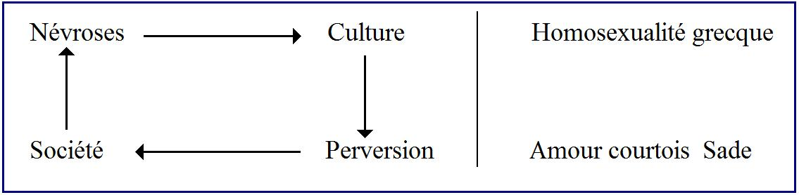
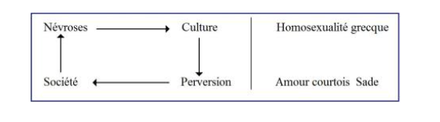

# Leçon 02 | 23 Novembre 1960

  

    <label><input type="checkbox" data-lacan-toggle="original" checked> 原文</label>
    <label><input type="checkbox" data-lacan-toggle="notes" checked> 注释</label>
    <label><input type="checkbox" data-lacan-toggle="commentary" checked> 个人解读评论</label>
  

  <form class="lacan-tool-search" role="search">
    <input class="lacan-tool-search-input" type="search" placeholder="搜索全文" aria-label="搜索全文">
    <button class="lacan-tool-button" type="submit" title="搜索">搜索</button>
  </form>
  <button class="lacan-tool-button lacan-back-to-top" type="button" title="回到页面最上方" aria-label="回到页面最上方">↑</button>

<section class="parallel-paragraph" data-paragraph-ids="s8-02-0001">

s8-02-0001

原文 · s8-02-0001

Il s’agit aujourd’hui d’entrer dans l’examen du [*Banquet*](http://remacle.org/bloodwolf/philosophes/platon/cousin/banquet.htm). C’est tout au moins ce que je vous ai promis la dernière fois. Ce que je vous ai dit la dernière fois semble vous être parvenu avec des sorts divers. Les dégustateurs dégustent. Ils se disent : l’année sera-t-elle bonne ? Simplement j’aimerais qu’on ne s’arrête pas trop à ce qui peut apparaître d’*approximatif* dans certaines des touches d’où j’essaie d’éclairer notre chemin.

今天，我们的任务是进入对《会饮篇》的考察。这至少是我上次向你们许下的承诺。我上次对你们所说的那些话，似乎以种种不同的命运抵达了你们那里。品鉴者们正在品鉴。他们在自问：这一年（的情况）会好吗？我只是希望，人们不要过分纠结于在我用以照亮我们道路的某些笔触中，可能显现出的某种近似、未尽精确的地方。

</section>

<section class="parallel-paragraph" data-paragraph-ids="s8-02-0002">

s8-02-0002

原文 · s8-02-0002

J’ai essayé la dernière fois de vous montrer les portants de la scène dans laquelle va prendre place ce que nous avons à dire concernant le transfert. Il est bien certain que la référence au corps, et nommément à ce qui peut *l’affecter de l’ordre de la beauté*, n’était pas simplement l’occasion de *faire de l’esprit* autour de la référence transférentielle.

上一次，我曾试图向你们展示这一舞台的支撑为何物，关于转移我们所要说的内容将在此舞台中就位。可以肯定的是，对身体的指涉，尤其是对美的阶次中可能影响身体之物的指涉，绝非仅仅是为了围绕转移指涉而抖机灵。

</section>

<section class="parallel-paragraph" data-paragraph-ids="s8-02-0003">

s8-02-0003

原文 · s8-02-0003

On m’objecte à l’occasion qu’il arrive au cinéma - que j’ai pris comme exemple de l’appréhension comme concernant l’aspect du psychanalyste - quelquefois que le psychanalyste est *un beau garçon* et pas seulement dans le cas exceptionnel que j’ai signalé. Il convient de voir que c’est précisément au moment où au cinéma, *l’analyse* est prise comme *prétexte à la comédie*. Bref, vous allez voir que les principales références auxquelles je me suis référé la dernière fois trouvent leur justification dans la voie où nous allons avoir aujourd’hui à nous conduire.

人们偶尔向我提出反对意见，说在电影中——我曾将其作为关于精神分析师相貌之领会的例子——也会出现这样的情况：精神分析师是个美男子，而且并不只是在我曾指出的那个例外情形里才如此。   
应当看到，这恰恰发生在电影将分析当作喜剧的借口来处理的时候。总之，你们将看到，我上次提到的那些主要参考资料，都将会在我们今天将要循之而行的这条道路上，找到其正当性。

</section>

<section class="parallel-paragraph" data-paragraph-ids="s8-02-0004">

s8-02-0004

原文 · s8-02-0004

Pour rapporter ce qu’il en est du *Banquet* ça n’est pas commode, étant donné le style et les limites qui nous sont imposées par notre place, notre *objet particulier* qui - ne l’oublions pas - est particulièrement celui de l’expérience analytique. Se mettre à faire un commentaire en bon ordre de ce texte extraordinaire, c’est peut-être nous forcer à un bien long détour qui ne nous laisserait plus ensuite assez de temps pour d’autres parties du *champ*, étant donné que nous choisissons *Le Banquet* *dans la mesure* où il nous a semblé y être une *introduction* particulièrement illuminante de notre étude.

转述《会饮篇》的情况并非易事，考虑到我们的位置所强加给我们的风格和限制，以及我们的特殊对象——请不要忘记——特别是处于分析经验的对象。着手对这一非凡文本进行井然有序的评论，或许会迫使我们绕一个很长的弯，这随后将使我们没有足够的时间处理该领域的其他部分，考虑到我们选择《会饮篇》，是因为在我们看来，它是我们研究的一个特别具有启发性的导言 。

</section>

<section class="parallel-paragraph" data-paragraph-ids="s8-02-0005">

s8-02-0005

原文 · s8-02-0005

Donc il va nous falloir procéder selon une forme qui n’est évidemment pas celle qui serait d’un commentaire - disons universitaire - du *Banquet*. D’autre part, bien sûr je suis forcé de supposer qu’au moins une part d’entre vous ne sont pas vraiment initiés à la dialectique platonicienne. Je ne vous dis pas que moi-même je me considère à cet égard comme absolument armé. Néanmoins j’en ai quand même assez d’expérience, assez d’idées pour croire que je peux me permettre d’isoler, de concentrer les projecteurs sur le *Banquet* en respectant tout un arrière-plan.

因此，我们将不得不按照一种显然不会是对《会饮篇》进行评论的形式来进行——姑且称之为学院式的。   
另一方面，我当然不得不假设你们中至少有一部分人并未真正入门柏拉图式的辩证法。我并不是说在这方面我自认为已经武装到了牙齿（绝对精通）。尽管如此，我还是有足够的经验和想法，相信自己可以允许自己将《会饮篇》独立出来，将聚光灯集中于其上，同时尊重其整体背景。

</section>

<section class="parallel-paragraph" data-paragraph-ids="s8-02-0006">

s8-02-0006

原文 · s8-02-0006

Je prie d’ailleurs ceux qui sont en état de le faire, à l’occasion de me contrôler, de me faire observer ce que peut avoir, non pas d’arbitraire - il est forcément arbitraire cet éclairage - mais dans son arbitraire, ce qu’il pourrait avoir de *forcé* et de *décentrant*. D’autre part je ne déteste pas - et je crois même qu’il faut - mettre en relief un *je ne sais quoi* de cru, de neuf, dans l’abord d’un texte comme celui du *Banquet*. C’est pour ça que vous m’excuserez de vous le *présenter* sous une forme d’abord, un peu paradoxale ou qui vous semblera peut-être telle.

此外，我恳请那些有能力做到这一点的人，在适当时机对我进行审视，让我注意到这种解读视角中可能存在的——这并非由于其随意性，因为这种切入角度必然是随意的——而是在这种随意性中，它可能带有的那种强加的和去中心化的成分。   
另一方面，我并不排斥——我甚至认为很有必要——在处理像《会饮篇》这样的文本时，凸显出某种我说不清的粗粝、新鲜的东西。正因如此，请原谅我首先以一种略显悖论的形式，或者在你们看来可能是悖论的形式，将它呈现给你们。

</section>

<section class="parallel-paragraph" data-paragraph-ids="s8-02-0007">

s8-02-0007

原文 · s8-02-0007

Il me semble que quelqu’un qui lit *Le Banquet* pour la première fois, s’il n’est pas absolument obnubilé par le fait que c’est un texte d’une tradition respectable, ne peut pas manquer d’éprouver ce sentiment qu’on doit appeler à peu près : « *être soufflé* ». Je dirai plus : s’il a un peu *d’imagination historique,* il me semble qu’il doit se demander comment une pareille chose a pu nous être conservée à travers ce que j’appellerai volontiers *les générations de grimauds, de moines*, de gens dont il ne semble pas qu’ils étaient par destination faits pour nous transmettre quelque chose, quelque chose dont il me semble qu’il ne peut manquer de nous frapper - au moins par une de ses parties : par sa fin - que ça se rattache plutôt, pourquoi ne pas le dire, à ce qu’on appelle de nos jours « *une littérature spéciale* », une littérature qui peut faire l’objet, qui peut tomber sous le coup des perquisitions de la police.

在我看来，任何第一次阅读《会饮篇》的人，如果他不是完全被该文本属于受人尊敬的传统这一事实所迷惑的话，都必然会产生一种大约可被称为“目瞪口呆”的情绪 。我会进一步说：如果他稍具历史想象力，在我看来，他必然会自问，像这样一个东西是如何通过那些我乐于称之为一代代的老学究（grimauds）、修士、以及那些从上看似乎并非是为了向我们传递某种东西的人而被保存下来的。在我看来，有一点是不可能不令我们感到震惊的——至少是在该文本的某一部分，即其结尾部分——即，为什么不直说呢，它更倾向于联系着我们如今称之为“特殊文学”的东西，一种可能遭到警察搜查的文学 。

> 拉康这里在暗示，正是因为这些“学究”和“僧侣”未能察觉文本中颠覆性的欲望结构，《会饮篇》才得以在他们的眼皮底下得以幸存。   
> 事实上我得知《会饮篇》正是在年下、师生、同性、禁忌之爱这样耸动的推荐下去阅读的。

</section>

<section class="parallel-paragraph" data-paragraph-ids="s8-02-0008 s8-02-0009">

s8-02-0008, s8-02-0009

原文 · s8-02-0008, s8-02-0009

À vrai dire si vous savez simplement lire...

> il me semble qu’on peut parler d’autant plus volontiers que je crois, qu’*une fois n’est pas coutume*, pas mal d’entre vous, à la suite de mon annonce de la dernière fois, ont fait l’acquisition de cet ouvrage et donc ont dû y mettre leur nez ...vous ne pouvez pas manquer d’être saisis par ce qui se passe dans la deuxième partie, au moins, de ce discours entre ALCIBIADE et SOCRATE.

说实话，只要你们真的会读书……我之所以觉得可以谈得更有兴致，是因为我相信——这种事并不多见——你们当中的不少人，在听了我上次的预告后，已经购买了这部著作，因此想必已经读进去了……你们必然会被这段对话的至少是第二部分——即阿尔西比亚德（ALCIBIADE）与苏格拉底（SOCRATE）之间的谈话——所发生的事情所震撼。

</section>

<section class="parallel-paragraph" data-paragraph-ids="s8-02-0010">

s8-02-0010

原文 · s8-02-0010

En dehors des limites de ce qu’est *le banquet* lui-même, en tant que nous verrons tout à l’heure que c’est une *cérémonie* avec *des règles*, une sorte de *rite*, de *concours* intime entre gens de l’*élite*, de *jeu de société,* ce jeu de société, ce Συμπόσιον \[symposion\] nous voyons que ce n’est pas un prétexte au dialogue de PLATON, cela se réfère à des mœurs, à des coutumes, réglées diversement selon les localités de la Grèce, *le niveau de culture* dirions-nous, et ça n’est pas quelque chose d’exceptionnel que le règlement qui y est imposé \[[194d](http://remacle.org/bloodwolf/philosophes/platon/cousin/banquet.htm)\][^13] : que chacun y apporte son *écot* sous la forme d’une petite contribution, d’un *discours* réglé sur un sujet. Néanmoins il y a quelque chose qui n’est pas prévu. Il y a, si l’on peut dire, un désordre.

在会饮（banquet）本身的界限之外——鉴于我们稍后将看到，这是一场带有规则的仪式，一种礼仪，一种精英阶层之间的私密竞赛，一种社交游戏（jeu de société）——这种社交游戏，即 Συμπόσιον［会饮］，我们看到它并非柏拉图对话录的一个借口，它指涉的是习俗和风俗，根据希腊各地的不同、以及我们所谓的文化水平进行不同的调节，而且其所施加的规定［194d］【注】也并非什么例外之事：即每个人都以一种微薄贡献（écot）的形式提供他的份额，即针对某一主题的规范演说 。尽管如此，还是发生了一些未曾预料到的事情 。存在着，可以这么说，一种失序 。

> 插在方括号中的数字，如 [194d]，是指向《会饮》的亨利·埃斯蒂安版分页。

> 这里引用商务印书馆出版的《会饮篇》[194d]：听到这里，裴卓就插进来说：“亲爱的阿伽通啊，要是你只管回答苏格拉底的问题，他就会没完没了，完全不管我们今天计划做的事有什么结果。只要找到一个对话人，他就会和他辩论到底，尤其是在对话人是一个美少年的时候。我自己倒是爱听苏格拉底辩论，不过我今天负责照管对爱神的颂辞，在听过你们各位的话之后，还要听他的。请你们先把欠爱神的这笔账还清了，然后在进行你们的辩论吧”

</section>

<section class="parallel-paragraph" data-paragraph-ids="s8-02-0011">

s8-02-0011

原文 · s8-02-0011

Les règles ont même été données au début du *Banquet*  qu’on n’y boira pas trop. Sans doute le prétexte est que la plupart des gens qui sont là ont déjà un fort mal aux cheveux pour avoir un peu trop bu la veille. On se rend compte aussi de l’importance du caractère sérieux du groupe d’élite que composent pour ce soir là les co-buveurs.

在会饮开始时甚至定下了规矩，即大家不要喝得太多 。毫无疑问，借口是这里的多数人因为前一天喝得有点多，已经感到剧烈的头痛。我们也由此意识到，当晚组成的这些共饮者精英团体所具有的严肃性质的重要性 。

</section>

<section class="parallel-paragraph" data-paragraph-ids="s8-02-0012">

s8-02-0012

原文 · s8-02-0012

Ce qui n’empêche pas qu’à un moment - *qui est un moment où tout n’est pas fini, loin de là -* un des convives qui est ARISTOPHANE a quelque chose à faire remarquer, de l’ordre d’une rectification à l’ordre du jour, ou d’une demande d’explication. À ce moment là entre un groupe de gens - eux *complètement ivres* - à savoir ALCIBIADE, et ses compagnons.

但这并不妨碍在某一时刻——这是一个一切尚未结束、远未结束的时刻——宾客之一，即阿里斯托芬（ARISTOPHANE），有些意见要发表，其性质属于对议程的某种修正，或者说，属于一种要求作出解释的请求。就在那一时刻，一群人闯了进来——他们完全的彻底的喝醉了——即阿尔西比亚德（ALCIBIADE）及其同伴 。

</section>

<section class="parallel-paragraph" data-paragraph-ids="s8-02-0013">

s8-02-0013

原文 · s8-02-0013

Et ALCIBIADE - plutôt « *en l’air* » - usurpe la présidence et commence à tenir des propos qui sont exactement ceux dont j’entends vous faire valoir *le caractère scandaleux*. Évidemment ceci suppose que nous nous faisons une certaine idée de ce qu’est ALCIBIADE, de ce que c’est que SOCRATE, et ceci nous amène loin. Tout de même je voudrais que vous vous rendiez compte de ce que c’est qu’ALCIBIADE.

而且阿尔西比亚德（ALCIBIADE）——更像是处于一种“飘飘然”的状态——篡夺了主席的位置，并开始发表那些言论，而我正打算向你们强调这些言论的<strong>不折不扣的丑闻性质</strong>。   
显然，这假定我们对阿尔西比亚德是谁、苏格拉底是谁已经有了一定的了解，而这会将我们引向很远。尽管如此，我仍希望你们能意识到阿尔西比亚德究竟是一个什么样的人物 。

</section>

<section class="parallel-paragraph" data-paragraph-ids="s8-02-0014">

s8-02-0014

原文 · s8-02-0014

Comme ça, pour l’usage courant, lisez dans *[Les vies des hommes illustres](http://remacle.org/bloodwolf/historiens/Plutarque/alcibiade.htm)* [^14] ce que PLUTARQUE en écrit, ceci pour vous rendre compte du format du personnage. Je sais bien là encore il faudra que *vous fassiez un effort*. Cette vie nous est décrite par PLUTARQUE dans ce que j’appellerai l’atmosphère alexandrine, c’est à savoir d’un drôle de moment de l’histoire, où tout des personnages semble passer à l’état d’une sorte d’*ombre*. Je parle de l’accent moral de ce qui nous vient de cette époque qui participe d’une sorte de *sortie des ombres*, une sorte de νέκυια \[nékuia\][^15] comme on dit dans l’*Odyssée*.

就这样，为了日常参考，请阅读《名士传》【注】中普鲁塔克对其人的记述，借此来衡量这个人物的分量。我很清楚，在此处你们仍需做一番努力。普鲁塔克在一种我称之为“亚历山大式氛围”中描述了这段生平，也就是说，那是历史的一个古怪时刻，在那里，所有人似乎都进入了一种阴影的状态。我所说的是来自那一时代的道德语调，它参与了某种从阴影中浮现，某种如《奥德赛》中所说的“死灵召唤”（νέκυια/nékuia）【注】。

> 【注】普鲁塔克：《阿尔西比亚德》，载于《希腊罗马名士传》，巴黎，佳文出版社（Les Belles Lettres），第111页，1964年 。  
> 【注】Nekuía：死灵召唤（招魂术），即通过召唤死者来预知未来，这是《奥德赛》第十一卷的标题 。

</section>

<section class="parallel-paragraph" data-paragraph-ids="s8-02-0015">

s8-02-0015

原文 · s8-02-0015

La fabrication d’hommes de PLUTARQUE, avec ce qu’ils ont d’ailleurs comporté de modèle, de paradigme, pour toute une tradition moraliste qui a suivi, ont ce je ne sais quoi qui nous fait penser à l’être des zombies : c’est difficile d’y faire couler à nouveau un sang véritable.

普鲁塔克对那些人的塑造，以及他们为随后的整个道德主义传统所提供的模范与范式，都带有某种让我们联想到“僵尸”的存在：很难让真实的血液在其中再次流动 。

</section>

<section class="parallel-paragraph" data-paragraph-ids="s8-02-0016 s8-02-0017">

s8-02-0016, s8-02-0017

原文 · s8-02-0016, s8-02-0017

Mais tâchez de vous imaginer à partir de cette singulière carrière que nous trace PLUTARQUE, ce qu’a pu être cet homme, cet homme venant là, devant SOCRATE...

SOCRATE *qui ailleurs déclare avoir été* πρῶτος ἐραστής \[prôtos erastès\] *le premier qui l’a aimé* [^16] *lui,* ALCIBIADE ...cet ALCIBIADE qui d’autre part est une sorte de pré-ALEXANDRE, personnage dont sans aucun doute *les aventures* *de politique* sont toutes marquées du signe du défi, de l’extraordinaire tour de force, de l’incapacité de *se situer* ni de *s’arrêter* nulle part, et partout où il passe renversant la situation et faisant passer la victoire d’un camp à l’autre partout où il se promène, mais partout *pourchassé*, *exilé*, et - il faut bien le dire - en raison de ses méfaits.

可是，请根据普鲁塔克为我们勾勒出的那段非凡历程，试着想象一下这个男人究竟可能是什么样的人，这样一个男人就在苏格拉底面前……——苏格拉底在别处声称，自己曾是阿尔西比亚德的 πρῶτος ἐραστής［第一爱者］【注】……——这个阿尔西比亚德，在另一方面，又是一种“准亚历山大大帝”式的人物，他的政治冒险无疑全都打上了挑战、超凡绝技以及一种既无法给自己定位、又无法在任何地方停下来的无能为力的标记。他所到之处无不扭转局势，在他游历的每个角落将胜利从一个阵营转手给另一个阵营，但他又到处被追捕、被流放，而且——必须直言——这是由于他的累累恶行。

> 【注】 柏拉图：《阿尔西比亚德篇》（103a）。

</section>

<section class="parallel-paragraph" data-paragraph-ids="s8-02-0018">

s8-02-0018

原文 · s8-02-0018

Il semble que si Athènes a perdu la guerre du Péloponnèse, c’est pour autant qu’elle a éprouvé le besoin de rappeler ALCIBIADE en plein cours des hostilités pour lui faire rendre compte d’une obscure histoire, celle dite de « *la mutilation des Hermès* », qui nous parait aussi *inexplicable* que *farfelue* avec le recul du temps, mais qui comportait sûrement dans son fond un *caractère de profanation*, à proprement parler d’injure aux dieux.

看来，如果说雅典输掉了伯罗奔尼撒战争，那正是因为它觉得有必要在战事正酣之际召回阿尔西比亚德，好让他为一桩扑朔迷离的往事做出交代，即所谓的“赫尔墨斯神像毁坏案” 。随着时间的推移，这桩往事在我们看来既不可思议又荒诞不经，但在其深层，它肯定包含着一种亵渎的性质，严格来说，是对神明的侮辱 。

</section>

<section class="parallel-paragraph" data-paragraph-ids="s8-02-0019">

s8-02-0019

原文 · s8-02-0019

Nous ne pouvons pas non plus absolument tenir la mémoire d’ALCIBIADE et de ses compagnons pour quitte. Je veux dire que ce n’est sans doute pas sans raisons que le peuple d’Athènes lui en a demandé compte. Dans cette sorte de pratique, évocatrice par *analogie*, de je ne sais quelle messe noire, nous ne pouvons pas ne pas voir sur quel fond d’*insurrection*, de *subversion* par rapport aux lois de la cité, surgît un personnage comme celui d’ALCIBIADE.

我们也同样不能绝对地认为阿尔西比亚德及其同伴的名声已然清白 。我的意思是，雅典人民要求他为此做出交代，这无疑并非毫无缘由。在这种通过类比让人联想到某种“黑色弥撒”的实践中，我们不能不看到，像阿尔西比亚德这样的人物，是在何种针对城邦法律的反叛与颠覆的背景之下浮现的 。

</section>

<section class="parallel-paragraph" data-paragraph-ids="s8-02-0020">

s8-02-0020

原文 · s8-02-0020

Un fond de rupture, de mépris des formes et des traditions, des lois, sans doute de la religion même. C’est bien là ce qu’un personnage traîne après lui d’inquiétant. Il ne traîne pas moins une séduction très singulière partout où il passe. Et après cette requête du peuple athénien, il passe ni plus ni moins à l’ennemi, à Sparte, à cette Sparte d’ailleurs dont il \[Alcibiade\] n’est pas pour rien qu’elle soit l’*ennemie* d’Athènes, puisque préalablement, il a tout fait pour faire échouer en somme, les négociations de concorde.

一种断裂、一种对形式与传统、对法律、无疑甚至是对宗教本身之蔑视的背景。这正是一个人物身后所拖曳着的令人不安的东西。
他在所到之处也同样拖曳着一种极度奇异的诱惑力。而在雅典人民的这项诉求［召回受审］之后，他简直就是径直投向了敌人，投向了斯巴达——此外，斯巴达之所以成为雅典的死敌，他［阿尔西比亚德］也并非全然无关，因为此前他已竭尽所能，归根到底，就是为了使那些和解谈判归于失败。

</section>

<section class="parallel-paragraph" data-paragraph-ids="s8-02-0021">

s8-02-0021

原文 · s8-02-0021

Voilà qu’il passe à Sparte et ne trouve tout de suite rien de mieux, de plus digne de sa mémoire, que de faire un enfant à la reine, au vu et au su de tous. Il se trouve qu’on sait fort bien que le roi AGIS ne couche pas depuis dix mois avec sa femme pour des raisons que je vous passe. Elle a un enfant, et aussi bien ALCIBIADE dira : « *au reste, ce n’est pas par plaisir que j’ai fait ça, c’est parce qu’il m’a semblé digne de moi d’assurer un trône à ma descendance, d’honorer par là le trône de Sparte de quelqu’un de ma race*[^17] ». Ces sortes de choses, on le conçoit, peuvent captiver un certain temps, elles se pardonnent mal. Et bien sûr vous savez qu’ALCIBIADE, après avoir apporté ce présent et quelques idées ingénieuses à la conduite des hostilités, va porter ses quartiers ailleurs.

瞧，他投奔了斯巴达，紧接着就发现没别的事比给王后留下一个孩子更妙、更能不辱没他的名声了，而且这事儿搞得众所周知 。
凑巧的是，大家都很清楚阿吉斯（AGIS）王已经有十个月没和他的妻子同床了，理由我就不向各位细说了。她生下了一个孩子，而阿尔西比亚德竟然也会这样说道：“此外，我做这事并非为了享乐，而是因为在我看来，让我的后裔得以继承荣耀斯巴达的王座，这才配得上我。借此，也就是让斯巴达的王位因一位出自我这一血统的人而获得荣耀。”
我们可以理解，这类事情固然能吸引一阵子眼球，却极难获得宽恕 。当然，你们也知道，阿尔西比亚德在送出这份“厚礼”并为战事的指挥贡献了一些天才主意之后，又会把自己的驻地迁往别处。

</section>

<section class="parallel-paragraph" data-paragraph-ids="s8-02-0022">

s8-02-0022

原文 · s8-02-0022

Il ne manque pas de le faire dans *le troisième camp*, dans le camp *des Perses*, dans celui *qui représente le pouvoir du roi de Perse* en Asie Mineure, à savoir TISSAPHERNE qui - nous dit PLUTARQUE - *n’aime guère les Grecs* [^18]. Il les déteste à proprement parler, mais il est séduit par ALCIBIADE. C’est à partir de là qu’ALCIBIADE va s’employer à retrouver la fortune d’Athènes.

他也没错过在第三个阵营中故技重施，即在波斯人的阵营里，在那个代表波斯国王在小亚细亚权力的阵营中——也就是说，在那位据普鲁塔克所言并不怎么喜欢希腊人的提萨斐尼那里。
严格来说，提萨斐尼甚至憎恨希腊人，但他却被阿尔西比亚德所诱惑（séduit） 。正是在那儿，阿尔西比亚德开始致力于挽回雅典的命运 。

</section>

<section class="parallel-paragraph" data-paragraph-ids="s8-02-0023">

s8-02-0023

原文 · s8-02-0023

Il le fait à travers des conditions dont l’histoire bien sûr, est également fort surprenante puisqu’il *semble* que ce soit vraiment au milieu d’une sorte de réseau d’agents doubles, d’une *trahison* permanente : tout ce qu’il donne comme avertissements aux Athéniens est immédiatement à travers un circuit rapporté à Sparte et aux Perses eux-mêmes qui le font savoir à celui nommément de la flotte athénienne qui a passé le renseignement, de sorte qu’à la fois il se trouve à son tour savoir, être informé, qu’on sait parfaitement en haut lieu qu’il a trahi. Ces personnages se *débrouillent* chacun comme ils peuvent.

他通过这样一些条件来做到这一点，当然，这段历史同样非常令人惊讶，因为他似乎真的置身于某种双重间谍网络之中，置身于一种永久的背叛中：他给雅典人提供的所有警告，都会立即通过一个回路报告给斯巴达人和波斯人自己；而波斯人自己又把这件事告知那位——明确说来，就是雅典舰队中那位递送了情报的人——以致他反过来同时发现自己也知道了、也被通知了：上层方面完全知道他已经背叛了。这些人物各自尽其所能。

> 这里有点像《失窃的信》，知道对方知道，以及知道你知道我知道。  
> 他“知道别人知道他背叛”这一事实——并且对于这一事实别人理因也知道。

</section>

<section class="parallel-paragraph" data-paragraph-ids="s8-02-0024">

s8-02-0024

原文 · s8-02-0024

Il est certain qu’au milieu de tout cela ALCIBIADE redresse la fortune d’Athènes. À la suite de cela, sans que nous puissions être absolument sûrs des détails, selon la façon dont les historiens antiques le rapportent, il ne faut pas s’étonner si ALCIBIADE revient à Athènes avec ce que nous pourrions appeler les marques d’un triomphe hors de tous les usages, qui - malgré la joie du peuple athénien - va être le commencement d’un retour de l’opinion. Nous nous trouvons en présence de quelqu’un qui ne peut manquer à chaque instant de provoquer ce qu’on peut appeler l’opinion.

确定的是，在这一切政治斡旋之中，阿尔西比亚德重振了雅典的运势 。随之而来的，尽管我们无法完全确定其细节——正如古代历史学家所记载的那样——但如果阿尔西比亚德带着我们可以称之为异乎寻常的凯旋标志回到雅典，也并不令人惊讶。而这种凯旋——尽管雅典人民感到喜悦——将成为舆论反转的开始 。我们面对的是这样一个人，他无时无刻不在煽动所谓的舆论 。

</section>

<section class="parallel-paragraph" data-paragraph-ids="s8-02-0025">

s8-02-0025

原文 · s8-02-0025

Sa mort est une chose bien étrange elle aussi. Les obscurités planent sur qui en est le responsable. Ce qui est certain c’est qu’il semble, qu’après une suite de *renversements* de sa fortune, de *retournements*, tous plus étonnants les uns que les autres - mais il semble qu’en tout cas, quelles que soient les difficultés où il se mette, il ne puisse jamais être abattu - une sorte d’immense concours de haines va aboutir à en finir avec ALCIBIADE par des procédés qui sont ceux dont la légende, le mythe, disent qu’il faut user avec le scorpion : on l’entoure d’un cercle de feu dont il s’échappe et c’est de loin à coups de javelines et de flèches qu’il faut l’abattre.

他的死亡同样是一件极其奇异（étrange）的事情。关于谁应为此负责，仍笼罩在重重迷雾之中。确定的是，似乎在经历了一系列命运的沉浮与反转——每一个都比前一个更令人惊讶——之后（但无论他陷入怎样的困境，他似乎都从未被击倒），一种巨大的、广泛汇聚的仇恨最终还是要把阿尔西比亚德置于死地。所采用的手段正如同传说和神话中所说的对付蝎子的方法：人们用一圈火围住它，在它试图逃脱时，必须从远处用标枪和箭将其射杀。

</section>

<section class="parallel-paragraph" data-paragraph-ids="s8-02-0026">

s8-02-0026

原文 · s8-02-0026

Telle est la carrière singulière d’ALCIBIADE. Si je vous ai fait apparaître le niveau d’une puissance, d’une pénétration d’esprit fort active, exceptionnelle, je dirai que le trait le plus saillant est encore ce reflet qu’y ajoute ce qu’on dit de la beauté non seulement précoce de l’enfant ALCIBIADE - que nous savons tout à fait liée à l’histoire du mode d’amour régnant alors en Grèce à savoir, de l’amour des enfants - mais cette beauté longtemps conservée qui fait que dans un âge avancé elle fait de lui quelqu’un qui séduit autant par sa forme que par *son exceptionnelle intelligence*. Tel est le personnage.

这就是阿尔西比亚德不同寻常的一生。如果我向你们展示了某种力量的水平，某种极其活跃、卓越的思维洞察力，那么我还要说，其中最醒目的特征，仍然是由人们关于他的美貌所增添上的那一道光环：美貌，即人们所说的阿尔西比亚德不仅在孩童时期就早熟的美貌——我们知道，这完全与当时希腊盛行的爱的方式有关，即对孩童之爱（少年爱）。
——而且这种美貌保持了很久，以至于在他到了相当高的年龄时，他成为一个无论在外形上还是在卓越才智上都同样迷人的人。这个人就是如此。

</section>

<section class="parallel-paragraph" data-paragraph-ids="s8-02-0027">

s8-02-0027

原文 · s8-02-0027

Et nous le voyons dans un concours qui réunit en somme des hommes savants, graves - encore que dans ce contexte d’amour grec sur lequel nous allons mettre l’accent tout à l’heure qui apporte déjà un fond d’érotisme permanent sur lequel ces discours sur l’amour se détachent - nous le voyons donc qui vient raconter à tout le monde quelque chose que nous pouvons résumer à peu près en ces termes : à savoir les vains efforts qu’il a fait en son jeune temps - au temps où SOCRATE l’aimait - pour amener SOCRATE à le baiser.

我们看到他置身于一场竞赛之中，这场竞赛总括而言聚集了一些博学而严肃的人——尽管在希腊式爱情的背景下（我们稍后将对此进行重点强调，它已经提供了一种持久性的情欲底色，关于爱情的演说正是从这一底色中脱颖而出）——我们因此看到他走来，向所有人讲述了某件我们可以大致用以下措辞来概括的事情：即在他年轻时——在苏格拉底爱他的那个时代——为了诱使苏格拉底去<strong>睡他</strong>所付出的徒劳努力 。

</section>

<section class="parallel-paragraph" data-paragraph-ids="s8-02-0028">

s8-02-0028

原文 · s8-02-0028

Ceci est développé longuement avec des détails, et avec en somme une très grande crudité de termes. Il n’est pas douteux qu’il ait amené SOCRATE *à perdre son contrôle*, à manifester son trouble, à céder à des invites corporelles et directes, à une *approche physique*. Et c’est ceci qui publiquement est rapporté, par un homme ivre sans doute, *mais un homme ivre dont* PLATON *ne dédaigne pas de nous rapporter dans toute leur étendue les propos*. Je ne sais pas si je me fais bien entendre : imaginez un livre qui paraîtrait, je ne dis pas de nos jours, car ceci paraît environ une cinquantaine d’années après la scène qui est rapportée, PLATON le fait paraître à cette distance. Supposez que dans un certain temps - pour ménager les choses - un personnage qui serait, disons M. KENNEDY - dans *un bouquin* fait pour l’élite - KENNEDY qui aurait été en même temps James DEAN, vienne raconter comment il a tout fait au temps de son université pour se faire faire l’amour par - disons une espèce de prof - je vous laisse le soin, au choix, d’un personnage.

这被详尽地展开，伴随着种种细节，且总而言之，用语极其露骨。毫无疑问，他[阿尔西比亚德]使苏格拉底失去了控制，表现出他的慌乱（trouble），迫于身体上的直接诱惑，屈从于物理上的接近。
而这就是被公开讲述的内容，无疑是出自一个醉汉之口，但柏拉图并不轻慢，反而把它们完整地、充分地为我们记录下来。

</section>

<section class="parallel-paragraph" data-paragraph-ids="s8-02-0028">

s8-02-0028

原文 · s8-02-0028

Ceci est développé longuement avec des détails, et avec en somme une très grande crudité de termes. Il n’est pas douteux qu’il ait amené SOCRATE *à perdre son contrôle*, à manifester son trouble, à céder à des invites corporelles et directes, à une *approche physique*. Et c’est ceci qui publiquement est rapporté, par un homme ivre sans doute, *mais un homme ivre dont* PLATON *ne dédaigne pas de nous rapporter dans toute leur étendue les propos*. Je ne sais pas si je me fais bien entendre : imaginez un livre qui paraîtrait, je ne dis pas de nos jours, car ceci paraît environ une cinquantaine d’années après la scène qui est rapportée, PLATON le fait paraître à cette distance. Supposez que dans un certain temps - pour ménager les choses - un personnage qui serait, disons M. KENNEDY - dans *un bouquin* fait pour l’élite - KENNEDY qui aurait été en même temps James DEAN, vienne raconter comment il a tout fait au temps de son université pour se faire faire l’amour par - disons une espèce de prof - je vous laisse le soin, au choix, d’un personnage.

我不知道我是否表达清楚了：请设想有这样一本书出版了，我不是指在当今时代，因为这（柏拉图的著作）是在所讲述的场景发生大约五十年后问世的，柏拉图在这样的距离把它发表出来。假设在一段时间后——为了顾全大局把事情说得缓和一点——一个人物，比方说肯尼迪先生——在一本写给精英看的书中——这个肯尼迪同时还是詹姆斯·迪恩——过来讲述他在大学时代如何竭尽全力让——就说某个有点像教授的人——和他做爱；至于这个人物是谁，我把挑选人物的权力留给你们 。

> 顺便肯尼迪遇刺是1963年，此时研讨班是在1960年。

</section>

<section class="parallel-paragraph" data-paragraph-ids="s8-02-0029">

s8-02-0029

原文 · s8-02-0029

Il ne faudrait pas *absolument* le prendre dans le corps enseignant puisque SOCRATE n’était pas tout à fait un professeur. C’en était un tout de même d’un peu spécial. Imaginez que ce soit quelqu’un comme M. MASSIGNON et qui soit en même temps Henry MILLER. Cela ferait un certain effet. Cela amènerait au Jean-Jacques PAUVERT qui publierait cet ouvrage quelques ennuis.

不必非得在教师队伍中寻找这个人物，因为苏格拉底并不完全是一位教师。尽管如此，他终究还是其中一员，只是有点儿特别 。你们设想一下，如果某人既像马西尼翁（M. MASSIGNON）先生那样，同时又是亨利·米勒（Henry Miller）。这会产生某种效果 。这会给出版这部著作的让-雅克·博韦尔（Jean-Jacques PAUVERT）带来一些麻烦 。

> 让-雅克·博韦尔是法国著名的独立出版商，曾因出版萨德的作品而面临长期法律诉讼。毕竟拉康刚刚还在暗示《会饮篇》是“可能招致麻烦的特殊文学”。   
> 《会饮篇》 TAG:师生，年下，同性，神话，哲学

</section>

<section class="parallel-paragraph" data-paragraph-ids="s8-02-0030">

s8-02-0030

原文 · s8-02-0030

Rappelons ceci au moment où il s’agît de constater que cet *ouvrage étonnant* nous a été transmis à travers les siècles par les mains de ce que nous devons appeler à divers titres des *Frères* diversement *ignorantins* [^19], ce qui fait que nous en avons sans aucun doute *le texte complet*. Eh bien, c’est ce que je pensais, non sans une certaine admiration, en feuilletant cette admirable édition que nous en a donné Henri ESTIENNE avec une traduction latine. Et cette édition est quelque chose d’assez définitif pour qu’encore maintenant, dans toutes les éditions diversement savantes, critiques, elle soit déjà - celle là - parfaitement critique pour qu’on nous en donne la pagination.

当我们发觉这部令人惊叹的著作是经由那些我们基于各种名义必须称之为“各种蒙昧主义修士兄弟”之手历经数个世纪传承至今时，我在此需要指出这一点：正因如此，我们毫无疑问地拥有了它的完整文本。   
嗯，这正是我翻阅亨利·埃斯蒂安（Henri ESTIENNE）提供给我们的那部带有拉丁语译文的精彩版本时，不无某种赞赏地想到的 。而且，这一版本是如此具有定本性质，以至于直到现在，在所有各种学术性的、校勘性的版本中，它——<strong>唯独它</strong>——已经如此完美地具有校勘性，以至于人们仍沿用其页码标注。

</section>

<section class="parallel-paragraph" data-paragraph-ids="s8-02-0031">

s8-02-0031

原文 · s8-02-0031

Pour ceux qui entrent là un peu neufs, sachez que les petits \[272a\] ou autres, par lesquels vous voyez notées les pages auxquelles il convient de se reporter, c’est seulement la pagination [Henri ESTIENNE(1578)](http://fr.wikipedia.org/wiki/Henri_Estienne). Henri ESTIENNE n’était certainement pas un *ignorantin*, mais on a peine à croire que quelqu’un qui est capable - il n’a pas fait que cela - de se consacrer à mettre debout des éditions aussi monumentales, ait eu une ouverture sur la vie telle qu’elle puisse pleinement appréhender le contenu de ce qu’il y a dans ce texte, je veux dire en tant que c’est éminemment un texte sur l’amour.

对于那些初来乍到的人，请知晓，你们所见的诸如[272a]之类标注了参考页码的小记号，仅仅是亨利·埃斯蒂安（Henri ESTIENNE，1578年版）的页码标注 。亨利·埃斯蒂安当然不是那种“蒙昧修士”（ignorantin），但人们很难相信，一个能够——而且他不只是做了这件事——全身心投入到编纂如此宏伟巨著的人，竟然会拥有一种足以完全领悟这篇文本内容的“生命视野”，我的意思是，鉴于这显而易见是一篇关于爱的文本 。

</section>

<section class="parallel-paragraph" data-paragraph-ids="s8-02-0032">

s8-02-0032

原文 · s8-02-0032

À la même époque - celle d’Henri ESTIENNE - d’autres personnes s’intéressaient à l’amour et je peux bien tout vous dire : quand je vous ai parlé l’année dernière longuement de la sublimation autour de l’amour de la femme, la main que je tenais dans l’invisible n’était pas celle de PLATON, ni de quelqu’un d’érudit, mais celle de Marguerite DE NAVARRE.

在同一时代——即亨利·埃斯蒂安（Henri ESTIENNE）的时代——还有其他人也对爱感兴趣，我可以如实告诉你们：去年，当我长篇大论地向你们谈论围绕着对女性之爱（l’amour de la femme）的升华（sublimation）时，我在无形中牵着的那只手，并不是柏拉图的手，也不是某位博学之士的手，而是玛格丽特·德·纳瓦尔（Marguerite DE NAVARRE）的手 。

> 玛格丽特·德·纳瓦尔（Marguerite DE NAVARRE）,文艺复兴时期法国贵族。她醉心于文化沙龙事业，同时亦为艺术家与作家大力提供赞助。

</section>

<section class="parallel-paragraph" data-paragraph-ids="s8-02-0033">

s8-02-0033

原文 · s8-02-0033

J’y ai fait allusion sans insister. Sachez que pour cette sorte de *banquet*, de Συμπόσιον \[symposion\] aussi qu’est son *[Heptaméron](http://gallica.bnf.fr/ark:/12148/bpt6k1014614)* [^20], elle a soigneusement exclu *ces sortes de personnages à ongles noirs* qui sortaient à l’époque - en rénovant le contenu - des bibliothèques. Elle ne veut que des cavaliers, des seigneurs, des personnages qui, parlant de l’amour, parlent de quelque chose qu’ils ont eu le temps de vivre. Et aussi bien dans tous les commentaires qui ont été donnés du *Banquet*, c’est bien de cette dimension, qui semble manquer bien souvent, que nous avons soif. Peu importe. Parmi ces gens qui ne doutent jamais que leur compréhension \- comme dit JASPERS - n’atteigne les limites du concret sensible, compréhensible, l’histoire d’ALCIBIADE et de SOCRATE a toujours été difficile à avaler. Je n’en veux pour témoin que ceci :

我曾提及此事而未加深究 。你们应当知道，对于像她的《七日谈》（Heptaméron）这样一种会饮（Symposion / Συμπόσιον）而言，她精心排除了那些在那个时代——通过翻新内容——从图书馆里钻出来的“黑指甲”类的人物 。她只想要骑士、领主，以及那些在谈论爱时，谈论的是他们曾有时间去亲身经历（vivre）之物的人物。   
同样，在所有关于《会饮篇》的评注中，我们所渴望的，恰恰是这种往往显得匮乏的维度 。无论如何 。在那些从不怀疑其理解——正如雅斯贝尔斯（JASPERS）所言——已达及感性具体与可理解之界限的人看来，阿尔西比亚德与苏格拉底的故事向来难以吞咽。对此，我只想以此为证：

</section>

<section class="parallel-paragraph" data-paragraph-ids="s8-02-0034">

s8-02-0034

原文 · s8-02-0034

\[1\] c’est que Louis LE ROY \[1559\], Ludovicus REJUS, qui est le premier *traducteur* en français de ces textes qui venaient d’émerger de l’Orient pour la culture occidentale, tout simplement s’est arrêté là : à l’entrée d’ALCIBIADE. Il n’a pas traduit après. Il lui a semblé qu’on avait fait d’assez beaux discours avant qu’ALCIBIADE rentre. Ce qui est bien le cas d’ailleurs. ALCIBIADE lui a paru quelque chose de surajouté, d’apocryphe, et il n’est pas le seul à se comporter ainsi. Je vous passe les détails.

[1] 就是路易·勒鲁瓦（Louis LE ROY，1559年），即路德维库斯·雷尤斯（Ludovicus REJUS），他是这些刚从东方涌向西方文化的文本的首位法语译者，他简简单单地就在那里停住了：在阿尔西比亚德登场的那一刻 。他在那之后就没再翻译了 。在他看来，在阿尔西比亚德进入之前，人们已经发表了足够漂亮的演说 。顺便提一下，事实也确实如此 。阿尔西比亚德对他来说似乎是某种额外添加的东西，是伪作（apocryphe），而且并非只有他一个人表现出这种态度 。细节我就略过不表了 。

</section>

<section class="parallel-paragraph" data-paragraph-ids="s8-02-0035">

s8-02-0035

原文 · s8-02-0035

\[2\] Mais RACINE un jour a reçu d’une dame[^21], qui s’était employée à *la traduction du* *Banquet,* un manuscrit pour le *revoir*. RACINE qui était un homme sensible a considéré cela comme intraduisible et pas seulement l’histoire d’ALCIBIADE, mais tout le *Banquet*. Nous avons ses notes qui nous prouvent qu’il a regardé de très près le manuscrit qui lui était envoyé \- mais pour ce qui est de le refaire, car il s’agissait de rien moins que de le refaire - il fallait quelqu’un comme RACINE pour traduire le grec, il a refusé. Très peu pour lui...

[2] 但有一天，拉辛（RACINE）从一位女士【注】那里收到了一份手稿，这位女士曾致力于《会饮篇》的翻译，希望他能审阅这份稿件 。拉辛作为一个感性（sensible）的人，认为它是不可翻译的（intraduisible），不仅是阿尔西比亚德的故事，而是整部《会饮篇》。我们拥有他的笔记，证明他曾非常仔细地审阅过寄给他的这份手稿——但至于重做，因为这涉及的无异于推倒重来——翻译希腊语需要像拉辛这样的人，但他拒绝了 。这对他来说太不合胃口了（Très peu pour lui）……

</section>

<section class="parallel-paragraph" data-paragraph-ids="s8-02-0036">

s8-02-0036

原文 · s8-02-0036

\[3\] Troisième référence. J’ai la chance d’avoir cueilli il y a bien longtemps, dans un coin, les notes manuscrites d’un cours de BROCHARD sur PLATON. C’est fort remarquable, ces notes sont *remarquablement prises*, l’écriture est exquise. À propos de la théorie de l’amour, BROCHARD bien sûr se réfère à tout ce qu’il convient : le *Lysis*, le *Phèdre*, le *Banquet*. C’est surtout le *Banquet*. Il y a un très joli jeu de substitution quand on arrive à l’affaire d’ALCIBIADE : il embraye, il aiguille les choses sur le *Phèdre,* qui à ce moment là prend le relais. L’histoire d’ALCIBIADE, il ne s’en charge pas. Cette réserve après tout mérite plutôt notre respect. Je veux dire que c’est tout au moins le sentiment qu’il y a là quelque chose qui fait question. Et nous aimons mieux cela que de le voir résolu par des hypothèses singulières qui ne sont pas rares à se faire jour.

[3] 第三个例证。我有幸在很久以前，于某个角落里拾得一份布罗夏尔（BROCHARD）关于柏拉图的一门课程的手写笔记。
这非常引人注目，这些笔记记录得极为出色，字迹精美绝伦 。关于爱的理论，布罗夏尔自然引用了所有恰当的内容：如《吕西斯篇》（Lysis）、《斐德罗篇》（Phèdre）以及《会饮篇》（Banquet）。    
尤其是《会饮篇》。然而，当讲到阿尔西比亚德（ALCIBIADE）的那件事时，出现了一个非常巧妙的替代游戏：他挂挡转向，将事情引向了《斐德罗篇》，由后者在此刻接替 。至于阿尔西比亚德的故事，他并不承揽 。   
这种保留毕竟更值得我们尊敬 。我的意思是，这至少说明人们感觉到此处存在着某些成问题的东西 。比起看到它被那些屡见不鲜的奇异假设所解决，我们更喜欢这种方式 。

</section>

<section class="parallel-paragraph" data-paragraph-ids="s8-02-0037">

s8-02-0037

原文 · s8-02-0037

La plus belle d’entre elles, je vous la donne en mille, M. Léon ROBIN s’y rallie - ce qui est étonnant - c’est que PLATON a voulu là, faire rendre justice à son maître. Les érudits ont découvert qu’un nomme POLYCRATE avait fait sortir un pamphlet quelques années après la mort de SOCRATE. Vous savez qu’il succomba sous diverses accusations, dont se firent les porteurs trois personnages dont un nommé ANYTUS. Un certain POLYCRATE aurait remis ça effectivement dans la bouche d’ANYTUS, un réquisitoire dont le corps principal aurait été constitué par le fait que SOCRATE serait responsable précisément de ce dont je vous ai parlé tout à l’heure, à savoir de ce qu’on peut appeler le scandale, le sillage de corruption : il aurait traîné toute sa vie après lui ALCIBIADE, avec le cortège de troubles sinon de catastrophes qu’il aurait entraîné avec lui.

其中最漂亮的一个（假说），我打赌你们绝对猜不到，莱昂·罗班（Léon ROBIN）先生竟然也赞同它——这真叫人惊讶——那就是：柏拉图在这里是想为他的老师讨回公道。
学者们发现，在苏格拉底死后几年，一个名叫波吕克拉底（POLYCRATE）的人发表了一篇小册子 。你们知道，苏格拉底死于各种指控，而这些指控是由三个人提出的，其中一人名叫阿尼图斯（ANYTUS）。
某位波吕克拉底实际上借阿尼图斯之口重新抛出了这些东西，那是一份公诉书，其核心内容在于指控苏格拉底正是我刚才对你们提到的那个事实的负责人，即所谓的丑闻、腐败的流毒：他一辈子都让阿尔西比亚德（ALCIBIADE）尾随其后，并伴随着这个年轻人所引发的一连串动乱，甚至可以说是灾难 。

</section>

<section class="parallel-paragraph" data-paragraph-ids="s8-02-0038">

s8-02-0038

原文 · s8-02-0038

Il faut avouer que l’idée que PLATON ait innocenté SOCRATE, ses mœurs, sinon son influence en nous le mettant en acte d’une scène de confession publique de ce caractère, c’est vraiment le pavé de l’ours. Il faut vraiment se demander à quoi rêvent les gens qui émettent de pareilles hypothèses. Que SOCRATE ait résisté aux entreprises d’ALCIBIADE, que ceci à soi tout seul puisse justifier ce morceau du *Banquet* comme quelque chose destiné à rehausser le sens de sa mission auprès de l’opinion publique, c’est quelque chose qui, quant à moi, ne peut pas manquer de me laisser pantois. Il faut tout de même bien que :

必须承认，那种认为柏拉图通过让我们看到这样一场具有公共忏悔性质的现场演说，从而为苏格拉底的品行、乃至其影响力洗清罪名的想法，简直是“狗熊的铺路石” (le pavé de l'ours) [意指帮倒忙的致命辩护]。人们实在该问问那些提出此类假设的人究竟在做什样的美梦。苏格拉底拒绝了阿尔西比亚德的勾引，光凭这一点就能证明《会饮篇》的这段文字是为了在公众舆论中提升他使命的意义，这种观点在我看来，不能不令我感到目瞪口呆 。无论如何，情况必然是：

</section>

<section class="parallel-paragraph" data-paragraph-ids="s8-02-0039 s8-02-0040 s8-02-0041">

s8-02-0039, s8-02-0040, s8-02-0041

原文 · s8-02-0039, s8-02-0040, s8-02-0041

- ou bien nous soyons devant *une séquelle* de raisons pour lesquelles PLATON ne nous avise guère,

- ou bien que ce morceau ait en effet sa *fonction*.

Je veux dire cette *irruption* du personnage, auquel en effet on peut conjoindre le personnage - d’un horizon plus éloigné sans doute - de SOCRATE, mais aussi qui lui est lié le plus indissolublement, pour que ce personnage s’amenant en chair et en os ait quelque chose qui a tout de même le plus étroit rapport avec ce dont il s’agît : la question de *l’amour*.

* 要么我们面对的是一连串柏拉图几乎未曾告知我们的理由；
* 要么这段文字确实有其功能；
  我指的是这个人物的突然闯入，通过他，人们确实可以将苏格拉底这个人物——尽管其背景无疑更为深远——联结起来，而且他与苏格拉底的联系最为不可分割；这个有血有肉的人物的现身，与此处所涉及的核心问题有着最密切的关系：即关于爱（l'amour）的问题 。

</section>

<section class="parallel-paragraph" data-paragraph-ids="s8-02-0042">

s8-02-0042

原文 · s8-02-0042

Alors pour voir ce qu’il en est, et c’est justement parce que ce qu’il en est, est justement le point autour duquel tourne tout ce dont il s’agît dans le *Banquet*, le point autour duquel va s’éclairer au plus profond non pas tellement la question de la nature de l’amour que la question qui ici nous intéresse, à savoir de son rapport avec le transfert. C’est à cause de cela que je fais porter la question sur *cette articulation entre le texte* qui nous est rapporté des discours prononcés dans le Συμπόσιον \[symposion\] *et l’irruption d’*ALCIBIADE.

那么，为了看清事实究竟如何，也正是因为事实之所在，恰恰是《会饮篇》中所涉及的一切事物围绕其旋转的支点，在这个点周围，将要得到最深刻阐明的不太像是关于爱的本质问题，而是这里让我们感兴趣的问题，即它与移情/转移的关系 。正是因为这个缘故，我才将问题落在这一项关联之上，即在传达给我们的《会饮篇》（Συμπόσιον）中所发表的那些言说（discours）文本，与阿尔西比亚德的闯入之间的关联 。

</section>

<section class="parallel-paragraph" data-paragraph-ids="s8-02-0043">

s8-02-0043

原文 · s8-02-0043

Là il faut que je vous brosse d’abord quelque chose concernant le sens de ces discours, le texte d’abord qui nous en est retransmis, le récit. Qu’est-ce que c’est en somme que ce texte ? Qu’estce que nous raconte PLATON ? D’abord on peut se le demander. Est-ce une *fiction, une fabrication*, comme manifestement beaucoup de *ses dialogues* qui sont des compositions *obéissant à certaines lois*, et Dieu sait, là-dessus, qu’il faudrait beaucoup en dire, pourquoi ce genre, pourquoi cette loi du dialogue ? Il faut bien que nous laissions des choses de coté. Je vous indique seulement qu’il y a là-dessus tout un pan de choses à connaître. Mais cela a tout de même un autre *caractère*, *caractère* d’ailleurs qui n’est pas tout à fait étranger au mode sous lequel nous sont montrés certains de *ces dialogues*.

这里我首先得给你们勾勒一点东西，关于这些言说的意义，首先是那份被转述给我们的文本，那段叙述。归根到底，这究竟是一种什么样的文本？柏拉图到底在向我们讲述什么？首先，这本身就可以成为一个问题。
它是一种虚构吗，一种编造吗？显然，柏拉图的许多对话篇都属于这种情形：它们是服从某些法则而构成的作品。天知道，关于这一点，本来有许多话可说：为什么会有这种体裁，为什么会有这种对话的法则？
我们总得把一些东西暂时搁下。我这里只向你们指出：关于这一点，有整整一大片东西需要了解。
不过，这里终究又带有另一种性质；而且，这种性质，其实与某些对话篇向我们呈现出来的方式，也并非全无关系。

</section>

<section class="parallel-paragraph" data-paragraph-ids="s8-02-0044">

s8-02-0044

原文 · s8-02-0044

Pour me faire comprendre, je vous dirai ceci : si nous pouvons prendre le *Banquet* comme nous allons le prendre, disons comme une sorte de *compte-rendu de séances psychanalytiques*, car effectivement c’est de quelque chose comme cela qu’il s’agit, puisqu’à mesure que progressent, se succèdent, les contributions des différents participants à ce Συμπόσιον \[symposion\], quelque chose se passe qui est l’éclairement successif de chacun de ces *flashes* par celui qui suit, puis à la fin quelque chose qui nous est rapporté vraiment comme cette sorte de fait brut voire gênant, l’irruption de la vie là-dedans : la présence d’ALCIBIADE.

为了让我把意思说明白，我将告诉你们：如果我们能像我们将要做的那样看待《会饮篇》（Banquet），比方说将其视为某种精神分析分谈记录——因为确实涉及的是这类事情，既然随着这场《会饮》（Συμπόσιον）中不同参与者贡献的演进与更迭，某种情况发生了，即这些“闪光”（flashes）中的每一个都被后续的那一个逐次照亮，随后在结尾，某种东西被真正地当作这类粗砺甚至令人尴尬的事实传达给我们，即生命在那里的闯入：阿尔西比亚德的现身 。

</section>

<section class="parallel-paragraph" data-paragraph-ids="s8-02-0045">

s8-02-0045

原文 · s8-02-0045

Et c’est à nous de comprendre quel sens il y a justement dans ce discours d’ALCIBIADE. Alors donc, si c’est de cela qu’il s’agit, nous en aurions d’après PLATON une sorte d’enregistrement. Comme il n’y avait pas de magnétophone, nous dirons que c’est un « *enregistrement sur cervelle* ». « *L’enregistrement sur cervelle* » est une pratique excessivement ancienne, qui a *soutenu,* je dirai même *le mode d’écoute*, pendant de longs siècles, des gens qui participaient à des choses sérieuses, tant que l’écrit n’avait pas pris cette fonction de facteur dominant dans la culture qui est celui qu’il a de nos jours.

而这正是要由我们来理解的，在阿尔西比亚德的这段话语中究竟有着什么样的意义。那么，如果这就是问题的所在，根据柏拉图，我们对此拥有的便是这类话语记录。既然那时没有录音机，我们将称其为一种“脑内记录”。“脑内记录”是一项极其古老的实践，我甚至要说，在书写尚未承担起它在当今文化中所具有的那种作为支配性因素的功能之前，那些参与严肃事务的人们长达数世纪之久的倾听方式就是由这种做法所支撑的。

</section>

<section class="parallel-paragraph" data-paragraph-ids="s8-02-0046">

s8-02-0046

原文 · s8-02-0046

Comme *les choses* peuvent s’écrire, *les choses qui sont à retenir* pour nous sont dans ce que j’ai appelé « *les kilos de langage* », c’est-à-dire des *piles de livres* et des *tas de papiers*. Mais quand le papier était plus rare, et les livres beaucoup plus difficiles à fabriquer et à diffuser, c’était une chose excessivement importante que d’avoir une bonne mémoire, et si je puis dire de vivre tout ce qui s’entendait dans le registre de la mémoire qui le garde. Et ce n’est pas simplement au début du *Banquet*, mais dans toutes les traditions que nous connaissons que nous pouvons voir le témoignage que la *transmission orale* des *sciences* et des *sagesses* y est absolument essentielle. C’est à cause de cela d’ailleurs que nous en connaissons encore quelque chose, c’est dans la mesure où l’écriture n’existe pas que la tradition orale fait fonction de support.

既然事物可以被书写，那些我们需要记住的事物便存在于我所谓的“几公斤的语言”中，也就是那一堆堆的书籍和一叠叠的纸张 。但在纸张更为稀缺、书籍更难以制造和传播的时代，拥有一份良好的记忆力是一件极其重要的事情。并且，若我可以这样说，人们必须把一切所听见的东西，都活在那种保存它的记忆之中。这不仅出现在《会饮篇》的开头，在所有我们所知的传统中，我们都能看到这样的见证：
科学与智慧的口语传播在其中是绝对本质的。顺带一提，也正因如此，我们至今仍能对这些事物有所知晓；正是在书写尚不存在的限度内，口头传统起到了支撑的功能。

</section>

<section class="parallel-paragraph" data-paragraph-ids="s8-02-0047">

s8-02-0047

原文 · s8-02-0047

Et c’est bien à cela que PLATON se référait dans le mode sous lequel il nous présente, sous lequel nous arrive le texte du *Banquet*. *Il le fait raconter par quelqu’un* qui s’appelle APOLLODORE. Nous connaissons l’existence de ce personnage. Il existe historiquement et il est censé - cet APOLLODORE que PLATON fait parler, car APOLLODORE parle - venir dans un temps daté à environ un peu plus d’une trentaine d’années avant la parution du *Banquet* si on prend la date d’à peu près -370 pour *la sortie du Banquet*. C’est avant la mort de SOCRATE \[- 399\] que se place ce que PLATON nous dit être le moment où est *recueilli* par APOLLODORE ce compte-rendu, reçu d’ARISTODÈME, de ce qui s’est passé 15 ans encore avant ce moment où il est censé le recevoir, puisque nous avons des raisons de savoir que c’est en 416 que se serait tenu ce prétendu Συμπόσιον auquel il \[Aristodème\] a assisté[^22].

而柏拉图在其呈现《会饮篇》文本的方式——即文本到达我们手中的方式——中所指涉的，也正是这一点 。他借一个名为阿波罗多洛斯的人之口来叙述。我们知道这个人物的存在。他在历史上确有其人——而柏拉图让其说话的这位阿波罗多洛斯（因为阿波罗多洛斯确实在发言）——据推测，如果以《会饮篇》在大约公元前370年左右成书来测算，他出现的时间大约是在成书前的三十多年。正是根据柏拉图的说法，在苏格拉底去世（公元前399年）之前，阿波罗多洛斯收集了这份从阿里斯托德谟（ARISTODÈME）那里得到的报告，而报告所记录的内容，又发生在阿波罗多洛斯收到它的15年之前，因为我们有理由知道，那场所谓的《会饮》（Συμπόσιον）是在公元前416年举行的，阿里斯托德谟出席了那场会饮【注】。

> 【注】拉康提议的《会饮篇》出版日期与莱昂·罗班（Léon Robin）在版本说明（第VIII页及后续、关于写作日期；第XIX页及后续、关于历史问题）中所讨论的日期有所不同 。柏拉图在书中借以发声的阿波罗多洛斯（Apollodore）在其叙述中多次引入“ephè”（他说道，或曰），这让听者始终意识到，他所报告的内容源自阿里斯托德谟（Aristodème）的见证 。拉康似乎将阿波罗多洛斯收集阿里斯托德谟的记述，及其向自己朋友的转述（间接见证）置于同一时间点 。其时间线为：公元前416年，会饮事件发生；公元前400年，阿里斯托德谟的记述与阿波罗多洛斯的记述；大约公元前370年，《会饮篇》出版 。

</section>

<section class="parallel-paragraph" data-paragraph-ids="s8-02-0048">

s8-02-0048

原文 · s8-02-0048

C’est donc 16 *ans après*, qu’un personnage *extrait de sa mémoire le texte littéral* de ce qui se serait dit. Donc, le moins qu’on puisse dire, c’est que PLATON prend tous les procédés nécessaires à nous faire croire tout au moins, à ce qui se pratiquait couramment et ce qui s’est toujours pratiqué dans ces phases de la culture, à savoir ce que j’ai appelé : « *l’enregistrement sur cervelle* ». Il souligne \[[178a](http://remacle.org/bloodwolf/philosophes/platon/cousin/banquet.htm)\] que le même personnage, ARISTODÈME « *n’avait pas gardé un entier souvenir* », qu’*il y a des bouts de la bande abîmés*, que sur certains points il peut y avoir des manques. Tout ceci évidemment ne tranche pas absolument la question de la véracité historique mais a pourtant une grande vraisemblance. Si c’est un *mensonge*, c’est *un mensonge beau*. \[« *si non e vero, e bello* »\]

[未译]

</section>

<section class="parallel-paragraph" data-paragraph-ids="s8-02-0049">

s8-02-0049

原文 · s8-02-0049

Comme d’autre part c’est manifestement *un ouvrage d’amour*, et que peut-être arriverons-nous à voir pointer la notion qu’après tout : « *seuls les menteurs peuvent répondre dignement à l’amour* », dans ce cas même, le *Banquet* répondrait certainement à quelque chose qui est comme - ceci par contre nous est légué sans ambiguïté - la référence élective de *l’action* de SOCRATE à *l’amour*. C’est bien pour cela que *le Banquet est un témoignage si important*. Nous savons que SOCRATE lui-même témoigne, s’affirme, n’y connaître vraiment quelque chose. Sans doute le [*Théagès*](http://remacle.org/bloodwolf/philosophes/platon/cousin/theages.htm) où il le dit n’est pas *un dialogue de* PLATON mais c’est un dialogue quand même, de quelqu’un qui écrivait sur ce qu’on savait de SOCRATE et ce qui restait de SOCRATE, et SOCRATE dans le *Théagès* nous est attesté avoir dit expressément ne savoir rien en somme que cette petite chose σμικροῦ τινος \[smikrou tinos\] de science μαθήματος \[mathematos\] qui est celle de τῶν ἐροτικῶν \[tôn erôtikôn\], *les choses de l’amour*. Il le répète en ses propres termes, en des termes qui sont exactement les mêmes en un point du *Banquet* [^23].

[未译]

</section>

<section class="parallel-paragraph" data-paragraph-ids="s8-02-0050">

s8-02-0050

原文 · s8-02-0050

Le sujet donc du Banquet est ceci, le sujet a été proposé, avancé par le personnage de PHÈDRE, ni plus ni moins. PHÈDRE sera celui aussi qui a donné son nom à un autre discours, celui auquel je me suis référé l’année dernière à propos du beau et où il s’agît aussi d’amour - *les deux sont reliés dans la pensée platonicienne -* PHÈDRE est dit πατὴρ τοῦ λόγου \[patèr tou logou\] : *le père du sujet*, à propos de ce dont il va s’agir dans le *Banquet,* le sujet est celui-ci : en somme « *à quoi ça sert d’être savant en amour ?* » Et nous savons que SOCRATE prétend n’être savant en rien d’autre. Il n’en devient que plus frappant de faire cette remarque que vous pourrez apprécier à sa juste valeur quand vous vous reporterez au texte : vous apercevoir que SOCRATE *ne dit presque rien en son nom*. Ce « *presque rien* » je vous le dirai si nous avons le temps aujourd’hui, il est important. Je crois que nous arrivons juste au moment où je pourrai vous le dire : « *presque rien* », sans doute est-ce essentiel. Et c’est autour de ce « *presque rien* » que *tourne* vraiment la scène, à savoir qu’on commence à parler vraiment du sujet comme il fallait s’y attendre.

因此，《会饮篇》的主题便是这个，这一主题是由斐德罗这个人物提出并推进的，丝毫不差。斐德罗也将是那个为另一部对话命名者，即去年我在关于“美”的时候所指涉的那场，在那场演说中同样涉及到了爱——在柏拉图的思想中这两者是相互关联的——斐德罗被称为 πατὴρ τοῦ λόγου [patèr tou logou]：论题之父 ；关于在《会饮篇》中将要涉及的内容，其主题便是这个：归根结底，“懂得爱的知识，这究竟有什么用？”

</section>

<section class="parallel-paragraph" data-paragraph-ids="s8-02-0050">

s8-02-0050

原文 · s8-02-0050

Le sujet donc du Banquet est ceci, le sujet a été proposé, avancé par le personnage de PHÈDRE, ni plus ni moins. PHÈDRE sera celui aussi qui a donné son nom à un autre discours, celui auquel je me suis référé l’année dernière à propos du beau et où il s’agît aussi d’amour - *les deux sont reliés dans la pensée platonicienne -* PHÈDRE est dit πατὴρ τοῦ λόγου \[patèr tou logou\] : *le père du sujet*, à propos de ce dont il va s’agir dans le *Banquet,* le sujet est celui-ci : en somme « *à quoi ça sert d’être savant en amour ?* » Et nous savons que SOCRATE prétend n’être savant en rien d’autre. Il n’en devient que plus frappant de faire cette remarque que vous pourrez apprécier à sa juste valeur quand vous vous reporterez au texte : vous apercevoir que SOCRATE *ne dit presque rien en son nom*. Ce « *presque rien* » je vous le dirai si nous avons le temps aujourd’hui, il est important. Je crois que nous arrivons juste au moment où je pourrai vous le dire : « *presque rien* », sans doute est-ce essentiel. Et c’est autour de ce « *presque rien* » que *tourne* vraiment la scène, à savoir qu’on commence à parler vraiment du sujet comme il fallait s’y attendre.

而我们知道，苏格拉底声称自己除了这一点之外，他在别的任何事情上都一无所知。当你们回到文本时，便能体会到这句话的分量：你会发现苏格拉底几乎没有以自己的名义（en son nom）说任何话，这使得这一观察变得更加引人注目。至于这个“近乎无物”（presque rien），如果今天有时间我会告诉你们，它非常重要 。

</section>

<section class="parallel-paragraph" data-paragraph-ids="s8-02-0050">

s8-02-0050

原文 · s8-02-0050

Le sujet donc du Banquet est ceci, le sujet a été proposé, avancé par le personnage de PHÈDRE, ni plus ni moins. PHÈDRE sera celui aussi qui a donné son nom à un autre discours, celui auquel je me suis référé l’année dernière à propos du beau et où il s’agît aussi d’amour - *les deux sont reliés dans la pensée platonicienne -* PHÈDRE est dit πατὴρ τοῦ λόγου \[patèr tou logou\] : *le père du sujet*, à propos de ce dont il va s’agir dans le *Banquet,* le sujet est celui-ci : en somme « *à quoi ça sert d’être savant en amour ?* » Et nous savons que SOCRATE prétend n’être savant en rien d’autre. Il n’en devient que plus frappant de faire cette remarque que vous pourrez apprécier à sa juste valeur quand vous vous reporterez au texte : vous apercevoir que SOCRATE *ne dit presque rien en son nom*. Ce « *presque rien* » je vous le dirai si nous avons le temps aujourd’hui, il est important. Je crois que nous arrivons juste au moment où je pourrai vous le dire : « *presque rien* », sans doute est-ce essentiel. Et c’est autour de ce « *presque rien* » que *tourne* vraiment la scène, à savoir qu’on commence à parler vraiment du sujet comme il fallait s’y attendre.

我相信我们恰好来到了我可以向你们说出的那一刻：“近乎无物”（presque rien）【注】，这无疑是根本性的 。并且，整场场景真正所围绕而旋转的，正是这个“几乎没有”：也就是说，人们终于开始真正谈论这个主题了，这原本就是意料之中的事。

> 【注】在哲学层面，presque rien 带有本体论意味。

</section>

<section class="parallel-paragraph" data-paragraph-ids="s8-02-0051">

s8-02-0051

原文 · s8-02-0051

Disons tout de suite qu’en fin de compte, dans l’espèce de réglage, d’accommodement de la hauteur à quoi prendre les choses, vous verrez qu’en fin de compte SOCRATE ne le met pas *tellement haut* par rapport à ce que disent les autres, ça consiste plutôt à cadrer les choses, à régler les lumières de façon à ce qu’on voie justement cette hauteur qui est moyenne. Si SOCRATE nous dit quelque chose, c’est assurément que l’amour n’est pas chose divine. Il ne met pas ça très haut, mais c’est cela qu’il aime, il n’aime même que ça. Ceci dit le moment où il prend la parole vaut bien la peine aussi qu’on le souligne, c’est justement après AGATHON.

我们不妨立刻说明，归根结底，在那种对事物的把握高度进行调节与调适的过程中，你们最终会看到，苏格拉底相对于其他人的言论，并没有把这个高度定得那么高；这更多地在于对事物取景构图（设定框架边界），去“调节光线”，以便让我们恰恰能看到这个处于中等的高度。如果苏格拉底告诉了我们什么，那无疑便是：爱并非神圣之物。他并没有把它放得很高，但这就是他所爱的，他甚至只爱这个。话虽如此，他发言的时机也同样值得强调，那恰恰是在阿伽通之后。

</section>

<section class="parallel-paragraph" data-paragraph-ids="s8-02-0052">

s8-02-0052

原文 · s8-02-0052

Je suis bien forcé de les faire entrer les uns après les autres, au fur et à mesure de mon discours, au lieu de faire entrer dès le départ, à savoir : PHÈDRE, PAUSANIAS, ARISTODÈME qui est venu là je dois dire en « *cure-dent* »[^24] c’est-à-dire qu’il a rencontré AGATHON, SOCRATE, et que SOCRATE l’a amené. Il y a aussi ÉRYXIMAQUE qui est *un confrère* pour la plupart d’entre vous, qui est un médecin. Il y a AGATHON qui est l’hôte.

我也只好让这些人物随着我的讲述，一个接一个地进入，而不能从一开始就把他们全都带进来；也就是说：斐德罗、鲍萨尼亚斯、阿里斯托德谟——他来到那里，我得说，是以一种“牙签”（不请自来，蹭饭）的方式来的——也就是说，他碰见了阿伽通、苏格拉底，而苏格拉底把他带了进去。还有厄律克西马柯，对你们大多数人来说，他算是一位同行，因为他是个医生。还有阿伽通，他是主人。

</section>

<section class="parallel-paragraph" data-paragraph-ids="s8-02-0053">

s8-02-0053

原文 · s8-02-0053

SOCRATE, qui a amené ARISTODÈME, arrive très en retard parce qu’en route il a eu ce que nous pourrions appeler « *une crise* ». Les *crises* de SOCRATE consistent à s’arrêter pile, à se tenir debout sur un pied dans un coin. Il s’arrête dans la maison voisine où il n’a rien à faire, il est planté dans le vestibule entre le porte-parapluies et le porte-manteau et il n’y a plus moyen de le *réveiller*.

苏格拉底带上了阿里斯托德谟，但他抵达得很晚，因为他在半路上发生了一场我们可以称之为“发作”（crise）的情况 。苏格拉底的这些“危机”表现为突然停住脚步，站在某个角落里，直挺挺地单脚而立。他停在了一户邻居家里，尽管他在那里并无要事可办；他就这样直愣愣地立在门厅里，在那雨伞架和衣帽架之间，人们再也没法让他醒过神来 。

</section>

<section class="parallel-paragraph" data-paragraph-ids="s8-02-0054">

s8-02-0054

原文 · s8-02-0054

Il faut mettre un tout petit peu d’atmosphère autour de ces choses. Ce n’est pas du tout des histoires - comme vous le verrez - aussi ennuyeuses que vous le voyiez au collège. Un jour j’aimerais vous faire un discours où je prendrais mes *exemples* justement dans le *Phèdre*, ou encore dans telle pièce d’ARISTOPHANE, sur quelque chose d’absolument essentiel sans lequel il n’y a pas moyen tout de même de comprendre comment se situe, ce que j’appellerai dans tout ce que nous propose l’Antiquité, le cercle éclairé de la Grèce.

必须在这些事物周围营造出那么一点点氛围 。这些绝非如你们在中学里所见到的那些无聊故事。总有一天，我想给你们做一场演讲，在其中我恰恰会从《斐德罗篇》或者阿里斯托芬的某部剧作中选取例子，关于某种绝对本质的东西，若没有它，终究无法理解在古代向我们提供的一切中，我所谓的“希腊那被照亮的圆圈”是如何定位的 。

</section>

<section class="parallel-paragraph" data-paragraph-ids="s8-02-0055">

s8-02-0055

原文 · s8-02-0055

Nous, nous vivons tout le temps au milieu de la lumière, la nuit est en somme véhiculée sur un ruisseau de néon. Mais imaginez tout de même que jusqu’à une époque, qu’il n’y a pas besoin de reporter au temps de PLATON, époque relativement récente, la nuit était la nuit. Quand on vient frapper, au début du *Phèdre*, pour réveiller SOCRATE, parce qu’il faut se lever un petit peu avant le point du jour - j’espère que c’est dans le *Phèdre* mais peu importe, c’est au début d’un dialogue de PLATON[^25] - c’est toute une affaire. Il se lève et il est vraiment dans le noir, c’est-à-dire qu’il renverse des choses s’il fait trois pas.

我们一直生活在光亮之中，夜色总的来说是被承载在一条霓虹溪流之上的 。但同样请想象一下，直到某个时代——而且根本无须把这时代追溯到柏拉图那么早，它其实还是相当近的——黑夜就是黑夜 。    
当人们在《斐德罗篇》的开头前来敲门，为了唤醒苏格拉底，因为必须在黎明前的一点儿时间起身——我希望这是在《斐德罗篇》里，但没关系，这是在柏拉图某篇对话录的开头——这简直是一件麻烦事 。他起身，然后他真的处在黑暗之中，也就是说，如果他走上三步，就会撞翻东西。

> 参见1960年11月30日的下一次讲课，在那次讲课中，拉康将纠正他的引证：“是《普罗泰戈拉篇》而非《斐德罗篇》” 。

</section>

<section class="parallel-paragraph" data-paragraph-ids="s8-02-0056">

s8-02-0056

原文 · s8-02-0056

Au début d’une pièce d’ARISTOPHANE [^26], à laquelle je faisais allusion aussi, quand on est dans le noir, on est *vraiment* dans le noir, c’est là qu’on ne reconnaît pas la personne qui vous touche la main. Pour prendre ce qui se passe encore au temps de Marguerite de NAVARRE, les histoires de l’*Heptaméron* sont remplies d’histoires de cette sorte.

在我同样提到的阿里斯托芬的一部剧【注】作为开头 ，当人们身处黑暗时，那是真正身处黑暗之中，在这种情况下，人们甚至无法认出那个摸你手的人 。再举一个玛格丽特·德·纳瓦尔（Marguerite de NAVARRE）时代的例子，《七日谈》中的故事就充满了此类情节 。

> 【注】在阿里斯托芬的《妇女大会》开头——当人身处黑暗中时，那就真的是在黑暗中……

</section>

<section class="parallel-paragraph" data-paragraph-ids="s8-02-0057">

s8-02-0057

原文 · s8-02-0057

Leur possibilité repose sur le fait qu’*à cette époque là*, quand on glisse dans le lit d’une dame la nuit, il est considéré comme une des choses les plus *possibles* qui soient, à condition de la fermer, de se faire prendre pour son mari ou pour son amant. Et cela se pratique, semble-t-il, couramment. Ceci change tout à fait la dimension des rapports entre les êtres humains. Et évidemment ce que j’appellerai dans un tout autre sens « *la diffusion des lumières* » change beaucoup de choses. Le fait que *la nuit* ne soit pas pour nous une réalité consistante, ne puisse pas couler d’une louche, faire une épaisseur de noir, nous ôte certaines choses, beaucoup de choses.

它们的可能性建立在这样一个事实上：在那个时代，当人们夜里溜进一位女士的床上时，只要闭紧嘴巴，让对方把自己误认作她的丈夫，或者她的情人，这就被视为最可能不过的事情之一。看来，这种事还是相当常见地在发生。这完全改变了人与人之间关系的维度 。显而易见，我将在另一种完全不同的意义上称之为“灯光的普及【注】”的东西改变了许多事情 。对于我们而言，黑夜不再是一个具有连贯性的实在（réalité consistante），无法再从长柄勺中倾泻而出，形成一层浓黑的厚度，这一事实剥夺了我们的某些东西，许多东西 。

> 灯光的普及，这里双关 ——> 启蒙的扩散。 启蒙的原始意味就是照亮，让理性之光照亮黑暗。

</section>

<section class="parallel-paragraph" data-paragraph-ids="s8-02-0058">

s8-02-0058

原文 · s8-02-0058

Tout ceci pour revenir à notre sujet qui est celui auquel il nous faut bien venir, à savoir ce que signifie ce « *cercle éclairé* » dans lequel nous sommes, et ce dont il s’agit à propos de l’amour quand on en parle en Grèce. Quand on en parle, eh bien - comme dirait Monsieur de LA PALICE - il s’agît de *l’amour grec. L’amour grec* - il faut bien vous faire à cette idée - c’est « *l’amour des beaux garçons* », et puis tiret, *rien de plus*. Il est bien clair que quand on parle de l’amour on ne parle pas d’autre chose. Tous les efforts que nous faisons pour mettre ceci à sa place sont voués d’avance à l’échec. Je veux dire que pour essayer de voir exactement ce que c’est, nous sommes obligés de pousser les meubles d’une certaine façon, de rétablir *certaines perspectives*, de nous mettre dans une certaine position plus ou moins oblique, de dire : « *qu’il n’y avait forcément pas que ça, évidemment, bien sûr*... »

说了这一切，还是为了回到我们的主题；而这个主题，我们终究是必须谈到的：也就是说，我们所身处其中的这个“被照亮的圆圈”究竟意味着什么，以及在希腊，一谈到爱，所谈的究竟是什么。

</section>

<section class="parallel-paragraph" data-paragraph-ids="s8-02-0058">

s8-02-0058

原文 · s8-02-0058

Tout ceci pour revenir à notre sujet qui est celui auquel il nous faut bien venir, à savoir ce que signifie ce « *cercle éclairé* » dans lequel nous sommes, et ce dont il s’agit à propos de l’amour quand on en parle en Grèce. Quand on en parle, eh bien - comme dirait Monsieur de LA PALICE - il s’agît de *l’amour grec. L’amour grec* - il faut bien vous faire à cette idée - c’est « *l’amour des beaux garçons* », et puis tiret, *rien de plus*. Il est bien clair que quand on parle de l’amour on ne parle pas d’autre chose. Tous les efforts que nous faisons pour mettre ceci à sa place sont voués d’avance à l’échec. Je veux dire que pour essayer de voir exactement ce que c’est, nous sommes obligés de pousser les meubles d’une certaine façon, de rétablir *certaines perspectives*, de nous mettre dans une certaine position plus ou moins oblique, de dire : « *qu’il n’y avait forcément pas que ça, évidemment, bien sûr*... »

这所有的一切都是为了回到我们的主题，亦即我们必须抵达的那个点。也就是弄清我们所处的这个“被照亮的圆圈”意味着什么，以及在希腊谈论爱时所涉及的内容。
一旦谈论到它，那么——正如拉·帕利斯先生会说的那样——涉及的就是希腊式的爱 。希腊式的爱——你们必须适应这个想法——就是“对美少年的爱”，然后破折号，别无其他。
显而易见，当人们谈论爱时，谈论的绝非其他任何事物 。我们为将其安置在（现代思维的）位置上所做的一切努力都注定失败 。我的意思是，为了试图准确看清它究竟是什么，我们不得不以某种方式搬动家具，重建某些视角，让自己处于某种或多或少倾斜的位置，并说：“显然，当然，肯定不只是那样……” 。

</section>

<section class="parallel-paragraph" data-paragraph-ids="s8-02-0059 s8-02-0060">

s8-02-0059, s8-02-0060

原文 · s8-02-0059, s8-02-0060

Il n’en reste pas moins que sur le plan de l’amour il n’y avait que ça. Mais alors d’autre part, si on dit cela, vous allez me dire :

- « *l’amour des garçons est quelque chose d’universellement reçu, il y a beau temps que le regrettent certains de nos contemporains :* *s’ils avaient pu naître plus tôt !*… ».

事实依然是，在爱的层面上，当年就只有这个 [指前文的美少年之爱] 。但话又说回来，如果我们这么说，你们会跟我说：——“少年之爱是某种普遍被接受的东西，我们的一些当代人早就对此感到遗憾了：要是他们能早点出生该多好！……”

</section>

<section class="parallel-paragraph" data-paragraph-ids="s8-02-0061 s8-02-0062 s8-02-0063">

s8-02-0061, s8-02-0062, s8-02-0063

原文 · s8-02-0061, s8-02-0062, s8-02-0063

Et non ! Même quand on dit cela il n’en reste pas moins

- que dans toute une partie de la Grèce c’était *fort mal vu*,

- que dans une toute autre partie de la Grèce - c’est PAUSANIAS qui le souligne dans le *Banquet -* c’était très bien vu.

并非如此！即便当我们这么说时，事实依然是：
——在希腊的很大一部分地区，这件事（少年之爱）是非常不被看好的
——而在希腊的另一个完全不同的部分——鲍萨尼亚斯在《会饮篇》中强调了这一点——它又是非常被看好的。

</section>

<section class="parallel-paragraph" data-paragraph-ids="s8-02-0064 s8-02-0065">

s8-02-0064, s8-02-0065

原文 · s8-02-0064, s8-02-0065

Et comme c’était la partie « *totalitaire* » de la Grèce, les *Béotiens*, les *Spartiates* qui faisaient partie des « *totalitaires »* - tout ce qui n’est pas interdit est obligatoire - non seulement c’était très bien vu mais c’était le *service commandé*. Il ne s’agissait pas de s’y *soustraire*. Et PAUSANIAS dit :

- « *il y a des gens qui sont beaucoup mieux. Chez nous, les Athéniens, c’est bien vu mais c’est défendu tout de même,* *et naturellement ça renforce le prix de la chose.* »

既然那是希腊“极权主义”的部分——那些属于“极权主义者”的波奥提亚人和斯巴达人——在那里，凡是不被禁止的皆是义务——（少年之爱）不仅非常被看好，而且是“服役命令”。当时根本不存在逃避它的问题 。而鲍萨尼亚斯（PAUSANIAS）说道：
——“还有一些人要做得更好。在我们雅典人这里，这件事是受赞许的，不过总归还是被禁止的；而自然地，这增强了该事物的身价” 。

</section>

<section class="parallel-paragraph" data-paragraph-ids="s8-02-0066">

s8-02-0066

原文 · s8-02-0066

Voilà à peu près ce que nous dit PAUSANIAS. Tout ceci bien sûr, dans le fond n’est pas pour nous apprendre grand chose, sinon que c’était *plus vraisemblable* à une seule condition : que nous comprenions à peu près à quoi ça correspond. Pour s’en faire une idée, il faut se référer à ce que j’ai dit l’année dernière de *l’amour courtois*. *C’est pas la même chose bien sûr*, mais ça occupe dans la société une fonction analogue. Je veux dire que c’est bien évidemment de l’ordre et de la fonction de la sublimation, au sens où j’ai essayé l’année dernière d’apporter sur ce sujet une légère rectification dans vos esprits sur ce qu’il en est réellement de la fonction de *la sublimation,* disons qu’il ne s’agit là de rien que nous ne puissions mettre sous le registre d’une espèce de régression à l’échelle collective.

这便是鲍萨尼亚斯（PAUSANIAS）大概告诉我们的。当然，所有这一切在底层并没有教给我们太多东西，除非在唯一的一个条件下，它才变得更为可信（vraisemblable）：那就是我们大概理解了这对应着什么。为了对此有个概念，必须参照我去年关于“宫廷之恋”（amour courtois）所说的话 。这当然不是同一回事，但在社会中它占据着一个类似的功能（fonction） 。我是说，这显然属于升华（sublimation）的秩序与功能，其含义在于我去年曾试图在你们脑中对关于升华功能的真实情况所做的轻微修正 ；这么说吧，这里涉及的<strong>绝对不是</strong>我们可以将其归为某种集体退行之列的东西。

> 必须把它看作是一种正在进行的、占据特定社会功能的“升华”过程。

</section>

<section class="parallel-paragraph" data-paragraph-ids="s8-02-0067">

s8-02-0067

原文 · s8-02-0067

Je veux dire que ce quelque chose que la doctrine analytique nous indique être *le support du lien social* comme tel, de la fraternité entre hommes, l’homosexualité l’attache à cette neutralisation du lien. Ce n’est pas de cela dont il s’agit. Il ne s’agit pas d’une dissolution de ce lien social, d’un retour à la forme innée, c’est bien évidemment autre chose. C’est un fait de culture et aussi bien il est clair que c’est dans les milieux des *maîtres* de la Grèce - au milieu des gens d’une certaine classe, au niveau où règne et où s’élabore la culture - que cet amour est mis en pratique. Il est évidemment le grand centre d’élaboration des relations *inter* humaines.

我的意思是，精神分析学说向我们指出的、作为社会纽带本身之支撑的，即男人之间的那种手足情谊，同性恋将其附着于纽带的这种中性化之上。但这并非这里所讨论的事情 。这不关乎这种社会纽带的瓦解，也不关乎向某种先天形式的回归，这显然是另一回事。
这是一种文化事实，而且同样清楚的是，正是在希腊主人阶层中——在某一特定阶级的人群中，在文化统治与建构的层面上——这种爱被付诸实践 。它显然是人际关系组织推演的巨大中心。

</section>

<section class="parallel-paragraph" data-paragraph-ids="s8-02-0068 s8-02-0069">

s8-02-0068, s8-02-0069

原文 · s8-02-0068, s8-02-0069

Je vous rappelle sous une autre forme, le quelque chose que j’avais déjà indiqué lors de la fin d’un séminaire précédent, le schéma du rapport de la perversion avec la culture en tant qu’elle se distingue de la société.

我以另一种形式提醒你们，我在前一期研讨班末尾已经指出过的一件事，即倒错（perversion）与文化（culture）之关系的图示，就文化与社会相区分而言。

</section>

<section class="parallel-paragraph" data-paragraph-ids="s8-02-0070">

s8-02-0070

原文 · s8-02-0070

Si *la société* entraîne par son effet de censure une forme de désagrégation qui s’appelle *la névrose*, c’est dans un sens contraire d’élaboration, de construction, de « *sublimation* », disons le mot, que peut se concevoir *la perversion quand elle est produit de la culture*. Et si vous voulez, le cercle se ferme : *la perversion* apportant des éléments qui travaillent *la société*, *la* *névrose* favorisant la création de nouveaux éléments de *culture*. Cela n’empêche pas - toute sublimation qu’elle soit - que l’amour grec reste une perversion. Nul point de vue *culturaliste* n’a ici à se faire valoir. Il n’y a pas à nous dire que sous prétexte que c’était une perversion reçue, approuvée, voire fêtée, que ce n’était pas une perversion. L’homosexualité n’en restait pas moins *ce que c’était* : une perversion.

如果说社会的审查效应导致了一种名为神经症的解体现象，那么正是在加工（élaboration）、建构以及“升华”（sublimation）——让我们用这个词——的相反意义上，当倒错作为文化的产物时，它是可以被构想的 。
而且如果你愿意，圆环就此闭合：倒错提供了作用于社会的元素，而神经症则促进了新的文化元素的创造。这并不妨碍——无论它如何升华——希腊式的爱依然是一种倒错。
在此，任何文化主义的观点都毫无立足之地。不能因为这是一种被接受、被认可、甚至被庆祝的倒错，就对我们说它不是倒错 。同性恋在当时依然是它本来的样子：一种倒错 。

> 不论它如何升华，都不妨碍这是一种倒错。

</section>

<section class="parallel-paragraph" data-paragraph-ids="s8-02-0071">

s8-02-0071

原文 · s8-02-0071

Que vouloir nous dire - pour arranger les choses - que si nous, nous soignons l’homosexualité c’est que de notre temps l’homosexualité c’est tout à fait autre chose, ce n’est plus à la page, et qu’au temps des grecs par contre elle a joué sa *fonction culturelle* et comme telle est digne de tous nos égards, *c’est vraiment éluder ce qui est* à proprement parler *le problème*. La seule chose qui différencie *l’homosexualité contemporaine* à laquelle nous avons affaire et *la perversion grecque* - mon Dieu - je crois qu’on ne peut guère la trouver dans autre chose que dans la *qualité* des objets. Ici, les lycéens sont acnéiques et crétinisés par l’éducation qu’ils reçoivent.

为了把事情敷衍过去，人们想对我们说什么呢？——难道是说，如果我们如今治疗同性恋，是因为在我们的时代，同性恋完全是另一回事，它不再流行了，而相反，在希腊人时代，它发挥了其文化功能，并因此值得我们给予一切敬意——这实在是在回避那严格上来说真正的问题。
我们所面对的当代同性恋与希腊式的倒错之间唯一的区别——天哪——我认为除了在对象的质量（Qualité）中，几乎找不到其他的。
在这里，中学生们满脸痤疮，并且被他们接受的教育弄成了白痴 。

</section>

<section class="parallel-paragraph" data-paragraph-ids="s8-02-0072">

s8-02-0072

原文 · s8-02-0072

Chez les Grecs ces conditions sont plus favorables à ce que ce soit eux qui soient l’objet des hommages, sans qu’on soit obligé d’aller chercher les objets dans les *coins latéraux*, *le ruisseau*, c’est toute la différence. Mais *la structure*, elle, n’est en rien à distinguer. Bien entendu ceci fait scandale, vue l’éminente dignité dont nous avons revêtu le message grec.

在希腊人那里，这些条件更利于让他们本人成为致敬的对象，而不必被迫去侧旁的角落、去阴沟里搜寻对象，这就是全部的区别所在。但结构本身，则绝无任何可辨析之处。
当然，考虑到我们赋予了希腊讯息以崇高卓越的尊严，这一点必然会引起公愤 。

> 古代希腊的特殊性在于他们将这种欲望“摆到了台面上”，并赋予了它极高的文化美学价值。      
> 这一句话就已经是“特殊之处”的原因了，说这里的“文化美学价值”没有什么值得辨析的结构。

</section>

<section class="parallel-paragraph" data-paragraph-ids="s8-02-0073 s8-02-0074 s8-02-0075 s8-02-0076">

s8-02-0073, s8-02-0074, s8-02-0075, s8-02-0076

原文 · s8-02-0073, s8-02-0074, s8-02-0075, s8-02-0076

Et alors il y a de bons propos dont on s’entoure à cet usage, c’est à savoir qu’on nous dit :

- « *Quand même, ne croyez pas pour autant que les femmes ne reçussent pas les hommages qui convenaient* ».

Ainsi SOCRATE, n’oubliez pas, justement dans le *Banquet*, où je vous l’ai dit, *il dit très peu de choses en son nom*, mais c’est énorme ce qu’il parle, seulement il fait parler à sa place une femme : DIOTIME.

- « *N’y voyez-vous pas le témoignage que le suprême hommage revient, même dans la bouche de SOCRATE, à la femme ?* ».

于是，为了这种用途，人们用一些漂亮话来包装自己，即人们对我们说：
——“尽管如此，千万不要因此就以为女性没有得到过恰如其分的崇奉”。
正如苏格拉底，别忘了，恰恰是在《会饮篇》中——我已经告诉过你们的——他极少以自己的名义说话，但他所谈论的内容极其宏大，只不过他让一位女性代他发言：狄奥提玛。
——“难道你们不从中看到一种见证，即哪怕是在苏格拉底口中，至高无上的礼赞终究是归于女性的？”

</section>

<section class="parallel-paragraph" data-paragraph-ids="s8-02-0077 s8-02-0078">

s8-02-0077, s8-02-0078

原文 · s8-02-0077, s8-02-0078

Voilà tout au moins ce que les bonnes âmes ne manquent jamais à ce détour de nous faire valoir. Et d’ajouter ceci :

« *Vous savez de temps en temps il allait rendre visite à* [LAÏS](Laïs%20de%20Corinthe)*, à* [ASPASIE](http://fr.wikipedia.org/wiki/Aspasie) - Tout ce qu’on peut ramener des *ragots* des historiens ! - *à* THEODOTA *qui était la maîtresse d’*ALCIBIADE ». *Et sur* XANTHIPPE - la fameuse dont je vous parlais l’autre jour - *elle était là le jour de sa mort vous savez, et même qu’elle poussait des cris à assourdir le monde*.

这至少是那些“好心人”（bonnes âmes）在谈到这个转折点时，从不忘向我们标榜的东西。他们还补充道：“要知道，他偶尔也会去拜访拉伊斯（LAÏS）、阿斯帕齐娅（ASPASIE）
——尽是些从史学家的八卦中搜罗来的东西！——或者是阿尔西比亚德的情妇赛奥多塔（THEODOTA）”。
至于赞西佩（XANTHIPPE）——就是前几天我跟你们说起的那位著名的赞西佩——她在他死的那一天是在场的，你们知道；甚至还说，她当时哭喊得震天价响。

</section>

<section class="parallel-paragraph" data-paragraph-ids="s8-02-0079">

s8-02-0079

原文 · s8-02-0079

Il n’y a qu’un malheur - cela nous est attesté dans le *Phédon* de toute façon - SOCRATE invite qu’on la couche promptement, qu’on la fasse sortir au plus vite et qu’on puisse parler tranquille, on n’a plus que quelques heures. À ceci près, la fonction de la dignité des femmes serait préservée. Je ne doute pas en effet de l’importance des femmes dans *la société grecque antique*, je dirai même plus, c’est une chose très sérieuse dont vous verrez la portée, dans la suite. C’est qu’elles avaient ce que j’appellerai *leur vraie place*. Non seulement elles avaient leur vraie place, mais ceci veut dire qu’elles avaient un poids tout à fait éminent dans les relations d’amour comme nous en avons toutes sortes de témoignages.

唯有一个不幸——无论如何这在《斐多篇》（Phédon）中得到了证实——苏格拉底要求赶紧把她安顿好，让她尽快出去，好让我们能清静地谈话，毕竟我们只剩下几个小时了。若不是这样，关于女性尊严的功能本可以得到保全。   
实际上，我并不怀疑女性在古希腊社会中的重要性，我甚至还要多说一句——你们随后会看到其影响，这是一件非常严肃的事情。那就是：她们拥有我所称之为的她们的“真实位置”（vraie place）。她们不仅拥有自己的真实位置，而且这意味着她们在爱欲关系中拥有绝对显著的分量；关于这一点，我们有各种各样的见证。

> 拉康引用了苏格拉底临终前的场景。当赞西佩（Xanthippe）因悲恸而号哭时，苏格拉底对克里托（Criton）说：“克里托，叫人把她送回家吧。”

</section>

<section class="parallel-paragraph" data-paragraph-ids="s8-02-0080">

s8-02-0080

原文 · s8-02-0080

C’est qu’il s’avère - à condition toujours de savoir lire : il ne faut pas lire les auteurs antiques avec des lunettes grillagées - il s’avère qu’elles avaient ce rôle, pour nous voilé mais pourtant très éminemment, le leur dans l’amour : simplement le rôle actif, à savoir que la différence qu’il y a entre *la femme antique* et *la femme moderne* c’est qu’elle exigeait son dû, c’est qu’elle *attaquait* l’homme. Voilà ce que vous pourrez, je crois, toucher du doigt dans bien des cas. En tout cas lorsque vous serez éveillés à ce point de vue sur la question, vous remarquerez bien des choses qui autrement dans l’histoire antique paraîtraient étranges.

事实证明——始终前提是得会读书：读古代作者的作品时不能戴着“筛网眼镜”——事实证明，她们在爱中扮演着对我们而言被遮蔽但却极其显著的角色，那是属于她们的角色：简单来说，就是主动的角色（le rôle actif）。
也就是说，古代女性与现代女性的区别在于，她要求得到她应得的那份，她在主动“出击”男人。
我相信，这是你们在许多案例中都能真切触及到的。无论如何，当你们在这个问题上觉醒到这种视角时，你们会注意到许多在古代历史中原本显得极其古怪的事情。

</section>

<section class="parallel-paragraph" data-paragraph-ids="s8-02-0081">

s8-02-0081

原文 · s8-02-0081

En tous les cas ARISTOPHANE - qui était un très bon metteur en scène de *music-hall -* ne nous a pas dissimulé comment se comportaient les femmes de son temps. Il n’y a jamais rien eu de plus caractéristique et de plus cru concernant les entreprises, si je puis dire, des femmes. Et c’est bien justement pour cela que l’amour savant, si je puis dire, se réfugiait *ailleurs*. Nous avons là en tout cas *une des clefs* de la question et qui n’est pas faite pour *étonner* tellement les *psychanalystes.*

无论如何，阿里斯托芬（ARISTOPHANE）——他曾是一位极其出色的舞台导演——并未向我们隐瞒他那个时代女性的行为方式。关于女性的“进取”（entreprises，如果我可以这么说的话），从来没有任何描述比他的作品更具特征、更加露骨。而恰恰正因如此，<strong>所谓的“博学之爱”（l’amour savant）才躲避到了别处</strong>。
无论如何，我们在这里握有问题的钥匙之一，而这把钥匙并不足以让精神分析师感到太惊讶。

>  所谓的“博学之爱”是一种逃避。

</section>

<section class="parallel-paragraph" data-paragraph-ids="s8-02-0082">

s8-02-0082

原文 · s8-02-0082

Tout ceci paraîtra peut-être un bien long détour pour excuser que dans notre entreprise, qui est d’analyser un texte dont l’objet est de savoir ce que c’est que *d’être savant en amour*, nous prenions quelque chose *évidemment*, nous prenions ce que nous savons : qu’il relève du temps de l’amour grec cet amour, si je puis dire, de *l’école*, je veux dire des *écoliers*.

这所有的一切，或许显得像是一个极长的迂回，用来为了说明我们的工作——我们的这项工作是分析一篇旨在弄清何为“爱的学问”的文本。
显然，我们采取了一些方式，采取了我们所知道的东西：即这种爱属于希腊爱的时代，如果我可以这么说的话，这是一种“学校之爱”，我是指，关于“学子们”（écoliers）的爱。

> 【écoliers】在希腊背景下指代被爱者（美少年）。

</section>

<section class="parallel-paragraph" data-paragraph-ids="s8-02-0083">

s8-02-0083

原文 · s8-02-0083

Eh bien, c’est pour des raisons techniques de simplification, d’exemple, de modèle qui permet de voir une articulation autrement toujours élidée dans ce qu’il y a de trop compliqué dans « *l’amour avec les femmes* », c’est à cause de cela que cet « *amour de l’école* » peut bien nous servir, peut légitimement servir à tous - pour notre objet - « *d’école de l’amour* ». Ça ne veut pas dire, bien sûr, qu’il soit à *recommencer*. Je tiens à éviter tous les malentendus, parce qu’on dira bientôt que je me fais ici propagateur de l’amour platonique.

那么，这是出于简化、示例以及模型等技术性原因，它允许我们看到一种在“与女性的爱”中因过于复杂而始终被略去的关节。
正是因此，这种“学校之爱”可以很好地为我们所用，可以合法地作为我们所有人的——针对我们的对象而言——“爱的学校”。当然，这并不意味着它应当旧事重演。我坚持要避免所有的误解，因为很快就会有人说我在这里成了“柏拉图式恋爱”的传播者。

</section>

<section class="parallel-paragraph" data-paragraph-ids="s8-02-0084">

s8-02-0084

原文 · s8-02-0084

Il y a beaucoup de raisons pour lesquelles ça ne peut plus servir d’école de l’amour. Si je vous disais lesquelles, ce serait encore *donner des grands coups d’épée dans des rideaux* \[cf. Hamlet\] dont on ne contrôle pas ce qu’il y a derrière, croyez-moi : j’évite en général. Il y a une raison pour laquelle il n’y a pas de raison de recommencer, pour laquelle c’est même impossible de recommencer, et une des raisons qui vous étonnera peut-être si je la promeus devant vous, c’est que pour nous, au point où nous en sommes, même si vous ne vous en êtes pas encore aperçus, vous vous en apercevrez si vous réfléchissez un petit peu, *l’amour et son phénomène, et sa culture, et sa dimension, est depuis quelque temps désengrené d’avec la beauté*. Ça peut vous étonner, mais c’est comme ça. Contrôlez ça des deux côtés : du côté des *œuvres belles de l’art* d’une part, du côté de l’*amour* aussi, et vous vous apercevrez que c’est vrai.

有许多理由说明它（希腊式的爱）不能再作为“爱的学校”。如果我告诉你们是哪些理由，那又会变成“对着帷幕乱剑刺去”【注】——而人们并不能控制帷幕后隐藏着什么，相信我：我通常会避开这种做法。
有一个理由说明，没有任何理由要去重新开始；甚至说明<strong>重新开始是不可能的</strong>；而其中一个理由如果我把它推到你们面前，或许会令你们吃惊，那就是：对于我们而言，在我们所处的这个<strong>点</strong>上——即便你们还没察觉到，但只要你们稍微思考一下就会察觉——爱及爱的现象、爱的文化、爱的维度，在一段时间以来已经与“美”脱钩了。
这或许会让你们惊讶，但事实就是如此。请从两方面去验证：一方面看艺术中的美学作品，另一方面再看看爱；你们会发现，这是真的。

> 【注】这是《哈姆雷特》第三幕第四场的引用。哈姆雷特以为克劳狄斯躲在帷幕后，便隔着帘子一剑刺死，结果杀死的却是波洛尼乌斯。

> 拉康拒绝进行那种盲目的、带有臆测性的历史批判或“揭秘”。他不想像某些人一样，在看不清历史以及其结构的情况下，就给它贴上某种现代“病理化”标签。

</section>

<section class="parallel-paragraph" data-paragraph-ids="s8-02-0085">

s8-02-0085

原文 · s8-02-0085

C’est en tout cas une condition qui rend difficile - et c’est justement pour cela que je fais tout ce détour pour vous accommoder à ce dont il s’agit - que nous revenions à la fonction de la beauté, à la fonction tragique de la beauté puisque c’est celle-là que j’ai mise en avant l’année dernière, *la dimension de la beauté, et c’est cela qui donne son véritable sens à ce que* PLATON *va nous dire de l’amour*.

无论如何，它让事情变得困难——而这恰恰是我做这一切迂回的原因，为了让你们去适应那些涉及的内容——即重新回到到美的功能，回归到美的“<strong>悲剧性功能</strong>”，因为那正是我去年所提出的，美的维度。正是这一点，赋予了<strong>柏拉图</strong>即将向我们讲述的关于爱真正的意义。

> 这里稍微注意一下，拉康这里说的是<strong>柏拉图</strong>，而不是<strong>苏格拉底</strong>。       
> 《会饮篇》是柏拉图精心编排的文本，苏格拉底作为某种符号运行在其中。    
> 就比如说莎士比亚说凯撒说过：Et tu, Brute? (你也有份吗，布鲁图？)

</section>

<section class="parallel-paragraph" data-paragraph-ids="s8-02-0086">

s8-02-0086

原文 · s8-02-0086

D’autre part, il est tout à fait *clair* qu’actuellement *ce n’est plus du tout au niveau de la tragédie*, ni à un autre niveau dont je parlerai tout à l’heure, que l’amour est accordé, c’est au niveau de ce que dans le *Banquet* on appelle, dans le discours d’AGATHON, le niveau de POLYMNIE.

[未译]

</section>

<section class="parallel-paragraph" data-paragraph-ids="s8-02-0087">

s8-02-0087

原文 · s8-02-0087

C’est au niveau du lyrisme, et dans l’ordre des créations d’art, au niveau de ce qui se présente bien comme la matérialisation la plus vive de la fiction comme essentielle, c’est à savoir ce qu’on appelle chez nous *le cinéma*. PLATON serait *comblé* par cette *invention*. Il n’y a pas de meilleure illustration pour les arts de ce que PLATON met à l’orée de sa vision du monde, que ce *quelque chose* qui s’exprime dans « *le mythe de la caverne* » que nous voyons tous les jours illustré par ces rayons dansants qui viennent sur l’écran manifester tous nos sentiments à l’état d’ombres. C’est bien à cette dimension qu’appartient le plus éminemment dans l’art de nos jours, la défense et l’illustration de l’amour.

这发生在抒情层面，且属于艺术创作的秩序，发生在那表现为“虚构作为本质”的最生动具象化的层面，即在我们这里被称为“电影”的东西。柏拉图若看到这项发明定会深感欣慰。
对于柏拉图置于其世界观门槛处的那种东西，没有什么比他在“洞穴隐喻”中所表达的内容是更好的艺术阐释了——我们每天都能看到它的演示：那些在银幕上跳动的射线，将我们所有的情感以“影子”的状态表现出来。
正是在这个维度中，在当今的艺术里，最显赫地存在着对爱的辩护与阐发。

</section>

<section class="parallel-paragraph" data-paragraph-ids="s8-02-0088">

s8-02-0088

原文 · s8-02-0088

C’est bien pour cela *qu’une des choses que je vous ai dites* - qui va pourtant être ce autour de quoi nous allons centrer notre progrès - une des choses que je vous ai dites et qui n’est pas sans éveiller vos réticences, parce que je l’ai dite très incidemment : *l’amour est un sentiment comique*, même cela demande un effort pour que nous revenions au point de convenable accommodement qui lui donne sa portée. Il y a deux choses que j’ai notées dans mon discours passé concernant l’amour et je les rappelle.

正因如此，我曾对你们说过的一件事——它将是我们接下来围绕的核心——我曾极其偶然地提到过的一件事，它并非没有激起你们的迟疑，因为我当时说得非常顺带：爱是一种喜剧性的情感。
即便如此，为了让我们回到那赋予其分量的、恰当的“调适点”，这也需要一番努力。在我过去关于爱的论述中，我记下了两件事，现在我把它们重提出来。

</section>

<section class="parallel-paragraph" data-paragraph-ids="s8-02-0089">

s8-02-0089

原文 · s8-02-0089

*La première est que l’amour est un sentiment comique*, et vous verrez ce qui dans notre investigation l’illustrera. *Nous bouclerons* à ce propos *la boucle* qui nous permettra de ramener ce qui est essentiel : la véritable nature de la comédie. Et c’est tellement *essentiel* et *indispensable* que c’est pour cela qu’il y a dans le *Banquet*, ce que depuis le temps les commentateurs n’ont jamais réussi à expliquer, à savoir : *la présence* d’ARISTOPHANE. Il était, historiquement parlant, l’ennemi juré de SOCRATE. Il est là pourtant.

<strong>第一点是：爱是一种喜剧性的情感</strong>；而你们将会看到，在我们的探究之中，什么会把这一点说明出来。就此而言，我们将把这个圆圈闭合起来；它将使我们能够把那真正关键的东西重新带回来：喜剧的真正本性。
它是如此本质且不可或缺，以至于这就是为何在《会饮篇》中存在着这么一个长久以来评论家们从未能成功解释的现象，即：阿里斯托芬的在场。从历史角度来看，他是苏格拉底的死敌。然而，他就在那里。

</section>

<section class="parallel-paragraph" data-paragraph-ids="s8-02-0090">

s8-02-0090

原文 · s8-02-0090

*La seconde chose* que je voulais dire - et vous le verrez : que nous retrouverons à tout instant, qui nous servira de guide - c’est que : « *l’amour c’est de donner ce qu’on n’a pas* ». Ceci vous le verrez également venir dans une des chevilles essentielles de ce que nous aurons à rencontrer dans notre commentaire.

我想说的第二点——而你们将会看到：我们会在每一个时刻重新遇到它，它会充当我们的指引——就是：
<strong>“爱，就是把自己没有的东西给予出去。”</strong>这一点，你们同样也会看到，它将出现在我们评论中必然会遇到的某个根本关节点之上。

</section>

<section class="parallel-paragraph" data-paragraph-ids="s8-02-0091">

s8-02-0091

原文 · s8-02-0091

Quoiqu’il en soit, pour entrer dans ce sujet, dans ce démontage par quoi le discours de SOCRATE autour de l’amour grec sera pour nous quelque chose d’éclairant, disons que si l’amour grec nous permet de dégager dans la relation de l’amour les deux partenaires au neutre, je veux dire à ce quelque chose de pur qui s’exprime naturellement au genre masculin, c’est de permettre d’abord d’articuler ce qui se passe dans l’amour au niveau de ce couple que sont respectivement *l’amant* et *l’aimé  *: l’ἐραστής \[erastès : l’amant\] et l'ἐρώμενος \[erômenos : l’aimé\].

无论如何，为了进入这个主题，为了进入这样一种拆解：借由它，苏格拉底围绕希腊之爱的论述将对我们成为某种可照明之物(具有启发性)；我们不妨这样说：如果希腊之爱使我们能够在爱的关系中，把双方伙伴提炼到中性层面——我的意思是，把他们提炼到某种纯粹的东西上，而这东西自然是以阳性语法形式表达出来的——那么，这首先就是为了使我们能够把爱中发生的事情， 去衔接(articuler)在这样一对关系之上，而这对关系分别就是：爱者（ἐραστής / erastès）与被爱者（ἐρώμενος / erômenos）。

</section>

<section class="parallel-paragraph" data-paragraph-ids="s8-02-0092 s8-02-0093 s8-02-0094">

s8-02-0092, s8-02-0093, s8-02-0094

原文 · s8-02-0092, s8-02-0093, s8-02-0094

Ce que je vous dirai la prochaine fois consiste à vous montrer comment, autour de ces deux fonctions : l’*amant* \[ἐραστής\], et l’*aimé* \[ἐρώμενος\], le procès de ce qui se déroule dans le *Banquet* est tel que nous pouvons *attribuer* *respectivement*, avec toute la rigueur dont l’expérience analytique est capable, ce dont il s’agit. En d’autres termes nous y verrons articulé en clair, à une époque où *l’expérience analytique* comme telle manque, où l’inconscient dans sa fonction propre par rapport au sujet est assurément la dimension la moins soupçonnée, et donc avec les limitations que ceci comporte, vous verrez articulé de la façon la plus claire ce quelque chose qui vient rencontrer le sommet de notre expérience, ce que j’ai essayé tout au long de ces années de dérouler devant vous sous *la double rubrique* :

- la première année de *La relation d’objet*,

- l’année qui l’a suivie, du *Désir et de son interprétation* [^27].

下一次我将要告诉你们的内容，在于向你们展示：围绕着爱者（ἐραστής / erastès）与被爱者（ἐρώμενος / erômenos）这两个功能，在《会饮篇》中所展开的过程是怎样的，以至于我们能够以精神分析经验所能达到的全部严谨性，分别对其中的内涵进行归位。
换句话说，我们将看到它在那里的清晰衔接。在那个时代，严格意义上的精神分析经验尚且缺失，无意识在相对于主体的自身功能中无疑是最不为人所察觉的维度；因此，尽管带有这些局限性，你们仍将看到，某种东西正以最清晰的方式被衔接起来，它与我们经验的最顶峰相遇。这也是这些年来我试图在你们面前展开的两个双重主题：
第一年的：《论客体关系》（La relation d’objet，研讨班四）
随后的那一年：《欲望及其解释》（Le Désir et son interprétation，研讨班六）

</section>

<section class="parallel-paragraph" data-paragraph-ids="s8-02-0095 s8-02-0096 s8-02-0097">

s8-02-0095, s8-02-0096, s8-02-0097

原文 · s8-02-0095, s8-02-0096, s8-02-0097

Vous verrez apparaître clairement et dans les *formules* qui sont proprement celles auxquelles nous avons abouti :

- l’*amant* \[ἐραστής\] comme *sujet du désir*, et tenant compte de ce que ça veut dire dans tout son poids pour nous le désir :

- l'ἐρώμενος \[erômenos\], l’*aimé*, comme celui qui dans ce couple est le seul à *avoir quelque chose*.

你们将看到，在那些恰恰是我们所达成的公式中，它们将清晰地显现出来：
爱者（ἐραστής）：作为欲望的主体，并且考虑到“欲望”一词对我们而言所具有的全部分量；
被爱者（ἐρώμενος）：即被爱的人，作为在这对关系中唯一“拥有”某种东西的人。

</section>

<section class="parallel-paragraph" data-paragraph-ids="s8-02-0098">

s8-02-0098

原文 · s8-02-0098

La question est de savoir si « *ce qu’il a* » - car c’est l’*aimé* qui l’*a -* a un rapport, je dirai même : *un rapport quelconque,* avec ce dont l’autre - le sujet du désir - manque. Je dirai ceci : la question des rapports entre *le désir* et *celui devant quoi le désir se fixe* - vous le savez - nous a menés déjà autour de la notion «  *du désir en tant que désir d’autre chose* ». Nous y sommes arrivés par les voies de l’analyse des effets du langage sur le sujet.

问题在于要弄清：“他所拥有的”——因为是“被爱者”拥有它——是否与另一方（即欲望的主体）所“匮乏的”（manque）东西<strong>存在某种关系</strong>，我甚至要说：是否存在任何一种关系。   
你们知道，关于“欲望”与“欲望所锚定的对象”之间关系的问题，已经将我们带引至“欲望即是对他者(他物)的欲望”（le désir en tant que désir d’autre chose）这一概念。我们是通过分析语言对主体之效应的路径而抵达那里的。

> 欲望永远不会停留在某个最终对象上，它总是在能指链条中滑移。我以为我想要的是“这个”，但其实那是为了“别的”

</section>

<section class="parallel-paragraph" data-paragraph-ids="s8-02-0099">

s8-02-0099

原文 · s8-02-0099

C’est étrange qu’une *dialectique de l’amour*, celle de SOCRATE, qui s’est faite précisément, tout entière par le moyen de *la dialectique*, d’une épreuve des effets *impératoires* de l’*interrogation* comme telle, ne nous ramène pas au même carrefour. Vous verrez que bien plus que nous ramener *au même carrefour* elle nous permettra d’aller au-delà, à savoir de saisir *le moment de bascule*, *le moment de retournement*, où de *la conjonction du désir avec son objet* en tant qu’*inadéquat*, doit surgir cette *signification* qui s’appelle l’*amour*.

这很奇怪：苏格拉底那种爱的辩证法，恰恰是完全通过辩证法的中介、通过一种对“质询”本身之强制效应的检验而形成的，它竟然没有把我们带回同一个十字路口。
你们将看到，比起带回同一个十字路口，它更多地是允许我们走得更远，即：去捕捉那个“倾覆的瞬间”，那个“翻转的时刻”——在那里，从欲望与作为“不相称者”的对象之结合中，必然会生发出那种被称为“爱”的意义（signification）。

</section>

<section class="parallel-paragraph" data-paragraph-ids="s8-02-0100">

s8-02-0100

原文 · s8-02-0100

Impossible, sans avoir saisi dans cette articulation - ce qu’elle comporte de conditions dans le *Symbolique*, l’*Imaginaire* et le *Réel -* de saisir ce dont il s’agit. À savoir dans *cet effet si étrange par son automatisme qui s’appelle le transfert*, de mesurer, de comparer, quelle est \- entre ce *transfert* et l’*amour -* la part, la dose, de ce qu’il faut leur attribuer à chacun et réciproquement, d’*illusion* ou de *vérité*.

如果不把握这种联结——即它在象征界、想象界与实在界中所包含的各种条件——就不可能把握这里所谈的究竟是什么。即：在那种因其“自动性”（automatisme）而显得如此奇特的、被称为“转移”（transfert）的效应中，去衡量、去比较，在转移与爱之间，各自应被归于何种比例、何种剂量的幻觉（illusion）或真理（vérité）。

</section>

<section class="parallel-paragraph" data-paragraph-ids="s8-02-0101">

s8-02-0101

原文 · s8-02-0101

Dans ceci la voie et l’investigation où je vous ai introduits aujourd’hui va s’avérer être pour nous d’une importance inaugurale.

在这一点上，我今天带引你们进入的这条路径与调查，对我们而言将证明具有开创性的意义。

</section>

<section class="note-block original-notes">

## Notes

[^13]: Les chiffres insérés entre crochets droits : \[194d\] renvoient à « la pagination Henri Estienne » du *Banquet*.

[^14]: Plutarque : « [*Alcibiade*](http://remacle.org/bloodwolf/historiens/Plutarque/alcibiadepierron.htm) », in *Vies des hommes illustres*, Paris, Les Belles Lettres, p.111, 1964.

[^15]: Nekuia : l’évocation des morts qui permet de connaître son futur, titre du Chant XI de l’*Odyssée*.

[^16]: Platon : *Alcibiade*, (103a).

[^17]: Cf. Plutarque : *Vies, Alcibiade*, 23 (79). (6) ibid. 24 (6).

[^18]: Ibid. 24 (6)

[^19]: Frères ignorantins : religieux appartenant à l'ordre de Saint-Jean-de-Dieu, et portant ce nom par humilité.

[^20]: Marguerite De Navarre : *Heptaméron*, éd. M. François, Paris, 1960.

[^21]: L’abbesse de Fontevrault : Mme de Rochechouart-Mortemart.

[^22]: La datation de la parution du *Banquet* proposée par Lacan diffère de celle que Robin discute dans la notice p. VIII et sqq., date de la composition, p. XIX et sqq.,

    le problème historique. L’Apollodore que fait parler Platon introduit à plusieurs reprises son récit d’un « *ephè* » *( il dit* ou *dit-il*) qui maintient présente l’idée qu’il

    tient ce qu’il rapporte du témoignage d’Aristodème. Lacan semble situer dans un même temps le recueil par Apollodore du récit d’Aristodème et sa

    retransmission à ses propres amis (témoignage indirect). - 416 *Banquet*, - 400 récit d’Aristodème, récit d’Apollodore, - 370 parution du *Banquet*.

[^23]: Théagès (128b) « *je ne sais rien hormis du moins une toute petite connaissance, celle des choses d’amour*... ».

    Le Banquet (177d) : « *ni sans doute pour moi qui assure ne rien savoir d’autre que ce qui a trait à l’amour* ».

[^24]: «  pique-assiette » ?

[^25]: Cf. la séance suivante du 30 Nov. 1960, où Lacan rétablira sa référence : « le *Protagoras* et non le *Phèdre* ».

[^26]: Aristophane : [*L’Assemblée des femmes*](http://remacle.org/bloodwolf/comediens/Aristophane/femmes.htm).

[^27]: Lapsus de Lacan, les Séminaires : 1956-57 : « *La relation d’objet* » et 1958-59 : « *Le désir et son interprétation* », ne sont pas consécutifs, celui de 1957-58 :

    « *Les formations de l’inconscient* », les sépare.

</section>
