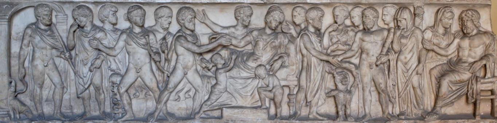

# Leçon 03 | 30 Novembre 1960

  

    <label><input type="checkbox" data-lacan-toggle="original" checked> 原文</label>
    <label><input type="checkbox" data-lacan-toggle="notes" checked> 注释</label>
    <label><input type="checkbox" data-lacan-toggle="commentary" checked> 个人解读评论</label>
  

  <form class="lacan-tool-search" role="search">
    <input class="lacan-tool-search-input" type="search" placeholder="搜索全文" aria-label="搜索全文">
    <button class="lacan-tool-button" type="submit" title="搜索">搜索</button>
  </form>
  <button class="lacan-tool-button lacan-back-to-top" type="button" title="回到页面最上方" aria-label="回到页面最上方">↑</button>

<section class="parallel-paragraph" data-paragraph-ids="s8-03-0001">

s8-03-0001

原文 · s8-03-0001

Nous en sommes restés la dernière fois à la position de l’ἐραστής \[erastès : l’amant\] et de l’ἐρώμενος \[erômenos : l’aimé\], de l’*amant* et de l’*aimé*, telle que *la dialectique* du *Banquet* nous permettra de l’introduire comme ce que j’ai appelé « *la base* », « *le point tournant* », « *l’articulation* » essentielle du problème de *l’amour*. Le problème de *l’amour* nous intéresse en tant qu’il va nous permettre de *comprendre* ce qui se passe *dans le transfert* et je dirai jusqu’à un certain point : *à* *cause du transfert*.

上次我们停留在对“爱者”[ἐραστής, erastès]与“被爱者”[ἐρώμενος, erômenos]之位置的讨论上，即爱者与被爱者的位置，正如《会饮篇》的辩证法将允许我们把这种位置引入为我所称的爱情问题的“基础”、“转折点”以及本质性的“关节”。爱情问题之所以让我们感兴趣，是因为它将允许我们理解在移情中发生了什么，并且我还要在某种程度上说：是由于转移。

</section>

<section class="parallel-paragraph" data-paragraph-ids="s8-03-0002">

s8-03-0002

原文 · s8-03-0002

Pour motiver un aussi long détour que celui qui peut paraître à ceux d’entre vous qui viennent neufs cette année à ce séminaire et qui pourraient après tout vous paraître comme un détour superflu, j’essaierai de justifier, de vous présentifier le sens, semble-t-il que vous devez appréhender tout de suite, de la portée de notre recherche.

对于你们中今年新参加这个研讨会的人来说，这个迂回可能显得过于长了——为了给这么长的一个迂回提供理由，我将尝试加以论证，并向你们呈现出这一研究意义，以及你们应当立即把握的关于这项研究的深远影响 。

</section>

<section class="parallel-paragraph" data-paragraph-ids="s8-03-0003">

s8-03-0003

原文 · s8-03-0003

Il me semble *qu’à quelque niveau qu’il soit* de sa formation, quelque chose doit être présent au psychanalyste comme tel, quelque chose qui peut le *saisir*, l’*accrocher* par le bord de son manteau à plus d’un tournant. Et le plus simple n’est-il pas celui-ci, me semble-t-il difficile à éviter à partir d’un certain âge, et qui pour vous - il me semble - doit comporter déjà de façon très présente à lui tout seul ce qu’est le problème de *l’amour*.

在我看来，无论精神分析学家处于受训的哪个阶段，总有某种东西必须作为这样的东西在他那里呈现；
这种东西能够在不只一个转折点抓住他，揪住他的大衣衣角。
而最简单的不就是这一个吗？在我看来，从一定年龄起就难以回避这一个，并且对你们来说——在我看来——它本身就应当已经以一种极为鲜明的方式，独自包含了爱情问题之为何物。

</section>

<section class="parallel-paragraph" data-paragraph-ids="s8-03-0004 s8-03-0005">

s8-03-0004, s8-03-0005

原文 · s8-03-0004, s8-03-0005

Est-ce qu’il ne vous a jamais *saisi* à ce tournant, que dans ce que vous avez donné - à ceux qui vous sont les plus proches, j’entends - il n’y a pas quelque chose qui a manqué, et non pas seulement qui a manqué, mais qui les laisse - les susdits, les plus proches - eux, par vous irrémédiablement manqués ? En quoi ? Justement par ceci qui, à vous analystes, permet de comprendre que justement ces proches, *avec eux*, on ne fait que tourner autour du fantasme, dont vous avez cherché plus ou moins *en eux* la satisfaction,

- qui, *à eux*, a plus ou moins substitué ses images ou ses couleurs.

难道在那个转折点，你们从未被这样一种想法击中吗？即在你们所给予的东西中。我指的是给那些与你们最亲近的人——不仅有某种东西缺失了，而且这种缺失还让上述那些最亲近的人，被你们无可挽回地错过了？在哪些方面错过了？恰恰在于这一点，对于作为分析师的你们来说，这一点让你们理解到，恰恰是面对这些亲近的人，我们只不过是在围绕着幻想（fantasme）打转，你们或多或少在他们身上寻求这种幻想的满足——这种幻想或多或少地用<strong>它自己</strong>的意象或色彩取代了<strong>他们</strong>。

> 用幻想取代了<strong>他们</strong>

</section>

<section class="parallel-paragraph" data-paragraph-ids="s8-03-0006">

s8-03-0006

原文 · s8-03-0006

*Cet être* auquel soudain vous pouvez être rappelé par quelque accident, dont la mort est bien celui qui nous fait entendre le plus loin sa résonance, *cet être véritable* - pour autant que vous l’évoquez - déjà s’éloigne et est déjà éternellement perdu. Or *cet être* c’est tout de même bien lui que vous tentez de joindre par les chemins de votre *désir*. Seulement *cet être là c’est le vôtre*. Et ceci *comme analyste* vous savez bien que c’est de quelque façon, faute de l’avoir voulu que vous l’avez manqué aussi plus ou moins. Mais au moins ici êtes-vous au niveau de votre faute, et votre échec la mesure exactement.

这个存在（être），你可能会因某种意外而突然被它唤回——死亡便是那确实能让我们从最远处听到其共鸣的意外——这个真正之存在，只要你召唤它，它便已在远遁，且已然永恒地失落。   
然而，正是在你欲望的路径上，你试图去触及的恰恰也是它 。只不过，那个存在是你自己的存在。而这一点，作为分析师你深知，在某种程度上，正是由于没能去意愿它，你才或多或少也错失了它 。但至少在这里，你处于你过失（faute）的天平上，而你的失败（échec）恰恰精准地称量了它 。

</section>

<section class="parallel-paragraph" data-paragraph-ids="s8-03-0007">

s8-03-0007

原文 · s8-03-0007

Et ces autres dont vous vous êtes occupé si mal, est-ce pour en avoir fait, comme on dit, seulement vos *objets* ? Plût au ciel que vous les eussiez traités comme *des objets* dont on apprécie le poids, le goût et la substance, vous seriez aujourd’hui moins troublé par *leur mémoire*, vous leur auriez rendu justice, hommage, amour, vous les auriez aimés au moins comme vous-même, à ceci près que vous aimez mal, mais ce n’est même pas le sort des mal aimés que nous avons eu en partage. Vous en auriez fait sans doute - *comme on dit* - des *sujets* comme si c’était là la fin du *respect* qu’ils méritaient : respect, comme on dit, de leur dignité, respect dû à *nos semblables*.

而这些你们曾如此糟糕地对待过的他者，难道是因为你们只是把他们——如人们所说的那样——当成了你们的对象吗？  
但愿天知道你们真是那样对待了他们：把他们当作对象来对待，去掂量其重量，品尝其滋味，体察其质地；那样的话，你们今天就不会如此被他们的记忆所困扰，你们本来会对他们作出公正之举，向他们致敬，给予他们爱；你们至少会像爱你们自己那样爱他们——只是有一点保留：你们爱得并不好；   
但我们所分担的甚至并非那些“爱得糟糕的人”的命运，如人们所说的那样，你们大概是把他们做成了主体，仿佛这就是他们所应得的尊重的终点：对其尊严的尊重，如人们所说的那样，对我们的同类所应尽的尊重。

</section>

<section class="parallel-paragraph" data-paragraph-ids="s8-03-0008">

s8-03-0008

原文 · s8-03-0008

Je crains que cet *emploi neutralisé* du terme « *nos semblables »*, soit bien autre chose que ce dont il s’agit dans la question de *l’amour,* et - de ces *semblables* - que le respect, que vous leur donniez aille trop vite : au respect du *ressemblant*, au renvoi à leurs lubies de résistance, à leurs idées butées, à leur bêtise de naissance, à leurs oignons quoi ! Qu’ils se débrouillent !

我担心这种对“我们的同类”一词的中性化使用，与爱情问题中所涉及的东西大相径庭；并且就这些同类而言，你们给予他们的尊重走得太快了：太快的滑向了对相似者[ressemblant]的尊重，滑向了将他们打发回他们抵抗性的怪想、他们固执的见解、他们先天的愚笨，总之，滑向了“让他们管他们自己的闲事去吧！”——随他们去应付吧！

</section>

<section class="parallel-paragraph" data-paragraph-ids="s8-03-0009 s8-03-0010 s8-03-0011">

s8-03-0009, s8-03-0010, s8-03-0011

原文 · s8-03-0009, s8-03-0010, s8-03-0011

C’est bien là, je crois, le fond de cet arrêt devant leur liberté, qui souvent dirige votre conduite, *liberté d'indifférence* dit-on, mais non pas de la leur, de la vôtre plutôt. Et c’est bien en cela que la question se pose pour un analyste, c’est à savoir quel est notre rapport à cet *être* de notre patient ? On sait bien tout de même pourtant que *c’est de cela* dans l'analyse qu’il s’agit :

- notre accès à cet *être* est-il ou non *celui de l'amour ?* A-t-il quelque rapport, notre accès, avec ce que nous saurons

- de ce qu'est le point où nous nous posons quant à la nature de *l'amour* ?

我认为，这正是这种对他们自由的止步不前的根基所在，这种止步往往主导着你们的行为——人们称之为“漠不关心的自由”，但这并非他们的自由，而更多是你们自己的自由。    
正是在这一点上，对于一名分析师而言，问题被提出了，即：我们与病人这一存在的关系究竟是什么？尽管如此，我们深知在分析中涉及的正是这一点：    

– 我们通往这一存在的路径，究竟是否是爱的路径？   
— 我们的这种通往，与我们对于以下这一点之所知是否有某种关联：也就是，当我们就爱的本性而安置我们自己时，我们究竟立于何处？

</section>

<section class="parallel-paragraph" data-paragraph-ids="s8-03-0012">

s8-03-0012

原文 · s8-03-0012

Ceci, vous le verrez, nous mènera assez loin, précisément à savoir ce qui, si je puis m'exprimer ainsi me servant d’*une métaphore,* est dans *Le Banquet* quand ALCIBIADE compare SOCRATE à quelques uns de ces menus objets, dont il semble qu’ils aient réellement existé à l’époque, semblables aux « *poupées russes* » par exemple, ces *choses* qui s'emboîtaient les unes dans les autres. Paraît-il qu’il y avait des images dont *l'extérieur* représentait un *satyre* ou un *silène* [^28], et *à l’intérieur* nous ne savons trop quoi, mais assurément *des choses précieuses*.

这一点——你们将会看到——会把我们引向相当远的地方，确切地说，引向这样一个问题：在《会饮》中，阿尔西比亚德把苏格拉底比作某些小物件时，究竟涉及什么；这些小物件，看来在当时确实存在，类似于“俄罗斯套娃”之类的东西，即那些彼此嵌套、一个套着一个的器物。   
据说当时有一些形象，其外部呈现为萨堤尔或西勒诺斯【注】，而在其内部，我们并不太清楚是什么，但无疑是一些珍贵之物。

> 【注】半神西勒诺斯（Silène），酒神巴克斯的同伴，外表为一种长着毛茸茸耳朵、并长有马蹄和马尾的神奇生物。   
> 【注】巴克斯:罗马神话中的酒神，对应希腊神话的狄俄尼索斯。

> 每次看到这一段总让我想到这个小物件也就是阿伽玛与特洛伊木马在结构上的某种呼应关系。

</section>

<section class="parallel-paragraph" data-paragraph-ids="s8-03-0013">

s8-03-0013

原文 · s8-03-0013

Ce qu’il doit y avoir, ce qu’il peut y avoir, ce qui est supposé y être, de ce quelque chose, *dans l'analyste*, c’est bien ce à quoi tendra notre question, mais tout à la fin. En abordant le problème de ce rapport qui est celui de l’analysé à l’analyste, qui se manifeste par ce si curieux phénomène de *transfert*, que j’essaie d’aborder de la façon qui le serre de plus près, qui en élude le moins possible les formes, à la fois se connaissant pour tous, et dont on cherche plus ou moins à abstraire, à éviter, le poids propre, je crois que nous ne pouvons mieux faire que de partir d’une interrogation de ce que ce *phénomène* est censé *imiter au maximum*, voire *se confondre* avec lui : *l'amour*.

分析师之中应当有的、可能有的、被假设在那里的那个“某物”究竟是什么，这确实正是我们的问题所趋向之处；但那要到最后才谈到。

在探讨分析者与分析师之间的这一关系问题时——这种关系通过如此奇特的移情现象表现出来，我正试图以最贴近的方式去探讨它，尽可能不回避其各种形式，这些形式既为所有人熟知，人们又总在或多或少地试图抽象化、回避其自身的重量——我相信，我们做得最好的方式莫过于从追问<strong>这一现象所力求模拟、甚至与之混淆的那个事物</strong>开始：爱。

</section>

<section class="parallel-paragraph" data-paragraph-ids="s8-03-0014">

s8-03-0014

原文 · s8-03-0014

Il y a vous savez un texte de FREUD[^29], célèbre dans ce sens, qui se range dans ce qu’on appelle d’habitude les *Écrits Techniques*, avec ce à quoi il est étroitement en rapport, à savoir : disons que *quelque chose* à *quelque chose* est depuis toujours suspendu dans le problème de *l'amour*, une *discorde interne*, *on ne sait quelle* *duplicité* qui est justement ce qu’il y a lieu pour nous de serrer de plus près, à savoir peut-être éclairer par cette ambiguïté ce quelque chose d’autre, cette substitution en route dont, après quelque temps de séminaire ici, vous devez savoir que c’est tout de même ce qui se passe dans l’action analytique, et que je peux résumer ainsi.

你们知道，弗洛伊德有一篇在这方面非常有名的文本【注】，它被归入通常所说的《技术著作》中，并与它所密切相关的内容并列，即：我们且说，在爱的难题始终悬置在某种东西之上，一种内在的不和谐，一种说不清的二重性，这正是我们需要更近距离地审视的地方，即或许能通过这种歧义性来阐明那“另一种东西”，即这种在阐明的过程中“替代”——在参加了一段时间的研讨会之后，你们应该知道，这毕竟是分析行为中发生的事情，我可以将其总结如下 。

> 【注】弗洛伊德：《转移之爱的观察》（Observations sur l’amour de transfert），收录于《精神分析技术》，巴黎，法国大学出版社（P.U.F.），1953年；参见《研讨会 1》 。

</section>

<section class="parallel-paragraph" data-paragraph-ids="s8-03-0015">

s8-03-0015

原文 · s8-03-0015

Celui qui vient nous trouver, par principe de cette supposition qu’il ne sait pas ce qu’il a, déjà là est toute l’implication de *l’inconscient*, du « *il ne sait pas* » fondamental et c’est par là que s’établit le pont qui peut relier notre nouvelle science à toute la tradition du « *connais-toi toi-même* »[^30] bien sûr il y a une différence fondamentale, l’accent est complètement *déplacé* de cet « *il ne sait pas* », et je pense que déjà là-dessus je vous en ai dit assez pour que je n’aie pas à faire autre chose que pointer au passage la différence.

那些来寻找我们的人，基于这种假设的原则——即他并不知道自己所患何物（或者拥有着什么）——无意识的全部涵义、那种根本性的“他不知道”就已经存在于那里了 。正是通过这一点，才建立起了一座桥梁，足以将我们的这门新科学与整个“认识你自己”的传统连接在一起 。【注】当然，这其中存在着一个根本性的差异，重点已经从这种“他不知道”上完全移开，我想关于这一点我已经跟你们说得够多了，我不必再做别的事，只需在经过时指点一下这种区别即可 。

> 【注】刻写在德尔斐的一则箴言，苏格拉底曾将其阐释并指向阿尔基比亚德（柏拉图，《阿尔基比亚德》，巴黎，Les Belles Lettres 版，第 1 卷，1959 年，124b）

</section>

<section class="parallel-paragraph" data-paragraph-ids="s8-03-0016">

s8-03-0016

原文 · s8-03-0016

« *Il ne sait pas ce qu’il a* », mais quoi ? Ce qu’il a vraiment en lui-même ? Ce qu’il demande à « *être* », pas seulement *formé, éduqué, sorti, cultivé* selon la méthode de toutes les *pédagogies* traditionnelles… il se met à l’ombre du pouvoir fondamentalement révélateur de quelques dialectiques qui sont les rejets, les surgeons de la démarche inaugurale de SOCRATE en tant qu’elle est philosophique, est-ce que c’est là ce à quoi nous allons, dans l’analyse, mener celui qui vient nous trouver comme analystes ?

他把自己置于某种根本上具有揭示性的权威之荫下，这种权威体现在若干种辩证法之中；这些辩证法乃是作为苏格拉底之开创性进路——就其作为哲学而言——的遗留物、萌生物。那么，在分析中，我们是否正是要把来到我们这里的人，引向这一点呢？   

“他不知道自己有着（或患有）什么”，但究竟是什么？是他真正内在拥有的东西吗？是他要求去“成为”的存在吗——而不仅仅是按照所有传统教育学的手段被塑造、被教育、被引出、被培养……他把自己置于某种根本上具有揭示性的权威之影下，这些辩证法是苏格拉底作为哲学的初始步骤的衍生物——而在分析中，我们是否正是要把来寻找分析师的人，引向这一点呢？

> 寻找分析师，但是他不知道自己“拥/患有什么”   
> 一种奇妙的错位

</section>

<section class="parallel-paragraph" data-paragraph-ids="s8-03-0017">

s8-03-0017

原文 · s8-03-0017

Simplement comme lecteurs de FREUD, vous devez tout de même déjà savoir quelque chose de ce qui au premier aspect tout au moins peut se présenter comme le paradoxe de ce qui se présente à nous comme terme, τέλος \[telos\], comme *aboutissement*, *terminaison*, de l’analyse. Qu’est-ce que nous dit FREUD sinon *qu’en fin de compte* ce que trouvera au terme celui qui suit ce chemin, ce n’est pas autre chose essentiellement qu’un *manque*. Que vous appeliez ce *manque* « *castration* » ou que vous l’appeliez « *Pénisneid* » ceci est signe, métaphore. Mais si c’est vraiment là ce devant quoi vient, au terme, buter l’analyse, est-ce qu’il n’y a pas là déjà quelque duplicité ?

仅仅作为弗洛伊德的读者，你们无论如何也应该已经对某种东西有所了解，这种东西至少在最初的外观而言，它至少可以呈现为一个悖论——那就是呈现在我们面前、作为终点、目的、作为分析之完成、终结的东西。弗洛伊德告诉了我们什么呢？无非是，那个追随这条道路的人在终点所发现的，本质上不是别的，正是一个缺失（manque） 。无论你们将这种缺失称为“阉割”，还是称之为“阴茎嫉妒” [Pénisneid]，这都是符号，是隐喻 。但如果这确实就是分析在终点处最终撞上的东西，那么这里难道不已经存在某种二重性（duplicité）了吗 ？

> “最初”但呈现为“终点，目的”。   
> 我们可以这么说吗，“最初”作为一种缺失。某种可以被称为“起因”的对象/某物的缺失。如果分析把他看作分析的重点和目的的话，这不是别的正是“缺失”。

</section>

<section class="parallel-paragraph" data-paragraph-ids="s8-03-0018">

s8-03-0018

原文 · s8-03-0018

Bref en vous rappelant cette ambiguïté, cette sorte de double registre, entre ce début et départ *de principe,* et ce terme - son premier aspect peut apparaître si nécessairement décevant - tout un développement s’inscrit. Ce développement, c’est à proprement parler *cette révélation* de ce quelque chose tout entier dans son texte, qui s’appelle l’Autre inconscient. Bien. Et surtout ceci, pour quiconque en entend parler pour *la première fois* - je pense qu’il n’y en a *nul ici qui soit dans ce cas -* ne peut être entendu que comme *une énigme*.

[未译]

</section>

<section class="parallel-paragraph" data-paragraph-ids="s8-03-0019">

s8-03-0019

原文 · s8-03-0019

Ce n’est point à ce titre que je vous le présente, mais au titre du rassemblement des termes où s’inscrit comme telle notre action. C’est aussi bien pour tout de suite éclairer ce que je pourrai appeler, si vous voulez, le plan général dans lequel va se dérouler notre cheminement, quand il ne s’agit après tout de rien d’autre que de tout de suite appréhender, y voir - mon Dieu - ce qu’a d’analogue ce développement et ces termes avec la situation de départ fondamentale de *l’amour*.

我并不是以那样的名义向你们呈现它，而是以这样一种名义：在各种术语的汇聚之中，我们的行动正作为这样的东西被铭刻其间。     
这同样也是为了立刻阐明我可以称之为——如果你们愿意的话，我可以这样称呼——那个总体蓝图：我们的行进将在其中展开；   
因为归根结底，这不过就是要立刻把握，并在其中看到——天呐——这一展开及其诸项术语与爱的那一根本初始情境之间，究竟具有何种相似关系。

</section>

<section class="parallel-paragraph" data-paragraph-ids="s8-03-0020 s8-03-0021 s8-03-0022">

s8-03-0020, s8-03-0021, s8-03-0022

原文 · s8-03-0020, s8-03-0021, s8-03-0022

Cette situation, pour être après tout évidente, n’a jamais été - que je sache aussi - en quelque terme, située, placée au départ en ces termes que je vous propose d’articuler tout de suite, ces deux termes d’où nous partons :

- ἐραστής \[erastès\] l’*amant*, ou encore ἔρόν \[erôn\] l’*aimant*,

- ἐρώμενος \[erômenos\] *celui qui est aimé*.

这种情境，尽管归根结底是不言而喻的，但据我所知，从未以任何术语在出发点被如此定位、如此安置，就像我马上提议向你们衔接的这些术语，即我们出发时的这两个术语：– 爱者 [ἐραστής, erastès]，或者也可说是处于爱之状态的人 [ἐρόν, erôn]，<strong>正在爱</strong>的人– 被爱者 [ἐρώμενος, erômenos]，即那个被爱的人。

> 爱者与被爱者这样的表述可能看上去还存在某种“对称性”   
> 处于爱的状态的人 与 被爱的人 这样的表述则进一步将<strong>爱</strong>这个行为的两方关系呈现出来。 这种关系如果换个词，甚至可以是“捕食状态的动物”和“被捕食的动物”。   
> 反过来说，捕食又为何不能是一种爱的隐喻呢。

</section>

<section class="parallel-paragraph" data-paragraph-ids="s8-03-0023">

s8-03-0023

原文 · s8-03-0023

Est-ce que tout déjà ne se situe pas mieux *au départ* ? Il n’y a pas lieu de jouer au jeu de cache-cache, est-ce que nous ne pouvons pas voir tout de suite dans une telle assemblée \[*le banquet*\], *que ce qui caractérise* l’ἐραστής \[erastès\], *l’amant*, pour tous ceux qui l’ont interrogé, pour tous ceux qui l’approchent, *est-ce que ce n’est pas essentiellement ce qui lui manque* ? Et nous pouvons tout de suite, nous, ajouter qu’*il ne sait pas ce qui lui manque*, avec cet accent particulier de « *l’in-science* », qui est celui de l’inconscient.

难道从一开始，一切不是已经各就其位了吗？没必要玩捉迷藏的游戏，难道我们不能在这场集会[《会饮》]中立刻看出，对于所有质询过<strong>爱者</strong>的人、所有接近<strong>爱者</strong>的人来说，界定“爱者”[ἐραστής, erastès]的，根本上不正是他所缺失的东西吗？而且我们立刻就能补充说，他并不知道自己缺失的是什么，这里的重音落在一种特别意义上的“无-知”〔l’in-science〕上，这正是无意识的那个重音。

> 将 inconscient（无意识）拆解并重构为 in-science（无知/非科学）。

</section>

<section class="parallel-paragraph" data-paragraph-ids="s8-03-0024">

s8-03-0024

原文 · s8-03-0024

Et d’autre part l’ἐρώμενος \[erômenos\], l’*objet aimé*, est-ce qu’il ne s’est pas toujours situé comme celui *qui ne sait pas ce qu’il a*, ce qu’il *a de caché*, ce qui fait *son attrait* ? Parce que ce « *ce qu’il a* » n’est-il pas ce qui est, dans la relation de l’amour, appelé pas seulement à se révéler : à *devenir*, à *être*, à *présentifier*, ce qui n’est jusque là que « *possible* » ? Bref avec l’accent analytique, ou sans cet accent : lui aussi « *il ne sait pas* ». Et c’est d’autre chose qu’il s’agit : *il ne sait pas ce qu’il a*.

另一方面，被爱者 [ἐρώμενος, erômenos]，即被爱的对象，难道他不始终被定位为那个不知道自己拥有什么、不知道自己拥有什么隐藏之物、不知道是什么构成了他的吸引力的人吗？ 因为这个“他所拥有的”，在爱情关系中，难道不正是被召唤去不仅是显露自身：去生成（devenir）、去存在（être）、去现身化（présentifier）那直到那时还仅只是“可能”的东西吗？   
简言之，无论带不带有分析式的重音：他同样也“不知道”。 并且问题还在别处：他不知道自己拥有什么。

</section>

<section class="parallel-paragraph" data-paragraph-ids="s8-03-0025">

s8-03-0025

原文 · s8-03-0025

Entre ces deux termes qui constituent, si je puis dire : dans leur essence, *l’amant* et *l’aimé*, observez qu’il n’y a *aucune coïncidence*. Ce qui *manque* à l’un n’est pas ce « *ce qu’il a* », caché dans l’autre. Et c’est là tout le problème de l’amour. *Qu’on le sache* ou *qu’on ne le sache pas* n’a aucune importance. On en rencontre à tous les pas dans le phénomène, le déchirement, la discordance, et *quiconque n’a pas besoin* pour autant de *dialoguer*, de « *dialectiquer* » διαλεκτικεύεσθαι sur l’amour : il lui suffit « *d’être dans le coup* », d’*aimer*, pour être pris à cette béance, à ce discord.

在这两个术语之间——如果我可以这样说，它们构成了爱者与被爱者各自的本质——请注意，并不存在任何重合。一方所缺失的东西，并不是另一方身上所隐藏的那个“他所拥有的”。而这正是爱情的全部问题所在。无论人们是否知道这一点，都毫不重要。人们在该现象的每一步中，在撕裂中，在不和谐中都会与之相遇，且任何人都不因此需要去去就爱情进行“辩证的讨论”[διαλεκτικεύεσθαι]：他只需要“身处其中”，去爱，就会被卷入这种裂隙（béance）与这种不和之中。

</section>

<section class="parallel-paragraph" data-paragraph-ids="s8-03-0026">

s8-03-0026

原文 · s8-03-0026

Est-ce là même tout dire ? Est-ce suffisant ? Je ne puis ici faire plus. Je fais beaucoup en le faisant, je m’offre au risque de certaine *incompréhension immédiate*, mais je vous le dis : je n’ai pas l’intention ici de vous en conter, j’éclaire donc ma lanterne tout de suite. Les choses vont plus loin. Nous pouvons donner, dans les termes dont nous nous servons, ce que l’analyse de la création du sens dans le rapport *signifiant-signifié* indiquait déjà[^31]. Nous en verrons - quitte à en voir le maniement - la vérité dans la suite.

这就已经说尽了吗？这就足够了吗？在此我不能再多说。如此行事我已经做了很多，我甘愿冒险承受某种当下的不解，但我告诉你们：我并不打算在这里给你们信口开河，因此我立刻开门见山的说，事情还要更深一步。   
我们可以用我们所使用的术语，给出那种关于能指-所指关系中意义创造的分析早已指出的东西。我们将在后续看到其中的真理——即使不得不去处理那些复杂的过程。

</section>

<section class="parallel-paragraph" data-paragraph-ids="s8-03-0027">

s8-03-0027

原文 · s8-03-0027

Cette analyse indiquait déjà ce dont il s’agit, à savoir que justement *l’amour comme signifiant* - *car pour nous c’en est un et ce n’est que cela* - *est une métaphore*, si tant est que la métaphore nous avons appris à l’articuler comme *substitution*, et que c’est là que nous entrons dans l’obscur et que je vous prie à l’instant simplement de l’admettre, et de garder dans la main, ce qu’ici je promeus comme ce que c’est : une formule algébrique.

这种分析已经指出了问题之所在，即爱情作为能指——因为对我们而言，它就是一个能指，且仅此而已——这正是一个隐喻，只要我们已经学会将隐喻衔接为一种替换，那么正是在这里，我们进入了晦暗之处，我请你们此刻仅仅先承认它，并将其握在手中，这便是我在此作为其本质所推行的东西：一个代数公式 。

</section>

<section class="parallel-paragraph" data-paragraph-ids="s8-03-0028">

s8-03-0028

原文 · s8-03-0028

C’est pour autant que - dans la fonction où ceci se produit - que l’ἐραστής \[erastès\] -l’*aimant* qui est le sujet *du manque -* vient à la place, se substitue, à la fonction de l’ἐρώμενος \[erômenos\] - qui est objet, *objet aimé -* que se produit la signification de l’amour. Nous mettrons peut-être *un certain temps* à éclairer cette formule, nous avons le temps de le faire dans l’année qui est devant nous. Du moins n’aurai-je pas manqué de vous donner dès le départ ce point de repère qui peut servir, non pas de devinette, tout au moins de point de référence propre à éviter certaines ambiguïtés, lorsque je développerai.

正是在于——在这一发生的功能（fonction）中——爱者［ἐραστής，erastès］——即作为缺失之主体的爱人，来到了被爱者［ἐρώμενος，erômenos］——即作为对象、被爱之对象的功能的位置并取而代之，爱情的意义（signification）才得以产生。   
我们或许要花一些时间来阐明这个公式（formule），在接下来的这一年里，我们有时间这样做 。至少我不会忘记从一开始就给你们提供这个坐标，它并非为了当成谜语，至少是作为一个基准点，以便在我展开论述时避免某些歧义 。

</section>

<section class="parallel-paragraph" data-paragraph-ids="s8-03-0029">

s8-03-0029

原文 · s8-03-0029

Et maintenant entrons dans ce *Banquet* dont je vous ai en quelque sorte, la dernière fois *planté le décor*, présenté les personnages, les personnages qui n’ont rien de primitif sous un rapport à la simplification du problème qu’ils nous présentent. Ce sont des personnages fort sophistiqués, c’est bien le cas de le dire ! Et là, pour retracer ce qui est *une des portées* de ce à quoi j’ai passé mon temps avec vous la dernière fois, je le résumerai en quelques termes, car je considère important que *le caractère provocant*, en soit émis, articulé.

而现在，让我们进入这场《会饮篇》（Banquet），在某种程度上，上次我已经为你们铺设了背景，介绍了其中的人物——这些人物，就其对于他们向我们呈现之问题的简化而言，绝非原始。可以说，他们是极其复杂的人物！   
因此为了重新勾勒出我上次与你们所花时间所涉及的某一旨趣，我将用寥寥数语对其进行总结，因为我认为重要的是，其中关联的挑衅性质应被表达出来。

</section>

<section class="parallel-paragraph" data-paragraph-ids="s8-03-0030">

s8-03-0030

原文 · s8-03-0030

Il y a tout de même quelque chose d’assez *humoristique* qu’après vingt-quatre siècles de *méditation religieuse*, il n’y a pas une seule réflexion sur *l’amour* pendant ces vingt-quatre siècles - qu’elle se soit passée chez les libertins ou chez les curés - il n’y a pas une seule méditation sur l’amour, qui ne se soit référée à ce texte inaugural.

有件事毕竟还是挺幽默的：在经过了二十四个世纪的宗教沉思之后，这二十四个世纪以来，没有任何一段关于爱的思考...无论它是发生在放荡者还是教士那里——<strong>没有任何一段关于爱的思考，是不曾参照这一开创性文本的</strong>。

</section>

<section class="parallel-paragraph" data-paragraph-ids="s8-03-0031 s8-03-0032 s8-03-0033">

s8-03-0031, s8-03-0032, s8-03-0033

原文 · s8-03-0031, s8-03-0032, s8-03-0033

Ce texte après tout, pris dans son côté extérieur, pour quelqu’un qui entre là-dedans sans être prévenu, représente tout de même *une sorte de* *tonus* [^32]*, comme on dit,* entre des gens dont il faut tout de même bien nous dire, que pour le paysan qui sort là de son petit jardin autour d’Athènes, c’est une réunion de vieilles lopes : SOCRATE a 53 ans, ALCIBIADE - toujours beau parait-il - en a 36,

- et AGATHON lui-même chez qui ils sont réunis, en a 30 trente. Il vient de remporter le *prix du concours de tragédie*

- (*c’est ça qui nous permet de* *dater exactement* *Le Banquet*).

归根结底，这一文本若从其外部视角来看，对于一个在毫无准备的情况下进入其中的人来说，它仍然表现为一种人们所说的“狂欢派对”【注】；在一些人之间进行，我们毕竟得说清楚，对于那个正从雅典郊外自家小院里出来的农夫而言，这就是一场“老妖孽”的聚会：苏格拉底53岁，阿尔西比亚德斯——据说依然英俊——36岁，而他们在其家中聚会的阿加通本人，则是30岁。他刚刚赢得了悲剧竞赛的奖项（正是这一点让我们能够精确地确定《会饮篇》的时间）。

> 【注】医院实习医生们吵闹的聚会。拉康这里指代一种吵闹、往往带有放荡色彩的庆祝聚会。

</section>

<section class="parallel-paragraph" data-paragraph-ids="s8-03-0034">

s8-03-0034

原文 · s8-03-0034

Évidemment il ne faut pas s’arrêter à ces apparences. C’est toujours dans des salons, c’est à dire dans un lieu où les personnes n’ont dans leur aspect rien de particulièrement attrayant, c’est chez les duchesses que se disent les choses les plus fines. Elles sont à jamais perdues bien entendu, mais *pas pour tout le monde*, pas pour ceux qui les disent en tout cas. Là nous avons la chance de savoir ce que tous ces personnages, à leur tour, ont échangé ce soir-là.

显然，我们不应停留在这些表象之上。事情总是在沙龙之中发生，也就是说，在那样一种地方：人们在外表上并没有什么特别引人注目之处——最精妙的言辞却是在公爵夫人们那里被说出的。   
当然，这些话语永远地失传了，但并非对所有人而言都如此，至少对于那些说出它们的人来说并非如此。而在这里，我们有幸知道，这些人物在那一晚彼此之间所交换的一切。

</section>

<section class="parallel-paragraph" data-paragraph-ids="s8-03-0035">

s8-03-0035

原文 · s8-03-0035

On en a beaucoup parlé de ce *Banquet*, et inutile de vous dire que ceux dont c’est le métier d’être *philosophes, philologues, hellénistes,* l’ont regardé à la loupe et que je n’ai pas épuisé la somme de leurs remarques. Mais ce n’est pas non plus inépuisable, car ça tourne toujours autour d’un point. Aussi peu inépuisable que ce soit, il est quand même exclu que je vous restitue la somme de ces *menus débats* qui se font autour de telle ou telle ligne : d’abord il n’est pas dit qu’elle soit de nature à ne pas nous laisser échapper quelque chose d’important, et ce n’est pas commode pour moi, qui ne suis *ni philosophe, ni philologue, ni helléniste,* de me mettre dans ce rôle, dans cette peau, et de vous faire une leçon sur *Le Banquet*.

关于这出《会饮》，人们已经谈论了很多。无需多言，那些以哲学家、语言学家、希腊语专家为业的人们，已经用放大镜对其进行了审视，而我也并未穷尽他们全部的评论。   
但这些评论也不是无穷无尽的，因为它总是绕着一个点打转。即便它并非无穷无尽，我也不可能把这些围绕某一行或某一句展开的细碎争论的总和向你们一一复述：   
首先，并不能说这类争论的性质不会让我们漏掉某些重要的东西；其次，对于我这个既非哲学家、亦非语言学家、更非希腊语专家的人来说，代入这种角色、披上这层皮来给你们上一堂关于《会饮篇》的课，也是不合宜的。

</section>

<section class="parallel-paragraph" data-paragraph-ids="s8-03-0036">

s8-03-0036

原文 · s8-03-0036

Ce que je peux espérer simplement, c’est vous donner d’abord une première appréhension de ce quelque chose que je vous demande de croire : que ce n’est pas comme ça, à la première lecture, que je m’y fie, faites-moi confiance. Faites-moi quand même ce crédit de penser que ça n’est pas pour la première fois, et à l’usage de ce séminaire, que je suis entré dans ce texte. Et faites-moi aussi ce crédit de penser que je me suis quand même donné quelque mal pour rafraîchir ce que j’avais comme souvenirs concernant les travaux qui s’y sont consacrés, voire m’informer de ceux que j’avais pu négliger jusqu’ici.

我仅仅能指望的，不过是先让你们对我请求你们相信的事有一个初步的把握：即我并非在初次阅读之下就那样信赖它，请信任我。   
至少请你们给予我这样的信任：认为这并非是我第一次进入这个文本，更不是为了这次研讨班才第一次进入。   
并请同样在那点上信任我，即相信我确实费了一些功夫来刷新我关于那些致力于此文本的研究著作的记忆，甚至去了解那些我直到目前可能忽略了的部分。

</section>

<section class="parallel-paragraph" data-paragraph-ids="s8-03-0037">

s8-03-0037

原文 · s8-03-0037

Ceci pour m’excuser d’avoir - et quand même parce que je crois *que c’est le mieux* - abordé les choses *par la fin*, c’est-à-dire par ce qui, du seul fait de la méthode que je vous apprends, doit être objet pour vous d’une sorte de réserve, à savoir ce que j’y comprends. C’est justement là que je cours *les plus grands risques*. Soyez-moi reconnaissants de les courir à votre place. Que ceci serve seulement pour vous d’introduction à des critiques qui ne sont pas tant à porter sur ce que je vais vous dire que j’y ai compris, que sur ce qui est dans le texte, à savoir ce qui en tout cas va, à la suite de ça, vous apparaître comme étant ce qui a accroché ma compréhension. Je veux dire ce qui, cette compréhension - vraie ou fausse - l’explique, la rend nécessaire, et comme texte alors, comme *signifiant,* *impossible* - même pour vous, même si vous le comprenez autrement - impossible à contourner.

这也是为了为我这一种做法作出解释——而且我仍然认为这是一种更好的方式，即从结尾入手来展开问题；也就是说，由于我正传授给你们的这种方法本身，你们必须对这一部分持某种保留态度，即：我从中理解到了什么。   
正是在这里，我承担着最大的风险。请你们承认，我是在替你们承担这些风险。
愿这只作为一种引导：引向批评——这种批评，与其说是针对我将要告诉你们我在其中所理解到的内容，不如说是针对文本本身；也就是说，针对那一点——无论如何，在此之后将会向你们显现的——作为那种“勾住”我理解的东西。   
无论理解或真或假——那些东西让理解得以通顺，并使之成为必然。并且作为文本，作为能指，那便是即便对你们而言，即便你们有不同的理解，也依然是无法绕过的。

</section>

<section class="parallel-paragraph" data-paragraph-ids="s8-03-0038">

s8-03-0038

原文 · s8-03-0038

Je vous passe donc les premières pages, qui sont ces pages qui existent toujours dans les dialogues de PLATON. Et celui-ci n’est pas un dialogue comme les autres, mais néanmoins cette espèce de situation faite pour créer ce que j’ai appelé *l’illusion d’authenticité*, ces reculs, ces pointages de la transmission, de celui qui a répété ce que l’autre lui avait dit. C’est toujours la façondont PLATON entend, *au départ*, créer une certaine profondeur, qui sert sans doute pour lui au retentissement de ce qu’il va dire.

因此，我就略过开头的几页——这些页在柏拉图的对话中总是存在的。而这一篇对话并不像其他那些对话那样，不过，它仍然呈现出这样一种情境：   
一种被构造出来、旨在制造我所称之为“真实性幻象”的情境——这些回溯，这些对传递链条的指认，那个人复述另一个人对他说过的话。这始终是柏拉图的方式：在开端处制造某种深度，这种深度无疑服务于他将要说出的东西所产生的回响。   

我于是略过开头的几页，即那些在柏拉图对话录中始终存在的篇幅。这一篇虽然并非如其他篇章那般平凡，但尽管如此，这种旨在创造我所谓的“本真性错觉”（l’illusion d’authenticité）的情境——这些视角的回撤、这些对传递过程的标定（即由某人去转述他人曾对自己说过的话）——这一向是柏拉图旨在从开头起创造出某种深度的方式，这无疑是为了让他将要说出的话产生回响。

</section>

<section class="parallel-paragraph" data-paragraph-ids="s8-03-0039">

s8-03-0039

原文 · s8-03-0039

Je vais passer aussi le règlement auquel j’ai fait allusion la dernière fois, des lois du *Banquet*. Je vous ai indiqué que ces lois n’étaient pas seulement *locales*, improvisées, qu’elles se rapportaient à un prototype : le Συμόσιον \[symposion\] était quelque chose qui avait ses lois. Sans doute elles n’étaient pas tout à fait les mêmes ici et là, à Athènes et en Crête. Je passe sur toutes ces références.

[未译]

</section>

<section class="parallel-paragraph" data-paragraph-ids="s8-03-0040">

s8-03-0040

原文 · s8-03-0040

Nous en arrivons à l’accomplissement de la cérémonie qui comportera quelque chose qui en somme doit s’appeler d’un nom, et un nom qui prête - je vous l’indique au passage - à discussion :  « *éloge de l’Amour* ». Est-ce ἐνκώμιον \[enkômion : éloge\] \[[177ac](http://remacle.org/bloodwolf/philosophes/platon/cousin/banquet.htm)\], est-ce ἐπαίνεσις \[épaïnesis\][^33] ? Je vous passe tout ceci, qui a son intérêt mais qui est secondaire. Et je voudrais simplement aujourd’hui situer ce que je peux appeler le progrès de ce qui va se dérouler autour de cette succession de discours qui sont d’abord celui de PHÈDRE, puis celui de PAUSANIAS, etc.

我们现在来到了仪式的完成阶段，这一阶段包含了一些总而言之应当用一个名字来称呼的东西，而这个名字——我顺带向你们指明——是存在争议的：“对爱的颂扬”（éloge de l’Amour）。它是 $\text{ἐνκώμιον}$ [enkômion：颂词] [177ac]，还是 $\text{ἐπαίνεσις}$ [épaïnesis]？我略过所有这些内容，它们虽有其趣味，但毕竟是次要的。而我今天仅仅想定位（situer）我称之为“进展”的东西，即那围绕着一系列相继而来的演说所展开的内容，这些演说首先是斐德罗（PHÈDRE）的，接着是保萨尼亚斯（PAUSANIAS）的，等等。

</section>

<section class="parallel-paragraph" data-paragraph-ids="s8-03-0041">

s8-03-0041

原文 · s8-03-0041

PHÈDRE est un autre bien curieux personnage, il faudrait tracer son caractère. Ça n’a pas tellement d’importance. Pour aujourd’hui sachez seulement qu’il est curieux que ce soit lui qui ait mis \[[177d](http://remacle.org/bloodwolf/philosophes/platon/cousin/banquet.htm)\] le sujet au jour, qui soit le πατὴρ τοῦ λόγου \[patèr tou logou\] : le père du sujet. C’est curieux parce que nous le connaissons un petit peu par ailleurs, par le début du *Phèdre* : c’est un curieux hypocondriaque. Je vous le dis tout de suite, cela vous servira peut-être par la suite. Je vous fais tout de suite, pendant que j’y pense, mes excuses. Je ne sais pas pourquoi je vous ai parlé de *la nuit* la dernière fois. Bien sûr je me suis souvenu que ce n’est pas dans le *Phèdre* que cela commence *la nuit*, mais dans le *Protagoras*. Ceci corrigé, continuons.

斐德若是另一个相当奇特的人物，本来需要勾勒一下他的性格。这并没有那么重要。今天你们只需知道一点：奇特的是，正是他把这个主题提了出来[177d]，正是他成了 πατὴρ τοῦ λόγου [patèr tou logou]：这个主题之父。   
这很奇特，因为我们从别处也稍微认识他一点，也就是从《斐德若》的开头那里认识他：他是一个奇特的疑病症者。我立刻告诉你们这一点，之后也许会对你们有用。   
趁我还想到这里，我也马上向你们致歉。我不知道为什么上次对你们谈到了夜晚。当然，我后来想起：以夜晚开始的并不是《斐德若》，而是《普罗泰戈拉》。这一点更正之后，我们继续。

> 以下是摘自商务印书馆《会饮篇》177的相关内容   
> 鄂吕克西马柯就说：“我的开场白要引用欧里彼德的《梅兰尼波》剧中一句话：这话并不是我自己的，而是裴卓的。他时常很气愤地对我说：说起来真奇怪，鄂吕克西马柯！各种神道都引起过诗人们作歌作颂，只有爱除外，从来没有一个诗人写诗颂扬他，尽管他那样伟大。请想一想那些本领高强的智者们，他们写散文颂扬的却是赫拉格勒之流，柏若狄各就是智者中的一位。这还不足为奇，有一天我看到一本书，作者把盐的效用大大赞扬了一番。还有许多其他类似的事物都有人赞扬过。这些小题居然有人大做，而至今却没有一个人写过诗宣扬爱神的功德，这样大的一个神竟被忽略到这步田地！裴卓的这番话我看很对，我愿意陪着裴卓向爱神致敬，同时建议今天到会的人趁此良机来礼赞爱神。如果大家赞成，我们就有足够的谈论资料，可以消磨今晚的时光。我建议我们从左到右轮流，每个人都竭尽所能作一篇颂扬爱神的讲话。裴卓应该带头，因为他不仅坐在首席，而且是这个论题的创始人。”

</section>

<section class="parallel-paragraph" data-paragraph-ids="s8-03-0042">

s8-03-0042

原文 · s8-03-0042

PHÈDRE, PAUSANIAS, ÉRYXIMAQUE et avant ÉRYXIMAQUE *ça aurait dû être* ARISTOPHANE *mais il a le hoquet*, il laisse passer l’autre avant lui et il parle après. C’est l’éternel problème dans toute cette histoire de savoir comment ARISTOPHANE, le poète comique, se trouvait là avec SOCRATE, dont chacun sait qu’il faisait plus que le critiquer, que le ridiculiser, le diffamer dans ses comédies et que, généralement parlant, les historiens le tiennent pour en partie responsable de la fin tragique de SOCRATE, à savoir de sa condamnation. Je vous ai dit que ceci implique sans doute *une raison profonde*, dont je ne donne pas plus que d’autres la dernière solution mais où peut-être nous *essaierons* d’abord de mettre un petit commencement de lumière.

斐德若、保萨尼亚斯、厄律克西马科——而在厄律克西马科之前，本应是阿里斯托芬，但他打嗝，于是让另一位先发言，自己随后再说。在这一整段故事中，始终存在一个老问题：这位喜剧诗人阿里斯托芬，究竟是如何与苏格拉底同处一席的——众所周知，他不仅批评苏格拉底，更是在他的喜剧中加以嘲弄、丑化，甚至诽谤；而一般来说，历史学家也认为，他在某种程度上要为苏格拉底的悲剧性结局负责，也就是他的被判死刑。   
我曾对你们说过，这一点无疑暗示着某种深层的理由；对此，我并不比他人提供更终极的答案，不过，也许我们将尝试首先在其中点亮一丝微光。

</section>

<section class="parallel-paragraph" data-paragraph-ids="s8-03-0043">

s8-03-0043

原文 · s8-03-0043

Ensuite vient AGATHON et après AGATHON, SOCRATE. Ceci constituant ce qui est à proprement parler *Le Banquet*, c’est-à-dire tout ce qui se passe jusqu’à ce point crucial, dont la dernière fois je vous ai pointé qu’il devait être considéré comme essentiel, à savoir l’entrée d’ALCIBIADE, à quoi correspond la subversion de toutes les règles du *Banquet*, ne serait-ce que par ceci : il se présente *ivre*, il se profère comme étant essentiellement *ivre* et parle comme tel dans l’*ivresse*.

接着是阿加通，在阿加通之后是苏格拉底。这构成了严格意义上的《会饮》，也就是说，直到这一关键点为止所发生的一切——上次我向你们指出，这一点必须被视为本质性的，即阿尔西比亚德斯的进入，与之对应的是对《会饮》所有规则的颠覆，哪怕仅仅是因为这一点：他醉醺醺地出现，他宣称自己本质上是醉着的，并以醉酒者的身份在醉态中言说。

</section>

<section class="parallel-paragraph" data-paragraph-ids="s8-03-0044">

s8-03-0044

原文 · s8-03-0044

Supposons que vous vous disiez que l’intérêt de ce dialogue, de ce *Banquet*, c’est de manifester *quelque chose* qui est à proprement parler *la difficulté de dire quelque chose qui se tienne debout sur l’amour*. *S’il ne s’agissait que de cela nous serions purement et simplement dans une cacophonie*. Mais ce que PLATON - du moins c’est ce que je prétends, ce n’est pas une audace spéciale de le prétendre - ce que PLATON nous montre, d’une façon qui ne sera jamais dévoilée, qui ne sera jamais mise au jour, c’est que *le contour que dessine* *cette difficulté est quelque chose qui nous indique le point où est la topologie foncière qui empêche de dire de l’amour quelque chose qui se tienne debout*.

假设你们这么想：这个对话录、这部《会饮篇》的旨趣，就在于揭示出某种严格说来关于爱的“立论之难”（la difficulté de dire quelque chose qui se tienne debout）。如果仅仅涉及这一点，我们就会纯粹且简单地处于一种众声嘈杂之中。但柏拉图向我们展示的——至少这是我所声称的，且如此声称并无特别的胆大妄为——柏拉图以一种从未会被揭露、从未被带向光亮的方式向我们展示的，是这种“困难”所描绘出的轮廓，它向我们指明了那个点，即那里存在一个根本行的拓扑学结构，阻碍我们说出某种关于爱的站得住脚的立论。

</section>

<section class="parallel-paragraph" data-paragraph-ids="s8-03-0045">

s8-03-0045

原文 · s8-03-0045

Ce que je vous dis là n’est pas très nouveau. Personne ne songe à le contester. Je veux dire que tous ceux qui se sont occupés de ce « *dialogue* » - entre guillemets - car c’est à peine quelque chose qui mérite ce titre, puisque c’est une suite d’*éloges*, une suite en somme de *chansonnettes*, de *chansons à boire* en l’honneur de l’amour, qui se trouvent, parce que ces gens sont un peu plus malins que les autres - et d’ailleurs on nous dit que c’est un sujet qui n’est pas souvent choisi, ce qui pourrait étonner au premier abord - prendre toute leur portée.

我在这儿对你们所说的并不是什么很新鲜的东西。没有人会想到去反驳它。我是说，对于所有那些研究这个打上引号的“<strong>对话录</strong>”的人来说（因为它几乎不配这个称谓，既然它不过是一连串的颂词，是一连串为了礼赞爱而唱的小曲儿、祝酒歌，正因为这些人比其他人更聪明、更老练一点——况且有人告诉我们，这是一个并不常被选中的主题，这在乍看之下可能令人惊讶——这些小曲儿展现出了它们的全部意蕴。

</section>

<section class="parallel-paragraph" data-paragraph-ids="s8-03-0046">

s8-03-0046

原文 · s8-03-0046

Alors on nous dit que chacun traduit l’affaire dans sa corde, dans sa note. On ne sait d’ailleurs pas bien pourquoi par exemple PHÈDRE sera chargé de l’introduire, nous dit-on, sous l’angle de la religion, du mythe ou même de l’ethnographie. Et en effet dans tout cela il y a du vrai. Je veux dire que notre PHÈDRE nous introduit l’amour \[[178a](http://remacle.org/bloodwolf/philosophes/platon/cousin/banquet.htm)\] en nous disant qu’il est μέγας θεός \[megas theos\], c’est un grand dieu. Il ne dit pas que cela, mais enfin il se réfère à deux théologiens, HÉSIODE et PARMÉNIDE, qui à des titres divers ont parlé de la généalogie des dieux, ce qui est quand même quelque chose d’important. Nous n’allons pas nous croire obligés de nous *reporter* à la *Théogonie* d’HÉSIODE et au *poème* de PARMÉNIDE sous prétexte qu’on en cite *un vers dans le discours de* PHÈDRE. Je dirai tout de même qu’il y a eu il y a deux ou trois ans, quatre peut-être, quelque chose de très important qui est paru sur ce point, *d’un contemporain* : Jean BEAUFRET[^34], sur *le Poème* de PARMÉNIDE. C’est très intéressant à lire.

那么，有人告诉我们，每个人都根据自己的调门、自己的音调来转译这件事。此外，我们并不十分清楚为什么，例如，斐德罗会负责从宗教、神话甚至民族志的角度来引入这一主题。事实上，在这一切中确实有其真实性。我是说，我们的斐德罗通过告诉我们爱是 μέγας θεός [megas theos] ——即一位伟大的神——来为我们引入爱 [178a]。他不仅仅说了这些，他最终还参考了两位神学家：赫西俄德和帕门尼德，他们以不同的身份谈论了诸神的谱系，这终究是一件重要的事情。我们没必要仅仅因为斐德罗的演说中引用了其中的一行诗，就觉得自己有义务去查阅赫西俄德的《神谱》和帕门尼德的诗作。但我还是要说，在两三年前，也许是四年前，当代出现了一部关于此点的非常重要的作品：让·博弗雷（Jean BEAUFRET）[注] 关于《帕门尼德诗作》的研究。那是非常值得一读的。

> [注] 让·博弗雷（Jean Baufret）：《帕门尼德，诗作》（Parménide, Le Poème），法兰西大学出版社（PUF），1955年版（2006年再版）。

</section>

<section class="parallel-paragraph" data-paragraph-ids="s8-03-0047">

s8-03-0047

原文 · s8-03-0047

Ceci dit, laissons ça de côté et tâchons de nous rendre compte de ce qu’il y a dans ce *discours de* PHÈDRE. Il y a donc la référence aux dieux. Pourquoi aux dieux au pluriel ? Je veux simplement tout de même indiquer *quelque chose*. Je ne sais pas pour vous quel sens ça a « *les dieux* », spécialement les dieux antiques, mais après tout on en parle assez dans ce dialogue pour qu’il soit tout de même assez utile, voire nécessaire, que je réponde à cette question comme si elle était posée de vous à moi.

话虽如此，让我们把那放在一边，试着去弄清楚斐德罗的演说中究竟有什么。于是有了对诸神的参照。为什么是复数的“诸神”？我还是只想指出点什么。我不知道对你们而言，“诸神”——尤其是古代的神——具有什么样的意义，但毕竟在这个对话录中对此谈论得足够多，以至于我应当像是在回应你们向我提出的问题一样来回答这个疑问，这即便不说是相当有用的，也是必要的。

> 拉康这里显然是想转个弯，讨论“一”与“多”的问题，毕竟都说到巴门尼德了。

</section>

<section class="parallel-paragraph" data-paragraph-ids="s8-03-0048">

s8-03-0048

原文 · s8-03-0048

Qu’est-ce que vous en pensez après tout, des dieux ? Où est–ce que ça se situe par rapport au *Symbolique*, à l’*Imaginaire* et au *Réel* ? Ce n’est pas une question vaine, pas du tout. Jusqu’au bout, la question dont il va s’agir, c’est de savoir si oui ou non l’Amour est un dieu, et on aura fait au moins ce progrès, à la fin, de savoir avec certitude que cela n’en est pas un. Évidemment je ne vais pas vous faire une leçon sur le sacré à ce propos. Tout simplement, comme cela, épingler quelques formules sur ce sujet.

归根到底，你们怎么看待“诸神”？它们相对于象征界（Symbolique）、想象界（Imaginaire）与实在界（Réel）处在什么位置？这绝不是一个空洞的问题，完全不是。贯穿始终的问题，将是要知道：爱究竟是不是一个神；而至少，我们在最后将取得这样一个进展：可以确定它并不是。当然，我不会就此给你们上一堂关于神圣的课程；我只是简单地，在这个问题上勾勒出几条命题。

> 结合上面一段，“诸神”的落脚点在于“诸”，复数。 神可以以复数形式来表述吗？

</section>

<section class="parallel-paragraph" data-paragraph-ids="s8-03-0049">

s8-03-0049

原文 · s8-03-0049

Les dieux, pour autant qu’ils existent pour nous dans notre registre, dans celui qui nous sert à avancer dans notre expérience, pour autant que ces trois catégories nous sont d’un usage quelconque, les dieux c’est bien certain appartiennent évidemment au *Réel* : les dieux c’est un mode de révélation du *Réel*.

诸神——就其在我们的领域中对我们而言是存在的而言，也就是说，在那个为我们推进经验所使用的领域中——就这三个范畴对我们具有某种用处的限度而言——诸神毫无疑问显然属于实在界（Réel）：诸神乃是实在界的一种显现方式。

</section>

<section class="parallel-paragraph" data-paragraph-ids="s8-03-0050 s8-03-0051 s8-03-0052">

s8-03-0050, s8-03-0051, s8-03-0052

原文 · s8-03-0050, s8-03-0051, s8-03-0052

- C’est en cela que tout progrès philosophique tend, en quelque sorte de par sa nécessité propre, à les éliminer.

- C’est en cela que la révélation chrétienne se trouve - comme l’a fort bien remarqué HEGEL - sur la voie de leur élimination, à savoir que sous ce registre, la révélation chrétienne se trouve un tout petit peu plus loin, un petit peu plus profondément sur cette voie qui va *du polythéisme à l’athéisme*.

- C’est en cela que - par rapport à une certaine notion de la divinité, du dieu comme summum de révélation, de *numen*, comme rayonnement, apparition (c’est une chose fondamentale, réelle) - le christianisme se trouve incontestablement sur le chemin qui va à réduire, qui va, au dernier terme, à abolir le dieu de cette même révélation, *pour autant qu’il tend à le déplacer, comme le dogme, vers le verbe, vers le* λόγος \[logos\] comme tel, autrement dit se trouve sur un chemin parallèle à celui que suit le philosophe, pour autant que je vous ai dit tout à l’heure, que sa fatalité est de nier les dieux.

——正是在这一点上——相对于某种关于神性的观念，即把神视为启示的至高顶点（summum），作为 numen，作为光辉、显现（这是一件根本性的、实在的东西）——基督教无可争辩地处在一条道路之上：这条道路趋向于缩减，最终趋向于废除这一同样的“启示之神”；   

因为它倾向于把神转移——如教义所示——到言辞（verbe）、到 λόγος [logos] 本身，换言之，它处在一条与哲学家所走之路平行的道路上——就像我刚才对你们说的那样：哲学的宿命在于否认诸神。     

—— 正因如此，任何哲学的进步都在某种程度上出于其自身的必然性，趋于消除它们（诸神）。   
—— 正因如此，基督教的启示——正如黑格尔曾非常确切地指出的那样——正处于消除它们的道路上；也就是说，在这一维度下，基督教的启示在从多神论走向无神论的道路上，走得稍微更远一点，稍微更深一点。   
—— 正因如此——相对于某种关于神性、关于作为启示之巅峰的神、作为神威（numen）、作为光辉、作为显现（这是一件基础性的、实在的事物）的概念而言——基督教毫无疑问地处于一条趋向削减、并在最终趋向废除这同一启示之神的道路上，只要它趋向于将其——如同教义那般——移置向圣言（Verbe），移置向作为其自身的[logos]；换言之，它正处于一条与哲学家所遵循的道路平行的道路上，只要我刚才已经告诉过你们，哲学家的宿命便是否定诸神。

</section>

<section class="parallel-paragraph" data-paragraph-ids="s8-03-0053">

s8-03-0053

原文 · s8-03-0053

Donc *ces mêmes révélations* qui se trouvent *rencontrées* jusque là par l’homme dans le *Réel*, dans le *Réel* où ce qui *se révèle* est d’ailleurs *Réel,* *mais cette même révélation ce n’est pas dans le Réel qu’il la place, cette révélation il va la chercher dans le logos, il va la chercher au niveau d’une articulation signifiante*.

因此，这些启示——人迄今为止是在实在界中遭遇到它们的，在这个实在界中，被显现之物本身也正是实在的——然而，这同样的启示，他却不再把它安置在实在界之中；这种启示，他将其转而在 λόγος [logos] 中去寻找，也就是说，他将其寻求于一个能指的衔接层面。

因此，这些迄今为止由人类在实在界中相遇的启示，在那个实在界中被显现出来的东西本身即是实在的——但是，这种相同的启示，他并不将其安置于实在界中，这种启示，他转而去逻格斯（logos）中寻找它，去能指衔接（articulation signifiante）的层面上寻找它。

</section>

<section class="parallel-paragraph" data-paragraph-ids="s8-03-0054">

s8-03-0054

原文 · s8-03-0054

Toute interrogation qui tend à s’articuler comme science au départ de *la démarche philosophique* de PLATON, nous apprend \- à tort ou à raison, je veux dire *au vrai ou au pas* *vrai -* que c’était là ce que faisait SOCRATE. SOCRATE exigeait que ce à quoi nous avons ce rapport innocent qui s’appelle δοχα \[doxa\], et qui est - mon Dieu pourquoi pas ? - quelquefois dans le vrai, nous ne nous en contentions pas, mais que nous nous demandions pourquoi, que nous ne nous satisfassions que de *ce vrai assuré* qu’il appelle ἐπιστήμη \[épistèmè\], *science*, à savoir qui rend compte de ses raisons.

任何倾向于在柏拉图哲学路径的起点处将其自身链接为科学的探究，都告诉我们——不论孰是孰非，我指的是不论处于真或不真之中——这正是苏格拉底当年之所为。
苏格拉底要求，对于那些我们与其保持着被称为[doxa，意见] 的天真关系的事物——天哪，为什么不呢？——这种关系有时也在真理之中，我们不应以此为足，而是要询问“为什么”，要我们仅对那种他称之为 ἐπιστήμη  [épistèmè，科学] 的受保障的真理感到满足，也就是说，这种真理能说明其缘由。

</section>

<section class="parallel-paragraph" data-paragraph-ids="s8-03-0055 s8-03-0056 s8-03-0057">

s8-03-0055, s8-03-0056, s8-03-0057

原文 · s8-03-0055, s8-03-0056, s8-03-0057

C’est cela, nous dit PLATON, qui était l’affaire du ϕιλοσόϕειν \[philosophein\] de SOCRATE. Je vous ai parlé de ce que j’ai appelé la *Schwärmerei* de PLATON. Il faut bien croire que quelque chose dans cette entreprise reste à la fin en échec, pour que, malgré la rigueur, le talent, déployés dans la démonstration d’une telle méthode...

> tellement de choses dans PLATON qui ont servi, profité, ensuite à toutes les mystagogies :
>
> je parle avant tout de la *gnose*, et disons de ce qui dans le christianisme lui-même est toujours resté *gnostique*

...il n’en reste pas moins clair que ce qui lui plaît c’est la science. Comment saurions-nous lui en vouloir d’avoir mené, dès le premier pas, ce chemin jusqu’au bout ?

柏拉图告诉我们，这正是苏格拉底之“哲学活动”ϕιλοσόϕειν [philosophein] 的使命所在。我曾向你们谈到过我所称的柏拉图的“狂热”（Schwärmerei）。我们必须相信，在这一事业中，最终仍有某种东西处于失败之中，以至于尽管在这样一种方法的论证中所展现出的严谨与才华……
在柏拉图那里有如此之多的东西，随后为所有的“秘教”（mystagogies）所利用：我首先指的是灵知主义（gnose），以及，且让我们说，在基督教内部始终保持其灵知主义色彩的东西……
但有一点依然很清楚，他所喜爱的是科学（science）。既然他从一开始就将这条道路走到底，我们又怎能怪罪他呢？

</section>

<section class="parallel-paragraph" data-paragraph-ids="s8-03-0058">

s8-03-0058

原文 · s8-03-0058

Quoiqu’il en soit donc, le discours de PHÈDRE se réfère, pour introduire le problème de l’*Amour*, à cette notion qu’il est un grand dieu, presque le plus ancien des dieux, né tout de suite après le Chaos, dit HÉSIODE, le premier auquel ait pensé la Déesse mystérieuse, la Déesse primordiale du discours parménidien.

无论如何，为了引入爱的问题，斐德罗的演说参照了这样一种观念：即爱是一位伟大的神，几乎是诸神中最古老的一位；赫西俄德说，它是在混沌之后立刻诞生的；也就是那尊神秘女神，即帕门尼德话语中的那位原初女神——最先想到的存在。

</section>

<section class="parallel-paragraph" data-paragraph-ids="s8-03-0059">

s8-03-0059

原文 · s8-03-0059

Il n’est pas possible ici que nous n’évoquions, à ce niveau, au temps de PLATON, que nous n’essayions - cette entreprise peut d’ailleurs être impossible à mener - de déterminer tout ce que ces termes pouvaient vouloir dire au temps de PLATON, parce qu’enfin, tâchez quand même de partir de l’idée que les premières fois qu’on disait ces choses, et nous en étions là au temps de PLATON, il est tout à fait exclu que tout ceci ait eu cet air de *bergerie bêtifiante* que cela a par exemple au XVIIème siècle où lorsqu’on parle d’ÉROS chacun joue à cela : tout ceci s’inscrit dans un contexte tout autre, dans un contexte de *culture courtoise*, *d’échos de* *<u>L’</u>[Astrée](http://gallica.bnf.fr/ark:/12148/bpt6k2148922.capture)* et tout ce qui s’ensuit, à savoir des mots sans importance, ici les mots ont leur pleine importance, la discussion est *vraiment théologique*.

在这里，我们不可能不去提及在柏拉图那个时代，在那个层面上——我们不可能不去尝试确定这些术语在柏拉图时代可能具有的所有含义（尽管这项任务可能无法完成）。因为归根结底，请务必尝试从这样一个想法出发：当人们最初说出这些话时——而在柏拉图时代，我们正处于那个时刻——这一切绝不可能带有那种“愚蠢的田园牧歌”的气息，就像例如在17世纪那样。在17世纪，当人们谈论ÉROS时，每个人都在玩这一套（修辞）游戏：这一切都被置入在一种完全不同的语境中，即一种宫廷文化、一种充满了《阿斯翠》（L'Astrée）的回响以及随之而来的一切的语境中，也就是说，那是一些无关痛痒的词。而在这里（柏拉图时代），词语具有其全部的重要性，这场讨论确实是神学性的。

</section>

<section class="parallel-paragraph" data-paragraph-ids="s8-03-0060">

s8-03-0060

原文 · s8-03-0060

Et c’est aussi bien pour vous faire comprendre cette importance que je n’ai pas trouvé mieux que de vous dire : pour vraiment le saisir, attrapez la [*2ème Ennéade de PLOTIN*](http://remacle.org/bloodwolf/philosophes/plotin/table.htm), et voyez comment il parle de quelque chose qui se place à peu près au même niveau. Il s’agit aussi d’ÉROS, il ne s’agit même que de ça.

正是为了让你们理解这种重要性，我发现没有比这更好的建议了：为了真正掌握它，去翻翻普罗提诺（PLOTIN）的《九章集》第二卷，看看他是如何谈论那些处于大致相同层面的事物的。那同样关乎Éros，甚至仅仅关乎它。

</section>

<section class="parallel-paragraph" data-paragraph-ids="s8-03-0061">

s8-03-0061

原文 · s8-03-0061

Vous ne pourrez pas - pour peu que vous ayez un tout petit peu lu un texte théologique sur la Trinité - ne pas vous apercevoir que ce discours de PLOTIN - à simplement... je crois qu’il y aurait trois mots à changer - est un discours - nous sommes à la fin du troisième siècle - sur la Trinité. Je veux dire que ce ZEUS, cette APHRODITE, et cet ÉROS, c’est « *le Père, le Fils et le Saint-Esprit* ». Ceci simplement pour vous permettre d’imaginer ce dont il s’agit quand PHÈDRE parle en ces termes d’ÉROS : *parler de l’amour*, en somme, *pour PHÈDRE c’est parler de théologie*. Et après tout c’est très important de s’apercevoir que ce discours commence par une telle introduction, puisque pour beaucoup de monde encore - et justement dans la tradition chrétienne par exemple *–* *parler de l’amour c’est parler de théologie*.

只要你们稍微读过一点关于“三位一体”的神学文本，就不可能不注意到：普罗提诺的这篇论述——只需……我想，大概改动三个词——就是一篇关于三位一体的论述——而我们此时已处在三世纪末。我的意思是：这个宙斯（ZEUS）、这个阿佛洛狄忒以及这个厄洛斯（ÉROS），正对应着“圣父、圣子与圣灵”。我之所以这样说，只是为了让你们能够设想：当斐德若以这样的方式谈论 Éros 时，究竟在说什么——也就是说，对斐德若而言，谈论爱，归根结底就是在谈论神学。而且，注意到这一点是非常重要的：这篇论述正是以这样一种引入开始的；因为直到今天，对许多人来说——例如在基督教传统中——谈论爱，依然就是在谈论神学。

> 也就是所谓的：太初有爱

</section>

<section class="parallel-paragraph" data-paragraph-ids="s8-03-0062">

s8-03-0062

原文 · s8-03-0062

Il n’en est que plus intéressant de voir que ce discours ne se limite pas là, mais passe à une illustration de ses propos. Et le mode d’illustration dont il s’agit est aussi bien intéressant, car on va nous parler de cet amour divin, on va nous parler de ses effets. Ces effets, je le souligne, sont éminents à leur niveau par la dignité qu’ils révèlent avec le thème qui s’est un petit peu usé depuis dans *les développements de la rhétorique*, à savoir de ce que l’amour est un lien contre quoi tout effort humain viendrait se briser.

更有趣的是，我们看到这段演说并未止步于此，而是转向了对其论点的说明。而这种说明方式同样非常有趣，因为我们将被告知这种神圣之爱，将被告知它的效应。
我强调一下，这些效应在它们的层面上，通过其所揭示的尊严而显得卓越。这种尊严与一个主题相伴，而这个主题自那以后在修辞学的发展中已变得有些陈旧，即：爱是一条纽带，任何人类的努力在它面前都会撞得粉碎。

</section>

<section class="parallel-paragraph" data-paragraph-ids="s8-03-0063">

s8-03-0063

原文 · s8-03-0063

Une armée faite d’aimés et d’amants \[[179a](http://remacle.org/bloodwolf/philosophes/platon/cousin/banquet.htm)\] - et ici l’illustration sous-jacente classique par la fameuse légion thébaine - serait une armée invincible, et l’aimé pour l’amant, comme l’amant pour l’aimé, seraient éminemment susceptibles de représenter la plus haute autorité morale, celle devant quoi on ne cède pas, celle devant quoi on ne peut se déshonorer. Ceci aboutit au plus extrême, c’est à savoir à l’amour comme principe du dernier sacrifice. Et il n’est pas sans intérêt de voir sortir ici l’image d’ALCESTE, à savoir dans *la référence euripidienne*, ce qui illustre une fois de plus ce que je vous ai apporté l’année dernière comme délimitant la zone de tragédie \[[179b](http://remacle.org/bloodwolf/philosophes/platon/cousin/banquet.htm)\], à savoir à proprement parler cette zone de *l’entre-deux-morts*.

一支由“被爱者”与“爱者”组成的军队——此处隐含的经典例证便是著名的底比斯军团——将是一支无敌的军队。对于爱者而言的所爱者，正如对于所爱者而言的爱者，都极易代表最高的道德权威，那是人们在其面前绝不退让、绝不愿蒙羞的权威。这最终导向了最极端的情况，即将爱视为“终极牺牲”的准则。看到这里出现的“阿尔刻提斯”的形象并非没有意义，尤其是在欧里庇得斯的文献参照中，这再次说明了我去年带给你们的、被界定为“悲剧地带”[179b]，即严格意义上的“<strong>两死之间</strong>”（l'entre-deux-morts）的区域。

> 她决定赴死时，她在象征层面已经脱离了世俗生活，进入了一个纯粹由欲望和牺牲支撑的地带。她还没死（生理上），但在社会契约中她已为了爱而自愿选择了死亡。   
> 拉康认为，只有在这个地带，主体的欲望才真正显现其“非人”的、绝对的维度。

</section>

<section class="parallel-paragraph" data-paragraph-ids="s8-03-0064">

s8-03-0064

原文 · s8-03-0064

</section>

<section class="parallel-paragraph" data-paragraph-ids="s8-03-0065 s8-03-0066 s8-03-0067">

s8-03-0065, s8-03-0066, s8-03-0067

原文 · s8-03-0065, s8-03-0066, s8-03-0067

[ALCESTE](http://fr.wikisource.org/wiki/Alk%C3%A8stis), seule de tout le parentage du roi ADMÈTE - homme heureux mais auquel la mort vient tout d’un coup faire signe - ALCESTE incarnation de l’amour est la seule - et non pas les vieux parents du dit ADMÈTE si peu de temps qu’il leur reste à vivre selon toute probabilité, et non pas les amis, et non pas les enfants, ni personne - ALCESTE est la seule qui se substitue à lui pour satisfaire à la demande de la mort. Dans un discours où il s’agit essentiellement de l’amour masculin, voilà qui peut nous paraître remarquable, et qui vaut bien que nous le retenions. ALCESTE donc nous y est proposée comme exemple. Ceci a l’intérêt de donner sa portée à ce qui va suivre, c’est à savoir que *deux exemples* succèdent à celui d’ALCESTE, deux qui au dire de l’orateur se sont avancés aussi dans ce champ de *l’entre-deux-morts* \[[179d](http://remacle.org/bloodwolf/philosophes/platon/cousin/banquet.htm)\] :

- ORPHÉE, qui lui a réussi à descendre aux enfers pour aller chercher sa femme EURYDICE, et qui comme vous le savez en est remonté bredouille pour une faute qu’il a faite, celle de se retourner avant le moment permis, thème mythique reproduit dans maintes légendes d’autres civilisations que la Grèce. Une légende japonaise est célèbre \[Izanagi et Izanami\]. Ce qui nous intéresse ici est *le commentaire* que PHÈDRE y a mis.

- Et le troisième exemple est celui d’ACHILLE.

阿尔刻斯提斯——在阿德墨托斯国王的全部亲族之中唯一的那一位——这位本来幸福的男人，却突然被死亡召唤——阿尔刻斯提斯，作为爱的化身，是唯一的那一个——既不是阿德墨托斯的年迈父母，尽管按常理他们所剩的生命不多，也不是朋友，也不是孩子，谁都不是——只有阿尔刻斯提斯，替他出面，以满足死亡的要求。
在一篇本质上讨论男性之爱的演说中，这一点显得格外引人注意，值得我们加以保留。
因此，阿尔刻斯提斯在这里被提出作为例证。
这之所以重要，是因为它为接下来要发生的事情赋予了其意义：
也就是说，在阿尔刻斯提斯之后，还有两个例子接踵而至——按照发言者的说法，这两者同样进入了那一“介于两次死亡之间”的领域 [179d]：
——俄耳甫斯（Orpheus），他成功地下到冥界去寻找他的妻子欧律狄刻（Eurydice），但如你们所知，他空手而归，因为他犯了一个错误——在允许的时刻之前回头，这是一个在许多非希腊文明中也反复出现的神话主题，例如著名的日本传说（伊邪那岐与伊邪那美）。在这里，使我们感兴趣的是斐德若对这一点所加的评论。
——第三个例子，则是阿喀琉斯（Achilles）。

阿尔刻提斯（ALCESTE），在国王阿德墨托斯（ADMÈTE）的所有亲属中——那个幸福的人，死亡却突然向他招手——阿尔刻提斯作为爱的化身，是唯一的一个——既不是那位阿德墨托斯年迈的父母（尽管按常理他们剩下的寿命已所剩无几），也不是朋友，不是孩子，不是任何人——阿尔刻提斯是唯一一个替代（se substitue）他去满足死亡之要求的人。
在一场本质上讨论男性之爱的演说中，这一点在我们看来非同寻常，值得我们铭记。因此，阿尔刻提斯被提议作为榜样。这使得接下来的内容具有了深度：继阿尔刻提斯之后，还有两个例子，根据演讲者的说法，这两个人同样也踏入了那个“<strong>两死之间</strong>”的领域：

* 俄耳甫斯（ORPHÉE）：他成功下到了地府寻找他的妻子欧律狄刻，但如你们所知，他却空手而归，因为他犯了一个错误：在允许的时间之前就回头看了。这一神话题材在希腊以外的其他文明传说中也屡见不鲜，其中日本的一个传说非常著名（伊邪那岐与伊邪那美）。我们在这里感兴趣的是斐德罗对此所做的评述。
* 第三个例子是阿喀琉斯（ACHILLE）。

</section>

<section class="parallel-paragraph" data-paragraph-ids="s8-03-0068">

s8-03-0068

原文 · s8-03-0068

Je ne pourrai guère aujourd’hui pousser les choses plus loin que vous montrer ce qui ressort du rapprochement de ces trois héros, c’est déjà un premier pas qui vous met sur la voie. Les remarques d’abord qu’il fait sur ORPHÉE. Ce qui nous intéresse c’est ce que dit PHÈDRE, ce n’est pas s’il va au fond des choses, ni si c’est justifié, nous ne pouvons pas aller jusque là, ce qui nous importe c’est ce qu’il dit, c’est justement l’étrangeté de ce que dit PHÈDRE qui doit nous retenir.

今天我几乎无法比“向你们展示对比这三位英雄所产生的结果”做得更远了，这已经是让你们走上正轨的第一步。首先是他对俄耳甫斯（ORPHÉE）的评论。令我们感兴趣的是斐德罗所说的内容，而不是他是否深入了事物的本质，也不是他的说法是否合理——我们不能走得那么远；对我们而言重要的是他说了什么，恰恰是斐德罗言说中的怪异性应当留住我们的注意力。

</section>

<section class="parallel-paragraph" data-paragraph-ids="s8-03-0069">

s8-03-0069

原文 · s8-03-0069

D’abord il nous dit d’ORPHÉE fils d’ÆGRE, que les dieux n’ont pas du tout aimé ce qu’il a fait \[[179d](http://remacle.org/bloodwolf/philosophes/platon/cousin/banquet.htm)\]. Et la raison qu’il en donne est en quelque sorte donnée dans l’interprétation qu’il donne de ce que les dieux ont fait pour lui[^35]. On nous dit que les dieux, pour un type comme ORPHÉE qui était en somme quelqu’un de pas si bien que cela, un amolli - on ne sait pas pourquoi PHÈDRE lui en veut, ni non plus PLATON - ne lui ont pas montré une vraie femme mais un ϕάσμα \[phasma : ombre, fantôme\]. Ce qui, je pense, fait suffisamment *écho* à ce par quoi j’ai introduit tout à l’heure mon discours concernant le rapport à l’autre, et ce qu’il y a de différent entre *l’objet* de notre amour en tant que le recouvrent nos *fantasmes*, et ce que l’amour interroge - cet être de l’autre - pour savoir s’il peut l’atteindre.

首先，他告诉我们关于阿埃格尔之子俄耳甫斯的事：诸神一点也不喜欢他的所作所为 [179d]。而他给出这一评价的理由，某种程度上就在于他对诸神为俄耳甫斯所做之事的阐释中[注]。有人告诉我们，诸神对于像俄耳甫斯这样的人——他归根结底是一个不怎么样的人，一个软弱之徒——我们不知道为什么斐德罗如此厌恶他，也不知道柏拉图为何如此——诸神并没有向他展示一个真实的女人，而是一个  ϕάσμα [phasma：影子、幻影]。我认为，这充分呼应了我刚才在关于“与他者的关系”的论述中所引入的内容，
<strong>作为我们幻想（fantasmes）所笼罩的爱的对象</strong>，与<strong>爱所质询的东西</strong>——即他者的存在（être de l’autre），以及了解爱是否能够能被触及（他者的存在）。——这两者之间究竟有何区别。

> [注]“愿他的死亡来自女人”：俄耳甫斯被酒神女信徒（巴克科斯女祭者）撕裂而死。

</section>

<section class="parallel-paragraph" data-paragraph-ids="s8-03-0070">

s8-03-0070

原文 · s8-03-0070

En quoi semble-t-il, au dire de PHÈDRE, nous voyons ici qu’ALCESTE s’est vraiment substituée à lui dans la mort. Vous trouverez dans le texte ce terme, dont on ne pourra pas dire que c’est moi qui l’ai mis : ὑπὲρ ἀποθανεῖν \[huper apothanein\], ici *la substitution-métaphore* dont je vous parlais tout à l’heure est réalisée *au sens littéral*, c’est à la place d’ADMÈTE que se met authentiquement ALCESTE[^36]. \[...<u>ὑπὲρ</u> τοῦ αὑτῆς ἀνδρὸς <u>ἀποθανεῖν</u>...\] Cet ὐπερ αποθανεῖν \[huperapothanein\], je pense que M. RICOEUR qui a le texte sous les yeux peut le trouver. C’est *exactement* au [180a](http://remacle.org/bloodwolf/philosophes/platon/cousin/banquet.htm)[^37], où cet ὑπὲρ ἀποθανεῖν \[huper apothanein\] est énoncé pour marquer la différence qu’il y a : ORPHÉE donc étant en quelque sorte éliminé de cette course des mérites dans l’amour, entre ALCESTE et ACHILLE. ACHILLE lui, c’est *autre chose *! Il est ἑπαποθανεῖν\[epapothanein\] : celui qui me suivra[^38]. Il suit PATROCLE dans la mort.

根据斐德罗的说法，我们在这里看到阿尔刻提斯究竟在何种意义上真正地在死亡中替代了阿德墨托斯。   
你们会在文本中找到这个术语，没人能说是我杜撰的：为……而死 [ὑπὲρ ἀποθανεῖν]。在这里，我刚才向你们提到的“替代-隐喻”在字面意义上实现了——阿尔刻提斯真实地站在了阿德墨托斯的位置上……为了她的丈夫而死……[...ὑπὲρ τοῦ αὑτῆς ἀνδρὸς ἀποθανεῖν...] ，我想正看着文本的里科先生能够找到它。它就在180a处。这个术语被陈述出来，是为了标示出一种区别：俄耳甫斯在某种程度上已经退出了这场关于“爱之功勋”的角逐，剩下的竞争是在阿尔刻提斯与阿喀琉斯之间。   
而阿喀琉斯，他是另一回事！他是 ἑπαποθανεῖν [epapothanein]：“那位将随我而死的人”。他是在死亡中追随帕特罗克洛斯（Patroclus）。

</section>

<section class="parallel-paragraph" data-paragraph-ids="s8-03-0071">

s8-03-0071

原文 · s8-03-0071

Comprendre ce que veut dire pour un ancien cette interprétation de ce qu’on peut appeler le geste d’ACHILLE, c’est aussi quelque chose qui mériterait beaucoup de commentaires, car enfin c’est tout de même beaucoup moins clair que pour ALCESTE. Nous sommes forcés de recourir à des textes homériques d’où il résulte qu’en somme ACHILLE *aurait eu le choix*. Sa mère THÉTHIS lui a dit : « *si tu ne tues pas Hector* - il s’agit de tuer HECTOR uniquement pour venger la mort de PATROCLE *- tu rentreras chez toi bien tranquille* *et tu auras une vieillesse heureuse et peinarde, mais si tu tues Hector ton sort est scellé, c’est la mort qui t’attend* ».

理解这一对于古人来说意味着什么的、关于我们可以称之为“阿喀琉斯之举”的阐释，这件事本来值得作许多评注，因为说到底，这终究没有阿尔刻提斯的例子那么清晰。
我们不得不求助于荷马的文本，从中可以得出结论：总而言之，<strong>阿喀琉斯本是有选择的</strong>。他的母亲西蒂斯（Thetis）告诉他：
“如果你不杀死赫克托耳——这里仅仅涉及为了替帕特罗克洛斯复仇而杀死赫克托耳——你就能安安稳稳地回到家乡，拥有一段幸福且悠闲的晚年；但如果你杀死了赫克托耳，你的命运便注定了，等待你的将是死亡。”

</section>

<section class="parallel-paragraph" data-paragraph-ids="s8-03-0072">

s8-03-0072

原文 · s8-03-0072

Et ACHILLE en a si peu douté que nous avons un autre passage où il se fait cette réflexion à lui-même en aparté : « *je pourrais rentrer tranquille* ». Et puis ceci est quand même impensable, et il dit, pour telle ou telle raison. Ce choix est à lui seul considéré comme étant aussi décisif que le sacrifice d’ALCESTE : le choix de la μοίρα \[moïra\], le choix du *destin* a la même valeur que cette substitution *d’être à être*. Il n’y a vraiment pas besoin d’ajouter à ça - ce que fait – je ne sais pourquoi - M. Mario MEUNIER en note, mais après tout c’était un bon érudit, à la page dont nous parlons - que dans la suite ACHILLE se tue, paraît-il, sur le tombeau de PATROCLE.

阿喀琉斯对此是如此深信不疑，以至于我们有另一个段落，他在那里对自己进行了一番旁白式的反思：“我本可以安稳地回去。”紧接着这终究是不可想象的，于是他说，因为这样或那样的原因。这一选择本身，就被认为与阿尔刻提斯的牺牲具有同样的决定性意义：对命运[moïra] 的选择，对命运的选择，与那种“存在与存在之间的替代”具有同等的价值。
真的没有必要再加上——我不知道为什么马里奥·默尼耶会在我们讨论的这一页加注说——随后阿喀琉斯似乎是在帕特罗克洛斯的坟墓上自尽的。

</section>

<section class="parallel-paragraph" data-paragraph-ids="s8-03-0073">

s8-03-0073

原文 · s8-03-0073

Je me suis beaucoup occupé ces jours-ci de la mort d’ACHILLE parce que cela me tracassait. Je ne trouve nulle part une référence qui permette dans la légende d’ACHILLE d’articuler une chose pareille. J’ai vu beaucoup de modes de mort de la part d’ACHILLE qui, du point de vue du patriotisme grec lui donnent de curieuses activités, puisqu’il est supposé avoir trahi la cause grecque pour l’amour de POLYXÈNE qui est une troyenne, ce qui ôterait quelque peu de la portée à ce discours de PHÈDRE.

这些日子我花了很多心思在阿喀琉斯的死上，因为这件事一直困扰着我。在关于阿喀琉斯的传说中，我找不到任何一处文献参照能允许我们像这样去建构这件事。我看到了阿喀琉斯的许多种死法，而从希腊爱国主义的角度来看，这些死法赋予了他一些奇怪的举动——既然他被认为是为了对特洛伊女人波吕克塞娜（POLYXÈNE）的爱而背叛了希腊人的事业。若果真如此，这多少会削弱斐德罗这段演说的分量。

</section>

<section class="parallel-paragraph" data-paragraph-ids="s8-03-0074">

s8-03-0074

原文 · s8-03-0074

Mais pour rester, pour nous tenir au discours de PHÈDRE, l’important est ceci : PHÈDRE se livre à une considération longuement développée concernant la fonction réciproque dans leur lien érotique de PATROCLE et d’ACHILLE. Il nous détrompe sur un point qui est celui-ci : ne vous *imaginez* point que PATROCLE - comme on le croyait généralement - fût l’*aimé*.

但为了停留在斐德罗，让我们紧扣斐德罗的演说，重要的是这一点：斐德罗针对帕特罗克洛斯与阿喀琉斯在他们爱欲纽带中的互惠功能，进行了详尽的阐述。他纠正了我们的一项误解，即：绝不要<strong>想象</strong>帕特罗克洛斯——如人们通常所认为的那样——是那个‘被爱者’。”

</section>

<section class="parallel-paragraph" data-paragraph-ids="s8-03-0075">

s8-03-0075

原文 · s8-03-0075

Il ressort d’un examen attentif des caractéristiques des personnages, nous dit PHÈDRE en ces termes, que l’*aimé* ne pouvait être qu’ACHILLE *beaucoup plus jeune et imberbe*. Je l’écris parce que cette histoire revient *sans cesse*, de savoir à quel moment il faut les aimer : si c’est avant la barbe ou après la barbe. On ne parle que de cela, cette histoire de barbe on la rencontre partout. On peut remercier les romains de nous avoir débarrassés de cette histoire. Cela doit avoir sa raison. Enfin ACHILLE n’avait pas de barbe. Donc en tout cas *c’est lui l’aimé*. Mais PATROCLE, semble-t-il, avait quelque *dix ans de plus*. Par un examen des textes *c’est lui l’amant*. Ce qui nous intéresse ce n’est pas cela.

按照斐德若的说法，通过对人物特征的仔细考察，可以看出：被爱者只能是阿喀琉斯，因为他年轻得多，而且尚未长须。   
我把这一点写出来，因为这个问题不断回来：究竟应当在什么时候去爱他们——是在长须之前，还是在长须之后。人们谈来谈去只谈这个；这套关于胡须的问题，到处都能遇到。   
我们可以感谢罗马人，是他们使我们摆脱了这套问题。这一定有其理由。总之，阿喀琉斯没有胡须。   
因此，无论如何，他就是被爱者。不过，帕特罗克洛斯看来要年长大约十岁。通过对文本的考察，可以看出，他才是爱者。我们关心的重点不在这里。

</section>

<section class="parallel-paragraph" data-paragraph-ids="s8-03-0076">

s8-03-0076

原文 · s8-03-0076

C’est simplement ce premier pointage, ce premier mode où apparaît quelque chose qui a un rapport avec ce que je vous ai donné comme étant le point de visée dans lequel nous allons nous avancer, c’est que - quoi qu’il en soit - ce que *les dieux trouvent de sublime*, de plus merveilleux que tout, c’est quand *l’aimé* se comporte en somme comme on attendait que se comportât *l’amant*. *Et il oppose strictement sur ce point l’exemple d’*ALCESTE *à l’exemple d’*ACHILLE. Qu’est-ce que cela veut dire ? Parce que c’est le texte ! On ne voit pas pourquoi PHÈDRE ferait toute cette histoire *qui dure deux pages* si cela n’avait pas son *importance*. Vous pensez que j’explore la « *carte du Tendre* », mais ce n’est pas moi, c’est PLATON et c’est *très bien articulé*.

这只是第一个标示，第一个方式：在这里，某种东西显现出来，而它同我已经给你们指出的那个目标点有关——我们正要向这个目标点推进。也就是说，无论如何，诸神所发现为崇高的、最为奇妙的，正是这样一种情形：   
被爱者归根到底竟像人们原本期待爱者那样行动。在这一点上，他严格地把阿尔刻斯提斯的例子同阿喀琉斯的例子对立起来。这意味着什么？因为这就是文本本身！
如果这没有重要性，我们就看不出斐德若为什么要铺陈这一整套持续两页的说法。你们也许会以为我是在探索“柔情地图”，可这并非我加进去的；这是柏拉图，而且它被表述得非常清楚。   

这仅仅是第一处标记（pointage），是显现出与我曾指定的‘目标点’（即我们将要前进的方向）有关联的首个模式：无论如何，神灵认为最崇高、最奇妙的一点，是当*被爱者*归根结底表现得像人们原本期待*爱者*会表现的那样。在这一点上，他严格地将阿尔刻提斯的例子与阿喀琉斯的例子对立起来。这意味着什么？因为这就是文本！如果这件事不重要，我们看不出斐德罗为什么要花整整两页篇幅来大做文章。你们以为我在探索‘<strong>柔情地图</strong>’，但那不是我，那是柏拉图，而且这一切都被建构（articulé）得非常好。

</section>

<section class="parallel-paragraph" data-paragraph-ids="s8-03-0077">

s8-03-0077

原文 · s8-03-0077

Il faut quand même en déduire ce qui s’impose, à savoir donc - puisqu’il l’oppose expressément à ALCESTE, et qu’il fait pencher la balance du prix à donner à l’amour par les dieux dans le sens d’ACHILLE - ce que cela veut dire. Cela veut donc dire qu’ALCESTE était, elle, dans la position de l’ἐραστής \[erastès\]. ALCESTE, la femme, était dans la position de l’ἐραστής \[erastès\], c’est-à-dire de *l’amant, et que c’est pour autant qu’*ACHILLE *était dans la position de l’aimé que son sacrifice* - ceci est expressément dit - *est beaucoup plus admirable*.

无论如何，我们都必须从中推导出必然的结果，即——既然他（斐德罗）明确地将阿喀琉斯与阿尔刻提斯相对立，并且在诸神衡量爱的奖赏时，让天平向阿喀琉斯倾斜——这意味着什么。这也就意味着，阿尔刻提斯当时处于‘爱者’（erastès）的位置。阿尔刻提斯，这个女性，当时处于‘爱者’的位置，即‘追求者’的位置；而正因为阿喀琉斯当时处于‘被爱者’（aimé）的位置，他的牺牲——这一点是被明确表达出来的——才显得远为更加令人赞叹。

> 阿喀琉斯作为一个被爱者的牺牲，更加令人赞叹。

</section>

<section class="parallel-paragraph" data-paragraph-ids="s8-03-0078">

s8-03-0078

原文 · s8-03-0078

En d’autres termes tout ce discours théologique de l’hypocondriaque PHÈDRE aboutit à nous montrer, à pointer, que c’est là ce vers quoi débouche ce que j’ai appelé tout à l’heure *la signification de l’amour*.

“换句话说，这位疑病者斐德罗的这一整套神学论述，最终向我们展示并指明了：这一点正是——我刚才称之为‘爱的意义’的东西——所导向的终点。”

</section>

<section class="parallel-paragraph" data-paragraph-ids="s8-03-0079">

s8-03-0079

原文 · s8-03-0079

C’est que son apparition la plus sensationnelle, la plus remarquable, sanctionnée, couronnée, par les dieux, donne une place toute spéciale dans « *le domaine des Bienheureux* « à ACHILLE - comme chacun sait c’est une île qui existe encore dans les bouches du Danube, où on a foutu maintenant un *asile* ou un truc pour les délinquants - cette récompense va à ACHILLE, et très précisément en ceci qu’un *aimé* se comporte comme un *amant*.

这是因为，他（爱神）最令人震撼、最引人注目、受到诸神认可并加冕的显现，是在‘福者之域’中给了阿喀琉斯一个极其特殊的地位。众所周知，那是一座至今仍存在于多瑙河河口的岛屿，只不过现在人们在那儿塞进了一个收容所或者专门关押罪犯之类的玩意儿。   
这份奖赏归于阿喀琉斯，且极其精确地归功于这一点：即一个‘被爱者’表现得像是一个‘爱者’那样的行动。

</section>

<section class="parallel-paragraph" data-paragraph-ids="s8-03-0080">

s8-03-0080

原文 · s8-03-0080

Je ne vais pas pouvoir pousser plus loin aujourd’hui mon discours. Je veux terminer sur quelque chose de suggestif qui va peut-être quand même nous permettre d’introduire là, quelque question pratique. C’est ceci : c’est qu’en somme c’est du côté de *l’amant* dans le couple érotique, que se trouve, si l’on peut dire dans la position naturelle, l’activité.

今天我无法再进一步展开我的论述了。我想以一些具有启发性的内容来结束，这或许能让我们由此引入一些实践性的问题。那就是：归根结底，在这一对爱欲伴侣（couple érotique）中，如果我们可以说存在一种‘自然位置’的话，那么主动性是位于‘<strong>爱者</strong>’那一侧的。

</section>

<section class="parallel-paragraph" data-paragraph-ids="s8-03-0081">

s8-03-0081

原文 · s8-03-0081

Et ceci pour nous sera plein de conséquences si, à considérer le couple ALCESTE-ADMÈTE, vous voulez bien *entrevoir* ceci, qui est particulièrement mis à votre portée par ce que nous découvrons à l’analyse de ce que la femme peut - comme telle - expérimenter de son propre *manque,* on ne voit pas du tout pourquoi, à un certain étage, nous ne concevons pas que dans le couple, alors hétérosexuel, c’est à la fois du côté de la femme qu’est le manque disons-nous, sans doute, mais aussi du même coup l’activité.

如果你们愿意瞥见这一点，这对我们将充满后果：通过考虑到阿尔刻提斯（ALCESTE）与阿德墨托斯（ADMÈTE）这对伴侣，并且借助我们在分析中对于‘女性作为女性所能体验到的自身匮乏’的发现，这一点变得尤其易于被你们领会。
我们完全看不出为什么在某个层面上，我们不认为：在当时的异性恋伴侣中，匮乏（但姑且我们会这么说）是存在于女性一侧的，但与此同时，主动性（l’activité）也同样存在于这一侧。

</section>

<section class="parallel-paragraph" data-paragraph-ids="s8-03-0082">

s8-03-0082

原文 · s8-03-0082

En tout cas lui, PHÈDRE, n’en doute pas. Et que de l’autre côté c’est du côté de l’*aimé*, de l’ἐρώμενος \[erômenos\]  ou - *mettez le neutre* - de l’ἐρώμενον \[erômenon\] car aussi bien *qu’on érômène, ce qu’on ère , ce qu’on aime dans toute cette histoire du Banquet, c’est quoi* ?

无论如何，他，斐德罗，对此毫不怀疑。而在另一侧，在被爱者这一边，在 ἐρώμενος [erômenos] 这一边——或者，请用中性形式来说，在 ἐρώμενον [erômenon]这一侧。   
因为，既然我们如此‘爱着’，人们所‘徘徊/追求’（ère）的，我们在《会饮篇》这整出戏里所爱的，究竟是什么？

</section>

<section class="parallel-paragraph" data-paragraph-ids="s8-03-0083">

s8-03-0083

原文 · s8-03-0083

C’est quelque chose qui se dit toujours – et très fréquemment au neutre – c’est : τα παιδικά \[ta paidika\]. On l’appelle au neutre « *les choses de l’enfant, l’enfant comme objet* ». C’est bien là ce que cela désigne comme tel, là que nous voyons associée à cette fonction de l’ἐρώμενος \[erômenos\] ou de l’ἐρώμενον \[erômenon\], de ce qui est aimé, de *l’objet aimé,* une fonction neutre : c’est que c’est de son côté qu’est le terme fort.

这是一件总是被提及的事——而且非常频繁地以中性形式出现——即：τα παιδικά [ta paidika]。人们用中性形式称呼它为“孩子的事物，作为对象的孩子”。这确实就是它的指称所在，在此我们看到，一种中性功能与这种“被爱者”（erômenos）或“被爱之物”（erômenon）的功能——即那被爱之物、被爱之对象的功能——联系在了一起：那就是，“强”（le terme fort）这个术语是位于它那一侧的。

</section>

<section class="parallel-paragraph" data-paragraph-ids="s8-03-0084">

s8-03-0084

原文 · s8-03-0084

Ceci vous le verrez dans la suite quand nous aurons à articuler ce qui fait, si l’on peut dire, que le problème est à un *étage supérieur*, plus *complexe*, quand il s’agit de l’amour hétérosexuel, ceci - qui se voit si clairement à ce niveau-là - cette dissociation de *l’actif* et du *fort* nous servira.

随后你们会看到这一点，当我们必须阐述是什么使得问题（如果可以这么说的话）处于一个更高、更复杂的层面时，即当涉及到异性恋之爱时——这种在当前层面表现得如此清晰的、“主动”（l’actif）与<strong>“强”</strong>（le fort）之间的脱钩（dissociation），将对我们有所帮助。

</section>

<section class="parallel-paragraph" data-paragraph-ids="s8-03-0085">

s8-03-0085

原文 · s8-03-0085

C’était en tout cas important à pointer au moment où ceci se rencontre si manifestement illustré par l’exemple justement d’ACHILLE et de PATROCLE. *C’est le mirage que le fort se confondrait avec l’actif*. ACHILLE parce qu’il est manifestement plus fort que PATROCLE ne serait pas *l’aimé*. C’est bien ça - qui est ici, à ce coin de texte, dénoncé -*l’enseignement* que nous avons là à retenir au passage.

无论如何，在阿喀琉斯与帕特罗克洛斯的例子如此明显地说明了这一点时，将其指出是很重要的。<strong>有一种幻象认为“强”会与“主动”混为一谈</strong>。（人们会认为）阿喀琉斯因为显然比帕特罗克洛斯更强，所以他不可能是“被爱者”。这一点——正是在文本的这个角落被揭露出来的——正是我们在此顺便要记住的教诲。

</section>

<section class="parallel-paragraph" data-paragraph-ids="s8-03-0086">

s8-03-0086

原文 · s8-03-0086

Arrivé à ce point de son discours, PHÈDRE passe la main à PAUSANIAS.

演讲到此，斐德罗将发言权交给了保萨尼阿斯。

</section>

<section class="parallel-paragraph" data-paragraph-ids="s8-03-0087">

s8-03-0087

原文 · s8-03-0087

&nbsp;

[未译]

</section>

<section class="note-block original-notes">

## Notes

[^28]: Compagnon du demi-dieu Silène ou de Bacchus, ayant l'aspect d'un être fabuleux aux oreilles velues et pourvu de pieds et d'une queue de cheval.

[^29]: Freud : « *Observations sur l’amour de transfert* », in *La technique psychanalytique*, Paris, P.U.F., 1953 ; Cf. séminaire 1.

[^30]: Précepte inscrit à Delphes dont Socrate développe le commentaire à l’adresse d’Alcibiade (Platon, in *Alcibiade*, Paris, éd. Belles Lettres, tome 1, 1959, 124b) : 

    « *Ainsi, mon cher Alcibiade, suis mes conseils, et obéis au précepte écrit sur la porte du temple de Delphes :* γνῶθι σαυτόν*, connais-toi toi-même*\[[([124b](http://remacle.org/bloodwolf/philosophes/platon/cousin/alcibiade1.htm#124b))](http://remacle.org/bloodwolf/philosophes/platon/cousin/alcibiade1grec.htm#124b)\]*. Car les ennemis que tu*

    *auras à combattre, sont tels que je te les représente, et non tels que tu te les es figurés. Il faut pour les vaincre, du soin et de l'habileté : si tu y renonces, il te faut renoncer aussi à la gloire,*

    *et chez les Grecs et chez les autres peuples, la gloire que tu parais aimer avec plus d'ardeur que jamais personne n'a rien aimé.* »

[^31]: Cf. notamment « *Instance de la Lettre* », in *Écrits*, Paris, Seuil, 1966, P. 515.

[^32]: Fête, réunion bruyante d'internes des hôpitaux.

[^33]: Epainesis, ἐπαίνεσις, sera corrigé par Lacan dans la séance suivante de son séminaire où il dira avoir forgé un néologisme. Le terme existe en fait, mais est peu

    usité. C’est epainos qui est commenté au cours du *Banquet*. Dans le *Banquet* les deux termes epainos, ἐνκώμιον enkômion, sont parfois employés

    indifféremment, mais le second semble avoir été réservé par l’usage à ce dont il s’agit en l’espèce, à l’acte d’honorer une divinité (177c-fin) et de fait il prédomine

    ici. La discussion en est proposée par Pausanias.

[^34]: Jean Baufret : *Parménide, Le Poème*, PUF 1955 (réédition 2006).

[^35]: « *Que la mort lui vînt par des femmes* » : Orphée meurt déchiré par les Bacchantes.

[^36]: Cf. pour Alceste (juste avant 179c) : « ...ὑπὲρ τοῦ αὑτῆς ἀνδρὸς ἀποθανεῖν... ». ὑπὲρ… ἀποθανεῖν en deux mots séparés par : τοῦ αὑτῆς ἀνδρὸς.

[^37]: τιμωρήσας οὐ μόνον ὑπεραποθανεῖν ἀλλὰ καὶ ἐπαποθανεῖν… 

[^38]: ἐπαποθανεῖν, epapothanein c’est mourir tout de suite après, où le préfixe, epi marque la succession, l’accumulation. Cf. aussi le commentaire qu’a fait

    Lacan de « *tu es celui qui me suivras* », dans la séance du 13 juin 1956.

</section>
