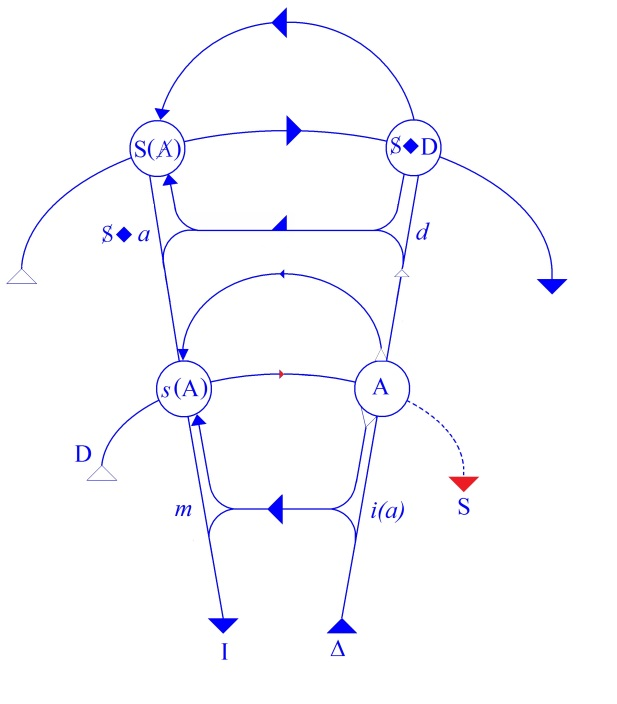

# Leçon 12 | 01 Mars 1961

  

    <label><input type="checkbox" data-lacan-toggle="original" checked> 原文</label>
    <label><input type="checkbox" data-lacan-toggle="notes" checked> 注释</label>
    <label><input type="checkbox" data-lacan-toggle="commentary" checked> 个人解读评论</label>
  

  <form class="lacan-tool-search" role="search">
    <input class="lacan-tool-search-input" type="search" placeholder="搜索全文" aria-label="搜索全文">
    <button class="lacan-tool-button" type="submit" title="搜索">搜索</button>
  </form>
  <button class="lacan-tool-button lacan-back-to-top" type="button" title="回到页面最上方" aria-label="回到页面最上方">↑</button>

<section class="parallel-paragraph" data-paragraph-ids="s8-12-0001">

s8-12-0001

原文 · s8-12-0001

Comme je pense que pour la plupart d’entre vous la chose est encore en votre mémoire, nous sommes donc arrivés au terme du commentaire du *Banquet,* autrement dit du dialogue de PLATON qui - comme je vous l’ai sinon expliqué, au moins indiqué à plusieurs reprises - se trouve historiquement être au départ de ce qu’on peut appeler - plus qu’*une explication*, dans notre *ère culturelle*, de *l’amour -* au départ de ce qu’on peut appeler un développement de cette fonction en somme la plus profonde, la plus radicale, la plus mystérieuse, des rapports entre les sujets.

[无对应译文]

</section>

<section class="parallel-paragraph" data-paragraph-ids="s8-12-0002">

s8-12-0002

原文 · s8-12-0002

À l’horizon de ce que j’ai poursuivi devant vous comme commentaire, il y avait tout le développement de la philosophie antique, et la philosophie antique, vous le savez, n’est pas simplement une position spéculative : des zones entières de la société ont été orientées dans leur action pratique par la spéculation de SOCRATE, il est important de voir que ça n’est pas du tout d’une façon artificielle, fictive en quelque sorte, qu’un HEGEL a fait de positions comme *les positions stoïciennes, épicuriennes*, les antécédents du christianisme. Effectivement ces positions ont été vécues par un très large ensemble de sujets comme quelque chose qui a guidé leur vie, d’une façon qu’on peut dire avoir été effectivement équivalente, antécédente, *préparante* par rapport à ce que leur a apporté par la suite la position chrétienne.

[无对应译文]

</section>

<section class="parallel-paragraph" data-paragraph-ids="s8-12-0003">

s8-12-0003

原文 · s8-12-0003

S’apercevoir que le texte même du *Banquet* a continué à *marquer* profondément quelque chose qui dépasse aussi, dans la position du christianisme, la spéculation, puisqu’on ne peut pas dire que *les positions théologiques fondamentales*, enseignées par le christianisme aient été sans retentissement, sans influencer profondément la problématique de chacun. Et notamment de ceux qui se sont trouvés, dans ce développement historique, être « *en flèche* » par la position d’*exemple* qu’ils assumaient à divers titres - soit par leurs *propos*, soit par leur *action* directive - de ce qu’on appelle « *la sainteté* ».

[无对应译文]

</section>

<section class="parallel-paragraph" data-paragraph-ids="s8-12-0004">

s8-12-0004

原文 · s8-12-0004

Ceci bien sûr n’a pu être qu’indiqué à l’horizon, et pour tout dire, cela nous suffit. Cela nous suffit, car si c’était de ce départ que nous avions voulu nous mêmes activer ce que nous avons à dire, nous l’aurions pris à un niveau ultérieur. C’est justement dans la mesure où ce point initial qu’est *Le Banquet* peut receler en lui *quelque chose* de tout à fait radical dans ce ressort de *l’amour* dont il porte le titre, dont il s’indique comme étant le propos, c’est pour cela que nous avons fait ce commentaire du *Banquet.*

[无对应译文]

</section>

<section class="parallel-paragraph" data-paragraph-ids="s8-12-0005">

s8-12-0005

原文 · s8-12-0005

Nous l’avons conclu la dernière fois en montrant que quelque chose - je crois ne pas exagérer en le disant - a été négligé jusqu’ici par tous les commentateurs du *Banquet,* et qu’à ce titre notre commentaire *constitue* - dans la suite de l’histoire du développement des indications, des *virtualités* qu’il y a dans ce *dialogue* - une date.

[无对应译文]

</section>

<section class="parallel-paragraph" data-paragraph-ids="s8-12-0006">

s8-12-0006

原文 · s8-12-0006

Si, pour autant que nous avons cru voir dans le scénario même de ce qui se passe entre ALCIBIADE et SOCRATE, le dernier mot de ce que PLATON veut nous dire concernant la nature de *l’amour*, il est certain que ceci suppose que PLATON a délibérément, dans *la présentation de* ce qu’on peut appeler « *sa pensée »,* ménagé la place de *l’énigme*, en d’autres termes que sa pensée n’est pas entièrement patente, livrée, développée, dans ce dialogue.

[无对应译文]

</section>

<section class="parallel-paragraph" data-paragraph-ids="s8-12-0007">

s8-12-0007

原文 · s8-12-0007

Or je crois qu’il n’y a rien d’excessif à vous demander d’*admettre ceci* pour la simple raison que, de l’avis de tous les commentateurs, anciens et tout spécialement modernes, de PLATON - le cas n’est pas unique - un examen attentif des « *dialogues* » montre très évidemment que dans ce dialogue il y a un *élément ésotérique*, un élément fermé, et que les modes les plus *singuliers* de cette fermeture touchent - jusques et y compris les pièges les plus caractérisés, confinant jusqu’au leurre - à la difficulté produite comme telle, de façon à ce que *ne comprennent pas ceux qui n’ont pas à comprendre.* \[sic\] Et c’est vraiment structurant, fondamental dans tout ce qui nous est laissé des exposés de PLATON.

[无对应译文]

</section>

<section class="parallel-paragraph" data-paragraph-ids="s8-12-0008">

s8-12-0008

原文 · s8-12-0008

Évidemment *admettre* une telle chose, est aussi *admettre* ce qu’il peut y avoir toujours pour nous de scabreux à nous avancer, à aller plus loin, à essayer de percer, de deviner dans son dernier ressort ce que PLATON nous indique. Il semble que sur cette thématique de *l’amour* à laquelle nous nous sommes limités, telle qu’elle se développe dans *Le Banquet,* il nous soit difficile \- à nous *analystes* - de ne pas reconnaître le pont, *la main qui nous est tendue* dans cette articulation du dernier scénario de la scène du *Banquet,* à savoir ce qui se passe entre ALCIBIADE et SOCRATE. Ceci je vous l’ai articulé et fait sentir *en deux temps* :

[无对应译文]

</section>

<section class="parallel-paragraph" data-paragraph-ids="s8-12-0009">

s8-12-0009

原文 · s8-12-0009

- en vous montrant l’importance qu’avait la déclaration d’ALCIBIADE,

[无对应译文]

</section>

<section class="parallel-paragraph" data-paragraph-ids="s8-12-0010">

s8-12-0010

原文 · s8-12-0010

- en vous montrant ce que nous ne pouvons pas faire autrement que de reconnaître dans ce qu’ALCIBIADE articule autour du thème de l’ἄγαλμα \[agalma\], le thème de *l’objet caché à l’intérieur* du sujet SOCRATE.

[无对应译文]

</section>

<section class="parallel-paragraph" data-paragraph-ids="s8-12-0011">

s8-12-0011

原文 · s8-12-0011

Et j’ai montré qu’il est très difficile que nous ne prenions pas au sérieux, que dans la forme, dans l’articulation, où ceci nous est présenté, ce ne sont pas là propos métaphoriques, jolies images pour dire qu’en gros il attend beaucoup de SOCRATE, mais que se révèle là une structure dans laquelle nous pouvons retrouver ce que nous sommes, nous, capables d’articuler comme tout à fait fondamental dans ce que j’appellerai « *la position du désir* ».

[无对应译文]

</section>

<section class="parallel-paragraph" data-paragraph-ids="s8-12-0012">

s8-12-0012

原文 · s8-12-0012

Ici bien sûr - et je m’en excuse auprès de ceux qui sont ici nouveaux venus - je peux supposer connues par mon auditoire, dans sa caractéristique générale, les élaborations que j’ai déjà données de cette position du sujet, celles qui sont indiquées dans *ce résumé topologique* constitué par *ce que nous appelons* ici conventionnellement « *le graphe »* [^165]…

[无对应译文]

</section>

<section class="parallel-paragraph" data-paragraph-ids="s8-12-0013">

s8-12-0013

原文 · s8-12-0013

[无对应译文]

</section>

<section class="parallel-paragraph" data-paragraph-ids="s8-12-0014">

s8-12-0014

原文 · s8-12-0014

…pour autant que la forme générale en est donnée par *le splitting,* par *le dédoublement* foncier *des deux chaînes signifiantes* où se constitue le sujet, pour autant que nous admettons pour d’ores et déjà *démontré* que ce *dédoublement* - de lui-même nécessité par *le rapport logique, initial, inaugural du sujet au signifiant* comme tel, de *l’existence d’une chaîne signifiante inconsciente* - découle de la seule position du terme de « *sujet* » comme étant déterminé comme *sujet* par le fait qu’il est le support du signifiant. Sans doute - que ceux pour qui ceci n’est qu’affirmation, proposition non encore démontrée se rassurent - nous aurons à y revenir.

[无对应译文]

</section>

<section class="parallel-paragraph" data-paragraph-ids="s8-12-0015">

s8-12-0015

原文 · s8-12-0015

Mais il faut que nous annoncions ce matin que ceci a été antérieurement articulé : que *le désir* comme tel, se présente dans une position - par rapport à *la chaîne signifiante inconsciente* comme constitutive du sujet qui parle - dans la position de ce qui ne peut se concevoir que sur la base de *la métonymie *: déterminé par *l’existence de la chaîne signifiante, par ce quelque chose,* *ce phénomène* qui se produit dans *le support du sujet de la chaîne signifiante* qui s’appelle *métonymie* et qui veut dire que, du fait que le sujet subit *la marque* de *la chaîne signifiante *: quelque chose est possible, quelque chose est foncièrement institué en lui que nous appelons *métonymie,* qui n’est autre que la possibilité du glissement indéfini des signifiants sous la continuité de *la chaîne signifiante *.

[无对应译文]

</section>

<section class="parallel-paragraph" data-paragraph-ids="s8-12-0016">

s8-12-0016

原文 · s8-12-0016

Tout ce qui se trouve une fois *associé* par *la chaîne signifiante*, l’élément circonstanciel avec l’élément d’activité et avec l’élément de l’au-delà du terme sur quoi cette activité débouche, tout cela est en posture de se trouver - dans des conditions appropriées - pouvoir être pris comme *équivalent* les uns des autres : un élément circonstanciel pouvant prendre la valeur *représentative* de ce qui est le terme de l’énonciation subjective de l’objet vers quoi il se dirige, ou, aussi bien, de l’action elle-même du sujet. C’est dans la mesure où quelque chose se présente comme *revalorisant la sorte de glissement infini*, *l’élément dissolutif* qu’apporte par elle-même la fragmentation signifiante dans le sujet, que quelque chose prend valeur d’objet privilégié et arrête ce *glissement infini*.

[无对应译文]

</section>

<section class="parallel-paragraph" data-paragraph-ids="s8-12-0017">

s8-12-0017

原文 · s8-12-0017

C’est dans cette mesure qu’un *objet(a)* prend par rapport au *sujet* cette valeur essentielle qui constitue *le fantasme fondamental* : S◊*a*, *où le sujet lui-même se reconnaît comme arrêté*, ce que nous appelons en analyse - pour vous rappeler ces notions plus familières - « *fixé par rapport à l’objet* » dans cette fonction privilégiée, et que nous appelons *(a)*. *C’est donc dans la mesure où le sujet s’identifie au fantasme fondamental que le désir comme tel prend consistance* et peut être désigné, que *le désir dont il s’agit pour nous est enraciné par sa position même dans l’inconscient*, c’est-à-dire aussi - pour rejoindre notre terminologie - qu’il se pose dans le sujet comme « *désir de l’Autre* ».

[无对应译文]

</section>

<section class="parallel-paragraph" data-paragraph-ids="s8-12-0018">

s8-12-0018

原文 · s8-12-0018

A étant défini pour nous comme *le lieu de la parole*, ce lieu toujours évoqué dès qu’il y a parole, ce lieu tiers qui existe toujours dans les rapports à l’autre dès qu’il y a articulation signifiante. Ce grand A n’est pas un autre absolu, un autre qui serait l’autre de ce que nous appelons dans notre verbigération[^166] morale « *l’autre respecté en tant que sujet, en tant qu’il est moralement notre égal* », non, cet Autre, tel que je vous apprends ici à l’articuler, à la fois nécessité et nécessaire comme lieu, mais en même temps perpétuellement soumis à la question de ce qui le garantit lui-même, *c’est un Autre perpétuellement évanouissant*, et de ce fait même, *qui nous met nous-mêmes dans une position perpétuellement évanouissante*.

[无对应译文]

</section>

<section class="parallel-paragraph" data-paragraph-ids="s8-12-0019">

s8-12-0019

原文 · s8-12-0019

Or, c’est à la *question* posée à l’Autre de « *ce qu’il peut nous donner* », de ce qu’il a à nous répondre, c’est à cette *question* que se rattache *l’amour* comme tel. Non pas que *l’amour* soit identique à chacune des demandes dont nous l’assaillons, mais que *l’amour se situe* *dans l’au-delà de cette demande* en tant que l’Autre peut ou non nous répondre comme dernière présence. Et toute la question est de s’apercevoir du rapport qui lie cet Autre, auquel est adressée la demande d’amour, avec l’apparition de ce terme du *désir* en tant qu’il n’est plus du tout - cet Autre - notre égal, cet Autre auquel nous aspirons, cet Autre *de l’amour,* mais qu’il est *quelque chose* qui, par rapport à cela, en représente à proprement parler une *déchéance*, je veux dire *quelque chose qui est de la nature de l’objet*.

[无对应译文]

</section>

<section class="parallel-paragraph" data-paragraph-ids="s8-12-0020">

s8-12-0020

原文 · s8-12-0020

*Ce dont il s’agit dans le désir c’est d’un objet, non d’un sujet*. *C’est justement ici que gît ce qu’on peut appeler « ce commandement épouvantable »* *du dieu de l’amour* qui est justement de faire de *l’objet* qu’il nous désigne quelque chose qui, premièrement est un objet, et deuxièmement ce devant quoi nous défaillons, nous vacillons, nous disparaissons comme sujet. Car cette *déchéance*, cette dépréciation dont il s’agit, c’est nous comme sujet qui l’encaissons.

[无对应译文]

</section>

<section class="parallel-paragraph" data-paragraph-ids="s8-12-0021">

s8-12-0021

原文 · s8-12-0021

Et ce qui arrive à *l’objet* est justement le contraire, c’est-à-dire - j’emploie là des termes pour me faire entendre, ce ne sont pas les plus *appropriés*, mais qu’importe, il s’agit que ça passe et que *je me fasse entendre -* que cet objet, lui, est survalorisé et c’est en tant qu’il est survalorisé qu’il a cette fonction de sauver notre dignité de sujet, c’est-à-dire : de faire de nous, *autre chose* que ce sujet soumis au glissement infini du signifiant, faire de nous *autre chose* que les « *sujets de la parole* », *ce quelque chose d’unique, d’inappréciable, d’irremplaçable* en fin de compte qui est le véritable point où nous pouvons désigner ce que j’ai appelé « *la dignité du sujet* ».

[无对应译文]

</section>

<section class="parallel-paragraph" data-paragraph-ids="s8-12-0022">

s8-12-0022

原文 · s8-12-0022

L’équivoque, si vous voulez, qu’il y a dans le terme d’*individualité*, ce n’est pas que nous soyons quelque chose d’unique comme corps qui est celui là et pas un autre, l’individualité consiste tout entière dans ce rapport privilégié où nous culminons comme sujet dans le désir. Je ne fais là après tout que de rapporter une fois de plus ce manège de vérité dans lequel nous tournons depuis l’origine de ce séminaire. Il s’agit cette année, avec le transfert, de montrer quelles en sont les conséquences au plus intime de notre pratique. Comment se fait-il que nous y arrivions, à ce transfert, *si tard*, me direz-vous alors ?

[无对应译文]

</section>

<section class="parallel-paragraph" data-paragraph-ids="s8-12-0023">

s8-12-0023

原文 · s8-12-0023

Bien sûr, c’est que *le propre des vérités* est de ne jamais se montrer toutes entières, pour tout dire, que *les vérités sont des solides d’une opacité assez perfide*. Elles n’ont même pas, semble t-il, *cette propriété* que nous sommes capables de réaliser dans les solides, *d’être transparentes*, et de nous montrer à la fois leurs arêtes antérieures et postérieures : il faut en *faire le tour* et même, je dirai, *le tour de passe-passe*.

[无对应译文]

</section>

<section class="parallel-paragraph" data-paragraph-ids="s8-12-0024">

s8-12-0024

原文 · s8-12-0024

Alors pour le transfert, tel que nous l’abordons cette année, vous avez vu que, sous quelque charme que j’aie pu réussir à vous mener un certain temps en vous faisant avec moi vous occuper de *l’amour,* vous avez dû quand même vous apercevoir que je l’abordais par un biais, une pente qui non seulement n’est pas le biais, la pente, classiques, mais en plus qui n’est pas celui par lequel, jusqu’à présent même, j’avais devant vous abordé cette question de transfert. Je veux dire que, jusqu’à présent, j’ai toujours réservé ce que j’ai avancé sur ce thème en vous disant qu’il fallait terriblement se méfier de ce qui est l’apparence, le phénomène le plus habituellement connoté sous les termes par exemple de *transfert positif* ou *négatif*, de l’ordre de la collection des termes dans lesquels non seulement un public plus ou moins informé, mais même nous-mêmes, dans ce discours quotidien, connotons le transfert.

[无对应译文]

</section>

<section class="parallel-paragraph" data-paragraph-ids="s8-12-0025">

s8-12-0025

原文 · s8-12-0025

Je vous ai toujours rappelé qu’il faut partir du fait que *le transfert*, au dernier terme, *c’est* « *l’automatisme de répétition* ». Or il est clair que si depuis le début de l’année je ne fais que vous faire poursuivre les détails, le mouvement, du *Banquet* de PLATON, *De l’Amour*, où il ne s’agit que de *l’amour*, c’est bien évidemment pour vous introduire dans le transfert par un autre bout. Il s’agit donc de joindre *ces deux voies* d’abord. C’est tellement légitime cette distinction, qu’on lit des choses très singulières chez les auteurs, et que justement faute d’avoir les lignes, les guides qui sont celles qu’ici je vous fournis, on arrive à des choses tout à fait étonnantes.

[无对应译文]

</section>

<section class="parallel-paragraph" data-paragraph-ids="s8-12-0026">

s8-12-0026

原文 · s8-12-0026

Je ne serais pas fâché que quelqu’un d’un peu vif nous fit ici un bref rapport, afin que nous puissions vraiment le discuter, et même je le souhaite pour *des raisons tout à fait locales*, *précises* à ce détour de notre séminaire de cette année, sur lesquelles je ne veux pas m’étendre et sur lesquelles je reviendrai, il est certainement nécessaire que certains puissent faire *la médiation* entre cette assemblée assez hétérogène que vous composez et ce que je suis en train d’essayer d’articuler devant vous, puissent faire *la médiation* pour autant qu’il est évidemment très difficile que je m’avance sans cette médiation assez loin, dans un propos qui ne va à rien de moins, que mettre tout à fait à la pointe de ce que nous articulons cette année, *la fonction* comme telle *du désir* non pas seulement chez l’analysé, mais essentiellement *chez l’analyste*.

[无对应译文]

</section>

<section class="parallel-paragraph" data-paragraph-ids="s8-12-0027">

s8-12-0027

原文 · s8-12-0027

On se demande pour qui cela comporte le plus *de risques* :

[无对应译文]

</section>

<section class="parallel-paragraph" data-paragraph-ids="s8-12-0028">

s8-12-0028

原文 · s8-12-0028

- chez ceux qui en savent, pour quelque raison, quelque chose,

[无对应译文]

</section>

<section class="parallel-paragraph" data-paragraph-ids="s8-12-0029">

s8-12-0029

原文 · s8-12-0029

- ou chez ceux qui ne peuvent encore rien en savoir.

[无对应译文]

</section>

<section class="parallel-paragraph" data-paragraph-ids="s8-12-0030">

s8-12-0030

原文 · s8-12-0030

Quoi qu’il en soit, il doit y avoir tout de même moyen d’aborder ce sujet devant un auditoire suffisamment préparé, même s’il n’a pas l’expérience de l’analyse. Ceci étant dit, en 1951 un article d’Herman NUNBERG qui s’appelle *Transference of reality* [^167], qui est quelque chose de tout à fait exemplaire, comme d’ailleurs tout ce qui a été écrit sur le transfert, *des difficultés, des escamotages,* qui se produisent faute d’un abord suffisamment *éclairé*, suffisamment *repéré*, suffisamment *méthodique*,du phénomène du transfert.

[无对应译文]

</section>

<section class="parallel-paragraph" data-paragraph-ids="s8-12-0031">

s8-12-0031

原文 · s8-12-0031

Car il n’est pas très difficile d’y trouver, dans ce court article qui a très exactement neuf pages, que l’auteur va jusqu’à *distinguer* comme essentiellement différents *le transfert* et *l’automatisme de répétition*. Ce sont, dit-il, deux choses différentes. C’est tout de même aller loin. Et ce n’est certes pas ce que moi je vous dis. Je demanderai donc à quelqu’un pour la prochaine fois de faire un rapport en dix minutes de ce qui *lui semble* se dégager de la structure de l’énoncé de cet article et de la façon dont on peut le corriger. Pour l’instant marquons bien ce dont il s’agit.

[无对应译文]

</section>

<section class="parallel-paragraph" data-paragraph-ids="s8-12-0032">

s8-12-0032

原文 · s8-12-0032

À l’origine le transfert est découvert par FREUD comme un processus - je le souligne - spontané. Un processus spontané certes assez inquiétant, comme nous sommes dans l’histoire au début de l’apparition de ce phénomène, pour écarter de la première investigation analytique un pionnier des plus éminents : BREUER. Et très vite il est repéré, lié au plus essentiel de cette « *présence* *du passé* » en tant qu’elle est découverte par l’analyse. Ces termes sont tous très pesés. Je vous prie d’enregistrer ce que je retiens pour fixer les points principaux de la dialectique dont il s’agit.

[无对应译文]

</section>

<section class="parallel-paragraph" data-paragraph-ids="s8-12-0033">

s8-12-0033

原文 · s8-12-0033

Très vite aussi, il est admis - au départ au titre de tentative, puis confirmé par l’expérience - que ce phénomène, en tant que lié au plus essentiel de la « *présence du passé* » découverte par l’analyse, est maniable par l’interprétation. L’interprétation existe déjà à ce moment, pour autant qu’elle s’est manifestée comme un des ressorts nécessaires à la réalisation, à l’accomplissement, de la remémoration dans le sujet. On s’aperçoit qu’il y a autre chose que cette tendance à la remémoration, on ne sait pas encore bien quoi, de toute façon, c’est la même chose. Et ce transfert on l’admet tout de suite comme maniable par l’interprétation donc, si vous voulez, perméable à l’action de la parole, ce qui tout de suite introduit la question qui restera, qui reste encore ouverte pour nous, qui est celle-ci : ce phénomène du transfert est lui-même placé en position de soutien de cette action de la parole.

[无对应译文]

</section>

<section class="parallel-paragraph" data-paragraph-ids="s8-12-0034">

s8-12-0034

原文 · s8-12-0034

En même temps qu’on découvre le transfert, on découvre que si la parole porte comme elle a porté jusque-là, avant qu’on s’en aperçoive, c’est parce qu’il y a là le transfert. De sorte que jusqu’à présent, au dernier terme... et le sujet a été longuement traité et retraité par les auteurs les plus qualifiés dans l’analyse, je signale tout particulièrement l’article de JONES, dans ses *Papers* *on psychoanalysis :* « *La fonction de la suggestion* »[^168], mais il y en a d’innombrables ...la question est restée à l’ordre du jour : celle de l’ambiguïté qui reste toujours, que dans l’état actuel rien ne peut réduire.

[无对应译文]

</section>

<section class="parallel-paragraph" data-paragraph-ids="s8-12-0035">

s8-12-0035

原文 · s8-12-0035

Ceci :

[无对应译文]

</section>

<section class="parallel-paragraph" data-paragraph-ids="s8-12-0036">

s8-12-0036

原文 · s8-12-0036

- que le transfert, si interprété soit-il, garde en lui-même comme une espèce de *limite* irréductible, que dans les conditions centrales normales de l’analyse, dans les névroses, il sera interprété \[on interprétera\] sur la base et avec l’instrument du transfert lui-même, ce qui ne pourra se faire qu’à un accent près,

[无对应译文]

</section>

<section class="parallel-paragraph" data-paragraph-ids="s8-12-0037">

s8-12-0037

原文 · s8-12-0037

- que c’est de la position que lui donne *le transfert* que l’analyste analyse, interprète et intervient sur le transfert lui-même.

[无对应译文]

</section>

<section class="parallel-paragraph" data-paragraph-ids="s8-12-0038">

s8-12-0038

原文 · s8-12-0038

Une marge pour tout dire irréductible de *suggestion* reste du dehors comme un élément toujours suspect, non de ce qui se passe, du dehors on ne peut le savoir, mais de ce que la théorie est capable de produire. En fait, comme on dit : « *ce ne sont pas ces difficultés* *qui empêchent d’avancer* ». Il n’en reste pas moins qu’il faut en fixer *les limites*, « *l’aporie théorique* » et que peut-être ceci nous introduit-il à une certaine possibilité de *passer outre* ultérieurement. Observons bien tout de même ce qu’il en est - je veux dire concernant ce qui se passe - et peut-être pourrons-nous d’ores et déjà nous apercevoir par quelles voies on peut passer outre.

[无对应译文]

</section>

<section class="parallel-paragraph" data-paragraph-ids="s8-12-0039">

s8-12-0039

原文 · s8-12-0039

La «  *présence du passé*  » donc, telle est *la réalité* du transfert. Est-ce qu’il n’y a pas d’ores et déjà quelque chose qui s’impose, qui nous permet de la formuler d’une façon plus complète ? C’est « *une présence* » - un peu plus qu’une présence - c’est « *une présence en acte »* et, comme les termes allemand et français l’indiquent, une reproduction. Je veux dire que ce qui n’est pas assez articulé, pas assez mis en évidence dans *ce qu’on dit ordinairement*, c’est en quoi cette reproduction se distingue d’une simple passivation du sujet.

[无对应译文]

</section>

<section class="parallel-paragraph" data-paragraph-ids="s8-12-0040">

s8-12-0040

原文 · s8-12-0040

Si c’est une reproduction, si c’est *quelque chose en acte*, il y a dans la manifestation du transfert quelque chose de créateur. Cet élément me parait tout à fait *essentiel* à articuler, et comme toujours, si je le mets en valeur, ça n’est pas que le repérage n’en soit déjà décelable d’une façon plus ou moins obscure dans ce qu’ont déjà articulé les auteurs.

[无对应译文]

</section>

<section class="parallel-paragraph" data-paragraph-ids="s8-12-0041">

s8-12-0041

原文 · s8-12-0041

Car si vous vous reportez au rapport qui fait date de Daniel LAGACHE[^169], vous verrez que c’est là ce qui fait le nerf, la pointe de cette distinction qu’il a introduite, mais qui à mon sens reste un peu vacillante et trouble de ne pas voir cette dernière pointe, de la distinction qu’il a introduite de l’opposition autour de laquelle il a voulu faire tourner sa distinction du transfert entre « *répétition du besoin* » et « *besoin de répétition* ». Car si didactique que soit cette opposition, en réalité elle n’est pas incluse, n’est même pas un seul instant véritablement en question, dans ce que nous expérimentons du transfert.

[无对应译文]

</section>

<section class="parallel-paragraph" data-paragraph-ids="s8-12-0042">

s8-12-0042

原文 · s8-12-0042

Il n’y a pas de doute, quand il s’agit du « *besoin de répétition* », nous ne pouvons pas formuler autrement les *phénomènes* du transfert que sous cette forme *énigmatique* : pourquoi faut-il que le sujet répète à perpétuité cette signification, au sens positif du terme, ce qu’il nous signifie par sa conduite ?

[无对应译文]

</section>

<section class="parallel-paragraph" data-paragraph-ids="s8-12-0043">

s8-12-0043

原文 · s8-12-0043

Appeler ça « *besoin* », c’est déjà infléchir dans un certain sens, ce dont il s’agit.

[无对应译文]

</section>

<section class="parallel-paragraph" data-paragraph-ids="s8-12-0044">

s8-12-0044

原文 · s8-12-0044

Et à cet égard on conçoit en effet que la référence à une donnée psychologique opaque, comme celle que connote purement et simplement Daniel LAGACHE dans son rapport : « *l’effet Zeigarnik* » [^170], après tout respecte mieux ce qui est à préserver dans ce qui fait la stricte originalité de ce dont il s’agit dans le transfert.

[无对应译文]

</section>

<section class="parallel-paragraph" data-paragraph-ids="s8-12-0045">

s8-12-0045

原文 · s8-12-0045

Car il est clair que tout, d’autre part, nous indique que si ce que nous faisons, nous le faisons en tant que le transfert est la répétition d’un besoin - d’un besoin qui peut manifester là le transfert et là le besoin - nous arrivons à *une impasse*, puisque nous passons, par ailleurs, notre temps *à dire que c’est* *une ombre de besoin*, un besoin déjà depuis longtemps dépassé, et que c’est pour cela que sa *répétition* est possible. Et aussi bien ici nous arrivons au point où *le transfert* apparaît comme à proprement parler *une source de fiction*.

[无对应译文]

</section>

<section class="parallel-paragraph" data-paragraph-ids="s8-12-0046">

s8-12-0046

原文 · s8-12-0046

Le sujet dans le transfert feint, fabrique, construit quelque chose, et alors il semble qu’il n’est pas possible de ne pas tout de suite intégrer à la fonction du transfert ce terme, qui est d’abord : quelle est la nature de cette fiction, quelle en est *la source* d’une part, *l’objet* d’autre part ? Et s’il s’agit de fiction : *qu’est-ce qu’on feint ? Et puisqu’il s’agit de feindre : pour qui* ? Il est bien clair que si on ne répond pas tout de suite *: « Pour la personne à qui on s’adresse », c’est parce qu’on ne peut pas ajouter : « le sachant* ». C’est parce que d’ores et déjà on est très éloigné par ce phénomène de toute hypothèse même *de ce qu’on peut appeler* massivement par son nom : simulation.

[无对应译文]

</section>

<section class="parallel-paragraph" data-paragraph-ids="s8-12-0047">

s8-12-0047

原文 · s8-12-0047

Donc ce n’est pas pour la personne à qui on s’adresse en tant qu’on le sait. Mais ça n’est pas parce que c’est le contraire, à savoir que c’est en tant qu’on ne le sait pas, qu’il faut croire que, pour autant, la personne à qui on s’adresse est là tout d’un coup *volatilisée, évanouie*. Car tout ce que nous savons de l’inconscient, à partir du départ, à partir du rêve, nous indique - *et l’expérience nous montre* - qu’il y a des phénomènes psychiques qui se *produisent*, se développent, se construisent pour être entendus, donc justement pour cet autre qui est là. Même si on ne le sait pas, même si on ne sait pas qu’ils sont là pour être entendus : ils sont là pour être entendus, et pour être entendus par un autre. En d’autres termes, il me parait impossible d’éliminer du *phénomène du transfert* le fait qu’il se *manifeste* dans le rapport à quelqu’un à qui l’*on parle*.

[无对应译文]

</section>

<section class="parallel-paragraph" data-paragraph-ids="s8-12-0048">

s8-12-0048

原文 · s8-12-0048

Ceci en est constitutif, constitue une frontière, et nous indique du même coup de ne pas noyer son phénomène dans la possibilité générale de répétition que constitue l’existence de l’inconscient. Hors de l’analyse il y a des *répétitions* liées bien sûr à la constance de *la chaîne signifiante inconsciente* dans le sujet. Ces *répétitions*, même si elles peuvent dans certains cas avoir des effets homologues, sont strictement à distinguer de ce que nous appelons « *le transfert* », et en ce sens, justifient la distinction où se laisse, vous le verrez, glisser par un tout autre bout - mais par un bout d’erreur - le personnage pourtant fort remarquable qu’est Herman NUNBERG.

[无对应译文]

</section>

<section class="parallel-paragraph" data-paragraph-ids="s8-12-0049">

s8-12-0049

原文 · s8-12-0049

Ici je vais un instant reglisser, pour vous en montrer le caractère vivifiant, un morceau, un segment de notre exploration du *Banquet.* Rappelez-vous la scène extraordinaire, et tâchez de la situer dans nos termes, que constitue la confession publique d’ALCIBIADE. Vous devez bien sentir le poids tout à fait remarquable qui s’attache à cette action. Vous devez bien sentir qu’il y a là quelque chose qui va bien au-delà d’un pur et simple *compte-rendu* de ce qui s’est passé entre lui et SOCRATE. Ça n’est pas neutre, et la preuve c’est que, même avant de commencer, lui-même se met à l’abri de je ne sais quelle invocation du secret, qui ne vise pas simplement à le protéger lui-même. Il dit :

[无对应译文]

</section>

<section class="parallel-paragraph" data-paragraph-ids="s8-12-0050">

s8-12-0050

原文 · s8-12-0050

> « *Que ceux qui ne sont pas capables ni dignes d’entendre, les esclaves qui sont là, se bouchent les oreilles !* » \[218b\]

[无对应译文]

</section>

<section class="parallel-paragraph" data-paragraph-ids="s8-12-0051">

s8-12-0051

原文 · s8-12-0051

Car il y a des choses qu’il vaut mieux ne pas entendre quand on n’est pas à portée de les entendre. Il se confesse devant qui ? Les autres, tous les autres, ceux qui par leur *concert*, leur corps, leur concile, leur pluralité, semblent constituer, donner le plus de poids possible à ce qu’on peut appeler « *le tribunal de l’Autre* ». Et ce qui fait la valeur de la confession d’ALCIBIADE devant ce tribunal c’est un rapport

[无对应译文]

</section>

<section class="parallel-paragraph" data-paragraph-ids="s8-12-0052">

s8-12-0052

原文 · s8-12-0052

- où justement il a tenté de faire de SOCRATE *quelque chose* de complètement *subordonné*, *soumis* à une autre valeur que celle du rapport de *sujet à sujet*,

[无对应译文]

</section>

<section class="parallel-paragraph" data-paragraph-ids="s8-12-0053">

s8-12-0053

原文 · s8-12-0053

- où il a, vis-à-vis de SOCRATE, manifesté une tentative de séduction,

[无对应译文]

</section>

<section class="parallel-paragraph" data-paragraph-ids="s8-12-0054">

s8-12-0054

原文 · s8-12-0054

- où ce qu’il a voulu faire de SOCRATE, et de la façon la plus avouée, c’est quelqu’un d’*instrumental*, de subordonné - à quoi ? - à *l’objet de son désir* à lui ALCIBIADE, qui est ἄγαλμα \[agalma\], le bon objet.

[无对应译文]

</section>

<section class="parallel-paragraph" data-paragraph-ids="s8-12-0055">

s8-12-0055

原文 · s8-12-0055

Et je dirai plus, comment ne pas reconnaître - nous analystes - ce dont il s’agit, parce que c’est dit en clair : c’est le *bon objet* qu’il a dans le ventre. SOCRATE n’est plus là que l’enveloppe de ce qui est l’objet du désir. Et c’est pour bien marquer qu’il n’est que cette enveloppe, c’est pour cela qu’il a voulu manifester :

[无对应译文]

</section>

<section class="parallel-paragraph" data-paragraph-ids="s8-12-0056">

s8-12-0056

原文 · s8-12-0056

- que SOCRATE est, par rapport à lui, *le serf du désir*,

[无对应译文]

</section>

<section class="parallel-paragraph" data-paragraph-ids="s8-12-0057">

s8-12-0057

原文 · s8-12-0057

- que SOCRATE lui est asservi par le désir,

[无对应译文]

</section>

<section class="parallel-paragraph" data-paragraph-ids="s8-12-0058">

s8-12-0058

原文 · s8-12-0058

- et que le désir de SOCRATE, encore qu’il le connût, il a voulu le voir se manifester dans son signe pour savoir que l’autre objet, ἄγαλμα \[agalma\], était *à sa merci*.

[无对应译文]

</section>

<section class="parallel-paragraph" data-paragraph-ids="s8-12-0059">

s8-12-0059

原文 · s8-12-0059

Or pour ALCIBIADE c’est justement d’avoir échoué dans cette entreprise qui le couvre de honte, et fait de sa *confession* quelque chose d’aussi chargé. C’est que le démon de l’Αίδώς \[Aidôs\], de la *Pudeur,* dont j’ai fait état devant vous en son temps à ce propos[^171], est ici ce qui intervient, c’est cela qui est violé.

[无对应译文]

</section>

<section class="parallel-paragraph" data-paragraph-ids="s8-12-0060">

s8-12-0060

原文 · s8-12-0060

C’est que devant tous est dévoilé dans son trait, dans son secret, le plus choquant, le dernier ressort du désir, ce quelque chose qui oblige toujours plus ou moins dans l’amour à le dissimuler, *c’est que sa visée c’est cette chute de l’Autre (grand A) en autre (petit a)*, et que par dessus le marché dans cette occasion, il apparaît qu’ALCIBIADE a échoué dans son entreprise, en tant que cette entreprise nommément, était de faire, de cet échelon, déchoir SOCRATE.

[无对应译文]

</section>

<section class="parallel-paragraph" data-paragraph-ids="s8-12-0061">

s8-12-0061

原文 · s8-12-0061

Que peut-on voir de plus proche en apparence de ce qu’on peut appeler, de ce qu’on pourrait croire être le dernier terme d’une recherche de la vérité, non pas dans sa fonction d’épure, d’abstraction, de neutralisation de tous les éléments, mais bien au contraire dans ce qu’elle apporte de valeur, de résolution, d’absolution dans ce dont il s’agit et dont vous voyez bien que c’est quelque chose de bien différent du simple phénomène d’une tâche non achevée, comme on dit, *Zeigarnik,* c’est autre chose.

[无对应译文]

</section>

<section class="parallel-paragraph" data-paragraph-ids="s8-12-0062">

s8-12-0062

原文 · s8-12-0062

La confession publique avec toute la charge *religieuse* que nous y attachons - à tort ou à raison - est bien là ce dont il semble qu’il s’agit. Comme elle est faite jusqu’à son dernier terme, est-ce qu’il ne semble pas aussi bien que sur ce témoignage éclatant, rendu sur la supériorité de SOCRATE devrait s’achever l’hommage rendu au maître, et peut-être ce que de certains ont désigné comme la valeur apologétique du *Banquet ?*

[无对应译文]

</section>

<section class="parallel-paragraph" data-paragraph-ids="s8-12-0063">

s8-12-0063

原文 · s8-12-0063

Vu les accusations dont SOCRATE, même après sa mort restait chargé, puisque le pamphlet d’un nommé POLYCRATE l’accuse encore à l’époque - et chacun sait que *Le Banquet* a été fait en partie en relation à ce libelle, nous avons quelques citations d’autres auteurs - d’avoir si l’on peut dire « *dévoyé* » ALCIBIADE et bien d’autres encore, de leur avoir indiqué que la voie était libre pour la satisfaction de tous leurs *désirs*, or qu’est-ce que nous voyons ? C’est que paradoxalement, devant cette mise au jour d’une vérité qui semble en quelque sorte se suffire à elle-même, mais dont tout un chacun sent que la question reste :

[无对应译文]

</section>

<section class="parallel-paragraph" data-paragraph-ids="s8-12-0064">

s8-12-0064

原文 · s8-12-0064

- Pourquoi tout ceci ?

[无对应译文]

</section>

<section class="parallel-paragraph" data-paragraph-ids="s8-12-0065">

s8-12-0065

原文 · s8-12-0065

- À qui ça s’adresse ?

[无对应译文]

</section>

<section class="parallel-paragraph" data-paragraph-ids="s8-12-0066">

s8-12-0066

原文 · s8-12-0066

- Qui s’agit-il d’instruire au moment où la confession se produit (ça n’est certainement pas les accusateurs de SOCRATE) ?

[无对应译文]

</section>

<section class="parallel-paragraph" data-paragraph-ids="s8-12-0067">

s8-12-0067

原文 · s8-12-0067

- Quel est le désir qui pousse ALCIBIADE à se déshabiller ainsi en public ?

[无对应译文]

</section>

<section class="parallel-paragraph" data-paragraph-ids="s8-12-0068">

s8-12-0068

原文 · s8-12-0068

Est-ce qu’il n’y a pas là un paradoxe qui vaut d’être relevé et dont vous le verrez à y regarder de près qu’il n’est pas si simple ? C’est que ce que *tout le monde* perçoit comme *une interprétation* de SOCRATE l’est en effet. SOCRATE lui rétorque :

[无对应译文]

</section>

<section class="parallel-paragraph" data-paragraph-ids="s8-12-0069">

s8-12-0069

原文 · s8-12-0069

« *Tout ce que tu viens de faire là, et Dieu sait que ça n’est pas évident, c’est pour Agathon. Ton désir est plus secret que tout le dévoilement* *auquel tu viens de te livrer et vise maintenant encore un autre - petit a - et cet autre, je te le désigne, c’est Agathon* ».

[无对应译文]

</section>

<section class="parallel-paragraph" data-paragraph-ids="s8-12-0070">

s8-12-0070

原文 · s8-12-0070

Paradoxalement, dans cette situation, ainsi ça n’est pas quelque chose de fantasmatique, quelque chose qui vient du fond du passé et qui n’a plus d’existence qui est ici par cette interprétation de SOCRATE mis à la place de ce qui se manifeste, ici, c’est la réalité bel et bien - à entendre SOCRATE - qui ferait office de ce que nous appellerions *un transfert* dans le procès de *la recherche de la vérité.* En d’autres termes, pour bien que vous m’entendiez, c’est comme si quelqu’un venait dire pendant le procès d’ŒDIPE :

[无对应译文]

</section>

<section class="parallel-paragraph" data-paragraph-ids="s8-12-0071">

s8-12-0071

原文 · s8-12-0071

« ŒDIPE *ne poursuit d’une façon si haletante cette recherche de la vérité qui doit le mener à sa perte que parce qu’il n’a qu’une fin,* *c’est partir, s’envoler, s’échapper avec* ANTIGONE… ».

[无对应译文]

</section>

<section class="parallel-paragraph" data-paragraph-ids="s8-12-0072">

s8-12-0072

原文 · s8-12-0072

Telle est la situation paradoxale devant quoi nous met l’interprétation de SOCRATE. Il est bien clair que tout le chatoiement de détails, le biais par lequel ça peut servir à « *éblouir les moineaux* », de faire un acte si brillant, de montrer de quoi on est capable, de tout cela en fin de compte *rien ne tient*. Il s’agit bel et bien de quelque chose dont on se demande alors jusqu’où SOCRATE sait ce qu’il fait.

[无对应译文]

</section>

<section class="parallel-paragraph" data-paragraph-ids="s8-12-0073">

s8-12-0073

原文 · s8-12-0073

Car SOCRATE répondant à ALCIBIADE semble tomber sous le coup des accusations de POLYCRATE, car lui SOCRATE, savant dans les matières de l’amour, lui désigne *où est son désir* et fait bien plus que le *désigner* puisqu’il va en quelque sorte jouer le jeu de ce désir par procuration. Et lui SOCRATE, tout de suite après s’apprêtera à faire l’éloge d’AGATHON qui tout d’un coup par un arrêt de la caméra est escamoté - nous n’y voyons que du feu - par une nouvelle entrée de fêtards. Grâce à cela la question reste énigmatique.

[无对应译文]

</section>

<section class="parallel-paragraph" data-paragraph-ids="s8-12-0074">

s8-12-0074

原文 · s8-12-0074

Le dialogue peut revenir indéfiniment sur lui-même et nous ne saurons pas ce que SOCRATE sait de ce qu’il fait ou bien si c’est PLATON qui à ce moment-là se substitue à lui - sans doute, puisque c’est lui qui a écrit le dialogue, lui le sachant un peu plus - à savoir permettant aux siècles de s’égarer sur ce que lui, PLATON, nous désigne comme la vraie raison de l’amour qui est de mener le sujet sur - quoi ? - les échelons que lui indique *l’ascension vers un « Beau »* de plus en plus confondu avec le « *Beau suprême* ». Ça, c’est du PLATON.

[无对应译文]

</section>

<section class="parallel-paragraph" data-paragraph-ids="s8-12-0075">

s8-12-0075

原文 · s8-12-0075

Ceci dit ce n’est pas du tout ce à quoi - à suivre le texte - nous nous sentons obligés. Tout au plus, comme analystes, pourrions-nous dire que si le désir de SOCRATE, comme il semble être indiqué dans ses propos, n’est autre chose que d’amener ses interlocuteurs au Γνῶθι σεαυτόν \[gnôthi seauton\][^172], ce qui se traduit dans un autre registre par « *occupe-toi de ton âme* ».

[无对应译文]

</section>

<section class="parallel-paragraph" data-paragraph-ids="s8-12-0076">

s8-12-0076

原文 · s8-12-0076

À l’extrême nous pouvons penser que tout ceci est à prendre au sérieux, que pour une part, et je vous expliquerai *par quel mécanisme,* SOCRATE est un de ceux à qui nous devons *d’avoir une âme*, je veux dire, d’avoir donné consistance à un certain point désigné par l’interrogation socratique avec, vous le verrez, tout ce qu’elle engendre de transfert et de qualités.

[无对应译文]

</section>

<section class="parallel-paragraph" data-paragraph-ids="s8-12-0077">

s8-12-0077

原文 · s8-12-0077

Mais s’il est vrai que ce que SOCRATE désigne ainsi c’est, *sans le savoir,* « *le désir du sujet* » tel que je le définis et tel qu’effectivement il \[Socrate\] se manifeste devant nous s’en faire ce qu’il faut bien appeler le *complice*, si c’est cela et qu’il le fasse *sans le savoir*, voici SOCRATE à une place que nous pouvons tout à fait comprendre et comprendre en même temps comment en fin de compte il a enflammé ALCIBIADE.

[无对应译文]

</section>

<section class="parallel-paragraph" data-paragraph-ids="s8-12-0078">

s8-12-0078

原文 · s8-12-0078

Car...

[无对应译文]

</section>

<section class="parallel-paragraph" data-paragraph-ids="s8-12-0079">

s8-12-0079

原文 · s8-12-0079

- *si le désir dans sa racine, dans son essence c’est le désir de l’Autre*, *c’est ici à proprement parler qu’est* *le ressort de la naissance de l’amour*,

[无对应译文]

</section>

<section class="parallel-paragraph" data-paragraph-ids="s8-12-0080">

s8-12-0080

原文 · s8-12-0080

- si *l’amour* c’est ce qui se passe chez cet objet vers lequel nous tendons la main par notre propre *désir,* et qui, au moment *où il fait éclater son incendie*, nous laisse apparaître un instant cette *réponse *: *cette autre main, celle qui se tend vers vous comme son désir,*

[无对应译文]

</section>

<section class="parallel-paragraph" data-paragraph-ids="s8-12-0081">

s8-12-0081

原文 · s8-12-0081

- si ce *désir* se manifeste toujours pour autant que nous ne savons pas : « *Et Ruth ne savait pas ce que Dieu voulait d’elle...* », pour ne pas savoir ce que Dieu voulait d’elle, il fallait tout de même qu’il fût question que Dieu voulût d’elle quelque chose et si elle n’en sait rien ça n’est pas parce qu’on ne sait pas « *ce que Dieu voulait d’elle…* » mais parce qu’à cause de ce mystère, Dieu est éclipsé mais toujours là. ...c’est dans la mesure où ce que SOCRATE désire il ne le *sait* pas, et que c’est le désir de l’Autre, c’est dans cette mesure qu’ALCIBIADE est possédé par - quoi ? - par un amour dont on peut dire que le seul mérite de SOCRATE c’est de le désigner comme *amour de transfert*, de le renvoyer à son véritable désir.

[无对应译文]

</section>

<section class="parallel-paragraph" data-paragraph-ids="s8-12-0082">

s8-12-0082

原文 · s8-12-0082

Tels sont les points que je voulais refixer, replacer aujourd’hui pour poursuivre la prochaine fois sur ce que je pense pouvoir montrer avec *évidence*, c’est combien cet apologue, cette articulation *dernière*, ce scénario - qui confine au mythe - du dernier terme du *Banquet* nous permet de structurer, d’articuler autour de la position des *deux désirs*, cette situation - que nous pourrons alors vraiment restituer à son véritable sens de situation à deux, à deux réels - qu’est la situation de *l’analysé* en présence de *l’analyste*.

[无对应译文]

</section>

<section class="parallel-paragraph" data-paragraph-ids="s8-12-0083">

s8-12-0083

原文 · s8-12-0083

Et du même coup mettre exactement à leur place les phénomènes d’*amour* quelquefois ultra-précoces, si déroutants pour ceux qui abordent ces phénomènes, précoces puis progressivement plus complexes, à mesure qu’ils se font dans l’analyse plus tardifs, bref, tout le contenu de ce qui se passe sur le *plan* qu’on appelle « *imaginaire  *», pour lequel tout le développement des théories modernes de l’analyse a cru devoir construire, et non sans fondement :

[无对应译文]

</section>

<section class="parallel-paragraph" data-paragraph-ids="s8-12-0084">

s8-12-0084

原文 · s8-12-0084

- toute la théorie de *la relation d’objet*,

[无对应译文]

</section>

<section class="parallel-paragraph" data-paragraph-ids="s8-12-0085">

s8-12-0085

原文 · s8-12-0085

- toute la théorie de *la projection* en tant que ce terme est bien loin effectivement de se suffire,

[无对应译文]

</section>

<section class="parallel-paragraph" data-paragraph-ids="s8-12-0086">

s8-12-0086

原文 · s8-12-0086

- toute la théorie en fin de compte de ce qu’est *l’analyste,* pendant *l’analyse,* pour *l’analysé,* …lequel *plan imaginaire* ne peut se concevoir sans une correcte position de ce que l’analyste lui-même occupe la position qu’il occupe par rapport au désir constitutif de l’analyse et ce avec quoi le sujet part dans l’analyse : « *qu’est-ce qu’il veut ?* ».

[无对应译文]

</section>

<section class="parallel-paragraph" data-paragraph-ids="s8-12-0087">

s8-12-0087

原文 · s8-12-0087

&nbsp;

[无对应译文]

</section>

<section class="note-block original-notes">

## Notes

[^165]: Cf. séminaire 1957-1958 : *Les formations de l’inconscient*.

[^166]: Chez certains malades mentaux, *maniaques, schizophrènes* : déclamation de séries de mots sans suite, souvent grossiers, en général toujours les mêmes.

[^167]: Le titre exact de l’article est : « *Transference and reality* », *The International Journal of Psycho-analysis, vol*. *XXXII, 1951*. Une traduction en a été faite par

    la *Documentation psychanalytique,* cahier n° 8, sous le titre : « [Transfert et Réalité](http://www.psychanalyse.lu/articles/NunbergTransfertRealite.htm) ».

[^168]: Ernest Jones : *Théorie et pratique de la psychanalyse*, Payot 1969, chap. XIX, « *La suggestion et son action thérapeutique* ».

[^169]: Rapport de D. Lagache sur le transfert au Congrès *« des psychanalystes de langue romane de 1951* ». *Revue française de psychanalyse*. [t. XVI, 1952, p. 5-122](http://gallica.bnf.fr/ark:/12148/bpt6k5443797q.image.langEN).

[^170]: L’effet de *Zeigarnik* est défini par Lacan en note, page 215 des *Écrits*. Il y fait référence à l’intervention de M. Benassy répondant à D. Lagache au Congrès...

    L’effet Zeigarnik désigne la tendance à mieux se rappeler une tâche qu'on a réalisée si celle-ci a été interrompue.

[^171]: Cf. Écrits : « *La signification du phallus* », p. 692.

[^172]: Γνῶθι σεαυτόν \[gnôthi seauton\] peut se traduire par « *Connais-toi toi-même* », un des trois préceptes inscrits sur le fronton du temple de Delphes.

</section>
