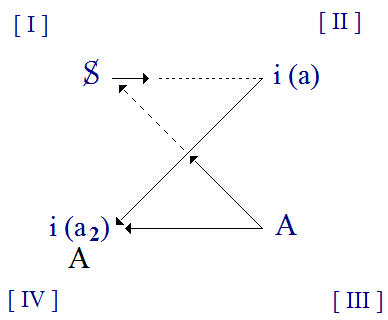
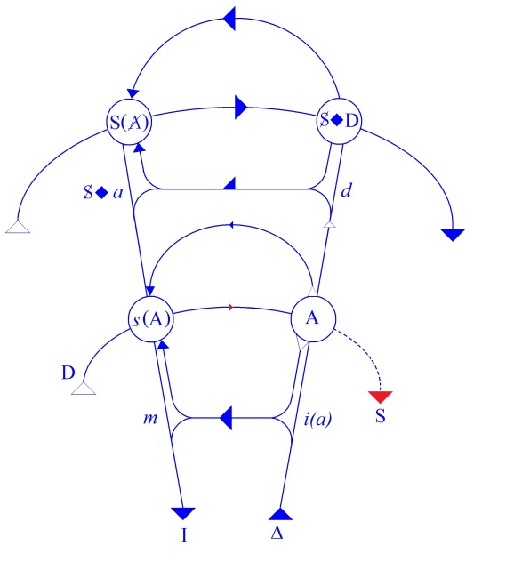
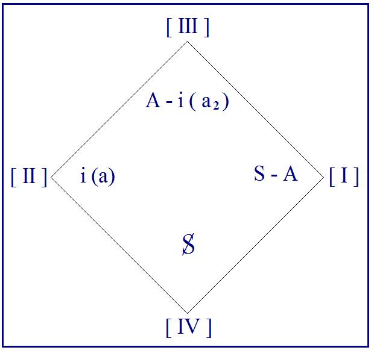

# Leçon 13 | 08 Mars 1961

  <label><input type="checkbox" data-lacan-toggle="original" checked> 原文</label>
  <label><input type="checkbox" data-lacan-toggle="notes" checked> 注释</label>
  <label><input type="checkbox" data-lacan-toggle="commentary" checked> 个人解读评论</label>

<section class="parallel-paragraph" data-paragraph-ids="s8-13-0001">

s8-13-0001

[无对应译文]

原文 · s8-13-0001

J’ai terminé la dernière fois - à votre satisfaction semble-t-il - sur la pointe de ce qui constituait un des éléments, peut-être l’élément fondamental de la position du sujet dans l’analyse. C’était cette question, qui pour nous se recoupe avec *la définition du désir comme* *le désir de l’Autre,* cette question qui est en somme celle qui est marginale, mais de par là s’indique comme foncière dans la position de *l’analysé* par rapport à *l’analyste*, même s’il ne se la formule pas : « *qu’est-ce qu’il veut ?* ».

</section>

<section class="parallel-paragraph" data-paragraph-ids="s8-13-0002">

s8-13-0002

[无对应译文]

原文 · s8-13-0002

Aujourd’hui nous allons refaire un pas en arrière après avoir poussé cette pointe et nous proposer de centrer d’une part ce que nous avions annoncé au début dans notre propos de la dernière fois, nous avancer dans l’examen des modes sous lesquels les autres théoriciens que nous-mêmes, de par les évidences de leur praxis, manifestent en somme la même topologie que celle que je suis en train de déployer, d’essayer de fonder devant vous-mêmes, topologie en tant qu’elle rend possible le transfert.

</section>

<section class="parallel-paragraph" data-paragraph-ids="s8-13-0003">

s8-13-0003

[无对应译文]

原文 · s8-13-0003

Il n’est pas forcé, en effet, qu’ils la formulent comme nous pour en témoigner - ceci me semble d’évidence - à leur façon. Comme je l’ai écrit quelque part, on n’a pas besoin d’avoir le plan d’un appartement pour se *cogner la tête contre les murs*. Je dirai même plus, pour cette opération on s’en passe assez bien, du plan, normalement[^173]. Par contre, la *réciproque* n’est pas vraie en ce sens que, contrairement à un schéma primitif de l’épreuve de la réalité, il ne suffit pas de *se cogner la tête contre les murs* pour reconstituer le plan d’un appartement, surtout si on fait cette expérience dans l’obscurité.

</section>

<section class="parallel-paragraph" data-paragraph-ids="s8-13-0004">

s8-13-0004

[无对应译文]

原文 · s8-13-0004

L’exemple qui m’est cher de « *Théodore cherche des allumettes »* est là pour vous l’illustrer dans COURTELINE[^174]. Ceci dit, c’est une *métaphore* peut-être un peu forcée, peut-être pas non plus si forcée qu’il peut encore vous apparaître, et c’est ce que nous allons voir à l’épreuve, à l’épreuve de ce qui se passe actuellement, de nos jours, quand les analystes parlent de quoi ?

</section>

<section class="parallel-paragraph" data-paragraph-ids="s8-13-0005">

s8-13-0005

[无对应译文]

原文 · s8-13-0005

Nous allons, je crois, droit au plus actuel de cette question telle qu’elle se propose pour eux, et là même, vous le sentez bien, où je la centre cette année : du côté de l’analyste. Et pour tout dire, c’est à proprement parler ce qu’ils articulent le mieux quand ils abordent - les théoriciens, et les théoriciens les plus avancés, les plus lucides - la question dite du « *contre-transfert* ».

</section>

<section class="parallel-paragraph" data-paragraph-ids="s8-13-0006">

s8-13-0006

[无对应译文]

原文 · s8-13-0006

Je voudrais vous rappeler là-dessus les *vérités premières*. Ce n’est pas *parce qu’elles sont premières* qu’elles sont toujours exprimées, et si « *elles vont sans dire* », elles vont encore mieux en les disant. Pour la question du « *contre-transfert* », il y a d’abord *l’opinion commune*, celle de chacun pour avoir un peu approché le problème, là où il la situe d’abord, c’est-à-dire *l’idée première* qu’on s’en fait, je dirai aussi *la première, la plus commune* qui en a été donnée mais aussi le plus ancien abord de cette question.

</section>

<section class="parallel-paragraph" data-paragraph-ids="s8-13-0007">

s8-13-0007

[无对应译文]

原文 · s8-13-0007

Il y a toujours eu cette notion du « *contre-transfert* » présente dans l’analyse - je veux dire très tôt, au début de l’élaboration de cette notion de transfert - tout ce qui chez l’analyste représente son inconscient en tant que non analysé, dirons-nous, est nocif pour sa fonction, pour son opération d’analyste, en tant qu’à partir de là nous avons la source de réponses non maîtrisées et surtout, dans l’opinion qu’on s’en fait, *de réponses aveugles* dont, dans toute la mesure où quelque chose est resté dans l’ombre, et c’est pour cela qu’on insiste sur la nécessité d’une analyse didactique complète, poussée fort loin - nous commençons dans des termes vagues pour commencer - c’est parce que, comme c’est écrit quelque part, il résultera de cette négligence de tel ou tel coin de l’inconscient de l’analyste de véritables *taches aveugles*, d’où « résulterait » - je le mets *au conditionnel*, c’est un discours effectivement tenu, que je mets entre guillemets, sous réserves, auquel je ne souscris pas d’emblée mais qui est admis - éventuellement tel ou tel fait plus ou moins grave, plus ou moins fâcheux dans la pratique de l’analyse, de non reconnaissance, d’intervention manquée, d’inopportunité de telle autre intervention, voire même d’erreur.

</section>

<section class="parallel-paragraph" data-paragraph-ids="s8-13-0008">

s8-13-0008

[无对应译文]

原文 · s8-13-0008

Mais d’autre part on ne peut pas manquer de rapprocher de ce propos ceci : qu’il est dit que c’est à *la communication des inconscients* qu’en fin de compte il faut se fier au mieux pour que se produisent chez l’analyste les aperceptions décisives, les *insights* les meilleurs. Ce n’est pas tellement d’une longue expérience, d’une connaissance étendue de ce qu’il peut rencontrer dans la structure que nous devons attendre la plus grande pertinence - *ce « saut du lion » dont nous parle* FREUD quelque part et qui ne se fait qu’une fois dans ses réalisations les meilleures[^175]. On nous dit que *c’est à la communication des inconscients que ressortit ce qui, dans l’analyse concrète, existante* *va au plus loin, au plus profond, au plus grand effet*, et qu’il n’est pas d’analyse à laquelle doive manquer tel ou tel de ces moments.

</section>

<section class="parallel-paragraph" data-paragraph-ids="s8-13-0009">

s8-13-0009

[无对应译文]

原文 · s8-13-0009

C’est en somme directement que l’analyste est informé de ce qui se passe dans l’inconscient de son patient, *par une voie de transmission* qui reste dans la tradition assez problématique. Comment devons-nous concevoir cette communication des inconscients ?

</section>

<section class="parallel-paragraph" data-paragraph-ids="s8-13-0010">

s8-13-0010

[无对应译文]

原文 · s8-13-0010

Je ne suis pas là pour - même d’un point de vue *éristique* [^176], voire critique - aiguiser les antinomies et fabriquer des impasses qui seraient artificielles. Je ne dis pas qu’il y ait là quelque chose d’*impensable*, à savoir que ce serait à la fois en tant qu’à la limite il ne resterait plus rien d’inconscient chez l’analyste, et en même temps en tant qu’il en conserverait encore une bonne part, qu’il serait, qu’il doive être l’analyste idéal. Ce serait vraiment faire des oppositions - je le répète - qui ne seraient pas fondées.

</section>

<section class="parallel-paragraph" data-paragraph-ids="s8-13-0011">

s8-13-0011

[无对应译文]

原文 · s8-13-0011

Même à pousser les choses à l’extrême on peut entrevoir, concevoir, un inconscient « *réserve* » - et il faut bien le concevoir : il n’y a pas d’élucidation exhaustive, chez quiconque, de l’inconscient, quelque loin que soit poussée une analyse - on peut concevoir fort bien, cette « *réserve d’inconscient* » admise, que le sujet que nous savons averti précisément par l’expérience de l’analyse didactique sache en quelque sorte en jouer comme d’un instrument, de la caisse du violon dont par ailleurs il possède les cordes. Ce n’est tout de même pas un inconscient brut, c’est un inconscient assoupli, un inconscient plus l’expérience de cet inconscient.

</section>

<section class="parallel-paragraph" data-paragraph-ids="s8-13-0012">

s8-13-0012

[无对应译文]

原文 · s8-13-0012

À ces réserves près, il restera quand même que soit légitime que nous sentions la nécessité d’élucider le *point de passage* où cette qualification est acquise. Ce qui est dans son fond affirmé par la doctrine comme étant l’inaccessible à la conscience, car c’est comme tel que nous devons toujours poser le fondement, la nature de l’inconscient, ce n’est pas qu’il soit là accessible aux « *hommes de bonne volonté* » : il ne l’est pas, il reste *dans des conditions strictement limitées*, c’est *dans des conditions strictement limitées* qu’on peut l’atteindre, par un détour et par ce *détour de l’Autre* qui rend nécessaire l’analyse, qui limite, réduit de façon infrangible les possibilités de l’auto-analyse. Et la définition du *point de passage* où *ce qui est ainsi défini* peut néanmoins être utilisé comme *source d’information*, inclus dans une praxis directive, ce n’est pas faire une vaine antinomie que d’en poser la question.

</section>

<section class="parallel-paragraph" data-paragraph-ids="s8-13-0013">

s8-13-0013

[无对应译文]

原文 · s8-13-0013

Ce qui nous dit que c’est ainsi que le problème se pose d’une façon valable, je veux dire qu’il est soluble, c’est qu’il est naturel *que les choses se présentent ainsi*. En tout cas, à vous qui avez les clés, il y a quelque chose qui vous en rend tout de suite l’accès reconnaissable, c’est ceci qui est impliqué dans le discours que vous entendez, que logiquement - il y a une priorité logique à ceci - c’est d’abord comme *inconscient de l’autre* que se fait toute l’expérience de l’inconscient, c’est *d’abord* chez ses malades que FREUD a rencontré l’inconscient.

</section>

<section class="parallel-paragraph" data-paragraph-ids="s8-13-0014">

s8-13-0014

[无对应译文]

原文 · s8-13-0014

Et pour chacun de nous, même si c’est élidé, c’est d’abord comme *inconscient de l’autre* que s’ouvre pour nous l’idée qu’un truc pareil puisse exister. Toute découverte de son propre inconscient se présente comme un stade de cette *traduction* en cours d’un inconscient d’abord *inconscient de l’autre*. De sorte qu’il n’y a pas tellement à s’étonner qu’on puisse admettre que, même pour l’analyste qui a poussé très loin ce stade de la traduction, la traduction puisse toujours reprendre au niveau de l’Autre. Ce qui évidemment ôte beaucoup de sa portée à l’antinomie que j’évoquais tout à l’heure comme pouvant être faite, en indiquant tout de suite qu’elle ne saurait être faite que de façon abusive.

</section>

<section class="parallel-paragraph" data-paragraph-ids="s8-13-0015">

s8-13-0015

[无对应译文]

原文 · s8-13-0015

Seulement alors, si nous partons de là, il apparaît tout de suite quelque chose. C’est qu’en somme dans cette relation à l’autre qui va ôter, comme vous le voyez, une partie, qui va exorciser pour une part, cette crainte que nous pouvons ressentir, de ne pas sur nous-mêmes assez savoir. Nous y reviendrons, je ne prétends pas vous inciter à vous tenir quitte de tout souci à cet égard, c’est bien loin de là ma pensée. Une fois ceci admis, il reste que nous allons rencontrer là le même obstacle que nous rencontrons avec nous-mêmes dans notre analyse quand il s’agit de l’inconscient, à savoir quoi : le pouvoir positif de méconnaissance - trait essentiel, pour ne pas dire historiquement original de mon enseignement - qu’il y a dans les prestiges du *moi* ou, au sens le plus large, dans la capture de l’*imaginaire*.

</section>

<section class="parallel-paragraph" data-paragraph-ids="s8-13-0016">

s8-13-0016

[无对应译文]

原文 · s8-13-0016

Ce qu’il importe de noter ici c’est justement que ce domaine, qui dans notre expérience d’analyse personnelle est tout mêlé au déchiffrage de l’inconscient, ce domaine, quand il s’agit de notre rapport comme psychanalyste à l’autre, a une position qu’il faut bien dire différente. En d’autres termes, ici apparaît ce que j’appellerai « *l’idéal stoïcien* » qu’on se fait de *l’apathie de l’analyste*.

</section>

<section class="parallel-paragraph" data-paragraph-ids="s8-13-0017">

s8-13-0017

[无对应译文]

原文 · s8-13-0017

Vous le savez, on a d’abord identifié *les sentiments, disons en gros négatifs ou positifs*, que l’analyste peut avoir vis-à-vis de son patient, avec les effets chez lui d’une *non complète réduction* de la thématique de son propre inconscient. Mais si ceci est vrai pour lui-même, dans *sa relation d’amour propre*, dans son rapport au *petit autre en soi-même* \[*(a)*\], *à l’intérieur de soi*, j’entends dire ce par quoi il se voit autre qu’il est, ce qui a été découvert, entrevu, *bien avant l’analyse,* cette considération n’épuise pas du tout la question de ce qui se passe légitimement quand il a affaire à ce *petit autre*, à l’autre de l’*imaginaire*, *au-dehors*.

</section>

<section class="parallel-paragraph" data-paragraph-ids="s8-13-0018">

s8-13-0018

[无对应译文]

原文 · s8-13-0018

Mettons les points sur les « i » : *la voie de l’apathie stoïcienne*, le fait qu’il reste insensible aux séductions comme aux sévices éventuels de ce *petit autre au-dehors* en tant que ce *petit autre au-dehors* a toujours sur lui quelque *pouvoir*, petit ou grand, ne serait-ce que ce *pouvoir* de l’encombrer par sa présence, est-ce à dire que cela soit à soi tout seul imputable à quelque insuffisance de la préparation de l’analyste en tant que tel ? Absolument pas en principe. Acceptez ce stade de ma démarche. Ce n’est pas dire que j’y aboutis. Mais je vous propose simplement cette remarque : de la reconnaissance de l’inconscient, nous n’avons pas lieu de dire, de poser qu’elle mette par elle-même l’analyste hors de la portée des passions. Ce serait impliquer que c’est toujours et par essence de l’inconscient que provient l’effet total, global, toute l’efficience d’un objet sexuel ou de quelque autre objet capable de produire une aversion quelconque, physique. En quoi ceci serait-il nécessité, je le demande,si ce n’est pour ceux qui font cette *confusion grossière* d’identifier l’inconscient comme tel avec la somme des pulsions vitales ?

</section>

<section class="parallel-paragraph" data-paragraph-ids="s8-13-0019">

s8-13-0019

[无对应译文]

原文 · s8-13-0019

C’est ici ce qui différencie radicalement la portée de la doctrine que j’essaie d’articuler devant vous. Il y a bien entendu *entre les deux* un rapport. Ce rapport, il s’agit même d’élucider pourquoi il peut se faire, pourquoi ce sont les tendances de l’instinct de vie qui sont ainsi offertes, mais pas n’importe lesquelles, spécialement parmi celles que FREUD a toujours et tenacement cernées comme les tendances sexuelles. Il y a une raison à ce que celles là sont spécialement privilégiées, captivées, captées par le ressort de la chaîne signifiante en tant que c’est elle qui constitue le sujet de l’inconscient.

</section>

<section class="parallel-paragraph" data-paragraph-ids="s8-13-0020">

s8-13-0020

[无对应译文]

原文 · s8-13-0020

Mais ceci dit, *pourquoi* - à ce stade de notre interrogation il faut poser la question - *pourquoi un analyste*, sous prétexte qu’il est bien analysé, serait insensible au fait que tel ou tel provoque en lui les réactions d’une pensée hostile, qu’il voie en cette présence - il faut la supporter bien sûr pour que quelque chose de cet ordre se produise - comme une présence qui n’est évidemment pas en tant que présence d’un malade, mais présence d’un être qui tient de la place. Et plus, justement, nous le supposerons *imposant, plein, normal,* plus légitimement il pourra se produire en sa présence toutes les espèces possibles de réactions. Et de même, sur le plan intrasexuel par exemple, pourquoi en soi le mouvement de *l’amour* ou de *la haine* serait-il exclu, disqualifierait–il l’analyste dans sa fonction ?

</section>

<section class="parallel-paragraph" data-paragraph-ids="s8-13-0021">

s8-13-0021

[无对应译文]

原文 · s8-13-0021

À ce stade, à cette façon de poser la question il n’y a aucune autre réponse que celle-ci : en effet pourquoi pas ! Je dirai même mieux, mieux il sera analysé, plus il sera possible qu’il soit franchement amoureux ou franchement en état d’aversion, de répulsion sur les modes les plus élémentaires des rapports des corps entre eux, par rapport à son partenaire.Si nous considérons tout de même que ce que je dis là va un peu fort, en ce sens que ça nous gêne, que ça ne s’arrange pas, tout de même qu’il doit bien y avoir quelque chose de fondé dans cette exigence de l’apathie analytique, *c’est qu’il doit bien falloir qu’elle s’enracine ailleurs*.

</section>

<section class="parallel-paragraph" data-paragraph-ids="s8-13-0022">

s8-13-0022

[无对应译文]

原文 · s8-13-0022

Mais alors, il faut le dire, et nous sommes, nous, en mesure de le dire. Si je pouvais vous le dire tout de suite et si facilement, je veux dire si je pouvais tout de suite vous le faire entendre avec le chemin déjà parcouru, bien sûr je vous le dirais. C’est justement parce que j’ai un chemin encore à vous faire parcourir que je ne peux pas le formuler d’une façon complètement stricte.

</section>

<section class="parallel-paragraph" data-paragraph-ids="s8-13-0023">

s8-13-0023

[无对应译文]

原文 · s8-13-0023

Mais d’ores et déjà il y a quelque chose qui peut en être dit, jusqu’à un certain point, qui pourrait nous satisfaire \- la seule chose que je vous demande, c’est justement *de ne pas en être trop satisfaits* avant d’en donner la formule et la formule précise - c’est que si l’analyste *réalise*, comme l’image populaire, ou aussi bien comme l’image déontologique qu’on s’en fait, *cette apathie*, c’est justement dans la mesure où *il est possédé d’un désir plus fort* que ceux dont il peut s’agir, à savoir : d’en venir au fait avec son patient, de le prendre dans ses bras, ou de le passer par la fenêtre - cela arrive - j’augurerais même mal de quelqu’un qui n’aurait jamais senti cela, j’ose le dire.

</section>

<section class="parallel-paragraph" data-paragraph-ids="s8-13-0024">

s8-13-0024

[无对应译文]

原文 · s8-13-0024

Mais enfin il est un fait qu’à cette pointe près de la possibilité de la chose, cela ne doit pas arriver d’une façon ambiante. Cela ne doit pas arriver, non pas dans la mesure négative d’une espèce de décharge imaginaire totale de l’analyste, dont nous n’avons pas à poursuivre plus loin l’hypothèse, quoique cette hypothèse serait intéressante, mais en raison de quelque chose qui est ce dans quoi je pose la question ici cette année, que *l’analyste dit* : « *je suis possédé d’un désir plus fort* ». Il est fondé *en tant qu’analyste*, *en tant que s’est produite pour tout dire une mutation dans l’économie de son désir*. C’est ici que les textes de PLATON peuvent être évoqués.

</section>

<section class="parallel-paragraph" data-paragraph-ids="s8-13-0025">

s8-13-0025

[无对应译文]

原文 · s8-13-0025

Il m’arrive de temps en temps *quelque chose d’encourageant*. Je vous ai fait cette année ce long discours, ce commentaire sur *Le Banquet,* dont je ne suis pas mécontent je dois dire. J’ai eu la surprise, quelqu’un de mon entourage m’a fait la surprise - entendez bien cette « *surprise* » au sens qu’a ce terme dans l’analyse, c’est quelque chose qui a plus ou moins rapport avec l’inconscient - de me pointer quelque part, dans *une note au bas d’une page*, la citation par FREUD d’une partie du discours d’ALCIBIADE à SOCRATE, dont il faut quand même bien dire que FREUD aurait pu chercher *mille autres exemples* pour illustrer ce qu’il cherche à illustrer à ce moment-là, à savoir ce « *désir de mort* » mêlé à *l’amour* [^177].

</section>

<section class="parallel-paragraph" data-paragraph-ids="s8-13-0026">

s8-13-0026

[无对应译文]

原文 · s8-13-0026

Il n’y a qu’à se baisser, si je puis dire, pour les ramasser à la pelle. Et je vous communique ici un témoignage, c’est l’exemple de *quelqu’un qui, comme un cri du cœur,* a lancé un jour vers moi cette jaculation : « *Oh ! comme je voudrais que vous soyez mort pour deux ans* ». Il n’y a pas *besoin* d’aller chercher cela dans *Le Banquet*. Mais je considère qu’*il n’est pas indifférent qu’au niveau de «* *L’homme aux rats* », c’est-à-dire *d’un moment essentiel dans la découverte de l’ambivalence amoureuse*, ce soit au *Banquet* de PLATON que FREUD se soit référé.

</section>

<section class="parallel-paragraph" data-paragraph-ids="s8-13-0027">

s8-13-0027

[无对应译文]

原文 · s8-13-0027

Ce n’est tout de même pas *un mauvais signe*, ce n’est pas un signe que nous ayons tort en allant y chercher nous-mêmes nos références. Eh bien, dans PLATON, dans le *Philèbe,* quelque part SOCRATE émet cette pensée que le désir, de tous les désirs le plus fort, doit bien être « *le désir de la mort* », puisque les âmes qui sont dans l’Erèbe y restent[^178].

</section>

<section class="parallel-paragraph" data-paragraph-ids="s8-13-0028">

s8-13-0028

[无对应译文]

原文 · s8-13-0028

C’est un argument qui vaut ce qu’il vaut, mais qui ici prend valeur illustrative de la direction où déjà je vous ai indiqué que pouvait se concevoir cette réorganisation, cette *restructuration du désir* chez l’analyste.

</section>

<section class="parallel-paragraph" data-paragraph-ids="s8-13-0029">

s8-13-0029

[无对应译文]

原文 · s8-13-0029

C’est au moins un des points d’amarre, de fixation, d’attache de la question dont sûrement nous ne nous contentons pas.

</section>

<section class="parallel-paragraph" data-paragraph-ids="s8-13-0030">

s8-13-0030

[无对应译文]

原文 · s8-13-0030

Néanmoins nous pouvons dire plus loin, que dans *ce détachement de l’automatisme de répétition* que constituerait chez l’analyste une bonne analyse personnelle, il y a quelque chose qui doit dépasser ce que j’appellerai la particularité de son détour, aller un peu au-delà, mordre sur le détour, que j’appellerai spécifique, sur ce que vise FREUD, ce qu’il articule quand il pose la répétition foncière du développement de la vie comme concevable comme n’étant que le détour, la dérivation d’une pulsion compacte, abyssale, qui est celle qu’il appelle à ce niveau « *pulsion de mort* » où ne reste plus que cette ἀνάγκη \[ananké\], cette *nécessité* du retour au *zéro* de l’inanimé.

</section>

<section class="parallel-paragraph" data-paragraph-ids="s8-13-0031">

s8-13-0031

[无对应译文]

原文 · s8-13-0031

Métaphore sans doute, et métaphore qui n’est exprimée que par cette sorte d’extrapolation devant laquelle certains reculent, de ce qui est apporté de notre expérience, à savoir de l’action de *la chaîne signifiante inconsciente* en tant qu’elle impose sa marque à toutes les manifestations de la vie chez le sujet qui parle.

</section>

<section class="parallel-paragraph" data-paragraph-ids="s8-13-0032">

s8-13-0032

[无对应译文]

原文 · s8-13-0032

Mais enfin extrapolation, métaphore qui n’est tout de même pas faite chez FREUD absolument pour rien, en tout cas qui nous permet de concevoir que quelque chose soit possible et qu’effectivement il puisse y avoir quelque rapport de l’analyste - comme l’a écrit dans notre premier numéro une de mes élèves, avec la plus belle *hauteur de ton -* avec HADÈS, avec la mort[^179].

</section>

<section class="parallel-paragraph" data-paragraph-ids="s8-13-0033">

s8-13-0033

[无对应译文]

原文 · s8-13-0033

Qu’il joue ou non avec *<u>la</u> mort,* en tout cas - j’ai écrit ailleurs que, dans cette partie qu’est l’analyse qui n’est sûrement pas analysable uniquement en termes d’une partie à deux - l’analyste joue avec *<u>un</u> mort,* et que là, nous retrouvons ce trait de l’exigence commune qu’il doit y avoir quelque chose de capable de jouer « *<u>le</u> mort* » dans ce petit autre qui est en lui.

</section>

<section class="parallel-paragraph" data-paragraph-ids="s8-13-0034">

s8-13-0034

[无对应译文]

原文 · s8-13-0034

</section>

<section class="parallel-paragraph" data-paragraph-ids="s8-13-0035">

s8-13-0035

[无对应译文]

原文 · s8-13-0035

Dans la position de *la partie de bridge *le S qui est là \[I\], a en face de lui son propre petit autre \[*i(a)* en II\], ce en quoi il est avec lui-même dans ce *rapport spéculaire* en tant qu’il est, lui, constitué comme « *moi* ». Si nous mettons ici \[en III\] la place désignée de *cet Autre qui parle* \[A\] celui qu’il va entendre, le patient, nous voyons que ce patient en tant qu’il est représenté par le sujet barré \[S en I\] - par le sujet en tant qu’inconnu de lui-même - va se trouver avoir ici \[IV\] la place image de son propre *(a)* à lui - appelons l’ensemble « *l’image du (a2)* » \[*i(a2)*\] - il va avoir ici \[IV\] l’*image* du grand Autre, la place, la position du grand Autre, pour autant que c’est l’analyste qui l’occupe. C’est dire que le patient - l’analysé - a, lui, un partenaire.

</section>

<section class="parallel-paragraph" data-paragraph-ids="s8-13-0036">

s8-13-0036

[无对应译文]

原文 · s8-13-0036

Et vous n’avez pas à vous étonner de trouver *conjoints* à la même place son propre « *moi* » \[*i(a2)*\] à lui *l’analysé,* et cet « *autre* », mais il doit trouver *sa vérité,* qui est le grand Autre de l’analyste[^180]. Le paradoxe de *la partie de bridge analytique*, c’est cette *abnégation* qui fait que, contrairement à ce qui se passe dans une partie de bridge normale, l’analyste doit *aider* le sujet à trouver ce qu’il y a dans le jeu de son partenaire.

</section>

<section class="parallel-paragraph" data-paragraph-ids="s8-13-0037">

s8-13-0037

[无对应译文]

原文 · s8-13-0037

Et pour mener ce jeu de « *qui perd gagne* » au bridge, l’analyste, lui, n’a pas – *ne doit pas avoir en principe* – à se compliquer la vie avec un partenaire,et c’est pour cela qu’il est dit que le *i(a)* de l’*analyste* doit se comporter comme un mort. Cela veut dire que l’analyste doit toujours savoir ce qu’il y a là, dans la donne.

</section>

<section class="parallel-paragraph" data-paragraph-ids="s8-13-0038">

s8-13-0038

[无对应译文]

原文 · s8-13-0038

Seulement voilà, cette espèce de *solution* du problème, dont je pense que vous apprécierez *la relative simplicité*, au niveau de l’explication commune, exotérique, pour le dehors, car c’est simplement une façon de parler sur ce que tout le monde croit : quelqu’un qui tomberait ici pour la première fois pourrait y trouver toutes sortes de raisons de satisfaction, à savoir en fin de compte de se rendormir sur ses deux oreilles, à savoir sur ce qu’il a toujours entendu dire que l’analyste est un être supérieur par exemple, malheureusement ça ne colle pas ! Cela ne colle pas et le témoignage nous en est donné par les analystes eux-mêmes. Non pas simplement sous la forme d’une déploration la larme à l’œil : « *Nous ne sommes jamais égaux à notre fonction* ». Dieu merci, cette sorte de déclamation, encore qu’elle existe,– nous est épargnée depuis un certain temps, c’est un fait, un fait dont je ne suis pas moi ici le responsable, que je n’ai qu’à enregistrer.

</section>

<section class="parallel-paragraph" data-paragraph-ids="s8-13-0039">

s8-13-0039

[无对应译文]

原文 · s8-13-0039

C’est que depuis un certain temps ce qu’on admet effectivement dans la pratique analytique, je parle : dans les meilleurs cercles, je fais allusion précisément par exemple au *cercle kleinien*, je veux dire à ce qu’a écrit Mélanie KLEIN à ce sujet, à ce qu’a écrit Paula HEIMANN dans un article sur le *contre transfert *: *On counter-transference*, et que vous trouverez facilement[^181], ce n’est pas dans tel ou tel article que vous avez à le chercher, actuellement tout le monde considère comme acquis, comme admis, ce que je vais dire, on l’articule plus ou moins franchement et surtout on comprend plus ou moins bien ce qu’on articule, c’est la seule chose, mais c’est admis, c’est que l’analyste doit tenir compte, dans son information et sa manœuvre, des sentiments non pas qu’il inspire mais qu’il *éprouve* dans l’analyse.

</section>

<section class="parallel-paragraph" data-paragraph-ids="s8-13-0040">

s8-13-0040

[无对应译文]

原文 · s8-13-0040

*Le contre-transfert n’est plus considéré de nos jours comme étant dans son essence une imperfection*, ce qui ne veut pas dire qu’il ne puisse pas l’être, bien sûr, mais s’il ne reste pas *comme imperfection*, il n’en reste pas moins *quelque chose* qui lui fait mériter le nom de *contre-transfert*.

</section>

<section class="parallel-paragraph" data-paragraph-ids="s8-13-0041">

s8-13-0041

[无对应译文]

原文 · s8-13-0041

Vous allez le voir encore, pour autant qu’apparemment il est exactement de la même nature que cette autre face du transfert que la dernière fois j’opposais au transfert conçu comme automatisme de répétition, à savoir ce sur quoi j’ai entendu centrer la question, le *transfert* en tant qu’on le dit *positif* ou *négatif*, en tant que tout le monde l’entend comme les *sentiments* éprouvés par l’analysé à l’endroit de l’analyste.

</section>

<section class="parallel-paragraph" data-paragraph-ids="s8-13-0042">

s8-13-0042

[无对应译文]

原文 · s8-13-0042

Eh bien le *contre-transfert* dont il s’agit, dont il est admis que nous devons tenir compte même s’il reste discuté ce que nous devons en faire, et vous allez voir à quel niveau, le *contre-transfert* c’est bien de celui–là qu’il s’agit : à savoir des sentiments éprouvés par l’analyste dans l’analyse, déterminés à chaque instant par ses relations à l’analysé.

</section>

<section class="parallel-paragraph" data-paragraph-ids="s8-13-0043">

s8-13-0043

[无对应译文]

原文 · s8-13-0043

On nous dit... je choisis une référence presque au hasard, mais c’est un bon article quand même, c’est jamais complètement au hasard qu’on choisit quelque chose, parmi tous ceux que j’ai lus, il y a probablement une raison pour que celui-là j’aie envie de vous en communiquer le titre. Cela s’appelle justement - c’est en somme le sujet que nous traitons aujourd’hui - *Normal Counter-transference and some of its Deviations*[^182],  *Le contre-transfert normal et certaines de ses déviations*, par Roger MONEY-KYRLE, manifestement appartenant au *cercle kleinien* et relié à Mélanie KLEIN par l’intermédiaire de Paula HEIMANN. Vous y verrez que l’état d’insatisfaction, l’état de préoccupation sous la plume de Paula HEIMANN c’est même le pressentiment.

</section>

<section class="parallel-paragraph" data-paragraph-ids="s8-13-0044">

s8-13-0044

[无对应译文]

原文 · s8-13-0044

Dans son article, elle fait état de ceci qu’elle s’est trouvée devant quelque chose dont il ne faut pas être vieil analyste pour ne pas en avoir l’expérience, devant une situation qui est trop fréquente, à savoir que l’analyste puisse être confronté dans les premiers temps d’une analyse à un patient qui se précipite - de façon manifestement déterminée par l’analyse elle-même, si lui même ne s’en rend pas compte - dans des décisions prématurées, dans une liaison à longue portée, voire un mariage.

</section>

<section class="parallel-paragraph" data-paragraph-ids="s8-13-0045">

s8-13-0045

[无对应译文]

原文 · s8-13-0045

- Elle sait que c’est chose *à analyser, à interpréter, à contrer* dans une certaine mesure.

</section>

<section class="parallel-paragraph" data-paragraph-ids="s8-13-0046">

s8-13-0046

[无对应译文]

原文 · s8-13-0046

- Elle fait état à ce moment d’un sentiment tout à fait gênant qu’elle en éprouve dans *ce cas particulier*.

</section>

<section class="parallel-paragraph" data-paragraph-ids="s8-13-0047">

s8-13-0047

[无对应译文]

原文 · s8-13-0047

- Elle en fait état comme de quelque chose qui, à soi tout seul, lui est le signe qu’elle a raison de s’en inquiéter plus spécialement.

</section>

<section class="parallel-paragraph" data-paragraph-ids="s8-13-0048">

s8-13-0048

[无对应译文]

原文 · s8-13-0048

- Elle montre en quoi c’est précisément ce qui lui permet de mieux comprendre, d’aller plus loin.

</section>

<section class="parallel-paragraph" data-paragraph-ids="s8-13-0049">

s8-13-0049

[无对应译文]

原文 · s8-13-0049

Mais il y a bien d’autres sentiments qui peuvent apparaître, et l’article de MONEY-KYRLE par exemple dont je vous parle, fait vraiment état des sentiments de dépression, de chute générale de l’intérêt pour les choses, de *désaffection*, de *désaffectation* même que peut éprouver l’analyste par rapport à tout ce qui le touche.

</section>

<section class="parallel-paragraph" data-paragraph-ids="s8-13-0050">

s8-13-0050

[无对应译文]

原文 · s8-13-0050

L’article est joli à lire parce que l’analyste ne nous décrit pas seulement ce qui résulte de l’au-delà de telle séance où il lui semble qu’il n’a pas su répondre suffisamment à ce qu’il appelle lui-même « *a demanding patient* ».

</section>

<section class="parallel-paragraph" data-paragraph-ids="s8-13-0051">

s8-13-0051

[无对应译文]

原文 · s8-13-0051

Ce n’est pas parce que vous y voyez l’écho de la demande qu’il faut vous en tenir là pour comprendre l’accent anglais : « *demanding* » c’est plus, c’est une exigence pressante.

</section>

<section class="parallel-paragraph" data-paragraph-ids="s8-13-0052">

s8-13-0052

[无对应译文]

原文 · s8-13-0052

Et il fait état à ce propos du rôle du *super-ego analytique* d’une façon qui assurément, si vous lisez l’article, vous paraîtra présenter bien quelque *gap,* je veux dire qu’il ne trouvera vraiment sa portée que si vous vous référez à ce qui vous est donné dans *le graphe* et pour autant que *le graphe* - pour autant que vous y introduisez les pointillés - se présente ainsi : que dans la ligne du bas, c’est au-delà du *lieu de l’Autre* que la ligne pointillée vous représente le *surmoi*.

</section>

<section class="parallel-paragraph" data-paragraph-ids="s8-13-0053">

s8-13-0053

[无对应译文]

原文 · s8-13-0053

</section>

<section class="parallel-paragraph" data-paragraph-ids="s8-13-0054">

s8-13-0054

[无对应译文]

原文 · s8-13-0054

Je vous mets le reste du *graphe* pour que vous vous rendiez compte à ce propos en quoi il peut *vous servir *: c’est à comprendre que ce n’est pas toujours à mettre au compte de cet élément en fin de compte opaque, avec cette sévérité du *super-ego,* que telle ou telle demande puisse produire ces effets dépressifs voire plus encore chez l’analyste, c’est précisément pour autant qu’il y a *continuité* entre la *demande de l’Autre* et la structure dite du *super-ego*.

</section>

<section class="parallel-paragraph" data-paragraph-ids="s8-13-0055">

s8-13-0055

[无对应译文]

原文 · s8-13-0055

Entendez que c’est quand la demande du sujet vient à s’introjecter, à passer comme demande articulée chez celui qui en est le récipiendaire, d’une façon telle qu’elle représente sa propre demande sous une forme inversée - exemple, quand une *demande* *d’amour* venant de la mère vient à rencontrer chez celui qui a à répondre, sa propre *demande d’amour* allant à la mère - que nous trouvons les effets les plus forts qu’on appelle effets d’hypersévérité du *super-ego.*

</section>

<section class="parallel-paragraph" data-paragraph-ids="s8-13-0056">

s8-13-0056

[无对应译文]

原文 · s8-13-0056

Je ne fais ici que vous l’indiquer car ce n’est pas par là que passe notre chemin, c’est *une remarque latérale*. Ce qui importe, c’est qu’un analyste qui paraît quelqu’un de particulièrement agile et doué pour reconnaître sa propre expérience va jusqu’à faire état, nous présenter comme exemple quelque chose qui a fonctionné, et d’une façon qui lui parait mériter *communication*, non pas comme d’une bavure ni comme d’un effet accidentel plus ou moins bien corrigé, mais comme d’un procédé intégrable dans la doctrine des opérations analytiques.

</section>

<section class="parallel-paragraph" data-paragraph-ids="s8-13-0057">

s8-13-0057

[无对应译文]

原文 · s8-13-0057

Il dit avoir lui-même fait état du sentiment qu’il a repéré comme étant en relation avec les difficultés que lui présente l’analyse d’un de ses patients. Il dit avoir lui-même, et pendant une période connotée avec le pittoresque de la scansion de la vie anglaise, avoir lui-même pendant son *week-end* pu noter après une période assez stimulée autour, ce que lui avait laissé de *problématique*, d’*insatisfaisant* ce qu’il avait pu faire dans la semaine avec son patient.

</section>

<section class="parallel-paragraph" data-paragraph-ids="s8-13-0058">

s8-13-0058

[无对应译文]

原文 · s8-13-0058

Il a subi sans en voir d’abord du tout le lien, lui-même, une espèce de *coup de pompe* - appelons les choses par leur nom - qui l’a fait pendant la deuxième moitié de son *week-end* se trouver dans un état qu’il ne reconnaît qu’à le formuler dans les mêmes termes que lui, son patient : un état de dégoût confinant à la dépersonnalisation, d’où était partie toute la dialectique de la semaine, et auquel justement - il était d’ailleurs accompagné d’un rêve dont l’analyste s’était éclairé pour lui répondre - il avait le sentiment de ne pas avoir donné la bonne réponse, à tort ou à raison, mais en tout cas fondé sur ceci : que sa réponse avait fait salement râler le patient, et qu’à partir de là il était devenu excessivement méchant avec lui.

</section>

<section class="parallel-paragraph" data-paragraph-ids="s8-13-0059">

s8-13-0059

[无对应译文]

原文 · s8-13-0059

Et voilà qu’il se trouve lui, l’analyste, reconnaître qu’en fin de compte ce qu’il éprouve, c’est *exactement* ce qu’au départ le patient lui a décrit *d’un de ses états*. Ce n’était pas - pour lui le patient - très nouveau, ni nouveau pour l’analyste, de s’apercevoir que le patient pouvait être sujet à ces phases à la limite de la dépression et de menus effets paranoïdes.

</section>

<section class="parallel-paragraph" data-paragraph-ids="s8-13-0060">

s8-13-0060

[无对应译文]

原文 · s8-13-0060

Voilà ce qui nous est rapporté et que l’analyste en question - ici encore avec tout un cercle, le sien, celui que j’appelle en l’occasion un *cercle kleinien -* d’emblée conçoit comme représentant l’effet du *mauvais objet* projeté dans l’analyste, en tant que le sujet, en analyse ou pas, est susceptible de le projeter dans l’autre.

</section>

<section class="parallel-paragraph" data-paragraph-ids="s8-13-0061">

s8-13-0061

[无对应译文]

原文 · s8-13-0061

Il ne semble pas faire problème dans un certain champ analytique - dont nous devons après tout admettre *qu’à ce degré quand même de croyance quasi magique* que ça peut supposer, ça ne doit pas tout de même être sans raison qu’on y glisse si facilement - *que ce mauvais objet projeté est à comprendre comme ayant tout naturellement son efficace* - au moins quand il s’agit de celui qui est accouplé au sujet - dans une relation aussi étroite, aussi cohérente que celle qui est créée par une analyse commencée déjà depuis un bout de temps.

</section>

<section class="parallel-paragraph" data-paragraph-ids="s8-13-0062">

s8-13-0062

[无对应译文]

原文 · s8-13-0062

« *Comme ayant toute son efficace* » dans quelle mesure ? L’article vous le dit aussi : *dans la mesure où cet effet procède d’une non-compréhension*, *de la part de l’analyste, du patient*. L’*effet* dont il s’agit nous est présenté comme *l’utilisation possible des déviations du normal counter-transference*. Car comme le début de l’article nous l’articule, ce *normal counter-transference* déjà se produit de par le rythme de va-et-vient de l’introjection du discours de l’analysé et de quelque chose qui admet dans sa normalité la projection possible - voyez s’il va loin ! - sur l’analysé de quelque chose qui se produit comme un effet *imaginaire* de réponse à cette introjection de son discours.

</section>

<section class="parallel-paragraph" data-paragraph-ids="s8-13-0063">

s8-13-0063

[无对应译文]

原文 · s8-13-0063

Cet effet de *contre-transfert* est dit *normal* pour autant que la demande introjectée est parfaitement comprise. L’analyste n’a aucune peine à se repérer dans ce qui se produit alors d’une façon tellement claire dans sa propre introjection, il n’en voit que la conséquence et il n’a même pas à en faire est usage. Ce qui se produit est réellement là au niveau de *i(a)*, et est tout à fait maîtrisé. Et ce qui se produit du côté du patient, l’analyste n’a pas à se surprendre que cela se produise : ce que le patient projette sur lui, il n’en est pas affecté.C’est en tant qu’il ne comprend pas qu’il en est affecté, que c’est une déviation du contre-transfert normal et que les choses peuvent en venir à ce qu’il devienne effectivement le patient de ce *mauvais objet* projeté en lui par son partenaire.

</section>

<section class="parallel-paragraph" data-paragraph-ids="s8-13-0064">

s8-13-0064

[无对应译文]

原文 · s8-13-0064

Je veux dire qu’il ressent en lui *l’effet de quelque chose* de tout à fait inattendu dans lequel seule une réflexion faite à part lui permet, et encore peut-être seulement parce que l’occasion est favorable…de reconnaître, l’état même que lui avait décrit son patient. Je vous le répète, je ne prends pas à ma charge l’explication dont il s’agit, je ne la repousse pas non plus. Je la mets provisoirement en suspens pour aller pas à pas, pour vous mener au biais précis où j’ai à vous mener pour articuler quelque chose.

</section>

<section class="parallel-paragraph" data-paragraph-ids="s8-13-0065">

s8-13-0065

[无对应译文]

原文 · s8-13-0065

Je dis simplement que *si l’analyste ne la comprend pas lui-même, il n’en devient pas moins*, au dire de l’analyste expérimenté, *effectivement* *le réceptacle de la projection* dont il s’agit, et sent en lui-même ces projections comme un objet étranger. Ce qui met évidemment l’analyste dans une singulière *position de dépotoir*. Parce que, si cela se produit avec *beaucoup* de patients comme ça, vous voyez où cela peut nous mener, quand on n’est pas en mesure de centrer à propos duquel ça se produit, ces faits qui se représentent dans l a description qu’en fait MONEY-KYRLE comme déconnectés, cela peut poser quelques problèmes.

</section>

<section class="parallel-paragraph" data-paragraph-ids="s8-13-0066">

s8-13-0066

[无对应译文]

原文 · s8-13-0066

Quoi qu’il en soit je fais le pas suivant. Je le fais avec son auteur qui nous dit, si nous allons dans ce sens qui ne date pas d’hier : déjà FERENCZI avait mis en cause jusqu’à quel point l’analyste devait faire part à son patient de ce que lui, l’analyste, éprouvait lui-même dans la réalité, dans certains cas[^183] comme un moyen de donner au patient l’accès à cette réalité.

</section>

<section class="parallel-paragraph" data-paragraph-ids="s8-13-0067">

s8-13-0067

[无对应译文]

原文 · s8-13-0067

Personne actuellement n’ose aller aussi loin et nommément pas dans *l’école* à laquelle je fais allusion. Je veux dire, par exemple, Paula HEIMANN dira que l’analyste doit être très sévère - dans son journal de bord - dans son hygiène quotidienne, être toujours au fait d’analyser ce qu’il peut éprouver lui-même de cet ordre, mais c’est « *une affaire  de lui-même à lui-même* », et dans le dessein d’essayer de faire la course contre la montre, c’est-à-dire de rattraper le retard qu’il aura pu ainsi prendre dans la compréhension, l’*understanding* de son patient.

</section>

<section class="parallel-paragraph" data-paragraph-ids="s8-13-0068">

s8-13-0068

[无对应译文]

原文 · s8-13-0068

MONEY-KYRLE, sans être FERENCZI, ni aussi réservé \[que Paula Heiman\], va plus loin sur ce point local de l’identité de l’état par lui ressenti, avec celui que lui a amené au début de la semaine son patient. Il va tout de même, sur ce point local, à lui en donner communication et à noter - c’est l’objet de *son article*, ou plus exactement de *la communication* qu’il a faite en 1955 au *Congrès de Genève* dont son article est la reproduction - à noter l’effet, il ne nous parle pas de l’effet lointain mais de l’effet immédiat, sur son patient, qui est lui d’une *jubilation évidente*, à savoir que le patient n’en déduit rien d’autre que :

</section>

<section class="parallel-paragraph" data-paragraph-ids="s8-13-0069">

s8-13-0069

[无对应译文]

原文 · s8-13-0069

« *Ah ! vous me le dites, eh bien j’en suis bien content car quand vous m’avez fait l’autre jour l’interprétation à propos de cet état* \- et en effet il lui en avait fait une un petit peu fumeuse, vaseuse, il peut le reconnaître *- moi -* dit le patient *–* *j’ai pensé que ce que vous disiez là, ça parlait de vous, et pas du tout de moi* ».

</section>

<section class="parallel-paragraph" data-paragraph-ids="s8-13-0070">

s8-13-0070

[无对应译文]

原文 · s8-13-0070

Nous sommes donc là, si vous voulez, en plein malentendu et je dirai que nous nous en contentons. Enfin l’auteur s’en contente car il laisse les choses là, puis - nous dit-il - à partir de là l’analyse repart et lui offre - nous n’avons qu’à l’en croire - toutes les possibilités d’interprétations ultérieures.

</section>

<section class="parallel-paragraph" data-paragraph-ids="s8-13-0071">

s8-13-0071

[无对应译文]

原文 · s8-13-0071

Le fait que ce qui nous est présenté comme « *déviation du contre-transfert* » est ici posé comme moyen instrumental qu’on peut codifier, qui dans des cas semblables, est de s’efforcer de rattraper la situation aussi vite que possible, au moins par la reconnaissance de ses effets sur l’analyste et au moyen de communications mitigées proposant au patient quelque chose qui, assurément à cette occasion, a un caractère d’un certain dévoilement de la situation analytique dans son ensemble, d’en attendre quelque chose qui soit un redépart qui dénoue ce qui apparemment s’est présenté comme impasse dans la propriété la situation analytique.

</section>

<section class="parallel-paragraph" data-paragraph-ids="s8-13-0072">

s8-13-0072

[无对应译文]

原文 · s8-13-0072

Je ne suis pas en train d’entériner l’*approprié* de cette façon de procéder, simplement je remarque que ce n’est certainement pas lié à un point privilégié, et que quelque chose de cet ordre puisse être de cette façon produit. Ce que je peux dire, c’est que *dans toute* *la mesure où il y a, à cette façon de procéder, une légitimité*, en tous les cas ce sont nos catégories qui nous permettent de le comprendre.

</section>

<section class="parallel-paragraph" data-paragraph-ids="s8-13-0073">

s8-13-0073

[无对应译文]

原文 · s8-13-0073

M’est avis :

</section>

<section class="parallel-paragraph" data-paragraph-ids="s8-13-0074">

s8-13-0074

[无对应译文]

原文 · s8-13-0074

- qu’il n’est pas possible de le comprendre hors du registre de ce que j’ai pointé comme étant la place de *(a)*, l’objet partiel, l’ἄγαλμα \[agalma\] dans la relation de *désir* en tant qu’elle-même est déterminée à l’intérieur dans une relation plus vaste, celle de l’exigence *d’amour*,

</section>

<section class="parallel-paragraph" data-paragraph-ids="s8-13-0075">

s8-13-0075

[无对应译文]

原文 · s8-13-0075

- que ce n’est que là, que ce n’est que dans cette topologie que nous pouvons comprendre une telle façon de procéder, dans une topologie qui nous permet de dire que, même si le sujet ne le sait pas, par la seule supposition je dirai objective de la situation analytique, c’est déjà dans l’Autre que *(a)*, l’ἄγαλμα fonctionne,

</section>

<section class="parallel-paragraph" data-paragraph-ids="s8-13-0076">

s8-13-0076

[无对应译文]

原文 · s8-13-0076

- et que ce qu’on nous présente à cette occasion comme contre-transfert, normal ou pas, n’a vraiment aucune raison spéciale d’être qualifié de « *contre-transfert* », je veux dire qu’il ne s’agit là que d’un effet irréductible de la situation de transfert simplement par elle-même.

</section>

<section class="parallel-paragraph" data-paragraph-ids="s8-13-0077">

s8-13-0077

[无对应译文]

原文 · s8-13-0077

Le fait qu’il y a transfert suffit pour que nous soyons impliqués dans cette position, d’être celui qui contient l’ἄγαλμα \[agalma\], *l’objet fondamental* dont il s’agit dans l’analyse du sujet, comme *lié*, *conditionné*, par ce rapport de *vacillation du sujet* que nous caractérisons

</section>

<section class="parallel-paragraph" data-paragraph-ids="s8-13-0078">

s8-13-0078

[无对应译文]

原文 · s8-13-0078

- comme constituant *le fantasme fondamental*, comme instaurant le lieu où le sujet peut se fixer comme désir. C’est un effet légitime

</section>

<section class="parallel-paragraph" data-paragraph-ids="s8-13-0079">

s8-13-0079

[无对应译文]

原文 · s8-13-0079

- du transfert. Il n’y a pas besoin là pour autant de faire intervenir le *contre-transfert* comme s’il s’agissait de quelque chose qui serait

</section>

<section class="parallel-paragraph" data-paragraph-ids="s8-13-0080">

s8-13-0080

[无对应译文]

原文 · s8-13-0080

- la part propre, et bien plus encore la part fautive, de l’analyste. Seulement je crois que pour le reconnaître, il faut que l’analyste sache certaines choses. Il faut qu’il sache en particulier que le critère de sa position correcte n’est pas *qu’il comprenne ou qu’il ne comprenne pas.*

</section>

<section class="parallel-paragraph" data-paragraph-ids="s8-13-0081">

s8-13-0081

[无对应译文]

原文 · s8-13-0081

Il n’est pas absolument essentiel qu’il *ne comprenne pas*, mais je dirai que jusqu’à un certain point cela peut être préférable à une trop grande confiance dans sa compréhension. En d’autres termes, il doit toujours mettre en doute ce qu’il comprend et se dire que ce qu’il cherche à atteindre, c’est justement ce qu’en principe il ne comprend pas.

</section>

<section class="parallel-paragraph" data-paragraph-ids="s8-13-0082">

s8-13-0082

[无对应译文]

原文 · s8-13-0082

*C’est en tant certes qu’il sait ce que c’est que le désir, mais* *qu’il ne sait pas ce que ce sujet*, avec lequel il est embarqué dans l’aventure analytique, *désire, qu’il est en position d’en avoir en lui - de ce désir - l’objet*. Car seulement cela explique tels de ces effets si singulièrement encore effrayants, semble-t-il.

</section>

<section class="parallel-paragraph" data-paragraph-ids="s8-13-0083">

s8-13-0083

[无对应译文]

原文 · s8-13-0083

J’ai lu un article que je vous désignerai plus précisément la prochaine fois, où un monsieur, pourtant plein d’expérience, s’interroge sur ce qu’on doit faire quand, dès les premiers rêves, quelquefois dès avant que l’analyse commence, l’analysé se produit - à lui-même l’analyste - comme un objet d’amour caractérisé. La réponse de l’auteur est un peu plus réservée que celle d’un autre auteur qui, lui, prend le parti de dire : quand ça commence comme cela il est inutile d’aller plus loin, il y a trop de rapports de réalité.

</section>

<section class="parallel-paragraph" data-paragraph-ids="s8-13-0084">

s8-13-0084

[无对应译文]

原文 · s8-13-0084

Ainsi, est-ce que c’est même ainsi que nous devons dire les choses quand pour nous, si nous nous laissons guider par les catégories que nous avons produites, nous pouvons dire que dans le principe de la situation le sujet est introduit comme digne d’intérêt, digne d’amour, comme ἐρώμενος \[erômenos\]. C’est pour lui qu’on est là, mais cela c’est l’effet si l’on peut dire « *manifeste* ». Si nous admettons que l’effet « *latent* » est lié à sa non-science, à son inscience, son inscience c’est l’inscience de quoi ?

</section>

<section class="parallel-paragraph" data-paragraph-ids="s8-13-0085">

s8-13-0085

[无对应译文]

原文 · s8-13-0085

De ce quelque chose qui est justement *l’objet de son désir d’une façon latente*, je veux dire *objective*, *structurale*. Cet *objet* est déjà dans l’Autre, et c’est pour autant qu’il en est ainsi que - qu’il le sache ou pas - virtuellement, il est constitué comme ἐραστής \[erastès : aimant\], remplissant de ce seul fait, cette condition *de métaphore*, de substitution de l’ἐραστής \[erastès\] à l’ἐρώμενος \[erômenos : aimé\] dont nous avons dit qu’elle constitue, de par elle-même le phénomène de l’amour, et dont il n’est pas étonnant que nous voyions les effets flambants dans *l’amour de transfert* dès le début de l’analyse. *Il n’y a pas lieu pour autant de voir là* *une contre-indication*.

</section>

<section class="parallel-paragraph" data-paragraph-ids="s8-13-0086">

s8-13-0086

[无对应译文]

原文 · s8-13-0086

Et c’est bien là que se pose la question : *du désir de l’analyste*, et jusqu’à un certain point *de sa responsabilité*. Car à vrai dire, il suffit de supposer une chose pour que la situation soit - comme s’expriment *les notaires* à propos *des contrats -* parfaite. *Il suffit que l’analyste* - à son insu, même pour un instant - *place son propre objet partiel, son* ἄγαλμα \[agalma\]*, dans le patient* auquel il a affaire, *c’est là en effet qu’on peut parler d’une contre-indication*,

</section>

<section class="parallel-paragraph" data-paragraph-ids="s8-13-0087">

s8-13-0087

[无对应译文]

原文 · s8-13-0087

Mais, comme vous le voyez, rien moins que repérable, rien moins que repérable dans toute la mesure où la situation du désir de l’analyste n’est pas précisée. Et il vous suffira de lire l’auteur que je vous indique \[Money-Kyrle\] pour voir que bien sûr la question de ce qui intéresse l’analyste, il est bien forcé de se la poser par la nécessité de son discours. Et qu’est-ce qu’il nous dit ? Que deux choses sont intéressantes dans l’analyste quand il fait une analyse, deux *basic drives* , et vous allez voir qu’il est bien étrange de voir qualifier de « *pulsions passives* » les deux que je vais vous dire :

</section>

<section class="parallel-paragraph" data-paragraph-ids="s8-13-0088">

s8-13-0088

[无对应译文]

原文 · s8-13-0088

- la *reparative,* nous dit-il textuellement, qui va contre *la destructivité latente* de chacun de nous,

</section>

<section class="parallel-paragraph" data-paragraph-ids="s8-13-0089">

s8-13-0089

[无对应译文]

原文 · s8-13-0089

- et d’autre part le *drive* parental.

</section>

<section class="parallel-paragraph" data-paragraph-ids="s8-13-0090">

s8-13-0090

[无对应译文]

原文 · s8-13-0090

Voilà comment un analyste d’une école certainement aussi poussée, aussi élaborée que l’école kleinienne vient à formuler la position que doit prendre comme tel un analyste.

</section>

<section class="parallel-paragraph" data-paragraph-ids="s8-13-0091">

s8-13-0091

[无对应译文]

原文 · s8-13-0091

Après tout je ne vais pas, moi, me voiler la face ni en pousser les hauts cris. Je pense que, pour ceux qui sont familiers de mon séminaire, vous en voyez assez le scandale. Mais après tout, c’est un scandale auquel nous participons plus ou moins car nous parlons sans cesse comme si c’était de cela dont il s’agit, même si nous savons bien que nous, analystes, ne devons pas être les parents de l’analysé, nous dirons dans une pensée sur « *le champ des psychoses* ».

</section>

<section class="parallel-paragraph" data-paragraph-ids="s8-13-0092">

s8-13-0092

[无对应译文]

原文 · s8-13-0092

Et le *drive* réparatif, qu’est-ce que ça veut dire ? Ça veut dire énormément de choses, ça a follement d’implications bien sûr dans toute notre expérience. Mais enfin, est-ce qu’il ne vaut pas la peine à ce propos d’articuler en quoi ce *réparatif* doit se distinguer des abus de *l’ambition thérapeutique* par exemple ? Bref, la mise en cause, non pas de l’absurdité de telle thématique, mais au contraire *ce qui la justifie*. Car bien entendu je fais le crédit à l’auteur et à toute l’école qu’il représente de viser quelque chose qui a *effectivement* sa place dans la topologie. Mais il faut l’articuler, le dire, situer où c’est, l’expliquer autrement.

</section>

<section class="parallel-paragraph" data-paragraph-ids="s8-13-0093">

s8-13-0093

[无对应译文]

原文 · s8-13-0093

C’est pour cela que la prochaine fois je résumerai rapidement ce qu’il se trouve que, d’une façon apologétique, j’ai fait dans l’intervalle de ces deux séminaires devant un groupe de philosophie : un exposé de la « *Position du désir* »[^184]. Il faut qu’une bonne fois soit situé ce pourquoi un auteur expérimenté peut parler de *drive* parental, de pulsion parentale et *réparative* à propos de l’analyste et dire en même temps quelque chose qui doit d’une part avoir sa justification, mais qui d’autre part, la requiert impérieusement.

</section>

<section class="parallel-paragraph" data-paragraph-ids="s8-13-0094">

s8-13-0094

[无对应译文]

原文 · s8-13-0094

&nbsp;

</section>

<section class="note-block original-notes">

## Notes

[^173]: Il s’agit encore du texte de son intervention au Colloque de Royaumont dont la parution dans *La Psychanalyse,* (*vol*. 6, p.149) est contemporaine de ce séminaire.

    Cf. É*crits,* « La direction de la cure », p. 609 (déjà cité).

[^174]: Georges Courteline : « *Théodore cherche des allumettes* », Théâtre, contes, romans, éd. Laffont, Coll. Bouquins, 1990.

[^175]: Cf. Sigmund. Freud : *L’analyse finie et l’analyse infinie*. *« Le proverbe qui dit : « Le lion ne bondit qu’une fois » doit avoir raison. »* GW 16, 1937, p. 62, déjà cité par Lacan.

[^176]: Relatif à la controverse.

[^177]: S. Freud : « *L’homme aux rats* », dans *Cinq Psychanalyses, Paris,* PUF, 1954, p. 255, note 2. Freud y cite en effet *Le Banquet,* 216c.

[^178]: Nous n’avons pas trouvé cette référence dans le *Philèbe*. La seule occurrence du terme Erèbe dans Platon que nous ayons trouvée, apparaît dans *Axiochos*

    (371e), mais, semble-t-il dans un contexte différent. Il est amusant de noter que plusieurs auditeurs ont entendu ici : « *les rêves ».*

[^179]: Clémence Ramnoux : « *Hadès et le psychanalyste* », (*Pour une anamnèse de l’homme d’Occident*), dans *La psychanalyse, N°1,* Paris, PUF, 1956, p. 179.

[^180]: 177 Philippe Julien propose ce schéma. Le groupe « Stécriture » proposait celui-ci :

    > 

[^181]: Paula Heimann, « *On counter-transference* », texte lu au XVIème congrès international de Psychanalyse à Zurich en 1949, paru dans The International Journal

    of Psychoanalysis, vol. XXXI, 1950.

[^182]: Roger Money-Kyrle : *Normal Counter-transference and some of its Deviations* (1956). International Journal of Psycho-Analysis, 37, pp. 360-366

[^183]: Cette allusion à la pratique de Ferenczi est discutée par Paula Heimann dans ce même article cité où elle argumente sa position.

[^184]: Cet exposé a eu lieu le 6 mars 1961 sous le titre : « *Position du désir* ». Nous ne savons pas s’il en existe une trace écrite.

</section>
