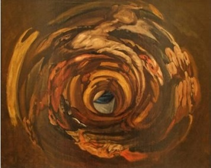
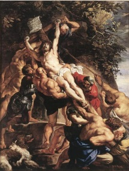

# Leçon 21 | 17 Mai 1961

  <label><input type="checkbox" data-lacan-toggle="original" checked> 原文</label>
  <label><input type="checkbox" data-lacan-toggle="notes" checked> 注释</label>
  <label><input type="checkbox" data-lacan-toggle="commentary" checked> 个人解读评论</label>

<section class="parallel-paragraph" data-paragraph-ids="s8-21-0001">

s8-21-0001

[无对应译文]

原文 · s8-21-0001

« COÛFONTAINE*, je suis à vous ! Prends et fais de moi ce que tu veux. Soit que je sois une épouse,* *soit que déjà plus loin que la vie, là où le corps ne sert plus, nos âmes l’une à l’autre se soudent sans aucun alliage* [^268] ! »

</section>

<section class="parallel-paragraph" data-paragraph-ids="s8-21-0002">

s8-21-0002

[无对应译文]

原文 · s8-21-0002

Je voulais vous indiquer, tout au long du texte de la trilogie, la revenue d’un terme qui est celui où s’y articule l’amour. C’est à ces paroles de Sygne, dans *L’otage,* qu’aussitôt COÛFONTAINE va répondre :

</section>

<section class="parallel-paragraph" data-paragraph-ids="s8-21-0003">

s8-21-0003

[无对应译文]

原文 · s8-21-0003

« *Sygne retrouvée la dernière, ne me trompez pas comme le reste. Y aura-t-il donc à la fin*

</section>

<section class="parallel-paragraph" data-paragraph-ids="s8-21-0004">

s8-21-0004

[无对应译文]

原文 · s8-21-0004

*pour moi quelque chose à moi de solide hors de ma propre volonté ?* »

</section>

<section class="parallel-paragraph" data-paragraph-ids="s8-21-0005">

s8-21-0005

[无对应译文]

原文 · s8-21-0005

Et tout est là en effet. Cet homme que tout a trahi, que tout a abandonné, qui mène dit-il « *cette vie de bête traquée, sans une cache* *qui soit sûre* » se souvient :

</section>

<section class="parallel-paragraph" data-paragraph-ids="s8-21-0006">

s8-21-0006

[无对应译文]

原文 · s8-21-0006

> « ...*de ce que disent les moines indiens, que toute cette vie mauvaise est une vaine apparence, et qu’elle ne reste avec nous*
>
> *que parce que nous bougeons avec elle, et qu’il nous suffirait seulement de nous asseoir et de demeurer pour qu’elle passe de nous.*
>
> *Mais ce sont des tentations viles. Moi du moins dans cette chute de tout, je reste le même, l’honneur et le devoir, le même.*
>
> *Mais toi, Sygne, songe à ce que tu dis. Ne va pas faillir comme le reste, à cette heure où je touche à ma fin. Ne me trompe point*... »

</section>

<section class="parallel-paragraph" data-paragraph-ids="s8-21-0007">

s8-21-0007

[无对应译文]

原文 · s8-21-0007

Tel est le départ qui donne son poids à la tragédie. Sygne se trouve trahir celui-là même à qui elle s’est engagée de toute son âme.

</section>

<section class="parallel-paragraph" data-paragraph-ids="s8-21-0008">

s8-21-0008

[无对应译文]

原文 · s8-21-0008

Nous retrouverons ce thème de l’échange des âmes, et de l’échange des âmes concentré en un instant, plus loin, dans *Le pain dur,* dans le dialogue entre Louis et LUMÎR - *Loum-yir* comme CLAUDEL expressément nous indique qu’il faut prononcer le nom de la Polonaise - quand, le parricide achevé, le dialogue s’engage entre elle et lui, où elle lui dit qu’elle ne le suivra pas, qu’elle ne retournera pas avec lui en Algérie, mais qu’elle l’invite à venir consommer avec elle l’aventure mortelle qui l’attend.

</section>

<section class="parallel-paragraph" data-paragraph-ids="s8-21-0009">

s8-21-0009

[无对应译文]

原文 · s8-21-0009

Louis - qui à ce moment vient justement de subir la métamorphose qui en lui se consomme dans le parricide - Louis refuse. Il y a pourtant un moment encore d’oscillation au cours duquel il s’adresse à LUMÎR passionnément, lui disant qu’il l’aime comme elle est, qu’il n’y a qu’une seule femme pour lui. À quoi LUMÎR elle-même, captivée par cet appel de la mort qui donne la signification de son désir, lui répond[^269] :

</section>

<section class="parallel-paragraph" data-paragraph-ids="s8-21-0010">

s8-21-0010

[无对应译文]

原文 · s8-21-0010

« *C’est vrai qu’il n’y en a qu’une seule pour toi ? Ah, je sais que c’est vrai ! Ah, dis ce que tu veux ! Il y a tout de même en toi* *quelque chose qui me comprend et qui est mon frère ! Une rupture, une lassitude, un vide qui ne peut pas être comblé.* *Tu n’es plus le même qu’aucun autre. Tu es seul. À jamais tu ne peux plus cesser d’avoir fait ce que tu as fait, (doucement) parricide !* *Nous sommes seuls tous les deux dans cet horrible désert. Deux âmes humaines dans le néant qui sont capables de se donner l’une* *à l’autre. Et en une seule seconde, pareille à la détonation de tout le temps qui s’anéantit, de remplacer toutes choses l’un par l’autre !* *N’est-ce pas qu’il est bon d’être sans aucune perspective ? Ah, si la vie était longue, cela vaudrait la peine d’être heureux.* *Mais elle est courte et il y a moyen de la rendre plus courte encore. Si courte que l’éternité y tienne !* »

</section>

<section class="parallel-paragraph" data-paragraph-ids="s8-21-0011">

s8-21-0011

[无对应译文]

原文 · s8-21-0011

LOUIS : *Je n’ai que faire de l’éternité*.

</section>

<section class="parallel-paragraph" data-paragraph-ids="s8-21-0012">

s8-21-0012

[无对应译文]

原文 · s8-21-0012

> LUMÎR : *Si courte que l’éternité y tienne ! Si courte que ce monde y tienne dont nous ne voulons pas et ce bonheur dont les gens*
>
> *font tant d’affaires. Si petite, si serrée, si stricte, si raccourcie, que rien autre chose que nous deux y tienne !* »

</section>

<section class="parallel-paragraph" data-paragraph-ids="s8-21-0013">

s8-21-0013

[无对应译文]

原文 · s8-21-0013

Et elle reprend plus loin :

</section>

<section class="parallel-paragraph" data-paragraph-ids="s8-21-0014">

s8-21-0014

[无对应译文]

原文 · s8-21-0014

« *Et moi, je serai la Patrie entre tes bras, la Douceur jadis quittée, la terre de Ur, l’antique Consolation !* *Il n’y a que toi avec moi au monde, il n’y a que ce moment seul enfin où nous nous serons aperçus face à face !* *Accessibles à la fin jusqu’à ce mystère que nous renfermons.*

</section>

<section class="parallel-paragraph" data-paragraph-ids="s8-21-0015">

s8-21-0015

[无对应译文]

原文 · s8-21-0015

*Il y a moyen de se sortir l’âme du corps comme une épée, loyal, plein d’honneur, il y a moyen de rompre la paroi.* *Il y a moyen de faire un serment et de se donner tout entier à cet autre qui seul existe.*

</section>

<section class="parallel-paragraph" data-paragraph-ids="s8-21-0016">

s8-21-0016

[无对应译文]

原文 · s8-21-0016

*Malgré l’horrible nuit et la pluie, malgré cela qui est autour de nous le néant, Comme des braves !* *De se donner soi-même et de croire à l’autre tout entier ! De se donner et de croire en un seul éclair !* *Chacun de nous à l’autre et à cela seul !* »

</section>

<section class="parallel-paragraph" data-paragraph-ids="s8-21-0017">

s8-21-0017

[无对应译文]

原文 · s8-21-0017

Tel est le désir exprimé par celle qui, après le parricide, est par Louis écartée de lui-même et pour épouser, comme il est dit, « *la maîtresse de son père* ».

</section>

<section class="parallel-paragraph" data-paragraph-ids="s8-21-0018">

s8-21-0018

[无对应译文]

原文 · s8-21-0018

C’est là le tournant de *la transformation* de Louis, et c’est ce qui va aujourd’hui nous permettre de nous *interroger* sur le sens de ce qui va naître de lui : Pensée de COÛFONTAINE, figure féminine qui à l’aube du troisième terme de la trilogie répond à la figure de Sygne et autour de laquelle nous allons nous interroger sur ce que là, a voulu dire CLAUDEL.

</section>

<section class="parallel-paragraph" data-paragraph-ids="s8-21-0019">

s8-21-0019

[无对应译文]

原文 · s8-21-0019

Car enfin, s’il est facile et d’usage de se débarrasser de toute parole qui s’articule hors des voies de la routine en disant : « *c’est du Untel* », et vous savez qu’on ne se fait pas faute de le dire à propos de quelqu’un qui pour l’instant vous parle. Il semble que personne ne songe même à s’étonner à propos du poète, que - là - on se contente d’accepter sa singularité. Et devant les étrangetés d’un théâtre comme celui de CLAUDEL, personne ne songe plus à s’interroger, devant les invraisemblances, les traits de scandale où il nous entraîne, sur ce qu’en fin de compte pouvait bien être sa visée et son dessein.

</section>

<section class="parallel-paragraph" data-paragraph-ids="s8-21-0020">

s8-21-0020

[无对应译文]

原文 · s8-21-0020

Pensée de COÛFONTAINE, dans la troisième pièce, *Le père humilié,* qu’est-ce qu’elle veut dire ? Nous allons nous interroger sur la signification de Pensée de COÛFONTAINE comme sur un personnage vivant. Il s’agit du désir de Pensée de COÛFONTAINE, désir de pensée, et le désir de Pensée nous allons y trouver bien sûr la pensée même du désir.

</section>

<section class="parallel-paragraph" data-paragraph-ids="s8-21-0021">

s8-21-0021

[无对应译文]

原文 · s8-21-0021

Bien sûr n’allez pas croire que ce soit là, au niveau où se tient la tragédie claudélienne, interprétation allégorique. Ces personnages ne sont des *symboles* que pour autant qu’ils jouent au niveau même, au cœur de *l’incidence du symbolique* sur une personne. Et cette ambiguïté des noms, qui leur sont par le poète, conférés, donnés, est là pour nous indiquer la légitimité de les interpréter comme des moments de cette *incidence du symbolique* sur la chair même.

</section>

<section class="parallel-paragraph" data-paragraph-ids="s8-21-0022">

s8-21-0022

[无对应译文]

原文 · s8-21-0022

Il serait bien facile de nous amuser à lire dans l’orthographe même donnée par CLAUDEL à ce nom singulier de « *Sygne* », qui commence par un S, qui est vraiment là comme une invite à bien y reconnaître un « *signe* », avec en plus justement, dans ce changement imperceptible dans le mot, cette substitution de l'« *y* » à l’« *i* », ce que cela veut dire cette surimposition de la marque, et d’y reconnaître, par je ne sais quelle convergence une *mater lectionis* cabalistique[^270], quelque chose qui vient rencontrer notre S par quoi je vous montrais que cette imposition du signifiant sur l’homme est à la fois ce qui le marque et ce qui le définit.

</section>

<section class="parallel-paragraph" data-paragraph-ids="s8-21-0023">

s8-21-0023

[无对应译文]

原文 · s8-21-0023

À l’autre bout : PENSÉE. Ici le mot est laissé intact. Et pour voir ce que veut dire cette pensée du désir, il nous faut bien repartir sur ce que signifie, dans *L’otage,* la « *passion* » subie de Sygne. Ce sur quoi cette première pièce de la trilogie nous a laissés pantelants, cette figure de *la sacrifiée* qui fait signe « *non* », c’est bien la marque du signifiant portée à son degré suprême - un refus porté à une position radicale - qu’il nous faut sonder. En sondant cette position, nous retrouvons le terme même qui est celui qui nous appartient,à nous, par notre expérience, au plus haut degré, si nous savons l’interroger.

</section>

<section class="parallel-paragraph" data-paragraph-ids="s8-21-0024">

s8-21-0024

[无对应译文]

原文 · s8-21-0024

Puisque, si vous vous souvenez de ce que je vous ai appris en son temps *ici et ailleurs, au séminaire et à la Société,* et à plusieurs reprises, si je vous ai priés de réviser l’usage qui est fait aujourd’hui dans notre expérience du terme de *frustration*, c’est pour inciter à revenir à ce que veut dire, dans le texte de FREUD - où jamais ce terme de *frustration* n’est employé - le terme original de la *Versagung* pour autant que son accent peut être mis bien au-delà, bien plus profondément que toute « *frustration »* concevable, le terme de *Versagung* pour autant qu’il implique « *le défaut à la promesse* », et *le défaut à une promesse pour quoi déjà tout a été renoncé*.

</section>

<section class="parallel-paragraph" data-paragraph-ids="s8-21-0025">

s8-21-0025

[无对应译文]

原文 · s8-21-0025

C’est là la valeur exemplaire du personnage et du drame de Sygne, c’est que ce à quoi il lui est demandé de renoncer, c’est ce à quoi elle a déjà engagé toutes ses forces, à quoi elle a déjà lié toute sa vie : à ce qui était déjà marqué du signe du sacrifice. *Cette dimension* au second degré, au plus profond du refus qui - par l’opération du verbe - peut être à la fois exigé et peut être ouvert à *une réalisation abyssale*, c’est là ce qui nous est posé à l’origine de la tragédie claudélienne, et c’est aussi bien quelque chose à quoi nous ne pouvons pas rester indifférents. C’est quelque chose que nous ne pouvons pas simplement considérer comme l’extrême, l’excessif, le paradoxe d’une sorte de folie religieuse, puisque bien au contraire, comme je vais vous le montrer, c’est là justement que nous sommes placés, nous, hommes de notre temps, dans la mesure où cette folie religieuse nous fait défaut.

</section>

<section class="parallel-paragraph" data-paragraph-ids="s8-21-0026">

s8-21-0026

[无对应译文]

原文 · s8-21-0026

Observons bien *ce dont il s’agit* pour Sygne de COÛFONTAINE. Ce qui lui est imposé n’est pas simplement de l’ordre de la force et de la contrainte. Il lui est imposé de s’engager, et librement, dans la loi du mariage avec celui qu’elle appelle le fils de sa servante et du sorcier QUIRIACE. À ce qui lui est imposé, rien ne peut être lié que de maudit pour elle. Ainsi *la Versagung,* le refus dont elle ne peut se délier, devient bien ce que la structure du mot implique : *versagen*, le refus concernant le *dit*.

</section>

<section class="parallel-paragraph" data-paragraph-ids="s8-21-0027">

s8-21-0027

[无对应译文]

原文 · s8-21-0027

Et si je voulais équivoquer pour trouver la meilleure traduction : « *la per-dition* ». Ici tout ce qui est condition devient perdition, et c’est pourquoi là « *ne pas dire* » devient le « *dire non* ». Déjà nous avons rencontré ce point extrême, et ce que je veux vous montrer, c’est qu’il est ici dépassé. Nous l’avons rencontré au terme de *la tragédie œdipienne*, dans le μή ϕῦναι \[mè phunai\] d’*Œdipe à Colone* [^271], ce « *puissé-je n’être pas *» qui veut tout de même dire « *n’être pas né* », où - je vous le rappelle en passant - *nous trouvons la véritable place* *du sujet en tant qu’il est le sujet de l’inconscient*.

</section>

<section class="parallel-paragraph" data-paragraph-ids="s8-21-0028">

s8-21-0028

[无对应译文]

原文 · s8-21-0028

Cette place c’est le μή \[mè\], ou ce « *ne* » très particulier dont nous ne saisissons dans le langage que les vestiges, au moment de son apparition paradoxale, dans des termes comme ce : « *je crains qu’il ne vienne* » ou « *avant qu’il n’apparaisse* », où il paraît aux grammairiens comme un *explétif*, alors que c’est là justement que se montre la pointe de ce désir où se désigne non point *le sujet de l’énoncé* - qui est le « *je* » : celui qui parle actuellement - mais *le sujet où s’origine l’énonciation*. μή ϕῦναι \[mè phunai\], ce « *ne sois-je* », ou ce « *ne fus-je* », pour être plus près : ce « *n’être* » qui *équivoque* si curieusement en français avec le verbe de la *naissance*, voilà où nous en sommes avec ŒDIPE.

</section>

<section class="parallel-paragraph" data-paragraph-ids="s8-21-0029">

s8-21-0029

[无对应译文]

原文 · s8-21-0029

Et qu’est-ce qui est désigné là sinon que, de par l’imposition à l’homme d’un destin, d’une charge des structures parentales, quelque chose est là recouvert qui fait déjà de son entrée dans le monde l’entrée dans le jeu implacable d’une dette. En fin de compte c’est simplement de cette charge - qu’il reçoit de *la dette,* de l’Ἄτη \[Atè\] qui le précède - qu’il est coupable. Il s’est passé depuis quelque chose d’autre, *le Verbe s’est pour nous incarné*, il est venu au monde, et - contre la parole de l’Évangile - il n’est pas vrai que nous ne l’ayons pas reconnu. Nous l’avons reconnu et nous vivons les suites de cette reconnaissance. Nous sommes à l’un des termes de l’une des phases des conséquences de cette reconnaissance.

</section>

<section class="parallel-paragraph" data-paragraph-ids="s8-21-0030">

s8-21-0030

[无对应译文]

原文 · s8-21-0030

C’est là ce que je voudrais articuler pour vous. C’est que pour nous le *Verbe* n’est point simplement *la loi* où nous nous insérons pour porter chacun notre charge de cette dette qui fait notre destin, mais qu’il ouvre pour nous une *possibilité*, une *tentation* d’où il nous est possible de nous maudire, non pas seulement comme destinée particulière, comme vie, mais comme la voie même où le *Verbe* nous engage et comme *rencontre* avec *la vérité*, comme heure de *la vérité*. Nous ne sommes plus seulement à portée d’être *coupables par la dette symbolique*, c’est d’avoir la dette à notre charge qui peut nous être - *au sens le plus proche que ce mot indique* - reproché.

</section>

<section class="parallel-paragraph" data-paragraph-ids="s8-21-0031">

s8-21-0031

[无对应译文]

原文 · s8-21-0031

Bref, c’est que *la dette elle-même*, où nous avions notre place, *peut nous être ravie*, c’est là où nous pouvons nous sentir à nous-mêmes totalement aliénés. L’Ἄτη \[Atè\] antique sans doute nous rendait coupables de cette dette, d’y céder, mais à y renoncer comme nous pouvons maintenant le faire, nous sommes chargés d’un malheur qui est plus grand encore, *de ce que ce destin ne soit plus rien*.

</section>

<section class="parallel-paragraph" data-paragraph-ids="s8-21-0032">

s8-21-0032

[无对应译文]

原文 · s8-21-0032

Bref, ce que nous savons, ce que nous touchons par notre expérience de tous les jours, c’est la *culpabilité* qui nous reste, celle que nous touchons du doigt chez le névrosé. C’est elle qui est à payer justement pour ceci que le Dieu du destin soit mort. Que ce Dieu soit mort est au cœur de ce qui nous est présenté dans CLAUDEL. Ce Dieu mort est ici *représenté* par ce *prêtre proscrit* qui n’est plus pour nous produit présent que sous la forme de ce qui est appelé

</section>

<section class="parallel-paragraph" data-paragraph-ids="s8-21-0033">

s8-21-0033

[无对应译文]

原文 · s8-21-0033

- *l’otage,* qui donne son titre à la première pièce de la *trilogie*, figure, ombre, de ce qui fut la foi antique,

</section>

<section class="parallel-paragraph" data-paragraph-ids="s8-21-0034">

s8-21-0034

[无对应译文]

原文 · s8-21-0034

- et *l’otage* aux mains de la politique, de ceux qui veulent l’utiliser pour des fins de Restauration.

</section>

<section class="parallel-paragraph" data-paragraph-ids="s8-21-0035">

s8-21-0035

[无对应译文]

原文 · s8-21-0035

Mais l’envers de cette réduction du Dieu mort est ceci que c’est l’âme fidèle qui devient l’otage, l’otage de cette situation où renaît proprement, au delà de la fin de la vérité chrétienne, le tragique, à savoir que tout se dérobe à elle si le signifiant peut être captif. Ne peut être *otage*, bien sûr, que *celle qui croit* : Sygne, et qui parce qu’elle croit, doit témoigner de ce qu’elle croit. Elle est justement par là, prise, captivée dans cette situation dont il suffit de l’imaginer, de la forger pour qu’elle existe : d’être appelée à se sacrifier à *la négation* de ce qu’elle croit, elle est retenue comme otage dans *la négation* - même soufferte - de ce qu’elle a de meilleur.

</section>

<section class="parallel-paragraph" data-paragraph-ids="s8-21-0036">

s8-21-0036

[无对应译文]

原文 · s8-21-0036

Quelque chose nous est proposé qui va plus loin que le malheur de JOB et que sa résignation : à JOB est réservé tout le poids du malheur qu’il n’a pas mérité, mais à l’héroïne de la tragédie moderne il est demandé d’assumer comme une jouissance l’injustice même qui lui fait horreur.

</section>

<section class="parallel-paragraph" data-paragraph-ids="s8-21-0037">

s8-21-0037

[无对应译文]

原文 · s8-21-0037

Tel est ce qu’ouvre comme possibilité, devant l’être qui parle, le fait d’être le support du *Verbe* au moment où il lui est demandé, ce *Verbe*, de le garantir. *L’homme est devenu l’otage du Verbe* parce qu’il s’est dit - ou aussi bien *pour* qu’il se soit dit - que Dieu est mort. À ce moment s’ouvre cette béance où rien de plus, rien d’autre ne peut être articulé que ce qui n’est que le commencement même de « *ne fus-je *», qui ne serait plus être, qu’un refus, un « *non* », un « *ne* », ce tic, cette grimace, bref, ce fléchissement du corps, cette psychosomatique qui est le terme où nous avons à rencontrer la marque du signifiant.

</section>

<section class="parallel-paragraph" data-paragraph-ids="s8-21-0038">

s8-21-0038

[无对应译文]

原文 · s8-21-0038

Le drame, tel qu’il se poursuit à travers les trois temps de la tragédie, est de savoir comment de cette position radicale peut renaître un désir, et lequel. C’est ici que nous sommes portés à l’autre bout de la trilogie, à Pensée de COÛFONTAINE, à *cette figure incontestablement séduisante*, manifestement *proposée*, à nous comme spectateurs - et *quels spectateurs*, nous allons tenter de le dire - *comme l’objet du désir* à proprement parler.

</section>

<section class="parallel-paragraph" data-paragraph-ids="s8-21-0039">

s8-21-0039

[无对应译文]

原文 · s8-21-0039

Et il n’est que de lire *Le père humilié.* Il n’est que d’entendre ceux là mêmes que rebute - car quoi de plus rebutant - cette histoire. Quel pain plus dur pourrait nous être offert que celui de cet enjeu, de ce père qui est promu comme une figure de vieillard obscène et dont *seul le meurtre* devant nous figuré, amène la possibilité d’une poursuite de quelque chose qui se transmet et qui n’est qu’une figure - celle de Louis de COÛFONTAINE - la plus dégradée, dégénérée de la figure du père.

</section>

<section class="parallel-paragraph" data-paragraph-ids="s8-21-0040">

s8-21-0040

[无对应译文]

原文 · s8-21-0040

Il n’est que d’entendre - ce qui à chacun a pu être sensible - l’ingratitude que représente l’apparition dans une fête de nuit à Rome au début du *père humilié* de *la figure de* Pensée de COÛFONTAINE, pour *comprendre* qu’elle *nous est présentée là comme un objet de séduction*. Et pourquoi, et comment ? Qu’est-ce qu’elle équilibre ? Qu’est-ce qu’elle compense ?

</section>

<section class="parallel-paragraph" data-paragraph-ids="s8-21-0041">

s8-21-0041

[无对应译文]

原文 · s8-21-0041

Est-ce que quelque chose va revenir sur elle du sacrifice de Sygne ? Est-ce que c’est au nom du sacrifice de sa grand-mère qu’elle va mériter quelque égard pour tout dire ? Certes pas !

</section>

<section class="parallel-paragraph" data-paragraph-ids="s8-21-0042">

s8-21-0042

[无对应译文]

原文 · s8-21-0042

Si à un moment il y est fait allusion, c’est dans le dialogue des deux hommes - qui vont représenter pour elle l’approche de *l’amour -* avec le Pape, et il est fait allusion à cette vieille tradition de famille comme à une ancienne histoire qui se raconte[^272]. C’est dans la bouche du Pape lui-même, s’adressant à ORIAN qui est l’enjeu de cet amour, que va paraître à ce propos le mot « *superstition* » : « *Vas-tu céder mon fils à cette superstition !* »[^273]

</section>

<section class="parallel-paragraph" data-paragraph-ids="s8-21-0043">

s8-21-0043

[无对应译文]

原文 · s8-21-0043

Est-ce que PENSÉE même va représenter quelque chose comme une figure exemplaire, *une renaissance de la foi* un instant éclipsée ? Bien loin de là ! PENSÉE est *libre penseuse*, si l’on peut s’exprimer ainsi d’un terme qui n’est pas ici le terme claudélien, mais c’est bien de cela qu’il s’agit. PENSÉE n’est animée que d’une passion : Celle - dit-elle - d’une justice, qui pour elle va au-delà de toutes les exigences, de la beauté même.

</section>

<section class="parallel-paragraph" data-paragraph-ids="s8-21-0044">

s8-21-0044

[无对应译文]

原文 · s8-21-0044

Ce qu’elle veut, c’est *la justice*, et non pas n’importe laquelle, non pas la justice ancienne, celle de quelque droit naturel à une distribution ou à une rétribution, *cette justice* dont il s’agit - *justice absolue*, justice qui anime le mouvement, le bruit, le train secret de *la Révolution* qui fait le bruit de fond du troisième drame - *cette justice* est l’envers de tout ce qui du réel, de tout ce qui de la vie, est, de par le *Verbe*, senti comme offensant la justice, senti comme horreur de la justice. *C’est d’une justice absolue,* dans tout son pouvoir d’ébranler le monde, *qu’il s’agit* dans le discours de PENSÉE de COÛFONTAINE.

</section>

<section class="parallel-paragraph" data-paragraph-ids="s8-21-0045">

s8-21-0045

[无对应译文]

原文 · s8-21-0045

Vous le voyez, c’est bien la chose qui peut nous paraître la plus loin de la prêcherie que nous pourrions attendre de CLAUDEL, homme de foi. C’est bien ce qui va nous permettre de donner *son sens* à la figure vers quoi converge tout le drame *du père humilié*. Pour le comprendre, il faut nous arrêter un instant à ce que CLAUDEL a fait de PENSÉE de COÛFONTAINE, représentée comme *fruit du mariage* de Louis de COÛFONTAINE avec celle en somme *que lui a donnée son père comme femme*, par cela seul que cette femme était déjà sa femme, pointe extrême si l’on peut dire, paradoxale, caricaturale, du *complexe d’Œdipe*.

</section>

<section class="parallel-paragraph" data-paragraph-ids="s8-21-0046">

s8-21-0046

[无对应译文]

原文 · s8-21-0046

Le *vieillard obscène* qui nous est présenté, force ses fils - tel est *le point limite, le point frontière du mythe freudien* qui nous est proposé - force ses fils à épouser ses femmes, et dans la mesure même où il veut leur ravir les leurs. Autre façon plus poussée et ici plus expressive d’accentuer ce qui vient au jour dans *le mythe freudien*. Ça ne donne pas un père d’une meilleure qualité, ça donne *une autre canaille* et c’est bien ainsi que Louis de COÛFONTAINE, tout au long du drame nous est *représenté*.

</section>

<section class="parallel-paragraph" data-paragraph-ids="s8-21-0047">

s8-21-0047

[无对应译文]

原文 · s8-21-0047

Il épouse celle qui le veut, lui, comme objet de sa jouissance. Il épouse cette figure singulière de la femme, SICHEL, qui rejette tous ces fardeaux de *la loi*, et nommément de la sienne, de l’Ancienne Loi, de l’épouse sainte, figure de la femme, pour autant qu’elle est celle de la patience, celle enfin qui amène au jour sa volonté d’étreindre le monde.

</section>

<section class="parallel-paragraph" data-paragraph-ids="s8-21-0048">

s8-21-0048

[无对应译文]

原文 · s8-21-0048

Qu’est-ce qui va naître de là ? Ce qui va naître de là, singulièrement, c’est la renaissance de *cela même* dont le drame *du pain dur* nous a montré qu’il était écarté, à savoir *ce même désir dans son absolu* qui était représenté par la figure de LUMÎR. Cette LUMÎR... nom singulier, il faut s’arrêter au fait que CLAUDEL dans une petite note nous indique qu’il faut le prononcer « *Loum yir* » ...il faut la rapporter à ce que CLAUDEL nous dit des fantaisies du vieux TURELURE d’apporter toujours à chaque nom cette petite modification dérisoire qui fait qu’il appelle Rachel : SICHEL, *ce qui veut dire*, nous dit le texte, *en allemand,* « *la faucille* », ce nom étant *celui que figure dans le ciel le croissant de la lune* [^274]. Écho singulier de la figure qui termine le *Ruth et Booz* de HUGO. CLAUDEL le fait sans cesse *ce même jeu d’altération des noms*, comme si lui-même ici assumait la fonction du vieux TURELURE.

</section>

<section class="parallel-paragraph" data-paragraph-ids="s8-21-0049">

s8-21-0049

[无对应译文]

原文 · s8-21-0049

LUMÎR, c’est ce que nous retrouverons, plus tard dans le dialogue entre le Pape et les deux personnages d’ORSO et d’ORIAN, comme la lumière - *la cruelle lumière *! Cette *cruelle lumière* nous éclaire sur ce que représente la figure d’ORIAN, car tout *fidèle* qu’il soit au Pape, cette *cruelle lumière* qui est dans sa bouche, le fait - le Pape - sursauter : « *La lumière -* lui dit le Pape - *n’est point cruelle* » [^275]. Mais il n’est point douteux que c’est ORIAN qui est dans le vrai quand il le dit. Le poète est avec lui.

</section>

<section class="parallel-paragraph" data-paragraph-ids="s8-21-0050">

s8-21-0050

[无对应译文]

原文 · s8-21-0050

Or celle qui va venir incarner la lumière, cherchée obscurément sans le savoir par sa mère elle même, cette lumière cherchée à travers une patience, se prête à tout servir et à tout accepter, c’est PENSÉE. PENSÉE, sa fille, PENSÉE qui va devenir l’objet incarné du désir de cette lumière. Et cette pensée en chair et en os, cette *pensée vivante*, le poète ne peut faire que d’imaginer qu’elle est aveugle, et de nous la représenter comme telle.

</section>

<section class="parallel-paragraph" data-paragraph-ids="s8-21-0051">

s8-21-0051

[无对应译文]

原文 · s8-21-0051

Je crois devoir m’arrêter un instant. Que peut vouloir le poète avec cette incarnation de l’objet, de *l’objet partiel*, de l’objet pour autant qu’il est ici le resurgissement, l’effet, de la constellation parentale : une aveugle ? Cette aveugle va être promenée devant nos yeux tout au long de cette troisième pièce, et de la façon la plus émouvante. Elle apparaît dans le bal masqué, où se figure la fin d’un moment de cette Rome qui est à la veille de sa prise par les garibaldiens. C’est aussi une sorte de fin qui se célèbre dans cette fête de nuit, celle d’un noble polonais qui, poussé au terme de sa solvabilité, doit voir le lendemain entrer dans sa propriété les huissiers.

</section>

<section class="parallel-paragraph" data-paragraph-ids="s8-21-0052">

s8-21-0052

[无对应译文]

原文 · s8-21-0052

Ce noble polonais est ici aussi bien pour - à un moment - nous rappeler, sous la forme d’une figure sur un camée, une personne dont on a entendu parler tant de fois, et qui est morte bien tristement. Faisons une croix sur elle, n’en parlons plus. Tous les spectateurs entendent bien qu’il s’agit de la nommée LUMÎR[^276], et aussi ce noble, tout chargé *de la noblesse et du romantisme* de la Pologne martyre, est tout de même ce type de noble qui se trouve inexplicablement avoir toujours une villa à liquider.

</section>

<section class="parallel-paragraph" data-paragraph-ids="s8-21-0053">

s8-21-0053

[无对应译文]

原文 · s8-21-0053

C’est dans ce contexte que nous voyons se promener l’aveugle PENSÉE comme si elle voyait clair. Car sa surprenante sensibilité lui permet en un instant de visite préliminaire d’avoir par sa fine perception des échos, des approches, des mouvements, dès quelques marches franchies, de repérer toute la structure d’un lieu. Si nous, spectateurs, savons qu’elle est aveugle, pendant tout un acte ceux qui sont avec elle, les invités de cette fête, pourront l’ignorer, et spécialement celui sur lequel s’est porté son désir. Ce personnage, ORIAN, vaut un mot de présentation pour ceux qui n’ont pas lu la pièce.

</section>

<section class="parallel-paragraph" data-paragraph-ids="s8-21-0054">

s8-21-0054

[无对应译文]

原文 · s8-21-0054

ORIAN, redoublé de son frère ORSO, porte ce nom bien claudélien, qui semble, par son bruit et cette même construction légèrement déformée, accentué quant au signifiant par une bizarrerie qui est la même que nous retrouvons dans tellement de personnages de *la tragédie claudélienne*, rappelez-vous de Sir Thomas POLLOCK NAGEOIRE[^277], de HOMODARMES. Cela a un aussi *joli bruit* que celui qu’il y a dans le texte sur *les armures* d’André BRETON dans *Le peu de réalité* [^278].

</section>

<section class="parallel-paragraph" data-paragraph-ids="s8-21-0055">

s8-21-0055

[无对应译文]

原文 · s8-21-0055

Ces deux personnages ORIAN et ORSO sont en jeu :

</section>

<section class="parallel-paragraph" data-paragraph-ids="s8-21-0056">

s8-21-0056

[无对应译文]

原文 · s8-21-0056

- ORSO est le brave gars qui aime PENSÉE.

</section>

<section class="parallel-paragraph" data-paragraph-ids="s8-21-0057">

s8-21-0057

[无对应译文]

原文 · s8-21-0057

- ORIAN qui n’est pas tout à fait un jumeau, qui est le grand frère, c’est celui vers quoi PENSÉE a *porté son désir*. Pourquoi vers lui, si ce n’est parce *qu’il est inaccessible*.

</section>

<section class="parallel-paragraph" data-paragraph-ids="s8-21-0058">

s8-21-0058

[无对应译文]

原文 · s8-21-0058

Car à vrai dire, pour cette aveugle, le texte et le mythe claudéliens nous indiquent qu’il lui est *à peine* possible de les distinguer par la voix, au point qu’à la fin du drame, ORSO, pendant un moment pourra *soutenir l’illusion* d’être ORIAN mort. C’est bien qu’elle voit *autre chose* pour que ce soit la voix d’ORIAN, même quand c’est ORSO qui parle, qui puisse la faire défaillir.

</section>

<section class="parallel-paragraph" data-paragraph-ids="s8-21-0059">

s8-21-0059

[无对应译文]

原文 · s8-21-0059

Mais arrêtons-nous un instant à cette fille aveugle. Qu’est-ce qu’elle veut dire ? Est-ce qu’il ne semble pas - pour voir d’abord ce qu’elle projette devant nous - qu’elle est ainsi protégée par une sorte de figure sublime de la pudeur qui s’appuie sur ceci : *que de ne pouvoir se voir être vue, elle semble à l’abri du seul regard qui dévoile.* Et je ne crois pas d’un propos excentrique de ramener ici cette dialectique que je vous fis entendre autrefois autour du thème des perversions dites *exhibitionniste* et *voyeuriste*.

</section>

<section class="parallel-paragraph" data-paragraph-ids="s8-21-0060">

s8-21-0060

[无对应译文]

原文 · s8-21-0060

Quand je vous faisais remarquer :

</section>

<section class="parallel-paragraph" data-paragraph-ids="s8-21-0061">

s8-21-0061

[无对应译文]

原文 · s8-21-0061

- qu’elles ne pouvaient être seulement saisies du seul rapport de celui qui voit et qui se montre à un partenaire simplement autre, *objet* ou *sujet*,

</section>

<section class="parallel-paragraph" data-paragraph-ids="s8-21-0062">

s8-21-0062

[无对应译文]

原文 · s8-21-0062

- que ce qui est intéressé dans le fantasme de l’exhibitionniste comme du voyeur, c’est un élément tiers qui implique que chez le partenaire peut éclore *une conscience complice* \[de Φ\]qui reçoit ce qui lui est donné à voir,

</section>

<section class="parallel-paragraph" data-paragraph-ids="s8-21-0063">

s8-21-0063

[无对应译文]

原文 · s8-21-0063

- que ce qui l’épanouit dans sa solitude en apparence innocente s’offre à un regard caché,

</section>

<section class="parallel-paragraph" data-paragraph-ids="s8-21-0064">

s8-21-0064

[无对应译文]

原文 · s8-21-0064

- qu’ainsi c’est le désir même qui soutient sa fonction dans le fantasme, qui voile au sujet son rôle dans l’acte,

</section>

<section class="parallel-paragraph" data-paragraph-ids="s8-21-0065">

s8-21-0065

[无对应译文]

原文 · s8-21-0065

- que *l’exhibitionniste* et *le voyeur* en quelque sorte se jouissent eux-mêmes comme de voir et de montrer, mais sans savoir ce qu’ils voient et ce qu’ils montrent.

</section>

<section class="parallel-paragraph" data-paragraph-ids="s8-21-0066">

s8-21-0066

[无对应译文]

原文 · s8-21-0066

Pour PENSÉE, la voici donc, elle qui ne peut être surprise si je puis dire de ce qu’on ne peut rien lui montrer qui la soumette au petit autre, ni non plus qu’on ne puisse la voir sans que celui qui serait l’épieur soit, comme ACTÉON, frappé de cécité, qu’il commence à s’en aller en lambeaux aux morsures de la meute de ses propres désirs.

</section>

<section class="parallel-paragraph" data-paragraph-ids="s8-21-0067">

s8-21-0067

[无对应译文]

原文 · s8-21-0067

Le mystérieux pouvoir du dialogue qui se passe entre PENSÉE et ORIAN...

</section>

<section class="parallel-paragraph" data-paragraph-ids="s8-21-0068">

s8-21-0068

[无对应译文]

原文 · s8-21-0068

ORIAN qui n’est *à une lettre près* justement que le nom d’un des chasseurs que DIANE a métamorphosés en constellation[^279] ...ce mystérieux *aveu* par lequel se termine ce dialogue : « *je* *suis aveugle* » a, à lui seul, la force d’un « *je t’aime* », de ce qu’il évite toute conscience chez l’autre de ce que « *je t’aime* » soit dit, pour aller droit à se placer en lui comme *parole*.

</section>

<section class="parallel-paragraph" data-paragraph-ids="s8-21-0069">

s8-21-0069

[无对应译文]

原文 · s8-21-0069

- Qui saurait dire « *je* *suis aveugle* » *sinon d’où la parole crée la nuit* ?

</section>

<section class="parallel-paragraph" data-paragraph-ids="s8-21-0070">

s8-21-0070

[无对应译文]

原文 · s8-21-0070

- Qui, à l’entendre, ne sentirait en lui naître cette profondeur de la nuit ?

</section>

<section class="parallel-paragraph" data-paragraph-ids="s8-21-0071">

s8-21-0071

[无对应译文]

原文 · s8-21-0071

Car c’est là où je veux vous mener.

</section>

<section class="parallel-paragraph" data-paragraph-ids="s8-21-0072">

s8-21-0072

[无对应译文]

原文 · s8-21-0072

C’est à la distinction, à la différence qu’il y a du rapport du « *se voir* » avec le rapport du « *s’entendre* ».

</section>

<section class="parallel-paragraph" data-paragraph-ids="s8-21-0073">

s8-21-0073

[无对应译文]

原文 · s8-21-0073

Bien sûr on remarque, et on a remarqué *depuis longtemps*, que c’est le propre de la phonation que de retentir immédiatement à l’oreille propre du sujet à mesure de son émission, mais ce n’est pas pour autant que l’autre, à qui cette parole s’adresse, a la même place ni la même structure que celui du dévoilement visuel justement parce que *la parole*, elle, ne suscite pas le « *voir* » et parce qu’elle *est elle-même, aveuglement*. *On se voit être vu* - c’est pour cela qu’on s’y dérobe - *mais on ne s’entend pas être entendu*. C’est-à-dire qu’on ne s’entend pas là où l’on *s’entend*, c’est-à-dire dans sa tête, ou plus exactement ceux qui sont dans ce cas \- *il y en a en effet qui s’entendent être entendus et ce sont les fous, les hallucinés, c’est la structure de l’hallucination verbale -* ils ne sauraient s’entendre être entendus qu’à la place de l’Autre, là où l’on entend l’Autre renvoyer votre propre message sous sa forme inversée.

</section>

<section class="parallel-paragraph" data-paragraph-ids="s8-21-0074">

s8-21-0074

[无对应译文]

原文 · s8-21-0074

*Ce que veut dire* CLAUDEL a*vec* PENSÉE *aveugle*, c’est *qu’il suffit que l’âme*... puisque c’est de l’âme qu’il s’agit ...*ferme les yeux au monde...* et ceci est indiqué à travers tout le dialogue de la troisième pièce ...*pour pouvoir être ce dont le monde manque, et l’objet le plus désirable du monde*.

</section>

<section class="parallel-paragraph" data-paragraph-ids="s8-21-0075">

s8-21-0075

[无对应译文]

原文 · s8-21-0075

Ψυχή \[Psyché\] qui ne peut plus allumer la lampe, pompe, si je puis dire, *aspire à elle l’être d’*ÉROS qui est *manque*. Le mythe de Πὀρος \[Poros\] et Πενία \[Penia\] renaît ici sous la forme de l’aveuglement spirituel, car il nous est dit que PENSÉE incarne ici « *la figure de la Synagogue* »[^280] même, telle qu’elle est représentée au porche de la cathédrale de Reims[^281], les yeux bandés.

</section>

<section class="parallel-paragraph" data-paragraph-ids="s8-21-0076">

s8-21-0076

[无对应译文]

原文 · s8-21-0076

</section>

<section class="parallel-paragraph" data-paragraph-ids="s8-21-0077">

s8-21-0077

[无对应译文]

原文 · s8-21-0077

D’autre part, ORIAN qui est en face d’elle est bien celui dont le don ne peut être reçu justement, parce qu’il est surabondance. ORIAN est une autre forme du refus. S’il ne donne pas à PENSÉE son amour c’est, dit-il, parce que ses dons il les doit ailleurs, à tous, à l’œuvre divine.

</section>

<section class="parallel-paragraph" data-paragraph-ids="s8-21-0078">

s8-21-0078

[无对应译文]

原文 · s8-21-0078

Ce qu’il méconnaît, c’est justement *ce qui lui est demandé dans l’amour*, *ce n’est pas sa* Πὀρος \[Poros\], *sa ressource, sa richesse spirituelle,* *sa surabondance*, ni même comme il s’exprime : *sa joie*, c’est justement ce qu’il n’a pas. Qu’il soit *un saint*, bien sûr, mais il est assez frappant que CLAUDEL nous montre ici les limites de la sainteté. Car c’est un fait que le désir est ici plus fort que la sainteté elle-même, car c’est un fait qu’ORIAN, le saint, dans le dialogue avec PENSÉE fléchit et cède et perd la partie, et pour tout dire, pour appeler les choses par leur nom : qu’il baise bel et bien la petite PENSÉE. Et c’est ce qu’elle veut. Et tout au long du drame et de la pièce *elle n’a pas perdu une demi-seconde*, un quart de ligne *pour opérer dans ce sens*, par les voies que nous n’appellerons pas les plus courtes, mais assurément les plus droites, les plus sûres.

</section>

<section class="parallel-paragraph" data-paragraph-ids="s8-21-0079">

s8-21-0079

[无对应译文]

原文 · s8-21-0079

Pensée de COÛFONTAINE est vraiment la renaissance de toutes ces fatalités qui commencent par *le stupre*, continuent par *la traite* tirée sur l’honneur, par la *mésalliance*, l’*abjuration*, le louis-philippisme - que je ne sais qui appelait « *le second en pire* »[^282] - pour renaître là, comme avant le péché, comme l’innocence, mais pas pour autant la nature.

</section>

<section class="parallel-paragraph" data-paragraph-ids="s8-21-0080">

s8-21-0080

[无对应译文]

原文 · s8-21-0080

C’est pourquoi il importe de voir sur quelle scène culmine tout le drame. Cette scène, la dernière, celle où PENSÉE se confine avec sa mère qui étend sur elle son aile protectrice, et le fait parce qu’elle est restée enceinte des œuvres du nommé ORIAN. PENSÉE reçoit la visite du frère, ORSO, qui vient ici lui porter de celui qui est mort le dernier message, mais que la logique de la pièce et toute la situation antérieure ont créé, puisque tout l’effort d’ORIAN a été de faire accepter à PENSÉE comme à ORSO une chose énorme : qu’ils s’épousent.

</section>

<section class="parallel-paragraph" data-paragraph-ids="s8-21-0081">

s8-21-0081

[无对应译文]

原文 · s8-21-0081

ORIAN le saint ne voit pas d’obstacles à ce que son bon et brave petit frère, lui, trouve son bonheur, c’est à son niveau. C’est un brave et un courageux. Et d’ailleurs la déclaration du gars ne laisse aucun doute, il est capable d’assurer le mariage avec une femme qui ne l’aime pas : *on en viendra toujours à bout*. C’est un courageux, c’est son affaire.

</section>

<section class="parallel-paragraph" data-paragraph-ids="s8-21-0082">

s8-21-0082

[无对应译文]

原文 · s8-21-0082

Il a d’abord combattu à gauche, on lui a dit qu’il s’est trompé : il combat à droite. Il était chez les garibaldiens, il a rejoint les zouaves du Pape, il est toujours là, *bon pied bon œil*, c’est un gars sûr. Ne riez pas trop de ce connard, c’est un piège. Et nous allons voir tout à l’heure pourquoi et en quoi, car à la vérité dans son dialogue avec PENSÉE nous ne songeons plus à en rire.

</section>

<section class="parallel-paragraph" data-paragraph-ids="s8-21-0083">

s8-21-0083

[无对应译文]

原文 · s8-21-0083

Qu’est PENSÉE dans cette dernière scène ? *L’objet sublime* sûrement. *L’objet sublime* en tant que déjà nous avons indiqué sa position l’année dernière comme substitut de *la Chose*, vous l’avez entendu au passage, *la nature de la Chose n’est pas si loin de celle de la femme*, s’il n’était vrai qu’à toute façon que nous avons de nous approcher de cette *Chose*, la femme s’avère être encore bien autre chose.

</section>

<section class="parallel-paragraph" data-paragraph-ids="s8-21-0084">

s8-21-0084

[无对应译文]

原文 · s8-21-0084

Je dis la moindre femme, et à la vérité CLAUDEL pas plus qu’un autre ne nous montre qu’il en ait la dernière idée, bien loin de là. Cette héroïne de CLAUDEL, cette femme qu’il nous fomente, c’est la femme d’un certain désir. Tout de même *rendons lui cette justice* qu’ailleurs, dans *Partage* *de Midi,* CLAUDEL nous a fait *une femme* : YSÉ, qui n’est pas si mal, *ça y ressemble fort à* ce que c’est *la femme*. *Ici nous sommes en présence de l’objet d’un désir*. Et ce que je veux vous montrer, qui est inscrit dans son image, c’est que c’est *un désir* qui n’a plus, à ce niveau de dépouillement, que la castration pour le séparer, mais le séparer radicalement, d’aucun désir naturel.

</section>

<section class="parallel-paragraph" data-paragraph-ids="s8-21-0085">

s8-21-0085

[无对应译文]

原文 · s8-21-0085

À la vérité, si vous regardez ce qui se passe sur la scène, c’est assez beau, mais pour le *situer* exactement, je vous prierai de vous rappeler *le cylindre anamorphique* - que je vous ai présenté en réalité, bel et bien ici : le tube sur cette table - à savoir ce cylindre sur lequel venait se projeter une figure de RUBENS, celle de la mise en croix, par l’artifice d’une sorte de dessin informe qui était astucieusement inscrit à la base de ce cylindre[^283]. De cela je vous ai fait l’image de ce mécanisme du reflet de cette figure fascinante, de cette beauté érigée telle qu’elle se projette à la limite, pour nous empêcher d’aller plus loin, au cœur de *la Chose*.

</section>

<section class="parallel-paragraph" data-paragraph-ids="s8-21-0086">

s8-21-0086

[无对应译文]

原文 · s8-21-0086

  

</section>

<section class="parallel-paragraph" data-paragraph-ids="s8-21-0087">

s8-21-0087

[无对应译文]

原文 · s8-21-0087

Si tant est qu’ici la figure de PENSÉE, et toute la ligne de ce drame soit faite pour nous porter à cette limite un peu plus reculée, que voyons-nous, sinon *une figure de femme divinisée* pour être encore ici - cette femme - *crucifiée* ? Le geste est indiqué dans le texte, comme il revient avec insistance dans tellement d’autres points de l’œuvre claudélienne, depuis *la princesse de* *Tête d’Or* jusqu’à Sygne elle-même, jusqu’à YSÉ, jusqu’à la figure de Doña PROUHÈZE[^284].

</section>

<section class="parallel-paragraph" data-paragraph-ids="s8-21-0088">

s8-21-0088

[无对应译文]

原文 · s8-21-0088

Cette figure porte en elle quoi ? Un enfant sans doute, mais n’oublions pas ce qui nous est dit, c’est que pour la première fois cet enfant vient en elle de s’animer, de bouger, et ce moment est le moment où elle est venue à prendre en elle l’âme, dit-elle, de celui qui est mort. Comment cette capture de l’âme nous est-elle représentée, figurée ?

</section>

<section class="parallel-paragraph" data-paragraph-ids="s8-21-0089">

s8-21-0089

[无对应译文]

原文 · s8-21-0089

C’est un vrai acte de vampirisme, elle se referme, si je puis dire, avec les ailes de son manteau sur la corbeille de fleurs qu’avait envoyées le frère ORSO, ces fleurs qui montent d’un terreau dont le dialogue vient nous révéler - détail macabre - qu’il contient le cœur éviscéré de son amant, ORIAN. C’est là ce dont, quand elle se relève, elle est censée avoir fait repasser en elle *l’essence symbolique*, c’est cette âme qu’elle impose, avec la sienne propre, dit-elle, sur les lèvres de ce frère qui vient de s’engager à elle pour donner un père à l’enfant, tout en disant qu’il ne sera jamais son époux.

</section>

<section class="parallel-paragraph" data-paragraph-ids="s8-21-0090">

s8-21-0090

[无对应译文]

原文 · s8-21-0090

Et cette transmission, cette réalisation singulière de *cette fusion des âmes* qui est celle dont *les deux premières citations* que je vous ai faites au début de *ce discours*, de *L’otage* d’une part, du *pain* *dur* de l’autre, nous est indiquée comme étant l’aspiration suprême de l’amour. C’est de *cette fusion des âmes* qu’en somme ORSO, dont on sait qu’il va aller rejoindre son frère dans la mort, est là le porteur désigné, le véhicule, le messager.

</section>

<section class="parallel-paragraph" data-paragraph-ids="s8-21-0091">

s8-21-0091

[无对应译文]

原文 · s8-21-0091

Qu’est-ce à dire ? Je vous l’ai dit tout à l’heure, ce pauvre ORSO qui nous fait sourire jusque dans cette fonction où il s’achève, de *mari postiche*, ne nous y trompons pas, ne nous laissons pas prendre à son ridicule, car *la place qu’il occupe* est celle-là même, en fin de compte, dans laquelle nous sommes appelés à être ici *captivés*.

</section>

<section class="parallel-paragraph" data-paragraph-ids="s8-21-0092">

s8-21-0092

[无对应译文]

原文 · s8-21-0092

C’est à notre *désir*, et *comme révélation de sa structure*, qu’est proposé ce fantasme qui nous révèle quelle est cette puissance maléfique qui nous attire dans la femme, et pas forcément, comme dit le poète, en haut, que cette puissance est tierce, et que c’est celle qui ne saurait être la nôtre qu’à représenter notre perte.

</section>

<section class="parallel-paragraph" data-paragraph-ids="s8-21-0093">

s8-21-0093

[无对应译文]

原文 · s8-21-0093

Il y a toujours dans *le désir* quelque délice de la mort, mais d’une mort que nous ne pouvons nous-mêmes nous infliger. Nous retrouvons ici les quatre termes qui sont représentés, si je puis dire, en nous :

</section>

<section class="parallel-paragraph" data-paragraph-ids="s8-21-0094">

s8-21-0094

[无对应译文]

原文 · s8-21-0094

- comme dans les deux frères : a-a’,

</section>

<section class="parallel-paragraph" data-paragraph-ids="s8-21-0095">

s8-21-0095

[无对应译文]

原文 · s8-21-0095

- nous le sujet S, pour autant que *nous n’y comprenons rien*,

</section>

<section class="parallel-paragraph" data-paragraph-ids="s8-21-0096">

s8-21-0096

[无对应译文]

原文 · s8-21-0096

- et la figure de l’Autre incarnée en cette femme.

</section>

<section class="parallel-paragraph" data-paragraph-ids="s8-21-0097">

s8-21-0097

[无对应译文]

原文 · s8-21-0097

Entre ces quatre éléments, toutes sortes de variétés sont possibles de cette infliction[^285] de la mort parmi lesquelles il est possible d’énumérer toutes les formes les plus perverses du désir. Ici c’est seulement le cas le plus éthique pour autant que c’est l’homme vrai, l’homme achevé et qui s’affirme et se maintient dans sa virilité, ORIAN, qui en fait les frais par sa mort. Ceci nous rappelle que c’est vrai : ces frais il les fait toujours et dans tous les cas, même si du point de vue de la morale c’est de façon plus coûteuse pour son humanité, s’il les ravale, ces frais, au niveau du plaisir.

</section>

<section class="parallel-paragraph" data-paragraph-ids="s8-21-0098">

s8-21-0098

[无对应译文]

原文 · s8-21-0098

Ainsi se termine *le dessein du poète*. Ce qu’il nous montre, c’est enfin, après *le drame de sujets en tant que pures victimes du* λόγος \[logos\], du langage, ce qu’y devient le désir, et pour cela, ce désir, il nous le rend visible.

</section>

<section class="parallel-paragraph" data-paragraph-ids="s8-21-0099">

s8-21-0099

[无对应译文]

原文 · s8-21-0099

La figure de la femme, de ce terrible sujet qu’est Pensée de COÛFONTAINE, c’est *l’objet du désir*. Elle mérite son nom : PENSÉE, elle est *pensée sur le désir*. L’amour de l’autre, cet amour qu’elle exprime, c’est là même où en se figeant elle devient *l’objet du désir*.

</section>

<section class="parallel-paragraph" data-paragraph-ids="s8-21-0100">

s8-21-0100

[无对应译文]

原文 · s8-21-0100

Telle est *la topologie où s’achève un long cheminement de la tragédie*. Comme tout procès, comme tout progrès de l’articulation humaine, c’est après-coup seulement que se perçoit ce qui converge dans *les lignes tracées* dans le passé traditionnel et annonce ce qui un jour vient au jour.

</section>

<section class="parallel-paragraph" data-paragraph-ids="s8-21-0101">

s8-21-0101

[无对应译文]

原文 · s8-21-0101

Quand tout au long de la tragédie d’EURIPIDE nous trouvons comme une sorte de bât qui le blesse, comme une lacune qui l’exaspère, le rapport au désir et plus spécialement au désir de la femme. Ce qu’on appelle la misogynie d’EURIPIDE, c’est cette sorte d’aberration, de folie qui semble frapper toute sa poésie. Nous ne pouvons la saisir et la comprendre que de ce qu’elle est devenue, de ce qu’elle s’est élaborée à travers toute *la sublimation* de la *tradition chrétienne*.

</section>

<section class="parallel-paragraph" data-paragraph-ids="s8-21-0102">

s8-21-0102

[无对应译文]

原文 · s8-21-0102

Ces perspectives, ces extrêmes, ces points d’écartèlement des termes, dont la croisée pour nous nécessite des effets auxquels nous avons affaire, ceux de la névrose, en tant que dans la pensée freudienne ils s’affirment comme plus originels que ceux du juste milieu, que ceux de la normale, il est nécessaire que nous les touchions, que nous les explorions, que nous en connaissions *les extrêmes*, si nous voulons que notre action se situe d’une façon orientée, non pas captive de tels mirages, toujours à notre portée : du « bien », de « l’entr’aide », mais de ce qu’il peut y avoir à révéler - même sous les formes les plus obscures - dans l’autre que nous avons l’audace d’accompagner dans le transfert.

</section>

<section class="parallel-paragraph" data-paragraph-ids="s8-21-0103">

s8-21-0103

[无对应译文]

原文 · s8-21-0103

« *Les extrêmes se touchent* » disait je ne sais plus qui[^286]. Il faut au moins un instant que nous les touchions pour pouvoir voir ce qui est ici ma fin : repérer exactement quelle doit être notre place au moment où le sujet est sur le seul chemin où nous devions le conduire, celui où il doit articuler son désir.

</section>

<section class="parallel-paragraph" data-paragraph-ids="s8-21-0104">

s8-21-0104

[无对应译文]

原文 · s8-21-0104

&nbsp;

</section>

<section class="note-block original-notes">

## Notes

[^268]: Paul Claudel : *L’otage*, acte I. scène 1, Folio p. 35, Pléiade p. 232.

[^269]: Paul Claudel : *Le pain dur,* acte III, scène 2, Folio p. 266 sq., Pléiade p. 465.

[^270]: Nous proposons cette hypothèse en nous référant à James Février : *Histoire de l'Écriture*, Paris, Payot, 1948, 1959, 1984 p.388. Une *mater lectionis*, expression

    latine se traduisant par « mère de lecture » (i.e. guide de lecture) est une consonne d'un abjad (alphabet hébreu, arabe...) qui sert à indiquer dans le texte

    consonnantique la vocalisation des voyelles ou des semi-voyelles…

[^271]: Sophocle, [*Œdipe à Colone*](http://remacle.org/bloodwolf/tragediens/sophocle/oedipecol.htm), vers 1225.

[^272]: Paul Claudel : *Le père humilié,* acte II, scène 2, Folio p. 370, Pléiade p.522

[^273]: *Ibid.,* acte II, scène 2, Folio p. 381, Pléiade p.528.

[^274]: P. Claudel : *Le pain dur,* acte I, scène 1, Folio p. 167, Pléiade p.414.

[^275]: P. Claudel : *Le père humilié,* acte II scène 2, Folio p.378, Pléiade p.526.

[^276]: Paul Claudel : *Le père humilié,* acte I, scène II, Folio p. 319, Pléiade p.494.

[^277]: Paul Claudel : *L’échange,* 1ère publication dans *L'Ermitage,* 1900.

[^278]: André Breton : Introduction au discours sur le peu de réalité (1927), Colloque des armures, Œuvres complètes II,

    Gallimard, Pléiade, 1992, p.267-269.

[^279]: P. Claudel : Le père humilié, acte I, scène III, Folio p. 332, Pléiade p.501.

[^280]: Paul Claudel : *Le père humilié,* acte I, scène III, Folio p. 341, Pléiade p.506.

[^281]: La Synagogue : figure féminine aux yeux bandés représentant la religion juive dans l'iconographie chrétienne médiévale, ici celle qui est représentée au Palais

    tout proche de la cathédrale de Reims

[^282]: Il s’agirait d’un mot d’esprit de Victor Hugo à propos de Napoléon III : « Le second en pire ».

[^283]: Séminaire 1959-60 : *L’éthique*..., séance du 03-02, Paris, Seuil, 1986, p. 162.

[^284]: Paul Claudel : *Le soulier de satin*.

[^285]: Action d'infliger une peine corporelle et afflictive.

[^286]: « *Les extrêmes se touchent* » : M. de Marivetz. L'auteur de la *Physique du Monde*, entrait dans une maison avec le baron de Montmorency; ils se trouvèrent ensemble

    dans l'antichambre, et un laquais annonce MM. les barons de Montmorency et de Marivetz. Ce dernier ,baron de fraîche date, et qui sentait combien il figurait

    mal à côté du premier baron chrétien, craignant que cet incident ne fît un mauvais effet, et ne déplût à M. de Montmorency, s'écrie, avec beaucoup de présence

    d'esprit : « Voilà bien une preuve que les extrêmes se touchent ! ».

</section>
