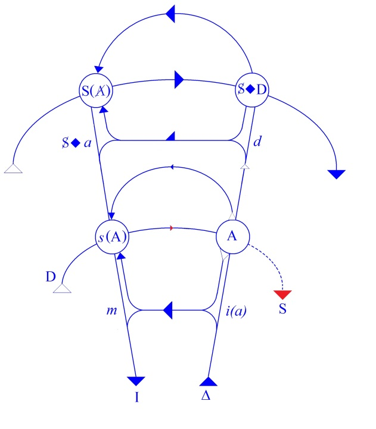

# Leçon 25 | 14 Juin 1961

  <label><input type="checkbox" data-lacan-toggle="original" checked> 原文</label>
  <label><input type="checkbox" data-lacan-toggle="notes" checked> 注释</label>
  <label><input type="checkbox" data-lacan-toggle="commentary" checked> 个人解读评论</label>

<section class="parallel-paragraph" data-paragraph-ids="s8-25-0001">

s8-25-0001

[无对应译文]

原文 · s8-25-0001

Je me suis réveillé ce matin avec *un mal de tête affreux*. Ça ne m’arrive jamais, je ne sais d’où il peut venir. J’ai lu en déjeunant *un excellent travail de* Conrad STEIN sur l’identification primaire[^312]. Je n’en ai pas les mêmes tous les jours de mes élèves... Ce que je vais dire aujourd’hui lui montrera que son travail était bien orienté. Mais je ne sais plus où nous en étions la dernière fois et je n’ai pas bien préparé, comme on dit, mon séminaire.

</section>

<section class="parallel-paragraph" data-paragraph-ids="s8-25-0002">

s8-25-0002

[无对应译文]

原文 · s8-25-0002

Nous allons essayer d’avancer. J’avais l’intention de lire *[Sapho](http://remacle.org/bloodwolf/poetes/falc/sappho/oeuvre.htm)* pour y trouver des choses qui pourraient vous éclairer. Ceci va nous mener au cœur de *la fonction de l’identification*. Comme il s’agit toujours de repérer la position de l’analyste j’ai pensé qu’il ne serait pas mauvais de reprendre les choses.

</section>

<section class="parallel-paragraph" data-paragraph-ids="s8-25-0003">

s8-25-0003

[无对应译文]

原文 · s8-25-0003

FREUD a écrit *[Hemmung, Symptom und Angst](http://gutenberg.spiegel.de/buch/921/1),* en 1926. C’est *le troisième temps* de rassemblement de sa pensée, les deux premiers étant constitués par l’étape de la *Traumdeutung* et de *la seconde topique*. Nous allons tout de suite nous porter *au cœur du problème*, par lui évoqué, qui est celui du sens de *l’angoisse*. Nous allons même aller plus loin puisque, tout de suite, nous allons partir du point de vue économique. Le problème est de savoir : « *où est prise* - nous dit-il - *l’énergie du signal d’angoisse* ».

</section>

<section class="parallel-paragraph" data-paragraph-ids="s8-25-0004">

s8-25-0004

[无对应译文]

原文 · s8-25-0004

Dans les *Gesammelte Werke, Band XIV, page 120*, je lis la phrase suivante :

</section>

<section class="parallel-paragraph" data-paragraph-ids="s8-25-0005">

s8-25-0005

[无对应译文]

原文 · s8-25-0005

« *Das Ich zieht die (vorbewußte) Besetzung von der zu verdrängenden Triebrepräsentanz ab und verwendet sie für die Unlust-(Angst)-Entbindung.* »

</section>

<section class="parallel-paragraph" data-paragraph-ids="s8-25-0006">

s8-25-0006

[无对应译文]

原文 · s8-25-0006

Traduction :

</section>

<section class="parallel-paragraph" data-paragraph-ids="s8-25-0007">

s8-25-0007

[无对应译文]

原文 · s8-25-0007

« *Le moi retire l’investissement (préconscient) du Triebrepräsentanz, ce qui dans la pulsion est représentant, lequel représentant est zu verdrängen* *à refouler et le transforme pour la déliaison du déplaisir, Unlust(Angst)* ».

</section>

<section class="parallel-paragraph" data-paragraph-ids="s8-25-0008">

s8-25-0008

[无对应译文]

原文 · s8-25-0008

Il est évident qu’il ne s’agit pas de tomber sur une phrase de FREUD et puis de commencer à *phosphorer*. Si je vous y mets d’emblée, c’est après *mûre réflexion*. C’est par *un choix soigneusement délibéré* qui est fait pour vous inciter à relire dans le plus bref délai cet article.

</section>

<section class="parallel-paragraph" data-paragraph-ids="s8-25-0009">

s8-25-0009

[无对应译文]

原文 · s8-25-0009

Pour ce qui est de notre propos, appliquons-le, portons-le tout de suite au vif de nos problèmes. J’en ai dit assez pour que vous soupçonniez que la formule structurante du fantasme : S◊*a*, doit être pour quelque chose dans le moment d’orientation où nous sommes. Le fantasme n’est pas seulement formulé mais évoqué, approché même, talonné même de toutes les manières. Pour montrer la nécessité de cette formule, il faut savoir que dans ce support du désir il y a deux éléments dont les fonctions respectives et le rapport fonctionnel ne peuvent d’aucune façon être verbalisés par aucun attribut qui soit exhaustif, et c’est bien pour cela qu’il me faut leur donner pour support ces *deux éléments algébriques* et accumuler autour de ces deux éléments les caractéristiques dont il s’agit.

</section>

<section class="parallel-paragraph" data-paragraph-ids="s8-25-0010">

s8-25-0010

[无对应译文]

原文 · s8-25-0010

Vous en savez assez pour savoir que S *a rapport avec quelque chose qui s’appelle le fading du sujet*, et que le *petit a* - *qui est le petit autre* - a quelque chose à faire avec ce qu’on appelle *l’objet du désir*. Cette symbolisation a déjà l’importance et l’effet de vous montrer que le désir ne comporte pas un rapport subjectif simple à l’objet et que ce S est fait pour l’exprimer. C’est qu’il ne suffit pas de dire, sur ce rapport du sujet à l’objet, que le désir implique une espèce de médiation ou d’intermédiaire réflexif, le sujet se pensant alors comme il se pense dans le rapport de connaissance à l’objet. On a édifié toute une théorie de la connaissance là-dessus.

</section>

<section class="parallel-paragraph" data-paragraph-ids="s8-25-0011">

s8-25-0011

[无对应译文]

原文 · s8-25-0011

C’est bien d’ailleurs ce que nous faisons, car la théorie du désir est faite pour *remettre en cause* cette théorie de la connaissance, ce qui serait bien fait pour nous faire trembler *si d’autres déjà, avant nous, n’avaient pas déjà mis en cause le* « *Je pense donc je suis* » cartésien. Prenons notre phrase de tout à l’heure et essayons de l’appliquer. Cela ne veut pas dire que je vous porte tout de suite au dernier point de mes résultats, mais que je vous porte, par cette interrogation, à mi-chemin.

</section>

<section class="parallel-paragraph" data-paragraph-ids="s8-25-0012">

s8-25-0012

[无对应译文]

原文 · s8-25-0012

C’est une question problématique destinée à vous orienter, à vous donner l’illusion que c’est vous qui êtes en train de chercher. C’est une illusion qui sera promptement réalisée car je ne vous donne pas le dernier mot. Ce n’est pas seulement ma question qui est heuristique mais ma méthode. Qu’est-ce que veut dire, pour l’appliquer à notre propre formulation, le désinvestissement du *Triebrepräsentanz ?* Cela veut dire que, pour que se produise l’angoisse, l’investissement du *petit a* est reporté sur le S.

</section>

<section class="parallel-paragraph" data-paragraph-ids="s8-25-0013">

s8-25-0013

[无对应译文]

原文 · s8-25-0013

Seulement, nous venons de le dire, le S n’est pas quelque chose de saisissable. Il ne peut être conçu que comme une *place*, puisque ce n’est même pas ce point de réflexivité du sujet qui se saisirait, par exemple, comme désirant. Le sujet ne se saisit pas comme désirant, mais *dans le fantasme* *la place* où il pourrait - si j’ose dire - se saisir comme tel, comme désirant, est toujours réservée.

</section>

<section class="parallel-paragraph" data-paragraph-ids="s8-25-0014">

s8-25-0014

[无对应译文]

原文 · s8-25-0014

</section>

<section class="parallel-paragraph" data-paragraph-ids="s8-25-0015">

s8-25-0015

[无对应译文]

原文 · s8-25-0015

Elle est même tellement réservée qu’elle est d’ordinaire occupée par ce qui se produit d’homologique à l’étage inférieur du *graphe,* *i(a)* l’image de l’autre spéculaire à savoir que ce n’est pas forcément mais ordinairement occupé par ça.

</section>

<section class="parallel-paragraph" data-paragraph-ids="s8-25-0016">

s8-25-0016

[无对应译文]

原文 · s8-25-0016

</section>

<section class="parallel-paragraph" data-paragraph-ids="s8-25-0017">

s8-25-0017

[无对应译文]

原文 · s8-25-0017

C’est ce qu’exprime, dans le petit schéma que vous avez vu tout à l’heure et que nous avons effacé, la fonction de *l’image réelle du vase*, *l’illusion du vase renversé *: ce vase qui vient se produire pour *faire semblant* d’entourer la base des tiges florales - qui symbolisent élégamment le *petit a -* c’est de cela qu’il s’agit.

</section>

<section class="parallel-paragraph" data-paragraph-ids="s8-25-0018">

s8-25-0018

[无对应译文]

原文 · s8-25-0018

*C’est l’image, le fantôme narcissique qui vient remplir dans le fantasme la fonction de se coapter*[^313] *au désir, l’illusion de tenir son objet*, si l’on peut dire. *Dès lors,* *si* S *est cette place qui peut de temps en temps se trouver vide*, à savoir que *rien ne vienne s’y produire de satisfaisant concernant le surgissement de l’image narcissique*, nous pouvons concevoir que *c’est peut-être bien à cela, à son appel, à quoi répond la production du signal d’angoisse*.

</section>

<section class="parallel-paragraph" data-paragraph-ids="s8-25-0019">

s8-25-0019

[无对应译文]

原文 · s8-25-0019

Je vais essayer de montrer ce point si important dont on peut dire que l’article dernier de FREUD sur ce sujet nous donne vraiment presque tous les éléments pour le résoudre, sans - à proprement parler - lui donner son dernier quart de tour. Pour l’instant, l’écrou n’est pas serré encore. Disons avec FREUD, que le *signal d’angoisse* est bien quelque chose qui se produit *au niveau du moi* .

</section>

<section class="parallel-paragraph" data-paragraph-ids="s8-25-0020">

s8-25-0020

[无对应译文]

原文 · s8-25-0020

Cependant, nous apercevons ici, grâce à *nos formalisations*, que nous allons peut–être pouvoir en dire un peu plus concernant cet « *au niveau du moi* ». Nos notations vont nous permettre *de décomposer* cette question, *de l’articuler d’une façon plus précise*, et c’est ce qui nous permettra de franchir certains des points où, pour FREUD, la question aboutit à une impasse. Là, je fais tout de suite un saut.

</section>

<section class="parallel-paragraph" data-paragraph-ids="s8-25-0021">

s8-25-0021

[无对应译文]

原文 · s8-25-0021

FREUD dit - au moment où il parle de l’économie, de la transformation nécessaire à la production d’un signal d’angoisse - qu’il ne doit pas falloir une très grande quantité d’énergie pour produire un signal.

</section>

<section class="parallel-paragraph" data-paragraph-ids="s8-25-0022">

s8-25-0022

[无对应译文]

原文 · s8-25-0022

FREUD nous indique déjà qu’il y a là un rapport entre la production de ce signal et quelque chose qui est de l’ordre du *Verzicht,* du renoncement, proche de *Versagung -* du fait que le sujet est barré. Dans la *Verdrängung* du *Triebrepräsentanz*, il y a cette corrélation du dérobement du sujet qui confirme bien la justesse de notre notation de S.

</section>

<section class="parallel-paragraph" data-paragraph-ids="s8-25-0023">

s8-25-0023

[无对应译文]

原文 · s8-25-0023

Le saut consiste à vous désigner ici ce que je vous annonce depuis longtemps comme *la place* à laquelle se tient vraiment l’analyste, cela ne veut pas dire qu’il l’occupe tout le temps. Mais *la place* où il attend - et le mot attendre ici prend toute sa portée,ce que nous retrouverons de la fonction de l’attente, de l’*Erwartung,* pour constituer, pour structurer ce signal - cette place, c’est justement la place de l’S dans le fantasme. J’ai dit que je faisais un saut, c’est-à-dire que je ne prouve pas tout de suite où je vous mène. Maintenant, faisons les pas qui vont permettre de comprendre ce dont il s’agit.

</section>

<section class="parallel-paragraph" data-paragraph-ids="s8-25-0024">

s8-25-0024

[无对应译文]

原文 · s8-25-0024

Une chose nous est donc donnée, c’est que *le signal de l’angoisse se produit quelque part*, ce « *quelque part* » que peut occuper *i(a)*, le *moi* en tant qu’*image de l’autre*, le *moi* en tant que foncièrement fonction de *méconnaissance*. Il l’occupe, cette place, non pas en tant que cette image l’occupe, mais en tant que *place*, c’est-à-dire en tant qu’à l’occasion cette *image* peut y être dissoute.

</section>

<section class="parallel-paragraph" data-paragraph-ids="s8-25-0025">

s8-25-0025

[无对应译文]

原文 · s8-25-0025

Observez bien que je ne dis pas que c’est le défaut de l’image qui fait surgir l’angoisse. Observez bien ce que je dis depuis toujours : c’est que *le rapport spéculaire*, le rapport originaire du sujet à l’image spéculaire, s’instaure dans la réaction dite de l’agressivité. Dans mon article sur *Le stade du miroir,* je l’ai *d’ores et déjà* indiqué, cette même relation spéculaire, je l’ai définie, fondée, car *le stade du miroir* n’est pas sans rapport avec l’*angoisse*.

</section>

<section class="parallel-paragraph" data-paragraph-ids="s8-25-0026">

s8-25-0026

[无对应译文]

原文 · s8-25-0026

J’ai même indiqué que le chemin pour saisir - comme en coupe, transversalement - l’agressivité, c’était de voir qu’il fallait s’orienter dans le sens de la relation temporelle. En effet, il n’y a pas que la relation spatiale qui se référencie à l’image spéculaire comme telle, à savoir quand elle commence de s’animer, quand elle devient l’autre incarné, il y a un rapport temporel :

</section>

<section class="parallel-paragraph" data-paragraph-ids="s8-25-0027">

s8-25-0027

[无对应译文]

原文 · s8-25-0027

« *J’ai hâte de me voir semblable à lui, faute de quoi, où vais-je être ?* »

</section>

<section class="parallel-paragraph" data-paragraph-ids="s8-25-0028">

s8-25-0028

[无对应译文]

原文 · s8-25-0028

Mais si vous vous reportez à mes textes, vous pourrez voir aussi que je suis là plus prudent et que si je ne pousse pas jusqu’au bout la formule, c’est pour quelque raison. *La fonction de la hâte en logique* - ceux qui sont très attentifs à mes œuvres savent que je l’ai traitée quelque part dans une sorte de petit sophisme qui est celui du problème des trois disques - *cette fonction de la hâte*, à savoir cette façon dont l’homme se précipite dans sa ressemblance à l’homme, n’est pas l’angoisse. Pour que l’angoisse se constitue, il faut qu’il y ait rapport au niveau du désir. C’est bien pourquoi c’est au niveau du fantasme que je vous conduis aujourd’hui par la main pour approcher ce problème de l’angoisse.

</section>

<section class="parallel-paragraph" data-paragraph-ids="s8-25-0029">

s8-25-0029

[无对应译文]

原文 · s8-25-0029

Je vais vous montrer très en avant où nous allons et nous reviendrons en arrière pour faire des petits détours de lièvre. Voilà donc où serait l’analyste : dans le rapport du sujet au désir, à un *objet du désir*, que nous supposons dans l’occasion être cet objet qui porte avec lui la menace dont il s’agit, et qui détermine le *Zurückgedrängt,* le refoulé. Tout cela n’est pas définitif.

</section>

<section class="parallel-paragraph" data-paragraph-ids="s8-25-0030">

s8-25-0030

[无对应译文]

原文 · s8-25-0030

Si c’est comme cela que nous abordons le problème, posons-nous la question suivante : qu’attendrait le sujet d’un compagnon ordinaire qui oserait dans les conditions ordinaires occuper cette même place ? Si cet *objet* est dangereux - puisque c’est de cela qu’il s’agit - le sujet en attendrait ceci : qu’il lui donne le signal « *DANGER* », celui qui, dans le cas d’un danger réel, fait détaler le sujet. Je veux dire que ce que j’introduis à ce niveau, c’est ce qu’on déplore que FREUD n’ait pas introduit dans sa dialectique, car c’était vraiment à faire. Je dis que le danger interne est tout à fait comparable à un danger externe, et que le sujet s’efforce de l’éviter de la même façon qu’on évite un danger externe.

</section>

<section class="parallel-paragraph" data-paragraph-ids="s8-25-0031">

s8-25-0031

[无对应译文]

原文 · s8-25-0031

Mais alors, voyez ce que cela nous offre d’articulation efficace à penser à ce qui se passe vraiment en psychologie animale. Chez les animaux sociaux, chez les bêtes de troupeau, chacun sait le rôle que joue le signal : devant l’ennemi du troupeau, le plus malin ou le veilleur parmi les bêtes du troupeau est là pour le sentir, le flairer, le repérer. La gazelle, l’antilope, dressent le nez, poussent un petit bramement, et cela ne traîne pas, tout le monde s’en va dans la même direction. La notion de signal dans un *complexus* social, réaction à un danger, voilà où nous saisissons au niveau biologique ce qui existe dans une société observable. *S’il se laisse apercevoir, ce signal d’angoisse, c’est bien de l’alter ego, de l’autre qui constitue son « moi », que le sujet peut le recevoir.*

</section>

<section class="parallel-paragraph" data-paragraph-ids="s8-25-0032">

s8-25-0032

[无对应译文]

原文 · s8-25-0032

Il y a quelque chose ici que je voudrais pointer. Vous m’avez entendu longtemps vous avertir des dangers de l’altruisme. *Méfiez-vous*, vous ai-je dit implicitement et explicitement, *des pièges du Mitleid, la pitié*, de ce qui nous retient de faire du mal à l’autre, à « la pauvre gosse », moyennant quoi on l’épouse et on est pour longtemps emmerdés tous les deux. Je schématise : ce sont les dangers de l’altruisme. Seulement, si ce sont des dangers, contre lesquels c’est simple humanité de vous mettre en garde, cela ne veut pas dire que ce soit là *le dernier ressort*.

</section>

<section class="parallel-paragraph" data-paragraph-ids="s8-25-0033">

s8-25-0033

[无对应译文]

原文 · s8-25-0033

C’est d’ailleurs ce en quoi je ne suis pas - auprès de l’X à qui je parle en l’occasion - « *l’avocat du diable* » qui le rappellerait au principe d’un sain égoïsme et qui le détournerait de cette pente bien sympathique qui consiste à ne pas être vilain. C’est qu’en fait le précieux *Mitleid,* cet altruisme - pour le sujet qui se méconnaît - n’est que la couverture d’autre chose, et vous l’observerez toujours à condition toutefois d’être dans le plan de l’analyse. Travaillez un peu le *Mitleid* d’un obsessionnel et ici le premier temps est de s’apercevoir - avec ce que je vous pointe, avec ce que d’ailleurs toute la tradition moraliste permet en l’occasion d’affirmer - que ce qu’il *respecte*, ce à quoi il ne veut pas *toucher* dans l’image de l’autre, c’est à sa propre image. Et c’est pourquoi, si n’était pas soigneusement préservée l’intactitude, l’intouchabilité de cette propre image, ce qui surgirait de tout cela serait bel et bien l’angoisse.

</section>

<section class="parallel-paragraph" data-paragraph-ids="s8-25-0034">

s8-25-0034

[无对应译文]

原文 · s8-25-0034

L’angoisse devant quoi ?

</section>

<section class="parallel-paragraph" data-paragraph-ids="s8-25-0035">

s8-25-0035

[无对应译文]

原文 · s8-25-0035

Pas devant l’autre où il se mire - *celle que j’ai appelée* tout à l’heure « *la pauvre gosse* », qui ne l’est que dans son imagination car elle est toujours bien plus dure que vous ne pouvez le croire - c’est pas devant « *la pauvre gosse* » qu’il a l’angoisse, devant *i(a)*, non pas l’image de lui-même, mais devant l’autre : *(a)*, comme objet de son désir.

</section>

<section class="parallel-paragraph" data-paragraph-ids="s8-25-0036">

s8-25-0036

[无对应译文]

原文 · s8-25-0036

Je dis cela pour bien illustrer ce qui est très important, c’est que l’angoisse se produit bien - topiquement - à la place définie par *i(a)* c’est-à-dire - comme la dernière formulation de FREUD nous l’articule - à la place du *moi*, mais qu’*il n’y a de signal d’angoisse qu’en tant* *qu’il se rapporte à un objet de désir*, et à cet *objet de désir* en tant qu’il perturbe le *moi idéal i(a)*, celui qui s’origine dans l’image spéculaire.

</section>

<section class="parallel-paragraph" data-paragraph-ids="s8-25-0037">

s8-25-0037

[无对应译文]

原文 · s8-25-0037

Qu’est-ce que cela veut dire que ce lien absolument nécessaire pour comprendre le *signal d’angoisse* ? Cela veut dire que la fonction de ce *signal* ne s’épuise pas dans *sa Warnung, son avertissement d’avoir à se trotter*. C’est que tout en accomplissant sa fonction, *ce signal maintient le rapport avec l’objet de désir*. C’est cela qui est la clé et le ressort de ce que FREUD - dans cet article et ailleurs de façon répétée, et avec cet accent, ce choix des termes, cette incisivité qui est chez lui illuminante - nous accentue, nous caractérise, en distinguant la situation d’« *angoisse »* de celle du « *danger » *: « *Gefahr »,* et de celle de l’« *Hilflosigkeit »* \[détresse\].

</section>

<section class="parallel-paragraph" data-paragraph-ids="s8-25-0038">

s8-25-0038

[无对应译文]

原文 · s8-25-0038

Dans l’*Hilflosigkeit,* la détresse, le sans-recours, le sujet est purement et simplement chaviré, débordé par une situation irruptive à laquelle il ne peut faire face d’aucune façon. Entre cela et prendre la fuite - solution qui, pour ne pas être héroïque, est celle dont Napoléon lui-même trouvait que c’était la véritable solution courageuse quand il s’agissait de *l’amour -* entre cela et la fuite, il y a autre chose, et c’est ce que FREUD nous pointe en soulignant dans l’*angoisse* ce caractère d’*Erwartung* \[attente, espérance\]. C’est là le trait central. Que nous en puissions faire secondairement la raison de détaler, c’est une chose, mais ce n’est pas là son caractère essentiel. Son caractère essentiel, c’est l’*Erwartung* et c’est ceci que je désigne en vous disant que *l’angoisse est le mode radical sous lequel est maintenu le rapport au désir*.

</section>

<section class="parallel-paragraph" data-paragraph-ids="s8-25-0039">

s8-25-0039

[无对应译文]

原文 · s8-25-0039

Quand - pour des raisons de résistance, de défense, *etc.*, tout ce que vous pouvez mettre dans l’ordre des mécanismes de l’annulation de l’objet - quand il ne reste plus que cela et que l’objet disparaît, s’escamote, mais pas ce qui peut en rester, à savoir l’*Erwartung,* la direction vers sa place, la place où il fait dès lors défaut, où il ne s’agit plus que d’un *unbestimmtes Objekt* [^314], ou encore comme dit FREUD nous sommes dans le rapport *de Löslichkeit,* quand nous en sommes là, *l’angoisse est le dernier mode, le mode radical,* *sous lequel il continue de soutenir - même si c’est d’une façon insoutenable - le rapport au désir.*

</section>

<section class="parallel-paragraph" data-paragraph-ids="s8-25-0040">

s8-25-0040

[无对应译文]

原文 · s8-25-0040

Il y a d’autres façons de soutenir le rapport au désir qui concernent l’insoutenabilité de l’objet, c’est bien pourquoi je vous explique que *l’hystérie*, *l’obsession* peuvent se caractériser par ces statuts du désir que j’ai appelés pour vous :

</section>

<section class="parallel-paragraph" data-paragraph-ids="s8-25-0041">

s8-25-0041

[无对应译文]

原文 · s8-25-0041

- *le désir insatisfait* et soutenu comme tel,

</section>

<section class="parallel-paragraph" data-paragraph-ids="s8-25-0042">

s8-25-0042

[无对应译文]

原文 · s8-25-0042

- *le désir impossible*, *institué* dans son impossibilité. Mais il suffit que vous portiez vos regards vers *la forme la plus radicale de la névrose, la phobie* - qui est ce autour de quoi tourne tout ce discours de FREUD dans cet article - la phobie qui ne peut pas se définir autrement que de ceci : *qu’elle est faite pour soutenir le rapport du sujet au désir sous la forme de l’angoisse*.

</section>

<section class="parallel-paragraph" data-paragraph-ids="s8-25-0043">

s8-25-0043

[无对应译文]

原文 · s8-25-0043

La seule chose qu’il y a à ajouter pour la définir pleinement c’est que, de même que la définition achevée de *l’hystérie* ou de *l’obsession*, quant au fantasme est :

</section>

<section class="parallel-paragraph" data-paragraph-ids="s8-25-0044">

s8-25-0044

[无对应译文]

原文 · s8-25-0044

</section>

<section class="parallel-paragraph" data-paragraph-ids="s8-25-0045">

s8-25-0045

[无对应译文]

原文 · s8-25-0045

…la métaphore de l’autre au point où le sujet se voit comme castré, confronté au grand Autre : DORA, en tant que c’est par l’intermédiaire de M. K. qu’elle désire, mais que ce n’est pas lui qu’elle aime, c’est par l’intermédiaire de celui qu’elle désire qu’elle s’oriente vers celle qu’elle aime, à savoir Mme K, de même, il faut que nous complétions la formule de la phobie aussi. Donc *la phobie* c’est bien ceci : le soutien, le maintien, du rapport au désir dans l’angoisse, mais avec quelque chose de supplémentaire, de plus précis. Ce n’est pas le rapport d’angoisse tout seul.

</section>

<section class="parallel-paragraph" data-paragraph-ids="s8-25-0046">

s8-25-0046

[无对应译文]

原文 · s8-25-0046

C’est que la place de cet objet, en tant qu’il est visé par l’angoisse, est tenue par ce que je vous ai expliqué - longuement, à propos du petit Hans - être la fonction de l’objet phobique, à savoir Ф , grand phi, le *phallus symbolique* en tant qu’il est *le joker dans les cartes*, à savoir *qu’il s’agit bien dans l’objet phobique du phallus*, mais c’est un *phallus* qui prendra la valeur de tous les signifiants, celle du père à l’occasion.

</section>

<section class="parallel-paragraph" data-paragraph-ids="s8-25-0047">

s8-25-0047

[无对应译文]

原文 · s8-25-0047

Ce qui est remarquable dans cette observation, c’est à la fois sa carence et sa présence :

</section>

<section class="parallel-paragraph" data-paragraph-ids="s8-25-0048">

s8-25-0048

[无对应译文]

原文 · s8-25-0048

- *carence* sous la forme *du père réel* (le père de Hans),

</section>

<section class="parallel-paragraph" data-paragraph-ids="s8-25-0049">

s8-25-0049

[无对应译文]

原文 · s8-25-0049

- *présence* sous la forme *du père symbolique* envahissant (FREUD).

</section>

<section class="parallel-paragraph" data-paragraph-ids="s8-25-0050">

s8-25-0050

[无对应译文]

原文 · s8-25-0050

Si tout cela peut jouer la même place sur le même plan, c’est bien entendu que déjà dans l’objet de la phobie il y a cette possibilité infinie de tenir une certaine fonction *manquante, déficiente*, qui est justement ce devant quoi le sujet va succomber si ne surgissait pas à cette place l’*angoisse*.

</section>

<section class="parallel-paragraph" data-paragraph-ids="s8-25-0051">

s8-25-0051

[无对应译文]

原文 · s8-25-0051

Ce petit circuit fait, je pense que vous pouvez saisir que si la fonction de signal de l’angoisse nous avertit de quelque chose, et de quelque chose de très important en clinique, en pratique analytique, c’est que l’angoisse à laquelle le sujet est ouvert n’est pas du tout uniquement - comme on le croit, comme vous le cherchez toujours - une angoisse dont la seule source serait, si je puis dire, à lui interne. Le propre du névrosé est d’être à cet égard, comme M. André BRETON l’appelle, un « *vase communicant* ». L’*angoisse* à laquelle votre névrosé a affaire, l’*angoisse* comme énergie, c’est une *angoisse* dont il a la grande habitude d’aller la chercher à la louche à droite et à gauche chez tel ou tel des grands A auxquels il a affaire. Elle est tout aussi valable, tout aussi utilisable pour lui que celle qui est de son cru.

</section>

<section class="parallel-paragraph" data-paragraph-ids="s8-25-0052">

s8-25-0052

[无对应译文]

原文 · s8-25-0052

Si vous n’en tenez pas compte dans l’économie d’une analyse, vous vous tromperez grandement. Vous en serez, dans bien des cas, à vous creuser la tête pour savoir d’où vient en telle occasion ce petit resurgissement d’angoisse au moment où vous l’attendiez le moins. Ce n’est pas forcément de la sienne, de celle dont vous êtes déjà avertis par la pratique des mois antérieurs d’analyse, il y a aussi celle des voisins qui compte, et puis la vôtre !

</section>

<section class="parallel-paragraph" data-paragraph-ids="s8-25-0053">

s8-25-0053

[无对应译文]

原文 · s8-25-0053

Vous pensez que là, bien sûr, vous vous *y retrouverez*. Vous savez bien que déjà on vous a donné là-dessus des avertissements. Je crains que cela ne vous *avertisse* pas de grand-chose, car justement, une question introduite à partir de cette considération, c’est de savoir ce que cet avertissement implique :

</section>

<section class="parallel-paragraph" data-paragraph-ids="s8-25-0054">

s8-25-0054

[无对应译文]

原文 · s8-25-0054

- que *votre angoisse* à vous ne doit pas entrer en jeu,

</section>

<section class="parallel-paragraph" data-paragraph-ids="s8-25-0055">

s8-25-0055

[无对应译文]

原文 · s8-25-0055

- que *l’analyse doit être aseptique concernant* *votre angoisse*.

</section>

<section class="parallel-paragraph" data-paragraph-ids="s8-25-0056">

s8-25-0056

[无对应译文]

原文 · s8-25-0056

Qu’est-ce que cela peut vouloir dire, sur le plan où j’essaie de vous soutenir toute cette année, sur le plan synchronique, celui qui ne permet pas d’invasion de la diachronie : à savoir que votre angoisse vous l’avez déjà largement dépassée dans votre analyse antérieure ne résout rien, car ce qu’il s’agit de savoir, c’est dans quel statut actuel vous devez être, *vous*, quant à votre désir, pour que ne surgisse pas *de vous*, dans l’analyse, non seulement le signal mais aussi *l’énergie de l’angoisse*, pour autant qu’elle est là - si elle surgit - toute faite pour se reverser dans l’économie de votre sujet, et ceci à mesure qu’il est plus avancé dans l’analyse, c’est-à-dire que c’est au niveau de ce grand Autre que vous êtes pour lui qu’il va chercher la voie de son désir. Tel est le statut de l’analyste dans la synchronie concernant l’angoisse.

</section>

<section class="parallel-paragraph" data-paragraph-ids="s8-25-0057">

s8-25-0057

[无对应译文]

原文 · s8-25-0057

Quoi qu’il en soit, pour boucler cette première boucle il faut faire intervenir *la fonction de l’Autre*, grand A, concernant la possibilité de surgissement de l’angoisse comme signal.

</section>

<section class="parallel-paragraph" data-paragraph-ids="s8-25-0058">

s8-25-0058

[无对应译文]

原文 · s8-25-0058

Vous voyez à la fois que si la référence au troupeau - pour autant que ce signal s’exerce à l’intérieur d’une fonction de communication *imaginaire -* est nécessaire, car c’est par là que je veux vous faire sentir que si l’angoisse est un signal cela veut dire qu’elle peut provenir d’un autre, il n’en reste pas moins - pour autant qu’il s’agit d’un rapport au désir - que le signal ne s’épuise pas dans la métaphore du danger de l’ennemi du troupeau, et justement en ceci, qui distingue *le troupeau humain* du troupeau animal, que pour chaque sujet, comme chacun le sait, sauf les entrepreneurs en psychologie collective, l’ennemi du troupeau c’est lui.

</section>

<section class="parallel-paragraph" data-paragraph-ids="s8-25-0059">

s8-25-0059

[无对应译文]

原文 · s8-25-0059

Dans cette référence à la réalité du troupeau nous trouvons une transposition intéressante de ce que FREUD nous articule sous la forme du danger interne. Nous trouvons ici la confirmation de ce que je vous dis toujours par rapport à l’universel chez l’homme : *l’individuel et le collectif sont un seul et même niveau*, ce qui est vrai au niveau de l’individuel, ce danger interne, est vrai aussi au niveau du *collectif* c’est le même danger interne au sujet, qui est le danger interne au troupeau.

</section>

<section class="parallel-paragraph" data-paragraph-ids="s8-25-0060">

s8-25-0060

[无对应译文]

原文 · s8-25-0060

Ceci vient de l’originalité de *la position du désir* comme tel. Pour autant que le *désir* vient à émerger pour combler *le manque de certitude,* *le manque de garantie* auxquels le sujet se trouve confronté par rapport à ce qui lui importe en tant qu’il n’est pas seulement un animal de troupeau - il l’est peut-être - seulement cette *relation élémentaire* qui existe sûrement, est gravement perturbée du fait qu’elle se trouve incluse, tout autant au niveau collectif qu’au niveau individuel, dans le rapport au signifiant.

</section>

<section class="parallel-paragraph" data-paragraph-ids="s8-25-0061">

s8-25-0061

[无对应译文]

原文 · s8-25-0061

L’*animal social*, au moment où il détale sous le signal que lui donne la bête veilleuse ou la bête chère, *est* le troupeau. L’*être parlant*, lui, est essentiellement *le manque à être* surgi d’un certain rapport au discours, d’une poésie si vous voulez. Ce *manque à être*, il ne peut le combler - je vous l’ai déjà articulé et indiqué - que par cette action qui - vous le sentez mieux dans ce contexte et dans ce parallèle - prend si facilement, prend peut être radicalement, toujours ce caractère de fuite en avant.

</section>

<section class="parallel-paragraph" data-paragraph-ids="s8-25-0062">

s8-25-0062

[无对应译文]

原文 · s8-25-0062

Mais justement, foncièrement cette action-là *n’arrange pas le troupeau* du tout. Cela ne joue pas du tout sur le plan de *la cohérence* ni de *la défense collective*. Son action, pour tout dire, en principe le troupeau ne s’en accommode guère, pour ne pas dire qu’il n’en veut pas. Et pas seulement le troupeau, la réalité non plus n’en veut pas de son action, parce que la réalité - je ne dis pas le *Réel -* c’est justement *la somme des certitudes* accumulées par l’addition d’une série d’actions *antérieures*, alors la nouvelle est toujours malvenue.

</section>

<section class="parallel-paragraph" data-paragraph-ids="s8-25-0063">

s8-25-0063

[无对应译文]

原文 · s8-25-0063

C’est ce qui nous permet de situer correctement, c’est-à-dire d’une façon qui recoupe l’expérience, à savoir - ce qui est surprenant quand même et pourtant évident toujours plus ou moins - *cette petite levée d’angoisse qui se produit* chaque fois qu’il s’agit véritablement du désir du sujet. Nous sommes là à la fois au quotidien, à la racine, à l’essentiel, au point vif de tout ce qui est notre expérience.

</section>

<section class="parallel-paragraph" data-paragraph-ids="s8-25-0064">

s8-25-0064

[无对应译文]

原文 · s8-25-0064

Si l’analyse n’a pas servi à faire comprendre aux hommes que leurs désirs :

</section>

<section class="parallel-paragraph" data-paragraph-ids="s8-25-0065">

s8-25-0065

[无对应译文]

原文 · s8-25-0065

- premièrement, ce n’est pas la même chose que leurs besoins,

</section>

<section class="parallel-paragraph" data-paragraph-ids="s8-25-0066">

s8-25-0066

[无对应译文]

原文 · s8-25-0066

- et deuxièmement, que le désir en lui-même porte un caractère dangereux, est ce danger dont le caractère menaçant pour l’individu s’éclaire si particulièrement du caractère tout à fait évident de ce qu’il comporte de menaces pour la troupe, ...je me demande alors à quoi l’analyse a jamais servi.

</section>

<section class="parallel-paragraph" data-paragraph-ids="s8-25-0067">

s8-25-0067

[无对应译文]

原文 · s8-25-0067

Il s’agit de gravir quelque chose, et puisque nous sommes engagés dans ce sentier adopté ce jour, et peut-être plus directement que la voie royale que je n’ai pas préparée aujourd’hui, nous allons continuer de la même façon. Nous allons poser une question insidieuse. J’ai déjà préparé la question de ce que doit être la *Versagung* de l’analyste, mais là franchement je ne vous en ai pas dit beaucoup plus. Je vous pose la même question : est-ce que ce n’est pas cela *la féconde Versagung de l’analyste*, de refuser au sujet son angoisse à lui analyste, de laisser nue la place où il est en somme appelé, de nature comme Autre, à donner le *signal d’angoisse* ?

</section>

<section class="parallel-paragraph" data-paragraph-ids="s8-25-0068">

s8-25-0068

[无对应译文]

原文 · s8-25-0068

Regardons-le se profiler ce quelque chose dont je vous ai déjà - au moins la dernière fois - donné l’indication en vous disant que la place pure de l’analyste, autant que nous pourrons la définir *dans* et *par* le fantasme, serait la place du désirant \- ἐραστής \[erastès\] ou ἔρόν \[erôn\] - pur, ce qui voudrait dire ce *quelque part* où se produit toujours la fonction du désir, à savoir de venir à la place de l’ἐρώμενος \[erômenos\] ou de l’ἐρώμενον \[erômenon\], car c’est pour cela que je vous ai fait, au début de l’année, parcourir ce long déchiffrage du *Banquet,* de la théorie de l’amour.

</section>

<section class="parallel-paragraph" data-paragraph-ids="s8-25-0069">

s8-25-0069

[无对应译文]

原文 · s8-25-0069

Il faudrait arriver à concevoir que quelque sujet puisse tenir la place du *pur désirant*, s’abstraire, s’escamoter lui-même dans le rapport à l’autre d’aucune supposition d’être désirable. Ce que vous avez lu des propos, des réponses de SOCRATE dans *Le Banquet* doit vous donner une idée de ce que je suis en train de vous dire, car si quelque chose est incarné et signifié par l’épisode avec ALCIBIADE, c’est bien ça. D’une part, SOCRATE affirme ne rien connaître qu’aux choses de l’amour : tout ce qu’on nous dit de lui c’est que c’est un désirant à tout crin, inépuisable.

</section>

<section class="parallel-paragraph" data-paragraph-ids="s8-25-0070">

s8-25-0070

[无对应译文]

原文 · s8-25-0070

Mais \[d’autre part\] quand il s’agit de se montrer *dans la position du désiré*, à savoir en face de l’agression publique, scandaleuse, déchaînée, ivre, d’ALCIBIADE, ce qui nous est montré : c’est qu’il n’y a littéralement plus personne. Ceci, je ne vous dis pas que cela résout l’affaire, mais c’est au moins *illustratif* de ce dont je vous parle. Cela a un sens qui a au moins été incarné *quelque part*.

</section>

<section class="parallel-paragraph" data-paragraph-ids="s8-25-0071">

s8-25-0071

[无对应译文]

原文 · s8-25-0071

Car il n’y a pas qu’à moi que SOCRATE apparaît être une énigme humaine, un cas comme on n’en a jamais vu et dont on ne sait pas que faire, avec quelques pincettes qu’on essaie de s’en saisir, c’est à tout le monde. Chaque fois que quelqu’un s’est vraiment \- à propos de SOCRATE - posé la question : comment ce type-là était-il fabriqué et pourquoi a-t-il mis *la pagaille* partout rien qu’en apparaissant et en racontant des petites histoires qui ont l’air d’être des affaires de tous les jours ?

</section>

<section class="parallel-paragraph" data-paragraph-ids="s8-25-0072">

s8-25-0072

[无对应译文]

原文 · s8-25-0072

J’aimerais que nous nous arrêtions un peu à « *la place du désirant* ». Cela fait écho, cela rime avec quelque chose que j’appellerai « *la place de l’orant* »[^315] dans la prière, car *dans la prière, l’orant se voit en train d’orer*. *Il n’y a pas de prière sans que l’orant se voie en train d’orer*. Je me suis souvenu ce matin de PRIAM. C’est « *l’orant* » type qui a réclamé à ACHILLE le corps du dernier de ses fils - dont il ne sait pas le compte : il en avait cinquante. Il apparaît que c’est à peu près le dernier - en tout cas à cet HECTOR, il y tient.

</section>

<section class="parallel-paragraph" data-paragraph-ids="s8-25-0073">

s8-25-0073

[无对应译文]

原文 · s8-25-0073

Qu’est-ce qu’il vient raconter à ACHILLE ? Pas trop de choses sur HECTOR, et cela pour plusieurs raisons :

</section>

<section class="parallel-paragraph" data-paragraph-ids="s8-25-0074">

s8-25-0074

[无对应译文]

原文 · s8-25-0074

- d’abord parce que ce n’est pas facile d’en parler dans l’état où il est à ce moment-là,

</section>

<section class="parallel-paragraph" data-paragraph-ids="s8-25-0075">

s8-25-0075

[无对应译文]

原文 · s8-25-0075

- ensuite, comme il apparaît, chaque fois qu’il est question de l’HECTOR vivant, ACHILLE, qui n’est pas *commode* ni maître de ses impulsions, commence à rentrer en fureur, bien qu’il ait reçu des instructions divines, à savoir que sa mère THÉTIS est venue lui dire : « *Le grand patron veut que tu rendes* HECTOR *à son père* PRIAM *et est venu me rendre visite exprès pour cela* » Il s’en faut d’un poil pour qu’il ne le rende pas. L’important est que PRIAM ne fait pas tellement de psychologie.

</section>

<section class="parallel-paragraph" data-paragraph-ids="s8-25-0076">

s8-25-0076

[无对应译文]

原文 · s8-25-0076

Du seul fait qu’il est en position d’*orant* il va présentifier dans sa demande même, le personnage de l’*orant*. Je veux dire que la prière de PRIAM - celle qui résonne depuis l’origine de notre âge, car, même si vous n’avez pas lu *L’Iliade* [^316] cet épisode est là circulant entre vous tous comme un modèle, par l’intermédiaire de tous les autres modèles qu’il a engendrés - pour la faire porter, il dédouble *ce personnage priant* qu’il est, d’un autre qui se décrit, s’insère dans sa prière sous la forme de quelqu’un qui n’est pas là, à savoir PÉLÉE, le père d’ACHILLE, qu’il représente.

</section>

<section class="parallel-paragraph" data-paragraph-ids="s8-25-0077">

s8-25-0077

[无对应译文]

原文 · s8-25-0077

C’est lui qui prie, mais *dans sa prière*, il est nécessaire que cette prière passe par quelque chose qui n’est même pas l’invocation du père d’ACHILLE, il lui trace la figure d’un père qui, lui, est peut-être pour l’instant même, dit-il, bien ennuyé parce que ses voisins sont en train de lui faire des misères. Il sait qu’il a encore un fils qui n’est pas le dernier venu, ACHILLE ici présent. Vous retrouverez dans toute prière ce que j’appelle « *la place de l’orant* » à l’intérieur même de la demande de celui qui prie.

</section>

<section class="parallel-paragraph" data-paragraph-ids="s8-25-0078">

s8-25-0078

[无对应译文]

原文 · s8-25-0078

Le désirant - c’est pour cela que je fais ce détour - cela n’est pas pareil, je veux dire que le désirant, en tant que tel, ne peut rien dire de lui-même sinon à *s’abolir comme désiran*t. Car, c’est ce qui définit la place pure du sujet en tant que *désirant*, c’est qu’à toute tentative de s’articuler il ne sort rien d’autre que syncope du langage, et impuissance à dire, parce que dès qu’il dit il n’est rien plus que quémandeur, il passe au registre de *la demande* et c’est autre chose. Ceci n’est pas moins important si nous devons formuler de quelque manière ce qui, dans cette réponse à l’Autre que constitue l’analyse,constitue la forme spécifique de *la place de l’analyste*.

</section>

<section class="parallel-paragraph" data-paragraph-ids="s8-25-0079">

s8-25-0079

[无对应译文]

原文 · s8-25-0079

Pour terminer aujourd’hui sur quelque chose qui ajoutera peut-être un peu plus une formule en impasse à toutes celles que déjà j’ai l’air de vous servir. C’est celle-ci qui a bien quelque intérêt en ce qu’elle boucle les éléments dont je viens de dessiner le tour : c’est que, *si l’angoisse est* ce que je vous ai dit, *ce rapport de soutien au désir là où l’objet manque*, nous retrouvons cette autre chose dont nous avons l’expérience c’est que, pour *renverser la formule* - ceci se voit constamment dans la pratique - *le désir est un remède à l’angoisse*.

</section>

<section class="parallel-paragraph" data-paragraph-ids="s8-25-0080">

s8-25-0080

[无对应译文]

原文 · s8-25-0080

Le moindre petit bonhomme névrosé en sait là-dessus aussi long, voire plus long que vous. L’appui trouvé dans le désir, si incommode soit-il avec toute sa traîne de culpabilité, c’est quelque chose quand même de beaucoup plus aisé à tenir que la position d’angoisse, de sorte qu’en somme, pour quelqu’un d’un peu astucieux et expérimenté - je dis cela pour l’analyste - il s’agirait d’avoir toujours à sa portée un petit désir bien fourbi pour ne pas être exposé à mettre en jeu dans l’analyse *un quantum* d’angoisse qui ne serait pas opportun, ni de bonne venue.

</section>

<section class="parallel-paragraph" data-paragraph-ids="s8-25-0081">

s8-25-0081

[无对应译文]

原文 · s8-25-0081

Est-ce bien là ce vers quoi j’entends vous amener ? Sûrement pas, de toute façon, il n’est pas aisé de repérer avec la main les parois du couloir ! La question dont il s’agit n’est pas de l’expédient du désir, c’est d’un certain rapport avec le désir qui ne soit pas ainsi soutenu tout à fait « *à la petite semaine* ».

</section>

<section class="parallel-paragraph" data-paragraph-ids="s8-25-0082">

s8-25-0082

[无对应译文]

原文 · s8-25-0082

Dans notre prochaine rencontre, nous allons revenir sur la distinction la dernière fois inaugurée du rapport du *sujet* au *moi idéal* et à l’*idéal du moi*. Cela nous permettra de nous orienter dans la topique vraie du désir, la fonction de l’*einziger Zug,* de ce qui différencie foncièrement l’*idéal du moi* d’une façon telle que seulement de là on puisse distinguer, définir, la fonction de l’objet dans ses rapports avec la fonction narcissique.

</section>

<section class="parallel-paragraph" data-paragraph-ids="s8-25-0083">

s8-25-0083

[无对应译文]

原文 · s8-25-0083

C’est ce que j’espère pouvoir mener à bien dans notre prochaine rencontre, en le mettant sous le titre de la formule de PINDARE σκιᾶς ὄναρ ἄνθρωπος \[skias onar anthrôpos\], *rêve d’une ombre : l’homme* [^317], écrit-il dans les derniers vers de la huitième ode.

</section>

<section class="parallel-paragraph" data-paragraph-ids="s8-25-0084">

s8-25-0084

[无对应译文]

原文 · s8-25-0084

Ce rapport *du rêve et de l’ombre*, *du symbolique et de l’imaginaire*, c’est ce autour de quoi je ferai tourner notre propos décisif.

</section>

<section class="parallel-paragraph" data-paragraph-ids="s8-25-0085">

s8-25-0085

[无对应译文]

原文 · s8-25-0085

&nbsp;

</section>

<section class="note-block original-notes">

## Notes

[^312]: Conrad Stein : *L’identification primaire*, [Revue française de psychanalyse, 1962, n° spécial, p.257-265](http://gallica.bnf.fr/ark:/12148/bpt6k54453457.image.langEN), ou L’inconscient, Desclée de Brouwer, 1966, p.131-142.

[^313]: attacher, unir, associer, combiner.

[^314]: Unbestimmt : indéfini, indéterminé.

[^315]: Figure symbolique représentant un personnage généralement féminin, debout, les deux bras étendus dans le geste de la prière

[^316]: Cet épisode se trouve au chant XXIV de *L’Iliade.*

[^317]: [Pindare : *Pythiques,* huitième Pythique](http://remacle.org/bloodwolf/poetes/pindare/pythiques.htm), (vers 95) traduction Aimé Puech, Paris, « Les *Belles Lettres »,* 1977, v. 96-97.

</section>
