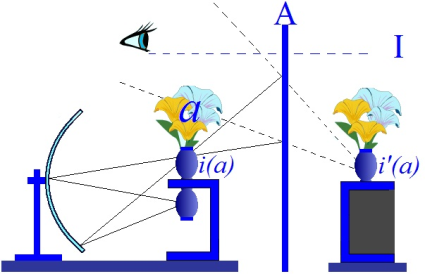

# Leçon 11 | 08 Février 1961

  <label><input type="checkbox" data-lacan-toggle="original" checked> 原文</label>
  <label><input type="checkbox" data-lacan-toggle="notes" checked> 注释</label>
  <label><input type="checkbox" data-lacan-toggle="commentary" checked> 个人解读评论</label>

<section class="parallel-paragraph" data-paragraph-ids="s8-11-0001">

s8-11-0001

[无对应译文]

原文 · s8-11-0001

Il y a donc des ἄγαλματα \[agalmata\] dans SOCRATE, et c’est ce qui a provoqué l’amour d’ALCIBIADE. Nous allons maintenant revenir sur la scène en tant qu’elle *met en scène* précisément, ALCIBIADE dans son discours adressé à SOCRATE et auquel SOCRATE, comme vous le savez, va répondre en en donnant à proprement parler une interprétation. Nous verrons en quoi cette appréciation peut être retouchée, mais on peut dire que structuralement, au premier aspect, l’intervention de SOCRATE va avoir tous les caractères d’une interprétation, à savoir :

</section>

<section class="parallel-paragraph" data-paragraph-ids="s8-11-0002">

s8-11-0002

[无对应译文]

原文 · s8-11-0002

« *Tout ce que tu viens de dire de si extraordinaire, énorme, dans son impudence, tout ce que tu viens de dévoiler en parlant de moi,* *c’est pour* AGATHON *que tu l’as dit* ».\[[222c-d](http://remacle.org/bloodwolf/philosophes/platon/cousin/banquet.htm)\]

</section>

<section class="parallel-paragraph" data-paragraph-ids="s8-11-0003">

s8-11-0003

[无对应译文]

原文 · s8-11-0003

Pour comprendre le sens de la scène qui se déroule de l’un à l’autre de ces termes, de l’éloge qu’ALCIBIADE fait de SOCRATE à cette interprétation de SOCRATE et à ce qui suivra, il convient que nous reprenions les choses *d’un peu plus haut et dans le détail*, à savoir que nous voyions le sens de ce qui se passe à partir de l’entrée d’ALCIBIADE, entre ALCIBIADE et SOCRATE. Je vous l’ai dit, à partir de ce moment, il s’est passé ce changement que ce n’est plus de *l’amour* mais d’un autre, désigné dans l’ordre, qu’il va être question de faire l’éloge. Et l’important est justement ceci, c’est qu’il va être question de faire l’*éloge de l’autre*, ἐπαίνος \[épaïnos\]. Et c’est précisément en cela, quant au dialogue, que réside le passage de la métaphore : l’éloge de l’autre se substitue non pas à l’éloge de *l’amour* mais à *l’amour* lui-même, et ceci dès l’entrée \[[213c](http://remacle.org/bloodwolf/philosophes/platon/cousin/banquet.htm)\].

</section>

<section class="parallel-paragraph" data-paragraph-ids="s8-11-0004">

s8-11-0004

[无对应译文]

原文 · s8-11-0004

C’est à savoir que SOCRATE s’adressant à AGATHON, lui dit :

</section>

<section class="parallel-paragraph" data-paragraph-ids="s8-11-0005">

s8-11-0005

[无对应译文]

原文 · s8-11-0005

« *l’amour de cet homme-là (Alcibiade) n’est pas pour moi une mince affaire -* Chacun sait qu’ALCIBIADE a été le grand amour de SOCRATE - *depuis que je me suis énamouré de lui,*[^148] - nous verrons le sens qu’il convient de donner à ces termes : il en a été l’ἐραστής \[erastès\] - *il ne m’est plus permis de porter les yeux sur un seul beau garçon, ni de m’entretenir avec aucun, sans qu’il me jalouse et m’envie, se livrant* *à d’incroyables excès et m’injuriant, à peine s’il ne me tombe pas dessus de la façon la plus violente !* [^149] *Prends garde donc et protège-moi* \- dit-il à AGATHON - *car aussi bien de celui-ci, la manie et la rage* *d’aimer* ϕιλεραστίαν \[philerastian\] *sont ce qui me fait peur !* »

</section>

<section class="parallel-paragraph" data-paragraph-ids="s8-11-0006">

s8-11-0006

[无对应译文]

原文 · s8-11-0006

C’est à la suite de cela que se place le dialogue avec ÉRYXIMAQUE d’où va résulter le nouvel *ordre des choses*. C’est à savoir qu’il est convenu qu’on fera l’éloge à tour de rôle de celui qui succède, vers la droite dans le rang. Ceci est instauré au cours d’un dialogue entre ALCIBIADE et ÉRYXIMAQUE.

</section>

<section class="parallel-paragraph" data-paragraph-ids="s8-11-0007">

s8-11-0007

[无对应译文]

原文 · s8-11-0007

L’ἔπαινος \[épaïnos\]*, l’éloge* dont il va être alors question a - je vous l’ai dit - cette fonction *métaphorique*, *symbolique*, d’exprimer quelque chose qui de l’un à *l’autre* - celui dont on parle - a une certaine fonction de métaphore de l’amour, ἐπαινεῖν \[epainein\]*, louer,* a ici une fonction rituelle qui est quelque chose qui peut se traduire dans ces termes : *parler bien de quelqu’un*. \[[214d](http://remacle.org/bloodwolf/philosophes/platon/cousin/banquet.htm)\] Et quoi qu’on ne puisse faire valoir ce texte au moment du *Banquet,* puisqu’il est bien postérieur, ARISTOTE dans sa *Rhétorique,* [*Livre 1, Chapitre 9*](http://remacle.org/bloodwolf/philosophes/Aristote/rheto1.htm#IX), distingue l’ἔπαινος \[épaïnos\] de l’ενκωμιον \[enkômion\]. Je vous ai dit que je ne voulais pas entrer jusqu’à présent sur cette différence de l’ἔπαινος \[épaïnos\] et de l’ενκωμιον \[enkômion\]*,* nous y viendrons quand même pourtant, entraînés par la force des choses. La différence de l’ἔπαινος \[épaïnos\] est très précisément dans la façon dont AGATHON a introduit son discours. Il parle de l’objet en partant de sa nature, de son *essence* pour en développer ensuite les qualités, c’est un déploiement, si l’on peut dire, de l’objet dans son essence.

</section>

<section class="parallel-paragraph" data-paragraph-ids="s8-11-0008">

s8-11-0008

[无对应译文]

原文 · s8-11-0008

Alors que l’ενκωμιον \[enkômion\] que nous avons peine à traduire, semble-t-il - et le terme de κῶμος \[kômos\][^150] qui y est impliqué y est sans doute pour quelque chose - l’ενκωμιον, si cela doit se traduire par quelque chose d’équivalent dans notre langue, c’est quelque chose comme *panégyrique,* et si nous suivons ARISTOTE il s’agira alors de tresser la guirlande des actes, des hauts faits de l’objet[^151], point de vue qui *déborde*, qui est excentrique par rapport à la visée de son essence qui est celle de l’ἔπαινος \[épaïnos\]*.* Mais l’ἔπαινος \[épaïnos\] n’est pas quelque chose qui dès l’abord se présente sans ambiguïté. D’abord c’est au moment où il est décidé que c’est d’ἔπαινος \[épaïnos\] qu’il s’agira, qu’ALCIBIADE commence de rétorquer que la remarque qu’a faite SOCRATE concernant sa jalousie, disons féroce, ne comporte pas un traître mot de vrai :

</section>

<section class="parallel-paragraph" data-paragraph-ids="s8-11-0009">

s8-11-0009

[无对应译文]

原文 · s8-11-0009

« *C’est tout le contraire ! C’est lui, le bonhomme qui, s’il m’arrive de louer quelqu’un en sa présence, soit un dieu soit un homme,* *du moment que c’est un autre que lui, va tomber sur moi -* et il reprend la même métaphore que tout à l’heure - τω χεῖρε \[tô kheire\], *à bras raccourcis* ! » \[[214d](http://remacle.org/bloodwolf/philosophes/platon/cousin/banquet.htm)\]

</section>

<section class="parallel-paragraph" data-paragraph-ids="s8-11-0010">

s8-11-0010

[无对应译文]

原文 · s8-11-0010

Il y a là un ton, un style, une sorte de malaise, d’embrouille, *une sorte de réponse gênée, de « tais-toi ! » presque panique de* SOCRATE :

</section>

<section class="parallel-paragraph" data-paragraph-ids="s8-11-0011">

s8-11-0011

[无对应译文]

原文 · s8-11-0011

« *Tais-toi : est-ce que tu ne tiendras pas ta langue ?* »* *traduit-on avec assez de justesse.

</section>

<section class="parallel-paragraph" data-paragraph-ids="s8-11-0012">

s8-11-0012

[无对应译文]

原文 · s8-11-0012

« *Foi de Poseidôn* - répond ALCIBIADE (ce qui n’est pas rien) - *tu ne saurais protester, je te l’interdis !* *Tu sais bien que je ne ferais pas de qui que ce fût d’autre, l’éloge en ta présence !* »* *

</section>

<section class="parallel-paragraph" data-paragraph-ids="s8-11-0013">

s8-11-0013

[无对应译文]

原文 · s8-11-0013

« *Eh bien* - dit ÉRYXIMAQUE - *vas-y prononce l’éloge* *de SOCRATE.* »

</section>

<section class="parallel-paragraph" data-paragraph-ids="s8-11-0014">

s8-11-0014

[无对应译文]

原文 · s8-11-0014

Et ce qui se passe alors, c’est que - à SOCRATE \[en fait : à Éryximaque\] :

</section>

<section class="parallel-paragraph" data-paragraph-ids="s8-11-0015">

s8-11-0015

[无对应译文]

原文 · s8-11-0015

« *faisant son éloge, dois-je lui infliger devant vous le châtiment public que je lui ai promis, faisant son éloge dois-je le démasquer ?* » \[[214e](http://remacle.org/bloodwolf/philosophes/platon/cousin/banquet.htm)\]

</section>

<section class="parallel-paragraph" data-paragraph-ids="s8-11-0016">

s8-11-0016

[无对应译文]

原文 · s8-11-0016

C’est *ainsi* ensuite qu’il en sera de son développement. Et en effet ce n’est pas sans inquiétude non plus - comme si c’était là à la fois une nécessité de la situation et aussi une implication du genre - que l’*éloge* puisse en ses termes aller si loin que de faire rire de celui dont il va s’agir. Aussi bien ALCIBIADE propose un « *gentleman’s agreement »* : « *Dois-je dire la vérité* ? »

</section>

<section class="parallel-paragraph" data-paragraph-ids="s8-11-0017">

s8-11-0017

[无对应译文]

原文 · s8-11-0017

Ce à quoi SOCRATE ne se refuse pas : « *Je t’invite à la dire* ».

</section>

<section class="parallel-paragraph" data-paragraph-ids="s8-11-0018">

s8-11-0018

[无对应译文]

原文 · s8-11-0018

« *Eh bien* - dit ALCIBIADE \[[215a](http://remacle.org/bloodwolf/philosophes/platon/cousin/banquet.htm)\] - *je te laisse la liberté, si je franchis les limites de la vérité en mes termes, de dire « Tu mens ! »* *Certes, s’il m’arrive d’errer, de m’égarer dans mon discours, tu ne dois point t’en étonner* \[...\] *étant donné le personnage* - nous retrouvons là le terme de l’ἀτοπία \[atopia\], inclassable - *si déroutant que tu es* \[...\] *comment ne pas s’embrouiller, au moment de mettre les choses* *en ordre* καταριθμειν \[katarithmein\], *d’en faire l’énumération et* *le compte* ».

</section>

<section class="parallel-paragraph" data-paragraph-ids="s8-11-0019">

s8-11-0019

[无对应译文]

原文 · s8-11-0019

Et voici l’éloge qui commence. L’éloge, la dernière fois je vous en ai indiqué la structure et le thème. ALCIBIADE en effet dit que sans doute il va entrer dans le γέλως \[gelôs\], γελοίος \[geloios\] plus exactement, dans le *risible* et y entre assurément en commençant de présenter les choses par la comparaison qui - je vous le note - reviendra en somme *trois fois* dans son discours, chaque fois avec une insistance quasi répétitive, où SOCRATE est comparé à cette enveloppe *rude* et *dérisoire* que constitue le satyre : il faut en quelque sorte l’ouvrir pour voir *à l’intérieur* ce qu’il appelle la première fois ἄγαλματα θεὸν \[agalmata théon\]*, les statues des dieux* \[[215b](http://remacle.org/bloodwolf/philosophes/platon/cousin/banquet.htm)\]. Et puis ensuite il reprend dans les termes que je vous ai dits la dernière fois, en les *appelant* *encore une fois* ἄγαλματα θεία \[agalmata théïa\]*, divines,* θαυμαστά \[thaumasta\] *admirables*. La troisième fois, nous le verrons employer plus loin le terme άρετῆς \[aretès \], ἄγαλματα άρετῆς \[agalmata aretès\], *la merveille de la vertu,* la « *merveille des merveilles* ». \[[216e](http://remacle.org/bloodwolf/philosophes/platon/cousin/banquet.htm)\]

</section>

<section class="parallel-paragraph" data-paragraph-ids="s8-11-0020">

s8-11-0020

[无对应译文]

原文 · s8-11-0020

En route, ce que nous voyons, c’est cette comparaison qui, au moment où elle est instaurée, est poussée à ce moment-là fort loin, où il est comparé avec le satyre MARSYAS, et malgré sa protestation : « *Eh, assurément il n’est pas flûtiste* ! »[^152], ALCIBIADE revient, appuie et compare ici SOCRATE à un « *satyre* », pas simplement de la forme d’une boîte, d’un objet plus ou moins dérisoire, mais au satyre MARSYAS nommément, en tant que quand il entre en action, chacun sait par la légende que le charme de son chant se dégage. Le charme est tel qu’il a encouru la jalousie d’APOLLON, ce MARSYAS. APOLLON le fait écorcher pour avoir osé rivaliser avec la musique suprême, la musique divine.

</section>

<section class="parallel-paragraph" data-paragraph-ids="s8-11-0021">

s8-11-0021

[无对应译文]

原文 · s8-11-0021

La seule différence, dit-il, entre SOCRATE et lui, c’est qu’en effet SOCRATE n’est pas flûtiste : *ce n’est pas par la musique qu’il opère* et pourtant le résultat est exactement du même ordre. Et ici il convient de nous référer à ce que PLATON explique dans le *Phèdre* concernant les états, si l’on peut dire, « *supérieurs* » de l’inspiration tels qu’ils sont produits au-delà du *franchissement de la beauté*. Parmi les diverses formes de ce franchissement - que je ne reprends pas ici - il y a celles par lesquelles se révèlent les hommes qui sont δεομένους \[deomenous\] qui ont reçu des dieux des initiations \[[215c](http://remacle.org/bloodwolf/philosophes/platon/cousin/banquet.htm)\]. Pour ceux-là, *le cheminement, la voie*, consiste en moyens parmi lesquels celui de l’ivresse produite par une certaine musique, produisant chez eux cet état qu’on appelle de « *possession* ».

</section>

<section class="parallel-paragraph" data-paragraph-ids="s8-11-0022">

s8-11-0022

[无对应译文]

原文 · s8-11-0022

Ce n’est ni plus ni moins à cet état qu’ALCIBIADE se réfère quand il dit que c’est ce que SOCRATE produit, lui, par des paroles, *par des paroles qui sont*, elles, *sans accompagnement, sans instruments *: *il produit exactement le même effet par ses paroles*.

</section>

<section class="parallel-paragraph" data-paragraph-ids="s8-11-0023">

s8-11-0023

[无对应译文]

原文 · s8-11-0023

« *Quand il nous arrive d’entendre un orateur* - dit-il - *parler de tels sujets, fût-ce un orateur de premier ordre, ça ne nous fait que peu d’effet.* *Au contraire, quand c’est toi qu’on entend, ou bien tes paroles rapportées par un autre, celui qui les rapporte, fût-il* πάνυ ϕαῦλος \[panu phaulos\] *tout à fait homme de rien,*[^153] *que l’auditeur soit femme, homme ou adolescent, le coup dont il est frappé, troublé,* *et à proprement parler* κατεχόμεθα \[katechometha\] *nous en sommes possédés !* »

</section>

<section class="parallel-paragraph" data-paragraph-ids="s8-11-0024">

s8-11-0024

[无对应译文]

原文 · s8-11-0024

Voilà la détermination du point d’expérience pour lequel ALCIBIADE considère qu’en SOCRATE est *ce trésor*, cet objet tout à fait indéfinissable et précieux qui est celui qui va fixer, si l’on peut dire, sa détermination après avoir déchaîné son désir.

</section>

<section class="parallel-paragraph" data-paragraph-ids="s8-11-0025">

s8-11-0025

[无对应译文]

原文 · s8-11-0025

Il est au principe de tout ce qui va être ensuite développé dans ses termes, sa résolution, puis ses entreprises auprès de SOCRATE. Et c’est sur ce point que nous devons nous arrêter. Voici en effet ce qu’il va nous décrire. Il lui est arrivé avec SOCRATE une aventure qui n’est pas banale. C’est qu’ayant pris cette détermination, *sachant qu’il marchait sur un terrain en quelque sorte un peu sûr*… il sait l’attention que dès longtemps SOCRATE fait à ce qu’il appelle son ὥρα \[hora\]*,* on traduit comme on peut, enfin son *sex-appeal* \[[217a](http://remacle.org/bloodwolf/philosophes/platon/cousin/banquet.htm)\], il lui semble qu’il lui suffirait que SOCRATE se déclare pour obtenir de lui justement tout ce qui est en cause, à savoir ce qu’il définit lui-même comme : *tout ce qu’il sait* πάντ᾽ἀκοῦσαι ὅσαπερ οὗτος ᾔδει \[pan t’akousai hosaper hou tos èdei\]

</section>

<section class="parallel-paragraph" data-paragraph-ids="s8-11-0026">

s8-11-0026

[无对应译文]

原文 · s8-11-0026

Et c’est alors le récit des démarches. Mais après tout est-ce qu’ici nous ne pouvons pas déjà nous arrêter ? Puisque ALCIBIADE sait déjà que de SOCRATE *il a le désir*, que ne présume-t-il mieux et plus aisément de sa complaisance ? Que veut dire ce fait qu’en quelque sorte, sur ce que lui, ALCIBIADE, sait déjà, à savoir que pour SOCRATE il est un aimé, un ἐρώμενος \[erômenos\] *,* qu’a-t-il besoin sur ce sujet de se faire donner par SOCRATE le signe d’un désir ? Puisque ce désir est en quelque sorte reconnu \- SOCRATE n’en a jamais fait mystère dans les moments passés - reconnu et de ce fait connu, et donc, pourrait-on penser, déjà avoué, que veulent dire ces manœuvres de séduction développées avec un détail, un art et en même temps une impudence, un défi aux auditeurs ? Défi d’ailleurs tellement nettement senti comme quelque chose qui dépasse les limites, que ce qui l’introduit n’est rien de moins que la phrase qui sert à l’origine des « *mystères* » \[[218b](http://remacle.org/bloodwolf/philosophes/platon/cousin/banquet.htm)\] :

</section>

<section class="parallel-paragraph" data-paragraph-ids="s8-11-0027">

s8-11-0027

[无对应译文]

原文 · s8-11-0027

« *Vous autres qui êtes là, bouchez vos oreilles !* ».

</section>

<section class="parallel-paragraph" data-paragraph-ids="s8-11-0028">

s8-11-0028

[无对应译文]

原文 · s8-11-0028

Il s’agit de ceux qui n’ont pas le droit d’entendre, moins encore de répéter : *les valets, les non-initiés*, ceux qui ne peuvent pas entendre ce qui va être dit comme ceci va être dit : il vaut mieux pour eux qu’ils n’entendent rien. Et en effet, au *mystère* de cette exigence d’ALCIBIADE, à ce *mystère* répond, correspond après tout la conduite de SOCRATE, car si SOCRATE s’est montré depuis toujours l’ἐραστής \[erastès\] d’ALCIBIADE, sans doute nous paraîtra-t-il - *dans une perspective post-socratique nous dirions : dans un autre registre* – que c’est un grand mérite que ce qu’il montre, et que le traducteur du *Banquet* pointe en marge, sous le terme de « *sa tempérance* ».

</section>

<section class="parallel-paragraph" data-paragraph-ids="s8-11-0029">

s8-11-0029

[无对应译文]

原文 · s8-11-0029

Mais cette *tempérance* n’est pas non plus dans le contexte quelque chose qui soit indiqué comme nécessaire. Que SOCRATE montre là sa vertu, peut-être ! Mais quel rapport avec le sujet dont il s’agit, s’il est vrai que ce qu’on nous montre à ce niveau c’est quelque chose concernant le *mystère d’amour*. En d’autres termes, vous voyez de quoi j’essaie de faire le tour : de cette situation, de ce jeu, de ce qui se développe devant nous dans l’actualité *du Banquet,* pour en saisir à proprement parler la structure. Disons tout de suite que tout dans la conduite de SOCRATE indique que le fait que SOCRATE en somme se refuse à *entrer lui-même* dans le jeu de l’amour est étroitement lié à ceci, qui est posé à l’origine comme le terme de départ : c’est que lui *sait*. C’est même, dit-il, « *la seule chose qu’il sache* » : *il* *sait ce dont il s’agit dans les choses de l’amour.* Et nous dirons que : *c’est parce que* SOCRATE *<u>sait</u>, qu’il n’aime pas*.

</section>

<section class="parallel-paragraph" data-paragraph-ids="s8-11-0030">

s8-11-0030

[无对应译文]

原文 · s8-11-0030

Et aussi bien avec cette clé donnons-nous *leur plein sens* aux paroles dont, dans le récit d’ALCIBIADE, il l’accueille, après trois ou quatre scènes dans lesquelles la montée des attaques d’ALCIBIADE nous est produite selon un rythme ascendant. *L’ambiguïté de la situation* confine toujours à ce qui est à proprement parler le γελοίος \[geloios\]*, le risible, le comique*. En effet, *c’est une scène bouffonne que ces invitations à dîner* \[[218c](http://remacle.org/bloodwolf/philosophes/platon/cousin/banquet.htm)\] qui se terminent par un monsieur qui s’en va très tôt, très poliment, après *s’être fait attendre*, qui revient une deuxième fois et qui s’échappe encore, *et avec lequel c’est sous les draps que se produit le dialogue* : « SOCRATE*, tu dors ? - Pas du tout !* » Il y a là quelque chose qui, pour arriver à ses derniers termes, nous fait passer par des *cheminements* bien faits pour nous mettre à un certain niveau. Quand SOCRATE à la fin lui répond, après qu’ALCIBIADE se soit vraiment expliqué \[[218d](http://remacle.org/bloodwolf/philosophes/platon/cousin/banquet.htm)\], ait été jusqu’à *lui dire *: « *Voilà ce que je désire et j’en serais certainement honteux devant les gens qui ne comprendraient pas, je t’explique à toi ce que je veux* » \[[218e](http://remacle.org/bloodwolf/philosophes/platon/cousin/banquet.htm)\]

</section>

<section class="parallel-paragraph" data-paragraph-ids="s8-11-0031">

s8-11-0031

[无对应译文]

原文 · s8-11-0031

SOCRATE lui répond :

</section>

<section class="parallel-paragraph" data-paragraph-ids="s8-11-0032">

s8-11-0032

[无对应译文]

原文 · s8-11-0032

« *En somme, tu n’es pas le dernier des petits idiots, s’il est bien vrai que justement tout ce que tu dis de moi je le possède, et si en moi il existe* *ce pouvoir grâce auquel tu deviendrais, toi, meilleur ! Oui, c’est cela, tu as dû apercevoir en moi une invraisemblable beauté qui diffère de toutes* *les autres - une beauté d’une autre qualité, quelque chose d’autre – et l’ayant découverte tu te mets dès lors en posture de la partager avec moi* *ou plus exactement de faire un échange, beauté contre beauté, et en même temps* - ici dans la perspective socratique de *la science* contre *l’illusion* - *à la place d’une opinion de beauté* - la doxa qui ne sait pas sa fonction, la tromperie de la beauté - *tu veux échanger la vérité. Et en fait, mon Dieu,* *ça ne veut rien dire d’autre que d’échanger du cuivre contre de l’or. Mais -* dit SOCRATE, et là il convient de prendre les choses comme elles sont dites \[[219a](http://remacle.org/bloodwolf/philosophes/platon/cousin/banquet.htm)\] - *détrompe-toi*, *examine les choses avec plus de soin,* ἄμεινον σκόπει \[ameinon skopei\], *de façon à ne pas te tromper :* *ce « je »* οὐδὲν ὤν \[ouden ôn\] *n’étant à proprement parler, rien*.[^154] *Car évidemment -* dit-il *- l’œil de la pensée va en s’ouvrant à mesure* *que la portée de la vue de l’œil réel va en baissant. Tu n’en est certes pas là ! Mais attention, là où tu vois quelque chose, je ne suis rien* ».

</section>

<section class="parallel-paragraph" data-paragraph-ids="s8-11-0033">

s8-11-0033

[无对应译文]

原文 · s8-11-0033

*Ce que* SOCRATE *refuse* - à ce moment, si c’est définissable dans les termes que je vous ai dits concernant *la métaphore de l’amour -* *ce que* SOCRATE *refuse*...

</section>

<section class="parallel-paragraph" data-paragraph-ids="s8-11-0034">

s8-11-0034

[无对应译文]

原文 · s8-11-0034

> pour se montrer ce qu’il s’est déjà montré être, je dirai, presque *officiellement* dans toutes les sorties d’ALCIBIADE,
>
> pour que tout le monde sache qu’ALCIBIADE autrement dit a été son *premier amour* ...*ce que* SOCRATE *refuse* de montrer à ALCIBIADE c’est quelque chose qui prend un autre sens, qui serait proprement *la métaphore de l’amour* en tant que SOCRATE s’admettrait comme aimé et je dirai plus, s’admettrait comme aimé inconsciemment.

</section>

<section class="parallel-paragraph" data-paragraph-ids="s8-11-0035">

s8-11-0035

[无对应译文]

原文 · s8-11-0035

C’est justement parce que SOCRATE *sait*, qu’il se refuse à avoir été - à quelque titre, *justifié* ou *justifiable,* que ce soit - ἐρώμενος \[erômenos\]*,* le *désirable*, ce qui est *digne d’être aimé*. Ce qui fait qu’il n’aime pas, que *la métaphore de l’amour* ne peut pas se produire, c’est que la substitution de l’ἐραστής \[erastès : aimant\] à l’ἐρώμενος \[erômenos : aimé\]*,* le fait qu’il se manifeste comme ἐραστής \[erastès\] à la place où il y avait l’ἐρώμενος \[erômenos : aimé\], est ce à quoi il ne peut que se refuser. Parce que pour lui, *il n’y a rien en lui* *qui soit aimable*, parce que *son essence* est cet οὐδὲν \[ouden\], ce *vide,* ce *creux*, pour employer *un terme* qui a été utilisé *ultérieurement* dans la méditation *néo-platonicienne* et *augustinienne,* cette κένωσις \[kénosis\] qui *représente la position centrale de* SOCRATE.

</section>

<section class="parallel-paragraph" data-paragraph-ids="s8-11-0036">

s8-11-0036

[无对应译文]

原文 · s8-11-0036

C’est si vrai que ce terme de κένωσις \[kénosis\]*,* de *vide - opposé au plein - de qui ?* - *Mais d’*AGATHON *justement -* est tout à fait *à l’origine* du dialogue quand SOCRATE, après sa longue *méditation* dans le vestibule de la maison voisine, s’amène enfin au banquet et s’assoit auprès d’AGATHON. Il commence à parler, on croit qu’il badine, qu’il plaisante, mais dans un dialogue *aussi rigoureux* et *aussi austère* à la fois dans son déroulement, pouvons-nous croire que rien soit là *à l’état de remplissage *? Il dit :

</section>

<section class="parallel-paragraph" data-paragraph-ids="s8-11-0037">

s8-11-0037

[无对应译文]

原文 · s8-11-0037

« AGATHON*, toi, tu es plein et, comme on fait passer d’un vase plein à un vase vide quelque chose, un liquide,* *à l’aide d’une mèche le long de laquelle le liquide s’écoule, de même je vais m’emplir de beau savoir !* ». \[[175d](http://remacle.org/bloodwolf/philosophes/platon/cousin/banquet.htm)\]

</section>

<section class="parallel-paragraph" data-paragraph-ids="s8-11-0038">

s8-11-0038

[无对应译文]

原文 · s8-11-0038

Ironie sans doute mais qui vise quelque chose, qui veut exprimer quelque chose, qui est précisément aussi ce que SOCRATE \- je vous l’ai répété maintes fois, et c’est dans la bouche d’ALCIBIADE - présente comme *constitutif* de sa position qui est ceci : le principal c’est *qu’il ne sait rien, sauf concernant* « *les choses de l’amour* », άμαθία \[amathia\]*, inscientia,* comme a traduit CICÉRON *en forçant un peu* la langue latine. *Inscitia,* c’est *l’ignorance brute*, tandis que *inscientia,* c’est ce *non-savoir* constitué comme tel, comme *vide*, comme *appel du vide au centre du savoir*.

</section>

<section class="parallel-paragraph" data-paragraph-ids="s8-11-0039">

s8-11-0039

[无对应译文]

原文 · s8-11-0039

Vous saisissez donc bien, je pense, ce qu’ici j’entends dire : c’est que la structure constituée par la substitution, *la métaphore* réalisée constituant ce que j’ai appelé *le miracle de l’apparition de l’*ἐραστής \[erastès: aimant\] à la place même où était l’ἐρώμενος \[erômenos : aimé\]*,* c’est ici ce dont le défaut, fait que SOCRATE ne peut que se refuser à en donner, si l’on peut dire, le simulacre. C’est-à-dire qu’il se pose devant ALCIBIADE comme ne pouvant alors lui montrer les signes de son désir pour autant qu’il récuse d’avoir été lui-même, d’aucune façon, un objet digne du désir d’ALCIBIADE, ni non plus du désir de personne.

</section>

<section class="parallel-paragraph" data-paragraph-ids="s8-11-0040">

s8-11-0040

[无对应译文]

原文 · s8-11-0040

Aussi bien observez que *le message socratique*, s’il comporte quelque chose qui a référence à *l’amour*, n’est certainement pas en lui-même fondamentalement quelque chose qui parte, si l’on peut dire, d’un centre d’amour. SOCRATE nous est représenté comme un ἐραστής \[erastès : aimant\]*,* comme un *désirant*, mais rien n’est plus éloigné de l’image de SOCRATE que le rayonnement d’amour qui part, par exemple, du message christique. *Ni effusion, ni don, ni mystique, ni extase, ni* simplement *commandement* n’en découlent. Rien n’est plus éloigné du message de SOCRATE que « *tu aimeras ton prochain comme toi-même* », formule qui est remarquablement absente dans la dimension de ce que dit SOCRATE. Et c’est bien ce qui a frappé depuis toujours *les exégètes*, qui en fin de compte dans *leurs objections* à *l’ascèse* proprement de l’ἔρως \[erôs\]*,* disent que ce qui est *commandé* c’est : « *tu aimeras avant tout dans ton âme* *ce qui t’est le plus essentiel* ».

</section>

<section class="parallel-paragraph" data-paragraph-ids="s8-11-0041">

s8-11-0041

[无对应译文]

原文 · s8-11-0041

Bien sûr il n’y a là qu’une apparence. Je veux dire que le message socratique tel qu’il nous est transmis par PLATON ne fait pas là une erreur puisque *la structure*, vous allez le voir, est conservée. Et c’est même parce qu’elle est conservée qu’elle nous permet aussi d’entrevoir de façon plus juste *le mystère caché sous le commandement chrétien*. Et aussi bien, s’il est possible de donner une *théorie générale* *de l’amour* sous toute manifestation qui soit manifestation de *l’amour*, même si cela peut au premier abord vous paraître surprenant, dites-vous bien qu’une fois que vous en avez la clé - je parle de ce que j’appelle « *la métaphore de l’amour* » - vous la retrouvez absolument partout. Je vous en ai parlé à travers Victor HUGO. Il y a aussi le livre original de l’histoire de RUTH et de BOOZ. Si cette histoire se tient devant nous d’une façon qui nous inspire autrement - sauf mauvais esprit faisant de cette histoire une histoire de vieillard libidineux et de boniche - *c’est qu’aussi bien nous supposons là cette inscience *: « BOOZ *ne savait pas qu’une femme était là* »

</section>

<section class="parallel-paragraph" data-paragraph-ids="s8-11-0042">

s8-11-0042

[无对应译文]

原文 · s8-11-0042

...et que déjà inconsciemment RUTH est pour BOOZ *l’objet* qu’il aime.Et nous supposons aussi - et là *d’une façon formelle* :

</section>

<section class="parallel-paragraph" data-paragraph-ids="s8-11-0043">

s8-11-0043

[无对应译文]

原文 · s8-11-0043

« *Et* RUTH *ne savait pas ce que Dieu voulait d’elle* »

</section>

<section class="parallel-paragraph" data-paragraph-ids="s8-11-0044">

s8-11-0044

[无对应译文]

原文 · s8-11-0044

…que ce tiers, ce lieu divin de l’Autre, en tant que c’est là que s’inscrit la fatalité du désir de RUTH, est ce qui donne à sa vigilance nocturne aux pieds de BOOZ son caractère *sacré*.

</section>

<section class="parallel-paragraph" data-paragraph-ids="s8-11-0045">

s8-11-0045

[无对应译文]

原文 · s8-11-0045

La sous-jacence de cette *inscience* où déjà se situe - dans une antériorité *voilée* comme telle - *la dignité* de l’ἐρώμενος \[erômenos : aimé\] pour chacun des *partenaires* est là ce qui fait tout *le mystère de la signification de l’amour* au sens propre que prend la révélation de leur désir. Voici donc comment les choses se passent : ALCIBIADE ne comprend pas ! \[[219a](http://remacle.org/bloodwolf/philosophes/platon/cousin/banquet.htm)\] Après avoir entendu SOCRATE il lui dit :

</section>

<section class="parallel-paragraph" data-paragraph-ids="s8-11-0046">

s8-11-0046

[无对应译文]

原文 · s8-11-0046

« *Écoute-moi, j’ai dit tout ce que j’avais à dire, à toi maintenant de savoir ce que tu dois faire* ».

</section>

<section class="parallel-paragraph" data-paragraph-ids="s8-11-0047">

s8-11-0047

[无对应译文]

原文 · s8-11-0047

Il le met, comme on dit, en présence de ses responsabilités. À quoi SOCRATE lui dit :

</section>

<section class="parallel-paragraph" data-paragraph-ids="s8-11-0048">

s8-11-0048

[无对应译文]

原文 · s8-11-0048

« *On parlera de tout ça. À demain, nous avons encore beaucoup de choses à en dire !* »

</section>

<section class="parallel-paragraph" data-paragraph-ids="s8-11-0049">

s8-11-0049

[无对应译文]

原文 · s8-11-0049

Bref, il place les choses dans la continuation d’un dialogue, il l’engage dans ses propres voies. C’est pour autant que SOCRATE se fait absent au point où se marque la convoitise d’ALCIBIADE… et cette convoitise, ne pouvons-nous dire que c’est justement la convoitise du « *meilleur* » ? Mais c’est justement qu’elle soit exprimée en ces *termes d’objet*, c’est à savoir qu’ALCIBIADE ne dit pas :

</section>

<section class="parallel-paragraph" data-paragraph-ids="s8-11-0050">

s8-11-0050

[无对应译文]

原文 · s8-11-0050

« *C’est à titre de mon bien ou de mon mal que je veux ceci, qui n’est comparable à rien, et qui est en toi :* ἄγαλμα \[agalma\]* *»

</section>

<section class="parallel-paragraph" data-paragraph-ids="s8-11-0051">

s8-11-0051

[无对应译文]

原文 · s8-11-0051

mais :

</section>

<section class="parallel-paragraph" data-paragraph-ids="s8-11-0052">

s8-11-0052

[无对应译文]

原文 · s8-11-0052

« *Je le veux parce que je le veux, que ce soit mon bien ou que ce soit mon mal* »

</section>

<section class="parallel-paragraph" data-paragraph-ids="s8-11-0053">

s8-11-0053

[无对应译文]

原文 · s8-11-0053

C’est justement en cela qu’ALCIBIADE révèle la fonction centrale de *l’objet* dans l’articulation du rapport de *l’amour*, et c’est justement en cela aussi que SOCRATE *se refuse* à lui répondre sur ce plan-là lui-même. Je veux dire que par son attitude de *refus*, par sa *sévérité*, par son *austérité*, par son « *noli me tangere »*[^155]*,* il implique ALCIBIADE dans le chemin de son bien.

</section>

<section class="parallel-paragraph" data-paragraph-ids="s8-11-0054">

s8-11-0054

[无对应译文]

原文 · s8-11-0054

Le commandement de SOCRATE, c’est :

</section>

<section class="parallel-paragraph" data-paragraph-ids="s8-11-0055">

s8-11-0055

[无对应译文]

原文 · s8-11-0055

« *Occupe-toi de ton âme, cherche ta perfection* ».

</section>

<section class="parallel-paragraph" data-paragraph-ids="s8-11-0056">

s8-11-0056

[无对应译文]

原文 · s8-11-0056

Mais est-il même sûr que nous ne devions pas, sur ce « *son bien* », laisser quelque ambiguïté ? Car après tout, justement ce qui est mis en cause depuis que ce dialogue de PLATON a retenti, c’est l’identité de cet objet du désir avec « *son bien* ». Est-ce que « *son bien* », nous ne devons pas le traduire par « *le bien* » tel que SOCRATE en conçoit, en trace la voie pour ceux qui le suivent, lui qui apporte dans le monde un discours nouveau ? Observons que dans l’attitude d’ALCIBIADE il y a quelque chose, j’allais dire de *sublime*, en tout cas d’*absolu* et de *passionné* qui confine à une nature *toute autre*, d’un autre message, celui où dans l’Évangile il nous est dit que pour celui qui sait qu’il y a un trésor dans un champ - il n’est pas dit ce qu’est ce trésor - il est capable de vendre tout ce qu’il a pour acheter ce champ et pour jouir de ce trésor.

</section>

<section class="parallel-paragraph" data-paragraph-ids="s8-11-0057">

s8-11-0057

[无对应译文]

原文 · s8-11-0057

C’est là que se situe la marge de la position de SOCRATE à celle d’ALCIBIADE : ALCIBIADE est *l’homme du désir*. *Mais vous me direz alors : «* *pourquoi veut-il être aimé ?* » À la vérité, il l’est - lui - déjà, et il le sait. *Le miracle de l’amour* chez lui est réalisé en tant qu’il devient le désirant, et quand ALCIBIADE se manifeste comme amoureux, comme qui dirait, « *ce n’est pas de la gnognote* » !

</section>

<section class="parallel-paragraph" data-paragraph-ids="s8-11-0058">

s8-11-0058

[无对应译文]

原文 · s8-11-0058

C’est à savoir que justement parce qu’il est ALCIBIADE, *celui dont les désirs ne connaissent pas de limites*, que ce champ préférentiel dans lequel il s’engage, qui est à proprement parler pour lui *le champ de l’amour,* est quelque chose où il démontre ce que j’appellerai un cas très remarquable *d’absence de la crainte de castration*, autrement dit de manque total de cette fameuse *Ablehnung der Weiblichkeit*.[^156]

</section>

<section class="parallel-paragraph" data-paragraph-ids="s8-11-0059">

s8-11-0059

[无对应译文]

原文 · s8-11-0059

Chacun sait que les types les plus extrêmes de *la virilité* dans les modèles antiques sont toujours accompagnés d’un parfait dédain du risque éventuel de se faire traiter - fût-ce par leurs soldats - de « *femme* », comme cela est arrivé, vous le savez, à CÉSAR. ALCIBIADE fait ici à SOCRATE *une scène féminine*. Il n’en reste pas moins ALCIBIADE à son niveau. C’est pourquoi nous devons attacher *toute son importance* en franchissant le complément qu’il a donné à l’éloge de SOCRATE, à savoir cet étonnant portrait destiné à compléter la figure impassible de SOCRATE. Et impassibilité veut dire qu’il ne peut même pas supporter d’être pris au passif, *aimé*, ἐρώμενος \[erômenos\]. L’attitude de SOCRATE, ou ce qu’on déroule devant nous comme son courage à la guerre, est faite d’une profonde indifférence à tout ce qui se passe, fût-il le plus dramatique, autour de lui.

</section>

<section class="parallel-paragraph" data-paragraph-ids="s8-11-0060">

s8-11-0060

[无对应译文]

原文 · s8-11-0060

Ainsi, une fois franchie toute *la fin de ce développement* où en somme culmine la démonstration de SOCRATE comme être sans pareil, voici comment SOCRATE en vient à répondre à ALCIBIADE : « *Tu me fais l’effet d’avoir toute ta tête !* » \[[222c](http://remacle.org/bloodwolf/philosophes/platon/cousin/banquet.htm)\]

</section>

<section class="parallel-paragraph" data-paragraph-ids="s8-11-0061">

s8-11-0061

[无对应译文]

原文 · s8-11-0061

Et en effet, c’est à l’abri d’un « *Je ne sais pas ce que je dis* » qu’ALCIBIADE s’est exprimé. SOCRATE - qui *sait* - lui dit :

</section>

<section class="parallel-paragraph" data-paragraph-ids="s8-11-0062">

s8-11-0062

[无对应译文]

原文 · s8-11-0062

« *Tu me fais l’effet d’avoir toute ta tête !* » « Νήϕειν μοι δοκεῖς » \[nèphein moi dokeis\]

</section>

<section class="parallel-paragraph" data-paragraph-ids="s8-11-0063">

s8-11-0063

[无对应译文]

原文 · s8-11-0063

C’est-à-dire que tout en étant ivre[^157] je lis en toi quelque chose, et quoi ? C’est SOCRATE qui le *sait*, ce n’est pas ALCIBIADE. SOCRATE pointe *ce dont il s’agit  *: il va parler d’AGATHON. À la fin du discours d’ALCIBIADE en effet, ALCIBIADE s’est retourné vers AGATHON pour lui dire :

</section>

<section class="parallel-paragraph" data-paragraph-ids="s8-11-0064">

s8-11-0064

[无对应译文]

原文 · s8-11-0064

« *Tu vois, ne va pas te laisser prendre à celui-là. Tu vois comme il a été capable de me traiter. N’y va pas !* ». \[[222b](http://remacle.org/bloodwolf/philosophes/platon/cousin/banquet.htm)\]

</section>

<section class="parallel-paragraph" data-paragraph-ids="s8-11-0065">

s8-11-0065

[无对应译文]

原文 · s8-11-0065

« *Et c’est accessoirement*... »

</section>

<section class="parallel-paragraph" data-paragraph-ids="s8-11-0066">

s8-11-0066

[无对应译文]

原文 · s8-11-0066

dit SOCRATE, car à la vérité l’intervention de SOCRATE n’aurait pas de sens si ça n’était pas sur cet « *accessoirement* » que portait l’intervention en tant que je l’ai appelée *interprétation*

</section>

<section class="parallel-paragraph" data-paragraph-ids="s8-11-0067">

s8-11-0067

[无对应译文]

原文 · s8-11-0067

« ...*que tu lui as fait une place dans la fin de ton discours*  ».

</section>

<section class="parallel-paragraph" data-paragraph-ids="s8-11-0068">

s8-11-0068

[无对应译文]

原文 · s8-11-0068

Ce qu’il nous dit, c’est que la visée d’AGATHON était présente à toutes les circonlocutions du discours, que c’était autour de lui que s’enroulait *tout son discours* :

</section>

<section class="parallel-paragraph" data-paragraph-ids="s8-11-0069">

s8-11-0069

[无对应译文]

原文 · s8-11-0069

« *comme si tout ton discours -* faut-il traduire et non pas *langage* [^158] *- n’avait que ce but* - de quoi ? - *d’énoncer que je suis obligé de t’aimer* *toi et personne d’autre, et que de son côté* AGATHON *l’est de se laisser aimer par toi, et pas par un seul autre !* *Et ceci* - dit-il - *est tout à fait transparent,* κατάδηλον \[katadèlon\], *dans ton discours* ». \[[222d](http://remacle.org/bloodwolf/philosophes/platon/cousin/banquet.htm)\]

</section>

<section class="parallel-paragraph" data-paragraph-ids="s8-11-0070">

s8-11-0070

[无对应译文]

原文 · s8-11-0070

SOCRATE dit bien qu’il le lit *à travers* le discours *apparent*. Et très précisément c’est cette *affaire*, ce « *drame de ton invention »* comme il l’appelle, « *cette métaphore »,* c’est là que c’est tout à fait transparent : « τὸ σατυρικόν σου δρᾶμα τοῦτο καὶ σιληνικὸν » \[to saturikon sou drama touto kai silènikon\] « *cette histoire de satyre et de silène* » c’est là qu’*on voit* les choses.

</section>

<section class="parallel-paragraph" data-paragraph-ids="s8-11-0071">

s8-11-0071

[无对应译文]

原文 · s8-11-0071

Eh bien tâchons en effet d’en reconnaître *la structure*. SOCRATE dit à ALCIBIADE :

</section>

<section class="parallel-paragraph" data-paragraph-ids="s8-11-0072">

s8-11-0072

[无对应译文]

原文 · s8-11-0072

« *Si ce que tu veux en fin de compte c’est *: *toi, d’être aimé de moi, et qu’*AGATHON *soit ton objet* - car autrement il n’y a pas d’autre sens à donner à ce discours si ce n’est les sens psychologiques les plus superficiels, le vague éveil d’une jalousie chez l’autre – *il n’en est pas question !* ». \[[222d](http://remacle.org/bloodwolf/philosophes/platon/cousin/banquet.htm)\]

</section>

<section class="parallel-paragraph" data-paragraph-ids="s8-11-0073">

s8-11-0073

[无对应译文]

原文 · s8-11-0073

C’est qu’effectivement, c’est ce dont il s’agit. ALCIBIADE - SOCRATE l’admet - manifestant son désir à AGATHON et demandant en somme à AGATHON, ce que d’abord ALCIBIADE lui a demandé à lui SOCRATE. La preuve c’est que, si nous considérons toutes ces parties du dialogue comme *un long épithalame* [^159], et si ce à quoi aboutit toute cette dialectique a un sens, c’est ce qui se passe à la fin, c’est que SOCRATE fasse l’éloge d’AGATHON.

</section>

<section class="parallel-paragraph" data-paragraph-ids="s8-11-0074">

s8-11-0074

[无对应译文]

原文 · s8-11-0074

Que SOCRATE fasse l’éloge d’AGATHON est la réponse à la demande, non pas passée mais *présente*, d’ALCIBIADE. Quand SOCRATE va faire l’éloge d’AGATHON, *il donne satisfaction à* ALCIBIADE. Il lui donne satisfaction pour son acte actuel de *déclaration publique*, de mise sur le plan de l’Autre *universel* de ce qui s’est passé entre eux derrière les voiles de la pudeur. La réponse de SOCRATE c’est :

</section>

<section class="parallel-paragraph" data-paragraph-ids="s8-11-0075">

s8-11-0075

[无对应译文]

原文 · s8-11-0075

« *Tu peux aimer celui que je vais louer parce que, le louant, je saurai faire passer, moi* SOCRATE*, l’image de toi aimant, en tant que l’image* *de toi aimant c’est par là que tu vas entrer dans la voie des identifications supérieures que trace le chemin de la beauté* ».

</section>

<section class="parallel-paragraph" data-paragraph-ids="s8-11-0076">

s8-11-0076

[无对应译文]

原文 · s8-11-0076

Mais il convient de ne pas *méconnaître* qu’ici SOCRATE,justement parce qu’il *sait,* substitue *quelque chose* à *autre chose*. Car ce n’est pas « *la beauté* », ni *l’ascèse*, ni *l’identification à Dieu* que désire ALCIBIADE, mais cet *objet unique,* ce *quelque chose* qu’il a vu dans SOCRATE et *dont* SOCRATE *le détourne parce que* SOCRATE *sait qu’il ne l’a pas*.

</section>

<section class="parallel-paragraph" data-paragraph-ids="s8-11-0077">

s8-11-0077

[无对应译文]

原文 · s8-11-0077

Mais ALCIBIADE, lui, désire toujours la même chose, et ce qu’ALCIBIADE cherche dans AGATHON - n’en doutez pas - c’est *ce même point suprême où le sujet s’abolit dans le fantasme* : ses ἄγαλματα \[agalmata\]. Ici SOCRATE, *en substituant son leurre* à ce que j’appellerai « *le leurre des dieux* », le fait en toute authenticité dans la mesure où justement « *il sait ce que c’est l’amour* » et que c’est justement parce qu’*il le sait* qu’il est destiné à s’y tromper, à savoir à *méconnaître la fonction essentielle de l’objet de visée constitué* *par* l’ἄγαλμα \[agalma\]*.*

</section>

<section class="parallel-paragraph" data-paragraph-ids="s8-11-0078">

s8-11-0078

[无对应译文]

原文 · s8-11-0078

On nous a parlé hier soir de *modèle*, et de *modèle théorique*. Je dirai qu’il n’est pas possible de ne pas évoquer à ce propos, ne serait-ce que comme *support* de notre pensée, *la dialectique intrasubjective de l’idéal du moi, du moi idéal, et justement de l’objet partiel*.

</section>

<section class="parallel-paragraph" data-paragraph-ids="s8-11-0079">

s8-11-0079

[无对应译文]

原文 · s8-11-0079

</section>

<section class="parallel-paragraph" data-paragraph-ids="s8-11-0080">

s8-11-0080

[无对应译文]

原文 · s8-11-0080

Je vous rappelle le petit schéma** **que je vous ai donné autrefois du miroir sphérique, pour autant que c’est devant lui que se crée ce fantasme clé : « *l’image réelle du vase* » telle qu’elle surgit cachée dans l’appareil, et que cette *image illusoire* peut être par l’œil supportée, aperçue comme *réelle,* en tant que l’œil s’accommode par rapport à ce autour de quoi elle vient se réaliser, à savoir la fleur que nous avons posée. Je vous ai appris à noter dans *ces* 3 *termes*, l’*idéal du moi*\[I(*a*)\], le *moi idéal* \[*i*(*a*)\], et *petit(a) *: l’ἄγαλμα \[agalma\] de *l’objet partiel,* le *quelque chose* dénotant les supports, *les rapports réciproques des* 3 *termes* dont il s’agit chaque fois que se constitue quoi ? Justement ce dont il s’agit *au terme de la dialectique socratique* : quelque chose qui est destiné à donner consistance à ce que FREUD \- et c’est à ce propos que j’ai introduit ce schéma - nous a énoncé comme étant l’essentiel de l’*énamoration *: la *Verliebtheit*, à savoir la reconnaissance du fondement de l’image narcissique en tant que c’est elle qui fait la substance du *moi idéal*. L’*incarnation imaginaire* du sujet, voilà ce dont il s’agit dans cette référence triple.

</section>

<section class="parallel-paragraph" data-paragraph-ids="s8-11-0081">

s8-11-0081

[无对应译文]

原文 · s8-11-0081

Et vous me permettrez d’en venir enfin à ce que je veux dire : *le démon de* SOCRATE *c’est* ALCIBIADE. C’est ALCIBIADE, exactement comme il nous est dit dans le discours de DIOTIME que *l’amour* n’est pas *un dieu*, mais *un démon*, c’est à savoir celui qui envoie au mortel le message que les dieux ont à lui donner, et c’est pourquoi nous n’avons pas pu manquer, à propos de ce dialogue, d’évoquer *la nature des dieux*.

</section>

<section class="parallel-paragraph" data-paragraph-ids="s8-11-0082">

s8-11-0082

[无对应译文]

原文 · s8-11-0082

Je vais vous quitter quinze jours et je vais vous donner une lecture : *[De natura deorum](http://www.trigofacile.com/jardins/lucullus/latin/index.htm)* de CICÉRON. C’est une lecture qui m’a fait bien du tort dans un temps très ancien auprès d’un célèbre cuistre qui, m’ayant vu plongé dans ceci, en augura fort mal quant au centrage de mes préoccupations professionnelles. Ce *De natura deorum* lisez-le, *histoire de vous mettre au point*. Vous y verrez d’abord *toutes sortes* *de choses* excessivement drôles et vous verrez que ce CICÉRON - qui n’est pas le peigne-cul qu’on tente de vous dépeindre en vous disant que les Romains étaient des gens qui étaient simplement à la suite - est un type qui articule des choses qui vous vont droit au cœur.

</section>

<section class="parallel-paragraph" data-paragraph-ids="s8-11-0083">

s8-11-0083

[无对应译文]

原文 · s8-11-0083

Vous y verrez aussi des choses amusantes. C’est à savoir que, de son temps, on allait chercher à Athènes en quelque sorte l’ombre des grandes *pin-up* du temps de SOCRATE. On y allait là-bas en se disant : je vais y *rencontrer* des *Charmides* à tous les coins de rue. Les *Charmides*, vous verrez que notre Brigitte BARDOT, auprès des effets des Charmides, elle peut s’*aligner* ! Même que les petits poulbots ils en avaient les mirettes comme ça ! Et dans CICÉRON on en voit de drôles. Et notamment un passage que je ne peux pas vous donner, dans le genre de ceci :

</section>

<section class="parallel-paragraph" data-paragraph-ids="s8-11-0084">

s8-11-0084

[无对应译文]

原文 · s8-11-0084

« *Il faut bien le dire, les beaux gars, ceux dont tout de même les philosophes nous ont appris* *que c’est très bien de les aimer, on peut en chercher ! Il y en a bien un par-ci, par- là, de beau* ».

</section>

<section class="parallel-paragraph" data-paragraph-ids="s8-11-0085">

s8-11-0085

[无对应译文]

原文 · s8-11-0085

Qu’est-ce que ça veut dire ? Est-ce que la perte de l’indépendance politique a pour effet irrémédiable quelque décadence raciale, ou simplement la disparition de ce mystérieux éclat, cet ἵμερος ἐναρής \[himeros enargès\], de ce *brillant du désir* [^160] dont nous parle PLATON dans le *Phèdre ?* Nous n’en saurons jamais rien. Mais vous y apprendrez bien d’autres choses encore. Vous y apprendrez que c’est une question sérieuse de savoir où ça se localise les dieux. Et c’est une question qui n’a pas perdu pour nous, croyez-moi, son importance.

</section>

<section class="parallel-paragraph" data-paragraph-ids="s8-11-0086">

s8-11-0086

[无对应译文]

原文 · s8-11-0086

Si ce que je vous dis ici peut un jour - où d’un sensible glissement des certitudes, vous vous trouverez entre deux chaises - si ça peut vous servir à quelque chose, une de ces choses aura été de vous rappeler l’existence réelle des dieux. [*Adoncques*](http://www.cnrtl.fr/lexicographie/Adoncques?) pourquoi nous aussi ne pas nous arrêter à cet objet de scandale qu’étaient les dieux de la mythologie antique et, sans chercher à les réduire à des paquets de *fiches* ni à des groupements de *thèmes*, mais en nous demandant ce que ça pouvait bien vouloir dire qu’après tout ces dieux se comportassent de la façon que vous savez, et dont *le vol*, *l’escroquerie*, *l’adultère* - je ne parle pas de *l’impiété*, ça c’était leur affaire - étaient tout de même le mode le plus *caractéristique*. En d’autres termes, la question de ce que c’est un « *amour de dieu* » est quelque chose qui est franchement actualisé par *le caractère scandaleux de la mythologie antique*.

</section>

<section class="parallel-paragraph" data-paragraph-ids="s8-11-0087">

s8-11-0087

[无对应译文]

原文 · s8-11-0087

Et je dois vous dire que tout de même *le sommet* est là, à l’origine, au niveau d’HOMÈRE. Il n’y a pas moyen de se conduire de façon plus arbitraire, plus injustifiable, plus incohérente, plus dérisoire, que ces dieux ! Et lisez quand même l’*Iliade,* ils sont là tout le temps, mêlés, *intervenant sans cesse* dans les affaires des hommes. Et on ne peut tout de même pas penser que les histoires qui en fin de compte pourraient dans une certaine perspective - mais nous ne la prenons pas, personne ne peut la prendre, même le [HOMAIS](http://www.etudes-litteraires.com/madame-bovary-homais.php) le plus épais - et dire que c’est des histoires à dormir debout…

</section>

<section class="parallel-paragraph" data-paragraph-ids="s8-11-0088">

s8-11-0088

[无对应译文]

原文 · s8-11-0088

Non, ils sont là et bien là ! Qu’est–ce que ça peut vouloir dire que les dieux en somme ne se manifestent aux hommes qu’ainsi ? Il faut voir quand même ce qui se passe quand ça leur prend d’aimer une mortelle par exemple : Il n’y a rien qui tienne jusqu’à ce que la mortelle, de désespoir, se transforme en laurier ou en *grenouille*. Il n’y a pas moyen de les arrêter.

</section>

<section class="parallel-paragraph" data-paragraph-ids="s8-11-0089">

s8-11-0089

[无对应译文]

原文 · s8-11-0089

Il n’y a tout de même rien de plus éloigné de ces sortes de tremblements de l’être devant *l’amour* qu’un *désir de dieu*, ou de déesse d’ailleurs, je ne vois pas pourquoi je ne les mets pas aussi dans le coup. Il a fallu GIRAUDOUX pour nous restituer *les dimensions*, la résonance, de ce prodigieux mythe d’AMPHITRYON. Il n’a pas pu se faire chez ce grand poète qu’il ne fasse un peu rayonner sur JUPITER lui-même quelque chose qui pourrait ressembler à une sorte de respect des sentiments d’ALCMÈNE, mais c’est bien pour nous rendre la chose plausible. Il est bien clair qu’à celui qui sait entendre, ce mythe reste en quelque sorte une sorte de comble du blasphème, pourrait-on dire, et pourtant ce n’était point ainsi que l’entendaient les Anciens. Car là les choses vont plus loin que tout. C’est le *stupre divin* qui se déguise en l’humaine vertu.

</section>

<section class="parallel-paragraph" data-paragraph-ids="s8-11-0090">

s8-11-0090

[无对应译文]

原文 · s8-11-0090

En d’autres termes, quand je dis que *rien ne les arrête*, ils vont à faire tromperie jusque dans ce qui est le meilleur et c’est bien là qu’est toute la clé de l’affaire. C’est que les meilleurs des dieux réels, poussent l’impassibilité jusqu’à ce point dont je vous parlais tout à l’heure, de ne même pas supporter la qualification passive. Être aimé c’est entrer nécessairement dans cette *échelle du désirable* dont on sait quelle peine ont eue les théologiens du christianisme à se dépêtrer. Car si Dieu est *désirable*, il peut l’être plus ou moins. Il y a, dès lors, toute une échelle du désir et, qu’est-ce que nous désirons dans Dieu sinon le désirable, mais plus Dieu. De sorte que c’est au moment où l’on essayait de donner à Dieu sa valeur la plus absolue qu’on se trouvait pris dans un vertige d’où l’on ne ressortait que difficilement pour préserver la dignité du suprême objet.

</section>

<section class="parallel-paragraph" data-paragraph-ids="s8-11-0091">

s8-11-0091

[无对应译文]

原文 · s8-11-0091

Les dieux de l’Antiquité n’y *allaient pas par quatre chemins* : ils savaient qu’ils ne pouvaient se révéler aux hommes que dans « *la pierre de scandale* », dans l’ἄγαλμα \[agalma\] de quelque chose qui viole toutes les règles comme *pure manifestation d’une essence* qui, elle, restait complètement *cachée*, dont *l’énigme* était tout entière derrière, d’où *l’incarnation démonique* de leurs exploits scandaleux. Et c’est en ce sens que je dis qu’ALCIBIADE *est le démon de* SOCRATE. ALCIBIADE donne la représentation vraie, *sans le savoir,* de ce qu’il y a d’impliqué dans *l’ascèse socratique*. Il montre ce qu’il y a là - qui n’est pas absent, croyez-le - *de la dialectique de l’amour* telle qu’elle a été élaborée ultérieurement *dans le christianisme*. C’est bien là autour que vient achopper cette crise, qui, au xvième siècle, fait basculer toute la longue synthèse qui a été soutenue - et je dirai, *la longue équivoque* - concernant *la nature de l’amour* qui l’a fait se dérouler, se développer dans tout le Moyen Âge dans une perspective si post-socratique. Je veux dire que par exemple le Dieu de SCOT ERIGENE ne diffère pas du Dieu d’ARISTOTE, en tant qu’il meurt comme ἐρώμενον \[erômenon\]*,* ils sont cohérents : c’est par sa beauté que Dieu fait tourner le monde.

</section>

<section class="parallel-paragraph" data-paragraph-ids="s8-11-0092">

s8-11-0092

[无对应译文]

原文 · s8-11-0092

Quelle distance entre cette perspective et celle qu’on lui oppose ! Mais elle n’y est pas opposée - c’est là le sens de ce que j’essaie d’articuler - on articule celle-ci à l’opposé, comme l’ἀγάπη \[agapè\] en tant que l’ἀγάπη \[agapè\] nous enseigne expressément que Dieu nous aime en tant que pécheurs : il nous aime aussi bien pour *notre mal* que pour *notre bien*. C’est là le sens de la bascule qui s’est faite dans l’histoire des sentiments de l’amour, et *curieusement* au moment précis où réapparaît pour nous, dans ses textes authentiques, le message platonicien, l’ἀγάπη divine en tant que s’adressant au pécheur comme tel, voilà le centre, le cœur de *la position luthérienne*.

</section>

<section class="parallel-paragraph" data-paragraph-ids="s8-11-0093">

s8-11-0093

[无对应译文]

原文 · s8-11-0093

Mais ne croyez pas que ce soit ici quelque chose qui était réservé à une hérésie, à une insurrection locale dans la catholicité, car il suffit de jeter un coup d’œil, même superficiel, à ce qui a suivi la Contre-Réforme, à savoir l’irruption de ce qu’on a appelé « *l’art du baroque* », pour s’apercevoir que cela ne signifie exactement pas autre chose que la mise en évidence, l’érection comme telle, du *pouvoir de l’image* à proprement parler dans ce qu’elle a de séduisant.

</section>

<section class="parallel-paragraph" data-paragraph-ids="s8-11-0094">

s8-11-0094

[无对应译文]

原文 · s8-11-0094

Et après le long malentendu qui avait fait soutenir le rapport trinitaire dans la divinité : du *connaissant* au *connu*, et remontant au *connu* dans le *connaissant* par la *connaissance* [^161]*,* nous voyons là l’approche de cette révélation qui est *la nôtre*, qui est que les choses vont :

</section>

<section class="parallel-paragraph" data-paragraph-ids="s8-11-0095">

s8-11-0095

[无对应译文]

原文 · s8-11-0095

- de l’inconscient vers le sujet qui se constitue dans sa dépendance,

</section>

<section class="parallel-paragraph" data-paragraph-ids="s8-11-0096">

s8-11-0096

[无对应译文]

原文 · s8-11-0096

- et remontent jusqu’à cet objet noyau que nous appelons ici ἄγαλμα \[agalma\]. Telle est la structure qui règle la danse entre ALCIBIADE et SOCRATE. ALCIBIADE montre la présence de l’amour mais ne la montre qu’en tant que SOCRATE qui sait, peut s’y tromper et ne l’accompagne qu’en s’y trompant : le leurre est réciproque. *Il est aussi vrai pour* SOCRATE - si c’est un *leurre* et s’il est vrai qu’il se *leurre - qu’il est vrai pour* ALCIBIADE qu’il est pris dans le leurre. Mais quel est le leurré le plus authentique sinon celui qui suit, ferme et sans se laisser dériver, ce que lui trace un amour que j’appellerai *épouvantable*.

</section>

<section class="parallel-paragraph" data-paragraph-ids="s8-11-0097">

s8-11-0097

[无对应译文]

原文 · s8-11-0097

Ne croyez pas que celle qui est mise à l’origine de ce discours, APHRODITE, soit une déesse qui sourit. Un présocratique, qui est je crois DÉMOCRITE, dit qu’elle était là *toute seule* à l’origine, et c’est même à ce propos que pour la première fois apparaît dans les textes grecs le terme d’ ἄγαλμα \[agalma\][^162].

</section>

<section class="parallel-paragraph" data-paragraph-ids="s8-11-0098">

s8-11-0098

[无对应译文]

原文 · s8-11-0098

VÉNUS, pour l’appeler par son nom, *naît tous les jours*, *c’est tous les jours la naissance d’*APHRODITE, et pour reprendre à PLATON lui-même une *équivoque* qui, je crois, est une véritable étymologie, je conclurai ce discours par ces mots :

</section>

<section class="parallel-paragraph" data-paragraph-ids="s8-11-0099">

s8-11-0099

[无对应译文]

原文 · s8-11-0099

καλιμέρα \[kalimera\] : bonjour, καλιμέρος \[kalimeros\] : *bonjour et beau désir* [^163] !

</section>

<section class="parallel-paragraph" data-paragraph-ids="s8-11-0100">

s8-11-0100

[无对应译文]

原文 · s8-11-0100

De la réflexion sur ce que je vous ai apporté ici du rapport de *l’amour* à quelque chose qui de toujours s’est appelé « *l’éternel amour* », qu’il ne vous soit pas trop lourd à penser, si vous vous souvenez que ce terme de « *l’éternel amour* » est mis par DANTE expressément aux portes de l’Enfer [^164].

</section>

<section class="note-block original-notes">

## Notes

[^148]: Trad. Léon Robin : Depuis le *temps en effet que je me* suis amouraché (erasthèn) de lui.

[^149]: Trad. Léon Robin : *à peine s’il ne me tombe dessus à* bras raccourcis ! (tô cheile).

[^150]: *Kômos :* anciennement procession burlesque des fêtes de Bacchus, par la suite agrémentée de scènes satiriques improvisées, (le mot comédie en dérive).

[^151]: Nous *faisons* l’encômion *d’hommes qui ont agi :* Aristote, *Rhétorique,* trad. F. Dufour, « Les Belles Lettres », 1967, b 27 à 35.

[^152]: La protestation qu’Alcibiade lui impute, 215b : « *Mais je ne suis pas flûtiste ! diras tu »*. Cf. l’opinion que - d’après [Plutarque](http://remacle.org/bloodwolf/historiens/Plutarque/alcibiadepierron.htm) - Alcibiade se faisait de la flûte.

[^153]: πάνυ ϕαῦλος \[panu phaulos\] : Léon Robin traduit : « *de dernier ordre* ».

[^154]: Le « je » ici rajouté vient à la place d’un espace blanc dans la sténotypie. Il a été entendu comme en attestent des notes qui donnent de ce passage la version :

    « afin que je ne te trompe pas à ce jeu... ». Notre choix part de l’hypothèse que Lacan produit ici une traduction mot à mot de « *ouden ôn* » : *ouden* (neutre) : rien.

    ôn (participe présent au nominatif masculin du verbe être) : « je » étant. La traduction de L. Robin : « *de peur de te méprendre sur moi et sur mon néant réel* » est très

    éloignée de cette proposition, de l’avis même du spécialiste consulté. La construction du verbe lanthanô avec le participe présent est fréquente et l’emploi

    du verbe être peut avoir le sens de la valeur. Cf. la traduction de Mario Meunier : « *pour que tu ne puisses point te méprendre sur le rien que je vaux* ». Cet exemple

    a été discuté au Colloque « Du père » d’octobre 1983 : « Sur la transcription », dans *Littoral* n° 13, p. 81-82

[^155]: Ne me touche pas : les paroles prononcées par Jésus ressuscité le dimanche de Pâques à l'adresse de Marie-Madeleine.

[^156]: La traduction pourrait être *récusation de la féminité*. *Ablehnen*. *perdre appui, rejeter, repousser, récuser* avec pour ce dernier sens le même double usage, dans la langue

    ordinaire et juridique qu’en français. « Récuser » peut être choisi pour sa connotation forte et parce qu’il se distingue de « rejet » (traduisant *Verwerfung)*

    et « refus » (traduisant *Versagung)*

[^157]: Phrase ambiguë : on n’a jamais vu Socrate en état d’ivresse. Alcibiade est ici officiellement l’homme ivre. Ce que Léon Robin traduit par « *tu me fais l’effet* *d’avoir*

    *toute ta tête » (nephein moi dokeis)* signifie : tu me fais l’effet de quelqu’un qui n’aurait pas bu. Variante envisagée : « *tu as beau dire que tu étais ivre »*

[^158]: Trad. Léon Robin : « *comme si tout ton langage n’avait pas ce but déterminé, de nous brouiller, Agathon et moi, sous prétexte que moi*… »

[^159]: Poème ou chant composé à l'occasion d'un mariage pour célébrer les nouveaux mariés.

[^160]: *Himeros enarges *: cette référence est au vers 795 d’*Antigone* de Sophocle. Cf. le brillant du désir dans Platon : *Phèdre,* 251c-de.

[^161]: Saint Augustin : *De Trinitate,* livres VIII à XI, et Étienne Gilson : *Introduction à l’étude de Saint Augustin,* Paris, Vrin, 1987.

[^162]: Est-ce vérifiable, d’autant que Démocrite est un contemporain de Socrate ?

[^163]: Il est dit en effet dans le Cratyle 418-c-d, que c’est parce que les humains éprouvaient de la joie à voir la lumière sortir de l’obscurité et la désiraient qu’on a fait

    le mot himera (désirée) pour nommer le jour (himera ou hemera devenu par la suite hèmera). Lacan dit : kalèmera. bonjour, en grec moderne. Puis il forge un

    mot d’esprit sur ce modèle se fiant à l’étymologie du Cratyle et faisant de κάλος ἵμερος \[kalos himeros\] beau désir (en grec ancien) un kalimeros qui assone

    avec le bonjour grec moderne qui s’entend kaliméra. Il dit ainsi en un seul mot bonjour et beau désir. (Notons que le spécialiste de Platon consulté conteste

    cette étymologie platonicienne du mot jour).

[^164]: Inscription de la porte infernale :

    *Par moi l’on va dans la cité dolente,*

    *Par moi l’on va dans l’éternelle douleur,*

    *Par moi l’on va parmi la gent perdue.*

    *La justice inspira mon sublime artisan.*

    *La divine Puissance m’a faite,*

    *Et la sagesse suprême, et le premier Amour.*

    *Avant moi il ne fut rien crée*

    *Sinon d’éternel, et moi je dure éternellement,*

    *Vous qui entrez, laissez toute espérance. *

    Dante : *La Divine Comédie, « Enfer, Chant III* », trad. Alexandre Masseron, Club français du Livre, 1964.

</section>
