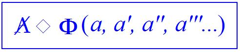

# Leçon 18 | 26 Avril 1961

  <label><input type="checkbox" data-lacan-toggle="original" checked> 原文</label>
  <label><input type="checkbox" data-lacan-toggle="notes" checked> 注释</label>
  <label><input type="checkbox" data-lacan-toggle="commentary" checked> 个人解读评论</label>

<section class="parallel-paragraph" data-paragraph-ids="s8-18-0001">

s8-18-0001

[无对应译文]

原文 · s8-18-0001

Je me suis trouvé samedi et dimanche ouvrir, pour la première fois pour moi, les notes prises en différents points de mon séminaire des dernières années, pour voir si *les repères* que je vous y ai donnés, sous la rubrique de : *La relation d’objet,* puis du *désir et de* *son interprétation* [^222]*,* convergeaient sans trop de flottement vers ce que j’essaie cette année d’articuler devant vous sous le terme du « *transfert* ».

</section>

<section class="parallel-paragraph" data-paragraph-ids="s8-18-0002">

s8-18-0002

[无对应译文]

原文 · s8-18-0002

Je me suis aperçu qu’en effet dans tout ce que je vous ai apporté, et qui est là - paraît-il - quelque part dans une des armoires de la Société, il y a beaucoup de choses que vous pourrez retrouver, je pense, *dans un temps* où on aura le temps de ressortir ça, *dans un temps* où vous vous direz qu’en 1961 il y avait quelqu’un qui vous enseignait quelque chose[^223]. Il ne sera pas dit que dans cet enseignement, il n’y aura aucune allusion au contexte de ce que nous vivons à cette époque. Je trouve qu’il y aurait là quelque chose d’excessif. Et aussi pour l’accompagner vous lirai-je un petit morceau de ce qui fut ma rencontre ce même dimanche dernier dans ce Doyen [SWIFT](http://fr.wikipedia.org/wiki/Jonathan_Swift) dont je n’ai eu que trop peu de temps pour vous parler quand déjà j’ai abordé la question de *la fonction symbolique du phallus*, alors que dans son œuvre la question est en quelque sorte tellement omniprésente qu’on peut dire qu’à prendre son œuvre dans l’ensemble elle y est articulée comme telle.

</section>

<section class="parallel-paragraph" data-paragraph-ids="s8-18-0003">

s8-18-0003

[无对应译文]

原文 · s8-18-0003

SWIFT et Lewis CAROLL sont deux auteurs auxquels, sans que je puisse avoir le temps d’en faire un commentaire courant, je crois que vous ferez bien de vous reporter pour y trouver beaucoup d’une matière qui se rapporte de très près, aussi près que possible, aussi près qu’il est possible dans des œuvres littéraires, à la thématique dont je suis pour l’instant le plus proche. Et dans *Les Voyages de Gulliver* que je regardais dans une charmante petite édition du milieu du siècle dernier, illustrée par GRANDVILLE[^224], j’ai trouvé au « *Voyage à Laputa »* qui est la troisième partie, qui a la caractéristique de ne pas se limiter au « *Voyage à Laputa* »…

</section>

<section class="parallel-paragraph" data-paragraph-ids="s8-18-0004">

s8-18-0004

[无对应译文]

原文 · s8-18-0004

C’est à Laputa, formidable anticipation de station cosmonautique, que GULLIVER s’en va se promener dans un certain nombre de royaumes à propos desquels il nous fait part d’un certain nombre de *vues signifiantes* qui gardent pour nous toute leur richesse, et nommément dans un de ces royaumes, alors qu’il vient d’un autre, il parle à un académicien et il lui dit que :

</section>

<section class="parallel-paragraph" data-paragraph-ids="s8-18-0005">

s8-18-0005

[无对应译文]

原文 · s8-18-0005

« *Dans le royaume de Tribnia, nommé Langden par les naturels, où il avait résidé, la masse du peuple se composait de délateurs,* *d’imputateurs, de mouchards, d’accusateurs, de poursuivants, de témoins à charge, de jureurs à gages, accompagnés de tous leurs* *instruments auxiliaires et subordonnés, tous sous la bannière, les ordres et à la solde des ministres et de leurs adjoints...* »

</section>

<section class="parallel-paragraph" data-paragraph-ids="s8-18-0006">

s8-18-0006

[无对应译文]

原文 · s8-18-0006

Passons sur cette thématique, mais il nous explique comment opèrent les dénonciateurs :

</section>

<section class="parallel-paragraph" data-paragraph-ids="s8-18-0007">

s8-18-0007

[无对应译文]

原文 · s8-18-0007

« ...*ils* *saisissent les lettres et les papiers de ces personnes et les font mettre en prison*. *Ces papiers sont placés entre les mains* *de spécialistes experts à déceler le sens caché des mots, des syllabes et des lettres…* »

</section>

<section class="parallel-paragraph" data-paragraph-ids="s8-18-0008">

s8-18-0008

[无对应译文]

原文 · s8-18-0008

C’est ici que commence le point où SWIFT s’en donne à cœur joie et - comme vous allez le voir - c’est assez joli quant à la substantifique moelle. Par exemple, ils découvriront :

</section>

<section class="parallel-paragraph" data-paragraph-ids="s8-18-0009">

s8-18-0009

[无对应译文]

原文 · s8-18-0009

- *qu’une chaise percée signifie un conseil privé *

</section>

<section class="parallel-paragraph" data-paragraph-ids="s8-18-0010">

s8-18-0010

[无对应译文]

原文 · s8-18-0010

- *Un troupeau d’oies, un sénat *

</section>

<section class="parallel-paragraph" data-paragraph-ids="s8-18-0011">

s8-18-0011

[无对应译文]

原文 · s8-18-0011

- *Un chien boiteux, une invasion *

</section>

<section class="parallel-paragraph" data-paragraph-ids="s8-18-0012">

s8-18-0012

[无对应译文]

原文 · s8-18-0012

- *La peste, une armée de métier *

</section>

<section class="parallel-paragraph" data-paragraph-ids="s8-18-0013">

s8-18-0013

[无对应译文]

原文 · s8-18-0013

- *Un hanneton, un premier ministre *

</section>

<section class="parallel-paragraph" data-paragraph-ids="s8-18-0014">

s8-18-0014

[无对应译文]

原文 · s8-18-0014

- *La goutte, un grand prêtre *

</section>

<section class="parallel-paragraph" data-paragraph-ids="s8-18-0015">

s8-18-0015

[无对应译文]

原文 · s8-18-0015

- *Un gibet, un secrétaire d’État*

</section>

<section class="parallel-paragraph" data-paragraph-ids="s8-18-0016">

s8-18-0016

[无对应译文]

原文 · s8-18-0016

- *Un pot de chambre, un comité de grands seigneurs *

</section>

<section class="parallel-paragraph" data-paragraph-ids="s8-18-0017">

s8-18-0017

[无对应译文]

原文 · s8-18-0017

- *Un crible, une dame de la cour *

</section>

<section class="parallel-paragraph" data-paragraph-ids="s8-18-0018">

s8-18-0018

[无对应译文]

原文 · s8-18-0018

- *Un balai, une révolution *

</section>

<section class="parallel-paragraph" data-paragraph-ids="s8-18-0019">

s8-18-0019

[无对应译文]

原文 · s8-18-0019

- *Une souricière, un emploi public *

</section>

<section class="parallel-paragraph" data-paragraph-ids="s8-18-0020">

s8-18-0020

[无对应译文]

原文 · s8-18-0020

- *Un puits perdu, le trésor public *

</section>

<section class="parallel-paragraph" data-paragraph-ids="s8-18-0021">

s8-18-0021

[无对应译文]

原文 · s8-18-0021

- *Un égout, une cour *

</section>

<section class="parallel-paragraph" data-paragraph-ids="s8-18-0022">

s8-18-0022

[无对应译文]

原文 · s8-18-0022

- *Un bonnet à sonnettes, un favori *

</section>

<section class="parallel-paragraph" data-paragraph-ids="s8-18-0023">

s8-18-0023

[无对应译文]

原文 · s8-18-0023

- *Un roseau brisé, une cour de justice *

</section>

<section class="parallel-paragraph" data-paragraph-ids="s8-18-0024">

s8-18-0024

[无对应译文]

原文 · s8-18-0024

- *Un tonneau vide, un général* \[rires\]

</section>

<section class="parallel-paragraph" data-paragraph-ids="s8-18-0025">

s8-18-0025

[无对应译文]

原文 · s8-18-0025

- *Une plaie ouverte, les affaires publiques.*

</section>

<section class="parallel-paragraph" data-paragraph-ids="s8-18-0026">

s8-18-0026

[无对应译文]

原文 · s8-18-0026

Quand ce moyen ne donne rien, ils en ont de plus efficaces, que leurs savants appellent « *acrostiches* » et « *anagrammes* ». D’abord ils donnent à toutes les lettres initiales un sens politique, ainsi N pourrait signifier *un complot*, B *un régiment de cavalerie*, L *une flotte de mer, o*u bien ils transposent les lettres d’un papier suspect de manière à mettre à découvert les desseins les plus secrets d’un parti mécontent. Par exemple, vous lisez dans une lettre : « *Notre frère Thomas a des hémorroïdes* », l’habile déchiffreur trouvera dans l’assemblage de ces mots indifférents, une phrase qui fera entendre que tout est prêt pour une sédition. Je trouve pas mal *de restituer à leur fond paradoxal*, si manifeste dans toutes sortes de traits, *les choses contemporaines*, à l’aide de ce texte qui n’est pas si ancien.

</section>

<section class="parallel-paragraph" data-paragraph-ids="s8-18-0027">

s8-18-0027

[无对应译文]

原文 · s8-18-0027

Car à la vérité, pour avoir été réveillé cette nuit intempestivement par quelqu’un qui m’a communiqué ce que vous avez tous plus ou moins vu, une fausse nouvelle,[^225] mon sommeil a été un instant troublé par la question suivante : je me suis demandé si je ne méconnaissais pas à propos des *événements contemporains* la dimension de la tragédie. À la vérité ceci faisait pour moi problème après ce que je vous ai expliqué l’année dernière concernant la tragédie : je n’y voyais nulle part apparaître ce que je vous ai appelé « *le reflet de la beauté* ».

</section>

<section class="parallel-paragraph" data-paragraph-ids="s8-18-0028">

s8-18-0028

[无对应译文]

原文 · s8-18-0028

Ceci effectivement m’a empêché de me rendormir un certain temps. Je me suis ensuite rendormi laissant la question en suspens. Ce matin au réveil la question avait un tant soit peu perdu sa *prégnance*. Il apparaissait que nous sommes toujours sur le plan de la farce, et à propos des questions que je me posais, le problème s’évanouissait du même coup.

</section>

<section class="parallel-paragraph" data-paragraph-ids="s8-18-0029">

s8-18-0029

[无对应译文]

原文 · s8-18-0029

Ceci dit, nous allons reprendre les choses au point où nous les avons laissées la dernière fois, à savoir *la formule* que je vous ai donnée comme étant celle *du fantasme de l’obsessionnel *:

</section>

<section class="parallel-paragraph" data-paragraph-ids="s8-18-0030">

s8-18-0030

[无对应译文]

原文 · s8-18-0030

</section>

<section class="parallel-paragraph" data-paragraph-ids="s8-18-0031">

s8-18-0031

[无对应译文]

原文 · s8-18-0031

Il est bien clair que présentée ainsi et sous cette forme algébrique, elle ne peut être que tout à fait opaque à ceux qui n’ont pas suivi notre élaboration précédente. Je vais tâcher d’ailleurs, en en parlant, de lui restituer ses dimensions. Vous savez qu’elle s’oppose à celle de *l’hystérique* :

</section>

<section class="parallel-paragraph" data-paragraph-ids="s8-18-0032">

s8-18-0032

[无对应译文]

原文 · s8-18-0032

</section>

<section class="parallel-paragraph" data-paragraph-ids="s8-18-0033">

s8-18-0033

[无对应译文]

原文 · s8-18-0033

comme ce que je vous ai écrit la dernière fois, à savoir *a/*-ϕ dans le rapport à A, qu’on peut lire de plusieurs façons : « *désir de* - *c’est une façon de le dire* - *grand A* ». Il s’agit donc pour nous de préciser quelles sont les fonctions respectivement attribuées dans notre symbolisation à Φ \[grand phi\] et à ϕ \[petit phi\]. Je vous incite vivement à faire l’effort de ne pas vous précipiter dans les *pentes analogiques* auxquelles il est toujours facile, tentant, de céder et de vous dire par exemple que :

</section>

<section class="parallel-paragraph" data-paragraph-ids="s8-18-0034">

s8-18-0034

[无对应译文]

原文 · s8-18-0034

- Φ c’est le *phallus symbolique*,

</section>

<section class="parallel-paragraph" data-paragraph-ids="s8-18-0035">

s8-18-0035

[无对应译文]

原文 · s8-18-0035

- ϕ c’est le *phallus imaginaire*.

</section>

<section class="parallel-paragraph" data-paragraph-ids="s8-18-0036">

s8-18-0036

[无对应译文]

原文 · s8-18-0036

C’est peut-être vrai dans un certain sens, mais vous en tenir là serait tout à fait vous exposer à méconnaître l’intérêt de ces symbolisations que nous ne nous plaisons nullement, croyez-le bien, à multiplier en vain, et simplement pour le plaisir d’analogies superficielles et de facilitation mentale, ce qui n’est pas à proprement parler le but d’un enseignement. Il s’agit de voir ce que représentent ces deux symboles. Il s’agit de savoir ce qu’ils représentent dans notre intention. Et vous pouvez d’ores et déjà en prévoir, en estimer, l’importance et l’utilité par toutes sortes d’indices.

</section>

<section class="parallel-paragraph" data-paragraph-ids="s8-18-0037">

s8-18-0037

[无对应译文]

原文 · s8-18-0037

L’année par exemple a commencé par une conférence fort intéressante de notre ami M. Georges FAVEZ, qui vous parlant par exemple de ce que c’était que *l’analyste,* et sa fonction du même coup pour *l’analysé*, vous disait une conclusion comme celle-ci : qu’en fin de compte *l’analyste* - pour *l’analysé*, le patient - prenait fonction de son *fétiche*. Telle est la formule, dans un certain aspect autour duquel il avait groupé toutes sortes de faits convergents, à laquelle sa conférence aboutissait.

</section>

<section class="parallel-paragraph" data-paragraph-ids="s8-18-0038">

s8-18-0038

[无对应译文]

原文 · s8-18-0038

Il est certain qu’il y avait là une vue des plus subjectives et qui, aussi bien, ne le laisse pas complètement isolé dans sa formulation. C’était une formulation préparée par toutes sortes d’autres choses qu’on trouvait dans divers articles sur le transfert mais dont on ne peut pas dire qu’elle ne se présente pas sous une forme quelque peu étonnante et paradoxale. Je lui ai aussi bien dit que les choses que nous allions articuler cette année ne seraient pas sans répondre en quelque manière à la question qu’il avait là posée.

</section>

<section class="parallel-paragraph" data-paragraph-ids="s8-18-0039">

s8-18-0039

[无对应译文]

原文 · s8-18-0039

Quand nous lisons d’autre part, dans l’œuvre maintenant close d’un auteur qui a essayé d’articuler la fonction spéciale du transfert dans la névrose obsessionnelle, et qui en somme nous lègue une œuvre qui, partie d’une première considération des « *Incidences thérapeutiques de la prise de conscience de l’envie du pénis dans la névrose obsessionnelle féminine* »,[^226] aboutit à une action, une théorie tout à fait généralisée de la fonction de « *La distance à l’objet* » dans le maniement du transfert.

</section>

<section class="parallel-paragraph" data-paragraph-ids="s8-18-0040">

s8-18-0040

[无对应译文]

原文 · s8-18-0040

Cette fonction de la « *distance*  » tout spécialement élaborée autour d’une expérience qui s’exprime dans le progrès des analyses, et spécialement des analyses d’obsessionnels, comme étant quelque chose dont le ressort principal, actif, efficace dans la reprise de possession par le sujet du sens du symptôme - spécialement quand il est obsessionnel - de *l’introjection imaginaire du phallus*, est très précisément incarné dans le *fantasme imaginaire du phallus de l’analyste*, j’entends bien qu’il y a là une question qui se présente.

</section>

<section class="parallel-paragraph" data-paragraph-ids="s8-18-0041">

s8-18-0041

[无对应译文]

原文 · s8-18-0041

Déjà, spécialement à propos des travaux de cet auteur et spécialement, dirai-je, à propos de sa technique, j’ai amorcé devant vous la position de la question et la critique qu’aujourd’hui d’une façon plus proche de la question du transfert, nous allons pouvoir \- cette critique - la resserrer encore. Ceci, c’est incontestable, nécessite que nous entrions dans une articulation tout à fait précise de ce qu’est *la fonction du phallus*, et nommément *dans le transfert*. C’est celle-ci que nous essayons d’articuler à l’aide des termes ici symbolisés, Φ et ϕ.

</section>

<section class="parallel-paragraph" data-paragraph-ids="s8-18-0042">

s8-18-0042

[无对应译文]

原文 · s8-18-0042

Et parce que nous entendons bien qu’il ne s’agit jamais dans l’articulation de la théorie analytique de procéder d’une façon *déductive,* de haut en bas si je puis dire, car il n’y a rien qui parte plus du « *particulier* » que l’expérience analytique, si quelque chose reste valable dans une articulation comme celle de l’auteur, à laquelle j’ai fait allusion tout à l’heure, c’est bien parce que sa théorie du transfert, la fonction de *l’image phallique* dans le transfert, part d’une expérience tout à fait localisée, qui, peut-on dire, par certains côtés peut en limiter la portée, mais exactement dans la même mesure qu’elle lui donne son poids, c’est parce qu’il est parti *de l’expérience des obsessionnels*, et d’une façon tout à fait aiguë et accentuée, que nous avons à le retenir et à discuter ce qu’il en a conclu.

</section>

<section class="parallel-paragraph" data-paragraph-ids="s8-18-0043">

s8-18-0043

[无对应译文]

原文 · s8-18-0043

C’est aussi bien de l’*obsessionnel* que nous partirons aujourd’hui et c’est pour ça que j’ai produit, en tête de ce que j’ai à vous dire, la formule où j’essaie d’articuler son fantasme.

</section>

<section class="parallel-paragraph" data-paragraph-ids="s8-18-0044">

s8-18-0044

[无对应译文]

原文 · s8-18-0044

</section>

<section class="parallel-paragraph" data-paragraph-ids="s8-18-0045">

s8-18-0045

[无对应译文]

原文 · s8-18-0045

Je vous ai déjà dit pas mal de choses de l’*obsessionnel*, il ne s’agit pas de les répéter. Il ne s’agit pas de simplement répéter ce qu’il y a de foncièrement *substitutif*, de perpétuellement *éludé*, de cette sorte de « *passez-muscade* » qui caractérise toute la façon dont l’*obsessionnel* procède dans *sa façon de se situer par rapport à l’Autre*, plus exactement de n’être jamais à la place où sur l’instant il semble se désigner.

</section>

<section class="parallel-paragraph" data-paragraph-ids="s8-18-0046">

s8-18-0046

[无对应译文]

原文 · s8-18-0046

Ce à quoi fait très précisément allusion la formulation du second terme du *fantasme de l’obsessionnel*, c’est ceci que *les objets*, pour lui, en tant qu’*objets de désir*, sont en quelque sorte mis en fonction de certaines équivalences érotiques, ce qui est précisément dans *ce quelque chose* que nous avons l’habitude d’articuler, en parlant de l’érotisation de son monde, et spécialement de son monde intellectuel, ce à quoi tend précisément cette façon de noter cette mise en fonction par ϕ qui désigne *ce quelque chose*.

</section>

<section class="parallel-paragraph" data-paragraph-ids="s8-18-0047">

s8-18-0047

[无对应译文]

原文 · s8-18-0047

Il suffit de recourir à une *observation analytique*, quand elle est bien faite par un analyste, pour nous apercevoir que le ϕ - nous verrons peu à peu ce que ça veut dire - c’est justement ce qui est sous-jacent à cette *équivalence* instaurée *entre les objets* sur le plan érotique, que le ϕ est en quelque sorte *l’unité de mesure* où le sujet accommode *la fonction petit(a),* la fonction des *objets de son désir*.

</section>

<section class="parallel-paragraph" data-paragraph-ids="s8-18-0048">

s8-18-0048

[无对应译文]

原文 · s8-18-0048

Pour l’illustrer, je n’ai vraiment rien d’autre à faire qu’à me pencher sur *l’observation princeps de la névrose obsessionnelle*, mais vous la retrouverez aussi bien *dans toutes les autres*, pour peu que ce soit des observations valables, rappelez-vous ce trait de la thématique du *Rattenmann,* de « *L’homme aux rats* ». Pourquoi d’ailleurs est-il appelé *L’homme aux rats* - au pluriel - par FREUD, alors que dans *le fantasme* où FREUD approche pour la première fois cette espèce de vue interne de la structure de son désir, dans cette sorte *d’horreur* saisie sur son visage, *d’une jouissance ignorée,*[^227] il n’y a pas *des rats*, il n’y a qu’*<u>un</u> rat* dans le fameux *supplice turc* sur lequel j’aurai à revenir tout à l’heure.

</section>

<section class="parallel-paragraph" data-paragraph-ids="s8-18-0049">

s8-18-0049

[无对应译文]

原文 · s8-18-0049

Si on parle de *L’homme aux rats*, c’est bien parce que le *rat* poursuit sous une forme multipliée sa course dans toute l’économie de ces échanges singuliers, ces substitutions, cette métonymie permanente, dont la symptomatique de *l’obsessionnel* est l’exemple incarné. La formule, qui est de lui, « *tant de rats, tant de florins,*[^228]* *» - ceci à propos du versement des honoraires dans l’analyse - n’est là qu’une des illustrations particulières de *cette équivalence en quelque sorte permanente de tous les objets* saisis tour à tour dans cette sorte de marché.

</section>

<section class="parallel-paragraph" data-paragraph-ids="s8-18-0050">

s8-18-0050

[无对应译文]

原文 · s8-18-0050

Ce métabolisme des objets dans les *symptômes* s’inscrit, d’une façon plus ou moins latente, dans une sorte d’unité commune, d’une unité-or, unité-étalon, qu’ici le rat symbolise, tenant proprement la place de ce quelque chose que j’appelle ϕ, en tant qu’il est un certain état, un certain niveau, *une certaine forme*, de réduire, *de dégrader* d’une certaine façon - nous verrons en quoi nous pouvons l’appeler dégradation - *la fonction du signifiant  *Φ.

</section>

<section class="parallel-paragraph" data-paragraph-ids="s8-18-0051">

s8-18-0051

[无对应译文]

原文 · s8-18-0051

Il s’agit de savoir ce que représente Φ, à savoir la fonction du *phallus* dans sa généralité, à savoir, chez tous les sujets qui parlent et qui de ce fait ont un inconscient, de l’apercevoir à partir du point qui nous est donné *dans la symptomatologie de la névrose obsessionnelle*. Ici, nous pouvons dire que nous la voyons émerger - sous ces *formes* que j’appelle « *dégradées* » - *émerger*, observez-le bien...

</section>

<section class="parallel-paragraph" data-paragraph-ids="s8-18-0052">

s8-18-0052

[无对应译文]

原文 · s8-18-0052

> d’une façon dont nous pouvons dire, conformément à ce que nous savons
>
> et que l’expérience nous montre d’une façon très manifeste dans la structure de l’obsessionnel

</section>

<section class="parallel-paragraph" data-paragraph-ids="s8-18-0053">

s8-18-0053

[无对应译文]

原文 · s8-18-0053

…*au niveau du conscient*.

</section>

<section class="parallel-paragraph" data-paragraph-ids="s8-18-0054">

s8-18-0054

[无对应译文]

原文 · s8-18-0054

Cette mise en fonction phallique n’est pas refoulée, c’est-à-dire profondément cachée, comme chez *l’hystérique*. Le ϕ, qui est là en position de *mise en fonction* de tous les objets - à la place du petit f(...) d’une formule *mathématique -* est perceptible, avoué, dans le symptôme, conscient, vraiment parfaitement visible. « *Conscient* », *conscius,* veut dire *foncièrement*, *originellement*, la possibilité de complicité du sujet avec lui-même, donc aussi d’une complicité à l’autre qui l’observe. L’observateur n’a presque pas de peine à en être complice. *Le signe de la fonction phallique* émerge de toutes parts au niveau de l’articulation des symptômes. C’est bien à ce propos que peut se poser la question de ce que FREUD essaie, non sans difficultés, de nous imager quand il articule la fonction de la *Verneinung*. Comment les choses peuvent-elles être à la fois aussi dites et aussi méconnues !

</section>

<section class="parallel-paragraph" data-paragraph-ids="s8-18-0055">

s8-18-0055

[无对应译文]

原文 · s8-18-0055

Car en fin de compte, si le *sujet* n’était rien d’autre que ce que veut un certain psychologisme - qui, vous le savez, même au sein de nos Sociétés maintient toujours ses droits - si le sujet c’était « *voir l’autre vous voir* », si ce n’était que ça, comment pourrait-on dire que *la fonction du phallus* est chez l’obsessionnel en position d’être connue ? Car elle est parfaitement *patente *! Et pourtant on peut dire que même sous cette *forme patente* elle participe de ce que nous appelons « *refoulement* », en ce sens que, si *avouée* qu’elle soit, elle ne *l’est pas* par le sujet sans l’aide de l’analyste. Et sans l’aide du registre freudien elle n’est ni reconnue ni même reconnaissable.

</section>

<section class="parallel-paragraph" data-paragraph-ids="s8-18-0056">

s8-18-0056

[无对应译文]

原文 · s8-18-0056

C’est bien là que nous touchons du doigt qu’*être sujet c’est autre chose que d’être un regard devant un autre regard*, selon la formule que j’ai appelée tout à l’heure *psychologiste*, et qui va jusqu’à inclure dans ses caractéristiques aussi bien la théorie sartrienne existante. *Être sujet c’est avoir sa place dans grand A, au lieu de la parole*. Et ici c’est faire apercevoir cet accident possible qu’au niveau de grand A s’exerce cette fonction que désigne la barre dans le grand A \[A\] : à savoir qu’il se produise ce manque de parole de l’Autre comme tel, au moment précis justement où le sujet ici se manifeste comme la fonction de ϕ par rapport à l’objet.

</section>

<section class="parallel-paragraph" data-paragraph-ids="s8-18-0057">

s8-18-0057

[无对应译文]

原文 · s8-18-0057

*Le sujet s’évanouit* en ce point précis, ne se reconnaît pas, et c’est là précisément, comme tel, au défaut de la reconnaissance que la méconnaissance se produit automatiquement, en ce point de défaut où se trouve couverte, *unterdrückt*, cette fonction du *phallicisme* à quoi le sujet se voue, que se produit à la place ce mirage de *narcissisme* que j’appellerai vraiment « *frénétique* » chez le sujet *obsessionnel*.

</section>

<section class="parallel-paragraph" data-paragraph-ids="s8-18-0058">

s8-18-0058

[无对应译文]

原文 · s8-18-0058

Cette sorte d’aliénation du *phallicisme* qui se manifeste si visiblement chez l’*obsessionnel* dans des phénomènes qui peuvent s’exprimer \- par exemple dans ce qu’on appelle les difficultés de la pensée chez le névrosé *obsessionnel -* d’une façon parfaitement claire, articulée, avouée par le sujet, senties comme telles : « *Ce que je pense* - vous dit le sujet d’une façon implicite dans son discours très suffisamment articulé pour que le trait puisse se tirer et l’addition se faire de sa déclaration - *ce n’est pas tellement parce que c’est coupable que cela m’est difficile de m’y soutenir, d’y progresser, c’est parce qu’il faut absolument que ce que je pense soit de moi, et jamais du voisin, d’un autre *».

</section>

<section class="parallel-paragraph" data-paragraph-ids="s8-18-0059">

s8-18-0059

[无对应译文]

原文 · s8-18-0059

Combien de fois entendons-nous cela ! Non seulement dans les situations *typiques* de l’*obsessionnel*, dans ce que j’appellerai les « *relations obsessionnalisées* » que nous produisons en quelque sorte artificiellement dans une relation aussi spécifique que celle justement de l’enseignement analytique comme tel.

</section>

<section class="parallel-paragraph" data-paragraph-ids="s8-18-0060">

s8-18-0060

[无对应译文]

原文 · s8-18-0060

J’ai parlé quelque part - nommément dans mon *Rapport de Rome* - de ce que j’ai désigné par le pied du « *mur du langage* ». Rien n’est plus difficile que d’amener l’obsessionnel au pied du mur de son désir. Car il y a quelque chose dont je ne sache pas que cela ait déjà été vraiment mis en relief, et qui pourtant est un point fort éclairant. Je prendrai pour l’éclairer le terme dont vous savez que j’ai déjà fait plus d’un usage, le terme introduit par JONES d’une façon dont j’ai marqué toutes les ambiguïtés, d’ἀϕάνιςις \[aphanisis\]*, disparition -* comme vous le savez c’est le sens du mot en grec - *disparition du désir*.

</section>

<section class="parallel-paragraph" data-paragraph-ids="s8-18-0061">

s8-18-0061

[无对应译文]

原文 · s8-18-0061

On n’a jamais, me semble-t-il, pointé cette chose toute simple et tellement tangible dans les histoires de l’obsessionnel, spécialement dans ses efforts quand il est sur une certaine voie de recherche autonome, d’*auto-analyse* si vous voulez, quand il est situé quelque part sur le chemin de *cette recherche qui s’appelle*, sous une forme quelconque « *réaliser son fantasme* », il semble qu’on ne se soit jamais arrêté à la *fonction* - tout à fait impossible à écarter - du terme d’ἀϕάνιςις \[aphanisis\]. Si on l’emploie, c’est qu’il y a une ἀϕάνιςις \[aphanisis\] tout à fait naturelle et ordinaire qui est limitée par le pouvoir qu’a le sujet de ce qu’on appelle *tenir*, « *tenir l’érection* ».

</section>

<section class="parallel-paragraph" data-paragraph-ids="s8-18-0062">

s8-18-0062

[无对应译文]

原文 · s8-18-0062

Le désir a un rythme naturel, et avant même d’évoquer les extrêmes de l’incapacité du « *tenir* », les formes les plus inquiétantes de la brièveté de l’acte, on peut remarquer ceci, c’est que ce à quoi le sujet a affaire comme à un obstacle, comme à un écueil, où, littéralement, quelque chose qui est profondément foncier, de son rapport à son *fantasme* vient se briser :

</section>

<section class="parallel-paragraph" data-paragraph-ids="s8-18-0063">

s8-18-0063

[无对应译文]

原文 · s8-18-0063

- c’est, à proprement parler, ce qu’a, en fin de compte, chez lui de toujours terminer,

</section>

<section class="parallel-paragraph" data-paragraph-ids="s8-18-0064">

s8-18-0064

[无对应译文]

原文 · s8-18-0064

- c’est que, dans la ligne de l’érection, puis de la chute du désir, il y a un moment où *l’érection se dérobe*.

</section>

<section class="parallel-paragraph" data-paragraph-ids="s8-18-0065">

s8-18-0065

[无对应译文]

原文 · s8-18-0065

Très exactement, précisément ce moment signale que, mon Dieu, dans l’ensemble, il n’est pas pourvu de plus ni de moins que ce que nous appellerons une « *génitalité* » fort ordinaire, plutôt même assez douillette ai-je cru remarquer, et que pour tout dire, si c’était de quelque chose qui se situât à ce niveau qu’il s’agît dans les avatars et les tourments qu’infligent à *l’obsessionnel* les ressorts cachés de son désir, ce serait ailleurs qu’il conviendrait de faire porter notre effort.

</section>

<section class="parallel-paragraph" data-paragraph-ids="s8-18-0066">

s8-18-0066

[无对应译文]

原文 · s8-18-0066

Je veux dire que j’évoque toujours *en contrepoint* ce dont justement nous ne nous occupons absolument pas, mais dont on s’étonne, pourquoi on ne se demande pas pourquoi nous ne nous en occupons pas de la mise au point de palestres[^229] pour l’étreinte sexuelle, de faire vivre les corps dans la dimension de la nudité et de la prise au ventre. Je ne sache pas qu’à part quelques exceptions \- une d’entre elles dont vous savez bien combien elle fut réprouvée, celle de REICH nommément - je ne sache pas que ça soit un champ où se soit jamais étendue l’attention de l’analyste.

</section>

<section class="parallel-paragraph" data-paragraph-ids="s8-18-0067">

s8-18-0067

[无对应译文]

原文 · s8-18-0067

Dans ce à quoi l’obsessionnel a affaire, il peut s’y entendre plus ou moins à ce soutien, à ce maniement de son désir. C’est une question en somme de mœurs dans une affaire où les choses - analyse ou pas - se maintiennent dans le domaine du clandestin, et où par conséquent les variations culturelles n’ont pas grand-chose à faire. Ce dont il s’agit se situe donc bien ailleurs, se situe au niveau du discord entre ce fantasme, pour autant justement où il est lié à cette fonction du *phallicisme,* et l’acte - par rapport à cela qui tourne toujours trop court - où il aspire à l’incarner.

</section>

<section class="parallel-paragraph" data-paragraph-ids="s8-18-0068">

s8-18-0068

[无对应译文]

原文 · s8-18-0068

Et naturellement, c’est du côté des *effets du fantasme*, ce fantasme qui est tout phallicisme, que se développent toutes ces *conséquences symptomatiques* qui sont faites pour y prêter, et pour lesquelles justement il inclut tout ce qui s’y prête dans cette forme d’isolement si typique, si caractéristique comme mécanisme, et qui a été mise en valeur comme mécanisme dans la naissance du symptôme.

</section>

<section class="parallel-paragraph" data-paragraph-ids="s8-18-0069">

s8-18-0069

[无对应译文]

原文 · s8-18-0069

Si donc il y a chez *l’obsessionnel* cette crainte de l’ἀϕάνιςις \[aphanisis\] que souligne JONES, c’est précisément pour autant, et uniquement pour autant, qu’elle est la mise à l’épreuve - qui tourne toujours en défaite - de cette fonction Φ du *phallus* en tant que nous essayons pour l’instant de l’approcher. Pour tout dire, le résultat est que *l’obsessionnel* ne redoute en fin de compte rien tant que ce à quoi il s’imagine qu’il aspire : la liberté de ses actes et de ses gestes, et l’état de nature si je puis m’exprimer ainsi.

</section>

<section class="parallel-paragraph" data-paragraph-ids="s8-18-0070">

s8-18-0070

[无对应译文]

原文 · s8-18-0070

Les tâches de la nature ne sont pas son fait, ni non plus quoi que ce soit qui le laisse *seul maître à son bord*, si je puis m’exprimer ainsi, avec Dieu, à savoir les fonctions extrêmes de la responsabilité, la responsabilité pure, celle qu’on a vis-à-vis de cet Autre où s’inscrit ce que nous articulons. Et - je le dis en passant - ce point que je désigne n’est nulle part mieux illustré que dans la fonction de l’analyste, et très proprement au moment où il articule l’interprétation. Vous voyez qu’au cours de mon propos d’aujourd’hui je ne cesse pas d’inscrire, corrélativement au champ de l’expérience du névrosé, celui que nous découvre très spécialement l’action analytique, pour autant que forcément c’est le même, puisque c’est là qu’« *il faut y aller* ».

</section>

<section class="parallel-paragraph" data-paragraph-ids="s8-18-0071">

s8-18-0071

[无对应译文]

原文 · s8-18-0071

À l’horizon de l’expérience de *l’obsessionnel*, il y a ce que j’appellerai une certaine crainte toujours de « *se dégonfler* » qui est à proprement parler en rapport avec quelque chose que nous pourrions appeler « *l’inflation phallique* » en tant que d’une certaine façon cette fonction chez lui du phallus Φ ne saurait mieux être illustrée que par celle de la fable de *La grenouille qui veut se faire aussi grosse que le bœuf* :

</section>

<section class="parallel-paragraph" data-paragraph-ids="s8-18-0072">

s8-18-0072

[无对应译文]

原文 · s8-18-0072

« *La chétive personne* - comme vous le savez - *s’enfla si bien qu’elle en creva.*[^230] »

</section>

<section class="parallel-paragraph" data-paragraph-ids="s8-18-0073">

s8-18-0073

[无对应译文]

原文 · s8-18-0073

C’est un moment d’expérience sans cesse renouvelé dans la butée réelle à quoi l’obsessionnel est porté sur les confins de son désir. Et il me semble qu’il y a intérêt à le souligner, non pas seulement dans le sens d’accentuer une phénoménologie dérisoire, mais aussi bien pour vous permettre d’articuler ce dont il s’agit dans cette fonction Φ du *phallus* en tant qu’elle est celle qui est cachée derrière son monnayage au niveau de la fonction ϕ.

</section>

<section class="parallel-paragraph" data-paragraph-ids="s8-18-0074">

s8-18-0074

[无对应译文]

原文 · s8-18-0074

Déjà *cette fonction* Φ *du phallus*, j’ai commencé de l’articuler la dernière fois en formulant un terme qui est celui de « *la présence réelle* ». Ce terme, je pense que vous avez l’oreille assez sensible pour vous être aperçus entre quels guillemets je le mettais. Aussi bien ne l’ai-je pas introduit seul, et ai-je parlé « *d’insulte à la présence réelle* » de façon à ce que déjà nul ne s’y trompe, et nous n’avons point ici affaire à une réalité neutre. Cette « *présence réelle* », il serait bien étrange que - si elle remplit *la fonction* qui est celle, *radicale*, que j’essaie ici de vous faire approcher - elle n’ait pas déjà été repérée quelque part.

</section>

<section class="parallel-paragraph" data-paragraph-ids="s8-18-0075">

s8-18-0075

[无对应译文]

原文 · s8-18-0075

Et bien sûr je pense que vous avez déjà tous perçu son *homonymie*, son *identité* avec ce que le dogme religieux, celui auquel nous avons accès, si je puis dire de naissance, dans notre contexte culturel, appelle de ce nom. La « *présence réelle* », ce couple de mots en tant qu’il fait signifiant, nous sommes habitués, *proches ou lointains,* à l’entendre, depuis longtemps *murmuré à notre oreille* à propos du dogme *Catholique Apostolique et Romain* de l’Eucharistie.

</section>

<section class="parallel-paragraph" data-paragraph-ids="s8-18-0076">

s8-18-0076

[无对应译文]

原文 · s8-18-0076

Et je vous assure qu’il n’y a pas besoin de chercher loin pour nous apercevoir que c’est là tout à fait à fleur de terre dans la phénoménologie de *l’obsessionnel*. Je vous assure que ce n’est pas ma faute !

</section>

<section class="parallel-paragraph" data-paragraph-ids="s8-18-0077">

s8-18-0077

[无对应译文]

原文 · s8-18-0077

Puisque j’ai parlé tout à l’heure de l’œuvre de quelqu’un qui s’est occupé de focaliser la recherche de la structure obsessionnelle sur *le phallus*, je prends son article *princeps*, celui dont j’ai donné tout à l’heure le titre : *Les incidences thérapeutiques de la prise de conscience* *de l’envie du pénis dans la névrose obsessionnelle féminine,* je commence de lire, et bien sûr, dès les premières pages, se lèveront pour moi toutes les possibilités de commentaire critique concernant par exemple nommément que :

</section>

<section class="parallel-paragraph" data-paragraph-ids="s8-18-0078">

s8-18-0078

[无对应译文]

原文 · s8-18-0078

« *Comme l’obsessionnel masculin, la femme a besoin de s’identifier sur un mode régressif à l’homme pour pouvoir se libérer des angoisses de la petite enfance ; mais alors que le premier s’appuiera sur cette identification, pour transformer l’objet d’amour infantile en objet d’amour génital, elle,* *la femme, se fondant d’abord sur cette même identification, tend à abandonner ce premier objet et à s’orienter vers une fixation hétérosexuelle, comme si elle pouvait procéder à une nouvelle identification féminine, cette fois sur la personne de l’analyste.* »

</section>

<section class="parallel-paragraph" data-paragraph-ids="s8-18-0079">

s8-18-0079

[无对应译文]

原文 · s8-18-0079

Et plus loin, que :

</section>

<section class="parallel-paragraph" data-paragraph-ids="s8-18-0080">

s8-18-0080

[无对应译文]

原文 · s8-18-0080

« *Peu après que le désir de possession phallique, et corrélativement de castration de l’analyste, est mis à jour, et que de ce fait, les effets de détente précités ont été obtenus, cette personnalité de l’analyste masculin est assimilée à celle d’une mère bienveillante.* » \[p.216\]

</section>

<section class="parallel-paragraph" data-paragraph-ids="s8-18-0081">

s8-18-0081

[无对应译文]

原文 · s8-18-0081

Trois lignes plus loin, nous retomberons sur cette fameuse « *pulsion destructrice initiale dont la mère est l’objet* »*,* c’est-à-dire sur les coordonnées majeures de l’analyse de l’imaginaire dans l’analyse présentement conduite. Je n’ai fait que ponctuer au passage dans cette thématique, uniquement les difficultés et les sauts que suppose franchis cette interprétation générale en quelque sorte résumée ici en exorde de tout ce qui, par la suite, va être censément illustré. Mais je n’ai plus besoin que de franchir une demi-page pour entrer dans la phénoménologie de ce dont il s’agit et dans ce que cet auteur - dont c’est là le premier écrit, et qui était un clinicien - trouve à nous dire, à nous raconter dans *les fantasmes* de sa patiente ainsi située comme *obsessionnelle*.

</section>

<section class="parallel-paragraph" data-paragraph-ids="s8-18-0082">

s8-18-0082

[无对应译文]

原文 · s8-18-0082

Et il n’y a vraiment rien d’autre avant. La première chose qui vient aux yeux est ceci : « *elle se représentait imaginativement des organes génitaux masculins -* on précise *- à la place de* *l’hostie* *sans qu’il s’agisse de phénomènes* *hallucinatoires.* » \[p.217\]

</section>

<section class="parallel-paragraph" data-paragraph-ids="s8-18-0083">

s8-18-0083

[无对应译文]

原文 · s8-18-0083

Nous n’en doutons pas. En effet, tout ce que nous voyons nous habitue en cette matière à bien savoir qu’il s’agit de tout autre chose que de phénomènes *hallucinatoires*…

</section>

<section class="parallel-paragraph" data-paragraph-ids="s8-18-0084">

s8-18-0084

[无对应译文]

原文 · s8-18-0084

« ...*se représentait imaginativement des organes génitaux masculins, à la place de l’hostie*. »

</section>

<section class="parallel-paragraph" data-paragraph-ids="s8-18-0085">

s8-18-0085

[无对应译文]

原文 · s8-18-0085

C’est dans la même observation que, plus loin, nous avons la dernière fois emprunté *les fantasmes sacrilèges* qui consistent précisément, non seulement à surimposer de la façon aussi claire les organes génitaux masculins - ici on nous le précise : « *sans qu’il s’agisse de phénomènes hallucinatoires *»*,* c’est-à-dire bel et bien comme tels en forme signifiante - à les surimposer à ce qui est aussi pour nous, *de la façon symbolique la plus précise*, identifiable à la « *présence réelle* ». Mais encore que ce dont il s’agisse, ce soit - cette « *présence réelle* » - de *la réduire* en quelque sorte, de la briser, de la broyer dans le mécanisme du *désir*, c’est ce que les fantasmes subséquents \- ceux que j’ai déjà cités la dernière fois - souligneront assez. Je pense que vous ne vous imaginez pas que cette observation soit unique. Je vous citerai parmi des dizaines d’autres, parce que l’expérience d’un analyste ne va jamais dans un domaine qu’à dépasser la centaine, le fantasme suivant survenu chez un obsessionnel en un point de son expérience.

</section>

<section class="parallel-paragraph" data-paragraph-ids="s8-18-0086">

s8-18-0086

[无对应译文]

原文 · s8-18-0086

Ces tentatives d’*incarnation désirante* peuvent chez eux aller jusqu’à un extrême d’acuité érotique, dans des conjonctures où ils peuvent rencontrer chez le partenaire quelque complaisance, délibérée ou fortuite, à ce que comporte précisément cette thématique de « *dégradation* » du « *grand Autre* » en « *petit autre* », dans le champ de laquelle se situe le développement de leur désir.

</section>

<section class="parallel-paragraph" data-paragraph-ids="s8-18-0087">

s8-18-0087

[无对应译文]

原文 · s8-18-0087

Dans le moment même où le sujet croyait pouvoir se tenir à cette sorte de relation qui chez eux est toujours accompagnée de tous les corrélatifs d’une culpabilité extrêmement menaçante, et qui peut être en quelque sorte équilibrée par l’intensité du désir, le sujet fomentait le fantasme suivant avec une partenaire qui représentait pour lui, du moins momentanément, ce complémentaire si satisfaisant : faire jouer un rôle à l’hostie sainte en tant que, mise dans le vagin de la femme, elle se trouverait chapeauter le pénis du sujet, le sien propre, au moment de la pénétration.

</section>

<section class="parallel-paragraph" data-paragraph-ids="s8-18-0088">

s8-18-0088

[无对应译文]

原文 · s8-18-0088

Ne croyez pas là que ce soit un de ces raffinements tels qu’on ne les trouve que dans *une littérature spéciale*, c’est vraiment dans son registre monnaie courante. C’est ainsi dans la fantaisie, spécialement *obsessionnelle*. Alors comment ne pas retenir de précipiter tout cela dans le registre d’une banalisation telle que celle d’une prétendue « *distance à l’objet* », pour autant que l’objet dont il s’agit serait l’objectivité ? C’est bien ce qu’on nous décrit :

</section>

<section class="parallel-paragraph" data-paragraph-ids="s8-18-0089">

s8-18-0089

[无对应译文]

原文 · s8-18-0089

- l’objectivité du monde telle qu’elle est enregistrée par la combinaison plus ou moins harmonieuse de l’énumération parlée avec les rapports imaginaires communs,

</section>

<section class="parallel-paragraph" data-paragraph-ids="s8-18-0090">

s8-18-0090

[无对应译文]

原文 · s8-18-0090

- l’objectivité de la forme telle qu’elle est spécifiée par les dimensions humaines,

</section>

<section class="parallel-paragraph" data-paragraph-ids="s8-18-0091">

s8-18-0091

[无对应译文]

原文 · s8-18-0091

- et de nous parler des frontières de l’appréhension du monde extérieur comme menacées d’un trouble qui serait celui de la délimitation du *moi* avec ce qu’on peut appeler les objets de la communication commune.

</section>

<section class="parallel-paragraph" data-paragraph-ids="s8-18-0092">

s8-18-0092

[无对应译文]

原文 · s8-18-0092

Comment ne pas retenir qu’il y a là autre chose d’une autre dimension : que cette « *présence réelle* » il s’agit de la situer quelque part et dans un autre registre que celui de *l’imaginaire*. Disons que c’est pour autant que je vous apprends à situer la place du désir par rapport à la fonction de l’homme en tant que *sujet qui parle*, que nous entrevoyons, nous pouvons désigner, décrire, ce fait que chez l’homme le désir vient habiter la place de cette « *présence réelle* » comme telle, et la peupler de ses fantômes.

</section>

<section class="parallel-paragraph" data-paragraph-ids="s8-18-0093">

s8-18-0093

[无对应译文]

原文 · s8-18-0093

Mais alors que veut dire le Φ ? Est-ce que je le résume à désigner cette place de la « *présence réelle* » en tant qu’elle ne peut apparaître que dans *les intervalles* de ce que couvre le signifiant, que de ces *intervalles*, si je puis m’exprimer ainsi, c’est de là que la « *présence réelle* » menace tout le système signifiant ?

</section>

<section class="parallel-paragraph" data-paragraph-ids="s8-18-0094">

s8-18-0094

[无对应译文]

原文 · s8-18-0094

C’est vrai, il y a du vrai là-dedans. Et l’obsessionnel vous le montre en tous les points de ce que vous appelez ses mécanismes *de projection* ou *de défense*, ou plus précisément, phénoménologiquement, *de conjuration* : cette façon qu’il a de combler tout ce qui peut se présenter d’entre deux dans le signifiant, cette façon qu’a l’obsessionnel de FREUD, *le Rattenmann,* de s’obliger à compter jusqu’à tant, entre la lueur du tonnerre et son bruit. Ici se désigne dans sa structure véritable ce que veut dire ce besoin de combler l’intervalle signifiant en tant que tel : par là peut s’introduire tout ce qui va dissoudre toute la fantasmagorie.

</section>

<section class="parallel-paragraph" data-paragraph-ids="s8-18-0095">

s8-18-0095

[无对应译文]

原文 · s8-18-0095

Appliquez cette clé à 25 ou à 30 des symptômes dont *le Rattenmann* et toutes les observations des *obsessionnels* fourmillent littéralement, et vous touchez du doigt la vérité dont il s’agit, et bien plus : du même coup vous situez *la fonction de l’objet phobique*, qui n’est pas autre chose que la forme la plus simple de ce comblement.

</section>

<section class="parallel-paragraph" data-paragraph-ids="s8-18-0096">

s8-18-0096

[无对应译文]

原文 · s8-18-0096

Ici, ce que je vous ai rappelé l’autre fois, à propos du petit Hans, « *le signifiant universel* » que réalise *l’objet phobique* : c’est cela, pas autre chose. Ici, c’est à l’avant-poste vous ai-je dit - bien avant de s’approcher du *trou*, de *la béance* réalisée *dans l’intervalle* où menace la « *présence réelle* » - qu’*un signe unique* empêche le sujet de s’approcher.

</section>

<section class="parallel-paragraph" data-paragraph-ids="s8-18-0097">

s8-18-0097

[无对应译文]

原文 · s8-18-0097

C’est pourquoi le rôle, le ressort et la raison de la phobie n’est pas, comme ce que croient ceux qui n’ont que le mot de « peur » à la bouche, un danger génital ni même narcissique. C’est très précisément - au gré de certains développements privilégiés de *la position du sujet par rapport au grand Autre*, dans le cas du petit Hans : à sa mère - ce point où, ce que le sujet redoute de rencontrer, c’est une certaine sorte de *désir* de nature à faire rentrer dans le néant « *d’avant* » toute création, tout le système signifiant.

</section>

<section class="parallel-paragraph" data-paragraph-ids="s8-18-0098">

s8-18-0098

[无对应译文]

原文 · s8-18-0098

Mais alors, *pourquoi le phallus à cette place et dans ce rôle* ? C’est là que je veux encore aujourd’hui avancer assez pour vous en faire sentir ce que je pourrais appeler la « *convenance* »... non pas la déduction, puisque c’est *l’expérience, la découverte empirique*, qui nous assurent qu’il est là quelque chose qui nous fasse apercevoir que ça n’est pas irrationnel comme expérience. *Le phallus* donc, c’est l’expérience qui nous le *montre* …mais cette « *convenance* » que je désire pointer, je veux mettre l’accent sur ce fait qu’elle est à proprement parler déterminée pour autant que *le phallus*, ai-je dit - en tant que l’expérience nous le *révèle* - n’est pas simplement l’organe de la copulation, mais est pris dans le mécanisme pervers comme tel.

</section>

<section class="parallel-paragraph" data-paragraph-ids="s8-18-0099">

s8-18-0099

[无对应译文]

原文 · s8-18-0099

Entendez bien ce que je veux dire. Ce qu’il s’agit maintenant d’accentuer c’est que : *du point qui, comme structural, représente le défaut* *du signifiant, quelque chose - le phallus,* Φ *- peut fonctionner comme <u>le signifiant</u>*. Qu’est-ce que ça veut dire ? Qu’est-ce qui définit comme *signifiant,* quelque chose dont nous venons de dire que par *hypothèse*, *définition* et *au départ*, c’est « *le signifiant exclu du signifiant* », donc qui ne peut y rentrer que par *artifice*, *contrebande* et *dégradation* et c’est bien pourquoi *nous ne le voyons jamais qu’en fonction du* ϕ *imaginaire*.

</section>

<section class="parallel-paragraph" data-paragraph-ids="s8-18-0100">

s8-18-0100

[无对应译文]

原文 · s8-18-0100

Qu’est-ce qui nous permet alors d’en parler comme signifiant et d’isoler Φ ? C’est le mécanisme pervers. Si nous faisons du *phallus* le schéma suivant, naturel, qu’est-ce qu’est le *phallus* ? Le *phallus*, sous la forme organique du pénis, n’est pas dans le domaine animal un organe universel. Les insectes ont d’autres manières de s’accrocher entre eux, et sans aller si loin, les rapports entre les poissons ne sont pas des rapports phalliques. Le *phallus* se présente au niveau humain entre autres comme *le signe du désir*, c’en est aussi l’instrument, et aussi la présence. Mais je retiens ce *signe* pour vous arrêter à un élément d’articulation essentiel à retenir : est-ce par là simplement qu’il est un signifiant ? Ce serait franchir une limite un petit peu trop rapidement, de dire que tout se résume à cela, car il y a tout de même d’autres *signes du désir*.

</section>

<section class="parallel-paragraph" data-paragraph-ids="s8-18-0101">

s8-18-0101

[无对应译文]

原文 · s8-18-0101

Il ne faut même pas croire que ce que nous *constations* dans la phénoménologie, à savoir la projection plus facile du *phallus,* en raison de sa forme plus prégnante sur l’objet du désir, sur *l’objet féminin* par exemple, qui nous a fait articuler maintes fois, dans la phénoménologie perverse, la fameuse équivalence : « *girl* = *phallus* », dans sa forme la plus simple, dans l’édification du *phallus*, dans la forme érigée du *phallus*. Cela ne suffit pas, encore que nous concevions cette sorte de choix profond dont nous rencontrons partout les conséquences comme suffisamment motivé.

</section>

<section class="parallel-paragraph" data-paragraph-ids="s8-18-0102">

s8-18-0102

[无对应译文]

原文 · s8-18-0102

Un signifiant, est-ce que c’est simplement « *représenter quelque chose pour quelqu’un* », soit *la définition du signe* ? C’est cela, mais non pas simplement cela. Car j’ai ajouté autre chose la dernière fois quand j’ai pour vous rappelé *la fonction du signifiant*, c’est *que ce signifiant n’est pas simplement*, si je puis dire, « *faire signe à quelqu’un* », *mais* dans le même moment du ressort signifiant, de l’instance signifiante : faire signe *<u>de</u>* quelqu’un », faire que le quelqu’un pour qui le signe désigne quelque chose, *faire que le signe s’assimile ce quelqu’un, que le quelqu’un <u>devienne</u> lui aussi ce signifiant*.

</section>

<section class="parallel-paragraph" data-paragraph-ids="s8-18-0103">

s8-18-0103

[无对应译文]

原文 · s8-18-0103

Et c’est dans ce moment que je désigne, comme tel, expressément comme pervers, que nous touchons du doigt l’instance du *phallus*. Car, si *le phallus qui se montre a pour effet de produire chez le sujet à qui il est montré aussi l’érection du phallus*, ce n’est pas là *condition* qui satisfasse en quoi que ce soit à quelque « *exigence naturelle* ».

</section>

<section class="parallel-paragraph" data-paragraph-ids="s8-18-0104">

s8-18-0104

[无对应译文]

原文 · s8-18-0104

C’est ici que se pointe et se désigne ce que nous appelons, d’une façon plus ou moins confuse, « *l’instance homosexuelle* ». Et ce n’est pas pour rien qu’à ce niveau étiologique c’est toujours *au niveau du sexe mâle* que nous le pointons. C’est pour autant que le résultat c’est que *le phallus* comme *signe du désir* se manifeste en somme comme *objet du désir*, comme objet d’attrait pour le désir. C’est dans ce ressort que gît sa fonction signifiante comme quoi il est capable d’opérer à ce niveau, dans cette zone, dans ce secteur où nous devons à la fois l’identifier comme signifiant, et comprendre ce qu’il est ainsi amené à désigner.

</section>

<section class="parallel-paragraph" data-paragraph-ids="s8-18-0105">

s8-18-0105

[无对应译文]

原文 · s8-18-0105

Ce n’est rien qui soit signifiable directement, c’est ce qui est « *au-delà de toute signification  possible* », et nommément cette « *présence réelle* » sur laquelle aujourd’hui j’ai voulu attirer vos pensées, pour en faire la suite de notre articulation.

</section>

<section class="parallel-paragraph" data-paragraph-ids="s8-18-0106">

s8-18-0106

[无对应译文]

原文 · s8-18-0106

**  **

</section>

<section class="note-block original-notes">

## Notes

[^222]: *La relation d’objet* : séminaire 1956-57, * *et  *Le désir et son interprétation* * *: séminaire 1958-59.

[^223]: En 1961, Lacan déposait la sténotypie de ses séminaires à la bibliothèque de la Société française de psychanalyse, pour ceux qui voulaient les consulter.

[^224]: *Les Voyages de Gulliver*, Gallimard NRF, 1965, traduction d’Émile Pons, illustrations de Grandville. 

[^225]: On trouve dans des notes : *suicide de Salan*. *Le Figaro* du 26 avril titre : « *Le drame algérien. L’insurrection s’effondre dans la tragédie.* »

    4 heures du matin, Challe, Salan et Jouhaud ont quitté Alger.

[^226]: Titre de l’article de Maurice Bouvet, travail d’abord présenté à la Société française de psychanalyse en décembre 1949, paru dans la *Revue française de psychanalyse,*

    1950, XIV, p. 215-243. Cet article est repris dans La *relation d’objet- (Œuvres psychanalytiques, I (névrose obsessionnelle, dépersonnalisation),* Paris, Payot, 1967, chap. VI :

    « Les variations de la technique (distance et variations) », 1958. Il aboutit à dire : *Ce que j’ai voulu marquer, c’est que la notion de distance dans le rapport analytique est*

    *pour nous, et à tout moment, un guide très sûr qui, je le crois du moins, nous permet de mieux situer toute variation, quelles que soient les raisons (structure spéciale du Moi par exemple)*

    *qui en motivent la forme particulière (p*. 293).

[^227]: S. Freud, *Cinq psychanalyses,* Paris, PUF, 1967, p. 207.

[^228]: *Ibid.,* p. 238 et 239.

[^229]: Palestre : ensemble des exercices athlétiques : lutte, gymnastique, saut, lancement du disque, etc.

[^230]: « *La chétive pécore s'enfla si bien qu'elle creva »* (La Fontaine, Fab. I, 3).

</section>
