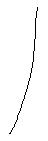

# Leçon 03 | 29 Novembre 1961

  

    <label><input type="checkbox" data-lacan-toggle="original" checked> 原文</label>
    <label><input type="checkbox" data-lacan-toggle="notes" checked> 注释</label>
    <label><input type="checkbox" data-lacan-toggle="commentary" checked> 个人解读评论</label>
  

  <form class="lacan-tool-search" role="search">
    <input class="lacan-tool-search-input" type="search" placeholder="搜索全文" aria-label="搜索全文">
    <button class="lacan-tool-button" type="submit" title="搜索">搜索</button>
  </form>
  <button class="lacan-tool-button lacan-back-to-top" type="button" title="回到页面最上方" aria-label="回到页面最上方">↑</button>

<section class="parallel-paragraph" data-paragraph-ids="s9-03-0001">

s9-03-0001

原文 · s9-03-0001

Je vous ai donc amenés la dernière fois à ce *signifiant* qu’il faut que soit en quelque façon le sujet pour qu’il soit vrai que le sujet est signifiant. Il s’agit très précisément du *Un* en tant que *trait unique* :

[无对应译文]

</section>

<section class="parallel-paragraph" data-paragraph-ids="s9-03-0002">

s9-03-0002

原文 · s9-03-0002

[无对应译文]

</section>

<section class="parallel-paragraph" data-paragraph-ids="s9-03-0003">

s9-03-0003

原文 · s9-03-0003

Nous pourrons raffiner sur le fait que l’instituteur écrit le un comme cela : 1, avec une barre montante qui indique en quelque sorte d’où il émerge. Ce ne sera pas un pur raffinement d’ailleurs parce qu’après tout c’est justement ce que nous aussi nous allons faire : essayer de voir d’où il sort. Mais nous n’en sommes pas là !

[无对应译文]

</section>

<section class="parallel-paragraph" data-paragraph-ids="s9-03-0004">

s9-03-0004

原文 · s9-03-0004

Alors, histoire d’*accommoder* votre vision mentale fortement embrouillée par les effets d’un certain mode de culture, très précisément celui qui laisse béant l’intervalle entre l’enseignement primaire et l’autre dit secondaire, sachez que je ne suis pas en train de vous diriger vers « l’*Un* de PARMÉNIDE »[^25], ni « l’*Un* de PLOTIN »[^26], ni l’*Un* d’aucune « *totalité* » dans notre champ de travail, dont on fait depuis quelque temps si grand cas. Il s’agit bien du «1» que j’ai appelé tout à l’heure « *de l’instituteur* », de l’1 du « *élève X vous me ferez cent lignes de 1* », c’est-à-dire des bâtons, « *élève Y, vous avez un 1 en français* ». L’instituteur sur son carnet, trace l’*einziger Zug,* le *trait unique* du signe à jamais suffi­sant de la notation minimale.

[无对应译文]

</section>

<section class="parallel-paragraph" data-paragraph-ids="s9-03-0005">

s9-03-0005

原文 · s9-03-0005

C’est de ceci qu’il s’agit, c’est du rapport de ceci avec ce à quoi nous avons affaire dans l’identification. Si j’établis un rapport, il doit peut-être commencer à apparaître à votre esprit comme une aurore, que ça n’est pas tout de suite collapsé, l’identification, ce n’est pas tout simplement ce 1, en tout cas pas tel que nous l’envisageons. Tel que nous l’envisageons, il ne peut être \- vous le voyez déjà le chemin par où je vous conduis - que l’instrument, à la rigueur, de cette identification et vous allez voir, si nous y regardons de près, que cela n’est pas si simple.

[无对应译文]

</section>

<section class="parallel-paragraph" data-paragraph-ids="s9-03-0006">

s9-03-0006

原文 · s9-03-0006

Car si ce qui pense - « *l’êtrepensant* » de notre dernier entretien - reste au rang du *réel* en son opacité, il ne va pas tout seul qu’il sorte de ce « *quelquêtre* » où il n’est pas identifié, j’entends : pas d’un « *quelquêtremême* » où il est en somme jeté sur le pavé de quelque « *étendue* »[^27] qu’il a fallu d’abord une pensée pour balayer et rendre vide. Même pas ! Nous n’en sommes pas là.

[无对应译文]

</section>

<section class="parallel-paragraph" data-paragraph-ids="s9-03-0007">

s9-03-0007

原文 · s9-03-0007

Au niveau du *réel*, ce que nous pou­vons entrevoir, c’est l’entrevoir parmi « *tantd’être* » - aussi en un seul mot « *tantd’être* » - d’un « *êtrétant* » où il est accroché à quelque mamelle, bref tout au plus capable d’ébaucher cette sorte de « *palpitation de l’être* » qui fait tant rire *L’Enchanteur* au fond de la tombe où l’a enfermé la cautèle de *La* *Dame du lac* [^28].

[无对应译文]

</section>

<section class="parallel-paragraph" data-paragraph-ids="s9-03-0008">

s9-03-0008

原文 · s9-03-0008

Rappelez-vous il y a quelques années - l’année du séminaire sur le Président SCHREBER - *l’image que j’ai évoquée* lors du dernier séminaire de cette année, celle - poétique - du *Monstre Chapalu* après qu’il se soit repu du corps des sphinx meurtris par leur saut suicidaire, cette parole, dont rira longtemps *L’Enchanteur pourrissant,* du *Monstre Chapalu* disant : « *Celui qui mange n’est plus seul*. ».

[无对应译文]

</section>

<section class="parallel-paragraph" data-paragraph-ids="s9-03-0009">

s9-03-0009

原文 · s9-03-0009

Bien sûr, pour qu’il vienne au jour de l’être, il y a la perspective de *L’Enchanteur*. C’est bien elle, au fond, qui règle tout. Bien sûr, l’ambiguïté véritable de cette venue au jour de la vérité est ce qui fait l’horizon de toute notre pratique, mais il ne nous est point possible de partir de cette perspective dont le mythe vous indique assez qu’elle est au-delà de la limite mortelle : *L’Enchanteur pourrissant* dans sa tombe.

[无对应译文]

</section>

<section class="parallel-paragraph" data-paragraph-ids="s9-03-0010">

s9-03-0010

原文 · s9-03-0010

Aussi n’est-ce pas là un point de vue qui soit jamais complètement abstrait de notre pensée, à une époque où *les doigts en haillons de l’arbre de Daphné* [^29], *quand ils se profileront* *sur le champ calciné par le champignon géant de notre toute–puissance*, toujours présent à l’heure actuelle à l’horizon de notre imagination, sont là pour nous rappeler l’au-delà d’où peut se peser le point de vue de la *vérité*. Mais ce n’est pas la contingence qui fait que j’ai ici à parler devant vous des conditions du *véritable*, c’est un incident beaucoup plus minuscule : celui qui m’a mis en demeure de prendre soin de vous en tant que *poignée de psychanalystes* dont je vous rappelle que de *la vérité*, vous n’en avez certes pas à revendre, mais que quand même c’est ça votre salade, c’est ce que vous vendez. Il est clair que, à venir vers vous, c’est après du *vrai* qu’on court. Je l’ai dit l’avant dernière fois que *c’est du vrai de vrai qu’on cherche*.

[无对应译文]

</section>

<section class="parallel-paragraph" data-paragraph-ids="s9-03-0011">

s9-03-0011

原文 · s9-03-0011

C’est justement pour cela qu’il est légitime que, concernant l’identification, je sois parti d’un texte dont j’ai essayé de vous faire sentir le caractère assez unique dans l’histoire de la philosophie pour ce que la question du « *véritable* » y étant posée de façon spécia­lement radicale, en tant qu’elle met en cause, non point ce qu’on trouve de *vrai* dans le *réel*, mais le statut du sujet en tant qu’il est chargé de l’y amener, ce *vrai*, dans le *réel*.

[无对应译文]

</section>

<section class="parallel-paragraph" data-paragraph-ids="s9-03-0012">

s9-03-0012

原文 · s9-03-0012

Je me suis trouvé, au terme de mon dernier discours, celui de la fois dernière, aboutir à ce que je vous ai indiqué comme reconnaissable dans la figure pour nous déjà repérée du trait unique, de l’*einziger Zug* pour autant que c’est sur lui que se concentre pour nous la fonction d’indiquer la place où est sus­pendue dans le signifiant, où est accrochée concernant le signifiant, la question de sa garantie, de sa fonction, de ce à quoi ça sert ce signifiant, dans l’avènement de la vérité.

[无对应译文]

</section>

<section class="parallel-paragraph" data-paragraph-ids="s9-03-0013">

s9-03-0013

原文 · s9-03-0013

C’est pour cela que je ne sais pas jusqu’où aujourd’hui je pousserai mon discours, mais il va être tout entier tournant autour de la fin d’assurer dans vos esprits cette fonction du *trait unique*, cette fonction du « 1 ». Bien sûr, c’est là du même coup mettre en cause, c’est là du même coup faire avancer - et je pense rencontrer, de ce fait, en vous une espèce d’approbation, de cœur au ventre - notre connaissance de *ce que c’est que ce signifiant*.

[无对应译文]

</section>

<section class="parallel-paragraph" data-paragraph-ids="s9-03-0014">

s9-03-0014

原文 · s9-03-0014

Je vais commencer, parce que cela me chante, par vous faire faire un peu d’école buissonnière. J’ai fait allusion l’autre jour à une remarque - gentille, toute ironique qu’elle fût - concernant le choix de mon sujet de cette année comme s’il n’était point absolument nécessaire. C’est une occasion de mettre au point ceci - ceci qui est sûrement un peu connexe du reproche qu’elle impliquait - que *l’iden­tification* ça serait la clef à tout faire, si elle évitait de se référer à un rapport *ima­ginaire* qui seul en supporte l’expérience, à savoir : *le rapport au corps*.

[无对应译文]

</section>

<section class="parallel-paragraph" data-paragraph-ids="s9-03-0015">

s9-03-0015

原文 · s9-03-0015

Tout ceci est cohérent du même reproche qui peut m’être adressé dans les voies que je poursuis, de vous maintenir toujours trop au niveau de l’articulation langagière telle que précisément je m’évertue à la distinguer de toute autre. De là à l’idée que *je méconnais* ce qu’on appelle *le préverbal*, que je méconnais l’animal, que je crois que l’homme en tout ceci a je ne sais quel privilège, il n’y a qu’un pas, d’autant plus vite franchi qu’on n’a pas le sentiment de le faire.

[无对应译文]

</section>

<section class="parallel-paragraph" data-paragraph-ids="s9-03-0016">

s9-03-0016

原文 · s9-03-0016

C’est - à y repen­ser - au moment où plus que jamais cette année je vais faire virer autour de *la structure du langage* tout ce que je vais vous expliquer, que je me suis retourné vers une expérience proche, immédiate, courte, sensible et sympathisante, qui est la mienne, et qui peut-être éclairera ceci : que j’ai moi aussi ma notion du « *préverbal* » qui s’articule à l’intérieur du rapport du sujet au verbe d’une façon qui ne vous est peut-être point à tous apparue.

[无对应译文]

</section>

<section class="parallel-paragraph" data-paragraph-ids="s9-03-0017">

s9-03-0017

原文 · s9-03-0017

Auprès de moi - *parmi l’entourage de Mitsein où je me tiens comme Dasein -* j’ai une chienne que j’ai nommée *Justine* en hommage à SADE, sans que - croyez­-le bien - je n’exerce sur elle aucun sévice orienté. *Ma chienne* - *à mon sens et sans ambiguïté* - *parle*. Ma chienne a la parole sans aucun doute. Ceci est important, car cela ne veut pas dire qu’elle ait totalement le langage.

[无对应译文]

</section>

<section class="parallel-paragraph" data-paragraph-ids="s9-03-0018">

s9-03-0018

原文 · s9-03-0018

La mesure dans laquelle elle a la parole sans avoir le rapport humain au langage est une question d’où il vaut la peine d’envisager le problème du « *préverbal* ». Qu’est-ce que fait ma chienne *quand elle parle*, à mon sens ? Je dis *qu’elle parle*, pourquoi ? Elle ne parle pas tout le temps : elle parle - contrairement à beaucoup d’humains - uniquement dans les moments où elle a *besoin* de parler. Elle a besoin de parler dans *des moments d’intensité émotionnelle* et de rapports à l’autre, à moi-même, et quelques autres personnes. La chose se manifeste par des sortes de petits couinements pharingaux. Cela ne se limite pas là.

[无对应译文]

</section>

<section class="parallel-paragraph" data-paragraph-ids="s9-03-0019">

s9-03-0019

原文 · s9-03-0019

La chose est particulièrement frappante et pathétique à se manifester dans un quasi-humain qui fait que j’ai aujourd’hui l’idée de vous en parler : c’est une chienne *boxer*, et vous voyez sur ce faciès quasi humain, assez néandertalien en fin de compte, apparaître un certain frémissement de la lèvre, spé­cialement supérieure - sous ce mufle, pour un humain un peu relevé, mais enfin, il y a des *types* comme cela : j’ai eu une gardienne qui lui ressemblait énormément - et ce frémissement labial, quand il lui arrivait de communiquer - à la gardienne - avec moi en tels sommets intentionnels, n’était point sensiblement différent. L’effet de souffle sur les joues de l’animal n’évoque pas moins sensiblement tout un ensemble de mécanismes de type proprement phonatoire qui, par exemple, prêterait tout à fait aux expériences célèbres qui furent celles de l’abbé ROUSSELOT[^30], fondateur de la phonétique.

[无对应译文]

</section>

<section class="parallel-paragraph" data-paragraph-ids="s9-03-0020">

s9-03-0020

原文 · s9-03-0020

Vous savez qu’elles sont fondamentales et consistent essentiellement à faire habiter les diverses cavités dans lesquelles se produisent les vibrations phonatoires par de petits tambours, poires, instruments vibratiles qui permettent de contrôler à quels *niveaux* et à quels *temps* viennent se superposer les éléments divers qui constituent l’émission d’une syllabe, et plus précisément tout ce que nous appelons le phonème, car ces travaux phonétiques sont les anté­cédents naturels de ce qui s’est ensuite défini comme phonématique.

[无对应译文]

</section>

<section class="parallel-paragraph" data-paragraph-ids="s9-03-0021">

s9-03-0021

原文 · s9-03-0021

Ma chienne a la parole, c’est incontestable, indiscutable, non seulement de ce que les modu­lations qui résultent de ses efforts proprement articulés, décomposables, inscrip­tibles *in loco*, mais aussi des corrélations du temps où ce phénomène se produit, à savoir la cohabitation dans une pièce où *l’expérience* a dit à l’animal que le groupe humain réuni autour de la table doit rester longtemps, que *quelques reliefs* de ce qui se passe à ce moment-là, à savoir les *agapes*, *doivent lui revenir*. Il ne faut pas croire que tout soit centré sur le besoin : il y a une certaine relation sans doute avec cet élément de consommation mais *l’élément communionel* du fait qu’elle consomme avec les autres y est aussi présent.

[无对应译文]

</section>

<section class="parallel-paragraph" data-paragraph-ids="s9-03-0022">

s9-03-0022

原文 · s9-03-0022

*Qu’est-ce qui distingue cet usage*, en somme très suffisamment réussi pour les résultats qu’il s’agit d’obtenir chez ma chienne, *de la parole, d’une parole humaine* ? Je ne suis pas en train de vous donner des mots qui prétendent cou­vrir tous les résultats de la question, je ne donne des réponses qu’orientées vers ce qui doit être pour nous ce qu’il s’agit de repérer, à savoir : le rapport à l’iden­tification. Ce qui distingue cet animal parlant de ce qui se passe du fait que l’homme parle, est ceci, qui est tout à fait frappant concernant ma chienne, une chienne qui pourrait être la vôtre, une chienne qui n’a rien d’extraordinaire, c’est que, contrairement à ce qui se passe chez l’homme en tant qu’il parle, elle ne me prend jamais pour un autre.

[无对应译文]

</section>

<section class="parallel-paragraph" data-paragraph-ids="s9-03-0023">

s9-03-0023

原文 · s9-03-0023

Ceci est très clair : cette chienne *boxer* de belle taille et qui, à en croire ceux qui l’observent, a pour moi des sentiments d’amour, se laisse aller à des excès de passion envers moi dans lesquels elle prend un aspect tout à fait redoutable pour les âmes plus timorées telles qu’il en existe, par exemple, à tel niveau de ma descendance : il semble qu’on y redoute que dans les moments où elle commence à me sauter dessus en couchant les oreilles et à gronder d’une certaine façon, le fait qu’elle prenne mes poignets entre ses dents puisse passer pour une menace. Il n’en est pourtant rien.

[无对应译文]

</section>

<section class="parallel-paragraph" data-paragraph-ids="s9-03-0024">

s9-03-0024

原文 · s9-03-0024

Très vite - et c’est pour cela qu’on dit qu’elle m’*aime -* quelques mots de moi font tout rentrer dans l’ordre, voire au bout de quelques réitérations, *par l’arrêt du jeu*. C’est qu’elle sait très bien que *c’est moi* qui suis là, elle ne me prend jamais *pour un autre*, contrairement à ce que toute votre expérience est là pour témoigner de ce qui se passe, dans la mesure où dans l’expérience analytique vous vous mettez dans les conditions d’avoir un sujet « *pur parlant* », si je puis m’exprimer ainsi, comme on dit « *un pâté pur porc »*. *Le sujet « pur parlant »* comme tel - c’est la naissance même de notre expérience - *est amené*, du fait de rester « *pur parlant* » *à vous prendre toujours pour un autre*.

[无对应译文]

</section>

<section class="parallel-paragraph" data-paragraph-ids="s9-03-0025">

s9-03-0025

原文 · s9-03-0025

S’il y a quelque élément de progrès dans les voies où j’essaie de vous mener, c’est de vous montrer *qu’à vous prendre pour un autre,* *le sujet vous met au niveau de l’Autre, avec un grand A.* C’est justement cela qui manque à ma chienne : il n’y a pour elle que le petit autre. Pour le grand Autre, il ne semble pas que son rapport au langage lui en donne l’accès.

[无对应译文]

</section>

<section class="parallel-paragraph" data-paragraph-ids="s9-03-0026">

s9-03-0026

原文 · s9-03-0026

Pourquoi, puisqu’elle parle, n’arriverait-elle point comme nous à constituer ces articulations d’une façon telle que *le lieu*, pour elle comme pour nous, se développe de cet Autre où se situe *la chaîne signifiante* ? Débarrassons-nous du problème en disant que c’est son odorat qui l’en empêche. Et nous ne ferons que retrouver là une indication classique, à savoir que la régression organique chez l’homme de l’odorat est pour beaucoup dans son accès à cette dimension Autre.

[无对应译文]

</section>

<section class="parallel-paragraph" data-paragraph-ids="s9-03-0027">

s9-03-0027

原文 · s9-03-0027

Je suis bien au regret d’avoir l’air, avec cette référence, de rétablir la coupure entre l’espèce canine et l’espèce humaine. Ceci pour vous signifier que vous auriez tout à fait tort de croire que le privilège par moi donné au langage parti­cipe de quelque orgueil à cacher cette sorte de préjugé qui ferait de l’homme, jus­tement, quelque sommet de l’être.

[无对应译文]

</section>

<section class="parallel-paragraph" data-paragraph-ids="s9-03-0028">

s9-03-0028

原文 · s9-03-0028

Je tempérerai cette coupure en vous disant que s’il manque à ma chienne cette sorte de possibilité - non dégagée comme autonome avant l’existence de l’analyse - qui s’appelle la capacité de *transfert*, cela ne veut pas du tout dire que ça réduise avec son partenaire, je veux dire avec moi-même, le champ pathétique de ce qu’au sens courant du terme j’appelle jus­tement les relations humaines.

[无对应译文]

</section>

<section class="parallel-paragraph" data-paragraph-ids="s9-03-0029">

s9-03-0029

原文 · s9-03-0029

Il est manifeste, dans la conduite de ma chienne, concernant précisément le reflux sur son propre être des effets de confort, des positions de prestige, qu’une grande part disons-le, pour ne pas dire la totalité, du registre de ce qui fait le plaisir de ma propre relation, par exemple avec *une femme du monde*, est là tout à fait au complet.

[无对应译文]

</section>

<section class="parallel-paragraph" data-paragraph-ids="s9-03-0030">

s9-03-0030

原文 · s9-03-0030

Je veux dire que quand elle occupe une place privilégiée comme celle qui consiste à être grimpée sur ce que j’appelle ma couche, autrement dit le lit matrimonial, la sorte d’œil dont elle me fixe en cette occasion, suspendue entre la gloire d’occuper une place dont elle repère parfaitement la signification privilégiée et la crainte du geste imminent qui va l’en faire déguerpir, n’est point une dimension différente de ce qui pointe dans l’œil de ce que j’ai appelé par pure démagogie *la femme du monde* : car si elle n’a pas, en ce qui concerne ce qu’on appelle le plaisir de la conversation, un spécial privilège, c’est bien le même œil qu’elle a, quand après s’être aventurée dans un dithyrambe sur tel film qui lui parait le fin du fin de l’avènement tech­nique, elle sent sur elle suspendue de ma part la déclaration que « *je m’y suis emmerdé jusqu’à la garde* », ce qui du point de vue du *nihil mirari* [^31], qui est la loi de la bonne société, fait déjà surgir en elle cette suspicion qu’elle aurait mieux fait de me laisser parler le premier.

[无对应译文]

</section>

<section class="parallel-paragraph" data-paragraph-ids="s9-03-0031">

s9-03-0031

原文 · s9-03-0031

Ceci pour tempérer, ou plus exactement pour rétablir le sens de la question que je pose concernant *les rapports de la parole au langage*, est destiné à intro­duire ce que je vais essayer de dégager pour vous concernant ce qui spécifie un langage comme tel, *la langue* comme on dit, pour autant que si c’est *le privilège de l’homme*, ça n’est pas tout de suite tout à fait clair pourquoi cela y reste confiné. Ceci vaut d’être épelé, c’est le cas de le dire. J’ai parlé de la langue.

[无对应译文]

</section>

<section class="parallel-paragraph" data-paragraph-ids="s9-03-0032">

s9-03-0032

原文 · s9-03-0032

Par exemple, il n’est pas indifférent de noter, du moins pour ceux qui n’ont pas entendu parler de ROUSSELOT ici pour la première fois, c’est tout de même bien nécessaire que vous sachiez au moins comment c’est fait, les réflexes de ROUSSELOT, je me permets de voir tout de suite l’importance de ceci, qui a été absent dans mon explication de tout à l’heure concernant ma chienne, c’est que j’ai parlé de quelque chose de *pharyngal*, de *glottal*, et puis de quelque chose qui frémissait tout, par-ci par-là, et donc qui est enregistrable en termes de pression, de tension, mais je n’ai point parlé *d’effets de langue*. Il n’y a rien qui fasse un claquement par exemple, et encore bien moins qui fasse une occlusion : il y a flottement, frémissement, souffle, il y a toutes sortes de choses qui s’en appro­chent, mais il n’y a pas d’occlusion. Je ne veux pas aujourd’hui trop m’étendre, cela va reculer les choses concernant l’« 1 ». Tant pis, il faut prendre le temps d’expliquer les choses.

[无对应译文]

</section>

<section class="parallel-paragraph" data-paragraph-ids="s9-03-0033">

s9-03-0033

原文 · s9-03-0033

Si je le souligne au passage, dites-vous le bien que ce n’est pas pour le plaisir, c’est parce que nous en retrouverons - et nous ne pourrons le faire que bien après coup - le sens. Ce n’est peut–être pas un pilier essentiel de notre explication, mais cela prendra en tout cas bien son sens à un moment, ce temps de l’occlusion, et les tracés de ROUSSELOT, que peut-être vous aurez consultés dans l’intervalle de votre côté - ce qui me permettra d’abréger mon explication - seront peut-être là particulièrement parlants.

[无对应译文]

</section>

<section class="parallel-paragraph" data-paragraph-ids="s9-03-0034">

s9-03-0034

原文 · s9-03-0034

Pour bien *imager* dès maintenant pour vous ce que c’est que cette occlusion, je vais vous en donner un *exemple*. Le phonéticien touche d’un seul pas - et ce n’est pas sans raison vous allez le voir - le phonème « *pa* » et le phonème « *ap* », ce qui lui permet de poser les prin­cipes de l’opposition de l’implosion « *ap* » à l’explosion « *pa* », et de nous montrer que la consonance du « *p* » est - comme dans le cas de votre fille - d’être muette. Le sens du « *p* » est entre *cette implosion* et *cette explosion*. Le « *p* » s’entend précisément de ne point s’entendre, et ce temps muet au milieu, retenez la formule, est quelque chose qui, au *seul niveau phonétique de la parole*, est comme qui dirait une sorte d’annonce d’un certain point où, vous verrez, je vous mènerai après quelques détours. Je profite simplement du passage par ma chienne pour vous le signaler au passage, et pour vous faire remarquer en même temps que cette absence *des occlusives* dans la parole de ma chienne est justement ce qu’elle a de commun avec une activité parlante que vous connaissez bien et qui s’appelle le chant.

[无对应译文]

</section>

<section class="parallel-paragraph" data-paragraph-ids="s9-03-0035">

s9-03-0035

原文 · s9-03-0035

S’il arrive si souvent que vous ne compreniez pas ce que jaspine la chanteuse, c’est justement parce qu’on ne peut pas chanter les occlusives, et j’espère aussi que vous serez contents de retomber sur vos pieds et de penser que tout s’arrange, puisqu’en somme ma chienne chante, ce qui la fait rentrer dans le concert des animaux. Il y en a bien d’autres qui chantent et la question n’est pas toujours démontrée de savoir s’ils ont pour autant un langage, de ceci *on en parle depuis toujours*. Le *chaman,* dont j’ai la figure sur un très beau petit oiseau gris fabriqué par les KWAKIUTL de la Colombie britannique, porte sur son dos une sorte d’image humaine qui communique d’une langue qui le relie avec une grenouille. La grenouille est censée lui communiquer le langage des animaux.

[无对应译文]

</section>

<section class="parallel-paragraph" data-paragraph-ids="s9-03-0036">

s9-03-0036

原文 · s9-03-0036

Ce n’est pas la peine de faire tellement d’*ethnographie* puisque, comme vous le savez, Saint FRANÇOIS leur parlait, aux animaux. Ce n’est pas un personnage mythique, il vivait dans une époque formidablement éclairée déjà de son temps par tous les feux de l’histoire. Il y a des gens qui ont fait de très jolies petites peintures pour nous le montrer en haut d’un rocher, et on voit jusqu’au fin bout de l’horizon des bouches de poissons qui émergent de la mer pour l’entendre, *ce qui quand même*, avouez-le, *est un comble.* On peut à ce propos se deman­der quelle langue il leur parlait. Cela a un sens toujours au niveau de la linguis­tique moderne, et au niveau de la linguistique moderne et au niveau de l’expérience psychanalytique.

[无对应译文]

</section>

<section class="parallel-paragraph" data-paragraph-ids="s9-03-0037">

s9-03-0037

原文 · s9-03-0037

[无对应译文]

</section>

<section class="parallel-paragraph" data-paragraph-ids="s9-03-0038">

s9-03-0038

原文 · s9-03-0038

Nous avons appris à définir parfaitement la fonc­tion dans certains avènements de la langue, de ce qu’on appelle le parler *babyish*, cette chose qui à certains - à moi par exemple - tape tellement sur les nerfs : le genre « *guili-guili, qu’il est mignon le petit* ». Cela a un rôle qui va bien au-delà de ces manifestations connotées à la dimension niaise, la niaiserie consistant en l’occa­sion dans le *sentiment de supériorité* de l’adulte.

[无对应译文]

</section>

<section class="parallel-paragraph" data-paragraph-ids="s9-03-0039">

s9-03-0039

原文 · s9-03-0039

Il n’y a pourtant aucune distinction essentielle entre ce qu’on appelle ce par­ler *babyish* et, par exemple, une sorte de langage comme celui qu’on appelle le *pidgin* [^32], c’est-à-dire ces sortes de langues constituées quand entrent en rapport deux sphères d’articulations langagières, les tenants de l’une se considérant comme à la fois en nécessité et en droit d’user de certains éléments signifiants qui sont ceux de l’autre aire, et ceci dans le dessein de s’en servir pour faire péné­trer dans l’autre aire un certain nombre de communications qui sont propres à leur aire propre, avec cette sorte de préjugé qu’il s’agit dans cette opération de leur faire passer, de leur transmettre des catégories d’un ordre supérieur. Ces sortes d’intégrations - entre aire et aire - langagières sont un des champs d’étude de la linguistique, donc méritent comme telles d’être prises dans une valeur tout à fait objective grâce au fait qu’il existe justement, par rapport au langage, *deux mondes différents*, dans celui de l’enfant et dans celui de l’adulte.

[无对应译文]

</section>

<section class="parallel-paragraph" data-paragraph-ids="s9-03-0040">

s9-03-0040

原文 · s9-03-0040

Nous pouvons d’autant moins ne pas en tenir compte, nous pouvons d’autant moins le négli­ger que c’est dans cette référence que nous pouvons trouver l’origine de certains traits un peu paradoxaux de la constitution des batteries signifiantes, je veux dire la très particulière prévalence de certains phonèmes dans la désignation de cer­tains rapports qu’on appelle de parenté : La - *non pas universalité* - mais écrasante *majorité* des phonèmes « *pa* » et « *ma* » pour désigner, pour fournir au moins un des modes de désignation du père et de la mère. Cette irruption de quelque chose qui ne se justifie que d’*éléments de genèse dans l’acquisition d’un langage*, c’est-à-dire de faits de pure parole, ceci ne s’explique que précisément, à partir de la perspective d’un rapport entre deux sphères de langage distinctes. Et vous voyez ici s’ébaucher quelque chose qui est encore le tracé d’une frontière.

[无对应译文]

</section>

<section class="parallel-paragraph" data-paragraph-ids="s9-03-0041">

s9-03-0041

原文 · s9-03-0041

Je ne pense pas là innover puisque vous savez ce qu’a tenté de commencer à pointer, sous le titre de « *Confusion of tongues »,* FERENCZI[^33], très spécifiquement à ce niveau du rap­port verbal de l’enfant et de l’adulte. Je sais que ce long détour ne me permettra pas d’aborder aujourd’hui la fonc­tion de l’UN, cela va me permettre d’y ajouter, car il ne s’agit en fin de compte dans tout cela que de déblayer, à savoir que vous ne croyiez pas que là où je vous mène ce soit un champ qui soit - par rapport à votre expérience - extérieur. C’est au contraire le champ le plus interne puisque cette expérience, celle par exemple que j’ai évoquée tout à l’heure nommément dans la distinction ici concrète de l’autre à l’Autre, cette expérience nous ne pouvons faire que *la traverser*.

[无对应译文]

</section>

<section class="parallel-paragraph" data-paragraph-ids="s9-03-0042">

s9-03-0042

原文 · s9-03-0042

*L’iden­tification*, à savoir ce qui peut faire très précisément - et aussi intensément qu’il est possible de l’imaginer - que vous mettiez sous quelque être de vos relations la sub­stance d’un Autre, c’est quelque chose qui s’illustrera dans un texte ethnogra­phique à l’infini, puisque justement c’est là-dessus qu’on a bâti, avec LÉVY–BRÜHL, toute une série de conceptions théoriques qui s’expriment sous les termes « *mentalité prélogique* », voire même plus tard « *participation mys­tique* », quand il a été amené à plus spécialement centrer sur la fonction de l’identification l’intérêt de ce qui lui semblait la voie de *l’objectivation du champ* pris pour le sien propre.

[无对应译文]

</section>

<section class="parallel-paragraph" data-paragraph-ids="s9-03-0043">

s9-03-0043

原文 · s9-03-0043

Je pense ici que vous savez sous quelle parenthèse, sous quelle réserve expresse seulement peuvent être acceptées les rapports intitulés de telles rubriques. C’est quelque chose d’infiniment plus commun, qui n’a rien à faire avec *quoi que ce soit* qui mette en cause la logique ni la rationalité, d’où il faut partir pour situer ces faits, archaïques ou non, de l’identification comme telle. C’est un fait de toujours connu et encore constatable pour nous, quand nous nous adressons à des sujets pris dans certains contextes qui restent à défi­nir, que ces sortes de faits, je vais les intituler par des termes qui bousculent les barrières, qui mettent les pieds dans le plat, de façon à bien faire entendre que je n’entends ici m’arrêter à aucun *cloisonnement* destiné à obscurcir la primarité de certains phénomènes, ces phénomènes de « fausse reconnaissance » disons d’un côté, de « bilocation » disons de l’autre, au niveau de telle expérience, dans les rap­ports - à relever les témoignages - foisonnent.

[无对应译文]

</section>

<section class="parallel-paragraph" data-paragraph-ids="s9-03-0044">

s9-03-0044

原文 · s9-03-0044

L’être humain - il s’agit de savoir pourquoi c’est à lui que ces choses-là arrivent, contrairement à ma chienne - l’être humain reconnaît, dans le surgissement de tel animal, le personnage qu’il vient de perdre. Qu’il s’agisse de sa famille ou de tel personnage éminent de sa tribu, le chef ou non, président de telle société de jeunes ou qui que ce soit d’autre : c’est lui, ce bison c’est lui. Ou comme dans telle légende celtique, dont c’est pur hasard si elle vient ici pour moi puisqu’il faudrait que je parle pendant l’éternité pour vous dire tout ce qui peut se lever dans ma mémoire à propos de cette expérience centrale.

[无对应译文]

</section>

<section class="parallel-paragraph" data-paragraph-ids="s9-03-0045">

s9-03-0045

原文 · s9-03-0045

Je prends une *légende celtique* - qui n’est point une légende, qui est un trait de folklore relevé du témoignage de quelqu’un qui fut serviteur dans une ferme. À la mort du maître du lieu, du seigneur, il voit appa­raître *une petite souris*, il la suit. *La petite souris* va faire le tour du champ, elle se ramène, elle va dans la grange où il y a les instruments aratoires, elle s’y pro­mène sur ces instruments : sur la charrue, la houe, la pelle et d’autres, puis elle disparaît. Après cela le serviteur, qui savait déjà de quoi il s’agissait concernant la souris, en a confirmation dans l’apparition du fantôme de son maître qui lui dit en effet : « *J’étais dans cette petite souris, j’ai fait le tour du domaine pour lui dire adieu, je devais voir les instruments aratoires parce que ce sont là les objets essentiels auxquels une âme reste plus longtemps attaché qu’à tout autre, et c’est seu­lement après avoir fait ce tour que j’ai pu m’en aller délivré*... » avec d’infinies considérations concernant à ce propos une conception des rapports du trépassé et de certains instruments liés à de certaines conditions de travail, conditions proprement paysannes, ou plus spécialement agraires, agricoles.

[无对应译文]

</section>

<section class="parallel-paragraph" data-paragraph-ids="s9-03-0046">

s9-03-0046

原文 · s9-03-0046

Je prends cet exemple pour centrer le regard sur l’identification de l’être concernant deux apparitions individuelles aussi manifestement et aussi forte­ment à distinguer de celle qui peut concerner l’être qui, par rapport au sujet nar­rateur, a occupé la position éminente du maître avec cet animalcule contingent, allant on ne sait où, s’en allant nulle part. Il y a là quelque chose qui, à soi tout seul, mérite d’être pris non pas simplement comme à expliquer, comme consé­quence, mais comme possibilité qui mérite comme telle d’être pointée.

[无对应译文]

</section>

<section class="parallel-paragraph" data-paragraph-ids="s9-03-0047">

s9-03-0047

原文 · s9-03-0047

Est-ce à dire qu’une telle référence puisse engendrer autre chose que la plus complète opacité ? Ce serait mal reconnaître le type d’élaboration, l’ordre d’effort que j’exige de vous dans mon enseignement, que de penser que je puisse d’aucune façon me contenter - même à en effacer les limites - d’une référence folk­lorique pour considérer comme naturel le phénomène d’identification. Car une fois que nous avons reconnu ceci comme fond de l’expérience, nous n’en savons absolument pas plus, justement dans la mesure où à ceux à qui je parle ça ne peut pas arriver, sauf cas exceptionnels.

[无对应译文]

</section>

<section class="parallel-paragraph" data-paragraph-ids="s9-03-0048">

s9-03-0048

原文 · s9-03-0048

Il faut toujours faire une petite réserve : soyez sûrs que ça peut encore parfaitement arriver dans telle ou telle zone paysanne. Que ça ne puisse pas, vous à qui je parle, vous arriver, c’est ça qui tranche la question. Du moment que ça ne peut pas vous arriver, *vous ne pouvez rien y com­prendre* et, *ne pouvant rien y comprendre*, ne croyez pas qu’il suffise que vous connotiez l’événement d’une tête de chapitre, que vous l’appeliez avec M. LÉVY-BRÜHL « *participation mystique* », ou que vous le fassiez rentrer avec le même, dans le plus grand ensemble de la « *mentalité prélogique* » pour que vous ayez dit *quoi que ce soit* d’intéressant. Du reste, ce que vous pouvez en apprivoi­ser, en rendre plus familier à l’aide de phénomènes plus atténués, ne sera pas pour autant plus valable puisque ça sera de ce fond opaque que vous partirez.

[无对应译文]

</section>

<section class="parallel-paragraph" data-paragraph-ids="s9-03-0049">

s9-03-0049

原文 · s9-03-0049

Vous retrouvez encore là *une référence* d’APOLLINAIRE : « *Mange tes pieds à la sainte Ménehould* » dit quelque part le héros-héroïne des *Mamelles de Tirésias* [^34] à son mari. Le fait de manger vos pieds à la *Mitsein* n’arrangera rien. Il s’agit de saisir pour nous le rapport de cette possibilité qui s’appelle *identifica­tion*, au sens où de là surgit ce qui n’existe que dans le langage et grâce au langage : *une vérité*. En quoi c’est là une *identification* qui ne se distingue point pour *le valet de ferme* qui vient de vous raconter l’expérience dont je vous ai tout à l’heure parlé, et pour nous qui fondons la vérité sur « A est A ». C’est la même chose parce que ce qui sera le point de départ de mon discours de la prochaine fois, ce sera ceci : pourquoi « A est A » est-il une absurdité ?

[无对应译文]

</section>

<section class="parallel-paragraph" data-paragraph-ids="s9-03-0050">

s9-03-0050

原文 · s9-03-0050

L’analyse stricte de la fonction du signifiant, pour autant que c’est par elle que j’entends introduire pour vous la question de la signification, c’est à partir de ceci, c’est que si le « A est A » a constitué, si je puis dire, la condition de tout un âge de la pensée dont l’exploration cartésienne par laquelle j’ai commencé est le terme, ce qu’on peut appeler « l’âge théologique », il n’en est pas moins vrai que *l’analyse linguistique* est corrélative à l’avènement d’un autre âge, marqué de corrélations techniques précises parmi lesquelles est l’avènement mathématique - je veux dire dans les mathématiques - d’un usage étendu du signifiant.

[无对应译文]

</section>

<section class="parallel-paragraph" data-paragraph-ids="s9-03-0051">

s9-03-0051

原文 · s9-03-0051

Nous pou­vons nous apercevoir que c’est dans la mesure où le « A est A » doit être mis en question que nous pouvons faire avancer le problème de l’*identification*. Je vous indique d’ores et déjà que si le « A est A » ne va pas, je ferai tourner ma démons­tration autour de la fonction de l’« 1 », et pour ne pas vous laisser totalement en suspens et pour que peut-être vous essayiez chacun de commencer à vous for­muler quelque chose sur la voie de ce que je vais là-dessus vous dire, je vous prie­rai de vous reporter au chapitre du *Cours de linguistique* de DE SAUSSURE qui se termine à la page 175. Ce chapitre se termine par un paragraphe qui commence page 174 et je vous en lis le paragraphe suivant :

[无对应译文]

</section>

<section class="parallel-paragraph" data-paragraph-ids="s9-03-0052">

s9-03-0052

原文 · s9-03-0052

« *Appliqué à l’unité, le principe de différenciation peut se formuler ainsi : les caractères de l’unité se confondent avec l’unité elle-même.* *Dans la langue, comme dans tout système sémiolo­gique -* ceci méritera d’être discuté - *ce qui distingue un signe, voilà tout ce qui* *Le constitue. C’est la différence qui fait le caractère, comme elle fait la valeur et l’unité.* »

[无对应译文]

</section>

<section class="parallel-paragraph" data-paragraph-ids="s9-03-0053">

s9-03-0053

原文 · s9-03-0053

Autrement dit, à la différence du signe, et vous le verrez se confirmer pour peu que vous lisiez ce chapitre :

[无对应译文]

</section>

<section class="parallel-paragraph" data-paragraph-ids="s9-03-0054">

s9-03-0054

原文 · s9-03-0054

- ce qui distingue le signifiant c’est seulement d’être ce que tous les autres ne sont pas,

[无对应译文]

</section>

<section class="parallel-paragraph" data-paragraph-ids="s9-03-0055">

s9-03-0055

原文 · s9-03-0055

- ce qui dans le signi­fiant implique cette fonction de l’unité, c’est justement de n’être que différence,

[无对应译文]

</section>

<section class="parallel-paragraph" data-paragraph-ids="s9-03-0056">

s9-03-0056

原文 · s9-03-0056

- c’est en tant que pure différence que l’unité, dans sa fonction signifiante, se structure, se constitue.

[无对应译文]

</section>

<section class="parallel-paragraph" data-paragraph-ids="s9-03-0057">

s9-03-0057

原文 · s9-03-0057

Ceci n’est pas un trait unique, en quelque sorte consti­tué d’une abstraction unilatérale concernant la relation par exemple synchronique du signifiant. Vous le verrez la prochaine fois, rien n’est proprement pensable, rien de la fonction du *signifiant* n’est proprement pensable, sans partir de ceci que je formule : *l’« *1* » comme tel est l’Autre.* C’est à partir de ceci, de cette fon­cière structure de *l’« *1* »* comme différence que nous pouvons voir apparaître cette origine, d’où l’on peut voir le signifiant se constituer, si je puis dire, de ce que c’est dans l’Autre que le A du A est A, le grand A, comme on dit le « *grand mot* », est lâché.

[无对应译文]

</section>

<section class="parallel-paragraph" data-paragraph-ids="s9-03-0058">

s9-03-0058

原文 · s9-03-0058

Du processus de ce langage du signifiant, ici seulement peut partir une explo­ration qui soit foncière et radicale de ce comme quoi se constitue *l’identification*. *L’identification n’a rien à faire avec l’unification.*

[无对应译文]

</section>

<section class="parallel-paragraph" data-paragraph-ids="s9-03-0059">

s9-03-0059

原文 · s9-03-0059

C’est seulement à l’en distin­guer qu’on peut lui donner, non seulement son accent essentiel, mais ses fonc­tions et ses variétés.

[无对应译文]

</section>

<section class="parallel-paragraph" data-paragraph-ids="s9-03-0060">

s9-03-0060

原文 · s9-03-0060

[无对应译文]

</section>

<section class="parallel-paragraph" data-paragraph-ids="s9-03-0061">

s9-03-0061

原文 · s9-03-0061

[Guillaume Apollinaire](#RetourApollinaire)

[无对应译文]

</section>

<section class="parallel-paragraph" data-paragraph-ids="s9-03-0062">

s9-03-0062

原文 · s9-03-0062

HÉLINOR

[无对应译文]

</section>

<section class="parallel-paragraph" data-paragraph-ids="s9-03-0063">

s9-03-0063

原文 · s9-03-0063

Et la dame? la dame?

[无对应译文]

</section>

<section class="parallel-paragraph" data-paragraph-ids="s9-03-0064">

s9-03-0064

原文 · s9-03-0064

LORIE

[无对应译文]

</section>

<section class="parallel-paragraph" data-paragraph-ids="s9-03-0065">

s9-03-0065

原文 · s9-03-0065

Elle ne saura jamais la vérité.

[无对应译文]

</section>

<section class="parallel-paragraph" data-paragraph-ids="s9-03-0066">

s9-03-0066

原文 · s9-03-0066

VOIX DE L’ENCHANTEUR MORT

[无对应译文]

</section>

<section class="parallel-paragraph" data-paragraph-ids="s9-03-0067">

s9-03-0067

原文 · s9-03-0067

Je suis mort et froid. Fées, allez-vous-en ; celle que j’aime, qui est plus savante que moi-même et qui n’a point conçu de moi, veille encore sur ma tombe chargée de beaux présents. Allez-vous-en. Mon cadavre pourrira bientôt et je ne veux pas que vous puissiez jamais me le reprocher. Je suis triste jusqu’à la mort et si mon corps était vivant il suerait une sueur de sang. Mon âme est triste jusqu’à la mort à cause de ma Noël funéraire, cette nuit dramatique où une forme irréelle, raisonnable et perdue a été damnée à ma place.

[无对应译文]

</section>

<section class="parallel-paragraph" data-paragraph-ids="s9-03-0068">

s9-03-0068

原文 · s9-03-0068

LES FÉES

[无对应译文]

</section>

<section class="parallel-paragraph" data-paragraph-ids="s9-03-0069">

s9-03-0069

原文 · s9-03-0069

Allons ailleurs, puisque tout est accompli, méditer sur la damnation involontaire. Les fées s’en allèrent, et le monstre Chapalu, qui avait la tête d’un chat, les pieds d’un dragon, le corps d’un cheval et la queue d’un lion, revint, tandis que la dame du lac frissonnait sur la tombe de l’enchanteur.

[无对应译文]

</section>

<section class="parallel-paragraph" data-paragraph-ids="s9-03-0070">

s9-03-0070

原文 · s9-03-0070

MONSTRE CHAPALU

[无对应译文]

</section>

<section class="parallel-paragraph" data-paragraph-ids="s9-03-0071">

s9-03-0071

原文 · s9-03-0071

J’ai miaulé, miaulé, je n’ai rencontré que des chats-huants qui m’ont assuré qu’il était mort. Je ne serai jamais prolifique. Pourtant ceux qui le sont ont des qualités. J’avoue que je ne m’en connais aucune. Je suis solitaire. J’ai faim, j’ai faim. Voici que je me découvre une qualité ; je suis affamé. Cherchons à manger. Celui qui mange n’est plus seul. Quelques sphinx s’étaient échappés du joli troupeau de Pan. Ils arrivèrent près du monstre et apercevant ses yeux luisants et clairvoyants malgré l’obscurité, l’interrogèrent.

[无对应译文]

</section>

<section class="parallel-paragraph" data-paragraph-ids="s9-03-0072">

s9-03-0072

原文 · s9-03-0072

LES SPHINX

[无对应译文]

</section>

<section class="parallel-paragraph" data-paragraph-ids="s9-03-0073">

s9-03-0073

原文 · s9-03-0073

Tes yeux lumineux dénotent un être intelligent. Tu es multiple comme nous–mêmes. Dis la vérité. Voici l’énigme. Elle est peu profonde parce que tu n’es qu’une bête. Qu’est-ce qui est le plus ingrat ? Devine, monstre, afin que nous ayons le droit de mourir volontairement. Qu’est-ce qui est le plus ingrat ?

[无对应译文]

</section>

<section class="parallel-paragraph" data-paragraph-ids="s9-03-0074">

s9-03-0074

原文 · s9-03-0074

L’ENCHANTEUR

[无对应译文]

</section>

<section class="parallel-paragraph" data-paragraph-ids="s9-03-0075">

s9-03-0075

原文 · s9-03-0075

La blessure du suicide. Elle tue son créateur. Et je dis cela, sphinx, comme un symbole humain, afin que vous ayez le droit de mourir volontairement, vous qui fûtes toujours sur le point de mourir.

[无对应译文]

</section>

<section class="parallel-paragraph" data-paragraph-ids="s9-03-0076">

s9-03-0076

原文 · s9-03-0076

Les sphinx échappés du joli troupeau de Pan se cabrèrent, ils pâlirent, leur sourire se changea en une épouvante affreuse et panique, et aussitôt, les griffes sorties, ils grimpèrent chacun à la cime d’un arbre élevé d’où ils se précipitèrent. Le monstre Chapalu avait assisté à la mort rapide des sphinx sans en savoir la raison, car il n’avait rien deviné. Il assouvit sa faim excellente en dévorant leurs corps pantelants. Or, la forêt devenait moins obscure. Redoutant le jour, le monstre activait le travail de ses mâchoires et de sa langue lécheuse. Et l’aube poignant, le monstre Chapalu s’enfuit vers des solitudes plus sombres. Dès l’aurore, la forêt s’emplit de rumeurs et de clartés éblouissantes. Les oiseaux chanteurs s’éveillèrent, tandis que le vieil hibou savant s’endormait. De toutes les paroles prononcées pendant cette nuit, l’enchanteur ne retint pour les approfondir que celles du druide abusé qui s’en alla vers la mer : « J’apprends à redevenir poisson ». Il se souvint aussi, pour en rire, de ces mots proférés par le monstre miaulant Chapalu : « Celui qui mange n’est plus seul ».

[无对应译文]

</section>

<section class="note-block original-notes">

## Notes

[^25]: Parménide : *Le poème*, par Marcel Conche, PUF, 1996.

[^26]: Plotin : *Ennéades*, trad. Bréhier, Les Belles Lettres, 1995.

[^27]: Cf. le concept d’« *étendue* » chez Descartes.

[^28]: Séminaire 1955-56 : *Les psychoses*…, séance du 04-07 qui se termine sur une citation de « [*L’Enchanteur pourrissant*](#Apollinaire) » de Guillaume Apollinaire.

[^29]: Cf. le mythe de Daphné dans « *Les Métamorphoses* » d’Ovide ([I, 452-567](http://bcs.fltr.ucl.ac.be/META/01.htm)).

[^30]: Abbé J.P. Rousselot : Principes de phonétique expérimentale, Didier, Paris,1923.

[^31]: « *Nihil mirari, nihil lacrimari, sed intelligere* » (Spinoza). La formule signifiait, chez les Stoïciens, *l'acquiescement à la rationalité du monde et l'absence de passions.*

[^32]: Système linguistique composite, plus complet qu'un sabir, formé d'anglais modifié et d'éléments autochtones, langue d'appoint en Extrême-Orient.

[^33]: Sandor Ferenczi : « *Confusion de langue entre les adultes et l'enfant* », Payot, 2004. Cf. aussi La Psychanalyse n°6, PUF 1961, pp. 241-253.

[^34]: G. Apollinaire : *[Les mamelles de Tirésias](http://www.fh-augsburg.de/~harsch/gallica/Chronologie/20siecle/Apollinaire/apo_ma_0.html),* Presses Universitaires de Rennes 2 , 2000.

</section>
