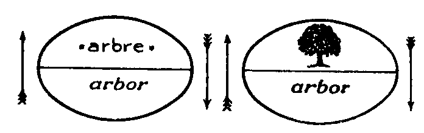
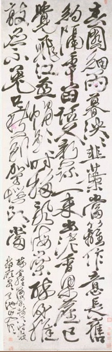
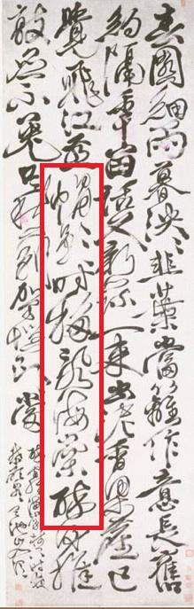
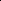
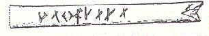
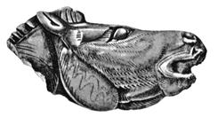

# Leçon 04 | 06 Décembre 1961

  

    <label><input type="checkbox" data-lacan-toggle="original" checked> 原文</label>
    <label><input type="checkbox" data-lacan-toggle="notes" checked> 注释</label>
    <label><input type="checkbox" data-lacan-toggle="commentary" checked> 个人解读评论</label>
  

  <form class="lacan-tool-search" role="search">
    <input class="lacan-tool-search-input" type="search" placeholder="搜索全文" aria-label="搜索全文">
    <button class="lacan-tool-button" type="submit" title="搜索">搜索</button>
  </form>
  <button class="lacan-tool-button lacan-back-to-top" type="button" title="回到页面最上方" aria-label="回到页面最上方">↑</button>

<section class="parallel-paragraph" data-paragraph-ids="s9-04-0001">

s9-04-0001

原文 · s9-04-0001

Reprenons notre visée : « 1 ». À savoir ce que je vous ai annoncé la dernière fois, que j’entendais faire pivoter autour de *la notion du* « 1 », notre problème, celui de l’identification. Étant déjà annoncé que *l’identification* ce n’est pas tout simple­ment « *faire un* ». Je pense que cela ne vous sera pas difficile à admettre.

[无对应译文]

</section>

<section class="parallel-paragraph" data-paragraph-ids="s9-04-0002">

s9-04-0002

原文 · s9-04-0002

Nous partons, comme il est normal concernant *l’identification*, du mode d’accès le plus commun de *l’expérience subjective*, celui qui s’exprime par ce qui paraît l’évidence essentiellement communicable dans la formule qui, au premier abord, ne paraît pas soulever d’objection : que A soit A. J’ai dit « *au premier abord* », parce qu’il est clair que, quelle que soit la valeur de croyance que comporte cette formule, je ne suis pas le premier à élever des objections là contre.

[无对应译文]

</section>

<section class="parallel-paragraph" data-paragraph-ids="s9-04-0003">

s9-04-0003

原文 · s9-04-0003

Vous n’avez qu’à ouvrir le moindre traité de logique pour rencontrer quelles difficultés le *distinguo* de cette formule, en apparence la plus simple, soulève d’elle-même. Vous pourrez même voir que la plus grande part des difficultés qui sont à résoudre dans beaucoup de domaines - *mais il est particulièrement frappant que ce soit en logique plus qu’ailleurs* - ressortissent à toutes les confusions possibles qui peuvent surgir de cette formule qui prête éminemment à confusion.

[无对应译文]

</section>

<section class="parallel-paragraph" data-paragraph-ids="s9-04-0004">

s9-04-0004

原文 · s9-04-0004

Si vous avez par exemple quelque difficulté, voire quelque fatigue à lire un texte aussi passionnant que celui du *Parménide* de PLATON : c’est pour autant que sur ce point du « A est A », disons que vous manquez un peu de réflexion, et pour autant jus­tement, que si j’ai dit tout à l’heure que le « A est A » est une croyance, il faut bien l’entendre comme je l’ai dit : c’est une croyance qui n’a point toujours régné sûrement sur notre espèce, pour autant qu’après tout le A a bien commencé quelque part - je parle du A : lettre A - et que cela ne devait pas être si facile d’accéder à ce noyau de certitude apparente qu’il y a dans le « A est A », quand l’homme ne disposait pas de l’A.

[无对应译文]

</section>

<section class="parallel-paragraph" data-paragraph-ids="s9-04-0005">

s9-04-0005

原文 · s9-04-0005

Je dirai tout à l’heure sur quel chemin peut nous mener cette réflexion : il convient tout de même de se rendre compte de ce qui arrive de nouveau avec l’A. Pour l’instant contentons-nous de ceci que notre lan­gage ici nous permet de bien articuler : c’est que le « A est A », ça a l’air de vouloir dire quelque chose, ça fait *signifié*.

[无对应译文]

</section>

<section class="parallel-paragraph" data-paragraph-ids="s9-04-0006">

s9-04-0006

原文 · s9-04-0006

Je pose - très sûr de ne rencontrer là-dessus aucune opposition de la part de quiconque...

[无对应译文]

</section>

<section class="parallel-paragraph" data-paragraph-ids="s9-04-0007">

s9-04-0007

原文 · s9-04-0007

> et sur ce thème en position de com­pétence dont j’ai fait l’épreuve par les témoignages attestés de ce qui peut se lire là-dessus, qu’en interpellant tel ou tel *mathématicien*, suffisamment familiarisé avec sa science pour savoir où nous en sommes actuellement par exemple, et puis bien d’autres dans tous les domaines ...je ne rencontrerai pas d’opposition à avan­cer, sur certaines conditions d’explication qui sont justement celles auxquelles je vais me soumettre devant vous, que : « A est A » ça ne signifie *rien*.

[无对应译文]

</section>

<section class="parallel-paragraph" data-paragraph-ids="s9-04-0008">

s9-04-0008

原文 · s9-04-0008

C’est justement de ce « *rien* » qu’il va s’agir, car c’est ce « *rien* » qui a valeur positive pour dire ce que cela signifie. Nous avons dans notre expérience, voire dans notre folklore analytique, quelque chose, une image jamais assez approfondie, exploitée, qu’est le jeu du petit enfant, si savamment repéré par FREUD[^35], aperçu de façon si perspicace dans le « *Fort-Da* ».

[无对应译文]

</section>

<section class="parallel-paragraph" data-paragraph-ids="s9-04-0009">

s9-04-0009

原文 · s9-04-0009

Reprenons-le pour notre compte puisque, d’un objet à prendre et à rejeter - il s’agit dans cet enfant de son petit-fils - FREUD a su apercevoir *le geste inaugural* dans le jeu. Refaisons ce geste, prenons ce petit objet, une balle de *ping-pong* : *je la prends, je la cache, je la lui remontre*. La « *balle de ping-pong* » est « *la balle de ping-pong* », mais ce n’est pas un signifiant, c’est un objet. C’est une approche pour dire : « ce *petit(a)* est un *petit(a)*  ».

[无对应译文]

</section>

<section class="parallel-paragraph" data-paragraph-ids="s9-04-0010">

s9-04-0010

原文 · s9-04-0010

*Il y a entre ces deux moments* - que j’identifie incontestablement d’une façon légitime - *la disparition de la balle*. Sans cela il n’y a rien moyen que je montre, il n’y a rien qui se forme sur le plan de l’image. Donc la balle est toujours là et je peux tom­ber en catalepsie à force de la regarder.

[无对应译文]

</section>

<section class="parallel-paragraph" data-paragraph-ids="s9-04-0011">

s9-04-0011

原文 · s9-04-0011

Quel rapport y a-t-il entre le « *est* » qui unit *les deux apparitions* de la balle et *cette* *disparition intermédiaire* ? Sur le plan *imaginaire*, vous touchez qu’au moins la question se pose du rapport de ce « *est* » avec ce qui semble bien le causer, à savoir la *disparition*, et là vous êtes proches d’un des secrets de l’*identification* qui est celui auquel j’ai essayé de vous faire reporter dans le folklore de l’*identification* : *cette assomption spontanée par le sujet de l’identité, de deux appari­tions pourtant bien différentes.*

[无对应译文]

</section>

<section class="parallel-paragraph" data-paragraph-ids="s9-04-0012">

s9-04-0012

原文 · s9-04-0012

Rappelez-vous l’histoire du *propriétaire de la ferme* mort que son serviteur retrouve dans le corps de la souris : le rapport de ce « *c’est lui* » avec le « *c’est encore lui* », c’est là ce qui nous donne l’expérience la plus simple de l’identification, le *modèle* et le *registre*. «  *Lui* » puis « *encore lui* » : il y a là la visée de *l’être*, dans l’« *encore lui* », c’est le même *être* qui apparaît. Pour ce qui est de l’autre, en somme, cela peut aller comme ça, *ça va*. Pour ma chienne que j’ai prise l’autre jour comme terme de référence, comme je viens de vous le dire : *ça va*, cette référence à l’être est suffisamment, semble-t-il, supportée par son odo­rat. Dans le champ *imaginaire* le support de l’être est vite concevable. Il s’agit de savoir si c’est *effectivement* ce rapport simple dont il s’agit dans notre expé­rience de l’identification.

[无对应译文]

</section>

<section class="parallel-paragraph" data-paragraph-ids="s9-04-0013">

s9-04-0013

原文 · s9-04-0013

Quand nous parlons de notre expérience de *l’être*, ce n’est point pour rien que tout l’effort d’une pensée qui est la nôtre, contempo­raine, va formuler quelque chose dont je ne déplace jamais le gros meuble qu’avec un certain sourire : ce *Dasein,* ce mode fondamental de notre expérience dont il semble qu’il faut en désigner le meuble donnant toute accession, à ce terme de *l’être,* la référence primaire.

[无对应译文]

</section>

<section class="parallel-paragraph" data-paragraph-ids="s9-04-0014">

s9-04-0014

原文 · s9-04-0014

C’est bien là que quelque chose d’autre nous force de nous interroger sur ceci : que la scansion où se manifeste cette *présence au monde*, n’est pas simplement *imaginaire*, à savoir que déjà ce n’est point à l’autre qu’ici nous nous référons, mais à ce plus intime de nous-mêmes dont nous essayons de faire l’ancrage, la racine, le fondement de ce que nous sommes comme sujet. Car si nous pouvons articuler, comme nous l’avons fait sur le plan *imaginaire*, que ma chienne me reconnaisse pour le même, nous n’avons par contre aucune indication sur la façon dont *elle* s’identifie.

[无对应译文]

</section>

<section class="parallel-paragraph" data-paragraph-ids="s9-04-0015">

s9-04-0015

原文 · s9-04-0015

De quelque façon que nous puissions la réengager en elle-même, nous ne savons point, nous n’avons aucune preuve, aucun témoi­gnage du mode sous lequel, cette identification, elle l’accroche. C’est bien ici qu’apparaît *la fonction, la valeur* *du signifiant* même comme tel, et c’est dans la mesure même où c’est du sujet qu’il s’agit que nous avons à nous interroger sur le rapport de cette *identification* du sujet avec ce qui est une dimension différente de tout ce qui est de l’ordre de *l’apparition* et de *la dis­parition*, à savoir le statut du *signifiant*.

[无对应译文]

</section>

<section class="parallel-paragraph" data-paragraph-ids="s9-04-0016">

s9-04-0016

原文 · s9-04-0016

Que notre expérience nous montre que les différents modes, les différents angles sous lesquels nous sommes amenés à *nous identifier comme sujets*, au moins pour une part d’entre eux supposent le signifiant pour l’articuler, même sous la forme le plus souvent ambiguë, impropre, mal maniable et sujette à toutes sortes de réserves et de distinctions, qu’est le « A est A », c’est là que je veux amener votre attention. Et tout d’abord je veux dire sans plus lanterner, vous montrer que si nous avons la chance de faire un pas de plus dans ce sens, c’est en essayant d’articuler ce statut du signifiant comme tel. Je l’indique tout de suite, *le signifiant n’est point le signe*. C’est à donner à cette distinction sa formule précise que nous allons nous employer. Je veux dire que *c’est à montrer où gît cette différence que nous pourrons voir* surgir ce fait déjà donné par notre expérience *que c’est de l’effet du signifiant que surgit comme tel le sujet*.

[无对应译文]

</section>

<section class="parallel-paragraph" data-paragraph-ids="s9-04-0017">

s9-04-0017

原文 · s9-04-0017

Effet *métonymique* ? Effet *métaphorique* ? Nous ne le savons pas encore, et peut-être y a-t-il quelque chose d’articulable déjà avant ces effets, qui nous permette de voir poindre, de former en un rapport, en une relation, la dépendance du sujet comme tel, par rapport au signifiant. C’est ce que nous allons voir à l’épreuve.

[无对应译文]

</section>

<section class="parallel-paragraph" data-paragraph-ids="s9-04-0018">

s9-04-0018

原文 · s9-04-0018

Pour devancer ce que j’essaie ici de vous *faire saisir*, pour le devancer en une image courte, à laquelle il ne s’agit que de donner encore qu’une sorte de valeur de support, d’apologue, mesurez la différence entre ceci, qui va d’abord peut-être vous paraître *un jeu de mots*, mais justement c’en est un : il y a « *la trace d’un pas* » - déjà je vous ai menés sur cette piste, fortement teintée de mythisme, corrélative justement du temps où commence à s’articuler dans la pensée la fonction du sujet comme tel : ROBINSON devant « *la trace de pas* » qui lui montre que dans l’île il n’est pas seul[^36] - la distance qui sépare ce « *pas* », de ce qu’est devenu phonétiquement le « *pas* » comme *instrument de la négation*.

[无对应译文]

</section>

<section class="parallel-paragraph" data-paragraph-ids="s9-04-0019">

s9-04-0019

原文 · s9-04-0019

Ce sont juste là deux extrêmes de la chaîne qu’ici je vous demande de tenir avant de vous mon­trer effectivement ce qui la constitue et que c’est entre les deux extrémités de la chaîne que le sujet peut surgir et nulle part ailleurs. À le saisir, nous arriverons à relativer quelque chose de façon telle que vous puissiez considérer cette for­mule « A est A », elle-même comme une sorte de stigmate, je veux dire dans son caractère de croyance, comme l’affirmation de ce que j’appellerai une ἐποΧἠ \[époché\] : *époque, moment, parenthèse*, terme historique après tout, dont nous pouvons, vous le verrez, entrevoir le champ comme limité. Ce que j’ai appelé l’autre jour *une indication* - qui restera n’être encore qu’*une indication* - de l’identité de cette fausse consistance du « A est A » avec ce que j’ai appelé *« une ère théologique »*, me permettra je crois de faire *un pas* dans ce dont il s’agit concernant le problème de l’*identification*, pour autant que l’analyse nécessite qu’on la pose par rapport à une certaine accession à l’identique, comme la transcendant.

[无对应译文]

</section>

<section class="parallel-paragraph" data-paragraph-ids="s9-04-0020">

s9-04-0020

原文 · s9-04-0020

Cette *fécondité*, cette sorte de détermination qui est suspendue à *ce signifié du « *A est A* »* ne saurait reposer sur *sa vérité* puisqu’elle n’est pas *vraie*, cette affir­mation. Ce qu’il s’agit d’atteindre dans ce que devant vous je m’efforce de for­muler, c’est que cette fécondité repose justement sur *le fait objectif*... j’emploie là « *objectif* » dans le sens qu’il a par exemple dans le texte de DESCARTES[^37] : quand on va un peu plus loin, on voit surgir la distinction, concernant les idées, de leur « *réa­lité actuelle* » avec leur « *réalité objective* ». Et naturellement *les professeurs nous sor­tent des volumes très savants, tels qu’un index scolastico-cartésien*[^38] *pour nous dire* \- ce qui nous paraît là, à nous autres, puisque Dieu sait que nous sommes malins, un peu embrouillé - *que c’est un héritage de la scolastique*, moyennant quoi on croit avoir tout expliqué, je veux dire qu’on s’est libéré de ce dont il s’agit, à savoir : *pourquoi* DESCARTES *a été - lui l’anti-scolastique - amené à se res­servir de ces* *vieux accessoires*. Il ne semble pas qu’il vienne si facilement à l’idée, même des meilleurs historiens, que la seule chose intéressante c’est ce qui le nécessite à les ressortir. Il est bien clair que ce n’est pas pour refaire à nouveau l’argument de Saint-ANSELME qu’il re-traîne tout cela sur le devant de la scène. …*le fait objectif que A ne peut pas être A*, c’est cela que je voudrais d’abord mettre pour vous en évidence, justement pour vous faire comprendre que c’est de quelque chose qui a rapport avec *ce fait objectif* qu’il s’agit, et jusque *dans ce faux effet de signifié qui n’est là qu’ombre et conséquence* qui nous laisse atta­ché à cette sorte de primesaut qu’il y a dans le « *A est A* ».

[无对应译文]

</section>

<section class="parallel-paragraph" data-paragraph-ids="s9-04-0021">

s9-04-0021

原文 · s9-04-0021

*Que le signifiant soit fécond de ne pouvoir être en aucun cas identique à lui-même,* entendez bien là ce que je veux dire : il est tout à fait clair que je ne suis pas en train - quoique cela vaille la peine au passage pour l’en distinguer - de vous faire remarquer qu’il n’y a pas de tautologie dans le fait de dire que « *la guerre est la guerre* ». Tout le monde sait cela. Quand on dit « *la guerre est la guerre* », on dit quelque chose, on ne sait pas exactement *quoi* d’ailleurs, mais on peut le chercher, on peut le trouver et on le trouve très facilement, *à la portée de la main*.

[无对应译文]

</section>

<section class="parallel-paragraph" data-paragraph-ids="s9-04-0022">

s9-04-0022

原文 · s9-04-0022

*Cela veut dire* - ce qui commence à partir d’un certain moment - *on est en état de guerre*. Cela comporte des *condi­tions* *un petit peu différentes* des choses, c’est ce que PÉGUY appelait « *que les petites chevilles n’allaient plus dans les petits trous* ». C’est une définition péguyste, c’est-à-dire qu’elle n’est rien moins que certaine. On pourrait soute­nir le contraire, à savoir : que c’est justement pour remettre les petites chevilles dans leurs vrais petits trous que la guerre commence, ou au contraire que c’est pour faire de nouveaux petits trous pour d’anciennes petites chevilles, et ainsi de suite.

[无对应译文]

</section>

<section class="parallel-paragraph" data-paragraph-ids="s9-04-0023">

s9-04-0023

原文 · s9-04-0023

Ceci n’a d’ailleurs strictement pour nous aucun intérêt, sauf que cette poursuite, quelle qu’elle soit, s’accomplit avec une efficacité remarquable par l’intermédiaire de la plus profonde imbécilité, *ce qui doit également nous faire réfléchir* *sur la fonction du sujet par rapport aux effets du signifiant*. Mais prenons quelque chose de simple, et finissons-en rapidement. Si je dis : « *Mon grand-père est mon grand-père* », vous devez tout de même bien saisir là qu’il n’y a aucune tautologie, que « *mon grand-père* », *premier terme*, est un usage d’index du *deuxième terme* « *mon grand-père* », qui n’est sensiblement pas diffé­rent de son nom propre, par exemple Émile LACAN, ni non plus du « *c* » du « *c’est* » quand je le désigne quand il entre dans une pièce : « *c’est mon grand-père* ».

[无对应译文]

</section>

<section class="parallel-paragraph" data-paragraph-ids="s9-04-0024">

s9-04-0024

原文 · s9-04-0024

Ce qui ne veut pas dire que son nom propre soit la même chose que ce « *c* » de « *this is my granfather* ». On est stupéfait qu’un logicien comme RUSSELL[^39] ait cru pouvoir dire que le *nom propre* est de la même catégorie, de la même classe signifiante que le *this, that* ou *it, sous prétexte qu’ils sont susceptibles du même usage fonction­nel dans certains cas*. Ceci est une parenthèse, mais comme toutes mes paren­thèses, une parenthèse destinée à être retrouvée plus loin à propos du statut du nom propre dont nous ne parlerons pas aujourd’hui.

[无对应译文]

</section>

<section class="parallel-paragraph" data-paragraph-ids="s9-04-0025">

s9-04-0025

原文 · s9-04-0025

Quoi qu’il en soit, ce dont il s’agit dans « *Mon grand-père est mon grand-père* » veut dire ceci : que *cet exécrable petit bourgeois* qu’était ledit bonhomme, *cet horrible personnage* grâce auquel j’ai accédé à un âge précoce à cette fonction fondamentale qui est de maudire Dieu, ce personnage est exactement le même qui est porté sur l’état civil comme étant démontré par les liens du mariage pour être père de mon père, en tant que c’est justement de la naissance de celui-ci qu’il s’agit dans l’acte en question. Vous voyez donc *à quel point* « *mon grand-père est mon grand-père* » *n’est point une tautologie* \[sic\].

[无对应译文]

</section>

<section class="parallel-paragraph" data-paragraph-ids="s9-04-0026">

s9-04-0026

原文 · s9-04-0026

Ceci s’applique à toutes les tautologies, et ceci n’en donne point une formule univoque, car ici il s’agit d’un rapport du *réel* au *symbolique*. Dans d’autres cas il y aura un rapport de l’*imaginaire* au *symbolique*, et faites toute la suite des *permutations*, histoire de voir lesquelles seront valables. Je ne peux pas m’engager dans cette voie parce que si je vous parle de ceci, qui est en quelque sorte un mode d’écarter les fausses tautologies qui sont simplement l’usage cou­rant, permanent, du langage, c’est pour vous dire que *ce n’est pas cela que je veux dire*.

[无对应译文]

</section>

<section class="parallel-paragraph" data-paragraph-ids="s9-04-0027">

s9-04-0027

原文 · s9-04-0027

*Si je pose qu’il n’y a pas de tautologie possible, ce n’est pas en tant que A premier et A second veulent dire des choses différentes* *que je dis qu’il n’y a pas de tautologie : c’est dans le statut même de A qu’il y a inscrit que A ne peut pas être A.* Et c’est là-dessus que j’ai terminé mon discours de la dernière fois *en vous désignant dans Saussure le point où il est dit que A comme signifiant ne peut d’aucune façon se définir, sinon que comme n’étant pas ce que sont les autres signifiants. De ce fait : qu’il ne puisse se définir que de ceci justement de n’être pas tous les autres signifiants, de ceci dépend cette dimension qu’il est également vrai qu’il ne saurait être lui-même.*

[无对应译文]

</section>

<section class="parallel-paragraph" data-paragraph-ids="s9-04-0028">

s9-04-0028

原文 · s9-04-0028

Il ne suffit pas de l’avancer ainsi de cette façon opaque justement parce qu’elle surprend, qu’elle chavire cette croyance suspendue au fait que c’est là le vrai support de l’identité, il faut vous le faire sentir. *Qu’est-ce que c’est qu’un signi­fiant ?* Si tout le monde, et pas seulement les logiciens, parle de A quand il s’agit de « A est A », c’est quand même pas un hasard, c’est parce que, pour *supporter* ce qu’on désigne, il faut une « *lettre* ».

[无对应译文]

</section>

<section class="parallel-paragraph" data-paragraph-ids="s9-04-0029">

s9-04-0029

原文 · s9-04-0029

Vous me l’accordez, je pense, mais aussi bien je ne tiens point ce saut pour décisif, sinon que mon discours ne le recoupe, ne le démontre d’une façon suffisamment surabondante pour que vous en soyez convaincus, et vous en serez d’autant mieux convaincus que je vais tâcher de vous montrer dans la « *lettre* » justement, cette essence du *signifiant* par où il se dis­tingue du *signe*.

[无对应译文]

</section>

<section class="parallel-paragraph" data-paragraph-ids="s9-04-0030">

s9-04-0030

原文 · s9-04-0030

J’ai fait quelque chose pour vous samedi dernier dans ma mai­son de campagne où j’ai - suspendu à ma muraille - ce qu’on appelle une « *calligraphie chinoise* ». Si elle n’était pas chinoise, je ne l’aurais pas suspendue à ma muraille pour la raison qu’il n’y a qu’en Chine que la calligraphie a pris une valeur d’objet d’art. C’est la même chose que d’avoir une peinture, ça a le même prix. Il y a les mêmes différences, et peut-être plus encore, d’une écriture à une autre dans notre culture, que dans la culture chinoise, mais nous n’y attachons pas le même prix.

[无对应译文]

</section>

<section class="parallel-paragraph" data-paragraph-ids="s9-04-0031">

s9-04-0031

原文 · s9-04-0031

D’autre part j’aurai l’occasion de vous montrer ce qui peut - à nous - masquer la valeur de la « *lettre* », ce qui, en raison du statut particulier du caractère chinois, est particulièrement bien mis en évidence dans ce caractère. Ce que je vais donc vous montrer ne prend sa pleine et plus exacte situation que d’une certaine réflexion sur ce qu’est le caractère chinois.

[无对应译文]

</section>

<section class="parallel-paragraph" data-paragraph-ids="s9-04-0032">

s9-04-0032

原文 · s9-04-0032

J’ai déjà tout de même assez, quelquefois, fait allusion au caractère chinois et à son statut pour que vous sachiez que, de l’appeler *idéographique*, ce n’est pas du tout suffisant. Je vous le montrerai peut-être en plus de détails.

[无对应译文]

</section>

<section class="parallel-paragraph" data-paragraph-ids="s9-04-0033">

s9-04-0033

原文 · s9-04-0033

C’est ce qu’il a d’ailleurs de commun avec tout ce qu’on a appelé *idéographique *: il n’y a à proprement parler rien qui mérite ce terme au sens où on l’imagine habituellement, je dirais presque nommément au sens où le petit schéma de SAUSSURE, avec *arbor* et l’arbre dessiné en dessous, le soutient encore par une espèce d’imprudence qui est ce à quoi s’attachent les malentendus et les confusions.

[无对应译文]

</section>

<section class="parallel-paragraph" data-paragraph-ids="s9-04-0034">

s9-04-0034

原文 · s9-04-0034

[无对应译文]

</section>

<section class="parallel-paragraph" data-paragraph-ids="s9-04-0035">

s9-04-0035

原文 · s9-04-0035

Ce que je veux là vous montrer, je l’ai fait en deux exemplaires.

[无对应译文]

</section>

<section class="parallel-paragraph" data-paragraph-ids="s9-04-0036">

s9-04-0036

原文 · s9-04-0036

[无对应译文]

</section>

<section class="parallel-paragraph" data-paragraph-ids="s9-04-0037">

s9-04-0037

原文 · s9-04-0037

On m’avait donné en même temps un nouveau petit instrument dont certains peintres font grand cas, qui est une sorte de pinceau épais où le jus vient de l’intérieur, qui permet de tracer des traits avec une épaisseur, une consis­tance intéressante. Il en est résulté que j’ai copié beaucoup plus facilement que je ne l’aurais fait normalement la forme qu’avaient les caractères sur ma calli­graphie. Dans la colonne de gauche voilà la calligraphie de cette phrase qui veut dire : « *l’ombre de mon chapeau danse et tremble sur les fleurs du Haï-tang* »[^40].

[无对应译文]

</section>

<section class="parallel-paragraph" data-paragraph-ids="s9-04-0038">

s9-04-0038

原文 · s9-04-0038

[无对应译文]

</section>

<section class="parallel-paragraph" data-paragraph-ids="s9-04-0039">

s9-04-0039

原文 · s9-04-0039

De l’autre côté, vous voyez écrite la même phrase dans des caractères courants, ceux qui sont les plus licites, ceux que fait l’étudiant ânonnant quand il fait correcte­ment ses caractères :

[无对应译文]

</section>

<section class="parallel-paragraph" data-paragraph-ids="s9-04-0040">

s9-04-0040

原文 · s9-04-0040

帽

[无对应译文]

</section>

<section class="parallel-paragraph" data-paragraph-ids="s9-04-0041">

s9-04-0041

原文 · s9-04-0041

影

[无对应译文]

</section>

<section class="parallel-paragraph" data-paragraph-ids="s9-04-0042">

s9-04-0042

原文 · s9-04-0042

时

[无对应译文]

</section>

<section class="parallel-paragraph" data-paragraph-ids="s9-04-0043">

s9-04-0043

原文 · s9-04-0043

移

[无对应译文]

</section>

<section class="parallel-paragraph" data-paragraph-ids="s9-04-0044">

s9-04-0044

原文 · s9-04-0044

乱

[无对应译文]

</section>

<section class="parallel-paragraph" data-paragraph-ids="s9-04-0045">

s9-04-0045

原文 · s9-04-0045

海

[无对应译文]

</section>

<section class="parallel-paragraph" data-paragraph-ids="s9-04-0046">

s9-04-0046

原文 · s9-04-0046

棠

[无对应译文]

</section>

<section class="parallel-paragraph" data-paragraph-ids="s9-04-0047">

s9-04-0047

原文 · s9-04-0047

帽影时移乱海棠

[无对应译文]

</section>

<section class="parallel-paragraph" data-paragraph-ids="s9-04-0048">

s9-04-0048

原文 · s9-04-0048

> *mào yǐng shí yí luàn hǎi táng*

[无对应译文]

</section>

<section class="parallel-paragraph" data-paragraph-ids="s9-04-0049">

s9-04-0049

原文 · s9-04-0049

Ces deux séries sont parfaitement identifiables, et en même temps *elles ne se ressemblent pas du tout*. Apercevez-vous que c’est de la façon la plus claire en tant qu’ils ne se ressemblent pas du tout, que ce sont bien évi­demment, *de haut en bas*, à droite et à gauche, les *sept mêmes caractères*, même pour quelqu’un qui n’a aucune idée, non seulement des caractères chinois, mais aucune idée jusque-là qu’il y avait des choses qui s’appelaient des caractères chi­nois. Si quelqu’un découvre cela pour la première fois dessiné quelque part dans un désert, il verra qu’il s’agit à droite et à gauche de caractères, et de *la même succession de caractères à droite et à gauche*.

[无对应译文]

</section>

<section class="parallel-paragraph" data-paragraph-ids="s9-04-0050">

s9-04-0050

原文 · s9-04-0050

Ceci pour *vous introduire à ce qui fait* *l’essence du signifiant* et dont ce n’est pas pour rien que je l’illustrerai le mieux de *sa forme la plus simple* qui est ce que nous désignons depuis quelque temps comme l’*einziger Zug.* L’*einziger Zug* qu’ici je vise est ce qui donne à cette fonction son prix, son acte et son ressort.

[无对应译文]

</section>

<section class="parallel-paragraph" data-paragraph-ids="s9-04-0051">

s9-04-0051

原文 · s9-04-0051

C’est ceci qui nécessite, pour dissiper ce qui pourrait ici rester de confusion, que j’introduise pour le traduire au mieux et au plus près ce terme, qui n’est point un néologisme, qui est employé dans la théorie dite des ensembles, le mot « *unaire* » au lieu du mot « *unique* ». Tout au moins il est utile que je m’en serve aujourd’hui, pour bien vous faire sentir ce nerf dont il s’agit dans la distinction du statut du signifiant.

[无对应译文]

</section>

<section class="parallel-paragraph" data-paragraph-ids="s9-04-0052">

s9-04-0052

原文 · s9-04-0052

Le *trait unaire* donc...

[无对应译文]

</section>

<section class="parallel-paragraph" data-paragraph-ids="s9-04-0053">

s9-04-0053

原文 · s9-04-0053

- qu’il soit *comme ici* :**│**, *vertical*, nous appelons cela faire des bâtons,

[无对应译文]

</section>

<section class="parallel-paragraph" data-paragraph-ids="s9-04-0054">

s9-04-0054

原文 · s9-04-0054

- ou qu’il soit, *comme le font les chinois * : ─ *horizontal* ...il peut sembler que sa fonc­tion exemplaire soit liée à *la réduction extrême*, à son propos justement, de toutes les occasions de différence qualitative. Je veux dire qu’à partir du moment où je dois faire simplement un trait, il n’y a, semble-t-il, pas beaucoup de *variétés* ni de *variations* possibles, que c’est cela qui va faire sa valeur privilégiée pour nous.

[无对应译文]

</section>

<section class="parallel-paragraph" data-paragraph-ids="s9-04-0055">

s9-04-0055

原文 · s9-04-0055

Détrompez-vous ! Pas plus que tout à l’heure il ne s’agissait, pour dépister ce dont il s’agit dans la formule : « *il n’y a pas de tautologie* », de pourchasser la tauto­logie là justement où elle n’est pas, pas plus il ne s’agit ici de discerner ce que j’ai appelé le caractère parfaitement saisissable du statut du signifiant quel qu’il soit, « A » ou un autre, dans le fait que quelque chose dans sa structure éliminerait ces différences - je les appelle qualitatives parce que c’est de ce terme que les logi­ciens se servent quand il s’agit de définir l’identité - de l’élimination des *diffé­rences qualitatives*, de leur *réduction*, comme on dirait, *à un schème simplifié* : ce serait là que serait le ressort de cette reconnaissance caractéristique de notre appréhension de ce qui est le support du signifiant, la « *lettre*  ».

[无对应译文]

</section>

<section class="parallel-paragraph" data-paragraph-ids="s9-04-0056">

s9-04-0056

原文 · s9-04-0056

Il n’en est rien. Ce n’est pas de cela qu’il s’agit. Car si je fais une ligne de bâtons, il est tout à fait clair que, quelle que soit mon application, il n’y en aura pas un seul de *semblable*, et je dirai plus, ils sont d’autant plus *convaincants* comme ligne de bâtons que jus­tement je ne me serai pas tellement appliqué à les faire *rigoureusement semblables*. Depuis que j’essaie de formuler pour vous ce que je suis en train pour l’ins­tant de formuler, je me suis - avec les moyens du bord, c’est-à-dire ceux qui sont donnés à tout le monde - interrogé sur ceci après tout qui n’est pas évident tout de suite : à quel moment est-ce qu’on voit apparaître une ligne de bâtons ?

[无对应译文]

</section>

<section class="parallel-paragraph" data-paragraph-ids="s9-04-0057">

s9-04-0057

原文 · s9-04-0057

J’ai été dans un endroit vraiment extraordinaire où peut-être après tout par mes propos je vais entraîner que s’anime le désert, je veux dire que quelques-uns d’entre vous vont s’y précipiter, je veux dire le [Musée de Saint-Germain](http://www.culture.gouv.fr/culture/app/fr/parcours.htm)[^41]. C’est fascinant, c’est passionnant, et cela le sera d’autant plus que vous tâcherez quand même de trouver quelqu’un qui y a déjà été avant vous parce qu’il n’y a aucun catalogue, aucun plan et il est complètement impossible de savoir où et quoi est quoi, et de se retrouver dans la suite de ces salles.

[无对应译文]

</section>

<section class="parallel-paragraph" data-paragraph-ids="s9-04-0058">

s9-04-0058

原文 · s9-04-0058

Il y a une salle qui s’appelle la salle PIETTE, du nom du juge de paix qui était un génie, et qui a fait les découvertes de la pré­histoire les plus prodigieuses, je veux dire de quelques menus objets, en général de très petite taille, qui sont ce qu’on peut voir de plus fascinant. Et tenir dans sa main une petite tête de femme qui a certainement dans les trente mille ans a tout de même sa valeur, outre que cette tête est pleine de questions \[La « [*Dame de Brassempouy*](http://fr.wikipedia.org/wiki/Dame_de_Brassempouy) »\].

[无对应译文]

</section>

<section class="parallel-paragraph" data-paragraph-ids="s9-04-0059">

s9-04-0059

原文 · s9-04-0059

[无对应译文]

</section>

<section class="parallel-paragraph" data-paragraph-ids="s9-04-0060">

s9-04-0060

原文 · s9-04-0060

Mais vous pourrez voir à travers une vitrine, c’est très facile à voir, car grâce aux dispositions testa­mentaires de cet homme remarquable on est absolument forcé de tout laisser dans la plus grande pagaille avec les étiquettes complètement dépassées qu’on a mises sur les objets, on a réussi quand même à mettre sur un peu de plastique quelque chose qui permet de distinguer la valeur de certains de *ces objets,* com­ment vous dire cette émotion qui m’a saisi quand penché sur une de ces vitrines je vis sur une côte mince, manifestement une côte d’un mammifère, je ne sais pas très bien lequel, et je ne sais pas si quelqu’un le saura mieux que moi, genre chevreuil, cervidé, une série de petits bâtons : deux d’abord, puis un petit inter­valle, et ensuite cinq, et puis ça recommence.

[无对应译文]

</section>

<section class="parallel-paragraph" data-paragraph-ids="s9-04-0061">

s9-04-0061

原文 · s9-04-0061

[无对应译文]

</section>

<section class="parallel-paragraph" data-paragraph-ids="s9-04-0062">

s9-04-0062

原文 · s9-04-0062

Idéogrammes incisés sur os. Magdalénien. Le Placard

[无对应译文]

</section>

<section class="parallel-paragraph" data-paragraph-ids="s9-04-0063">

s9-04-0063

原文 · s9-04-0063

Voilà, me disais-je - en m’adressant à moi-même par mon nom secret ou public - voilà pourquoi en somme Jacques LACAN ta fille n’est pas muette. Ta fille est ta fille, car si nous étions muets, elle ne serait point ta fille. Évidemment ceci a bien de l’avantage, même de vivre dans un monde fort comparable à celui d’un asile d’aliénés universel, conséquence non moins certaine de l’existence des signifiants, vous allez le voir.

[无对应译文]

</section>

<section class="parallel-paragraph" data-paragraph-ids="s9-04-0064">

s9-04-0064

原文 · s9-04-0064

Ces bâtons qui n’apparaissent que beaucoup plus tard, plusieurs milliers d’années plus tard, après que les hommes aient su faire des objets d’une exactitude réaliste, qu’à l’Aurignacien on eût fait des bisons après lesquels, du point de vue de l’art du peintre, nous pouvons encore courir. Mais bien plus, à la même époque on faisait en os, tout petit, une reproduction de quelque chose, dont il semblerait qu’on n’aurait pas eu besoin de se fatiguer puisque c’est une reproduction d’une autre chose en os, mais elle beaucoup plus grande : un crâne de cheval.

[无对应译文]

</section>

<section class="parallel-paragraph" data-paragraph-ids="s9-04-0065">

s9-04-0065

原文 · s9-04-0065

[无对应译文]

</section>

<section class="parallel-paragraph" data-paragraph-ids="s9-04-0066">

s9-04-0066

原文 · s9-04-0066

Pourquoi refaire en os tout petit, quand vraiment on imagine qu’à cette époque ils avaient autre chose à faire, cette reproduction inégalable ? Je veux dire que, dans le CUVIER que j’ai dans ma maison de campagne, j’ai des gra­vures excessivement remarquables des squelettes fossiles qui sont faites par des artistes consommés, ça n’est pas mieux que cette petite réduction d’un crâne de cheval sculpté dans l’os, qui est d’une exactitude anatomique telle, qu’elle n’est pas seulement convaincante, elle est rigoureuse.

[无对应译文]

</section>

<section class="parallel-paragraph" data-paragraph-ids="s9-04-0067">

s9-04-0067

原文 · s9-04-0067

Eh bien, c’est beaucoup plus tard seulement que nous trouvons la trace de quelque chose qui soit, sans ambiguïté du signifiant, et ce signifiant est tout seul, car je ne songe pas à donner, faute d’information, un sens spécial à cette petite augmentation d’intervalle qu’il y a quelque part dans cette ligne de bâtons. C’est possible, mais je ne peux rien en dire. Ce que je veux dire par contre, c’est qu’ici nous voyons surgir quelque chose dont je ne dis pas que c’est la première apparition, mais en tout cas une apparition certaine de quelque chose dont vous voyez que ceci se distingue tout à fait de ce qui peut se désigner comme *la dif­férence qualitative*.

[无对应译文]

</section>

<section class="parallel-paragraph" data-paragraph-ids="s9-04-0068">

s9-04-0068

原文 · s9-04-0068

Chacun de ces traits n’est pas du tout identique à celui qui est son voisin, mais cela n’est pas parce qu’ils sont différents qu’ils fonctionnent comme différents, mais en raison que la différence signifiante est distincte de tout ce qui se rapporte à *la différence qualitative*, comme je viens de vous le montrer avec les petites choses que je viens de faire circuler devant vous. *La différence quali­tative* peut même à l’occasion souligner la mêmeté signifiante. Cette mêmeté est constituée de ceci justement que le signifiant comme tel sert à connoter la diffé­rence à l’état pur, et la preuve c’est qu’à sa première apparition le 1 manifeste­ment désigne la multiplicité comme telle. Autrement dit : je suis chasseur - puisque nous voilà portés au niveau du Magdalénien IV - Dieu sait qu’attraper une bête n’était pas beaucoup plus simple à cette époque que ça ne l’est de nos jours pour ceux qu’on appelle les *Bushmen*, et c’était toute une aventure !

[无对应译文]

</section>

<section class="parallel-paragraph" data-paragraph-ids="s9-04-0069">

s9-04-0069

原文 · s9-04-0069

Il semble bien qu’après avoir atteint la bête il fal­lait la traquer longtemps pour la voir succomber à ce qui était l’effet du poison :

[无对应译文]

</section>

<section class="parallel-paragraph" data-paragraph-ids="s9-04-0070">

s9-04-0070

原文 · s9-04-0070

- J’en ai tué *une*, c’est une aventure.

[无对应译文]

</section>

<section class="parallel-paragraph" data-paragraph-ids="s9-04-0071">

s9-04-0071

原文 · s9-04-0071

- J’en tue *une autre*, c’est une seconde aventure, que je peux distinguer par certains traits de la première, mais qui lui ressemble essentiellement d’être marquée de la même ligne générale.

[无对应译文]

</section>

<section class="parallel-paragraph" data-paragraph-ids="s9-04-0072">

s9-04-0072

原文 · s9-04-0072

- À la quatrième, il peut y avoir embrouillement : qu’est-ce qui la *distingue* de la seconde, par exemple ?

[无对应译文]

</section>

<section class="parallel-paragraph" data-paragraph-ids="s9-04-0073">

s9-04-0073

原文 · s9-04-0073

- À la vingtième, comment est-ce que je m’y *retrouverai*, ou même, est-ce que je saurai que j’en ai eu vingt?

[无对应译文]

</section>

<section class="parallel-paragraph" data-paragraph-ids="s9-04-0074">

s9-04-0074

原文 · s9-04-0074

Le marquis de SADE, dans la rue Paradis à Marseille, enfermé avec son petit valet, procédait de même pour *les coups*, quoique diver­sement variés, qu’il tira en compagnie de ce partenaire, fût-ce avec quelques comparses eux-mêmes diversement variés. Cet homme exemplaire, dont les rap­ports au désir devaient sûrement être marqués de quelque ardeur peu commune - quoi qu’on pense - *marqua au chevet de son lit*, dit-on, *par de petits traits cha­cun des « coups »* - pour les appeler par leur nom - qu’il fut amené à pousser jusqu’à leur accomplissement dans cette sorte de singulière retraite probatoire.

[无对应译文]

</section>

<section class="parallel-paragraph" data-paragraph-ids="s9-04-0075">

s9-04-0075

原文 · s9-04-0075

Assurément, il faut être soi-même bien engagé dans l’aventure du désir, au moins d’après tout ce que le commun des choses nous apprend de l’expérience la plus ordinaire des mortels, pour avoir un tel *besoin de se repérer* dans la succession de ses accomplissements sexuels. Il n’est néanmoins pas impensable qu’à cer­taines époques favorisées de la vie, quelque chose puisse devenir flou du point exact où l’on en est dans le champ de la numération décimale.

[无对应译文]

</section>

<section class="parallel-paragraph" data-paragraph-ids="s9-04-0076">

s9-04-0076

原文 · s9-04-0076

Ce dont il s’agit dans « *la coche* », dans « *le trait coché* », c’est quelque chose dont nous ne pouvons pas ne pas voir qu’ici surgit quelque chose de nouveau par rap­port à ce qu’on peut appeler l’immanence de quelque action essentielle que ce soit. Cet être, que nous pouvons imaginer encore dépourvu de ce mode de repère, qu’est-ce qu’il fera au bout d’un temps assez court et limité par l’intui­tion, pour qu’il ne se sente *pas simplement solidaire d’un présent toujours faci­lement renouvelé* où rien ne lui permet plus de discerner ce qui existe comme différence dans le réel ?

[无对应译文]

</section>

<section class="parallel-paragraph" data-paragraph-ids="s9-04-0077">

s9-04-0077

原文 · s9-04-0077

Il ne suffit point de dire : « *c’est déjà bien évident que cette différence est dans le vécu du sujet, car qu’est-ce qui ressemble le plus à un cycle que le retour des besoins et des satisfactions qui y attiennent ?* ». De même qu’il ne suffit point de dire : « *Mais tout de même,* *Untel n’est pas moi* ! ». Ça n’est pas simplement parce que LAPLANCHE a les cheveux comme ça et que je les ai comme cela, et qu’il a les yeux d’une certaine façon, et qu’il n’a pas tout à fait le même sourire que moi, qu’il est différent. Vous direz : « *Laplanche est Laplanche, et Lacan est Lacan* ». Mais c’est justement là qu’est toute la question, puisque justement dans l’analyse la question se pose si LAPLANCHE n’est pas la pensée de LACAN, et si LACAN n’est pas l’être de LAPLANCHE ou inversement.

[无对应译文]

</section>

<section class="parallel-paragraph" data-paragraph-ids="s9-04-0078">

s9-04-0078

原文 · s9-04-0078

La question n’est pas suffisamment résolue *dans le réel*. C’est le signifiant qui tranche. C’est lui qui introduit la différence comme telle *dans le réel*, et justement dans la mesure où ce dont il s’agit n’est point de différences qualitatives. Mais alors si ce signifiant, dans sa fonction de différence, est quelque chose qui se présente ainsi sous le mode du paradoxe d’être justement différent de cette différence qui se fonderait sur - ou non - la ressemblance, d’être autre chose de dis­tinct et dont je le répète nous pouvons très bien supposer - parce que nous les avons à notre portée - qu’il y a des êtres qui vivent et se supportent très bien d’ignorer complètement cette sorte de différence qui certainement, par exemple, n’est point accessible à ma chienne.

[无对应译文]

</section>

<section class="parallel-paragraph" data-paragraph-ids="s9-04-0079">

s9-04-0079

原文 · s9-04-0079

Et je ne vous montre pas tout de suite - car je vous le montrerai plus en détails et d’une façon plus articulée – que c’est bien pour cela qu’apparemment la seule chose qu’elle ne sache pas, c’est qu’elle-même est. Et qu’elle-même soit, nous devons chercher sous quel mode ceci est appendu à cette sorte de distinction particulièrement manifeste dans *le trait unaire* en tant que ce qui le distingue ce n’est point une identité de semblance, c’est autre chose. Quelle est cette autre chose ? C’est ceci : *c’est que le signifiant n’est point un signe*.

[无对应译文]

</section>

<section class="parallel-paragraph" data-paragraph-ids="s9-04-0080">

s9-04-0080

原文 · s9-04-0080

Un *signe* nous dit-on, *c’est de représenter quelque chose pour quelqu’un*. *Le quelqu’un est là comme sup­port du signe*. La *définition première* qu’on peut donner d’un *quelqu’un*, c’est *quelqu’un* qui est accessible à un *signe*. C’est la forme la plus élémentaire, si on peut s’exprimer ainsi, de la subjectivité. Il n’y a point d’objet ici encore. Il y a quelque chose d’autre : le signe, qui représente ce quelque chose pour quelqu’un.

[无对应译文]

</section>

<section class="parallel-paragraph" data-paragraph-ids="s9-04-0081">

s9-04-0081

原文 · s9-04-0081

Un *signifiant* se distingue d’un *signe* d’abord en ceci, qui est ce que j’ai essayé de vous faire sentir, c’est que les signifiants ne manifestent d’abord que *la présence de la dif­férence* comme telle et rien d’autre. La première chose donc qu’il implique, c’est : *que le rapport du signe à la chose soit effacé*. Ces « 1 » de l’os magdalénien, bien malin qui pourrait vous dire de quoi ils étaient le signe. Et nous en sommes, Dieu merci, assez avancés depuis le Magdalénien IV pour que vous aperceviez de ceci, qui pour vous a la même sorte sans doute d’évidence naïve - permettez-moi de vous le dire - que « A est A », à savoir que - comme on vous l’a enseigné à l’école - on ne peut additionner des torchons avec des serviettes, des poireaux avec des carottes et ainsi de suite. C’est tout à fait une erreur.

[无对应译文]

</section>

<section class="parallel-paragraph" data-paragraph-ids="s9-04-0082">

s9-04-0082

原文 · s9-04-0082

Cela ne commence à deve­nir vrai qu’à partir d’une définition de l’addition qui suppose, je vous assure, une quantité d’axiomes déjà suffisante pour couvrir toute cette section du tableau. Au niveau où les choses sont prises de nos jours dans la réflexion mathéma­tique, nommément - pour l’appeler par son nom - dans *la théorie des ensembles,* il ne saurait dans les opérations les plus fondamentales, telles que celles, par exemple, d’une réunion ou d’une intersection, il ne saurait du tout s’agir de poser des *conditions aussi exorbitantes* pour la validité des opérations.

[无对应译文]

</section>

<section class="parallel-paragraph" data-paragraph-ids="s9-04-0083">

s9-04-0083

原文 · s9-04-0083

Vous pouvez très bien additionner ce que vous voulez au niveau d’un certain registre pour la simple raison que ce dont il s’agit dans un ensemble, c’est comme l’a très bien exprimé un des théoriciens spéculant sur un des dits « *paradoxes* » : « *il ne s’agit ni d’objet ni de chose, il s’agit de* 1 » très exactement, dans ce qu’on appelle « *élément* » des ensembles.

[无对应译文]

</section>

<section class="parallel-paragraph" data-paragraph-ids="s9-04-0084">

s9-04-0084

原文 · s9-04-0084

Ceci n’est point assez remarqué dans le texte auquel je fais allusion pour une célèbre raison, c’est que justement cette réflexion sur ce que c’est qu’un « 1 », n’est point fort élaborée, même par ceux qui, dans *la théorie mathématique* *la plus moderne*, en font pourtant l’usage le plus clair, le plus manifeste. Cet « 1 » comme tel, en tant qu’il marque la différence pure, c’est à lui que nous allons nous référer pour mettre à l’épreuve, dans notre prochaine réunion, les rapports du *sujet* au *signifiant*. Il faudra d’abord que nous distinguions le *signifiant* du *signe*, et que nous montrions en quel sens le pas qui est franchi est celui de *la chose effacée*.

[无对应译文]

</section>

<section class="parallel-paragraph" data-paragraph-ids="s9-04-0085">

s9-04-0085

原文 · s9-04-0085

Les diverses « *effaçons* » - si vous me permettez de me servir de cette formule - dont vient au jour le signifiant, nous donneront précisément les modes majeurs de *la manifestation du sujet*. D’ores et déjà, pour vous indiquer, vous rappeler les formules sous lesquelles pour vous j’ai noté par exemple la fonction de la métonymie : fonction *grand S*, pour autant qu’il est dans *une chaîne* qui se continue par (*S′, S′′, S′′′,*…) c’est ceci qui doit nous donner l’effet que j’ai appelé du « *peu de sens* », pour autant que le signe « *moins* » désigne, connote, un certain mode d’apparition du signifié tel qu’il résulte de la mise en fonction de S, le signifiant, dans une chaîne signifiante.

[无对应译文]

</section>

<section class="parallel-paragraph" data-paragraph-ids="s9-04-0086">

s9-04-0086

原文 · s9-04-0086

f(*S′, S′′, S′′′...*) = *S* (-) *s*

[无对应译文]

</section>

<section class="parallel-paragraph" data-paragraph-ids="s9-04-0087">

s9-04-0087

原文 · s9-04-0087

Nous le mettrons à l’épreuve d’une *substitution* à ces S et S’ du « 1 » en tant que justement, que cette opération est tout à fait licite, et vous le savez mieux que personne, vous autres pour qui la répétition est la base de votre expérience : ce qui fait le nerf de *la répétition*, de *l’automatisme de répétition* pour votre expé­rience : ça n’est pas que ce soit « *toujours la même chose* » qui est intéressant, c’est ce *pourquoi* ça se répète, ce dont justement le sujet, du point de vue de son confort biologique n’a, vous le savez, vraiment strictement aucun besoin, pour ce qui est des *répétitions* auxquelles nous avons affaire, c’est-à-dire des *répétitions* les plus collantes, les plus emmerdantes, les plus *symptomagènes.*

[无对应译文]

</section>

<section class="parallel-paragraph" data-paragraph-ids="s9-04-0088">

s9-04-0088

原文 · s9-04-0088

C’est là que doit se diriger votre attention pour y déceler l’incidence comme telle de la fonction du signifiant. Comment peut-il se faire, ce rapport typique au sujet constitué par l’existence du signifiant comme tel, seul support possible de ce qui est pour nous originalement l’expérience de la répétition ? M’arrêterai-je là, ou d’ores et déjà vous indiquerai-je comment il faut modi­fier la formule du signe pour saisir, pour comprendre ce dont il s’agit dans l’avè­nement du signifiant ?

[无对应译文]

</section>

<section class="parallel-paragraph" data-paragraph-ids="s9-04-0089">

s9-04-0089

原文 · s9-04-0089

*Le signifiant*, à l’envers du signe, n’est pas ce qui représente quelque chose pour quelqu’un, *c’est ce qui représente précisément* *le sujet pour un autre signifiant*. Ma chienne est en quête de mes signes et puis elle parle, comme vous le savez. Pourquoi est-ce que son *parler* n’est point *un langage* ? Parce que justement je suis pour elle quelque chose qui peut lui donner des signes, mais qui ne peut pas lui donner de signifiant. La distinction de la parole, comme elle peut exister au niveau préverbal, et du langage consiste justement dans cette émergence de la fonction du signifiant.

[无对应译文]

</section>

<section class="note-block original-notes">

## Notes

[^35]: S Freud : « [*Au-delà du principe de plaisir*](http://classiques.uqac.ca/classiques/freud_sigmund/essais_de_psychanalyse/Essai_1_au_dela/Au_dela_principe_plaisir.pdf) », in *Essais de psychanalyse*, Paris, Payot, 2006, ([*Jenseits des Lustprinzips,* 1920](http://www.textlog.de/sigmund-freud-jenseits-des-lustprinzips.html))

[^36]: Cf. Séminaires : *Les formations*… : séances des 26-03 et 23-04, et *Le désir*… séance du 10-12.

[^37]: R. Descartes : *Méditation troisième*, *Œuvres et lettres*, Gallimard, Pléiade, pp. 284-300.

[^38]: E. Gilson : *Index scolastico-cartésien*, éd. Vrin, 2002.

[^39]: Bertrand Russell : *Écrits de logique philosophique*, Paris, P.U.F, 1989.

[^40]: Cf. sur tout ceci, [l’article de Guy Sizaret sur Lacanchine](http://www.lacanchine.com/L_Seminaire_Sizaret61.html).

[^41]: Musée des Antiquités nationales de Saint-Germain-en-Laye.

</section>
