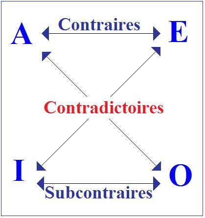
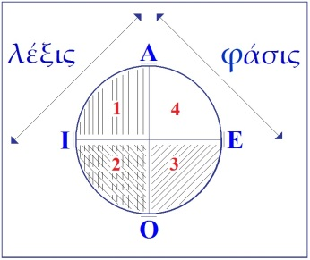
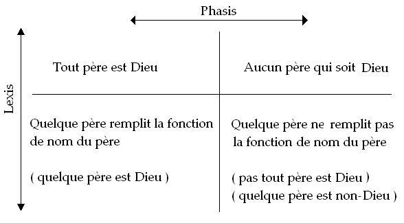

# Leçon 08 | 17 Janvier 1962

  

    <label><input type="checkbox" data-lacan-toggle="original" checked> 原文</label>
    <label><input type="checkbox" data-lacan-toggle="notes" checked> 注释</label>
    <label><input type="checkbox" data-lacan-toggle="commentary" checked> 个人解读评论</label>
  

  <form class="lacan-tool-search" role="search">
    <input class="lacan-tool-search-input" type="search" placeholder="搜索全文" aria-label="搜索全文">
    <button class="lacan-tool-button" type="submit" title="搜索">搜索</button>
  </form>
  <button class="lacan-tool-button lacan-back-to-top" type="button" title="回到页面最上方" aria-label="回到页面最上方">↑</button>

<section class="parallel-paragraph" data-paragraph-ids="s9-08-0001">

s9-08-0001

原文 · s9-08-0001

Je ne pense pas que - pour paradoxale que puisse apparaître au premier abord la symbolisation sur laquelle j’ai terminé mon discours la dernière fois, faisant supporter le sujet par le symbole mathématique du √-1 - je ne pense pas que tout pour vous puisse n’être là-dedans que pure surprise. Je veux dire qu’à se rappeler la démarche cartésienne elle-même, on ne peut oublier ce à quoi cette démarche mène son auteur.

[无对应译文]

</section>

<section class="parallel-paragraph" data-paragraph-ids="s9-08-0002">

s9-08-0002

原文 · s9-08-0002

Le voilà parti d’un bon pas vers la *vérité*. Plus encore, cette *vérité* n’est nullement - chez lui comme chez nous - mise en la parenthèse d’une dimension qui la distingue de *la réalité*. Cette *vérité* sur quoi DESCARTES s’avance de son pas conquérant, *c’est bien de celle de la chose qu’il s’agit*.

[无对应译文]

</section>

<section class="parallel-paragraph" data-paragraph-ids="s9-08-0003">

s9-08-0003

原文 · s9-08-0003

Et ceci nous mène à quoi ? À vider le monde jusqu’à n’en plus lais­ser que ce vide qui s’appelle « *l’étendue* ». Comment cela est-il possible ? Vous le savez, il va choisir comme exemple : faire fondre un bloc de cire. \[Cf. Descartes : *Méditation seconde*\] Est-ce par hasard qu’il choisit cette matière, si ce n’est parce qu’il y est entraîné, parce que c’est la matière idéale pour recevoir le sceau, la signature divine ?

[无对应译文]

</section>

<section class="parallel-paragraph" data-paragraph-ids="s9-08-0004">

s9-08-0004

原文 · s9-08-0004

Pourtant après cette opération quasi alchimique qu’il poursuit devant nous, il va la faire s’évanouir, se réduire à n’être plus que *l’étendue pure*, plus rien où puisse s’imprimer ce qui justement est élidé dans sa démarche : il n’y a plus de rapport entre le signifiant et aucune « *trace naturelle* », si je puis m’exprimer ainsi, et très nommément la trace naturelle par excellence qui constitue *l’imaginaire du corps*. Ce n’est pas dire justement que cet *imaginaire* puisse être radicalement repoussé, mais il est séparé du jeu du signifiant. Il est ce qu’il est : effet du corps, et comme tel récusé comme témoin d’aucune *vérité*. Rien à en faire que d’en vivre de cet *imaginaire* - théorie des passions - mais ne surtout pas penser avec.

[无对应译文]

</section>

<section class="parallel-paragraph" data-paragraph-ids="s9-08-0005">

s9-08-0005

原文 · s9-08-0005

L’homme pense avec un discours réduit aux évidences de ce qu’on appelle « *la lumière naturelle* », c’est-à-dire une algèbre, un groupe logistique qui dès lors aurait pu être autre si Dieu l’avait voulu (théorie des passions[^64]). Ce dont DESCARTES ne peut encore s’apercevoir, c’est que nous pouvons le vouloir à Sa place \[à la place de Dieu\] : c’est que quelque 150 ans après sa mort \[1650\] naît *la théorie des ensembles* - elle l’aurait comblé - où même les chiffres 1 et 0 ne sont que l’objet d’une définition littérale, d’une définition axiomatique pure­ment formelle, éléments neutres. Il aurait pu faire l’économie du Dieu véridique, le Dieu trompeur ne pouvant être que celui qui tricherait dans la résolution des équations elles-mêmes.

[无对应译文]

</section>

<section class="parallel-paragraph" data-paragraph-ids="s9-08-0006">

s9-08-0006

原文 · s9-08-0006

Mais personne n’a jamais vu ça : il n’y a pas de miracle de la combinatoire, si ce n’est le sens que nous lui donnons. C’est déjà suspect *chaque fois que nous lui donnons un sens*. *C’est pourquoi le Verbe existe, mais non pas le Dieu de* DESCARTES. Pour que le Dieu de DESCARTES existe, il faudrait que nous ayons un petit commencement de preuve de sa volonté créatrice à lui dans le domaine des mathématiques.

[无对应译文]

</section>

<section class="parallel-paragraph" data-paragraph-ids="s9-08-0007">

s9-08-0007

原文 · s9-08-0007

Or ce n’est pas lui qui a inventé *le transfini de Cantor*, c’est nous. C’est bien pourquoi l’histoire nous témoigne que les grands mathématiciens qui ont ouvert cet au-delà de la logique divine, EULER tout le premier, ont eu très peur. Ils savaient ce qu’ils faisaient : ils rencontraient, *non pas le vide de l’étendue* du pas cartésien - qui finalement, malgré PASCAL, ne fait plus peur à personne, parce qu’on s’encourage à aller l’habiter de plus en plus loin \- *mais le vide de l’Autre, lieu infiniment plus redoutable, puisqu’il y faut quelqu’un*.

[无对应译文]

</section>

<section class="parallel-paragraph" data-paragraph-ids="s9-08-0008">

s9-08-0008

原文 · s9-08-0008

C’est pourquoi, serrant de plus près la question du *sens du sujet* tel qu’il s’évoque dans *la méditation cartésienne*, je ne crois là rien faire, même si j’empiète sur un domaine tant de fois parcouru qu’il finit par paraître en deve­nir réservé à certains, je ne crois pas faire quelque chose dont ils puissent se désintéresser, ceux-là mêmes, pour autant que *la question est actuelle*, plus actuelle qu’aucune, et plus actualisée encore - je crois pouvoir vous le montrer - dans la psychanalyse qu’ailleurs.

[无对应译文]

</section>

<section class="parallel-paragraph" data-paragraph-ids="s9-08-0009">

s9-08-0009

原文 · s9-08-0009

Ce vers quoi je vais donc aujourd’hui vous ramener, c’est à une considération, non de l’origine, mais de *la position du sujet*. Pour autant qu’à la racine de l’acte de *la parole* il y a quelque chose, un moment où elle *s’insère dans une structure de langage*. Et que cette structure de langage, en tant qu’elle est caractérisée à ce point originel, j’essaie de la resserrer, de la définir autour d’une thématique qui, de façon imagée, s’incarne, est comprise, dans l’idée d’une contemporanéité ori­ginelle de l’écriture et du langage lui-même, en tant :

[无对应译文]

</section>

<section class="parallel-paragraph" data-paragraph-ids="s9-08-0010">

s9-08-0010

原文 · s9-08-0010

- que *l’écriture* est connota­tion signifiante,

[无对应译文]

</section>

<section class="parallel-paragraph" data-paragraph-ids="s9-08-0011">

s9-08-0011

原文 · s9-08-0011

- que *la parole ne la crée pas tant qu’elle ne la lit*,

[无对应译文]

</section>

<section class="parallel-paragraph" data-paragraph-ids="s9-08-0012">

s9-08-0012

原文 · s9-08-0012

- que la genèse du signifiant à un certain niveau du réel, qui est un de ses axes ou racines, c’est pour nous sans doute le principal à connoter la venue au jour des effets, dits « *effets de sens* ».

[无对应译文]

</section>

<section class="parallel-paragraph" data-paragraph-ids="s9-08-0013">

s9-08-0013

原文 · s9-08-0013

Dans ce rapport premier du sujet, dans ce qu’il projette derrière lui, *nach­träglich* par le seul fait de s’engager par sa parole - d’abord *balbutiante*, puis *ludique*, voire *confusionnelle* - dans le discours commun. Ce qu’il projette en arrière de son acte, c’est là que se produit ce quelque chose vers quoi nous avons le courage d’aller, pour l’interroger au nom de la formule « *Wo Es war, soll Ich werden* », que nous tendrions à pousser vers *une formule* très légèrement diffé­remment accentuée, dans le sens d’un « *étant ayant été* », d’un *Gewesen* qui subsiste pour autant que le sujet, s’y avançant, ne peut ignorer qu’il faut un travail de profond retournement de sa position pour qu’il puisse s’y saisir.

[无对应译文]

</section>

<section class="parallel-paragraph" data-paragraph-ids="s9-08-0014">

s9-08-0014

原文 · s9-08-0014

Déjà là, quelque chose nous dirige vers quelque chose qui, d’être inversé, nous suggère la remarque qu’à soi toute seule, dans son existence, *la négation* n’est pas, depuis toujours, sans receler *une question*. Qu’est-ce qu’elle suppose ? Suppose-t-elle l’affirmation sur laquelle elle s’appuie ? Sans doute. Mais cette affirmation, est­-ce bien, elle, seulement l’affirmation de quelque chose de réel qui serait simple­ment ôté ?

[无对应译文]

</section>

<section class="parallel-paragraph" data-paragraph-ids="s9-08-0015">

s9-08-0015

原文 · s9-08-0015

Ce n’est pas sans surprise - ce n’est pas non plus sans malice - que nous pouvons trouver, sous la plume de BERGSON, quelques lignes par lesquelles il s’élève contre toute idée de néant, position bien conforme à une pensée dans son fond attachée à une sorte de réalisme naïf :

[无对应译文]

</section>

<section class="parallel-paragraph" data-paragraph-ids="s9-08-0016">

s9-08-0016

原文 · s9-08-0016

> « *Il y a plus, et non pas moins, dans l’idée d’un objet conçu comme n’existant pas que dans l’idée de ce même objet conçu comme existant, car l’idée de l’objet n’existant pas est nécessairement l’idée de l’objet existant, avec en plus la représentation d’une exclusion de cet objet, par la réalité actuelle prise en bloc* »[^65].

[无对应译文]

</section>

<section class="parallel-paragraph" data-paragraph-ids="s9-08-0017">

s9-08-0017

原文 · s9-08-0017

*Est-ce ainsi que nous pouvons nous contenter de la situer ?* Pour un instant, portons notre attention vers *la négation* elle-même : *est-ce ainsi que nous pouvons nous contenter*, dans une simple expé­rience de son usage, de son emploi, *d’en situer les effets ?*

[无对应译文]

</section>

<section class="parallel-paragraph" data-paragraph-ids="s9-08-0018">

s9-08-0018

原文 · s9-08-0018

Vous mener à cet endroit par tous les chemins d’une enquête linguistique est quelque chose que nous ne pouvons nous refuser. Au reste, déjà nous sommes­-nous avancés dans ce sens, et si vous vous en souvenez bien, l’allusion a été faite ici dès longtemps aux remarques, certainement très suggestives sinon éclairantes, de PICHON et de DAMOURETTE[^66] dans leur collaboration à une grammaire fort riche et très féconde à considérer - grammaire spécialement de la langue française - dans laquelle leurs remarques viennent à pointer *qu’il n’y a pas* - disent-ils - à propre­ment parler *de négation en français*.

[无对应译文]

</section>

<section class="parallel-paragraph" data-paragraph-ids="s9-08-0019">

s9-08-0019

原文 · s9-08-0019

Ils entendent dire que cette forme, simplifiée à leur sens, de *l’ablation radicale* telle qu’elle s’exprime *à la chute de certaine phrase allemande,* j’entends à la chute, parce que c’est bien le terme *nicht* qui, à venir d’une façon surprenante à la conclusion d’une phrase poursuivie en registre positif, a permis à l’auditeur de rester jusqu’à son terme dans la plus parfaite indétermination, et foncièrement dans une position de créance, par ce *nicht* qui la rature, toute la signification de la phrase se trouve exclue.

[无对应译文]

</section>

<section class="parallel-paragraph" data-paragraph-ids="s9-08-0020">

s9-08-0020

原文 · s9-08-0020

Exclue de quoi ? Du champ de l’admissibilité de *la vérité*. PICHON remarque, non sans pertinence, que *la division*, *la schize*, la plus ordinaire en français *de la fonction de la négation, entre un* « *ne* » *d’une part, et un mot auxiliaire* : le « *pas* », le « *personne* », le « *rien* », le « *point* », le « *mie* », le « *goutte* », qui occupe une position dans la phrase énonciative, qui reste à préciser par rapport au « *ne* » nommé d’abord, que ceci nous suggère nommément, à regarder de près l’usage séparé qui peut en être fait, d’attribuer à l’une de ces fonctions une signification dite « *discordantielle* », à l’autre une signification « *exclusive* ».

[无对应译文]

</section>

<section class="parallel-paragraph" data-paragraph-ids="s9-08-0021">

s9-08-0021

原文 · s9-08-0021

*C’est jus­tement d’exclusion du réel que serait chargé le « pas », le « point »,* tandis que le « *ne* » exprimerait cette *dissonance*, parfois si subtile qu’elle n’est qu’une ombre, et nommément dans ce fameux « *ne* » dont vous savez que j’ai fait grand état[^67] pour essayer pour la première fois, justement, d’y montrer quelque chose comme *la trace du sujet de l’inconscient*, le « *ne* » dit « *explétif* », le « *ne* » de ce : « *Je crains qu’il ne vienne* ».

[无对应译文]

</section>

<section class="parallel-paragraph" data-paragraph-ids="s9-08-0022">

s9-08-0022

原文 · s9-08-0022

Vous touchez aussitôt du doigt qu’il ne veut rien dire d’autre que « *j’espé­rais qu’il vienne* ». Il exprime *la discordance de vos propres sentiments* à l’endroit de cette venue, il véhicule en quelque sorte la trace combien plus suggestive d’être incarnée dans son signifiant, puisque nous l’appelons en psychanalyse « ambivalence ».

[无对应译文]

</section>

<section class="parallel-paragraph" data-paragraph-ids="s9-08-0023">

s9-08-0023

原文 · s9-08-0023

« *Je crains qu’il ne vienne* » ce n’est pas tant exprimer l’ambiguïté de nos sentiments que, par cette surcharge, montrer combien, dans un certain type de relation, est capable de ressurgir, d’émerger, de se reproduire, de se marquer, en une béance, cette distinction du *sujet de l’acte d’énonciation* en tant que tel, par rapport au *sujet de l’énoncé*, même s’il n’est pas présent au niveau de l’énoncé d’une façon qui le désigne !

[无对应译文]

</section>

<section class="parallel-paragraph" data-paragraph-ids="s9-08-0024">

s9-08-0024

原文 · s9-08-0024

« *Je crains qu’il ne vienne* » : c’est un tiers. Que serait-ce, s’il était dit : « *je crains que je ne fasse* » ce qui ne se dit guère, encore que ce soit concevable ? Qui serait au niveau de l’énoncé ? Pourtant, ceci importe peu qu’il soit désignable - vous voyez d’ailleurs que je peux l’y faire rentrer - au niveau de l’énoncé. Et un sujet, masqué ou pas au niveau de l’énonciation, représenté ou non, nous amène à nous poser la question de la fonction du sujet, de sa forme, de ce qui le supporte, et à ne pas nous tromper : à ne pas croire que c’est simple­ment le « *je* » *shifter* qui, dans la formulation de l’énoncé, le désigne comme celui qui, dans l’instant qui définit le présent, porte la parole.

[无对应译文]

</section>

<section class="parallel-paragraph" data-paragraph-ids="s9-08-0025">

s9-08-0025

原文 · s9-08-0025

*Le sujet de l’énonciation a peut-être toujours un autre support*. Ce que j’ai articulé c’est que, bien plus, ce petit « *ne* », ici saisissable sous la forme *explétive*, c’est là que nous devons en reconnaître, à proprement parler dans un cas exem­plaire, le support. Et aussi bien ce n’est pas dire, bien sûr, non plus que dans ce phénomène d’exception nous devions reconnaître son support exclusif.

[无对应译文]

</section>

<section class="parallel-paragraph" data-paragraph-ids="s9-08-0026">

s9-08-0026

原文 · s9-08-0026

*L’usage de la langue va me permettre d’accentuer* devant vous d’une façon très banale, *non pas tant la distinction de* PICHON...

[无对应译文]

</section>

<section class="parallel-paragraph" data-paragraph-ids="s9-08-0027">

s9-08-0027

原文 · s9-08-0027

> à la vérité, je ne la crois pas soutenable jusqu’à son terme descriptif. Phénoménologiquement elle repose sur l’idée, pour nous inadmissible, qu’on puisse en quelque sorte fragmenter les mouve­ments de la pensée, néanmoins vous avez cette conscience linguistique qui vous permet tout de suite d’apprécier l’originalité du cas où vous avez seulement, où vous pouvez dans l’usage actuel de la langue - cela n’a pas toujours été ainsi : dans les temps archaïques, la forme que je vais maintenant formuler devant vous était la plus commune. Dans toutes les langues, une évolution se marque, comme d’un glissement, que les linguistes essaient de caractériser, des formes de la néga­tion. Le sens dans lequel *ce glissement* s’exerce, j’en dirai peut-être tout à l’heure la ligne générale, elle s’exprime sous la plume des spécialistes mais pour l’ins­tant prenons le simple exemple de ce qui s’offre à nous …tout simplement dans la distinction entre deux formules également admissibles, également reçues, égale­ment *expressives*, également communes : celle du « *je ne sais* » avec « *j’sais pas* ».

[无对应译文]

</section>

<section class="parallel-paragraph" data-paragraph-ids="s9-08-0028">

s9-08-0028

原文 · s9-08-0028

Vous voyez, je pense, tout de suite quelle en est la différence, différence d’accent. Ce « *je ne sais* » n’est pas sans quelque maniérisme : il est littéraire. Il vaut quand même mieux que « *Jeunes nations »*, mais il est du même ordre. Ce sont tous les deux MARIVAUX, sinon rivaux.

[无对应译文]

</section>

<section class="parallel-paragraph" data-paragraph-ids="s9-08-0029">

s9-08-0029

原文 · s9-08-0029

Ce qu’il exprime - ce « *je ne sais* » - c’est essentiellement quelque chose de tout à fait différent de l’autre code d’expression, celui du « *j’sais pas* » : il exprime l’oscillation, l’hésitation, voire le doute. Si j’ai évoqué MARIVAUX, ce n’est pas pour rien : il est la formule ordinaire sur la scène, où peuvent se for­muler les aveux voilés.

[无对应译文]

</section>

<section class="parallel-paragraph" data-paragraph-ids="s9-08-0030">

s9-08-0030

原文 · s9-08-0030

Auprès de ce « *je ne sais* », il faudrait s’amuser à orthogra­phier, avec l’ambiguïté donnée par mon jeu de mots, le « *j’sais pas* » : par l’assimilation qu’il subit du fait du voisinage du « *s* » inaugural du verbe, le « *j’* » du « *je* » qui devient un « *che* » aspirant qui est par là sifflante sourde, le « *ne* » ici avalé dispa­raît, toute la phrase vient reposer sur le « *pas* » lourd de l’occlusive qui la termine.

[无对应译文]

</section>

<section class="parallel-paragraph" data-paragraph-ids="s9-08-0031">

s9-08-0031

原文 · s9-08-0031

L’expression ne prendra son accent d’accentuation un peu dérisoire, voire populacière à l’occasion, justement que de son discord avec ce qu’il y aura d’exprimé alors. Le « *ch’sais pas* » *marque,* si je puis dire même, *le coup* de quelque chose où tout au contraire le sujet vient se collapser, s’aplatir :

[无对应译文]

</section>

<section class="parallel-paragraph" data-paragraph-ids="s9-08-0032">

s9-08-0032

原文 · s9-08-0032

- « *Comment ça t’est-il arrivé ?* » demande l’autorité, après quelque triste mésaventure, au responsable.

[无对应译文]

</section>

<section class="parallel-paragraph" data-paragraph-ids="s9-08-0033">

s9-08-0033

原文 · s9-08-0033

- « *Ch’sais pas.* »

[无对应译文]

</section>

<section class="parallel-paragraph" data-paragraph-ids="s9-08-0034">

s9-08-0034

原文 · s9-08-0034

C’est un trou, une béance qui s’ouvre, au fond de laquelle ce qui disparaît, s’engouffre, c’est le sujet lui–même.

[无对应译文]

</section>

<section class="parallel-paragraph" data-paragraph-ids="s9-08-0035">

s9-08-0035

原文 · s9-08-0035

Mais ici il n’apparaît plus dans son mouvement oscillatoire, dans le support qui lui est donné de son mouve­ment originel, mais tout au contraire sous une forme de constatation de son ignorance à proprement parler exprimée, assumée, plutôt projetée, constatée : quelque chose qui se présente comme un « *n’être pas là* » projeté sur une sur­face, sur un plan où il est comme tel reconnaissable. Et ce que nous approchons par cette voie dans ces remarques contrôlables de mille sortes, par toutes sortes d’autres exemples, c’est quelque chose dont au minimum nous devons retenir l’idée *d’un double versant*.

[无对应译文]

</section>

<section class="parallel-paragraph" data-paragraph-ids="s9-08-0036">

s9-08-0036

原文 · s9-08-0036

Est-ce que ce *double versant* est vraiment d’opposition, comme PICHON le laisse entendre ? Quant à l’appareil lui-même de la négation, est-ce qu’un examen plus poussé peut nous permettre de le résoudre ? Remarquons d’abord que le « *ne* » de ces deux termes a l’air d’y subir l’attraction de ce qu’on peut appeler le groupe de tête de la phrase, pour autant qu’il est saisi, supporté par la forme pronominale.

[无对应译文]

</section>

<section class="parallel-paragraph" data-paragraph-ids="s9-08-0037">

s9-08-0037

原文 · s9-08-0037

Ce peloton de tête, en fran­çais, est remarquable dans les formules qui l’accumulent, telles que : le « *je ne le* », « *je le lui* ». Ceci, groupé avant le verbe, n’est certainement pas sans refléter une profonde nécessité structurale. Que le « *ne* » vienne s’y agréger, je dirai que ce n’est pas là ce qui nous paraît le plus remarquable. Ce qui nous parait le plus remar­quable, c’est ceci : c’est qu’à venir s’y agréger, il en accentue ce que j’appellerai la *significantisation subjective*.

[无对应译文]

</section>

<section class="parallel-paragraph" data-paragraph-ids="s9-08-0038">

s9-08-0038

原文 · s9-08-0038

Remarquez en effet que ce n’est pas un hasard si c’est au niveau d’un « *je ne sais* », d’un « *je ne puis* », d’une certaine catégorie qui est celle des verbes où se situe, s’inscrit, la position subjective elle–même comme telle, que j’ai trouvé mon exemple d’emploi isolé de *ne.* Il y a en effet tout un registre de verbes dont l’usage est propre à nous faire remarquer que leur fonc­tion change profondément, d’être employés *à la première, ou à la seconde, ou à la troisième personne*.

[无对应译文]

</section>

<section class="parallel-paragraph" data-paragraph-ids="s9-08-0039">

s9-08-0039

原文 · s9-08-0039

Si je dis « *je crois qu’il va pleuvoir* »*, ceci ne distingue pas* - de mon énonciation qu’il va pleuvoir - *un acte de croyance*. « *Je crois qu’il va pleuvoir* » connote simplement le caractère contingent de ma prévision. Observez que les choses se modifient si je passe aux autres personnes :

[无对应译文]

</section>

<section class="parallel-paragraph" data-paragraph-ids="s9-08-0040">

s9-08-0040

原文 · s9-08-0040

- « *tu crois qu’il va pleuvoir » fait beaucoup plus appel à quelque chose : celui à qui je m’adresse, je fais appel à son témoignage,*

[无对应译文]

</section>

<section class="parallel-paragraph" data-paragraph-ids="s9-08-0041">

s9-08-0041

原文 · s9-08-0041

- « *il croit qu’il va pleuvoir* » donne de plus en plus de poids à l’adhésion du sujet à sa créance.

[无对应译文]

</section>

<section class="parallel-paragraph" data-paragraph-ids="s9-08-0042">

s9-08-0042

原文 · s9-08-0042

L’introduction du « *ne *» sera toujours facile quand il vient s’adjoindre à ces *trois supports pronominaux* de ce verbe qui a ici fonc­tion variée : au départ, de la nuance énonciative jusqu’à l’énoncé d’une position du sujet, le poids du « *ne* » sera toujours pour le ramener vers la nuance énoncia­tive. « *Je ne crois pas qu’il va pleuvoir* », c’est encore plus lié au caractère de *sug­gestion dispositionnelle* qui est la mienne. Cela peut n’avoir absolument rien à faire avec une non-croyance, mais simplement avec ma bonne humeur. « *Je ne crois pas qu’il va pleuvoir* », « *je ne crois pas qu’il pleuve* » cela veut dire que les choses me paraissent pas trop mal se présenter.

[无对应译文]

</section>

<section class="parallel-paragraph" data-paragraph-ids="s9-08-0043">

s9-08-0043

原文 · s9-08-0043

De même, à l’adjoindre aux deux autres formulations - ce qui d’ailleurs va distinguer deux autres *personnes -* le « *ne* » tendra à « *je-iser* » ce dont, dans les autres formules, il s’agit : « *tu ne crois pas qu’il va pleu­voir* »,« *il ne croit pas qu’il doive pleuvoir* », c’est bien en tant que... c’est bien attirés vers le « *je* » qu’ils seront, par le fait que c’est avec l’adjonction de cette *petite par­ticule négative* qu’ils sont ici introduits dans le premier membre de la phrase.

[无对应译文]

</section>

<section class="parallel-paragraph" data-paragraph-ids="s9-08-0044">

s9-08-0044

原文 · s9-08-0044

Est-ce à dire qu’en face nous devions faire du « *pas* » quelque chose qui, tout bru­talement, connote le pur et simple fait de la privation ? Ce serait assurément la tendance de l’analyse de PICHON, pour autant qu’il en trouve en effet, à grouper les exemples, à donner toutes *les apparences*. En fait je ne le crois pas, pour des raisons qui tiennent d’abord à l’origine même des signifiants dont il s’agit.

[无对应译文]

</section>

<section class="parallel-paragraph" data-paragraph-ids="s9-08-0045">

s9-08-0045

原文 · s9-08-0045

Sûrement, nous avons la genèse historique de leur forme d’introduction dans le langage. *Originellement*, « *je n’y vais pas* » peut s’accentuer par une virgule :

[无对应译文]

</section>

<section class="parallel-paragraph" data-paragraph-ids="s9-08-0046">

s9-08-0046

原文 · s9-08-0046

- « *je n’y vais, pas un seul pas* » si je puis dire,

[无对应译文]

</section>

<section class="parallel-paragraph" data-paragraph-ids="s9-08-0047">

s9-08-0047

原文 · s9-08-0047

- « *je n’y vois point, même pas d’un point* »,

[无对应译文]

</section>

<section class="parallel-paragraph" data-paragraph-ids="s9-08-0048">

s9-08-0048

原文 · s9-08-0048

- « *je n’y trouve goutte* », *il n’en reste mie* ».

[无对应译文]

</section>

<section class="parallel-paragraph" data-paragraph-ids="s9-08-0049">

s9-08-0049

原文 · s9-08-0049

Il s’agit bien de quelque chose qui, *loin d’être* dans son origine *la connotation d’un trou d’absence, exprime bien au contraire* *la réduction, la disparition sans doute, mais non achevée, laissant derrière elle le sillage du trait le plus petit, le plus évanouissant*.

[无对应译文]

</section>

<section class="parallel-paragraph" data-paragraph-ids="s9-08-0050">

s9-08-0050

原文 · s9-08-0050

En fait ces mots faciles à res­tituer à *leur valeur positive*, au point qu’ils sont couramment encore employés avec cette valeur, reçoivent bien leur charge négative du glissement qui se pro­duit vers eux de la fonction du « *ne* ». Et même si le « *ne* » *est élidé*, c’est bien sur eux, de sa charge qu’il s’agit dans la fonction qu’il exerce.

[无对应译文]

</section>

<section class="parallel-paragraph" data-paragraph-ids="s9-08-0051">

s9-08-0051

原文 · s9-08-0051

Quelque chose si l’on peut dire, *de la réciprocité*, disons, *de ce « pas » et de ce « ne »* nous sera apporté par ce qui se passe quand nous inversons *leur ordre* dans l’énoncé de la phrase. Nous disons, *exemple de logique* : « *Pas un homme qui ne mente* ». C’est bien là le « *pas* » qui ouvre le feu. Ce que j’entends ici désigner, vous faire saisir, c’est que le « *pas* », pour ouvrir la phrase, ne joue absolument pas la même fonction qui lui serait attribuable - aux dires de PICHON - si celle-ci était celle qui s’exprime dans la for­mule suivante, j’arrive et je constate : « *Il n’y a ici pas un chat.* »

[无对应译文]

</section>

<section class="parallel-paragraph" data-paragraph-ids="s9-08-0052">

s9-08-0052

原文 · s9-08-0052

Entre nous, laissez-moi vous signaler au passage la valeur éclairante, privilé­giée, voire redoutable de l’usage même d’un tel mot : « *pas un chat* ». Si nous avions à faire le catalogue des moyens d’expression de la négation, je proposerais que nous mettions à la rubrique ce type de mots pour devenir comme un support de la négation. Ils ne sont pas du tout sans constituer une catégorie spéciale. Qu’est­–ce que « *le chat* » a à faire dans la question ? Mais laissons cela pour le moment.

[无对应译文]

</section>

<section class="parallel-paragraph" data-paragraph-ids="s9-08-0053">

s9-08-0053

原文 · s9-08-0053

« *Pas un homme qui ne mente* » montre sa différence avec ce concert de carences : *quelque chose* qui est tout à fait à un autre niveau et qui est suffisamment indi­qué par l’emploi du *subjonctif*. Le « *pas un homme qui ne mente* » est du même niveau *qui motive, qui définit* toutes *les formes les plus discordantielle* - pour employer le terme de PICHON - que nous puissions attribuer au « *ne* » : depuis le : « *je crains qu’il ne vienne* », jusque le : « *avant qu’il ne vienne* », jusqu’au  : « *plus petit que je ne le croyais* », ou encore : « *il y a longtemps que le ne l’ai vu* », qui posent - je vous le dis au passage - toutes sortes de questions que je suis pour l’instant forcé de lais­ser de côté.

[无对应译文]

</section>

<section class="parallel-paragraph" data-paragraph-ids="s9-08-0054">

s9-08-0054

原文 · s9-08-0054

Je vous fais remarquer en passant ce que supporte une formule comme « *il y a longtemps que je ne l’ai vu » : vous ne pouvez pas le dire à propos d’un mort*, ni d’un disparu. « *il y a longtemps que je ne l’ai vu* » suppose que la pro­chaine rencontre est toujours possible. Vous voyez avec quelle prudence l’examen, l’investigation de ces termes doit être maniée.

[无对应译文]

</section>

<section class="parallel-paragraph" data-paragraph-ids="s9-08-0055">

s9-08-0055

原文 · s9-08-0055

Et c’est pourquoi, au moment de tenter d’exposer, non pas la dicho­tomie, mais un tableau général des caractères divers de la négation dans laquelle notre expérience nous apporte des entrées de matrice autrement plus riches que tout ce qui s’était fait au niveau des philosophes, depuis ARISTOTE jusqu’à KANT, et vous savez comment elles s’appellent, ces entrées de matrices : *privation*, *frus­tration*, *castration* [^68]. C’est elles que nous allons essayer de reprendre, pour les confronter avec *le support signifiant de la négation* tel que nous pouvons essayer de l’identifier.

[无对应译文]

</section>

<section class="parallel-paragraph" data-paragraph-ids="s9-08-0056">

s9-08-0056

原文 · s9-08-0056

« *Pas un homme qui ne mente* ».

[无对应译文]

</section>

<section class="parallel-paragraph" data-paragraph-ids="s9-08-0057">

s9-08-0057

原文 · s9-08-0057

Qu’est–ce que nous suggère cette formule ?

[无对应译文]

</section>

<section class="parallel-paragraph" data-paragraph-ids="s9-08-0058">

s9-08-0058

原文 · s9-08-0058

« *Homo mendax* », ce jugement, cette proposition que je vous présente sous la forme type de *l’affirmative universelle*, à laquelle vous savez peut-être que dans mon tout premier séminaire de cette année j’avais déjà fait allusion, à propos de l’usage classique du syllogisme : « *tout homme est mortel,* SOCRATE *etc.* » avec ce que j’ai connoté au passage de sa fonction transférentielle.

[无对应译文]

</section>

<section class="parallel-paragraph" data-paragraph-ids="s9-08-0059">

s9-08-0059

原文 · s9-08-0059

Je crois que quelque chose peut nous être apporté dans l’approche de cette fonction de la négation, au niveau de son usage originel, radical, par la considération du sys­tème formel des propositions telles qu’ARISTOTE[^69] les a classées dans les catégories dites :

[无对应译文]

</section>

<section class="parallel-paragraph" data-paragraph-ids="s9-08-0060">

s9-08-0060

原文 · s9-08-0060

- de *l’universelle* *affirmative* \[**A**\] et *négative* \[**E**\],

[无对应译文]

</section>

<section class="parallel-paragraph" data-paragraph-ids="s9-08-0061">

s9-08-0061

原文 · s9-08-0061

- et de *la particulière* dite également *affirmative* \[**I**\] et *négative* \[**O**\].

[无对应译文]

</section>

<section class="parallel-paragraph" data-paragraph-ids="s9-08-0062">

s9-08-0062

原文 · s9-08-0062

Disons-le de suite : ce sujet dit de l’oppo­sition des propositions - origine chez ARISTOTE de toute son analyse, de toute sa mécanique du syllogisme - n’est pas sans présenter, malgré l’apparence, les plus nombreuses difficultés. Dire que les développements de la logistique la plus moderne ont éclairé ces difficultés serait très certainement dire quelque chose contre quoi toute l’histoire s’inscrit en faux. Bien au contraire, la seule chose qu’elle peut faire apparaître étonnante, c’est l’apparence d’uniformité dans l’adhésion, que ces formules dites *aristotéliciennes* ont rencontrée jusqu’à KANT, puisque KANT gardait l’illusion que c’était là un édifice inattaquable.

[无对应译文]

</section>

<section class="parallel-paragraph" data-paragraph-ids="s9-08-0063">

s9-08-0063

原文 · s9-08-0063

Assurément ce n’est pas rien, de pouvoir par exemple, faire remarquer que l’accentuation de leur fonction *affirmative* \[**A**\] et *négative* \[**E**\] *n’est pas articulée comme telle dans* ARISTOTE *lui-même*, et que c’est beaucoup plus tard, avec [AVERROÈS](http://fr.wikipedia.org/wiki/Averro%C3%A8s)[^70] probable­ment, qu’il convient d’en marquer l’origine. C’est vous dire qu’aussi bien les choses ne sont pas aussi simples, quand il s’agit de leur appréciation. Pour ceux à qui besoin est de faire un rappel de la fonction de ces proposi­tions, je vais les rappeler brièvement.

[无对应译文]

</section>

<section class="parallel-paragraph" data-paragraph-ids="s9-08-0064">

s9-08-0064

原文 · s9-08-0064

– **A** –

[无对应译文]

</section>

<section class="parallel-paragraph" data-paragraph-ids="s9-08-0065">

s9-08-0065

原文 · s9-08-0065

*Homo mendax* - puisque c’est ce que j’ai choisi pour introduire ce rappel, prenons-le donc - *homo* et même *omnis homo, omnis homo mendax : tout homme est menteur*. La connotation du πᾶς \[pan\] dans ARISTOTE pour désigner la fonction de *l’universel*.

[无对应译文]

</section>

<section class="parallel-paragraph" data-paragraph-ids="s9-08-0066">

s9-08-0066

原文 · s9-08-0066

– **E** –

[无对应译文]

</section>

<section class="parallel-paragraph" data-paragraph-ids="s9-08-0067">

s9-08-0067

原文 · s9-08-0067

Quelle est la formule négative ? Selon une forme qui porte, et en beaucoup de langues, *omnis homo non men­dax* peut suffire. Je veux dire que *omnis homo non men­dax* veut dire que de tout homme il est vrai qu’il ne soit pas menteur. Néanmoins, pour la clarté, c’est le terme *nullus* que nous employons, *nullus homo mendax.* Voilà ce qui est connoté habituellement par la lettre, *respectivement* A et E, *de l’universelle affirmative et de l’universelle négative. Que va-t-il se passer au niveau des* *affirmatives particulières* ? Puisque nous nous intéressons à la négative, c’est sous une forme négative que nous allons pouvoir ici les introduire.

[无对应译文]

</section>

<section class="parallel-paragraph" data-paragraph-ids="s9-08-0068">

s9-08-0068

原文 · s9-08-0068

– **O** –

[无对应译文]

</section>

<section class="parallel-paragraph" data-paragraph-ids="s9-08-0069">

s9-08-0069

原文 · s9-08-0069

*Non omnis homo mendax *: *ce n’est pas tout homme qui est menteur.* Autrement dit je choisis et je constate qu’il y a des hommes qui ne sont pas menteurs.

[无对应译文]

</section>

<section class="parallel-paragraph" data-paragraph-ids="s9-08-0070">

s9-08-0070

原文 · s9-08-0070

– **I** –

[无对应译文]

</section>

<section class="parallel-paragraph" data-paragraph-ids="s9-08-0071">

s9-08-0071

原文 · s9-08-0071

En somme, ceci ne veut pas dire que quiconque, *aliquis,* ne puisse être menteur : *aliquis homo mendax,* telle est *la particulière affirmative* habituellement désignée dans la notation classique par la lettre **I**. Ici, *la négative particulière* \[**O**\] sera - le *non omnis* étant ici résumé par *nullus - non nullus homo non mendax *: *il n’y a pas aucun homme qui ne soit pas menteur*. En d’autres termes, dans toute la mesure où nous avions choisi ici de dire que *pas tout homme n’était menteur* \[**O**\], ceci l’exprime d’une autre façon, à savoir que : *ce n’est pas aucun qu’il y ait à être non menteur.*

[无对应译文]

</section>

<section class="parallel-paragraph" data-paragraph-ids="s9-08-0072">

s9-08-0072

原文 · s9-08-0072

Les termes ainsi organisés se distin­guent, dans la théorie classique, par les formules suivantes qui les mettent réci­proquement en positions dites de *contraires ou* de *subcontraires* :

[无对应译文]

</section>

<section class="parallel-paragraph" data-paragraph-ids="s9-08-0073">

s9-08-0073

原文 · s9-08-0073

[无对应译文]

</section>

<section class="parallel-paragraph" data-paragraph-ids="s9-08-0074">

s9-08-0074

原文 · s9-08-0074

C’est-à-dire que *les propositions universelles* **A** et **E** s’opposent à leur propre niveau comme ne sachant et ne pouvant être vraies en même temps :

[无对应译文]

</section>

<section class="parallel-paragraph" data-paragraph-ids="s9-08-0075">

s9-08-0075

原文 · s9-08-0075

- il ne peut en même temps être vrai que tout homme puisse être menteur, et que nul homme ne puisse être men­teur, alors que toutes les autres combinaisons sont possibles.

[无对应译文]

</section>

<section class="parallel-paragraph" data-paragraph-ids="s9-08-0076">

s9-08-0076

原文 · s9-08-0076

- Il ne peut en même temps être faux qu’il y ait des hommes menteurs et des hommes non menteurs.

[无对应译文]

</section>

<section class="parallel-paragraph" data-paragraph-ids="s9-08-0077">

s9-08-0077

原文 · s9-08-0077

L’opposition dite *contradictoire* est celle par laquelle les propositions situées dans chacun de ces quadrants s’opposent diagonalement \[A↔O et E↔I\] en ceci que chacune exclut :

[无对应译文]

</section>

<section class="parallel-paragraph" data-paragraph-ids="s9-08-0078">

s9-08-0078

原文 · s9-08-0078

- étant vraie, la vérité de celle qui lui est opposée au titre de contradictoire,

[无对应译文]

</section>

<section class="parallel-paragraph" data-paragraph-ids="s9-08-0079">

s9-08-0079

原文 · s9-08-0079

- et étant fausse, exclut la fausseté de celle qui lui est opposée à titre de contradictoire.

[无对应译文]

</section>

<section class="parallel-paragraph" data-paragraph-ids="s9-08-0080">

s9-08-0080

原文 · s9-08-0080

S’il y a des hommes menteurs \[**I**\], ceci *n’est pas compatible* avec le fait que nul homme ne soit menteur \[**E**\]. Inversement, le rapport est le même de *la particulière négative* \[**O**\], avec *l’affirmative* \[**A**\].

[无对应译文]

</section>

<section class="parallel-paragraph" data-paragraph-ids="s9-08-0081">

s9-08-0081

原文 · s9-08-0081

Qu’est-ce que je vais vous proposer, pour vous faire sentir ce qui, au niveau du texte aristotélicien, se présente toujours comme ce qui s’est développé dans l’histoire, d’*embarras* autour de la définition comme telle de l’universelle ? Observez d’abord que si ici je vous ai introduit le *non omnis homo mendax* \[**O**\], le « *pas tout* », le terme « *pas* » portant sur la notion du « *tout* » comme définissant la particulière.

[无对应译文]

</section>

<section class="parallel-paragraph" data-paragraph-ids="s9-08-0082">

s9-08-0082

原文 · s9-08-0082

Ça n’est pas que ceci soit *légitime*, car précisément ARISTOTE s’y oppose d’une façon qui est *contraire à tout le développement* qu’a pu prendre ensuite la spéculation sur *la logique formelle*, à savoir un développement, une explication « *en extension* » faisant intervenir la carcasse symbolisable par *un cercle*, par *une zone dans laquelle les objets constituant son support sont rassemblés*.

[无对应译文]

</section>

<section class="parallel-paragraph" data-paragraph-ids="s9-08-0083">

s9-08-0083

原文 · s9-08-0083

ARISTOTE, très pré­cisément avant les *Premiers analytiques*[^71], tout au moins dans l’ouvrage qui anté­cède dans le groupement de ses œuvres - mais qui apparemment l’antécède logiquement sinon chronologiquement - qui s’appelle *De l’interprétation*[^72], fait remarquer que - et non sans avoir provoqué l’étonnement des historiens - *ce n’est pas sur la qualification de l’universalité que doit porter la négation*. C’est donc bien d’un « *quelqu’homme* », *aliquis*, qu’il s’agit, et d’un « *quelqu’homme* » que nous devons interroger comme tel. La qualification donc, *de l’omnis, de l’omnitude, de la parité* *de la catégorie universelle, est ici ce qui est en cause.*

[无对应译文]

</section>

<section class="parallel-paragraph" data-paragraph-ids="s9-08-0084">

s9-08-0084

原文 · s9-08-0084

Est-ce que c’est quelque chose qui soit du même niveau, du niveau d’exis­tence de ce qui peut supporter ou ne pas supporter *l’affirmation* ou *la négation* ?

[无对应译文]

</section>

<section class="parallel-paragraph" data-paragraph-ids="s9-08-0085">

s9-08-0085

原文 · s9-08-0085

Est-ce qu’il y a *homogénéité* entre ces deux niveaux ? Autrement dit, est-ce que c’est de quelque chose qui simplement suppose *la collection* comme réalisée qu’il s’agit, dans la différence qu’il y a de *l’Universelle* à *la Particulière* ?

[无对应译文]

</section>

<section class="parallel-paragraph" data-paragraph-ids="s9-08-0086">

s9-08-0086

原文 · s9-08-0086

Bouleversant la portée de ce que le suis en train d’essayer de vous expliquer, je vais vous proposer quelque chose, quelque chose qui est fait en quelque sorte pour répondre à quoi ? À la question *qui lie*, justement, *la définition du sujet* comme tel *à celle de l’ordre d’affirmation ou de négation* dans lequel il entre dans l’opération de cette *division propositionnelle*.

[无对应译文]

</section>

<section class="parallel-paragraph" data-paragraph-ids="s9-08-0087">

s9-08-0087

原文 · s9-08-0087

Dans *l’enseignement clas­sique de la logique formelle*, il est dit - et si l’on recherche à qui ça remonte, je vais vous le dire, ce n’est pas sans être quelque peu piquant - il est dit que :

[无对应译文]

</section>

<section class="parallel-paragraph" data-paragraph-ids="s9-08-0088">

s9-08-0088

原文 · s9-08-0088

- *le* *sujet* est pris sous l’angle de *la qualité*,

[无对应译文]

</section>

<section class="parallel-paragraph" data-paragraph-ids="s9-08-0089">

s9-08-0089

原文 · s9-08-0089

- et que *l’attribut*, que vous voyez ici incarné par le terme *mendax,* est pris sous l’angle de *la quantité*. Autrement dit, dans l’*Un* ils sont tous, ils sont plusieurs, voire il y en a **1**. C’est ce que KANT[^73] conserve encore, au niveau de la *Critique de la Raison pure,* dans la division ternaire. Ce n’est pas sans soulever, de la part des *linguistes*, de grosses objections.

[无对应译文]

</section>

<section class="parallel-paragraph" data-paragraph-ids="s9-08-0090">

s9-08-0090

原文 · s9-08-0090

Quand on regarde les choses historiquement, on s’aperçoit que cette distinction *qualité*­-*quantité* a une origine : elle apparaît pour la première fois dans un petit traité, paradoxalement sur les doctrines de PLATON, et cela...

[无对应译文]

</section>

<section class="parallel-paragraph" data-paragraph-ids="s9-08-0091">

s9-08-0091

原文 · s9-08-0091

> c’est au contraire l’énoncé aristotélicien de la logique formelle qui est reproduit, d’une façon abré­gée, mais non sans période didactique, et l’auteur n’est ni plus ni moins qu’[APULÉE](http://gallica.bnf.fr/ark:/12148/bpt6k524415.capture), l’auteur d’un traité sur PLATON ...se trouve avoir ici une singulière fonction historique, à savoir d’avoir introduit une catégorisation, celle de *la quantité* et de *la qualité* \[...\].

[无对应译文]

</section>

<section class="parallel-paragraph" data-paragraph-ids="s9-08-0092">

s9-08-0092

原文 · s9-08-0092

Voici en effet le modèle autour duquel je vous propose pour aujourd’hui de centrer votre réflexion.

[无对应译文]

</section>

<section class="parallel-paragraph" data-paragraph-ids="s9-08-0093">

s9-08-0093

原文 · s9-08-0093

[无对应译文]

</section>

<section class="parallel-paragraph" data-paragraph-ids="s9-08-0094">

s9-08-0094

原文 · s9-08-0094

- Voici un qua­drant \[1\] dans lequel nous allons mettre des traits verticaux. la fonction « *trait* » va remplir celle du « *sujet* », et la fonction « *ver­tical* », qui est d’ailleurs choisie simplement comme support, celle d’« *attribut* ». J’aurais bien pu dire que je prenais comme « *attribut* » le terme « *unaire* », mais pour le côté représentatif et imaginable de ce que j’ai à vous montrer, je les mets ver­ticaux.

[无对应译文]

</section>

<section class="parallel-paragraph" data-paragraph-ids="s9-08-0095">

s9-08-0095

原文 · s9-08-0095

- Ici \[2\], nous avons un segment de cadran où il y a des traits verticaux mais aussi des traits obliques.

[无对应译文]

</section>

<section class="parallel-paragraph" data-paragraph-ids="s9-08-0096">

s9-08-0096

原文 · s9-08-0096

- ici\[3\] il n’y a que des traits obliques,

[无对应译文]

</section>

<section class="parallel-paragraph" data-paragraph-ids="s9-08-0097">

s9-08-0097

原文 · s9-08-0097

- et ici \[4\] il n’y a pas de trait.

[无对应译文]

</section>

<section class="parallel-paragraph" data-paragraph-ids="s9-08-0098">

s9-08-0098

原文 · s9-08-0098

Ce que ceci est destiné à illustrer, c’est que la distinction *universelle* ≠ *particulière*, en tant qu’elle forme un couple distinct de l’opposition *affirmative* ≠ *négative*, est à considérer comme un registre tout différent de celui, qu’avec plus ou moins d’adresse des commentateurs à partir d’APULÉE, ont cru devoir développer dans ces formules si ambiguës, glissantes et confusionnelles qui s’appellent respectivement *la qualité* et *la quantité*, et de l’opposer en ces termes.

[无对应译文]

</section>

<section class="parallel-paragraph" data-paragraph-ids="s9-08-0099">

s9-08-0099

原文 · s9-08-0099

Nous appellerons l’opposition *universelle* ≠ *particulière* une opposition de l’ordre de la λέξις \[lexis\], ce qui est pour nous \- λέγω \[lego\], *je lis,* aussi bien : *je choisis -* très exactement liée à cette fonction d’extraction, de choix signifiant, qui est ce sur quoi pour l’instant, le terrain, la passerelle sur laquelle nous sommes en train de nous avancer.

[无对应译文]

</section>

<section class="parallel-paragraph" data-paragraph-ids="s9-08-0100">

s9-08-0100

原文 · s9-08-0100

C’est pour la distinguer de la ϕάσις \[phasis\], c’est-à-dire de quelque chose qui ici se propose comme *une parole* par où, oui ou non, je m’engage quant à l’existence de ce quelque chose qui est mis en cause par la λέξις première. Et en effet, vous allez le voir, de quoi est-ce que je vais pouvoir dire « *tout trait est vertical* » ? Bien sûr, du pre­mier secteur du cadran \[1\], mais, observez-le, aussi du secteur vide \[4\] : si je dis « *tout trait est vertical* », ça veut dire : *quand il n’y a pas de verticale,* *il n’y a pas de trait*. En tout cas c’est illustré par *le secteur vide du cadran*, non seulement le sec­teur vide ne contredit pas, n’est pas contraire à l’affirmation « *tout trait est vertical* », mais *il l’illustre* : il n’y a nul trait qui ne soit vertical dans ce secteur du cadran. Voici donc illustrée par les deux premiers secteurs \[1 et 4\]*l’affirmative universelle*.

[无对应译文]

</section>

<section class="parallel-paragraph" data-paragraph-ids="s9-08-0101">

s9-08-0101

原文 · s9-08-0101

*La négative universelle* va être illustrée par les deux secteurs de droite \[3 et 4\], mais ce dont il s’agit là se formulera par l’articulation suivante : « *nul trait n’est vertical* ». Il n’y a là, dans ces deux secteurs, nul trait vertical.

[无对应译文]

</section>

<section class="parallel-paragraph" data-paragraph-ids="s9-08-0102">

s9-08-0102

原文 · s9-08-0102

[无对应译文]

</section>

<section class="parallel-paragraph" data-paragraph-ids="s9-08-0103">

s9-08-0103

原文 · s9-08-0103

Ce qui est à remar­quer, c’est le secteur commun \[4\] que recouvrent ces deux propositions qui, selon la formule, la doctrine classique, en apparence ne sauraient être vraies en même temps. Qu’est-ce que nous allons trouver, suivant notre mouvement gira­toire qui a ainsi fort bien commencé, ici \[O\], comme formule, ainsi qu’ici \[1\], pour désigner les deux autres groupements possibles deux par deux des quadrants ?

[无对应译文]

</section>

<section class="parallel-paragraph" data-paragraph-ids="s9-08-0104">

s9-08-0104

原文 · s9-08-0104

Ici \[1\], nous allons voir le vrai de ces deux quadrants sous une forme affirmative : « *il y a*... » je le dis d’une façon *phasique*, je constate l’*existence* de traits verticaux : « il *y a des traits verticaux* », « *il y a quelques traits verticaux* », que je peux trouver soit ici \[1\] toujours, soit ici \[2\] dans les bons cas. Ici, si nous essayons de définir la distinction de *l’universelle* et de *la particulière*, nous voyons quels sont les deux secteurs \[2 et 3\] qui répondent à l’énonciation *particulière* \[O\], là « il y *a des traits non verticaux* », *non nulli non verticales.*

[无对应译文]

</section>

<section class="parallel-paragraph" data-paragraph-ids="s9-08-0105">

s9-08-0105

原文 · s9-08-0105

De même que tout à l’heure nous avons été un instant suspendus à l’ambiguïté de *cette répétition de la négation*, le « *non, non* », la prétendue annulation de la première négation par la deuxième négation, est très loin d’être *équivalent* forcément au « *oui* », et c’est quelque chose vers quoi nous aurons à revenir dans la suite. Qu’est-ce que cela veut dire ? Quel est l’intérêt pour nous de nous servir d’un tel appareil ? Pourquoi est-ce que j’essaie pour vous de détacher ce plan de *la* λέξις du plan de *la* ϕάσις ? Je vais y aller tout de suite, et pas par quatre che­mins, et je vais l’illustrer.

[无对应译文]

</section>

<section class="parallel-paragraph" data-paragraph-ids="s9-08-0106">

s9-08-0106

原文 · s9-08-0106

[无对应译文]

</section>

<section class="parallel-paragraph" data-paragraph-ids="s9-08-0107">

s9-08-0107

原文 · s9-08-0107

Qu’est-ce que nous pouvons dire, nous analystes ? Qu’est-ce que FREUD nous enseigne ? Puisque le sens en a été complètement perdu de ce qu’on appelle « *pro­position universelle »,* depuis justement une formulation dont on peut mettre la tête de chapitre à la formulation eulérienne qui arrive à nous représenter toutes les fonctions du syllogisme par une série de petits *cercles*, soit s’excluant les uns les autres, se recoupant, s’intersectant, en d’autres termes et à proprement par­ler *en extension,* à quoi on oppose la *compréhension* qui serait distinguée sim­plement par je ne sais quelle inévitable manière de comprendre. De comprendre quoi ? Que le cheval est blanc ? Qu’est-ce qu’il y a à comprendre ? Ce que nous apportons qui renouvelle la question, c’est ceci : je dis que FREUD promulgue, avance la formule qui est la suivante : « *Le père est Dieu* » ou « *Tout père est Dieu* ».

[无对应译文]

</section>

<section class="parallel-paragraph" data-paragraph-ids="s9-08-0108">

s9-08-0108

原文 · s9-08-0108

[无对应译文]

</section>

<section class="parallel-paragraph" data-paragraph-ids="s9-08-0109">

s9-08-0109

原文 · s9-08-0109

Il en résulte, si nous maintenons cette proposition au niveau *universel*, celle qu’« *Il* *n’y a d’autre père que Dieu* », lequel d’autre part, quant à l’existence, est dans la réflexion freudienne plutôt *aufgehoben,* plutôt *mis en suspension*, voire en doute radical. Ce dont il s’agit, c’est que l’ordre de fonction que nous introdui­sons avec le *Nom du Père* est ce *quelque chose* qui, à la fois a sa valeur *univer­selle*, mais qui vous remet à vous, à l’autre, la charge de contrôler s’il y a un père ou non de cet acabit. *S’il n’y en a pas, il est toujours vrai que le père soit Dieu*.

[无对应译文]

</section>

<section class="parallel-paragraph" data-paragraph-ids="s9-08-0110">

s9-08-0110

原文 · s9-08-0110

Simplement, la for­mule n’est confirmée que par le secteur vide \[4\] du cadran, moyennant quoi, au niveau de la ϕάσις, nous avons : « *il y a des pères qui... *» remplissent plus ou moins *la fonction symbolique* que nous venons de... d’énoncer \[*sic*\] comme telle, comme étant celle du *Nom du Père *: « *il y en a qui...* », et « *il y en a qui... pas* ».

[无对应译文]

</section>

<section class="parallel-paragraph" data-paragraph-ids="s9-08-0111">

s9-08-0111

原文 · s9-08-0111

Mais qu’il y en ait « *qui... pas* » qui soient « *pas* » dans tous les cas, ce qui ici est supporté par ce secteur \[3\], c’est exac­tement la même chose qui nous donne appui et base à *la fonction universelle du Nom du Père*, car, groupé avec le secteur dans lequel il n’y a rien \[4\], c’est juste­ment ces deux secteurs, pris au niveau de la λέξις, qui se trouvent, en raison de celui-ci, de ce secteur supporté qui complémente l’autre, qui donnent sa pleine portée à ce que nous pouvons énoncer comme *affirmation universelle*.

[无对应译文]

</section>

<section class="parallel-paragraph" data-paragraph-ids="s9-08-0112">

s9-08-0112

原文 · s9-08-0112

Je vais l’illustrer autrement, puisque aussi bien jusqu’à un certain point la question a pu être posée de sa valeur, je parle par rapport à un enseignement tra­ditionnel, qui doit être ce que j’ai apporté la dernière fois concernant le *petit i.*

[无对应译文]

</section>

<section class="parallel-paragraph" data-paragraph-ids="s9-08-0113">

s9-08-0113

原文 · s9-08-0113

Ici, les professeurs discutent : « *Qu’est-ce que nous allons dire ?* ». Le professeur - celui qui enseigne - doit *enseigner quoi* ? Ce que d’autres ont enseigné avant lui. C’est-à-dire qu’il se fonde sur quoi ? Sur ce qui a déjà subi une certaine λέξις. Ce qui résulte de toute λέξις, c’est justement ce qui nous importe en l’occasion, et au niveau de quoi j’essaie de vous soutenir aujourd’hui : *la lettre*. Le profes­seur est lettré : dans son caractère universel, il est celui qui se fonde sur *la lettre* au niveau d’un énoncé particulier.

[无对应译文]

</section>

<section class="parallel-paragraph" data-paragraph-ids="s9-08-0114">

s9-08-0114

原文 · s9-08-0114

Nous pouvons dire maintenant qu’il peut l’être moitié-moitié : il peut ne pas être tout *lettre*. Il en résultera que quand même on ne puisse dire qu’aucun professeur soit illettré, il y aura toujours dans son cas un peu de *lettre*.

[无对应译文]

</section>

<section class="parallel-paragraph" data-paragraph-ids="s9-08-0115">

s9-08-0115

原文 · s9-08-0115

Il n’en reste pas moins que si par hasard il y avait un angle sous lequel nous puissions dire qu’il y en a éventuellement, sous un certain angle, qui se caractérisent comme donnant lieu à *une certaine ignorance de la lettre*, ceci ne nous empêcherait pas pour autant de boucler la boucle et de voir que le retour et le fondement, si l’on peut dire, de la définition universelle du professeur est très strictement en ceci : c’est que l’identité de la formule que *le professeur est celui qui s’identifie à la lettre*, impose, *exige* même, le commentaire qu’il peut y avoir des professeurs analphabètes. \[Cf. séminaire1954-55 : *Le moi*..., 12-05 \].

[无对应译文]

</section>

<section class="parallel-paragraph" data-paragraph-ids="s9-08-0116">

s9-08-0116

原文 · s9-08-0116

La case négative \[4\], comme corrélative essentielle de la définition de *l’universalité*, est quelque chose qui est profondé­ment caché au niveau de la λέξις primitive. Ceci veut dire quelque chose : dans l’ambiguïté du support particulier que nous pouvons donner dans l’engagement de notre parole au *Nom du Père* comme tel.

[无对应译文]

</section>

<section class="parallel-paragraph" data-paragraph-ids="s9-08-0117">

s9-08-0117

原文 · s9-08-0117

Il n’en reste pas moins que nous ne pouvons pas faire que quoi que ce soit qui, aspiré dans l’atmosphère de l’humain, si je puis m’exprimer ainsi, puisse - si l’on peut dire - se considérer comme complètement dégagé du *Nom du Père*, que même ici \[4 : vide\] où il n’y a que des pères pour qui la fonction du père est, si je puis m’exprimer ainsi, de pure perte, *le père non-père*, la « *cause perdue* » sur laquelle a terminé mon séminaire de l’année dernière, c’est néanmoins en fonction de cette déchéance, par rapport à une première λέξις qui est celle du *Nom du Père*, que se juge cette catégorie particulière.

[无对应译文]

</section>

<section class="parallel-paragraph" data-paragraph-ids="s9-08-0118">

s9-08-0118

原文 · s9-08-0118

L’homme ne peut faire que son *affirmation* ou sa *négation* - avec tout ce qu’elle engage : « *celui-là est mon père* » ou « *celui-là* *est son père* » - ne soit pas entièrement suspendue à une λέξις primitive dont, bien entendu, ça n’est pas du sens commun, du *signifié du père* qu’il s’agit, mais de *quelque chose* à quoi nous sommes provoqués ici de donner son véritable support, et qui légitime, même aux yeux des professeurs - qui, vous le voyez, seraient en grand danger d’être toujours mis en quelque suspens quant à leur fonction réelle - qui, même aux yeux des professeurs, doit justifier que j’essaie de donner, même à leur niveau de professeurs, un support algorithmique à leur existence de sujet comme tel.

[无对应译文]

</section>

<section class="note-block original-notes">

## Notes

[^64]: Cf. Descartes : *Œuvres et lettres* : « *La recherche de la vérité par la lumière naturelle* », p.879, et « *Les passions de l’âme* », p.695, op.cit.

[^65]: Henri Bergson : *L'évolution créatrice*, chap. IV, Paris, PUF, 2001.

[^66]: E. Pichon, J. Damourette : *Des mots à la pensée. Essai de grammaire de la langue française*, Vrin, 2000.

[^67]: Cf. Séminaires : *Les psychoses*... (13-06). *Le désir*... (10-12 , 17-12). *L’éthique*... (16-12).

[^68]: Cf. séminaires : *La relation d’objet*, *Les formations*…,15-01, 18-06, Le désir…, 29-04.

[^69]: Aristote : [*Premiers analytiques*](http://remacle.org/bloodwolf/philosophes/Aristote/analyt12.htm), *Organon II, De L’interprétation*, §7 : A.E.I.O.

[^70]: Abu'l-Walid Muhammad <u>ibn Rushd</u> de Cordoue (1126-1198) est à la fois un philosophe, un théologien islamique, un juriste, un mathématicien et un

    médecin arabe du XIIe siècle. Il a été décrit comme le père fondateur de la pensée laïque en Europe de l'Ouest. Il commenta en entier les œuvres

    d'Aristote : aussi le nommait-on « Le Commentateur ».

[^71]: Aristote : *Organon* III, Paris, Vrin, 2001.

[^72]: Aristote : *Organon* I *et* II, *Catégorie de l'interprétation*, Paris, Vrin, 2004.

[^73]: Emmanuel Kant : *Critique de la Raison pure*, Paris, PUF, 2004.

</section>
