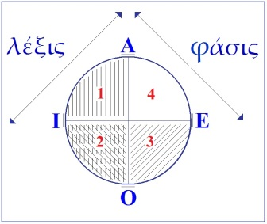

# Leçon 10 | 21 Février 1962

  

    <label><input type="checkbox" data-lacan-toggle="original" checked> 原文</label>
    <label><input type="checkbox" data-lacan-toggle="notes" checked> 注释</label>
    <label><input type="checkbox" data-lacan-toggle="commentary" checked> 个人解读评论</label>
  

  <form class="lacan-tool-search" role="search">
    <input class="lacan-tool-search-input" type="search" placeholder="搜索全文" aria-label="搜索全文">
    <button class="lacan-tool-button" type="submit" title="搜索">搜索</button>
  </form>
  <button class="lacan-tool-button lacan-back-to-top" type="button" title="回到页面最上方" aria-label="回到页面最上方">↑</button>

<section class="parallel-paragraph" data-paragraph-ids="s9-10-0001">

s9-10-0001

原文 · s9-10-0001

Je vous ai laissés la dernière fois sur l’appréhension d’un paradoxe concernant les modes d’apparition de l’objet. Cette thématique, partant de l’objet en tant que métonymique, s’interrogeait sur ce que nous faisions quand, cet objet métonymique, nous le faisions apparaître en facteur commun de cette ligne dite du signi­fiant, dont je désignais la place par celle du numérateur dans la grande fraction saussurienne, signifiant sur signifié. C’est ce que nous faisions quand nous le fai­sions apparaître comme signifiant, quand nous désignions cet objet comme l’objet de la pulsion orale, par exemple.

[无对应译文]

</section>

<section class="parallel-paragraph" data-paragraph-ids="s9-10-0002">

s9-10-0002

原文 · s9-10-0002

Comme ce type nouveau désignait le genre de l’objet, pour vous le faire saisir je vous ai montré ce qu’il y a de nouveau d’apporté à la logique par le mode dans lequel est employé le signifiant en mathématiques - dans la théorie des ensembles - mode qui est justement impensable si nous n’y met­tons pas au premier plan, comme constitutif, le fameux paradoxe dit « *paradoxe de Russell* » pour vous faire toucher du doigt ce dont je suis parti, à savoir, en tant que tel le signifiant, non seulement n’est pas soumis à la loi dite de contradiction, mais même en est à proprement parler le support, à savoir que A est utilisable en tant que signifiant pour autant que « *A n’est pas A »*.

[无对应译文]

</section>

<section class="parallel-paragraph" data-paragraph-ids="s9-10-0003">

s9-10-0003

原文 · s9-10-0003

D’où il résultait que l’objet de la pulsion orale en tant que nous le considérons comme le sein primordial, à pro­pos de cette mamme générique de l’objectalisation psychanalytique, la question pouvait se poser : le sein réel, dans ces conditions, est-il mammaire ? Je vous disais : non !

[无对应译文]

</section>

<section class="parallel-paragraph" data-paragraph-ids="s9-10-0004">

s9-10-0004

原文 · s9-10-0004

Comme il est bien évident, puisque dans toute la mesure où le sein se trouve - dans l’érotique orale - érotisé, c’est pour autant qu’il est tout autre chose qu’un sein, comme vous ne l’ignorez pas, et quelqu’un après la leçon est venu, s’appro­chant de moi, me dire : « *Dans ces conditions, le phallus est-il phallique ?* ». Bien sûr, que non pas !

[无对应译文]

</section>

<section class="parallel-paragraph" data-paragraph-ids="s9-10-0005">

s9-10-0005

原文 · s9-10-0005

Ou plus exactement ce qu’il faut dire :

[无对应译文]

</section>

<section class="parallel-paragraph" data-paragraph-ids="s9-10-0006">

s9-10-0006

原文 · s9-10-0006

- c’est pour autant que c’est le signifiant *phallus* qui vient en facteur révélateur du sens de la fonction signifiante à un certain stade,

[无对应译文]

</section>

<section class="parallel-paragraph" data-paragraph-ids="s9-10-0007">

s9-10-0007

原文 · s9-10-0007

- c’est pour autant que le *phallus* vient à la même place, sur *la fonction symbolique* où était le sein,

[无对应译文]

</section>

<section class="parallel-paragraph" data-paragraph-ids="s9-10-0008">

s9-10-0008

原文 · s9-10-0008

- c’est pour autant que le sujet se constitue comme phallique, que le pénis, lui -qui est à l’intérieur de la parenthèse de l’ensemble des objets parvenus pour le sujet au stade phallique - que le pénis, peut–on dire, non seulement n’est pas plus phallique que le sein n’est mammaire, mais que les choses beaucoup plus gravement à ce niveau se posent, à savoir que le pénis, partie du corps réelle, tombe sous le coup de cette menace qui s’appelle *la castration*.

[无对应译文]

</section>

<section class="parallel-paragraph" data-paragraph-ids="s9-10-0009">

s9-10-0009

原文 · s9-10-0009

C’est en rai­son de *la fonction signifiante du phallus* comme telle que le pénis réel tombe sous le coup de ce qui a d’abord été appréhendé dans l’expérience analytique comme menace, à savoir la menace de la castration.

[无对应译文]

</section>

<section class="parallel-paragraph" data-paragraph-ids="s9-10-0010">

s9-10-0010

原文 · s9-10-0010

Voici donc le chemin sur lequel je vous mène. Je vous en montre ici le but et la visée. Il s’agit maintenant de la par­courir pas à pas, autrement dit de rejoindre ce que, depuis notre départ de cette année, je prépare et aborde peu à peu, à savoir : *la fonction privilégiée du phallus dans l’identification du sujet*.

[无对应译文]

</section>

<section class="parallel-paragraph" data-paragraph-ids="s9-10-0011">

s9-10-0011

原文 · s9-10-0011

Entendons bien qu’en tout ceci, à savoir en ceci que cette année nous parlons d’identification, à savoir en ceci qu’à partir d’un certain moment de l’œuvre freudienne, *la question de l’identification vient au premier plan, vient à dominer, vient à remanier toute la théorie freudienne*, c’est pour autant - on rougit presque d’avoir à le dire - qu’à partir d’un certain moment - pour nous après FREUD, pour FREUD avant nous - *la question du sujet se pose comme telle*, à savoir : « *Qu’est-ce qui »* :

[无对应译文]

</section>

<section class="parallel-paragraph" data-paragraph-ids="s9-10-0012">

s9-10-0012

原文 · s9-10-0012

- *« Qu’est-ce qui est là ? *»,

[无对应译文]

</section>

<section class="parallel-paragraph" data-paragraph-ids="s9-10-0013">

s9-10-0013

原文 · s9-10-0013

- *« Qu’est-ce qui fonctionne ?* »,

[无对应译文]

</section>

<section class="parallel-paragraph" data-paragraph-ids="s9-10-0014">

s9-10-0014

原文 · s9-10-0014

- *« Qu’est­-ce qui parle ?* »,

[无对应译文]

</section>

<section class="parallel-paragraph" data-paragraph-ids="s9-10-0015">

s9-10-0015

原文 · s9-10-0015

- *« Qu’est-ce qui*... bien d’autres choses encore »[^82] ?

[无对应译文]

</section>

<section class="parallel-paragraph" data-paragraph-ids="s9-10-0016">

s9-10-0016

原文 · s9-10-0016

Et c’est pour autant qu’il fallait tout de même bien s’y attendre - dans une technique qui est une technique, grossièrement, de communication, d’adresse de l’un à l’autre, et pour tout dire de rapport - il fallait tout de même bien savoir *qui* est-ce qui parle, et *à qui ?*

[无对应译文]

</section>

<section class="parallel-paragraph" data-paragraph-ids="s9-10-0017">

s9-10-0017

原文 · s9-10-0017

C’est bien pour cela que cette année nous faisons de *la logique*. Je n’y peux rien, il ne s’agit pas de savoir si ça me plaît ou si ça me déplaît. Ça ne me déplaît pas. Ça peut ne pas déplaire à d’autres. Mais ce qui est certain c’est que c’est inévitable.

[无对应译文]

</section>

<section class="parallel-paragraph" data-paragraph-ids="s9-10-0018">

s9-10-0018

原文 · s9-10-0018

Il s’agit de savoir *dans quelle logique* ceci nous entraîne. Vous avez bien pu voir que déjà je vous ai montré - je m’efforce d’être aussi court-circuitant que pos­sible, je vous assure que je ne fais pas l’école buissonnière - où nous nous situons par rapport à *la logique formelle*, et qu’assurément nous ne sommes pas sans y avoir notre mot à dire.

[无对应译文]

</section>

<section class="parallel-paragraph" data-paragraph-ids="s9-10-0019">

s9-10-0019

原文 · s9-10-0019

Je vous rappelle le petit cadran que je vous ai construit à toutes fins utiles et sur lequel nous aurons peut-être plus d’une fois l’occasion de revenir :

[无对应译文]

</section>

<section class="parallel-paragraph" data-paragraph-ids="s9-10-0020">

s9-10-0020

原文 · s9-10-0020

[无对应译文]

</section>

<section class="parallel-paragraph" data-paragraph-ids="s9-10-0021">

s9-10-0021

原文 · s9-10-0021

À moins que ceci - en raison du train que nous sommes forcés de mener pour arriver cette année à notre but - ne doive rester encore pendant quelques mois, ou années, une proposition suspendue pour l’ingéniosité de ceux qui se donnent la peine de revenir sur ce que je vous enseigne.

[无对应译文]

</section>

<section class="parallel-paragraph" data-paragraph-ids="s9-10-0022">

s9-10-0022

原文 · s9-10-0022

Mais sûrement, il ne s’agit point que de *logique formelle*. S’agit-il, et c’est ce qu’on appelle depuis KANT \- je veux dire d’une façon bien constituée depuis KANT - *une logique transcendantale*, autrement dit *la logique du concept* ? Sûrement pas non plus ! C’est même assez frappant de voir à quel point la notion du concept est absente apparemment du fonctionnement de nos catégories.

[无对应译文]

</section>

<section class="parallel-paragraph" data-paragraph-ids="s9-10-0023">

s9-10-0023

原文 · s9-10-0023

Ce que nous faisons, ce n’est pas du tout la peine de nous donner beaucoup de mal pour l’instant pour lui donner un épinglage plus précis, c’est *une logique*, dont d’abord certains disent que j’ai essayé de constituer une sorte de logique élastique, mais enfin, cela ne suffit pas à constituer quelque chose de bien rassurant pour l’esprit, nous faisons une *logique du fonctionnement du signifiant*, car sans cette référence constituée comme primaire, fondamentale, du rapport du sujet au signifiant, ce que j’avance est qu’il est à proprement parler impensable même qu’on parvienne à situer où est l’erreur où s’est engagée progressivement toute l’analyse, et qui tient précisément en ceci qu’elle n’a pas fait cette *critique de la logique transcendantale*, au sens kantien, que les faits nouveaux qu’elle amène imposent strictement.

[无对应译文]

</section>

<section class="parallel-paragraph" data-paragraph-ids="s9-10-0024">

s9-10-0024

原文 · s9-10-0024

Ceci, je vais vous en faire la confidence, qui n’a pas en elle-même une importance historique, mais que je crois pouvoir tout de même vous communiquer à titre de stimulation, ceci m’a amené - pendant le temps, court ou long, pendant lequel j’ai été séparé de vous et de nos rencontres hebdomadaires - m’a amené à remettre le nez, non point comme je l’avais fait il y a deux ans, dans la *Critique de la Raison pratique* mais dans la *Critique de la Raison pure*.

[无对应译文]

</section>

<section class="parallel-paragraph" data-paragraph-ids="s9-10-0025">

s9-10-0025

原文 · s9-10-0025

Le hasard ayant fait que je n’avais apporté - par oubli - que mon exemplaire en allemand, je n’ai pas fait la relecture complète, mais seulement celle du chapitre dit de « *l’Introduction à l’analytique transcendantale* ».

[无对应译文]

</section>

<section class="parallel-paragraph" data-paragraph-ids="s9-10-0026">

s9-10-0026

原文 · s9-10-0026

Et quoique déplorant que les quelques dix ans, depuis lesquels je m’adresse à vous, n’aient pas eu, je crois, beaucoup d’effet quant à la propagation parmi vous de l’étude de l’allemand... ce qui ne manque pas de me laisser toujours étonné, ce qui est un de ces petits faits qui me font quelquefois me faire à moi-même refléter ma propre image comme celle de ce personnage d’un film surréaliste bien connu qui s’appelle *[Un chien andalou](http://fr.wikipedia.org/wiki/Un_chien_andalou), image qui est celle d’un homme qui, à l’aide de deux cordes, hale derrière lui un piano sur lequel reposent - sans allusion - deux ânes morts* ...à ceci près, que ceux tout au moins qui savent déjà l’allemand n’hésitent pas à rouvrir le chapitre que je leur désigne de la *Critique de la Raison pure* : cela les aidera sûrement à bien centrer l’espèce de renversement que j’essaie d’articuler pour vous cette année.

[无对应译文]

</section>

<section class="parallel-paragraph" data-paragraph-ids="s9-10-0027">

s9-10-0027

原文 · s9-10-0027

Mais en un certain sens - ce n’est pas une clé universelle mais une indication - je crois pouvoir très simplement vous rappeler que l’essence tient en la façon radicalement autre, excentrée, dont j’essaie de vous faire appré­hender une notion qui est celle qui domine toute la structuration des catégories dans KANT.

[无对应译文]

</section>

<section class="parallel-paragraph" data-paragraph-ids="s9-10-0028">

s9-10-0028

原文 · s9-10-0028

Ce en quoi il ne fait que mettre le point purifié, le point achevé, le point final, à ce qui a dominé la pensée philosophique jusqu’à ce qu’en quelque sorte, là, il l’achève à la fonction de l’*Einheit* qui est le fondement de toute *syn­thèse*, de « *la synthèse a priori* », comme il s’exprime, et qui semble bien en effet s’imposer, depuis le temps de sa progression à partir de la mythologie platonicienne, comme la voie nécessaire :

[无对应译文]

</section>

<section class="parallel-paragraph" data-paragraph-ids="s9-10-0029">

s9-10-0029

原文 · s9-10-0029

- l’UN, le grand UN qui domine toute la pensée, de PLATON à KANT,

[无对应译文]

</section>

<section class="parallel-paragraph" data-paragraph-ids="s9-10-0030">

s9-10-0030

原文 · s9-10-0030

- l’Un qui pour KANT, en tant que *fonction synthétique*, est le modèle même de ce qui dans toute catégorie *a priori* apporte avec soi, dit-il, la fonction d’une norme, entendez bien : d’une règle universelle.

[无对应译文]

</section>

<section class="parallel-paragraph" data-paragraph-ids="s9-10-0031">

s9-10-0031

原文 · s9-10-0031

Eh bien, disons, pour ajouter sa pointe sensible à ce que depuis le début de l’année pour vous j’articule : s’il est vrai que « *la fonction de l’UN* » dans *l’identification*, telle que la structure et la décompose l’analyse de l’expérience freudienne, est celle, non pas de l’*Einheit,* mais celle que j’ai essayé de vous faire sentir *concrètement* depuis le début de l’année comme l’accent original de ce que je vous ai appelé *le trait unaire.*

[无对应译文]

</section>

<section class="parallel-paragraph" data-paragraph-ids="s9-10-0032">

s9-10-0032

原文 · s9-10-0032

C’est-à-dire *tout autre chose que le cercle qui rassemble*, sur lequel en somme débouche *à un niveau d’intuition imaginaire sommaire toute la formalisation logique : non le cercle eulérien mais tout autre chose, à savoir, ce que je vous ai appelé un* 1. Ce *trait*, cette chose insituable, *cette aporie* pour la pensée, qui consiste en ceci que justement d’autant plus il est épuré, simplifié, réduit à n’importe quoi, avec suffisamment d’abattement de ses appendices, il peut finir par se réduire à ça : un 1.

[无对应译文]

</section>

<section class="parallel-paragraph" data-paragraph-ids="s9-10-0033">

s9-10-0033

原文 · s9-10-0033

Ce qu’il y a d’essentiel, ce qui fait l’originalité de ceci, *de l’existence de ce trait unaire et de sa fonction, et de son introduction*... par où, c’est justement ce que je laisse en suspens, car il n’est pas si clair que ce soit par l’homme, s’il est d’un certain côté possible, probable, en tout cas mis en question par nous que c’est de là que l’homme soit sorti ...donc, cet « 1 », son *paradoxe* c’est justement ceci : c’est que plus il se ressemble - je veux dire, plus tout ce qui est de la diversité des semblances s’en efface - plus il supporte, *plus il «* 1*-carne* *»* dirai-je - si vous me passez ce mot - *la différence comme telle*.

[无对应译文]

</section>

<section class="parallel-paragraph" data-paragraph-ids="s9-10-0034">

s9-10-0034

原文 · s9-10-0034

*Le renversement de la position autour de l’*1 fait que, *de l’Einheit kantienne* nous considérons que *nous passons à l’Einzigkeit,* à *l’unicité* expri­mée comme telle. Si c’est par là, si je puis dire, que j’essaie - pour emprunter une expression à un titre, j’espère célèbre pour vous, d’une improvisation litté­raire de PICASSO[^83] - si c’est par là que j’ai choisi cette année d’essayer de faire ce que j’espère vous amener à faire, à savoir d’« *attraper le désir par la queue »,* si c’est par là, c’est-à-dire non pas par *la première forme d’identification* définie par FREUD, qui n’est pas facile à manier, celle de l’*Einverleihung,* celle de *la consom­mation de l’ennemi*, de l’adversaire, du père, si je suis parti de *la seconde forme de l’identification* \- à savoir de cette *fonction du trait unaire -* c’est évidemment dans ce but.

[无对应译文]

</section>

<section class="parallel-paragraph" data-paragraph-ids="s9-10-0035">

s9-10-0035

原文 · s9-10-0035

Mais vous voyez où est le renversement : c’est que si cette fonction...

[无对应译文]

</section>

<section class="parallel-paragraph" data-paragraph-ids="s9-10-0036">

s9-10-0036

原文 · s9-10-0036

> je crois que c’est le meilleur terme que nous ayons à prendre, parce que c’est le plus abstrait,
>
> c’est le plus souple, c’est le plus à proprement parler signifiant : c’est simplement un grand F ...si la fonction que nous donnons à l’« 1 » n’est plus celle de l’*Einheit* mais de l’*Einzigkeit,* c’est que nous sommes passés - ce qu’il convien­drait quand même que nous n’oublions pas, qui est *la nouveauté de l’analyse - des vertus de la norme aux vertus de l’exception*.

[无对应译文]

</section>

<section class="parallel-paragraph" data-paragraph-ids="s9-10-0037">

s9-10-0037

原文 · s9-10-0037

Chose que vous avez retenue quand même un petit peu, et pour cause : la tension de la pensée s’en arrange en disant « *l’exception confirme la règle* ». Comme beaucoup de *conneries* c’est une *connerie* *profonde*, il suffit simplement de savoir la décortiquer. N’aurais-je fait que de rendre cette connerie tout à fait lumineuse comme un de ces petits phares qu’on voit au sommet des voitures de police, que ce serait déjà un petit gain sur le plan de la logique. Mais évidemment c’est un bénéfice latéral. Vous le verrez, surtout si certains d’entre vous... Peut-être que certains pourraient aller jusqu’à se dévouer, jusqu’à faire à ma place un jour un petit résumé de la façon dont il faut re-ponctuer *l’analytique kantienne*.

[无对应译文]

</section>

<section class="parallel-paragraph" data-paragraph-ids="s9-10-0038">

s9-10-0038

原文 · s9-10-0038

Vous pensez bien qu’il y a les amorces de tout cela : quand KANT distingue *le jugement universel* et *le jugement particulier*, et qu’il isole « *le jugement singulier* » en en montrant les affinités pro­fondes avec « *le jugement universel* », je veux dire : ce dont tout le monde s’était aperçu avant lui, mais en montrant que cela ne suffit pas qu’on les rassemble, pour autant que « *le jugement singulier* » a bien son indépendance, il y a là comme la pierre d’attente, l’amorce de ce renversement dont je vous parle. Ceci n’est qu’un exemple. Il y a *bien d’autres choses* qui amorcent *ce renversement* dans KANT. Ce qui est curieux, c’est qu’on ne l’ait pas fait plus tôt, même.

[无对应译文]

</section>

<section class="parallel-paragraph" data-paragraph-ids="s9-10-0039">

s9-10-0039

原文 · s9-10-0039

Il est évident que ce à quoi je faisais allusion devant vous, en passant, lors de l’avant dernière fois, à savoir le côté qui scandalisait tellement M. JESPERSEN, linguiste - ce qui prouve que les linguistes ne sont pas du tout pour­vus d’aucune infaillibilité - à savoir qu’il y aurait quelque paradoxe à ce que KANT mette *la négation* à la rubrique des catégories désignant les qualités, à savoir comme second temps, si l’on peut dire, des catégories de la qualité : la première étant *la réalité*, la seconde étant *la négation*,et la troisième étant *la limitation*.

[无对应译文]

</section>

<section class="parallel-paragraph" data-paragraph-ids="s9-10-0040">

s9-10-0040

原文 · s9-10-0040

Cette chose qui surprend, et dont il nous surprend que ça surprenne beaucoup ce linguiste, à savoir M. JESPERSEN[^84], dans ce très long travail sur *la négation* qu’il a publié dans *Les Annales de l’Académie danoise*. On est d’autant plus surpris que ce long article sur *la négation* est justement fait pour - en somme de bout en bout - nous montrer que linguistiquement *la négation* est quelque chose qui ne se sou­tient que par, si je puis dire, une surenchère perpétuelle. Ce n’est donc pas quelque chose de si simple que de la mettre à la rubrique de la quantité où elle se confondrait purement et simplement avec ce qu’elle est dans la quantité, c’est-à-dire le zéro. Mais justement, je vous en ai déjà là-dessus indiqué assez : ceux que ça intéresse, je leur donne la référence, le grand travail de JESPERSEN est vraiment quelque chose de considérable.

[无对应译文]

</section>

<section class="parallel-paragraph" data-paragraph-ids="s9-10-0041">

s9-10-0041

原文 · s9-10-0041

Mais si vous ouvrez le *Dictionnaire d’étymologie latine* de ERNOUT et MEILLET[^85] vous référant simplement à *l’article « ne »*, vous vous apercevrez de la complexité historique du problème du fonctionnement de *la négation*, à savoir cette pro­fonde ambiguïté qui fait qu’après avoir été cette fonction primitive de discor­dance sur laquelle j’ai insisté, en même temps que sur sa nature originelle, il faut bien toujours qu’elle s’appuie sur quelque chose qui est justement de cette nature de l’1, tel que nous essayons de le serrer ici de près : que *la négation ça n’est pas un zéro :* jamais, linguistiquement, *mais un* « *pas un* ».

[无对应译文]

</section>

<section class="parallel-paragraph" data-paragraph-ids="s9-10-0042">

s9-10-0042

原文 · s9-10-0042

Au point que, le seul « *non* » latin, par exemple - pour illustrer ce que vous pouvez trouver dans cet ouvrage paru à l’Académie danoise pendant la guerre de 1914, et pour cela très difficile à trouver - le « *non* » latin lui-même, qui a l’air d’être la forme de *négation* la plus simple du monde, est déjà un « *ne oinom* »*, dans la forme de* « *unum* »* c’est déjà un* « *pas un* ». Et au bout d’un certain temps on oublie que c’est un « *pas un* », et on remet encore un « *un* » à la suite.

[无对应译文]

</section>

<section class="parallel-paragraph" data-paragraph-ids="s9-10-0043">

s9-10-0043

原文 · s9-10-0043

Et toute l’histoire de *la négation*, c’est l’histoire de cette consommation par quelque chose qui est - *Où ?* C’est justement ce que nous essayons de serrer *- la fonction du sujet* comme tel.

[无对应译文]

</section>

<section class="parallel-paragraph" data-paragraph-ids="s9-10-0044">

s9-10-0044

原文 · s9-10-0044

C’est pour cela que les remarques de PICHON sont très intéressantes, qui nous montrent qu’en français on voit tellement bien jouer les deux éléments de *la négation* - le rapport du « *ne* » avec le « *pas* » - qu’on peut dire que le français, en effet, a ce privilège, pas unique d’ailleurs parmi les langues, de montrer *qu’il n’y a pas de véritable négation en français*. Ce qui est curieux d’ailleurs, c’est qu’il ne s’aperçoive pas que si les choses en sont ainsi, cela doit aller un petit peu plus loin que le champ du domaine français, si l’on peut s’exprimer ainsi.

[无对应译文]

</section>

<section class="parallel-paragraph" data-paragraph-ids="s9-10-0045">

s9-10-0045

原文 · s9-10-0045

Il est en effet très facile, sur toutes sortes de formes, de s’apercevoir qu’il en est forcément de même partout, étant donné que *la fonction du sujet* n’est pas suspendue jusqu’à la racine à la diver­sité des langues. Il est très facile de s’apercevoir que le « *not* », à un certain moment de l’évolution du langage anglais, est quelque chose comme « *naught* ».

[无对应译文]

</section>

<section class="parallel-paragraph" data-paragraph-ids="s9-10-0046">

s9-10-0046

原文 · s9-10-0046

Revenons en arrière, afin que je vous rassure que nous ne perdons pas notre visée. Repartons de l’année dernière, de SOCRATE, d’ALCIBIADE et de toute la clique qui, j’espère, a fait à ce moment votre divertissement. Il s’agit de conjoindre ce *renversement logique* concernant la fonction du 1 avec quelque chose dont nous nous occupons depuis longtemps, à savoir : du *désir*.

[无对应译文]

</section>

<section class="parallel-paragraph" data-paragraph-ids="s9-10-0047">

s9-10-0047

原文 · s9-10-0047

Comme, depuis le temps que je ne vous en parle pas, il est possible que les choses soient devenues pour vous un peu floues, je vais faire un tout petit rappel, que je crois juste le moment de faire dans cet exposé cette année, concernant ceci.Vous vous souve­nez - c’est un fait discursif - que c’est par là que j’ai introduit, l’année dernière[^86], la question de l’identification : c’est à proprement parler quand j’ai abordé ce qui, concernant *le rapport narcissique*, doit se constituer pour nous comme consé­quence de l’*équivalence* apportée par FREUD[^87] entre *la libido narcissique* et *la libido d’objet*.

[无对应译文]

</section>

<section class="parallel-paragraph" data-paragraph-ids="s9-10-0048">

s9-10-0048

原文 · s9-10-0048

Vous savez comment je l’ai symbolisée à l’époque, *un petit schéma* intuitif, je veux dire quelque chose qui se représente, *un schème*, *non pas un schème au sens kantien*. KANT est une très bonne référence, en français, c’est gris. Messieurs TREMESAYGUES et PACAUD ont réalisé tout de même ce tour de force de rendre la lecture de la *Critique de la Raison pure* - dont il n’est abso­lument pas impensable de dire que, sous un certain angle, on peut le lire comme *un livre érotique -* en quelque chose d’absolument monotone et poussiéreux.

[无对应译文]

</section>

<section class="parallel-paragraph" data-paragraph-ids="s9-10-0049">

s9-10-0049

原文 · s9-10-0049

Peut-être, grâce à mes commentaires, vous arriverez, même en français, à lui restituer cette sorte de *piment* qu’il n’est pas exagéré de dire qu’il comporte. En tout cas je m’étais toujours laissé persuadé qu’en allemand c’était mal écrit, parce que d’abord les Allemands, sauf certains, ont la réputation de mal écrire. Ce n’est pas vrai : la *Critique de la Raison pure* est aussi bien écrite que les livres de FREUD, et ce n’est pas peu dire. Le schéma est le suivant :

[无对应译文]

</section>

<section class="parallel-paragraph" data-paragraph-ids="s9-10-0050">

s9-10-0050

原文 · s9-10-0050

[无对应译文]

</section>

<section class="parallel-paragraph" data-paragraph-ids="s9-10-0051">

s9-10-0051

原文 · s9-10-0051

Il s’agissait de ce dont nous parle FREUD, à ce niveau de l’*Introduction au narcissisme,* à savoir : que nous aimons l’autre de la même *substance humide* qui est celle dont nous sommes le réservoir, qui s’appelle la *libido,* et que c’est pour autant qu’elle est ici \[1\], qu’elle peut être là \[2\], c’est-à-dire environ­nant, noyant, mouillant l’objet d’en face. La référence de l’*amour* à l’*humide* n’est pas de moi, elle est dans *Le Banquet* que nous avons commenté l’an dernier.

[无对应译文]

</section>

<section class="parallel-paragraph" data-paragraph-ids="s9-10-0052">

s9-10-0052

原文 · s9-10-0052

Moralité de cette métaphysique de l’amour, puisque c’est de cela qu’il s’agit, l’élément fondamental de la *Liebesbedingung,* de *la condition de l’amour -* moralité, en un certain sens je n’aime...

[无对应译文]

</section>

<section class="parallel-paragraph" data-paragraph-ids="s9-10-0053">

s9-10-0053

原文 · s9-10-0053

> ce qui s’appelle aimer, ce que nous appe­lons ici aimer, histoire de savoir aussi ce qu’il y a
>
> comme reste au-delà de l’amour, donc ce qui s’appelle aimer d’une certaine façon

[无对应译文]

</section>

<section class="parallel-paragraph" data-paragraph-ids="s9-10-0054">

s9-10-0054

原文 · s9-10-0054

...je n’aime que mon corps, même quand cet amour, je le transfère sur le corps de l’autre.

[无对应译文]

</section>

<section class="parallel-paragraph" data-paragraph-ids="s9-10-0055">

s9-10-0055

原文 · s9-10-0055

Bien sûr, il en reste toujours une bonne dose sur le mien ! C’est même jusqu’à un certain point indispensable, ne serait-ce, au cas extrême, qu’au niveau de ce qu’il faut bien qui fonctionne auto-érotiquement, à savoir mon pénis, pour adopter - pour la simplification - le point de vue androcentrique. Cela n’a aucun inconvénient, cette simplification, comme vous allez le voir, puisque ça n’est pas cela qui nous intéresse. Ce qui nous intéresse, c’est le *phallus*.

[无对应译文]

</section>

<section class="parallel-paragraph" data-paragraph-ids="s9-10-0056">

s9-10-0056

原文 · s9-10-0056

Alors, *je vous ai proposé* - *implicitement, sinon explicitement, en ce sens que c’est plus explicite encore maintenant que l’année dernière -* je vous ai proposé de définir par rapport à ce que j’aime dans autrui qui, lui, est soumis à cette condition hydraulique d’équivalence de la libido, à savoir que quand ça monte d’un côté, ça monte aussi de l’autre.

[无对应译文]

</section>

<section class="parallel-paragraph" data-paragraph-ids="s9-10-0057">

s9-10-0057

原文 · s9-10-0057

Ce que je désire - ce qui est différent de ce que j’éprouve - c’est ce qui, sous forme du pur reflet de ce qui reste de moi investi en tout état de cause, est justement ce qui manque au corps de l’autre, en tant que, lui, est constitué par cette imprégnation de l’humide de l’amour. Au point de vue du *désir*, au niveau du *désir*, tout ce corps de l’autre, du moins aussi peu que je l’aime, ne vaut que, justement, par ce qui lui manque.

[无对应译文]

</section>

<section class="parallel-paragraph" data-paragraph-ids="s9-10-0058">

s9-10-0058

原文 · s9-10-0058

Et c’est très préci­sément pour ça que j’allais dire que l’hétérosexualité est possible. Car il faut s’entendre : si c’est vrai - comme l’analyse nous l’enseigne - que c’est le fait que la femme soit effectivement, du point de vue pénien, castrée, qui fait peur à certains... si ce que nous disons là n’est *point insensé*, et ce n’est *point insensé*, puisque c’est évident : on le rencontre à tous les tournants, chez le névrosé, j’insiste, je dis que c’est là bel et bien que nous l’avons découvert. Je veux dire que nous en sommes sûrs, pour la raison que c’est là que les mécanismes jouent, avec un raffinement tel qu’il n’y a pas d’autre hypothèse possible pour expliquer la façon dont le névrosé institue, constitue son désir, hystérique ou obsessionnel. Ce qui nous mènera cette année à articuler complètement pour vous le sens du *désir de l’hys­térique*, comme du *désir de l’obsession*, et très vite, car je dirai que, jusqu’à un certain point, *c’est urgent* …s’il en est ainsi chez tel ou tel, aussi bien chez d’autres que *chez le névrosé* : c’est encore plus conscient *chez l’homosexuel* que chez le névrosé. L’homosexuel vous le dit lui-même, que ça lui fait quand même un effet, et très pénible, d’être devant ce pubis sans queue. C’est justement à cause de cela que nous ne pouvons pas tellement nous y fier, et d’ailleurs nous avons raison, c’est pour cela que ma référence, je la prends chez le névrosé.

[无对应译文]

</section>

<section class="parallel-paragraph" data-paragraph-ids="s9-10-0059">

s9-10-0059

原文 · s9-10-0059

Tout ceci étant dit, il reste bien qu’il y a encore quand même *pas mal de gens* à qui ça ne fait pas peur ! Et que par conséquent *il n’est pas fou*... disons simplement : je suis bien forcé d’aborder la chose *comme ça*, puisque après tout personne ne l’a dit *comme ç*a, quand je vous l’aurai dit deux ou trois fois, je pense que cela finira par vous devenir tout à fait évident ...*il n’est pas fou de penser* que ce qui chez les êtres qui peuvent avoir un rapport normal, satisfaisant j’entends, de désir, avec le partenaire du sexe opposé, non seulement *ça ne lui fait pas peur*, mais c’est justement ça qui est intéressant, à savoir que *ce n’est pas parce que le pénis n’est pas là, que le phallus n’y est pas*. Je dirai même : au contraire !

[无对应译文]

</section>

<section class="parallel-paragraph" data-paragraph-ids="s9-10-0060">

s9-10-0060

原文 · s9-10-0060

Ce qui permet de retrouver, à un certain nombre de carrefours, en particulier ceci : que *ce que cherche le désir c’est moins, dans l’autre, le désirable que le dési­rant, c’est-à-dire ce qui lui manque*. Et là encore je vous prie de vous rappeler que c’est la première aporie, le premier *b. a.-ba* de la question, telle qu’elle com­mence à s’articuler quand vous ouvrez ce fameux *Banquet* qui semble n’avoir traversé les siècles que pour qu’on fasse autour de lui de la théologie. J’essaie d’en faire autre chose, à savoir vous faire apercevoir qu’à chaque ligne on y parle effectivement de ce dont il s’agit, à savoir d’Éros.

[无对应译文]

</section>

<section class="parallel-paragraph" data-paragraph-ids="s9-10-0061">

s9-10-0061

原文 · s9-10-0061

*Je désire l’autre comme dési­rant. Et quand je dis comme dési­rant, je n’ai même pas dit, je n’ai expressément pas dit comme <u>me</u> dési­rant.* *Car c’est moi qui désire, et désirant le désir, ce désir ne saurait être désir de moi que si je me retrouve à ce tournant, là où je suis, bien sûr, c’est-à-dire si je m’aime dans l’autre, autrement dit si c’est moi que j’aime. Mais alors j’abandonne le désir.*

[无对应译文]

</section>

<section class="parallel-paragraph" data-paragraph-ids="s9-10-0062">

s9-10-0062

原文 · s9-10-0062

Ce que je suis en train d’accentuer, c’est cette limite, *cette frontière qui sépare le désir de l’amour*. Ce qui ne veut pas dire, bien sûr, qu’ils ne se conditionnent pas par toutes sortes de bouts. C’est même bien là tout le drame, comme je pense que ça doit être la première remarque que vous devez vous faire sur votre expé­rience d’analyste, étant bien entendu qu’il arrive, comme à bien d’autres sujets à ce niveau de la réalité humaine, que ce soit souvent l’homme du commun qui soit plus près de ce que j’appellerai dans l’occasion « *l’os* ». Ce qui est à désirer est évidemment toujours ce qui manque, et c’est bien pour cela qu’en français le désir s’appelle « *desiderium* », ce qui veut dire *regret*.

[无对应译文]

</section>

<section class="parallel-paragraph" data-paragraph-ids="s9-10-0063">

s9-10-0063

原文 · s9-10-0063

Et ceci aussi rejoint ce que l’année dernière j’ai accentué comme étant ce point majeur visé depuis toujours par l’éthique de la passion qui est de faire, je ne dis pas cette synthèse, mais *cette conjonction* dont il s’agit de savoir si justement elle n’est pas *structuralement impossible*, si elle ne reste pas un point idéal hors des limites de l’épure, que j’ai appelé *la métaphore du véritable amour,* qui est la fameuse équation, l’ἔρόν \[éron\] sur ἐρώμενος \[éromenos\], ἔρόν \[éron\] se substituant... *le désirant se substituant au désiré* à ce point, et par *cette métaphore* équivalant à la perfection de l’*amant*, comme il est également articulé au *Banquet,* à savoir ce *renversement* de toute la propriété de ce qu’on peut appeler « *l’aimable naturel*  », l’arrachement dans l’amour qui met tout ce qu’on peut être soi-même de désirable hors de la por­tée du chérissement, si je puis dire.

[无对应译文]

</section>

<section class="parallel-paragraph" data-paragraph-ids="s9-10-0064">

s9-10-0064

原文 · s9-10-0064

Ce « *noli me amare* »*, qui est le vrai secret*, le vrai dernier mot de la passion idéale *de cet amour courtois* dont ce n’est pas pour rien que j’ai placé le terme - si peu actuel, je veux dire si parfaitement confusion­nel qu’il soit devenu - à l’horizon de ce que j’avais l’année dernière articulé, pré­férant plutôt lui substituer comme plus actuel, plus exemplaire, cet ordre d’expérience - elle non pas du tout idéale mais parfaitement accessible - qui est la nôtre sous le nom de transfert, et que je vous ai illustrée, montrée d’ores et déjà illustrée dans le *Banquet,* sous cette forme tout à fait paradoxale de l’interpréta­tion à proprement parler *analytique* de SOCRATE, après la longue déclaration fol­lement exhibitionniste, enfin la règle analytique appliquée à plein tuyau à ce qui est le discours d’ALCIBIADE.

[无对应译文]

</section>

<section class="parallel-paragraph" data-paragraph-ids="s9-10-0065">

s9-10-0065

原文 · s9-10-0065

Sans doute avez-vous pu retenir l’*ironie* implicite­ment contenue en ceci, qui n’est pas caché dans le texte, c’est que celui que SOCRATE désire sur l’heure, pour la beauté de la démonstration, c’est AGATHON. Autrement dit *le déconnographe*, le pur esprit, celui qui parle de l’amour d’une façon telle... comme on doit sans doute en parler, en le comparant à la paix des flots, sur le ton franchement comique, mais sans le faire exprès, et même sans s’en apercevoir.

[无对应译文]

</section>

<section class="parallel-paragraph" data-paragraph-ids="s9-10-0066">

s9-10-0066

原文 · s9-10-0066

Autrement dit, qu’est-ce que SOCRATE veut dire ? Pourquoi SOCRATE n’aimerait-il pas AGATHON, si justement la bêtise chez lui - comme Monsieur TESTE[^88] - c’est justement ce qui lui manque ? « *La bêtise n’est pas mon fort*. » C’est un enseignement, car ça veut dire, et ceci alors est articulé en toutes lettres à ALCIBIADE :

[无对应译文]

</section>

<section class="parallel-paragraph" data-paragraph-ids="s9-10-0067">

s9-10-0067

原文 · s9-10-0067

« *Mon bel ami, cause toujours, car c’est celui-là, toi aussi, que tu aimes. C’est pour AGATHON, tout ce long discours. Seulement la dif­férence, c’est que toi tu ne sais pas ce dont il s’agit. Ta force, ta maîtrise, ta richesse t’abusent.* »

[无对应译文]

</section>

<section class="parallel-paragraph" data-paragraph-ids="s9-10-0068">

s9-10-0068

原文 · s9-10-0068

Et en effet, nous en savons assez long sur la vie d’ALCIBIADE pour savoir que peu de choses lui ont manqué de l’ordre du plus extrême de ce qu’on peut avoir. À sa façon, toute différente de SOCRATE, il n’était lui non plus de nulle part, reçu d’ailleurs les bras ouverts où qu’il allât, les gens toujours trop heureux d’une pareille acquisition. Une certaine ἀτοπία \[atopia\] fut son lot : il était seulement *trop encombrant*. Quand il arriva à Sparte, il trouva simplement qu’il fai­sait un grand honneur au roi de Sparte - la chose est rapportée dans PLUTARQUE[^89], articulée en clair - en faisant un enfant à sa femme, par exemple - c’est pour vous donner le style - c’était la moindre des choses. Il y en a qui sont des durs, il a fallu, pour en finir avec lui, le cerner de feu et l’abattre à coups de flèches.

[无对应译文]

</section>

<section class="parallel-paragraph" data-paragraph-ids="s9-10-0069">

s9-10-0069

原文 · s9-10-0069

Mais pour SOCRATE, l’important n’est pas là. L’important est de dire : « ALCIBIADE*, occupe-toi un peu de ton âme* » Ce qui, croyez-moi, j’en suis bien convaincu, n’a pas du tout le même sens chez SOCRATE que ça a pris à la suite du développement plotinien de la notion de l’*Un*. Si SOCRATE lui répond : « *Je ne sais rien, sinon peut-être ce qu’il en est* *de la nature de l’éros* »

[无对应译文]

</section>

<section class="parallel-paragraph" data-paragraph-ids="s9-10-0070">

s9-10-0070

原文 · s9-10-0070

C’est bien que la fonc­tion éminente de SOCRATE est *d’être le premier qui ait conçu quelle était la véri­table nature du désir*. Et c’est exactement pour ça, qu’à partir de cette révélation jusqu’à FREUD, le désir comme tel dans sa fonction… le désir en tant qu’essence même de l’homme, dit SPINOZA[^90] - et chacun sait ce que cela veut dire, l’homme, dans SPINOZA, c’est le sujet, c’est l’essence du sujet - que le désir est resté, pen­dant ce nombre respectable de siècles une fonction à demi, aux trois quarts, aux quatre cinquièmes, occultée dans l’histoire de la connaissance.

[无对应译文]

</section>

<section class="parallel-paragraph" data-paragraph-ids="s9-10-0071">

s9-10-0071

原文 · s9-10-0071

Le sujet dont il s’agit, celui dont nous suivons *la trace*, est *le sujet du désir* et non pas *le sujet de l’amour*, pour la simple raison qu’on n’est pas *sujet de l’amour*, on est ordinairement, on est normalement sa victime. C’est tout à fait différent. En d’autres termes, l’amour est une force naturelle. C’est ce qui justi­fie le point de vue qu’on appelle « *biologisant* » de FREUD. L’amour, c’est une réalité. C’est pour cela d’ailleurs que je vous dis : « *les dieux sont réels* ». L’amour, c’est APHRODITE qui frappe, on le savait très bien dans l’Antiquité, cela n’étonnait per­sonne.

[无对应译文]

</section>

<section class="parallel-paragraph" data-paragraph-ids="s9-10-0072">

s9-10-0072

原文 · s9-10-0072

Vous me permettrez un très joli jeu de mots. C’est un de mes plus divins obsessionnels, très avancé dans son analyse, qui me l’a fait il y a quelques jours : « *L’affreux doute de l’herma­phrodite* ». Je veux dire que je ne peux pas faire moins que d’y penser, depuis qu’évidemment il s’est passé *des choses* qui nous ont fait glisser de *l’Aphrodite* à *l’affreux doute*. Je veux dire : il y a beaucoup à dire en faveur du *christianisme*. Je ne saurais trop le soutenir, et tout spécialement quant au dégagement du désir comme tel. Je ne veux pas trop déflorer le sujet, mais je suis bien décidé là-des­sus à vous en avancer de toutes les couleurs, que tout de même, pour obtenir cette fin louable entre toutes, ce pauvre amour ait été mis dans la position de devenir un commandement, c’est quand même avoir payé cher l’inauguration de cette recherche qui est celle du désir.

[无对应译文]

</section>

<section class="parallel-paragraph" data-paragraph-ids="s9-10-0073">

s9-10-0073

原文 · s9-10-0073

Nous, bien sûr, quand même, les analystes, il faudrait que nous sachions un petit peu résumer la question sur le sujet, que ce que nous avons bel et bien avancé sur l’amour, c’est qu’il est *la source* de tous les maux !(*m.a.u.x.*). L’amour maternel, *etc.* Ça vous fait rire ! ... La moindre conversation est là pour vous démon­trer que l’amour de la mère est la cause de tout. Je ne dis pas qu’on a toujours raison, mais c’est tout de même sur cette voie là que nous faisons du manège tous les jours. C’est ce qui résulte de notre expérience quotidienne.

[无对应译文]

</section>

<section class="parallel-paragraph" data-paragraph-ids="s9-10-0074">

s9-10-0074

原文 · s9-10-0074

Donc, il est bien posé que, concernant la recherche de ce que c’est, *dans l’analyse*, que *le sujet* - à savoir à quoi il convient de l’identifier, ne fût-ce que d’une façon alter­nante - *il ne saurait s’agir que de celui du désir*. C’est là que je vous laisserai aujourd’hui, non sans vous faire remarquer qu’encore que, bien entendu, nous soyons en posture de le faire beaucoup mieux qu’il n’a été fait par le penseur que je vais nommer, nous ne sommes pas telle­ment dans le *no man’s land.*

[无对应译文]

</section>

<section class="parallel-paragraph" data-paragraph-ids="s9-10-0075">

s9-10-0075

原文 · s9-10-0075

Je veux dire que, tout de suite après KANT, il y a quelqu’un qui s’en est avisé, qui s’appelle HEGEL, dont toute la « *Phénoménologie de l’Esprit »* part de là : de la *Begierde* \[désir\]. Il n’avait absolument qu’un tort, c’est de n’avoir aucune connaissance - encore qu’on puisse en désigner la place - de ce que c’était que *le stade du miroir*. D’où cette irréductible confusion qui met tout sous l’angle du rapport du maître et de l’esclave, et qui rend inopérante cette démarche, et qu’il faut reprendre toutes les choses à partir de là. Espérons, quant à nous, que favorisés par le génie de notre maître, nous pourrons mettre au point d’une façon plus satisfaisante la question du sujet du désir.

[无对应译文]

</section>

<section class="note-block original-notes">

## Notes

[^82]: Cf. séminaire1954-55 : *Le moi*... séance du 23-05.

[^83]: Pablo Picasso : *Le désir attrapé par la queue*, Gallimard, 1995.

[^84]: Otto Jespersen : *La philosophie de la grammaire*, Paris, éd. de minuit, 1971.

[^85]: A. Ernout, A. Meillet : *Dictionnaire étymologique de la langue latine*, Klincksieck, 2001.

[^86]: Cf. séminaire1960-61 : *Le transfert*..., séances des 21-06 et 28-06.

[^87]: S. Freud : « *Pour introduire le narcissisme* », in *La vie sexuelle*, Paris, PUF, 1999.

[^88]: Paul Valéry : *Monsieur Teste*, Gallimard, 1978.

[^89]: Plutarque : *Les vies parallèles*, Tome III, Paris, Belles Lettres, 1969.

[^90]: Spinoza : *Éthique* op. cit.

</section>
