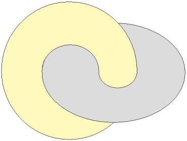
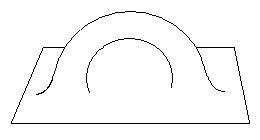
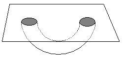
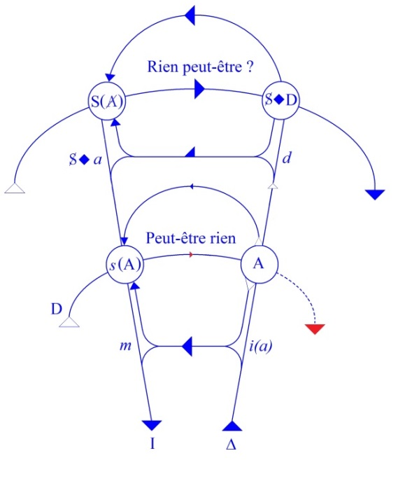
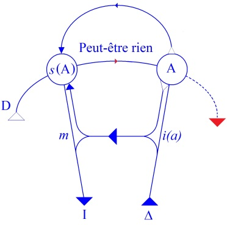

# Leçon 14 | 21 Mars 1962

  

    <label><input type="checkbox" data-lacan-toggle="original" checked> 原文</label>
    <label><input type="checkbox" data-lacan-toggle="notes" checked> 注释</label>
    <label><input type="checkbox" data-lacan-toggle="commentary" checked> 个人解读评论</label>
  

  <form class="lacan-tool-search" role="search">
    <input class="lacan-tool-search-input" type="search" placeholder="搜索全文" aria-label="搜索全文">
    <button class="lacan-tool-button" type="submit" title="搜索">搜索</button>
  </form>
  <button class="lacan-tool-button lacan-back-to-top" type="button" title="回到页面最上方" aria-label="回到页面最上方">↑</button>

<section class="parallel-paragraph" data-paragraph-ids="s9-14-0001">

s9-14-0001

原文 · s9-14-0001

Je vous ai laissés la dernière fois au niveau de cet embrassement symbolique des deux tores où s’incarne imaginairement le rapport d’interversion, si l’on peut dire, vécu par le névrosé, dans la mesure sensible, clinique, où nous voyons, qu’apparemment au moins, c’est dans une dépendance de *la demande de l’Autre* qu’il essaie de fonder, d’instituer *son désir*.

[无对应译文]

</section>

<section class="parallel-paragraph" data-paragraph-ids="s9-14-0002">

s9-14-0002

原文 · s9-14-0002

Bien sûr, il y a là quelque chose de fondé dans cette structure que nous appelons la structure du sujet en tant qu’il parle, qui est celle pour laquelle nous fomentons pour vous cette topologie du tore que nous croyons très fondamentale.

[无对应译文]

</section>

<section class="parallel-paragraph" data-paragraph-ids="s9-14-0003">

s9-14-0003

原文 · s9-14-0003

[无对应译文]

</section>

<section class="parallel-paragraph" data-paragraph-ids="s9-14-0004">

s9-14-0004

原文 · s9-14-0004

Il a la fonction de ce qu’on appelle ailleurs, en topologie, *le groupe fondamental*, et après tout, ce sera la question à quoi il faudra que nous indiquions une réponse. J’espère que cette réponse, au moment où il faudra la donner, sera vraiment surabondamment déjà *dessinée*.

[无对应译文]

</section>

<section class="parallel-paragraph" data-paragraph-ids="s9-14-0005">

s9-14-0005

原文 · s9-14-0005

Pourquoi, si c’est là la structure fondamentale, a-t-elle été de si longtemps et de toujours si profondément méconnue par la pensée philosophique ? Pourquoi si c’est ainsi, l’autre topologie, celle de *la sphère*, qui traditionnellement paraît dominer toute l’élaboration de la pensée concernant son rapport à la chose ? Reprenons les choses où nous les avons laissées la dernière fois, et où je vous indiquai ce qui est impliqué dans notre expérience même.

[无对应译文]

</section>

<section class="parallel-paragraph" data-paragraph-ids="s9-14-0006">

s9-14-0006

原文 · s9-14-0006

Il y a dans ce nœud avec l’Autre - pour autant qu’il nous est offert comme une première approxima­tion sensible, peut-être trop facile, nous verrons qu’il l’est, assurément - il y a dans ce nœud avec l’Autre, tel qu’il est ici imagé, un rapport de *leurre*. Retournons ici à l’actuel, à l’articulé de ce rapport à l’Autre. Nous le connais­sons.

[无对应译文]

</section>

<section class="parallel-paragraph" data-paragraph-ids="s9-14-0007">

s9-14-0007

原文 · s9-14-0007

Comment ne le connaîtrions-nous pas, quand nous sommes chaque jour le support même de sa pression dans l’analyse et que le sujet névrosé, à qui nous avons affaire fondamentalement, devant nous se présente comme exigeant de nous la réponse, ceci même si nous lui enseignons le prix qu’il y a, cette réponse, à la suspendre. La réponse sur quoi ? C’est bien là ce qui justifie notre schéma pour autant qu’il nous montre, l’un à l’autre se substituant, désir et demande, c’est justement que la réponse c’est sur *son désir* et sur *sa satisfaction*.

[无对应译文]

</section>

<section class="parallel-paragraph" data-paragraph-ids="s9-14-0008">

s9-14-0008

原文 · s9-14-0008

Ce sans doute à quoi aujourd’hui je serai à peu près certainement limité par le temps qui m’est donné, c’est à bien articuler à quelles coordonnées se suspend *cette demande faite à l’Autre*. Cette *demande* de réponse, laquelle spécifie dans sa raison vraie, sa raison dernière, auprès de quoi toute approximation est insuf­fisante, celle qui dans FREUD s’épingle comme *versagen,* *la* *Versagung, le* *dédit*, ou encore *la trompeuse parole*, la rupture de promesse, à la limite *la vanitas*, à la limite de *la* *mauvaise parole*, et l’*ambiguïté*, ici je vous la rappelle, qui unit le terme « *blasphème* »[^128] à ce qu’il a donné à travers toutes sortes de *transformations*, d’ailleurs en elles-mêmes bien jolies à suivre : « *le blâme* ».

[无对应译文]

</section>

<section class="parallel-paragraph" data-paragraph-ids="s9-14-0009">

s9-14-0009

原文 · s9-14-0009

Je n’irai pas plus loin dans cette voie. Le rapport essentiel de *la frustration* à laquelle nous avons affaire, à la parole, est le point à soutenir, à maintenir toujours radical, faute de quoi notre concept de *la frustration* se dégrade, elle dégénère jusqu’à se réduire au défaut de gratification concernant ce qui au dernier terme ne peut plus être conçu que comme *le besoin*.

[无对应译文]

</section>

<section class="parallel-paragraph" data-paragraph-ids="s9-14-0010">

s9-14-0010

原文 · s9-14-0010

Or il est impossible de ne pas rappeler ce que le génie de FREUD nous avère originellement quant à la fonction du désir \- ce dont il est parti dans ses premiers pas, laissons de côté les lettres à FLIESS, commençons à la *Science des rêves* et n’oublions pas que *Totem et tabou* était son livre préféré - ce que génie de FREUD nous avère, est ceci : que le désir est foncièrement, radicalement, struc­turé par *ce nœud qui s’appelle l’Œdipe*.

[无对应译文]

</section>

<section class="parallel-paragraph" data-paragraph-ids="s9-14-0011">

s9-14-0011

原文 · s9-14-0011

Et d’où : il est impossible d’éliminer *ce nœud interne* - qui est ce que j’essaie de soutenir devant vous par ces figures - *ce nœud interne qui s’appelle l’Œdipe* en tant qu’il est essentiellement quoi ? Il est essentiellement ceci, un rapport entre :

[无对应译文]

</section>

<section class="parallel-paragraph" data-paragraph-ids="s9-14-0012">

s9-14-0012

原文 · s9-14-0012

- *une demande* qui prend une valeur si pri­vilégiée qu’elle devient le commandement absolu, la loi,

[无对应译文]

</section>

<section class="parallel-paragraph" data-paragraph-ids="s9-14-0013">

s9-14-0013

原文 · s9-14-0013

- et *un désir*, lequel est le désir de l’Autre, de l’Autre dont il s’agit dans l’Œdipe.

[无对应译文]

</section>

<section class="parallel-paragraph" data-paragraph-ids="s9-14-0014">

s9-14-0014

原文 · s9-14-0014

Cette demande s’articule ainsi : « *Tu ne désireras pas celle qui a été mon désir.* » Or c’est ceci qui fonde en sa structure l’essentiel, le départ de la vérité freudienne.

[无对应译文]

</section>

<section class="parallel-paragraph" data-paragraph-ids="s9-14-0015">

s9-14-0015

原文 · s9-14-0015

Et c’est là, c’est à partir de là que tout désir possible est en quelque sorte obligé à cette sorte de détour irré­ductible, ce quelque chose de *semblable à l’impossibilité dans le tore de la réduc­tion du lacs sur certains cercles*, qui fait que le désir doit inclure en lui ce vide, ce trou interne, spécifié dans ce rapport à la *Loi originelle*.

[无对应译文]

</section>

<section class="parallel-paragraph" data-paragraph-ids="s9-14-0016">

s9-14-0016

原文 · s9-14-0016

N’oublions pas les pas que...

[无对应译文]

</section>

<section class="parallel-paragraph" data-paragraph-ids="s9-14-0017">

s9-14-0017

原文 · s9-14-0017

> pour fonder ce rapport premier autour de quoi, nous ne l’oublions que trop, sont pour FREUD articulables, et seulement par là, toutes les *Liebesbedingungen,* toutes les déterminations de *l’amour* ...n’oublions pas les pas que dans la dialectique freudienne ceci exige : c’est dans ce rapport à l’Autre, le père tué, au-delà de ce trépas du meurtre originel, que se constitue cette forme suprême de l’amour.

[无对应译文]

</section>

<section class="parallel-paragraph" data-paragraph-ids="s9-14-0018">

s9-14-0018

原文 · s9-14-0018

C’est le paradoxe, non du tout dissimulé, même s’il est élidé par ce voile aux yeux, qui semble ici toujours accompagner de FREUD la lecture : ce temps est inéliminable, *qu’après le meurtre du père surgit* pour lui...

[无对应译文]

</section>

<section class="parallel-paragraph" data-paragraph-ids="s9-14-0019">

s9-14-0019

原文 · s9-14-0019

> même, si ceci ne nous est pas suffisamment expliqué, c’est assez pour que nous en rete­nions le temps
>
> comme essentiel dans ce qu’on peut appeler la structure mythique de l’Œdipe ...*cet amour suprême pour le père*, lequel fait justement de ce trépas du meurtre originel la condition de *sa présence désormais absolue*.

[无对应译文]

</section>

<section class="parallel-paragraph" data-paragraph-ids="s9-14-0020">

s9-14-0020

原文 · s9-14-0020

*La mort* en somme, *jouant ce rôle*, se manifestait comme pouvant seule le fixer dans cette sorte de réalité, sans doute la seule comme absolument perdurable, d’être comme absent. Il n’y a nulle autre source à l’absoluité du commandement ori­ginel. Voilà où se constitue le champ commun dans lequel s’institue l’objet du désir, dans la position sans doute que nous lui connaissons déjà comme nécessaire au seul niveau imaginaire, à savoir une position tierce.

[无对应译文]

</section>

<section class="parallel-paragraph" data-paragraph-ids="s9-14-0021">

s9-14-0021

原文 · s9-14-0021

La seule dialectique du rapport à l’autre en tant que transitif, dans le rapport imaginaire du stade du miroir, vous avait déjà appris qu’il constituait l’objet de l’intérêt humain comme lié à son *semblable*, *l’objet(a)* ici, par rapport à cette image qui l’inclut, qui est l’image de l’autre au niveau du stade du miroir *i(a)*.

[无对应译文]

</section>

<section class="parallel-paragraph" data-paragraph-ids="s9-14-0022">

s9-14-0022

原文 · s9-14-0022

Mais cet intérêt n’est en quelque sorte qu’une forme, il est l’objet de cet intérêt neutre autour de quoi même toute la dialectique de l’enquête de monsieur PIAGET peut s’ordonner, en mettant au premier plan ce rapport qu’il appelle de réciprocité, qu’il croit pou­voir conjoindre à une formule radicale du rapport logique.

[无对应译文]

</section>

<section class="parallel-paragraph" data-paragraph-ids="s9-14-0023">

s9-14-0023

原文 · s9-14-0023

C’est de cette équi­valence, de cette identification à l’autre comme imaginaire que la ternarité du surgissement de l’objet s’institue, mais ce n’est qu’une structure insuffisante, par­tielle, et donc que nous devons retrouver, au terme, comme déductible de l’ins­titution de *l’objet du désir* au niveau où, ici et aujourd’hui, je l’articule pour vous.

[无对应译文]

</section>

<section class="parallel-paragraph" data-paragraph-ids="s9-14-0024">

s9-14-0024

原文 · s9-14-0024

Le rapport à l’Autre n’est point ce rapport *imaginaire* fondé sur la spéci­ficité de la forme générique, puisque ce rapport à l’Autre y est spécifié par *la demande*, en tant qu’elle fait surgir de cet Autre, qui est l’Autre avec un grand A, son essentialité si je puis dire, dans la constitution du sujet, ou, pour reprendre la forme qu’on donne toujours au verbe « *inter-esser* », son « *inter-essen­tialité* » au sujet.

[无对应译文]

</section>

<section class="parallel-paragraph" data-paragraph-ids="s9-14-0025">

s9-14-0025

原文 · s9-14-0025

Le champ dont il s’agit ne saurait donc d’aucune façon être réduit au champ du besoin et de l’objet qui, pour la rivalité de ses semblables, peut à la limite s’imposer - car ce sera là la pente où nous irons trouver notre recours pour la rivalité dernière - s’imposer comme objet de subsistance pour l’organisme. Cet autre champ, que nous définissons et pour lequel est faite notre image du *tore*, est un autre champ, un champ de signifiant, champ de connotation de *la présence* et de *l’absence*, et où l’objet n’est plus objet de subsistance, mais d’*ex-sistence* du sujet.

[无对应译文]

</section>

<section class="parallel-paragraph" data-paragraph-ids="s9-14-0026">

s9-14-0026

原文 · s9-14-0026

Pour venir à le démontrer...

[无对应译文]

</section>

<section class="parallel-paragraph" data-paragraph-ids="s9-14-0027">

s9-14-0027

原文 · s9-14-0027

> il s’agit bien au dernier terme d’une certaine place d’*ex-sistence* du sujet, nécessaire,
>
> et que c’est là la fonction à quoi est élevé, amené le *petit(a)* de la rivalité première

[无对应译文]

</section>

<section class="parallel-paragraph" data-paragraph-ids="s9-14-0028">

s9-14-0028

原文 · s9-14-0028

...nous avons devant nous le chemin qui nous reste à parcourir, de ce sommet où je vous ai amenés la dernière fois, de la dominance de l’autre dans l’institution du rapport frustrant.

[无对应译文]

</section>

<section class="parallel-paragraph" data-paragraph-ids="s9-14-0029">

s9-14-0029

原文 · s9-14-0029

La seconde partie du chemin doit nous mener de *la frustration* à ce rapport à définir, ce qui constitue comme tel le sujet dans le désir, et vous savez que c’est là seulement que nous pourrons convenablement articuler la castration. Nous ne saurons donc au dernier terme ce que veut dire cette place d’ *ex-sistence* que quand ce chemin sera achevé.

[无对应译文]

</section>

<section class="parallel-paragraph" data-paragraph-ids="s9-14-0030">

s9-14-0030

原文 · s9-14-0030

Dès maintenant nous pouvons, nous devons même, rappeler - mais rappeler ici au phi­losophe le moins introduit à notre expérience - *ce point singulier*, à le voir si sou­vent se dérober à son propre discours, c’est qu’il y a bien une question, à savoir :

[无对应译文]

</section>

<section class="parallel-paragraph" data-paragraph-ids="s9-14-0031">

s9-14-0031

原文 · s9-14-0031

- ce pourquoi il faut que le sujet soit *représenté* - et j’entends au sens freudien, *représenté par un représentant représentatif* -comme exclu du champ même où il a à agir, dans des rapports disons lewiniens[^129], avec les autres comme individus,

[无对应译文]

</section>

<section class="parallel-paragraph" data-paragraph-ids="s9-14-0032">

s9-14-0032

原文 · s9-14-0032

- qu’il faut, au niveau de la structure, que nous arrivions à rendre compte de pourquoi il est nécessaire

[无对应译文]

</section>

<section class="parallel-paragraph" data-paragraph-ids="s9-14-0033">

s9-14-0033

原文 · s9-14-0033

> qu’il soit représenté quelque part comme exclu de ce champ pour y intervenir, dans ce champ même.

[无对应译文]

</section>

<section class="parallel-paragraph" data-paragraph-ids="s9-14-0034">

s9-14-0034

原文 · s9-14-0034

Car après tout, tous les raisonnements où nous entraîne le psycho-sociologue dans sa définition de ce que j’ai appelé tout à l’heure un champ lewinien, ne se présentent jamais qu’avec une parfaite élision de cette nécessité : que le sujet soit, disons, en deux endroits topologiquement définis, à savoir *dans ce champ*, mais aussi essentiellement *exclu* de ce champ, et qu’il arrive à articuler quelque chose, et quelque chose qui se tient.

[无对应译文]

</section>

<section class="parallel-paragraph" data-paragraph-ids="s9-14-0035">

s9-14-0035

原文 · s9-14-0035

Tout ce qui, dans une pensée de *la conduite de l’homme* comme observable, arrive à se défi­nir comme apprentissage, et à la limite objectivation de l’apprentissage, c’est-à­-dire montage, forme un discours qui se tient, et qui jusqu’à un certain point, rend compte d’une foule de choses, sauf de ceci : qu’effectivement *le sujet* fonctionne non pas avec cet emploi simple, si je puis dire, mais dans *un double emploi*, lequel vaut tout de même qu’on s’y arrête et que, si fuyant qu’il se présente à nous, il est sensible de tellement de façons qu’il suffit, si je puis dire, de se pencher pour en ramasser *les preuves*. Ce n’est point autre chose que j’essaie de vous faire sentir, chaque fois par exemple qu’incidemment je ramène *les pièges de la double néga­tion* et que le : « *Je ne sache pas que je veuille* » n’est pas entendu de la même façon je pense, que « *Je sais que je ne veux pas* ».

[无对应译文]

</section>

<section class="parallel-paragraph" data-paragraph-ids="s9-14-0036">

s9-14-0036

原文 · s9-14-0036

Réfléchissez sur ces petits problèmes jamais épuisés - car les logiciens de la langue s’y exercent, et leurs balbutiements sont là plus qu’instructifs - qu’aussi souvent qu’il y aura des paroles qui coulent, et même des écrivains qui laissent fluer les choses au bout de leur plume comme elles se parlent, on dira à quelqu’un - j’ai déjà insisté[^130], mais on ne saurait trop y revenir - « *Vous n’êtes pas sans ignorer* [^131] » pour lui dire : *Vous savez bien, tout de même !* »

[无对应译文]

</section>

<section class="parallel-paragraph" data-paragraph-ids="s9-14-0037">

s9-14-0037

原文 · s9-14-0037

*Le double plan* sur lequel joue ceci est que cela va de soi que quelqu’un écrive comme cela, et que c’est arrivé. Cela m’a été rappelé récemment dans un de ces textes de PRÉVERT, de quoi GIDE s’étonnait : « *Est-ce qu’il a voulu se moquer, ou sait-il bien ce qu’il écrit ?* ». Il n’a pas *voulu se moquer *: ça lui a coulé de la plume.

[无对应译文]

</section>

<section class="parallel-paragraph" data-paragraph-ids="s9-14-0038">

s9-14-0038

原文 · s9-14-0038

Et toute la critique des logiciens ne fera pas qu’il nous advienne, pour peu que nous soyons engagés dans un véritable dialogue avec quelqu’un, à savoir qu’il s’agisse, d’une façon quelconque, d’une certaine condition essentielle à nos rap­ports avec lui, qui est celle à laquelle je pense arriver tout à l’heure, qu’il est essentiel que quelque chose entre nous s’institue comme *ignorance,* que je glis­serai à lui dire, si savant et si puriste que je sois : « *vous n’êtes pas sans ignorer* ».

[无对应译文]

</section>

<section class="parallel-paragraph" data-paragraph-ids="s9-14-0039">

s9-14-0039

原文 · s9-14-0039

Le même jour où je vous en parlais ici, je me suis détourné de citer ce que je venais de lire dans *Le Canard Enchaîné,* à la fin d’un de ces morceaux de bravoure qui se poursuivent sous la signature d’André RIBAUD[^132], avec pour titre « *La Cour* » : « *Il ne faut pas se décombattre*... » - dans un style pseudo saint-simonien, de même que BALZAC écrivait une langue du XVIème siècle entièrement inventée par lui - « ...*de quelque défiance des rois* ». Vous comprenez parfaitement ce que cela veut dire. Essayez de *l’analyser logiquement*, et vous voyez que cela dit exactement le contraire de ce que vous comprenez. Et vous êtes naturellement tout à fait en droit de comprendre ce que vous comprenez, parce que c’est dans la structure du sujet.

[无对应译文]

</section>

<section class="parallel-paragraph" data-paragraph-ids="s9-14-0040">

s9-14-0040

原文 · s9-14-0040

Le fait que *les deux négations* qui ici se superposent, non seulement *ne s’annulent pas, mais* bien effectivement *se soutiennent*, tient au fait d’*une dupli­cité topologique* qui fait que « *Il ne faut pas se décombattre* » ne se dise pas sur le même plan, si je puis dire, où s’institue le « *de quelque défiance des rois* ». L’*énoncia­tion* et l’*énoncé*, comme toujours, sont parfaitement séparables, mais ici leur *béance* éclate. Si le tore comme tel peut nous servir - vous le verrez - de pont, s’il s’avère déjà suf­fisant à nous montrer en quoi consiste, une fois passé dans le monde *ce dédou­blement, cette ambiguïté du sujet*, n’est-il pas bon aussi bien à cet endroit de nous arrêter sur ce qu’elle comporte d’évidence cette topologie ?

[无对应译文]

</section>

<section class="parallel-paragraph" data-paragraph-ids="s9-14-0041">

s9-14-0041

原文 · s9-14-0041

Et tout d’abord dans notre plus simple expérience, je veux dire celle du sujet, quand nous parlons de l’engagement, est-il besoin de grands détours - de ceux qu’ici je vous fais franchir pour les besoins de notre cause - est-il besoin de grands détours aux moins initiés pour évoquer ceci : que s’engager implique déjà en soi l’image du couloir, l’image de l’entrée et de la sortie, et jusqu’à un certain point l’image de l’issue derrière soi fermée, et que c’est bien dans ce rapport à se fermer l’issue que le dernier terme de l’image de l’engagement se révèle ?

[无对应译文]

</section>

<section class="parallel-paragraph" data-paragraph-ids="s9-14-0042">

s9-14-0042

原文 · s9-14-0042

En faut-il beaucoup plus ? Et toute la lit­térature qui culmine dans l’œuvre de KAFKA peut nous faire apercevoir qu’il suf­fit de retourner ce que - paraît-il - la dernière fois, je n’ai pas assez imagé en vous montrant cette forme particulière du tore sous la forme de la poignée dégagée d’un plan :

[无对应译文]

</section>

<section class="parallel-paragraph" data-paragraph-ids="s9-14-0043">

s9-14-0043

原文 · s9-14-0043

[无对应译文]

</section>

<section class="parallel-paragraph" data-paragraph-ids="s9-14-0044">

s9-14-0044

原文 · s9-14-0044

Le plan ne présentant ici que le cas particulier d’une sphère infinie élar­gissant un côté du tore. Il suffit de faire basculer cette image, de la présenter le ventre en l’air.

[无对应译文]

</section>

<section class="parallel-paragraph" data-paragraph-ids="s9-14-0045">

s9-14-0045

原文 · s9-14-0045

[无对应译文]

</section>

<section class="parallel-paragraph" data-paragraph-ids="s9-14-0046">

s9-14-0046

原文 · s9-14-0046

Toutes ces *archi­tectures* ne sont tout de même pas sans quelque chose qui doive nous retenir pour leurs affinités avec quelque chose qui doit bien aller plus loin que la simple satis­faction d’un besoin, pour une analogie dont il saute aux yeux qu’elle est irréduc­tible, impossible à exclure de tout ce qui s’appelle pour lui *intérieur* et *extérieur*, et que *l’un et l’autre débouchent* *l’un sur l’autre et se commandent*.

[无对应译文]

</section>

<section class="parallel-paragraph" data-paragraph-ids="s9-14-0047">

s9-14-0047

原文 · s9-14-0047

Ce que j’ai appelé tout à l’heure le couloir, la galerie, le sous-terrain...

[无对应译文]

</section>

<section class="parallel-paragraph" data-paragraph-ids="s9-14-0048">

s9-14-0048

原文 · s9-14-0048

*Mémoires écrits du sous-terrain*, intitule DOSTOÏEVSKI[^133],

[无对应译文]

</section>

<section class="parallel-paragraph" data-paragraph-ids="s9-14-0049">

s9-14-0049

原文 · s9-14-0049

ce point extrême où il scande la palpitation de sa question dernière ...est-ce là quelque chose qui s’épuise dans la notion d’ins­trument socialement utilisable ?

[无对应译文]

</section>

<section class="parallel-paragraph" data-paragraph-ids="s9-14-0050">

s9-14-0050

原文 · s9-14-0050

Bien sûr, comme nos deux tores, la fonction de l’agglomérat social et son rapport aux voies, en tant que leur [*anastomose*](http://www.cnrtl.fr/definition/anastomose) simule quelque chose qui existe au plus intime de l’organisme, est pour nous un objet préfiguré d’interrogation. Ce n’est pas notre privilège, *la fourmi* et *le termite* le connaissent, mais *le blaireau* dont nous parle KAFKA[^134], *dans son terrier, n’est pas* précisément, lui, *un animal sociable*.

[无对应译文]

</section>

<section class="parallel-paragraph" data-paragraph-ids="s9-14-0051">

s9-14-0051

原文 · s9-14-0051

Que veut dire ce rappel si ce n’est - pour nous, au point où nous avons à nous avancer - que si *ce rapport de structure* est si naturel, qu’à condition d’y penser nous trouvions partout, et fort loin enfoncées, ses racines dans *la structure des choses*, le fait que, *quand il s’agit que la pensée organise le rapport du sujet au monde*, elle le *méconnaisse* au cours des âges si abondamment, pose justement *la question* de savoir pourquoi il y a là si loin poussé, *refoulement*, disons à tout le moins, *méconnaissance*. Ceci nous ramène à notre départ qui est celui du rapport à l’Autre, en tant que je l’ai appelé, fondé sur quelque leurre qu’il s’agit maintenant d’articuler bien ailleurs que ce rapport naturel, puisque aussi bien nous voyons combien à la pensée il se dérobe, combien la pensée le refuse.

[无对应译文]

</section>

<section class="parallel-paragraph" data-paragraph-ids="s9-14-0052">

s9-14-0052

原文 · s9-14-0052

C’est d’*ailleurs* qu’il nous faut partir : et de la position de la question à l’Autre, de la question sur son *désir* et sa satisfaction. S’il y a *leurre* *il doit tenir quelque part à ce que j’ai appelé tout à l’heure* *la duplicité radicale de la position du sujet*.

[无对应译文]

</section>

<section class="parallel-paragraph" data-paragraph-ids="s9-14-0053">

s9-14-0053

原文 · s9-14-0053

Et c’est ce que je voudrais vous faire sentir au niveau propre alors du signifiant en tant qu’il se spécifie de la duplicité de la position subjective, et un instant vous demander de me suivre sur quelque chose qui s’appelle au dernier terme la différence pour laquelle *le graphe*, auquel je vous ai tenu pendant un certain temps de mon discours attachés[^135], est à proprement par­ler, forgé. Cette différence s’appelle dif­férence entre *le message* \[Peut-être rien\] et *la question* \[Rien peut-être ?\]

[无对应译文]

</section>

<section class="parallel-paragraph" data-paragraph-ids="s9-14-0054">

s9-14-0054

原文 · s9-14-0054

[无对应译文]

</section>

<section class="parallel-paragraph" data-paragraph-ids="s9-14-0055">

s9-14-0055

原文 · s9-14-0055

*Ce graphe* qui s’inscrirait si bien ici dans *la béance* même par *où le sujet se raccorde doublement* au plan du discours universel, je vais y inscrire aujourd’hui les quatre points de concours qui sont ceux que vous connaissez :

[无对应译文]

</section>

<section class="parallel-paragraph" data-paragraph-ids="s9-14-0056">

s9-14-0056

原文 · s9-14-0056

- A,

[无对应译文]

</section>

<section class="parallel-paragraph" data-paragraph-ids="s9-14-0057">

s9-14-0057

原文 · s9-14-0057

- *s*(A) *la signification du message* en tant que c’est *du retour* venant de l’Autre *du signifiant qui y réside*,

[无对应译文]

</section>

<section class="parallel-paragraph" data-paragraph-ids="s9-14-0058">

s9-14-0058

原文 · s9-14-0058

- ici S ◊ D le rapport du sujet à la demande en tant que s’y spécifie la pulsion,

[无对应译文]

</section>

<section class="parallel-paragraph" data-paragraph-ids="s9-14-0059">

s9-14-0059

原文 · s9-14-0059

- ici le S(A) le signifiant de l’Autre, en tant que l’Autre au dernier terme ne peut se *formaliser*, se *significantiser* que comme mar­qué lui-même par le signifiant, autrement dit en tant qu’il nous impose la renon­ciation à tout *métalangage*.

[无对应译文]

</section>

<section class="parallel-paragraph" data-paragraph-ids="s9-14-0060">

s9-14-0060

原文 · s9-14-0060

La béance qu’il s’agit ici d’articuler se suspend tout entière en la forme où, au dernier terme, cette demande à l’Autre de répondre, alterne, se balance en une suite de retours entre :

[无对应译文]

</section>

<section class="parallel-paragraph" data-paragraph-ids="s9-14-0061">

s9-14-0061

原文 · s9-14-0061

- le « *Rien peut-être ?* »,

[无对应译文]

</section>

<section class="parallel-paragraph" data-paragraph-ids="s9-14-0062">

s9-14-0062

原文 · s9-14-0062

- et le « *Peut-être rien* » : c’est ici *un message*.

[无对应译文]

</section>

<section class="parallel-paragraph" data-paragraph-ids="s9-14-0063">

s9-14-0063

原文 · s9-14-0063

[无对应译文]

</section>

<section class="parallel-paragraph" data-paragraph-ids="s9-14-0064">

s9-14-0064

原文 · s9-14-0064

Il s’ouvre sur ce qui nous est apparu comme *l’ouver­ture* constituée par l’entrée d’un sujet dans le *Réel*. Nous sommes ici en accord avec l’élaboration la plus certaine du terme de possibilité : *Möglichkeit.* Ce n’est pas du côté de *la chose* qu’est *le possible*, mais du côté du *sujet*. Le message s’ouvre sur le terme de l’éventualité constituée par une *attente* dans la situation *constituante* du désir, telle que nous tentons ici de la serrer. Peut-être, la possi­bilité est antérieure à ce nominatif rien qui, à l’extrême, prend valeur de substi­tut de la positivité.

[无对应译文]

</section>

<section class="parallel-paragraph" data-paragraph-ids="s9-14-0065">

s9-14-0065

原文 · s9-14-0065

C’est un point, *et un point c’est tout*. La place du *trait unaire* est là réservée dans le vide qui peut répondre à l’attente du désir. C’est tout autre chose que *la question* *en tant qu’elle s’articule* « *Rien peut-être ?* », que le « *peut-être ?* »... *au niveau de la demande mise en question* : « *qu’est–ce que je veux ?* », parlant à l’Autre ...que le « *peut-être ?* » qui vient ici en position *homologique* à ce qui au niveau du message constituait la réponse éventuelle.

[无对应译文]

</section>

<section class="parallel-paragraph" data-paragraph-ids="s9-14-0066">

s9-14-0066

原文 · s9-14-0066

« *Peut-être rien* » *c’est la première formulation du* *message*. « *Peut-être : rien* », ce peut être *une réponse*, mais est-ce la réponse à la question « *Rien peut-être ?* » ? Justement pas ! Ici, l’énonciatif « *rien* », comme posant la *possibilité* du non lieu de conclure, d’abord, comme antérieur à la cote d’existence, à la puissance d’être, cet énonciatif au niveau de la question prend toute sa valeur d’une substantification du néant de la question elle-même.

[无对应译文]

</section>

<section class="parallel-paragraph" data-paragraph-ids="s9-14-0067">

s9-14-0067

原文 · s9-14-0067

La phrase « *Rien peut-être ?* » s’ouvre, elle, *sur la probabilité*

[无对应译文]

</section>

<section class="parallel-paragraph" data-paragraph-ids="s9-14-0068">

s9-14-0068

原文 · s9-14-0068

- que rien ne la détermine comme question,

[无对应译文]

</section>

<section class="parallel-paragraph" data-paragraph-ids="s9-14-0069">

s9-14-0069

原文 · s9-14-0069

- que rien ne soit déterminé du tout,

[无对应译文]

</section>

<section class="parallel-paragraph" data-paragraph-ids="s9-14-0070">

s9-14-0070

原文 · s9-14-0070

- qu’il reste possible que rien ne soit sûr,

[无对应译文]

</section>

<section class="parallel-paragraph" data-paragraph-ids="s9-14-0071">

s9-14-0071

原文 · s9-14-0071

- qu’il est possible qu’on ne puisse pas *conclure*, *si ce n’est par le recours à l’antériorité infinie du Procès kafkaïen*,

[无对应译文]

</section>

<section class="parallel-paragraph" data-paragraph-ids="s9-14-0072">

s9-14-0072

原文 · s9-14-0072

- qu’il y ait pure subsistance de la question avec l’impossibilité de conclure.

[无对应译文]

</section>

<section class="parallel-paragraph" data-paragraph-ids="s9-14-0073">

s9-14-0073

原文 · s9-14-0073

Seule l’éventualité du *Réel* permet de déterminer quelque chose, et la nomination du néant de la pure subsistance de la question, voilà ce à quoi, au niveau de la question elle-même, nous avons affaire.

[无对应译文]

</section>

<section class="parallel-paragraph" data-paragraph-ids="s9-14-0074">

s9-14-0074

原文 · s9-14-0074

- « *Peut-être rien *» pouvait être au niveau du *message* une réponse, mais *le message* n’était justement pas *une question*.

[无对应译文]

</section>

<section class="parallel-paragraph" data-paragraph-ids="s9-14-0075">

s9-14-0075

原文 · s9-14-0075

- « *Rien peut-être  ?* », au niveau de la question, ne donne qu’*une métaphore*, à savoir que *la puissance d’être est de l’au-delà.*

[无对应译文]

</section>

<section class="parallel-paragraph" data-paragraph-ids="s9-14-0076">

s9-14-0076

原文 · s9-14-0076

-

[无对应译文]

</section>

<section class="parallel-paragraph" data-paragraph-ids="s9-14-0077">

s9-14-0077

原文 · s9-14-0077

- Toute éventualité y a disparu déjà, et toute subjectivité aussi. Il n’y a qu’effet de sens, renvoi du sens au sens à l’infini,

[无对应译文]

</section>

<section class="parallel-paragraph" data-paragraph-ids="s9-14-0078">

s9-14-0078

原文 · s9-14-0078

- à ceci près que, pour nous analystes, nous nous sommes habitués par expérience *à structurer ce ren­voi sur deux plans*

[无对应译文]

</section>

<section class="parallel-paragraph" data-paragraph-ids="s9-14-0079">

s9-14-0079

原文 · s9-14-0079

- et que c’est cela qui *change tout*.

[无对应译文]

</section>

<section class="parallel-paragraph" data-paragraph-ids="s9-14-0080">

s9-14-0080

原文 · s9-14-0080

À savoir que la métaphore pour nous est *condensation*, ce qui veut dire deux chaînes et qu’elle fait, la méta­phore, son apparition de façon inattendue au beau milieu du message :

[无对应译文]

</section>

<section class="parallel-paragraph" data-paragraph-ids="s9-14-0081">

s9-14-0081

原文 · s9-14-0081

- qu’elle devient aussi *message au milieu de la question*,

[无对应译文]

</section>

<section class="parallel-paragraph" data-paragraph-ids="s9-14-0082">

s9-14-0082

原文 · s9-14-0082

- que la question « *famille* » com­mence à s’articuler, et que surgit au beau milieu « *le million du millionnaire* »,

[无对应译文]

</section>

<section class="parallel-paragraph" data-paragraph-ids="s9-14-0083">

s9-14-0083

原文 · s9-14-0083

- que l’irruption de la question dans le message se fait en ceci qu’il nous est révélé que le message se manifeste au beau milieu de *la question*,

[无对应译文]

</section>

<section class="parallel-paragraph" data-paragraph-ids="s9-14-0084">

s9-14-0084

原文 · s9-14-0084

- qu’il se fait jour sur le che­min où nous sommes appelés à la vérité, que c’est à travers notre question de vérité, j’entends, la question même, et non pas dans la réponse à la question, que le message se fait jour.

[无对应译文]

</section>

<section class="parallel-paragraph" data-paragraph-ids="s9-14-0085">

s9-14-0085

原文 · s9-14-0085

C’est donc en ce point précis, précieux pour l’articulation de *la différence de l’énonciation à l’énoncé*, qu’il nous fallait un instant nous arrêter. Cette possibilité du « *rien* », si elle n’est pas préservée, c’est ce qui nous empêche de voir, malgré cette omniprésence qui est au principe de toute articu­lation possible proprement subjective, cette béance, qui est également très pré­cisément incarnée dans le passage du signe au signifiant, où nous voyons apparaître ce qu’est ce qui distingue *le sujet* dans cette différence. Est-il *signe* en fin de compte, lui, ou *signifiant* ? *Signe* - *signe* de quoi ? - il est justement *le signe de rien*.

[无对应译文]

</section>

<section class="parallel-paragraph" data-paragraph-ids="s9-14-0086">

s9-14-0086

原文 · s9-14-0086

Si *le signifiant se définit comme représentant le sujet auprès d’un autre signifiant : renvoi indéfini des sens*, et si ceci signifie quelque chose, c’est parce que *le signifiant signifie auprès de l’autre signifiant cette chose privilégiée qu’est <u>le sujet en tant que rien</u>*.

[无对应译文]

</section>

<section class="parallel-paragraph" data-paragraph-ids="s9-14-0087">

s9-14-0087

原文 · s9-14-0087

C’est ici que notre expérience nous permet de mettre en relief la nécessité de la voie par où se supporte *aucune réa­lité*, dans la structure, *identifiable* en tant qu’elle est celle qui nous permet de poursuivre notre expérience. L’Autre *ne répond donc rien*, si ce n’est que « *rien* *n’est sûr »*, mais ceci n’a qu’un sens, c’est qu’*il y a quelque chose dont il ne veut rien savoir*, et très précisément de cette question. À ce niveau, l’impuissance de l’Autre s’enracine dans un *impossible*, qui est bien le même, sur la voie duquel nous avait déjà conduit la question du sujet.

[无对应译文]

</section>

<section class="parallel-paragraph" data-paragraph-ids="s9-14-0088">

s9-14-0088

原文 · s9-14-0088

Pas possible était ce vide où venait surgir dans sa valeur divisante *le trait unaire*. Ici nous voyons cet *impossible* prendre corps, et conjoindre ce que nous avons vu tout à l’heure être défini par FREUD *de la constitution du désir dans l’interdiction originelle.* *L’impuissance de l’Autre à répondre* tient à une impasse, et cette impasse, nous la connaissons, s’appelle *la limitation de son savoir*.

[无对应译文]

</section>

<section class="parallel-paragraph" data-paragraph-ids="s9-14-0089">

s9-14-0089

原文 · s9-14-0089

« *Il ne savait pas qu’il était mort* [^136] », qu’il n’est parvenu à cette absoluité de l’Autre que par la mort non acceptée mais subie, et subie par le désir du sujet. Cela le sujet le sait si je puis dire :

[无对应译文]

</section>

<section class="parallel-paragraph" data-paragraph-ids="s9-14-0090">

s9-14-0090

原文 · s9-14-0090

- que l’Autre ne doive pas le savoir,

[无对应译文]

</section>

<section class="parallel-paragraph" data-paragraph-ids="s9-14-0091">

s9-14-0091

原文 · s9-14-0091

- que l’Autre demande à ne pas savoir.

[无对应译文]

</section>

<section class="parallel-paragraph" data-paragraph-ids="s9-14-0092">

s9-14-0092

原文 · s9-14-0092

C’est là la part privilégiée dans ces deux demandes non confondues, celle du sujet et celle de l’Autre, c’est que justement le désir se définit comme l’intersection de ce qui dans les deux demandes est à ne pas dire. C’est seulement à partir de là que se libèrent les demandes formulables partout ailleurs que dans le champ du désir. Le désir ainsi se constitue d’abord, de sa nature, comme ce qui est caché à l’Autre par structure.

[无对应译文]

</section>

<section class="parallel-paragraph" data-paragraph-ids="s9-14-0093">

s9-14-0093

原文 · s9-14-0093

[无对应译文]

</section>

<section class="parallel-paragraph" data-paragraph-ids="s9-14-0094">

s9-14-0094

原文 · s9-14-0094

C’est l’impossible à l’Autre justement qui devient le désir du sujet. Le désir se constitue comme la partie de la demande qui est cachée à l’Autre. Cet Autre qui ne garantit rien, justement en tant qu’Autre, *en tant que lieu de la parole*,

[无对应译文]

</section>

<section class="parallel-paragraph" data-paragraph-ids="s9-14-0095">

s9-14-0095

原文 · s9-14-0095

- c’est là qu’il prend son incidence édifiante, il devient le voile, la couverture, le principe d’occultation de la place même du désir,

[无对应译文]

</section>

<section class="parallel-paragraph" data-paragraph-ids="s9-14-0096">

s9-14-0096

原文 · s9-14-0096

- *et c’est là que l’objet va se mettre à couvert*.

[无对应译文]

</section>

<section class="parallel-paragraph" data-paragraph-ids="s9-14-0097">

s9-14-0097

原文 · s9-14-0097

Que s’il y a une existence qui se constitue d’abord, c’est celle-là, et qu’elle se substitue à l’*existence* du sujet lui-même, puisque le sujet, en tant que suspendu à l’Autre, reste également suspendu à ceci que du côté de l’Autre rien n’est sûr, sauf justement qu’il cache, qu’il couvre quelque chose qui est cet *objet*, cet *objet* qui n’est encore *peut-être rien* en tant qu’il va devenir *l’objet du désir*.

[无对应译文]

</section>

<section class="parallel-paragraph" data-paragraph-ids="s9-14-0098">

s9-14-0098

原文 · s9-14-0098

*L’objet du désir* existe comme ce *rien* même dont l’Autre ne peut savoir que c’est tout ce en quoi il consiste. Ce *rien* en tant que caché à l’Autre prend consistance, il devient l’enveloppe de tout objet devant quoi la question même du sujet s’arrête, pour autant que le sujet alors ne devient plus *qu’imaginaire*.

[无对应译文]

</section>

<section class="parallel-paragraph" data-paragraph-ids="s9-14-0099">

s9-14-0099

原文 · s9-14-0099

La demande est libérée de la demande de l’Autre dans la mesure où le sujet exclut ce *non-savoir* de l’Autre. Mais il y a deux formes possibles d’exclusion :

[无对应译文]

</section>

<section class="parallel-paragraph" data-paragraph-ids="s9-14-0100">

s9-14-0100

原文 · s9-14-0100

- « *Je m’en lave les mains de ce que vous savez ou de ce que vous ne savez pas, et j’agis* ». « *Vous n’êtes pas sans ignorer*... » veut dire à quel point je m’en moque que vous sachiez ou que vous ne sachiez pas.

[无对应译文]

</section>

<section class="parallel-paragraph" data-paragraph-ids="s9-14-0101">

s9-14-0101

原文 · s9-14-0101

- Mais il y a aussi l’autre façon : « *il faut absolument que vous sachiez* » et c’est la voie que choisit le névrosé, et c’est pour cela qu’il est si je puis dire, désigné d’avance comme votre victime.

[无对应译文]

</section>

<section class="parallel-paragraph" data-paragraph-ids="s9-14-0102">

s9-14-0102

原文 · s9-14-0102

La bonne façon *pour le névrosé* de résoudre le problème de ce champ du désir en tant que constitué par ce champ central des demandes, qui justement se recou­pent et pour ça doivent être exclues, c’est que lui, il trouve que la bonne façon c’est que vous sachiez. S’il n’en était pas ainsi, il ne ferait pas de psychanalyse.

[无对应译文]

</section>

<section class="parallel-paragraph" data-paragraph-ids="s9-14-0103">

s9-14-0103

原文 · s9-14-0103

Qu’est-ce que fait *L’Homme aux Rats* en se levant la nuit comme Théodore[^137] ?

[无对应译文]

</section>

<section class="parallel-paragraph" data-paragraph-ids="s9-14-0104">

s9-14-0104

原文 · s9-14-0104

Il se traîne en savates vers le couloir pour ouvrir la porte au fantôme de son père mort pour lui montrer quoi ? Qu’il est en train de bander. Est-ce que ce n’est pas là la révélation d’une conduite fondamentale ? Le névrosé veut que, faute de pouvoir - puisqu’il s’avère que l’Autre ne peut rien - à tout le moins il sache.

[无对应译文]

</section>

<section class="parallel-paragraph" data-paragraph-ids="s9-14-0105">

s9-14-0105

原文 · s9-14-0105

Je vous ai parlé tout à l’heure d’engagement : *le névrosé, contrairement à ce qu’on croit, est quelqu’un qui s’engage comme sujet*. Il se ferme à l’issue double *du message et de la question*, il se met lui-même en balance pour trancher entre le « *rien peut-être ?* » et le « *peut-être rien* », il se pose comme *réel* en face de l’Autre, c’est­-à-dire comme *impossible*. Sans doute ceci vous apparaîtra mieux, de savoir com­ment ça se produit.

[无对应译文]

</section>

<section class="parallel-paragraph" data-paragraph-ids="s9-14-0106">

s9-14-0106

原文 · s9-14-0106

Ce n’est pas pour rien qu’aujourd’hui j’ai fait surgir cette image du « *Théodore freudien* » dans son exhibition nocturne et fantasmatique, c’est qu’il y a bien quelque medium, et pour mieux dire, quelque instrument à cette incroyable transmutation de l’objet du désir à l’existence du sujet, et que c’est justement *le phallus*. Mais ceci est réservé pour notre prochain propos.

[无对应译文]

</section>

<section class="parallel-paragraph" data-paragraph-ids="s9-14-0107">

s9-14-0107

原文 · s9-14-0107

Aujourd’hui je constate simplement que, *phallus* ou pas, le névrosé arrive dans le champ comme ce qui, du *réel*, se spécifie comme *impossible*. Ça n’est pas exhaustif, car cette définition nous ne pourrons pas l’appliquer à la phobie. Nous ne pourrons le faire que la prochaine fois, mais nous pouvons très bien l’appliquer à *l’obsessionnel*.

[无对应译文]

</section>

<section class="parallel-paragraph" data-paragraph-ids="s9-14-0108">

s9-14-0108

原文 · s9-14-0108

Vous ne comprendrez rien à *l’obsessionnel* si vous ne vous souvenez pas de cette dimension qu’il incarne, lui *l’obsessionnel*, en ceci qu’il est en trop, c’est sa forme de l’*impossible* à lui, et que dès qu’il essaie de sortir de sa position embusquée d’objet caché, il faut qu’il soit l’objet de nulle part.

[无对应译文]

</section>

<section class="parallel-paragraph" data-paragraph-ids="s9-14-0109">

s9-14-0109

原文 · s9-14-0109

D’où cette espèce d’avidité presque féroce chez *l’obsessionnel*, d’être celui qui est partout pour n’être justement nulle part. Le goût d’ubiquité de *l’obsessionnel* est bien connu, et faute de le repérer vous ne com­prendrez rien à la plupart de ses comportements. La moindre des choses, puisqu’il ne peut pas être partout, c’est d’être en tous les cas en plusieurs endroits à la fois, c’est­-à-dire qu’en tout cas, nulle part on ne puisse le saisir.

[无对应译文]

</section>

<section class="parallel-paragraph" data-paragraph-ids="s9-14-0110">

s9-14-0110

原文 · s9-14-0110

- *L’hystérique* a un autre mode, qui est le même bien sûr puisque la racine de celui-ci, quoique moins facile, moins immédiat à comprendre.

[无对应译文]

</section>

<section class="parallel-paragraph" data-paragraph-ids="s9-14-0111">

s9-14-0111

原文 · s9-14-0111

- *L’hystérique* aussi peut se poser comme réel en tant qu’impossible, alors son truc, c’est que cet *impos­sible* subsistera si l’Autre l’admet comme signe.

[无对应译文]

</section>

<section class="parallel-paragraph" data-paragraph-ids="s9-14-0112">

s9-14-0112

原文 · s9-14-0112

- *L’hystérique* se pose comme signe de quelque chose à quoi l’Autre pourrait croire, mais pour constituer ce signe elle est bien réelle, et il faut à tout prix que ce signe s’impose et marque l’Autre.

[无对应译文]

</section>

<section class="parallel-paragraph" data-paragraph-ids="s9-14-0113">

s9-14-0113

原文 · s9-14-0113

Voici donc où aboutit cette structure, cette dialectique fondamentale, tout entière reposant sur la défaillance dernière de l’Autre en tant que garantie du sûr. La réalité du désir s’y institue et y prend place par l’intermédiaire de quelque chose dont nous ne signalerons jamais assez le paradoxe, la dimension du caché, c’est­-à-dire la dimension qui est bien la plus contradictoire que l’esprit puisse construire dès qu’il s’agit de la vérité.

[无对应译文]

</section>

<section class="parallel-paragraph" data-paragraph-ids="s9-14-0114">

s9-14-0114

原文 · s9-14-0114

Quoi de plus naturel que l’introduction de ce champ de la vérité si ce n’est la position d’un Autre omniscient ? Au point que le philosophe le plus aigu, le plus acéré, ne peut faire tenir la dimension même de la vérité, qu’à supposer que c’est *cette science de celui qui sait tout* qui lui permet de se soutenir. Et pourtant rien de la réalité de l’homme, rien de ce qu’il quête ni de ce qu’il suit ne se soutient que de cette dimension du caché, en tant que c’est elle qui infère la garantie qu’il y a un objet bien existant, et qu’elle donne par réflexion cette dimension du caché.

[无对应译文]

</section>

<section class="parallel-paragraph" data-paragraph-ids="s9-14-0115">

s9-14-0115

原文 · s9-14-0115

En fin de compte c’est elle qui donne sa seule consistance à cette Autre problématique, la source de toute foi, et de la foi en Dieu éminemment, est bien ceci que nous nous déplaçons dans la dimension même de ce que, bien que le miracle de ce qu’il doit tout savoir lui donne en somme toute sa subsistance, nous agissons *comme si* toujours, les neuf dixièmes de nos intentions, *il n’en savait rien.*

[无对应译文]

</section>

<section class="parallel-paragraph" data-paragraph-ids="s9-14-0116">

s9-14-0116

原文 · s9-14-0116

« *Pas un mot à la Reine Mère* » tel est le principe sur lequel toute constitution subjective se déploie et se déplace.

[无对应译文]

</section>

<section class="parallel-paragraph" data-paragraph-ids="s9-14-0117">

s9-14-0117

原文 · s9-14-0117

Est-ce qu’il n’est pas possible que se conçoive une conduite à la mesure de ce véritable statut du désir, et est-ce qu’il est même possible que nous ne nous aper­cevions pas que rien, pas un pas de notre conduite éthique ne peut, malgré l’apparence, malgré le bavardage séculaire du moraliste, se soutenir sans un repé­rage exact de la fonction du désir ?

[无对应译文]

</section>

<section class="parallel-paragraph" data-paragraph-ids="s9-14-0118">

s9-14-0118

原文 · s9-14-0118

Est-il possible que nous nous contentions d’exemples aussi dérisoires que celui de KANT quand, pour nous révéler la dimen­sion irréductible de la raison pratique, il nous donne comme exemple que l’hon­nête homme, même au comble du bonheur, ne sera pas sans au moins un instant mettre en balance qu’il renonce à ce bonheur pour ne pas porter contre l’inno­cence un faux témoignage au bénéfice du tyran?

[无对应译文]

</section>

<section class="parallel-paragraph" data-paragraph-ids="s9-14-0119">

s9-14-0119

原文 · s9-14-0119

Exemple absurde, car à l’époque où nous vivons, mais aussi bien à celle de KANT, est-ce que la question n’est pas tout à fait ailleurs ? Car le juste va balancer, oui, à savoir si pour pré­server sa famille il doit porter ou non un faux témoignage. Mais qu’est-ce que cela veut dire ?

[无对应译文]

</section>

<section class="parallel-paragraph" data-paragraph-ids="s9-14-0120">

s9-14-0120

原文 · s9-14-0120

- Est-ce que cela veut dire que s’il donne prise par là à la haine du tyran contre l’innocent, il pourrait porter un vrai témoignage, dénoncer son petit copain comme juif quand il l’est vraiment ?

[无对应译文]

</section>

<section class="parallel-paragraph" data-paragraph-ids="s9-14-0121">

s9-14-0121

原文 · s9-14-0121

- Est-ce que ce n’est pas là que commence la dimension morale, qui n’est pas de savoir quel devoir nous devons remplir ou non vis-à-vis de la vérité, ni si notre conduite tombe ou non sous le coup de la règle universelle, mais si nous devons ou non satisfaire au désir du tyran ?

[无对应译文]

</section>

<section class="parallel-paragraph" data-paragraph-ids="s9-14-0122">

s9-14-0122

原文 · s9-14-0122

Là est la balance éthique à proprement parler. Et c’est à ce niveau que - sans faire intervenir aucun dramatisme externe : nous n’en avons pas besoin - nous avons aussi affaire à ce qui, au terme de l’analyse, reste suspendu à l’Autre. C’est pour autant que la mesure du *désir inconscient*, au terme de l’analyse, reste encore impliquée dans ce lieu de l’Autre que nous incarnons comme *analystes*, que FREUD au terme de son œuvre peut marquer comme irréductible *le complexe de castration*, comme par le sujet inassumable.

[无对应译文]

</section>

<section class="parallel-paragraph" data-paragraph-ids="s9-14-0123">

s9-14-0123

原文 · s9-14-0123

Ceci je l’articulerai la prochaine fois, me faisant fort de vous laisser à tout le moins entrevoir qu’une juste défi­nition de la fonction du fantasme et de son assomption par le sujet nous permet peut-être d’aller plus loin dans la réduction de ce qui est apparu jusqu’ici à l’expérience comme une frustration dernière.

[无对应译文]

</section>

<section class="note-block original-notes">

## Notes

[^128]: Cf. séminaire1957-58 : Les formations de l’inconscient, Seuil , 1998, séance du 18–06.

[^129]: Lewin Kurt : *Psychologie dynamique : les relations humaines*, PUF, 1967. Cf. Pierre Kaufmann : *Kurt Lewin, une Théorie du champ dans les Sciences de l'Homme*, Vrin, 2002.

[^130]: Cf. séminaires : *Les psychoses* (13-06), *Le désir* (10-12 et 17-12), *L’éthique* (16-12), *L’identification* (supra : 17-01, note 54).

[^131]: Au lieu de « *vous n’êtes pas sans savoir *» .

[^132]: André Ribaud : Le Canard Enchaîné, 03-01-62, p. 3.

[^133]: Fedor Mikhaïlovitch Dostoïevski : *Notes d'un souterrain*, Flammarion GF, 1998.

[^134]: Franz Kafka : *Le terrier* , éd. Mille et une nuits, 2002.

[^135]: Cf. les séminaires : 1957-58 *Les Formations*... et 1958-59 : *Le désir*...

[^136]: Cf. séminaire 1958-59, Le désir… séances des 26-11, 10-12, 17-12, 07-01, 04-03.

[^137]: Georges Courteline : Théodore cherche des allumettes, Robert Laffont , Paris, 1990, Coll. Bouquins, p.93.

</section>
