# Leçon 15 | 28 Mars 1962

  <label><input type="checkbox" data-lacan-toggle="original" checked> 原文</label>
  <label><input type="checkbox" data-lacan-toggle="notes" checked> 注释</label>
  <label><input type="checkbox" data-lacan-toggle="commentary" checked> 个人解读评论</label>

<section class="parallel-paragraph" data-paragraph-ids="s9-15-0001">

s9-15-0001

[无对应译文]

原文 · s9-15-0001

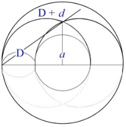

</section>

<section class="parallel-paragraph" data-paragraph-ids="s9-15-0002">

s9-15-0002

[无对应译文]

原文 · s9-15-0002

Ce *schéma* n’est pas l’objet de *mon discours d’aujourd’hui*, il ne sert qu’à vous en faire saisir la visée, que de repère qui vous indique à quoi nous sert *la topologie* de cette surface, de cette *surface appelée tore*, pour autant que son inflexion constituante, ce qui nécessite ces tours et ces retours, est ce qui peut nous suggérer le mieux la loi à laquelle le sujet est sou­mis dans le processus de *l’identification*. Ceci bien sûr ne pourra finalement nous apparaître que quand nous aurons effectivement fait le tour de tout ce qu’il repré­sente, et jusqu’à quel point il convient à la dialectique propre au sujet en tant qu’elle est dialectique de *l’identification*.

</section>

<section class="parallel-paragraph" data-paragraph-ids="s9-15-0003">

s9-15-0003

[无对应译文]

原文 · s9-15-0003

À titre donc de repère...

</section>

<section class="parallel-paragraph" data-paragraph-ids="s9-15-0004">

s9-15-0004

[无对应译文]

原文 · s9-15-0004

> et pour que - quand je mettrai en valeur tel ou tel point, que j’accen­tuerai tel relief - vous *enregistriez*,
>
> si je ­puis dire, à chaque instant le degré d’orientation, le degré de pertinence, par rapport à un certain but
>
> à atteindre, de ce qu’à cet instant j’avancerai ...je vous dirai qu’à la limite *ce qui peut s’inscrire sur ce tore*, pour autant que cela peut nous servir, *va à peu près se symboliser* ainsi, que cette forme, ces cercles dessi­nés, ces lettres attenantes à chacun de ces cercles, vont nous le désigner à l’ins­tant.

</section>

<section class="parallel-paragraph" data-paragraph-ids="s9-15-0005">

s9-15-0005

[无对应译文]

原文 · s9-15-0005

Le *tore*, sans doute, paraît avoir une valeur privilégiée. Ne croyez pas que ce soit la seule forme de surface non sphérique qui soit capable de nous intéres­ser. Je ne saurais trop encourager ceux qui ont pour cela quelque penchant, quelque facilité, à se rapporter à ce qu’on appelle *topologie algébrique*, et aux formes qu’elle vous propose dans ce quelque chose qui, si vous le voulez, par rapport à la géométrie classique, celle que vous gardez inscrite au fond de vos culottes du fait de votre passage dans l’enseignement secondaire, se présente exactement dans l’analogie de ce que j’essaie de vous faire sur le plan symbo­lique, ce que j’ai appelé une logique élastique, une logique souple.

</section>

<section class="parallel-paragraph" data-paragraph-ids="s9-15-0006">

s9-15-0006

[无对应译文]

原文 · s9-15-0006

Cela, c’est encore plus manifeste pour la géométrie dont il s’agit, car la géométrie dont il s’agit dans la *topologie algébrique* se présente elle-même comme la géométrie des figures qui sont en caoutchouc. Il est possible que les auteurs fassent inter­venir ce caoutchouc, ce *rubber* comme on dit en anglais, pour bien mettre dans l’esprit de l’auditeur ce dont il s’agit. Il s’agit de figures déformables et qui à tra­vers toutes les déformations restent en rapport constant. Ce tore n’est pas forcé de se présenter ici dans sa forme bien remplie.

</section>

<section class="parallel-paragraph" data-paragraph-ids="s9-15-0007">

s9-15-0007

[无对应译文]

原文 · s9-15-0007

Ne croyez pas que parmi les surfaces qu’on définit, qu’on doit définir, qui sont celles qui nous intéressent essentiellement, les surfaces closes, pour autant qu’en tout cas le sujet se présente lui-même comme quelque chose de clos, les surfaces closes, quelle que soit votre ingéniosité - vous voyez qu’il y a tout le champ ouvert aux inventions les plus exorbitantes – ne croyez pas d’ailleurs que l’imagination s’y prête de si bon gré, au forgeage de ces formes souples, complexes, qui s’enrou­lent, se nouent avec elles-mêmes. Vous n’avez qu’à essayer de vous assouplir à *la théorie des nœuds* pour vous apercevoir combien il est difficile déjà de se repré­senter les combinaisons les plus simples.

</section>

<section class="parallel-paragraph" data-paragraph-ids="s9-15-0008">

s9-15-0008

[无对应译文]

原文 · s9-15-0008

Encore ceci ne vous mènera-t-il pas loin, car on démontre *que toute surface close, si compliquée soit-elle, vous arrive­rez toujours* *à la réduire* par des procédés appropriés *à quelque chose* qui ne peut pas aller plus loin qu’*une sphère pourvue de quelques appendices*, parmi lesquels justement ceux qui, du tore, s’y représentent comme poignée annexée, une poi­gnée ajoutée à une sphère, telle que je vous l’ai dessinée récemment au tableau, une poignée suffisant à transformer la sphère et la poignée en un tore, du point de vue de la valeur topologique.

</section>

<section class="parallel-paragraph" data-paragraph-ids="s9-15-0009">

s9-15-0009

[无对应译文]

原文 · s9-15-0009

Donc tout peut se réduire à l’adjonction, à la forme d’une sphère, avec un cer­tain nombre de poignées, plus un certain nombre d’autres formes éventuelles. J’espère que la séance avant les vacances je pourrai vous initier à cette forme qui est bien amusante. Mais quand je pense que la plupart d’entre vous ici n’en soup­çonnent même pas l’existence ! C’est ce qu’on appelle en anglais un *cross-cap*, ou ce qu’on peut désigner par le mot français de *mitre*. Enfin, supposez un *tore* qui aurait pour propriété quelque part sur son tour d’inverser sa surface, je veux dire qu’à un endroit qui se place ici entre deux points A et B, la surface exté­rieure traverse... la surface qui est en avant traverse la surface qui est en arrière, les surfaces s’entrecroisent l’une l’autre.

</section>

<section class="parallel-paragraph" data-paragraph-ids="s9-15-0010">

s9-15-0010

[无对应译文]

原文 · s9-15-0010

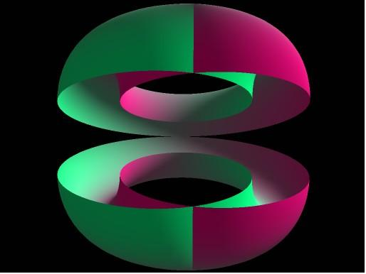

</section>

<section class="parallel-paragraph" data-paragraph-ids="s9-15-0011">

s9-15-0011

[无对应译文]

原文 · s9-15-0011

Je ne peux que vous l’indiquer ici. Cela a des propriétés bien curieuses, et cela peut être même pour nous assez exem­plaire, pour autant qu’en tout cas c’est une surface qui a cette propriété que la surface externe, elle - si vous voulez - se trouve en continuité avec la face interne en passant à l’intérieur de l’objet, et donc peut revenir en un seul tour de l’autre côté de la surface d’où elle est partie.

</section>

<section class="parallel-paragraph" data-paragraph-ids="s9-15-0012">

s9-15-0012

[无对应译文]

原文 · s9-15-0012

C’est là chose très facile à réaliser, de la façon la plus simple, quand vous faites avec une bande de papier ce qui consiste à la prendre, et à la tordre de façon à ce que son bord soit collé au bord extrême en étant renversé \[*bande de Mœbius*\]. Vous vous apercevez que c’est une surface qui n’a effective­ment qu’une seule face, en ce sens que quelque chose qui s’y promène ne ren­contre jamais, dans un certain sens, aucune limite, qui passe d’un côté à l’autre sans que vous puissiez saisir à aucun instant où le tour de passe-passe s’est réa­lisé.

</section>

<section class="parallel-paragraph" data-paragraph-ids="s9-15-0013">

s9-15-0013

[无对应译文]

原文 · s9-15-0013

Donc il y a là la possibilité, sur la surface d’une sphère quelconque comme venant à réaliser, à simplifier une surface, si compliquée soit-elle, la possibilité de cette forme là. Ajoutons-y la possibilité de trous, vous ne pouvez pas aller au-delà, c’est-à-dire que quelque compliquée que soit la surface que vous imaginiez, je veux dire par exemple quelque compliquée que soit la surface que vous ayez à faire, vous ne pourrez jamais trouver quelque chose de plus compliqué que ça. De sorte qu’il y a un certain naturel à la référence au tore comme à la forme la plus simple intuitivement, la plus accessible.

</section>

<section class="parallel-paragraph" data-paragraph-ids="s9-15-0014">

s9-15-0014

[无对应译文]

原文 · s9-15-0014

Ceci peut nous enseigner quelque chose. Là-dessus je vous ai dit la significa­tion que nous pouvions donner par convention, artifice, à deux types de *lacs* cir­culaires, pour autant qu’ils y sont privilégiés :

</section>

<section class="parallel-paragraph" data-paragraph-ids="s9-15-0015">

s9-15-0015

[无对应译文]

原文 · s9-15-0015

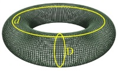

</section>

<section class="parallel-paragraph" data-paragraph-ids="s9-15-0016">

s9-15-0016

[无对应译文]

原文 · s9-15-0016

- celui qui fait le tour de ce qu’on peut appeler le cercle générateur du tore, s’il est « *un tore de révolution* », pour autant que susceptible de se répéter indéfiniment, en quelque sorte le même et toujours différent, il est bien fait pour représenter pour nous l’insistance signi­fiante, et spécialement l’insistance de la demande \[D\] répétitive du névrosé.

</section>

<section class="parallel-paragraph" data-paragraph-ids="s9-15-0017">

s9-15-0017

[无对应译文]

原文 · s9-15-0017

- D’autre part, ce qui est impliqué dans *cette succession de tours*, à savoir *une circularité accomplie* \[*d*\]tout en étant inaperçue par le sujet, qui se trouve pour nous offrir une symbo­lisation facile, évidente et en quelque sorte maxima quant à la sensibilité intui­tive de ce qui est impliqué dans les termes mêmes de *désir inconscient*, pour autant que le sujet en suit les voies et les chemins sans le savoir.

</section>

<section class="parallel-paragraph" data-paragraph-ids="s9-15-0018">

s9-15-0018

[无对应译文]

原文 · s9-15-0018

À travers toutes ces demandes, il est en quelque sorte à lui seul - ce désir inconscient - *la métonymie* de toutes ces demandes. Et vous voyez là *l’incarnation vivante* de ces références auxquelles je vous ai assouplis, habitués tout au long de mon discours, nommé­ment celles de *la métaphore* et de *la métonymie*.

</section>

<section class="parallel-paragraph" data-paragraph-ids="s9-15-0019">

s9-15-0019

[无对应译文]

原文 · s9-15-0019

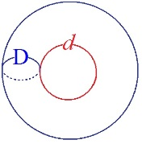

</section>

<section class="parallel-paragraph" data-paragraph-ids="s9-15-0020">

s9-15-0020

[无对应译文]

原文 · s9-15-0020

Ici, *la métonymie* trouve en quelque sorte son application la plus sensible comme étant manifestée par *le désir* en tant que le désir est ce que nous articulons comme supposé dans la suc­cession de *toutes les demandes* en tant qu’elles sont répétitives. Nous nous trou­vons devant quelque chose où vous voyez que le cercle ici décrit mérite que nous l’affections du symbole grand D, en tant que symbole de *la demande*. Ce quelque chose concernant le cercle inté­rieur doit bien avoir affaire avec ce que j’appellerai *le désir métonymique*.

</section>

<section class="parallel-paragraph" data-paragraph-ids="s9-15-0021">

s9-15-0021

[无对应译文]

原文 · s9-15-0021

Eh bien, il y a parmi ces cercles - les cercles que nous pouvons faire \[sur le tore\] - un cercle privi­légié qui est facile à décrire : c’est le cercle qui, partant de l’extérieur du tore, trouve le moyen de se boucler, non pas simplement en insérant le tore dans son épaisseur de poignée, non pas simplement de passer à travers le trou central, mais d’envelop­per le trou central sans pour autant passer par le trou central.

</section>

<section class="parallel-paragraph" data-paragraph-ids="s9-15-0022">

s9-15-0022

[无对应译文]

原文 · s9-15-0022

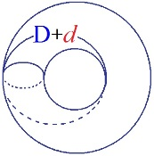

</section>

<section class="parallel-paragraph" data-paragraph-ids="s9-15-0023">

s9-15-0023

[无对应译文]

原文 · s9-15-0023

Ce cercle là a le privilège de faire les deux à la fois, il passe à travers et il l’enveloppe. Il est donc fait de l’addition de ces deux cercles, c’est-à-dire il représente \[D+*d*\] l’addition de *la demande* et du *désir*, en quelque sorte nous permet de symboliser *la demande* avec sa sous-jacence de *désir*.

</section>

<section class="parallel-paragraph" data-paragraph-ids="s9-15-0024">

s9-15-0024

[无对应译文]

原文 · s9-15-0024

Quel est l’intérêt de ceci ? L’intérêt de ceci est que si nous aboutissons à une dialectique élémentaire, à savoir celle de *l’opposition de deux demandes*, si c’est à l’intérieur de ce même tore que je symbolise par un autre cercle analogue la demande de l’Autre, avec ce qu’il va comporter pour nous de « *ou-ou* » : *ou* ce que je demande, *ou* ce que tu demandes, il y a non coïncidence des demandes.

</section>

<section class="parallel-paragraph" data-paragraph-ids="s9-15-0025">

s9-15-0025

[无对应译文]

原文 · s9-15-0025

*Nous voyons ça tous les jours* dans la vie quotidienne. Ceci pour rappeler que dans les conditions privilégiées, au niveau où nous allons la chercher, l’interroger dans l’analyse, il faut que nous nous souvenions de ceci, à savoir de l’ambiguïté qu’il y a toujours dans l’usage même du terme « *ou* », ou bien, ce terme de la disjonction symbolisé en logique ainsi : A v B.

</section>

<section class="parallel-paragraph" data-paragraph-ids="s9-15-0026">

s9-15-0026

[无对应译文]

原文 · s9-15-0026

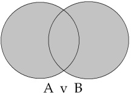

</section>

<section class="parallel-paragraph" data-paragraph-ids="s9-15-0027">

s9-15-0027

[无对应译文]

原文 · s9-15-0027

Il y a deux usages de ce « *ou-ou* ». Ce n’est pas pour rien que la logique mar­querait tous ses efforts et, si je puis dire, fait effort pour lui conserver toujours les valeurs de l’ambiguïté, à savoir pour montrer la connexion d’un « *ou-ou* » *inclusif*, avec un « *ou-ou* » *exclusif*.

</section>

<section class="parallel-paragraph" data-paragraph-ids="s9-15-0028">

s9-15-0028

[无对应译文]

原文 · s9-15-0028

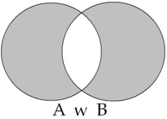

</section>

<section class="parallel-paragraph" data-paragraph-ids="s9-15-0029">

s9-15-0029

[无对应译文]

原文 · s9-15-0029

Que le « *ou-ou* » concernant par exemple ces deux cercles peut vouloir dire deux choses, le choix entre un des deux de ces cercles. Mais est-ce que cela veut dire que simplement, quant à la position du « *ou-ou* », il y ait exclu­sion ? Non ! Ce que vous voyez, c’est que le cercle dans lequel je vais introduire ce « *ou-ou* » comporte ce que l’on appelle l’intersec­tion symbolisée en logique par « ∩ » .

</section>

<section class="parallel-paragraph" data-paragraph-ids="s9-15-0030">

s9-15-0030

[无对应译文]

原文 · s9-15-0030

Le rapport du désir avec une certaine intersection compor­tant certaines lois n’est pas simplement appelé pour mettre sur le terrain, *matter of fact,* ce qu’on peut appeler « *le contrat* », l’accord des demandes

</section>

<section class="parallel-paragraph" data-paragraph-ids="s9-15-0031">

s9-15-0031

[无对应译文]

原文 · s9-15-0031

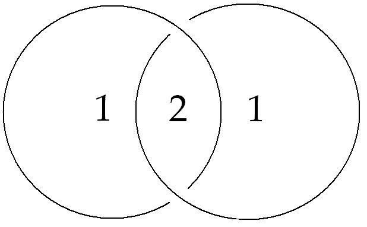

</section>

<section class="parallel-paragraph" data-paragraph-ids="s9-15-0032">

s9-15-0032

[无对应译文]

原文 · s9-15-0032

C’est, étant donné l’hété­rogénéité profonde qu’il y a entre ce champ \[1\] et celui-ci \[2\], suffisamment sym­bolisé par ceci, ici nous avons affaire à la fermeture de la surface \[1\], et là à proprement parler à son vide interne \[2\].

</section>

<section class="parallel-paragraph" data-paragraph-ids="s9-15-0033">

s9-15-0033

[无对应译文]

原文 · s9-15-0033

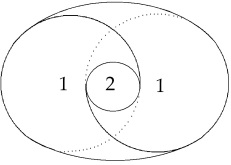

</section>

<section class="parallel-paragraph" data-paragraph-ids="s9-15-0034">

s9-15-0034

[无对应译文]

原文 · s9-15-0034

C’est cela qui nous propose un modèle, qui nous montre qu’il s’agit d’autre chose que de saisir la partie commune entre les demandes. En d’autres termes, il s’agira pour nous de savoir dans quelle mesure cette forme peut nous permettre de symboliser comme tels les consti­tuants du désir, pour autant que le désir, pour le sujet, est ce quelque chose qu’il a à constituer sur le chemin de la demande. D’ores et déjà je vous indique qu’il y a *deux points*, deux dimensions que nous pouvons privilégier dans ce cercle particulièrement significatif dans la topologie du tore :

</section>

<section class="parallel-paragraph" data-paragraph-ids="s9-15-0035">

s9-15-0035

[无对应译文]

原文 · s9-15-0035

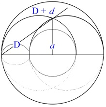

</section>

<section class="parallel-paragraph" data-paragraph-ids="s9-15-0036">

s9-15-0036

[无对应译文]

原文 · s9-15-0036

c’est, d’une part, la dis­tance qui rejoint le centre du vide central avec ce point qui se trouve être, qui peut se définir comme une sorte de tangence grâce à quoi un plan recoupant le tore va nous permettre de dégager de la façon la plus simple ce cercle privilégié. C’est cela qui nous donnera la définition, la mesure du *petit(a)* en tant qu’*objet du désir*.

</section>

<section class="parallel-paragraph" data-paragraph-ids="s9-15-0037">

s9-15-0037

[无对应译文]

原文 · s9-15-0037

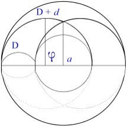

</section>

<section class="parallel-paragraph" data-paragraph-ids="s9-15-0038">

s9-15-0038

[无对应译文]

原文 · s9-15-0038

D’autre part, ceci pour autant qu’il n’est lui-même repérable, définis­sable que par rapport au diamètre même de ce cercle exceptionnel, c’est dans le rayon, dans la moitié si vous voulez de ce diamètre, que nous verrons ce qui est le ressort, la mesure dernière du rapport du sujet au désir, à savoir le ϕ en tant que symbole du *phallus*.

</section>

<section class="parallel-paragraph" data-paragraph-ids="s9-15-0039">

s9-15-0039

[无对应译文]

原文 · s9-15-0039

Voilà ce vers quoi nous tendons, et ce qui prendra son sens, son applicabilité et sa portée, du chemin que nous aurons parcouru avant, pour nous permettre de parvenir à rendre pour vous maniable, sensible et jusqu’à un certain point *suggestif* d’une véritable intensité structurale, cette image même.

</section>

<section class="parallel-paragraph" data-paragraph-ids="s9-15-0040">

s9-15-0040

[无对应译文]

原文 · s9-15-0040

Ceci dit, il est bien entendu que le sujet - dans *<u>ce à quoi</u>* nous avons affaire : à notre partenaire qui nous appelle en *<u>ça</u>* que nous avons devant nous sous la forme de cet appel et *<u>ce</u>* qui vient parler devant nous - seul ce qu’on peut *définir* et *scander* comme *le sujet*, seul cela s’identifie. Ça vaut la peine de le rap­peler parce que, après tout, la pensée glisse facilement.

</section>

<section class="parallel-paragraph" data-paragraph-ids="s9-15-0041">

s9-15-0041

[无对应译文]

原文 · s9-15-0041

Pourquoi, si on ne met pas les points sur les i, ne dirait-on pas : que « la pulsion s’identifie », et qu’« une image s’identifie » ? Ne peut être dit avec justesse « *s’identifier* », ne s’introduit dans la pen­sée de FREUD le terme d’identification, *qu’à partir du moment où on peut* à un degré quelconque, même si ce n’est pas articulé dans FREUD, *considérer comme la dimension du sujet* - cela ne veut pas dire que ça ne nous mène pas beaucoup plus loin que le sujet - *cette identification*.

</section>

<section class="parallel-paragraph" data-paragraph-ids="s9-15-0042">

s9-15-0042

[无对应译文]

原文 · s9-15-0042

La preuve, là aussi - je vous rappelle ceci, dont on ne peut savoir si c’est dans les antécédents, les prémisses, ou dans le futur de mon discours que je le pointe - c’est que la première forme d’identification, et celle à laquelle on se réfère, avec quelle *légèreté*, quel *psittacisme de sanson­net,* c’est l’identification qui, nous dit-on, « *incorpore* », ou encore - ajoutant une confusion à l’imprécision de la première formule - « *introjecte* ».

</section>

<section class="parallel-paragraph" data-paragraph-ids="s9-15-0043">

s9-15-0043

[无对应译文]

原文 · s9-15-0043

Contentons-nous d’« *incorpore* », qui est la meilleure. Comment même commencer par cette pre­mière forme d’identification, alors que pas la moindre indication, pas le moindre repère, sinon vaguement métaphorique, ne vous est donné dans une telle for­mule, sur ce que ça peut même vouloir dire ?

</section>

<section class="parallel-paragraph" data-paragraph-ids="s9-15-0044">

s9-15-0044

[无对应译文]

原文 · s9-15-0044

Ou bien si l’on parle *d’incorpora­tion*, c’est bien parce qu’il doit se produire quelque chose *au niveau du corps*. Je ne sais si je pourrai cette année pousser les choses assez loin - *je l’espère* tout de même, nous avons du temps devant nous pour arriver, revenant de là d’où nous partons - à donner son plein sens, et son sens véritable à *cette incorporation de la première identification*.

</section>

<section class="parallel-paragraph" data-paragraph-ids="s9-15-0045">

s9-15-0045

[无对应译文]

原文 · s9-15-0045

Vous le verrez, il n’y a aucun autre moyen de la faire intervenir, sinon de la rejoindre par une thématique qui a déjà été élaborée, et depuis les traditions les plus antiques, mythiques, voire religieuses, sous le terme de « *corps mystique* ». Impossible de ne pas prendre les choses dans l’empan qui va de la conception sémitique primitive : il y a du père de toujours à tous ceux qui descendent de lui, identité de corps.

</section>

<section class="parallel-paragraph" data-paragraph-ids="s9-15-0046">

s9-15-0046

[无对应译文]

原文 · s9-15-0046

Mais à l’autre bout, vous savez, il y a la notion que je viens d’appeler par son nom, celle de « *corps mystique* », pour autant que c’est d’un corps que se constitue une église. Et ça n’est pas pour rien que FREUD, pour définir pour nous l’identité du *moi* dans ses rapports avec ce qu’il appelle à l’occasion *[Massenpsychologie](http://classiques.uqac.ca/classiques/freud_sigmund/essais_de_psychanalyse/Essai_2_psy_collective/Freud_Psycho_collective.pdf)* [^138], se réfère à « *la corporéité de l’Église* ».

</section>

<section class="parallel-paragraph" data-paragraph-ids="s9-15-0047">

s9-15-0047

[无对应译文]

原文 · s9-15-0047

Mais comment vous faire partir de là sans prêter à toutes les confusions et croire que, comme le terme de « *mystique* » l’indique assez, c’est sur de tout autres che­mins que ceux où notre expérience voudrait nous entraîner ? Ce n’est que rétro­activement, en quelque sorte revenant sur les conditions nécessaires de notre expérience, que nous pourrons nous introduire dans ce que nous suggère d’anté­cédence toute tentative d’aborder, dans sa plénitude, *la réalité de* *l’identification*.

</section>

<section class="parallel-paragraph" data-paragraph-ids="s9-15-0048">

s9-15-0048

[无对应译文]

原文 · s9-15-0048

L’abord donc que j’ai choisi dans *la deuxième forme de l’identification* n’est pas de hasard, c’est parce que cette *identification* est saisissable sous le mode de l’abord par *le signifiant pur*, par le fait que nous pouvons saisir d’une façon claire et rationnelle, un biais pour entrer dans ce que ça veut dire *l’identification du sujet*, pour autant que le sujet met au monde le *trait unaire*, plutôt que le *trait unaire*, une fois détaché, fait apparaître le sujet comme « *celui qui compte* », au double sens du terme.

</section>

<section class="parallel-paragraph" data-paragraph-ids="s9-15-0049">

s9-15-0049

[无对应译文]

原文 · s9-15-0049

L’ampleur de l’ambiguïté que vous pouvez donner à cette formule...

</section>

<section class="parallel-paragraph" data-paragraph-ids="s9-15-0050">

s9-15-0050

[无对应译文]

原文 · s9-15-0050

- « *celui qui compte* » activement sans doute,

</section>

<section class="parallel-paragraph" data-paragraph-ids="s9-15-0051">

s9-15-0051

[无对应译文]

原文 · s9-15-0051

- mais aussi « *celui qui compte* » tout simplement dans la réalité, « *celui qui compte* » vraiment, évidemment va mettre du temps à se retrouver dans son compte, exactement le temps que nous mettrons pour parcourir tout ce que je viens ici de vous désigner ...aura pour vous son plein sens.

</section>

<section class="parallel-paragraph" data-paragraph-ids="s9-15-0052">

s9-15-0052

[无对应译文]

原文 · s9-15-0052

SHACKLETON[^139] et ses compagnons dans l’Antarctique, à plusieurs centaines de kilomètres de la côte, explorateurs livrés à la plus grande frustra­tion, celle qui ne tient pas seulement aux carences plus ou moins élucidées à ce moment - car c’est un texte déjà d’une cinquantaine d’années - aux carences plus ou moins élucidées d’une alimentation spéciale qui est encore à l’épreuve à ce moment, mais qu’on peut dire désorientés dans un paysage, si je puis dire *encore vierge*, non encore habité par l’imagination humaine - il suffira que le réseau humain ait sillonné ses chemins pour qu’il ne soit plus vide, mais au début, il l’est - nous rapporte, dans des notes bien singulières à lire, qu’ils se comptaient toujours un de plus qu’ils n’étaient, qu’ils ne s’y retrouvaient pas.

</section>

<section class="parallel-paragraph" data-paragraph-ids="s9-15-0053">

s9-15-0053

[无对应译文]

原文 · s9-15-0053

On se demandait toujours où était passé le manquant, le manquant qui ne manquait pas sinon de ceci que tout effort de compte leur suggérait toujours qu’il y en avait un de plus, donc un de moins. Vous touchez là l’apparition, à l’état nu, du sujet qui n’est rien que cela : que la possibilité d’un signifiant de plus, d’un 1 en plus, grâce à quoi il constate lui-même qu’il y en a 1 qui manque.

</section>

<section class="parallel-paragraph" data-paragraph-ids="s9-15-0054">

s9-15-0054

[无对应译文]

原文 · s9-15-0054

Si je vous rappelle cela c’est simplement pour pointer, dans une dialectique comportant les termes les plus extrêmes, où nous situons notre chemin, et où vous pourrez croire et quelquefois vous demander même si nous n’oublions pas certaines références. Vous pouvez par exemple vous demander même quel rapport il y a, entre le chemin que je vous ai fait parcourir et *ces* *deux termes* auxquels nous avons eu affaire, nous avons affaire constamment mais à des moments différents, *de l’Autre et de la Chose*. Bien sûr, le sujet lui-même au dernier terme est destiné à *la Chose*, mais *sa loi*, *son fatum* plus exactement, est ce chemin, qu’il ne peut décrire que par le pas­sage par l’Autre, en tant que l’Autre est *marqué* *du signifiant*. Et c’est *dans l’en­-deçà* de ce passage nécessaire par *le signifiant* que se constituent comme tels *le désir et son objet*.

</section>

<section class="parallel-paragraph" data-paragraph-ids="s9-15-0055">

s9-15-0055

[无对应译文]

原文 · s9-15-0055

L’apparition de cette dimension de l’Autre et *l’émergence du sujet*, je ne saurai trop le rappeler pour vous donner bien le sens de ce dont il s’agit, et dont *le paradoxe*, je pense, doit vous être suffisamment articulé en ceci que le désir - au sens, entendez-le, le plus naturel - doit et ne peut se constituer que dans *la tension* créée par ce rapport à l’Autre, laquelle *s’origine* en ceci : de l’avè­nement du *trait unaire*, en tant que d’abord et pour commencer, de *la Chose* il efface tout, ce quelque chose, tout autre chose que cet 1 qu’elle a été, à jamais irremplaçable.

</section>

<section class="parallel-paragraph" data-paragraph-ids="s9-15-0056">

s9-15-0056

[无对应译文]

原文 · s9-15-0056

Et nous trouvons là, dès le premier pas - *je vous le fais remarquer en passant -* la formule, là se termine la formule de FREUD : « *Là où c’était* - la Chose - *là je dois advenir* » Il faudrait remplacer à l’origine par : « *Wo Es war, da durch den Ein* », plutôt par « *durch den Eins* »*, là*, par le « *un* » en tant que « 1 » *le trait unaire -* « *werde Ich* »*, adviendra le Je*. *Tout du chemin est tout tracé,* *à chaque point du chemin*. C’est bien là que j’ai tenté de vous suspendre la dernière fois en vous montrant le progrès nécessaire à cet instant, en tant qu’il ne peut s’instituer que par la dia­lectique effective qui s’accomplit dans le rapport avec l’Autre.

</section>

<section class="parallel-paragraph" data-paragraph-ids="s9-15-0057">

s9-15-0057

[无对应译文]

原文 · s9-15-0057

Je suis étonné de l’espèce de *matité* dans laquelle il m’a semblé que tombait mon articulation, pour­tant soignée, du « *Rien peut-être* » et du « *Peut-être rien *». Qu’est-ce qu’il faut donc pour vous y rendre sensibles ? Peut-être que justement mon texte à cet endroit... et la spécification de *leur distinction* comme *message* et *question*, puis comme *réponse*, mais pas au niveau de la question, comme suspension de la question au niveau de la question ...a été trop complexe pour être simplement entendu de ceux qui ne l’ont pas noté dans ses détours afin d’y revenir.

</section>

<section class="parallel-paragraph" data-paragraph-ids="s9-15-0058">

s9-15-0058

[无对应译文]

原文 · s9-15-0058

Si déçu que je puisse être, c’est forcément moi qui ai tort. C’est pourquoi j’y reviens et pour me faire entendre. Est-ce qu’aujourd’hui, par exemple, je ne vous suggérerai pas au moins la nécessité d’y revenir, et en fin de compte c’est simplement vous demandant : est-ce que vous pensez que « *rien de sûr* », comme *énonciation*, peut vous paraître prêter au moindre glissement, à la moindre *ambiguïté* avec « *sûrement rien* ? ».

</section>

<section class="parallel-paragraph" data-paragraph-ids="s9-15-0059">

s9-15-0059

[无对应译文]

原文 · s9-15-0059

C’est tout de même pas pareil ! Il y a la même différence qu’entre le « *rien peut-être* » et le « *peut-être rien* ». Je dirai même qu’il y a dans le premier, le « *rien de sûr* », la même vertu de *sapage de la question* à l’origine qu’il y a dans le « *rien peut-être* ». Et même dans le « *sûrement rien ?* » il y a la même vertu de réponse, éventuelle sans doute, mais tou­jours *anticipée* par rapport à la question, comme c’est facile à *toucher du doigt* me semble-t-il, si je vous rappelle que c’est toujours *avant toute question* – et pour des raisons de sécurité si je puis dire - qu’on apprend à dire dans la vie, quand on est *petit *: « *sûrement rien* ». Cela veut dire sûrement rien d’autre que ce qui est déjà attendu, c’est­-à-dire ce qu’on peut considérer d’avance comme réductible à zéro, comme *le lacs*. La vertu désangoissante de l’*Erwartung*[^140], voilà ce que FREUD sait nous articuler à l’occasion : « *rien que ce que nous savons déjà* ». Quand on est comme ça, on est tranquille, mais on ne l’est pas toujours.

</section>

<section class="parallel-paragraph" data-paragraph-ids="s9-15-0060">

s9-15-0060

[无对应译文]

原文 · s9-15-0060

Ainsi donc ce que nous voyons c’est que le sujet pour trouver *la Chose*, s’engage d’abord dans la direction opposée : qu’il n’y a pas moyen d’articuler ces premiers pas du sujet, sinon par un *rien* qu’il il est important de vous faire sen­tir dans cette dimension même, à la fois *métaphorique et métonymique du pre­mier jeu signifiant*, parce que chaque fois que nous avons affaire avec ce rapport du sujet au *rien*, nous autres analystes, nous glissons régulièrement entre deux pentes : la pente commune qui tend vers un *rien de destruction*, c’est *la fâcheuse interprétation de l’agressivité considérée comme purement* *réductible au pouvoir biologique d’agression*, qui n’est d’aucune façon suffisante, sinon par dégrada­tion, à supporter la tendance au *rien* telle qu’elle surgit à un certain stade néces­saire de la pensée freudienne, et juste avant qu’il ait introduit *l’identification* : dans *l’instinct de mort*.

</section>

<section class="parallel-paragraph" data-paragraph-ids="s9-15-0061">

s9-15-0061

[无对应译文]

原文 · s9-15-0061

L’autre, c’est une *néantisation* qui s’assimilerait à la *négativité hégelienne*. Le *rien*, que j’essaie de faire tenir à ce moment initial pour vous dans l’institution du sujet est autre chose. Le sujet introduit le *rien* comme tel, et ce *rien* est à distinguer d’aucun être de raison qui est celui de la négativité classique, d’aucun être imaginaire qui est celui de l’être impossible quant à son existence, le fameux « Centaure » qui arrête les logiciens - *tous les logiciens, voire les métaphysi­ciens* - à l’entrée de leur chemin vers la science, qui n’est pas non plus l’*ens priva­tivum,* qui est à proprement parler ce que KANT[^141] - admirablement, dans la définition de ses *quatre « rien »*, dont il tire si peu parti - appelle le « *nihil negativum* », à savoir, pour employer ses propres termes : « *leerer Gegenstand ohne Begrif* », un *objet vide*, mais ajoutons, *sans concept*, *sans saisie* *possible avec la main* [^142].

</section>

<section class="parallel-paragraph" data-paragraph-ids="s9-15-0062">

s9-15-0062

[无对应译文]

原文 · s9-15-0062

C’est pour cela, pour l’introduire, que j’ai dû remettre devant vous le réseau de tout *le graphe*, à savoir le réseau constitutif du rapport à l’Autre avec tous ses renvois.

</section>

<section class="parallel-paragraph" data-paragraph-ids="s9-15-0063">

s9-15-0063

[无对应译文]

原文 · s9-15-0063

Je voudrais, pour vous mener sur ce chemin, [*vous paver la voie de fl**eurs*](#fleurs). Je vais m’y essayer aujourd’hui, je veux dire marquer mes intentions. Quand je vous dis que c’est à partir de la problématique de *l’au-delà de la demande* que *l’objet* se constitue comme *objet du désir*, je veux dire que c’est *parce que l’Autre ne répond pas* - sinon que « *rien peut-être* », que « *le pire n’est pas* *toujours sûr* » - que le sujet va trouver dans un objet les vertus mêmes de sa demande initiale.

</section>

<section class="parallel-paragraph" data-paragraph-ids="s9-15-0064">

s9-15-0064

[无对应译文]

原文 · s9-15-0064

Entendez que *c’est pour vous paver la voie de fleurs* que je vous rappelle ces véri­tés d’expérience commune, dont on ne reconnaît pas assez la signification, et tâcher de vous faire sentir que ce n’est pas hasard, analogie, comparaison, ni seu­lement *fleurs*, mais affinités profondes qui me feront vous indiquer l’affinité - au terme - de *l’objet* à cet *Autre* avec un grand A, en tant par exemple qu’elle se *manifeste dans l’amour*, que le fameux morceau qu’Eliante, dans *Le Misanthrope*[^143], a repris du *De natura rerum* de Lucrèce[^144]...

</section>

<section class="parallel-paragraph" data-paragraph-ids="s9-15-0065">

s9-15-0065

[无对应译文]

原文 · s9-15-0065

> « *La pâle est aux jasmins en blancheur comparable.*
>
> *La noire à faire peur, une brune adorable.*
>
> *La maigre a de la taille et de la liberté.*
>
> *La grasse est dans son port pleine de majesté.*
>
> *La malpropre sur soi, de peu d’attraits chargée,*
>
> *Est mise sous le nom de beauté négligée*... »

</section>

<section class="parallel-paragraph" data-paragraph-ids="s9-15-0066">

s9-15-0066

[无对应译文]

原文 · s9-15-0066

...ce n’est rien d’autre que le signe impossible à effacer de ce fait que : *l’objet du désir ne se constitue que dans le rapport à l’Autre,* *en tant que lui-même s’ori­gine de la valeur du trait unaire. Nul privilège dans l’objet, sinon dans cette valeur absurde donnée à chaque trait* *d’être un privilège.*

</section>

<section class="parallel-paragraph" data-paragraph-ids="s9-15-0067">

s9-15-0067

[无对应译文]

原文 · s9-15-0067

Que faut-il encore d’autre pour vous convaincre de la dépendance structu­rale de cette constitution de l’objet, objet du désir, par rapport à la dialectique initiale du signifiant en tant qu’elle vient échouer sur la non-réponse de l’Autre ?

</section>

<section class="parallel-paragraph" data-paragraph-ids="s9-15-0068">

s9-15-0068

[无对应译文]

原文 · s9-15-0068

Sinon le chemin déjà parcouru par nous de la *recherche sadienne*, que je vous ai longuement montrée[^145] - et si c’est perdu, sachez tout au moins que je me suis engagé à y revenir dans une préface que j’ai promise à une édition de SADE[^146] - que nous ne pouvons méconnaître, avec ce que j’appelle ici « *l’affinité structurante* » de ce cheminement vers l’Autre, en tant qu’il détermine toute institution de l’objet du désir, que nous voyons dans SADE à chaque instant mêlées, tressées l’une avec l’autre l’invective...

</section>

<section class="parallel-paragraph" data-paragraph-ids="s9-15-0069">

s9-15-0069

[无对应译文]

原文 · s9-15-0069

> je dis l’ invective, contre l’Être suprême, *sa négation* n’étant qu’une forme de l’invective,
>
> même si c’en est la négation la plus authen­tique

</section>

<section class="parallel-paragraph" data-paragraph-ids="s9-15-0070">

s9-15-0070

[无对应译文]

原文 · s9-15-0070

...absolument tissées avec ce que j’appellerai, pour en approcher, l’abor­der un peu, *non pas tant la destruction de l’objet* que ce que nous pourrions prendre d’abord pour *son simulacre*, parce que vous savez l’exceptionnelle résistance des victimes du mythe sadien à toutes les épreuves par où les fait pas­ser le texte romanesque.

</section>

<section class="parallel-paragraph" data-paragraph-ids="s9-15-0071">

s9-15-0071

[无对应译文]

原文 · s9-15-0071

Et puis quoi ? Qu’est-ce que veut dire cette sorte de : « *transfert à la mère* » - incarnée dans la *Nature -* d’une certaine et fondamentale abo­mination de tous ses actes ? Est-ce que ceci doit nous *dissimuler* ce dont il s’agit, et qu’on nous dit pourtant qu’il s’agit, en l’imitant dans ses actes de destruc­tion, et en les poussant jusqu’au dernier terme par une volonté appliquée, à la forcer à recréer *autre chose*. C’est-à-dire quoi ? *Redonner sa place au Créateur*. En fin de compte, au dernier terme, SADE l’a dit sans le savoir, il articule ceci, par son *énonciation *:

</section>

<section class="parallel-paragraph" data-paragraph-ids="s9-15-0072">

s9-15-0072

[无对应译文]

原文 · s9-15-0072

« *Je te donne ta réalité abominable, à toi le Père, en me substi­tuant à toi dans cette action violente contre la mère.* ».

</section>

<section class="parallel-paragraph" data-paragraph-ids="s9-15-0073">

s9-15-0073

[无对应译文]

原文 · s9-15-0073

Bien sûr, la restitution mythique de *l’objet* au *rien* ne vise pas seulement la victime privilégiée, en fin de compte *adorée* comme *objet du désir*, mais *la multitude même* par millions *de tout ce qui est*. Rappelez-vous *les complots antisociaux* des héros de SADE : cette restitution de *l’objet* au *rien* simule *essentiellement* l’anéantissement de la puissance signifiante.

</section>

<section class="parallel-paragraph" data-paragraph-ids="s9-15-0074">

s9-15-0074

[无对应译文]

原文 · s9-15-0074

C’est là l’autre terme contradictoire de ce foncier *rapport à l’Autre* tel qu’il s’institue dans *le désir sadien*. Et il est suffisamment indiqué dans le vœu dernier testamentaire de SADE[^147] :

</section>

<section class="parallel-paragraph" data-paragraph-ids="s9-15-0075">

s9-15-0075

[无对应译文]

原文 · s9-15-0075

- en tant qu’il vise précisément ce terme que j’ai spécifié pour vous de « *la seconde mort* »,la mort de l’être même,

</section>

<section class="parallel-paragraph" data-paragraph-ids="s9-15-0076">

s9-15-0076

[无对应译文]

原文 · s9-15-0076

- en tant que SADE, dans son testament, spécifie que de sa tombe et intention­nellement de sa mémoire, malgré qu’il soit écrivain, il ne doit littéralement res­ter *pas de trace*.

</section>

<section class="parallel-paragraph" data-paragraph-ids="s9-15-0077">

s9-15-0077

[无对应译文]

原文 · s9-15-0077

Et le fourré doit être reconstitué sur la place où il aura été inhumé. Que de lui essentiellement comme sujet, c’est le « *pas de trace* » qui indique là où il veut s’affirmer, très précisément comme ce que j’ai appelé « *l’anéantis­sement de la puissance signifiante* ».

</section>

<section class="parallel-paragraph" data-paragraph-ids="s9-15-0078">

s9-15-0078

[无对应译文]

原文 · s9-15-0078

S’il y a autre chose que j’ai à vous rappeler ici, pour scander suffisamment la légitimité de l’inclusion nécessaire de *l’objet du désir* dans ce rapport à l’Autre en tant qu’il implique *la marque du signifiant* comme tel, je vous la désignerai moins dans SADE que dans un de ses *commentaires récents*, *contemporains* les plus sensibles, voire les plus illustres.

</section>

<section class="parallel-paragraph" data-paragraph-ids="s9-15-0079">

s9-15-0079

[无对应译文]

原文 · s9-15-0079

Ce texte, paru tout de suite après la guerre dans un numéro des *Temps Modernes,* réédité récemment par les soins de notre ami Jean-Jacques PAUVERT dans l’édition nouvelle de *la première version de* *Justine*, c’est la préface de PAULHAN[^148]. Un texte comme celui-là ne peut nous être *indifférent*, pour autant que vous suivez ici les détours de mon discours.

</section>

<section class="parallel-paragraph" data-paragraph-ids="s9-15-0080">

s9-15-0080

[无对应译文]

原文 · s9-15-0080

Car il est frappant que ce soit par les seules voies d’une rigueur rhétoricienne - vous le verrez - qu’il n’y a pas d’autre guide au discours de PAULHAN - l’auteur de *Fleurs de Tarbes -* que le dégagement par lui si subtil, j’entends : par ces voies, de tout ce qui a été articulé jusqu’à présent sur le sujet de la signification du sadianisme.

</section>

<section class="parallel-paragraph" data-paragraph-ids="s9-15-0081">

s9-15-0081

[无对应译文]

原文 · s9-15-0081

À savoir ce qu’il appelle « *complicité de l’imagination sadienne avec son objet* » c’est­-à-dire la vue de l’extérieur, je veux dire par l’approche qu’en peut faire une ana­lyse littérale, la vue la plus sûre, la plus stricte que l’on puisse donner de l’essence du masochisme, dont justement il ne dit rien. Si ce n’est qu’il nous fait très bien sentir que c’est dans cette voie, que c’est là le dernier mot de la démarche de SADE, non pas à la juger *cliniquement*, et en quelque sorte *du dehors*, où pourtant le résultat est manifeste : il est difficile de mieux s’offrir à *tous les mauvais traite­ments de la société* que SADE ne l’a fait *à chaque instant,* mais ce n’est pas là l’essentiel.

</section>

<section class="parallel-paragraph" data-paragraph-ids="s9-15-0082">

s9-15-0082

[无对应译文]

原文 · s9-15-0082

L’essentiel étant suspendu, dans ce texte de PAULHAN - que je vous prie de lire - qui ne procède que par les voies d’une analyse rhétorique du texte sadien pour nous faire sentir, seulement derrière un voile, le point de convergence, en tant qu’il se situe dans ce renversement tout apparent - fondé sur la plus profonde complicité avec ce dont la victime n’est ici en fin de compte que *le symbole*, marqué d’une sorte de *substance absente -* de l’idéal des victimes sadiennes : *c’est en tant qu’objet que le sujet sadien s’annule*.

</section>

<section class="parallel-paragraph" data-paragraph-ids="s9-15-0083">

s9-15-0083

[无对应译文]

原文 · s9-15-0083

En quoi effectivement il rejoint ce qui phénoménologiquement nous apparaît alors dans les textes de MASOCH. À savoir que le terme, que le comble de la jouis­sance masochiste n’est pas tellement dans le fait qu’elle s’offre à supporter ou non telle ou telle douleur corporelle. Mais dans cet extrême singulier - qu’à savoir dans les livres vous retrouverez toujours dans les textes petits ou grands de la fantasmagorie masochiste - *cette annulation* à proprement parler *du sujet* *en tant qu’il se fait pur objet*.

</section>

<section class="parallel-paragraph" data-paragraph-ids="s9-15-0084">

s9-15-0084

[无对应译文]

原文 · s9-15-0084

Il n’y a à cela de terme, que le moment où le roman masochiste, quel qu’il soit, en arrive à ce point qui du dehors peut paraître tellement superflu, voire de fioritures, de luxe, qui est à proprement parler qu’il se forge lui-même, ce sujet masochiste, comme étant *l’objet d’un marchandage*, ou très exactement d’une vente entre les deux autres qui se le passent comme un bien. Bien vénal et - observez-le - même pas *fétiche*, car le dernier terme s’indique dans le fait que c’est un bien vil, vendu pour pas cher, qu’il n’y aura même pas lieu de préserver comme l’esclave antique qui au moins se constituait, s’imposait, au res­pect par sa valeur marchande.

</section>

<section class="parallel-paragraph" data-paragraph-ids="s9-15-0085">

s9-15-0085

[无对应译文]

原文 · s9-15-0085

Tout ceci, ces détours, *ce chemin pavé des Fleurs de Tarbes* précisément, ou *<u>des</u> [fleurs littéraires](#Rfleurs)*, pour bien vous marquer ce que je veux dire quand je parle de ce que j’ai, pour vous, accentué, à savoir *la perturbation profonde de la jouis­sance *:

</section>

<section class="parallel-paragraph" data-paragraph-ids="s9-15-0086">

s9-15-0086

[无对应译文]

原文 · s9-15-0086

- en tant que *la jouissance* se définit, par rapport à *la Chose,* par la dimen­sion de l’Autre comme tel,

</section>

<section class="parallel-paragraph" data-paragraph-ids="s9-15-0087">

s9-15-0087

[无对应译文]

原文 · s9-15-0087

- en tant que cette dimension de l’Autre se définit *par l’introduction du signifiant*.

</section>

<section class="parallel-paragraph" data-paragraph-ids="s9-15-0088">

s9-15-0088

[无对应译文]

原文 · s9-15-0088

Encore trois petits pas en avant, et puis je remettrai à la prochaine fois la suite de ce discours, dans la crainte que vous ne sentiez trop quelle fatigue grippale m’agrippe aujourd’hui.

</section>

<section class="parallel-paragraph" data-paragraph-ids="s9-15-0089">

s9-15-0089

[无对应译文]

原文 · s9-15-0089

JONES est un curieux personnage dans l’histoire de l’ana­lyse. Par rapport à l’histoire de l’analyse, ce qu’il impose à mon esprit, je vous le dirai tout de suite, pour continuer *ce chemin de fleurs* d’aujourd’hui, c’est quelle diabolique volonté de dissimulation il pouvait bien y avoir chez FREUD pour avoir confié à ce « *rusé gallois* » - comme tel à trop courte vue - pour qu’il n’aille pas trop loin dans le travail qui lui était confié : le soin de sa propre biographie.

</section>

<section class="parallel-paragraph" data-paragraph-ids="s9-15-0090">

s9-15-0090

[无对应译文]

原文 · s9-15-0090

C’est là, dans l’article sur le symbolisme que j’ai consacré à l’œuvre de JONES[^149] - ce qui ne signifie pas simplement le désir de clore mon article sur une bien bonne, ce que signifie ce sur quoi j’ai conclu, à savoir la comparaison de l’activité du « *rusé gallois* » avec le travail du ramoneur. Il a en effet fort bien ramoné tous les tuyaux, et on pourra me rendre cette justice que dans ledit article, je l’ai suivi dans tous les détours de la cheminée, jusqu’à sortir avec lui tout noir par la porte qui débouche sur le salon, comme vous vous le rappelez peut-être.

</section>

<section class="parallel-paragraph" data-paragraph-ids="s9-15-0091">

s9-15-0091

[无对应译文]

原文 · s9-15-0091

Ce qui m’a valu *de la part d’un autre membre éminent de la Société analytique* - un de ceux que j’apprécie et aime le plus, gallois aussi \[Winnicott\] - l’assurance dans une lettre qu’il ne comprenait vraiment absolument rien à l’utilité que je croyais appa­remment trouver dans cette minutieuse démarche.

</section>

<section class="parallel-paragraph" data-paragraph-ids="s9-15-0092">

s9-15-0092

[无对应译文]

原文 · s9-15-0092

JONES n’a jamais rien fait de plus dans sa *biographie*… pour marquer quand même un peu ses distances …que d’apporter une petite lumière extérieure, à savoir les points où la construction freudienne se trouve en désaccord, en contradiction avec l’évangile darwinien, ce qui est tout simplement de sa part une manifestation proprement grotesque de supériorité chauvine.

</section>

<section class="parallel-paragraph" data-paragraph-ids="s9-15-0093">

s9-15-0093

[无对应译文]

原文 · s9-15-0093

JONES donc, au cours d’une œuvre dont le cheminement est passionnant en raison de ses méconnaissances mêmes, à propos spécialement du stade phallique et de son expérience exceptionnellement abondante des homosexuelles féminines, JONES[^150] rencontre le paradoxe du *complexe de castra­tion* qui constitue assurément le meilleur de tout ce à quoi il a adhéré \- et bien fait d’adhérer - pour articuler son expérience, et où littéralement il n’a jamais péné­tré de ça ! \[geste de la main\].

</section>

<section class="parallel-paragraph" data-paragraph-ids="s9-15-0094">

s9-15-0094

[无对应译文]

原文 · s9-15-0094

La preuve, c’est l’introduction de ce terme, certes maniable, à condition qu’on sache quoi en faire, à savoir qu’on sache y repérer ce qu’il ne faut pas faire, pour comprendre la castration, le terme d’ἀϕάνιςις \[aphanisis\]. Pour définir le sens de ce que je peux appeler, sans rien forcer ici, « *l’effet de l’Œdipe* », JONES nous dit quelque chose qui ne peut mieux se situer dans notre discours : ici il se trouve - qu’il le veuille ou non - partie prenante de ce que l’Autre, comme je vous l’ai articulé la dernière fois, interdit *l’objet ou le désir*. Mon « *ou* » est - ou a l’air d’être - exclusif. Pas tout à fait :

</section>

<section class="parallel-paragraph" data-paragraph-ids="s9-15-0095">

s9-15-0095

[无对应译文]

原文 · s9-15-0095

« *Ou tu désires ce que je désirais, moi, le Dieu mort, et il n’y a plus d’autre preuve - mais elle suffit - de mon existence,* *que ce commandement qui t’en défend l’objet, ou plus exactement, qui te le fait constituer dans la dimension du perdu :* *tu ne peux plus - quoi que tu fasses - qu’en retrouver un autre, jamais celui-là* ».

</section>

<section class="parallel-paragraph" data-paragraph-ids="s9-15-0096">

s9-15-0096

[无对应译文]

原文 · s9-15-0096

C’est l’interprétation la plus intelligente que je puisse donner à ce pas, que franchit allègrement JONES - et je vous assure tam­bour battant ! - quant il s’agit de marquer *l’entrée de ces homosexuelles dans le domaine soufré qui sera dès lors leur habitat* : *ou l’objet*, *ou le désir*, je vous assure que ça ne traîne pas ! Si je m’y arrête, c’est pour donner à ce choix - vel, vel - la meilleure interprétation, c’est­-à-dire que j’en rajoute, je fais parler au mieux mon interlocuteur.

</section>

<section class="parallel-paragraph" data-paragraph-ids="s9-15-0097">

s9-15-0097

[无对应译文]

原文 · s9-15-0097

« *Ou tu renonces au désir*... » nous dit JONES... Quand on le dit vite, ça peut avoir l’air d’aller de soi, d’autant qu’auparavant on nous a donné l’occasion du repos de l’âme, et du même coup de la comprenoire, en nous traduisant la castration comme ἀϕάνιςις \[aphanisis\]. Mais qu’est-ce que ça veut dire, de renoncer *au désir* ?

</section>

<section class="parallel-paragraph" data-paragraph-ids="s9-15-0098">

s9-15-0098

[无对应译文]

原文 · s9-15-0098

- Est-ce que c’est tellement tenable, cette ἀϕάνιςις \[aphanisis\] du *désir*, si nous lui donnons cette fonction, comme dans JONES, de sujet de crainte ?

</section>

<section class="parallel-paragraph" data-paragraph-ids="s9-15-0099">

s9-15-0099

[无对应译文]

原文 · s9-15-0099

- Est­-ce que c’est même concevable d’abord dans le fait d’expérience, au point où FREUD le fait entrer en jeu dans une des issues possibles - et, je l’accorde, exemplaire - du *conflit Œdipien*, celui de l’homosexuelle féminine ?

</section>

<section class="parallel-paragraph" data-paragraph-ids="s9-15-0100">

s9-15-0100

[无对应译文]

原文 · s9-15-0100

Regardons-y de près. Ce *désir* qui disparaît, à quoi - sujet - tu renonces, est-ce que notre expérience ne nous apprend pas que ça veut dire que, dès lors, ton désir va être si bien caché qu’il peut un temps paraître absent ? Disons même, à la façon de notre *surface du cross-cap* ou de la mitre, il s’inverse dans la demande. La demande ici, une fois de plus, reçoit *son propre message sous une forme inversée*. Mais en fin de compte qu’est-ce que ça veut dire, ce désir caché, sinon ce que nous appelons et découvrons dans l’expérience comme désir refoulé.

</section>

<section class="parallel-paragraph" data-paragraph-ids="s9-15-0101">

s9-15-0101

[无对应译文]

原文 · s9-15-0101

Il n’y a en tout cas qu’une seule chose que nous savons fort bien que nous ne trouverons jamais dans *le sujet* : c’est la crainte du refoulement en tant que tel, au moment même où il s’opère, dans son instant. S’il s’agit dans l’ἀϕάνιςις \[aphanisis\] de quelque chose qui concerne *le désir *: il est arbitraire - étant donné la façon dont notre expérience nous apprend à le voir se dérober - il est impensable qu’un analyste articule que dans la conscience puisse se former quelque chose qui serait la crainte de la dis­parition du désir. Là où *le désir* disparaît, c’est­-à-dire dans le refoulement, *le sujet* est complètement inclus, non détaché de cette disparition. Et nous le savons, l’angoisse, si elle se produit, n’est jamais de la disparition du désir, mais de *l’objet* qu’il dissimule, de *la vérité du désir*, ou si vous voulez encore, de ce que nous ne savons pas du désir de l’Autre.

</section>

<section class="parallel-paragraph" data-paragraph-ids="s9-15-0102">

s9-15-0102

[无对应译文]

原文 · s9-15-0102

Toute interrogation de la conscience concernant *le désir comme pouvant défaillir* ne peut être que complicité. *Conscius* veut dire complice d’ailleurs. Ce en quoi ici l’étymologie reprend sa fraîcheur dans l’expérience. Et c’est bien pour cela que je vous ai rappelé tout à l’heure, dans mon *chemin pavé de fleurs*, le rapport de l’éthique sadienne avec son objet.

</section>

<section class="parallel-paragraph" data-paragraph-ids="s9-15-0103">

s9-15-0103

[无对应译文]

原文 · s9-15-0103

C’est ce que nous appelons l’*ambivalence*, l’*ambiguïté*, la *réversibilité* de certains couples pulsionnels. Mais nous n’en voyons pas, à simplement dire cela de cet équivalent, que ça se retourne, que *le sujet se fait objet et l’objet sujet*, nous n’en saisissons pas le véritable ressort qui implique toujours cette référence au grand Autre où tout ceci prend son sens.

</section>

<section class="parallel-paragraph" data-paragraph-ids="s9-15-0104">

s9-15-0104

[无对应译文]

原文 · s9-15-0104

Donc, l’ἀϕάνιςις \[aphanisis\] expliquée comme source de l’angoisse dans *le complexe de castration* est à proprement parler une exclusion du problème. Car la seule ques­tion qu’ait à se poser ici un théoricien analyste...

</section>

<section class="parallel-paragraph" data-paragraph-ids="s9-15-0105">

s9-15-0105

[无对应译文]

原文 · s9-15-0105

> dont on comprend fort bien qu’il ait en effet une question à se poser,
>
> car *le complexe de castration* reste jusqu’à présent une réalité non complètement élucidée

</section>

<section class="parallel-paragraph" data-paragraph-ids="s9-15-0106">

s9-15-0106

[无对应译文]

原文 · s9-15-0106

...la seule question qu’il a à se poser, c’est celle qui part de ce fait bienheureux : que grâce à FREUD, qui lui a légué sa découverte à un stade bien plus avancé que le point où il peut - lui, théoricien de l’analyse - parvenir, la question est de savoir pourquoi *l’instrument du désir*, *le phallus*, prend cette valeur si décisive. Pourquoi c’est lui, et non pas le désir qui est impliqué dans une angoisse, dans une crainte dont il n’est tout de même pas vain, à propos du terme d’ἀϕάνιςις \[aphanisis\], que nous ayons fait témoignage, pour ne pas oublier *que toute angoisse est angoisse de rien*, en tant que c’est du « *rien peut-être* » que le sujet doit se remparder. Ce qui veut dire que pour un temps c’est pour lui la meilleure hypothèse :

</section>

<section class="parallel-paragraph" data-paragraph-ids="s9-15-0107">

s9-15-0107

[无对应译文]

原文 · s9-15-0107

« *rien peut-être à craindre* ».

</section>

<section class="parallel-paragraph" data-paragraph-ids="s9-15-0108">

s9-15-0108

[无对应译文]

原文 · s9-15-0108

Pourquoi est-ce là que vient surgir *la fonction du phallus*, là où en effet tout serait sans lui si facile à comprendre, malheureusement d’une façon tout à fait extérieure à l’expérience ? Pourquoi *la chose du phallus*, pourquoi *le phallus* vient-il comme mesure, au moment où il s’agit - de quoi ? -

</section>

<section class="parallel-paragraph" data-paragraph-ids="s9-15-0109">

s9-15-0109

[无对应译文]

原文 · s9-15-0109

- du vide inclus au cœur de *la demande*, c’est­-à-dire de l’*Au-delà du principe du plaisir*,

</section>

<section class="parallel-paragraph" data-paragraph-ids="s9-15-0110">

s9-15-0110

[无对应译文]

原文 · s9-15-0110

- de ce qui fait de la demande *sa répétition éter­nelle*, c’est­-à-dire de ce qui constitue *la pulsion*.

</section>

<section class="parallel-paragraph" data-paragraph-ids="s9-15-0111">

s9-15-0111

[无对应译文]

原文 · s9-15-0111

Une fois de plus nous voici ramenés à ce point, que je ne dépasserai pas aujourd’hui, que *le désir* se construit sur le chemin d’*une question qui le menace*, et qui est du domaine du « *n’être* », que vous me permettrez d’introduire ici avec ce jeu de mots.

</section>

<section class="parallel-paragraph" data-paragraph-ids="s9-15-0112">

s9-15-0112

[无对应译文]

原文 · s9-15-0112

Une réflexion terminale m’a été suggérée ces jours-ci, avec la présentification toujours quotidienne de la façon dont il convient d’articuler décemment - et non pas seulement en ricanant - les principes éternels de l’Église, ou les détours vacillants des diverses lois nationales sur le *birth control*.

</section>

<section class="parallel-paragraph" data-paragraph-ids="s9-15-0113">

s9-15-0113

[无对应译文]

原文 · s9-15-0113

À savoir, que la pre­mière raison d’être - dont aucun législateur jusqu’à présent n’a fait état - pour la naissance d’un enfant, c’est qu’*on le désire*. Et que nous qui savons bien le rôle de ceci - qu’il a été ou non désiré - sur tout le développement du sujet ultérieur, il ne semble pas que nous ayons éprouvé le besoin de rappeler, pour l’introduire, le faire sentir à travers cette discussion ivre, qui oscille entre les nécessités utili­taires évidentes d’une politique démographique et la crainte angoissante - ne l’oubliez pas - des abominations qu’éventuellement l’eugénisme nous promet­trait.

</section>

<section class="parallel-paragraph" data-paragraph-ids="s9-15-0114">

s9-15-0114

[无对应译文]

原文 · s9-15-0114

C’est un premier pas, un tout petit pas, mais *un pas essentiel* et combien - à mettre à l’épreuve, vous le verrez - départageant que de faire remarquer le rap­port constituant, effectif dans toute destinée future, soi-disant à respecter comme le mystère essentiel de l’être à venir, qu’il ait été *désiré*, et *pourquoi*.

</section>

<section class="parallel-paragraph" data-paragraph-ids="s9-15-0115">

s9-15-0115

[无对应译文]

原文 · s9-15-0115

Rappelez-vous qu’il arrive souvent que le fond du désir d’un enfant c’est sim­plement ceci, que personne ne dit :

</section>

<section class="parallel-paragraph" data-paragraph-ids="s9-15-0116">

s9-15-0116

[无对应译文]

原文 · s9-15-0116

> « *Qu’il soit comme pas un, qu’il soit ma malédiction sur le monde.* »

</section>

<section class="note-block original-notes">

## Notes

[^138]: S. Freud : *Essais de psychanalyse*, Payot, 2006.

[^139]: E. Shackleton : *L'Odyssée de « l'Endurance »*, Paris, Phébus, 2000.

[^140]: Erwartung : attente espérance, expectative. Cf. séminaires 1958–59 : *Le désir*... (07-01), et 1960-61 : *Le transfert*...(14-06).

[^141]: E. Kant : *Critique de la Raison pure*, Paris, PUF, 2004.

[^142]: Cf. Heidegger : [*Être et temps*, trad. Emmanuel Martineau, hors commerce](http://t.m.p.free.fr/textes/Heidegger_etre_et_temps.pdf).

[^143]: [Molière : *Le Misanthrope*](http://www.toutmoliere.net/oeuvres/pdf/misanthrope.pdf), Gallimard, Folio, 2000.

[^144]: [Lucrèce : *De natura rerum*, livre IV : 1142.](http://remacle.org/bloodwolf/philosophes/Lucrece/livre4.htm)

[^145]: Cf. séminaire 1959-1960 : *L’éthique*...(30-03 et 04-05).

[^146]: *Kant avec Sade*, Écrits p.765 (t. 2 p.243).

[^147]: Extrait du testament de Sade « *La fosse une fois recouverte, il sera semé dessus des glands, afin que par la suite le terrain de ladite fosse se trouvant regarni, et le taillis se retrouvant*

    *fourré comme il l'était auparavant, les traces de ma tombe disparaissent de dessus la surface de la terre comme je me flatte que ma mémoire s'effacera de l'esprit des hommes, excepté*

    *néanmoins du petit nombre de ceux qui ont bien voulu m'aimer jusqu'au dernier moment et dont j'emporte un bien doux souvenir au tombeau.* »

[^148]: Jean Paulhan : *« La douteuse Justine ou Les revanches de la pudeur »,* préface à Sade* : Les infortunes de la vertu, Œuvres complètes (tome I),* éd. Jean-Jacques Pauvert, 1966.

[^149]: Jacques Lacan : *« À la mémoire d'Ernest Jones : sur sa théorie du symbolisme »* in *Écrits* p .697 ou t. 2 p. 175.

[^150]: Cf. Ernest Jones : *Théorie et pratique de la psychanalyse*, Payot, 1969.

</section>
