# Leçon 17 | 11 Avril 1962

  

    <label><input type="checkbox" data-lacan-toggle="original" checked> 原文</label>
    <label><input type="checkbox" data-lacan-toggle="notes" checked> 注释</label>
    <label><input type="checkbox" data-lacan-toggle="commentary" checked> 个人解读评论</label>
  

  <form class="lacan-tool-search" role="search">
    <input class="lacan-tool-search-input" type="search" placeholder="搜索全文" aria-label="搜索全文">
    <button class="lacan-tool-button" type="submit" title="搜索">搜索</button>
  </form>
  <button class="lacan-tool-button lacan-back-to-top" type="button" title="回到页面最上方" aria-label="回到页面最上方">↑</button>

<section class="parallel-paragraph" data-paragraph-ids="s9-17-0001">

s9-17-0001

原文 · s9-17-0001

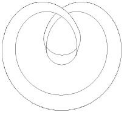

[无对应译文]

</section>

<section class="parallel-paragraph" data-paragraph-ids="s9-17-0002">

s9-17-0002

原文 · s9-17-0002

J’avais annoncé que je continuerai aujourd’hui sur *le phallus*, eh bien je ne vous en parlerai pas ! Ou bien je ne vous en parlerai que sous cette forme de *huit inversé*, qui n’est pas tellement tranquillisante. Ça n’est pas d’un nou­veau signifiant qu’il s’agit, vous allez voir, c’est toujours du même dont je parle, en somme, depuis le début de cette année. Seulement, pourquoi je le ramène comme essentiel ? C’est pour bien renouveler avec la base topologique dont il s’agit, à savoir, ce que ça veut dire, l’introduction faite cette année du *tore*.

[无对应译文]

</section>

<section class="parallel-paragraph" data-paragraph-ids="s9-17-0003">

s9-17-0003

原文 · s9-17-0003

Il n’est pas tellement bien sûr que ce que j’ai dit sur l’angoisse ait été si bien entendu. Quelqu’un de très sympathique, et qui lit, parce que c’est quelqu’un d’un milieu où on travaille, m’a fort opportu­nément - je dois dire que je choisis cet exemple parce qu’il est plutôt encou­rageant - fait remarquer que ce que j’ai dit sur *l’angoisse* comme désir de l’Autre recouvrait ce qu’on trouve dans KIERKEGAARD[^154].

[无对应译文]

</section>

<section class="parallel-paragraph" data-paragraph-ids="s9-17-0004">

s9-17-0004

原文 · s9-17-0004

Dans *la première lecture*, car c’est tout à fait vrai - vous pensez bien que je m’en souvenais - que KIERKEGAARD, pour parler de l’angoisse, a évoqué la jeune fille, au moment où la première fois elle s’aperçoit qu’on la désire. Seulement si KIERKEGAARD l’a dit, la différence avec ce que je dis c’est, si je puis dire pour employer un terme kierkegaardien, que je le répète. S’il y a quelqu’un qui a fait remarquer que ce n’est jamais pour rien qu’on dit « *Je le dis et je le répète* », c’est justement KIERKEGAARD.

[无对应译文]

</section>

<section class="parallel-paragraph" data-paragraph-ids="s9-17-0005">

s9-17-0005

原文 · s9-17-0005

Si on éprouve le besoin de souligner qu’on le répète après l’avoir dit, c’est parce que probablement *ce n’est pas du tout* *la même chose de le répé­ter que de le dire*, et il est absolument certain que, si ce que j’ai dit la dernière fois a un sens, c’est justement en ceci que le cas soulevé par KIERKEGAARD est quelque chose de tout à fait particulier et qui comme tel obscurcit - loin d’éclai­rer - le sens véritable de la formule que l’angoisse est le désir de l’Autre, avec un grand A. Il se peut que cet Autre s’incarne pour la jeune fille à un moment de son existence en quelque galvaudeux. Cela n’a rien à faire avec la question que j’ai soulevée la dernière fois, et avec l’introduction du désir de l’Autre comme tel pour dire que c’est l’angoisse, plus exactement, que l’angoisse est la sensation de ce désir.

[无对应译文]

</section>

<section class="parallel-paragraph" data-paragraph-ids="s9-17-0006">

s9-17-0006

原文 · s9-17-0006

Aujourd’hui je vais donc revenir à ma voie de cette année, et d’autant plus rigoureusement que j’avais dû la dernière fois faire une excursion. Et c’est pour­quoi, plus rigoureusement que jamais, nous allons faire de la topologie. Et il est nécessaire d’en faire, parce que vous ne pouvez faire que d’en faire à tout ins­tant, je veux dire : que vous soyez logiciens ou pas, que vous sachiez même le sens du mot *topologie* ou pas, vous vous servez par exemple de *la conjonction* « *ou* ». Or il est assez remarquable, mais sûrement vrai, que l’usage de cette conjonc­tion n’a été - sur le champ de la logique technique, de la logique des logiciens - bien articulé, bien précisé, bien mis en évidence qu’à une époque assez récente, beaucoup trop récente pour qu’en somme les effets vous en soient véritablement parvenus.

[无对应译文]

</section>

<section class="parallel-paragraph" data-paragraph-ids="s9-17-0007">

s9-17-0007

原文 · s9-17-0007

Et c’est pour ça qu’il suffit de lire le moindre texte analytique courant par exemple, pour voir qu’à tout instant la pensée *achoppe* dès qu’il s’agit, non seulement du terme d’« *identification »*, mais même de la pratique d’identifier quoi que ce soit du champ de notre expérience. Il faut repartir des schémas malgré tout, disons-le, inébranlés dans votre pensée, inébranlés pour deux raisons :

[无对应译文]

</section>

<section class="parallel-paragraph" data-paragraph-ids="s9-17-0008">

s9-17-0008

原文 · s9-17-0008

- d’abord parce qu’ils ressortissent à ce que j’appellerai *une certaine incapacité* à proprement parler, propre à la pensée intuitive, ou plus simplement à l’intuition, ce qui veut dire aux bases mêmes d’une expérience marquée par l’organisation de ce qu’on appelle le sens visuel. Vous vous apercevez très facilement de *cette impuissance intuitive* - si j’ai le bonheur qu’après ce petit entretien vous vous mettiez à vous poser de simples problèmes de représentation sur ce que je vais vous montrer qui peut se passer à la surface d’un tore - vous verrez la peine que vous aurez à ne pas vous embrouiller. C’est pourtant bien simple *un tore*, *un anneau*. Vous vous embrouillerez, et puis je m’embrouille comme vous : il m’a fallu de l’exercice pour m’y retrouver un peu et même m’apercevoir de ce que ça suggérait, et de ce que ça permettait de fonder pratiquement.

[无对应译文]

</section>

<section class="parallel-paragraph" data-paragraph-ids="s9-17-0009">

s9-17-0009

原文 · s9-17-0009

- L’autre terme est lié à ce qu’on appelle « *instruction »*, c’est à savoir que, cette sorte d’impuissance intuitive, on fait tout pour l’encourager, pour l’asseoir, pour lui donner un caractère d’absolu, cela bien sûr dans *les meilleures intentions*. C’est ce qui est arrivé par exemple, quand en 1741, M. EULER, un très grand nom dans l’histoire des mathématiques, a introduit ses fameux cercles qui - que vous le sachiez ou pas - ont beaucoup fait en somme pour encourager l’enseignement de la logique classique dans un certain sens qui - loin de l’ouvrir - ne pouvait

[无对应译文]

</section>

<section class="parallel-paragraph" data-paragraph-ids="s9-17-0010">

s9-17-0010

原文 · s9-17-0010

> tendre qu’à rendre fâcheusement évidente l’idée que pouvaient s’en faire les simples écoliers.

[无对应译文]

</section>

<section class="parallel-paragraph" data-paragraph-ids="s9-17-0011">

s9-17-0011

原文 · s9-17-0011

La chose s’est produite parce qu’EULER s’était mis en tête - Dieu sait pourquoi - d’enseigner une princesse : la princesse d’ANHALT DESSAU. Pendant toute une période on s’est beaucoup occupé des princesses, on s’en occupe encore et *c’est fâcheux*. Vous savez que DESCARTES avait la sienne, la fameuse Christine. C’est une figure historique d’un autre relief : *il en est mort* ! Ça n’est pas tout à fait subjectif : il y a *une espèce de puanteur très particulière* qui se dégage de tout ce qui entoure l’entité « *princesse »* ou « *Prinzessin »*. Nous avons, pen­dant une période d’à peu près trois siècles, quelque chose qui est dominé par *les lettres* adressées *à des princesses*, *les mémoires* *des princesses*, et ça tient une place certaine dans la culture.

[无对应译文]

</section>

<section class="parallel-paragraph" data-paragraph-ids="s9-17-0012">

s9-17-0012

原文 · s9-17-0012

C’est une sorte de suppléance de cette « *Dame* » dont j’ai tenté de vous expliquer la fonction[^155] si difficile à comprendre, si difficile à approcher dans la structure de la sublimation courtoise, dont je ne suis pas sûr après tout de vous avoir fait apercevoir quelle est vraiment la véritable portée. Je n’ai pu vraiment vous en donner que des sortes de projections, comme on essaie de figurer dans un autre espace des figures à quatre dimensions qu’on ne peut pas se représenter.

[无对应译文]

</section>

<section class="parallel-paragraph" data-paragraph-ids="s9-17-0013">

s9-17-0013

原文 · s9-17-0013

J’ai appris avec plaisir que quelque chose en est parvenu à des oreilles qui me sont *voisines*, et qu’on commence à s’intéresser ailleurs qu’ici à ce que pourrait être « *l’amour courtois* ». C’est déjà un résultat. Laissons la princesse et les embarras qu’elle a pu donner à EULER. Il lui a écrit 241 lettres, pas uniquement pour lui faire comprendre les cercles d’EULER. Publiées en 1775 à Londres[^156], elles constituent une sorte de corpus de la pensée scientifique à cette date.

[无对应译文]

</section>

<section class="parallel-paragraph" data-paragraph-ids="s9-17-0014">

s9-17-0014

原文 · s9-17-0014

Il n’en a surnagé effectivement que ces petits cercles, ces cercles d’EULER qui sont des cercles comme tous les cercles, il s’agit simplement de voir l’usage qu’il en a fait. C’était pour expliquer les règles du syllogisme et en fin de compte « *l’exclusion* », « *l’inclusion* », et puis ce qu’on peut appeler « *le recoupement* » de deux quoi ? de deux champs, applicable à quoi ? mais mon Dieu applicable à bien des choses :

[无对应译文]

</section>

<section class="parallel-paragraph" data-paragraph-ids="s9-17-0015">

s9-17-0015

原文 · s9-17-0015

- applicable par exemple au champ où une certaine proposition est vraie,

[无对应译文]

</section>

<section class="parallel-paragraph" data-paragraph-ids="s9-17-0016">

s9-17-0016

原文 · s9-17-0016

- applicable au champ où une certaine relation existe,

[无对应译文]

</section>

<section class="parallel-paragraph" data-paragraph-ids="s9-17-0017">

s9-17-0017

原文 · s9-17-0017

- applicable tout sim­plement au champ où un objet existe.

[无对应译文]

</section>

<section class="parallel-paragraph" data-paragraph-ids="s9-17-0018">

s9-17-0018

原文 · s9-17-0018

Vous voyez que l’usage du cercle d’EULER - si vous êtes habitués à la multipli­cité des logiques, telles qu’elles se sont élaborées dans un immense effort, dont la plus grande part tient dans la logique propositionnelle, relationnelle, et la logique des classes - a été distingué de la façon la plus utile.

[无对应译文]

</section>

<section class="parallel-paragraph" data-paragraph-ids="s9-17-0019">

s9-17-0019

原文 · s9-17-0019

Je ne peux même pas songer à entrer, bien sûr, dans les détails que nécessiterait de donner la dis­tinction de ces élaborations. Ce que je veux simplement faire ici reconnaître, c’est que vous avez sûrement souvenir de tel ou tel moment de votre existence où vous est parvenue, sous cette forme de support, une démonstration logique quelconque de quelque objet comme objet logique, qu’il s’agisse de *proposition*, *relation*, *classe*, voire simplement *objet* d’existence. Prenons un exemple au niveau de la logique des classes, et représentons par exemple par un petit cercle à l’intérieur d’un grand : les *mammifères* par rapport à la classe des *vertébrés*.

[无对应译文]

</section>

<section class="parallel-paragraph" data-paragraph-ids="s9-17-0020">

s9-17-0020

原文 · s9-17-0020

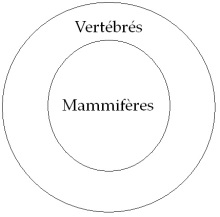

[无对应译文]

</section>

<section class="parallel-paragraph" data-paragraph-ids="s9-17-0021">

s9-17-0021

原文 · s9-17-0021

Ceci va tout seul, et d’autant plus simplement que, *la logique des classes*, c’est certai­nement ce qui au départ a frayé les voies de la façon la plus aisée à cette élabo­ration formelle, et qu’on se rapporte là à quelque chose de déjà incarné dans une élaboration signifiante, celle de la classification zoologique tout simplement, qui vraiment en donne le modèle. Seulement « *l’univers du discours »* - comme on s’exprime à juste titre - n’est pas un univers zoologique, et à vouloir étendre les propriétés de la classification zoologique à tout *l’univers du discours*, on glisse facilement dans un certain nombre de pièges qui vous incitent à des fautes et lais­sent assez vite entendre le signal d’alarme de *l’impasse* significative.

[无对应译文]

</section>

<section class="parallel-paragraph" data-paragraph-ids="s9-17-0022">

s9-17-0022

原文 · s9-17-0022

Un de ces inconvénients est par exemple un usage inconsidéré de *la négation*. C’est juste­ment à une époque récente que cet usage s’est trouvé ouvert comme possible, à savoir juste à l’époque où on a fait la remarque que, dans l’usage de *la négation*, ce cercle d’EULER extérieur de *l’inclusion* devait jouer un rôle essentiel, à savoir que ce n’est absolument pas la même chose de parler sans aucune précision, par exemple de ce qui est *non-homme*, ou de ce qui est *non-homme* à l’intérieur des animaux. En d’autres termes que, pour que *la négation* ait un sens à peu près assuré, utilisable en logique, il faut savoir par rapport à quel ensemble quelque chose est nié.

[无对应译文]

</section>

<section class="parallel-paragraph" data-paragraph-ids="s9-17-0023">

s9-17-0023

原文 · s9-17-0023

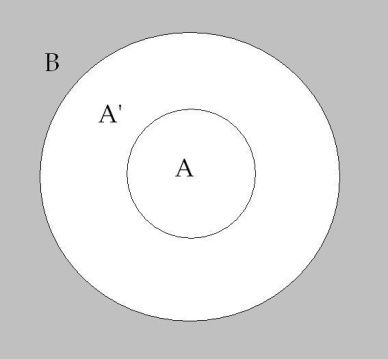

[无对应译文]

</section>

<section class="parallel-paragraph" data-paragraph-ids="s9-17-0024">

s9-17-0024

原文 · s9-17-0024

En d’autres termes, si A’ est « *non* A », il faut savoir dans quoi il est « *non* A », à savoir ici dans B.

[无对应译文]

</section>

<section class="parallel-paragraph" data-paragraph-ids="s9-17-0025">

s9-17-0025

原文 · s9-17-0025

*La négation*, vous la verrez - si vous ouvrez à cette occa­sion ARISTOTE - entraîner dans toutes sortes de difficultés. Il n’en reste néanmoins pas contestable qu’on n’a nullement ni attendu ces remarques, ni non plus fait le moindre usage de ce support formel, je veux dire qu’il n’est pas normal d’en faire usage pour se servir de la négation, à savoir que le sujet dans son discours fait fréquemment usage de la négation, dans des cas où il n’y a pas le moindre­ment du monde de possibilité de l’assurer sur cette base formelle.

[无对应译文]

</section>

<section class="parallel-paragraph" data-paragraph-ids="s9-17-0026">

s9-17-0026

原文 · s9-17-0026

D’où l’utilité des remarques que je vous fais sur *la négation* en distinguant *la négation au niveau de l’énonciation*, ou comme constitutive de *la négation au niveau de l’énoncé*. Cela veut dire que *les lois de la négation*, justement au point où elles ne sont pas assurées par cette *introduction* tout à fait décisive, et qui date de *la distinction récente de la logique des relations* d’avec *la logique des classes*, que c’est en somme pour nous, tout à fait ailleurs que là où elle a trouvé son assiette que nous avons à définir le statut de *la négation*.

[无对应译文]

</section>

<section class="parallel-paragraph" data-paragraph-ids="s9-17-0027">

s9-17-0027

原文 · s9-17-0027

C’est un rappel, un rappel des­tiné à vous éclairer rétrospectivement l’importance de ce que, depuis le début du discours de cette année, je vous suggère concernant l’originalité primordiale, par rapport à cette distinction, de *la fonction de la négation*. Vous voyez donc que ces *cercles d’Euler*, ce n’est pas EULER qui s’en est servi à cette fin : il a fallu depuis que s’introduise l’œuvre de [BOOLE](http://fr.wikipedia.org/wiki/Alg%C3%A8bre_de_Boole_(logique)), puis de [DE MORGAN](http://www.bibmath.net/dico/index.php3?action=affiche&quoi=./m/morgan.html) pour que ceci soit pleine­ment articulé.

[无对应译文]

</section>

<section class="parallel-paragraph" data-paragraph-ids="s9-17-0028">

s9-17-0028

原文 · s9-17-0028

Si j’en reviens à ces *cercles d’Euler*, ça n’est donc pas qu’il en fait lui-même si bon usage, mais c’est que c’est avec *son maté­riel*, avec *l’usage de ses cercles*, qu’ont pu être faits les progrès qui ont suivi, et dont je vous donne à la fois l’un de ceux qui ne sont pas le moindre, ni le moindre notoire, en tout cas particulièrement saisissant, immédiat à faire sentir. Entre EULER et DE MORGAN, l’usage de ces cercles a permis une symbolisation qui est aussi utile qu’elle vous paraît du reste implicitement *fondamentale*, qui repose sur la position de ces cercles, qui se structurent ainsi :

[无对应译文]

</section>

<section class="parallel-paragraph" data-paragraph-ids="s9-17-0029">

s9-17-0029

原文 · s9-17-0029

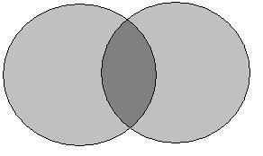

[无对应译文]

</section>

<section class="parallel-paragraph" data-paragraph-ids="s9-17-0030">

s9-17-0030

原文 · s9-17-0030

C’est ce que nous appelle­rons deux cercles qui se recoupent, qui sont spécialement importants pour leur valeur intuitive, qui paraîtra à chacun incontestable si je vous fais remarquer que c’est autour de ces cercles que peuvent s’articuler d’abord deux relations qu’il convient de bien accentuer, qui sont celle - d’abord - de *la réunion*.

[无对应译文]

</section>

<section class="parallel-paragraph" data-paragraph-ids="s9-17-0031">

s9-17-0031

原文 · s9-17-0031

Qu’il s’agisse de quoi que ce soit que j’ai énuméré tout à l’heure, leur réunion, c’est le fait qu’après l’opération de la réunion, ce qui est unifié ce sont ces deux champs. L’opération dite de la réunion, *qui se symbolise* ainsi ordinairement U - c’est pré­cisément ce qui a introduit ce symbole - est, vous le voyez, quelque chose qui n’est pas tout à fait pareil à *l’addition.*

[无对应译文]

</section>

<section class="parallel-paragraph" data-paragraph-ids="s9-17-0032">

s9-17-0032

原文 · s9-17-0032

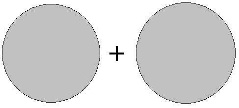

[无对应译文]

</section>

<section class="parallel-paragraph" data-paragraph-ids="s9-17-0033">

s9-17-0033

原文 · s9-17-0033

C’est l’avantage de ces cercles de le faire sentir. Ce n’est pas la même chose que d’additionner par exemple deux cercles séparés ou de les réunir dans cette position :

[无对应译文]

</section>

<section class="parallel-paragraph" data-paragraph-ids="s9-17-0034">

s9-17-0034

原文 · s9-17-0034

[无对应译文]

</section>

<section class="parallel-paragraph" data-paragraph-ids="s9-17-0035">

s9-17-0035

原文 · s9-17-0035

Il y a une autre relation qui est illus­trée par ces cercles qui se recoupent, c’est celle de *l’intersection*, *symbolisée* par ce signe ∩, dont la signification est tout à fait différente. *Le champ d’intersec­tion* est compris dans *le champ de réunion*.

[无对应译文]

</section>

<section class="parallel-paragraph" data-paragraph-ids="s9-17-0036">

s9-17-0036

原文 · s9-17-0036

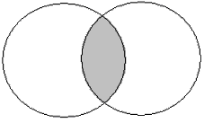

[无对应译文]

</section>

<section class="parallel-paragraph" data-paragraph-ids="s9-17-0037">

s9-17-0037

原文 · s9-17-0037

Dans ce qu’on appelle l’algèbre de BOOLE :

[无对应译文]

</section>

<section class="parallel-paragraph" data-paragraph-ids="s9-17-0038">

s9-17-0038

原文 · s9-17-0038

- on montre que, jusqu’à un certain point tout au moins, cette opération de la réunion est assez analogue à l’addition pour qu’on puisse la symboliser par le signe de l’addition : **+**.

[无对应译文]

</section>

<section class="parallel-paragraph" data-paragraph-ids="s9-17-0039">

s9-17-0039

原文 · s9-17-0039

- On montre également que l’intersection est structurale­ment assez analogue à la multiplication pour qu’on puisse la symboliser par le signe de la multiplication : **x**.

[无对应译文]

</section>

<section class="parallel-paragraph" data-paragraph-ids="s9-17-0040">

s9-17-0040

原文 · s9-17-0040

Je vous assure que je fais là un extrait ultra-rapide destiné à vous mener là où j’ai à vous mener et dont je m’excuse bien sûr, auprès de ceux pour qui ces choses se présentent dans toute leur complexité, quant aux élisions que tout ceci com­porte, car il faut que nous allions plus loin.

[无对应译文]

</section>

<section class="parallel-paragraph" data-paragraph-ids="s9-17-0041">

s9-17-0041

原文 · s9-17-0041

Et sur le point précis que j’ai à intro­duire, ce qui nous intéresse c’est quelque chose qui, jusqu’à DE MORGAN \- et on ne peut qu’être étonné d’une pareille omission - n’avait pas été à proprement par­ler mis en évidence comme justement une de ces fonctions qui découlent, qui devraient découler d’un usage tout à fait rigoureux de la logique : c’est précisément *ce champ* constitué par l’extraction, dans le rapport de ces deux cercles, de la zone d’intersection.

[无对应译文]

</section>

<section class="parallel-paragraph" data-paragraph-ids="s9-17-0042">

s9-17-0042

原文 · s9-17-0042

Et considérez ce qui est le produit, quand deux cercles se recoupent, au niveau du champ ainsi défini :

[无对应译文]

</section>

<section class="parallel-paragraph" data-paragraph-ids="s9-17-0043">

s9-17-0043

原文 · s9-17-0043

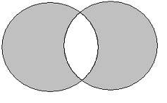

[无对应译文]

</section>

<section class="parallel-paragraph" data-paragraph-ids="s9-17-0044">

s9-17-0044

原文 · s9-17-0044

c’est-à-dire *la réunion moins l’intersection*, c’est ce qu’on appelle « *la différence symétrique* ». Cette *différence symétrique* est ceci, qui va nous retenir, qui pour nous, vous verrez pourquoi, est du plus haut intérêt.

[无对应译文]

</section>

<section class="parallel-paragraph" data-paragraph-ids="s9-17-0045">

s9-17-0045

原文 · s9-17-0045

Le terme de *différence symétrique* est ici une appellation que je vous prie simplement de prendre pour son usage traditionnel, c’est comme cela qu’on l’a appelée, n’essayez pas de don­ner un sens analysable grammaticalement à cette soi-disant *symétrie*. La *différence symétrique* c’est ça que cela veut dire, cela veut dire ces champs, dans les deux cercles d’EULER, en tant qu’ils définissent comme tel *un « ou » d’exclusion*.

[无对应译文]

</section>

<section class="parallel-paragraph" data-paragraph-ids="s9-17-0046">

s9-17-0046

原文 · s9-17-0046

Concernant deux champs différents, *la différence symétrique* marque le champ tel qu’il est construit si vous donnez au « *ou* » non pas le sens *alternatif*, et qui implique la possibilité d’une identité locale entre les deux termes, c’est l’usage cou­rant du terme « *ou* », qui fait qu’en fait le terme « *ou* » s’applique ici fort bien au champ de la réunion.

[无对应译文]

</section>

<section class="parallel-paragraph" data-paragraph-ids="s9-17-0047">

s9-17-0047

原文 · s9-17-0047

Si une chose est « A *ou* B », c’est ainsi que le champ de son exten­sion peut se dessiner, à savoir sous la forme première où ces deux champs sont recouverts.

[无对应译文]

</section>

<section class="parallel-paragraph" data-paragraph-ids="s9-17-0048">

s9-17-0048

原文 · s9-17-0048

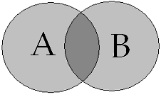

[无对应译文]

</section>

<section class="parallel-paragraph" data-paragraph-ids="s9-17-0049">

s9-17-0049

原文 · s9-17-0049

« A *ou* B »

[无对应译文]

</section>

<section class="parallel-paragraph" data-paragraph-ids="s9-17-0050">

s9-17-0050

原文 · s9-17-0050

Si au contraire c’est exclusif, « *ou* A*, ou* B* »*, c’est ainsi que nous pouvons le symboliser, à savoir que le champ d’inter­section est exclu.

[无对应译文]

</section>

<section class="parallel-paragraph" data-paragraph-ids="s9-17-0051">

s9-17-0051

原文 · s9-17-0051

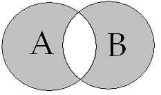

[无对应译文]

</section>

<section class="parallel-paragraph" data-paragraph-ids="s9-17-0052">

s9-17-0052

原文 · s9-17-0052

« *ou* A*, ou* B* »*

[无对应译文]

</section>

<section class="parallel-paragraph" data-paragraph-ids="s9-17-0053">

s9-17-0053

原文 · s9-17-0053

Ceci doit nous mener à un retour, à une réflexion concer­nant ce que suppose intuitivement l’usage du cercle comme base, comme support, de quelque chose qui se formalise en fonction d’une limite. Ceci se définit très suffisamment dans ce fait que, sur un plan d’usage courant, ce qui ne veut pas dire un plan naturel, un plan fabricable, un plan qui est tout à fait entré dans notre univers d’outils, à savoir une feuille de papier...

[无对应译文]

</section>

<section class="parallel-paragraph" data-paragraph-ids="s9-17-0054">

s9-17-0054

原文 · s9-17-0054

Nous vivons beaucoup plus en compagnie de *feuilles de papier* qu’en compagnie de *tores*. *Il doit y avoir pour ça des raisons*, mais enfin des raisons qui ne sont pas évidentes. Pourquoi après tout l’homme ne fabriquerait-il pas plus de tores ? D’ailleurs pendant des siècles, ce que nous avons actuellement sous la forme de feuilles, c’étaient des rouleaux, qui devaient être plus familiers avec la notion de volume à d’autres époques qu’à la nôtre. Enfin, il y a certainement une raison pour que cette surface plane soit quelque chose qui nous suffise, et plus exactement, dont nous nous suffisions. Ces raisons doivent être quelque part. Et - je l’indiquais tout à l’heure - on ne saurait accorder trop d’importance au fait que, contrairement à tous les efforts, des physiciens comme des philosophes, pour nous persuader du contraire, le champ visuel, quoiqu’on en dise, est essentiellement à deux dimensions

[无对应译文]

</section>

<section class="parallel-paragraph" data-paragraph-ids="s9-17-0055">

s9-17-0055

原文 · s9-17-0055

...sur une feuille de papier, sur une surface pratiquement simple, un cercle dessiné délimite de la façon la plus claire *un intérieur* et *un extérieur*. Voilà tout le secret, tout le mystère, le ressort simple de l’usage qui en est fait dans l’illustration eulérienne de la logique. Je vous pose la question suivante : qu’est-ce qui arrive si EULER, au lieu de des­siner ce *cercle*, dessine mon *huit inversé*, celui dont aujourd’hui j’ai à vous entre­tenir ?

[无对应译文]

</section>

<section class="parallel-paragraph" data-paragraph-ids="s9-17-0056">

s9-17-0056

原文 · s9-17-0056

 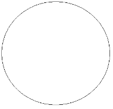

[无对应译文]

</section>

<section class="parallel-paragraph" data-paragraph-ids="s9-17-0057">

s9-17-0057

原文 · s9-17-0057

En apparence ce n’est qu’un cas particulier du cercle, avec *le champ intérieur* qu’il définit et la possibilité d’avoir *un autre cercle* *à l’intérieur*. Sim­plement, le cercle intérieur touche - voilà ce qu’à un premier aspect certains pourront me dire - le cercle intérieur touche à la limite constituée par le cercle extérieur. Seulement c’est quand même pas tout à fait ça, en ce sens qu’il est bien clair, à la façon dont je le dessine, que *la ligne ici du cercle extérieur se continue dans la ligne du cercle intérieur* pour se retrouver ici.

[无对应译文]

</section>

<section class="parallel-paragraph" data-paragraph-ids="s9-17-0058">

s9-17-0058

原文 · s9-17-0058

Et alors, pour simplement tout de suite marquer l’intérêt, la portée de cette très simple forme, je vous suggérerai que les remarques que j’ai introduites à un certain point de mon séminaire, quand j’ai introduit la fonction du signifiant, consistaient en ceci : à vous rappeler le para­doxe, ou prétendu tel, introduit par *la classification des ensembles* - rappelez-­vous - *qui ne se comprennent pas eux-mêmes*.

[无对应译文]

</section>

<section class="parallel-paragraph" data-paragraph-ids="s9-17-0059">

s9-17-0059

原文 · s9-17-0059

Je vous rappelle la difficulté qu’ils introduisent : doit-on, ces ensembles qui ne se compren­nent pas eux-mêmes, les inclure ou non dans l’ensemble des ensembles qui ne se comprennent pas eux-mêmes ?

[无对应译文]

</section>

<section class="parallel-paragraph" data-paragraph-ids="s9-17-0060">

s9-17-0060

原文 · s9-17-0060

Vous voyez là la difficulté :

[无对应译文]

</section>

<section class="parallel-paragraph" data-paragraph-ids="s9-17-0061">

s9-17-0061

原文 · s9-17-0061

- si oui, c’est donc qu’ils se com­prendront eux-mêmes dans cet *ensemble* *des ensembles qui ne se comprennent pas eux-mêmes*,

[无对应译文]

</section>

<section class="parallel-paragraph" data-paragraph-ids="s9-17-0062">

s9-17-0062

原文 · s9-17-0062

- si non, nous nous trouvons devant une impasse analogue.

[无对应译文]

</section>

<section class="parallel-paragraph" data-paragraph-ids="s9-17-0063">

s9-17-0063

原文 · s9-17-0063

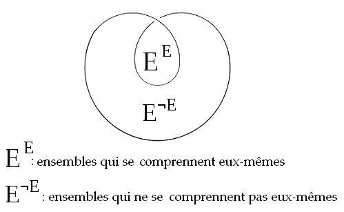

[无对应译文]

</section>

<section class="parallel-paragraph" data-paragraph-ids="s9-17-0064">

s9-17-0064

原文 · s9-17-0064

Ceci est facilement *­*résolu, à cette simple condition qu’on s’aperçoive à tout le moins de ceci - c’est la solution qu’ont donnée d’ailleurs, les formalistes, les logiciens - qu’on ne peut pas parler, disons de la même façon : des « *ensembles qui se comprennent eux-mêmes* » et des « *ensembles qui ne se comprennent pas eux-mêmes* ».

[无对应译文]

</section>

<section class="parallel-paragraph" data-paragraph-ids="s9-17-0065">

s9-17-0065

原文 · s9-17-0065

Autrement dit, qu’on les exclut comme tels de la définition simple des ensembles, qu’on pose en fin de compte que « *les ensembles qui se comprennent eux-mêmes »* ne peuvent être posés comme des ensembles.

[无对应译文]

</section>

<section class="parallel-paragraph" data-paragraph-ids="s9-17-0066">

s9-17-0066

原文 · s9-17-0066

Je veux dire que *loin que cette zone intérieure*... d’objets aussi considérables dans *la construction* de la logique moderne que les ensembles ...*loin qu’une zone intérieure*...

[无对应译文]

</section>

<section class="parallel-paragraph" data-paragraph-ids="s9-17-0067">

s9-17-0067

原文 · s9-17-0067

> définie par cette image du huit renversé, par le recouvrement, ou le redoublement dans ce recou­vrement,
>
> *d’une classe, d’une relation, d’une proposition* quelconque par elle-même, par sa portée à la seconde puissance …*loin que ceci laisse* dans un cas notoire *la classe, la proposition, la relation d’une façon générale, la catégorie à l’intérieur d’elle-même*, d’une façon en quelque sorte plus pesante, plus accen­tuée, *ceci a pour effet de la réduire à l’homogénéité avec ce qui est à l’extérieur*.

[无对应译文]

</section>

<section class="parallel-paragraph" data-paragraph-ids="s9-17-0068">

s9-17-0068

原文 · s9-17-0068

Comment ceci est-il concevable ? Car enfin on doit tout de même bien dire que, si c’est ainsi que la question se présente, à savoir entre tous les ensembles un ensemble qui se recouvre lui–même, il n’y a aucune raison *a priori* de ne pas en faire un ensemble comme les autres.

[无对应译文]

</section>

<section class="parallel-paragraph" data-paragraph-ids="s9-17-0069">

s9-17-0069

原文 · s9-17-0069

Vous définissez comme ensemble, par exemple, tous les ouvrages concernant ce qui se rapporte aux humanités, c’est-­à-dire aux arts, aux sciences, à l’ethnographie... Vous faites une liste. Les ouvrages qui sont des ouvrages faits sur la question de ce qu’on doit classer comme huma­nités feront partie du même catalogue, c’est-­à-dire que ce que je viens même de définir à l’instant en articulant le titre : « *les ouvrages concernant les humanités* », fait partie de ce qu’il y a à cataloguer. Comment pouvons-nous concevoir que quelque chose, qui se pose ainsi comme se redoublant soi-même dans la dignité d’une certaine catégorie, puisse pratiquement nous amener à une antinomie, à une impasse logique telle que nous soyons au contraire contraints de la rejeter ?

[无对应译文]

</section>

<section class="parallel-paragraph" data-paragraph-ids="s9-17-0070">

s9-17-0070

原文 · s9-17-0070

Voilà quelque chose qui n’est pas d’aussi peu d’importance que vous pourriez le croire, puisqu’on a pratiquement vu les meilleurs logiciens y voir une sorte d’échec, de point de butée, *de point de vacillation de tout l’édifice formaliste*, et non sans raison. Voilà qui pourtant fait à l’intuition une sorte d’objection majeure, toute seule inscrite, sensible, visible dans la forme même de ces deux cercles qui se présentent, dans la perspective eulérienne, comme inclus l’un par rapport à l’autre.

[无对应译文]

</section>

<section class="parallel-paragraph" data-paragraph-ids="s9-17-0071">

s9-17-0071

原文 · s9-17-0071

C’est justement là-dessus que nous allons voir que l’usage de l’intuition de représentation du tore est tout à fait utilisable. Et, étant donné que vous sentez bien, j’imagine, ce dont il s’agit, à savoir *un certain rapport du signifiant à lui-même,* je vous l’ai dit, c’est dans la mesure où la définition d’un ensemble s’est de plus en plus rapprochée d’une articulation purement signifiante qu’elle a amené à cette impasse.

[无对应译文]

</section>

<section class="parallel-paragraph" data-paragraph-ids="s9-17-0072">

s9-17-0072

原文 · s9-17-0072

C’est toute la question du fait qu’il s’agit pour nous de mettre au premier plan : *qu’un signifiant ne saurait se signifier lui-même* \- *en fait c’est une chose excessivement bête et simple - qu’à se poser comme différent de lui-même*. Ce point très essentiel : *que le signi­fiant, en tant qu’il peut servir à se signifier lui-même, doit se poser comme dif­férent de lui-même. C’est ceci qu’il s’agit de symboliser* au premier chef parce que c’est aussi *ceci* que nous allons retrouver, jusqu’à un certain point d’exten­sion qu’il s’agit de déterminer, dans toute la structure subjective, jusqu’au *désir* y compris.

[无对应译文]

</section>

<section class="parallel-paragraph" data-paragraph-ids="s9-17-0073">

s9-17-0073

原文 · s9-17-0073

Quand un de mes *obsessionnels,* tout récemment encore, après avoir développé tout le raffinement de la science de ses exercices à l’endroit des *objets féminins* auxquels - comme il est commun chez les autres obsessionnels, si je puis dire - il reste attaché par ce qu’on peut appeler « *une infidélité constante* » - à la fois impossibilité de quitter aucun de ces objets, et extrême difficulté à les maintenir tous ensemble - et qu’il ajoute qu’il est bien évident que dans cette relation, dans ce rapport si compliqué qui nécessite de si hauts raffinements techniques, si je puis dire, dans le maintien de relations qui en principe doivent rester : *extérieures* les unes aux autres, *imperméables* si l’on peut dire les unes aux autres, et pour­tant liées, que si tout ceci, me dit-il, n’a pas d’autre fin que de le laisser intact pour une satisfaction dont lui-même ici achoppe, c’est qu’elle doit donc se trouver ailleurs : non pas seulement dans un futur toujours reculé, mais manifestement dans un autre espace, puisque de cette intactitude et de sa fin il est incapable en fin de compte de dire sur quoi, comme satisfaction, ceci peut déboucher.

[无对应译文]

</section>

<section class="parallel-paragraph" data-paragraph-ids="s9-17-0074">

s9-17-0074

原文 · s9-17-0074

Nous avons tout de même là, sensible, quelque chose qui pour nous, pose la question de la structure du désir de la façon la plus quotidienne. Revenons à notre *tore* et inscrivons-y nos *cercles d’Euler*. Ceci va nécessiter de faire \- je m’en excuse - un tout petit retour qui n’est pas, quoi qu’il puisse apparaître à quelqu’un qui entrerait actuellement pour la première fois dans mon séminaire, un retour géométrique - il le sera peut-être, tout à fait à la fin, mais très incidem­ment - qui est à proprement parler *topologique*.

[无对应译文]

</section>

<section class="parallel-paragraph" data-paragraph-ids="s9-17-0075">

s9-17-0075

原文 · s9-17-0075

Il n’y a aucun besoin que ce *tore* soit *un tore régulier* ni *un tore* sur lequel nous puissions faire des *mesures*. C’est une surface constituée selon certaines relations fondamentales que je vais être amené à vous rappeler, mais comme je ne veux pas paraître aller trop loin de ce qui est le champ de notre intérêt, je vais me limiter aux choses que j’ai déjà amorcées et qui sont très simples. Je vous l’ai fait remarquer, sur une telle surface, nous pouvons décrire ce type de cercle \[1\]

[无对应译文]

</section>

<section class="parallel-paragraph" data-paragraph-ids="s9-17-0076">

s9-17-0076

原文 · s9-17-0076

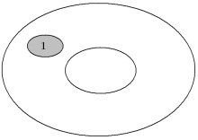

[无对应译文]

</section>

<section class="parallel-paragraph" data-paragraph-ids="s9-17-0077">

s9-17-0077

原文 · s9-17-0077

qui est celui que je vous ai connoté comme *réductible*, celui qui, si il est représenté par une petite ficelle qui passe à la fin par une boucle, je peux en tirant sur la ficelle *le réduire à un point*, autrement dit à zéro. Je vous ai fait remar­quer qu’il y a deux espèces d’autres cercles ou *lacs*, quelle que soit leur étendue, car il pourrait aussi bien, par exemple celui-là \[2\], avoir cette forme-là \[2’\] :

[无对应译文]

</section>

<section class="parallel-paragraph" data-paragraph-ids="s9-17-0078">

s9-17-0078

原文 · s9-17-0078

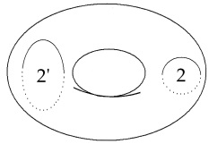

[无对应译文]

</section>

<section class="parallel-paragraph" data-paragraph-ids="s9-17-0079">

s9-17-0079

原文 · s9-17-0079

Cela veut dire, *un cercle qui traverse le trou*, quelle que soit sa forme plus ou moins serrée, plus ou moins laxe, c’est ça qui le définit : *il traverse le trou*, il passe de l’autre côté du trou. Il est ici représenté en pointillés, alors que là il est représenté en plein. C’est ceci que cela symbolise : *ce cercle n’est pas réductible.* Ce qui veut dire que si vous le supposez réalisé par une ficelle passant toujours par ce petit arceau qui nous servirait à le serrer, nous ne pouvons pas le réduire à quelque chose de *punctiforme*, il restera toujours, quelle que soit sa circonférence, au centre, la circonférence de ce qu’on peut appeler ici « *l’épaisseur du tore* ».

[无对应译文]

</section>

<section class="parallel-paragraph" data-paragraph-ids="s9-17-0080">

s9-17-0080

原文 · s9-17-0080

Ce *cercle irréduc­tible* du point de vue qui nous intéressait tout à l’heure, à savoir de la définition d’un intérieur et d’un extérieur, s’il montre d’un côté une résistance particulière, quelque chose qui par rapport aux autres cercles lui confère une dignité éminente, sur cet autre point voici tout d’un coup qu’il va paraître singulièrement déchu des propriétés du précédent. Car si, ce cercle dont je vous parle, vous le matérialisez par exemple par une coupure avec une paire de ciseaux, qu’est-ce que vous obtien­drez ? Absolument pas - comme dans l’autre cas - un petit morceau qui s’en va et puis le reste du tore. Le tore restera tout entier bien intact sous la forme d’un tuyau, ou d’une manche si vous voulez.

[无对应译文]

</section>

<section class="parallel-paragraph" data-paragraph-ids="s9-17-0081">

s9-17-0081

原文 · s9-17-0081

Si vous prenez d’autre part un autre type de cercle \[3\], celui dont je vous ai déjà parlé, celui qui n’est pas celui qui traverse le trou, mais qui en fait le tour : celui-là se trouve dans la même situation que le précédent quant à l’irréductibi­lité. Il se trouve également dans la même situa­tion que le précédent, concernant le fait qu’il ne suffit pas à définir un intérieur ni un extérieur. Autrement dit, que si vous le suivez, ce cercle, et que vous ouvrez le tore à l’aide d’une paire de ciseaux, vous aurez à la fin quoi ?

[无对应译文]

</section>

<section class="parallel-paragraph" data-paragraph-ids="s9-17-0082">

s9-17-0082

原文 · s9-17-0082

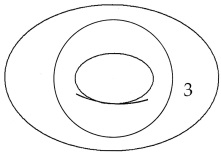

[无对应译文]

</section>

<section class="parallel-paragraph" data-paragraph-ids="s9-17-0083">

s9-17-0083

原文 · s9-17-0083

Eh bien, la même chose que dans le cas précédent : ça a la forme du *tore*, mais c’est une forme qui ne présente une différence qu’intuitive, qui est tout à fait essentiellement la même du point de vue de la structure. Vous avez toujours, après cette opération, comme dans le premier cas, une manche, simplement c’est une manche très courte et très large.

[无对应译文]

</section>

<section class="parallel-paragraph" data-paragraph-ids="s9-17-0084">

s9-17-0084

原文 · s9-17-0084

Vous avez une ceinture si vous voulez, mais il n’y a pas de différence essentielle entre une ceinture et une manche du point de vue topologique. Appelez ça encore une bande si vous voulez. Nous voilà donc en présence de *deux types de cercles*, qui de ce point de vue d’ailleurs n’en font qu’un, qui ne définissent pas un intérieur et un extérieur.

[无对应译文]

</section>

<section class="parallel-paragraph" data-paragraph-ids="s9-17-0085">

s9-17-0085

原文 · s9-17-0085

Je vous fais observer incidemment que si vous coupez le tore successivement sui­vant l’un et l’autre, vous n’arrivez pas encore pour autant à faire ce dont il s’agit, et que vous obtenez pourtant tout de suite avec l’autre type de cercle, le premier que je vous ai dessiné \[1\], à savoir deux morceaux. Au contraire le tore, non seu­lement reste bien tout entier, mais c’était, la première fois que je vous en parlais, une mise à plat qui en résulte et qui vous permet de :

[无对应译文]

</section>

<section class="parallel-paragraph" data-paragraph-ids="s9-17-0086">

s9-17-0086

原文 · s9-17-0086

- symboliser éventuellement d’une façon particulièrement commode *le tore* comme *un rectangle* que vous pouvez en tirant un peu étaler comme une peau épinglée aux quatre coins,

[无对应译文]

</section>

<section class="parallel-paragraph" data-paragraph-ids="s9-17-0087">

s9-17-0087

原文 · s9-17-0087

- défi­nir les propriétés de correspondance de ses bords l’un à l’autre, de correspon­dance aussi de ses sommets : les quatre sommets se réunissant en un point, et avoir ainsi - d’une façon beaucoup plus accessible à vos facultés d’intuition ordi­naire - moyen d’étudier ce qui se passe géométriquement sur le tore.

[无对应译文]

</section>

<section class="parallel-paragraph" data-paragraph-ids="s9-17-0088">

s9-17-0088

原文 · s9-17-0088

> 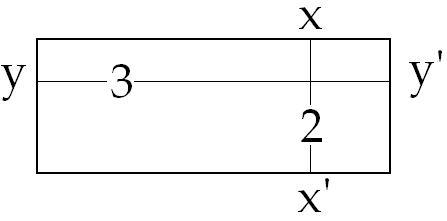

[无对应译文]

</section>

<section class="parallel-paragraph" data-paragraph-ids="s9-17-0089">

s9-17-0089

原文 · s9-17-0089

C’est-à-dire, il y aura un de ces types de cercles qui se représentera par une ligne comme celle-­ci \[2\], *un autre type de cercles* par des lignes comme celle-ci \[3\] représentant deux points opposés \[x-x’, y-y’\], définis d’une façon préalable comme étant équivalents sur ce qu’on appelle les bords de la surface étalée, mise à plat, la mise à plat comme telle étant impossible, puisqu’il ne s’agit pas d’une surface qui soit métriquement identifiable à une sur­face plane, je le répète, purement métriquement, pas topologiquement. Où est-ce que ceci nous mène ?

[无对应译文]

</section>

<section class="parallel-paragraph" data-paragraph-ids="s9-17-0090">

s9-17-0090

原文 · s9-17-0090

Le fait que deux sections de cette espèce soient possibles, avec d’ailleurs néces­site de se recouper l’une ou l’autre sans fragmenter d’aucune façon la surface, en la laissant entière, en la laissant d’un seul lambeau si je puis dire, ceci suffit à définir un certain genre d’une surface. Toutes les surfaces sont loin d’avoir ce genre. Si vous faites en particulier une telle section sur une sphère, vous n’aurez toujours que deux morceaux, quel que soit le cercle. Ceci pour nous conduire à quoi ? Ne faisons plus une seule section, mais *deux sections* sur la surface du tore. Qu’est-ce que nous voyons apparaître ?

[无对应译文]

</section>

<section class="parallel-paragraph" data-paragraph-ids="s9-17-0091">

s9-17-0091

原文 · s9-17-0091

Nous voyons appa­raître quelque chose qui assurément va nous étonner tout de suite, c’est à savoir que si les deux cercles se recoupent, le champ dit de « *la dif­férence symétrique* » existe bel et bien. Est-ce que nous pouvons dire que, pour autant, existe le champ de l’intersection ? Je pense que cette figure telle qu’elle est construite, est suffisamment accessible à votre intuition pour que vous compreniez bien tout de suite et immédiatement qu’il n’en est rien.

[无对应译文]

</section>

<section class="parallel-paragraph" data-paragraph-ids="s9-17-0092">

s9-17-0092

原文 · s9-17-0092

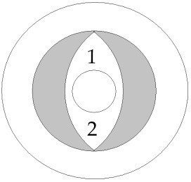

[无对应译文]

</section>

<section class="parallel-paragraph" data-paragraph-ids="s9-17-0093">

s9-17-0093

原文 · s9-17-0093

C’est à savoir que ce quelque chose qui serait intersection, mais qui ne l’est pas et qui - je dis : pour l’œil, car bien entendu il n’est même pas question un seul instant que cette intersection existe - mais qui, pour l’œil, et tel que je vous l’ai présenté ainsi sur cette figure telle qu’elle est dessinée, se trouverait peut–être quelque part, par ici \[1\] dans ce champ parfaitement continué d’un seul bloc, d’un seul lambeau, avec ce champ-là \[2\] qui pourrait analogiquement, de la façon la plus grossière pour une intuition justement habituée à se fonder aux choses qui se passent uniquement sur le plan, correspondre à ce champ externe où nous pourrions définir, par rapport à deux cercles d’EULER se recoupant, le champ de leur négation :

[无对应译文]

</section>

<section class="parallel-paragraph" data-paragraph-ids="s9-17-0094">

s9-17-0094

原文 · s9-17-0094

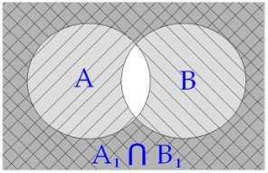

[无对应译文]

</section>

<section class="parallel-paragraph" data-paragraph-ids="s9-17-0095">

s9-17-0095

原文 · s9-17-0095

À savoir :

[无对应译文]

</section>

<section class="parallel-paragraph" data-paragraph-ids="s9-17-0096">

s9-17-0096

原文 · s9-17-0096

- si ici nous avons le cercle A,

[无对应译文]

</section>

<section class="parallel-paragraph" data-paragraph-ids="s9-17-0097">

s9-17-0097

原文 · s9-17-0097

- et ici le cercle B,

[无对应译文]

</section>

<section class="parallel-paragraph" data-paragraph-ids="s9-17-0098">

s9-17-0098

原文 · s9-17-0098

- ici nous avons A1 : *négation de* A \[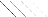\],

[无对应译文]

</section>

<section class="parallel-paragraph" data-paragraph-ids="s9-17-0099">

s9-17-0099

原文 · s9-17-0099

- et nous avons ici B1 : *négation de* B. \[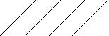\]

[无对应译文]

</section>

<section class="parallel-paragraph" data-paragraph-ids="s9-17-0100">

s9-17-0100

原文 · s9-17-0100

Et il y a quelque chose à formuler concernant leur inter­section à ces champs extérieurs éventuels.

[无对应译文]

</section>

<section class="parallel-paragraph" data-paragraph-ids="s9-17-0101">

s9-17-0101

原文 · s9-17-0101

Ici nous voyons donc, illustré de la façon la plus simple par la structure du tore, ceci : que quelque chose est possible, quelque chose qui peut s’articuler ainsi : deux champs se recoupent, pouvant comme tels définir leur différence en tant que *différence symétrique*, mais qui n’en sont pas moins deux champs dont on peut dire qu’ils ne peuvent se réunir et qu’ils ne peuvent pas non plus se recouvrir. En d’autres termes, qu’ils ne peuvent ni servir à une fonction de « *ou-ou* », ni servir à une fonction de multiplication par soi-même :

[无对应译文]

</section>

<section class="parallel-paragraph" data-paragraph-ids="s9-17-0102">

s9-17-0102

原文 · s9-17-0102

- ils ne peuvent littéralement pas se reprendre à la deuxième puissance,

[无对应译文]

</section>

<section class="parallel-paragraph" data-paragraph-ids="s9-17-0103">

s9-17-0103

原文 · s9-17-0103

- ils ne peu­vent pas se réfléchir l’un par l’autre et l’un dans l’autre,

[无对应译文]

</section>

<section class="parallel-paragraph" data-paragraph-ids="s9-17-0104">

s9-17-0104

原文 · s9-17-0104

- ils n’ont pas d’intersec­tion : leur intersection est exclusion d’eux-mêmes.

[无对应译文]

</section>

<section class="parallel-paragraph" data-paragraph-ids="s9-17-0105">

s9-17-0105

原文 · s9-17-0105

Le champ où l’on attendait l’intersection est le champ où l’on sort de ce qui les concerne, où on est dans le non-champ. Ceci est d’autant plus intéressant qu’à la représentation de *ces deux cercles* nous pouvons substituer notre *huit inversé* de tout à l’heure. Nous nous trouvons alors devant une forme qui pour nous est encore plus suggestive.

[无对应译文]

</section>

<section class="parallel-paragraph" data-paragraph-ids="s9-17-0106">

s9-17-0106

原文 · s9-17-0106

[无对应译文]

</section>

<section class="parallel-paragraph" data-paragraph-ids="s9-17-0107">

s9-17-0107

原文 · s9-17-0107

Car essayons de nous rappeler ce à quoi j’ai pensé tout de suite à les comparer, ces cercles qui font le tour du trou du tore : à quelque chose - vous ai-je dit - qui a rap­port avec l’objet métonymique, avec l’objet du désir en tant que tel.

[无对应译文]

</section>

<section class="parallel-paragraph" data-paragraph-ids="s9-17-0108">

s9-17-0108

原文 · s9-17-0108

Qu’est-ce que ce huit inversé, ce cercle qui se reprend lui-même à l’intérieur de lui-même ? Qu’est-ce que c’est, si ce n’est un cercle qui à la limite se redouble et se ressai­sit, *qui permet de symboliser* - puisqu’il s’agit d’évidence intuitive et que les cercles eulériens nous paraissent particulière­ment convenables à une certaine symbolisation de la limite *- qui permet de symboliser cette limite* en tant qu’elle se reprend elle-même, qu’elle s’identifie à elle-même. Réduisez de plus en plus la distance qui sépare la première boucle, disons, de la seconde, et vous avez le cercle en tant qu’il se saisit lui-même.

[无对应译文]

</section>

<section class="parallel-paragraph" data-paragraph-ids="s9-17-0109">

s9-17-0109

原文 · s9-17-0109

Est-ce qu’il y a pour nous des objets qui aient cette nature, à savoir qui subsistent uniquement dans cette saisie de leur auto-différence ? Car de deux choses l’une : ou ils la saisissent, ou ils ne la saisissent pas. Mais il y a une chose, en tout cas, que tout ce qui se passe à ce niveau de la saisie implique et nécessite, c’est que ce quelque chose exclut toute réflexion de cet objet sur soi-même.

[无对应译文]

</section>

<section class="parallel-paragraph" data-paragraph-ids="s9-17-0110">

s9-17-0110

原文 · s9-17-0110

Je veux dire que, supposez que ce soit *(a)* dont il s’agisse - comme je vous l’ai déjà indi­qué, que c’était ce à quoi ces cercles allaient nous servir - ceci veut dire que *a*2, le champ ainsi défini, est *le même champ* que ce qui est là, c’est­-à-dire *non (a)* ou -*a*. Supposez pour l’instant, je n’ai pas dit que c’était démontré, je vous dis que je vous fournis aujourd’hui un modèle, un sup­port intuitif à quelque chose qui est précisément ce dont nous avons besoin concernant la constitution du désir.

[无对应译文]

</section>

<section class="parallel-paragraph" data-paragraph-ids="s9-17-0111">

s9-17-0111

原文 · s9-17-0111

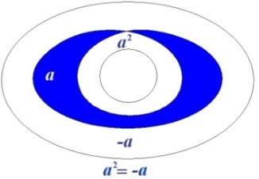

[无对应译文]

</section>

<section class="parallel-paragraph" data-paragraph-ids="s9-17-0112">

s9-17-0112

原文 · s9-17-0112

Peut-être vous paraîtra-t-il plus accessible, plus immédiatement à votre portée d’en faire le symbole de l’auto-différence du *désir* à lui-même, et le fait que c’est précisément à son redoublement sur lui-même que nous voyons apparaître que ce qu’il enserre, se dérobe et fuit vers ce qui l’entoure.

[无对应译文]

</section>

<section class="parallel-paragraph" data-paragraph-ids="s9-17-0113">

s9-17-0113

原文 · s9-17-0113

Vous direz, arrêtez-vous, suspen­dez-vous ici, car ce n’est pas réellement *le désir* que j’entends symboliser par *la double boucle* de ce *huit intérieur*, mais quelque chose qui convient beaucoup mieux à la conjonction du *(a)* - de *l’objet du désir* comme tel - avec lui-même. Pour que *le désir* soit effectivement, intelligemment supporté dans cette réfé­rence intuitive à *la surface du tore*, il convient d’y faire entrer, comme de bien entendu, la dimension de *la demande*.

[无对应译文]

</section>

<section class="parallel-paragraph" data-paragraph-ids="s9-17-0114">

s9-17-0114

原文 · s9-17-0114

Cette dimension de *la demande*, je vous ai dit d’autre part que les cercles enserrant l’épaisseur du *tore*, comme tels pouvaient servir très intelligiblement à la représenter, et que quelque chose - d’ailleurs qui est en partie contingent, je veux dire lié à une aperception toute extérieure, visuelle, elle-même trop marquée de l’intuition commune pour n’être pas réfu­table, vous le verrez, mais enfin tel que vous êtes forcés de vous représen­ter *le tore*, à savoir quelque chose comme cet anneau, vous voyez facilement combien aisément ce qui se passe dans la succession de ces cercles capables de se suivre en quelque sorte en hélice et selon une répétition qui est celle du fil, autour de la bobine, combien aisément la demande, dans sa répétition, son identité et sa distinction nécessaires, son déroulement et son retour sur elle-même, est quelque chose qui trouve facilement à se supporter de la structure du *tore*.

[无对应译文]

</section>

<section class="parallel-paragraph" data-paragraph-ids="s9-17-0115">

s9-17-0115

原文 · s9-17-0115

Ce n’est pas là ce que j’entends aujourd’hui répéter une fois de plus. D’ailleurs, si je ne faisais que le répéter ici, ce serait tout à fait insuffisant. C’est au contraire quelque chose sur lequel je voudrais attirer votre attention, à savoir ce cercle privilégié qui est constitué par ceci : que c’est non seulement un cercle qui fait le tour du trou cen­tral, mais que c’est aussi un cercle qui le traverse. En d’autres termes qu’il est constitué par une propriété topologique *qui confond*, *qui additionne* la boucle constituée autour de l’épaisseur du tore avec celle qui se ferait, d’un tour fait par exemple autour du trou intérieur

[无对应译文]

</section>

<section class="parallel-paragraph" data-paragraph-ids="s9-17-0116">

s9-17-0116

原文 · s9-17-0116

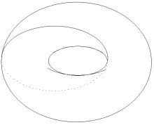

[无对应译文]

</section>

<section class="parallel-paragraph" data-paragraph-ids="s9-17-0117">

s9-17-0117

原文 · s9-17-0117

Cette sorte de *boucle* est pour nous d’un intérêt tout à fait privilégié, car c’est elle qui nous permettra de supporter, d’imager *les relations* comme *structurales de la demande et du désir*. Voyons, en effet, ce qui peut se produire concernant de telles boucles : observez qu’il peut y en avoir d’ainsi constituées, qu’une autre qui lui est voisine s’achève, revienne sur elle-même, sans du tout couper la première.

[无对应译文]

</section>

<section class="parallel-paragraph" data-paragraph-ids="s9-17-0118">

s9-17-0118

原文 · s9-17-0118

Vous le voyez, étant donné ce que j’ai là essayé de bien articuler, de bien dessiner, à savoir la façon dont ça passe de l’autre côté de cet objet - que nous supposons massif, parce que c’est comme ça que vous l’intuitionnez si facilement, et qui évi­demment ne l’est pas - la ligne du cercle \[1\] passe ici, l’autre ligne \[2\] passe un peu plus loin, il n’y a aucune espèce d’intersection de ces deux cercles.

[无对应译文]

</section>

<section class="parallel-paragraph" data-paragraph-ids="s9-17-0119">

s9-17-0119

原文 · s9-17-0119

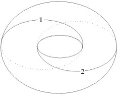

[无对应译文]

</section>

<section class="parallel-paragraph" data-paragraph-ids="s9-17-0120">

s9-17-0120

原文 · s9-17-0120

Voici *deux demandes* qui tout en impliquant le cercle central avec ce qu’il symbolise à l’occasion : *l’objet*, et dans quelle mesure il est effectivement intégré à la demande, ces deux demandes ne comportent aucune espèce de recoupement, aucune espèce d’intersection, et même aucune espèce de différence articulable entre elles, encore qu’elles aient le même objet inclus dans leur périmètre. Au contraire, il y a un autre type de circuit, celui qui ici passe effectivement de l’autre côté du tore, mais loin de se rejoindre à lui-même au point d’où il est parti, amorce ici une autre courbe pour venir une seconde fois passer ici et revenir à son point de départ.

[无对应译文]

</section>

<section class="parallel-paragraph" data-paragraph-ids="s9-17-0121">

s9-17-0121

原文 · s9-17-0121

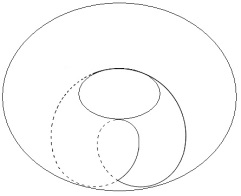

[无对应译文]

</section>

<section class="parallel-paragraph" data-paragraph-ids="s9-17-0122">

s9-17-0122

原文 · s9-17-0122

Je pense que vous avez saisi ce dont il s’agit : il s’agit de rien moins que de quelque chose d’absolument équivalent à la fameuse courbe du huit inversé dont je vous ai parlé tout à l’heure. Ici les deux boucles repré­sentent la réitération, la réduplication de *la demande*, et comportent alors ce champ de différence à soi-même, d’auto-différence qui est celui sur lequel nous avons mis l’accent tout à l’heure, c’est­-à-dire qu’ici nous trouvons le moyen de symboliser d’une façon sensible, au niveau de *la demande* elle-même, une condition pour qu’elle suggère, dans toute son ambiguïté, et d’une façon strictement analogue à la façon dont elle est sug­gérée dans la réduplication de tout à l’heure de l’objet du désir lui-même, la dimension centrale constituée par *le vide du désir*.

[无对应译文]

</section>

<section class="parallel-paragraph" data-paragraph-ids="s9-17-0123">

s9-17-0123

原文 · s9-17-0123

Tout ceci, je ne vous l’apporte que comme une sorte de proposi­tion d’exercices, d’*exercices mentaux*, d’exercices avec lesquels vous avez à vous familiariser, si vous voulez pouvoir, dans *le tore*, trouver pour la suite la valeur métaphorique que je lui donnerai quand j’aurai dans chaque cas, qu’il s’agisse de *l’obsessionnel*, de *l’hystérique*, du *pervers*, voire même du *schizophrène,* à articuler le rapport du *désir* et de *la demande*.

[无对应译文]

</section>

<section class="parallel-paragraph" data-paragraph-ids="s9-17-0124">

s9-17-0124

原文 · s9-17-0124

C’est pourquoi c’est sous d’autres formes, *sous la forme du tore déployé, mis à plat* de tout à l’heure, que je vais essayer de bien vous mar­quer à quoi correspondent les divers cas que j’ai jusqu’ici évoqués. À savoir les deux premiers cercles, par exemple, qui étaient des cercles qui faisaient le tour du trou central, et qui se recou­paient en constituant à proprement parler la même figure de *différence symétrique* qui est celle des cercles d’EULER.

[无对应译文]

</section>

<section class="parallel-paragraph" data-paragraph-ids="s9-17-0125">

s9-17-0125

原文 · s9-17-0125

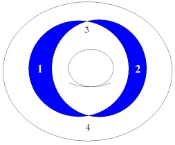

[无对应译文]

</section>

<section class="parallel-paragraph" data-paragraph-ids="s9-17-0126">

s9-17-0126

原文 · s9-17-0126

Voici ce que ça donne sur le tore étalé :

[无对应译文]

</section>

<section class="parallel-paragraph" data-paragraph-ids="s9-17-0127">

s9-17-0127

原文 · s9-17-0127

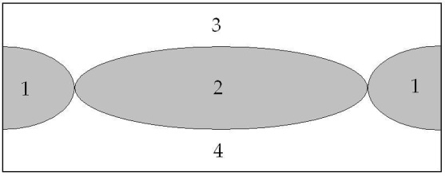

[无对应译文]

</section>

<section class="parallel-paragraph" data-paragraph-ids="s9-17-0128">

s9-17-0128

原文 · s9-17-0128

Certainement, *figurée de cette façon* plus satis­faisante que ce que vous voyiez tout à l’heure, en ceci que vous pouvez toucher du doigt ce fait qu’il n’y a pas de symétrie, disons entre les quatre champs deux à deux \[1,2,3,4\], tels qu’ils sont défi­nis par le recoupement des deux cercles.

[无对应译文]

</section>

<section class="parallel-paragraph" data-paragraph-ids="s9-17-0129">

s9-17-0129

原文 · s9-17-0129

Vous auriez pu tout à l’heure vous dire, et certainement pas d’une façon qui aurait été le signe de peu d’attention, qu’à dessiner les choses ainsi, et à donner une valeur privilégiée à ce que j’appelle ici *différence symétrique*, je ne fais là que quelque chose d’assez arbitraire, puisque les deux autres champs \[3,4\], dont je vous ai fait remarquer qu’ils se confondent, occupaient peut-être par rapport à ces deux ci \[1,2\] une place symétrique. Vous voyez ici qu’il n’en est rien, à savoir que *les champs définis par ces deux secteurs*, de quelque façon que vous les raccordiez, et vous pourriez le faire, ne sont d’aucune façon identifiables au premier champ. L’autre figure, à savoir celle du *huit inversé*, se présente ainsi :

[无对应译文]

</section>

<section class="parallel-paragraph" data-paragraph-ids="s9-17-0130">

s9-17-0130

原文 · s9-17-0130

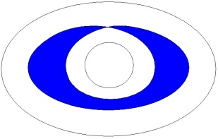 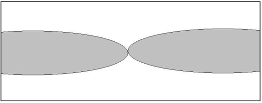

[无对应译文]

</section>

<section class="parallel-paragraph" data-paragraph-ids="s9-17-0131">

s9-17-0131

原文 · s9-17-0131

*La non symétrie des deux champs* est encore plus évidente. Les deux cercles que j’ai dessinés ensuite successivement *sur le* *pourtour du tore* comme définissant deux cercles de *la demande* en tant qu’ils ne se recou­pent pas, les voici ainsi symbolisés :

[无对应译文]

</section>

<section class="parallel-paragraph" data-paragraph-ids="s9-17-0132">

s9-17-0132

原文 · s9-17-0132

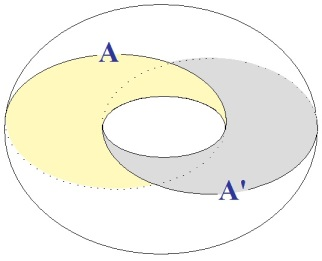

[无对应译文]

</section>

<section class="parallel-paragraph" data-paragraph-ids="s9-17-0133">

s9-17-0133

原文 · s9-17-0133

Il y en a un \[A\] que nous pouvons identi­fier purement - je parle des deux cercles de la demande tels que je viens de les définir en tant qu’ils incluaient en plus le trou central - l’un peut très facilement se définir, se situer sur le tore étalé comme une oblique reliant en diagonale un sommet au même point qu’il est réellement au bord opposé, au sommet opposé de sa position : AB.

[无对应译文]

</section>

<section class="parallel-paragraph" data-paragraph-ids="s9-17-0134">

s9-17-0134

原文 · s9-17-0134

[无对应译文]

</section>

<section class="parallel-paragraph" data-paragraph-ids="s9-17-0135">

s9-17-0135

原文 · s9-17-0135

La seconde boucle \[A’\] que j’avais dessinée tout à l’heure se symboliserait ainsi : commençant en un point ici quelconque, nous avons ici A’, ici C - un point C qui est le même que ce point C’ - et finis­sant ici en B’ : A’C C’B’. Il n’y a ici aucune possibilité de distinguer le champ qui est en AA’, il n’a aucun privilège par rapport à ce champ-ci \[BB’\]. Il n’en est pas de même, si c’est au contraire le huit intérieur que nous symbolisons, car il se présente ainsi :

[无对应译文]

</section>

<section class="parallel-paragraph" data-paragraph-ids="s9-17-0136">

s9-17-0136

原文 · s9-17-0136

 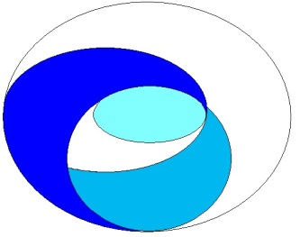

[无对应译文]

</section>

<section class="parallel-paragraph" data-paragraph-ids="s9-17-0137">

s9-17-0137

原文 · s9-17-0137

Voici l’un de ses champs : il est défini par les par­ties ombrées ici. Il n’est manifestement pas symétrique avec ce qui reste de l’autre champ, de quelque façon que vous vous efforciez de le composer.

[无对应译文]

</section>

<section class="parallel-paragraph" data-paragraph-ids="s9-17-0138">

s9-17-0138

原文 · s9-17-0138

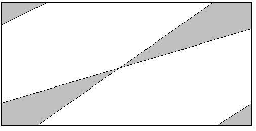

[无对应译文]

</section>

<section class="parallel-paragraph" data-paragraph-ids="s9-17-0139">

s9-17-0139

原文 · s9-17-0139

Il est bien évident que vous pouvez le recomposer de la façon suivante, que cet élé­ment-là, mettons le x, venant ici, cet y venant là, et ce z venant ici, vous avez la forme définie par l’auto-différence dessinée par le huit intérieur :

[无对应译文]

</section>

<section class="parallel-paragraph" data-paragraph-ids="s9-17-0140">

s9-17-0140

原文 · s9-17-0140

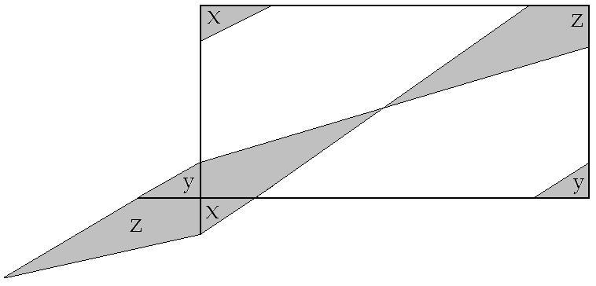

[无对应译文]

</section>

<section class="parallel-paragraph" data-paragraph-ids="s9-17-0141">

s9-17-0141

原文 · s9-17-0141

Ceci, dont nous verrons l’utilisation par la suite, peut vous paraître quelque peu fastidieux, voire superflu, au moment même où j’essaie pour vous de l’articuler. Néanmoins je vou­drais vous faire remarquer à quoi ça sert. Vous le voyez bien, tout l’accent que je porte sur la définition de ces champs est destiné à vous marquer en quoi ils sont uti­lisables, ces champs de la différence symé­trique et de ce que j’appelle l’auto-­différence, en quoi ils sont utilisables pour une certaine fin, et en quoi ils se soutien­nent comme existant par rapport à un autre champ qu’ils excluent. En d’autres termes, à établir leur *fonction dissymétrique*, si je me donne tellement de peine, c’est qu’il y a une raison.

[无对应译文]

</section>

<section class="parallel-paragraph" data-paragraph-ids="s9-17-0142">

s9-17-0142

原文 · s9-17-0142

La raison est celle-ci, c’est que *le tore*, tel qu’il est structuré purement et simplement comme surface : il est très difficile de symboliser d’une façon valable ce que j’appellerai sa dissymétrie. En d’autres termes, quand vous le voyez *étalé*, à savoir *sous la forme de ce rectangle* dont il s’agira, pour reconstituer *le tore*, que vous conceviez : *primo*, que je le replie et que je fais un tube, *secundo* que je ramène un bout du tube sur l’autre et je fais un tube fermé.

[无对应译文]

</section>

<section class="parallel-paragraph" data-paragraph-ids="s9-17-0143">

s9-17-0143

原文 · s9-17-0143

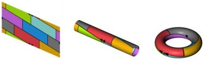

[无对应译文]

</section>

<section class="parallel-paragraph" data-paragraph-ids="s9-17-0144">

s9-17-0144

原文 · s9-17-0144

Il n’en reste pas moins que ce que j’ai fait dans un sens j’aurais pu le faire dans l’autre. Puisqu’il s’agit de topologie, et non de propriétés métriques, la question de *la plus grande lon­gueur* d’un côté par rapport à l’autre n’a aucune signification, que ceci n’est pas ce qui nous intéresse, puisque c’est la fonction réciproque de ces cercles qu’il s’agit d’utiliser. Or, justement dans cette *réciprocité* ils apparaissent pouvoir avoir des *fonctions strictement équivalentes*.

[无对应译文]

</section>

<section class="parallel-paragraph" data-paragraph-ids="s9-17-0145">

s9-17-0145

原文 · s9-17-0145

Aussi bien cette possibilité est-elle à la base de ce que j’avais d’abord laissé pointer, apparaître, dès le début - pour vous – dans l’utilisation de cette fonction du tore comme d’une possibilité d’image sensible à son propos. C’est que chez certains sujets, certains *névrosés* par exemple, nous voyons en quelque sorte d’une façon sensible *la projection,* si l’on peut s’exprimer ainsi, des cercles mêmes du *désir* dans toute la mesure où il s’agit pour eux, si je puis dire, d’en sortir dans des *demandes* exigées de l’Autre. Et c’est ce que j’ai *symbolisé* en vous montrant ceci :

[无对应译文]

</section>

<section class="parallel-paragraph" data-paragraph-ids="s9-17-0146">

s9-17-0146

原文 · s9-17-0146

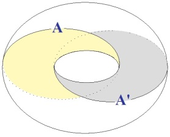 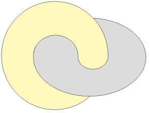

[无对应译文]

</section>

<section class="parallel-paragraph" data-paragraph-ids="s9-17-0147">

s9-17-0147

原文 · s9-17-0147

C’est que si vous dessinez un tore, vous pouvez simplement en imaginer un autre qui enserre si l’on peut dire, de cette façon le premier. Il faut bien voir que chacun des cercles qui sont des cercles autour du trou peuvent avoir, par simple roulement, leur correspondance dans des cercles qui passent à travers le trou de l’autre tore, qu’un tore en quelque sorte est toujours transformable en tous ses points en un tore opposé.

[无对应译文]

</section>

<section class="parallel-paragraph" data-paragraph-ids="s9-17-0148">

s9-17-0148

原文 · s9-17-0148

Ce qu’il s’agit donc de voir, c’est ce qui origina­lise *une des fonctions circulaires, celle des cercles pleins* par exemple, par rapport à ce que nous avons appelé à un autre moment les *cercles vides*. Cette différence existe très évidemment. On pourrait par exemple *la symboliser*, *la formaliser* en indi­quant, par un petit signe sur la surface du tore étalé en rectangle :

[无对应译文]

</section>

<section class="parallel-paragraph" data-paragraph-ids="s9-17-0149">

s9-17-0149

原文 · s9-17-0149

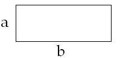

[无对应译文]

</section>

<section class="parallel-paragraph" data-paragraph-ids="s9-17-0150">

s9-17-0150

原文 · s9-17-0150

si vous le voulez, l’antériorité selon laquelle se ferait le recoupement, et si nous appelons ce côté *a*, et ce côté *b*, noter par exemple *a \< b*, ou inversement.

[无对应译文]

</section>

<section class="parallel-paragraph" data-paragraph-ids="s9-17-0151">

s9-17-0151

原文 · s9-17-0151

Ce serait là une notation à laquelle jamais personne n’a songé *en topologie*, et qui aurait quelque chose de tout à fait *arti­ficiel*, car on ne voit pas pourquoi un tore serait d’aucune façon un objet qui aurait une dimension temporelle. À partir de ce moment, il est tout à fait diffi­cile de le *symboliser* autrement, encore qu’on voit bien qu’il y a là quelque chose d’irréductible et qui fait même à proprement parler toute la vertu exemplaire de l’objet torique.

[无对应译文]

</section>

<section class="parallel-paragraph" data-paragraph-ids="s9-17-0152">

s9-17-0152

原文 · s9-17-0152

Il y aurait une autre façon d’essayer de l’aborder. Il est bien clair que c’est pour autant que nous ne considérons le tore que comme *surface*, et ne prenant ses coordonnées que de sa propre structure, que nous sommes mis devant cette impasse, grosse pour nous de conséquences, puisque, si évidemment les cercles, dont vous voyez que je vais tendre à les faire servir pour y fixer la demande, bien entendu dans ses rapports avec d’autres cercles qui ont rapport avec le désir, s’ils sont strictement réversibles, est-ce que c’est là quelque chose que nous désirons avoir pour notre modèle ? Assurément pas !

[无对应译文]

</section>

<section class="parallel-paragraph" data-paragraph-ids="s9-17-0153">

s9-17-0153

原文 · s9-17-0153

C’est, au contraire, du privilège essentiel du trou central qu’il s’agit, et par conséquent le statut topologique que nous cherchons comme utilisable dans notre *modèle* va se trouver nous *fuir* et nous *échapper*. C’est justement parce qu’il nous fuit et nous échappe qu’il va se révéler fécond pour nous.

[无对应译文]

</section>

<section class="parallel-paragraph" data-paragraph-ids="s9-17-0154">

s9-17-0154

原文 · s9-17-0154

Essayons une autre méthode, pour marquer ce dont les mathématiciens, *les topologistes,* se passent parfaitement dans la définition, l’usage qu’ils font de *cette structure du tore en topologie* : eux-mêmes, dans la théorie générale des surfaces ont mis en valeur la fonction du tore comme élé­ment *irréductible* de toute réduction des surfaces à ce qu’on appelle une forme *normale*. Quand je dis que c’est *un élément irréductible*, je veux dire qu’on ne peut réduire le tore à autre chose. On peut imaginer des formes de surface aussi complexes que vous voudrez, mais il faudra toujours tenir compte de la fonction tore dans toute planification, si je puis m’exprimer ainsi, dans toute triangulation dans la théorie des surfaces.

[无对应译文]

</section>

<section class="parallel-paragraph" data-paragraph-ids="s9-17-0155">

s9-17-0155

原文 · s9-17-0155

*Le tore ne suffit pas, il y faut d’autres termes* : il y faut nommément *la sphère*, il y faut ce à quoi je n’ai pas pu même aujourd’hui encore faire allusion, introduire la possibilité de ce qu’on appelle *cross-cap*, et la possibilité de *trous*. Quand vous avez *la sphère, le tore, le cross-cap* et *le trou*, vous pouvez représenter n’importe quelle surface qu’on appelle *compacte*, autre­ment dit une surface qui soit décomposable en lambeaux.

[无对应译文]

</section>

<section class="parallel-paragraph" data-paragraph-ids="s9-17-0156">

s9-17-0156

原文 · s9-17-0156

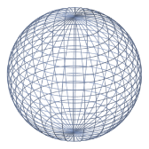 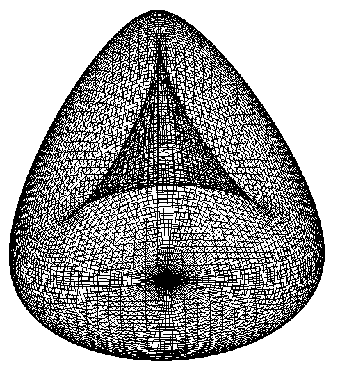 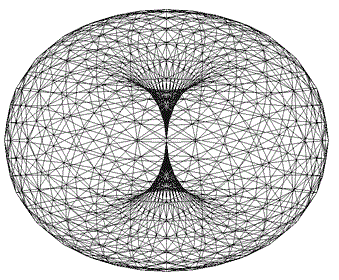

[无对应译文]

</section>

<section class="parallel-paragraph" data-paragraph-ids="s9-17-0157">

s9-17-0157

原文 · s9-17-0157

Il y a d’autres *surfaces* qui ne sont pas décomposables en lambeaux, mais nous les laissons de côté. Venons-en à notre *tore* et à la possibilité de son orientation. Est-ce que nous allons pouvoir la faire par rapport à la sphère idéale sur laquelle il s’accroche ? Nous pouvons - cette sphère - toujours l’introduire, à savoir qu’avec une suffi­sante puissance de *souffle*, n’importe quel tore peut venir à se présenter comme une simple poignée à la surface d’une sphère qui est une partie de lui-même suf­fisamment gonflée.

[无对应译文]

</section>

<section class="parallel-paragraph" data-paragraph-ids="s9-17-0158">

s9-17-0158

原文 · s9-17-0158

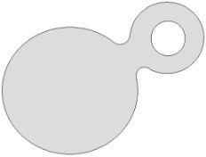

[无对应译文]

</section>

<section class="parallel-paragraph" data-paragraph-ids="s9-17-0159">

s9-17-0159

原文 · s9-17-0159

Est-ce que par l’intermédiaire de la sphère nous allons pouvoir, si je puis dire, replon­ger *le tore* dans ce que - vous le sentez bien - nous cher­chons pour l’instant, à savoir ce troisième terme qui nous permette d’introduire *la dissymétrie* dont nous avons besoin entre les deux types de cercles ?

[无对应译文]

</section>

<section class="parallel-paragraph" data-paragraph-ids="s9-17-0160">

s9-17-0160

原文 · s9-17-0160

Cette *dissymétrie* pourtant si évidente, si intuitivement sen­sible, si irréductible même, et qui est pourtant telle qu’elle se manifeste à propos comme étant ce quelque chose que nous observons toujours dans tout dévelop­pement mathématique : la nécessité, pour que ça marche, d’oublier quelque chose au départ. Ceci vous le retrouvez dans toute espèce de progrès formel : ce quelque chose d’oublié et qui littéralement se dérobe à nous, nous fuit dans le formalisme. Est-ce que nous allons pouvoir le saisir, par exemple dans la réfé­rence de quelque chose qui s’appelle tuyau à la sphère ? En effet, regardez bien ce qui se passe, et ce qu’on nous dit que toute surface formalisable peut nous donner, dans la réduction, la forme normale. On nous dit : ceci se ramènera toujours à *une sphère* - avec quoi ? - avec des *tores* insérés sur celle-ci, et que nous pouvons valablement symboliser ainsi :

[无对应译文]

</section>

<section class="parallel-paragraph" data-paragraph-ids="s9-17-0161">

s9-17-0161

原文 · s9-17-0161

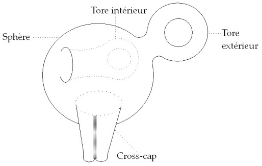

[无对应译文]

</section>

<section class="parallel-paragraph" data-paragraph-ids="s9-17-0162">

s9-17-0162

原文 · s9-17-0162

Je vous passe la théorie. L’expérience prouve que c’est strictement exact. Qu’en outre nous aurons ce qu’on appelle des *cross-cap*. Ces *cross-cap*, je renonce à vous en par­ler aujourd’hui, il faudra que je vous en parle parce qu’ils nous rendront le plus grand service. Contentons-nous de considérer *le tore*. Il pourrait vous venir à l’idée qu’une poignée comme celle-ci, qui serait non pas extérieure à la sphère, mais intérieure avec un trou pour y entrer, c’est quelque chose d’irréductible, d’inéliminable, et qu’il faudrait en quelque sorte distinguer les tores exté­rieurs et les tores intérieurs.

[无对应译文]

</section>

<section class="parallel-paragraph" data-paragraph-ids="s9-17-0163">

s9-17-0163

原文 · s9-17-0163

En quoi est-ce que ceci nous intéresse ? Très précisément *à propos d’une forme mentale* qui est nécessaire à toute notre *intuition* *de notre objet*. En effet, dans là perspective *platonicienne*, *aristotélicienne*, *eulérienne* d’un *Umwelt* et d’un *Innenwelt,* d’une dominance mise d’emblée sur *la division de l’intérieur et de l’extérieur*, est-ce que nous ne placerons pas tout ce que nous expérimentons, et nommément en analyse, dans la dimension de ce que j’ai appelé l’autre jour « *le souterrain* », à savoir le couloir qui s’en va dans la profondeur, autrement dit, au maximum, je veux dire dans sa forme la plus développée selon cette forme ?

[无对应译文]

</section>

<section class="parallel-paragraph" data-paragraph-ids="s9-17-0164">

s9-17-0164

原文 · s9-17-0164

Il est extrêmement exemplaire de faire sentir à ce propos *la non-indépendance absolue* de cette forme, car je vous le répète, pour autant qu’on arrive à des formes réduites, qui sont les formes inscrites, vaguement croquées au tableau dans le dessin, pour donner un support à ce que je dis, il est absolument impos­sible de soutenir, même un instant, dans la différence, l’originalité éventuelle de *la poignée intérieure* par rapport à *la* *poignée extérieure*, pour employer les termes techniques. Il vous suffit, je pense, d’avoir un peu d’*imagination* pour voir que s’il s’agit de quelque chose que nous matérialisons en caoutchouc, il suffit d’introduire le doigt ici \[en X\]

[无对应译文]

</section>

<section class="parallel-paragraph" data-paragraph-ids="s9-17-0165">

s9-17-0165

原文 · s9-17-0165

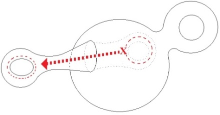

[无对应译文]

</section>

<section class="parallel-paragraph" data-paragraph-ids="s9-17-0166">

s9-17-0166

原文 · s9-17-0166

et d’accrocher de l’intérieur l’anneau central de cette poignée telle qu’elle est ainsi constituée, pour l’extra­ire à l’extérieur selon exactement une forme qui sera celle-ci, c’est-à­-dire *un tore*, exactement le même, sans aucune espèce de déchirure, ni même à proprement parler d’inver­sion. Il n’y a aucune inversion, ce qui était intérieur, à savoir x, le cheminement ainsi de *l’intérieur* du couloir, devient *extérieur* parce que ça l’a toujours été.

[无对应译文]

</section>

<section class="parallel-paragraph" data-paragraph-ids="s9-17-0167">

s9-17-0167

原文 · s9-17-0167

Si cela vous surprend, je peux encore l’illustrer d’une façon plus simple qui est exactement la même parce qu’il n’y a aucune différence entre ceci et ce que je vais vous montrer maintenant, et que je vous avais montré dès le premier jour, espérant vous faire sentir de quoi il s’agissait. Supposez que ce soit au milieu de son parcours - ce qui est exactement la même chose du point de vue topologique - que le tore soit pris dans la sphère. Vous avez ici un petit couloir qui che­mine d’un trou à un autre trou.

[无对应译文]

</section>

<section class="parallel-paragraph" data-paragraph-ids="s9-17-0168">

s9-17-0168

原文 · s9-17-0168

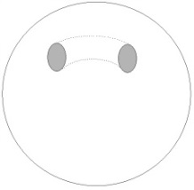

[无对应译文]

</section>

<section class="parallel-paragraph" data-paragraph-ids="s9-17-0169">

s9-17-0169

原文 · s9-17-0169

Là je pense qu’il vous est suffisamment sensible qu’il n’est pas difficile, simplement en faisant bomber un peu ce que vous pouvez saisir par le couloir avec le doigt, de faire apparaître une figure qui sera à peu près celle-ci, de quelque chose qui est ici *une poignée* et dont les *deux trous* communiquant avec *l’intérieur* sont ici en pointillés.

[无对应译文]

</section>

<section class="parallel-paragraph" data-paragraph-ids="s9-17-0170">

s9-17-0170

原文 · s9-17-0170

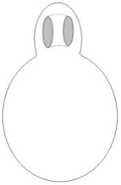

[无对应译文]

</section>

<section class="parallel-paragraph" data-paragraph-ids="s9-17-0171">

s9-17-0171

原文 · s9-17-0171

Nous arrivons donc à un échec de plus, je veux dire à l’impossibilité, par une référence à une troisième dimension, ici représentée par la sphère, de symboliser ce quelque chose qui mette le tore, si l’on peut dire, dans son assiette par rap­port à sa propre dissymétrie. Ce que nous voyons une fois de plus se manifes­ter, c’est ce quelque chose qui est introduit par ce très simple signifiant que je vous ai apporté d’abord du *huit intérieur*, à savoir la possibilité d’un *champ inté­rieur* comme étant toujours homogène au *champ extérieur*. Ceci est une catégo­rie tellement essentielle, tellement essentielle à marquer, à imprimer dans votre esprit, que j’ai cru devoir aujourd’hui, au risque de vous lasser, voire de vous fatiguer, insister pendant une seule de nos leçons. Vous en verrez, je l’espère, l’utilisation dans la suite.

[无对应译文]

</section>

<section class="note-block original-notes">

## Notes

[^154]: Søren Kierkegaard : *Le concept d'angoisse*, Gallimard , 1990, Coll. Tel , p.165.

[^155]: Cf. séminaire1959-60 : *L’éthique*.

[^156]: [Leonhard Euler : *Lettres à une princesse d'Allemagne sur divers sujets de physique et de philosophie*](http://gallica.bnf.fr/Search?ArianeWireIndex=index&p=1&lang=FR&q=+++++Leonhard++Euler+Lettres+%C3%A0+une+princesse), Presses Polytechniques et Universitaires Romandes, 2003.

</section>
