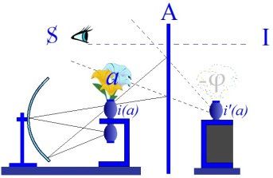
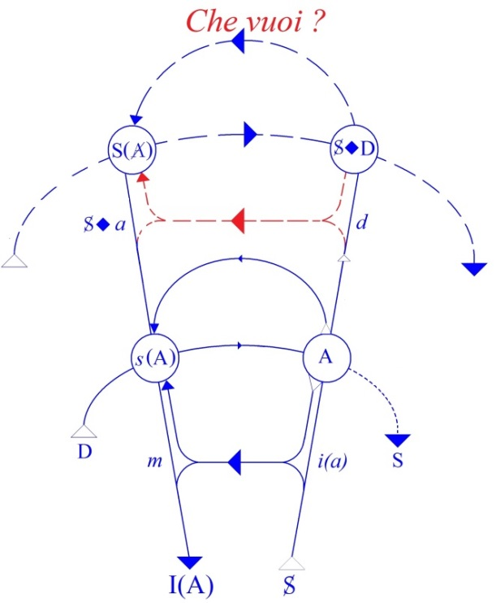
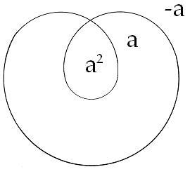
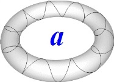
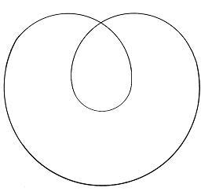
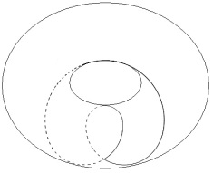
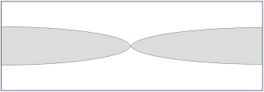
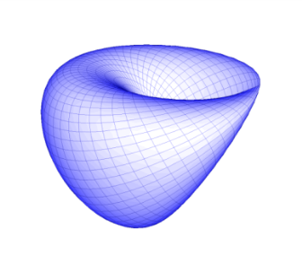
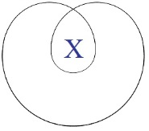

# Leçon 19 | 9 Mai 1962

  <label><input type="checkbox" data-lacan-toggle="original" checked> 原文</label>
  <label><input type="checkbox" data-lacan-toggle="notes" checked> 注释</label>
  <label><input type="checkbox" data-lacan-toggle="commentary" checked> 个人解读评论</label>

<section class="parallel-paragraph" data-paragraph-ids="s9-19-0001">

s9-19-0001

[无对应译文]

原文 · s9-19-0001

Nous avons, la dernière fois, entendu Madame AULAGNIER nous parler de l’angoisse. J’ai rendu tout l’hommage qu’il méritait à son discours, fruit d’un tra­vail et d’une réflexion tout à fait bien orientés. J’ai marqué en même temps com­bien certain obstacle - que j’ai situé au niveau de la communication - est toujours le même, celui qui se lève chaque fois que nous avons à parler du langage.

</section>

<section class="parallel-paragraph" data-paragraph-ids="s9-19-0002">

s9-19-0002

[无对应译文]

原文 · s9-19-0002

Assurément les points sensibles, les points qui méritent, dans ce qu’elle nous a dit, d’être rectifiés sont ceux précisément où, mettant l’accent sur ce qui existe d’indicible, elle en fait l’indice d’une hétérogénéité de ce que justement elle vise comme le « *ne pouvant être dit* », alors que ce dont il s’agit en la matière quand se produit l’angoisse est justement à saisir dans son lien avec le fait qu’il y a du « *dire* » et du « *pouvant être dit* ».

</section>

<section class="parallel-paragraph" data-paragraph-ids="s9-19-0003">

s9-19-0003

[无对应译文]

原文 · s9-19-0003

C’est ainsi qu’elle ne peut pas donner toute sa pleine valeur à la formule que : « *Le désir de l’homme est le désir de l’Autre* ». Il n’est pas par référence d’un tiers qui serait renaissant, le sujet plus central, le sujet identique à soi-même, la conscience de soi hégélienne qui aurait à opérer la médiation entre deux désirs qu’elle aurait en quelque sorte en face de soi : le sien propre, comme un objet, et le désir de l’Autre. Et même à donner à ce désir de l’Autre la primauté, elle aurait à situer, à définir son propre désir dans une sorte de référence, de rapport ou non de dépendance à ce désir de l’Autre.

</section>

<section class="parallel-paragraph" data-paragraph-ids="s9-19-0004">

s9-19-0004

[无对应译文]

原文 · s9-19-0004

Bien sûr à un certain niveau où nous pouvons toujours rester, il y a quelque chose de cet ordre, mais ce *quelque chose* est précisément ce grâce à quoi nous évitons ce qui est au cœur de notre expérience et ce qu’il s’agit de *saisir*. Et c’est pourquoi c’est pour cela que je tente de vous en forger *un modèle*, de ce qu’il s’agit de *saisir*. Ce qu’il s’agit de *saisir*, c’est que le sujet qui nous intéresse c’est le désir. Bien sûr ceci ne prend son sens qu’à partir du moment où nous avons commencé d’arti­culer, de situer à quelle distance, à travers quel truchement, qui n’est pas d’écran intermédiaire mais *de constitution, de détermination*, nous pouvons situer le désir.

</section>

<section class="parallel-paragraph" data-paragraph-ids="s9-19-0005">

s9-19-0005

[无对应译文]

原文 · s9-19-0005

Ce n’est pas que *la demande* nous sépare du *désir* - s’il n’y avait qu’à l’écar­ter, la demande, pour le trouver ! - *son articulation signifiante me détermine, me conditionne comme désir*. C’est là le chemin long que je vous ai déjà fait par­courir. Si je vous l’ai fait aussi long, c’est parce qu’il fallait qu’il le soit pour que la dimension que ceci suppose, vous fasse faire en quelque sorte l’expérience mentale de l’appréhender.

</section>

<section class="parallel-paragraph" data-paragraph-ids="s9-19-0006">

s9-19-0006

[无对应译文]

原文 · s9-19-0006

Mais ce désir ainsi porté, reporté dans une *distance*, articulé tel, *non pas au-delà du langage comme du fait d’une impuissance* *de ce langage, mais structuré comme désir de par cette puissance même,* c’est lui main­tenant qu’il s’agit de rejoindre pour que j’arrive à vous faire concevoir, *saisir*. Et il y a dans *la saisie*, dans le *Begriff,* quelque chose de sensible, quelque chose d’une *esthétique transcendantale* qui ne doit pas être celle jusqu’ici reçue, puisque c’est justement à celle jusqu’ici reçue que la place du désir jusqu’à pré­sent s’est dérobée.

</section>

<section class="parallel-paragraph" data-paragraph-ids="s9-19-0007">

s9-19-0007

[无对应译文]

原文 · s9-19-0007

Mais c’est ce qui vous explique ma tentative - que *j’espère* devoir être réussie - de vous mener sur des chemins qui sont aussi de l’esthétique en tant qu’ils essaient d’attraper *quelque chose* qui n’a point été vu dans tout son relief, dans toute sa fécondité au niveau des intuitions non pas tellement spatiales que *topologiques*. Car il faut bien que notre *intuition de l’espace* n’épuise pas tout ce qui est d’un certain ordre, puisque, aussi bien, ceux-là mêmes qui s’en occupent avec le plus de qualification, les mathématiciens, essaient de toutes parts - et y parviennent - à déborder l’intuition.

</section>

<section class="parallel-paragraph" data-paragraph-ids="s9-19-0008">

s9-19-0008

[无对应译文]

原文 · s9-19-0008

Je vous mène sur ce chemin en fin de compte pour dire les choses avec les mots, avec des mots qui soient des mots d’ordre : il s’agit d’*échapper à la pré­éminence de l’intuition de la sphère* en tant qu’en quelque sorte elle commande très intimement, même quand nous n’y pensons pas, notre logique. Car bien sûr, s’il y a une esthétique qui s’appelle « *transcendantale* » qui nous intéresse, c’est parce que c’est elle qui domine la logique. C’est pour cela qu’à ceux qui me disent :

</section>

<section class="parallel-paragraph" data-paragraph-ids="s9-19-0009">

s9-19-0009

[无对应译文]

原文 · s9-19-0009

« *Est-ce que vous ne pourriez pas nous dire vraiment les choses, nous faire comprendre ce qui se passe chez un névrosé* *et chez un pervers, et en quoi c’est différent, sans passer par vos petits tores et autres détours ?* »

</section>

<section class="parallel-paragraph" data-paragraph-ids="s9-19-0010">

s9-19-0010

[无对应译文]

原文 · s9-19-0010

Je répondrai que c’est pourtant indispensable, tout aussi indispensable et pour la même rai­son, parce que *c’est la même chose* que de faire de la logique, car la logique dont il s’agit n’est pas chose vide. *Les logiciens* - comme les grammairiens - *disputent*, et ces disputes, pour autant que bien sûr nous ne pouvons faire, à entrer sur leur champ, que les évoquer avec discrétion pour ne pas nous y perdre…

</section>

<section class="parallel-paragraph" data-paragraph-ids="s9-19-0011">

s9-19-0011

[无对应译文]

原文 · s9-19-0011

Mais toute la confiance que vous me faites repose sur ceci : c’est que vous me faites le crédit d’avoir fait quelque effort pour ne pas prendre le premier chemin venu et pour en avoir éliminé un certain nombre. Mais quand même, pour vous rassurer, il me vient l’idée de vous faire remar­quer qu’il n’est pas indifférent de mettre au premier plan, dans la logique, *la fonction de l’hypothèse* par exemple, ou *la fonction de l’assertion*. On fait dire au théâtre, dans ce qu’on appelle « *une adaptation* », on fait dire à Ivan KARAMAZOV : « *<u>Si</u> Dieu n’existe pas, alors tout est permis* ».

</section>

<section class="parallel-paragraph" data-paragraph-ids="s9-19-0012">

s9-19-0012

[无对应译文]

原文 · s9-19-0012

Vous vous reportez au texte, vous lisez : et d’ailleurs, si mon souvenir est bon, c’est Aliocha qui dit cela, comme par hasard

</section>

<section class="parallel-paragraph" data-paragraph-ids="s9-19-0013">

s9-19-0013

[无对应译文]

原文 · s9-19-0013

...« *Puisque Dieu n’existe pas, alors tout est permis* ».

</section>

<section class="parallel-paragraph" data-paragraph-ids="s9-19-0014">

s9-19-0014

[无对应译文]

原文 · s9-19-0014

Entre ces deux termes, il y a la différence du « *si* » au « *puisque* », c’est-à-dire d’une *logique hypo­thétique* à une *logique assertorique*. Et vous me direz : « *distinction de logicien, en quoi est-ce qu’elle nous intéresse ?* ». Elle nous intéresse tellement que c’est pour représenter les choses de la pre­mière façon qu’au dernier terme, le terme kantien, on nous maintient l’existence de Dieu.

</section>

<section class="parallel-paragraph" data-paragraph-ids="s9-19-0015">

s9-19-0015

[无对应译文]

原文 · s9-19-0015

Puisqu’en somme tout est là : comme il est clair que tout n’est pas per­mis, alors dans la formule hypothétique il s’impose comme nécessaire que Dieu existe. Et voilà pourquoi *votre fille est muette* et comment, *dans l’articulation enseignante de la libre pensée*, on maintient au cœur de l’articulation de toute pensée valide l’existence de Dieu comme un terme sans quoi il n’y aurait même pas moyen d’avancer quelque chose où se saisisse *l’ombre d’une certitude*. Et vous savez - ce que j’ai cru devoir vous rappeler un peu sur ce sujet - que la démarche de DESCARTES ne peut pas passer par d’autres chemins.

</section>

<section class="parallel-paragraph" data-paragraph-ids="s9-19-0016">

s9-19-0016

[无对应译文]

原文 · s9-19-0016

Il reste que ce n’est pas forcément à l’épingler du terme d’*athéiste* qu’on définira le mieux notre projet, qui est peut-être d’essayer de faire passer par autre chose les suites que comporte de fait, pour nous d’expérience, qu’il y ait du permis. « *Il y a du per­mis parce qu’il y a de l’interdit* », me direz–vous, tous contents de retrouver là l’opposition de l’A et du *non-*A, du *blanc* et du *noir*. Oui... Mais cela ne suffit pas, parce que loin que ça épuise le champ, le permis et l’interdit, ce qu’il s’agit de structurer, d’organiser, c’est comment *il est vrai que l’un <u>et</u> l’autre* se détermi­nent, et fort étroitement, tout en laissant *un champ* ouvert qui, non seulement n’est pas par eux exclu, mais les fait se rejoindre, et dans ce mouvement de torsion, si l’on peut dire, donne *sa forme* à proprement parler à ce qui soutient le tout, c’est-à-dire *la forme du désir*.

</section>

<section class="parallel-paragraph" data-paragraph-ids="s9-19-0017">

s9-19-0017

[无对应译文]

原文 · s9-19-0017

Pour tout dire : que le désir s’institue en transgression. Chacun sent, chacun voit bien, chacun a l’expérience de ceci, ce qui ne veut pas dire - ne peut même pas vouloir dire - qu’il ne s’agit là que d’une question de frontière, de limite tracée, que c’est au-delà de la frontière franchie que commence le désir. Bien sûr, cela paraît souvent la voie la plus courte, mais c’est une voie déses­pérée. C’est par ailleurs que se fait le chemin de passage.

</section>

<section class="parallel-paragraph" data-paragraph-ids="s9-19-0018">

s9-19-0018

[无对应译文]

原文 · s9-19-0018

Encore que *la frontière, celle de l’interdit*, ça ne signifie pas non plus de la faire descendre du ciel et de l’existence du signifiant. Quand je vous parle de la *Loi*, je vous en parle comme FREUD, à savoir que si un jour elle a surgi, sans doute il a fallu que *le signifiant* y mette d’emblée sa *marque*, son *poinçon*, sa *forme*, mais c’est tout de même de quelque chose qui est un désir originel que le nœud a pu se former pour que se *<u>fondent</u>* ensemble : la *Loi* comme limite et le *désir* dans sa forme.

</section>

<section class="parallel-paragraph" data-paragraph-ids="s9-19-0019">

s9-19-0019

[无对应译文]

原文 · s9-19-0019

C’est cela que nous essayons de figurer pour entrer jusque dans le détail, reparcourir ce che­min qui est toujours le même, mais que nous *serrons* autour *d’un nœud* de plus en plus central dont je ne désespère pas de vous montrer *la figure ombilicale*. Nous reprenons le même chemin et nous n’oublions pas que ce qui est le moins situé pour nous en termes de références qui seraient : soit légalistes, soit forma­listes, soit naturalistes, c’est la notion du *(a)* en tant que ce n’est pas l’*autre imaginaire* qu’il désigne - l’*autre imaginaire* pour autant qu’à lui nous nous identifions dans la méconnaissance moïque - c’est *i(a)*.

</section>

<section class="parallel-paragraph" data-paragraph-ids="s9-19-0020">

s9-19-0020

[无对应译文]

原文 · s9-19-0020

</section>

<section class="parallel-paragraph" data-paragraph-ids="s9-19-0021">

s9-19-0021

[无对应译文]

原文 · s9-19-0021

Et là aussi nous trouvons ce même *nœud interne* qui fait que ce qui a l’air d’être tout simple : que l’*autre* nous est donné sous une forme *imaginaire*, ne l’est pas, en ceci que cet *autre*, c’est justement de lui qu’il s’agit quand nous parlons de l’*objet*. De cet *objet*, il n’est pas du tout à dire : que c’est tout simplement l’objet réel, que c’est précisément l’objet du désir en tant que tel, sans doute originel, mais que nous ne pouvons dire tel, qu’à par­tir du moment où nous aurons saisis, compris, appréhendé ce que veut dire que *le sujet* - en tant qu’il se constitue comme dépendance du signifiant, comme au-­delà de la demande - *c’est le désir*.

</section>

<section class="parallel-paragraph" data-paragraph-ids="s9-19-0022">

s9-19-0022

[无对应译文]

原文 · s9-19-0022

Or c’est ce point de la boucle qui n’est point encore assuré et c’est là que nous avançons, et c’est pour cela que nous rappelons l’usage que nous avons fait jusqu’ici du *(a).* Où l’avons-nous vu ? Où allons-nous d’abord le désigner ? Dans *le fantasme* ! Où bien évidemment, il a une fonction qui a quelque rapport avec *l’imaginaire*. Appelons-la « *la valeur imaginaire dans le fantasme* ». Elle est tout autre que simplement projetable d’une façon intuitive dans *la fonction de leurre* telle qu’elle nous est donnée dans l’expérience biologique par exemple de l’*innate releasing mechanism*[^158].

</section>

<section class="parallel-paragraph" data-paragraph-ids="s9-19-0023">

s9-19-0023

[无对应译文]

原文 · s9-19-0023

C’est autre chose, et c’est ce que vous rappellent :

</section>

<section class="parallel-paragraph" data-paragraph-ids="s9-19-0024">

s9-19-0024

[无对应译文]

原文 · s9-19-0024

- et la formalisation du *fantasme* comme étant *constitué* dans son support par l’ensemble : *S barré désir de a* \[S◊a\],

</section>

<section class="parallel-paragraph" data-paragraph-ids="s9-19-0025">

s9-19-0025

[无对应译文]

原文 · s9-19-0025

- et *la situation de cette formule dans le graphe qui montre homologiquement, par sa position à l’étage supérieur qui la fait l’homologue du* *i(a)* de l’étage inférieur : *en tant qu’il est le support du moi, petit m ici*, *de même que S barré désir de a* \[S◊a\] *est le support du* *désir*.

</section>

<section class="parallel-paragraph" data-paragraph-ids="s9-19-0026">

s9-19-0026

[无对应译文]

原文 · s9-19-0026

</section>

<section class="parallel-paragraph" data-paragraph-ids="s9-19-0027">

s9-19-0027

[无对应译文]

原文 · s9-19-0027

Qu’est-ce que cela veut dire ? C’est que *le fantasme* \[S◊a\] est là où le sujet se saisit, dans ce que je vous ai pointé pour être en question au 2nd étage du graphe, *sous la forme* reprise au niveau de l’Autre, dans le champ de l’Autre, en ce point ici \[A\] du graphe, *de la ques­tion « Qu’est-ce que ça veut ?* », qui est aussi bien *celle qui prendra la forme « Que veut-il ? »* \[*Che vuoi ?*\], si quelqu’un a su prendre la place - projetée par la structure - du lieu de l’Autre, à savoir - de ce lieu - qui en est le maître et le garant.

</section>

<section class="parallel-paragraph" data-paragraph-ids="s9-19-0028">

s9-19-0028

[无对应译文]

原文 · s9-19-0028

Ceci veut dire que sur le champ et le parcours de cette question *le fantasme* a une fonction homologue à celle de *i(a)*, du *moi idéal*, du *moi imaginaire* sur lequel je me repose, que cette fonction a une dimension - sans doute quelquefois pointée et même plus d’une fois - dont il me faut ici vous rappeler qu’elle anticipe la fonction du *moi idéal*, comme vous le marque dans le graphe ceci : que c’est par une sorte de « *retour* » qui permet quand même *un court-circuit* par rapport à la menée inten­tionnelle du discours considéré comme constituant - à ce premier étage - du sujet, qu’ici, avant que, *signifié* et *signifiant* se recroisant, il ait constitué sa phrase, le sujet imaginairement anticipe celui qu’il désigne comme « *moi* » \[S →i(a)→m\].

</section>

<section class="parallel-paragraph" data-paragraph-ids="s9-19-0029">

s9-19-0029

[无对应译文]

原文 · s9-19-0029

C’est celui-là même sans doute que le « *Je »* du discours supporte dans sa fonction de *shifter.* Le « *Je » littéral* dans le discours n’est sans doute rien d’autre que le sujet même qui parle, mais celui que le sujet désigne ici comme son support idéal c’est à l’avance, dans un futur antérieur, celui qu’il imagine qui aura parlé : « *Il aura parlé* ». *Au fond même du* *fantasme* il y a de même un « *Il aura voulu* ». Je ne pousse pas plus loin ici cette ouverture, ni cette remarque, ni ce rappel : qu’au départ de notre chemin dans le graphe j’ai tenu impliquée une dimen­sion de *temporalité*.

</section>

<section class="parallel-paragraph" data-paragraph-ids="s9-19-0030">

s9-19-0030

[无对应译文]

原文 · s9-19-0030

Le graphe est fait pour montrer déjà ce type de « *nœud »* que nous sommes pour l’instant en train de chercher au niveau de l’*identification*. Les deux courbes s’entrecroisant en sens contraire, montrant que *synchronisme* n’est pas simultanéité, sont déjà indiquant, dans l’ordre *temporel,* ce que nous sommes en train d’essayer de nouer dans le *champ topologique*. Bref, le mou­vement de succession, la cinétique signifiante, voici ce que supporte le graphe.

</section>

<section class="parallel-paragraph" data-paragraph-ids="s9-19-0031">

s9-19-0031

[无对应译文]

原文 · s9-19-0031

Je le rappelle ici pour vous montrer la portée du fait que je n’en ai point fait tel­lement état doctrinal, de cette dimension temporelle, dont la phénoménologie contemporaine fait ses choux gras, parce que, à la vérité, je crois qu’il n’y a rien de plus mystificatoire que de parler du « *temps* » à tort et à travers. Mais c’est quand même - ici je prends acte pour vous l’indiquer - là qu’il nous en faudra revenir pour en constituer, non plus une cinétique, mais une *dynamique temporelle*, ce que nous ne pourrons faire qu’après avoir franchi ce qu’il s’agit de faire pour l’instant, à savoir : *le repérage topologique spatialisant de la fonction identificatoire*.

</section>

<section class="parallel-paragraph" data-paragraph-ids="s9-19-0032">

s9-19-0032

[无对应译文]

原文 · s9-19-0032

Ceci veut dire que vous auriez tort de vous arrê­ter à quoi que ce soit que j’aie déjà formulé, que j’ai cru devoir formuler de façon également anticipante, sur le sujet de *l’angoisse* - avec le complément qu’a bien voulu y ajouter Mme AULAGNIER l’autre jour - tant qu’effectivement ne sera pas restituée, rapportée, ramenée dans le champ de cette fonction, ce que j’ai déjà indiqué depuis toujours - je peux dire dès l’article sur *Le stade du miroir* [^159] \[*Écrits* p. 93\] - qui *dis­tinguait* le rapport de l’angoisse du rapport de l’agressivité, c’est à savoir *la ten­sion temporelle*.

</section>

<section class="parallel-paragraph" data-paragraph-ids="s9-19-0033">

s9-19-0033

[无对应译文]

原文 · s9-19-0033

Revenons à notre *fantasme* et au *(a),* pour saisir ce dont il s’agit dans cette *imaginification* propre à sa place dans *le fantasme*. Il est bien sûr que nous ne pouvons pas l’isoler sans son corrélatif du S \[S◊a\], du fait que *l’émergence* de *la fonc­tion de l’objet* *du désir* comme *(a)* dans le *fantasme* est *corrélative* de cette sorte de « *fading »,* d’« *évanouissement du symbolique* » qui est cela même que j’ai arti­culé la dernière fois - je crois en répondant à Mme AULAGNIER, si mon sou­venir est bon - comme l’exclusion déterminée par la dépendance même du sujet de l’usage du signifiant.

</section>

<section class="parallel-paragraph" data-paragraph-ids="s9-19-0034">

s9-19-0034

[无对应译文]

原文 · s9-19-0034

C’est pourquoi *c’est en tant que le signifiant a à redou­bler son effet à vouloir se désigner lui-même que le sujet surgit comme exclu­sion* *du champ même qu’il détermine*, n’étant alors ni celui qui est désigné, ni celui qui désigne. Mais à ceci près, qui est le point essentiel, que ceci ne se pro­duit *qu’en rapport avec le jeu d’un objet*, d’abord *comme alternance d’une pré­sence et d’une absence*.

</section>

<section class="parallel-paragraph" data-paragraph-ids="s9-19-0035">

s9-19-0035

[无对应译文]

原文 · s9-19-0035

Qu’est-ce que veut dire d’abord formellement la conjonction S et *(a)* ? C’est que dans le *fantasme*, sous son aspect purement formel, radica­lement le sujet se fait *–(a),* absence de *(a)* et rien que cela, devant le*(a)* au niveau, si vous voulez, de ce que j’ai appelé « *l’identification au trait unaire* ».

</section>

<section class="parallel-paragraph" data-paragraph-ids="s9-19-0036">

s9-19-0036

[无对应译文]

原文 · s9-19-0036

</section>

<section class="parallel-paragraph" data-paragraph-ids="s9-19-0037">

s9-19-0037

[无对应译文]

原文 · s9-19-0037

L’*identifica­tion* n’est introduite, ne s’opère, purement et simplement que dans ce produit du –*(a)* par le *(a),* et qu’il n’est pas difficile de voir en quoi...

</section>

<section class="parallel-paragraph" data-paragraph-ids="s9-19-0038">

s9-19-0038

[无对应译文]

原文 · s9-19-0038

> non pas simplement comme par un jeu men­tal, mais parce que nous y sommes ramenés
>
> par *quelque chose* qui est, à nous, notre mode de quelque chose qui reçoit là légitimement sa formule

</section>

<section class="parallel-paragraph" data-paragraph-ids="s9-19-0039">

s9-19-0039

[无对应译文]

原文 · s9-19-0039

...le *–(a)*2 = 1 qui en résulte nous introduit à ce qu’il y a de charnel, d’impliqué dans ce symbole mathématique du √–1.

</section>

<section class="parallel-paragraph" data-paragraph-ids="s9-19-0040">

s9-19-0040

[无对应译文]

原文 · s9-19-0040

Bien entendu, nous ne nous arrêterions pas à un tel jeu si nous n’y étions ramenés par plus d’un biais *d’une façon convergente*.

</section>

<section class="parallel-paragraph" data-paragraph-ids="s9-19-0041">

s9-19-0041

[无对应译文]

原文 · s9-19-0041

Reprenons pour l’instant notre marche pour tenter de désigner ce que com­mande pour nous, dans le dessin de la structure, la nécessité de rendre compte de la forme à laquelle le désir nous conduit. Ne l’oublions pas, le désir incons­cient tel que nous avons à en rendre compte, il se trouve dans *la répétition de la demande*, et après tout, depuis l’origine de ce que FREUD, pour nous module, c’est lui qui la motive.

</section>

<section class="parallel-paragraph" data-paragraph-ids="s9-19-0042">

s9-19-0042

[无对应译文]

原文 · s9-19-0042

Je vois quelqu’un qui me dit « *Eh bien oui, bien sûr on ne parle jamais de ça !* », à ceci près que *pour nous* *le désir* ne se justifie pas seulement d’être « *tendance* » : il est autre chose. Si vous entendez, si vous suivez ce que j’entends vous signifier par « *le désir* » : c’est que nous ne nous contentons pas de la référence opaque à « *un automatisme de répétition* », nous l’avons parfaitement identifié : il s’agit de la recherche, à la fois nécessaire et condamnée, d’une fois unique, qualifiée, épinglée comme telle par ce *trait unaire*, celui-là même qui ne peut se *répéter*, sinon toujours à être un autre.

</section>

<section class="parallel-paragraph" data-paragraph-ids="s9-19-0043">

s9-19-0043

[无对应译文]

原文 · s9-19-0043

Et dès lors, dans ce mouvement, cette dimension nous apparaît par quoi *le désir*, c’est ce qui supporte le mouve­ment, sans doute circulaire, de *la demande* toujours répétée, mais dont un cer­tain nombre de répétitions peuvent être conçues \- c’est là l’usage de la topologie du tore - comme achevant quelque chose : *le mouvement de bobine de la répétition de la demande* *se boucle quelque part*, même virtuellement, défi­nissant une autre boucle qui s’achève de cette *répétition* même, et qui dessine - quoi ? - *l’objet du désir* !

</section>

<section class="parallel-paragraph" data-paragraph-ids="s9-19-0044">

s9-19-0044

[无对应译文]

原文 · s9-19-0044

</section>

<section class="parallel-paragraph" data-paragraph-ids="s9-19-0045">

s9-19-0045

[无对应译文]

原文 · s9-19-0045

Ce qui pour nous est nécessaire à formuler ainsi, pour autant qu’également au départ ce que nous instituons comme base même de toute notre appréhension de la signification analytique, c’est essentiellement ceci : que sans doute nous parlons d’*un objet oral, anal, etc.,* mais que cet objet nous importe, cet objet structure ce qui pour nous est fondamental du rapport du sujet au monde, en ceci que nous oublions toujours, c’est que cet objet ne reste pas objet du besoin : *c’est du fait d’être pris dans le mouvement répétitif de la demande, dans l’automatisme de répétition, qu’il devient objet du désir.*

</section>

<section class="parallel-paragraph" data-paragraph-ids="s9-19-0046">

s9-19-0046

[无对应译文]

原文 · s9-19-0046

C’est ce que j’ai voulu vous montrer le jour où, par exemple, prenant le sein comme signifiant de la demande orale, je vous montrai que justement c’est à cause de cela qu’éventuellement - c’était ce que j’avais de plus *simple* pour vous le faire toucher du doigt - c’est justement à ce moment-là que le sein réel devient, non pas objet de nourriture, mais objet érotique, nous montrant une fois de plus que *la fonction du signifiant exclut que le signifiant puisse se signi­fier lui-même* \[S1→S2→a↓\].

</section>

<section class="parallel-paragraph" data-paragraph-ids="s9-19-0047">

s9-19-0047

[无对应译文]

原文 · s9-19-0047

C’est justement parce que l’objet devient reconnaissable comme *signifiant* d’une demande latente qu’il prend valeur d’un *désir* qui est d’un autre registre. *La signification libidinale*, sur laquelle on a commencé d’entrer dans l’analyse comme marquant tout *désir humain*, ça ne veut dire, ça ne peut vou­loir dire que cela. Cela ne veut pas dire qu’il ne soit pas nécessaire de le rappe­ler.

</section>

<section class="parallel-paragraph" data-paragraph-ids="s9-19-0048">

s9-19-0048

[无对应译文]

原文 · s9-19-0048

C’est *le facteur de cette transmutation* qu’il s’agit de saisir. Le facteur de cette *transmutation*, c’est *la fonction du phallus*, et il n’y a pas moyen de la définir autrement. La fonction du *phallus*, c’est ce à quoi nous allons essayer de don­ner son support *topologique*. Le *phallus*, sa vraie forme, qui n’est pas forcément celle d’une queue, encore que ça y ressemble beaucoup, c’est cela que je ne déses­père pas de vous dessiner au tableau.

</section>

<section class="parallel-paragraph" data-paragraph-ids="s9-19-0049">

s9-19-0049

[无对应译文]

原文 · s9-19-0049

Si vous étiez capables, sans succomber au vertige, de contempler avec quelque suite *ladite queue dont je parlais*, vous pour­riez apercevoir qu’avec son prépuce, c’est drôlement fait. Cela vous aiderait peut-être à vous apercevoir que *la topologie* n’est pas la chose *chiffon de papier* que vous vous imaginez, comme vous aurez l’occasion certainement de vous en rendre compte.

</section>

<section class="parallel-paragraph" data-paragraph-ids="s9-19-0050">

s9-19-0050

[无对应译文]

原文 · s9-19-0050

Ceci dit, ce n’est pas pour rien sans doute qu’à travers des siècles d’histoire de l’art il n’y a que des représentations vraiment si lamentablement grossières de ce que j’appelle « *la queue* ». Enfin, commençons par rappeler ceci tout de même \- parce qu’il ne faut pas aller trop vite - il n’est jamais tant là, ce *phallus*, c’est de là qu’il faut partir, que quand il est absent. Ce qui est déjà un bon signe pour présumer que c’est lui qui est le pivot, le point tournant de la constitution de tout objet comme objet de désir.

</section>

<section class="parallel-paragraph" data-paragraph-ids="s9-19-0051">

s9-19-0051

[无对应译文]

原文 · s9-19-0051

Qu’il ne soit *jamais tant là que quand il est absent*, il serait fâcheux que j’aie besoin de vous le rappeler plus que d’une indi­cation, qu’il ne me suffise pas de vous évoquer l’équivalence « *Girl* = *phallus* », pour tout dire, que la silhouette omniprésente de Lolita[^160] peut vous faire sentir. Je n’ai pas besoin tellement de Lolita que ça, il y a des gens qui savent très bien ressen­tir ce qu’est simplement l’apparition d’un bourgeon sur une petite branche d’arbre. Ce n’est évidemment pas le *phallus*, car quand même, le *phallus* c’est le *phallus*, c’est quand même sa présence justement là où il n’est pas. Cela va même très loin.

</section>

<section class="parallel-paragraph" data-paragraph-ids="s9-19-0052">

s9-19-0052

[无对应译文]

原文 · s9-19-0052

Mme Simone DE BEAUVOIR[^161] a fait tout un livre pour reconnaître Lolita dans Brigitte BARDOT. La distance qu’il y a entre l’épanouissement achevé du charme féminin et ce qui est proprement *le ressort*, l’activité érotique de Lolita, me paraît constituer une béance totale, la chose au monde la plus facile à distin­guer.

</section>

<section class="parallel-paragraph" data-paragraph-ids="s9-19-0053">

s9-19-0053

[无对应译文]

原文 · s9-19-0053

Le *phallus*, quand avons-nous commencé ici de nous en occuper d’une façon qui soit un peu *structurante et féconde* ? C’est évidemment à propos des problèmes de la sexualité féminine. Et la première introduction de la différence de structure entre *demande* et *désir*, ne l’oublions pas, c’est à propos des faits découverts dans tout leur relief originel par FREUD quand *il a abordé ce sujet*, c’est-à-dire qui s’articulent de la façon la plus resserrée en cette formule : que c’est parce qu’il a à être demandé là où il n’était pas, le *phallus* - à savoir *chez la mère, à la mère, par la mère, pour la mère* – que par là passe le chemin normal par où il peut venir à être désiré par la femme.

</section>

<section class="parallel-paragraph" data-paragraph-ids="s9-19-0054">

s9-19-0054

[无对应译文]

原文 · s9-19-0054

Si tant est que ceci lui arrive qu’il puisse être constitué comme objet de désir, l’expérience analytique met l’accent sur ceci : qu’*il faut que le processus passe par une primitive demande* avec tout ce qu’elle comporte en l’occasion d’absolument fantasmatique, d’irréel, contraire à la nature. Une demande structurée comme telle, et une demande qui continue à véhiculer ses marques à ce point qu’elle apparaît inépuisable.

</section>

<section class="parallel-paragraph" data-paragraph-ids="s9-19-0055">

s9-19-0055

[无对应译文]

原文 · s9-19-0055

Et que tout l’accent de ce que dit FREUD ne veut pas dire, que ça suffise pour que M. JONES lui­-même l’entende, cela veut dire que c’est dans la mesure où *le phallus* peut conti­nuer à rester indéfiniment *objet de demande à celui qui ne peut pas* *le donner* sur ce plan, que justement s’élève toute la difficulté à ce que même il atteigne à ce qui semblerait même... si vraiment Dieu les avait faits *« homme et femme »*, comme dit l’athée JONES, pour qu’ils soient l’un pour l’autre *comme le fil est pour l’aiguille* ...ce qui semblerait pourtant naturel : que le *phallus* fût d’abord objet de désir. C’est par *la porte d’entrée*, et *la porte d’entrée* difficile, et *la porte d’entrée* qui tord le rapport avec lui, que ce *phallus* entre, même là où il semble être l’objet le plus naturel, dans la fonction de l’*objet*.

</section>

<section class="parallel-paragraph" data-paragraph-ids="s9-19-0056">

s9-19-0056

[无对应译文]

原文 · s9-19-0056

Le schéma topologique que je vais former pour vous consiste, par rap­port à ce qui d’abord s’est présenté pour vous sous cette forme du huit inversé, il est destiné à vous avertir de la problématique de tout usage limitatif du signi­fiant, en tant que par lui un champ limité ne peut être iden­tifié à celui pur et simple d’un cercle.

</section>

<section class="parallel-paragraph" data-paragraph-ids="s9-19-0057">

s9-19-0057

[无对应译文]

原文 · s9-19-0057

Le champ marqué à l’intérieur n’est pas aussi simple que cela, ici que ce qui marquait un certain *signifiant* au-dehors. Il y a quelque part nécessairement - *du fait que le signifiant se redouble, est appelé à la fonction de se signifier lui-même -* un champ produit qui est d’exclusion et par quoi le sujet est rejeté dans le champ extérieur.

</section>

<section class="parallel-paragraph" data-paragraph-ids="s9-19-0058">

s9-19-0058

[无对应译文]

原文 · s9-19-0058

</section>

<section class="parallel-paragraph" data-paragraph-ids="s9-19-0059">

s9-19-0059

[无对应译文]

原文 · s9-19-0059

J’anticipe et profère que : *le phallus dans sa fonction radicale est seul signifiant, mais, quoiqu’il puisse se signifier lui-même,* *il est innommable comme tel**.* *S’il est dans l’ordre du signifiant, car c’est un signifiant et rien d’autre, il peut être posé sans différer de lui-même.* Comment le concevoir intuitivement ? Disons *qu’il est le seul nom qui abolisse toutes les autres nominations et que c’est pour cela* *qu’il est indicible.* Il n’est pas indicible puisque nous l’appelons *le phallus*, mais on ne peut pas à la fois dire *le phallus* et continuer de nommer d’autres choses.

</section>

<section class="parallel-paragraph" data-paragraph-ids="s9-19-0060">

s9-19-0060

[无对应译文]

原文 · s9-19-0060

Dernier repère : dans nos pointages, au début d’une de nos journées scienti­fiques, quelqu’un \[Favez\] a essayé d’articuler d’une certaine façon *la fonction transfé­rentielle* la plus radicale occupée par l’analyste en tant que tel.

</section>

<section class="parallel-paragraph" data-paragraph-ids="s9-19-0061">

s9-19-0061

[无对应译文]

原文 · s9-19-0061

C’est certainement une approche qui n’est point à négliger qu’il soit arrivé à articuler tout crûment, et ma foi qu’on puisse avoir le sentiment que c’est quelque chose de culotté, que l’analyste dans sa fonction ait *la place du phallus*, qu’est­-ce que ça peut vouloir dire ?

</section>

<section class="parallel-paragraph" data-paragraph-ids="s9-19-0062">

s9-19-0062

[无对应译文]

原文 · s9-19-0062

C’est que le *phallus* de l’Autre, c’est très précisément ce qui incarne, non pas le désirable, l’ἐρώμενος \[eromenos\], bien que sa fonction soit celle du facteur par quoi quelque objet que ce soit, soit introduit à la fonction d’objet du désir, mais celle du désirant, de l’ἐρῶν \[eron\].

</section>

<section class="parallel-paragraph" data-paragraph-ids="s9-19-0063">

s9-19-0063

[无对应译文]

原文 · s9-19-0063

C’est en tant que l’analyste est la pré­sence-support d’un désir entièrement voilé qu’il est ce « *Che vuoi ?* » incarné. Je rappelais tout à l’heure qu’on peut dire que le facteur ϕ a valeur phallique constitutive de l’objet même du désir : il la supporte et il l’incarne, mais c’est une fonction de subjectivité tellement redoutable, problématique, projetée dans une altérité si radicale... Et c’est bien pour cela que je vous ai menés et ramenés à ce carrefour, l’année dernière, comme étant le ressort essentiel de toute la question du transfert : que doit-il être, ce désir de l’analyste ?

</section>

<section class="parallel-paragraph" data-paragraph-ids="s9-19-0064">

s9-19-0064

[无对应译文]

原文 · s9-19-0064

Pour l’instant, ce qui se propose à nous c’est de trou­ver *un modèle topologique*, *un modèle d’esthétique trans­cendantale* qui nous permette de rendre compte à la fois de toutes ces fonctions du *phallus*. Y a-t-il quelque chose qui ressemble à cela, qui comme cela, soit ce qu’on appelle en topologie une surface close, notion qui prend sa fonction, à laquelle nous avons le droit de donner une valeur homologue, une valeur équivalente de la fonction de signifiance, parce que nous pouvons la définir par *la fonction de la coupure*.

</section>

<section class="parallel-paragraph" data-paragraph-ids="s9-19-0065">

s9-19-0065

[无对应译文]

原文 · s9-19-0065

J’y ai déjà fait plu­sieurs fois référence. La coupure, entendez-la avec une paire de ciseaux sur un ballon de caoutchouc, une chambre à air, de façon à inhiber que - par des habitudes qu’on peut bien qua­lifier de séculaires - dans bien des cas une foule de problèmes qui se posent ne sautent pas aux yeux.

</section>

<section class="parallel-paragraph" data-paragraph-ids="s9-19-0066">

s9-19-0066

[无对应译文]

原文 · s9-19-0066

Quand j’ai cru vous dire des choses très simples à pro­pos du huit intérieur sur la surface d’un *tore*

</section>

<section class="parallel-paragraph" data-paragraph-ids="s9-19-0067">

s9-19-0067

[无对应译文]

原文 · s9-19-0067

</section>

<section class="parallel-paragraph" data-paragraph-ids="s9-19-0068">

s9-19-0068

[无对应译文]

原文 · s9-19-0068

et qu’ensuite j’ai déroulé mon tore croyant que ça allait de soi, qu’il y avait longtemps que je vous avais expliqué qu’il y avait une façon d’ouvrir le tore avec deux coups de ciseaux, et quand vous ouvrez le tore à travers vous avez une ceinture ouverte, le tore est réduit à cela :

</section>

<section class="parallel-paragraph" data-paragraph-ids="s9-19-0069">

s9-19-0069

[无对应译文]

原文 · s9-19-0069

</section>

<section class="parallel-paragraph" data-paragraph-ids="s9-19-0070">

s9-19-0070

[无对应译文]

原文 · s9-19-0070

Et il suffit à ce moment-là d’essayer de projeter sur cette surface le rectangle, que nous aurions mieux fait d’appe­ler « *quadrilatère* », d’appliquer là-dessus ce que nous avons dési­gné auparavant sous cette forme de *huit renversé*, pour voir ce qui se passe et à quoi quelque chose est effectivement limité, quelque chose peut être choisi, distingué entre un champ limité par cette coupure et, si vous voulez, ce qui est au-dehors, ce qui ne va pas tellement de soi, ne saute pas aux yeux.

</section>

<section class="parallel-paragraph" data-paragraph-ids="s9-19-0071">

s9-19-0071

[无对应译文]

原文 · s9-19-0071

Néanmoins, cette petite image que je vous ai représentée semble avoir pour certains, au premier choc, fait problème. C’est donc que ça n’est pas tellement facile. La prochaine fois j’aurai, non seulement à y revenir, mais à vous montrer quelque chose dont je n’ai pas lieu de faire mystère avant, car après tout, si cer­tains veulent s’y préparer, je leur indique que je parlerai d’un autre mode de sur­face, définie comme telle et purement en termes de surface, dont j’ai déjà prononcé le nom et qui nous sera très utile.

</section>

<section class="parallel-paragraph" data-paragraph-ids="s9-19-0072">

s9-19-0072

[无对应译文]

原文 · s9-19-0072

Cela s’appelle en anglais - où les ouvrages sont les plus nombreux - un *cross-cap,* ce qui veut dire quelque chose comme « *bonnet croisé* ». On l’a traduit en français à certaines occasions par le terme de « *mitre* », avec quoi effectivement cela peut avoir une ressemblance gros­sière. Cette forme de *surface topologique définie* comporte en soi certainement un attrait purement *spéculatif* et *mental* qui, j’espère, ne manquera pas de vous retenir.

</section>

<section class="parallel-paragraph" data-paragraph-ids="s9-19-0073">

s9-19-0073

[无对应译文]

原文 · s9-19-0073

</section>

<section class="parallel-paragraph" data-paragraph-ids="s9-19-0074">

s9-19-0074

[无对应译文]

原文 · s9-19-0074

Je prendrai soin de vous en donner des *représentations figurées*, que j’ai faites nombreuses, et surtout sous les angles, qui ne sont pas ceux bien sûr sous lesquels elles intéressent les mathématiciens ou sous lesquels vous les trouverez représentées dans les quelques ouvrages concernant la topologie. Mes figures conserveront toute leur fonction originale, étant donné que je ne leur donne pas le même usage et que ce n’est pas les mêmes choses que j’ai recherchées.

</section>

<section class="parallel-paragraph" data-paragraph-ids="s9-19-0075">

s9-19-0075

[无对应译文]

原文 · s9-19-0075

Sachez pourtant que ce qu’il s’agit de former d’une façon sensée, d’une façon sensible, est destiné à comporter comme support un certain nombre de réflexions, et d’autres qui sont attendues à la suite - les vôtres à l’occasion - à com­porter une valeur, si je puis dire, mutative qui vous permette de penser les choses de la logique, par lesquelles j’ai commencé, d’une autre façon que ne les main­tiennent pour vous arrimées les fameux cercles d’EULER.

</section>

<section class="parallel-paragraph" data-paragraph-ids="s9-19-0076">

s9-19-0076

[无对应译文]

原文 · s9-19-0076

Loin que *ce champ intérieur* \[x\] du huit \[intérieur\] soit obligatoi­rement, et pour tout un champ, exclu, au moins dans une forme topologique - fait plus sensible et des plus représen­tables, et des plus amusants des *cross-caps* en question - pour autant que loin que ce champ soit un champ à exclure, il est au contraire parfaitement à garder.

</section>

<section class="parallel-paragraph" data-paragraph-ids="s9-19-0077">

s9-19-0077

[无对应译文]

原文 · s9-19-0077

</section>

<section class="parallel-paragraph" data-paragraph-ids="s9-19-0078">

s9-19-0078

[无对应译文]

原文 · s9-19-0078

Bien sûr ne nous montons pas la tête : il y aurait une façon qui serait tout à fait simple de l’imager d’une façon à garder. Ce n’est pas très difficile, vous n’avez qu’à prendre quelque chose qui ait une forme un petit peu appropriée, un cercle mou et, le tordant d’une certaine façon et le repliant, d’avoir devant une languette dont le bas serait en continuité avec le reste des bords. Seulement il y a tout de même ceci, que ça n’est jamais qu’un artifice, à savoir que ce bord est effectivement toujours le même bord.

</section>

<section class="parallel-paragraph" data-paragraph-ids="s9-19-0079">

s9-19-0079

[无对应译文]

原文 · s9-19-0079

C’est bien de cela qu’il s’agit : il s’agit de savoir - très différemment - si cette surface, qui fait litige pour nous, qui se trouve symboliser, esthétiquement, intuitivement, une autre portée possible de la limite signifiante du champ marqué, est réalisable d’une façon différente et en quelque sorte immédiate à obtenir, par simple application des propriétés d’une surface dont vous n’avez pas, jusqu’à présent, l’habitude.

</section>

<section class="parallel-paragraph" data-paragraph-ids="s9-19-0080">

s9-19-0080

[无对应译文]

原文 · s9-19-0080

C’est ce que nous verrons la prochaine fois.

</section>

<section class="note-block original-notes">

## Notes

[^158]: Mécanisme inné de déclenchement co-découvert par Konrad Lorenz et Nikolaas Tinbergen. Ce comportement ne se déclenche que par la conjonction

    d'une excitation interne élevée et d'un stimulus externe correspondant qui provoque le dépassement du seuil d'activation. Cf. Konrad Lorenz : *Trois essais sur*

    *le comportement animal et humain*, Seuil, 1970.

[^159]: Cf. *Écrits* p. 93, texte de l’intervention de Lacan au XVIème congrès international de psychanalyse de Zurich (17-07-1949).

[^160]: Cf. Séminaire 1960-61 : *Le transfert*...(28-06)

[^161]: Simone de Beauvoir : « *Brigitte Bardot et le syndrome de Lolita* », in *Les écrits de Simone De Beauvoir*, Gallimard, 1979, p. 363.

</section>
