# Leçon 22 | 30 Mai 1962

  <label><input type="checkbox" data-lacan-toggle="original" checked> 原文</label>
  <label><input type="checkbox" data-lacan-toggle="notes" checked> 注释</label>
  <label><input type="checkbox" data-lacan-toggle="commentary" checked> 个人解读评论</label>

<section class="parallel-paragraph" data-paragraph-ids="s9-22-0001">

s9-22-0001

[无对应译文]

原文 · s9-22-0001

L’enseignement où je vous conduis est commandé par les chemins de notre expérience. Il peut paraître excessif, sinon fâcheux, que ces chemins suscitent dans mon enseignement une forme de détours, disons inusités, qui, à ce titre, peuvent paraître à proprement parler exorbitants. Je vous les épargne autant que je peux. Je veux dire que par des exemples noués aussi serrés que possible près de notre expérience, je dessine une sorte de réduction, si l’on peut dire, de ces chemins nécessaires.

</section>

<section class="parallel-paragraph" data-paragraph-ids="s9-22-0002">

s9-22-0002

[无对应译文]

原文 · s9-22-0002

Vous ne devez pourtant pas vous étonner que soient impli­qués dans notre explication, des champs, des domaines, tels que celui par exemple cette année de la topologie, si en fait les chemins que nous avons à par­courir sont ceux qui, mettant en cause un ordre aussi fondamental que *la consti­tution* la plus radicale *du sujet* comme tel, intéressent de ce fait tout ce qu’on pourrait appeler une sorte de « *révision de la science* ».

</section>

<section class="parallel-paragraph" data-paragraph-ids="s9-22-0003">

s9-22-0003

[无对应译文]

原文 · s9-22-0003

Par exemple cette *supposition radicale* qui est la nôtre, qui *met le sujet dans sa constitution* dans la dépendance, dans une position seconde par rapport au signifiant, qui fait du sujet comme tel un effet du signifiant : ceci ne peut pas manquer de rejaillir de notre expérience, si incarnée soit-elle, dans les domaines en apparence les plus abstraits de la pensée.

</section>

<section class="parallel-paragraph" data-paragraph-ids="s9-22-0004">

s9-22-0004

[无对应译文]

原文 · s9-22-0004

Et je crois ne rien forcer en disant que ce que nous élaborons ici pourrait intéresser au plus haut point le mathé­maticien. Par exemple - comme on le constatait récemment à y regarder je crois d’assez près - dans *une théorie* qui pour *le mathématicien*, au moins un temps, a fait grandement problème : une théorie comme celle du transfini dont assuré­ment les impasses s’éclairent grandement de notre mise en valeur de la fonction du *trait unaire*, pour autant que cette théorie du *transfini*, ce qui la fonde c’est un retour, c’est une saisie de l’origine du comptage d’avant le nombre, je veux dire de ce qui antécède à tout le comptage et le comprend, et le supporte, à savoir la correspondance biunivoque, le « *trait pour trait* ».

</section>

<section class="parallel-paragraph" data-paragraph-ids="s9-22-0005">

s9-22-0005

[无对应译文]

原文 · s9-22-0005

Bien sûr, ces détours-là, ce peut être pour moi une façon de confirmer *l’ampleur, l’infini et la fécondité* de ce qu’il nous est absolument nécessaire de construire, quant à nous, à partir de notre expérience. Je vous les épargne.

</section>

<section class="parallel-paragraph" data-paragraph-ids="s9-22-0006">

s9-22-0006

[无对应译文]

原文 · s9-22-0006

S’il est vrai que les choses sont ainsi, que *l’expérience analytique* est celle qui nous conduit à travers les effets incarnés de ce qui est - bien sûr depuis tou­jours, mais dont le fait que nous nous en apercevions seulement est la chose nou­velle - les effets incarnés de ce fait de la primauté du signifiant sur le sujet, il ne se peut pas que toute espèce de tentative de réduction des dimensions de notre *expérience* au point de vue déjà constitué de ce qu’on appelle « *la science psycho­logique* »... en ce sens que personne ne peut nier, ne peut pas ne pas reconnaître qu’elle s’est constituée sur des prémisses qui négligeaient et pour cause, parce qu’elle était éludée cette *articulation fondamentale* sur quoi nous mettons l’accent, cette année seulement d’une façon plus encore explicite, plus serrée, plus *nouée* ...il ne se peut pas, dis-je, que toute réduction au point de vue de « *la science psychologique* » telle qu’elle s’est déjà constituée, en conservant comme hypothèse un certain nombre de points d’opacité, de points éludés, de points d’irréalité majeurs, n’aboutisse forcément à des formulations objectivement menteuses, je ne dis pas trompeuses, je dis « *menteuses* », faussées, qui déterminent *quelque chose* qui se manifeste toujours *dans la communication* de ce qu’on peut appeler « *un mensonge incarné* ».

</section>

<section class="parallel-paragraph" data-paragraph-ids="s9-22-0007">

s9-22-0007

[无对应译文]

原文 · s9-22-0007

*Le signifiant détermine le sujet*, vous dis-je, pour autant que nécessairement : c’est cela que veut dire *l’expérience psychana­lytique*. Mais suivons les conséquences de ces prémisses nécessaires. *Le signifiant détermine le sujet, le sujet en prend une structure* : c’est celle que j’ai essayé pour vous de vous démontrer, de vous montrer dans le support du *graphe*.

</section>

<section class="parallel-paragraph" data-paragraph-ids="s9-22-0008">

s9-22-0008

[无对应译文]

原文 · s9-22-0008

Cette année, à propos de l’identi­fication, c’est-à-dire de ce quelque chose qui focalise sur la structure même du sujet notre expérience, j’essaie de vous faire suivre plus intimement ce lien du signifiant à la structure subjective. Ce à quoi je vous amène sous ces *formules topologiques*, dont vous avez déjà senti qu’elles ne sont pas purement et sim­plement cette référence intuitive à laquelle nous a habitués la pratique de la géo­métrie, c’est à considérer que *ces surfaces sont structures*, et j’ai dû vous dire qu’elles sont toutes structurellement présentes en chacun de leurs points, si tant est que nous devions employer ce mot « *point* » sans réserver ce que je vais y appor­ter aujourd’hui.

</section>

<section class="parallel-paragraph" data-paragraph-ids="s9-22-0009">

s9-22-0009

[无对应译文]

原文 · s9-22-0009

Je vous ai amenés, par mes énonciations précédentes, à ceci qu’il s’agit main­tenant de dresser dans son unité : *que le signifiant est coupure*, *et ce sujet et sa structure, il s’agit de l’en faire dépendre*. Cela est possible en ceci, que je vous demande d’admettre et de me suivre au moins un temps, *que le sujet a la struc­ture de la surface*, au moins topologiquement définie.

</section>

<section class="parallel-paragraph" data-paragraph-ids="s9-22-0010">

s9-22-0010

[无对应译文]

原文 · s9-22-0010

*Il s’agit donc de saisir* - et ce n’est pas difficile - *comment la coupure engendre la surface*. C’est cela que j’ai commencé à exemplifier pour vous le jour où vous envoyant, comme autant de petits volants à je ne sais quel jeu, mes *surfaces de Mœbius*, je vous ai aussi mon­tré que *ces surfaces*, si vous les coupez d’une certaine façon, deviennent d’autres surfaces, je veux dire topologiquement définies et matériellement saisissables comme changées, puisque ce ne sont plus des *surfaces de Mœbius*, du seul fait de cette *coupure médiane* que vous avez pratiquée, mais une bande un peu tor­due sur elle-même mais bel et bien une bande, ce qu’on appelle une bande, telle cette ceinture que j’ai là autour des reins. Ceci pour vous donner l’idée de la pos­sibilité de la conception de cet engendrement, en quelque sorte inversée par rap­port à une première évidence.

</section>

<section class="parallel-paragraph" data-paragraph-ids="s9-22-0011">

s9-22-0011

[无对应译文]

原文 · s9-22-0011

C’est la surface, penserez-vous, qui permet la coupure, et je vous dis : *c’est la coupure* que nous pouvons concevoir, à prendre la perspective *topologique*, *comme engendrant la surface*. Et c’est très impor­tant, car en fin de compte c’est là peut-être que nous allons pouvoir saisir le point d’entrée, d’insertion, du signifiant dans le *réel*, constater dans la praxis humaine que c’est parce que le *réel* nous présente, si je puis dire, des surfaces naturelles que le signifiant peut y entrer.

</section>

<section class="parallel-paragraph" data-paragraph-ids="s9-22-0012">

s9-22-0012

[无对应译文]

原文 · s9-22-0012

Bien sûr, on peut s’amuser à faire cette genèse avec des actions « *concrètes* », comme on les appelle, afin de rappeler que l’homme coupe, et que Dieu sait que notre expérience est bien celle où l’on a mis en valeur l’importance de cette pos­sibilité de couper avec une paire de ciseaux. Une des images fondamentales des premières métaphores analytiques - les deux petits pouces qui sautent sous le cla­quement des ciseaux - est, bien sûr, pour nous inciter à ne pas négliger ce qu’il y a de concret, de pratique : le fait que l’homme est un animal qui se prolonge avec des instruments, et la paire de ciseaux au premier plan.

</section>

<section class="parallel-paragraph" data-paragraph-ids="s9-22-0013">

s9-22-0013

[无对应译文]

原文 · s9-22-0013

On pourrait s’amuser à refaire une *histoire naturelle* : qu’en résulte-t-il pour les quelques animaux qui ont la paire de ciseaux à l’état naturel ? Ce n’est pas à cela que je vous amène, *et pour cause*, ce à quoi nous amène la formule « *l’homme coupe* », c’est bien plutôt à ses échos sémantiques : qu’*il se coupe,* comme on dit, qu’*il essaye d’y couper.* Tout cela est autrement à rassembler autour de la formule fondamentale de la castration : « *on t’la coupe !* »

</section>

<section class="parallel-paragraph" data-paragraph-ids="s9-22-0014">

s9-22-0014

[无对应译文]

原文 · s9-22-0014

*Effet de signifiant, la coupure a d’abord été pour* *nous*, dans l’analyse phonématique *du langage, cette* *ligne temporelle*, plus précisément *successive des signifiants* que je vous ai habitués à appeler jusqu’à présent *la chaîne signi­fiante.* Mais que va-t-il arriver, si maintenant je vous incite à considérer *la ligne elle-même comme coupure originelle* ?

</section>

<section class="parallel-paragraph" data-paragraph-ids="s9-22-0015">

s9-22-0015

[无对应译文]

原文 · s9-22-0015

Ces interruptions, ces individualisations, ces segments de la ligne qui s’appe­laient, si vous voulez, à l’occasion « *phonèmes* », qui supposaient donc d’être sépa­rés de celui qui précède et de celui qui suit, faire une chaîne au moins ponctuellement interrompue, cette « *géométrie du monde sensible* » à laquelle, la dernière fois, je vous ai incités à vous référer avec la lecture de Jean NICOD et l’ouvrage ainsi intitulé, vous verrez en un chapitre central l’importance qu’a cette analyse de la ligne en tant qu’elle peut être - je puis dire - définie par ses pro­priétés intrinsèques, et quelle aisance lui aurait donnée la mise au premier plan radicale de la fonction de la coupure, pour l’élaboration théorique qu’il doit échafauder avec la plus grande difficulté et avec des contradictions qui ne sont autres que la négligence de cette fonction radicale, si la ligne elle-même est cou­pure, chacun de ses éléments sera donc section de coupure.

</section>

<section class="parallel-paragraph" data-paragraph-ids="s9-22-0016">

s9-22-0016

[无对应译文]

原文 · s9-22-0016

Et c’est cela en somme qui introduit cet élément *vif*, si je puis dire, du signifiant que j’ai appelé le *huit intérieur* :

</section>

<section class="parallel-paragraph" data-paragraph-ids="s9-22-0017">

s9-22-0017

[无对应译文]

原文 · s9-22-0017

</section>

<section class="parallel-paragraph" data-paragraph-ids="s9-22-0018">

s9-22-0018

[无对应译文]

原文 · s9-22-0018

à savoir précisément la boucle :

</section>

<section class="parallel-paragraph" data-paragraph-ids="s9-22-0019">

s9-22-0019

[无对应译文]

原文 · s9-22-0019

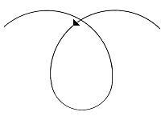

</section>

<section class="parallel-paragraph" data-paragraph-ids="s9-22-0020">

s9-22-0020

[无对应译文]

原文 · s9-22-0020

La ligne se recoupe. Quel est l’intérêt de cette remarque ? La coupure portée sur le *réel* y manifeste - dans le *réel* - ce qui est sa caractéristique et *sa fonction*, et ce qu’il introduit dans notre dialectique - contrairement à l’usage qui en est fait, que le *réel* est le divers - le *réel,* depuis toujours je m’en suis servi de cette fonction originelle, pour vous dire que le *réel* est ce qui introduit le même, ou plus exactement : « *Le réel est ce qui revient toujours à la même place* ».

</section>

<section class="parallel-paragraph" data-paragraph-ids="s9-22-0021">

s9-22-0021

[无对应译文]

原文 · s9-22-0021

Qu’est-ce à dire, sinon que la section de coupure, autrement dit *le signifiant*, étant ce que nous avons dit : toujours différent de lui-même - A *n’est pas identique à* A - nul moyen de faire apparaître *le même*, sinon du côté du *réel*. Autrement dit *la coupure*, si je puis m’exprimer ainsi : au niveau d’un pur sujet de coupure, *la coupure* ne peut savoir qu’elle s’est fermée, qu’elle repasse par elle-même, que parce que le *réel*, en tant que *distinct du signifiant*, est le même. En d’autres termes : seul le *réel* la ferme. Une courbe fermée, c’est le *réel* révélé, mais comme vous le voyez, le plus radicalement : il faut que la coupure se recoupe, si rien déjà ne l’interrompt. Immédiatement après le trait, le signifiant prend cette forme :

</section>

<section class="parallel-paragraph" data-paragraph-ids="s9-22-0022">

s9-22-0022

[无对应译文]

原文 · s9-22-0022

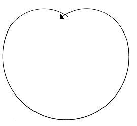

</section>

<section class="parallel-paragraph" data-paragraph-ids="s9-22-0023">

s9-22-0023

[无对应译文]

原文 · s9-22-0023

qui est à proprement parler la coupure. La coupure est un trait qui se recoupe. Ce n’est qu’après qu’il se ferme :

</section>

<section class="parallel-paragraph" data-paragraph-ids="s9-22-0024">

s9-22-0024

[无对应译文]

原文 · s9-22-0024

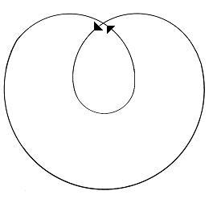

</section>

<section class="parallel-paragraph" data-paragraph-ids="s9-22-0025">

s9-22-0025

[无对应译文]

原文 · s9-22-0025

sur le fondement que - se coupant - il a rencontré le *réel*, lequel seul permet de connoter comme *le même*, respectivement ce qui se trouve sous la première, puis la seconde boucle.

</section>

<section class="parallel-paragraph" data-paragraph-ids="s9-22-0026">

s9-22-0026

[无对应译文]

原文 · s9-22-0026

Nous trouvons là *le nœud* qui nous donne un recours à l’endroit de ce qui constituait l’incertitude, le flottement de toute la construction *identificatoire* - vous le sai­sirez très bien dans l’articulation de Jean NICOD - il consiste en ceci : faut-il attendre *le même* pour que *le signifiant <u>consiste</u>*, comme on l’a toujours cru, sans s’arrêter suffisamment au *fait fondamental* que le signifiant, pour engendrer la différence de ce qu’il signifie originellement, à savoir : « *La fois* », cette fois-là qui, je vous assure, ne saurait se répéter, mais qui toujours oblige le sujet à la retrou­ver, cette fois-là exige donc, pour achever sa forme signifiante, *qu’au moins une fois le signifiant se répète*, et cette répétition n’est rien d’autre que la forme la plus radicale de l’expérience de la demande. Ce qu’est - incarné - le signifiant, ce sont toutes les fois que la demande se répète.

</section>

<section class="parallel-paragraph" data-paragraph-ids="s9-22-0027">

s9-22-0027

[无对应译文]

原文 · s9-22-0027

Et si justement ce n’était pas *en vain* que la demande se répète, il n’y aurait pas de signifiant, parce que pas de demande. Si, ce que la demande enserre dans sa boucle, vous l’aviez : pas besoin de demande. Nul besoin de demande si le besoin est satisfait. Un humoriste[^170] s’écriait un jour :

</section>

<section class="parallel-paragraph" data-paragraph-ids="s9-22-0028">

s9-22-0028

[无对应译文]

原文 · s9-22-0028

« *Vive la Pologne, Messieurs, parce que s’il n’y avait pas de Pologne, il n’y aurait pas de Polonais !* »

</section>

<section class="parallel-paragraph" data-paragraph-ids="s9-22-0029">

s9-22-0029

[无对应译文]

原文 · s9-22-0029

La demande, c’est la Pologne du signi­fiant.

</section>

<section class="parallel-paragraph" data-paragraph-ids="s9-22-0030">

s9-22-0030

[无对应译文]

原文 · s9-22-0030

C’est pourquoi je serais assez porté aujourd’hui, parodiant cet accident de la théorie des espaces abstraits qui fait qu’un de ces espaces - et il y en a main­tenant de plus en plus nombreux, auxquels je ne me crois pas forcé de vous inté­resser - s’appelle « [*l’espace polonais*](http://fr.wikipedia.org/wiki/Espace_polonais) », appelons aujourd’hui le signifiant un *signifiant polonais*...

</section>

<section class="parallel-paragraph" data-paragraph-ids="s9-22-0031">

s9-22-0031

[无对应译文]

原文 · s9-22-0031

> cela vous évitera de l’appeler le *lacs*, ce qui me semblerait un dangereux encouragement à l’usage
>
> qu’un de mes fervents, récemment a cru devoir faire du terme de *lacanisme* ! J’espère qu’au moins aussi longtemps que je vivrai, ce terme, manifestement appétant, après ma seconde mort, me sera épar­gné ! ...donc ce que *mon signifiant polonais* est destiné à *illustrer*, c’est *le rapport du signifiant à soi-même*, c’est-à-dire à nous conduire au rapport du *signifiant* au *sujet*, si tant est que le sujet puisse être conçu comme son effet.

</section>

<section class="parallel-paragraph" data-paragraph-ids="s9-22-0032">

s9-22-0032

[无对应译文]

原文 · s9-22-0032

J’ai déjà remarqué qu’apparemment : *« il n’y a de signifiant que toute surface où il s’inscrit lui étant supposée ».* Mais ce fait est en quelque sorte imagé par tout le système des Beaux-Arts qui éclaire quelque chose qui vous introduit à inter­roger l’architecture, par exemple sous ce biais qui vous fait apparaître ce pour­quoi elle est irréductiblement trompe-l’œil \[cf. leurre\], perspective.

</section>

<section class="parallel-paragraph" data-paragraph-ids="s9-22-0033">

s9-22-0033

[无对应译文]

原文 · s9-22-0033

Et ce n’est pas pour rien que j’ai mis aussi l’accent, en une année dont les préoccupations me semblent bien éloignées de préoccupations proprement esthétiques, sur l’*anamorphose* [^171], c’est-à-dire - pour ceux qui n’étaient pas là auparavant - l’usage de la fuite d’une surface pour faire apparaître une image, qui assurément déployée est mécon­naissable, mais qui, à un certain point de vue, se rassemble et s’impose.

</section>

<section class="parallel-paragraph" data-paragraph-ids="s9-22-0034">

s9-22-0034

[无对应译文]

原文 · s9-22-0034

Cette *sin­gulière ambiguïté* d’un art sur ce qui apparaît de sa nature, de pouvoir se rattacher aux pleins et aux volumes, à je ne sais quelle *complétude,* qui en fait se révèle toujours soumise au jeu des plans et des surfaces, est quelque chose d’aussi important, intéressant, que de voir aussi *ce qui en est absent*.

</section>

<section class="parallel-paragraph" data-paragraph-ids="s9-22-0035">

s9-22-0035

[无对应译文]

原文 · s9-22-0035

À savoir toutes sortes de choses que l’usage concret de l’*étendue* nous offre, par exemple *les nœuds*, tout à fait concrètement imaginables à réaliser dans une architecture de souterrains, comme peut-être l’évolution des temps nous en fera connaître. Mais il est clair que jamais aucune architecture n’a songé à se composer autour d’une ordonnance des éléments, des pièces et communications, voire des couloirs, comme quelque chose qui, à l’intérieur de soi-même, ferait des *nœuds*.

</section>

<section class="parallel-paragraph" data-paragraph-ids="s9-22-0036">

s9-22-0036

[无对应译文]

原文 · s9-22-0036

Et pour­quoi pas pourtant ? C’est bien pourquoi notre remarque : « *qu’il n’y a de signi­fiant qu’une surface lui étant supposée* » se renverse dans notre synthèse qui va chercher son *nœud* le plus radical de ceci : que la coupure - en fait - commande, engendre la surface, que c’est elle qui lui donne, avec ses variétés, sa raison constituante.

</section>

<section class="parallel-paragraph" data-paragraph-ids="s9-22-0037">

s9-22-0037

[无对应译文]

原文 · s9-22-0037

C’est bien ainsi que nous pouvons saisir, homologuer ce premier rapport de *la demande* à la constitution du *sujet* en tant que ces répétitions, ces retours dans la forme du tore, ces boucles qui se renouvellent en faisant ce qui, pour nous, dans l’espace imaginé du *tore*, se présente comme son contour *ce retour à son origine* nous permet de structurer, d’exemplifier d’une façon majeure un certain type de rapports du signifiant au sujet qui nous permet de situer dans son opposition la fonction D de *la demande* et celle de *(a)*, de *l’objet du désir* : *(a),* *l’objet du désir* D, la scansion de *la demande*.

</section>

<section class="parallel-paragraph" data-paragraph-ids="s9-22-0038">

s9-22-0038

[无对应译文]

原文 · s9-22-0038

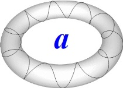

</section>

<section class="parallel-paragraph" data-paragraph-ids="s9-22-0039">

s9-22-0039

[无对应译文]

原文 · s9-22-0039

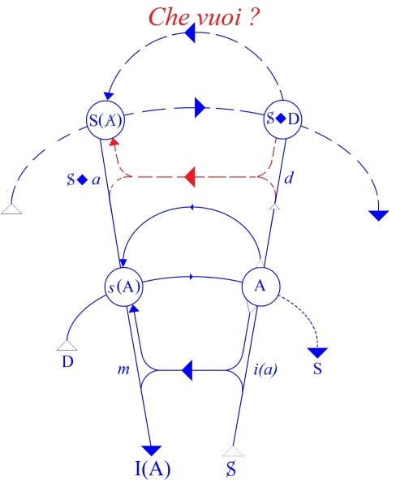

</section>

<section class="parallel-paragraph" data-paragraph-ids="s9-22-0040">

s9-22-0040

[无对应译文]

原文 · s9-22-0040

Vous avez pu remarquer que dans le graphe, vous avez les symboles suivants :

</section>

<section class="parallel-paragraph" data-paragraph-ids="s9-22-0041">

s9-22-0041

[无对应译文]

原文 · s9-22-0041

- *s*(A), A, à l’étage supérieur : S(A), S◊D \[S barré coupure de D\],

</section>

<section class="parallel-paragraph" data-paragraph-ids="s9-22-0042">

s9-22-0042

[无对应译文]

原文 · s9-22-0042

- aux deux étages *intermédiaires* : *i(a)*, *m*, et de l’autre côté : S◊*a* *le fan­tasme*, et *d.*

</section>

<section class="parallel-paragraph" data-paragraph-ids="s9-22-0043">

s9-22-0043

[无对应译文]

原文 · s9-22-0043

Nulle part vous ne voyez conjoints D et *(a)*. Qu’est-ce que *cela tra­duit* ? Qu’est-ce que *cela reflète* ? Qu’est-ce que *cela supporte* ? Cela supporte d’abord ceci, c’est que ce que vous trouvez par contre, c’est S◊D, et que ces élé­ments du *trésor signifiant* à l’étage de l’énonciation, je vous apprends à les recon­naître, c’est ce qui s’appelle le *Trieb, la pulsion*.

</section>

<section class="parallel-paragraph" data-paragraph-ids="s9-22-0044">

s9-22-0044

[无对应译文]

原文 · s9-22-0044

C’est ainsi que je vous le formalise : la première modification du *réel* en sujet sous l’effet de la demande, c’est *la pulsion*. Et si, dans la pulsion, il n’y avait pas déjà cet effet de la demande, cet effet de signifiant, celle-ci ne pourrait pas s’articuler en un schéma tellement manifestement grammatical. Je fais expressément allusion, à ce qu’ici je suppose tout le monde rompu à mes analyses antérieures, quant aux autres, je les renvoie à l’article *Trieb und Triebschicksale*[^172], ce qu’ici on traduit bizarrement par « *ava­tars* » des pulsions, sans doute par une espèce de référence confuse aux effets que la lecture d’un tel texte produit sur la première obtusion de la référence psy­chologique.

</section>

<section class="parallel-paragraph" data-paragraph-ids="s9-22-0045">

s9-22-0045

[无对应译文]

原文 · s9-22-0045

L’application du signifiant que nous appelons aujourd’hui, pour nous amuser « *le signifiant polonais »*, à la surface du *tore*, vous la voyez ici :

</section>

<section class="parallel-paragraph" data-paragraph-ids="s9-22-0046">

s9-22-0046

[无对应译文]

原文 · s9-22-0046

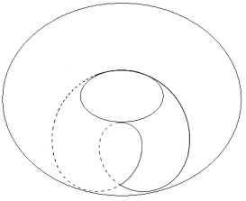

</section>

<section class="parallel-paragraph" data-paragraph-ids="s9-22-0047">

s9-22-0047

[无对应译文]

原文 · s9-22-0047

c’est la forme la plus simple de ce qui peut se produire d’une façon infiniment enrichie par une suite de *contours embobinés* *- la bobine* à proprement parler, celle de *la dynamo -* pour autant *qu’au cours de cette répétition le tour est fait autour du trou central*. Mais sous la forme où vous la voyez ici des­sinée, plus simple, ce *tour* est fait également - je le souligne, cette coupure est *la coupure simple -* de telle sorte que cela ne se recoupe pas.

</section>

<section class="parallel-paragraph" data-paragraph-ids="s9-22-0048">

s9-22-0048

[无对应译文]

原文 · s9-22-0048

</section>

<section class="parallel-paragraph" data-paragraph-ids="s9-22-0049">

s9-22-0049

[无对应译文]

原文 · s9-22-0049

Pour imager les choses, dans l’espace réel, celui que vous pouvez visualiser : vous la voyez jusqu’ici, à cette surface à vous présentée, cette face vers vous du tore, elle disparaît ensuite sur l’autre face, c’est pour cela qu’elle est en pointillés, pour revenir de ce côté ci. *Une telle coupure ne saisit,* si je puis dire, *absolument rien*.

</section>

<section class="parallel-paragraph" data-paragraph-ids="s9-22-0050">

s9-22-0050

[无对应译文]

原文 · s9-22-0050

Pratiquez-la sur *une chambre à air*, vous verrez à la fin *la chambre à air* ouverte d’une certaine façon, transformée en une surface deux fois tordue sur elle-même, mais point coupée en deux.

</section>

<section class="parallel-paragraph" data-paragraph-ids="s9-22-0051">

s9-22-0051

[无对应译文]

原文 · s9-22-0051

Elle rend, si je puis dire, saisissable - d’une façon signifiante et pré-concep­tuelle, mais qui n’est point sans caractériser une sorte de saisie à sa façon - ceci de radical : de la fuite, si l’on peut dire, l’absence d’aucun accès à la saisie à l’endroit de son objet, au niveau de la demande.

</section>

<section class="parallel-paragraph" data-paragraph-ids="s9-22-0052">

s9-22-0052

[无对应译文]

原文 · s9-22-0052

Car si nous avons défini *la demande* en ceci qu’elle se répète et qu’elle ne se répète qu’*en fonction du vide intérieur qu’elle cerne*...

</section>

<section class="parallel-paragraph" data-paragraph-ids="s9-22-0053">

s9-22-0053

[无对应译文]

原文 · s9-22-0053

> ce vide qui la soutient et la constitue, ce vide qui ne comporte, je vous le signale en passant, aucun jeu en quelque sorte éthique, ni plaisamment pessimiste, comme s’il y avait un pire dépassant l’ordinaire du sujet, c’est sim­plement une nécessité de logique abécédaire, si je puis dire ...toute satisfaction saisissable - qu’on la situe sur le versant du sujet ou sur le versant de l’objet - fait défaut à la demande.

</section>

<section class="parallel-paragraph" data-paragraph-ids="s9-22-0054">

s9-22-0054

[无对应译文]

原文 · s9-22-0054

Simplement, pour que la demande soit demande - à savoir qu’elle se répète comme signifiant - il faut qu’elle soit déçue. Si elle ne l’était pas, il n’y aurait pas de support à la demande. Mais ce vide est différent de ce dont il s’agit concernant *(a)*, l’objet du désir. L’avènement constitué par *la répétition de la demande*, l’avènement *méto­nymique*, ce qui glisse et est évoqué par le glis­sement même de *la répétition de la demande*, *(a)* l’objet du désir, ne saurait aucunement être évoqué dans ce vide cerné ici par la boucle de la demande. Il est à situer dans ce trou que nous appellerons « *le rien fondamental* » pour le distinguer du *vide* *de la demande*, *le rien* où est appelé à l’avènement : l’objet du désir.

</section>

<section class="parallel-paragraph" data-paragraph-ids="s9-22-0055">

s9-22-0055

[无对应译文]

原文 · s9-22-0055

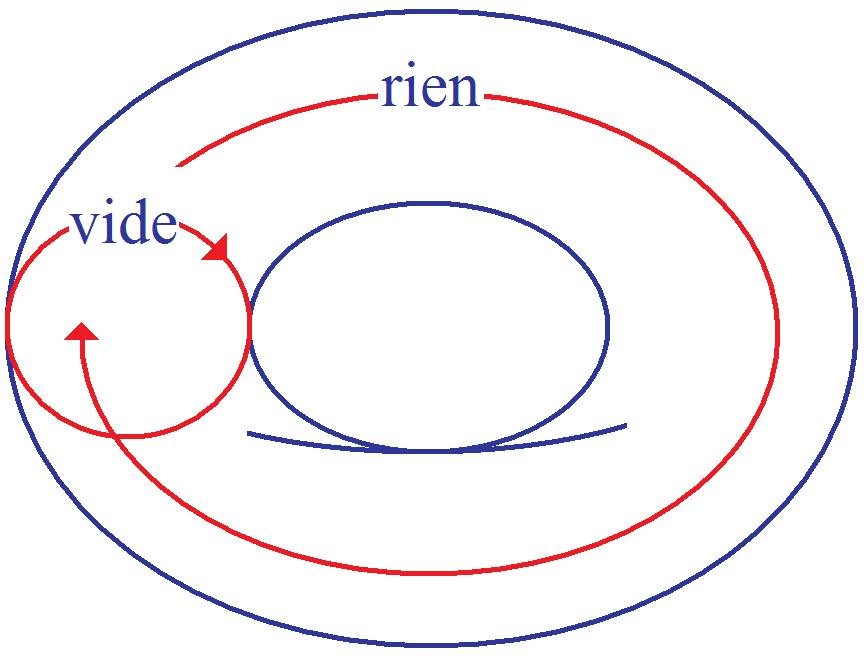

</section>

<section class="parallel-paragraph" data-paragraph-ids="s9-22-0056">

s9-22-0056

[无对应译文]

原文 · s9-22-0056

Ce qu’il s’agit pour nous de formaliser avec les éléments que je vous apporte, c’est ce qui permet de situer dans le fantasme le rapport du sujet comme S, du sujet *informé* par la demande, avec ce *(a),* alors qu’à ce niveau de la structure signifiante… que je vous démontre dans *le tore*, pour autant que la coupure la créée dans cette forme …ce rapport est un rapport opposé : le *vide* qui soutient *la demande* n’est pas le *rien* de l’objet qu’elle cerne comme *objet du désir*, c’est ceci qu’est destiné à illustrer pour vous cette réfé­rence au tore.

</section>

<section class="parallel-paragraph" data-paragraph-ids="s9-22-0057">

s9-22-0057

[无对应译文]

原文 · s9-22-0057

Si ce n’était que cela que vous pouvez en tirer, ce serait bien des efforts pour un résultat court, mais comme vous allez le voir, il y a bien d’autres choses à en tirer. En effet, pour aller vite et sans, bien sûr, vous faire franchir les différentes marches de la déduction topologique qui vous montrent la nécessité interne qui commande la construction que je vais maintenant vous donner, je vais vous mon­trer que *le tore* permet quelque chose, qu’assurément vous pourrez voir, que *le cross-cap*, lui, ne permet pas. Je pense que les personnes les moins portées à l’imagi­nation voient, à travers les enroulements topologiques, de quoi il s’agit au moins métaphoriquement :

</section>

<section class="parallel-paragraph" data-paragraph-ids="s9-22-0058">

s9-22-0058

[无对应译文]

原文 · s9-22-0058

</section>

<section class="parallel-paragraph" data-paragraph-ids="s9-22-0059">

s9-22-0059

[无对应译文]

原文 · s9-22-0059

Le terme de « *chaîne* », qui implique *concaténation*, est déjà entré suffisamment dans le langage pour que nous ne nous y arrêtions pas. Le *tore*, de par sa structure topologique, implique ce que nous pourrons appeler un *complémentaire*, un autre *tore* qui peut venir se concaténer avec lui.

</section>

<section class="parallel-paragraph" data-paragraph-ids="s9-22-0060">

s9-22-0060

[无对应译文]

原文 · s9-22-0060

Supposons-les comme tout à fait conformes avec ce que je vous prie de conceptualiser dans l’usage de ces surfaces, à savoir qu’elles ne sont pas *métriques*, qu’elles ne sont pas rigides, qu’elles sont en caoutchouc. Si vous prenez un de ces anneaux avec lesquels on joue au jeu de ce nom, vous pourrez constater que si vous l’empoignez d’une façon ferme et fixe par son pourtour, et que vous fassiez tourner sur lui-même le corps de ce qui est resté libre.

</section>

<section class="parallel-paragraph" data-paragraph-ids="s9-22-0061">

s9-22-0061

[无对应译文]

原文 · s9-22-0061

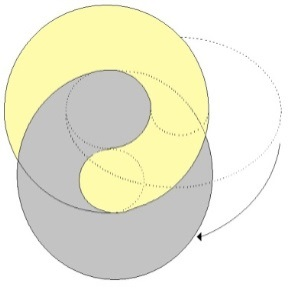

</section>

<section class="parallel-paragraph" data-paragraph-ids="s9-22-0062">

s9-22-0062

[无对应译文]

原文 · s9-22-0062

Vous obtiendrez très facilement, et de la même façon que si vous vous ser­viez d’un jonc incurvé, en le tordant ainsi sur lui-même, vous le ferez revenir à sa position première sans que la torsion soit en quelque sorte inscrite dans sa substance. Simplement, il sera revenu à son point primitif. Vous pouvez imagi­ner que par une torsion qui serait donc celle-ci : d’un de ces tores sur l’autre, nous procédions à ce qu’on peut appeler *un décalque* de quoi que ce soit qui serait inscrit déjà sur le premier, que nous appellerons le 1.

</section>

<section class="parallel-paragraph" data-paragraph-ids="s9-22-0063">

s9-22-0063

[无对应译文]

原文 · s9-22-0063

Et mettons que ce dont il s’agit soit - ce que je vous prie de référer simplement au premier tore - cette courbe en tant que non seulement *elle englobe l’épaisseur du tore*, et que non seulement *elle englobe l’espace du trou* mais qu’elle le traverse, ce qui est la condition qui peut lui permettre d’englober à la fois les deux, *vide* et *rien *: et ce qui est ici dans l’épaisseur du tore, et ce qui est ici au centre du nœud.

</section>

<section class="parallel-paragraph" data-paragraph-ids="s9-22-0064">

s9-22-0064

[无对应译文]

原文 · s9-22-0064

</section>

<section class="parallel-paragraph" data-paragraph-ids="s9-22-0065">

s9-22-0065

[无对应译文]

原文 · s9-22-0065

On démontre - mais je vous dispense de la démonstration qui serait longue et vous demanderait effort - qu’à procéder ainsi ce qui viendra sur le second tore sera une courbe superposable à la première si l’on superpose les deux tores. Qu’est-ce que cela veut dire ? D’abord qu’elles pourraient n’être pas *superposables*. Voici deux courbes :

</section>

<section class="parallel-paragraph" data-paragraph-ids="s9-22-0066">

s9-22-0066

[无对应译文]

原文 · s9-22-0066

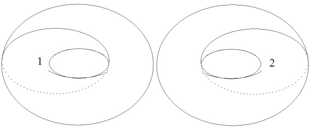

</section>

<section class="parallel-paragraph" data-paragraph-ids="s9-22-0067">

s9-22-0067

[无对应译文]

原文 · s9-22-0067

Elles ont l’air d’être faites de la même façon, elles sont pourtant *irréductible­ment non-superposables*. Cela implique que le tore, malgré son *apparence symé­trique*, comporte des possibilités de mettre en évidence, par la *coupure*, un de ces effets de torsion qui permettent ce que j’appellerai la *dissymétrie radicale*, celle dont vous savez que la présence dans la nature est un problème pour toute for­malisation, celle qui fait que les escargots ont en principe un sens de rotation qui fait de ceux qui ont le sens contraire une exception grandissime.

</section>

<section class="parallel-paragraph" data-paragraph-ids="s9-22-0068">

s9-22-0068

[无对应译文]

原文 · s9-22-0068

Une foule de phé­nomènes sont de cet ordre, jusques et y compris les phénomènes chimiques qui se traduisent dans les effets dits « *de polarisation* ». Il y a donc structurellement des sur­faces dont *la dissymétrie* est *élective*, et qui comportent l’importance du sens de giration : *dextrogyre* ou *lévogyre*. Vous verrez plus tard l’importance de ce que cela signifie.

</section>

<section class="parallel-paragraph" data-paragraph-ids="s9-22-0069">

s9-22-0069

[无对应译文]

原文 · s9-22-0069

Sachez seulement que *le phénomène*, si l’on peut dire, *de report par décalque* de ce qui s’est produit de composant, d’englobant la boucle de la demande avec la boucle de l’objet central, *ce report sur la surface de l’autre tore* - dont vous sentez qu’il va nous permettre de symboliser le rapport du sujet au grand Autre - donnera deux lignes qui, par rapport à la structure du *tore*, sont superposables.

</section>

<section class="parallel-paragraph" data-paragraph-ids="s9-22-0070">

s9-22-0070

[无对应译文]

原文 · s9-22-0070

Je vous demande pardon de vous faire suivre un chemin qui peut vous paraître aride, il est indispensable que je vous en fasse sentir les pas pour vous montrer ce que nous pouvons en tirer. Quelle est la raison de cela ? Elle se voit très bien au niveau des *poly­gones* dits *fondamen­taux*. *Ce polygone* étant ainsi décrit, vous suppo­sez en face son décalque qui s’inscrit ainsi \[fig.2\] :

</section>

<section class="parallel-paragraph" data-paragraph-ids="s9-22-0071">

s9-22-0071

[无对应译文]

原文 · s9-22-0071

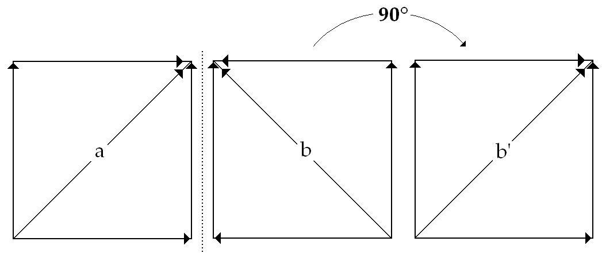

</section>

<section class="parallel-paragraph" data-paragraph-ids="s9-22-0072">

s9-22-0072

[无对应译文]

原文 · s9-22-0072

> fig.1 fig.2 fig.3

</section>

<section class="parallel-paragraph" data-paragraph-ids="s9-22-0073">

s9-22-0073

[无对应译文]

原文 · s9-22-0073

La ligne dont il s’agit sur le polygone se projette ici \[fig.1 : a\] comme une oblique, et se pro­longera de l’autre côté sur le décalque, inversée \[fig.2 : b\]. Mais vous devez vous aperce­voir qu’en faisant basculer de 90° ce polygone fondamental \[fig.2 → fig.3\], vous reproduirez exactement, y compris la direction des flèches, la figure de celui-ci \[fig.1\], et que *la ligne oblique* sera dans le même sens, cette bascule représentant exactement la com­position *complémentaire* de l’un des tores avec l’autre.

</section>

<section class="parallel-paragraph" data-paragraph-ids="s9-22-0074">

s9-22-0074

[无对应译文]

原文 · s9-22-0074

Faites maintenant *sur le tore*, non plus cette ligne simple, mais *la courbe répétée* dont je vous ai appris tout à l’heure *la fonction* :

</section>

<section class="parallel-paragraph" data-paragraph-ids="s9-22-0075">

s9-22-0075

[无对应译文]

原文 · s9-22-0075

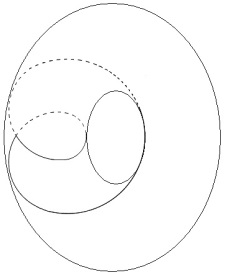 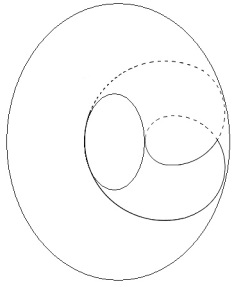

</section>

<section class="parallel-paragraph" data-paragraph-ids="s9-22-0076">

s9-22-0076

[无对应译文]

原文 · s9-22-0076

En est-il de même ? Je vous dispense d’hésita­tions : après *décalque et bascule*, ce que vous aurez ici se symbolise comme ceci :

</section>

<section class="parallel-paragraph" data-paragraph-ids="s9-22-0077">

s9-22-0077

[无对应译文]

原文 · s9-22-0077

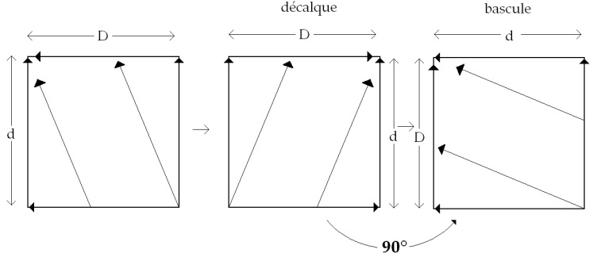

</section>

<section class="parallel-paragraph" data-paragraph-ids="s9-22-0078">

s9-22-0078

[无对应译文]

原文 · s9-22-0078

Qu’est-ce que cela veut dire ? Cela veut dire, dans notre transposition signifiée, dans notre *expérience*, que *la demande* du sujet, en tant qu’ici deux fois elle se répète, inverse ses rapports D et *(a), demande* et *objet* au niveau de l’Autre :

</section>

<section class="parallel-paragraph" data-paragraph-ids="s9-22-0079">

s9-22-0079

[无对应译文]

原文 · s9-22-0079

- que *la demande du sujet* correspond à *l’objet(a) de l’Autre*,

</section>

<section class="parallel-paragraph" data-paragraph-ids="s9-22-0080">

s9-22-0080

[无对应译文]

原文 · s9-22-0080

- que *l’objet(a) du sujet* devient *la demande de l’Autre*. Ce *rapport d’inversion* est essentiellement la forme la plus radicale que nous puissions donner à ce qui se passe *chez le névrosé* :

</section>

<section class="parallel-paragraph" data-paragraph-ids="s9-22-0081">

s9-22-0081

[无对应译文]

原文 · s9-22-0081

- ce que *le névrosé* vise comme *objet, c’est la demande de l’Autre,*

</section>

<section class="parallel-paragraph" data-paragraph-ids="s9-22-0082">

s9-22-0082

[无对应译文]

原文 · s9-22-0082

- ce que *le névrosé* *demande*, quand il demande à saisir *(a)*, l’insaisissable objet de son désir, c’est *(a), l’objet de l’Autre*. L’accent est mis différemment selon les deux versants de la névrose :

</section>

<section class="parallel-paragraph" data-paragraph-ids="s9-22-0083">

s9-22-0083

[无对应译文]

原文 · s9-22-0083

- pour *l’obsessionnel*, l’accent est mis sur la demande de l’Autre, pris comme objet de son désir,

</section>

<section class="parallel-paragraph" data-paragraph-ids="s9-22-0084">

s9-22-0084

[无对应译文]

原文 · s9-22-0084

- pour *l’hystérique*, l’accent est mis sur l’objet de l’Autre, pris comme support de sa demande.

</section>

<section class="parallel-paragraph" data-paragraph-ids="s9-22-0085">

s9-22-0085

[无对应译文]

原文 · s9-22-0085

Ce que ceci implique, nous aurons à y entrer dans le détail pour autant que ce dont il s’agit pour nous, n’est rien d’autre ici que *l’accès à la nature de ce (a)*. *La nature de (a),* nous ne la saisirons que lorsque nous aurons élucidé structuralement par la même voie le rapport de S à *(a)*, c’est-à-dire *le sup­port topologique* que nous pouvons donner au *fantasme*.

</section>

<section class="parallel-paragraph" data-paragraph-ids="s9-22-0086">

s9-22-0086

[无对应译文]

原文 · s9-22-0086

Disons, pour com­mencer d’éclairer ce chemin, que *(a) l’objet du fantasme*, *(a) l’objet du désir*, n’a pas d’image et que l’impasse du fantasme du névrosé c’est que, dans sa quête de *(a) l’objet du désir*, il rencontre *i(a)* - telle qu’elle est l’origine, d’où part toute la dialectique à laquelle, depuis le début de mon enseignement, je vous introduis - à savoir que *l’image spéculaire*, la compréhension de *l’image spéculaire*, tient en ceci, dont je suis étonné que personne n’ait songé à gloser la fonction que je lui donne : *l’image spéculaire est une erreur*.

</section>

<section class="parallel-paragraph" data-paragraph-ids="s9-22-0087">

s9-22-0087

[无对应译文]

原文 · s9-22-0087

Elle n’est pas simplement une *illusion*, un *leurre* de la *Gestalt captivante* dont l’agressivité ait marqué l’accent, elle est foncièrement *une erreur* en tant que le sujet s’y « *me-connait* », si vous me permet­tez l’expression, en tant que l’origine du *moi* et sa méconnaissance fondamen­tale sont ici rassemblées dans l’orthographe. Et pour autant que le sujet se trompe, il croit qu’il a en face de lui son image. S’il savait se voir, s’il savait - ce qui est la simple vérité - qu’il n’y a que les rapports les plus déformés, d’aucune façon identifiables, entre son côté droit et son côté gauche, il ne songerait pas à s’*identifier* à l’image du miroir.

</section>

<section class="parallel-paragraph" data-paragraph-ids="s9-22-0088">

s9-22-0088

[无对应译文]

原文 · s9-22-0088

Quand, grâce aux effets de la bombe atomique, nous aurons des sujets avec une oreille droite grande comme une oreille d’élé­phant et, à la place de l’oreille gauche, une oreille d’âne, *peut-être les rapports à l’image spéculaire seront-ils mieux authentifiés !* En fait, bien d’autres condi­tions plus accessibles et aussi plus intéressantes seraient à notre portée. Supposons un autre animal, la grue, avec un œil sur chaque côté du crâne. Cela semble une montagne que de savoir comment peuvent bien se composer les plans de vision des deux yeux chez un animal ayant ainsi les yeux disposés. On ne voit pas pourquoi cela ouvre plus de difficultés que pour nous. Simplement, pour que la grue ait une vue de ses images, il faut lui mettre, à elle, *deux miroirs*, et elle ne risquera pas de confondre son *image gauche* avec son *image droite*.

</section>

<section class="parallel-paragraph" data-paragraph-ids="s9-22-0089">

s9-22-0089

[无对应译文]

原文 · s9-22-0089

Cette fonction de *l’image spéculaire*, en tant qu’elle se réfère à la méconnais­sance de ce que j’ai appelé tout à l’heure « *la dissymétrie la plus radicale* » c’est celle-là même qui explique la fonction du *moi* chez le *névrosé*. Ce n’est pas parce qu’il a un *moi* plus ou moins tordu que le névrosé est subjectivement dans la position critique qui est la sienne. Il est dans cette position critique en raison d’une possibilité structurante radicale d’identifier sa demande avec l’objet du désir de l’Autre ou d’identifier son objet avec la demande de l’Autre, forme, elle, pro­prement leurrante de l’effet du signifiant sur le sujet, encore que la sortie en soit possible, précisément lorsque la prochaine fois je vous montrerai comment, dans une autre référence de la coupure, *le sujet* en tant que structuré par *le signi­fiant,* peut devenir *la coupure* elle-même. Mais c’est justement ce à quoi le fan­tasme du névrosé n’accède pas, parce qu’il en cherche les voies et les chemins par un passage erroné.

</section>

<section class="parallel-paragraph" data-paragraph-ids="s9-22-0090">

s9-22-0090

[无对应译文]

原文 · s9-22-0090

Non point que *le névrosé* ne sache pas fort bien *distinguer*, comme tout sujet digne de ce nom, *i(a)* de *(a)*, parce qu’ils n’ont pas du tout la même valeur, mais *ce que le névrosé cherche* - et non sans fondement - *c’est à arri­ver à (a) par i(a) *: la voie dans laquelle s’obstine le névrosé - et ceci est sensible à l’analyse de son fantasme - *c’est à arriver à (a) en détruisant i(a)* ou en le *fixant*.

</section>

<section class="parallel-paragraph" data-paragraph-ids="s9-22-0091">

s9-22-0091

[无对应译文]

原文 · s9-22-0091

J’ai dit d’abord en détruisant, parce que c’est le plus exemplaire : c’est le fantasme de *l’obsessionnel* en tant qu’*il prend la forme* *du fan­tasme sadique, qu’il ne l’est pas*. Le fantasme *sadique*...

</section>

<section class="parallel-paragraph" data-paragraph-ids="s9-22-0092">

s9-22-0092

[无对应译文]

原文 · s9-22-0092

> comme les commentateurs *phénoménologistes* ne man­quent pas un instant de l’appuyer,
>
> avec tout l’excès des débordements qui leur permet de se fixer à jamais dans le ridicule

</section>

<section class="parallel-paragraph" data-paragraph-ids="s9-22-0093">

s9-22-0093

[无对应译文]

原文 · s9-22-0093

...le fantasme *sadique*, c’est soi-disant *la destruction de l’Autre*.

</section>

<section class="parallel-paragraph" data-paragraph-ids="s9-22-0094">

s9-22-0094

[无对应译文]

原文 · s9-22-0094

Et comme *les phénoménologistes* ne sont, disons - bien fait pour eux ! - pas d’authentiques *sadiques* mais simplement ont l’accès le plus commun aux perspectives de *la névrose*, ils trouvent en effet toutes les apparences à soutenir une telle explication. Il suffit de prendre un texte sadiste, ou sadien, pour que ceci soit réfuté : non seulement *l’objet du fantasme sadique* n’est pas détruit, mais il est littéralement résistant à toute épreuve, comme je l’ai maintes fois souligné.

</section>

<section class="parallel-paragraph" data-paragraph-ids="s9-22-0095">

s9-22-0095

[无对应译文]

原文 · s9-22-0095

Ce qu’il en est du *fantasme* proprement *sadien* - entendez bien que je n’entends pas ici encore y entrer, comme probablement je pourrai le faire la prochaine fois - ce que je veux seulement ici ponctuer, c’est que ce que l’on pourrait appeler « *l’impuissance du fantasme sadique* » chez le névrosé repose tout entière sur ceci : c’est qu’en effet il y a bien visée destructive dans *le fantasme de l’obsessionnel*[^173], mais cette visée destructive, comme je viens de l’analyser, a le sens, non pas de *la destruction* *de l’autre*, objet du désir, mais de *la destruction de l’image de l’autre* au sens où ici je vous la situe, à savoir que justement *elle n’est pas l’image de l’autre, parce que l’autre, (a) objet du désir* - comme je vous le montrerai la prochaine fois - *n’a pas d’image spéculaire*.

</section>

<section class="parallel-paragraph" data-paragraph-ids="s9-22-0096">

s9-22-0096

[无对应译文]

原文 · s9-22-0096

C’est bien là une pro­position, j’en conviens, qui abuse un peu. Je la crois non seulement entière­ment démontrable, mais essentielle à comprendre ce qui se passe dans ce que j’appellerai le fourvoiement chez le névrosé de la fonction du fantasme. Car, qu’il la détruise ou pas, d’une façon *symbolique* ou *imaginaire*, cette image *i(a)*, le névrosé, ce n’est pas cela pour autant qui lui fera jamais authentifier d’aucune coupure subjective, l’objet de son désir, pour la bonne raison que ce qu’il vise, soit à le détruire, soit à le supporter - *i(a*), n’a pas de rapport - pour la seule raison de *la dissymétrie fondamentale d’i(a),* le support - avec *(a)* qui ne la tolère pas.

</section>

<section class="parallel-paragraph" data-paragraph-ids="s9-22-0097">

s9-22-0097

[无对应译文]

原文 · s9-22-0097

Ce à quoi le névrosé d’ailleurs aboutit *effectivement*, c’est à la destruction du désir de l’Autre. Et c’est bien pourquoi il est irrémédiablement fourvoyé dans la réalisation du sien. Mais ce qui l’explique c’est ceci : à savoir que ce qui fait, au névrosé, si l’on peut dire, symboliser quelque chose dans cette voie qui est la sienne : viser dans le fantasme *l’image spéculaire,* est expliqué par ce qu’ici je vous matérialise : *la dissymétrie apparue dans le rapport de la demande et de l’objet chez le sujet,* *par rapport à la demande et à l’objet au niveau de l’Autre.*

</section>

<section class="parallel-paragraph" data-paragraph-ids="s9-22-0098">

s9-22-0098

[无对应译文]

原文 · s9-22-0098

Cette dis­symétrie qui n’apparaît qu’à partir du moment où il y a à proprement parler demande, c’est-à-dire déjà deux tours, si je puis m’exprimer ainsi, du signifiant, et paraît exprimer une dissymétrie de la même nature que celle qui est suppor­tée par l’image spéculaire : elles ont une nature qui, comme vous le voyez, est suffisamment illustrée topologiquement, puisque ici *la dissymétrie* qui serait celle que nous appellerions *spéculaire* serait ceci \[a\] avec ceci \[b\].

</section>

<section class="parallel-paragraph" data-paragraph-ids="s9-22-0099">

s9-22-0099

[无对应译文]

原文 · s9-22-0099

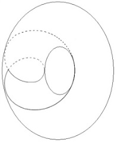 

</section>

<section class="parallel-paragraph" data-paragraph-ids="s9-22-0100">

s9-22-0100

[无对应译文]

原文 · s9-22-0100

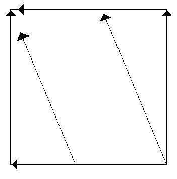 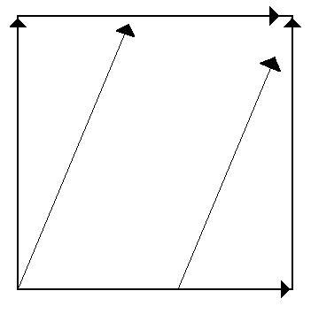

</section>

<section class="parallel-paragraph" data-paragraph-ids="s9-22-0101">

s9-22-0101

[无对应译文]

原文 · s9-22-0101

\[a\] \[b\]

</section>

<section class="parallel-paragraph" data-paragraph-ids="s9-22-0102">

s9-22-0102

[无对应译文]

原文 · s9-22-0102

C’est de cette confusion par où 2 dissymétries différentes se trouvent, pour le sujet, servir de support à ce qui est la visée essentielle du sujet dans son être, à savoir la coupure de *(a)* - le véritable objet du désir où se réalise le sujet lui-même - c’est dans cette visée fourvoyée, captée par un élément structural qui tient à l’effet du signifiant lui-même sur le sujet, que réside non seulement le secret des effets de la névrose, à savoir : que le rapport dit du narcissisme, le rapport inscrit dans la fonction du *moi* n’est pas le véritable support de la névrose, mais pour que le sujet en réalise *la fausse analogie*, l’important - encore que déjà le serrage, la découverte de ce nœud interne soit capitale pour nous orienter dans les effets névrotiques - c’est que c’est aussi la seule référence qui nous permette de différencier radicalement la structure du névrosé des structures voisines : nommément de celle qu’on appelle *perverse,* et de celle qu’on appelle *psycho­tique*

</section>

<section class="note-block original-notes">

## Notes

[^170]: [Alfred Jarry : *Ubu roi*](http://www.ebooksgratuits.com/pdf/jarry_ubu_roi.pdf), phrase de fin. Père Ubu : « *Ah ! Messieurs ! si beau qu'il soit il ne vaut pas la Pologne. S'il n'y avait pas de Pologne il n'y aurait pas de Polonais !* »

    Cf. séminaire 1957-58 : *Les formations*..., 27-11.

[^171]: Séminaire1959-60 : *L’éthique*..., 03-02, et toute la séance du 10-02.

[^172]: S. Freud : « *Pulsions et destin des pulsions* », in *Métapsychologie*, Gallimard , Coll. Idées (1969) p.11, ou Folio (1986).

[^173]: Cf. séminaire 1957-58 : *Les formations*…, 14-05, 21-05, 25-06, 02-07 ).

</section>
