# Leçon 23 | 06 Juin 1962

  

    <label><input type="checkbox" data-lacan-toggle="original" checked> 原文</label>
    <label><input type="checkbox" data-lacan-toggle="notes" checked> 注释</label>
    <label><input type="checkbox" data-lacan-toggle="commentary" checked> 个人解读评论</label>
  

  <form class="lacan-tool-search" role="search">
    <input class="lacan-tool-search-input" type="search" placeholder="搜索全文" aria-label="搜索全文">
    <button class="lacan-tool-button" type="submit" title="搜索">搜索</button>
  </form>
  <button class="lacan-tool-button lacan-back-to-top" type="button" title="回到页面最上方" aria-label="回到页面最上方">↑</button>

<section class="parallel-paragraph" data-paragraph-ids="s9-23-0001">

s9-23-0001

原文 · s9-23-0001

Nous allons continuer aujourd’hui à élaborer la fonction de ce qu’on peut appeler « *le signifiant de la coupure* », ou encore le « *huit intérieur* », ou encore « *le lacs* », ou encore ce que j’ai appelé la dernière fois le « *signifiant polonais* ». Je voudrais pouvoir lui donner un nom encore moins significatif, pour essayer d’approcher ce qu’il a de purement *signifiant*.

[无对应译文]

</section>

<section class="parallel-paragraph" data-paragraph-ids="s9-23-0002">

s9-23-0002

原文 · s9-23-0002

Nous nous sommes avancés sur ce terrain tel qu’il se présente, c’est-à-dire dans une remarquable ambiguïté puisque, pure ligne, rien n’indique qu’il se recoupe, comme la forme où je l’ai dessiné là vous le rappelle mais en même temps laisse ouverte la possibilité de ce recoupement.

[无对应译文]

</section>

<section class="parallel-paragraph" data-paragraph-ids="s9-23-0003">

s9-23-0003

原文 · s9-23-0003

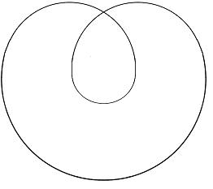

[无对应译文]

</section>

<section class="parallel-paragraph" data-paragraph-ids="s9-23-0004">

s9-23-0004

原文 · s9-23-0004

Bref, ce signifiant ne préjuge en rien de l’espace où il se situe. Néanmoins pour en faire quelque chose, nous posons que c’est autour de ce signifiant de la coupure que s’orga­nise ce que nous appelons la *surface*, au sens où ici nous l’entendons. La dernière fois, je vous rappelais - car ce n’est pas la première fois que je le montrais devant vous - comment peut se construire la surface du tore, autour - et autour seulement - d’une coupure, d’une cou­pure ordonnée, manipulée de cette façon quadrilatère, que la formule exprimée par la succession d’un *a*, d’un *b*, puis d’un *a’* et d’un *b’*, nos *témoins* respectivement pour autant qu’ils peuvent être rapportés, accolés aux précédents, dans une disposition que nous pouvons qualifier, en général, par deux termes : *orientée* d’une part, *croisée* d’autre part.

[无对应译文]

</section>

<section class="parallel-paragraph" data-paragraph-ids="s9-23-0005">

s9-23-0005

原文 · s9-23-0005

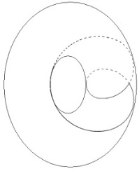 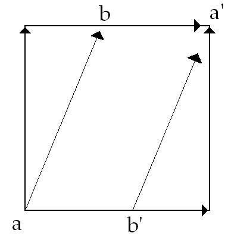

[无对应译文]

</section>

<section class="parallel-paragraph" data-paragraph-ids="s9-23-0006">

s9-23-0006

原文 · s9-23-0006

Je vous ai montré le rapport *le rapport,* si l’on peut dire exemplaire, au pre­mier aspect, *métaphorique*… *et dont justement la question est de savoir si cette métaphore dépasse, si l’on peut dire, le pur plan de la métaphore* …*le rapport métaphorique dis-je qu’il peut prendre du rapport du sujet à l’Autre,* à condi­tion qu’explorant la structure du tore nous apercevions que nous pouvons mettre deux tores, en tant *qu’enchaînés* l’un à l’autre, dans un mode de corres­pondance, tel qu’à tel cercle privilégié sur l’un des deux, nous avons fait cor­respondre pour des raisons analogiques la fonction de *la demande.*

[无对应译文]

</section>

<section class="parallel-paragraph" data-paragraph-ids="s9-23-0007">

s9-23-0007

原文 · s9-23-0007

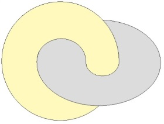

[无对应译文]

</section>

<section class="parallel-paragraph" data-paragraph-ids="s9-23-0008">

s9-23-0008

原文 · s9-23-0008

À savoir cette sorte de cercle tournant dans la forme familière de la bobine qui nous paraît particulièrement propice à symboliser la répétition de la demande, pour autant qu’elle entraîne cette sorte de nécessité de se boucler. S’il est exclu qu’elle se recoupe après de nombreuses répétitions aussi multipliées que nous pouvons le supposer, *ad libitum,* pour *avoir fait ce bouclage*, avoir dessiné le tour, le contour d’un autre vide que celui qu’elle cerne : celui que nous avons distingué le pre­mier, lui, définissant cette place du *rien* dont le circuit dessiné pour lui–même nous sert à symboliser, sous la forme de l’autre *cercle topologiquement défini* dans la structure du tore, *l’objet du désir*.

[无对应译文]

</section>

<section class="parallel-paragraph" data-paragraph-ids="s9-23-0009">

s9-23-0009

原文 · s9-23-0009

Pour ceux qui n’étaient pas là - je sais qu’il y en a dans cette assemblée - j’illustre ce que je viens de dire par cette forme très simple : en répétant que cette boucle du *bobinage* de la demande, qui se trouve autour du *vide constitutif* du *tore*, se trouve dessiner ce qui nous sert à symboliser le cercle de *l’objet du désir* à savoir tous les cercles qui font le tour du *trou central de l’an­neau*. Il y a donc *deux sortes de cercles* privilé­giés sur un *tore* : ceux qui se dessinent autour du trou central, et ceux qui le traversent.

[无对应译文]

</section>

<section class="parallel-paragraph" data-paragraph-ids="s9-23-0010">

s9-23-0010

原文 · s9-23-0010

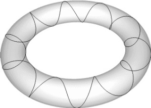 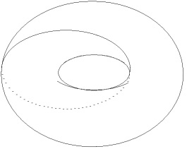

[无对应译文]

</section>

<section class="parallel-paragraph" data-paragraph-ids="s9-23-0011">

s9-23-0011

原文 · s9-23-0011

Un cercle peut cumuler les deux propriétés. C’est préci­sément ce qui arrive avec ce cercle ainsi dessiné :

[无对应译文]

</section>

<section class="parallel-paragraph" data-paragraph-ids="s9-23-0012">

s9-23-0012

原文 · s9-23-0012

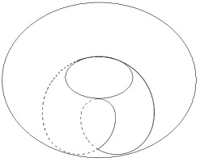

[无对应译文]

</section>

<section class="parallel-paragraph" data-paragraph-ids="s9-23-0013">

s9-23-0013

原文 · s9-23-0013

\[*fig*. 1\]

[无对应译文]

</section>

<section class="parallel-paragraph" data-paragraph-ids="s9-23-0014">

s9-23-0014

原文 · s9-23-0014

Je le mets *en pointillés* quand il passe de l’autre côté. Sur la surface quadrilatère du polygone fondamental qui sert à montrer d’une façon claire et univoque la structure du tore, je sym­bolise ici :

[无对应译文]

</section>

<section class="parallel-paragraph" data-paragraph-ids="s9-23-0015">

s9-23-0015

原文 · s9-23-0015

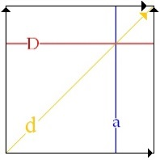 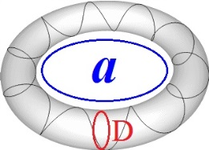

[无对应译文]

</section>

<section class="parallel-paragraph" data-paragraph-ids="s9-23-0016">

s9-23-0016

原文 · s9-23-0016

pour employer les mêmes couleurs :

[无对应译文]

</section>

<section class="parallel-paragraph" data-paragraph-ids="s9-23-0017">

s9-23-0017

原文 · s9-23-0017

- de là à là un cercle dit *cercle de la demande* \[D\],

[无对应译文]

</section>

<section class="parallel-paragraph" data-paragraph-ids="s9-23-0018">

s9-23-0018

原文 · s9-23-0018

- de là à là un cercle dit *cercle a* \[a\] *symbolisant l’objet du désir*,

[无对应译文]

</section>

<section class="parallel-paragraph" data-paragraph-ids="s9-23-0019">

s9-23-0019

原文 · s9-23-0019

- et c’est ce cercle-là \[*fig*. 1\] - que vous voyez sur la première figure - *qui est ici dessiné en jaune*, représentant *le cercle oblique*, qui pourrait à la rigueur nous servir à symboliser, comme coupure du sujet, le désir lui-même.

[无对应译文]

</section>

<section class="parallel-paragraph" data-paragraph-ids="s9-23-0020">

s9-23-0020

原文 · s9-23-0020

La valeur expressive, symbolique, du *tore* en l’occasion, est précisément de nous faire voir la difficulté - pour autant *qu’il s’agit* de la surface du *tore* et non d’une autre *- d’ordonner ce cercle* ici, jaune, *du désir, avec le cercle, bleu, de l’objet du désir.* Leur relation est d’autant moins univoque que l’objet n’est ici fixé, déterminé, par rien d’autre que par la place d’un *rien* qui, si l’on peut dire, préfigure sa place éventuelle, mais d’aucune façon ne permet de le situer. Telle est la valeur exemplaire du *tore*. Vous avez entendu la dernière fois que cette valeur exemplaire se complète de ceci, qu’à le supposer *enchaîné*, *concaténé* avec un autre *tore* en tant qu’il sym­boliserait l’Autre…

[无对应译文]

</section>

<section class="parallel-paragraph" data-paragraph-ids="s9-23-0021">

s9-23-0021

原文 · s9-23-0021

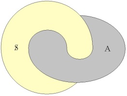

[无对应译文]

</section>

<section class="parallel-paragraph" data-paragraph-ids="s9-23-0022">

s9-23-0022

原文 · s9-23-0022

…nous voyons qu’assurément - ceci, je vous l’ai dit, se démontre, je vous ai laissé le soin, cette démonstration, de la trouver vous-mêmes, pour ne pas nous attarder - nous voyons qu’assurément, à décalquer ainsi le cercle du désir projeté sur le premier *tore*, sur le *tore* qui s’emboîte à lui, symbolisant le lieu de l’Autre, nous trouvons un cercle orienté de la même façon.

[无对应译文]

</section>

<section class="parallel-paragraph" data-paragraph-ids="s9-23-0023">

s9-23-0023

原文 · s9-23-0023

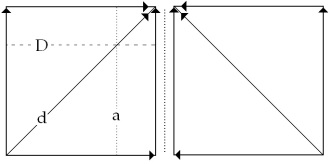

[无对应译文]

</section>

<section class="parallel-paragraph" data-paragraph-ids="s9-23-0024">

s9-23-0024

原文 · s9-23-0024

\[1\] \[2\]

[无对应译文]

</section>

<section class="parallel-paragraph" data-paragraph-ids="s9-23-0025">

s9-23-0025

原文 · s9-23-0025

Rappelez­ vous, vous avez représenté en face de cette figure \[1\] - que je recommencerai si la chose ne vous paraît pas trop fasti­dieuse - le décalque \[2\] qui est une image symétrique. Nous aurons alors une ligne oblique, orientée du sud au nord, que nous pourrons dire inver­sée, spéculaire à proprement parler. Mais la bascule à 90°, correspondant à l’emboîtement à 90° des deux tores, restituera la même obliquité :

[无对应译文]

</section>

<section class="parallel-paragraph" data-paragraph-ids="s9-23-0026">

s9-23-0026

原文 · s9-23-0026

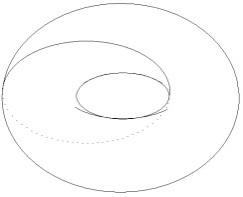 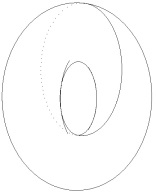 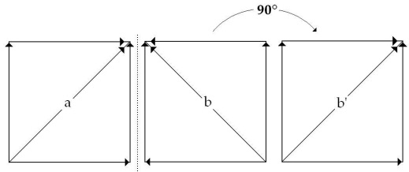

[无对应译文]

</section>

<section class="parallel-paragraph" data-paragraph-ids="s9-23-0027">

s9-23-0027

原文 · s9-23-0027

Autre­ment dit, après avoir pris effective­ment - ce sont des expériences très faciles à réaliser, qui ont toute la valeur d’une expérience - ces deux tores, et avoir fait effectivement, par la méthode de rotation d’un *tore* à l’intérieur de l’autre que je vous ai désignée la dernière fois, ce décalque, ayant relevé, si l’on peut dire, la trace de ces deux cercles, arbitrairement dessiné sur l’un et déterminé dès lors sur l’autre, vous pourrez voir, à les comparer ensuite, qu’ils sont exactement, au cercle qui les sectionne, superposables l’un à l’autre.

[无对应译文]

</section>

<section class="parallel-paragraph" data-paragraph-ids="s9-23-0028">

s9-23-0028

原文 · s9-23-0028

En quoi donc cette image s’avère appropriée à représenter la formule que *le désir du sujet est le désir de l’Autre.*

[无对应译文]

</section>

<section class="parallel-paragraph" data-paragraph-ids="s9-23-0029">

s9-23-0029

原文 · s9-23-0029

Néanmoins vous ai-je dit, si nous supposons, non pas ce simple cercle des­siné dans cette propriété, dans cette définition topologique particulière : d’à la fois entourer le trou et le traverser, mais de lui faire faire deux fois la traversée du trou, et une seule fois son entour, c’est-à-dire sur le polygone fondamental, de le représenter ainsi \[fig.1\] ces deux points ici x, x’ étant équivalents, nous avons alors quelque chose qui, sur le décalque, au niveau de l’Autre, se présente selon la formule suivante \[fig.2\].

[无对应译文]

</section>

<section class="parallel-paragraph" data-paragraph-ids="s9-23-0030">

s9-23-0030

原文 · s9-23-0030

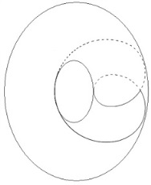 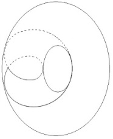 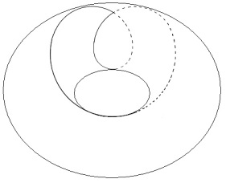 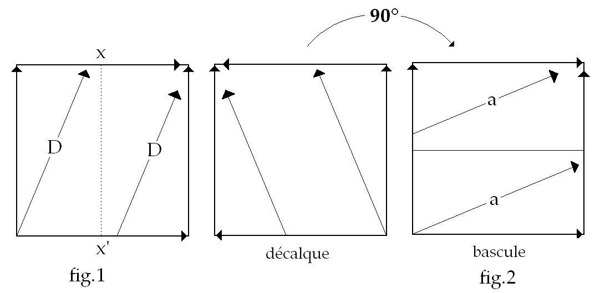

[无对应译文]

</section>

<section class="parallel-paragraph" data-paragraph-ids="s9-23-0031">

s9-23-0031

原文 · s9-23-0031

Si vous voulez, disons que la réa­lisation de deux fois le tour qui correspond à *la fonction de l’objet*, et au trans­fert, sur le décalque sur l’autre tore, en deux fois, de *la demande* selon la formule d’équivalence qui est pour nous en cette occasion précieuse, c’est de symboliser ceci que, dans une certaine forme de structure subjective : *la demande du sujet consiste dans l’objet de l’Autre, l’objet du sujet consiste dans la demande de l’Autre.*

[无对应译文]

</section>

<section class="parallel-paragraph" data-paragraph-ids="s9-23-0032">

s9-23-0032

原文 · s9-23-0032

Recoupement : alors la superposition des deux termes après la bascule n’est plus possible. Après la bascule à 90°, la coupure est celle-ci \[fig.2\] laquelle ne se superpose pas à la forme précédente \[fig.1\].

[无对应译文]

</section>

<section class="parallel-paragraph" data-paragraph-ids="s9-23-0033">

s9-23-0033

原文 · s9-23-0033

Nous y avons reconnu une correspondance qui nous est d’ores et déjà familière, pour autant que ce que nous pouvons expri­mer du *rapport du névrosé à l’Autre* en tant qu’il conditionne au dernier terme sa structure, est précisément cette équivalence croisée :

[无对应译文]

</section>

<section class="parallel-paragraph" data-paragraph-ids="s9-23-0034">

s9-23-0034

原文 · s9-23-0034

- *de la demande du sujet à l’objet de l’Autre,*

[无对应译文]

</section>

<section class="parallel-paragraph" data-paragraph-ids="s9-23-0035">

s9-23-0035

原文 · s9-23-0035

- *de l’objet du sujet à la demande de l’Autre.*

[无对应译文]

</section>

<section class="parallel-paragraph" data-paragraph-ids="s9-23-0036">

s9-23-0036

原文 · s9-23-0036

On sent là dans une sorte d’impasse - ou tout au moins d’ambiguïté - *la réalisation de l’identité des deux désirs*.

[无对应译文]

</section>

<section class="parallel-paragraph" data-paragraph-ids="s9-23-0037">

s9-23-0037

原文 · s9-23-0037

Ceci est évidemment aussi abrégé que possible comme formule, et bien sûr suppose déjà une familiarité acquise avec ces références, lesquelles sup­posent tout notre discours antérieur. La question donc restant ouverte étant celle que nous allons aborder aujourd’hui d’*une structure* qui nous permette de formaliser d’une façon exem­plaire, riche de ressources, de suggestions, qui nous donne un support de ce qui est ce vers quoi pointe notre recherche précisément, à savoir *la fonction du fan­tasme*.

[无对应译文]

</section>

<section class="parallel-paragraph" data-paragraph-ids="s9-23-0038">

s9-23-0038

原文 · s9-23-0038

C’est à cette fin que peut nous servir la structure particulière dite du *cross-cap* ou du *plan projectif,* pour autant que déjà aussi je vous en ai donné une suffisante indication pour que cet objet vous soit, sinon tout à fait familier, du moins que déjà vous ayez tenté d’approfondir ce qu’il représente comme pro­priétés exemplaires.

[无对应译文]

</section>

<section class="parallel-paragraph" data-paragraph-ids="s9-23-0039">

s9-23-0039

原文 · s9-23-0039

Je m’excuse donc d’entrer, à partir de maintenant, dans une explication qui, pour un instant, va rester très étroitement liée à cet objet d’une géométrie particulière dite topologique - géométrie non métrique mais topolo­gique - dont déjà je vous ai fait remarquer autant que j’ai pu, au passage, quelle idée vous devez vous en faire, quitte à ce que, après vous être donné la peine de me suivre dans ce que je vais maintenant vous expliquer, vous en soyez ensuite récompensés par ce qu’il nous permettra de supporter comme formule concer­nant l’organisation subjective qui est celle qui nous intéresse, par ce qu’il nous permettra d’exemplifier comme étant la structure authentique du désir, en ce qu’on pourrait appeler sa « *fonction centrale organisante* ». Bien sûr je ne suis pas sans réluctance[^174] au moment, une fois de plus, de vous entraîner sur des terrains qui peuvent n’être pas sans vous fatiguer.

[无对应译文]

</section>

<section class="parallel-paragraph" data-paragraph-ids="s9-23-0040">

s9-23-0040

原文 · s9-23-0040

C’est pour­quoi je me référerai un instant *à deux termes* qui se trouvent être proches dans mon expérience, et qui vont me donner l’occasion d’abord - première référence - de vous annoncer la parution imminente de la traduction faite par quelqu’un d’éminent, qui nous fait aujourd’hui l’honneur de sa visite, à savoir M. De WAELHENS.

[无对应译文]

</section>

<section class="parallel-paragraph" data-paragraph-ids="s9-23-0041">

s9-23-0041

原文 · s9-23-0041

M. de WAELHENS vient de faire la traduction, dont on ne saurait trop s’étonner qu’elle n’ait pas été réalisée plus tôt, de *Être et temps, Sein und Zeit,* tout au moins d’amener jusqu’à son point d’achèvement la première partie du volume paru, dont vous savez qu’il n’est que la première partie d’un projet dont la seconde partie n’est jamais venue à jour.

[无对应译文]

</section>

<section class="parallel-paragraph" data-paragraph-ids="s9-23-0042">

s9-23-0042

原文 · s9-23-0042

Donc en cette première partie il y a deux sections et la première section est d’ores et déjà traduite par M. De WAELHENS qui m’a fait le grand honneur - *la faveur* - de me la communiquer, ce qui m’a permis de prendre connaissance moi-même de cette partie - la moitié encore seulement - et je dois dire avec un infini plaisir, un plaisir qui va me permettre de m’en offrir un second : c’est de dire enfin, à cet endroit, *ce que j’ai sur le cœur* depuis longtemps et que je me suis toujours dispensé de professer en public, parce qu’à la vérité, vu la réputation de cet ouvrage dont je ne crois pas que beau­coup de personnes ici l’aient lu, cela aurait eu l’air d’une provocation.

[无对应译文]

</section>

<section class="parallel-paragraph" data-paragraph-ids="s9-23-0043">

s9-23-0043

原文 · s9-23-0043

C’est ceci, c’est qu’il y a peu de textes plus *clairs*, enfin d’une clarté et d’une simplicité concrètes et enfin directes, je ne sais pas quelles sont les qualifications qu’il faut que j’invente pour ajouter une dimension supplémentaire à l’évidence, que les textes de HEIDEGGER. Ce n’est pas parce que ce qu’en a fait M. SARTRE est effectivement assez difficile à lire que cela retire rien au fait que ce texte là de HEIDEGGER - je ne dis pas tous les autres - est un texte qui porte en lui cette sorte de surabondance de clarté qui le rend véritablement accessible, sans aucune dif­ficulté, à toute intelligence non intoxiquée par un enseignement philosophique préalable. Je peux vous le dire maintenant, parce que vous aurez très bientôt l’occasion de vous apercevoir, grâce à la traduction de M. De WAELHENS, vous ver­rez à quel point c’est ainsi.

[无对应译文]

</section>

<section class="parallel-paragraph" data-paragraph-ids="s9-23-0044">

s9-23-0044

原文 · s9-23-0044

La deuxième remarque est celle-ci, que vous pourrez constater du même coup : des assertions se sont véhiculées dans des *follicules bizarres*, de la part d’une *baveuse* de profession, que mon enseignement est néo-heideggerien. Ceci était dit dans une intention nocive. La personne probable­ment a mis « *néo* » en raison d’une certaine prudence, comme elle ne savait ni ce que voulait dire « *heideggerien* », ni non plus ce que voulait dire *mon enseignement*, cela la mettait à l’abri d’un certain nombre de réfutations, que cet enseignement qui est le mien n’a véritablement rien ni de « *néo* », ni d’*heideggerien*, malgré l’exces­sive révérence que j’ai pour l’enseignement d’HEIDEGGER.

[无对应译文]

</section>

<section class="parallel-paragraph" data-paragraph-ids="s9-23-0045">

s9-23-0045

原文 · s9-23-0045

La troisième remarque est liée à une seconde référence, à savoir que quelque chose va paraître - vous allez être régalés d’ici peu - qui est au moins aussi impor­tant - enfin, l’importance ne se mesure pas, dans des domaines différents, avec un centimètre - qui est très important aussi, disons, c’est le volume, qui n’est pas encore en librairie m’a-t-on dit, de Claude LÉVI-STRAUSS qui s’appelle *La Pensée sauvage*[^175]. Il est paru, me dites-vous ?

[无对应译文]

</section>

<section class="parallel-paragraph" data-paragraph-ids="s9-23-0046">

s9-23-0046

原文 · s9-23-0046

J’espère que vous avez déjà commencé à vous amuser ! Grâce aux soins que m’impose notre *séminaire*, je ne suis pas avancé très loin, mais j’ai lu les pages inaugurales magistrales par où Claude LÉVI-STRAUSS entre dans l’interprétation de ce qu’il appelle « *La pensée sauvage* », qu’il faut entendre - comme, je pense, son *interview* dans *Le Figaro* vous l’a déjà appris \[Cf. Gilles Lapouge : Le Figaro Littéraire du 02-06-1962, p. 3.\] - non pas comme la pensée des sauvages, mais comme, peut-on dire, l’état sauvage de la pensée, disons, la pensée en tant qu’elle fonctionne bien, efficacement, avec tous les caractères de la pensée, avant d’avoir pris la forme de *la pensée scientifique*, de la pensée scientifique moderne avec son statut.

[无对应译文]

</section>

<section class="parallel-paragraph" data-paragraph-ids="s9-23-0047">

s9-23-0047

原文 · s9-23-0047

Et Claude LÉVI-STRAUSS nous montre qu’il est tout à fait impossible de mettre là une coupure si radicale puisque la pensée qui n’a pas encore conquis son statut *scientifique* est tout à fait déjà appropriée à porter *certains effets scientifiques*. Telle est du moins sa visée apparente à son départ, et il prend singulièrement comme exemple, pour illus­trer ce qu’il veut en dire, de la pensée sauvage, quelque chose où sans doute entend-il rejoindre ce quelque chose de commun qu’il y aurait avec la pensée, disons telle que - il le souligne - telle qu’elle a porté des fruits fondamentaux à par­tir du moment lui-même qu’on ne peut pas qualifier d’absolument *anhistorique* puisqu’il le précise : *la pensée à partir de l’ère néolithique*[^176] *donne* - nous dit-il - *encore tous ses fondements à notre assiette dans le monde*.

[无对应译文]

</section>

<section class="parallel-paragraph" data-paragraph-ids="s9-23-0048">

s9-23-0048

原文 · s9-23-0048

*Pour l’illustrer,* si je puis dire, *encore fonctionnant à notre portée*, il ne trouve rien d’autre et rien de mieux que de l’exemplifier sous une forme, sans doute non unique mais privilé­giée par *sa démonstration*, sous la forme de ce qu’il appelle *le bricolage*[^177]. Ce pas­sage a tout *le brillant* que nous lui connaissons, l’originalité propre à cette sorte d’abrupt, de nouveauté, de chose qui bascule et renverse les perspectives bana­lement reçues, et c’est un morceau qui assurément est fort suggestif.

[无对应译文]

</section>

<section class="parallel-paragraph" data-paragraph-ids="s9-23-0049">

s9-23-0049

原文 · s9-23-0049

Mais il m’a paru justement particulièrement *suggestif* pour moi, après la relecture que je venais de faire, grâce à M. de WAELHENS, des thèmes heideggeriens : précisément en tant qu’il prend comme exemple dans sa recherche du statut, si l’on peut dire, de la connaissance en tant qu’il peut s’établir dans une approche qui pour l’éta­blir prétend cheminer à partir de l’interrogation concernant ce qu’il appelle « *l’être là* », c’est-à-dire *la forme la plus voilée* à la fois et la plus immédiate, d’un cer­tain type d’« *étant »* : *le fait d’être, qui est celui particulier à l’être humain*.

[无对应译文]

</section>

<section class="parallel-paragraph" data-paragraph-ids="s9-23-0050">

s9-23-0050

原文 · s9-23-0050

On ne peut manquer d’être frappé, encore que probablement la remarque révolterait autant l’un et l’autre de ces auteurs, de la surprenante identité du terrain sur lequel l’un et l’autre s’avancent. Je veux dire que ce que rencontre d’abord HEIDEGGER dans cette recherche, c’est *un certain rapport de l’être-là à un étant* qui est défini comme *ustensile,* comme *outil*, comme ce quelque chose qu’on a sous la main, *Vorhanden,* pour employer le terme dont il se sert, comme *Zuhandenheit,* pour ce qui est à portée de la main. Telle est la première forme de lien, non pas au monde, mais à l’*étant,* que HEIDEGGER[^178] nous dessine. Et c’est seulement *à partir de là*, à savoir, si l’on peut dire, *dans les implications, la possibilité*, d’une pareille relation, qu’il va, dit-il, donner son statut propre à ce qui fait le premier grand pivot de son analyse : *la fonction de l’être dans son rapport avec le temps*, à savoir la *Weltlichkeit* que M. de WAELHENS a traduit par la *mondanéité.* À savoir la consti­tution du monde en quelque sorte préalable, préalable à ce niveau de *l’être-là* qui ne s’est pas détaché encore à l’intérieur de l’*étant*, ces sortes d’« *étants* » que nous pouvons considérer comme purement et simplement *subsistant par eux-mêmes*.

[无对应译文]

</section>

<section class="parallel-paragraph" data-paragraph-ids="s9-23-0051">

s9-23-0051

原文 · s9-23-0051

Le monde est autre chose que l’ensemble, l’englobement de tous ces êtres qui existent, subsistent par eux-mêmes, auxquels nous avons affaire au niveau de cette conception du monde qui nous paraît si immédiatement natu­relle. Et pour cause, parce que c’est elle que nous appelons la nature. L’*antério­rité* de la constitution de cette *mondanéité* par rapport au moment où nous pouvons la considérer comme nature, tel est l’intervalle que préserve, par son analyse, HEIDEGGER.

[无对应译文]

</section>

<section class="parallel-paragraph" data-paragraph-ids="s9-23-0052">

s9-23-0052

原文 · s9-23-0052

Ce rapport primitif d’*ustensilité* préfigurant l’*Umwelt,* antérieur encore à l’entourage qui ne se constitue, par rapport à lui, que secondairement, c’est là la démarche d’HEIDEGGER et c’est exactement la même…

[无对应译文]

</section>

<section class="parallel-paragraph" data-paragraph-ids="s9-23-0053">

s9-23-0053

原文 · s9-23-0053

> je ne crois pas là rien dire qui puisse être retenu comme une critique qui, certes, après tout ce que je connais de la pensée et des dires de Claude LÉVI-STRAUSS, nous paraîtrait bien la démarche la plus opposée à la sienne, pour autant que ce qu’il donne comme sta­tut à la recherche d’ethnographie ne se produirait que dans une position d’aver­sion par rapport à la recherche *métaphysique*, ou même *ultra-métaphysique* d’HEIDEGGER …pourtant, c’est bien la même que nous trouvons dans ce premier pas par lequel Claude LÉVI-STRAUSS *entend nous introduire à la pensée sauvage sous la forme de ce* « *bricolage* », qui n’est pas autre chose que la même analyse, sim­plement en des termes différents, un éclairage à peine modifié, une visée sans doute distincte de ce même rapport à *l’ustensilité comme étant ce que l’un et l’autre considèrent comme antérieur, comme primordial par rapport à cette sorte d’accès structuré* *qui est le nôtre*, par rapport au champ de l’investigation scientifique, en tant qu’il permet de le distinguer comme fondé sur une articu­lation de l’objectivité qui soit en quelque sorte autonome, indépendante de ce qui est à proprement parler notre existence, et que nous ne gardons plus avec lui que ce rapport dit « *sujet–objet* » qui est ce point où se résume à ce jour tout ce que nous pouvons articuler de l’*épistémologie*.

[无对应译文]

</section>

<section class="parallel-paragraph" data-paragraph-ids="s9-23-0054">

s9-23-0054

原文 · s9-23-0054

Eh bien disons - pour le fixer une fois - ce que notre entreprise ici en tant qu’elle est fondée sur l’expérience analytique, a de distinct par rapport autant à l’une qu’à l’autre de ces investigations dont je viens de vous montrer *le caractère parallèle*, c’est que nous aussi nous cherchons ici ce statut, si l’on peut dire, anté­rieur à l’accès classique du statut de l’objet, entièrement concentré dans l’oppo­sition « *sujet-objet* ».

[无对应译文]

</section>

<section class="parallel-paragraph" data-paragraph-ids="s9-23-0055">

s9-23-0055

原文 · s9-23-0055

Et nous le cherchons dans quoi ? Dans ce quelque chose qui, quel qu’en soit le caractère évident d’approche, d’attraction, dans la pensée - autant celle d’HEIDEGGER que celle de Claude LÉVI-STRAUSS - en est pourtant bel et bien distinct, puisque ni l’un ni l’autre ne nomment comme tel cet objet comme *objet du désir*. Le statut primordial de l’*objet*, pour, disons en tout cas, *une pen­sée analytique*, ne peut être et ne saurait être autre chose que l’*objet du désir*.

[无对应译文]

</section>

<section class="parallel-paragraph" data-paragraph-ids="s9-23-0056">

s9-23-0056

原文 · s9-23-0056

Toutes les confusions dont s’est embarrassée jusqu’ici la théorie analytique sont conséquences de ceci : d’une tentative \- de plus d’une tentative : de tous les modèles possibles de tentatives - pour réduire ce qui s’impose à nous, à savoir cette recherche du statut de l’objet du désir, pour le réduire à des références déjà connues dont la plus simple et la plus commune est celle du statut de l’objet de la science en tant qu’une *épistémologie* philosophante l’organise dans l’opposi­tion dernière et radicale « *sujet-objet* », en tant qu’une *interprétation*, plus ou moins infléchie par les nuances de la recherche phénoménologique, peut à la rigueur en parler comme de l’*objet du désir*.

[无对应译文]

</section>

<section class="parallel-paragraph" data-paragraph-ids="s9-23-0057">

s9-23-0057

原文 · s9-23-0057

Ce statut de *l’objet du désir* comme tel reste toujours éludé dans toutes ses formes jusqu’ici articulées de la théorie analy­tique, et ce que nous cherchons ici est précisément à lui donner son statut propre. C’est dans cette ligne que se situe la visée que je poursuis devant vous pour l’instant.

[无对应译文]

</section>

<section class="parallel-paragraph" data-paragraph-ids="s9-23-0058">

s9-23-0058

原文 · s9-23-0058

Voici donc *les figures* \[au tableau\] où aujourd’hui je vais essayer de vous faire remarquer ce qui nous intéresse dans *cette structure* *de surface* dont les propriétés privilé­giées sont faites pour nous retenir comme *support structurant de ce rapport du sujet à l’objet* *du désir*, en tant qu’il se situe comme supportant tout ce que nous pouvons articuler, à quelque niveau que ce soit de l’expérience analytique, autrement dit comme *cette structure que nous appelons le fantasme fondamental.*

[无对应译文]

</section>

<section class="parallel-paragraph" data-paragraph-ids="s9-23-0059">

s9-23-0059

原文 · s9-23-0059

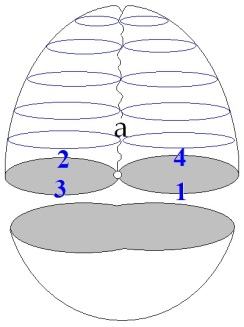

[无对应译文]

</section>

<section class="parallel-paragraph" data-paragraph-ids="s9-23-0060">

s9-23-0060

原文 · s9-23-0060

Pour ceux qui n’étaient pas là au séminaire précédent, je rappelle cette forme, ici dessinée en blanc, c’est cela que nous appelons *cross-cap* ou, pour être plus précis - puisque, je vous l’ai dit, une certaine ambiguïté reste sur l’usage de ce terme *Cross-cap -* le *plan projectif.*

[无对应译文]

</section>

<section class="parallel-paragraph" data-paragraph-ids="s9-23-0061">

s9-23-0061

原文 · s9-23-0061

Comme son dessin, ici à la craie blanche ne suffit pas, pour ceux qui ne l’ont pas encore appréhendé, à vous faire représenter ce que c’est, je vais essayer de vous le faire imaginer en vous le décri­vant comme si cette surface était là constituée en baudruche. Pour être encore plus clair, je vais partir de la base. Supposez que vous avez deux arceaux comme ceux d’un « *piège à loups* ». C’est cela qui va nous servir à représenter la coupure.

[无对应译文]

</section>

<section class="parallel-paragraph" data-paragraph-ids="s9-23-0062">

s9-23-0062

原文 · s9-23-0062

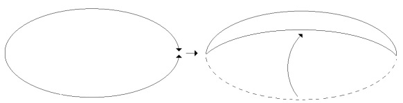

[无对应译文]

</section>

<section class="parallel-paragraph" data-paragraph-ids="s9-23-0063">

s9-23-0063

原文 · s9-23-0063

Si nous orien­tons les deux cercles du « *piège à loups* » dans le même sens, cela veut dire que nous allons simplement les refermer l’un sur l’autre. Si vous avez une coupure qui est faite ainsi et que vous tendiez de l’un à l’autre une baudruche, précisément si vous soufflez dedans et si vous refermez le piège à loups, il est tout de même à la portée des imaginations les plus élémentaires de voir que vous allez faire une sphère : si le souffle ne vous paraît pas suffisant, vous remplissez d’eau jusqu’à ce que vous obteniez cette forme-ci, vous refer­mez les deux demi-cercles du piège à loups, et vous avez une sphère à demi-­pleine, ou à demi-vide.

[无对应译文]

</section>

<section class="parallel-paragraph" data-paragraph-ids="s9-23-0064">

s9-23-0064

原文 · s9-23-0064

Je vous ai déjà expliqué comment au lieu de cela on peut faire un tore. Un tore, c’est cela, vous mettez les deux coins de ce mou­choir \[rejoints en l’air\] comme cela, et les deux autres par en–dessous comme ceci, et cela suffit à faire un tore. L’essentiel du tore est là puisque vous avez ici le trou central, et ici le vide circulaire autour duquel tourne le circuit de la demande. C’est cela que *le polygone fondamental du tore* vous a déjà illustré. *Un tore*, ce n’est pas du tout comme *une sphère*.

[无对应译文]

</section>

<section class="parallel-paragraph" data-paragraph-ids="s9-23-0065">

s9-23-0065

原文 · s9-23-0065

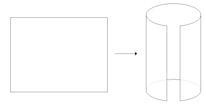

[无对应译文]

</section>

<section class="parallel-paragraph" data-paragraph-ids="s9-23-0066">

s9-23-0066

原文 · s9-23-0066

Naturellement, *un cross-cap*, ce n’est pas du tout comme *une sphère* non plus. Le cross-cap, vous l’avez ici :

[无对应译文]

</section>

<section class="parallel-paragraph" data-paragraph-ids="s9-23-0067">

s9-23-0067

原文 · s9-23-0067

[无对应译文]

</section>

<section class="parallel-paragraph" data-paragraph-ids="s9-23-0068">

s9-23-0068

原文 · s9-23-0068

Vous devez l’imaginer comme étant, pour cette moitié inférieure, réalisé comme la moitié de ce que vous avez fait tout à l’heure avec la baudruche, quand vous l’avez remplie d’eau ou de votre souffle. Dans la partie supérieure, ce qui est ici antérieur viendra traverser ce qui est continu, ce qui est ici postérieur.

[无对应译文]

</section>

<section class="parallel-paragraph" data-paragraph-ids="s9-23-0069">

s9-23-0069

原文 · s9-23-0069

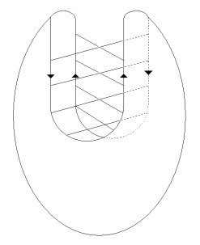

[无对应译文]

</section>

<section class="parallel-paragraph" data-paragraph-ids="s9-23-0070">

s9-23-0070

原文 · s9-23-0070

Les deux faces se croisent l’une l’autre, donnent l’apparence de se pénétrer puisque les conventions concernant *les surfaces* sont libres. Car n’oubliez pas que *nous ne les considérons que comme surfaces*, que nous pouvons dire que sans doute *les pro­priétés* *de l’espace* tel que nous l’imaginons nous forcent, dans *la représentation*, à *les représenter* comme se péné­trant, mais il suffit que nous ne tenions aucun compte de *cette ligne d’intersection*, dans aucun des moments de notre traitement de cette surface, pour que tout se passe comme si nous la tenions pour rien.

[无对应译文]

</section>

<section class="parallel-paragraph" data-paragraph-ids="s9-23-0071">

s9-23-0071

原文 · s9-23-0071

Ce n’est pas une arête, ce n’est rien que quelque chose que nous sommes forcés de nous repré­senter, parce que nous voulons représenter ici cette *surface*, comme une ligne de pénétration. Mais cette ligne, si l’on peut dire, dans la constitution de la surface, n’a aucun privilège. Vous me direz : Que signifie ce que vous êtes en train de dire ?…

[无对应译文]

</section>

<section class="parallel-paragraph" data-paragraph-ids="s9-23-0072">

s9-23-0072

原文 · s9-23-0072

*X, dans la salle*

[无对应译文]

</section>

<section class="parallel-paragraph" data-paragraph-ids="s9-23-0073">

s9-23-0073

原文 · s9-23-0073

*Est-ce que cela veut dire que vous admettez, avec l’esthé­tique transcendantale de Kant, la constitution fondamentale de l’espace en 3 dimensions, puisque vous nous dites que, pour représenter ici les choses vous êtes forcé d’en passer par quelque chose qui dans la représentation* *est en quelque sorte gênant ?*

[无对应译文]

</section>

<section class="parallel-paragraph" data-paragraph-ids="s9-23-0074">

s9-23-0074

原文 · s9-23-0074

LACAN

[无对应译文]

</section>

<section class="parallel-paragraph" data-paragraph-ids="s9-23-0075">

s9-23-0075

原文 · s9-23-0075

Bien sûr, d’une certaine façon, oui. Tous ceux qui articulent ce qui concerne la topologie des surfaces comme telles partent \- c’est le *b-a, ba* de la question - de cette distinction de ce qu’on peut appeler *les propriétés intrin­sèques* de la surface et *les propriétés extrinsèques*. Ils nous diront que tout ce qu’ils vont articuler, déterminer, concernant le fonctionnement des *surfaces* ainsi définies, est à distinguer de ce qui se passe, comme ils s’expriment littéra­lement, *quand on plonge ladite surface dans l’espace*, nommément, dans le cas présent, à trois dimensions.

[无对应译文]

</section>

<section class="parallel-paragraph" data-paragraph-ids="s9-23-0076">

s9-23-0076

原文 · s9-23-0076

C’est *cette distinction fondamentale* qui est aussi celle que je vous ai sans cesse rappelée, pour vous dire que nous ne devions pas considérer l’anneau, le tore, comme un solide et que, quand je parle du vide qui est central, du pourtour de l’anneau, comme du trou qui lui est, si je puis dire, axial, ce sont des termes qu’il convient de prendre à l’intérieur de ceci : que nous n’avons pas à les faire *fonctionner* pour autant que nous visons purement et sim­plement la surface.

[无对应译文]

</section>

<section class="parallel-paragraph" data-paragraph-ids="s9-23-0077">

s9-23-0077

原文 · s9-23-0077

Il n’en reste pas moins que c’est pour autant que - comme s’expriment *les topologistes* - nous *plongeons cette surface dans un espace*, que nous pou­vons laisser à l’état d’x - qu’en est-il du nombre de dimensions qui le structurent ? Nous ne sommes point forcés d’en préjuger - que nous pouvons mettre en valeur telle ou telle des *propriétés intrinsèques* dont il s’agit dans une surface. Et la preuve est justement ceci : c’est que le tore, nous n’aurons aucune difficulté à le représenter dans l’espace à trois dimensions qui nous est intuitivement familier, alors que pour celle-ci nous aurons tout de même une certaine peine, puisqu’il nous faudra y ajouter la petite note de toutes sortes de réserves, concernant ce que nous avons à lire quand nous tentons de représenter dans cet espace cette surface.

[无对应译文]

</section>

<section class="parallel-paragraph" data-paragraph-ids="s9-23-0078">

s9-23-0078

原文 · s9-23-0078

C’est ce qui nous permettra de poser justement la question de *la struc­ture d’un espace* en tant qu’il admet ou qu’il n’admet pas nos surfaces telles que nous les avons préalablement constituées. Ces réserves étant faites, je vous prie maintenant de poursuivre et de consi­dérer ce que j’ai à vous enseigner sur cette surface, précisément en tant que c’est à propos de sa représentation dans l’espace que je vais essayer de vous mettre en valeur certains de ses caractères, qui n’en sont pas moins intrinsèques pour cela.

[无对应译文]

</section>

<section class="parallel-paragraph" data-paragraph-ids="s9-23-0079">

s9-23-0079

原文 · s9-23-0079

Car si j’ai d’ores et déjà éliminé la valeur que nous pouvons donner à cette ligne, *ligne de pénétration*, dont vous voyez ici, le détail illustré :

[无对应译文]

</section>

<section class="parallel-paragraph" data-paragraph-ids="s9-23-0080">

s9-23-0080

原文 · s9-23-0080

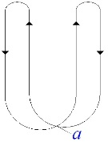

[无对应译文]

</section>

<section class="parallel-paragraph" data-paragraph-ids="s9-23-0081">

s9-23-0081

原文 · s9-23-0081

C’est ainsi que nous pouvons la représenter, vous voyez que rien que par la façon dont je l’ai, moi, déjà dessinée au tableau, il y a ici quelque chose qui nous pose une question : la valeur de ce point qui est ici \[*a*\] est-elle une valeur que nous pouvons en quelque sorte effacer, comme la valeur de cette ligne ? Est-ce que ce point est lui aussi quelque chose qui ne tient qu’à la nécessité de la représentation dans l’espace à trois dimen­sions ?

[无对应译文]

</section>

<section class="parallel-paragraph" data-paragraph-ids="s9-23-0082">

s9-23-0082

原文 · s9-23-0082

Je vous le dis tout de suite pour éclairer un peu à l’avance mon propos, ce point, quant à sa fonction, n’est pas éliminable, au moins à un certain niveau de la spéculation sur la surface, un niveau qui n’est pas seulement défini par l’existence de l’espace à trois dimensions. En effet, que signifie radicalement la construction de cette surface dite du *cross-cap*, en tant qu’elle s’organise à partir de la coupure que je vous ai représentée tout à l’heure comme un « *piège à loups* » qui se referme ? Rien de plus simple que de voir qu’il faut que ce « *piège à loups* » soit bipartite, quand il s’agit de la sphère, puisqu’il faut bien qu’il se replie quelque part, que ses deux moitiés sont orientées dans le même sens. Le *terminus ad quo* se distinguera donc du *terminus ad quem* en tant qu’ils doivent se recouvrir de leur long.

[无对应译文]

</section>

<section class="parallel-paragraph" data-paragraph-ids="s9-23-0083">

s9-23-0083

原文 · s9-23-0083

Nous pouvons dire qu’ici nous avons la façon dont fonctionnent, l’une par rapport à l’autre, les deux moitiés du bord qu’il s’agit de rejoindre pour constituer un plan projectif. Ici, ils sont orientés en sens contraire, ce qui veut dire qu’un point situé à cette place, point *a* par exemple, *correspondra*, *sera identique*, *équivalent à un point* situé à cette place en *a’*, diamétralement opposé, qu’un autre point *b* situé ici par exemple se rapportera à un autre point *b’* situé diamétralement.

[无对应译文]

</section>

<section class="parallel-paragraph" data-paragraph-ids="s9-23-0084">

s9-23-0084

原文 · s9-23-0084

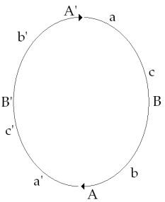

[无对应译文]

</section>

<section class="parallel-paragraph" data-paragraph-ids="s9-23-0085">

s9-23-0085

原文 · s9-23-0085

Ceci ne nous incite-t-il pas à penser qu’étant donné ce rap­port antipodique des points, sur ce circuit orienté d’une façon continue toujours dans le même sens, aucun point n’aura de privilège, et que, quelle que soit notre difficulté d’intui­tionner ce dont il s’agit, il nous faut simple­ment penser ce rapport circulaire anti­podique comme une sorte d’entrecroisement rayonné si l’on peut dire, concentrant l’échange d’un point au point opposé du bord unique de ce trou, et le concentrant, si l’on peut dire, autour d’un vaste entrecroisement central qui échappe à notre pensée et qui ne nous permet d’aucune façon donc d’en donner de représentation satisfaisante.

[无对应译文]

</section>

<section class="parallel-paragraph" data-paragraph-ids="s9-23-0086">

s9-23-0086

原文 · s9-23-0086

Néanmoins, ce qui justifie que les choses soient ainsi représentées, c’est qu’il y a quelque chose qu’il convient de ne pas oublier, c’est qu’il ne s’agit pas de figures métriques.

[无对应译文]

</section>

<section class="parallel-paragraph" data-paragraph-ids="s9-23-0087">

s9-23-0087

原文 · s9-23-0087

À savoir que ce n’est pas la distance de a à A, et de a’ à A’ qui règle la *correspon­dance point par point* qui nous permet de construire la surface en organisant de cette façon la coupure, mais c’est uniquement la position relative des points, autrement dit, dans un ensemble de trois points qui se situent sur la moitié - admettez l’usage du terme la moitié dont je me sers en cette occasion, qui est déjà représenté par la référence analogique que j’ai faite ici des deux moitiés du bord - c’est en tant que sur ce bord, sur cette ligne, comme sur toute ligne, un point peut être défini comme étant entre deux autres, qu’un point c, par exemple, va pouvoir trouver son correspondant dans le point c’ de l’autre côté.

[无对应译文]

</section>

<section class="parallel-paragraph" data-paragraph-ids="s9-23-0088">

s9-23-0088

原文 · s9-23-0088

Mais si nous n’avons pas de point d’origine, de point ἀρχήν \[arken\]...

[无对应译文]

</section>

<section class="parallel-paragraph" data-paragraph-ids="s9-23-0089">

s9-23-0089

原文 · s9-23-0089

> Τὴν ἀρχήν ὄ τι κὰι λαλο ὑμίν \[ten arken o ti kai lalo umin\][^179], comme on dit dans l’Évangile, ce qui a prêté à de telles difficultés de traduction qu’un penseur de Franche-Comté \[Raymond Ruyer\] a cru devoir me dire : « *C’est bien là qu’on vous reconnaît ! Le seul passage de l’Évangile sur lequel personne ne peut s’accorder,* *c’est lui que vous avez pris en épigraphe pour une partie de votre rapport de Rome* ».

[无对应译文]

</section>

<section class="parallel-paragraph" data-paragraph-ids="s9-23-0090">

s9-23-0090

原文 · s9-23-0090

*…*ἀρχήν \[arken\] donc, *le com­mencement*, s’il n’y a pas ces points de commencement quelque part, il est impossible de définir un point comme étant entre deux autres, car *c* et *c’* sont aussi bien entre ces deux autres, a et B, s’il n’y a pas de AA’ pour repérer d’une façon univoque ce qui se passe dans chaque segment.

[无对应译文]

</section>

<section class="parallel-paragraph" data-paragraph-ids="s9-23-0091">

s9-23-0091

原文 · s9-23-0091

C’est donc pour d’autres raisons que la possibilité de les représenter dans l’espace, qu’il faut que nous définissions un point d’origine à cet échange entrecroisé, qui constitue la surface du *plan projectif*, entre *un bord* qu’il faut bien - malgré qu’il tourne toujours dans le même sens - que nous le divisions en deux.

[无对应译文]

</section>

<section class="parallel-paragraph" data-paragraph-ids="s9-23-0092">

s9-23-0092

原文 · s9-23-0092

Ceci peut vous paraître fort ennuyeux, mais vous allez voir que cela va prendre un intérêt de plus en plus grand. Je vous annonce tout de suite ce que j’entends dire, j’entends dire que ce point ἀρχήν \[arken\], origine, a une structure tout à fait privilégiée, que c’est lui, c’est sa présence qui assure à la boucle intérieure de notre *signifiant polonais* un statut qui, lui, est tout à fait spécial. En effet, pour ne pas vous faire attendre plus longtemps, j’applique ce signifiant, dit *huit intérieur,* sur la surface du *cross-cap*. Nous verrons après ce que cela veut dire.

[无对应译文]

</section>

<section class="parallel-paragraph" data-paragraph-ids="s9-23-0093">

s9-23-0093

原文 · s9-23-0093

Observez tout de même que l’appliquer *de cette façon* :

[无对应译文]

</section>

<section class="parallel-paragraph" data-paragraph-ids="s9-23-0094">

s9-23-0094

原文 · s9-23-0094

[无对应译文]

</section>

<section class="parallel-paragraph" data-paragraph-ids="s9-23-0095">

s9-23-0095

原文 · s9-23-0095

Cela veut dire que cette ligne que dessine notre signifiant huit intérieur se trouve ici faire deux fois le tour de ce point privilégié. Là, faites un effort d’imagination… Je veux bien vous l’illustrer par quelque chose. Voyez ce que cela peut faire :

[无对应译文]

</section>

<section class="parallel-paragraph" data-paragraph-ids="s9-23-0096">

s9-23-0096

原文 · s9-23-0096

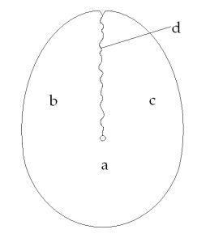

[无对应译文]

</section>

<section class="parallel-paragraph" data-paragraph-ids="s9-23-0097">

s9-23-0097

原文 · s9-23-0097

Vous avez ici, si vous voulez, le renflement de *la moitié inférieure* \[a\], le renflement de *la pince gauche* de la patte de homard \[b\], le ren­flement de *la pince droite* \[c\]. Ici, cela rentre dans l’autre, cela passe de l’autre côté \[d\].

[无对应译文]

</section>

<section class="parallel-paragraph" data-paragraph-ids="s9-23-0098">

s9-23-0098

原文 · s9-23-0098

Qu’est-ce que cela veut dire ? Cela veut dire que vous avez en somme un plan qui s’enroule comme cela sur lui :

[无对应译文]

</section>

<section class="parallel-paragraph" data-paragraph-ids="s9-23-0099">

s9-23-0099

原文 · s9-23-0099

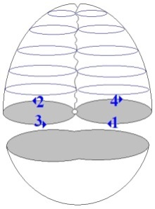

[无对应译文]

</section>

<section class="parallel-paragraph" data-paragraph-ids="s9-23-0100">

s9-23-0100

原文 · s9-23-0100

puis qui à un moment se traverse lui-même, de sorte que cela fait comme deux espèces de volets, ou d’ailes battantes ici superposées, qui se trouvent en somme, par la coupure, isolées du renflement inférieur, et au niveau supérieur ces deux ailes se croisent l’une l’autre. Ce n’est pas très inconcevable.

[无对应译文]

</section>

<section class="parallel-paragraph" data-paragraph-ids="s9-23-0101">

s9-23-0101

原文 · s9-23-0101

Si vous vous étiez intéressés aussi longtemps que moi à cet objet, évidemment cela vous paraî­trait peu surprenant, car à vrai dire, le pri­vilège de cette double coupure, cela est très intéressant. C’est très inté­ressant en ce sens que, concernant le tore :

[无对应译文]

</section>

<section class="parallel-paragraph" data-paragraph-ids="s9-23-0102">

s9-23-0102

原文 · s9-23-0102

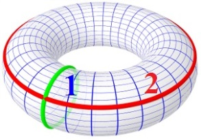 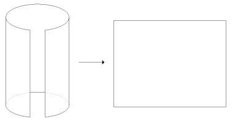

[无对应译文]

</section>

<section class="parallel-paragraph" data-paragraph-ids="s9-23-0103">

s9-23-0103

原文 · s9-23-0103

je vous l’ai déjà montré :

[无对应译文]

</section>

<section class="parallel-paragraph" data-paragraph-ids="s9-23-0104">

s9-23-0104

原文 · s9-23-0104

- si vous faites une coupure \[**1**\] cela le transforme en une bande.

[无对应译文]

</section>

<section class="parallel-paragraph" data-paragraph-ids="s9-23-0105">

s9-23-0105

原文 · s9-23-0105

- Si vous en faites une seconde \[**2**\] *qui traverse la première, cela ne le fragmente* pas pour autant. C’est cela qui vous permet de l’étaler comme un beau carré.

[无对应译文]

</section>

<section class="parallel-paragraph" data-paragraph-ids="s9-23-0106">

s9-23-0106

原文 · s9-23-0106

- Si vous faites deux coupures qui ne se recroisent pas, sur un tore - essayez d’imaginer cela - là vous le met­tez forcément en deux morceaux :

[无对应译文]

</section>

<section class="parallel-paragraph" data-paragraph-ids="s9-23-0107">

s9-23-0107

原文 · s9-23-0107

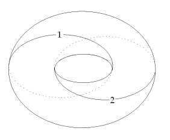 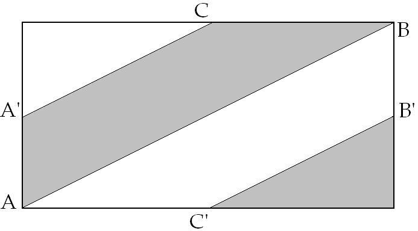

[无对应译文]

</section>

<section class="parallel-paragraph" data-paragraph-ids="s9-23-0108">

s9-23-0108

原文 · s9-23-0108

Ici, sur le *cross-cap*, avec une coupure qui est *une coupure simple* comme celle qui peut se dessiner ainsi :

[无对应译文]

</section>

<section class="parallel-paragraph" data-paragraph-ids="s9-23-0109">

s9-23-0109

原文 · s9-23-0109

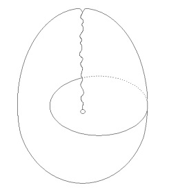

[无对应译文]

</section>

<section class="parallel-paragraph" data-paragraph-ids="s9-23-0110">

s9-23-0110

原文 · s9-23-0110

vous ouvrez cette surface - amusez-vous à en faire le dessin, ce sera un très bon exercice intellec­tuel de savoir ce qui se passe à ce moment-là - vous ouvrez la surface, vous ne la coupez pas en deux, vous n’en faites pas deux morceaux. Si vous faites n’importe quelle autre coupure, qui se croise ou qui ne se croise pas, vous la divisez.

[无对应译文]

</section>

<section class="parallel-paragraph" data-paragraph-ids="s9-23-0111">

s9-23-0111

原文 · s9-23-0111

Ce qui est paradoxal et intéressant, c’est qu’en somme il ne s’agit ici que d’*une seule coupure* toujours \[coupure en « *huit intérieur* »\], et que néanmoins, à simplement lui faire faire deux fois le tour du point privilégié, vous divisez la surface.

[无对应译文]

</section>

<section class="parallel-paragraph" data-paragraph-ids="s9-23-0112">

s9-23-0112

原文 · s9-23-0112

 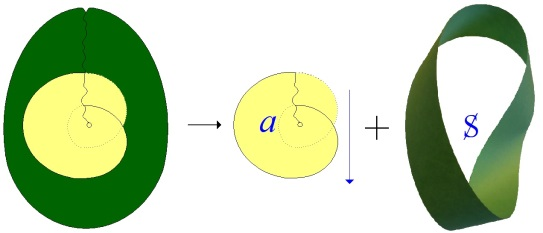

[无对应译文]

</section>

<section class="parallel-paragraph" data-paragraph-ids="s9-23-0113">

s9-23-0113

原文 · s9-23-0113

Ce n’est pas du tout pareil sur un *tore*. Sur un *tore*, si vous faites autant de fois que vous voudrez le tour du trou central, vous n’obtiendrez jamais qu’un allongement en quelque sorte de la bande, mais vous ne la diviserez pas pour autant.

[无对应译文]

</section>

<section class="parallel-paragraph" data-paragraph-ids="s9-23-0114">

s9-23-0114

原文 · s9-23-0114

Ceci pour vous faire remar­quer que nous touchons là, sans doute, quelque chose d’intéressant concernant la fonction de cette surface. Il y a d’ailleurs quelque chose qui n’est pas moins intéressant, c’est que ce double tour, avec ce résultat, est quelque chose que vous ne pouvez pas répéter une seule fois de plus. Si vous faites un triple tour, vous serez amenés à dessiner sur la surface quelque chose qui se répétera indéfiniment, à la manière des boucles que vous opérez sur le tore quand vous vous livrez à l’opération de bobinage dont je vous ai parlé au départ, à ceci près qu’ici la ligne ne se rejoindra jamais, ne se mordra jamais la queue :

[无对应译文]

</section>

<section class="parallel-paragraph" data-paragraph-ids="s9-23-0115">

s9-23-0115

原文 · s9-23-0115

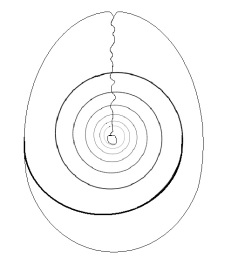

[无对应译文]

</section>

<section class="parallel-paragraph" data-paragraph-ids="s9-23-0116">

s9-23-0116

原文 · s9-23-0116

La valeur privilégiée de ce double tour est donc suffisamment assurée par ces deux propriétés. Considérons maintenant la surface qu’isole ce double tour sur le plan pro­jectif. Je vais vous en faire remarquer certaines propriétés.

[无对应译文]

</section>

<section class="parallel-paragraph" data-paragraph-ids="s9-23-0117">

s9-23-0117

原文 · s9-23-0117

D’abord *c’est ce que nous pouvons appeler une surface* - appelons-la comme cela, pour la rapidité, entre nous si l’on peut dire, puisque je vais vous rappeler ce que cela veut dire - *c’est une surface gauche*, comme un corps gauche, comme n’importe quoi que nous pouvons définir comme cela dans l’espace. Je ne l’emploie pas pour l’opposer à droite, je l’emploie pour définir ceci, que vous devez bien connaître, c’est que si vous voulez définir l’enroulement d’un escargot, qui comme vous le savez est privilégié, *dextrogyre* ou *lévogyre* peu importe, cela dépend comment vous définissez l’un ou l’autre, cet enroulement, vous le trouverez le même, que vous regardiez l’escargot du côté de sa pointe ou que vous le retourniez pour le regarder du côté de l’endroit où il ébauche un creux.

[无对应译文]

</section>

<section class="parallel-paragraph" data-paragraph-ids="s9-23-0118">

s9-23-0118

原文 · s9-23-0118

En d’autres termes, c’est *qu’à retourner ici le cross-cap* pour le voir de l’autre côté, si nous définissons ici la rotation *de la gauche vers la droite* en nous éloignant du point central, vous voyez qu’il tourne toujours dans le même sens de l’autre côté.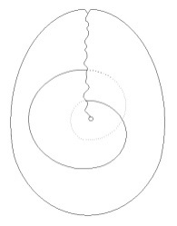 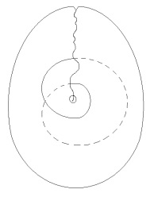

[无对应译文]

</section>

<section class="parallel-paragraph" data-paragraph-ids="s9-23-0119">

s9-23-0119

原文 · s9-23-0119

recto verso

[无对应译文]

</section>

<section class="parallel-paragraph" data-paragraph-ids="s9-23-0120">

s9-23-0120

原文 · s9-23-0120

Ceci est la propriété de tous les corps qui sont *dissymétriques*. C’est donc bien d’une *dis­symétrie* qu’il s’agit, fondamentale à la forme de cette surface. À preuve, c’est que vous avez au-dessous quelque chose qui est l’image de cette surface ainsi définie sur notre double boucle, dans le miroir. La voici :

[无对应译文]

</section>

<section class="parallel-paragraph" data-paragraph-ids="s9-23-0121">

s9-23-0121

原文 · s9-23-0121

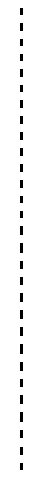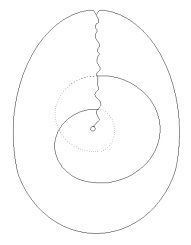 

[无对应译文]

</section>

<section class="parallel-paragraph" data-paragraph-ids="s9-23-0122">

s9-23-0122

原文 · s9-23-0122

> \[a\] \[b\]

[无对应译文]

</section>

<section class="parallel-paragraph" data-paragraph-ids="s9-23-0123">

s9-23-0123

原文 · s9-23-0123

Nous devons nous attendre à ce que, comme dans tout corps *dissymétrique*, *l’image* dans le miroir *ne lui soit pas superposable*, de même que notre image dans le miroir, à nous qui ne sommes pas symétriques, malgré ce que nous en croyons, ne se superpose pas du tout à notre propre support : si nous avons un grain de beauté *sur la joue droite*, ce grain de beauté sera *sur la joue gauche* de l’image dans le miroir.

[无对应译文]

</section>

<section class="parallel-paragraph" data-paragraph-ids="s9-23-0124">

s9-23-0124

原文 · s9-23-0124

Néanmoins la propriété de cette surface est telle que, comme vous le voyez, il suffit de faire remonter un tout petit peu cette boucle là \[a\], et c’est légitime de la faire passer au-dessus de l’autre, puisque les deux plans ne se traversent pas réellement, pour que vous ayez une image absolument identique \[b\], et donc superposable à la première, à celle dont nous sommes partis.

[无对应译文]

</section>

<section class="parallel-paragraph" data-paragraph-ids="s9-23-0125">

s9-23-0125

原文 · s9-23-0125

Vous voyez ce qui se passe : remontez cela tout doucement, progressivement jusqu’ici, et voyez ce qui va se passer, à savoir que l’occultation de cette petite partie en pointillés située ici est la réalisation identique de ce qui est dans l’image primitive.

[无对应译文]

</section>

<section class="parallel-paragraph" data-paragraph-ids="s9-23-0126">

s9-23-0126

原文 · s9-23-0126

Ceci nous sert à illustrer cette propriété que je vous ai dit être celle de *(a)* en tant qu’*objet du désir*, d’être ce quelque chose qui est à la fois *orientable* - et assuré­ment très orienté - mais qui n’est pas, si je puis m’exprimer ainsi, « *spécularisable* ». À ce niveau radical qui constitue le sujet dans sa dépendance par rapport à *l’objet du désir*, la fonction *i(a)*, *fonction spéculaire*, perd sa prise, si l’on peut dire.

[无对应译文]

</section>

<section class="parallel-paragraph" data-paragraph-ids="s9-23-0127">

s9-23-0127

原文 · s9-23-0127

Et tout ceci est commandé par quoi ? Par quelque chose qui est justement ce point \[le point central\] en tant qu’il appartient à cette surface. Pour éclairer tout de suite ce que je veux dire, je vous dirai que c’est en arti­culant la fonction de ce point que nous pourrons trouver toutes sortes de for­mules heureuses qui nous permettent de concevoir *la fonction du phallus* *au centre de la constitution de l’objet du désir*.

[无对应译文]

</section>

<section class="parallel-paragraph" data-paragraph-ids="s9-23-0128">

s9-23-0128

原文 · s9-23-0128

C’est pour cela qu’il vaut la peine que nous continuions de nous intéresser à *la structure de ce point*. Ce point, en tant que c’est lui qui est la clé de la structure de cette surface ainsi définie, découpée par notre coupure dans le plan projectif. Ce point, il faut que je m’arrête un instant à vous montrer quelle est sa véritable fonction. C’est ce qui vous demandera bien sûr encore un peu de *patience*. Quelle est la fonction de ce point ?

[无对应译文]

</section>

<section class="parallel-paragraph" data-paragraph-ids="s9-23-0129">

s9-23-0129

原文 · s9-23-0129

Ce qui là dans ce moment auquel nous nous arrêtons est manifeste, c’est qu’il est *dans une des deux parts* dont - par la double cou­pure - le plan projectif est divisé. Il appartient à cette par­tie, qui se détache, il n’appar­tient pas à la partie qui reste.

[无对应译文]

</section>

<section class="parallel-paragraph" data-paragraph-ids="s9-23-0130">

s9-23-0130

原文 · s9-23-0130

Puisqu’il semble que vous ayez été capables tout à l’heure - je dois tout au moins l’induire du fait qu’il ne s’est élevé aucun murmure de protestation - de concevoir comment cette figure peut passer à celle-ci par simple déplacement légitime du niveau de la coupure, vous allez, je pense, être aussi bien capables de faire l’effort mental de voir ce qui se passe :

[无对应译文]

</section>

<section class="parallel-paragraph" data-paragraph-ids="s9-23-0131">

s9-23-0131

原文 · s9-23-0131

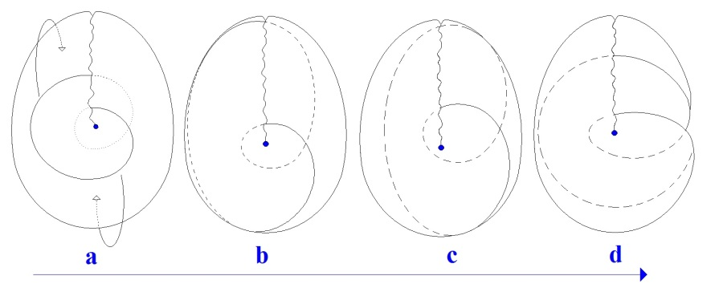

[无对应译文]

</section>

<section class="parallel-paragraph" data-paragraph-ids="s9-23-0132">

s9-23-0132

原文 · s9-23-0132

- si d’une part nous faisons franchir l’horizon du cul de sac inférieur de la surface à cette coupure \[a\], en la faisant passer donc de l’autre côté comme l’indique ma flèche jaune,

[无对应译文]

</section>

<section class="parallel-paragraph" data-paragraph-ids="s9-23-0133">

s9-23-0133

原文 · s9-23-0133

- et si nous faisons franchir à la partie supérieure de la boucle également l’horizon de ce qui est en haut du *cross-cap* \[b\], ceci nous conduit sans difficulté à la figure suivante.

[无对应译文]

</section>

<section class="parallel-paragraph" data-paragraph-ids="s9-23-0134">

s9-23-0134

原文 · s9-23-0134

Le passage à la dernière \[c\] est un petit peu plus difficile à concevoir, non pas pour *la boucle inférieure* comme vous le voyez, mais pour *la boucle supérieure*, pour autant que vous pouvez peut-être avoir un instant d’hésitation concernant ce qui se passe au moment du franchissement de ce qui ici se présente comme l’extrémité de *la ligne de pénétration*.

[无对应译文]

</section>

<section class="parallel-paragraph" data-paragraph-ids="s9-23-0135">

s9-23-0135

原文 · s9-23-0135

Si vous y réfléchissez un petit peu, vous verrez que si c’est de l’autre côté que la coupure est amenée à franchir cette ligne de pénétration, évidemment elle se présentera comme cela \[c\], c’est-à-dire comme elle est de l’autre côté, elle sera pointillée de ce côté-ci, et elle sera pleine, puisque d’après notre convention ce qui est pointillé est vu *par transparence*.

[无对应译文]

</section>

<section class="parallel-paragraph" data-paragraph-ids="s9-23-0136">

s9-23-0136

原文 · s9-23-0136

Rien dans la structure de la surface ne nous permet de distinguer la valeur de ces coupures donc de celles auxquelles nous aboutissons ici, mais pour l’œil elles se présentent comme rentrant toutes deux du même côté de la ligne de pénétration.

[无对应译文]

</section>

<section class="parallel-paragraph" data-paragraph-ids="s9-23-0137">

s9-23-0137

原文 · s9-23-0137

Est-ce que c’est très simple pour l’œil ? *Sûrement pas.* Car *cette différence* qu’il y a entre, *pour la coupure, de rentrer de deux côtés différents ou rentrer par le même côté*, c’est quelque chose qui doit tout de même se signaler dans le résul­tat, sur la figure. Et d’ailleurs, ceci est tout à fait sensible. Si vous réfléchissez à ce que c’est, ce qui désormais est *découpé* sur cette sur­face \[d\], vous le reconnaîtrez facilement : d’abord, c’est la même chose que notre *signifiant*. En plus, de la façon dont cela découpe une surface, cela découpe *une sur­face* dont vous sentez très bien - vous n’avez qu’à regarder la figure - que c’est une bande, *une bande qui n’a qu’un bord*. Je vous ai déjà montré ce que c’est : c’est *une surface de Mœbius* \[S\].

[无对应译文]

</section>

<section class="parallel-paragraph" data-paragraph-ids="s9-23-0138">

s9-23-0138

原文 · s9-23-0138

[无对应译文]

</section>

<section class="parallel-paragraph" data-paragraph-ids="s9-23-0139">

s9-23-0139

原文 · s9-23-0139

Or, les propriétés d’une *surface de Mœbius* sont des propriétés complètement différentes de celles de cette petite surface tournante \[*a*\] dont je vous ai montré tout à l’heure les propriétés en la retournant, en la mirant, en la transformant et en vous disant finalement que c’est celle-là qui nous intéresse.

[无对应译文]

</section>

<section class="parallel-paragraph" data-paragraph-ids="s9-23-0140">

s9-23-0140

原文 · s9-23-0140

Ce petit « *tour de passe-passe* » a évidemment une raison qui n’est pas difficile à chercher. Son intérêt est simplement de vous montrer que *cette coupure divise la surface toujours en deux parts*, dont l’une conserve le point dont il s’agit à son inté­rieur, et dont l’autre ne l’a plus. *Cette autre partie*, qui est tout aussi bien présente là que dans la figure terminale, *c’est une surface de Mœbius*. *La double coupure divise toujours la surface appelée « cross-cap » en deux* :

[无对应译文]

</section>

<section class="parallel-paragraph" data-paragraph-ids="s9-23-0141">

s9-23-0141

原文 · s9-23-0141

- ce quelque chose \[*a*\] auquel nous nous intéressons et dont je vais faire pour vous le support de l’explication du rap­port de S avec *(a)* dans *le fantasme*,

[无对应译文]

</section>

<section class="parallel-paragraph" data-paragraph-ids="s9-23-0142">

s9-23-0142

原文 · s9-23-0142

- et de l’autre côté, *une surface de Mœbius* \[S\].

[无对应译文]

</section>

<section class="parallel-paragraph" data-paragraph-ids="s9-23-0143">

s9-23-0143

原文 · s9-23-0143

Quelle est la première chose que je vous ai fait toucher du doigt quand je vous ai fait cadeau de cette petite *cinq ou sixaine* de *surfaces de Mœbius* que j’ai lancées à tra­vers l’assemblée ? *C’est que la surface de Mœbius, elle, au sens où je l’entendais tout à l’heure, est irréductiblement gauche,* *quelque modification que vous lui fassiez subir, vous ne pourrez pas lui superposer son image dans le miroir.*

[无对应译文]

</section>

<section class="parallel-paragraph" data-paragraph-ids="s9-23-0144">

s9-23-0144

原文 · s9-23-0144

Voilà donc la fonction de cette coupure et ce qu’elle montre d’exemplaire. Elle est telle que, divisant une certaine surface *d’une façon privilégiée*, surface dont la nature et la fonction nous sont complètement *énigmatiques* puisqu’à peine pouvons-nous la situer dans l’espace, elle fait apparaître des *fonctions pri­vilégiées* d’un côté, qui sont celles que j’ai appelées tout à l’heure d’être *spécu­larisables*, c’est-à-dire de comporter son irréductibilité à *l’image spéculaire*, et de l’autre côté, une surface qui, quoi que présentant tous les privilèges d’une *sur­face*, elle, *orientée*, n’est pas spécularisée.

[无对应译文]

</section>

<section class="parallel-paragraph" data-paragraph-ids="s9-23-0145">

s9-23-0145

原文 · s9-23-0145

Car remarquez bien que cette surface, on ne peut pas dire, comme sur la *surface de Mœbius*, qu’un *être infiniment plat* se promenant se retrouvera tout d’un coup sur cette surface à son propre envers : chaque face est bel et bien séparée de l’autre dans celle-ci. Cette propriété, bien sûr, est quelque chose qui laisse ouverte *une énigme*, car ce n’est pas si simple. C’est d’autant moins simple que la surface totale, c’est bien évident, n’est reconstituable - et reconstituable immédiatement - qu’à partir de celle-ci \[*a*\]. Il faut donc bien que les propriétés les plus fondamentales de la surface soient quelque part conservées, malgré son apparence plus rationnelle que celle de l’autre, dans cette surface. Il est tout à fait clair qu’elles sont conservées *au niveau du point*.

[无对应译文]

</section>

<section class="parallel-paragraph" data-paragraph-ids="s9-23-0146">

s9-23-0146

原文 · s9-23-0146

Si le passage qui, dans la figure totale, rend toujours possible à un voyageur infi­niment plat de se retrouver, par un chemin excessivement bref, en un point qui est son propre envers, je dis, sur la surface totale, si ce n’est plus possible au niveau de la surface centrale fragmentée, divisée par le signifiant de la double boucle, c’est que très précisément quelque chose de cela est conservé *au* *niveau du point*.

[无对应译文]

</section>

<section class="parallel-paragraph" data-paragraph-ids="s9-23-0147">

s9-23-0147

原文 · s9-23-0147

À ceci près, que justement, pour que ce point fonctionne comme ce point, il a ce privilège d’être, justement, infranchissable, sauf à faire s’évanouir, si l’on peut dire, toute la structure de la surface. Vous le voyez, je n’ai même pas pu encore donner son plein développement à ce que je viens de dire de ce point. Si vous y réfléchissez, vous pourrez d’ici la pro­chaine fois le trouver vous-mêmes.

[无对应译文]

</section>

<section class="parallel-paragraph" data-paragraph-ids="s9-23-0148">

s9-23-0148

原文 · s9-23-0148

L’heure est avancée et c’est bien là que je suis forcé de vous laisser. Je m’excuse de l’aridité de ce que j’ai été amené aujourd’hui à produire devant vous, du fait de la complexité même, encore que ce soit d’une complexité extraordinairement *punctiforme*, c’est le cas de le dire.

[无对应译文]

</section>

<section class="parallel-paragraph" data-paragraph-ids="s9-23-0149">

s9-23-0149

原文 · s9-23-0149

C’est là que je reprendrai la prochaine fois. Je reviens donc sur ce que j’ai dit à l’entrée, le fait que je n’aie pu arriver que jusqu’à ce point de mon exposé, fera que *le séminaire de mer­credi prochain* - dites-le à ceux qui ont reçu la prochaine annonce - sera main­tenu dans le dessein de ne pas laisser trop d’espace, trop d’intervalle entre ces deux séminaires, car cet espace pourrait être nuisible à la suite de notre explication.

[无对应译文]

</section>

<section class="note-block original-notes">

## Notes

[^174]: Réluctance : rapport de la force magnétomotrice appliquée à un circuit magnétique au flux d'induction produit. Synonyme : Résistance magnétique.

[^175]: Claude Lévi-Strauss : *La Pensée sauvage* », Paris, Plon,1962 ou Pocket n°2 , 1990.

[^176]: Claude Lévi-Strauss : *La Pensée sauvage*, p.22 : « *L'histoire de cette dernière* \[*la connais­sance scientifique*\] *est assez courte pour que nous soyons bien informés à son sujet ;*

    *mais, que l'origine de la science moderne remonte seulement à quelques siècles, pose un problème auquel les ethnologues n'ont pas suffisamment réfléchi ; le nom de paradoxe néolithique*

    *lui conviendrait parfaitement.* »

[^177]: Claude Lévi-Strauss : La Pensée sauvage, p.26 : « *Et, de nos jours, le bri­coleur reste celui qui œuvre de ses mains, en utilisant des moyens détournés par comparaison avec ceux*

    *de l'homme de l'art. Or, le propre de la pensée mythique est de s'exprimer à l'aide d'un répertoire dont la composition est hétéroclite et qui, bien qu'étendu, reste tout de même limité ;*

    *pourtant, il faut qu'elle s'en serve, quelle que soit la tâche qu'elle s'assigne, car elle n'a rien d'autre sous la main. Elle apparaît ainsi comme une sorte de bricolage intellectuel,*

    *ce qui ex­plique les relations qu'on observe entre les deux.* »

[^178]: Martin Heidegger : [*Être et temps*, trad. Emmanuel Martineau](http://t.m.p.free.fr/textes/Heidegger_etre_et_temps.pdf).

[^179]: St Jean : VIII – 25.

</section>
