# Leçon 24 | 13 Juin 1962

  

    <label><input type="checkbox" data-lacan-toggle="original" checked> 原文</label>
    <label><input type="checkbox" data-lacan-toggle="notes" checked> 注释</label>
    <label><input type="checkbox" data-lacan-toggle="commentary" checked> 个人解读评论</label>
  

  <form class="lacan-tool-search" role="search">
    <input class="lacan-tool-search-input" type="search" placeholder="搜索全文" aria-label="搜索全文">
    <button class="lacan-tool-button" type="submit" title="搜索">搜索</button>
  </form>
  <button class="lacan-tool-button lacan-back-to-top" type="button" title="回到页面最上方" aria-label="回到页面最上方">↑</button>

<section class="parallel-paragraph" data-paragraph-ids="s9-24-0001">

s9-24-0001

原文 · s9-24-0001

Il y a la double coupure \[*huit intérieur*\] :

[无对应译文]

</section>

<section class="parallel-paragraph" data-paragraph-ids="s9-24-0002">

s9-24-0002

原文 · s9-24-0002

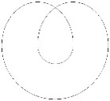

[无对应译文]

</section>

<section class="parallel-paragraph" data-paragraph-ids="s9-24-0003">

s9-24-0003

原文 · s9-24-0003

celle qui fait deux tours autour de ce fameux point du plan projectif : deux oreilles se traversant, la première pouvant se déplacer sans déplacer le point \[*a*\].

[无对应译文]

</section>

<section class="parallel-paragraph" data-paragraph-ids="s9-24-0004">

s9-24-0004

原文 · s9-24-0004

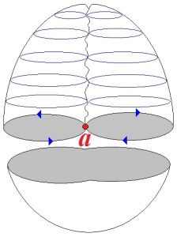

[无对应译文]

</section>

<section class="parallel-paragraph" data-paragraph-ids="s9-24-0005">

s9-24-0005

原文 · s9-24-0005

Voici trois figures :

[无对应译文]

</section>

<section class="parallel-paragraph" data-paragraph-ids="s9-24-0006">

s9-24-0006

原文 · s9-24-0006

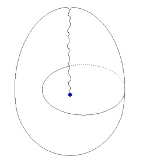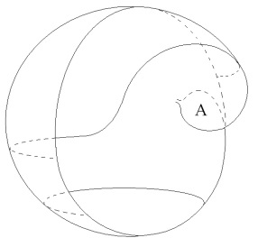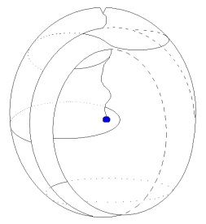

[无对应译文]

</section>

<section class="parallel-paragraph" data-paragraph-ids="s9-24-0007">

s9-24-0007

原文 · s9-24-0007

> fig.1 fig.2 fig.3

[无对应译文]

</section>

<section class="parallel-paragraph" data-paragraph-ids="s9-24-0008">

s9-24-0008

原文 · s9-24-0008

La *figure 1* répond à la coupure simple, en tant que le plan projectif n’en saurait tolérer plus d’une sans être divisé. Celle-là ne divise pas, elle ouvre. Cette ouver­ture est intéressante à montrer sous cette forme parce qu’elle permet de visualiser pour nous, de matérialiser *la fonction du point*.

[无对应译文]

</section>

<section class="parallel-paragraph" data-paragraph-ids="s9-24-0009">

s9-24-0009

原文 · s9-24-0009

La *figure 2* nous aidera à com­prendre l’autre. Il s’agit de *savoir ce qui se passe quand* *la coupure* ici désignée *a ouvert la surface*. Bien entendu, il s’agit là d’une description de la surface liée à ce qu’on appelle ses *relations extrinsèques*, à savoir la surface pour autant que nous essayons de l’insérer dans l’espace à trois dimensions. Mais je vous ai dit que cette distinction des propriétés *intrinsèques* de la surface et de ses propriétés *extrin­sèques* n’était pas aussi radicale qu’on y insiste quel­quefois dans un souci de formalisme, car c’est justement à propos de sa *plongée dans l’espace* comme on dit, que *certaines des propriétés* *in­trinsèques* de la surface apparaissent dans toutes leurs conséquences. Je ne fais que vous signaler le pro­blème.

[无对应译文]

</section>

<section class="parallel-paragraph" data-paragraph-ids="s9-24-0010">

s9-24-0010

原文 · s9-24-0010

Tout ce que je vais vous dire en effet sur *le plan projectif*, la place privilégiée qu’y occupe le point, ce que nous appellerons « *le point* », qui est ici figuré dans le *cross-cap*, ici \[fig.1\], *point terminal de la ligne de pseudo-pénétration* de la surface sur elle-même, ce point, vous voyez sa fonction dans cette forme ouverte \[fig.2\] du même objet décrit à la *figure 1*.

[无对应译文]

</section>

<section class="parallel-paragraph" data-paragraph-ids="s9-24-0011">

s9-24-0011

原文 · s9-24-0011

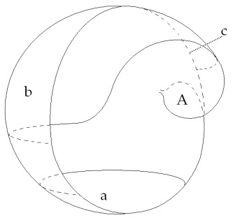

[无对应译文]

</section>

<section class="parallel-paragraph" data-paragraph-ids="s9-24-0012">

s9-24-0012

原文 · s9-24-0012

fig.2

[无对应译文]

</section>

<section class="parallel-paragraph" data-paragraph-ids="s9-24-0013">

s9-24-0013

原文 · s9-24-0013

Si vous l’ouvrez selon la coupure, ce que vous allez voir appa­raître *c’est un fond* \[fig.2 : a\] qui est en bas, *celui de la demi-sphère*. En haut, c’est le plan de cette *paroi antérieure* \[fig. 2 : b\] pour autant qu’elle se continue en *paroi postérieure* \[fig.2 : c\] après avoir pénétré le plan qui lui est, si l’on peut dire, *symé­trique* dans la composition de cet objet.

[无对应译文]

</section>

<section class="parallel-paragraph" data-paragraph-ids="s9-24-0014">

s9-24-0014

原文 · s9-24-0014

Pourquoi le voyez-vous ainsi dénudé jusqu’en haut ?

[无对应译文]

</section>

<section class="parallel-paragraph" data-paragraph-ids="s9-24-0015">

s9-24-0015

原文 · s9-24-0015

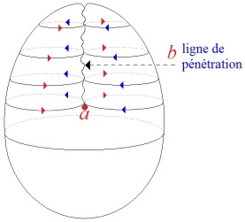

[无对应译文]

</section>

<section class="parallel-paragraph" data-paragraph-ids="s9-24-0016">

s9-24-0016

原文 · s9-24-0016

Parce qu’une fois la cou­pure pratiquée, comme *ces deux plans*, qui se croisent comme ceci : *au niveau de la ligne de pénétration*, *ne se croisent pas réellement*, il ne s’agit pas d’une réelle pénétration mais d’une pénétration qui n’est nécessitée que par la projection dans l’espace de la surface dont il s’agit, nous pouvons à notre gré remonter, une fois qu’*une coupure* a dissout la continuité de la surface, un de ces plans à travers l’autre puisque, aussi bien, non seulement il n’est pas important de savoir à quel niveau ils se traversent, quels points correspondent dans la tra­versée, mais au contraire il convient expressément de ne pas tenir compte de cette coïncidence des niveaux des points en tant que la pénétration pourrait les rendre, à certains moments du raisonnement, superposables. Il convient au contraire de marquer qu’*ils ne le sont pas*.

[无对应译文]

</section>

<section class="parallel-paragraph" data-paragraph-ids="s9-24-0017">

s9-24-0017

原文 · s9-24-0017

Le plan antérieur de la *figure 1*, et qui passe de l’autre côté, s’est trouvé abaissé vers le point que nous appelons dès lors « *le point* » tout court, tandis qu’en haut nous voyons se produire ceci : une ligne qui va jusqu’en haut de l’objet et qui, derrière, passe de l’autre côté. Lorsque nous pratiquons, dans cette figure, une traversée, nous obtenons quelque chose qui se présente comme un creux ouvert vers l’avant :

[无对应译文]

</section>

<section class="parallel-paragraph" data-paragraph-ids="s9-24-0018">

s9-24-0018

原文 · s9-24-0018

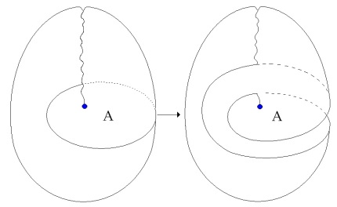

[无对应译文]

</section>

<section class="parallel-paragraph" data-paragraph-ids="s9-24-0019">

s9-24-0019

原文 · s9-24-0019

Le trait en poin­tillés va passer derrière cette sorte d’oreille et trouve une sortie de l’autre côté, à savoir la coupure entre ce bord-ci et ce qui, de l’autre côté, est symétrique de cette sorte de panier, mais en arrière. Il faut considérer que derrière il y a une sortie. Voilà la *figure 3* qui est une figure intermédiaire.

[无对应译文]

</section>

<section class="parallel-paragraph" data-paragraph-ids="s9-24-0020">

s9-24-0020

原文 · s9-24-0020

[无对应译文]

</section>

<section class="parallel-paragraph" data-paragraph-ids="s9-24-0021">

s9-24-0021

原文 · s9-24-0021

Ici vous voyez encore l’entrecroisement à la partie supérieure du plan antérieur, qui devient postérieur pour revenir ensuite. Et vous pouvez relever cela indéfiniment, je vous l’ai fait remarquer. C’est bien ce qui s’est produit au niveau extrême. C’est la même chose que ce bord-là que vous trouvez décrit à la *figure1*. Cette partie que je désigne à la *figure 1*, nous allons l’appeler A. C’est cela qui se maintient à cet endroit de la *figure 2*. La continuité de ce bord :

[无对应译文]

</section>

<section class="parallel-paragraph" data-paragraph-ids="s9-24-0022">

s9-24-0022

原文 · s9-24-0022

[无对应译文]

</section>

<section class="parallel-paragraph" data-paragraph-ids="s9-24-0023">

s9-24-0023

原文 · s9-24-0023

se fait avec ce qui, derrière la surface en quelque sorte oblique ainsi dégagée, se replie en arrière une fois que vous avez commencé à lâcher le tout, de sorte que si on les recollait, cela se rejoindrait comme à la *figure 3*. C’est pourquoi je l’ai indiqué en bleu sur mon dessin \[flèches bleues\]. Le bleu est, en somme, tout ce qui perpétue la coupure elle-même.

[无对应译文]

</section>

<section class="parallel-paragraph" data-paragraph-ids="s9-24-0024">

s9-24-0024

原文 · s9-24-0024

Qu’en résulte-t-il ?

[无对应译文]

</section>

<section class="parallel-paragraph" data-paragraph-ids="s9-24-0025">

s9-24-0025

原文 · s9-24-0025

C’est que vous avez un creux, une poche dans laquelle vous pouvez introduire quelque chose. Si vous passez la main, celle-ci passe derrière cette oreille qui est en continuité par l’avant avec la surface. Ce que vous rencontrez derrière, c’est une surface qui correspond au fond du panier, mais séparée de ce qui reste sur la droite, à savoir cette surface qui vient en avant, là, et qui se replie en arrière à la *figure 2*. En suivant un chemin comme celui-là, vous avez une flèche pleine, puis en pointillés parce qu’elle passe derrière l’oreille qui correspond à A. Elle sort ici parce que c’est la partie de la coupure qui est derrière. C’est la partie que je peux désigner par B. L’*oreille* qui est dessinée ici par les limites de ce pointillé à la *figure 2* pourrait se trouver de l’autre côté.

[无对应译文]

</section>

<section class="parallel-paragraph" data-paragraph-ids="s9-24-0026">

s9-24-0026

原文 · s9-24-0026

Cette possibilité de deux oreilles, c’est ce que vous trouverez lorsque vous avez réalisé la double coupure et que vous isolez dans le *cross-cap* quelque chose qui se fabrique ici. Ce que vous voyez dans cette pièce centrale ainsi isolée de la *figure 4*

[无对应译文]

</section>

<section class="parallel-paragraph" data-paragraph-ids="s9-24-0027">

s9-24-0027

原文 · s9-24-0027

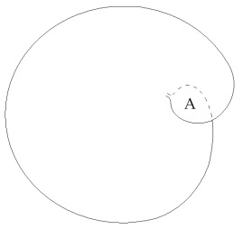

[无对应译文]

</section>

<section class="parallel-paragraph" data-paragraph-ids="s9-24-0028">

s9-24-0028

原文 · s9-24-0028

fig.4

[无对应译文]

</section>

<section class="parallel-paragraph" data-paragraph-ids="s9-24-0029">

s9-24-0029

原文 · s9-24-0029

c’est en somme un plan tel que vous effa­cez maintenant le reste de l’objet, de sorte que vous n’aurez plus à mettre de pointillés ici, ni même de traversée. Il ne reste que la pièce centrale. Qu’avez-vous alors ? Vous pouvez l’imaginer aisément. Vous avez *une sorte de plan qui, en gauchissant, vient, à un moment, à se recouper lui-même* selon une ligne qui passe alors derrière.

[无对应译文]

</section>

<section class="parallel-paragraph" data-paragraph-ids="s9-24-0030">

s9-24-0030

原文 · s9-24-0030

Vous avez donc ici aussi deux oreilles : une lamelle en avant, une lamelle en arrière. Et le plan se traverse lui-même selon une ligne strictement limitée à un point. Il se pourrait que ce point fût placé à l’extré­mité de l’oreille postérieure : ce serait, pour le plan, une manière de se recouper lui–même qui serait tout aussi intéressante par certains côtés, puisque c’est ce que j’ai réalisé à la *figure 5* :

[无对应译文]

</section>

<section class="parallel-paragraph" data-paragraph-ids="s9-24-0031">

s9-24-0031

原文 · s9-24-0031

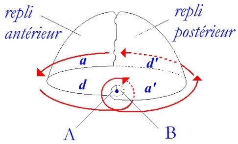

[无对应译文]

</section>

<section class="parallel-paragraph" data-paragraph-ids="s9-24-0032">

s9-24-0032

原文 · s9-24-0032

pour vous montrer tout à l’heure la façon dont il convient de considérer la structure de ce point... je sais personnelle­ment que vous vous êtes inquiétés déjà de la fonction de ce point, puisque vous m’avez un jour posé en privé la question de savoir pourquoi toujours, moi-même et les auteurs, nous le représentons sous cette forme, indiquant au centre une sorte de petit trou. Il est bien certain que ce petit trou donne à réfléchir. Et c’est juste­ment sur lui que nous allons insister, car il livre la structure tout à fait particu­lière de ce point qui n’est pas un point comme les autres. C’est ce sur quoi, maintenant, je vais être amené à m’expliquer ...sa forme un peu oblique, tordue, est amusante, car l’analogie est frappante avec l’*hélix* \[1\],l’*anthélix* \[2\] et même le lobule de la forme de ce plan projectif coupé, si l’on considère qu’on peut retrouver cette forme, qui foncièrement est attirée par la forme de la *bande de Mœbius*, on la retrouve beaucoup plus simplifiée dans ce que j’ai appelé un jour « *l’arum* » ou encore « *l’oreille d’âne* ».

[无对应译文]

</section>

<section class="parallel-paragraph" data-paragraph-ids="s9-24-0033">

s9-24-0033

原文 · s9-24-0033

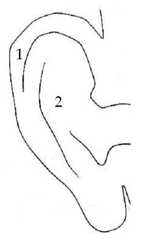

[无对应译文]

</section>

<section class="parallel-paragraph" data-paragraph-ids="s9-24-0034">

s9-24-0034

原文 · s9-24-0034

Ceci n’est fait que pour attirer votre attention sur ce fait évident que la nature semble en quelque sorte aspirée par ces structures, et dans des organes particulièrement significatifs, ceux de ces orifices du corps qui sont en quelque sorte laissés à part, distincts de la dialectique analytique. À ces orifices du corps, quand ils montrent cette sorte de ressemblance, pourrait se raccrocher une sorte de considération, de rattachement à la *Naturwissenschaft* de ce point, lequel doit bien y attenir, s’y refléter, s’il a effectivement quelque valeur.

[无对应译文]

</section>

<section class="parallel-paragraph" data-paragraph-ids="s9-24-0035">

s9-24-0035

原文 · s9-24-0035

L’analogie frappante de plusieurs de ces dessins que j’ai faits avec les figures que vous trouvez à chaque page des livres d’embryologie mérite aussi de retenir l’attention.

[无对应译文]

</section>

<section class="parallel-paragraph" data-paragraph-ids="s9-24-0036">

s9-24-0036

原文 · s9-24-0036

Lorsque vous considérez ce qui se passe, à peine franchi le stade de la plaque germinative, dans l’œuf des ser­pents ou des poissons, pour autant que c’est ce qui se rapproche le plus, à un exa­men qui n’est pas absolument complet dans l’état actuel de la science, du développement de l’œuf humain, vous trouvez quelque chose de frappant, c’est l’apparition sur cette plaque germinative, à un moment donné, de ce qu’on appelle *la ligne primitive*, qui est également terminée par un point, *le nœud de Hensen* qui est un point tout à fait significatif et *vraiment problématique dans sa formation*, pour autant qu’il est lié par une sorte de corrélation avec la for­mation du *tube neural* : il vient en quelque sorte à sa rencontre *par un processus de repli de l’ectoderme*. C’est, comme vous ne l’ignorez pas, *quelque chose qui donne l’idée de la formation d’un tore*, puisqu’à un certain stade ce tube neural reste ouvert comme une trompette des deux côtés.

[无对应译文]

</section>

<section class="parallel-paragraph" data-paragraph-ids="s9-24-0037">

s9-24-0037

原文 · s9-24-0037

Par contre, la formation du canal chordal qui se produit au niveau de ce *nœud de Hensen*, avec une façon de se propager latéralement, donne l’idée qu’il se produit là un processus d’entre­croisement, dont l’aspect morphologique ne peut pas manquer de rappeler *la structure du plan projectif*, surtout si l’on songe que le processus qui se réalise, de ce point appelé *nœud de Hensen*, est en quelque sorte un processus régres­sif. À mesure que le développement s’avance, c’est dans une ligne, dans un recul postérieur du *nœud de Hensen* que se complète cette fonction de *la ligne pri­mitive*, et qu’ici se produit cette ouverture vers l’avant, vers l’[*entoblaste*](http://fr.wikipedia.org/wiki/Endoderme), de ce canal qui, chez les sauropsidés, se présente comme l’homologue - sans être du tout identifiable au canal neuro-entérique qu’on trouve chez les batraciens - à savoir ce qui met en communication la partie terminale du tube digestif et la par­tie terminale du tube neural.

[无对应译文]

</section>

<section class="parallel-paragraph" data-paragraph-ids="s9-24-0038">

s9-24-0038

原文 · s9-24-0038

Bref, ce point si hautement significatif pour conjoindre l’orifice cloacal, cet orifice si important dans la théorie analytique, avec quelque chose qui se trouve, devant la partie la plus inférieure de la forma­tion caudale, être ce qui spécifie le vertébré et le pré-vertébré plus fortement que n’importe quel autre caractère, à savoir l’existence de la corde dont cette *ligne primitive* et le *nœud de Hensen* sont le point de départ.

[无对应译文]

</section>

<section class="parallel-paragraph" data-paragraph-ids="s9-24-0039">

s9-24-0039

原文 · s9-24-0039

Il y a certainement toute une série de directions de recherches qui, je crois, mériteraient de retenir l’atten­tion. En tout cas, si je n’y ai point insisté, c’est qu’assurément ce n’est pas dans ce sens que je désire m’engager. Si j’en parle à l’instant, c’est à la fois pour réveiller chez vous un peu plus d’intérêt pour ces structures si captivantes en elles-mêmes, et aussi bien authentifier une remarque qui m’a été faite sur ce que l’embryologie aurait ici à dire son mot, au moins à titre illustratif. Cela va nous permettre d’aller plus loin \- et tout de suite - sur la fonction de ce point. Une discussion très ser­rée sur le plan du formalisme de ces constructions topo­logiques ne ferait que s’éterniser et peut-être pourrait vous lasser.

[无对应译文]

</section>

<section class="parallel-paragraph" data-paragraph-ids="s9-24-0040">

s9-24-0040

原文 · s9-24-0040

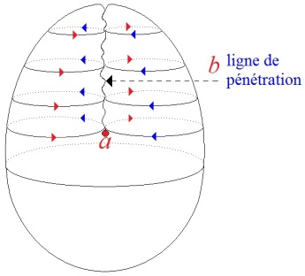

[无对应译文]

</section>

<section class="parallel-paragraph" data-paragraph-ids="s9-24-0041">

s9-24-0041

原文 · s9-24-0041

Si la ligne que je trace ici \[*ligne de pénétration*\], sous la forme d’une sorte *d’entrecroisement de fibres* est quelque chose dont vous connaissez déjà la fonction dans *ce cross-cap*, ce que j’entends vous signaler c’est que le point qui la ter­mine, bien sûr, est un point mathématique, un point abs­trait. Nous ne pouvons donc lui donner aucune dimension. Néanmoins nous ne pouvons le penser que comme une coupure à laquelle il faut que nous donnions des propriétés paradoxales : d’abord du fait que nous ne pouvons la concevoir que comme punctiforme, d’autre part elle est irréductible.

[无对应译文]

</section>

<section class="parallel-paragraph" data-paragraph-ids="s9-24-0042">

s9-24-0042

原文 · s9-24-0042

En d’autres termes, pour la conception même de la surface nous ne pouvons la consi­dérer comme comblée : c’est « *un point-trou* », si l’on peut dire. De plus, si nous la considérons comme « *un point-trou* », c’est-à-dire faite de l’*accolement* de deux bords, elle serait en quelque sorte insécable dans le sens qui la traverse, et on peut en effet l’illustrer de ce type de coupure unique \[1\] qu’on peut faire dans le *cross-cap*. Il y en a qui sont faites normalement pour expliquer le fonctionnement de la sur­face, dans les livres techniques qui s’y consacrent.

[无对应译文]

</section>

<section class="parallel-paragraph" data-paragraph-ids="s9-24-0043">

s9-24-0043

原文 · s9-24-0043

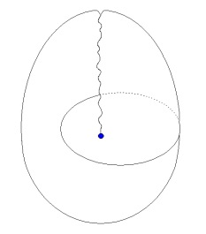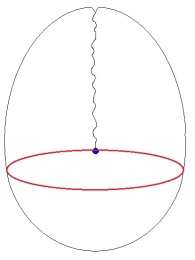

[无对应译文]

</section>

<section class="parallel-paragraph" data-paragraph-ids="s9-24-0044">

s9-24-0044

原文 · s9-24-0044

\[1\] \[2\]

[无对应译文]

</section>

<section class="parallel-paragraph" data-paragraph-ids="s9-24-0045">

s9-24-0045

原文 · s9-24-0045

S’il y a une coupure \[2\] qui passe par ce point, comment devons-nous la concevoir ? Est-ce qu’elle est en quelque sorte l’homologue, et uniquement l’homologue, de ce qui se passe quand vous faites passer une de ces lignes plus haut, traversant *la ligne structurale de fausse pénétration* ? C’est-à-dire en quelque sorte : si quelque chose existe que nous pouvons appeler « *point-trou* », de telle sorte que la coupure, même lorsqu’elle s’en rapproche jusqu’à se confondre avec ce point, fasse le tour de ce trou ?

[无对应译文]

</section>

<section class="parallel-paragraph" data-paragraph-ids="s9-24-0046">

s9-24-0046

原文 · s9-24-0046

C’est en effet ce qu’il faut bien concevoir, car lorsque nous tra­çons une telle coupure, voici à quoi nous abou­tissons :

[无对应译文]

</section>

<section class="parallel-paragraph" data-paragraph-ids="s9-24-0047">

s9-24-0047

原文 · s9-24-0047

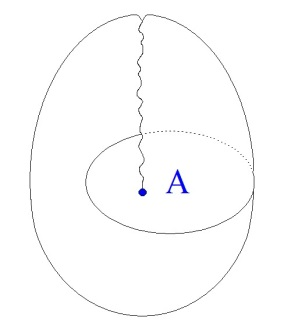→ 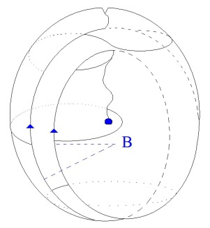

[无对应译文]

</section>

<section class="parallel-paragraph" data-paragraph-ids="s9-24-0048">

s9-24-0048

原文 · s9-24-0048

> fig.1 fig.3

[无对应译文]

</section>

<section class="parallel-paragraph" data-paragraph-ids="s9-24-0049">

s9-24-0049

原文 · s9-24-0049

Prenez, si vous voulez, la *figure 1*, trans­formez-la en *figure 3*, et considérez ce dont il s’agit entre les deux oreilles qui restent là, au niveau de A, et de B qui serait derrière : c’est quelque chose qui peut encore s’écarter indéfiniment, au point que l’ensemble prenne cet aspect \[fig. 5\]:

[无对应译文]

</section>

<section class="parallel-paragraph" data-paragraph-ids="s9-24-0050">

s9-24-0050

原文 · s9-24-0050

[无对应译文]

</section>

<section class="parallel-paragraph" data-paragraph-ids="s9-24-0051">

s9-24-0051

原文 · s9-24-0051

Ces deux parties de la figure représentent les *replis, antérieur* et *postérieur,* que j’ai dessinés en *figure 4*. Ici, au centre, cette surface que j’ai des­sinée en *figure 4* apparaît ici aussi en *figure 5*. Elle est là en effet, derrière. Il reste qu’en ce point quelque chose doit être maintenu qui est en quelque sorte l’amorce de la fabrication mentale de la surface, à savoir par rapport à cette coupure qui est celle autour de laquelle elle se construit réellement.

[无对应译文]

</section>

<section class="parallel-paragraph" data-paragraph-ids="s9-24-0052">

s9-24-0052

原文 · s9-24-0052

Car cette surface que vous voulez montrer, il convient de la concevoir comme *une certaine façon d’organiser un trou*. Ce *trou*, dont les bords sont ici \[fig. 5\], est l’amorce et le point d’où il convient de partir pour que puisse se faire, d’une façon qui construise effectivement la surface dont il s’agit, les jointements bord à bord qui sont ici dessinés, à savoir que ce bord-là, après bien sûr toutes les modifications nécessaires à sa descente à travers l’autre surface, et ce bord-là viennent se joindre avec celui que nous avons amené dans cette partie de la *figure 5* : *a* avec *a’*. L’autre bord, au contraire, doit venir se conjoindre, selon le sens général de la flèche verte, avec ce bord-là : *d* avec *d’*.

[无对应译文]

</section>

<section class="parallel-paragraph" data-paragraph-ids="s9-24-0053">

s9-24-0053

原文 · s9-24-0053

C’est *un conjointement* qui n’est concevable qu’à partir d’une amorce de quelque chose qui se signifie comme le recouvrement, aussi ponctuel que vous le voudrez, de cette surface par elle-même en un point, c’est-à-dire de quelque chose qui est ici, en un petit point où elle est fendue et où elle vient se recouvrir elle-même.

[无对应译文]

</section>

<section class="parallel-paragraph" data-paragraph-ids="s9-24-0054">

s9-24-0054

原文 · s9-24-0054

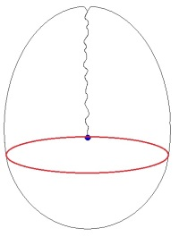 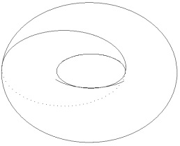

[无对应译文]

</section>

<section class="parallel-paragraph" data-paragraph-ids="s9-24-0055">

s9-24-0055

原文 · s9-24-0055

> \[b\]

[无对应译文]

</section>

<section class="parallel-paragraph" data-paragraph-ids="s9-24-0056">

s9-24-0056

原文 · s9-24-0056

C’est autour de cela que le processus de construction s’opère. Si vous n’avez pas cela, si vous considérez que la coupure b que vous faites ici, traverse *le point-trou* non pas en le contournant comme les autres coupures à un tour, mais au contraire en venant le couper ici, à la manière dont dans un tore nous pouvons considérer qu’une coupure se pro­duise ainsi, que devient cette figure ? Elle prend un autre et tout diffé­rent aspect. Voici ce qu’elle devient.

[无对应译文]

</section>

<section class="parallel-paragraph" data-paragraph-ids="s9-24-0057">

s9-24-0057

原文 · s9-24-0057

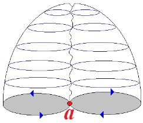

[无对应译文]

</section>

<section class="parallel-paragraph" data-paragraph-ids="s9-24-0058">

s9-24-0058

原文 · s9-24-0058

Elle devient purement et simplement *la forme la plus simplifiée* du reploiement en avant et en arrière de la surface *de la figure 5* :

[无对应译文]

</section>

<section class="parallel-paragraph" data-paragraph-ids="s9-24-0059">

s9-24-0059

原文 · s9-24-0059

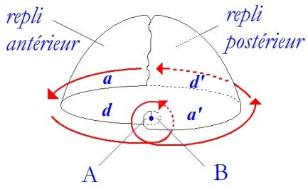 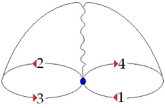

[无对应译文]

</section>

<section class="parallel-paragraph" data-paragraph-ids="s9-24-0060">

s9-24-0060

原文 · s9-24-0060

> fig.5

[无对应译文]

</section>

<section class="parallel-paragraph" data-paragraph-ids="s9-24-0061">

s9-24-0061

原文 · s9-24-0061

C’est-à-dire que ce que vous avez vu, *figure 5*, s’organiser selon une forme qui vient s’entrecroiser bord à bord selon quatre segments : le segment a venant sur le segment a’, c’est un segment qui porterait le n°1 par rapport à un autre qui porterait le n°3 par rapport à la continuité de la coupure ainsi dessinée, puis un segment n°2 avec le segment n°4.

[无对应译文]

</section>

<section class="parallel-paragraph" data-paragraph-ids="s9-24-0062">

s9-24-0062

原文 · s9-24-0062

Ici - dernière figure - vous n’avez que deux segments. Il nous faut les concevoir comme s’accolant l’un à l’autre par une complète inversion de l’un par rapport à l’autre.

[无对应译文]

</section>

<section class="parallel-paragraph" data-paragraph-ids="s9-24-0063">

s9-24-0063

原文 · s9-24-0063

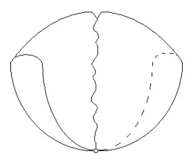

[无对应译文]

</section>

<section class="parallel-paragraph" data-paragraph-ids="s9-24-0064">

s9-24-0064

原文 · s9-24-0064

fig. 6

[无对应译文]

</section>

<section class="parallel-paragraph" data-paragraph-ids="s9-24-0065">

s9-24-0065

原文 · s9-24-0065

C’est fort difficilement visualisable, mais le fait que ce qui est d’un côté dans un sens doive se conjoindre à ce qui, de l’autre côté, est dans le sens opposé, nous montre ici la structure pure, encore que non visualisable, de *la bande de Mœbius*. La différence de ce qui se produit quand vous pratiquez cette *coupure simple* sur *le plan projectif* avec *le plan projectif* lui-même, c’est que vous perdez un des élé­ments de sa structure, vous n’en faites qu’une pure et simple *bande de Mœbius*, à ceci près que vous ne voyez nulle part apparaître ce qui est essentiel dans la struc­ture de *la bande de Mœbius*, un bord.

[无对应译文]

</section>

<section class="parallel-paragraph" data-paragraph-ids="s9-24-0066">

s9-24-0066

原文 · s9-24-0066

Or ce bord est tout à fait essentiel dans *la bande de Mœbius*. En effet, dans *la théorie des surfaces* - je ne peux pas m’y étendre de façon entièrement satisfaisante - pour déterminer des propriétés telles que *le genre, le nombre de connexions, la caractéristique*, tout ce qui fait l’intérêt de cette topologie, vous devez faire entrer en ligne de compte que *la bande de Mœbius* a un bord et n’en a qu’un, qu’elle est construite sur un trou.

[无对应译文]

</section>

<section class="parallel-paragraph" data-paragraph-ids="s9-24-0067">

s9-24-0067

原文 · s9-24-0067

Ce n’est pas pour le plaisir du paradoxe que je dis que les surfaces sont des organisations du trou. Ici donc, s’il s’agit d’une *bande de Mœbius* , cela signifie que, quoique nulle part il n’y ait lieu de le représenter, il faut bien que le trou demeure. Pour que ce soit une *bande de Mœbius* vous mettrez donc là un trou. Si petit soit-il, si punc­tiforme qu’il soit, il remplira topologiquement exactement les mêmes fonctions que celles du bord complet dans ce quelque chose que vous pouvez dessiner quand vous dessinez une *bande de Mœbius*, c’est-à-dire à peu près quelque chose comme ceci :

[无对应译文]

</section>

<section class="parallel-paragraph" data-paragraph-ids="s9-24-0068">

s9-24-0068

原文 · s9-24-0068

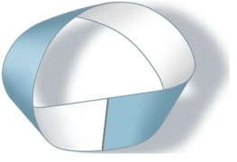

[无对应译文]

</section>

<section class="parallel-paragraph" data-paragraph-ids="s9-24-0069">

s9-24-0069

原文 · s9-24-0069

Comme je vous l’ai fait remarquer, une *bande de Mœbius* est aussi simple que cela. *Une bande de Mœbius n’a qu’un bord*. Si vous suivez son bord, vous avez fait le tour de tout ce qui est bord sur cette bande, et en fait ce n’est qu’un trou, une chose qui peut apparaître comme purement cir­culaire.

[无对应译文]

</section>

<section class="parallel-paragraph" data-paragraph-ids="s9-24-0070">

s9-24-0070

原文 · s9-24-0070

En soulignant les deux côtés, en inversant, l’un par rapport à l’autre s’accolant, il resterait qu’il serait nécessaire, pour qu’il s’agisse bien d’une *bande de Mœbius*, que nous conservions sous une forme aussi réduite que possible l’existence d’un trou. C’est bien effectivement ce qui nous indique le caractère irréductible de la fonction de ce point.

[无对应译文]

</section>

<section class="parallel-paragraph" data-paragraph-ids="s9-24-0071">

s9-24-0071

原文 · s9-24-0071

Et si nous essayons de l’articuler, de mon­trer sa fonction, nous sommes amenés, en le désignant comme point–origine de l’organisation de la surface sur *le plan projectif*, à y retrouver des propriétés qui ne sont pas complètement celles du bord de la *surface de Mœbius*, mais qui sont tout de même quelque chose qui est tellement un trou que si on entend le sup­primer par cette opération de section, par la coupure passant par ce point, c’est en tout cas un trou qu’on fait apparaître de la façon la plus incontestable.

[无对应译文]

</section>

<section class="parallel-paragraph" data-paragraph-ids="s9-24-0072">

s9-24-0072

原文 · s9-24-0072

Qu’est-ce que cela veut dire encore ?

[无对应译文]

</section>

<section class="parallel-paragraph" data-paragraph-ids="s9-24-0073">

s9-24-0073

原文 · s9-24-0073

Pour que cette surface fonctionne avec ses propriétés complètes, et particulièrement celle d’être unilatère, comme la *bande de Mœbius*, à savoir qu’un sujet infiniment plat s’y promenant peut, partant d’un point quelconque extérieur de sa surface, revenir par un chemin extrêmement court, et sans avoir à passer par aucun bord, au point *envers* de la surface dont il est parti, pour que cela puisse se produire, il faut que dans la construction de l’appareil que nous appelons *plan pro­jectif* il y ait quelque part, si réduit que vous le suppo­siez, cette sorte de fond qui est représenté ici :

[无对应译文]

</section>

<section class="parallel-paragraph" data-paragraph-ids="s9-24-0074">

s9-24-0074

原文 · s9-24-0074

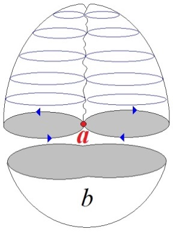

[无对应译文]

</section>

<section class="parallel-paragraph" data-paragraph-ids="s9-24-0075">

s9-24-0075

原文 · s9-24-0075

Le cul de l’appareil, la partie qui n’est pas structurée par l’entrecroisement, il doit en rester un petit morceau, si petit soit-il, sans quoi la surface devient autre chose, et nommément ne représente plus cette propriété de fonctionner comme unilatère. Une autre façon de mettre en valeur la fonction de ce point : le *cross-cap* ne peut pas se dessiner purement et simplement comme quelque chose qui serait divisé en deux par une ligne où s’entrecroiseraient les deux surfaces \[a\].

[无对应译文]

</section>

<section class="parallel-paragraph" data-paragraph-ids="s9-24-0076">

s9-24-0076

原文 · s9-24-0076

Il faut qu’il reste ici \[b\] quelque chose qui, au-delà du point, l’entoure : quelque chose comme une cir­conférence, si réduite soit-elle, une surface qui permette de faire communiquer les deux lobes supérieurs si l’on peut dire, de la surface ainsi structurée. C’est cela qui nous montre la fonction paradoxale et organisatrice du point.

[无对应译文]

</section>

<section class="parallel-paragraph" data-paragraph-ids="s9-24-0077">

s9-24-0077

原文 · s9-24-0077

- Mais ce que ceci nous permet d’articuler maintenant, c’est que *ce point est fait de l’accolement de deux bords d’une coupure,* coupure qui ne saurait elle-même d’aucune façon être retraversée, être sécable,

[无对应译文]

</section>

<section class="parallel-paragraph" data-paragraph-ids="s9-24-0078">

s9-24-0078

原文 · s9-24-0078

- coupure que vous voyez ici, à la façon dont je l’ai pour vous imagée, comme déduite de la structure de la surface, et qui est telle qu’on peut dire que si nous définissons arbitrairement quelque chose comme intérieur et comme extérieur, en mettant par exemple : en bleu sur le dessin ce qui est intérieur et en rouge ce qui est extérieur, à l’un des bords de ce point l’autre se présenterait ainsi, puisqu’il est fait d’une coupure - si minimale que vous puissiez la supposer - la surface qui vient se superposer à l’autre. Dans cette coupure privilégiée, ce qui s’affrontera sans se rejoindre ce sera un extérieur avec un intérieur, un inté­rieur avec un extérieur.

[无对应译文]

</section>

<section class="parallel-paragraph" data-paragraph-ids="s9-24-0079">

s9-24-0079

原文 · s9-24-0079

Telles sont les propriétés que je vous présente, on pour­rait exprimer cela sous une forme savante, plus formaliste, plus dialectique, sous une forme qui me paraît non seulement suffisante, mais nécessaire pour pouvoir ensuite imager la fonction que j’entends lui donner pour notre usage.

[无对应译文]

</section>

<section class="parallel-paragraph" data-paragraph-ids="s9-24-0080">

s9-24-0080

原文 · s9-24-0080

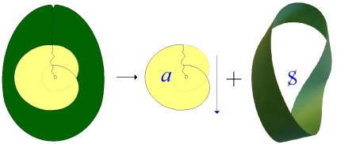

[无对应译文]

</section>

<section class="parallel-paragraph" data-paragraph-ids="s9-24-0081">

s9-24-0081

原文 · s9-24-0081

Je vous ai fait remarquer que *la double coupure* \[*huit intérieur*\] est la première forme de cou­pure qui introduise, dans *la surface* définie comme *cross-cap* du *plan* *projectif,* la première coupure, la coupure minimale qui obtienne la division de cette sur­face. Je vous ai déjà indiqué la dernière fois ce à quoi aboutissait cette division et ce qu’elle signifiait. Je vous l’ai montré dans des figures très précises que vous avez, je l’espère, toutes prises en notes, et qui consistaient à vous prouver que cette division a justement pour résultat de diviser la surface en :

[无对应译文]

</section>

<section class="parallel-paragraph" data-paragraph-ids="s9-24-0082">

s9-24-0082

原文 · s9-24-0082

1\) une *surface de Mœbius*, c’est-à-dire une surface unilatère du type de la figure que voici :

[无对应译文]

</section>

<section class="parallel-paragraph" data-paragraph-ids="s9-24-0083">

s9-24-0083

原文 · s9-24-0083

[无对应译文]

</section>

<section class="parallel-paragraph" data-paragraph-ids="s9-24-0084">

s9-24-0084

原文 · s9-24-0084

Celle–ci conserve, si l’on peut dire, en elle une partie seulement des propriétés de la surface appelée *cross-cap*, et justement cette partie particulièrement intéressante et expressive qui consiste dans la propriété unilatère, et dans celle que j’ai depuis toujours mise en valeur lorsque j’ai fait circu­ler parmi vous de petits *rubans de Mœbius* de ma fabrication, à savoir qu’il s’agit d’une surface gauche, qu’elle est - dirons-nous dans notre langage - spéculari­sable, que son image dans le miroir ne saurait lui être superposée, qu’elle est structurée par une dissymétrie foncière.

[无对应译文]

</section>

<section class="parallel-paragraph" data-paragraph-ids="s9-24-0085">

s9-24-0085

原文 · s9-24-0085

2\) Et c’est tout l’intérêt de cette structure que je vous démontre, c’est que la partie centrale au contraire :

[无对应译文]

</section>

<section class="parallel-paragraph" data-paragraph-ids="s9-24-0086">

s9-24-0086

原文 · s9-24-0086

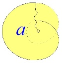

[无对应译文]

</section>

<section class="parallel-paragraph" data-paragraph-ids="s9-24-0087">

s9-24-0087

原文 · s9-24-0087

ce que nous appellerons la pièce centrale, isolée par la double coupure, tout en étant manifestement celle qui emporte avec elle la véritable structure de tout l’appareil appelé *cross-cap*. Il suffit de la regar­der, dirai-je, pour le voir, Il suffit d’imaginer que, d’une façon quelconque, se rejoignent ici les bords dans les points de correspondance qu’ils présentent visuellement, pour que soit aussitôt reconstituée la forme générale de ce *plan projectif* ou *cross-cap*.

[无对应译文]

</section>

<section class="parallel-paragraph" data-paragraph-ids="s9-24-0088">

s9-24-0088

原文 · s9-24-0088

Mais avec cette coupure, ce qui apparaît, c’est une sur­face qui a cet aspect que vous pouvez, je pense, maintenant considérer comme quelque chose qui, pour vous, arrive à une suffisante familiarité pour que vous la projetiez dans l’espace cette surface qui se traverse elle-même selon une cer­taine ligne qui s’arrête en un point.

[无对应译文]

</section>

<section class="parallel-paragraph" data-paragraph-ids="s9-24-0089">

s9-24-0089

原文 · s9-24-0089

C’est cette ligne, et c’est surtout ce point, qui donnent à la forme à double tour de cette coupure sa signification privilégiée du point de vue schématique, parce que c’est à celle-là que nous allons nous fier pour nous donner *un schéma de représentation*, schématique de ce qu’est la relation S *coupure de (a)* \[S◊*a*\], ce que nous n’arrivons pas à saisir au niveau de *la structure du tore*, à savoir de quelque chose qui nous permet d’articuler schématiquement *la structure du désir*, la structure du désir en tant que formellement nous l’avons déjà inscrite dans ce quelque chose dont nous disons qu’il nous permet de concevoir *la structure du fantasme* : S◊*a.*

[无对应译文]

</section>

<section class="parallel-paragraph" data-paragraph-ids="s9-24-0090">

s9-24-0090

原文 · s9-24-0090

Nous n’épuiserons pas aujourd’hui le sujet, mais nous essaierons d’introduire aujourd’hui pour vous que cette figure, dans sa fonction schématique, est assez exemplaire pour nous permettre de trouver la relation de S *coupure de (a)* \[S◊*a*\], la for­malisation du fantasme dans son rapport avec *quelque chose* qui s’inscrit dans ce qui est le reste de la surface dite du *plan projectif*, ou *cross-cap,* quand la pièce centrale \[*a*\] en est en quelque sorte énucléée.

[无对应译文]

</section>

<section class="parallel-paragraph" data-paragraph-ids="s9-24-0091">

s9-24-0091

原文 · s9-24-0091

Il s’agit d’une structure spécularisable, foncièrement dissymétrique, qui va nous permettre de localiser *le champ de cette dissymétrie du sujet par rapport à l’Autre*, spécialement concernant la fonction essentielle qu’y joue l’image spéculaire. Voici en effet ce dont il s’agit : *la vraie fonction imaginaire*, si l’on peut dire, en tant qu’elle intervient au niveau du *désir*, est une relation privilégiée avec *(a), objet du désir*, termes du *fantasme*. Je dis *termes* puisqu’il y en a deux, S et *(a),* liés par la fonction de la coupure. La fonction de *l’objet du fantasme*, en tant qu’il est terme de la fonction du *désir*, cette fonction est cachée.

[无对应译文]

</section>

<section class="parallel-paragraph" data-paragraph-ids="s9-24-0092">

s9-24-0092

原文 · s9-24-0092

Ce qu’il y a de plus efficient, de plus efficace dans la relation à l’objet telle que nous l’entendons dans le vocabulaire actuellement reçu de la psychanalyse, est marqué d’un voilement maximum. On peut dire que la structure libidinale, en tant qu’elle est marquée de *la fonction narcissique*, est ce qui pour nous recouvre et masque la relation à l’objet.

[无对应译文]

</section>

<section class="parallel-paragraph" data-paragraph-ids="s9-24-0093">

s9-24-0093

原文 · s9-24-0093

C’est en tant que la relation narcissique, narcissique secondaire, la relation à l’image du corps comme telle, est liée par quelque chose de structural à cette relation à l’objet qui est celle du *fantasme fondamental*, qu’elle prend tout son poids. Mais ce quelque chose de structural dont je parle est une relation de complémentaire : c’est en tant que la relation du sujet marqué du trait unaire trouve un certain appui qui est de leurre, qui est d’erreur, dans l’image du corps comme constitutive de l’identification spéculaire, qu’elle a sa relation indirecte avec ce qui se cache der­rière elle, à savoir la relation à l’objet, la relation au *fantasme fondamental*.

[无对应译文]

</section>

<section class="parallel-paragraph" data-paragraph-ids="s9-24-0094">

s9-24-0094

原文 · s9-24-0094

Il y a donc *deux imaginaires*, le vrai et le faux, et le faux ne se soutient que dans cette sorte de subsistance à laquelle restent attachés tous les mirages du « *me-connaître* ». J’ai déjà introduit ce jeu de mots « *mé-connaissance* » : le sujet se méconnaît dans la relation du miroir. Cette relation du miroir, pour être comprise comme telle, doit être située sur la base de cette relation à l’Autre qui est fondement du sujet, en tant que notre sujet est le sujet du discours, le sujet du langage.

[无对应译文]

</section>

<section class="parallel-paragraph" data-paragraph-ids="s9-24-0095">

s9-24-0095

原文 · s9-24-0095

C’est en situant ce qu’est S *coupure de (a)* \[S◊*a*\]...

[无对应译文]

</section>

<section class="parallel-paragraph" data-paragraph-ids="s9-24-0096">

s9-24-0096

原文 · s9-24-0096

> par rapport à la déficience fondamentale de l’Autre comme lieu de la parole, par rapport à ce qui est la seule réponse défini­tive au niveau de l’énonciation, le signifiant de A, du témoin universel en tant qu’il fait défaut
>
> et qu’à un moment donné il n’a plus qu’une fonction de faux témoin ...c’est en situant la fonction de *(a)* en ce point de défaillance, en montrant le support que trouve le sujet dans ce *(a)*...

[无对应译文]

</section>

<section class="parallel-paragraph" data-paragraph-ids="s9-24-0097">

s9-24-0097

原文 · s9-24-0097

> qui est ce que nous visons dans l’analyse comme objet qui n’a rien de commun
>
> avec l’objet de l’idéalisme classique, qui n’a rien de commun avec l’objet du sujet hégélien

[无对应译文]

</section>

<section class="parallel-paragraph" data-paragraph-ids="s9-24-0098">

s9-24-0098

原文 · s9-24-0098

...c’est en articulant de la façon la plus précise ce *(a)* au point de carence de l’Autre...

[无对应译文]

</section>

<section class="parallel-paragraph" data-paragraph-ids="s9-24-0099">

s9-24-0099

原文 · s9-24-0099

> qui est aussi *le point* où le sujet reçoit de cet Autre, comme lieu de la parole, sa marque majeure,
>
> celle *du trait unaire*, celle qui distingue notre sujet, de la transparence connaissante de la pensée classique, comme un sujet entièrement attaché au signifiant en tant que ce signifiant est le point tournant de son rejet,
>
> à lui le sujet, hors de toute la réa­lisation signifiante ...c’est en montrant, à partir de la formule S◊*a* comme *struc­ture du fantasme*, *la relation de cet objet(a) avec la carence de l’Autre*, *que nous voyons comment à un moment tout recule, tout s’efface dans la fonction signi­fiante devant la montée, l’irruption de cet objet.*

[无对应译文]

</section>

<section class="parallel-paragraph" data-paragraph-ids="s9-24-0100">

s9-24-0100

原文 · s9-24-0100

C’est là ce vers quoi nous pouvons nous avancer, quoique ce soit la zone la plus voilée, la plus difficile à articuler de notre expérience. Car justement nous en avons le contrôle en ceci que par ces voies qui sont celles de notre expérience, voies que nous parcourons, le plus habituellement celles du névrosé, nous avons une structure qu’il ne s’agit pas du tout de mettre ainsi sur le dos de boucs émis­saires : à ce niveau, *le névrosé*, comme *le pervers*, comme *le psychotique* lui-même, ne sont que des faces de la structure normale.

[无对应译文]

</section>

<section class="parallel-paragraph" data-paragraph-ids="s9-24-0101">

s9-24-0101

原文 · s9-24-0101

On me dit souvent après ces conférences : quand vous parlez du névrosé et de *son objet qui est la demande de l’Autre*, à moins que *sa demande ne soit l’objet de l’Autre*, que ne parlez-vous du désir normal ! Mais justement, j’en parle tout le temps :

[无对应译文]

</section>

<section class="parallel-paragraph" data-paragraph-ids="s9-24-0102">

s9-24-0102

原文 · s9-24-0102

- *Le névrosé* c’est *le normal,* en tant que pour lui l’Autre, avec un grand A, a toute l’importance.

[无对应译文]

</section>

<section class="parallel-paragraph" data-paragraph-ids="s9-24-0103">

s9-24-0103

原文 · s9-24-0103

- *Le pervers*, c’est *le normal* en tant que pour lui *le phallus*, le grand Φ, que nous allons identifier à ce point qui donne à la pièce centrale du plan projectif toute sa consistance, *le phallus* a toute l’importance.

[无对应译文]

</section>

<section class="parallel-paragraph" data-paragraph-ids="s9-24-0104">

s9-24-0104

原文 · s9-24-0104

- Pour *le psychotique* *le corps propre*, qui est à distinguer à sa place dans cette structuration du désir, *le corps propre* a toute l’importance.

[无对应译文]

</section>

<section class="parallel-paragraph" data-paragraph-ids="s9-24-0105">

s9-24-0105

原文 · s9-24-0105

Et ce ne sont que des faces où quelque chose se manifeste de cet élément de paradoxe qui est celui que je vais essayer d’articuler devant vous au niveau du désir. Déjà la dernière fois, je vous en ai donné un avant-goût, en vous montrant ce qu’il peut y avoir de distinct dans la fonction en tant qu’elle émerge du *fantasme*, c’est-à-dire de quelque chose que le sujet fomente, essaie de produire à la place aveugle, à la place masquée qui est celle dont cette pièce centrale donne le schéma.

[无对应译文]

</section>

<section class="parallel-paragraph" data-paragraph-ids="s9-24-0106">

s9-24-0106

原文 · s9-24-0106

Déjà à propos du névrosé - et précisément de l’obsessionnel - je vous indiquais comment peut se concevoir que la recherche de l’objet soit la véritable visée, dans *le fantasme obsessionnel*, de cette tentative toujours renouvelée et toujours impuissante de cette destruction de l’image spéculaire en tant que c’est elle que *l’obsessionnel* vise, qu’il sent comme obstacle à la réalisation du fantasme fon­damental.

[无对应译文]

</section>

<section class="parallel-paragraph" data-paragraph-ids="s9-24-0107">

s9-24-0107

原文 · s9-24-0107

Je vous ai montré que ceci éclaire fort bien ce qui se passe au niveau du fantasme - non point sadique - mais sadien, c’est-à-dire celui que j’ai eu l’occa­sion d’épeler devant vous, pour vous, avec vous, dans le séminaire sur l’*Éthique*[^180], pour autant que, réalisation d’une expérience intérieure qu’on ne peut entière­ment réduire aux contingences du cadre connaissable d’un effort de pensée concernant la relation du sujet à la nature, c’est dans l’injure à la nature que SADE essaie de définir l’essence du désir humain.

[无对应译文]

</section>

<section class="parallel-paragraph" data-paragraph-ids="s9-24-0108">

s9-24-0108

原文 · s9-24-0108

Et c’est bien là ce par quoi, aujourd’hui déjà, je pourrais, pour vous, introduire la dialectique dont il s’agit. Si quelque part nous pouvons encore conserver la notion de connaissance, c’est assurément hors du champ humain. Rien ne fait obstacle à ce que nous pensions - nous autres *positivistes*, *marxistes*, *tout ce que vous voudrez* - que la nature, elle, se connaît. Elle a sûrement ses préférences, elle ne prend pas, elle, n’importe quel matériau. C’est bien ce qui nous laisse depuis quelque temps le champ, nous, pour en trouver des tas d’autres, et de drôles, qu’elle avait drôlement laissés de côté ! De quelque façon qu’elle se connaisse, nous n’y voyons aucun obstacle.

[无对应译文]

</section>

<section class="parallel-paragraph" data-paragraph-ids="s9-24-0109">

s9-24-0109

原文 · s9-24-0109

Il est bien certain que tout le développement de la science, dans toutes ses branches, se fait pour nous d’une façon qui rend de plus en plus claire la notion de connaissance. La connaturalité avec quelque moyen que ce soit dans le champ naturel est ce qu’il y a de plus étranger, de tou­jours plus étranger au développement de cette science.

[无对应译文]

</section>

<section class="parallel-paragraph" data-paragraph-ids="s9-24-0110">

s9-24-0110

原文 · s9-24-0110

Est-ce que ce n’est pas justement cela qui rend si actuel que nous nous avancions dans la structure du désir telle que notre *expérience* - justement, effectivement - nous la fait sentir tous les jours ? *Le noyau du désir inconscient* et son rapport *d’orientation, d’aiman­tation* si l’on peut dire, est absolument central par rapport à tous les paradoxes de la méconnaissance humaine. Et est-ce que *son premier fondement* ne tient pas en ceci : que le désir humain est une fonction foncièrement « *acosmique* » ?

[无对应译文]

</section>

<section class="parallel-paragraph" data-paragraph-ids="s9-24-0111">

s9-24-0111

原文 · s9-24-0111

C’est pourquoi, quand j’essaie pour vous de fomenter ces images plastiques, il peut vous sembler voir une remise à jour d’anciennes techniques imaginaires qui sont celles que je vous ai appris à lire sous la forme de la sphère dans PLATON. Vous pourriez vous dire cela.

[无对应译文]

</section>

<section class="parallel-paragraph" data-paragraph-ids="s9-24-0112">

s9-24-0112

原文 · s9-24-0112

Ce petit point double, ce *poinçon* nous montre que là est le champ où se cerne ce qui est le véritable ressort du rapport entre le *possible* et le *réel*. Ce qui a fait tout le charme, toute la séduction longuement poursuivie de la logique classique, le véritable point d’intérêt de la logique formelle - j’entends celle d’ARISTOTE - c’est ce qu’elle suppose et ce qu’elle exclut et qui est vraiment son point-pivot, à savoir le point de *l’impossible* en tant qu’il est celui du *désir*. Et j’y reviendrai.

[无对应译文]

</section>

<section class="parallel-paragraph" data-paragraph-ids="s9-24-0113">

s9-24-0113

原文 · s9-24-0113

Donc vous pourriez vous dire que tout ce que je suis en train de vous expliquer là est la suite du discours précédent. C’est - laissez-moi employer cette formule - c’est des « *trucs à théo* », car en fin de compte il convient de lui donner un nom, à ce Dieu dont nous nous gargarisons un petit peu trop *romantiquement* la gorge sous cette profération que nous aurions fait un joli coup en disant que Dieu est mort.

[无对应译文]

</section>

<section class="parallel-paragraph" data-paragraph-ids="s9-24-0114">

s9-24-0114

原文 · s9-24-0114

Il y a dieux et dieux. Je vous ai déjà dit qu’il y en a qui sont tout à fait réels. Nous aurions tort d’en méconnaître la réalité. Le dieu qui est en cause, et dont nous ne pouvons pas élu­der le problème comme un problème qui est notre affaire, un problème dans lequel nous avons à prendre parti, celui-là, pour la distinction des termes, fai­sant écho à BECKETT qui l’a appelé un jour GODOT, pourquoi ne pas l’avoir appelé de son vrai nom : l’Être suprême ? Si je me souviens bien d’ailleurs, la bonne amie de ROBESPIERRE avait ce nom pour nom propre : je crois qu’elle s’appelait Catherine THÉOT.

[无对应译文]

</section>

<section class="parallel-paragraph" data-paragraph-ids="s9-24-0115">

s9-24-0115

原文 · s9-24-0115

Il est bien certain que toute une partie de l’élucidation analy­tique, et pour tout dire toute l’histoire du père dans FREUD, c’est notre contri­bution essentielle à *la fonction de Théo* dans un certain champ, très précisément dans ce champ qui trouve ses limites au bord de la double coupure, en tant que c’est elle qui détermine les caractères structurants, le noyau fondamental du fan­tasme dans la théorie comme dans la pratique.

[无对应译文]

</section>

<section class="parallel-paragraph" data-paragraph-ids="s9-24-0116">

s9-24-0116

原文 · s9-24-0116

Si quelque chose peut s’articuler qui met en balance les domaines de Théo, qui s’avèrent n’être pas si totalement réduits, ni réductibles puisque nous nous en occupons autant, à ceci près que depuis quelque temps nous en perdons, si je puis dire, l’âme, le suc et l’essentiel. On ne sait plus bien que dire, ce père semble se résorber dans une nuée de plus en plus reculée, et du même coup laisser sin­gulièrement en suspens la portée de notre pratique, qu’il y ait bien en effet là quelque corrélatif historique, il n’est pas du tout superflu que nous l’évoquions lorsqu’il s’agit de définir ce à quoi nous avons affaire dans notre domaine : je crois qu’il est temps.

[无对应译文]

</section>

<section class="parallel-paragraph" data-paragraph-ids="s9-24-0117">

s9-24-0117

原文 · s9-24-0117

Il est temps parce que déjà, sous mille formes concrétisées, articulées, cliniques et praticiennes, un certain secteur se dégage dans l’évolution de notre pratique, qui est distinct de la relation à l’Autre - grand A - comme *fon­damentale*, comme *structurante* de toute l’expérience dont nous avons trouvé les fondements dans l’inconscient.

[无对应译文]

</section>

<section class="parallel-paragraph" data-paragraph-ids="s9-24-0118">

s9-24-0118

原文 · s9-24-0118

Mais son autre pôle a toute la valeur que j’ai appelée tout à l’heure *complé­mentaire* :

[无对应译文]

</section>

<section class="parallel-paragraph" data-paragraph-ids="s9-24-0119">

s9-24-0119

原文 · s9-24-0119

- celle sans laquelle nous vaguons, je veux dire celle sans laquelle nous revenons, comme un recul, une abdication, à ce quelque chose qui a été l’éthique de l’ère théologique,

[无对应译文]

</section>

<section class="parallel-paragraph" data-paragraph-ids="s9-24-0120">

s9-24-0120

原文 · s9-24-0120

- celle dont je vous ai fait sentir les origines, certainement gardant tout leur prix, toute leur valeur, dans cette fraîcheur originelle que leur ont conservée les dialogues de PLATON.

[无对应译文]

</section>

<section class="parallel-paragraph" data-paragraph-ids="s9-24-0121">

s9-24-0121

原文 · s9-24-0121

Que voyons-nous après PLATON, si ce n’est la promotion de ce qui maintenant se perpétue sous la forme poussiéreuse de cette distinction - dont c’est véritablement un scandale qu’on puisse encore la trouver sous la plume d’un analyste - du « *moi-sujet* » et du « *moi-objet* » !

[无对应译文]

</section>

<section class="parallel-paragraph" data-paragraph-ids="s9-24-0122">

s9-24-0122

原文 · s9-24-0122

Parlez-moi du cavalier et du cheval, du dialogue de l’âme et du désir. Mais justement il s’agit de cette âme et de ce désir, ce renvoi du *désir* à *l’âme* au moment où précisément il ne s’agissait que du désir, bref, tout ce que je vous ai montré l’année dernière dans *Le Banquet*. Il s’agit de voir cette clarté plus essentielle que nous pouvons, nous, y apporter : c’est que le désir n’est pas d’un côté.

[无对应译文]

</section>

<section class="parallel-paragraph" data-paragraph-ids="s9-24-0123">

s9-24-0123

原文 · s9-24-0123

S’il a l’air d’être ce non-maniable que PLATON décrit d’une façon si pathétique, si émouvante et que l’âme supé­rieure est destinée à dominer, à captiver, bien sûr c’est qu’il y a un rapport, mais le rapport est interne, et le diviser c’est justement se laisser aller à un leurre, à un leurre qui tient à ce que cette image de l’âme - qui n’est rien d’autre que l’image centrale du narcissisme secondaire, telle que je l’ai tout à l’heure définie et sur laquelle je reviendrai - ne fonctionne que comme voie d’accès - voie d’accès leur­rante mais voie d’accès, orientée comme telle - au *désir*.

[无对应译文]

</section>

<section class="parallel-paragraph" data-paragraph-ids="s9-24-0124">

s9-24-0124

原文 · s9-24-0124

Il est certain que PLATON ne l’ignorait pas. Et ce qui rend son entreprise d’autant plus étrangement per­verse, c’est qu’il nous le masque. Car je vous parlerai du *phallus* dans sa double fonction, celle qui nous permet de le voir comme le point commun d’éversion si je puis dire, d’« évergence » - si je puis avancer ce mot comme construit à l’envers de celui de convergence - si, ce *phallus*, je pense pouvoir vous articuler d’un côté sa fonction au niveau du S du fantasme et au niveau du *(a)* que pour le *désir* il authentifie.

[无对应译文]

</section>

<section class="parallel-paragraph" data-paragraph-ids="s9-24-0125">

s9-24-0125

原文 · s9-24-0125

Dès aujourd’hui je vous indiquerai *la parenté du paradoxe* avec cette image même que vous donne ce schéma de la *figure 4* puisque ici rien d’autre *que ce point* n’assure à cette surface ainsi découpée son carac­tère de *surface unilatère*, mais le lui assure entièrement, faisant vraiment de S la coupure de *(a),* mais n’allons pas trop vite : *(a), lui* assurément, est la coupure de S.

[无对应译文]

</section>

<section class="parallel-paragraph" data-paragraph-ids="s9-24-0126">

s9-24-0126

原文 · s9-24-0126

La sorte de réalité que nous visons dans cette objectalité, ou cette objectivité, que nous sommes seuls à défi­nir, est vraiment pour nous ce qui unifie le sujet. Et qu’avons-nous vu dans le dialogue de SOCRATE avec ALCIBIADE ? Et qu’est-­ce que cette comparaison de cet homme, porté au pinacle de l’hommage pas­sionné, avec une boîte ?

[无对应译文]

</section>

<section class="parallel-paragraph" data-paragraph-ids="s9-24-0127">

s9-24-0127

原文 · s9-24-0127

Cette boîte merveilleuse, comme toujours elle a existé partout où l’homme a su se construire des objets, figures de ce qu’est pour lui *l’objet central*, celui du *fantasme fondamental*. Elle contient quoi, dit ALCIBIADE à SOCRATE ? L’ἂγαλμα \[agalma\] ! Nous commençons à *entrevoir* ce que cet ἂγαλμα \[agalma\] est quelque chose qui ne doit pas avoir un mince rapport avec ce point central qui donne son accent, sa dignité à *l’objet (a)*.

[无对应译文]

</section>

<section class="parallel-paragraph" data-paragraph-ids="s9-24-0128">

s9-24-0128

原文 · s9-24-0128

Mais les choses, en fait, sont à inverser au niveau de *l’objet*. Ce *phallus*, s’il est si paradoxalement constitué qu’il faut toujours faire très attention à ce qui est *la fonction enveloppante* et *la fonction enveloppée*, je crois que c’est plutôt *au cœur de l’*ἂγαλμα qu’ALCIBIADE cherche ce à quoi là il fait appel, en ce moment où *Le Banquet* se termine, dans *ce quelque chose* que nous sommes seuls à être capables de lire - quoique ce soit évident - puisque ce qu’il cherche, ce devant quoi il se prosterne, ce à quoi il faisait cet appel impu­dent, c’est à quoi ? SOCRATE comme désirant, dont il veut l’aveu.

[无对应译文]

</section>

<section class="parallel-paragraph" data-paragraph-ids="s9-24-0129">

s9-24-0129

原文 · s9-24-0129

*Au cœur de l’*ἂγαλμα, ce qu’il cherche dans *l’objet* se manifeste comme étant le pur ἐρῶν \[eron\], car ce qu’il veut ce n’est pas nous dire que SOCRATE est aimable, c’est nous dire que *ce qu’il a désiré le plus au monde c’est de voir* SOCRATE *désirant*.

[无对应译文]

</section>

<section class="parallel-paragraph" data-paragraph-ids="s9-24-0130">

s9-24-0130

原文 · s9-24-0130

Cette impli­cation subjective la plus radicale au cœur de l’objet lui-même du désir - où je pense que tout de même vous vous retrouvez un peu, simplement parce que vous pouvez le faire rentrer dans le vieux tiroir du désir de l’homme et du désir de l’Autre, c’est quelque chose que nous allons pouvoir pointer plus précisé­ment.

[无对应译文]

</section>

<section class="parallel-paragraph" data-paragraph-ids="s9-24-0131">

s9-24-0131

原文 · s9-24-0131

Nous voyons que ce qui l’organise, c’est la fonction ponctuelle, centrale du *phallus*. Et là, nous avons notre vieil enchanteur, pourrissant ou pas[^181], mais enchanteur assurément, celui qui sait quelque chose sur le désir, qui envoie notre ALCIBIADE sur les roses en lui disant quoi ? De s’occuper de son âme, de son *moi*, de devenir ce qu’il n’est pas, un névrosé, pour les siècles plus tard, un enfant de Théo.

[无对应译文]

</section>

<section class="parallel-paragraph" data-paragraph-ids="s9-24-0132">

s9-24-0132

原文 · s9-24-0132

Et pourquoi ? Qu’est-ce que c’est que ce renvoi de SOCRATE à un être aussi admirable qu’ALCIBIADE ? En ce que l’ἂγαλμα, c’est manifestement lui qui l’est, comme je crois l’avoir manifesté devant vous, c’est purement et mani­festement que, le *phallus*, ALCIBIADE l’est. Simplement, personne ne peut savoir *de qui il est le phallus*. Pour être *phallus* à cet état là, il faut avoir une certaine étoffe - il n’en manquait pas assurément - et les charmes de SOCRATE restent là-dessus sans prise sur ALCIBIADE, sans aucun doute.

[无对应译文]

</section>

<section class="parallel-paragraph" data-paragraph-ids="s9-24-0133">

s9-24-0133

原文 · s9-24-0133

Il passe sur les siècles qui ont suivi, de l’éthique théologique vers cette forme énigmatique et fermée, mais que *Le Banquet* pourtant nous indique au point de départ et avec tous les compléments nécessaires, à savoir qu’ALCIBIADE, manifestant son appel du désirant au cœur de l’objet privilégié, ne fait là rien d’autre que d’apparaître dans une position de séduction effrénée par rapport à celui que j’ai appelé « *le con fondamental* », que pour comble d’ironie PLATON a connoté du *nom propre* du « *Bien »* lui-même, AGATHON. Le *Bien suprême* n’a pas d’autre nom dans sa dialectique.

[无对应译文]

</section>

<section class="parallel-paragraph" data-paragraph-ids="s9-24-0134">

s9-24-0134

原文 · s9-24-0134

Est-ce qu’il n’y a pas là quelque chose qui montre suffisamment qu’il n’y a rien de nouveau dans notre recherche ? Elle retourne au point de départ pour - cette fois - comprendre tout ce qui s’est passé depuis.

[无对应译文]

</section>

<section class="note-block original-notes">

## Notes

[^180]: Séminaire1959-60 : *L’éthique*… séances des 30-03, 28-04.

[^181]: Cf. Guillaume Apollinaire : [*L’enchanteur pourrissant*](#Apollinaire).

</section>
