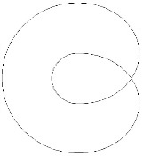
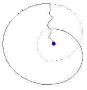
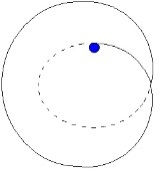
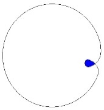

# Leçon 25 | 20 Juin 1962

  

    <label><input type="checkbox" data-lacan-toggle="original" checked> 原文</label>
    <label><input type="checkbox" data-lacan-toggle="notes" checked> 注释</label>
    <label><input type="checkbox" data-lacan-toggle="commentary" checked> 个人解读评论</label>
  

  <form class="lacan-tool-search" role="search">
    <input class="lacan-tool-search-input" type="search" placeholder="搜索全文" aria-label="搜索全文">
    <button class="lacan-tool-button" type="submit" title="搜索">搜索</button>
  </form>
  <button class="lacan-tool-button lacan-back-to-top" type="button" title="回到页面最上方" aria-label="回到页面最上方">↑</button>

<section class="parallel-paragraph" data-paragraph-ids="s9-25-0001">

s9-25-0001

原文 · s9-25-0001

Le temps approche du terme de cette année. Mon discours sur *l’identification* n’aura bien entendu pas pu épuiser son champ. Aussi bien ne puis-je éprouver là-dessus aucun sentiment de vous avoir fait défaut.

[无对应译文]

</section>

<section class="parallel-paragraph" data-paragraph-ids="s9-25-0002">

s9-25-0002

原文 · s9-25-0002

Ce champ, en effet, quelqu’un au départ s’inquiétait un peu, non sans fondement, que j’y aie choisi une thématique qui lui semblait permettre, être instrument, même pour nous, du « *tout est dans tout* ». J’ai essayé tout au contraire de vous montrer ce qui s’y attache de rigueur structurale. Je l’ai fait en partant du *deuxième mode d’iden­tification* distingué par FREUD, celui que je crois sans fausse modestie avoir rendu désormais pour vous tous, impensable sinon sous le mode de *la fonction du trait unaire*.

[无对应译文]

</section>

<section class="parallel-paragraph" data-paragraph-ids="s9-25-0003">

s9-25-0003

原文 · s9-25-0003

Le champ sur lequel je suis, depuis que j’ai introduit le signifiant du *huit inté­rieur*, est celui du *troisième mode d’identification*, cette identification où le sujet se constitue comme désir, et dans lequel tout notre discours antérieur nous évi­tait de méconnaître que le champ du désir n’est concevable pour l’homme qu’à partir de la fonction du grand Autre : le désir de l’homme se situe au lieu de l’Autre, et s’y constitue précisément comme ce mode d’identification originelle que FREUD nous apprend à séparer empiriquement - ce qui ne veut pas dire que sa pensée en ce point soit empirique - sous la forme de ce qui est donné dans notre expérience clinique, tout spécialement à propos de cette forme si manifeste de la constitution du désir qui est celle de l’hystérique.

[无对应译文]

</section>

<section class="parallel-paragraph" data-paragraph-ids="s9-25-0004">

s9-25-0004

原文 · s9-25-0004

Se contenter de dire « *il y a l’identification idéale et puis il y a l’identification du désir au désir* », cela peut aller, bien sûr, pour *un premier débroussaillage* des affaires - vous devez bien le voir - mais le texte de FREUD ne laisse pas les choses là, et ne laisse pas les choses là pour autant déjà que, dans l’intérieur des ouvrages majeurs de sa *troisième topique*, il nous montre le rapport de l’objet, qui ne peut être ici que l’objet du désir, avec la constitution de l’idéal lui-même.

[无对应译文]

</section>

<section class="parallel-paragraph" data-paragraph-ids="s9-25-0005">

s9-25-0005

原文 · s9-25-0005

Il le montre sur le plan de *l’iden­tification collective*, de ce qui est en somme une sorte de point de concours de l’expérience, par quoi l’unarité du trait si je puis dire - mon *trait unaire*, c’est ce que je voulais dire - se reflète dans l’unicité du modèle pris comme celui qui fonc­tionne dans la constitution de cet ordre de réalité collective qu’est, si l’on peut dire, la masse avec une tête, le *leader.*

[无对应译文]

</section>

<section class="parallel-paragraph" data-paragraph-ids="s9-25-0006">

s9-25-0006

原文 · s9-25-0006

Ce problème, pour local qu’il soit, est bien sans doute celui qui offrait à FREUD le meilleur terrain pour saisir lui-même, au point où il élaborait les choses au niveau de la troisième topique, quelque chose qui, pour lui, non pas d’une façon structurale mais en quelque sorte liée à une sorte de point de concours concret, ramassât les trois formes de l’identification.

[无对应译文]

</section>

<section class="parallel-paragraph" data-paragraph-ids="s9-25-0007">

s9-25-0007

原文 · s9-25-0007

Puisque aussi bien la première forme, celle qui restera en somme au bord, au terme de notre développement cette année, celle qui s’ordonne comme la pre­mière, la plus mystérieuse aussi, quoique la première en apparence portée au jour de la dialectique analytique, *l’identification au père*, est là, dans ce modèle de *l’identification au leader* de la foule, et est là en quelque sorte impliquée sans être du tout impliquée, sans être du tout incluse dans sa dimension totale, dans sa dimension entière.

[无对应译文]

</section>

<section class="parallel-paragraph" data-paragraph-ids="s9-25-0008">

s9-25-0008

原文 · s9-25-0008

*L’identification au père* fait entrer en effet en question quelque chose dont on peut dire que, lié à la tradition d’une aventure proprement *historique* au point que nous pouvons probablement *l’identifier à l’histoire elle-même*, ça ouvre un champ que nous n’avons même pas songé cette année à faire entrer dans notre intérêt, faute de devoir y être vraiment absorbé tout entier.

[无对应译文]

</section>

<section class="parallel-paragraph" data-paragraph-ids="s9-25-0009">

s9-25-0009

原文 · s9-25-0009

Prendre d’abord pour objet la première forme d’identification eût été engager tout entier notre discours sur l’identification dans les problèmes du « *Totem et tabou »,* œuvre ani­matrice pour FREUD, qu’on peut bien dire être pour lui ce qu’on peut appeler *die Sache selbst, la chose elle-même*, et dont on peut dire aussi qu’elle le restera au sens hégélien, c’est-à-dire pour autant que pour HEGEL *die Sache selbst, l’œuvre*, c’est en somme tout ce qui justifie, tout ce en quoi mérite de subsister ce sujet qui ne fut, qui ne vécut, qui ne souffrit - qu’importe - seule cette extériorisation essen­tielle, avec une *voie* par lui tracée, d’une *œuvre*, c’est bien là, en effet, ce qu’on regarde et qu’elle veut seule rester :phénomène en mouvement de la conscience.

[无对应译文]

</section>

<section class="parallel-paragraph" data-paragraph-ids="s9-25-0010">

s9-25-0010

原文 · s9-25-0010

Et sous cet angle on peut dire en effet que nous avons raison, que nous aurions tort plutôt de ne pas identifier le legs de FREUD - si c’était à son œuvre qu’il devait se limiter - au *Totem et tabou.* Car *le discours sur l’identification* que j’ai poursuivi cette année, *par ce qu’il a constitué comme appareil opératoire* - je crois que vous ne pouvez qu’en être au point de commencer à le mettre en usage - vous pouvez encore avant l’épreuve en apprécier l’importance qui ne saurait manquer d’être tout à fait décisive dans tout ce qui est pour l’instant appelé à *l’actualité d’une formulation urgente, au premier chef : le fantasme*.

[无对应译文]

</section>

<section class="parallel-paragraph" data-paragraph-ids="s9-25-0011">

s9-25-0011

原文 · s9-25-0011

Je tenais à marquer que c’était là l’étape préalable essentielle, exigeant absolument une antécédence proprement didac­tique, pour que puisse s’articuler convenablement la faille, le défaut, la perte où nous sommes pour pouvoir nous référer avec la moindre convenance à ce dont il s’agit concernant la fonction paternelle. Je fais très précisément allusion à ceci que nous pouvons qualifier comme « *l’âme de l’année* 1962 », celle où paraissent deux livres de Claude LÉVI-STRAUSS : *Le Totémisme* et *La Pensée sauvage.*

[无对应译文]

</section>

<section class="parallel-paragraph" data-paragraph-ids="s9-25-0012">

s9-25-0012

原文 · s9-25-0012

Je crois que *pas un analyste* n’en a pris connais­sance sans se sentir à la fois - pour ceux qui suivent l’enseignement d’ici - raffermi, rassuré et sans y trouver le complément. Car bien sûr il a le loisir de s’étendre en des champs, que je ne peux faire venir ici que par allusion, pour vous mon­trer le caractère radical de la constitution signifiante dans tout ce qui est, disons, de *la culture*, encore que, bien sûr - il le souligne - ce n’est pas là marquer un domaine dont la frontière soit absolue.

[无对应译文]

</section>

<section class="parallel-paragraph" data-paragraph-ids="s9-25-0013">

s9-25-0013

原文 · s9-25-0013

Mais en même temps, à l’intérieur de ses si pertinentes exhaustions du mode classificatoire - dont on peut dire que *la pen­sée sauvage* est moins instrument qu’elle n’en est en quelque sorte l’effet même - la fonction du *totem* parait entièrement réduite à ces oppositions signifiantes. Or il est clair que ceci ne saurait se résoudre, sinon d’une façon impénétrable, si nous, analystes, ne sommes pas capables d’introduire ici quelque chose qui soit *du même niveau que ce discours*, à savoir, comme ce discours, *une logique*. C’est cette *logique du désir*, cette *logique de l’objet de désir* dont je vous ai donné cette année l’instrument, en désignant l’appareil par quoi nous pouvons saisir quelque chose qui, pour être valable, ne peut qu’avoir été depuis toujours la véritable ani­mation de la logique, je veux dire là où, dans l’histoire de son progrès, elle s’est fait sentir comme quelque chose qui ouvrait à la pensée.

[无对应译文]

</section>

<section class="parallel-paragraph" data-paragraph-ids="s9-25-0014">

s9-25-0014

原文 · s9-25-0014

Il n’en reste pas moins que, ce ressort secret peut être resté masqué, que logique elle n’intéressât, elle n’impliquât, le mouvement de ce monde - qui n’est pas rien : on l’appelle *monde de la pensée -* dans une certaine direction qui, pour être centrifuge, n’en était pas moins tout de même déterminée par quelque chose qui se rapportait à un certain type d’objet qui est celui auquel nous nous intéressons pour l’instant. Ce que j’ai défini la dernière fois comme « *le point* », le point Φ dans une certaine façon nouvelle de délimiter le cercle de connotation de l’objet, c’est ce qui nous met au seuil d’avoir, avant de vous quitter cette année, à poser la fonction de ce point Φ, *ambigu* vous ai-je dit, non pas seulement dans la médiation, mais dans la constitution, l’une à l’autre inhérentes - non seulement comme l’envers vaudrait l’endroit, mais comme un envers vous ai-je dit, qui serait la même chose que l’endroit - du S et du *(a)* dans *le fantasme* \[S◊*a*\] :

[无对应译文]

</section>

<section class="parallel-paragraph" data-paragraph-ids="s9-25-0015">

s9-25-0015

原文 · s9-25-0015

- dans la recon­naissance de ce qu’est l’objet du désir humain à partir du désir,

[无对应译文]

</section>

<section class="parallel-paragraph" data-paragraph-ids="s9-25-0016">

s9-25-0016

原文 · s9-25-0016

- dans la reconnais­sance de ce pourquoi dans le désir le sujet n’est rien d’autre que la coupure de cet objet.

[无对应译文]

</section>

<section class="parallel-paragraph" data-paragraph-ids="s9-25-0017">

s9-25-0017

原文 · s9-25-0017

Et comment l’histoire individuelle - ce *sujet discourant* où cet individu n’est que compris - est orientée, polarisée par ce point secret et peut-être au dernier terme jamais accessible, si tant est qu’il faille admettre avec FREUD, pour un temps du moins, dans l’irréductibilité d’une *Urverdrängung,* l’existence de cet «* ombilic du désir dans le rêve *» dont il parle dans la *Traumdeutung* [^182]. C’est cela dont nous ne pouvons omettre la fonction dans toute appréciation des termes dans lesquels nous décomposons les faces de ce *phénomène nucléaire*.

[无对应译文]

</section>

<section class="parallel-paragraph" data-paragraph-ids="s9-25-0018">

s9-25-0018

原文 · s9-25-0018

C’est pourquoi, avant de rejoindre la clinique, trop facile toujours à nous remettre dans les ornières de vérités dont nous nous accommodons fort bien à l’état voilé, à savoir : qu’est-ce que l’objet du désir pour le névrosé, ou encore pour le pervers, ou encore pour le psychotique ?

[无对应译文]

</section>

<section class="parallel-paragraph" data-paragraph-ids="s9-25-0019">

s9-25-0019

原文 · s9-25-0019

Ce n’est pas cela, cet échan­tillonnage, cette diversité des couleurs qui ne servira jamais qu’à nous faire perdre des cartes qui sont intéressantes. « *Deviens ce que tu es* », dit la formule de la tradition classique. C’est possible, vœu pieux. Ce qui est assuré, c’est que *tu deviens ce que tu méconnais*. La façon dont le sujet méconnaît *les termes, les éléments et les fonctions* entre lesquels se joue le sort du désir, pour autant pré­cisément que quelque part lui en apparaît sous une forme dévoilée un de ses termes, c’est cela par quoi chacun de ceux que nous avons nommés *névrosés*, *per­vers* et *psychotiques*, est normal.

[无对应译文]

</section>

<section class="parallel-paragraph" data-paragraph-ids="s9-25-0020">

s9-25-0020

原文 · s9-25-0020

*Le psychotique* est normal dans sa psychose et pas ailleurs, parce que le psychotique *dans le désir a affaire au corps*. *Le pervers* est normal dans sa perversion, parce qu’il *a affaire* dans sa variété *au phallus*. Et *le névrosé* par ce qu’il *a affaire à l’Autre*, le grand Autre comme tel.

[无对应译文]

</section>

<section class="parallel-paragraph" data-paragraph-ids="s9-25-0021">

s9-25-0021

原文 · s9-25-0021

C’est en cela qu’ils sont normaux, parce que ce sont les trois termes normaux de la constitu­tion du *désir*. Ces *trois termes* bien sûr sont toujours présents. Pour l’instant, il ne s’agit pas qu’ils soient dans un quelconque de ces sujets, mais ici, *dans la théo­rie*. C’est pour cela que je ne peux pas avancer en ligne droite : c’est qu’il me vient à chaque pas le besoin de refaire avec vous le point, non pas tant dans un tel souci que vous me compreniez : « *Tenez-vous tellement à ce qu’on vous comprenne ?* », me dit-on de temps en temps : ce sont des *amabilités* que j’entends dans mes analyses. Évidement, oui ! Mais ce qui fait la difficulté, c’est que la sorte de nécessité de notre discours ici, c’est de vous faire voir que *dans ce dis­cours*, *vous y êtes compris*. C’est à partir de là qu’il peut être trompeur, parce que vous y êtes compris de toute façon.

[无对应译文]

</section>

<section class="parallel-paragraph" data-paragraph-ids="s9-25-0022">

s9-25-0022

原文 · s9-25-0022

Et l’erreur peut venir uniquement de la façon dont vous concevez que vous y êtes compris. J’ai été frappé, à lire, hier matin, à l’heure où la grève de l’électricité n’était pas encore commencée, le tra­vail d’un de mes élèves[^183] sur le fantasme : mon Dieu, pas mauvais. Bien sûr ça n’est pas encore la mise en action des appareils dont j’ai parlé, mais enfin, la seule col­lation des passages de FREUD où il parle du fantasme de façon absolument géniale...

[无对应译文]

</section>

<section class="parallel-paragraph" data-paragraph-ids="s9-25-0023">

s9-25-0023

原文 · s9-25-0023

Quand on se demande *quelle pertinence*, en l’absence de tout ce qu’on peut dire que ces ouvertures ont conditionnée depuis d’où la première formulation peut avoir trouvé cette pertinence pour rester en quelque sorte maintenant mar­quée du poinçon même qui est celui que j’essaie d’isoler des choses ?

[无对应译文]

</section>

<section class="parallel-paragraph" data-paragraph-ids="s9-25-0024">

s9-25-0024

原文 · s9-25-0024

Cette pul­sion qui se fait sentir de l’intérieur du corps, ces schémas tout entiers structurés de ces prévalences topologiques, il n’y a que là-dessus qu’est l’accent : comment définir ce qui fonctionne *de l’arrivée de l’extérieur et de l’arrivée de l’intérieur* ? Quelle incroyable vocation de platitude a-t-il fallu, dans ce qu’on peut appeler la mentalité de la communauté analytique, pour croire que c’est la référence à ce qu’on appelle *l’instance biologique* !

[无对应译文]

</section>

<section class="parallel-paragraph" data-paragraph-ids="s9-25-0025">

s9-25-0025

原文 · s9-25-0025

Non pas que je sois en train de dire qu’un corps, un corps vivant - je ne suis pas en train de badiner - ça ne soit pas une réalité biologique, seulement le faire fonctionner *dans la topologie freudienne* comme topologie, et y voir je ne sais quel biologisme qui serait radical, inaugu­ral, coextensif de la fonction de la pulsion, c’est ce qui fait là toute l’ampleur, toute la béance de ce qu’on appelle un contresens, un contresens absolument manifeste dans les faits, à savoir que, comme il n’y a pas besoin de le faire remar­quer, jusqu’à nouvel ordre, c’est-à-dire jusqu’à la révision que nous attendons dans la biologie, il n’y a pas eu trace d’une *découverte biologique*, ni même *physiolo­gique*, ni même *esthésiologique*, qui ait été faite par la voie de l’analyse - « *esthé­siologique »* cela veut dire *une découverte sensorielle* - quelque chose qu’on aurait pu trouver de nouveau dans la façon de *sentir les choses*.

[无对应译文]

</section>

<section class="parallel-paragraph" data-paragraph-ids="s9-25-0026">

s9-25-0026

原文 · s9-25-0026

Ce qui fait contresens, c’est très clair à définir : c’est que le rapport de la pulsion au corps est partout marqué dans FREUD, topologiquement. Cela n’a pas la même valeur de renvoi, l’idée d’une direction, qu’une découverte d’une *recherche biologique*. Il est bien certain que ce « *qu’est-ce qu’un corps ?* », vous le savez, ce n’est même pas une idée ébauchée dans le consensus du monde philosophant, au moment où FREUD ébauche sa première topique.

[无对应译文]

</section>

<section class="parallel-paragraph" data-paragraph-ids="s9-25-0027">

s9-25-0027

原文 · s9-25-0027

Toute la notion du *Dasein* est posté­rieure et construite pour nous donner, si je puis dire, l’idée primitive qu’on peut avoir de ce que c’est qu’un corps comme d’un « *là* », constituant de certaines *dimen­sions de présence*... et je ne vais pas vous refaire HEIDEGGER, parce que si je vous en parle, c’est que bientôt vous allez avoir ce texte[^184] dont je vous ai dit qu’il est facile, vous le prendrez au mot. En tout cas, la facilité avec laquelle nous le lisons maintenant prouve bien que ce qu’il a lancé dans le courant des choses est bel et bien en circulation ...*ces dimensions de présence*, de quelque façon qu’on les appelle : *le Mitsein, ce là-être*, et tout ce que vous voudrez, *In-der-Welt-sein,* toutes *les mondanéités* si différentes et si *distinctes,* car il s’agit justement de les distinguer *de l’espace* : *latum, longum* et *profundum,* lequel, on n’a pas de peine à nous montrer que ce n’est là que *l’abstraction de l’objet*, et parce que aussi bien cela se propose comme tel dans ce DESCARTES que j’ai mis cette année au début de notre exposé : *l’abstraction de l’objet* comme subsistant, c’est-à-dire déjà ordonné dans un monde qui n’est pas simplement un monde de *cohérence*, de *consistance*, mais énucléé de *l’objet du désir* comme tel.

[无对应译文]

</section>

<section class="parallel-paragraph" data-paragraph-ids="s9-25-0028">

s9-25-0028

原文 · s9-25-0028

Oui, tout ceci fait dans HEIDEGGER d’admirables irruptions dans notre monde mental. Laissez-moi vous dire que s’il y a des gens pour devoir n’en être, à aucun degré, satisfaits, ce sont les psychanalystes, c’est moi.

[无对应译文]

</section>

<section class="parallel-paragraph" data-paragraph-ids="s9-25-0029">

s9-25-0029

原文 · s9-25-0029

Cette référence, *sans doute suggestive*, à ce que j’appellerai - n’y voyez aucune espèce de tentative de rabaisser ce dont il s’agit - « *une praxis artisanale* », fondement de l’objet-ustensile, comme découvrant assurément au plus haut degré ces premières dimensions de *la présence* si subti­lement détachées que sont la proximité, l’éloignement, comme constituant les premiers linéaments de ce monde, HEIDEGGER le doit beaucoup - il me l’a dit à moi-même - au fait que son père fut tonnelier.

[无对应译文]

</section>

<section class="parallel-paragraph" data-paragraph-ids="s9-25-0030">

s9-25-0030

原文 · s9-25-0030

Certes, tout cela nous découvre quelque chose à quoi la présence a éminemment à faire, et à quoi nous nous accrocherions bien plus passionnément à poser la question de savoir ce qu’a de commun *tout instrument*, la cuiller primitive, la première façon de puiser, de retirer quelque chose au courant des choses, qu’est-ce qu’elle a à voir *avec l’ins­trument du signifiant* ?

[无对应译文]

</section>

<section class="parallel-paragraph" data-paragraph-ids="s9-25-0031">

s9-25-0031

原文 · s9-25-0031

Mais en fin de compte, tout n’est-il pas pour nous dès l’abord *décentré* ? Si cela a un sens, ce que FREUD apporte, à savoir : qu’au cœur de la constitution de tout objet il y a *la libido,* si cela a un sens, cela veut dire que *la libido* ne soit pas simplement *le surplus de notre présence praxique dans le monde*, ce qui est la thématique depuis toujours, et ce que HEIDEGGER ramène.

[无对应译文]

</section>

<section class="parallel-paragraph" data-paragraph-ids="s9-25-0032">

s9-25-0032

原文 · s9-25-0032

Car si la *Sorge* est *le souci*, l’occupation, est ce qui caractérise cette présence de l’homme dans le monde, cela veut dire que quand le souci se relâche un peu, on commence à bai­ser, ce qui, comme vous le savez, est l’enseignement par exemple de quelqu’un, que je choisis là vraiment sans aucun scrupule et dans un esprit de polémique car c’est un ami : monsieur ALEXANDER.

[无对应译文]

</section>

<section class="parallel-paragraph" data-paragraph-ids="s9-25-0033">

s9-25-0033

原文 · s9-25-0033

Monsieur ALEXANDER[^185] a d’ailleurs sa place fort honorable dans ce concert, simplement un peu cacophonique, qu’on peut appe­ler la *discussion théorique* dans la société psychanalytique américaine. Il a sa place de plein droit, parce qu’il est évident que cela serait un peu fort qu’on pût se permettre, dans une *société* aussi *importante* et *officiellement* constituée que cette Association américaine, de rejeter ce qui coïncide vraiment aussi bien avec les idéaux, avec la pratique d’une aire, qu’on appelle culturelle, déterminée.

[无对应译文]

</section>

<section class="parallel-paragraph" data-paragraph-ids="s9-25-0034">

s9-25-0034

原文 · s9-25-0034

Mais enfin il est clair que même d’ébaucher une théorie du fonctionnement libidinal comme étant constitué avec la part de surplus d’une certaine énergie - de quelque façon que nous la catégorisions, énergie de survivance ou autre - c’est absolument nier toute la valeur, non pas simplement noétique, mais la raison d’être de notre fonction de thérapeute, telle que nous en définissons les termes et la visée.

[无对应译文]

</section>

<section class="parallel-paragraph" data-paragraph-ids="s9-25-0035">

s9-25-0035

原文 · s9-25-0035

Que dans l’ensemble pratiquement nous nous accommodions fort bien, nous faisions fort bien notre affaire de ramener les gens à la leur d’affaire, bien sûr, seulement ce qu’il y a de certain c’est que même quand nous épinglons ce résultat sous la forme de succès thérapeutique, nous savons au moins ceci, de deux choses l’une :

[无对应译文]

</section>

<section class="parallel-paragraph" data-paragraph-ids="s9-25-0036">

s9-25-0036

原文 · s9-25-0036

- ou que nous l’avons fait en-dehors de toute espèce de voie proprement analytique, et alors que ce qui clochait au cœur de l’affaire, car c’est de cela qu’il s’agit, cloche toujours,

[无对应译文]

</section>

<section class="parallel-paragraph" data-paragraph-ids="s9-25-0037">

s9-25-0037

原文 · s9-25-0037

- ou bien que si nous sommes là parvenus, c’est juste­ment dans toute la mesure - qui n’est là que le *b-a, ba* de ce qu’on nous enseigne, où nous n’avons pas cherché, d’aucune façon, à régler l’affaire, mais nous avons visé ailleurs, vers ce qui clochait, ce qui touchait, au centre, le nœud libidinal.

[无对应译文]

</section>

<section class="parallel-paragraph" data-paragraph-ids="s9-25-0038">

s9-25-0038

原文 · s9-25-0038

C’est pour cela que tout résultat sanctionnable dans le sens de l’adap­tation... je m’excuse, je fais là un petit détour par des banalités, mais il y a des banalités qu’il faut tout de même rappeler, surtout qu’après tout, rappelées d’une certaine façon, les banalités peuvent quelquefois passer pour peu banales ...tout succès thérapeutique, c’est-à-dire ramener les gens au bien-être de leur *Sorge,* de leurs petites affaires, est toujours pour nous, plus ou moins - dans le fond nous le savons, c’est pour cela que nous n’avons pas à nous en vanter - un pis-aller, un alibi, un détournement de fonds, si je puis m’exprimer ainsi.

[无对应译文]

</section>

<section class="parallel-paragraph" data-paragraph-ids="s9-25-0039">

s9-25-0039

原文 · s9-25-0039

En fait ce qui est encore bien plus grave, c’est que nous nous interdisons de faire mieux, tout en sachant que cette action qui est la nôtre, dont nous pouvons nous van­ter de temps en temps comme d’une réussite, est faite par des voies qui ne concernent pas le résultat. Grâce à ces voies nous apportons, dans un lieu complémentaire qu’elles ne concernent pas, si ce n’est par retentissement, des retouches, c’est le maximum de ce qu’on peut dire.

[无对应译文]

</section>

<section class="parallel-paragraph" data-paragraph-ids="s9-25-0040">

s9-25-0040

原文 · s9-25-0040

Quand est-ce qu’il nous arrive de replacer un sujet dans son désir ? C’est une question que je pose à ceux qui ici ont quelque expérience comme analystes, évi­demment pas aux autres. Est-il concevable qu’une analyse ait pour résultat de faire entrer un sujet *en désir*, comme on dit entrer *en transe, en rut*, ou *en reli­gion* ?

[无对应译文]

</section>

<section class="parallel-paragraph" data-paragraph-ids="s9-25-0041">

s9-25-0041

原文 · s9-25-0041

C’est bien pour cela que je me permets de poser la question en un point local, le seul en fin de compte qui soit décisif, parce que nous ne sommes pas des apôtres, c’est : si cette question ne mérite pas d’être préservée quand il s’agit des analystes ? Car pour les autres, le problème posé, c’est : qu’est-ce que c’est que le désir de l’analyste, pour qu’il puisse subsister, persister, dans cette position paradoxale ?

[无对应译文]

</section>

<section class="parallel-paragraph" data-paragraph-ids="s9-25-0042">

s9-25-0042

原文 · s9-25-0042

Car enfin il est bien clair que d’aucune façon je n’émets de vœu par là que l’effet de l’analyse aille rejoindre celui rempli depuis toujours par les sectes mystiques dont les opé­rations fameuses - sans doute trompeuses, souvent douteuses, en tout les cas la plupart du temps - ne sont pas ce à quoi je vous demande spécialement de vous intéresser, si ce n’est quand même pour les situer comme occupant cette place globale d’amener le sujet sur un champ qui n’est pas autre chose que le champ de son désir.

[无对应译文]

</section>

<section class="parallel-paragraph" data-paragraph-ids="s9-25-0043">

s9-25-0043

原文 · s9-25-0043

Et pour tout dire, passant mon dernier week-end par une série de rebondis­sements, à essayer de voir le sens de quelques mots de la technique mystique musulmane, j’avais ouvert ces choses que je pratiquais en un temps, comme tout le monde. Qui n’a pas un petit peu regardé ces indigestes et assommants bou­quins d’*hindouisme*, de *philosophie* de je ne sais quelle ascèse, qui nous sont donnés dans une terminologie poussiéreuse et en général incomprise, je dirais d’autant mieux comprise que le transcripteur est plus bête !

[无对应译文]

</section>

<section class="parallel-paragraph" data-paragraph-ids="s9-25-0044">

s9-25-0044

原文 · s9-25-0044

C’est pour cela que *ce sont les travaux anglais* qui sont les meilleurs. Ne lisez surtout pas *les travaux allemands*, je vous en prie, ils sont tellement intelligents que cela se transforme immédiatement en SCHOPENHAUER.

[无对应译文]

</section>

<section class="parallel-paragraph" data-paragraph-ids="s9-25-0045">

s9-25-0045

原文 · s9-25-0045

Et puis il y a René GUÉNON, dont je parle parce que c’est un curieux lieu géo­métrique. Je vois, au nombre de sourires, la proportion de pécheurs ! Je vous jure qu’à un moment, au début de ce siècle dont je fais partie - je ne sais si cela conti­nue, mais je vois que ce nom n’est pas inconnu, donc cela doit continuer - toute la diplomatie française trouvait dans René GUÉNON - cet imbécile - son *maître à penser*. Vous voyez le résultat !

[无对应译文]

</section>

<section class="parallel-paragraph" data-paragraph-ids="s9-25-0046">

s9-25-0046

原文 · s9-25-0046

Il est impossible d’ouvrir un de ses ouvrages, sans y trouver vraiment rien à frire car ce qu’il dit toujours, c’est qu’il doit la boucler. Ceci a un charme probablement absolument inextinguible, car le résultat c’est que grâce à cela, toutes sortes de gens, qui probablement n’avaient pas grand chose à faire, comme disait BRIAND : « *Vous savez bien* *que nous n’avons pas de politique extérieure, car le diplomate doit être dans une atmosphère un peu irrespirable.* » Eh bien, cela les a aidés à rester dans leur petite carapace.

[无对应译文]

</section>

<section class="parallel-paragraph" data-paragraph-ids="s9-25-0047">

s9-25-0047

原文 · s9-25-0047

Bref, tout cela n’est pas pour vous diriger sur l’hindouisme, mais quand même, puisque je me trouve, je ne peux pas dire *à relire* parce que je ne les ai jamais lus, les textes hindous, et comme je vous le dis, c’est toujours fort déce­vant dès l’abord. Mais je viens de revoir retranscrites, rapprochées, des choses beaucoup plus accessibles de *la technique mystique musulmane*, par quelqu’un de merveilleusement intelligent, quoique présentant toutes les apparences de la folie, qui s’appelle Monsieur Louis [MASSIGNON](http://fr.wikipedia.org/wiki/Louis_Massignon). Je dis « les *apparences* »...

[无对应译文]

</section>

<section class="parallel-paragraph" data-paragraph-ids="s9-25-0048">

s9-25-0048

原文 · s9-25-0048

Et se référant au *bouddhi*, à propos d’élucidation de ces termes, le point qu’il met en valeur de la fonction terme... je veux dire que c’est l’avant dernier seuil à fran­chir avant la libération cherchée[^186] devant l’ascèse hindoue, la fonction qu’il donne au *bouddhi* comme l’objet, car c’est cela que cela veut dire, qui bien entendu n’est écrit nulle part, sauf dans ce texte de MASSIGNON, où il en trouve *l’équivalence* avec le MANSÛR[^187] de la mystique shî’ite ...la fonction de l’objet comme étant le point tournant, indispensable, de cette concentration, pour en venir à des termes métaphoriques de la réalisation subjective dont il s’agit, qui n’est en fin de compte que l’accès à ce champ du désir que nous pou­vons appeler le désirant tout court. Et quel est-il, ce désirant ?

[无对应译文]

</section>

<section class="parallel-paragraph" data-paragraph-ids="s9-25-0049">

s9-25-0049

原文 · s9-25-0049

Il est bien sûr que ceux qui sont les officiants du domaine, déjà bien constitué, que j’ai appelé la dernière fois celui de *Theo*, d’où naturellement la suspicion, l’exclusion, l’odeur de soufre dont est environnée, dans toutes les religions, *l’ascèse mys­tique*. Quoi qu’il en soit le rapport articulé, à ce stade, au stade qu’on peut appe­ler d’achèvement de l’*involution*, de l’*assomption*, du sujet dans un objet - choisi d’ailleurs par les techniques mystiques avec un ordre très arbitraire, ça peut être une femme, ça peut être *un bouchon de carafe* - me paraissait coïn­cider parfaitement avec la formule S◊*a* telle que je vous la formule comme don­née, comme formalisation, la plus simple qu’il nous soit permis d’atteindre au contact des diverses formes de la clinique, c’est-à-dire parce qu’il est nécessaire de présumer de la structure de ce point central telle que nous pouvons la construire - le terme est de FREUD - et telle que nous devons la construire nécessairement, pour rendre compte des ambiguïtés de ses effets.

[无对应译文]

</section>

<section class="parallel-paragraph" data-paragraph-ids="s9-25-0050">

s9-25-0050

原文 · s9-25-0050

Le travail auquel je faisais allusion tout à l’heure[^188], que j’ai lu hier matin, s’atta­chait à reprendre - il faut bien que les choses se digèrent - un chapitre que j’avais traité depuis longtemps, à savoir la structure de *L’homme aux loups*, à la lumière spécialement de *la structure du fantasme*. La chose est tout à fait bien cernée dans ce travail. Toutefois, par rapport aux premières formulations, celles que j’ai faites avant de vous avoir apporté les récents appareils, elle marque peu de gain, mais elle me désigne en quel point après tout vous me suivez, ce que je puis ici vous montrer comme lieu à franchir.

[无对应译文]

</section>

<section class="parallel-paragraph" data-paragraph-ids="s9-25-0051">

s9-25-0051

原文 · s9-25-0051

Reprenons donc, simplement pour le pointer - ce n’est pas une critique - ce travail. Il y en aurait bien d’autres à faire, et il faudrait que vous le connaissiez, qu’il soit diffusé, ce que je trouverais souhaitable. La définition logique de *l’objet*, que je me permets d’appe­ler lacanien en l’occasion, car ce n’est pas la même chose que de parler de lacanisme exécré, de *l’objet du désir*, *sa fonction logique, à cet objet, ne tient*... c’est ce que désigne la nouveauté du petit cercle :

[无对应译文]

</section>

<section class="parallel-paragraph" data-paragraph-ids="s9-25-0052">

s9-25-0052

原文 · s9-25-0052

> 

[无对应译文]

</section>

<section class="parallel-paragraph" data-paragraph-ids="s9-25-0053">

s9-25-0053

原文 · s9-25-0053

dont je vous apprends à le cer­ner en vous disant qu’il est essentiellement constitué par la présence de ce point qui est là soit dans son *champ cen­tral* \[1\], soit à la limite de ce *champ* \[2\] , voire ici \[3\], car ces trois cas sont les mêmes, comme réduction dernière du *champ*

[无对应译文]

</section>

<section class="parallel-paragraph" data-paragraph-ids="s9-25-0054">

s9-25-0054

原文 · s9-25-0054

  

[无对应译文]

</section>

<section class="parallel-paragraph" data-paragraph-ids="s9-25-0055">

s9-25-0055

原文 · s9-25-0055

> \[1\] \[2\] \[3\]

[无对应译文]

</section>

<section class="parallel-paragraph" data-paragraph-ids="s9-25-0056">

s9-25-0056

原文 · s9-25-0056

…*sa fonction logique ne tient* ni à son extension, ni à sa com­préhension, car son extension, si l’on peut désigner quelque chose de ce terme, tient en la fonction structu­rante du point. Plus il est, si je puis dire, « *punctiforme* » ce champ, plus il y a d’effets, et ces effets sont, si l’on peut dire, d’inversion. À la lumière de ce principe, il n’y a pas de problème concernant ce que FREUD nous a fourni comme reproduction du fantasme de *L’homme aux loups* [^189].Vous connaissez cet arbre, ce grand arbre, et les loups - qui ne sont absolument pas des loups - perchés sur cet arbre, au nombre de *cinq* alors qu’ailleurs on parle de *sept.*

[无对应译文]

</section>

<section class="parallel-paragraph" data-paragraph-ids="s9-25-0057">

s9-25-0057

原文 · s9-25-0057

[无对应译文]

</section>

<section class="parallel-paragraph" data-paragraph-ids="s9-25-0058">

s9-25-0058

原文 · s9-25-0058

Si nous avions besoin d’une image exemplaire de ce que c’est que *(a)*, à la limite du champ \[2\], quand sa radicalité phallique se manifeste par une sorte de singularité comme accessible, là où seulement elle peut nous apparaître, c’est-­à-dire quand elle approche, ou qu’elle peut s’approcher du champ externe \[3\], du champ de ce qui peut se réfléchir, du champ de ce dans quoi une symétrie peut permettre *l’erreur spéculaire*, nous l’avons là.

[无对应译文]

</section>

<section class="parallel-paragraph" data-paragraph-ids="s9-25-0059">

s9-25-0059

原文 · s9-25-0059

Car il est clair, à la fois que cela n’est pas, bien sûr, l’image spéculaire de *L’Homme aux loups* qui est là devant lui, et que pourtant - nous l’avons marqué d’ailleurs depuis assez longtemps pour que cela ne soit pas une nouveauté pour l’auteur du travail dont je parle - c’est l’image même de ce moment que vit le sujet comme scène primitive.

[无对应译文]

</section>

<section class="parallel-paragraph" data-paragraph-ids="s9-25-0060">

s9-25-0060

原文 · s9-25-0060

Je veux dire que c’est la structure même du sujet devant cette scène. Je veux dire que, devant cette scène, le sujet se fait *loup regardant*, et se fait *cinq loups regardant*. Ce qui s’ouvre subitement à lui dans cette nuit de Noël, c’est le retour de ce qu’il est, lui, essen­tiellement, dans le fantasme fondamental. Sans doute la scène elle-même dont il s’agit est-elle voilée \- nous reviendrons tout à l’heure sur ce voile - de ce qu’il voit n’émerge que ce « V » *battant en ailes de papillon* des jambes ouvertes de sa mère, ou le « V » *romain* de l’heure d’horloge, ce *cinq heures* du chaud été où semble s’être pro­duite la rencontre.

[无对应译文]

</section>

<section class="parallel-paragraph" data-paragraph-ids="s9-25-0061">

s9-25-0061

原文 · s9-25-0061

Mais l’important, c’est que ce qu’il voit dans son fantasme, c’est S lui-même en tant qu’il est coupure de *(a)* \[S◊*a*\]. Les *(a)*, ce sont *les loups*. Et si j’y passe aujourd’hui, c’est parce qu’à côté d’un discours difficile, abs­trait - et que je désespère de pouvoir porter, dans les limites où nous sommes, jusqu’à ses derniers détails - cet *objet du désir* s’illustre ici d’une façon qui me permet d’accéder tout de suite à des éléments concrets de structure, que j’aurais des façons plus déductives de vous exposer, mais je n’ai pas le temps et je passe par là.

[无对应译文]

</section>

<section class="parallel-paragraph" data-paragraph-ids="s9-25-0062">

s9-25-0062

原文 · s9-25-0062

Cet *objet non spéculaire* qu’est *l’objet du désir*, cet *objet* qui peut se trou­ver à cette zone frontière en fonction d’images du sujet, disons pour aller plus vite - quoique j’aie là des risques de confusion - dans le miroir que constitue le grand Autre, disons dans l’espace développé par le grand Autre, car il faut reti­rer ce miroir si ce n’est pour en faire alors cette sorte de *miroir*, qu’on appelle - sans doute non par hasard -*de sorcière* , je veux dire ces miroirs avec une certaine *concavité*, qui en comportent à leur intérieur un certain nombre d’autres, concentriques, dans lesquels vous voyez *votre propre image reflétée autant de fois* qu’il y a de ces miroirs dans le grand.

[无对应译文]

</section>

<section class="parallel-paragraph" data-paragraph-ids="s9-25-0063">

s9-25-0063

原文 · s9-25-0063

C’est que c’est bien là ce qui se passe : vous avez, pré­sent dans le fantasme, ce qui n’est peut-être définissable, accessible, que par les voies de notre expérience, ou peut-être - je n’en sais rien, je m’en soucie peu au reste - par les voies des expériences auxquelles j’ai fait allusion tout à l’heure : ce qui est de la nature de *l’objet du désir*.

[无对应译文]

</section>

<section class="parallel-paragraph" data-paragraph-ids="s9-25-0064">

s9-25-0064

原文 · s9-25-0064

Et ceci est intéressant parce que c’est une référence logique : *l’objet* connoté, cerné par les cercles d’EULER, est *l’objet* de cette fonction qu’on appelle « *la classe* ». Je vous montrerai son rapport étroit, structural avec la fonction de *la privation*, je veux dire le premier de ces trois termes que j’ai articulés comme *privation-frustration-castration*. Seulement, ce qui voile complètement la véritable fonction de *la privation*...

[无对应译文]

</section>

<section class="parallel-paragraph" data-paragraph-ids="s9-25-0065">

s9-25-0065

原文 · s9-25-0065

Encore qu’on puisse l’aborder : c’est de là que je suis parti pour vous faire le schéma des *propositions universelle* et *particulière*. Rappelez-vous, quand je vous ai dit : « *tout professeur est lettré* » \[cf. supra 17-01\], cela ne veut pas dire qu’il n’y a qu’un seul professeur. La chose est toujours véridique pour autant. Le ressort de la priva­tion, de la privation comme *trait unaire*, comme constituant de la fonction de *la classe*, est là suffisamment indiqué.

[无对应译文]

</section>

<section class="parallel-paragraph" data-paragraph-ids="s9-25-0066">

s9-25-0066

原文 · s9-25-0066

Mais telle est la fonction de la dialec­tique, de la raison dialec­tique n’en déplaise à Monsieur LÉVI-STRAUSS[^190] qui croit qu’elle n’est qu’un cas par­ticulier de la raison analytique, c’est que justement elle ne permet de saisir ses stades sauvages qu’à partir de ses stades élaborés. Or ce n’est pas pour dire que la *logique des classes* soit l’état *sauvage* de la *logique de l’objet du désir*.

[无对应译文]

</section>

<section class="parallel-paragraph" data-paragraph-ids="s9-25-0067">

s9-25-0067

原文 · s9-25-0067

Si l’on a pu établir une *logique des classes* - je vous demanderai de consacrer notre prochaine rencontre à cet objet - c’est parce qu’il y avait l’accès qu’on se refu­sait à une *logique de l’objet du désir*, autrement dit : c’est *à la lumière de* *la cas­tration* que peut se comprendre la fécondité du *thème privatif*.

[无对应译文]

</section>

<section class="parallel-paragraph" data-paragraph-ids="s9-25-0068">

s9-25-0068

原文 · s9-25-0068

Tout me laisse à penser, au point où j’en suis de *l’éclaircissement de notre route*, que ce que j’ai voulu indiquer seulement aujourd’hui, c’est cette fonction que dès longtemps j’avais repérée, pour vous la montrer comme exemplaire des incidences du signifiant les plus décisives, voire les plus cruelles dans la vie humaine, quand je vous disais, la jalousie, la jalousie sexuelle exige que le sujet sache compter. Les lionnes de la petite troupe léonine que je vous peignais dans je ne sais quel zoo[^191] n’étaient mani­festement pas jalouses l’une de l’autre, *parce qu’elle ne savaient pas compter*.

[无对应译文]

</section>

<section class="parallel-paragraph" data-paragraph-ids="s9-25-0069">

s9-25-0069

原文 · s9-25-0069

Nous touchons là du doigt quelque chose : c’est qu’il est assez probable que *l’objet* tel qu’il est constitué au niveau du désir, c’est-à-dire *l’objet en fonction* non pas de *privation* mais *de castration*, seul cet objet vraiment peut être *numé­rique*. Je ne suis pas sûr que cela suffise pour affirmer qu’il est dénombrable, mais quand je dis qu’il est *numé­rique*, je veux dire qu’il porte le nombre avec lui comme une qualité. On ne peut pas être sûr duquel : là ils sont *cinq* sur le schéma et *sept* dans le texte, mais qu’importe, ils ne sont sûrement pas douze !

[无对应译文]

</section>

<section class="parallel-paragraph" data-paragraph-ids="s9-25-0070">

s9-25-0070

原文 · s9-25-0070

Quand je m’aventure dans des indications semblables, qu’est-ce qui le permet ? Ici, je suis sur le velours, comme dans une interprétation risquée : j’attends la réponse. Je veux dire que vous indiquant cette corrélation, je vous propose de vous apercevoir de tout ce que vous pourriez laisser passer de sa confirmation ou de son infirma­tion éventuelle dans ce qui se présente, ce qui se propose à vous.

[无对应译文]

</section>

<section class="parallel-paragraph" data-paragraph-ids="s9-25-0071">

s9-25-0071

原文 · s9-25-0071

Bien sûr, vous pouvez me faire confiance, j’ai poussé un tout petit peu plus loin le statut de cette relation de la catégorie de l’objet, l’objet du désir, avec la numération. Mais ce qui fait que je suis ici sur le velours, c’est que je peux me donner du temps, me contenter de vous dire que nous reverrons cela par la suite, sans qu’il reste pour autant moins légitime de vous indiquer là un repère dont la reprise par vous peut éclairer certains faits.

[无对应译文]

</section>

<section class="parallel-paragraph" data-paragraph-ids="s9-25-0072">

s9-25-0072

原文 · s9-25-0072

En tout cas, *sous la plume de* FREUD, ce que nous voyons à ce niveau, *c’est une image* : *la libido*, nous dit-il, du sujet est sortie de l’expé­rience éclatée, *zersplittert, zerstört.* Mon cher ami LECLAIRE ne lit pas l’allemand, il n’a pas mis entre parenthèses le terme allemand, et je n’ai pas eu le temps d’aller le vérifier. C’est la même chose que le terme de *splitting,* refendu. L’objet ici manifesté dans le fantasme porte la marque de ce que nous avons appelé à maintes occasions les *refentes du sujet.*

[无对应译文]

</section>

<section class="parallel-paragraph" data-paragraph-ids="s9-25-0073">

s9-25-0073

原文 · s9-25-0073

Ce que nous trouvons, c’est assurément ici, dans l’espace même, topologique, qui définit l’objet du désir, il est probable que ce nombre inhérent n’est que la marque de la temporalité inaugurale qui constitue ce champ. Ce qui caractérise *la double boucle*, c’est *la répétition*, si l’on peut dire, radicale : il y a dans sa struc­ture le fait de « *deux fois le tour* », et c’est le nœud ainsi constitué dans ce « *deux fois le tour »*.

[无对应译文]

</section>

<section class="parallel-paragraph" data-paragraph-ids="s9-25-0074">

s9-25-0074

原文 · s9-25-0074

C’est à la fois cet élément du temporal et de temporel puisque en somme la question reste ouverte de la façon où le temps développé qui fait partie de l’usage courant où notre discours s’insère, mais c’est aussi ce terme essentiel par quoi la logique ici constituée se différencie d’une façon tout à fait véritable de la logique formelle telle qu’elle a subsisté intacte dans son prestige jusqu’à KANT.

[无对应译文]

</section>

<section class="parallel-paragraph" data-paragraph-ids="s9-25-0075">

s9-25-0075

原文 · s9-25-0075

Et c’est là le problème ! D’où venait ce prestige, étant donné son caractère abso­lument « *mort* » apparemment pour nous ? Le prestige de cette logique était tout entier dans ce à quoi nous l’avons réduite nous-mêmes, à savoir l’usage des lettres. Les *petit a* et les *petit b* du sujet et du prédicat et de leur inclusion réci­proque, tout est là.

[无对应译文]

</section>

<section class="parallel-paragraph" data-paragraph-ids="s9-25-0076">

s9-25-0076

原文 · s9-25-0076

Cela n’a jamais rien apporté à personne, cela n’a jamais fait faire le moindre progrès à la pensée, c’est resté fascinatoire pendant des siècles comme l’un des rares exemples qui nous était donné de la puissance de la pen­sée. Pourquoi ? Elle ne sert à rien, mais elle pourrait servir à quelque chose. Il suffirait - ce que nous faisons - d’y rétablir ceci qui est pour elle la méconnaissance constituante : A = A est là *principe d’identité*, voilà son principe.

[无对应译文]

</section>

<section class="parallel-paragraph" data-paragraph-ids="s9-25-0077">

s9-25-0077

原文 · s9-25-0077

Nous ne dirons A - le signifiant - que pour dire que ce n’est pas le même grand A. Le signifiant, d’essence, est différent de lui-même, c’est-à-dire que *rien du sujet ne saurait s’y identifier sans s’en exclure*. Vérité très simple, presque évi­dente, qui suffit à elle seule à ouvrir la possibilité logique de la *constitution de l’objet* à la place de ce *splitting,* à la place même de cette différence du signifiant avec lui-même, dans son effet subjectif. Comment cet objet constituant du monde humain...

[无对应译文]

</section>

<section class="parallel-paragraph" data-paragraph-ids="s9-25-0078">

s9-25-0078

原文 · s9-25-0078

Car ce qu’il s’agit de vous montrer, c’est que loin d’avoir la moindre aversion pour ce fait d’évidence psychologique que l’être humain est susceptible de prendre - comme on dit - ses désirs pour des réalités, c’est là que nous devons le suivre car, comme il a raison, au départ ça n’est nulle part ailleurs que dans le sillon ouvert par son désir qu’il peut constituer une réalité quel­conque qui tombe ou pas dans le champ de la logique.

[无对应译文]

</section>

<section class="parallel-paragraph" data-paragraph-ids="s9-25-0079">

s9-25-0079

原文 · s9-25-0079

C’est là que je reprendrai la prochaine fois.

[无对应译文]

</section>

<section class="note-block original-notes">

## Notes

[^182]: S. Freud : *L’interprétation des rêves*, Paris, PUF, 1967, p. 446 : « *Les rêves les mieux interprétés gardent souvent un point obscur; on remarque là un nœud de pensées que l'on ne*

    *peut défaire, mais qui n'apporterait rien de plus au contenu du rêve. C'est l'« ombilic » du rêve, le point où il se rat­tache à l'Inconnu.* »

[^183]: Serge Leclaire : « *Les éléments en jeu dans une psychanalyse* » in *Les Cahiers pour l'analyse*, n° 5, Paris, Seuil, 1966, p.7 à 40.

[^184]: Martin Heidegger : *Être et Temps*, op. cit.

[^185]: Franz Alexander : *Principes de psychanalyse*, Payot, 2002.

[^186]:
    ##  Atman, Bouddhi, Boddhisattva , Bouddha.

[^187]: [Abû \`Abd Allah al-Husayn Mansur al-Hallaj](http://fr.wikipedia.org/wiki/Abu_Mansur_Al_Hallaj), martyr mystique de l'Islam condamné à mort et supplicié à Bagdad le 27 mars 922 (ou 309 de l'Hégire).

    C'est à Louis Massignon que l'on doit la redécouverte des textes oubliés d'al-Hallaj, dont il fut le premier traducteur en langue européenne.

[^188]: S. Leclaire : *Les éléments en jeu dans une psychanalyse*, cf. supra : note 183.

[^189]: S. Freud : « *L'homme aux loups »* in *Cinq Psychanalyses*, op. cit.

[^190]: Claude Lévi-Strauss : *La pensée sauvage*, p. 325 .

[^191]: Cf. Séminaire 1956-57 : *La relation d’objet*, séance du 20-03.

</section>
