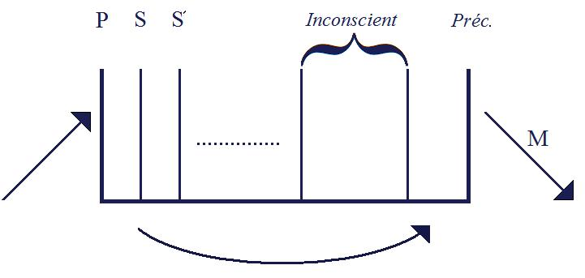

# Leçon 08 | 24 février 1954

<!-- source-url: http://staferla.free.fr/S1/S1 Ecrits techniques.docx -->
<!-- seminar: s1 -->
<!-- lesson: 08 -->

<!-- id: s1-08-0001 -->

Les menus propos que je vais vous tenir aujourd’hui étaient annoncés sous le titre : *La topique de l’imaginaire*. Il est bien entendu que par exemple, un titre aussi vaste ne se conçoit, ne se comprend que dans la chaîne de ce que nous poursuivons ici, à savoir : jeter cer­taines lumières sur la technique, et nommément *à partir toujours des* *Écrits tech­niques* de FREUD, ou plus exactement à partir de la compréhension que nous pouvons nous faire de ce qui, dans l’expérience analytique, s’est cristallisé dans ces *Écrits tech­niques*.

<!-- id: s1-08-0002 -->

Par conséquent, je ne vous traiterai pas - vous pensez bien ! - dans son ensemble un sujet qui serait assez considérable pour occuper plusieurs années d’ensei­gnement. Mais c’est en tant qu’un certain nombre de questions concernant la place de l’*imaginaire* dans la *structure*, viennent dans le fil de notre discours ici, que cette causerie peut revendiquer ce titre.

<!-- id: s1-08-0003 -->

En effet, voyez-vous, vous pensez bien que ça n’est pas sans un plan pré­conçu, et dont j’espère que l’ensemble vous manifestera

<!-- id: s1-08-0004 -->

la rigueur, que je vous ai mené la dernière fois avec le commentaire de Mlle GÉLINIER sur un cas qui m’a semblé particulièrement

<!-- id: s1-08-0005 -->

*significatif*, parce que montrant de façon particu­lièrement réduite et simple le jeu réciproque de ces trois grands termes, dont nous avons déjà eu l’occasion de faire grand état : *l’imaginaire, le symbolique et le réel*.

<!-- id: s1-08-0006 -->

Je pourrai, à mesure que ces considérations ici se développent, constater qu’il est tout à *fait impossible* de comprendre quelque chose à la technique, à l’expé­rience freudienne, sans ces trois systèmes de références. Et beaucoup des diffi­cultés qui s’élèvent, et nommément pour en prendre un exemple, *les éléments plus importants que tout*, *d’incompréhension* que Mlle GÉLINIER a marqués l’autre jour en face du texte de Mme Mélanie KLEIN, *se justifient* d’une part, et *s’éclairent* d’autre part, quand on y apporte ces distinctions.

<!-- id: s1-08-0007 -->

Je dis que *ces élé­ments sont plus importants que tout,* en effet c’est ça qui est important :

<!-- id: s1-08-0008 -->

- non pas tellement ce que nous comprenons, quand nous tentons de faire une élabo­ration d’une expérience,

<!-- id: s1-08-0009 -->

- mais c’est *ce que nous ne comprenons pas*.

<!-- id: s1-08-0010 -->

Et c’est bien là le mérite de cet exposé de Mlle GÉLINIER la dernière fois, *d’avoir mis en valeur ce qui*, dans ce texte, *ne se comprend pas.* C’est en quoi la méthode de commentaire de textes se révèle féconde. Quand nous commentons un texte, c’est comme quand nous faisons une analyse. Combien de fois je l’ai fait observer à ceux que je contrôle. Ils disent : « *J’ai cru comprendre qu’il voulait dire* *ceci, et cela*… ». C’est une des choses dont nous devons le plus nous garder* *

<!-- id: s1-08-0011 -->

- de comprendre trop,

<!-- id: s1-08-0012 -->

- de comprendre plus que ce qu’il y a dans le discours du sujet.

<!-- id: s1-08-0013 -->

Interpréter et s’imaginer comprendre n’est pas du tout la même chose, c’est même exactement *le contraire*. Je dirais même plus, c’est sur la base d’un certain refus de compréhension que nous poussons la porte de la compréhension analytique. Il ne suffit pas que ça ait l’air de se tenir, un texte de X, ou de Z, ou de Mélanie KLEIN. Bien sûr, ça sert dans le cadre de ritournelles auxquels nous sommes habitués : *maturation instinctive, instinct primitif d’agression, sadisme oral, anal*. Il n’en reste pas moins qu’il paraissait, dans le registre qu’elle faisait intervenir, un certain nombre de contrastes, que je vais reprendre dans le détail, puisque nous avons là le double de ce qui nous a été dit la der­nière fois.

<!-- id: s1-08-0014 -->

Vous allez voir que tout tourne, dans ce qui a paru *singulier, paradoxal, contradictoire,* qu’a mis en relief Mlle GÉLINIER, à propos de la fonction de l’*ego*, de l’*ego* qui est à la fois trop développé et qui, à cause de cela, stoppe tout le développement, cet *ego* qui, en se développant, rouvre la porte vers la réalité.

<!-- id: s1-08-0015 -->

Mais, comment se fait-il que cette porte de la réalité soit rouverte par un développement de l’*ego* qui ne nous est précisément pas démontré dans sa rigueur, son ressort, son détail ? En quoi consiste, et quelle est la fonction propre de l’interprétation kleinienne, avec son caractère véritablement d’intrusion, de placage sur le sujet, ce que j’ai souligné la dernière fois, au moins pour ceux qui ont pu rester jusqu’à la fin, cette séance s’étant légèrement prolongée ? Voilà toutes les questions que nous aurons à retoucher aujourd’hui.

<!-- id: s1-08-0016 -->

Pour vous introduire car, enfin, vous devez d’ores et déjà vous être aperçus que dans le cas de ce jeune sujet, le rapport du *réel*, de l’*imaginaire* et du *sym­bolique* est assez... Ils sont là absolument *affleurants, sensibles*. Nous allons reprendre dans le détail. Enfin, vous sentez bien que ce dont il s’agit c’est de quelque chose qui doit être vraiment au cœur de ce problème.

<!-- id: s1-08-0017 -->

Le *symbolique*, je vous ai appris à l’identifier avec le langage. Il est clair que c’est dans la mesure où, disons Mélanie KLEIN *parle,* que *quelque chose* s’est passé. Que d’autre part la fonction de l’*imaginaire* soit ce qui est au cœur du sujet, ça nous est bien démontré d’un bout à l’autre de l’observation. D’abord par le fait que ce dont on parle, c’est de la notion de constitution des *objets*.

<!-- id: s1-08-0018 -->

Les *objets*, nous dit Mélanie KLEIN, sont constitués par tout un jeu de *projections*, *introjections*, *expulsions de mauvais objets*, *réintrojection* de ces objets, de jeux entre les objets, de sadisme du sujet qui, ayant projeté son sadisme, le voit revenir de ces objets, qui de ce fait serait bloqué, stoppé par une sorte de crainte anxieuse. Vous sentez que nous sommes dans le domaine de l’*imaginaire*, et tout le pro­blème est celui de *la jonction* du *symbolisme* et de l’*imaginaire* dans la consti­tution du *réel*.

<!-- id: s1-08-0019 -->

Pour tâcher de vous éclairer un peu les choses, j’ai fomenté pour vous une sorte de petit modèle, d’exemple, une sorte de petit succédané du *stade du miroir*, dont j’ai souvent souligné qu’il n’est pas simplement une affaire histo­rique, un point du développement, de la genèse, mais qu’il a aussi une fonction exemplaire, en montrant certaines relations du sujet - à quoi ? - à son image, préci­sément, et à son image en tant qu’*Urbild* du *moi*.

<!-- id: s1-08-0020 -->

Déjà ce *stade du miroir*, impossible à dénier, a en somme une certaine présentation optique. Ceci n’est pas niable. Est-ce que c’est par hasard ? Ce n’est pas si *par hasard* que ça ! Il est évident que les sciences, particulièrement les sciences en gésine, comme la nôtre, empruntent fréquemment des modèles à différentes autres sciences.

<!-- id: s1-08-0021 -->

Vous n’imaginez pas, mes pauvres amis, ce que vous devez à la géologie ! S’il n’y avait pas de géologie, de couches, et de couches qui se déplacent et de clivage quand ça ne colle plus, les différents niveaux de couches, entre deux territoires connexes, moyennent quoi, à très peu près, on passe, au même niveau, d’une couche récente à une couche très antérieure. Ce que je dis là, je ne l’invente pas ! Vous n’avez qu’à le lire sous la plume de M. pour évoquer qu’il y a des situa­tions chaotiques qui ne sont pas toutes dues à l’analyse, mais à l’évolution du sujet. C’est une façon de tracer *un trait de plume*…

<!-- id: s1-08-0022 -->

Il est évident qu’en effet, à ce titre, il ne serait pas mal que tout analyste fasse l’achat d’un petit bouquin de géologie. Il y avait même autrefois un analyste géologue, LEUBA[^16]. Il a fait un bon petit bouquin de géologie, je ne saurais trop vous en conseiller la lecture, ça vous libérera d’un certain nombre de choses. Car quand on voit mieux les choses, on met chaque chose à sa place.

<!-- id: s1-08-0023 -->

L’optique pourrait aussi dire son mot, et à la vérité si je lui faisais dire son mot, ce que je vais faire d’ailleurs sans plus tarder, je ne me trouverais pas pour autant en désaccord avec la bonne tradition du maître, car je pense que plus d’un d’entre vous a pu remarquer que dans la *Traumdeutung*, au chapitre *« Psychologie des processus du rêve »*, au moment où vous savez, il nous montre le fameux schéma, auquel il va insérer tout son procès de l’inconscient :

<!-- id: s1-08-0024 -->

<!-- id: s1-08-0025 -->

Là perception \[P\], et ici motricité \[M\], et à l’intérieur il va mettre les différentes couches qui se distingueront du niveau perceptif, à savoir de l’impression ins­tantanée, par une série d’impressions diverses : S, S’, S’’... Ce qui veut dire à la fois image, souvenir, qui nous permettent de situer à un certain niveau les traces enregistrées et ultérieurement refoulées dans l’inconscient. Ceci est un très joli schéma, que nous reprendrons, il nous rendra service. Mais je voudrais vous faire remarquer ceci : qu’il est accompagné d’un commentaire qui, lui, est extrêmement significatif. Il ne semble pas avoir jamais beaucoup attiré l’œil de quiconque, encore qu’il ait été repris sous une autre forme dans la quasi dernière œuvre de FREUD, dans *l’abrégé*, dans l’*Abriss*. Je vous le lis dans la *Traumdeutung* [^17] :

<!-- id: s1-08-0026 -->

« *L’idée qui nous est ainsi offerte est celle d’un lieu psychique*…

<!-- id: s1-08-0027 -->

Il s’agit exactement de ce dont il s’agit, *tout ce qui se passe entre la perception et la fonction motrice du moi* : le champ de la réalité psychique.

<!-- id: s1-08-0028 -->

…*Écartons aussitôt la notion de localisation anatomique. Restons sur le terrain psycho­logique, et essayons seulement de nous représenter l’instrument qui sert aux productions psychiques comme une sorte de microscope compliqué, d’ap­pareil photographique, etc. Le lieu psychique correspondra à un point de cet appareil où se forme l’image. Dans le microscope et le télescope, on sait que ce sont là des points idéaux, auxquels ne correspond aucune partie tangible de l’appareil. Il me paraît inutile de m’excuser de ce que ma comparaison peut avoir d’imparfait. Elle n’est là que pour faciliter la compréhension de pro­cessus si compliqués en les décomposant* …*//*… *Il n’y a là aucun risque, je crois que nous pouvons laisser libre cours à nos suppositions, pourvu que nous gar­dions notre sang-froid, et que nous n’allions pas prendre l’échafaudage pour le bâtiment lui-même. Nous n’avons besoin que de représentations auxi­liaires pour nous rapprocher d’un fait inconnu. Les plus simples et les plus tangibles sont les meilleures.* »

<!-- id: s1-08-0029 -->

\[*Die Idee, die uns so zur Verfügung gestellt wird, ist die einer psychischen Lokalität. Wir wollen ganz beiseite lassen, daß der seelische Apparat, um den es sich hier handelt, uns auch als anatomisches Präparat bekannt ist, und wollen der Versuchung sorgfältig aus dem Wege gehen, die psychische Lokalität etwa anatomisch zu bestimmen. Wir bleiben’ auf psychologischem Boden und gedenken nur der Aufforderung zu folgen, daß wir uns das Instrument, welches den Seelenleistungen dient, vorstellen wie etwa ein zusammengesetztes Mikroskop, einen photographischen Apparat u. dgl. Die psychische Lokalität entspricht dann einem Orte innerhalb eines solchen Apparats, an dem eine der Vor­stufen des Bildes zustande kommt. Beim Mikroskop und Fernrohr sind dies bekanntlich zum Teil ideelle Örtlichkeiten, Gegenden, in denen kein greifbarer Bestandteil des Apparats gelegen ist. Für die Unvollkommenheiten dieser und aller ähnlichen Bilder Ent­schuldigung zu erbitten, halte ich für überflüssig. Diese Gleich­nisse sollen uns nur bei einem Versuch unterstützen, der es unter­nimmt, uns die Komplikation der psychischen Leistung ver­ständlich zu machen, indem wir diese Leistung zerlegen, und die Einzelleistung den einzelnen Bestandteilen des Apparats zuweisen. Der Versuch, die Zusammensetzung des seelischen Instruments aus solcher Zerlegung zu erraten, ist meines Wissens noch nicht gewagt worden. Er scheint mir harmlos.* (S. Freud : *Traumdeutung*, VII, 2 : *Die Regression*, éd. 1925, pp. 455-456)\]

<!-- id: s1-08-0030 -->

Inutile de vous dire que, les conseils étant faits pour n’être pas suivis, nous n’avons manqué, depuis, de prendre quelque peu « *l’échafaudage pour le bâti­ment* ». D’un autre côté, cette autorisation qu’il nous donne à prendre « *des représenta­tions auxiliaires* *pour nous rapprocher d’un fait inconnu, les plus simples et les plus tangibles étant les meilleures* », m’a incité moi-même à faire preuve d’une cer­taine désinvolture pour faire un schéma.

<!-- id: s1-08-0031 -->

Un appareil d’optique beaucoup plus simple qu’un microscope compliqué…

<!-- id: s1-08-0032 -->

> non pas qu’il ne serait pas amusant de poursuivre la comparaison en question, mais ça nous entraînerait un peu loin

<!-- id: s1-08-0033 -->

…quelque chose de beaucoup plus simple, presque enfantin, va nous servir aujourd’hui.

<!-- id: s1-08-0034 -->

Je ne saurais trop, en passant, vous recommander la méditation sur l’optique. Chose curieuse, on a fondé un système de *métaphysique* entier sur la géomé­trie, la mécanique, en y cherchant des espèces de modèles de compréhension. Il ne semble pas que, jusqu’à présent, on ait tiré tout le parti qu’on peut tirer de l’optique. C’est pourtant une chose qui devrait bien prêter à quelques *rêves*, sinon à quelques méditations, l’optique !

<!-- id: s1-08-0035 -->

C’est quand même une drôle de chose, toute cette science dont le but et la fonction consistent à reproduire par des appareils quelque chose qui - à l’exception de toutes les autres sciences qui apportent dans la nature quelque chose comme un découpage, une dissection, une anatomie - avec des appareils, s’efforce de produire cette chose singulière qui s’appelle des « *images* ».

<!-- id: s1-08-0036 -->

Entendez bien que je ne cherche pas, en vous disant ça, à vous faire prendre des vessies pour des lanternes et les images optiques pour les images qui nous intéressent. Mais quand même, ce n’est pas pour rien qu’elles ont le même nom. Et d’autre part ces imagesoptiques présentent des diversités singulières et combien éclairantes :

<!-- id: s1-08-0037 -->

- il y en a qui sont des images pure­ment subjectives, celles qu’on appelle *virtuelles*,

<!-- id: s1-08-0038 -->

- il y en a d’autres qui sont des images *réelles*, à savoir qui par certains côtés se comportent tout à fait comme des objets, qu’on peut prendre pour objets. Il y a des choses bien plus singulières encore : *ces objets* que sont les images *réelles*, nous pouvons les reprendre et en donner des images *virtuelles*. L’*objet*, à cette occasion, qu’est *l’image réelle* peut à juste titre prendre le nom *d’objet virtuel*. Tout cela est bien singulier.

<!-- id: s1-08-0039 -->

Et à la vérité, une chose est encore plus sur­prenante, c’est que les fondements théoriques de l’optique reposent tout entiers sur une théorie mathématique, sans laquelle il est absolument impos­sible de structurer l’optique :

<!-- id: s1-08-0040 -->

- c’est l’approfondissement, en avant du sujet de tout ce dont il s’agit, qui consiste à partir d’une hypothèse fondamentale, sans quoi il n’y a absolument pas d’optique,

<!-- id: s1-08-0041 -->

- pour qu’il y ait une optique pos­sible, il faut qu’il y ait la possibilité de représentation d’un point donné dans l’espace réel, de tout point donné dans l’espace réel. À ce point peut correspondre un point, un seul, dans un autre espace qui est l’espace de l’*imaginaire*. Ceci est l’hypothèse structurale fondamentale.

<!-- id: s1-08-0042 -->

Cela a l’air excessivement simple, mais si on ne part pas de là, on ne peut absolument pas écrire la moindre équation, symboliser la moindre chose, c’est-à-dire que l’optique est absolu­ment impossible. Même ceux qui ne savent pas qu’il y a cette hypothèse à la base ne pourraient pas, absolument pas, faire quoi que ce soit en optique si *cette hypothèse* n’existait pas. Là aussi *espaces imaginaire et réel se confondent* tous deux. Cela n’empêche pas qu’ils doivent être pensés tous deux comme différents.

<!-- id: s1-08-0043 -->

On a beaucoup d’oc­casions d’approfondissement en matière d’optique, à s’exercer à certaines dis­tinctions qui vous montrent combien est important le ressort symbolique dans la manifestation, dans la structure d’un phénomène. D’un autre côté, une série de phénomènes qu’on peut dire par toute une part tout à fait réels, puisque, aussi bien, c’est l’expérience qui nous guide en cette matière, où pourtant à tout instant toute la subjectivité est engagée.

<!-- id: s1-08-0044 -->

Entendez bien par exemple ceci : quand vous voyez *un arc-en-ciel*, vous voyez quelque chose d’entièrement subjectif. Vous le voyez à une certaine distance qui *broche* sur le paysage. Il n’est pas là. C’est un phénomène subjectif. Et pourtant grâce à un appareil photographique vous l’enregistrez tout à fait *objectivement*. Alors qu’est-ce que c’est ? Est-ce que nous ne savons plus très bien *où est* *le subjectif, où est l’objectif* , ou bien avons-nous l’habitude de mettre dans notre petite comprenoire *une distinction entre objectif et subjectif ?* Ou bien, est-ce que l’appareil photographique est tout de même plutôt un appareil subjectif, c’est-à-dire tout entier construit à l’aide d’un petit *x* et d’un petit *y* qui habitent le domaine où vit le sujet, c’est-à-dire le domaine du langage ?

<!-- id: s1-08-0045 -->

Je laisserai ces questions ouvertes, pour aller droit à ce petit exemple. Je vais d’abord essayer de vous le mettre dans l’esprit avant de le mettre *au tableau*. Car il n’y a rien de plus dangereux que les choses au tableau. C’est tou­jours un peu plat ! À ma place, mettez ici un formidable *chaudron*, qui me remplacerait avan­tageusement peut-être, certains jours, comme caisse de résonance, quelque chose d’aussi proche que possible d’une demi-sphère, bien poli à l’intérieur, bref : *un miroir sphérique*.

<!-- id: s1-08-0046 -->

S’il est là, à peu près, s’il s’avance à peu près ici, jusqu’à la table, vous ne vous verrez pas dedans... Ne croyez pas cela, *ce phénomène* *de mirage* qui se produit de temps en temps entre moi et mes élèves, ne se produira pas même quand je serai transformé en *chaudron*. Vous savez quand même qu’*un miroir sphérique ça produit* quelque chose, *ce qu’on appelle une image réelle*, parce que tout rayon lumineux émané d’un point quelconque d’un objet placé à une certaine distance, de préférence dans le plan du centre de la sphère, à chacun de ces points lumineux - tout cela est approximatif - correspond dans le même plan, par convergence des rayons réfléchis sur la surface de la sphère, un autre point lumi­neux qui donne de cet objet *une image réelle*.

<!-- id: s1-08-0047 -->

Il en résulte que - c’est une expérience - je regrette de n’avoir pas pu amener le chaudron aujourd’hui, ni non plus les appareils de l’expérience, vous allez vous les représenter.

<!-- id: s1-08-0048 -->

<!-- id: s1-08-0049 -->

Supposez que ceci soit une boîte, creuse de ce côté là, et qui soit placée là, au centre de la sphère, elle n’est pas tout à fait construite comme ça. Voilà ici la demi-sphère. Voilà la boîte, elle a un pied. Comment se fait l’expérience classique au temps où la physique était amu­sante, quand on faisait *des expériences* ? De même que nous, nous sommes au moment où c’est vraiment de la psychanalyse : plus nous sommes proches de *la psychanalyse qui était amusante*, plus c’était la véritable psychanalyse. Par la suite, ça deviendra rodé, fait uniquement d’approximations et de trucs : *on ne comprendra plus du tout ce qu’on fait*. De même, il n’est pas besoin de com­prendre quoi que ce soit à l’optique pour faire un microscope. Mais réjouissons-nous, nous faisons encore de la psychanalyse, même quand nous faisons cela que nous faisons aujourd’hui.

<!-- id: s1-08-0050 -->

Ici, sur la boîte, vous allez mettre un vase - coupe du vase - un vase réel. En dessous, ici, il y a un bouquet de fleurs, là. Alors, qu’est-ce qui se passe ? Je vais faire plus grand le chaudron, il faut que *la demi-sphère* soit énorme, qu’il y ait une assez grande ouverture à ce miroir sphérique. Il se passe ceci : il se forme ici - *de par la propriété du miroir sphérique* - un point lumineux quelconque

<!-- id: s1-08-0051 -->

Ici le bouquet vient se réfléchir ici, sur *la surface sphérique*, pour venir au point lumineux symétrique. Entendez que tous les rayons en font autant, en vertu de *la propriété de la surface sphérique* : tous les rayons émanés d’un point donné reviennent au même point, grâce à ça se forme *une image réelle* \[l’image réelle du bouquet de fleurs se forme « dans » le col du vase\]. Ils ne se croisent pas tout à fait bien dans mon schéma, mais c’est vrai aussi dans la réalité. Et c’est vrai aussi pour tous les instruments d’optique, ce n’est jamais qu’une approximation.

<!-- id: s1-08-0052 -->

Ces rayons continuent leur chemin, ils redivergent, c’est-à-dire que pour un œil qui est là, ils sont convergents. La caractéristique des rayons qui arrivent à frapper un œil sous une forme *convergente*, c’est de donner ce qu’on appelle une *image réelle*. Divergents en venant à l’œil, ils sont convergents en s’écartant de l’œil. Si c’est le contraire, si les rayons viennent frapper l’œil en sens contraire, nous avons la formation d’une *image virtuelle*. C’est ce qui se passe quand vous voyez une image dans la glace, vous la voyez là où elle n’est pas, tandis que là \[l’image réelle\] vous la voyez là où elle est, à cette seule condition, que votre œil soit dans le champ des rayons qui sont déjà venus se croiser au point corres­pondant, qui est ici.

<!-- id: s1-08-0053 -->

C’est-à-dire qu’à ce moment-là vous verrez ici se produire…

<!-- id: s1-08-0054 -->

> ne voyant pas le bouquet, qui est là caché, si vous êtes dans le bon champ, tous ceux qui seront par là, environ

<!-- id: s1-08-0055 -->

…vous verrez apparaître un très curieux *bouquet imaginaire* sur lequel votre œil, pour le voir, devra *accommoder*, parce que cette image se forme juste à cet endroit-là exactement de la même façon que sur l’objet*, le vase*, *et à cause de ça, parce que votre œil doit accommoder* *de la même façon, pour un même plan, vous aurez ce qu’on appelle « une impression de réalité »*, tout en sen­tant bien qu’il y a quelque chose qui vous fera faire comme ça, justement à cause de ce qu’ils ne se croisent pas très bien, il y aura *quelque chose de bizarre*, d’un peu *brouillé*. Mais plus vous serez loin, c’est-à-dire plus ce qu’on appelle la *parallaxe*, minime accommodation pour le déplacement latéral de l’œil, plus vous serez loin, plus l’illusion sera complète.

<!-- id: s1-08-0056 -->

Je m’excuse d’avoir mis autant de temps à vous développer cette petite his­toire, mais c’est un apologue qui va pouvoir beaucoup nous servir. En effet nous avons là, en quelque sorte, quelque chose qui bien entendu, ne prétend à toucher à rien d’essentiellement, de substantiellement en rapport avec ce que nous manions sous *le domaine des relations dites réelles ou objec­tives*, ou des *relations imaginaires*.

<!-- id: s1-08-0057 -->

C’est quelque chose qui l’illustre, qui va nous permettre de signaler d’une façon particulièrement simple ce qui résulte de la juxtaposition du *monde imaginaire*, de l’intrication étroite du *monde imagi­naire* et du *monde réel* dans l’économie psychique. Vous allez voir maintenant comment. Ce n’est pas pour rien que cette petite expérience m’a souri. Elle est tout à fait naturelle. Ce n’est pas moi qui l’ai inventée, elle est connue depuis long­temps sous le titre « *expérience du bouquet renversé* »[^18]. Telle quelle et dans son innocence, et sans idée préconçue de ses auteurs, qui ne l’avaient pas fabriquée pour nous, elle nous paraît, même dans ses détails contingents, *vase* et *bouquet,* particulièrement séduisante.

<!-- id: s1-08-0058 -->

En effet, s’il y a quelque chose que nous mettrons à la base de cette dia­lectique de *l’imaginaire primitif*…

<!-- id: s1-08-0059 -->

> qui est en relation avec *la saisie de l’image du corps propre*, plus profondément avec les rapports du *Ur-Ich*, ou du *Lust-­Ich*
>
> de toute cette notion d’un *moi* primitif qui va se constituer dans une sorte de clivage, de distinction d’avec le monde
>
> extérieur, ou le rapport de ce qui est inclus au-dedans, de ce qui est exclu par tous ces processus précisément d’exclusion,
>
> *Ausstossung*, de projection, de délimitation en somme du domaine propre du *moi*

<!-- id: s1-08-0060 -->

…s’il y a quelque chose qui est mis au premier plan de toutes nos conceptions, à ce stade génétique primitif de la formation du *moi*, c’est bien celle justement du *contenant* et du *contenu*. Et en ce sens, *ce rap­port du vase aux fleurs qu’il contient peut nous servir de métaphore*, et des plus précieuses.

<!-- id: s1-08-0061 -->

En effet, quand j’insiste à propos de la théorie du *stade du miroir*, sur le fait que cette prise de conscience du corps comme totalité est quelque chose qui se fait d’une façon *prématurée*, quoique corrélative, par rapport au moment où le développement fonctionnel donne au sujet l’intégration de ses fonctions motrices.

<!-- id: s1-08-0062 -->

Ceci - je l’ai souligné, et sous une forme précise, maintes fois - prend en somme sa valeur du fait qu’une saisie virtuelle d’une maîtrise imaginaire, don­née au sujet par la vue de la forme totale du corps humain - qu’il s’agisse d’ailleurs de *son image propre* ou *d’une image* qui lui est donnée par quelqu’un *de ses semblables -* est quelque chose qui pour lui, dans cette expérience, est déta­chée, dégagée, ne se confond pas avec le processus de cette maturation même. En d’autres termes, le sujet en tant que sujet, anticipe sur cette maîtrise phy­siologiquement achevée, et cette anticipation donnera sa marque, son style par­ticulier à tout exercice ultérieur de cette maîtrise motrice une fois effectuée.

<!-- id: s1-08-0063 -->

Ceci n’était exactement rien d’autre que l’aventure originelle en laquelle l’homme fait pour la première fois l’expérience :

<!-- id: s1-08-0064 -->

- qu’il se voit,

<!-- id: s1-08-0065 -->

- qu’il se réfléchit,

<!-- id: s1-08-0066 -->

- qu’il se conçoit autre qu’il n’est. Et ceci est une dimension absolument essentielle de l’humain, et tout à fait structurale dans toute sa vie fantasmatique.

<!-- id: s1-08-0067 -->

En fait donc, tout se passe comme si, à un moment, délié, dénoué du bouquet de fleurs, *le pot imaginaire* qui le contient, par rapport auquel le sujet fait déjà une première saisie parmi tous les *Id*, tous les *Ça* que nous supposons à l’origine : nous sommes là objet, instincts, désirs, tendances.

<!-- id: s1-08-0068 -->

Tout est en quelque sorte ça : pure et simple réalité, au sens où la réalité ne se délimite en rien, ne peut être encore l’objet d’aucune espèce de définition, soit qualitative, bonne ou mauvaise, comme la série des jugements auxquels FREUD se référait l’autre jour dans l’article « *Die Verneinung » *: ou bien qu’il est, ou qu’il n’est pas, où la réalité est en quelque sorte à la fois chaotique et absolue, originelle. À l’intérieur de ça, de cette première saisie, *l’image du corps* donne la première forme aussi au sujet qui lui permet de situer ce qui est du *moi*, et ce qui ne l’est pas. Je schématise, vous le sentez bien, mais tout développement d’*une méta­phore*, d’un appareil à penser, nécessite qu’au départ on fasse sentir à quoi il sert, et ce qu’il veut dire. Vous verrez qu’il permet, qu’il a une maniabilité qui per­met de jouer de toutes sortes de *mouvements réciproques* *de ce contenant* que je suppose ici *imaginaire*.

<!-- id: s1-08-0069 -->

Renversez les conditions de l’expérience, car ça pour­rait aussi bien être le pot là \[le vase\] en dessous, et les fleurs dessus.

<!-- id: s1-08-0070 -->

<!-- id: s1-08-0071 -->

J’ai renversé le schéma, nous pouvons à notre gré mettre *imaginaire* ce qui est *réel*, à condition de laisser le rapport des signes : \+ – + ou – + –, pourvu que le rapport soit conservé, que nous ayons affaire à un *réel caché* et un *imaginaire* qui le repro­duit, et un *réel* mis en connexion avec cet *imaginaire*. \[pour les **+ - +** ou **- + -** : cf. le séminaire sur « *La lettre volée* »\]

<!-- id: s1-08-0072 -->

Eh bien, ce premier *moi imaginaire*, c’est par rapport à lui que va se situer le premier jeu de *l’inclusion* ou de *l’exclusion* de tout ce dont il s’agit dans le sujet, dans le sujet avant la naissance du *moi*. Ce que nous montre d’autre ce *schéma*, cette illustration, cet *apologue*, dont nous nous servons ? Il nous montre ceci : pour que l’illusion se produise, c’est-à-dire que se constitue pour l’œil qui regarde un monde où *l’imaginaire* peut inclure et du même coup former *le réel*, où *le réel* aussi peut inclure et du même coup situer l’*imaginaire*, il faut quand même une condition, c’est-à-dire - je vous l’ai dit - que l’œil soit dans une cer­taine position : il faut qu’il soit à l’intérieur de ce cône.

<!-- id: s1-08-0073 -->

<!-- id: s1-08-0074 -->

S’il est là, à l’extérieur de ce cône, il ne verra plus ce qui est *imaginaire*, pour une simple raison, c’est que rien de ce cône d’émission, qui est là, ne viendra le frapper, il verra les choses à leur état *réel* tout nu, c’est-à-dire l’intérieur du mécanisme :

<!-- id: s1-08-0075 -->

- et un pauvre pot vide \[expérience de Bouasse : le bouquet est caché en-dessous\],

<!-- id: s1-08-0076 -->

- ou des fleurs esseulées, selon les cas \[expérience de Bouasse modifiée par Lacan : le vase est caché en-dessous\].

<!-- id: s1-08-0077 -->

Qu’est-ce que ça veut dire ? Vous me direz, nous sommes pas un *œil*. Et qu’est-ce que c’est que cet *œil* qui se balade, là ? Et si tout cela veut dire quelque chose ?

<!-- id: s1-08-0078 -->

Ceci - la boîte - veut dire : votre propre corps. Et ici, le bouquet : instincts et désirs, ou les objets du désir qui se promènent. Et ça le chaudron, qu’est-ce que c’est ? Cela pourrait bien être le cortex. Pourquoi pas ? Et si c’était le cortex ? Ce serait amusant. Nous en parlerons un autre jour.

<!-- id: s1-08-0079 -->

Au milieu de ça, votre œil, il ne se promène pas, il est fixé là, il est une espèce de petit appendice titilleur de notre cortex, justement ! Alors, pourquoi nous raconter que cet œil est en train de se promener ? Tantôt ça marche, tantôt ça ne marche pas ? Évidemment ! L’œil est, comme très fréquemment, le symbole du sujet, et toute la science repose sur ce qu’on réduit le sujet à un œil. Et c’est pour cela que toute la science est comme cela projetée devant vous, c’est-à-dire objectivée. Je vous explique­rai ça.

<!-- id: s1-08-0080 -->

À propos de *la théorie des instincts*, une autre année, on avait apporté une très belle construction, qui était la plus belle construction paradoxale que j’ai jamais entendu proférer : théorie des instincts conçus comme quelque chose d’entifié. À la fin, il ne restait plus un seul instinct debout. Et c’était, à ce titre, une démonstration utile à faire.

<!-- id: s1-08-0081 -->

Mais pour nous faire tenir un petit instant dans notre *œil*, il fallait justement que nous nous mettions dans la position du savant qui décrète : *ce n’est pas vrai*. Mais il peut décréter qu’il est simplement *un œil* et il met *un écriteau à la porte* « *ne pas déranger l’expérimentateur* ». Dans la vie, bien entendu, les choses sont toutes différentes, justement parce que nous ne sommes pas un *œil*. Alors qu’est-ce que ça veut dire que *l’ œil* qui est là ? Et à quoi pouvons-­nous nous en servir dans cette comparaison ?

<!-- id: s1-08-0082 -->

Cela veut dire, dans cette comparaison, simplement que dans ce rapport de l’*imaginaire* et du *réel*, et dans la constitution du monde telle qu’elle doit en résul­ter, tout dépend de la situation du sujet. Et la situation du sujet - mon Dieu ! - vous devez le savoir depuis que je vous le répète, elle est essentiellement carac­térisée par sa place dans *le monde symbolique*, autrement dit, dans *le monde de la parole*. C’est exactement *de cette place*, je n’en dis pas plus.

<!-- id: s1-08-0083 -->

Si vous avez compris ce que je vous raconte jusqu’à présent, ça implique beaucoup de choses : la relation à l’autre, etc. Mais je vous en prie, avant que ce soit la relation à l’autre, c’est sa place dans *le monde symbolique*. N’est-ce pas ? C’est-à-dire qu’il ait ou non possibilité ou défense de s’appeler PEDRO. C’est selon : un cas ou l’autre, selon qu’il s’appelle PEDRO ou pas, qu’il est dans le champ du cône, ou qu’il n’y est pas.

<!-- id: s1-08-0084 -->

Voilà ce qu’il faut que vous mettiez dans votre tête, comme point de départ. Même si ça vous paraît un peu raide pour comprendre tout ce qui va suivre, et tout à fait nommément ce texte de Mélanie KLEIN, c’est-à-dire quelque chose que nous devons prendre pour ce que ça est, c’est-à-dire pour une expérience. En effet, voilà à peu près comment les choses se présentent. Qu’est-ce que nous montre ce cas ?

<!-- id: s1-08-0085 -->

Mlle GÉLINIER nous le raconte, et nous le résume. Pourquoi ne pas prendre son texte ? Je l’ai revu, et il est vraiment fort fidèle, ce qui ne nous empêchera pas de nous rapporter au texte de Mélanie KLEIN. Voilà un garçon qui, nous dit-on, a environ 4 ans, et qui a un niveau général de développement qu’on appelle 15 à 18 mois. C’est une question de définition, on ne sait jamais ce qu’on veut dire dans ce cas-là.

<!-- id: s1-08-0086 -->

Quel ins­trument de mesure ? On omet souvent de le préciser. Ce qu’on appelle *un développement affectif* de 15 à 18 mois reste encore plus flou que l’image d’une de mes fleurs dans l’expérience que je viens de vous produire. Un vocabulaire très limité, et plus que limité, *incorrect* :

<!-- id: s1-08-0087 -->

« *Il déforme les mots et les emploie mal à propos la plupart du temps, alors qu’à d’autres moments on se rend compte qu’il en connaît le sens.* *Elle insiste sur le fait le plus frappant : cet enfant n’a pas le désir de se faire com­prendre, il ne cherche pas à communiquer, ses seules activités* *plus ou moins ludiques seraient d’émettre des sons et de se complaire dans des sons sans signification, dans des bruits.* »

<!-- id: s1-08-0088 -->

En d’autres termes, à quoi avons-nous affaire ?

<!-- id: s1-08-0089 -->

- À un enfant, chose curieuse, qui possède quelque chose du langage, c’est clair, Mélanie KLEIN ne se ferait pas comprendre de lui s’il ne le possédait pas.

<!-- id: s1-08-0090 -->

- D’une part, il semble donc qu’il y ait certains éléments de l’appareil symbolique.

<!-- id: s1-08-0091 -->

- D’autre part, nous avons son attitude, qui est évidemment tout à fait frap­pante.

<!-- id: s1-08-0092 -->

Mélanie KLEIN, dès le premier contact avec l’enfant - qui est si important - caractérise le fait de l’apathie, de l’indifférence. Il n’est pour autant pas sans être, d’une certaine façon, orienté. Il ne donne pas l’impression de l’idiot, loin de là ! Il est là en présence de Mélanie KLEIN, et Mélanie KLEIN distingue son attitude de celle de tous les névrosés qu’elle a vus auparavant comme enfants.

<!-- id: s1-08-0093 -->

Elle dis­tingue ce cas du cas des névrosés, en remarquant qu’il ne marque aucune espèce d’anxiété apparente, même sous ses formes masquées, voilées, qui sont celles qui se produisent dans le cas des névrosés, c’est-à-dire, bien entendu, pas toujours des manifestations explosives, mais simplement certaines attitudes de retrait, de raideur, de timidité, où on voit que quelque chose est contenu, caché, qui n’échappe pas à quelqu’un de l’expérience de la thérapeute en question. Au contraire, il est là, comme si rien n’y faisait. Il regarde Mélanie KLEIN comme il regarderait un meuble.

<!-- id: s1-08-0094 -->

Je souligne particulièrement ces aspects, car ce que j’ai mis en relief est le caractère précisément absolument uniforme, sans relief, d’un certain point de vue qu’a la réalité pour lui : tout, en quelque sorte, est également réel et égale­ment indifférent. Que nous dit Mélanie KLEIN ? C’est ici que commencent *les perplexités* de Mlle GÉLINIER

<!-- id: s1-08-0095 -->

Mélanie KLEIN nous dit :

<!-- id: s1-08-0096 -->

> « *Le monde de l’enfant se produit à partir d’un contenant, ce serait le corps de la mère, et d’un contenu du corps de cette mère.* »

<!-- id: s1-08-0097 -->

Au cours du progrès de ses relations instinctuelles avec cet objet privilégié, l’enfant est amené à procéder à une série de relations d’*incorporations imagi­naires*. Il peut mordre, absorber, le corps de sa mère. Et le style de cette *incor­poration* est un style de *destruction*. L’enfant comprend que l’incorporation est une incorporation destructrice, que ce qu’il va rencontrer dans le corps de sa mère, c’est également un certain nombre d’objets, pourvus eux-mêmes d’une certaine unité, encore qu’ils soient inclus, mais que ces objets peuvent être dan­gereux pour lui, pour la même raison exactement que lui est dangereux pour eux, c’est-à-dire qu’il les revêt des mêmes capacités de destruction si je puis dire « *en miroir* », c’est bien le cas de le dire, que celles dont ils se ressent, lui-même, porteur dans cette première appréhension des premiers objets.

<!-- id: s1-08-0098 -->

C’est donc à ce titre qu’il accentuera, par rapport à la première des limita­tions de son *moi* ou de son être, l’extériorité de ces objets : il les rejettera comme objets mauvais, dangereux, « *caca* ». Et ces objets eux-mêmes, une fois extériorisés, isolés de ce premier contenant universel, de ce premier grand tout qui est l’image fantasmatique du corps de la mère, l’empire total de la première réalité enfantine à ce moment-là, ils lui appa­raîtront pourtant comme toujours pourvus du même accent maléfique qui aura marqué ses premières relations avec eux.

<!-- id: s1-08-0099 -->

C’est pour cela qu’il les réintrojectera une seconde fois, et qu’il portera son intérêt vers d’autres objets moins dange­reux, qu’il fera ce qu’on appelle l’équation « *fèces = urine* » par exemple, et diffé­rents autres objets du monde extérieur :

<!-- id: s1-08-0100 -->

- qui seront en quelque sorte plus neutralisés,

<!-- id: s1-08-0101 -->

- qui en seront les équivalents,

<!-- id: s1-08-0102 -->

- qui seront liés aux premiers objets par une équation - je le souligne - *imaginaire*.

<!-- id: s1-08-0103 -->

Là, il est clair qu’*à l’origine l’équation symbolique* que nous redécouvrons ensuite entre ces différents objets, à l’origine et à sa naissance, à son surgisse­ment, c’est d’un mécanisme alternatif *d’expulsion et de réintrojection, de pro­jection et de réabsorption* par le sujet qu’il s’agit. C’est-à-dire, précisément, de ce *jeu imaginaire* que j’essaie de vous *symboli­ser* ici par ces inclusions *imaginaires* d’objets *réels*, ou inversement par ces prises d’objets *imaginaires* à l’intérieur d’une enceinte, *réelle*.

<!-- id: s1-08-0104 -->

Vous suivez ? Oui, à peu près ? Alors, à ce moment-là, nous voyons bien qu’il y a une certaine ébauche d’*imaginification*, si je puis dire, du monde extérieur: nous l’avons là, littéra­lement prête à affleurer, mais elle n’est en quelque sorte que préparée.

<!-- id: s1-08-0105 -->

Le sujet joue avec le contenant et le contenu. Déjà il a entifié dans certains objets - « *petit train* » par exemple - la possibilité d’un certain nombre d’*individua­lisations*, de *tendances*, voire même de *personnes*, lui-même en tant que « *petit train* », par rapport à son père qui est « *grand train* », tout naturellement.

<!-- id: s1-08-0106 -->

D’ailleurs le nombre d’objets pour lui significatifs, fait surprenant, est extrêmement réduit, aux signes minima qui permettent d’exprimer cela : le *dedans* et le *dehors*, le *contenu* et le *contenant  *: l’espace noir tout de suite assimilé à l’inté­rieur du corps de la mère, dans lequel il se réfugie. Mais ce qui ne se produit pas, c’est le jeu libre, la conjonction entre ces différentes formes, *imaginaires* et *réelles,* d’objets. Et c’est ce qui fait que, au grand étonnement de Mlle GÉLINIER, quand il se retourne et va se réfugier dans l’intérieur vide et noir de ce corps maternel, les objets n’y sont pas.

<!-- id: s1-08-0107 -->

Ceci, pour une simple raison : dans son cas, *le bouquet* et *le vase* ne peuvent pas être là en même temps. C’est ça qui est la clef. En d’autres termes, l’objet des étonnements de Mlle GÉLINIER repose sur ceci : les explications de Mme Mélanie KLEIN, parce que pour elle tout est sur un plan d’égale réalité - *unreal reality*, comme elle s’exprime elle-même - ce qui ne permet pas de concevoir, en effet, la dissociation des différents « *sets* » d’ob­jets primitifs dont il s’agit. Pourquoi ?

<!-- id: s1-08-0108 -->

Parce qu’il n’y a pas chez elle de *théo­rie de l’imaginaire* ni de *théorie de l’ego*. Mais si *nous* introduisons cette notion, dans la mesure où une partie de cette réalité est imaginée, l’autre réelle, mais qu’inversement dans la mesure où l’une est réalité, c’est l’autre qui devient *imaginaire,* nous comprenons pourquoi au départ ce jeu de la conjonction des différentes parties, que j’appelle différents « *sets* », ne peut jamais être achevé.

<!-- id: s1-08-0109 -->

En d’autres termes ceci s’exprime de la façon suivante : là nous sommes uni­quement sous l’angle du rapport en miroir, qui est celui que nous appelons généralement le plan de la projection - je ne dis pas de l’introjection : le terme est très mal choisi. Il faudrait trouver un autre mot pour donner le mot corré­latif de cette *projection*, à savoir tout ce qui est de l’ordre du rapport de l’in­trojection, tel que nous nous en servons en analyse, ce mot est toujours employé pratiquement…

<!-- id: s1-08-0110 -->

> vous le remarquerez, cela vous éclairera, au moment où il s’agit d’*introjection symbolique*

<!-- id: s1-08-0111 -->

…le mot *introjection* s’accompagne toujours d’une dénomination *symbolique*. *L’introjection* est toujours l’*introjection de la parole* de l’autre.

<!-- id: s1-08-0112 -->

Et ceci introduit une dimension toute différente. C’est autour de cette distinction que vous pouvez faire le départ entre ce qui est fonction de l’*ego* et ce qui est de l’ordre du premier registre duel et fonction du *surmoi*. Ce n’est pas pour rien que dans la théorie analytique on les distingue, ni qu’on admette que le *surmoi*, le *surmoi* véritable, authentique, est une introjection secondaire par rapport à la fonction de l’*ego idéal*. Ce sont des remarques latérales. Je reviens à mon cas, au cas décrit par Mélanie KLEIN.

<!-- id: s1-08-0113 -->

Qu’est-ce que nous pouvons penser d’autre, sinon, des différentes références que je suis en train d’imager, de délinéer pour vous ? Si nous voyons ce qui se passe, c’est donc ceci : l’enfant est là, il a un certain nombre de registres significatifs : l’un dans le domaine *imaginaire*, dont Mélanie KLEIN - ici nous pouvons la suivre - souligne le caractère en soulignant son extrême étroitesse, la pauvreté du jeu possible de la *transposition imaginaire* dans laquelle et par laquelle peut seulement se faire *cette valorisation progressive* sur le plan qu’on appelle communément « *affectif* », des objets, par une sorte de démultiplication, de déploiement en éventail de toutes les équations imaginaires qui permettent aux êtres humains, parmi les animaux, d’être celui qui a un nombre presque infini d’objets à sa disposition, c’est-à-dire marqués d’une valeur de *Gestalt* dans son *Umwelt*, isolés comme formes.

<!-- id: s1-08-0114 -->

Mélanie KLEIN nous marque à la fois cela, *la pauvreté de ce monde imaginaire*, et du même coup l’impossibilité pour cet enfant d’entrer dans une relation effec­tive avec ces objets, ces objets en tant que structures. La corrélation importante est celle-ci. Quel est le point *significatif*, s’il n’y a qu’à prendre les choses objets de l’at­titude de cet enfant ? Le point significatif est simplement celui-ci, si on résume tout ce que Mélanie KLEIN décrit de l’attitude de cet enfant : cet enfant n’adresse aucun *appel*.

<!-- id: s1-08-0115 -->

Voilà une notion que je vous prie de garder, car par la suite, vous verrez que nous aurons à la faire revenir. Vous allez vous dire : « *Naturellement ! Avec son appel il ramène son langage* ». Mais je vous ai dit qu’*il l’avait déjà, son système de langage*. Il l’a déjà très suffisamment. Et la preuve est qu’il joue avec. Il s’en sert même pour quelque chose de très particulier : pour mener un jeu d’opposition avec les tentatives d’intrusion de ces adultes.

<!-- id: s1-08-0116 -->

Par exemple - c’est bien connu - il se comporte d’une façon qui est d’ailleurs dite, dans le texte, « *négativiste* » : quand sa mère lui dit, lui propose un nom, il est aussi bien capable de le reproduire d’une façon cor­recte, mais il le reproduira d’une façon inintelligible, déformée, « *à propos de bottes* », c’est-à-dire d’une façon ne servant à rien.

<!-- id: s1-08-0117 -->

Nous retrouvons là la dis­tinction entre *négativisme* et *dénégation*, comme nous l’a montré M. HYPPOLITE d’une façon qui prouve non seulement sa culture, mais qu’il a déjà vu des malades et qu’il a vu ce que sont pour eux le *négativisme* et la *dénégation*. Ce n’est pas du tout la même chose. C’est d’une façon proprement *négativiste* que cet enfant se sert du langage.

<!-- id: s1-08-0118 -->

Par conséquent, en vous introduisant l’appel, ce n’est pas le langage que je vous réintroduis. Je dirais même plus : non seulement ce n’est pas le langage, mais ce n’est pas une espèce de niveau supérieur au langage.

<!-- id: s1-08-0119 -->

Je dirais même plus, c’est au-dessous du langage, si on parle de niveaux. Car vous n’avez qu’à obser­ver un animal domestique pour voir qu’un être dépourvu de langage est tout à fait capable de vous adresser *des appels*. Et jusqu’à un certain point, *des appels* dirigés vers - toutes sortes de gestes pour attirer votre attention - vers quelque chose qui, justement, à un certain point lui manque.

<!-- id: s1-08-0120 -->

L’*appel* dont il s’agit, l’*appel* humain, est *un appel auquel est réservé un déve­loppement possible*, ultérieur, plus riche, parce que justement, il se produit à l’intérieur d’un être *qui a déjà acquis le niveau du langage*. C’est un phénomène qui dépasse le langage, mais qui prend sa valeur comme articulation, comme deuxième temps, si vous voulez, par rapport au langage.

<!-- id: s1-08-0121 -->

Soyons schématiques : il y a un M. Karl BÜHLER qui a fait une *théorie du lan­gage*. Ce n’est pas la seule, ni la théorie la plus complète. Mais il s’y trouve quelque chose : *les trois étapes dans le langage*. Il les a mises malheureusement avec des registres qui ne les rendent pas excessivement accessibles ni compré­hensibles. *Les trois étapes* sont les suivantes :

<!-- id: s1-08-0122 -->

- *l’énoncé*, pris en tant que tel, qui est un niveau qui a sa valeur en tant que tel, je veux dire presque comme une espèce de niveau de donnée naturelle. Nous considérerons l’énoncé quand, par exemple, entre deux personnes, je suis en train de dire la chose la plus simple, un impératif. Au niveau de l’énoncé nous pouvons reconnaître ceci : ce sont toutes choses concernant la nature du sujet. Il est évident qu’un *homme*, un *offi­cier*, un *professeur*, ne donnera pas son ordre dans le même style, le même langage, que quelqu’un d’autre, un ouvrier, un contremaître. Au niveau de *l’énoncé*, tout ce que nous apprenons est sur la nature du sujet, dans son style même, jusque dans ses intonations. *Ce plan est dégageable*.

<!-- id: s1-08-0123 -->

- Il y a un autre plan, dans un impératif quelconque, celui justement de *l’ap­pel* : le ton sur lequel cet impératif est donné. Il est également très important, car, avec le même texte, le même énoncé peut avoir des valeurs complètement différentes. Le simple énoncé « *arrêtez-vous* » peut avoir, dans des circonstances différentes, une valeur d’appel complètement différente, et différente selon ce dont il s’agit.

<!-- id: s1-08-0124 -->

- La troisième valeur est à proprement *la communication* : ce dont il s’agit et sa référence avec l’ensemble de la situation. Nous sommes là au niveau de l’appel. C’est quelque chose qui a sa valeur à l’intérieur du système déjà acquis du langage, et ce dont il s’agit est très préci­sément que cet enfant n’émet aucun appel. C’est là qu’est en quelque sorte inter­rompu le système, le système par où le sujet vient à se situer *dans le langage*, au niveau de *la parole*, ce qui n’est pas pareil.

<!-- id: s1-08-0125 -->

Cet enfant est maître du langage, à proprement parler, jusqu’à un certain moment, jusqu’à un certain niveau. C’est tout à fait clair. Il ne parle pas, ce que je vous disais la dernière fois, c’est un sujet qui est là et qui, littéralement « *ne répond pas* ». La parole n’est pas venue. Que se passe-t-il ? Ceci qui est dit en long et en large de la façon la plus claire, tout au long du texte de Mélanie KLEIN. Elle a renoncé là à toute technique. Elle a le minimum de matériel. Elle n’a même pas de jeux, cet enfant ne joue pas. Et même quand il prend un peu le petit train, il ne joue pas, il fait ça comme il traverse l’atmosphère, non pas comme un invisible, mais tout est d’une certaine façon pour lui invisible.

<!-- id: s1-08-0126 -->

Que fait-elle ? Il faudrait relire les phrases, les propos de Mélanie KLEIN, pour mettre en relief ce dont il s’agit. Elle a vivement conscience elle-même qu’elle ne fait aucune espèce d’interprétation. Elle dit :

<!-- id: s1-08-0127 -->

« *Je pars de mes idées déjà connues et préconçues de ce que c’est, de ce qui se passe à ce stade.* *Alors j’y vais carrément, je lui dis « Dick-train » et le grand train est « Papa-train ».* »

<!-- id: s1-08-0128 -->

Là-dessus, l’enfant se met à jouer avec son *petit train*. Il dit le mot « *station* ». C’est là l’ébauche, l’accolement du langage à ce système *imaginaire*, son registre excessivement court composé des trains, la possibilité de valoriser un lieu noir, les boutons de portes... C’est à cela que sont limitées les facultés, non de commu­nication, mais d’expression. Pour lui, tout est équivalent, l’*imaginaire* et le *réel*. Et qu’est-ce qu’elle lui dit, à ce moment-là ? Mélanie KLEIN lui dit : « *La station c’est Maman. Dick entrer dans Maman*. »

<!-- id: s1-08-0129 -->

C’est à partir de là que tout se déclenche. Elle ne lui en fera que *des comme ça*, et pas d’autres. Et très très vite l’enfant l’essaie. C’est un fait, c’est là qu’est l’objet de l’expérience, de la même façon que le bouquet de fleurs sur la table. Et il y a *un autre registre*, vous voyez de quoi il s’agit ? Il y a aussi là, de l’in­térieur et de l’extérieur. Et c’est de là que tout va partir. Bien entendu, ça s’en­richira, mais elle n’a rien fait d’autre que d’apporter *la verbalisation*, *la symbolisation* d’une relation effective, celle d’*un être nommé avec un autre*.

<!-- id: s1-08-0130 -->

Et c’est à partir de là que l’enfant, après une première *cérémonie* qui aura été de se réfugier dans l’espace noir, avoir en quelque sorte repris contact avec *le contenant,* pour la première fois à partir de cette espèce de *verbalisation, de symbolisation* plaquée de la situation de *mythe*, pour l’appeler par son nom, apportée par Mélanie KLEIN. C’est là ce que Mélanie KLEIN note parfaitement \- comme s’éveille la nouveauté - *la verbalisation* aussi par l’enfant : *un appel*, mais *un appel parlé*.

<!-- id: s1-08-0131 -->

Il n’y a eu aucun appel sur le style de ce que nous appe­lons communément contact psychique, sur le plan parlé, il y a premier appel. L’enfant demande sa *nurse* tout de suite après, cette *nurse* avec laquelle il est entré, qu’il a laissé partir comme si de rien n’était : il n’a pas accusé le coup de la séparation.

<!-- id: s1-08-0132 -->

Et, pour la première fois, il produit une réaction d’appel, c’est-à-dire quelque chose qui n’est pas simplement un appel affectif, une chose mimée par tout l’être mais, qui est sous sa première forme un appel ver­balisé, qui comporte en quelque sorte réponse, une première communica­tion, au sens propre et technique du terme. Quand Mélanie KLEIN va avoir poursuivi toute la ligne de son expérience, et vous savez que les choses ensuite se développent au point qu’elle fait intervenir tous les autres éléments d’une situation dès lors organisée, beaucoup plus riche, et jusqu’au père lui-même, qui vient jouer son rôle. Et d’ailleurs dans la situation extérieure, nous dit Mélanie KLEIN :

<!-- id: s1-08-0133 -->

« *les relations se déve­loppent sur le plan de l’œdipe, d’une façon non douteuse.* »

<!-- id: s1-08-0134 -->

Il « *réalise* » ici, « *symbolise la réalité* » autour de lui, à partir de cette espèce de noyau initial de cette petite cellule palpitante de symbolisme que lui a donnée Mélanie KLEIN. Qu’est-ce que tout cela ? C’est ce qu’ensuite Mélanie KLEIN va appeler : « *avoir ouvert les portes de son inconscient* ». Je ne vous demande même pas là de réflé­chir : « En quoi est-ce que Mélanie KLEIN a fait quoi que ce soit qui manifeste, qui signifie une appréhension quelconque de je ne sais quel *recessus* qui serait, dans le sujet, son inconscient ? ». Elle l’admet comme ça, d’emblée, par habitude.

<!-- id: s1-08-0135 -->

Je veux simplement que vous relisiez cette observation, tous, cet ouvrage de Mélanie KLEIN n’est pas impossible à se procurer, et vous y verrez la formula­tion absolument sensationnelle que je vous donne toujours : « *L’inconscient est le discours de l’autre.* » Voilà un cas où c’est absolument manifeste. Il n’y a aucune espèce d’in­conscient dans le sujet.

<!-- id: s1-08-0136 -->

C’est le discours de Mélanie KLEIN qui fait, si je puis dire, que sur cette situation d’inertie moïque chez l’enfant se greffent ses premières symbolisations absolument brutales, qui nous paraissent arbitraires dans certains cas, de la situation œdipienne telle que Mélanie KLEIN le pra­tique, toujours plus ou moins implicitement, avec ses sujets, et qui engen­drent et déterminent dans ce cas particulièrement dramatique chez ce sujet qui n’a pas accédé à la réalité humaine - il n’y a chez lui aucun appel – la position par rapport à laquelle il va pouvoir :

<!-- id: s1-08-0137 -->

- conquérir littéralement, car c’est cela ce dont il s’agit, une série de développements, *une série d’équivalences, un sys­tème de substitution des objets*,

<!-- id: s1-08-0138 -->

- réaliser toute la série d’équations qui lui per­mettront de la façon la plus visible de passer de l’intervalle entre les deux battants de porte dans lequel il allait se réfugier dans le noir absolu du conte­nant total, à un certain nombre d’objets que peu à peu il lui substituera : la bassine d’eau, à propos desquels il déplie, articule, tout son monde, et de la bassine d’eau à je ne sais quel radiateur électrique, quelque chose de plus en plus élaboré, de plus en plus riche, de plus en plus plissé quant à ses possibi­lités de contenu, et comme aussi ses possibilités de définitions de « *contenu* » et de « *non-contenu* ».

<!-- id: s1-08-0139 -->

Qu’est-ce que ça veut dire, donc, que de parler dans ce cas de développement de l’*ego* ? Ceci repose sur les dernières ambiguïtés ressorties dans l’analyse qu’on fait de toujours confondre *ego* et *sujet*. C’est dans la mesure où le sujet est intégré au *système symbolique*, et s’y exerce, et s’y affirme par l’exercice d’une véritable *parole...* et vous le remar­quez, il n’est même pas nécessaire que cette parole soit la sienne ...une véri­table parole peut être apportée là, dans le couple momentanément formé, sous sa forme pourtant la moins affectivée entre la thérapeute et le sujet, à l’intérieur de ça, qu’une certaine parole, sans doute pas n’importe laquelle, car c’est là que nous voyons justement la vertu de ce que nous appelons cette situation symbolique de l’œdipe, qui est vraiment la clef.

<!-- id: s1-08-0140 -->

C’est une clef qui est très réduite. Je vous ai déjà indiqué qu’il y avait très probablement tout un trousseau : je vous ferai peut-être un jour une conférence sur ce que nous donne un des mythes primitifs à cet égard. Je ne dirai pas des « *moindres pri­mitifs* », car ils ne sont ni moindres… ils en savent beaucoup plus que nous. Quand nous regardons une mythologie…

<!-- id: s1-08-0141 -->

> celle qui va peut-être sortir à propos d’une population soudanaise

<!-- id: s1-08-0142 -->

…nous voyons que le *complexe d’Œdipe* pour eux n’est qu’une mince petite rigolade, et un tout petit détail d’un immense mythe, qui permet de collationner toute une série d’inter-relations entre les sujets d’une richesse et d’une complexité auprès duquel l’œdipe ne paraît qu’une édition tellement abrégée qu’en fin de compte on peut dire qu’elle n’est pas toujours utilisable.

<!-- id: s1-08-0143 -->

Mais qu’importe ! Pour nous analystes, jusqu’à présent nous nous en sommes contentés. On essaie bien de l’élaborer un peu, mais c’est timide. Et on se sent toujours horriblement empêtré à cause d’une *insuffisante distinction* entre *imaginaire, symbolique et réel*. Elle aborde *le schéma de l’œdipe*, et le sujet se situe. À ce moment-là, *la rela­tion imaginaire* déjà constituée est complexe, mais les relations seulement excessivement réduites, extrêmement pauvres qu’il a avec le monde extérieur, lui permettent d’introduire à l’intérieur du monde que nous appelons *réel*, ce *réel primitif* qui est pour nous littéralement ineffable, ce *monde* de l’enfant dans lequel, quand il ne nous dit absolument rien, nous n’avons aucun moyen de pénétrer, si ce n’est par des extrapolations symboliques.

<!-- id: s1-08-0144 -->

Ce qui est l’*ambiguïté* de tous les systèmes comme celui de Mélanie KLEIN, quand elle nous dit qu’à l’intérieur de cet empire à l’intérieur du corps, il est là avec tous ses frères, et sans comp­ter le pénis du père. Ce monde, j’ai - dans une première étape de structuration entre l’*imagi­naire* et le *réel -* montré son *mouvement*, comment comprendre son *mouve­ment*, c’est-à-dire ce que nous appelons les investissements successifs qui délimiteront la variété des objets, et des *objets humains*, c’est-à-dire *som­mables*, à partir de cette première *fresque* - puisque je l’ai appelée comme ça - de ce qui est à proprement parler une parole significative, en tant que for­mulant une première structure fondamentale de ce qui dans la loi de la parole humanise l’homme.

<!-- id: s1-08-0145 -->

Comment vous dire ça encore dans une autre façon ? Et pour amorcer des développements ultérieurs : qu’est-ce qu’elle appelle en lui-même ? Que représente *le champ de l’appel* à l’intérieur de *la parole* ? La possibi­lité du refus ! Je dis « *la possibilité* » du refus, l’appel n’implique pas le refus, il n’implique aucune dichotomie, aucune bi-partition. Mais vous voyez que c’est au moment où se produit l’appel que nous voyons manifestement s’établir chez le sujet les relations de dépendance. Car, à partir de ce moment-là, il accueillera à bras ouverts sa *nurse* et il manifestera vis-à-vis de Mélanie KLEIN en allant se cacher derrière la porte, à dessein, le besoin d’avoir tout d’un coup un compagnon dans ce coin réduit qu’il a été occuper un moment : la dépen­dance s’établira après.

<!-- id: s1-08-0146 -->

Vous voyez donc jouer indépendamment dans cette observation la série des relations « *pré* » et « *post* » *langage*, préverbales et postverbales, chez l’enfant. Et vous vous apercevez justement que *le monde extérieur*…

<!-- id: s1-08-0147 -->

> ce que nous appelons *le monde réel*, et qui n’est qu’un monde humanisé, *symbolisé*, qui n’est fait
>
> que de la transcendance introduite par le *symbole* dans la réalité primitive

<!-- id: s1-08-0148 -->

…ne peut se constituer que quand se sont produites, à la bonne place, une série de ren­contres, une série de positions qui sont du même ordre que celles qui, dans ce schéma, font qu’il ne faut pas que l’œil soit à n’importe quel endroit pour que la situation d’une certaine façon se structure.

<!-- id: s1-08-0149 -->

<!-- id: s1-08-0150 -->

Je m’en resservirai de ce schéma, là, je n’ai introduit qu’un bouquet, mais on peut introduire les autres, l’*Autre*. Mais avant de parler de l’*Autre*, de l’identification à l’autre, j’ai voulu aujourd’hui simplement dire \[...\] à l’inté­rieur de ces rapports entre *réel*, *imaginaire* et *symbolique*, et vous montrer cette observation *significative*.

<!-- id: s1-08-0151 -->

Il peut se faire qu’un sujet qui a en quelque sorte tous les éléments, le langage, un certain nombre de possibilités de faire des déplacements *imaginaires* qui lui permettent de structurer son monde, il n’est pas \[...\] dans le réel, il n’est pas \[...\] uniquement parce que les choses ne sont pas venues dans un certain ordre, parce que la figure, dans son ensemble est dérangée.

<!-- id: s1-08-0152 -->

Il n’y a aucun moyen qu’il donne à cet ensemble le moindre déve­loppement, ce qu’on appelle dans cette occasion « *développement de* *l’ego »*. C’est en un sens *plus technique*.

<!-- id: s1-08-0153 -->

Si on reprend le texte de Mlle GÉLINIER, on verra à quel point… Et encore mieux dans le texte de Mélanie KLEIN, quand elle dit à la fois que l’*ego* a été développé d’une façon précoce, dans le fait que l’enfant a un rapport trop réel à la réalité, bien entendu dans un certain sens trop réel, parce que l’*imaginaire* ne peut pas s’introduire, et dans une seconde partie de sa phrase elle emploie l’*ego* en disant que c’est l’*ego* qui arrête le *développement*. Cela veut simplement dire que l’*ego* ne peut pas, dans une certaine position, étre valablement utilisé comme appareil dans la structuration de ce monde extérieur, pour une simple raison : c’est qu’à cause de la mauvaise position de l’œil *il n’apparaît pas*, littéralement, purement et simplement.

<!-- id: s1-08-0154 -->

Mettons que le vase soit *virtuel*, le vase n’apparaît pas, et le sujet reste dans une réalité réduite, avec un bagage *imaginaire* aussi réduit. Le ressort de cette observation est que vous devez comprendre, parce que dit d’une façon particulièrement significative, la vertu de *la parole*, de l’acte de *la parole*, en tant que fonctionnement *symbolique*, coordonné à tout un *système symbolique* déjà établi, typique et significatif, *la fonction de la parole* dans le développement du système *réel*, *imaginaire* et *symbolique*, ce qui en est la base.

<!-- id: s1-08-0155 -->

Je pense que peut-être ceci mériterait

<!-- id: s1-08-0156 -->

- que vous posiez des questions,

<!-- id: s1-08-0157 -->

- que vous relisiez ce texte,

<!-- id: s1-08-0158 -->

- que vous maniez aussi ce petit schéma,

<!-- id: s1-08-0159 -->

- que vous voyiez vous-mêmes comment, dans la réalité, il peut vous servir.

<!-- id: s1-08-0160 -->

Ce que je vous ai donné aujourd’hui a la valeur d’une élaboration théorique faite tout contre le texte des problèmes soulevés la dernière fois par Mlle GÉLINIER. Vous verrez à quoi il nous servira, non pas mercredi prochain, mais le mer­credi suivant :

<!-- id: s1-08-0161 -->

« *Le transfert, aux niveaux distincts auxquels il faut l’étudier.* »

<!-- id: s1-08-0162 -->

Il y a une autre face du transfert, plus connue, le transfert dans l’*imaginaire*. Vous verrez à quoi nous serviront les considérations exposées aujourd’hui.

## Notes

[^16]:
    #  John Leuba (1884 - 1952) : *Introduction à la géologie*, Colin, 1925. 

[^17]: Sigmund Freud : *L’interprétation des rêves*, Ch. VII, PUF 1967 : p. 455, PUF 2000 : p. 589.

[^18]: Cf. Henri Bouasse : « *Expérience du bouquet renversé* » in *Optique et photométrie dites géométriques,* Paris, Delagrave, 1934, pp. 86-87.
