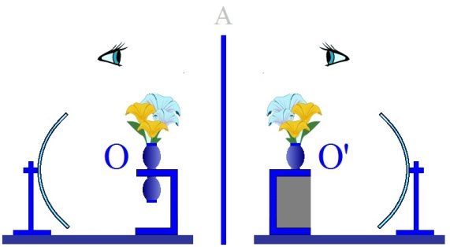
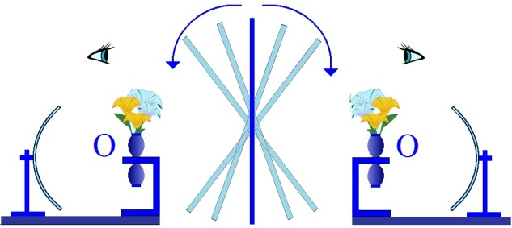

# Leçon 19 | 09 juin 1954

<!-- source-url: http://staferla.free.fr/S1/S1 Ecrits techniques.docx -->
<!-- seminar: s1 -->
<!-- lesson: 19 -->

<!-- id: s1-19-0001 -->

Je vous ai laissés, la dernière fois, sur *l’amour primaire*, *primary love*, la *rela­tion duelle*, qui constitue essentiellement, et sur lequel cette théorie arrive à mettre l’accent dans la relation analytique elle-même, c’est-à-dire cette *two bodies’ psychology*, comme s’exprime avec beaucoup de rigueur BALINT.

<!-- id: s1-19-0002 -->

Je pense que vous avez compris ce que je vous ai montré, je le résume, à quelle impasse on aboutit à faire de cette *relation imaginaire...*

<!-- id: s1-19-0003 -->

> comme harmonique saturante essentiellement du désir naturel, cette relation à un objet qui est un objet de satisfaction

<!-- id: s1-19-0004 -->

...à quelle impasse on aboutit si on en fait la notion centrale de cette relation duelle.

<!-- id: s1-19-0005 -->

J’ai essayé de vous le démontrerdans la phénoménologie de la relation per­verse comme telle. J’ai mis l’accent sur le sadisme et la scoptophilie. J’ai laissé de côté - parce qu’elle est une étude infiniment nuancée, à la lumière de ces remarques, dans l’ordre de ce registre - la relation homosexuelle car c’est préci­sément à approfondir cette face de *la relation intersubjective imaginaire*…

<!-- id: s1-19-0006 -->

> telle que je vous en ai montré la dernière fois, et que je vais vous répéter ce qui consti­tue essentiellement
>
> son incertitude, son équilibre instable, le caractère essen­tiellement critique

<!-- id: s1-19-0007 -->

…c’est à l’approfondir que toute une face de la phénoménologie de la relation homosexuelle peut être éclairée. Mais ceci mériterait une étude tout à fait particulière. Ce point autour duquel j’ai fait tourner l’étude de cette relation intersubjec­tive comme telle, sur le plan de *l’imaginaire*, je l’ai mis dans la fonction, dans le phénomène, au sens propre, du *regard*.

<!-- id: s1-19-0008 -->

Le *regard*, je vous l’ai dit, n’est pas simplement quelque chose qui se situe au niveau des yeux, quelqu’un qui vous regarde. C’est une dimension constitutive d’une relation comme telle qui ne suppose même pas forcément l’apparition de ces yeux, qui peuvent être aussi bien masqués, supposés par le *regard*. Dans le *regard* apparaît justement cet X que nous voyons, et qui n’est pas forcément la face de notre *semblable*, mais aussi bien la fenêtre derrière laquelle nous supposons qu’il nous guette.

<!-- id: s1-19-0009 -->

*Dans l’objet qu’il est, au-delà de l’objet qu’il n’est pas, apparaît au contraire l’objet devant quoi il devient objet.*

<!-- id: s1-19-0010 -->

Je vous ai introduis dans l’expérience de cette relation que j’ai prise, choisie comme élective, pour vous démontrer cette dimension, celle du *sadisme*. Je vous ai montré que dans le regard de l’être que je tourmente, je dois soutenir mon désir, en somme, par *un défi,* *un challenge* de chaque instant.

<!-- id: s1-19-0011 -->

S’il n’est pas au-dessus de la situation, s’il n’est pas glorieux, si je puis dire, ce désir choit dans la honte. Aussi bien est-ce vrai aussi de la relation *scoptophilique*. Et je vous rappelle cette analyse de Jean-Paul SARTRE, de celui qui est surpris en train de regarder, pour lequel effectivement toute la couleur de la situation change du fait de cette surprise. C’est qu’à ce moment là, dans ce moment de virage, et qui est un virage total, un renversement de la situation, qui tient exactement à ce rien, que je ne soutienne pas par une sorte de triomphe qui doit s’imposer une situation dans laquelle *je suis surpris*. Il tient à ce renversement de cette situation que je devienne une pure chose, un maniaque.

<!-- id: s1-19-0012 -->

La perversion ne se définit pas simplement comme atypie, aberrance, anomalie par rapport à des critères sociaux, contraire aux bonnes mœurs - mais bien entendu il y a aussi ce registre - ou à des critères naturels, à savoir qu’elle déroge d’une façon plus ou moins accentuée à la finalité reproductrice de la conjonction sexuelle. Mais elle est autre chose dans sa nature. Ce n’est pas pour rien qu’on a dit d’un cer­tain nombre de ces penchants pervers qu’ils sont d’« *un désir qui n’ose pas dire son nom* ».

<!-- id: s1-19-0013 -->

On touche là à un registre essentiel. En fait, c’est bien justement déjà à la limite de ce registre, de la reconnaissance qui la fixe, la situe, la stigmatise comme perversion. Mais structuralement, intimement, la perversion comme telle, telle que je vous la délinée dans ce registre imaginaire, à ceci qu’elle ne peut s’exercer, se soutenir que dans un statut précaire qui à chaque instant, et de l’intérieur, est contesté pour le sujet lui-même, insoutenable, fragile, à la merci de ce renversement, de cette subversion dont je vous parlais tout l’heure, et qui fait penser à ce type de *changement de signe* qu’on adjoint dans certaines fonctionmathématiques, au moment où on passe d’une valeur de variable à la valeur immédiatement suivante, le corrélatif passe du plus au moins l’infini d’un moment à l’autre.

<!-- id: s1-19-0014 -->

C’est cette incertitude fondamentale de la relation perverse qui ne trouve à s’établir dans aucune action satisfaisante, qui fait justement une face du drame de l’homosexualité. Je vous le dis : je ne peux pas m’y étendre aujourd’hui, je vous l’indique. C’est dans la triade de ces trois registres fondamentalement groupés et développés dans la dialectique du narcissisme : *scoptophilie, sadisme et homosexualité*. Mais c’est aussi cette structure qui donne à la perversion sa valeur d’expé­rience approfondissante de ce qu’on peut appeler, au sens plein, *la passion humaine*, c’est-à-dire ce en quoi, pour employer le terme spinozien, l’homme *exerce*, et l’homme est ouvert - non pas au sens fécond du terme : ouverture essentielle du monde de la vérité - à cette sorte de division d’avec lui-même qui structure cet *imaginaire* qui vise, *entre* O et O’, *la relation spéculaire*.

<!-- id: s1-19-0015 -->

<!-- id: s1-19-0016 -->

Elle est approfondissante en effet, en ceci que dans cette *béance* du désir humain, toutes les nuances… j’ai fait allusion à un certain nombre, la dernière fois, qui s’étagent de la honte au prestige, de la bouffonnerie à l’héroïsme …toutes ces nuances apparaissent, qui font que ce désir humain est en quelque sorte tout entier exposé - au sens le plus profond du terme - au désir de l’autre et qui fait que sur le plan de *ce désir intersubjectif imaginaire*…

<!-- id: s1-19-0017 -->

> souvenez-vous de cette prodigieuse analyse de l’homosexualité qui se développe dans PROUST sur le plan du mythe
>
> d’Albertine. Peu importe que ce personnage soit féminin, la structure de la relation est éminemment homosexuelle

<!-- id: s1-19-0018 -->

…et jusqu’où va l’exigence de ce style de désir, qui ne peut se satisfaire que d’une captation inépuisable du désir de l’*autre*, poursuivi - si vous vous en souvenez - jusque dans ses rêves par les rêves de l’*autre* ! Ce qui implique à chaque instant une sorte d’entière abdica­tion du désir propre du sujet.

<!-- id: s1-19-0019 -->

<!-- id: s1-19-0020 -->

*C’est dans ce miroitement* - et je l’entends dans le sens du miroir aux alouettes qui à chaque instant fait le tour complet sur lui-même - *dans ce renversement*... se poursuivant à chaque instant, s’entretenant lui-même, poursuite épuisante d’un désir de l’autre qui ne peut jamais être saisi comme le désir propre du sujet, le désir propre du sujet n’est jamais que le désir de l’autre ...*que réside le drame de cette passion jalouse*, si bien analysée par PROUST, *qui est aussi une* *autre forme de cette relation intersubjective imaginaire*.

<!-- id: s1-19-0021 -->

Qu’est-ce qu’il y a donc au fond de cette relation, qui n’est en quelque sorte saisissable à chaque instant qu’à la limite et dans ces *renversements* mêmes dont le sens en somme, s’aperçoit dans un éclair ? *Cette relation* qui n’est soutenable d’une part que de sujet à sujet, et suppose à chaque instant d’être *instabilité extrême*, qui *ne se soutient que par l’anéantissement* ou de l’autre, ou de soi-­même, comme désir.

<!-- id: s1-19-0022 -->

C’est-à-dire - réfléchissez bien - que chez l’autre et chez soi même, *cette relation dissout l’être du sujet* - du sujet de l’autre, de ce propre sujet - *dans* *la forme,* où chez l’autre sa réduction à être un instrument du seul sujet qui reste, à savoir pour soi-même, de la position de soi-même : comme une idole offerte au désir de l’autre.

<!-- id: s1-19-0023 -->

Le désir pervers a cette propriété d’avoir à sa limite l’idéal en fin de compte d’un objet inanimé. Mais non seulement il ne peut pas s’en contenter de cet idéal réalisé, mais dès qu’il le réalise il perd cet objet au moment même où il rejoint cet idéal. Son assouvissement est ainsi condamné par sa structure même à se réa­liser avant l’étreinte par :

<!-- id: s1-19-0024 -->

- ou bien *l’extinction du désir*,

<!-- id: s1-19-0025 -->

- ou *la disparition de l’ob­jet*.

<!-- id: s1-19-0026 -->

Je souligne « *disparition* » parce que vous trouvez dans des analyses comme celle-là la clef, et la clef secrète de ce quelque chose que tels analystes, non sans valeur, non sans rigueur - même une certaine densité dans ce qu’on sent qu’ils appro­chent, par le besoinqu’ils ont de compléter par exemple certains registres de vocabulaire de l’analyse de cette disparition de l’objet. C’est l’ἀϕάνι*σ*ις \[aphanisis\] dont parle JONES quand il essaie de voir au-delà du *complexe de castration* quelque chose qu’il touche dans l’expérience de certains traumas infantiles.

<!-- id: s1-19-0027 -->

Nous nous perdons là dans une sorte de mystère. Nous ne retrouvons pas par ailleurs dans cet élément structural, fondamental, qui définit une zone, un plan de relations intersubjectives et qui est proprement le plan de l’*imaginaire*. En fin de compte, toute une partie de l’expérience analytique n’est rien d’autre que cela : l’exploration de ces culs-de-sac de l’expérience *imaginaire* avec des prolongements qui ne sont pas innumérables, qui sont limités en nombre, qui ne reposent sur rien d’autre que sur un certain nombre de dimensions de la structure somatique même, du corps en tant qu’il apparaît comme corps et qui définit comme tel une topographie concrète.

<!-- id: s1-19-0028 -->

Ce n’est pas pour rien que j’ai spé­cialement évoqué trois registres aujourd’hui, comme il y a trois dimensions qu’inversement, c’est dans son histoire, à la limite du terme histoire, à savoir dans son développement, que paraissent certains moments féconds, temporali­sés, qui sont les différentes étapes possibles, différents styles de frustration, qui sont définis et qui définissent comme une sorte de négatif du développement, et non pas comme développement à proprement parler, comme aussi les creux, les failles et les béances apparus dans ces développements, qui définissent ces moments féconds, développés, signalés, repérés dans un registre, développe­mentalement historique \[...\] comme l’écrit FREUD lui-même.

<!-- id: s1-19-0029 -->

Aussi bien, c’est en approfondissant ceci, que quelque chose toujours défaille dans le discours analy­tique, quand on vous parle de la frustration, qui est précisément ce qu’on laisse toujours échapper, en raison de je ne sais quelle pente naturaliste du langage. Quand l’observateur fait l’histoire naturelle même de son *semblable*, il omet de vous signaler qu’au moment où le sujet, si prémature soit-il, ressent un mauvais objet, ce n’est pas simplement quelque chose que nous objectivons chez ce sujet sous la forme d’une sorte de détournement de l’acte qui l’unit à cet objet d’aver­sion animale \[...\] le mauvais objet est ressenti, lui-même, comme frustration, la frustration est ressentie dans l’autre \[...\]

<!-- id: s1-19-0030 -->

La notion de ce que nous pouvons appeler *« relation mortelle »*, cette relation est structurée par ces deux versants, ces deux abîmes où soit le désir s’éteint, soit l’objet disparaît. Elle est structurée par une relation réciproque d’anéantis­sement. C’est ce qui rend pour nous utile ce repère de « *la dialectique du maître et de l’esclave* ». Vous voyez qu’à maint tournant je suis obligé :

<!-- id: s1-19-0031 -->

- soit de m’y réfé­rer, de la réexpliquer,

<!-- id: s1-19-0032 -->

- soit de la réintroduire jusqu’à un certain point.

<!-- id: s1-19-0033 -->

Le seul fait que je n’ai pas pu la prendre et la développer devant vous ne peut faire qu’elle soit considérée comme épuisée. Que certains d’entre vous souhaitent qu’un jour on vous l’expose en l’approfondissant, c’est quelque chose qui est bien compréhensible ! Et à la vérité, ce peut être pour vous, je crois, d’un très grand enrichissement. Mais vous voyez combien elle est à la limite de ce que je vous expose. Je ne suis pas en train de vous dire que cette relation imaginaire que HEGEL vous a expliquée : « *dialectique du maître et de l’esclave* », car HEGEL part d’autres problèmes, d’autres faces de la structure concrète que celle que je suis, là, en train d’isoler dans l’expérience analytique à titre d’exemple, et je dirais d’exemple limite, car bien entendu ce *registre imaginaire* n’apparaît qu’à la limite de notre expérience, car notre expérience est, non pas totale, mais définie sur un autre plan, c’est ce qui va constituer ce que je vous apporte aujourd’hui.

<!-- id: s1-19-0034 -->

Ce plan est *le plan symbolique*. En quel sens est-elle structurée sur *le plan symbolique* ? C’est ce que je suis en train de vous expliquer aujourd’hui. Mais je m’arrête un instant à cette « *dialectique du maître et de l’esclave* ». De quoi rend compte HEGEL ? D’une certaine face, d’un certain mode du lien inter­humain, qui est fondamental dans son ensemble :

<!-- id: s1-19-0035 -->

- il a à répondre, non seulement de la société, mais de l’histoire,

<!-- id: s1-19-0036 -->

- il ne peut en négliger aucune des faces,

<!-- id: s1-19-0037 -->

- il sait bien qu’une de ces faces essentielles n’est pas simplement la collaboration entre les hommes, ni le pacte, ni le lien de l’amour, ni tout ce qui sans aucun doute existe,

<!-- id: s1-19-0038 -->

- il ne saurait non plus être mis au centre de la déduction \[...\]

<!-- id: s1-19-0039 -->

Dans l’édification qui se déroule dans *la passion*, le sérieux et le négatif *de la lutte et du travail*, c’est donc sur ce plan qu’il va se centrer. Et pour se structurer dans un mythe originel qui est cette relation fondamentale sur le plan que lui-même définit comme *néga­tif*, marqué de *négativité*. La nécessité même de son développement l’y pousse, ce que nous pourrions appeler une relation réelle d’utilisation de l’homme par l’homme, comme on voit certains insectes présenter ces formes de - pourquoi pas? - de sociétés, le terme ne me fait pas peur. Là se marquera la différence entre société animale et société humaine. Les sociétés humaines ne sont pas marquées ni concevables par aucune analyse de lien objectivable, interindividuel.

<!-- id: s1-19-0040 -->

Précisément, la dimension intersubjective en tant que telle, doit y entrer. Il ne s’agit donc pas de *domestication de l’homme par l’homme*. Cela ne peut pas suf­fire. Il faut qu’il y introduise, dans cette fondation de *la relation du maître et de l’esclave*, quelque chose qu’il appelle non pas la crainte de la mort, ce n’est pas ça qui fonde la relation, et le pacte du maître et de l’esclave ça n’est pas que l’es­clave ou celui qui s’avoue vaincu et qui demande grâce et crie, ce n’est pas cela qui fonde la chose, c’est que le maître se soit engagé dans cette lutte « *pour des rai­sons de pur prestige* », c’est qu’il ait opté « *pour des rai­sons de pur prestige* », c’est qu’il ait *risqué sa vie*.

<!-- id: s1-19-0041 -->

C’est cela qui est sa supériorité. C’est au nom de cela et pas au nom de sa force, qu’il est reconnu comme tel pour *maître* par *l’esclave*. C’est également au nom de cela que la situation - exactement comme *la situation imaginaire* et c’est cela qui permet le rapprochement, commence par une impasse.

<!-- id: s1-19-0042 -->

Car si au nom de ce risque, et de ce risque assumé « *pour des rai­sons de pur prestige* », l’esclave reconnaît le maître comme maître, cette reconnaissance pour le maître ne vaut rien, puisqu’il est reconnu par l’esclave, c’est-à-dire par quelqu’un que justement, au nom du même registre du risque, il ne reconnaît pas, lui, comme homme.

<!-- id: s1-19-0043 -->

La situation serait donc sans issue, elle resterait sur le plan de *l’imaginaire*. Et je vous prie de noter au passage l’affinité du départ de La struc­turation de *la dialectique du maître et de l’esclave* dans HEGEL, avec cette situa­tion *imaginaire*. Elle est développée comme telle. Cette impasse de *la relation du maître et de l’esclave* aboutit tout à fait \[...\] et c’est sa face d’affinité avec le registre de *l’imaginaire*, l’autre face est celle justement qui permet à partir de là de se dérouler. Toute la *dialectique de l’histoire* est constituée par *autre chose*, qui nous introduit dans *le plan sym­bolique*, c’est-à-dire tous les prolongements de cette situation.

<!-- id: s1-19-0044 -->

Les prolon­gements de cette situation, vous les connaissez : c’est justement ce qui fait qu’on parle du maître et de l’esclave. C’est à partir de ce moment initial, et en somme mythique puisqu’il est *imaginaire,* que s’établit la relation de *la jouissance* et *du travail,* c’est-à-dire qu’une action s’organise à partir de là.

<!-- id: s1-19-0045 -->

Les règles sont précisément la loi imposée à l’esclave d’une fonction qui est de satisfaire le désir et la jouissance de l’autre en tant que tel qui ne peut être conçue que comme organisée et définie. Parce qu’il ne suffit pas à l’esclave de *demander grâce*, il faut ensuite qu’il aille au boulot. Et pour aller au boulot, il y a des règles, des heures. Nous entrons dans le domaine du *symbolique*. Et si vous y regardez de près, ce domaine du *symbolique* n’est pas là dans un rapport simplement de succession au nœud, au pivot *imaginaire* de la situa­tion qui est constituée par la relation mortelle, et la définition même de cette *relation imaginaire*.

<!-- id: s1-19-0046 -->

Nous ne passons pas là par une sorte de saut qui va de *l’antérieur au postérieur*, à la suite *du pacte* et *du symbole*. Si vous appro­fondissez le mythe, vous voyez qu’il n’est concevable qu’absolument cerné par le registre du *symbolique*, pour la raison que ce que je vous ai désigné, accentué, souligné tout à l’heure, que la situation ne peut être fondée dans je ne sais quelle panique biologique à l’approche de ce quelque chose après tout jamais expérimenté, jamais réel, qu’est *la mort*, l’homme n’a jamais peur que d’une peur *imaginaire*, *la mort* dont il s’agit dans *le risque de la mort* est *une mort imaginaire.*

<!-- id: s1-19-0047 -->

Mais ce n’est pas tout : elle n’est même pas structurée, là, comme crainte de la mort, je vous l’ai souligné, elle est structurée comme *risque de la mort*, et pour tout dire comme enjeu. Il y a déjà dans la constitution, à l’origine, du *mythe du maître et de l’esclave*, au départ, une règle du jeu. Je n’insiste pas là-dessus aujourd’hui. Je le dis pour ceux qui sont le plus ouverts, le plus disposés à comprendre. C’est essentiel. C’est l’étage, le niveau où *l’intersubjectivité* baigne de bout en bout, et jusque même où nous voulons la soutenir, dans un développement quelconque de l’*imaginaire*.

<!-- id: s1-19-0048 -->

Toute relation intersubjective en tant qu’elle structure une action humaine est toujours plus ou moins implicitement impliquée dans *une règle du jeu*. Elle n’est analysable que comme telle. Reprenons encore, sous une autre face, ma relation au regard, regard allié à la fenêtre, ou au coin du bois, et moi avançant dans la plaine, et me supposant sous un regard.

<!-- id: s1-19-0049 -->

Ce dont il s’agit ce n’est pas tellement - dans une dialectique concrète j’entends, si je suppose ce regard qui me guette - ce n’est pas tel­lement que je craigne quelque action immédiate, quelque révélation de mon ennemi, quelque manifestation de son attaque, car aussitôt alors la situation se détend et je sais à qui j’ai affaire. Tant que je soutiens cette situation d’être supposé observé, ce qui m’importe le plus est de savoir ce qu’il détecte, ce qu’il suppose, ce qu’il imagine de mes intentions, à moi qui m’avance, puisque je suis supposé dans une situation de guerre, c’est de dérober mes mouvements à l’ennemi qu’il s’agit, c’est de ruse.

<!-- id: s1-19-0050 -->

Et c’est sur ce plan que se soutient la dialectique intersubjective du regard. Ce n’est donc pas qu’il voit où je suis qui est important, c’est qu’il voit où je vais, c’est-à-dire très exactement qu’il voit *où je ne suis pas*. Et c’est toujours cela qui est escamoté dans toute analyse de la relation réciproque, intersubjective, c’est que ce n’est pas ce qui est là, qui est vu, qui structure la situation, c’est *ce qui n’est pas là*.

<!-- id: s1-19-0051 -->

La *théorie des jeux*, comme on l’appelle, pour autant qu’elle est un mode d’étude fondamentale de cette relation subjective, illustre assez ce que nous disons pour que vous voyiez que du seul fait qu’elle est une théorie mathéma­tique, nous sommes déjà dans *le plan symbolique*. Il n’y a pas plus à en dire. Ouvrez tel ou tel livre moderne de ce qu’on appelle *théorie des jeux*, d’une éti­quette tout à fait impropre, car ça ne se limite pas à ce que vous pouvez croire, aux jeux plus ou moins conventionnels, qu’il s’agisse du jeu des monopoles, bimonopoles sur un marché, ou du jeu de dames ou d’échecs.

<!-- id: s1-19-0052 -->

L’analyse de ces structures est absolument essentielle pour tout développement de l’intersub­jectivité, et cette analyse toujours d’une certaine façon, suppose au départ un certain nombre - si simple que vous définissiez le champ de cette intersubjecti­vité - de données numériques, et comme telles *symboliques*.

<!-- id: s1-19-0053 -->

Si vous lisez le SARTRE auquel je faisais allusion l’autre jour, vous verrez qu’il laisse apparaître quelque chose d’extrêmement troublant : après avoir si bien défini cette relation d’intersubjectivité qu’il a imaginée, il semble impliquer que s’il y a dans ce monde *d’inter-relations imaginaires,* une plu­ralité, cette pluralité ne serait pas numérale en tant que chacun des sujets serait par définition l’unique, au centre des références.

<!-- id: s1-19-0054 -->

Ceci se soutient, dans l’analyse de son point de départ : analyse de *« l’en-soi »* et du *« pour-soi »*, il reste sur un plan strictement phénoménologique, ce qui fait qu’il ne s’aperçoit pas qu’au contraire le champ intersubjectif ne peut pas ne pas déboucher sur une structuration numérique, sur ce 3, et sur ce 4, sur lequel je vous apprends à vous *repérer*, depuis le moment même où nous essayons ici de définir l’expérience analytique.

<!-- id: s1-19-0055 -->

La relation de ce *symbolisme*, si primitif soit-il, celui qui est structuré dans la situation par un certain nombre de repères, de numéros, nous met exactement et tout de suite sur le plan du langage. Il n’y a pas de numération concevable autrement. En cherchant pour vous un certain nombre d’*exemples*, de points d’appui, d’illustrations de ce que je développe ici, je vous le signale parce que ça m’est venu, c’est encore une petite parenthèse de ce que je vous enseigne, je lisais, pas plus tard qu’il y a trois jours, un vieil ouvrage du début du siècle : *History of new world called America* (*Histoire du Nouveau Monde qu’on appelle Amérique*). Il s’agissait justement du problème qui, du point de vue de la genèse du langage, a attiré l’attention, voire provoqué la perplexité de pas mal de *lin­guistes*, et qui est essentiellement en relation avec la notion que nous pouvons nous faire de l’origine, de la genèse du langage.

<!-- id: s1-19-0056 -->

Toute discussion sur l’origine du langage est toujours entachée d’une irrémédiable puérilité. Chaque fois qu’on essaie de faire sortir le langage de je ne sais quel progrès de la pensée - il y a là un cercle absolument crétinisé par la formation secondaire - je ne sais quel progrès de la pensée se mettrait à isoler dans la situation entière, à cerner, le détail, la particularité, l’élément combinatoire.

<!-- id: s1-19-0057 -->

Comment supposer que la pen­sée saisit justement l’élément combinatoire, qu’elle passe au-delà du stade du détour qui marque l’intelligence animale, pour justement passer au stade du symbole, qu’ici on n’a pas d’abord le symbole, qui est la structure de la pensée humaine, à savoir substituer aux éléphants le mot « *éléphant* », et même au soleil *le signe d’une rondeur* ?

<!-- id: s1-19-0058 -->

Je ne sais pas si vous vous rendez compte de ce que ça représente comme abîme à franchir, de cette chose qui est le soleil par essence et phénoméno­logiquement justement, le centre de ce qui court sur le monde des apparences, l’unité de la lumière, et qu’on en fasse tout d’un coup, un rond, en saisissant un de ses aspects particuliers, et qu’on en fasse un rond, c’est une chose qui déjà est un abîme après tout qu’on pourrait franchir ! Faut-il croire que ce soit là encore quelque chose que le soleil soit un aspect d’assiette, ou de plat, quel serait le progrès sur l’intelligence animale ? Absolument rien. Le soleil ne vaut préci­sément rien en tant qu’il est désigné par un rond, à l’occasion, mais il vaut en tant que ce rond est mis en relation avec une série d’autres formalisations qui constituent avec lui ce « *Tout* » *symbolique* dans lequel il tient sa place au centre du monde par exemple, ou la périphérie, qu’importe, mais où il s’organise dans *un monde de symboles*.

<!-- id: s1-19-0059 -->

À propos des gens qui spéculent sur l’origine du langage et essaient de faire des transitions entre cette appréciation de la situation totale et *la fragmentation symbolique*, il y a une chose qui a toujours frappé les gens, c’est ce qu’on appelle *les holophrases.* C’est-à-dire dans l’usage de certains peuples, et soyez certains que vous n’auriez pas besoin de chercher loin pour trouver dans cette expé­rience *les holophrases*, dans notre usage courant, commun, des choses qui jus­tement ne sont pas décomposables et se rapportent en effet à une situation prise dans son ensemble. On a l’air de saisir là une ligne entre ce monde animal qui passe sans struc­turer les situations, et ce monde humain qui est *le monde symbolique*.

<!-- id: s1-19-0060 -->

Et alors toujours pour procéder là comme nous procédons dans l’analyse, nous mettons en question la question de *l’auto-symbolisme*, comme s’exprime SILBERER : quand un sujet passe dans un état de fatigue, de demi-sommeil, il se peut que la pensée qu’il poursuivait trouve immédiatement sa figuration dans les premières images hypnagogiques qui arrivent.

<!-- id: s1-19-0061 -->

Et les analystes viennent et disent que dans la situation concrète, il n’y a pas simplement ça, cette figuration a toujours un sens : on y retrouve le conflit, le super-ego, l’histoire du sujet. Les analystes ont tout à fait raison, mais simple­ment ils ont l’air de méconnaître que SILBERER ne dit pas le contraire mais qu’il montre un certain virage, l’apparition du phénomène figuratif.

<!-- id: s1-19-0062 -->

Je me suis rencontré à propos d’un phénomène analogue, à propos d’une de ces holophrases, à propos de l’ouvrage que je citais tout à l’heure, c’est chez les Fidjiens. Les Fidjiens prononcent un certain nombre de situations avec la phrase suivante, qui n’est pas une phrase de leur langage, qui n’est réductible à rien : « *ma mi la pa ni pa ta pa* ».

<!-- id: s1-19-0063 -->

Je ne vous dis pas qu’en le nuançant avec les prononciations propres à l’an­glais ça ne doive pas donner quelque chose de différent, mais ce n’est pas repro­duit dans le livre en écriture phonétique, je ne peux que vous le dire à peu près comme ça se lit, avec la phonétisation qu’on en donne. Et alors je lis sous la plume de l’auteur - vous allez voir quel rapport direct avec ce que je vous enseigne que désigne l’holophrase :

<!-- id: s1-19-0064 -->

- *state or events* : *l’état ou les événements*

<!-- id: s1-19-0065 -->

- *of two persons* : *de deux personnes*

<!-- id: s1-19-0066 -->

- *looking at the other* : *chacune regardant l’autre*

<!-- id: s1-19-0067 -->

- *hoping that other will* : *espérant chacune de l’autre qu’elle*

<!-- id: s1-19-0068 -->

- *offer to do something* : *va s’offrir à faire quelque chose*

<!-- id: s1-19-0069 -->

- *which both parties desire* : *que les deux parties désirent*

<!-- id: s1-19-0070 -->

- *but are unwilling to do* : *mais ne sont pas disposées à faire.*

<!-- id: s1-19-0071 -->

Nous trouvons là défini - avec une entière innocence de la part de l’ethno­graphe qui n’était pas précisément un théoricien de l’intersubjectivité - défini, délié avec une sorte de précision exemplaire, cet état de \[...\], d’inter-regard, où chacun attend de l’autre qu’il se décide pour quelque chose qu’il faut faire à deux, qui est entre les deux, mais où chacun ne veut pas entrer, ni se mouiller. Que ce soit à ça, justement, à cette limite qu’apparaissent \[...\] Alors vous voyez bien là, c’est tout le contraire.

<!-- id: s1-19-0072 -->

Il faut comme toujours ren­verser le point central de la perspective : ça n’est pas une genèse, un intermé­diaire dont il s’agit, entre je ne sais quoi qui serait une assomption primitive de la situation comme totale, c’est-à-dire du registre, *du mode de l’action animale* et de la symbolisation par l’intermédiaire de je ne sais quoi qui serait je ne sais quel premier engluement de la situation dans un mode verbal. Il s’agit au contraire de quelque chose où ce qui est du registre de la composition symbo­lique est défini à la limite, à la périphérie. Je vous donne le soin de m’apporter un certain nombre de phrases ou d’*holophrases* qui sont de notre usage courant, il y en a plus d’une, croyez-moi, écoutez bien la conversation de vos contempo­rains, et vous verrez le nombre d’*holophrases* qu’elle comprend. Vous verrez aussi à quelles sortes de situations limites, de situations de suspension du sujet dans un rapport spéculaire l’un à l’autre, toujours d’une façon plus ou moins directe, elles se rattachent.

<!-- id: s1-19-0073 -->

Alors nous voilà arrivés, avec l’analyse faite pour renverser pour vous cer­taine perspective qui est celle justement de la relation inter-objectale conçue comme fondée sur une satisfaction complémentaire, naturelle entre les *two objects* dont on vous parle dans la psychologie. À quoi arrivons-nous ? Nous arrivons à l’article de BALINT « *On transfe­rence of emotions »*, « *Sur le transfert des émotions »*, qui déjà dans son titre porte avec soi l’annonce de ce que je peux vraiment appeler *le plan délirant* dans lequel il va se dérouler, au sens technique et originel du terme *« délirant »*.

<!-- id: s1-19-0074 -->

Il s’agit du transfert, on nous l’annonce tout de suite : premier paragraphe, on évoque les deux phénomènes fondamentaux de l’analyse: *la résistance* et *le transfert*. La résistance, tout le monde sait ce que c’est. On la définit d’ailleurs fort bien en la rapportant justement au phénomène du langage : tout ce qui freine, altère, retarde le débit, ou bien l’interrompt complètement. On ne va pas plus loin, on n’en tire pas de conclusion, et on passe au phénomène du transfert.

<!-- id: s1-19-0075 -->

Comment un auteur si subtil, aussi fin, aussi délicat praticien, aussi admirable écrivain dirais-je même, que BALINT, peut-il développer toute une étude d’une quinzaine de pages sur le transfert, en partant d’une définition du transfert qui, précisément, pour se situer sur un départ psychologique, à savoir qu’il doit s’agir de quelque chose qu’il faut que ça existe à l’intérieur, alors c’est forcément, on ne sait quoi : des sentiments, des émotions…

<!-- id: s1-19-0076 -->

> le mot « émotion » fait toujours mieux image, alors on parle d’émotions

<!-- id: s1-19-0077 -->

…et ce qu’il importe de montrer, est comment les émotions humaines s’incarnent, se projettent, se dis­ciplinent, se *symbolisent* enfin, il faut le dire, par quelque chose qui évidem­ment n’a aucun rapport avec elles.

<!-- id: s1-19-0078 -->

Alors nous parlons *du drapeau national, du lion et de la licorne britanniques, des épaulettes des officiers*, et de tout ce que vous voudrez \- lisez *l’histoire de deux pays avec leurs deux roses de cou­leurs différentes* - tout ce qui est aussi bien à la surface de la vie de la com­munauté britannique ou de toute autre communauté. On trouve là des exemples piquants, puisque les juges portent perruque, et que ça peut être matière à méditation. Mais de quoi s’agit-il ?

<!-- id: s1-19-0079 -->

*Le domaine du symbole est ici introduit*, non pas dans sa structuration générale et pour autant qu’il nous importe…

<!-- id: s1-19-0080 -->

> et nous allons le voir quand il va amener des exemples concrets, com­ment il faut examiner la question de *symbole*

<!-- id: s1-19-0081 -->

…mais en tant uniquement qu’il est un déplacement, puisque par définition et au départ on met en parallèle, en « *pendant* », la soi-disant émotion, le phénomène de surgissement psychologique qui serait là le *réel*, et le quelque chose dans lequel il est, à trouver son expres­sion, la réalisation c’est donc sous l’angle du déplacement.

<!-- id: s1-19-0082 -->

Bien entendu, le *symbole* par lui-même joue une fonction dans tout ce qui se réalise comme déplacement. Mais toute la question est : est-ce cela sa fonction ? Faut-il le définir dans ce registre vertical, à titre de déplacement ? On voit assez bien à quel point c’est une fausse route, une fausse voie, en ceci que ce qui paraît à partir de ces remarques fondamentales, dont rien n’est erroné en elles-mêmes, c’est simplement que la voie est prise exactement dans le sens transversal : au lieu de l’être dans le sens où elle doit *s’avancer*, elle est dans le sens où tout *s’ar­rête*.

<!-- id: s1-19-0083 -->

On voit la dialectique et l’analyse continuer par le rappel de la métaphore de ce qu’on appelle le front d’une montagne, le pied d’une table, etc. Nous continuons toujours dans *les phénomènes de langage*. À quoi ça aboutit ? On croit qu’on va comprendre la nature du langage ? Non ! Ce dont il s’agit c’est de dire qu’en fin de compte le type de l’opération de transfert est ceci : vous êtes en colère, c’est à la table que vous donnez un coup de poing ! Comme si effectivement je donnais un coup de poing à la table, il y a là une erreur fondamentale. Néanmoins, c’est de cela qu’il s’agit, de voir :

<!-- id: s1-19-0084 -->

- com­ment l’acte se déplace dans son but,

<!-- id: s1-19-0085 -->

- comment l’émotion se déplace dans son objet,

<!-- id: s1-19-0086 -->

- comment cette sorte de relation ambiguë entre la *structure réelle* et la *structure symbolique* se fait dans le sens vertical, la relation point à point d’un de ces univers avec l’autre, à ceci près que la notion d’univers n’y étant pas, il n’y a aucun moyen de l’introduire.

<!-- id: s1-19-0087 -->

Par conséquent ceci est soutenu jusqu’au bout de l’article. Cette analyse qu’il en donne, la notion du transfert comme tel transfert d’émotions, ce sur quoi l’émotion se transfère dans tous ces exemples, c’est un *objet inanimé*. Il pose la question humoristiquement : je ne vous demande pas ce qu’en pense l’*objet inanimé*. En effet, c’est intentionnellement que j’ai choisi l’objet inanimé, parce que là la situation est claire, plus simple. Autrement, si nous ne le suppo­sons pas *inanimé* - je vous fais remarquer que le mot « *inanimé* », vous l’avez vu apparaître tout à l’heure à la limite de la relation dialectique *imaginaire -* c’est que si nous pensons que l’autre est aussi un sujet, nous entrons dans une com­plication dont, dit-il, il n’y a plus moyen de sortir.

<!-- id: s1-19-0088 -->

S’il n’y a pas moyen d’en sortir, *il n’y a pas moyen de faire d’analyse*. C’est bien d’ailleurs à quoi nous arrivons depuis quelque temps. On nous fait un tel plat, on promet avec un air de bravoure, qui n’est pas sans révéler je ne sais quelle gêne, qui se manifeste par le style même de cette fanfaronnade mise autour de la notion de contre-transfert. Ça signifie quoi en fin de compte, cette pointe, ce prolongement, cette accentuation : qu’en fin de compte il n’y a pas moyen d’en sortir.

<!-- id: s1-19-0089 -->

Nous sommes là devant le fameux problème, avec la *two bodies’ psychology*, l’énoncé irrésolu en physique, [*le problème des deux corps*](http://fr.wikipedia.org/wiki/Probl%C3%A8me_%C3%A0_deux_corps). En effet, si on reste sur ce plan des deux corps, il n’y a pas moyen de donner une *symbolisation satisfaisante*.

<!-- id: s1-19-0090 -->

Il s’agit de savoir si c’est ça, si c’est en s’enga­geant dans cette voie et en parlant d’abord de transfert comme étant essentiel­lement le phénomène du déplacement, qu’on saisit effectivement ce qu’est le phénomène du transfert. Dès qu’il passe au contraire, c’est-à-dire qu’il l’illustre par des exemples pris dans notre expérience - ce qui veut dire dans la clinique, dans ce qui se passe pour nous dans l’analyse et pas seulement au tableau noir - il raconte une première jolie histoire.

<!-- id: s1-19-0091 -->

Un monsieur qui vient le voir, il est là au bord de l’analyse. Nous connais­sons bien cette situation, et il ne se décide pas. Il a été voir plusieurs analystes. Enfin, il vient voir BALINT. Il lui raconte une longue histoire, très riche, très compliquée, avec des détails, des choses qu’il sent, qu’il souffre. Et c’est là que notre BALINT…

<!-- id: s1-19-0092 -->

> dont je suis en train de diffamer les positions théoriques, et Dieu sait si je ne le fais qu’à regret,
>
> mais c’est essentiel, car il s’agit de savoir où on va

<!-- id: s1-19-0093 -->

…se révèle le merveilleux personnage qu’on voit vivre dans cette histoire. C’est là que se révèle, non pas le contre-transfert, comme on dit dans le langage à clef dans lequel nous croupissons, qui consiste à appeler « *ambi­valence* » le fait de haïr quelqu’un, ou appeler « *contre-transfert* » le fait d’être un imbécile.

<!-- id: s1-19-0094 -->

BALINT n’est pas un imbécile. Il écoute ce type. Il a déjà entendu pas mal de choses, de gens, il est mûri, il est quelqu’un, il est un homme, un être. Il ne comprend pas... Voilà ! Il y a des histoires comme ça : on ne les comprend pas. Quand vous ne comprenez pas une histoire, eh bien, ne vous accusez pas tout de suite, dites-vous : « *ça doit avoir un sens que je ne comprenne pas* ». Et là BALINT non seulement ne comprend pas, mais fait comme quelqu’un qui ne comprend pas, et considère que du moment qu’il ne comprend pas, il est en droit de ne pas comprendre. Et il doit y avoir une cause. Il ne dit rien à son type et le fait revenir. Le type revient et continue à raconter son histoire, et il en remet. Et BALINT ne comprend toujours pas. Et il y a quelque chose évidemment : ce sont des choses aussi vraisemblables que d’autres, seulement voilà, elles ne vont pas ensemble.

<!-- id: s1-19-0095 -->

C’est une expérience clinique, ça nous arrive, ces choses-là, et il faut toujours en tenir le plus grand compte. Quelquefois ça nous projette vers un diagnostic, à savoir qu’il doit y avoir justement quelque chose d’organique dans certains cas. C’est comme ça que FREUD nous apprend à faire un diagnostic dans certains cas. Mais là ce n’est pas de ça qu’il s’agit. Cette histoire compliquée, il n’apparaît rien à l’horizon qui ne soit étranger. Eh bien voilà, il le dit :

<!-- id: s1-19-0096 -->

> « *C’est curieux, vous me racontez des tas de choses, fort intéressantes, mais moi je dois vous dire que votre histoire : je n’y com­prends rien.* »

<!-- id: s1-19-0097 -->

Alors le type s’épanouit, large sourire sur sa face et dit :

<!-- id: s1-19-0098 -->

« *Vous êtes le premier homme sincère que je rencontre, car toutes ces choses que je viens de vous raconter, je les ai racontées à un certain nombre* *de vos collègues qui y ont tout de suite vu l’indice de la structure intéressante, complexe, raffi­née… Mais tout cela, je vous l’ai raconté à titre* *de test, et pour voir si oui ou non vous étiez comme tous les autres, un charlatan et un menteur.* »

<!-- id: s1-19-0099 -->

L’intéressant est l’exemple, car vous devez sentir quelle gamme il y a entre les deux registres :

<!-- id: s1-19-0100 -->

- le registre de BALINT au tableau noir, qui nous expose que ce sont les émotions des citoyens anglais qui sont déplacées sur le *british lion* et les *deux licornes*,

<!-- id: s1-19-0101 -->

- et BALINT quand il est *en fonction*, quand il parle intelligemment des choses qu’il expérimente.

<!-- id: s1-19-0102 -->

Est-ce que - vous vous en rendez compte ? - ce n’est pas là que nous commençons à entrer dans l’aberration, quand nous faisons sim­plement une remarque *irrelevant*, de dire : « *C’est très bien, tout ça.* » ? Ce type après tout est *dans son droit* d’opérer ainsi. Mais est-ce que ce n’est pas une façon *un-economic* ? Est-ce que ce n’est pas un très long détour ?

<!-- id: s1-19-0103 -->

Et nous voilà rentrés dans l’aberration, sur le plan de quelque chose qui n’a aucun rapport. Il n’est pas question de savoir si c’est *économique* ou *pas économique*. Cela se soutient dans son registre, et hautement, car à la vérité, s’il s’agit de quelque chose dans le transfert, et il a tout à fait raison de situer ça quelque part juste­ment au départ de l’expérience analytique, ce registre dans lequel la parole est *menteresse*, et que c’est précisément

<!-- id: s1-19-0104 -->

- *parce qu’elle est menteresse*,

<!-- id: s1-19-0105 -->

- *parce qu’elle instaure, qu’elle introduit dans la réalité le mensonge*, c’est-à-dire quelque chose qui n’est pas,

<!-- id: s1-19-0106 -->

- *c’est parce qu’elle introduit ce qui n’est pas* *qu’elle peut aussi introduire ce qui est*.

<!-- id: s1-19-0107 -->

Car avant la parole, rien *n’est* ni *n’est pas*. Tout est là sans doute, mais c’est avec la parole qu’il y a « *des choses qui sont »,* vraies ou fausses : qui sont, et « *des choses qui ne sont pas* ». C’est *avec cette dimension de la parole* que *se creuse, dans le réel, la vérité*, qui n’a - avant la parole - aucune raison de s’y introduire, car il n’y a rien, ni vrai ni faux, tout est là dans la situation, il n’y a aucune espèce de vrai ni de faux avant que la parole puisse, en s’y introduisant, y introduire quoi ?

<!-- id: s1-19-0108 -->

J’ai parlé du men­songe, parce que c’est du mensonge qu’il s’agit, mais il y a d’autres registres. Dites-vous que ces registres… appelons-les, connotons-les, avant de nous quit­ter aujourd’hui, dans une sorte de triangle à trois sommets :

<!-- id: s1-19-0109 -->

- nous mettrions justement *le mensonge* à un sommet,

<!-- id: s1-19-0110 -->

- à un autre, quelque chose qui n’est pas le mensonge mais est introduit aussi par la parole : *la méprise*, c’est intentionnelle­ment que je dis la méprise, et non pas l’erreur. J’y reviendrai.

<!-- id: s1-19-0111 -->

- Et puis, quoi encore ? *L’ambiguïté*. Nous y reviendrons aussi.

<!-- id: s1-19-0112 -->

Du fait que précisément la parole, en tant que c’est elle qui fonde ce registre, de ce qui est vrai, que c’est justement par son acte qu’elle le fonde, laisse toujours, derrière cette fondation de la vérité, ce quelque chose de son acte qui est au-delà et qui pose, derrière le fait même de la fondation, ce par quoi elle l’a fondé. Et de par sa nature même non seulement la parole est vouée à cette *ambiguïté*, mais si elle n’est pas par essence *ambiguë*, elle n’est plus une parole.

<!-- id: s1-19-0113 -->

C’est justement à partir de l’instauration de ce domaine de la parole que se creuse *dans le réel*, et si on peut dire : symétriquement, ce *trou*, cette *béance de l’être* en tant que tel. Vous savez bien que la notion même d’*être*, dès que nous essayons de l’insérer, se montre aussi insaisissable que *la parole*. Car *l’Être* - le Verbe même - *n’existe que dans le registre de la parole qui introduit ce creux de l’être* *dans la texture du réel*. L’un et l’autre se tiennent et se balancent, ils sont exactement corrélatifs.

<!-- id: s1-19-0114 -->

Un autre exemple que nous apporte BALINT... il n’est pas moins significatif que le premier, et on se demande comment il peut les apporter et même les rattacher à ce registre du déplacement, ce registre du déplacement dans lequel le transfert comme tel a été amplifié ...c’est une autre histoire : c’est une charmante patiente qui présente ce type illustré dans certains films anglais de ce qu’on appelle *chattering : parler, parler, parler pour ne rien dire*. C’est comme ça que se passent ses séances. Il y a quelque chose qui rend encore plus significatif le cas, c’est qu’elle est déjà passée, elle aussi, mais dans l’analyse, elle a déjà fait de longs bouts d’analyse avec un autre. Finalement, elle vient entre les mains de BALINT, qui l’écoute, qui se rend bien compte - c’est même avoué par la patiente – que quand il y a quelque chose qui l’embête, elle remplit ça en racontant n’importe quoi.

<!-- id: s1-19-0115 -->

Où est le tournant tout à fait décisif dans l’histoire ? C’est quand un jour, après une heure pénible autour du même mode de procéder de la patiente, BALINT finit par mettre le doigt sur ce qu’il y a ce jour-là, c’est-à-dire ce qu’elle ne veut pas dire. Et ce qu’elle ne veut pas dire, c’est qu’elle a eu d’un médecin de ses amis qui n’est pas en relation avec l’analyse antérieure, une lettre de recom­mandation pour qu’elle trouve du travail, et où on dit d’elle qu’elle est une per­sonne parfaitement \[...\] Nous allons plus loin et entrons dans cette dialectique du travail en tant qu’inséré dans *le symbole*, dans *la loi*.

<!-- id: s1-19-0116 -->

Ce jour-là, il fait tourner le sujet autour de lui-même, trouve le moment pivot autour de quoi va tourner toute l’analyse, et où elle va pouvoir enfin s’engager dans quelque chose. Il le trouve dans le fait qu’il arrive à faire avouer à la patiente que ce dont il s’agit pour elle, et depuis toujours, c’est justement ça : qu’il ne faut pas que tout le monde sache à la fin qu’on la considère comme \[...\]c’est-à-dire quelqu’un que ses paroles engagent.

<!-- id: s1-19-0117 -->

Car si ses paroles l’engagent, il va falloir qu’elle se mette - comme l’exemple de tout à l’heure - qu’elle se mette au boulot, qu’elle entre dans le monde du travail, dans le monde de la relation adulte homogène. Et ce dont il s’agit pour elle depuis toujours, ce qu’elle a très bien compris, c’est la diffé­rence qu’il y a entre la façon dont on accueille les paroles d’un enfant…

<!-- id: s1-19-0118 -->

> bien entendu, tout ça n’est pas dit tout à fait comme je vous le dis,
>
> mais suffisamment pour rendre légitime ce que je mets là en relief

<!-- id: s1-19-0119 -->

…et celle dont on accueille les paroles d’un adulte. Pour ne pas être forcée d’être engagée, d’être située ici ou là, comme apparaît le monde des adultes où on est plus ou moins réduit en esclavage. Et le rapport entre cela et le fait qu’elle bavarde pour ne rien dire, qu’elle meuble ses séances avec du vide, du creux, du vent, c’est celui-ci.

<!-- id: s1-19-0120 -->

En surcroît, nous pouvons nous arrêter et méditer un instant que l’enfant aussi a *une parole*. La différence entre *la parole* de l’enfant et celle de l’adulte, n’est pas du tout que sa parole soit vide. Elle est aussi pleine de sens que la parole de l’adulte. Elle est même tellement pleine de sens que les adultes pas­sent leur temps à s’en émerveiller :

<!-- id: s1-19-0121 -->

« *Comme il est intelligent, le cher mignon ! Vous avez vu ce qu’il a dit l’autre jour ? Ah ! Ma chère !* ... »

<!-- id: s1-19-0122 -->

Mais justement : tout est là ! C’est qu’en effet, comme pour tout à l’heure dans cet élément d’idolification qui intervient dans *la relation imaginaire,* cette parole admirable est une parole transcendante, une révélation du ciel, un oracle du petit dieu ! Mais il est bien évident en effet, que ça ne l’engage à rien et qu’on fait tous ses efforts en effet pour lui arracher, quand ça ne va pas, des paroles qui engagent.

<!-- id: s1-19-0123 -->

Et Dieu sait si la dialectique de l’adulte s’ar­range, là, pour déraper ! Nous ne le savons que trop ! Mais c’est ça dont il s’agit. C’est justement de la valeur de la parole en tant qu’elle s’engage dans une dialectique, c’est-à-dire qu’on lie le sujet à ses propres contradictions, pour lui dire qu’on lui fait signer quelque chose.

<!-- id: s1-19-0124 -->

À un point plus avancé, plus développé de la situation analytique, la situa­tion de transfert…

<!-- id: s1-19-0125 -->

> ce n’est pas moi qui le dis, c’est lui, je ne fais que commenter le texte, et il a raison

<!-- id: s1-19-0126 -->

…il le donne comme exemple du transfert. Vous voyez qu’il s’agit bien d’autre chose que d’un déplacement.

<!-- id: s1-19-0127 -->

Et une fois de plus, il s’agit de la valeur de *la parole*, cette fois-ci non plus comme créatrice de cette ambiguïté fondamentale, mais comme *fonction* proprement *symbolique* du *pacte* liant et unissant comme tel les sujets les uns aux autres dans une action humaine par excellence fondée originellement et initialement sur l’existence de *ce monde du symbole*, à savoir *les lois* et *les contrats*.

<!-- id: s1-19-0128 -->

C’est sur ce registre que BALINT, quand il est dans le concret dans sa fonction d’analyste, repère, détecte, fait tourner la situation entre lui et le sujet, et qu’à partir de ce jour il peut lui faire remarquer toutes sortes de choses :

<!-- id: s1-19-0129 -->

- la façon dont elle se comporte dans *ses places*, à savoir que dès qu’elle commence à recueillir la confiance générale, elle s’arrange jus­tement pour faire un petit quelque chose qui fait qu’elle se fait foutre à la porte,

<!-- id: s1-19-0130 -->

- *la forme même des travaux* qu’elle trouve, aussi, est très significative, ce sont des détails très amusants : au téléphone, recevoir des choses et envoyer les autres faire des choses diverses, travaux d’aiguillage qui lui permettent de se sentir en dehors de la situation. À la fin, elle s’arrange cependant toujours pour *se faire renvoyer*.

<!-- id: s1-19-0131 -->

Voilà sur quel plan vient jouer la relation du transfert, autour d’une façon quelconque :

<!-- id: s1-19-0132 -->

- soit de l’institution de *la relation symbolique*,

<!-- id: s1-19-0133 -->

- soit de sa pro­longation,

<!-- id: s1-19-0134 -->

- soit de son soutien.

<!-- id: s1-19-0135 -->

C’est dans ce domaine de la fonction de la parole, des propriétés de la parole, que nous voyons essentiellement se développer le transfert : à des incidences, des projections, des articulations, tant de l’ordre de *l’imaginaire*, mais qui se situe tout entier dans *la relation symbolique*.

<!-- id: s1-19-0136 -->

C’est là simplement aujourd’hui, à l’aide de ce petit commentaire d’un texte de BALINT particulièrement significatif où je veux vous amener. Qu’est-ce que cela implique ? Ce *monde de la parole* n’est pas simplement sur un seul plan. Par défini­tion, *la parole* a toujours ses arrière-plans, ambigus, qui vont jusqu’à l’inef­fable, au moment où elle ne peut plus se dire elle-même en tant que parole, se fonder en tant que parole. C’est là un point dans lequel nous arrivons à *un au­-delà*. Mais vous voyez que cet *au­-delà* n’est pas le même que nous cherchons dans la psychologie du sujet.

<!-- id: s1-19-0137 -->

Il est dans la dimension même de la parole. Par rapport à cet \[autre\] *au-delà* qu’il est coutume d’aller chercher dans je ne sais quelle mimique, crampe, agitation du sujet, corrélatif psychologique émotionnel de la parole, cet *au­-delà* est alors de l’autre côté, c’est *un en-deçà*. C’est de cela qu’il s’agit. Et dans ce sens se creuse la réalisation essentielle qui se fait dans l’analyse. Quand nous parlons de *l’être du sujet*, ça ne veut pas dire quelque chose qui va dans le sens de ses propriétés psychologiques, mais dans le sens d’un appro­fondissement de cette expérience de parole dans laquelle est située l’analyse, et ça nous permet du même coup de mieux nous rendre compte de ce que c’est que *la situation analytique*. Si on veut comparer *la situation analytique* à quelque chose, c’est très précisément à ce que j’évoquais tout à l’heure, c’est dans l’ordre *d’un échange de la parole, de la relation symbolique*, quelque chose qui est constitué au départ par une certaine règle du jeu.

<!-- id: s1-19-0138 -->

L’expérience analytique est enfermée dans certains usages réglés avec des règles certainement très frappantes et très paradoxales :

<!-- id: s1-19-0139 -->

- c’est d’un dialogue qu’il s’agit, dialogue aussi monologue que possible,

<!-- id: s1-19-0140 -->

- c’est une règle du jeu tout entière dans l’ordre symbolique dans laquelle elle se développe.

<!-- id: s1-19-0141 -->

Est-ce que vous y êtes ? C’est cela que j’ai voulu aujourd’hui exemplifier par le contraste entre les exemples concrets que donne BALINT et ce en quoi se manifestent pour lui, et à juste titre, les phénomènes typiques de transfert, et les exemples qu’il en donne. Naturellement, à la fin, ce qui lui paraît le plus frappant dans la situation est l’exercice, l’usage qu’ont fait ces deux personnes de la parole, comme si c’était là le ressort vraiment de la situation.

<!-- id: s1-19-0142 -->

Vous voyez que c’est une extrapolation abusive, car la situation n’est pas du tout la même que cette sorte de parole à la fois triomphante et innocente que peut utiliser l’enfant avant qu’il soit entré dans le monde du travail, et le fait, dans le monde du travail, de soutenir un discours exprès insignifiant.

<!-- id: s1-19-0143 -->

Ce n’est que par déduction d’un certain rapport établi qu’on peut lier les deux. Le fondement est différent. Ce n’est pas simplement *une ectopie de la situation enfantine*, c’est le maintien, l’essai de maintenir *une situation atypique* en construisant d’une cer­taine façon dans le registre du *primary love* dont nous parlons sans cesse, nous essayons de justifier en pensant qu’il s’agit là d’une certaine recherche\[...\]

<!-- id: s1-19-0144 -->

C’est vrai sous certains angles. Mais pas sous tous, et en se limitant à cet angle on peut s’embarquer dans des perspectives fausses, à savoir qui peuvent moti­ver de notre part une intervention déroutante pour le sujet. Il n’est pas sûr qu’il faille dire : ce sont telles ou telles relations enfantines. Et le fait le prouve : ce n’est pas en faisant comme l’analyste qui a précédé BALINT, à savoir dire qu’elle reproduisait là telle situation de son enfance, que BALINT a fait tourner la chose, mais autour du fait concret, *le fait* que cette dame avait ce matin-là en sa pos­session une lettre qui lui permettait de trouver une place, justement dans le registre de cette fonction de la parole, de la garantie donnée du fait de répondre de quelqu’un.

<!-- id: s1-19-0145 -->

Et c’est justement parce que, sans le théoriser, sans le savoir, il était sur ce plan, qu’il a été *efficace*. Vous voyez combien il est important de situer les choses. Je ne voudrais pas terminer sans dire tout de même combien justement, à tra­vers cette théorie qui est décalée, dégradée elle aussi, et c’est bien de ce déplace­ment de la théorie qu’il s’agit ici de voir quel est son sens, et pourquoi il se fait \- et c’est là que nous viendrons la prochaine fois - dans *ce petit triangle de la parole*, avec ces fonctions et *ces retentissements dans l’être*. Ce fera le sujet de ce que nous dirons la prochaine fois. Et même je n’hésiterai pas à tomber dans la schématisation spatiale et à vous en faire au tableau l’espèce de petite repré­sentation pyramidale. Je vous indiquerai que d’un autre côté, si on prend le texte, on trouve, comme vous venez de le voir par ces exemples, des exemples merveilleusement lumineux, explicatifs. BALINT, naturellement excellent praticien, ne peut pas méconnaître dans quelle dimension il se déplace.

<!-- id: s1-19-0146 -->

Parmi les références, il y en a une à un *distique* de celui qu’il appelle « *un de nos confrères* » - et mon Dieu, pourquoi pas ? - celle de Johannes SCHEFFLER qui au début du XVIIème siècle a fait des études médicales fort poussées - ça avait pro­bablement plus de sens à cette époque que de nos jours. Sous le nom d’Angelus SILESIUS, il a écrit un certain nombre de *distiques* les plus saisissants sur les rap­ports de \[...\] et de la déité. On pourrait résumer l’axe général de ses distiques, dont on ne peut pas dire qu’ils soient mystiques. Il s’agit de la déité, de la créativité par essence qui est autour de la fonction de la parole humaine aussi loin qu’elle porte son appro­fondissement, et que même elle finisse par se taire.

<!-- id: s1-19-0147 -->

Les deux vers que cite BALINT sont fort beaux, il ne s’agit rien moins que de l’*être* en tant que *lié au contingent*, à l’accidentel dans la réalisation du sujet. Le fait que BALINT ait pu chercher une chose pareille est très significa­tive, parce que pour qu’il ait la pratique de ces textes… Les textes d’Angelus SILESIUS sont, parmi les textes « *mystiques* » - appelons ça comme ça, entre guillemets. À la vérité ce n’est peut-être pas le terme le plus exact - les plus sai­sissants. Ils se posent surtout dans la perspective pas très orthodoxe dans laquelle Angelus SILESIUS s’est toujours affirmé, qui pose les énigmes les plus impressionnantes à tous les historiens de la pensée religieuse. Ce n’est pas par hasard. C’est un personnage significatif de ce qu’on peut appeler le cycle allemand depuis \[...\] jusqu’à \[...\] . Le voir émerger dans le texte de BALINT n’est certainement pas un fait de hasard. Je vous l’indique seulement ici, pour vous dire aussi *que c’est justement dans cette perspective de l’approfondissement de l’action de la parole* que nous pouvons aussi concevoir *l’au-delà*, non seulement \[...\] mais tout à fait essentielle dimension de ce progrès, qui théoriquement - et à en croire et à en suivre BALINTet d’autres auteurs - aboutirait à cette sorte de réintégration ou d’éruption narcissique dont je vous ai montré, lors d’un entretien, que les auteurs, et spécialement BALINT, sem­blent y voir le dernier terme du progrès analytique.

<!-- id: s1-19-0148 -->

Ce que je vous ai un jour dési­gné au tableau par une flèche - cette espèce de recul du point O vers quelque part en arrière, et qui pour nous doit arriver à donner un sens tout à fait différent à la formule de FREUD, qui est d’habitude prise selon une spatialisation tout à fait gros­sière et sommaire : « *Là où le id, le Ça était, l’ego doit être* ». C’est bien dans cette direction de *l’approfondissement de l’acte de la parole* que nous en trouverons véritablement le sens. Et à méconnaître cette dimension il est impossible d’échapper à ce *schéma* qui fait de la reconquête de l’*id* quelque chose qui est en fin de compte *un acte de mirage*. L’*ego* se voit dans un *soi* qui n’est qu’une dernière et plus perfectionnée aliénation de lui-même que toutes celles qu’il a connues jusque-là. Si nous ne nous attachons pas à nous donner l’idée de ce qu’est de constituant *l’acte de la parole* en elle-même, vous ne pourrez pas voir ce qu’il est : qu’il s’agit non pas d’une sorte d’agrandissement, de reconquête par l’*ego* d’un certain champ, d’une certaine pente, d’une certaine frange d’inconnu, mais d’un véri­table renversement, d’un déplacement, d’un changement de place, une espèce de menuet exécuté entre l’*ego* et le *id*.

<!-- id: s1-19-0149 -->

Distique 30, dans le IIème livre du *Pèlerin chérubinique* d’Angelus SILESIUS[^29] :

<!-- id: s1-19-0150 -->

« *Homme deviens essentiellement ce que tu es, car quand le monde décline*…

<!-- id: s1-19-0151 -->

C’est bien de cela qu’il s’agit, d’un crépuscule, d’un déclin imaginaire du monde, et même, jusqu’à un certain point, d’une certaine expérience à la limite de la dépersonnalisation, dans une certaine relation qui est celle du départ du névrosé ou du sujet qui s’analyse

<!-- id: s1-19-0152 -->

…*c’est alors que le contingent, l’accidentel, le traumatisme, les accrocs de l’histoire, tombe, et c’est l’être qui vient alors à se constituer.* »

<!-- id: s1-19-0153 -->

Telle est à peu près la traduction commentée qu’on peut en donner pour être dans le plus juste.

<!-- id: s1-19-0154 -->

Je ne saurais trop conseiller à quelqu’un qui fait de l’analyse de se procurer ces œuvres d’Angelus SILESIUS. Elles ne sont pas tellement longues, traduites en français, elles se trouvent chez Aubier (*Le Pèlerin chérubinique*). Vous y verrez bien d’autres choses, *objets de* *méditations *:

<!-- id: s1-19-0155 -->

- les rapports du *Wort *: *parole* - grâce au calembour possible en allemand - et du *Ort *: *lieu*.

<!-- id: s1-19-0156 -->

- Les aphorismes extrêmement condensés, et tout à fait justes, sur la temporalité.

<!-- id: s1-19-0157 -->

J’aurai peut-être l’occasion de toucher une prochaine fois aussi à des formules extrêmement fermées, et ouvrantes, objets de méditations de premier plan, et admirables. Nous sommes manifestement avec l’expérience, connotée à cette période de sa vie où Angelus SILESIUS a écrit, c’est-à-dire au moment où il faisait ses études de méde­cine. La fin de sa vie a été troublée par les guerres dogmatiques de la Réforme et de la Contre-Réforme. Il a pris une attitude extrêmement passionnée. Mais « *Le voyageur*... » rend un son transparent, cristallin. C’est certainement un des exemples les plus significatifs de certains moments de la méditation humaine sur l’être.

<!-- id: s1-19-0158 -->

C’est certainement une chose importante, et plus riche pour nous de réso­nances que ne l’est *La Nuit obscure* de St JEAN de la Croix que tout le monde lit, et que personne ne comprend.

<!-- id: s1-19-0159 -->

Je ne saurais trop vous conseiller, ceux qui veulent s’introduire à ce registre, de lire ce texte admirable.

## Notes

[^29]: Angelus silesius :

    *Le voyageur chérubinique*, Rivages poche, 2004, p.140 : « *Homme, deviens essentiel : car lorsque le monde passe Le contingent disparait avec lui mais l’essence demeurre.* »

    *Le pèlerin chérubinique*, Albin Michel, 1994, p.51 : « *Homme, retourne à ton essence, car quand passe le monde, Disparaissent les accidents ; l’essence, elle, subsiste.* »

    *Le pèlerin chérubinique,* PUF, 1964, p. 147 : « *Deviens essentiel ! Que le monde se meurre, L’accident disparait ; l’essence, elle, demeurre.* »

    *Pèlerin chérubinique*, Aubier 1946, p. 115 : « *Homme, deviens essentiel : car quand le monde passe, La contingence se perd et l’essence subsiste.* »
