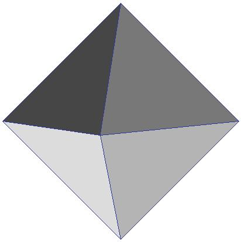
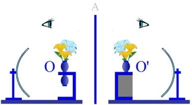

# Leçon 22 | 30 juin 1954

<!-- source-url: http://staferla.free.fr/S1/S1 Ecrits techniques.docx -->
<!-- seminar: s1 -->
<!-- lesson: 22 -->

<!-- id: s1-22-0001 -->

Aujourd’hui le cercle dont la fidélité ne s’était jamais démentie va quand même en fléchissant. Et à la fin de la course c’est quand même moi qui vous aurai eus...

<!-- id: s1-22-0002 -->

La dernière fois, j’ai laissé cela dans une certaine indétermination, mais je pense qu’aujourd’hui est l’avant-dernière fois, à moins que nous ne nous quit­tions tellement satisfaits les uns des autres que je ne vous le dise à la fin. Car je crois qu’il restera assez de choses ouvertes, ambiguës, disputées, contestées, pour que j’imagine que je doive faire une petite reprise la prochaine fois des conclu­sions, destinée au moins à fixer certains points de ce séminaire de cette année.

<!-- id: s1-22-0003 -->

Il faut vous dire que, partis de ce qu’il y a à la fois de plus formulé et de plus incertain : les règles techniques telles qu’elles sont exprimées pour la première fois dans les *Écrits techniques* de FREUD, nous avons été amenés par une pente qui était dans la nature du sujet - on ne peut pas dire dans son essence - à ce autour de quoi nous sommes depuis plus d’un trimestre - ça a commencé au milieu du trimestre dernier, le trimestre actuel est court - à ce qui est la question essentielle de l’analyse, ce qu’on peut appeler la structure du *transfert*.

<!-- id: s1-22-0004 -->

Vous sentez bien que nous ne parlons que de ça depuis à peu près le temps que je viens de dire et qu’aussi bien nous n’avons pas fini d’en parler ! Je crois que, pour situer les questions qui se rapportent au transfert, il faut partir d’un point central. C’est vers ce point central que notre dialectique nous a menés.

<!-- id: s1-22-0005 -->

La question telle qu’elle se formule maintenant est ceci : nous avons été ame­nés par le mouvement de notre investigation à voir la dialectique duelle du *transfert* comme *imaginaire*, de quelque façon que vous le preniez, à savoir de la projection illusoire d’une quelconque des relations fondamentales du sujet sur le partenaire analytique, jusqu’aux notions plus élaborées dites de « *relation d’objet »*, de rapports entre le transfert et le contre-transfert, tout ce qui reste dans les limites de ce qu’on peut mettre sous la rubrique générale d’une *« two bodies’ psy­chology »* nous a montré par mille recoupements, qui ne sont pas simplement une déduction théorique mais des témoignages concrets des auteurs que je vous ai apportés…

<!-- id: s1-22-0006 -->

> rappelez-vous ce que je vous ai dit de ce que nous apporte BALINT comme témoignage sur ce qu’il constate,
>
> ce qu’il appelle la terminaison d’une analyse ne nous fait pas sortir d’une relation intersubjective d’un type spécial,
>
> d’*une relation narcissique,* comme nous avons vu quelle limite à la fois elle impose à l’analyse, et quelle impasse
>
> à la compréhension de ce dont il s’agit, sous toutes les formes

<!-- id: s1-22-0007 -->

…nous avons mis en relief et en évidence la nécessité d’approfondir *le troisième terme* qui permet de concevoir cette sorte de transfert *en miroir*, conce­voir ce qu’on pourrait appeler le moteur de son progrès. *Ce troisième terme est la parole*.

<!-- id: s1-22-0008 -->

Nous n’avons pas à en être surpris, puisqu’elle a une tendance, malgré tous les efforts qu’on pourrait être amené à faire…

<!-- id: s1-22-0009 -->

> simplement parce que nous nous laissons porter par un mouvement dont j’ai essayé de vous montrer les rai­sons profondes

<!-- id: s1-22-0010 -->

…tous les efforts que nous pouvons faire pour oublier que l’ana­lyse est une technique de *la parole* ou pour subordonner cette *parole* à une fonction de moyen, il est tout à fait impossible d’invertir ainsi le rapport normal des choses, et de ne pas voir que *la parole* *est le milieu même dans lequel se déplace l’analyse*. C’est par rapport à *la fonction de la parole* que les différents ressorts de l’analyse prennent leur sens, leur place exacte, et de ce seul fait en quelque sorte est commandé notre mode d’intervention.

<!-- id: s1-22-0011 -->

Je résume là l’intention. Je ne peux pas en reprendre tous les ressorts et tous les arguments. Tout ce que nous développerons par la suite comme enseigne­ment ne fera que reprendre sous mille formes, confirmer par les impasses théo­riques où cela amène les auteurs, surtout dans les impasses techniques ou pratiques où cela amène le thérapeute.

<!-- id: s1-22-0012 -->

Nous avons été amenés à amorcer l’éla­boration de cette *fonction de la parole* par rapport à laquelle tout ce qui se passe dans l’analyse doit prendre son sens pour être convenablement situé, et dans certains cas pour pouvoir être distingué de *telle ou telle autre fonction* *connexe* qui finit par se confondre, s’aplatir, se télescoper les unes dans les autres, si l’on ne se tient pas dans ce point central.

<!-- id: s1-22-0013 -->

La dernière fois a amené dans ce progrès la nécessité de mettre en question *la fonction de la parole*. Nous avons été conduits à accepter ici, nous enrichir de la discussion d’un texte fondamental sur *la signification de la parole*, la façon dont *la parole* a rapport à la signification, c’est-à-dire à *la fonction du signe*. Il semble que nous ne puissions dire là qu’il s’agisse d’autre chose que d’un développement des plus principiels, originels, de la dialectique en elle-même.

<!-- id: s1-22-0014 -->

Ce n’est pas un point de vue inclus dans le système des sciences tel qu’il a été constitué seulement depuis quelques siècles. Ce n’est pas un secteur particulier des sciences qui serait en quelque sorte étranger au nôtre, celui de la linguis­tique. Nous voyons que, bien avant que la linguistique vienne au jour dans les sciences modernes, déjà quelqu’un - par le seul fait, comme le dit Saint AUGUSTIN, de méditer sur l’art de la parole, c’est-à-dire qu’il en parle - est conduit au même problème que retrouve actuellement le progrès de la linguistique.

<!-- id: s1-22-0015 -->

Ce pro­blème se pose en ceci : qu’à toute saisie de la fonction du signe, à toute question posée, à savoir quand le signe se rapporte à ce qu’il signifie, nous sommes tou­jours renvoyés du signe au signe. C’est-à-dire que nous comprenons que le sys­tème des signes, tel qu’il se pose d’abord concrètement, est un système qui par lui-même forme un tout, institue un ordre, et cet ordre \- apparemment la pre­mière rencontre du problème est ici - est *sans issue*. Pour tout dire : bien entendu *il faut qu’il y en ait une,* sans cela ce serait un ordre insensé. Pour comprendre que c’est à cela que ça aboutit, il nous faut prendre *l’ordre entier des signes* tels qu’ils sont institués concrètement, *hic et nunc*, comme nous disons de temps en temps.

<!-- id: s1-22-0016 -->

C’est-à-dire que le langage ne peut pas se concevoir comme *une série d’émergences, de pousses, de bourgeons, qui sortiraient de chaque chose*, comme donnant la petite pointe, la petite tête d’asperge, du nom qui en émergerait. Le langage n’est concevable que comme un réseau, un filet qui tient dans son ensemble et qui, jeté à la surface de l’ensemble des choses, de la totalité du réel, y apporte, y inscrit cet autre plan, cet autre ordre qui est jus­tement celui que nous appelons ici *le plan du symbolique*, en tant qu’il faut le distinguer dans notre action du *plan du réel*.

<!-- id: s1-22-0017 -->

Ce sont des *métaphores*, des *images*, « *comparaison n’est pas raison* », mais c’est pour illustrer ce que je suis en train de vous expliquer, et que cela entre dans les coins de votre esprit où il peut rester encore quelque obscurité.

<!-- id: s1-22-0018 -->

Il en résulte pourtant, de cette impasse, de cette issue paradoxale qui a été mise en évidence dans la 2ème partie de la démonstration augustinienne, que nous avons non pas épuisée mais amorcée la dernière fois, que dès lors la question de la congruence, de *l’adéquation du signe*, je ne dis plus *à la chose* mais *à ce qu’il signifie*, nous laisse devant une énigme qui n’est rien d’autre que celle de *la vérité*, et qu’aussi bien c’est là où l’apologétique augustinienne nous attend, que comme il nous le dit :

<!-- id: s1-22-0019 -->

- ou bien ce sens vous le possédez,

<!-- id: s1-22-0020 -->

- ou bien vous ne le possédez pas.

<!-- id: s1-22-0021 -->

Si vous entendez quelque chose qui s’exprime dans ces signes du langage, c’est toujours en fin de compte *au nom d’une lumière* *qui nous est apportée d’en dehors des signes*, c’est-à-dire :

<!-- id: s1-22-0022 -->

- soit d’une *vérité* saisie intérieurement, *de la vérité intérieure* qui d’ores et déjà nous apparaît dans quelque chose qui nous permet de reconnaître la vérité qui est portée par les signes,

<!-- id: s1-22-0023 -->

- ou au contraire de quelque chose qui de dehors vous est montré, qui vous est, d’une façon répétée et insistante, mis en corrélation avec les signes, par conséquent c’est d’une certaine illumination liée à la présence d’un objet que le signe prendra toute sa force et toute sa *vérité*. Et voici les choses renversées : *la vérité*, si on peut dire, est mise en dehors, ailleurs.

<!-- id: s1-22-0024 -->

Voyons bien en effet la bascule dialectique, le renversement total de la posi­tion telle qu’elle est apportée par la dialectique augustinienne, et qui est dirigée selon le type du dialogue vers la reconnaissance du *Magister* authentique, *De Magistro*, la reconnaissance du Maître intérieur de la vérité.

<!-- id: s1-22-0025 -->

Nous pouvons à bon droit nous suspendre et nous arrêter dans cette dialec­tique jusqu’à un certain point... centrant ce sujet d’une façon qui soit en quelque sorte déductive, logique : ce n’est pas de cela qu’il s’agit …jusqu’à un certain point légitimement nous arrêter après la double révolution de la démonstration, pour faire remarquer que la question même de *la vérité* est jus­tement posée par le progrès dialectique lui-même. En d’autres termes que :

<!-- id: s1-22-0026 -->

- de même qu’à un endroit de sa démonstration Saint AUGUSTIN oublie par exemple toute une face démontrable, communicable par la démonstration, par l’acte à imiter, de l’enseignement, c’est-à-dire de *la tech­nique de l’oiseleur* par exemple, il oublie que celle-là *est d’ores et déjà* *struc­turée* - comme nous l’avons fait remarquer au passage - *instrumentalisée par la parole* en elle-même, *elle n’est concevable comme technique complexe, ruse, piège pour l’objet, oiseau qui est à attraper,* *elle n’est concevable que dans un monde humain, structuré par la parole*,

<!-- id: s1-22-0027 -->

- de même ici, AUGUSTIN semble oublier que d’ores et déjà la question même de *la vérité* est en quelque sorte incluse à l’intérieur de sa discussion, et que dès *qu’il met en cause la parole*, il la met en cause *avec la parole*, et que c’est *avec la parole* que lui-même crée *la dimension de la vérité*, que toute parole émise, for­mulée, communiquée comme telle, introduit dans le monde *ce <u>nouveau</u>* *de cette affirmation*, de cette issue, de cette émergence *du sens* qui se pose et qui d’abord et avant tout s’affirme, moins comme *vérité* que comme dégageant du réel *la dimension de la vérité*.

<!-- id: s1-22-0028 -->

En effet observons-le bien, et dans le détail. Quand AUGUSTIN nous apporte comme argument que *la parole peut être trompeuse*, il est bien évident que de soi seul ce signe ne peut de bout en bout se soutenir, se présenter, que dans *la dimension de la vérité*. Car *pour être trompeuse* elle s’affirme comme vraie. Ceci pour *celui qui écoute*. Pour *celui qui dit*, la tromperie même non seulement impose l’appui de *la vérité* qu’il s’agit de dissimuler, mais dans toute sa rigueur, à mesure que le men­songe se développe, il suppose un véritable *approfondissement*, un véritable développement de *la vérité* à qui, si l’on peut dire, il répond. Car à mesure que se développe le mensonge, qu’il s’organise, pousse ses prolongements, ses ten­tacules pour se développer comme tel et comme mensonge, il faut le contrôle corrélatif d’une *vérité* qui est à proprement parler à éviter et qu’il doit rencon­trer à tous les tournants du chemin.

<!-- id: s1-22-0029 -->

Ce n’est pas la question du mensonge qui est le véritable problème. En par­tir est néanmoins extrêmement important parce qu’il démontre mieux que tout autre cette chose, d’ailleurs qui est tout de même bien connue, qui fait partie de la tradition moraliste :

<!-- id: s1-22-0030 -->

> « *Il faut avoir bonne mémoire quand on a menti.* »

<!-- id: s1-22-0031 -->

Cela veut dire qu’il faut savoir bougrement de choses pour arriver à soutenir un men­songe dans sa tenue de mensonge, car il n’y a rien de plus difficile à faire, qu’un mensonge qui tient. Si ce n’est pas la véritable question, la véritable question est celle de l’erreur. C’est d’ailleurs toujours et traditionnellement là que s’est posé le problème. Il est bien clair que l’erreur n’est absolument définissable qu’en termes de *vérité*. Je veux dire non pas que l’opposition est en quelque sorte blanc-noir : il n’y aurait pas de blanc s’il n’y avait pas de noir, ce n’est pas de cela qu’il s’agit. Non !

<!-- id: s1-22-0032 -->

De même que le mensonge pour être soutenu et poursuivi impose littéralement la constitution de *la vérité*, que le mensonge, lui, la suppose connue d’une cer­taine façon dans toute sa rigueur, et même bien assise, et même qu’on la construise de plus en plus pour soutenir le mensonge, le problème est d’un degré au-dessous, pour l’*erreur*, mais la liaison n’est pas moins intime en ce sens qu’il n’y a pas par essence d’erreur qui, elle, pour le coup ne se pose et ne s’en­seigne comme *vérité*.

<!-- id: s1-22-0033 -->

Sans cela, cela ne serait pas une erreur ! Pour tout dire l’erreur c’est, si on peut dire, l’incarnation commune et habi­tuelle de *la vérité*. Et si nous voulons être tout à fait rigoureux nous dirons que tant que *la vérité* n’est pas *entièrement révélée*, c’est-à-dire selon toute proba­bilité, jusqu’à la fin des siècles, *il est de sa nature de se propager sous forme d’erreur*. Et il ne faudrait pas pousser les choses beaucoup plus loin pour que nous voyions même là une structure constituante de *la révélation de l’être* en tant que tel.

<!-- id: s1-22-0034 -->

Mais je ne fais que vous indiquer ça comme la petite porte ouverte sur quelque chose que nous aurons à retrouver. Nous nous en tenons aujourd’hui à cette phénoménologie interne de *la fonc­tion de la parole*. Qu’est-ce ici, maintenant, que nous allons rencontrer ?

<!-- id: s1-22-0035 -->

- Nous avons parlé de *la tromperie* comme telle, nous avons vu qu’elle n’est soutenable qu’en fonc­tion de *la vérité*, *non seulement de la vérité, mais d’un progrès de la vérité*.

<!-- id: s1-22-0036 -->

- Nous avons vu *l’erreur*, et nous voyons qu’elle est en quelque sorte la manifestation même, commune, de *la vérité*. Les voies de *la vérité* sont des voies d’erreur par essence.

<!-- id: s1-22-0037 -->

Vous me direz : « *Alors, comment arrivons-nous à l’intérieur du dis­cours*…

<!-- id: s1-22-0038 -->

> nous parlons de la phénoménologie de la parole pour l’instant. Nous ne sommes pas en train
>
> de parler de la confrontation telle qu’elle est instaurée par une certaine expérience

<!-- id: s1-22-0039 -->

…*comment, à l’intérieur de la parole, en fin de compte, l’erreur sera-t-elle donc jamais décelable ?* »

<!-- id: s1-22-0040 -->

Ce qu’il nous faut pour cela, justement est au-delà de *la vérité*, soit dans l’ob­jet, soit dans la mesure de l’illumination de l’évidence intérieure, de ce que Saint AUGUSTIN nous apporte à la fin du discours la perspective non sans mille réserves, je vous prierai de reprendre ce texte et vous apercevoir qu’il ne consi­dère pas du tout qu’il en a fini avec le problème du discours, il y a même une phrase qui le réserve expressément :

<!-- id: s1-22-0041 -->

« *Ce n’est pas tout dire que de dire ce que nous avons dit, il reste la ques­tion de l’utilité du discours.* »

<!-- id: s1-22-0042 -->

Nous reprenons après lui le problème : *comment se pose le problème de l’er­reur à l’intérieur du discours ?* Car si elle se pose comme *vérité* par essence, il est bien clair que si nous en parlons comme *erreur*, c’est qu’aussi bien nous admettons qu’elle puisse être démasquée. À l’intérieur du discours, vous vous souvenez de ce qui est le fondement même de la structure du langage, à savoir du rapport d’*un signifiant matériel*, c’est-à-dire de quelque chose qui est ce que nous avons appelé la dernière fois le *verbum,* en tant qu’il est quelque chose qui *cum voce articulata * : *par une voix articulée*, *cum aliquo significata *: *avec une certaine signification.* La distinction essentielle du *signifiant* et du *signifié*, pris terme à terme, un par un, *ils ont un rap­port qui apparaît dans leur correspondance comme strictement arbitraire.*

<!-- id: s1-22-0043 -->

Autrement dit, *il n’y a pas plus de raison d’appeler* la girafe : *girafe*, et l’éléphant : *éléphant*, que d’appeler la girafe : *éléphant*, et l’éléphant : *girafe*. Il n’y a donc aucune espèce de raison de ne pas dire que la girafe a une trompe et que l’élé­phant a un cou très long. C’est *une erreur* dans le système, généralement reçue, mais c’est une erreur qui est strictement non décelable, comme le fait remarquer Saint AUGUSTIN : « *Tant que les définitions ne sont pas posées ! ».* Or, quoi de plus difficile que de poser les justes définitions ?

<!-- id: s1-22-0044 -->

Il y a néanmoins autre chose. C’est que si vous poursuivez votre discours sur la girafe, définie comme ayant une trompe, et l’éléphant comme ayant un long cou, si vous poursuivez indéfiniment votre discours dans l’existence, il arrivera, il peut arriver deux choses :

<!-- id: s1-22-0045 -->

- ou que vous continuiez à parler correctement de la girafe, comme s’il s’agissait de l’éléphant, et alors il sera tout à fait bien clair que, par le terme *« girafe »*, c’est l’éléphant que vous définissez, il y aurait là simple­ment une question d’accord entre vos termes et les termes généralement reçus.

<!-- id: s1-22-0046 -->

C’est également ce qu’apporte Saint AUGUSTIN dans sa démonstration à propos du terme de *perducam* : il met en évidence deux acceptions possibles. Mais ce n’est pas là ce qu’on appelle généralement l’erreur. L’erreur est précisément marquée en ceci qu’elle est une erreur en ce qu’elle aboutit à un moment donné à une contradiction, et que si par exemple j’ai dit que les roses sont des plantes ou objets qui vivent généralement sous l’eau, et si la suite du discours démontre manifestement cette erreur en ceci que comme il apparaîtra dans la suite du discours que je suis resté pendant vingt ­quatre heures dans une pièce où il y avait des roses, et comme d’autre part il est évident que mon discours en porte mille termes, je ne peux pas rester vingt­-quatre heures sous l’eau, il est tout à fait clair que les roses ne vivent pas habi­tuellement sous l’eau, puisqu’il y a des roses qui sont restées vingt-quatre heures avec moi dans un endroit où je n’étais pas sous l’eau.

<!-- id: s1-22-0047 -->

En d’autres termes, c’est *la contradiction dans le discours* qui est le départ entre *la vérité* et *l’erreur*. C’est aussi bien la conception *hegélienne* du *savoir absolu* : le *savoir absolu* est le moment où *la totalité du discours se ferme sur lui-même dans une non contradiction absolument parfaite*, jusques et y com­pris ceci : que le discours se pose et s’explique lui-même en tant que discours, se justifie en tant que discours.

<!-- id: s1-22-0048 -->

Et d’ici que nous soyons arrivés à cet idéal, dont vous ne savez que trop…

<!-- id: s1-22-0049 -->

> par l’existence même des choses et par la dispute non seulement persistante sur tous les thèmes et tous les sujets,
>
> avec plus ou moins d’ambiguïté, selon les zones de notre action interhumaine, mais aussi la mani­feste discordance
>
> entre les différents systèmes qui ordonnent les actions, des systèmes religieux, juridiques, scientifiques, politiques

<!-- id: s1-22-0050 -->

…vous savez qu’il n’y a pas superposition ni conjonction des différentes références, qu’il y a une série de *béances*, de *failles*, de *déchirures*, qui ne permettent pas de concevoir *le dis­cours humain dans un registre unitaire*.

<!-- id: s1-22-0051 -->

Nous sommes donc toujours, jusqu’à un certain point, par rapport à toute position, émission, de la parole qui se pose comme vraie, dans une espèce de nécessité interne d’erreur. Nous voici donc ramenés en apparence à cette sorte de *pyrrhonisme* histo­rique qui

<!-- id: s1-22-0052 -->

- met en suspension toute l’émission par la voix humaine de quelque chose qui se dirige dans cette dimension de *la vérité* et la frappe d’une façon absolument radicale d’une interrogation,

<!-- id: s1-22-0053 -->

- suspend à une sorte d’attente d’un avenir dont il n’est pas du tout impensable qu’il soit réalisé, car nous ne voyons que trop ce que j’appellerai « *la lutte de ces différents systèmes symboliques* ».

<!-- id: s1-22-0054 -->

Et nous savons qu’après tout il n’est pas sans effet dans la vie des hommes, et même dans *l’ordre des choses*. Et tout le système des sciences tel qu’il est actuel­lement - je parle des sciences physiques - est beaucoup plus concevable comme *le progrès d’un certain système symbolique* auquel les choses donnent plutôt leur aliment et leur matière, pour le perfectionnement de ce *système de sym­boles*, et donc à mesure que ce *système de symboles* se perfectionne, nous voyons les choses, beaucoup plus se décomposer, se perturber, se dissoudre… et que la pression de ce *système symbolique* toujours va plus loin dans une cer­taine élaboration, que nous ne pouvons le concevoir, au contraire, comme une sorte d’adéquation, de vêtement collant qui serait donné par le *système des symboles* aux choses.

<!-- id: s1-22-0055 -->

Tout le progrès du *système de symboles* qu’est le système des sciences - il est inutile de vous le dire - s’accompagne de cette espèce de bou­leversement qu’on appelle comme on veut : *« conquête de la nature », « transforma­tion de la nature », « hominisation de la planète »*… Ce sur quoi il reste une telle ambiguïté que la notion même d’une espèce de « *viol de la nature* », on ne peut pas dire qu’elle ne soit pas présentifiée à notre époque, de la façon la plus évidente. *Sommes-nous en quelque sorte réduits à concevoir le progrès de ce système symbolique*... et dans la mesure même où il va vers cette espèce de « *langue bien faite* » qu’on peut dire être la langue du système des sciences ...comme quelque chose de privé de référence à une voix \[un langage sans *parole*\].

<!-- id: s1-22-0056 -->

Car *c’est là que nous mène la dialectique augustinienne*, de priver de toute espèce de référence à ce domaine de *la vérité* dans lequel pourtant il se développe, implicitement par son mouvement même, auquel il ne peut pas ne pas à tout instant se référer pour se mouvoir. Eh bien, c’est là qu’on ne peut pas ne pas être frappé de la découverte freudienne. Elle apporte quelque chose qui, pour être du domaine empirique, ne nous en apporte pas moins dans cette question - qui a l’air d’être *au-delà* de toute expé­rience, et littéralement *métaphysique -* un appoint, un apport, d’un caractère sai­sissant tel qu’il aveugle ou *qu’on ne songe qu’à fermer les yeux* sur son existence.

<!-- id: s1-22-0057 -->

Car observez ceci, si *la découverte freudienne* est ce que je vous dis - à savoir ce que dans toute une série de manifestations humaines, qui ne sont pas juste­ment de l’ordre du discours, voilà ce qui les caractérise généralement, c’est pour cela qu’on les appelle, sous un certain angle, sans voir plus loin, diversement *irrationnelles -* ce qui s’exprime est littéralement *une parole*.

<!-- id: s1-22-0058 -->

Observez que *le ressort essentiel de tout ce qui est du champ psychanalytique* est ceci, et sup­pose que *le discours du sujet se développe normalement* \- ce que je vous dis là est du FREUD - *dans l’ordre de l’erreur, de la méconnaissance, voire de la dénéga­tion *: ce n’est pas tout à fait *le mensonge*, c’est *entre l’erreur et le mensonge*. C’est supposé par le système freudien ce que je viens de vous faire remar­quer, qui sont des vérités de gros bon sens. Mais il n’y a pas de raison pour ne pas les rappeler.

<!-- id: s1-22-0059 -->

*Notre discours humain* - donc spécialement celui qui se tiendra pendant l’analyse et la séance analytique - *se développant dans ce registre* *de l’er­reur*, quelque chose arrive par où *la vérité fait irruption* dans ce système. Ce que je vous dis est ce que dit FREUD, et c’est ce qu’il faut que nous pre­nions conscience que c’est ce que dit FREUD. Ce quelque chose nous apporte le message de *la vérité*. Et pour nous *analystes*, c’est-à-dire pour ceux qui sont introduits, qui savent voir ce champ de phénomènes qu’est *le champ analytique,* quelque chose arrive qui n’est pas de la contradiction du discours.

<!-- id: s1-22-0060 -->

Nous n’avons pas à pousser les sujets aussi loin que possible dans la voie du *savoir absolu*, à faire leur éducation sur tous les plans, ça il ne suffirait pas de le faire en psychologie pour leur faire voir les absurdités dans lesquelles ils vivent habituellement, il faudrait voir aussi dans le système des sciences, nous le fai­sons ici parce que nous sommes analystes, mais s’il fallait le faire aux malades, vous voyez où cela nous conduirait !

<!-- id: s1-22-0061 -->

Quelque chose qui n’est pas non plus de *la rencontre du réel, car c’est précisément de cela qu’il s’agit*, nous les prenons entre 4 murs, eux, nous ne les guidons pas par la main dans la vie, c’est-à-dire *dans les conséquences de leur « bêtise* », *quelque chose par où la vérité rat­trape,* *si on peut dire, l’erreur par derrière*. Et *ce quelque chose* est ce que nous pourrons appeler essentiellement comme étant le représentant le plus manifeste de *la méprise* : c’est dans le *lapsus*, dans *l’action* qu’on appelle improprement « *manquée* », car d’une certaine façon tous nos actes manqués, comme toutes nos paroles qui achoppent, sont des paroles qui avouent et des actes qui réus­sissent, qui réussissent justement dans le sens de cette révélation d’une vérité qui est là, par-derrière essentiellement.

<!-- id: s1-22-0062 -->

*C’est cela qu’implique la pensée freudienne. Si la découverte de* FREUD *a un sens, c’est celui-là *: *la vérité rattrape l’erreur au collet dans la méprise*. Je dis : dans la pensée freudienne, car vous allez voir les conséquences si vous n’admettez pas ce que je suis en train de vous dire. Dans la pensée freudienne, *un sens plus vrai, plus pur, se manifeste* à l’intérieur de *ce quelque chose* de plus ou moins confus, que vous appeliez cela associations libres, images du rêve, symptômes de quelque chose, *qui est une parole* en ce sens que c’est elle *qui apporte la vérité,* et qu’elle est *dans le symptôme*, *dans la suite des images du rêve*. Ceci est exprimé dans FREUD. Relisez, au début du chapitre *Élaboration du rêve* \[ch. VI\]  :

<!-- id: s1-22-0063 -->

« *Un rêve* - dit-il - *c’est une phrase, c’est un rébus*… » \[*Ein solches Bilderrätsel ist nun der Traum, und unsere Vorgänger auf dem Gebiete der Traumdeutung haben den Fehler begangen,* *den Rebus als zeichnerische Komposition zu beurteilen. Als solche erschien er ihnen unsinnig und wertlos.*\]

<!-- id: s1-22-0064 -->

Il y a 50 pages de *La Science des rêves* qui nous mèneraient à cette consi­dération : tout ce qui apparaîtra aussi bien, puisqu’il nous donne la structure du rêve, de cette formidable découverte de « *la condensation »*. *Vous auriez tout à fait tort de croire que condensation,* *ça veut simplement dire correspondance terme à terme d’un symbole avec quelque chose*. Il nous le dit bien, relisez le chapitre sur la *condensation* :

<!-- id: s1-22-0065 -->

« *Dans un rêve donné, l’ensemble des pensées du rêve, c’est-à-dire mani­festement l’ensemble des choses signifiées, des sens du rêve,* *est pris comme un réseau dans son ensemble et est représenté non pas du tout terme à terme, mais par une série d’entrecroisements.* »

<!-- id: s1-22-0066 -->

Il suffirait que je prenne *un des rêves de* FREUD et que je fasse un dessin au tableau. Il n’y a qu’à lire pour voir que c’est comme ça, *l’ensemble des sens* est représenté par *l’ensemble de ce qui est signifiant*, c’est-à-dire que *dans chaque élément signifiant du rêve, dans chaque image*, il y a référence à toute une série des points, des choses à signifier, et inversement que chaque chose à signifier est représentée dans plusieurs signifiants. Nous retrouvons également la structure, le rapport de ce qu’il signifie et de ce qui est à signifier.

<!-- id: s1-22-0067 -->

Voilà donc où nous sommes amenés, nous, par la découverte freudienne : à voir se manifester ce quelque chose qui est parole, et qui parle, en quelque sorte *à travers* - ou même *malgré -* le sujet. Ce quelque chose, il nous le montre et nous le dit non seulement par sa parole, mais par toutes sortes de ses autres manifestations subjectives, et allant aussi loin qu’on peut même le rêver, à savoir par son corps même le sujet émet *une parole* qui comme telle est *parole de vérité*, et *une parole* qu’il ne sait pas même qu’il émet comme signifiante, c’est-à-dire que le sujet en dit toujours plus qu’il ne veut en dire, toujours plus qu’il ne sait en dire.

<!-- id: s1-22-0068 -->

Et que l’objection que fait AUGUSTIN, la principale, à l’inclusion du domaine de la vérité dans le domaine des signes, c’est, dit-il :

<!-- id: s1-22-0069 -->

« *Que très souvent les sujets disent des choses qui vont beaucoup plus loin que ce qu’ils pensent,* *qu’ils sont même capables de confesser la vérité en n’y adhérant pas.* »

<!-- id: s1-22-0070 -->

C’est la référence à l’épicurien qui soutient, dit-il, que *l’âme est mortelle*, mais qui pour le soutenir cite des arguments des adversaires, et pour ceux qui ont les yeux ouverts, dit AUGUSTIN, ils prouvent ainsi le fait de la vérité. Car même en citant les arguments des adversaires comme étant réfutés, ceux qui voient, voient que là est la parole vraie, et ils reconnaissent la valeur de la doctrine que l’âme est immortelle. Telle est la perspective augustinienne.

<!-- id: s1-22-0071 -->

Par quelque chose dont nous avons reconnu *la structure et la fonction de parole*, en effet, le sujet témoigne d’un sens qui est plus vrai que tout ce qu’il exprime par son discours d’erreur. Et si ce n’est pas ainsi que se structure notre expérience \[analytique\], elle n’a strictement aucun sens. Je vais vous le faire remarquer. Car si un seul instant vous ne pensez pas que c’est dans cette perspective qu’est notre expérience, à savoir que *la parole* que le sujet émet sans le savoir *va au-delà* de ses limites de sujet discourant, mais à l’in­térieur de ses limites de sujet parlant, si vous ne concevez pas dans cette pers­pective ce que nous faisons, l’objection aussitôt apparaît : pourquoi, si ça n’est pas comme ça que nous pensons, si ça n’est pas ça qu’est *l’expérience analytique*, l’objection, dont je suis étonné qu’elle ne soit pas tout le temps plus au grand jour dans ce qu’on nous oppose, est naturellement celle-ci : pourquoi ce discours, que vous décelez dans le registre de la méprise, ne tombe-t-il pas sous la même objection que le discours commun au-delà duquel vous prétendez aller, à savoir si c’est un discours comme l’autre, pourquoi n’est-il pas lui aussi également plongé dans l’erreur ?

<!-- id: s1-22-0072 -->

C’est pourquoi toute conception du style jungien de l’inconscient - celle qui fait, sous le nom d’*« archétype »,* de l’inconscient le lieu réel d’un autre discours, c’est ce qui est sa réfutation - tombe d’une façon catégorique sous cette objec­tion, à savoir : pourquoi ces archétypes, ces symboles substantifiés tels qu’il les fait résidant d’une façon permanente dans une espèce de soubassement de l’âme humaine, qu’ont-ils de plus vrai que ce qui est prétendument à la surface ? Est-­ce par cette métaphore : que ce qui est dans les caves est forcément *plus vrai* que ce qui est au grenier ?

<!-- id: s1-22-0073 -->

Le discours est soumis, le discours de l’inconscient, exactement à la mise entre parenthèses, jusqu’à la fin des temps du discours, du reste du discours. C’est donc bien qu’il s’agit d’autre chose, dans le registre de la pensée freudienne qui nous a découvert ce lieu de l’inconscient. En d’autres termes, nous commençons d’entrevoir ce que veut dire FREUD quand il nous dit que l’inconscient ne connaît pas la contradiction ou qu’il ne connaît pas le temps.

<!-- id: s1-22-0074 -->

Ce n’est pas très poussé, ce n’est même pas tout à fait vrai en termes de discours, en ce sens qu’on peut, en poussant ce qu’il émet ainsi, ren­contrer des contradictions, mais nous voyons aussi dans quel sens vont ces affir­mations : ce n’est pas dans le sens d’une espèce de réalité qui serait vraiment impensable. Car la réalité tombe sous la contradiction, la réalité fait que quand je suis là, ça ne peut pas être vous, Mlle X, qui puissiez être ici à ma place. C’est une contradiction de l’ordre de la réalité. On ne voit pas pourquoi là l’incons­cient échapperait à cette sorte de contradiction.

<!-- id: s1-22-0075 -->

Mais ce que veut dire FREUD quand il parle de l’inconscient, de la suspension du *principe de contradiction*, c’est justement ceci : que cette parole *plus véritable*, même *authentiquement véri­dique* que nous sommes censés déceler, non pas - vous le voyez maintenant – par l’observation, mais par *l’interprétation* du discours, cette révélation de *la vérité* dans le *symptôme*, dans le *rêve*, dans le *lapsus*, dans le *Witz*, est justement sou­mise à d’autres lois que ce discours, soumis à cette condition de se déplacer dans l’erreur, jusqu’au moment où il rencontre la contradiction. C’est autre chose.

<!-- id: s1-22-0076 -->

Il y a là une zone de la parole qui est la parole structurée comme la parole révélant une vérité sous d’autres modes, par d’autres moyens que ceux qui constituent le discours discourant. Et c’est exactement cela que nous avons à explorer, que nous avons à référer d’une façon rigoureuse si nous voulons faire le moindre progrès dans la pensée de ce que nous faisons. Naturellement, rien ne nous y force. Je professe même assez communément que la plupart des êtres humains peuvent *s’en dispenser, s’en dispensent* même tout à fait communément et n’en accom­plissent pas moins d’une façon tout à fait satisfaisante ce qu’ils ont à faire. Je dirai même plus : il est tout à fait commun qu’on peut pousser extrêmement loin le discours, et même la dialectique en se passant tout à fait de penser.

<!-- id: s1-22-0077 -->

Néanmoins, il est tout à fait clair que toute espèce de progrès, d’approfon­dissement du monde symbolique, qui constitue ce qu’on appelle une révélation, implique au moins pour un petit moment ce qu’on appelle un effort de pensée, et qu’il est assez vraisemblable qu’une activité analytique qui se passe - si vous me comprenez et me suivez - entièrement dans le domaine d’une série de révé­lations particulières pour chaque sujet, implique que l’analyste se maintienne, si je puis dire, au moins *en alerte* sur le sujet du sens de ce qu’il fait, c’est-à-dire qu’il laisse une sorte de petite référence à la pensée de temps en temps.

<!-- id: s1-22-0078 -->

Vous voyez donc bien de quoi il s’agit. Nous voici en présence d’une ques­tion. La question est celle-ci : *quelle est la structure de cette parole qui est au-delà du discours ?*

<!-- id: s1-22-0079 -->

Une nouveauté est apportée depuis Saint AUGUSTIN, la révélation dans le phé­nomène de ces points vécus, subjectifs, où se révèle une parole qui dépasse le sujet discourant. C’est tout de même quelque chose d’assez frappant, d’assez saisissant. C’est même au point que nous pouvons difficilement croire qu’on ne s’en soit jamais aperçu auparavant. Sans doute fallait-il justement pour qu’on s’en aperçoive que le commun des hommes fût engagé depuis quelque temps, historiquement, dans *un discours* bien perturbé, dévié peut-être, et de quelque façon bien inhumain, bien aliénant pour que se soit manifestée, avec une telle acuité, une telle présence, une telle urgence, cette espèce de discours dont il ne faut tout de même pas aussi méconnaître qu’il est apparu dans la partie souf­frante des êtres, et que c’est sous la forme d’une psychologie morbide, d’une psychopathologie, que cette découverte ait été faite.

<!-- id: s1-22-0080 -->

Je laisse aussi ceci à votre réflexion, sous la forme d’*un point d’interrogation* : que voyons-nous dès lors ? Nous voyons, dans cette perspective de la dia­lectique de cette parole au-delà du discours, prendre leur sens et s’ordonner, d’une façon remarquable les termes dont nous nous servons le plus communé­ment, comme s’il s’agissait là désormais de données qui ne méritent pas de plus ample réflexion.

<!-- id: s1-22-0081 -->

Nous voyons tout à fait leur place, et comme je vous le disais la dernière fois, nous voyons en cette référence exactement les secteurs où se situent - on pourrait les dessiner - ces formations ambiguës auxquelles nous sommes habitués à nous référer, sous les termes de *Verdichtung*, qui n’est rien d’autre que cette polyvalence des sens dans le langage, que ces empiétements, ces recoupements par lesquels, si vous voulez, *le monde des choses*, représenté par des champs de cette espèce, n’est pas recouvert exactement par *le monde du symbole*, mais au contraire est repris comme ça, ce qui fait qu’à chaque symbole correspondent bien mille choses dans les choses, et inversement.

<!-- id: s1-22-0082 -->

Cette *Verneinung* qui est ce par quoi se soutient juste­ment dans le discours quelque chose par où se montre le côté négatif de cette non superposition. Car elle a un côté positif et un côté négatif, car il faut faire entrer les objets dans les trous, et comme les trous ne correspondent pas, ce sont les objets qui en souffrent.

<!-- id: s1-22-0083 -->

Et ce troisième registre, celui de la *Verdrängung*, qui est aussi préférable dans ce registre du discours.

<!-- id: s1-22-0084 -->

Car observez-le bien : *toujours, chaque fois que nous parlons* sans penser plus loin… sans penser à mal, car certes ce n’est pas notre fort …*chaque fois que nous parlons du refoulement*…

<!-- id: s1-22-0085 -->

> observez-le dans le concret, c’est une indication, allez-y et vous verrez

<!-- id: s1-22-0086 -->

…*chaque fois qu’il y a refoulement*…

<!-- id: s1-22-0087 -->

> et que refoulement n’est pas répétition, refoulement n’est pas dénégation,
>
> car il ne faut pas tout mêler, pas tout confondre comme on fait communément

<!-- id: s1-22-0088 -->

…*chaque fois qu’il y a à proprement parler refoulement*…

<!-- id: s1-22-0089 -->

> et il faut commencer à épeler ça dans les premières données expérimentales de FREUD

<!-- id: s1-22-0090 -->

…*c’est toujours d’une interruption du discours qu’il s’agit*.

<!-- id: s1-22-0091 -->

Je vous l’ai montré un jour à propos de *La Psychopathologie de la vie quoti­dienne*, à propos de ce fait, de cet *oubli des noms*. « *Le mot me manque* » : à quel moment dans la littérature apparaît pour la pre­mière fois une tournure comme celle-là ? C’est un peu important de connaître ces choses-là ! « *Le mot me manque* » a été employé pour la première fois par SAINT-­AMANT, qui est un poète du XVIIème siècle. Ce renseignement que je vous donne est dans *la connection linguistique du vocabulaire des Précieuses*. Ne croyez pas que pour autant j’aie dépouillé toute la littérature française pour être sûr que SAINT-AMANT... D’ailleurs, il l’a non pas écrit, mais dit comme cela, simplement, dans une rue.

<!-- id: s1-22-0092 -->

C’est SOMAIZE, dans le *Dictionnaire des Précieuses*, qui le signale entre mille autres choses, comme tour d’esprit, mille autres formes qui vous sont maintenant communes, et n’en ont pas moins été créées dans les boudoirs de cette aimable société qui s’est employée tout entière au perfectionnement du langage. Vous voyez le rapport curieux et étroit qu’il peut y avoir ici entre la *Carte du Tendre* et la psychologie psychanalytique. Enfin, « *Le mot me manque* » : on n’aurait jamais dit une chose pareille au XVIème siècle.

<!-- id: s1-22-0093 -->

Il faut peut-être remonter à Saint AUGUSTIN pour aller un peu plus loin dans la psychologie du *lapsus*. Mais la première fois qu’il en parle, il implique tout de même que dans le *lapsus* quelque chose d’autre - il emploie le terme *aliud -* que ce que le sujet veut dire, est signifié. Enfin, *ce mot qui vous manque* et qui était celui dont parlait FREUD dans ce fameux oubli du nom du Seigneur d’Orvieto, SIGNORELLI, je vous ai montré com­bien il était lié au fait que la conversation qui précédait n’avait pas été menée jusqu’à son terme, parce qu’elle menait tout droit vers le HERR, *le maître absolu, la mort*.

<!-- id: s1-22-0094 -->

Et après tout il y a peut-être les limites internes à ce qu’on peut dire, comme dit MÉPHISTOPHÉLÈS souvent cité par FREUD :

<!-- id: s1-22-0095 -->

« *Dieu ne peut pas enseigner tout ce que Dieu sait, à ses garçons. Ils n’en sont pas là encore !* »

<!-- id: s1-22-0096 -->

*Le refoulement*, c’est ça. Chaque fois que le maître s’arrête dans la voie de son enseignement pour des raisons qui tiennent à la nature de son interlocuteur, il y a déjà là un refoulement. Et si vous voulez bien regarder, je vous donne des choses imagées, destinées à remettre les idées en place : moi aussi je fais du refoulement, mais c’est un peu moins que ce qu’on ne fait habituellement, qui est de l’ordre de la dénégation.

<!-- id: s1-22-0097 -->

Prenez par exemple le premier rêve que FREUD donne dans le chapitre de la condensation. C’est *le rêve de la monographie botanique*, une merveilleuse démonstration de tout ce que je suis en train de vous raconter : comment la botanique représente non seulement les fleurs avec tout ce qu’elles signifient pour FREUD, à savoir que, comme bien des maris, il offre moins souvent qu’il ne faudrait des fleurs à sa femme. Naturellement, FREUD n’est quand même pas sans savoir ce que ça veut dire que dans la journée il a dû justement aller fouiller une monographie sur les cyclamens, et que les cyclamens sont les fleurs préférées de sa femme.

<!-- id: s1-22-0098 -->

On va toujours droit au sujet avec FREUD. Et là aussi, bien entendu, il ne nous a jamais dit le fond de l’affaire. Mais nous n’avons aucune peine à le deviner. Il y a d’autres choses, il y a la conversation avec l’oculiste KÖNIGSTEM, tout ce que cela rappelle pour lui d’ambitions rentrées, d’amertumes : la fameuse histoire de la cocaïne. N’oublions pas cette histoire de la cocaïne, il n’a jamais pardonné à sa femme car il nous le dit clairement :

<!-- id: s1-22-0099 -->

« *Si elle ne m’avait pas fait venir d’urgence, j’aurais poussé la cocaïne un peu plus loin, et je serais devenu un homme célèbre.* »

<!-- id: s1-22-0100 -->

Dans la conversation évoquée il y a la malade Flora, et là-dessus apparaît *Gärtner*, jardinier, qui comme par hasard passe avec sa femme. Il la trouve « *bluming* », florissante. Et le point essentiel est ceci, si vous regardez bien les choses, premièrement il y a là une suite de pensées : la malade Flora pour laquelle il semblait avoir un tendre penchant, il semble qu’on ne peut pas aller beaucoup plus loin dans un certain sens, même pour FREUD : pas décidé à rompre avec sa femme, il vaut mieux laisser dans une cer­taine ombre le fait qu’on ne lui apporte pas aussi souvent des fleurs qu’elle le désirerait.

<!-- id: s1-22-0101 -->

Laisser dans une certaine ombre aussi tout ce qui est à ce moment ­là suspendu à ce dialogue de revendication permanente, Sous-jacente, qui est celui de FREUD à ce moment-là, qui attend sa nomination de professeur extraordinaire. C’est toujours plus ou moins sous-jacent à tous ces dialogues avec ses collègues, la lutte qu’il est en train de mener pour se faire reconnaître, mais c’est encore plus souligné dans le texte par le fait que le GÄRTNER en ques­tion l’interrompt.

<!-- id: s1-22-0102 -->

Les deux restes du jour qui apportent leur nourriture à ce rêve, à savoir cette conversation et la vue du livre des cyclamens dans la jour­née, sont là employés pour la formation de ce rêve très précisément en ceci que, en tant que vécus dans la journée, ils sont déjà les points phonématiques si je puis dire, autour desquels s’est mise en marche une certaine parole formulant crûment :

<!-- id: s1-22-0103 -->

- « *Je n’aime plus ma femme* » par exemple,

<!-- id: s1-22-0104 -->

- ou « *Je suis méconnu par la société, je suis entravé* ».

<!-- id: s1-22-0105 -->

Comme il dit d’ailleurs, derrière tout ça il y a ce qu’il appelle ses fantaisies et goûts de luxe. Comme disait un de nos confrères dans une certaine leçon sur FREUD : « *Freud était un homme sans ambitions, sans besoins* ». Enfin ! Il y a des gens qui, je crois, n’ont jamais ouvert un livre de FREUD. Il dit qu’au temps où il n’avait absolument pas un radis, et ça c’est vrai qu’il en a bavé dans son temps d’étude, il ne pouvait absolument pas à ce moment là faire de travail, et de travail technique, médi­cal, estudiantin, que sur des monographies, dès ce moment il aspirait - il suf­fit de lire la vie de FREUD, de connaître quelques unes de ses répliques les plus célèbres à des gens qui venaient vers lui le cœur sur la main avec des inten­tions idéalistes à son égard, la brutalité des réponses de FREUD au sujet de ce qui faisait ses intérêts à lui, FREUD, dans l’existence. Il ne faudrait tout de même pas que quinze ans après la mort de FREUD nous tombions dans la géo­graphie le concernant ! Dieu merci, M. JONES n’est qu’à moitié... Il nous res­tera un petit quelque chose de FREUD à travers l’œuvre de FREUD *pour nous témoigner de la personnalité* du bonhomme.

<!-- id: s1-22-0106 -->

Revenons-en à ce fameux rêve. S’il y a refoulement et s’il y a rêve, si la première liaison qui nous est donnée dans la voie royale de l’inconscient est celle-ci : *du désir refoulé* avec *le rêve*, c’est essentiellement en ceci qu’il y a eu une certaine parole dans la journée qui ne pouvait qu’être une parole suspendue, qui n’allait pas au fond de l’aveu, au fond des choses, au fond de l’être.

<!-- id: s1-22-0107 -->

Et c’est là que je laisse aujourd’hui la question : est-ce qu’en somme jamais une parole parlée, dans l’état actuel des relations entre les êtres humains et en dehors de la situation analytique, peut être *une parole pleine* ? C’est dans cette interruption du discours, dans cette rencontre *d’une loi de méconnaissance*, qui est la loi de la conversation commune que se trouve le res­sort de la *Verneinung*.

<!-- id: s1-22-0108 -->

Si vous lisez - je vous incite à le faire, parce que ce n’est pas ça que je prendrai l’année prochaine - la *Traumdeutung*, et nous sommes tous suffisamment guidés par ces fils que j’essaie de vous donner, ces directives que j’essaie de tendre à tra­vers le texte général de la pensée de FREUD pour que vous puissiez vous débrouiller dans la *Traumdeutung* et voir comment toutes ces choses devien­nent plus claires, et jusqu’au sens qui paraît quelquefois ambigu, obstinément donné par FREUD au mot « *désir* », se maintient, et combien véritable, combien valable, car il sait très bien ce qu’il veut dire.

<!-- id: s1-22-0109 -->

Mais il doit admettre à un tour­nant, à un moment - je veux bien après tout, pour ceux qui ne comprennent rien, dire qu’on peut prendre son discours pour une espèce d’entêtement, voire de dénégation tout à fait surprenante, ce fait qu’il concède qu’il faudra bien admettre qu’il y aura deux types de rêves : *les rêves* dits *de désir*, et des *rêves­-châtiment*. Mais il sent bien, si l’on comprend ce dont il s’agit, que ce désir qui se manifeste dans le rêve, ce désir refoulé est quelque chose qui s’identifie à ce registre dans lequel je suis en train tout doucement d’essayer de vous faire entrer : c’est *l’être qui attend de se révéler*.

<!-- id: s1-22-0110 -->

Dans cette perspective de cette attente de l’être, la signification du terme de désir prend sa valeur pleine dans FREUD. Elle unifie, elle permet de comprendre aussi bien ces rêves paradoxaux tels le rêve du poète qui a eu cette jeunesse si dif­ficile et qui fait éternellement le même rêve où il est petit employé tailleur.

<!-- id: s1-22-0111 -->

Aussi bien, ce dont il s’agit là n’est pas tellement un *rêve-châtiment*, que justement ce quelque chose qui - et nous y reviendrons - est dans un ressort essentiel dans *la révélation de l’être*, à savoir des franchissements de l’*identification* de l’être à une nouvelle voie de l’être, à une nouvelle étape, à une nouvelle *incarnation symbo­lique* de lui-même.

<!-- id: s1-22-0112 -->

C’est cela qui donne la valeur à tout ce qui est de l’ordre de l’accession du concours, de l’examen, de l’habilitation, c’est ce que cela révèle non pas d’épreuve au sens du test ou quoi que ce soit, mais de l’investiture. Alors vous voyez donc quelque chose sur quoi je voudrai conclure tout à l’heure. À tout hasard, je vous ai mis au tableau ce petit diamant qui est une sorte de dièdre à six faces.

<!-- id: s1-22-0113 -->

<!-- id: s1-22-0114 -->

Posons-les toutes pareilles, l’une au-dessus, l’autre au-dessous d’un plan. Ce n’est pas un polyèdre régulier, encore que toutes ses faces soient égales. Mais les sommets ou angles polyèdres ne sont pas tous les mêmes. Il y en a deux qui sont des trièdres, sur trois faces, et les trois autres sommets sont sur quatre faces. Alors si nous concevons ceci : que *le plan médian*, celui dans lequel il y a le tri­angle qui partage en deux cette pyramide, est si vous voulez la surface du réel. Dans cette surface du réel - je parle du réel tout simple - rien si vous voulez ne peut le franchir, rien de ce qui est là, et là toutes les places sont prises, à chaque instant toutes les places sont prises.

<!-- id: s1-22-0115 -->

Et à l’instant suivant, tout est changé. Il est bien clair qu’avec notre monde de mots et de symboles, nous introdui­sons là-dedans, si nous appelons le *réel* une deuxième dimension, autre chose, un creux, un trou, quelque chose grâce à quoi toutes sortes de franchissements et de choses interchangeables sont possibles. Comme on l’a fait remarquer, cette sorte de trou dans le *réel* s’appelle, selon qu’on l’envisage d’une façon ou d’une autre, *l’être ou le néant*. Cet être et ce néant, nous l’avons déjà tout de même touché à plus d’une reprise, sont essentiellement liés précisément à ce phénomène de *la parole*.

<!-- id: s1-22-0116 -->

C’est dans cette dimension de l’être que se situe la tripartition, sur laquelle j’insiste toujours avec vous pour vous faire comprendre les catégories élémentaires sans lesquelles nous ne pouvons rien distinguer dans notre expérience, tripartition : du *symbolique*, de *l’imaginaire* et du *réel*. Ce n’est pas pour rien, sans doute qu’elles sont *trois*. Il doit y avoir là une espèce de *loi minimale* qu’ici la géométrie ne fait qu’incarner, à savoir en effet que si dans ce plan du réel, vous détachez quelque volet qui s’introduit dans une troisième dimension, vous ne pourrez jamais faire de solide, si on peut dire, qu’avec deux autres volets au minimum. C’est à un tel schéma, à une telle représentation que peut être rapporté ceci, qui fait que premièrement c’est uniquement dans *la dimension de l’être*, et non pas du *réel*, *que peuvent s’inscrire les trois passions fondamentales* dont vous avez peut-être entendu l’énumération et le registre, et qui font que nous sommes dans le plan humain qu’en \[...\] *s’institue l’analyse du seul fait qu’il s’agit de l’être et pas de l’objet.*

<!-- id: s1-22-0117 -->

Ainsi se créent :

<!-- id: s1-22-0118 -->

- à la jonction du *symbolique* et de *l’imaginaire* la passion ou la cassure, si vous voulez, ou la ligne d’arête qui s’appelle *l’amour*,

<!-- id: s1-22-0119 -->

- à la jonction de *l’imaginaire* et du *réel*, celle qui s’appelle *la haine *,

<!-- id: s1-22-0120 -->

- et à la jonction du *réel* et du *symbolique*, celle qui s’appelle *l’ignorance*. Et qu’est-ce que nous appelons l’institution - d’emblée, avant tout commen­cement de l’analyse - de quelque chose qui est déjà de l’ordre du *transfert*, le côté déclenché, foudroyant de l’existence de cette dimension, avant qu’il ne se soit lié rien de ce qui peut se dégager dans les marges, les franges de ce concubinage qu’est l’analyse ? Si d’ores et déjà sont virtuellement présentes ces deux possi­bilités, et justement au début dans leur forme extrême de *l’amour* et de *la haine*, elles ne sauraient être conçues que dans ce registre, et avec l’accompagnement de ce quelque chose qui va tellement de soi que justement on ne le nomme pas dans les composantes primitives du *transfer*t, et qui est justement *l’ignorance en tant que passion*. C’est-à-dire en tant qu’elle est instituée comme telle au fon­dement de la situation.

<!-- id: s1-22-0121 -->

Le sujet qui vient en analyse se met comme tel dans la position de celui qui ignore. Il n’y a pas d’entrée possible dans l’analyse \- on ne le dit jamais, on n’y pense jamais - sans *cette référence*, et elle est absolument *fondamentale*. C’est exactement dans la mesure où la parole progresse…

<!-- id: s1-22-0122 -->

> c’est-à-dire où ce quelque chose qui est la pyramide supérieure s’édifie, ce quelque chose dont peut–être la prochaine fois,
>
> quand nous serons assez avancés, je vous montrerai la correspondance avec ces trois faces, qui n’est autre justement
>
> que l’élabora­tion de la *Verdrängung*, la *Verdichtung* et la *Verneinung*

<!-- id: s1-22-0123 -->

…que se réalise cet être, bien entendu absolument non réalisé au début de l’analyse, comme au début de toute dialectique.

<!-- id: s1-22-0124 -->

Car il est bien clair que si cet être existe implicitement, et d’une façon en quelque sorte virtuelle, l’innocent, celui qui n’est jamais entré dans aucune dialectique, n’en a littéralement aucune espèce de présence de cet être, il se croit tout bonnement dans le réel. C’est l’approfondissement de l’analyse par l’intermédiaire de cette révélation de cette parole incluse, cette parole révélée dans un discours en quelque sorte exprès mis en doute, en suspension, mis entre parenthèses par la loi de la libre association, c’est précisément dans ce discours la réalisation de cet être.

<!-- id: s1-22-0125 -->

C’est en tant que l’analyse n’est pas seulement ce qui dans le schéma que je vous ai donné, le O et le O’, ce n’est pas seulement cette *reconstitution de l’image narcissique*, qu’elle est bien souvent. Si nous étions uniquement, dans l’analyse, dans la mise à l’épreuve d’un certain nombre de petits comportements, plus ou moins bien pigés, plus ou moins astucieusement projetés, grâce à la collaboration, on nous le dit en propres termes, de ces deux *moi*, ici occupés à guetter le surgissement de je ne sais quelle réalité ineffable, à laquelle on peut faire l’*objection* qu’on peut faire exactement, comme je vous ai dit tout à l’heure, pour tout le reste du discours, pourquoi cette réalité là aurait-elle quelque chose de privilégié parmi les autres ?

<!-- id: s1-22-0126 -->

<!-- id: s1-22-0127 -->

C’est précisément dans la mesure où ce discours permet, par rapport à ce point O, qui est en effet parfois son image complétée dans le O’, ce point O va quelque part ailleurs dans mon schéma - un schéma n’est jamais qu’un schéma - quelque part en arrière, et à mesure que sa parole le symbolise, se réalise dans son être.

<!-- id: s1-22-0128 -->

Nous en resterons là aujourd’hui. Et je prie instamment ceux que ce discours aura suffisamment intéressés, voire travaillés, de me poser en termes courts un certain nombre de petites questions, pas trop longues, puisque nous n’aurons plus qu’un autre séminaire, et autour desquelles j’essaierai d’ordonner la conclusion, si tant est qu’on puisse parler de conclusion, qui servira de nœud pour rattraper l’année prochaine un nouveau chapitre.

<!-- id: s1-22-0129 -->

Je suis de plus en plus porté à penser que l’année prochaine il faudra que je divise en deux ce séminaire, pour de certaines raisons : pour ne pas vous man­quer de parole, faire d’une part le président SCHREBER, pour montrer la situation du problème de la psychose par rapport à ce registre, et ce que veut dire le monde symbolique dans la psychose, car c’est là qu’est la question, et d’autre part vous montrer - je pense que je ferai ça à propos de *Das Ich und das Es* - comment, à l’in­térieur d’une telle dialectique, prend son véritable sens le structuralisme qu’a introduit FREUD, car littéralement l’*ego*, le *super ego* et le *Es*, s’ils n’étaient rien d’autre qu’une espèce de démarquage, de changement de nom des vieilles enti­tés psychologiques de *la passion*, du *moi,* et de *l’inconscient*, on ne voit vraiment pas ce qu’aurait apporté FREUD de nouveau.

<!-- id: s1-22-0130 -->

Si effectivement ces notions sont uti­lisables comme concepts, valent quelque chose, c’est pour autant qu’elles se rat­tachent directement au point dialectique où je pense vous avoir menés cette année, avec cette analyse qui porte autant sur les *Écrits techniques* que sur l’*Einführung der Narzissmus,* et vous verrez que les trois références (*Ich, Es, Überich*) sont autre chose que l’usage qui en est communément fait.
