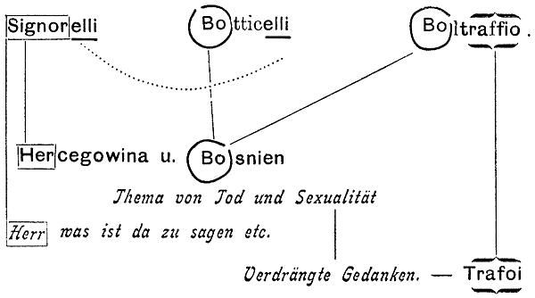

# Leçon 05 | 03 février 1954

<!-- source-url: http://staferla.free.fr/S1/S1 Ecrits techniques.docx -->
<!-- seminar: s1 -->
<!-- lesson: 05 -->

<!-- id: s1-05-0001 -->

Nous sommes arrivés la dernière fois à un point où, en somme, nous nous demandions : quelle est la nature de la résistance ? Je voudrais aujourd’hui faire quelques remarques, vous induire dans un cer­tain mode d’appréhension d’un phénomène pris au niveau de l’expérience, au moment où quelque chose, comme vous allez voir, par rapport à une certaine façon de traiter notre vocabulaire qui est à plusieurs faces, ce qui ne veut pas dire qu’il y ait ambiguïté, je voudrais vous faire voir d’une certaine façon où nous pouvons reconnaître à la source ce qui apparaît, dans l’expérience orien­tée vers l’analyse, être la résistance.

<!-- id: s1-05-0002 -->

Vous avez bien senti l’ambiguïté, et pas seulement la complexité, de notre approche par rapport à ce phénomène qu’on peut appeler de résistance. Il nous semble par plusieurs témoignages, par plusieurs formulations de FREUD que la résistance émane de ce qui est à révéler, de ce qu’on appelle en d’autres termes *le refoulé, le verdrängt*, ou encore *l’unterdrückt*.

<!-- id: s1-05-0003 -->

Les premiers traducteurs ont traduit *unterdrückt* par « *étouffé »*, c’est bien mou. Est-ce la même chose l’un et l’autre, *verdrängt* ou *unterdrückt* ? Nous n’allons pas entrer dans ces détails. Nous ne verrons cela que quand nous aurons commencé à saisir, à voir s’établir les perspectives, les distinctions entre ces phénomènes.

<!-- id: s1-05-0004 -->

Je voudrais vous amener aujourd’hui à quelque chose qui me paraît, dans les textes mêmes que nous avons commentés, ces petits *Écrits techniques,* qui me paraît être un de ces points où la perspective s’établit. Avant de manier le voca­bulaire, comme toujours, il s’agit d’essayer de comprendre, d’être dans un endroit où les choses s’ordonnent.

<!-- id: s1-05-0005 -->

À *la présentation de malades* du vendredi, je vous ai annoncé quelque chose et je vais essayer de tenir ma promesse. Voyez-vous, il y a quelque chose qui au beau milieu de ce recueil s’appelle « *La dynamique du transfert »* [^8]. Comme tous les articles traduits dans ce recueil, on ne peut pas dire que nous ayons lieu d’être entièrement satisfaits de cette traduc­tion. Il y a de singulières inexactitudes qui vont jusqu’aux limites de l’impro­priété. Il y en a d’étonnantes, et elles vont toutes dans le même sens qui est d’effacer les arêtes du texte. À ceux qui savent l’allemand, je ne saurais trop recommander de se reporter au texte allemand. Ils verront beaucoup de choses dans cet article sur *la dynamique du transfert*.

<!-- id: s1-05-0006 -->

Il y a beaucoup à dire sur le plan de la traduction, et en particulier une coupure, un point mis à l’avant-dernière ligne, qui isole une toute petite phrase qui a l’air de venir là on ne sait pourquoi :

<!-- id: s1-05-0007 -->

« *Enfin rappelons-nous que nul ne peut être tué « in absentia » ou « in effigie ».* »

<!-- id: s1-05-0008 -->

alors que dans le texte allemand, c’est :

<!-- id: s1-05-0009 -->

« …*car il faut se rappeler que nul ne peut être tué in absentia ou in effigie.* »

<!-- id: s1-05-0010 -->

\[*Es ist unleugbar, dass die Bezwingung der Übertragungs­phänomene dem Psychoanalytiker die grössten Schwierigkeiten bereitet, aber man darf nicht vergessen,* *dass gerade sie uns den unschätzbaren Dienst erweisen, die verborgenen und vergessenen Liebesregungen der Kranken aktuell und manifest zu machen,* *denn schliesslich kann niemand in absentia oder in effigie erschlagen werden**.***\]

<!-- id: s1-05-0011 -->

C’est articulé à la dernière phrase. Alors qu’*isolée cette phrase semble incompréhensible*, la phrase de FREUD est parfaitement arti­culée. Ce passage, que je vous ai annoncé comme étant particulièrement significatif, je veux vous le lire. Il semble qu’il s’articule directement avec ce à quoi j’ai essayé de vous introduire en vous rappelant ce passage important des *Studien* dans l’article sur la psychothérapie où il s’agit de cette résistance rencontrée par approximation dans le sens *radial*, comme dit FREUD, du discours du sujet quand il se rapproche du noyau profond, ce que FREUD appelle *le noyau patho­gène.*

<!-- id: s1-05-0012 -->

C’est ennuyeux de devoir le lire en français.

<!-- id: s1-05-0013 -->

« *Étudions un complexe pathogène dans sa manifestation parfois très appa­rente et parfois presque imperceptible*… \[*Verfolgt man nun einen pathogenen Komplex von seiner (entweder als Symptom auffälligen oder auch ganz unscheinbaren)*.\]

<!-- id: s1-05-0014 -->

Si l’on sait le texte allemand, on peut traduire à la rigueur par « *sa manifestation* » mais « *parfois très apparente et par­fois*… » en allemand, c’est entre parenthèses.

<!-- id: s1-05-0015 -->

…*ou bien apparent comme symp­tôme, ou bien tout à fait impossible à appréhender, tout à fait non manifeste.* »

<!-- id: s1-05-0016 -->

Il s’agit de la façon dont le complexe se traduit, et c’est de cette traduction du complexe qu’il s’agit quand on dit *qu’elle est apparente* ou *qu’elle est imperceptible*. Ce n’est pas la même chose que de dire que le complexe, lui… Il y a un déplacement qui suffit à donner une espèce de flottement.

<!-- id: s1-05-0017 -->

« *Depuis sa manifestation dans le conscient jusqu’à ses racines dans l’in­conscient, nous parvenons bientôt dans une région où la résistance se fait*

<!-- id: s1-05-0018 -->

> *si nettement sentir que l’association qui surgit alors en porte la marque* - de cette résistance - *et nous apparaît comme un compromis*
>
> *entre les exigences de cette résistance et celles du travail d’investigation.* »

<!-- id: s1-05-0019 -->

\[*Vertretung im Bewussten gegen seine Wurzel im Unbewussten hin, so wird man bald in eine Region kommen, wo der Widerstand sich so deutlich geltend macht,* *dass der nächste Einfall ihm Rechnung tragen und als Kompromiss zwischen seinen Anforderungen und denen der Forschungsarbeit, erscheinen muss.*\]

<!-- id: s1-05-0020 -->

Ce n’est pas tout à fait « *l’association qui surgit* », c’est *nächste Einfall*, *la plus proche, la prochaine association*. Enfin, le sens est conservé.

<!-- id: s1-05-0021 -->

> « *L’expérience* - là est le point capital - *montre que c’est ici que surgit le trans­fert, lorsque quelque chose parmi les éléments du complexe,*
>
> *dans le contenu de celui-ci, est susceptible de se reporter sur la personne du médecin, le trans­fert a lieu, fournit l’idée suivante et se manifeste*
>
> *sous forme d’une résistance, d’un arrêt des associations par exemple. De pareilles expériences nous ensei­gnent que l’idée de transfert*
>
> *est parvenue de préférence à toutes les autres associations possibles à se glisser jusqu’au conscient, justement parce qu’elle satisfait la résistance.* »

<!-- id: s1-05-0022 -->

\[*Hier tritt nun nach dem Zeugnis der Erfahrung die Übertragung ein. Wenn irgend etwas aus dem Komplexstoff (dem Inhalt des Komplexes) sich dazu eignet, auf die* *Person des Arztes übertragen zu werden, so stellt sich diese Übertragung her, ergibt den nächsten Ein­fall und kündigt sich durch die Anzeichen eines Widerstandes,* *etwa durch eine Stockung, an. Wir schliessen aus dieser Erfahrung, dass diese Übertragungsidee darum vor allen anderen Einfallsmöglichkeiten zum Bewusstsein* *durchgedrungen ist, weil sie auch dem Widerstände Genüge tut.*\]

<!-- id: s1-05-0023 -->

Ceci est mis par FREUD en italique.

<!-- id: s1-05-0024 -->

« *Un fait de ce genre se reproduit un nombre incalculable de fois au cours d’une analyse, toutes les fois qu’on se rapproche d’un complexe pathogène,* *c’est d’abord la partie du complexe pouvant venir comme transfert qui se trouve poussée vers le conscient et que le patient s’obstine à défendre* *avec la plus grande ténacité.* »

<!-- id: s1-05-0025 -->

\[*Ein solcher Vorgang wiederholt sich im Verlaufe einer Analyse ungezählte Male. Immer wieder wird, wenn man sich einem pathogenen Komplex annähert,* *zuerst der zur Übertragung befähigte Anteil des Komplexes ins Bewusstsein vorgeschoben und mit der grössten Hartnäckigkeit verteidigt.*\]

<!-- id: s1-05-0026 -->

Donc les deux éléments de ce paragraphe à mettre en relief sont ceux-ci :

<!-- id: s1-05-0027 -->

- « *Nous arrivons bientôt dans une région où la résistance se fait nettement sentir.* »

<!-- id: s1-05-0028 -->

Nous sommes donc dans le registre où *cette résistance propre émane du pro­cessus même*, l’approximation, si je puis dire, du discours.

<!-- id: s1-05-0029 -->

- Deuxièmement « *L’expérience montre que c’est ici que surgit le transfert.* »

<!-- id: s1-05-0030 -->

- Et troisièmement, le transfert se produit : « *justement parce qu’il satisfait la résistance.* »

<!-- id: s1-05-0031 -->

- Quatrièmement : « *Un fait de ce genre se reproduit un nombre incalculable de fois au cours d’une psychanalyse.* »

<!-- id: s1-05-0032 -->

Il s’agit bien d’un phénomène observable, sensible, dans l’analyse. Et cette partie du complexe qui s’est manifestée sous la forme du transfert se trouve : « *poussée vers le conscient* » à ce moment-là, et « *le patient s’obstine à la défendre avec la plus grande ténacité.* »

<!-- id: s1-05-0033 -->

Ici s’accroche *une note* qui va mettre en relief le phénomène dont il s’agit, ce phénomène qui est en effet observable, quelquefois avec une pureté vraiment extraordinaire, et que nous marque sans aucun doute l’ordre d’interventions suggéré par la pratique, l’indication, les recettes qui peuvent nous avoir été transmises, celles-là directement émanées d’un autre texte de FREUD \[PUF, p. 52\]

<!-- id: s1-05-0034 -->

« *Quand le patient se tait, il y a toutes les chances que ce tarissement de son discours soit dû à quelque pensée qui se rapporte à l’analyste.* »

<!-- id: s1-05-0035 -->

Ce à quoi, dans un maniement technique qui n’est pas rare, mais tout de même nous avons appris chez nos élèves à mesurer, à réfréner, ceci se traduit fré­quemment par la question suivante :

<!-- id: s1-05-0036 -->

« *Sans doute avez-vous quelque idée qui plus ou moins se rapporte à moi ou quelque chose qui n’en est pas loin ?* »

<!-- id: s1-05-0037 -->

\[\[Fußnote\] *Woraus man aber nicht allgemein auf eine besondere pathogene Bedeutsamkeit des zum Übertragungswiderstand gewählten Elementes schließen darf. Wenn in einer Schlacht um den Besitz eines gewissen Kirchleins oder eines einzelnen Gehöfts mit besonderer Erbitterung gestritten wird, braucht man nicht anzunehmen, daß die Kirche etwa ein Nationalheiligtum sei oder daß das Haus den Armeeschatz berge. Der Wert der Objekte kann ein bloß taktischer sein, vielleicht nur in dieser einen Schlacht zur Geltung kommen*.\]

<!-- id: s1-05-0038 -->

Cette sollicitation va en effet dans certains cas cristalliser les discours du patient dans quelques remarques qui concernent soit la tournure, soit la figure, soit le mobilier, soit la façon dont l’analyste a accueilli le patient ce jour-là et ainsi de suite. Mais bien entendu ceci n’est pas sans être fondé. En effet, quelque chose peut habiter à ce moment-là l’esprit du patient qui est de cet ordre. Et il y a une grande variété de relations établies dans ce qu’on peut ainsi extraire en incitant le patient à diriger le cours de ses associations, en les focalisant sur une certaine orientation. Il y a déjà là une grande diversité.

<!-- id: s1-05-0039 -->

Mais l’on observe, parmi ce « *nombre incalculable de fois* », quelquefois *quelque chose* qui est infiniment plus pur, c’est qu’au moment où il semble prêt à se manifester, à formuler quelque chose qui soit plus près, plus authentique, plus brûlant que cela n’a jamais été atteint au cours de la vérité du sujet, le sujet s’in­terrompt et est capable dans certains cas de manifester, de formuler en paroles, comme quelque chose qui peut être ceci :

<!-- id: s1-05-0040 -->

« *Je réalise* - dit-il soudain, à ce moment - *le fait de votre présence.* »

<!-- id: s1-05-0041 -->

C’est une chose qui m’est arrivée plus d’une fois dans mon expérience, et à quoi, je pense, *les analystes peuvent facilement apporter* *leur témoignage* d’un phénomène semblable. Il y a là quelque chose qui s’établit en connexion avec la manifestation sen­sible, concrète de *la résistance* qui parmi tous ces faits intervient en fonction du transfert, au niveau du tissu même de notre expérience.

<!-- id: s1-05-0042 -->

Il y a là quelque chose qui prend une valeur en quelque sorte tout à fait élective parce que le sujet res­sent lui-même comme une sorte de *brusque virage du discours*. Il n’est pas capable, en raison même de l’aspect caractéristique pour lui subjectivement du phénomène, d’en donner quelque témoignage, mais en même temps, ce témoi­gnage, il le manifeste comme l’expression de quelque chose d’autre, d’un subit tournant qui le fait passer d’un versant à l’autre du discours, et on pourrait presque dire d’un accent à un autre de la fonction de la parole.

<!-- id: s1-05-0043 -->

Je vais reprendre. J’ai voulu simplement tout de suite mettre devant vous le phénomène bien centré, focalisé, tel que je le considère comme éclairant notre propos aujourd’hui, et le point qui va nous permettre de repartir pour poser certaines questions. Je veux, avant de poursuivre cette marche, me ré-arrêter au texte de FREUD, pour bien vous montrer combien, au moment où FREUD lui-même nous le signale, ce dont je vous parle est la même chose que ce dont il parle. Je veux, bien vous montrer qu’il faut que vous vous dégagiez pour un instant de l’idée que la résistance est quelque chose qui est cohérent avec toute cette construction qui fait que l’inconscient est - dans un sujet donné, à un moment donné - contenu, et comme on dit : « *refoulé* ».

<!-- id: s1-05-0044 -->

Il s’agit d’un phénomène que FREUD localise, focalise dans l’expérience ana­lytique, quelle que soit l’extension que nous puissions donner ultérieurement au terme de « *résistance* » dans ses rapports, sa connexion avec l’ensemble des défenses, et c’est pour cela que la petite note \[PUF p.55 \] que je vais adjoindre à la lecture est importante. Là, FREUD met les points sur les i :

<!-- id: s1-05-0045 -->

« *Il ne faudrait pas conclure cependant à une importance pathogénique*…

<!-- id: s1-05-0046 -->

C’est bien ce que je suis en train de vous dire, il ne s’agit pas de ce qui est important dans le sujet en tant que nous faisons *après coup* la notion de ce qui a motivé, au sens profond du terme, motivé les étapes de son développement.

<!-- id: s1-05-0047 -->

…*à une importance pathogénique particulièrement grande de l’élément choisi en vue de la résistance de transfert. Quand au cours d’une bataille les combattants se disputent avec acharnement la possession de quelque petit clocher, ou de quelque ferme, nous n’en déduisons pas que cette église est un sanctuaire national ou que la ferme abrite les trésors de l’armée. Là l’intérêt des lieux peut être tactique et n’exister que pour ce seul combat.* »

<!-- id: s1-05-0048 -->

\[\[Fußnote\] *Woraus man aber nicht allgemein auf eine besondere pathogene Bedeut­samkeit des zum Übertragungswiderstand gewählten Elementes schliessen darf. Wenn in einer Schlacht um den Besitz eines gewissen Kirchleins oder eines einzelnen Gehöfts mit besonderer Erbitterung gestritten wird, braucht man nicht anzunehmen, dass die Kirche etwa ein Nationalheiligtum sei, oder dass das Haus den Armeeschatz berge. Der Wert der Objekte kann ein blos taktischer sein, vielleicht nur in dieser einen Schlacht zur Geltung kommen.*\]

<!-- id: s1-05-0049 -->

Vous voyez bien le phénomène dont il s’agit, c’est quelque chose en rapport avec ce mouvement par où le sujet s’avoue. Dans ce mouvement FREUD nous dit qu’il apparaît quelque chose qui est résistance. Quand cette résistance devient trop forte, c’est à ce moment que surgit le transfert. C’est un fait, il ne dit pas « *phénomène* », le texte de FREUD est précis. S’il avait dit « *apparaît* *un phénomène de transfert* », il l’aurait mis, mais là il ne l’a pas mis. Et la preuve qu’il l’aurait mis, c’est qu’à la fin de ce texte, dans la dernière phrase, celle qui commence en français par :

<!-- id: s1-05-0050 -->

> « *Avouons que rien n’est plus difficile en analyse* - on a traduit en français : *que de vaincre les résistances* »

<!-- id: s1-05-0051 -->

tandis que le texte dit :

<!-- id: s1-05-0052 -->

> « *die Bezwingung der Übertragungsphänomene * : *le forçage des phénomènes de trans­fert* ».

<!-- id: s1-05-0053 -->

\[*Es ist unleugbar, dass die Bezwingung der Übertragungs­phänomene dem Psychoanalytiker die grössten Schwierigkeiten bereitet, aber man darf nicht vergessen, dass gerade sie uns den unschätzbaren Dienst erweisen, die verborgenen und vergessenen Liebesregungen der Kranken aktuell und manifest zu machen,* *denn schliesslich kann niemand in absentia oder in effigie erschlagen werden.*\]

<!-- id: s1-05-0054 -->

Je ne sais pas pourquoi on a traduit « *phénomènes de transfert* » par « *résis­tance* ». J’utilise ce passage pour vous montrer que l’*Übertragungsphänomene* est du vocabulaire de FREUD. Pourquoi l’a-t-on traduit par *résistance* ? Ce n’est pas un signe de grande culture, sinon de grande compréhension.

<!-- id: s1-05-0055 -->

Ce que FREUD a écrit, c’est que c’est précisément là que surgit, non pas le phé­nomène de transfert, il doit tout de même bien savoir ce qu’il dit, à savoir qu’il y a là quelque chose, en rapport essentiel avec le transfert. Quant au reste, il s’agit tout au long de cet article de la dynamique du trans­fert. Et c’est là en effet le point central de toutes les questions qu’il pose dans cet article, et que je ne prends pas dans leur ensemble, car les questions qu’il pose sont toutes les questions qui relèvent de la spécificité de la fonction du transfert en analyse, qui fait que le transfert est là, non pas comme il est partout ailleurs, mais qu’il joue une fonction tout à fait particulière dans l’analyse, là c’est le cœur, le point pivot de cet article que je vous conseille de lire.

<!-- id: s1-05-0056 -->

Je l’amène à l’appui d’une certaine question centrale portée sur la question de la résistance. C’est néanmoins - vous le verrez - dans cet article le point pivot de ce dont il s’agit, à savoir de la dynamique du transfert. Qu’est-ce que ceci peut apprendre sur le sujet de la nature de cette résis­tance ? Quelque chose qui aussi bien, peut déterminer notre dernier entretien.

<!-- id: s1-05-0057 -->

À par­tir d’un certain moment : qui est-ce qui parle ? Qu’est-ce que ça veut dire cette reconquête, cette retrouvaille de l’inconscient ? Nous avons posé la question de ce que signifient *mémoire, remémoration, technique de cette remémoration*, de ce que signifie *libre association* en tant qu’elle nous permet d’accéder par un certain chemin à une certaine formulation de quelque chose qui est histoire du sujet. Mais que devient le sujet ? Est-ce tou­jours le même sujet dont il s’agit au cours de ce progrès ? Nous voilà devant un phénomène où nous saisissons quelque chose, un nœud, une connexion, pression si l’on peut dire originelle, ou plutôt à propre­ment parler une résistance dans ce progrès.

<!-- id: s1-05-0058 -->

Et nous voyons en un certain point de cette résistance se produire quelque chose qui est ce que FREUD appelle « *le transfert* », c’est-à-dire à ce moment-là l’actualisation dans un certain sens de la personne de l’analyste, et de ce quelque chose dont je vous ai tout à l’heure dit, en l’extrayant de mon expérience, qu’au point le plus sensible, me semble-t-il, et le plus significatif du phénomène, quand là il s’avère que le sujet le ressent comme la brusque perception de ce quelque chose qui n’est pas si facile à défi­nir, le phénomène vécu, *le sentiment de la présence*.

<!-- id: s1-05-0059 -->

C’est quelque chose que nous n’avons pas tout le temps, il faut bien le dire. Nous sommes influencés par toutes sortes de *présences*, *notre monde n’a véri­tablement sa consistance, sa densité, sa stabilité vécue, que parce que d’une cer­taine façon nous tenons compte de* *ces présences*. Mais les réaliser comme telles, vous sentez bien que c’est quelque chose dont je dirai que nous tendons sans cesse à effacer la vie. Ça ne serait même pas facile à mener si *à tout instant* nous sentions *la présence* dans tout ce qu’elle comporte, et au fin fond du fond ce qu’elle comporte de *mystère*, c’est un mystère que nous tendons plutôt à écar­ter, et auquel, pour tout dire, nous nous sommes faits.

<!-- id: s1-05-0060 -->

Eh bien, je crois que c’est là quelque chose sur lequel nous ne saurions nous arrêter trop longtemps, et nous allons essayer de le prendre, de le reconnaître par d’autres bouts. Ce que FREUD nous enseigne, justement : la bonne méthode analytique qui consiste toujours à retrouver *un même rapport, une même rela­tion, un même schéma* si l’on peut dire, dans des formes vécues, comportements à l’occasion, et aussi bien sur tout ce qui se passe à l’intérieur de la relation ana­lytique autrement dit, ce qu’on appelle « *à des niveaux différents* ».

<!-- id: s1-05-0061 -->

Il s’agit en quelque sorte, en retenant ce point*,* il s’agit pour nous d’essayer d’établir ce qu’on appelle une perspective, une sorte de perception d’une pro­fondeur de séparation de plusieurs plans, et de voir que ce que nous sommes habitués, par certains maniements, certaines notions : nos *« étiquettes »,* à poser d’une façon massive et rigoureuse, comme le *Ça* et le *Moi*, pour tout dire, par exemple, eh bien, peut-être que ça n’est peut-être pas simplement lié à une sorte de paire contrastée ?

<!-- id: s1-05-0062 -->

De ce côté-là, il y a quelque chose, nous voyons s’étager une stéréoscopie un peu plus complexe. Pour ceux qui ont assisté à mon commentaire de « *L’Homme aux loups »*, déjà si loin maintenant, il y a un an et demi, je voudrais vous rappeler certaines choses très frappantes de ce texte.

<!-- id: s1-05-0063 -->

Quand nous arrivons au moment où FREUD aborde la question du *complexe de castration* chez ce sujet, qui est quelque chose qui surgit, émerge, à différentes places de l’observation, mais qui est évidemment dans un rapport fonctionnel extrêmement particulier dans la structuration de ce sujet, FREUD arrive à se poser, et à nous poser, certaines *questions*.

<!-- id: s1-05-0064 -->

Notament la suivante : à certain moment où entre en question la crainte de la castration chez ce sujet, nous voyons apparaître :

<!-- id: s1-05-0065 -->

- toute *une série de symptômes*, qui sont des *symptômes* qui se situent *sur le plan* que nous appelons communément *anal*,

<!-- id: s1-05-0066 -->

- toutes sortes de manifestations intestinales, …et en fin de compte la ques­tion qu’il arrive à poser est celle-ci : nous les interprétons, tous ces *symptômes,* dans le registre de ce qu’on appelle la conception anale des rapports sexuels, une certaine étape de la théorie infantile de la sexualité.

<!-- id: s1-05-0067 -->

Comment cela se fait-il ? Puisque par le fait même que la castration est entrée en jeu, à ce moment-là, le sujet s’est élevé à un niveau de *structure génitale*. *C’est sa théorie de la sexualité*. Et il nous explique à ce moment-là quelque chose qui est évidemment très sin­gulier.

<!-- id: s1-05-0068 -->

Il nous explique ceci : quand le sujet est parvenu, par l’intermédiaire de différents éléments, au premier rang desquels se situe la maturation, à une pre­mière maturation infantile ou prématuration infantile qui fait que le sujet par­vient avec certaines étapes, est mûr pour réaliser au moins partiellement *une structuration* plus spécifiquement *génitale* du rapport interpersonnel de ses parents, il nous dit ceci : les mécanismes - c’est là l’observation - qui entrent en jeu pour que ce sujet refuse la position homosexuelle qui est la sienne dans ce rapport, cette réalisation de *la situation œdipienne*, le sujet refuse, rejette - le mot allemand est *verwirft –* tout ce qui est de ce plan, du plan précisément de la réa­lisation génitale.

<!-- id: s1-05-0069 -->

Il retourne à sa vérification antérieure de cette relation affec­tive, il se replie sur les positions de la théorie anale de la sexualité. En d’autres termes, ce dont il s’agit, c’est de quelque chose qui n’est même pas un refoulement au sens de quelque chose qui aurait été réalisé sur un cer­tain plan, puis repoussé.

<!-- id: s1-05-0070 -->

Le refoulement, dit-il, est autre chose :

<!-- id: s1-05-0071 -->

> « *Eine Verdrängung ist etwas anderes als eine Verwerfung.* »

<!-- id: s1-05-0072 -->

Et dans la traduction française que nous avons…

<!-- id: s1-05-0073 -->

> due à des personnes que leur inti­mité avec FREUD aurait dû peut-être un peu plus illuminer, mais sans doute
>
> ne suffit-il pas d’avoir porté une relique d’une personnalité éminente pour être autorisée à se faire la gardienne

<!-- id: s1-05-0074 -->

…on traduit :

<!-- id: s1-05-0075 -->

> « *Un refoulement est autre chose qu’un jugement qui rejette et choisit.* »

<!-- id: s1-05-0076 -->

Pourquoi traduire *Verwerfung* par « *juge­ment* » ? Je conviens que c’est difficile à traduire, mais quand même la langue française…

<!-- id: s1-05-0077 -->

HYPPOLITE - *Rejet*

<!-- id: s1-05-0078 -->

LACAN

<!-- id: s1-05-0079 -->

Oui : *rejet*, ou à l’occasion : *refus*. Pourquoi *un jugement* introduit tout d’un coup là-dedans ? C’est ça, la théorie du jugement ? Quant à *la question de la vérité* à peu près où nous jouons là, à savoir que l’introduc­tion brusque du *jugement* à un niveau où nulle part il n’y a trace de *Urteil*. Rien du tout de tel dans ce paragraphe ! Rien dans ce paragraphe de FREUD ! Il y a *Verwerfung*.

<!-- id: s1-05-0080 -->

Et alors, plus loin encore, nous avons ici à la ligne 11, trois pages plus loin, après l’élaboration des conséquences de cette structure, il remet les choses pour conclure, et nous dit : « *kein Urteil über* », c’est *la première fois qu*’*Urteil* vient, c’est pour boucler. Mais ici il n’y en a pas, bien entendu ! Aucun *jugement* n’a été porté *sur l’existence* de ce problème *de la castration*.

<!-- id: s1-05-0081 -->

« *Aber es war so* : *mais les choses en sont là*, *als ob sie nicht existierte* » : *comme si elles n’existaient pas*. \[*Damit war eigentlich kein Urteil über ihre Existenz gefällt, aber es war so gut, als ob sie nicht existierte.*\]

<!-- id: s1-05-0082 -->

Je crois que dans l’ordre de *la question* que nous posons, de ce que c’est que la résistance, de ce que c’est que le refoulement, cette articulation importante nous montre à l’origine de *ce quelque chose de dernier* qu’il faut bien qu’il existe pour que le refoulement même soit possible, à savoir un *quelque chose d’autre*, *un au-delà* même de cette histoire dans lequel déjà, tout à l’origine *quelque chose* \- je sais seulement ce que dit FREUD - quelque chose s’est déjà constitué pri­mitivement, non seulement qui ne s’avoue pas, mais qui, de ne pas se formuler, est littéralement « *comme si cela n’existait pas* », mais est pourtant en un certain sens quelque part.

<!-- id: s1-05-0083 -->

Puisque, ce que FREUD nous dit partout, c’est que c’est ce premier noyau du refoulé qui est le centre d’attraction, qui appelle à lui tous les refou­lements ultérieurs. Si ce n’est pas dit à propos de la résistance, c’est mis sous toutes les formes. Je dirai que c’est l’essence même de sa découverte, à savoir qu’en fin de compte il n’est pas besoin de recourir à une sorte de prédisposition innée, encore qu’il l’admette à l’occasion comme un grand cadre général, mais simplement il ne s’en sert jamais en principe pour expliquer comment se pro­duit un refoulement de tel type, qu’il soit hystérique ou obsessionnel.

<!-- id: s1-05-0084 -->

Lisez *Bemerkungen über Neurosen*, le second article, en 1898, sur *les névroses de défense* [^9]. Si le refoulement prend certaines fois certaines formes, c’est en raison de l’at­traction du premier noyau de refoulé qui est dû, à ce moment-là, à une certaine expérience qu’il appelle : « *l’expérience originelle traumatique* ».

<!-- id: s1-05-0085 -->

Question à reprendre par la suite : qu’est-ce que veut dire « *trauma* » ? Il a fallu que nous le relativisions d’une façon particulière et la question de l’imaginaire... Tout cela est intéressant.

<!-- id: s1-05-0086 -->

Mais ce noyau primitif est quelque chose qui se situe ailleurs, dans les étapes, les avatars du *refoulement*. Il est en quelque sorte son fond et son support. Je suspends un instant ce thème de *L’Homme aux loups* - Nous y reviendrons tout à l’heure - car dans la structure de ce qui arrive à *L’Homme aux loups*, ce moment tout à fait singulier de la *Verwerfung*, de la réalisation de l’expérience en tant que génitale, est quelque chose qui a un sort tout à fait particulier, et que FREUD lui-même, dans la suite du texte, différencie de tous les autres.

<!-- id: s1-05-0087 -->

Or, chose singulière, ce quelque chose qui est en quelque sorte exclu de tout ce qui est de l’histoire du sujet, de tout ce que le sujet est capable de *dire*, car en fin de compte c’est un ressort de cette observation sur ce sujet, il a fallu le forçage de FREUD, il a fallu vraiment la technique employée pour qu’on en vienne à bout, à savoir pour que l’expérience répétée du *rêve infantile* prenne son sens, et permette non pas le revécu, mais la reconstruction de l’histoire de ce sujet d’une façon directe. Nous allons voir si quelque chose - et quoi - est apparu dans l’histoire du sujet. Je le suspends pour l’instant.

<!-- id: s1-05-0088 -->

Prenons les choses à un autre bout, de ce que FREUD nous a appris à voir, pre­nons la *Traumdeutung*. Et prenons-la au début de la partie qui est sur les *proces­sus du rêve*, *Traumvorgänge* \[Ch.VII\], la première partie où il nous donne, où il consent de relater tout ce qui se dégage de tout ce qu’il a élaboré au cours de ce livre qui est fondamental, ce *chapitre* qui commence par cette phrase magnifique :

<!-- id: s1-05-0089 -->

« *Il est bien difficile de rendre par la description d’une succession* - car il reprend une fois de plus, il réélabore tout ce qu’il a déjà expliqué sur le rêve - *la simultanéité d’un processus compliqué et en même temps de paraître aborder chaque nouvel exposé sans idée préconçue*. » \[Cf. ch. VII, début de la 5ème partie : PUF 1950 p. 480, PUF 1967 p. 500, PUF 2003 p. 643\]

<!-- id: s1-05-0090 -->

\[*Die Gleichzeitigkeit eines so komplizierten Zusammenhangs durch ein Nacheinander in der Beschreibung wiederzugeben und dabei bei jeder Aufstellung voraussetzungslos zu erscheinen will meinen Kräften zu schwer werden.*\]

<!-- id: s1-05-0091 -->

Et cette phrase représente les difficultés mêmes que j’ai aussi, ici, pour reprendre sans cesse ce problème qui est toujours présent à notre expérience, et il faut bien, sous diverses formes, arriver à le créer à chaque fois sous un angle neuf, et qui paraît isolé. Que nous dit-il dans la 1ère partie de l’étude des *processus du rêve*, c’est-à-dire au niveau de ce chapitre où il parle du phénomène de *l’oubli* [^10] ? Il faut lire ces textes, il faut refaire à chaque fois l’innocent : il y a là vraiment quelque chose dans ce chapitre, *un progrès* où nous sentons, où nous touchons en quelque sorte du doigt quelque chose de vraiment *très singulier*.

<!-- id: s1-05-0092 -->

À propos de l’oubli du rêve et de son sens, il approche ce phénomène, à pro­pos de toutes les objections qu’on peut faire sur la valabilité du souvenir du rêve :

<!-- id: s1-05-0093 -->

« *Qu’est-ce que c’est que ce rêve ? Est-ce que la reconstitution qu’en fait le sujet est exacte ? Nous n’avons aucune garantie que quelque chose d’autre qu’on peut appeler verbalisation ultérieure n’y soit pas mêlé. Est-ce que tout rêve n’est pas une sorte de chose instantanée,* *à laquelle la parole du sujet réta­blit toute une histoire ?* »

<!-- id: s1-05-0094 -->

Il écarte tout cela, et plus, il écarte toutes les objections en montrant qu’elle ne sont pas fondées et en montrant que ce n’est pas cela le sujet, et il le montre en montrant de plus en plus cette chose tout à fait singu­lière qu’en somme plus le texte que le sujet nous donne est incertain, plus il est significatif. Que c’est au doute même que le sujet porte sur certaines parties du rêve que lui, qui l’attend et l’écoute, qui est là pour en révéler son sens, verra que justement c’est là la partie importante, parce que le sujet en doute, il faut en être sûr. Mais à mesure que le chapitre s’avance, le procédé s’amenuise à un point tel qu’*à la limite, presque*, le rêve qui serait le plus significatif serait le rêve com­plètement oublié et dont le sujet ne pourrait rien dire. Ça va aussi loin que ça, car en fin de compte c’est à peu près ce qu’il dit :

<!-- id: s1-05-0095 -->

« *On peut souvent retrouver par l’analyse tout ce que l’oubli a perdu. Dans toute une série de cas quelques bribes permettent de retrouver* *non point le rêve, qui serait accessoire, mais les pensées qui sont à sa base.* »

<!-- id: s1-05-0096 -->

« *Quelques bribes* », c’est bien ce que je vous dis, il n’en reste plus rien. Mais ce qui l’intéresse, *c’est quoi* ? Là évidemment nous tombons sur ces « *pensées qui sont à sa base* ». Et chaque fois que nous parlons du terme « *pensée* », il n’y a rien de plus difficile à manier pour des gens qui ont appris la psychologie, et comme nous avons appris la psychologie, ces pensées, ça va devenir quelque chose comme ce que nous roulons sans cesse en gens habitués à penser.

<!-- id: s1-05-0097 -->

Mais peut-être que *ces pensées qui sont à sa base*, nous sommes suffisamment éclairés par toute la *Traumdeutung* pour nous apercevoir que ce n’est pas tout à fait ce qu’on pense quand on fait des *études sur la phénoménologie de la pen­sée* : *pensée sans images* ou *avec images*, etc., *ces choses* que nous appelons cou­ramment *la pensée*, puisque ce dont il s’agit tout le temps, c’est d’*un désir*.

<!-- id: s1-05-0098 -->

Et Dieu sait que ce *désir*, nous avons appris à nous apercevoir qu’il est au cours de cette recherche comme *un singulier furet* que nous voyons disparaître et repa­raître à travers toute *une sorte de jeu de passe-passe*, et en fin de compte, nous ne savons pas toujours si c’est du côté de l’*inconscient* ou du côté du *conscient*, comme il va s’agir dans le chapitre sur *la régression*.

<!-- id: s1-05-0099 -->

Ce *désir* doit receler encore quelques questions, et après tout quelque mystère, car en fin de compte, quand on regarde de bien près le désir dont il s’agit, il ne pose rien de moins que la ques­tion que nous avions posée à la fin de notre dernière séance : *le désir de qui* ? Et de *quel manque*, surtout ? Mais l’important c’est ce que nous voyons là. Et ce que nous voyons là nous est aussitôt illustré par un exemple. Je ne prends que celui-ci, à notre portée dans une petite note qu’il extrait des *Vorlesungen*, l’*Introduction à la psychanalyse*.

<!-- id: s1-05-0100 -->

Il nous parle d’une malade à la fois sceptique et très intéressée par lui - FREUD - qui, après un rêve assez long au cours duquel, dit-il, certaines per­sonnes lui parlent de mon livre sur le *Witz*, le *trait d’esprit*, et lui en disent du bien. Et tout cela - vous voyez comme c’est là manifeste - ne semble pas apporter des choses *d’une très grande richesse*. Il est ensuite question de quelque chose, et tout ce qui reste du rêve c’est cela : « *canal* ». Peut-être un autre livre où il y a ce mot « *canal* », quelque chose où il est question de *canal*, elle ne sait pas, c’est tout à fait obscur. *Il prend cela comme exemple d’une analyse de rêve*. Il reste « *canal* », et on ne sait pas à quoi ça se rapporte, ni d’où ça vient, ni où ça va, peut-être d’un livre ou de quelque chose d’autre, mais on ne sait pas quoi.

<!-- id: s1-05-0101 -->

Eh bien, « *c’est ça qui est le plus intéressant* » - dit-il - quand on a affaire non seulement à quelque petite bribe, mais une toute petite bribe avec autour une aura d’incertitude. Et qu’est-ce que ça donne ? Ce n’est pas le plus intéressant ce que je vais vous dire, mais ça donne toute l’histoire.

<!-- id: s1-05-0102 -->

C’est que le lendemain, non pas le jour même, elle raconte qu’elle a une idée qui se rattache à cela, c’est précisément *un trait d’esprit* : une traversée de Douvres à Calais, un Anglais et un Français, au cours de la conversation l’Anglais cite un mot qui est *le mot célèbre* :

<!-- id: s1-05-0103 -->

« *Du sublime au ridicule, il n’y a qu’un pas.* » et le Français, galant, répond : « *Oui, le pas de Calais.* »

<!-- id: s1-05-0104 -->

Ce qui est *particulièrement gentil* pour l’in­terlocuteur. Or, le pas de Calais, c’est le canal de la Manche. On retrouve le canal, et du même coup, quoi ? Il faut bien le voir, ça a tout à fait la même fonction que ce surgissement au moment des résistances.

<!-- id: s1-05-0105 -->

Il s’agit évidemment de cela : la malade sceptique a débattu longuement auparavant le mérite de FREUD sur le *trait d’esprit*. Il s’agit qu’après sa discussion et au moment où sa conviction, son discours hésite, donc il ne sait plus où aller. Exactement le même phénomène à ce moment-là paraît, comme ce que disait l’autre jour MANNONI et qui m’a semblé très heureux, il parlait en accoucheur : « *la résistance se présente par le bout transférentiel* ».

<!-- id: s1-05-0106 -->

« *Du sublime au ridicule, il n’y a qu’un pas* » c’est le point où le rêve s’ac­croche à l’auditeur, ça c’est pour FREUD. Évidemment « *canal* », ce n’est pas beau­coup, mais après les associations, c’est là, en quelque sorte *indiscutable*.

<!-- id: s1-05-0107 -->

Après ce petit exemple je voudrais en prendre d’*autres*, et je dois dire que si nous étendions notre investigation, nous y verrions des choses bien singulières, en particulier la connexion étroite manifestée par tout ce chapitre, car Dieu sait si FREUD est sensible dans son groupement des faits.

<!-- id: s1-05-0108 -->

Ce n’est pas par hasard que les choses viennent se grouper dans certains chapitres. Combien, par exemple, à ce moment où le rêve prend une certaine orientation, il arrive dans le rêve des phénomènes qui sont tout spécialement de l’ordre linguistique, une faute de langage faite par le sujet, en toute conscience par le sujet, le sujet sait dans le rêve que c’est une faute de langage, où un personnage intervient pour le corri­ger et lui faire remarquer. Mettant bien cela en accord, en harmonie avec ce moment, ce phénomène de l’adaptation à quelque chose du discours et une adaptation en un point critique, une adaptation qui se réalise non seulement mal, mais qui se dédouble sous nos yeux.

<!-- id: s1-05-0109 -->

Laissons cela de côté pour l’instant. Prenons encore - je l’ai pris ce matin un peu *au hasard* - une chose qui est célèbre que FREUD a publiée dès 1898. Dans son *premier chapitre* de la *Psychopathologie de la vie quotidienne*, FREUD se réfère, à propos de l’oubli des noms, à la peine qu’il a eue un jour dans une relation avec un interlocu­teur dans un voyage, à évoquer le nom de l’auteur de la fresque célèbre de la cathédrale d’Orvieto, qui est comme vous savez une vaste composition mani­festant les phénomènes attendus pour la fin du monde, et tout ce qui tourne autour de l’apparition de l’Antéchrist.

<!-- id: s1-05-0110 -->

Ce dont il s’agit et qu’il veut retrou­ver, l’auteur de cette fresque, est SIGNORELLI, et il n’y arrive pas, il en vient d’autres : c’est ça, ce n’est pas ça, il trouve BOTTICELLI, BOLTRAFFIO, il n’arrive pas à retrouver SIGNORELLI.

<!-- id: s1-05-0111 -->

Il arrive à le retrouver grâce à un procédé analytique. Il le fait ensuite quand il le prend comme exemple à sa recherche, et voici ce que ça donne, ça ne sur­git pas comme ça, du néant, ce petit phénomène, c’est inséré dans un texte, dans ceci :

<!-- id: s1-05-0112 -->

- qu’il est en rapport avec un monsieur,

<!-- id: s1-05-0113 -->

- qu’il est en train de parler, …et ce qu’on voit dans les antécédents est fort intéressant.

<!-- id: s1-05-0114 -->

Ils vont à ce moment-là de Raguse vers l’intérieur de la Dalmatie. Ils sont à peu près au niveau, à la limite de l’Empire autrichien, en Bosnie-Herzégovine. Et ce mot de Bosnie vient à pro­pos d’un certain nombre d’anecdotes, et Herzégovine aussi.

<!-- id: s1-05-0115 -->

Puis viennent quelques remarques sur la disposition particulièrement sympathique d’une cer­taine clientèle musulmane par rapport à une certaine perspective primitive, cette façon extraordinairement décente, dans ces gens tout à fait intégrés au style de la culture islamique, comment à l’annonce par le médecin d’une très mauvaise nouvelle, que la maladie est incurable, l’interlocuteur de FREUD semble en effet être un médecin qui a une pratique dans cette région, les gens ont laissé mani­fester quelque sentiment d’hostilité à l’égard du médecin, et s’adressent tout de suite à lui en disant :

<!-- id: s1-05-0116 -->

« *Herr ! S’il y avait quelque chose à faire, vous auriez été sûrement capable de la faire.* »

<!-- id: s1-05-0117 -->

Et en présence alors de quelque chose qu’il faut accepter, l’attitude très courtoise, mesurée, respectueuse à l’égard du médecin nommé « *Herr* », en allemand. Tout cela forme le fond sur lequel d’abord semble déjà s’établir la suite de la conversation, avec l’oubli significatif qui va ponctuer et proposer son problème à FREUD.

<!-- id: s1-05-0118 -->

FREUD nous montre que lui-même s’est mis à prendre part à une partie de cette conversation, et le fait est que, dit-il, à partir d’un certain moment, son attention, à lui, FREUD, a été portée tout à fait ailleurs, pendant même qu’il racontait l’his­toire, il pensait à autre chose. Et cette autre chose lui était amené par cette his­toire médicale, par cette attitude de ces clients si sympathiques, et par quelque chose qui lui était revenu à l’esprit sur deux thèmes :

<!-- id: s1-05-0119 -->

- d’une part sur le fait qu’il savait le prix qu’attachaient ces patients, spécialement islamiques, à tout ce qui était de l’ordre des fonctions sexuelles, à savoir que littéralement il avait entendu quelqu’un dire : « *si on n’a plus ça, la vie ne vaut plus la peine d’être vécue* », un patient qui l’avait consulté pour des troubles de puissance sexuelle.

<!-- id: s1-05-0120 -->

- Et d’autre part il avait évoqué dans un des endroits où il avait séjourné, il avait appris la mort d’un de ses patients, qu’il avait très longtemps soigné, c’est-à-dire toujours quelque chose qu’on n’apprend pas sans quelque secousse, nous dit-il.

<!-- id: s1-05-0121 -->

Il n’avait pas voulu exprimer ces choses parce qu’il n’était pas très sûr de son interlocu­teur, concernant la valorisation des processus sexuels. D’autre part il n’avait pas volontiers arrêté sa pensée sur le sujet de la mort de ce malade. Il dit qu’il avait retiré toute son attention de ce qu’il était en train de dire. Et FREUD fait un petit tableau, vous pourrez vous reporter à ce texte, il y a un très joli petit tableau dans l’édition *Imago*.

<!-- id: s1-05-0122 -->

<!-- id: s1-05-0123 -->

Il écrit tous les noms BOTTICELLI, BOLTRAFFIO, Herzégovine, SIGNORELLI, et en bas les *pensées refou­lées*, le son « *Herr* », la question. Et le résultat, c’est en quelque sorte *ce qui est resté* :

<!-- id: s1-05-0124 -->

- le mot « *Signor* » a été appelé par le « *Herr* », ces gens qui s’exprimaient si bien,

<!-- id: s1-05-0125 -->

- « *Traffio* » a été appelé par le fait qu’il avait reçu là le choc de la mauvaise nouvelle concernant son patient.

<!-- id: s1-05-0126 -->

Et en quelque sorte, s’il a pu retrouver, au moment où son discours est venu pour tâcher de retrouver le personnage qui avait peint la fresque d’Orvieto, c’est ce qui restait disponible, étant donné qu’un certain nombre d’éléments radicaux avaient été appelés par ce qu’il appelle le refoulé :

<!-- id: s1-05-0127 -->

- les idées concernant les histoires sexuelles des musulmans

<!-- id: s1-05-0128 -->

- et d’autre part le thème de la mort.

<!-- id: s1-05-0129 -->

Qu’est-ce à dire ? *Le refoulé n’était pas si refoulé que ça*, puisqu’il le donne tout de suite, le refoulé, dans son discours, dont il n’a pas parlé à son compagnon de voyage. Mais en fin de compte tout se passe en effet comme si ces mots - on peut bien parler de mots, même si ce sont des parties de mots, ces vocables constituent des mots parce qu’ils ont une vie de mots individuels - ces mots, c’est la par­tie du discours que FREUD avait vraiment à tenir. Et il nous le dit bien à partir de ce moment-là : « *C’est ce que je n’ai pas dit* ».

<!-- id: s1-05-0130 -->

Mais ce qu’il n’a pas dit c’était quand même ce qu’il commençait lui-même à dire, dans le fond, c’est ça qui l’intéressait, c’est ça qu’il était prêt à dire à son interlocuteur. Et pour ne le lui avoir pas dit, il est resté quoi, pour la suite de sa connexion avec ce même interlocuteur ? Seulement *des débris, des morceaux, les chutes*, si on peut dire, de cette parole.

<!-- id: s1-05-0131 -->

Est-ce que vous voyez là, combien est complémentaire le phénomène qui se passe au niveau de la réalité par rapport à ce qui se passe au niveau du rêve ? À savoir combien ce à quoi nous assistons, c’est par rapport à une parole véri­dique, et Dieu sait si elle peut retentir loin cette parole véridique. Car en fin de compte de quoi s’agit-il avec elle, si ce n’est de l’absolu dont elle parle, à savoir de la mort qui est là présente, et qui est exactement ce devant quoi FREUD nous dit que ce n’est pas simplement en raison de son interlocuteur : devant quoi *lui-même* a préféré ne pas trop s’affronter.

<!-- id: s1-05-0132 -->

Et Dieu sait aussi si le problème de la mort pour le médecin est vécu aussi comme un problème de maîtrise : *il a* quand même dans cette affaire *perdu*, c’est tout de même toujours ainsi que nous ressentons la perte du malade, surtout quand nous l’avons soigné longtemps. Eh bien, ce qui exactement *décapite* le « SIGNORELLI », car tout se concentre autour de la première partie de ce nom, de tout son retentissement sémantique :

<!-- id: s1-05-0133 -->

- c’est *dans la mesure où la parole n’est pas dite* que la parole peut révéler le secret le plus profond de l’être de FREUD,

<!-- id: s1-05-0134 -->

- c’est *dans la mesure où elle n’est pas dite* qu’il ne peut plus s’accrocher à l’autre qu’avec les chutes de cette parole. Il y avait quelque chose dont il n’y a plus que *les débris*.

<!-- id: s1-05-0135 -->

*Le phénomène d’oubli* est là, manifesté dans ce quelque chose qui est littéralement *dégradation de la parole* dans son rapport avec l’autre. Et c’est là que je veux en venir à travers tous ces exemples, c’est cette signifi­cation ambiguë - vous verrez que le mot est valable - cette signification ambi­guë et ceci : que c’est précisément dans la mesure où *l’aveu de l’être* chez le sujet n’arrive pas à son terme que se produit quelque chose par quoi la parole se porte littéralement tout entière sur le versant où elle s’accroche à l’autre.

<!-- id: s1-05-0136 -->

Je dis que c’est *ambigu*, parce que bien entendu ça n’est pas étranger à *son essence de parole*, si je puis dire, de s’accrocher à l’autre. *La parole* est juste­ment exactement cela : elle est *médiation*, et c’est surtout cela que je vous ai enseigné jusqu’à présent, elle est *médiation* entre le sujet et l’autre. Et bien entendu cette *médiation* implique *cette réalisation de l’autre* dans la médiation même, à savoir que c’est un élément essentiel de *cette réalisation de l’autre* que *la parole* puisse nous unir à lui. C’est la face sur laquelle j’ai toujours insisté, parce que c’est là-dedans que nous nous déplaçons sans cesse.

<!-- id: s1-05-0137 -->

Mais d’un autre côté, cette *parole*…

<!-- id: s1-05-0138 -->

> et je le souligne : dans la perspective de FREUD, nous ne pou­vons pas dire l’« *expression* ». J’ai fait tout ce que j’ai écrit
>
> cet été à propos de « *Fonction et champ de la parole »* sans mettre - et intentionnellement - le terme « *expression* », il est *impossible*
>
> de ne pas voir que toute l’œuvre de FREUD se déploie dans le sens de *la révélation*, et non pas de l’*expression*.
>
> L’inconscient n’est pas « exprimé », si ce n’est par *déformation*, par *Entstellung*, par *distorsion*, par *transposition.*
>
> Dans tout le sens de la découverte freudienne, il y a là quelque chose à « *révéler* ».

<!-- id: s1-05-0139 -->

…cette autre face de *la parole* qui est *révélation* et qui est « *dernier ressort »* de ce que nous cherchons dans l’expérience analytique, il se produit précisément ceci : qu’au moment où *quelque chos*e que nous appelons *résistance*, et qui est juste­ment ce dont aujourd’hui nous cherchons le sens même, c’est dans la mesure où la parole ne se dit pas…

<!-- id: s1-05-0140 -->

Ou comme l’écrit très curieusement à la fin d’un article qui est une des choses à la fois les plus mauvaises qui soient, mais si innocente et candide, l’article de STERBA[^11] qui s’appelle « *Le destin*,*das Schicksal »*, qui centre toute l’expérience analytique autour de ce dédoublement de l’*ego*, dont une moitié va venir à notre aide, contre l’autre qui est en sens contraire. À la fin, il ne peut plus s’en sortir. Tout est là de *ce qui vient à la parole, ce qui est poussé vers la parole*.

<!-- id: s1-05-0141 -->

Cette venue de la parole, pour autant que quelque chose la rend peut-être fondamentalement impossible, c’est là le point ressort, le point pivot essentiel où dans l’analyse *la parole,* si je puis dire *bascule* tout entière sur sa fonction de rapport à l’autre, et tout est du niveau où se produit cet *accrochage de l’autre*.

<!-- id: s1-05-0142 -->

Car enfin il faut être aussi *enniaisé* qu’on peut l’être par certaines façons de théo­riser, dogmatiser, s’enrégimenter dans la technique analytique - comme si quel­qu’un, par toute sa formation antérieure, pouvait être plus ouvert qu’un autre à valoriser ce rapport existentiel du sujet à l’analyste - pour nous avoir dit un jour qu’une des conditions préalables du traitement analytique, c’était que le sujet ait une certaine *réalisation* de l’autre comme tel. Bien sûr, gros malin ! Mais il s’agit simplement de savoir à quel niveau cet autre est *réalisé*, et com­ment, dans quelle fonction, dans quel cercle de sa subjectivité, à quelle distance est cet autre. Et nous savons qu’au cours de l’expérience analytique cette distance varie sans cesse, et prétendre la considérer comme un certain stade, une certaine étape du sujet…

<!-- id: s1-05-0143 -->

C’est ce même esprit qui fait parler à M. PIAGET de la notion prétendue *égocentrique* du monde de l’enfant, comme si les adultes sur ce sujet avaient à en remontrer aux gosses ! Et je voudrais bien savoir : qu’est-ce qui pèse dans les balances de l’Éternel comme une meilleure appréhension de l’autre :

<!-- id: s1-05-0144 -->

- celle que M. PIAGET, dans sa position de professeur, et à son âge, peut avoir de l’autre,

<!-- id: s1-05-0145 -->

- ou celle qu’a un enfant ? Cet enfant que nous voyons si prodigieusement ouvert à tout ce que l’adulte lui apporte du sens du monde.

<!-- id: s1-05-0146 -->

Cet enfant, quand on y réfléchit jamais, à ce que signifie - par rapport à cette perspective - ce sentiment de l’autre, cette prodigieuse *perméabilité* de l’enfant à tout ce qui est mythes, légendes, contes de fées, histoires, cette façon de se laisser littéralement envahir. Est-ce qu’on croit que c’est compatible avec ces petits jeux de cubes, grâce à quoi M. PIAGET nous montre à quoi il accède, à une connaissance tout à fait coperni­cienne du monde ? C’est de cela qu’il s’agit.

<!-- id: s1-05-0147 -->

Il s’agit de savoir comment pointe à ce moment vers cet autre ce qui peut être résumé à ce sentiment le plus mystérieux et essentiel de *la présence*, qui peut être aussi intégré à ce que FREUD nous parle dans tout ce texte, à savoir toutes les structurations déjà préalables non seulement de la vie amoureuse, mais de l’organisation du monde du sujet. Et évidemment, la première inflexion de cette *parole*, dès que s’infléchit dans sa courbe toute la réalisation de la vérité du sujet, la première réinflexion, si j’avais à faire un certain nombre d’étapes, de niveaux, cette captation de l’autre qui tient dès lors sa fonction, je le prendrais dans une formule qui m’a été don­née par un de ceux qui sont ici et que je *contrôle*.

<!-- id: s1-05-0148 -->

Je lui ai dit : « *En somme, où est-ce qu’il en est votre sujet à votre égard pendant cette semaine ?* ».

<!-- id: s1-05-0149 -->

Et il m’a donné l’expression que je trouve exactement coïncider avec l’expression que j’avais essayé de situer dans cette inflexion :

<!-- id: s1-05-0150 -->

« *Il m’a pris à témoin.* »

<!-- id: s1-05-0151 -->

Et c’est en effet une des fonctions à la fois les plus élevées, mais déjà *défléchie* de cette parole : *la prise à témoin*.

<!-- id: s1-05-0152 -->

Un peu plus loin, ce sera la séduction. Un peu plus loin encore, la tentative de capter l’autre dans un jeu où la parole passe même, l’expérience analytique nous l’a bien montré, à *une autre fonction* où elle est *plus symbolique*, une satis­faction instinctive plus profonde. Sans compter ce dernier terme : désorganisa­tion complète de la fonction de la parole dans les phénomènes de transfert, qui est celui sur lequel FREUD s’arrête comme sur une chose où le sujet se libère tout à fait et arrive à faire exactement ce qui lui plait.

<!-- id: s1-05-0153 -->

En fin de compte, ce à quoi nous sommes ramenés par cette considération, est-ce que ce n’est pas ce quelque chose dont je suis parti dans ce « *Rapport »* dont je vous parlais tout à l’heure sur les « *Fonctions de la parole... »*, à savoir à quoi l’op­position et toute la gamme de réalisations qui existent entre « *parole pleine »* et « *parole vide » *:

<!-- id: s1-05-0154 -->

- parole en tant qu’elle réalise *la vérité* du sujet,

<!-- id: s1-05-0155 -->

- parole en tant qu’au contraire le sujet va s’égarer dans tout ce que nous pourrions appeler les machi­nations du système du langage, et de tous les systèmes de références que lui donne l’état culturel où il a plus ou moins partie prenante par rapport à ce qu’il a à faire *hic et nunc*, avec son analyste.

<!-- id: s1-05-0156 -->

De sorte que *la question* qui est directement introduite par le point d’arrêt où je vous ai mis aujourd’hui sur ce phénomène nous mène exactement à ceci : cette « *résistance »* dont il s’agit projette bien entendu - dans ses fruits, dans ses résultats - projette en effet sur le système de qui, de quoi, sur ce système que nous appelons *le système du moi*, pour autant que justement *le système du moi* n’est même pas concevable sans *le système*, si l’on peut dire, *de l’autre*. Ce *moi* est exactement référentiel à l’autre, ce *moi* se constitue par rapport à l’autre. Il est exactement corrélatif, et le niveau auquel l’autre est vécu situe exactement le niveau auquel le *moi,* littéralement, pour le sujet existe.

<!-- id: s1-05-0157 -->

La *résistance* en effet s’incarne dans ce *système du moi et de l’autre*. Elle s’y réalise à tel ou tel moment de l’analyse, mais c’est en quelque sorte d’ailleurs qu’elle part. À savoir de l’impuissance du sujet à aboutir dans ce domaine de la réalisation de sa vérité, c’est à chaque instant et d’une façon sans doute plus ou moins d’ores et déjà définie pour un sujet déterminé, en raison des fixations de son caractère et de sa structure, c’est à un certain niveau que vient se projeter cet acte de la parole, dans une certaine relation du *moi à l’autre*, dans un certain niveau, dans un certain style de la relation à l’autre.

<!-- id: s1-05-0158 -->

Qu’est-ce à dire ? Vous le voyez : c’est qu’à partir de ce moment-là, quel est le paradoxe ? Voyez *le paradoxe de la position de l’analyste*, c’est en somme au moment où la parole du sujet est la plus pleine que moi *analyste* je pourrais intervenir. Mais *j’interviendrais sur quoi ?* Sur *son discours* ! Et plus il est à lui, plus moi je me centre sur son discours. Mais l’inverse est également vrai : plus son dis­cours est vide, plus je suis amené, moi aussi, à me rattraper à lui, c’est-à-dire à faire ce qu’on fait tout le temps dans cette fameuse *« analyse des résistances »*, à chercher :

<!-- id: s1-05-0159 -->

- *cet au-delà* du discours du sujet,

<!-- id: s1-05-0160 -->

- *cet au-delà* - réfléchissez bien - qui n’est *nulle part*,

<!-- id: s1-05-0161 -->

- *cet au-delà* qui n’est pas là,

<!-- id: s1-05-0162 -->

- *cet au-delà* que le sujet a à réa­liser, mais qu’il n’a justement pas réalisé, … c’est-à-dire *cet au-delà* qui est en somme fait de mes projections à moi au même niveau *où le sujet est réalisé*.

<!-- id: s1-05-0163 -->

Ce dont je vous ai montré la dernière fois les dangers, à faire ces sortes d’in­terprétations ou imputations intentionnelles qui vérifiées ou non, ou suscep­tibles ou non de vérifications, je dirais ne sont pas plus vérifiables que n’importe quel *système de projections* qui en participe toujours plus ou moins.

<!-- id: s1-05-0164 -->

Et c’est bien là la difficulté de l’analyse : quand nous disons que nous faisons *l’interprétation des résistances*, nous sommes en présence très préci­sément de cette difficulté :

<!-- id: s1-05-0165 -->

- comment opérer à un certain niveau de moindre densité du rapport de la parole ?

<!-- id: s1-05-0166 -->

- Comment opérer dans cette inter-psycholo­gie, *ego* et *alter ego*, où nous sommes mis par la dégradation même du pro­cessus de la parole ?

<!-- id: s1-05-0167 -->

En d’autres termes, comment, quels sont les rapports possibles entre certaine fonction d’intervention de la parole, d’*interprétation* pour l’appeler par son nom, et le niveau de l’*ego* en tant que ce niveau est toujours, implique toujours corrélativement l’analysé et l’analyste ?

<!-- id: s1-05-0168 -->

La question est bien celle-ci. C’est qu’à partir d’un certain moment, d’un cer­tain niveau même où la fonction de la parole a versé tellement uniquement dans le sens de l’autre qu’elle n’est plus médiation mais seulement :

<!-- id: s1-05-0169 -->

- violence implicite,

<!-- id: s1-05-0170 -->

- réduction de l’autre à sa fonction par rapport au *moi* du sujet, …que pouvons-nous faire encore pour manier valablement dans l’expérience analytique la parole ?

<!-- id: s1-05-0171 -->

Vous sentez *le caractère absolument oscillant du problème*, et combien il nous ramène à des questions qui sont en fin de compte celles-ci :

<!-- id: s1-05-0172 -->

- qu’est-ce que veut dire pour l’homme cet appui pris dans l’autre ?

<!-- id: s1-05-0173 -->

- Et pourquoi l’autre devient-il d’autant moins vraiment autre que lorsqu’il prend plus exclusivement cet appui ?

<!-- id: s1-05-0174 -->

C’est de ce cercle vicieux qu’il s’agit de sortir dans l’analyse. Et pourquoi est-ce que nous y sommes, en quelque sorte tellement d’autant plus pris que l’his­toire de la technique montre un accent toujours plus grand mis sur ce problème pour autant qu’on accentue le côté *moïque* des résistances ?

<!-- id: s1-05-0175 -->

C’est le même pro­blème qui s’exprime encore d’une autre façon sous cette forme :

<!-- id: s1-05-0176 -->

- pourquoi le sujet s’aliène-t-il d’autant plus qu’il s’affirme plus comme *moi* ?

<!-- id: s1-05-0177 -->

Et nous revenons à la question de la séance précédente :

<!-- id: s1-05-0178 -->

- quel est donc celui qui, au-delà du *moi*, cherche à se faire reconnaître ?

<!-- id: s1-05-0179 -->

[Sigmund FREUD : *Zur Dyn**amik der Übertragung*](#TABLE) (1912) [Table des séances](#TABLE)

<!-- id: s1-05-0180 -->

Das schwer zu erschöpfende Thema der »Übertragung« ist kürzlich in diesem *Zentralblatt* von W. Stekel [<u>\[Fußnote\]›Die verschiedenen Formen der Übertragung‹, Zentbl. Psychoanal., Bd. 2, 2. 27.</u>](http://projekt.gutenberg.de/?id=5&xid=5453&kapitel=33&cHash=3aa83cf098chap073) in deskriptiver Weise behandelt worden. Ich möchte nun hier einige Bemerkungen anfügen, die verstehen lassen sollen, wie die Übertragung während einer psychoanalytischen Kur notwendig zustande kommt und wie sie zu der bekannten Rolle während der Behandlung gelangt.

<!-- id: s1-05-0181 -->

Machen wir uns klar, daß jeder Mensch durch das Zusammenwirken von mitgebrachter Anlage und von Einwirkungen auf ihn während seiner Kinderjahre eine bestimmte Eigenart erworben hat, wie er das Liebesleben ausübt, also welche Liebesbedingungen er stellt, welche Triebe er dabei befriedigt und welche Ziele er sich setzt [<u>\[Fußnote\]Verwahren wir uns an dieser Stelle gegen den mißverständlichen Vorwurf, als hätten wir die Bedeutung der angeborenen (konstitutionellen) Momente geleugnet, weil wir die der infantilen Eindrücke hervorgehoben haben. Ein solcher Vorwurf stammt aus der Enge des Kausalbedürfnisses der Menschen, welches sich im Gegensatz zur gewöhnlichen Gestaltung der Realität mit einem einzigen verursachenden Moment zufriedengeben will. Die Psychoanalyse hat über die akzidentellen Faktoren der Ätiologie viel, über die konstitutionellen wenig geäußert, aber nur darum, weil sie zu den ersteren etwas Neues beibringen konnte, über die letzteren hingegen zunächst nicht mehr wußte, als man sonst weiß. Wir lehnen es ab, einen prinzipiellen Gegensatz zwischen beiden Reihen von ätiologischen Momenten zu statuieren; wir nehmen vielmehr ein regelmäßiges Zusammenwirken beider zur Hervorbringung des beobachteten Effekts an. Δαίμων καὶ Τύχη \[Begabung und Zufall\] bestimmen das Schicksal eines Menschen; selten, vielleicht niemals, eine dieser Mächte allein. Die Aufteilung der ätiologischen Wirksamkeit zwischen den beiden wird sich nur individuell und im einzelnen vollziehen lassen. Die Reihe, in welcher sich wechselnde Größen der beiden Faktoren zusammensetzen, wird gewiß auch ihre extremen Fälle haben. Je nach dem Stande unserer Erkenntnis werden wir den Anteil der Konstitution oder des Erlebens im Einzelfalle anders einschätzen und das Recht behalten, mit der Veränderung unserer Einsichten unser Urteil zu modifizieren. Übrigens könnte man es wagen, die Konstitution selbst aufzufassen als den Niederschlag aus den akzidentellen Einwirkungen auf die unendlich große Reihe der Ahnen.</u>](http://projekt.gutenberg.de/?id=5&xid=5453&kapitel=33&cHash=3aa83cf098chap073). Das ergibt sozusagen ein Klischee (oder auch mehrere), welches im Laufe des Lebens regelmäßig wiederholt, neu abgedruckt wird, insoweit die äußeren Umstände und die Natur der zugänglichen Liebesobjekte es gestatten, welches gewiß auch gegen rezente Eindrücke nicht völlig unveränderlich ist. Unsere Erfahrungen haben nun ergeben, daß von diesen das Liebesleben bestimmenden Regungen nur ein Anteil die volle psychische Entwicklung durchgemacht hat; dieser Anteil ist der Realität zugewendet, steht der bewußten Persönlichkeit zur Verfügung und macht ein Stück von ihr aus. Ein anderer Teil dieser libidinösen Regungen ist in der Entwicklung aufgehalten worden, er ist von der bewußten Persönlichkeit wie von der Realität abgehalten, durfte sich entweder nur in der Phantasie ausbreiten oder ist gänzlich im Unbewußten verblieben, so daß er dem Bewußtsein der Persönlichkeit unbekannt ist. Wessen Liebesbedürftigkeit nun von der Realität nicht restlos befriedigt wird, der muß sich mit libidinösen Erwartungsvorstellungen jeder neu auftretenden Person zuwenden, und es ist durchaus wahrscheinlich, daß beide Portionen seiner Libido, die bewußtseinsfähige wie die unbewußte, an dieser Einstellung Anteil haben.

<!-- id: s1-05-0182 -->

Es ist also völlig normal und verständlich, wenn die erwartungsvoll bereitgehaltene Libidobesetzung des teilweise Unbefriedigten sich auch der Person des Arztes zuwendet. Unserer Voraussetzung gemäß wird sich diese Besetzung an Vorbilder halten, an eines der Klischees anknüpfen, die bei der betreffenden Person vorhanden sind, oder, wie wir auch sagen können, sie wird den Arzt in eine der psychischen »Reihen« einfügen, die der Leidende bisher gebildet hat. Es entspricht den realen Beziehungen zum Arzte, wenn für diese Einreihung die Vater–Imago (nach Jungs glücklichem Ausdruck) [<u>\[Fußnote\]›Wandlungen und Symbole der Libido‹ (1911, 164).</u>](http://projekt.gutenberg.de/?id=5&xid=5453&kapitel=33&cHash=3aa83cf098chap073) maßgebend wird. Aber die Übertragung ist an dieses Vorbild nicht gebunden, sie kann auch nach der Mutter– oder Bruder–Imago usw. erfolgen. Die Besonderheiten der Übertragung auf den Arzt, durch welche sie über Maß und Art dessen hinausgeht, was sich nüchtern und rationell rechtfertigen läßt, werden durch die Erwägung verständlich, daß eben nicht nur die bewußten Erwartungsvorstellungen, sondern auch die zurückgehaltenen oder unbewußten diese Übertragung hergestellt haben.

<!-- id: s1-05-0183 -->

Über dieses Verhalten der Übertragung wäre weiter nichts zu sagen oder zu grübeln, wenn nicht dabei zwei Punkte unerklärt blieben, die für den Psychoanalytiker von besonderem Interesse sind. Erstens verstehen wir nicht, daß die Übertragung bei neurotischen Personen in der Analyse soviel intensiver ausfällt als bei anderen, nicht analysierten, und zweitens bleibt es rätselhaft, weshalb uns bei der Analyse die Übertragung als der *stärkste Widerstand* gegen die Behandlung entgegentritt, während wir sie außerhalb der Analyse als Trägerin der Heilwirkung, als Bedingung des guten Erfolges anerkennen müssen. Es ist doch eine beliebig oft zu bestätigende Erfahrung, daß, wenn die freien Assoziationen eines Patienten versagen [<u>\[Fußnote\]Ich meine, wenn sie wirklich ausbleiben und nicht etwa infolge eines banalen Unlustgefühles von ihm verschwiegen werden.</u>](http://projekt.gutenberg.de/?id=5&xid=5453&kapitel=33&cHash=3aa83cf098chap073), jedesmal die Stockung beseitigt werden kann durch die Versicherung, er stehe jetzt unter der Herrschaft eines Einfalles, der sich mit der Person des Arztes oder mit etwas zu ihm Gehörigen beschäftigt. Sobald man diese Aufklärung gegeben hat, ist die Stockung beseitigt, oder man hat die Situation des Versagens in die des Verschweigens der Einfälle verwandelt.

<!-- id: s1-05-0184 -->

Es scheint auf den ersten Blick ein riesiger methodischer Nachteil der Psychoanalyse zu sein, daß sich in ihr die Übertragung, sonst der mächtigste Hebel des Erfolgs, in das stärkste Mittel des Widerstandes verwandelt. Bei näherem Zusehen wird aber wenigstens das erste der beiden Probleme weggeräumt. Es ist nicht richtig, daß die Übertragung während der Psychoanalyse intensiver und ungezügelter auftritt als außerhalb derselben. Man beobachtet in Anstalten, in denen Nervöse nicht analytisch behandelt werden, die höchsten Intensitäten und die unwürdigsten Formen einer bis zur Hörigkeit gehenden Übertragung, auch die unzweideutigste erotische Färbung derselben. Eine feinsinnige Beobachterin wie die Gabriele Reuter hat dies zur Zeit, als es noch kaum eine Psychoanalyse gab, in einem merkwürdigen Buche geschildert, welches überhaupt die besten Einsichten in das Wesen und die Entstehung der Neurosen verrät [<u>\[Fußnote\]*Aus guter Familie*, 1895.</u>](http://projekt.gutenberg.de/?id=5&xid=5453&kapitel=33&cHash=3aa83cf098chap073). Diese Charaktere der Übertragung sind also nicht auf Rechnung der Psychoanalyse zu setzen, sondern der Neurose selbst zuzuschreiben. Das zweite Problem bleibt vorläufig unangetastet.

<!-- id: s1-05-0185 -->

Diesem Problem, der Frage, warum die Übertragung uns in der Psychoanalyse als Widerstand entgegentritt, müssen wir nun näherrücken. Vergegenwärtigen wir uns die psychologische Situation der Behandlung: Eine regelmäßige und unentbehrliche Vorbedingung *jeder* Erkrankung an einer Psychoneurose ist der Vorgang, den Jung treffend als *Introversion* der Libido bezeichnet hat [<u>\[Fußnote\]Wenngleich manche Äußerungen Jungs den Eindruck machen, als sehe er in dieser Introversion etwas für die Dementia praecox Charakteristisches, was bei anderen Neurosen nicht ebenso in Betracht käme.</u>](http://projekt.gutenberg.de/?id=5&xid=5453&kapitel=33&cHash=3aa83cf098chap073). Das heißt: Der Anteil der bewußtseinsfähigen, der Realität zugewendeten Libido wird verringert, der Anteil der von der Realität abgewendeten, unbewußten, welche etwa noch die Phantasien der Person speisen darf, aber dem Unbewußten angehört, um so viel vermehrt. Die Libido hat sich (ganz oder teilweise) in die Regression begeben und die infantilen Imagines wiederbelebt [<u>\[Fußnote\]Es wäre bequem zu sagen: Sie hat die infantilen »Komplexe« wiederbesetzt. Aber das wäre unrichtig; einzig zu rechtfertigen wäre die Aussage: Die unbewußten Anteile dieser Komplexe. – Die außerordentliche Verschlungenheit des in dieser Arbeit behandelten Themas legt die Versuchung nahe, auf eine Anzahl von anstoßenden Problemen einzugehen, deren Klärung eigentlich erforderlich wäre, ehe man von den hier zu beschreibenden psychischen Vorgängen in unzweideutigen Worten reden könnte. Solche Probleme sind: die Abgrenzung der Introversion und der Regression gegeneinander, die Einfügung der Komplexlehre in die Libidotheorie, die Beziehungen des Phantasierens zum Bewußten und Unbewußten wie zur Realität u. a. Es bedarf keiner Entschuldigung, wenn ich an dieser Stelle diesen Versuchungen widerstanden habe.</u>](http://projekt.gutenberg.de/?id=5&xid=5453&kapitel=33&cHash=3aa83cf098chap073). Dorthin folgt ihr nun die analytische Kur nach, welche die Libido aufsuchen, wieder dem Bewußtsein zugänglich und endlich der Realität dienstbar machen will. Wo die analytische Forschung auf die in ihre Verstecke zurückgezogene Libido stößt, muß ein Kampf ausbrechen; alle die Kräfte, welche die Regression der Libido verursacht haben, werden sich als »Widerstände« gegen die Arbeit erheben, um diesen neuen Zustand zu konservieren. Wenn nämlich die Introversion oder Regression der Libido nicht durch eine bestimmte Relation zur Außenwelt (im allgemeinsten: durch die Versagung der Befriedigung) berechtigt und selbst für den Augenblick zweckmäßig gewesen wäre, hätte sie überhaupt nicht zustande kommen können. Die Widerstände dieser Herkunft sind aber nicht die einzigen, nicht einmal die stärksten. Die der Persönlichkeit verfügbare Libido hatte immer unter der Anziehung der unbewußten Komplexe (richtiger der dem Unbewußten angehörenden Anteile dieser Komplexe) gestanden und war in die Regression geraten, weil die Anziehung der Realität nachgelassen hatte. Um sie frei zu machen, muß nun diese Anziehung des Unbewußten überwunden, also die seither in dem Individuum konstituierte Verdrängung der unbewußten Triebe und ihrer Produktionen aufgehoben werden. Dies ergibt den bei weitem großartigeren Anteil des Widerstandes, der ja so häufig die Krankheit fortbestehen läßt, auch wenn die Abwendung von der Realität die zeitweilige Begründung wieder verloren hat. Mit den Widerständen aus beiden Quellen hat die Analyse zu kämpfen. Der Widerstand begleitet die Behandlung auf jedem Schritt; jeder einzelne Einfall, jeder Akt des Behandelten muß dem Widerstande Rechnung tragen, stellt sich als ein Kompromiß aus den zur Genesung zielenden Kräften und den angeführten, ihr widerstrebenden, dar.

<!-- id: s1-05-0186 -->

Verfolgt man nun einen pathogenen Komplex von seiner (entweder als Symptom auffälligen oder auch ganz unscheinbaren) Vertretung im Bewußten gegen seine Wurzel im Unbewußten hin, so wird man bald in eine Region kommen, wo der Widerstand sich so deutlich geltend macht, daß der nächste Einfall ihm Rechnung tragen und als Kompromiß zwischen seinen Anforderungen und denen der Forschungsarbeit erscheinen muß. Hier tritt nun nach dem Zeugnisse der Erfahrung die Übertragung ein. Wenn irgend etwas aus dem Komplexstoff (dem Inhalt des Komplexes) sich dazu eignet, auf die Person des Arztes übertragen zu werden, so stellt sich diese Übertragung her, ergibt den nächsten Einfall und kündigt sich durch die Anzeichen eines Widerstandes, etwa durch eine Stockung, an. Wir schließen aus dieser Erfahrung, daß diese Übertragungsidee darum vor allen anderen Einfallsmöglichkeiten zum Bewußtsein durchgedrungen ist, *weil* sie auch dem Widerstande Genüge tut. Ein solcher Vorgang wiederholt sich im Verlaufe einer Analyse ungezählte Male. Immer wieder wird, wenn man sich einem pathogenen Komplexe annähert, zuerst der zur Übertragung befähigte Anteil des Komplexes ins Bewußtsein vorgeschoben und mit der größten Hartnäckigkeit verteidigt [<u>\[Fußnote\]Woraus man aber nicht allgemein auf eine besondere pathogene Bedeutsamkeit des zum Übertragungswiderstand gewählten Elementes schließen darf. Wenn in einer Schlacht um den Besitz eines gewissen Kirchleins oder eines einzelnen Gehöfts mit besonderer Erbitterung gestritten wird, braucht man nicht anzunehmen, daß die Kirche etwa ein Nationalheiligtum sei oder daß das Haus den Armeeschatz berge. Der Wert der Objekte kann ein bloß taktischer sein, vielleicht nur in dieser einen Schlacht zur Geltung kommen.</u>](http://projekt.gutenberg.de/?id=5&xid=5453&kapitel=33&cHash=3aa83cf098chap073).

<!-- id: s1-05-0187 -->

Nach seiner Überwindung macht die der anderen Komplexbestandteile wenig Schwierigkeiten mehr. Je länger eine analytische Kur dauert und je deutlicher der Kranke erkannt hat, daß Entstellungen des pathogenen Materials allein keinen Schutz gegen die Aufdeckung bieten, desto konsequenter bedient er sich der einen Art von Entstellung, die ihm offenbar die größten Vorteile bringt, der Entstellung durch Übertragung. Diese Verhältnisse nehmen die Richtung nach einer Situation, in welcher schließlich alle Konflikte auf dem Gebiete der Übertragung ausgefochten werden müssen.

<!-- id: s1-05-0188 -->

So erscheint uns die Übertragung in der analytischen Kur zunächst immer nur als die stärkste Waffe des Widerstandes, und wir dürfen den Schluß ziehen, daß die Intensität und Ausdauer der Übertragung eine Wirkung und ein Ausdruck des Widerstandes seien. Der Mechanismus der Übertragung ist zwar durch ihre Zurückführung auf die Bereitschaft der Libido erledigt, die im Besitze infantiler Imagines geblieben ist; die Aufklärung ihrer Rolle in der Kur gelingt aber nur, wenn man auf ihre Beziehungen zum Widerstände eingeht.

<!-- id: s1-05-0189 -->

Woher kommt es, daß sich die Übertragung so vorzüglich zum Mittel des Widerstandes eignet? Man sollte meinen, diese Antwort wäre nicht schwer zu geben. Es ist ja klar, daß das Geständnis einer jeden verpönten Wunschregung besonders erschwert wird, wenn es vor jener Person abgelegt werden soll, der die Regung selbst gilt. Diese Nötigung ergibt Situationen, die in der Wirklichkeit als kaum durchführbar erscheinen. Gerade das will nun der Analysierte erzielen, wenn er das Objekt seiner Gefühlsregungen mit dem Arzte zusammenfallen läßt. Eine nähere Überlegung zeigt aber, daß dieser scheinbare Gewinn nicht die Lösung des Problems ergeben kann. Eine Beziehung von zärtlicher, hingebungsvoller Anhänglichkeit kann ja anderseits über alle Schwierigkeiten des Geständnisses hinweghelfen. Man pflegt ja unter analogen realen Verhältnissen zu sagen: »Vor dir schäme ich mich nicht, dir kann ich alles sagen.« Die Übertragung auf den Arzt könnte also ebensowohl zur Erleichterung des Geständnisses dienen, und man verstünde nicht, warum sie eine Erschwerung hervorruft.

<!-- id: s1-05-0190 -->

Die Antwort auf diese hier wiederholt gestellte Frage wird nicht durch weitere Überlegung gewonnen, sondern durch die Erfahrung gegeben, die man bei der Untersuchung der einzelnen Übertragungswiderstände in der Kur macht. Man merkt endlich, daß man die Verwendung der Übertragung zum Widerstande nicht verstehen kann, solange man an »Übertragung« schlechtweg denkt. Man muß sich entschließen, eine »positive« Übertragung von einer »negativen« zu sondern, die Übertragung zärtlicher Gefühle von der feindseliger, und beide Arten der Übertragung auf den Arzt gesondert zu behandeln. Die positive Übertragung zerlegt sich dann noch in die solcher freundlicher oder zärtlicher Gefühle, welche bewußtseinsfähig sind, und in die ihrer Fortsetzungen ins Unbewußte. Von den letzteren weist die Analyse nach, daß sie regelmäßig auf erotische Quellen zurückgehen, so daß wir zur Einsicht gelangen müssen, alle unsere im Leben verwertbaren Gefühlsbeziehungen von Sympathie, Freundschaft, Zutrauen und dergleichen seien genetisch mit der Sexualität verknüpft und haben sich durch Abschwächung des Sexualzieles aus rein sexuellen Begehrungen entwickelt, so rein und unsinnlich sie sich auch unserer bewußten Selbstwahrnehmung darstellen mögen. Ursprünglich haben wir nur Sexualobjekte gekannt; die Psychoanalyse zeigt uns, daß die bloß geschätzten oder verehrten Personen unserer Realität für das Unbewußte in uns immer noch Sexualobjekte sein können.

<!-- id: s1-05-0191 -->

Die Lösung des Rätsels ist also, daß die Übertragung auf den Arzt sich nur insofern zum Widerstande in der Kur eignet, als sie negative Übertragung oder positive von verdrängten erotischen Regungen ist. Wenn wir durch Bewußtmachen die Übertragung »aufheben«, so lösen wir nur diese beiden Komponenten des Gefühlsaktes von der Person des Arztes ab; die andere, bewußtseinsfähige und unanstößige Komponente bleibt bestehen und ist in der Psychoanalyse genau ebenso die Trägerin des Erfolges wie bei anderen Behandlungsmethoden. Insofern gestehen wir gerne zu, die Resultate der Psychoanalyse beruhten auf Suggestion; nur muß man unter Suggestion das verstehen, was wir mit Ferenczi (1909) darin finden: die Beeinflussung eines Menschen vermittels der bei ihm möglichen Übertragungsphänomene. Für die endliche Selbständigkeit des Kranken sorgen wir, indem wir die Suggestion dazu benützen, ihn eine psychische Arbeit vollziehen zu lassen, die eine dauernde Verbesserung seiner psychischen Situation zur notwendigen Folge hat.

<!-- id: s1-05-0192 -->

Es kann noch gefragt werden, warum die Widerstandsphänomene der Übertragung nur in der Psychoanalyse, nicht auch bei indifferenter Behandlung, z. B. in Anstalten, zum Vorschein kommen. Die Antwort lautet: sie zeigen sich auch dort, nur müssen sie als solche gewürdigt werden. Das Hervorbrechen der negativen Übertragung ist in Anstalten sogar recht häufig. Der Kranke verläßt eben die Anstalt ungeändert oder rückfällig, sobald er unter die Herrschaft der negativen Übertragung gerät. Die erotische Übertragung wirkt in Anstalten nicht so hemmend, da sie dort wie im Leben beschönigt, anstatt aufgedeckt wird; sie äußert sich aber ganz deutlich als Widerstand gegen die Genesung, zwar nicht, indem sie den Kranken aus der Anstalt treibt – sie hält ihn im Gegenteil in der Anstalt zurück –, wohl aber dadurch, daß sie ihn vom Leben fernehält. Für die Genesung ist es nämlich recht gleichgültig, ob der Kranke in der Anstalt diese oder jene Angst oder Hemmung überwindet; es kommt vielmehr darauf an, daß er auch in der Realität seines Lebens davon frei wird.

<!-- id: s1-05-0193 -->

Die negative Übertragung verdiente eine eingehende Würdigung, die ihr im Rahmen dieser Ausführungen nicht zuteil werden kann. Bei den heilbaren Formen von Psychoneurosen findet sie sich neben der zärtlichen Übertragung, oft gleichzeitig auf die nämliche Person gerichtet, für welchen Sachverhalt Bleuler den guten Ausdruck *Ambivalenz* geprägt hat [<u>\[Fußnote\]E. Bleuler (1911). – Vortrag über Ambivalenz in Bern 1910, referiert im *Zentralblatt für Psychoanalyse*, 1, S. 266. – Für die gleichen Phänomene hatte W. Stekel die Bezeichnung » *Bipolarität*« vorgeschlagen.</u>](http://projekt.gutenberg.de/?id=5&xid=5453&kapitel=33&cHash=3aa83cf098chap073). Eine solche Ambivalenz der Gefühle scheint bis zu einem gewissen Maße normal zu sein, aber ein hoher Grad von Ambivalenz der Gefühle ist gewiß eine besondere Auszeichnung neurotischer Personen. Bei der Zwangsneurose scheint eine frühzeitige »Trennung der Gegensatzpaare« für das Triebleben charakteristisch zu sein und eine ihrer konstitutionellen Bedingungen darzustellen. Die Ambivalenz der Gefühlsrichtungen erklärt uns am besten die Fähigkeit der Neurotiker, ihre Übertragungen in den Dienst des Widerstandes zu stellen. Wo die Übertragungsfähigkeit im wesentlichen negativ geworden ist, wie bei den Paranoiden, da hört die Möglichkeit der Beeinflussung und der Heilung auf.

<!-- id: s1-05-0194 -->

Mit alten diesen Erörterungen haben wir aber bisher nur eine Seite des Übertragungsphänomens gewürdigt; es wird erfordert, unsere Aufmerksamkeit einem anderen Aspekt derselben Sache zuzuwenden. Wer sich den richtigen Eindruck davon geholt hat, wie der Analysierte aus seinen realen Beziehungen zum Arzte herausgeschleudert wird, sobald er unter die Herrschaft eines ausgiebigen Übertragungswiderstandes gerät, wie er sich dann die Freiheit herausnimmt, die psychoanalytische Grundregel zu vernachlässigen, daß man ohne Kritik alles mitteilen solle, was einem in den Sinn kommt, wie er die Vorsätze vergißt, mit denen er in die Behandlung getreten war, und wie ihm logische Zusammenhänge und Schlüsse nun gleichgültig werden, die ihm kurz vorher den größten Eindruck gemacht hatten, der wird das Bedürfnis haben, sich diesen Eindruck noch aus anderen als den bisher angeführten Momenten zu erklären, und solche liegen in der Tat nicht ferne; sie ergeben sich wiederum aus der psychologischen Situation, in welche die Kur den Analysierten versetzt hat.

<!-- id: s1-05-0195 -->

In der Aufspürung der dem Bewußten abhanden gekommenen Libido ist man in den Bereich des Unbewußten eingedrungen. Die Reaktionen, die man erzielt, bringen nun manches von den Charakteren unbewußter Vorgänge mit ans Licht, wie wir sie durch das Studium der Träume kennengelernt haben. Die unbewußten Regungen wollen nicht erinnert werden, wie die Kur es wünscht, sondern sie streben danach, sich zu reproduzieren, entsprechend der Zeitlosigkeit und der Halluzinationsfähigkeit des Unbewußten. Der Kranke spricht ähnlich wie im Traume den Ergebnissen der Erweckung seiner unbewußten Regungen Gegenwärtigkeit und Realität zu; er will seine Leidenschaften agieren, ohne auf die reale Situation Rücksicht zu nehmen. Der Arzt will ihn dazu nötigen, diese Gefühlsregungen in den Zusammenhang der Behandlung und in den seiner Lebensgeschichte einzureihen, sie der denkenden Betrachtung unterzuordnen und nach ihrem psychischen Werte zu erkennen. Dieser Kampf zwischen Arzt und Patienten, zwischen Intellekt und Triebleben, zwischen Erkennen und Agierenwollen spielt sich fast ausschließlich an den Übertragungsphänomenen ab. Auf diesem Felde muß der Sieg gewonnen werden, dessen Ausdruck die dauernde Genesung von der Neurose ist. Es ist unleugbar, daß die Bezwingung der Übertragungsphänomene dem Psychoanalytiker die größten Schwierigkeiten bereitet, aber man darf nicht vergessen, daß gerade sie uns den unschätzbaren Dienst erweisen, die verborgenen und vergessenen Liebesregungen der Kranken aktuell und manifest zu machen, denn schließlich kann niemand *in absentia* oder *in effigie* erschlagen werden.
## Notes

[^8]: S. Freud : [*Zur Dynamik der Übertragung*](#Dynamique), « *La dynamique du transfert* », in *La technique psychanalytique*, PUF 1953, p. 50.

[^9]: S. Freud : « *Weitere Bemerkungen über die Abwehr-Neuropsychosen* », *Neurologisches Centralblatt*, 1896, n°10 ; ou [*Sammlung kleiner Schriften zur Neurosenlehre*](http://archive.org/details/Freud_1922_Sammlung_kleiner_Schriften_4te_k), 1922, p. 111.

[^10]: Cf. chapitre VII, 1ère partie : PUF 1950 p. 423, PUF 1967 p. 436, PUF 2003 p. 564.

[^11]: Richard Sterba. « *Das Schicksal des Ichs im therapeutischen Verfahren* ». [*International Zeitschrift für Psychoanalyse*, 1934, Band XX](http://www.archive.org/details/InternationaleZeitschriftFrPsychoanalyseXx1934Heft1), pp. 66-73.
