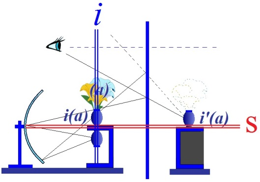
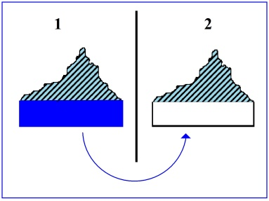
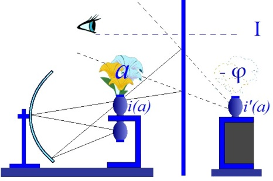
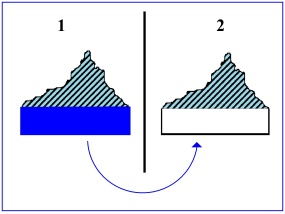
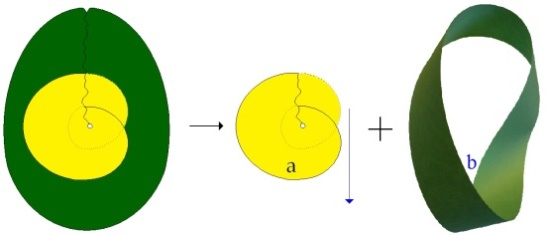
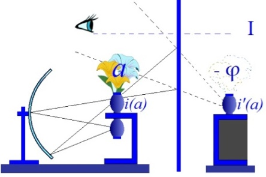
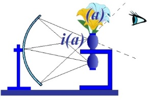
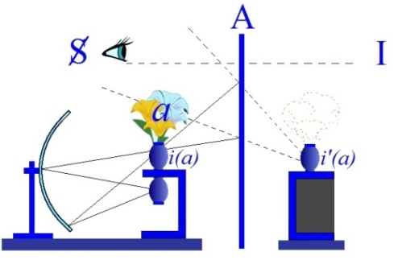

# Leçon 03 | 28 Novembre l962

<!-- source-url: http://staferla.free.fr/S10/S10 L'ANGOISSE.docx -->
<!-- seminar: s10 -->
<!-- lesson: 03 -->

<!-- id: s10-03-0001 -->

Vous remarquerez que je suis toujours content de m’accrocher à quelque *actualité* dans notre dialogue.
Somme toute, il n’y a rien que ce qui est *actuel*, c’est bien pour ça qu’il est si difficile de vivre dans *le monde*, disons *de la réflexion*.
C’est qu’à la vérité, il ne s’y passe pas grand chose. Ιl m’ar­rive comme ça de me déranger pour voir si quelque part
il ne se montrerait pas une petite pointe de point d’interrogation... je suis rarement récompen­sé.
C’est pour ça que s’il arrive qu’on me pose des questions, et sérieuses, eh bien vous ne m’en voudrez pas d’en profiter.

<!-- id: s10-03-0002 -->

Je continue donc mon dialogue avec la personne à qui j’ai déjà fait allu­sion deux fois dans les précédents séminaires, à propos de la façon dont j’ai, la dernière fois, ponctué la différence qu’il y a entre

<!-- id: s10-03-0003 -->

- la conception, l’arti­culation hégélienne du désir,

<!-- id: s10-03-0004 -->

- et la mienne.

<!-- id: s10-03-0005 -->

On me presse, on me presse d’en dire plus sur ce qu’on désigne textuellement
comme un dépassement à accomplir dans mon propre discours, une articulation plus précise entre
« *le stade du miroir* » et, comme on s’exprime, « *Le Rapport de Rome »*[^20], entre

<!-- id: s10-03-0006 -->

- *l’image spéculaire,*

<!-- id: s10-03-0007 -->

- et *le signifiant*.

<!-- id: s10-03-0008 -->

Ajoutons qu’il semble rester là quelque *hiatus*, non sans que mon interlocuteur s’aperçoive
que peut-être ici l’emploi du mot *hiatus*, *coupure* ou *scission*, n’est pas autre chose que la réponse attendue.
Néanmoins sous cette forme, elle pourrait paraître - ce qu’elle serait en effet - une élusion, ou une élision.
Et c’est pourquoi, c’est bien volontiers que j’essaierai aujourd’hui de lui répondre,
et ceci d’autant plus que nous *nous trouvons là strictement sur la voie* de ce que j’ai à vous décrire cette année *concernant l’angoisse*.

<!-- id: s10-03-0009 -->

L’ *angoisse*, c’est ce qui va nous permettre de re-passer - je dis « *re-passer* » - par l’articulation ainsi requise de moi.
Je dis « *re-passer* » parce que

<!-- id: s10-03-0010 -->

- *ceux qui m’ont suivi pendant ces dernières années*,

<!-- id: s10-03-0011 -->

- et même,sans forcément avoir été ici en tous points assidus, *ceux qui ont lu ce que j’écris*, ont d’ores et déjà plus que des éléments pour remplir, pour faire fonctionner cette *coupure*, cet *hiatus*, comme vous allez le voir aux quelques rappels par quoi je vais com­mencer.

<!-- id: s10-03-0012 -->

À la vérité, je ne crois pas qu’il y ait dans ce que j’ai jamais enseigné, deux temps :

<!-- id: s10-03-0013 -->

- un temps qui serait centré sur *le stade du miroir*, sur quelque chose de pointé du coté de *l’imaginaire*,

<!-- id: s10-03-0014 -->

- et puis après, avec ce moment de notre histoire qu’on repère par *Le rapport de Rome*, la découverte que j’eus faite tout d’un coup du *signifiant*.

<!-- id: s10-03-0015 -->

Dans un texte qui je crois n’est plus facile d’accès, mais enfin qui se trouve dans toutes les bonnes bibliothèques psychia­triques,
un texte paru à *L’Évolution Psychiatrique* qui s’appelle « *Propos sur la causalité psychique »* [^21]*...*
discours qui nous fait remonter, si mon souvenir est bon, *juste après la guerre en* l946
...ceux qui s’intéressent à la question qui m’est ainsi posée, je les prie de s’y reporter, ils y verront des choses qui leur prouveront que ce n’est pas de maintenant que cet entre-jeu de ces deux registres a été par moi intimement tressé.

<!-- id: s10-03-0016 -->

À la vérité, si ce discours a été suivi d’un assez long silence, disons, il ne faut pas trop vous en étonner.
Ιl y a eu du chemin de parcouru depuis, pour ouvrir à ce discours un certain nombre d’oreilles,
mais ne croyez pas qu’au moment où...

<!-- id: s10-03-0017 -->

> si ça vous intéresse, relisez ces *Propos sur la causalité psychique*
> *...*au moment où je les ai tenus ces propos, les oreilles pour l’en­tendre fussent si faciles.

<!-- id: s10-03-0018 -->

À la vérité, puisque c’est à Bonneval que ces propos ont été tenus,
et qu’un rendez-vous plus récent à Bonneval a pu pour certains manifester le chemin parcouru,
sachez bien que les réactions à ces premiers *Propos* furent assez étonnantes.
Le terme pudique d’« ambivalence », dont nous nous servons dans le milieu analytique,
caractérise au mieux les réactions que j’enre­gistrais à ce *Propos.*

<!-- id: s10-03-0019 -->

Et même, puisque on va me chercher sur ce sujet, que je ne trouve pas absolument inutile de marquer que à un moment...

<!-- id: s10-03-0020 -->

> dont un certain nombre d’entre vous étaient déjà assez formés pour se souvenir
> ...à un moment qui était d’après-guerre, et de je ne sais quel mouvement de renou­veau qu’on pouvait en espérer,
> et je ne peux pas *ne pas me souvenir* tout d’un coup...

<!-- id: s10-03-0021 -->

> à ce qu’on me ramène à cette époque
> ...de ceci : ceux qui n’étaient certainement pas individuellement les moins disposés à entendre *un discours qui était très nouveau* alors,
> qui étaient des gens situés quelque part, enfin ce qu’on appelle politiquement la gauche, et même l’extrême gauche,
> enfin les communistes pour les appeler par leur nom, firent preuve tout spécialement à cette occasion de cette sorte de chose,
> *de réaction*, de mode, de style qu’il me faut bien épingler par un terme qui est d’usage courant...

<!-- id: s10-03-0022 -->

> encore qu’il faudrait s’arrêter un instant avant d’en avancer l’emploi, c’est un terme très injuste à l’égard
>
> de ceux qu’il invoque à l’origine, mais c’est un terme qui a fini par prendre un sens qui est non ambigu,
>
> nous aurons peut-être dans la suite à y revenir, je l’emploie ici au sens courtois
> ...c’est le terme de *pharisaïsme*.

<!-- id: s10-03-0023 -->

Je dirai qu’en cette occasion, dans ce petit verre d’eau qu’est notre milieu psychiatrique,
le *pharisaïsme* communiste fit vraiment fonction, à plein, de ce à quoi nous l’avons vu s’employer,
pour au moins notre génération, dans l’actuelle ici en France, à savoir à assurer la permanence de cette somme d’ha­bitudes, bonnes ou mauvaises, où un certain ordre établi trouve son confort et sa sécurité.

<!-- id: s10-03-0024 -->

Bref, je ne peux pas ne pas témoigner que c’est à leurs toutes spéciales réserves que je dois d’avoir compris à ce moment-là
que mon dis­cours mettrait encore longtemps à se faire entendre. D’où le silence en ques­tion et l’application que j’ai mise
à me consacrer à seulement le faire pénétrer dans le milieu que son expérience rendait le plus apte à l’entendre,
à savoir le milieu analytique. Je vous passe les aventures de la suite.

<!-- id: s10-03-0025 -->

Mais si ceci peut vous faire relire les *Propos sur la causalité psychique,* vous verrez,

<!-- id: s10-03-0026 -->

> surtout après ce que je vous aurai dit aujourd’hui
> ...que d’ores et déjà la trame existait dans laquelle chacune des deux perspectives,
> que mon interlocuteur distingue, non pas sans raison - s’inscrit.

<!-- id: s10-03-0027 -->

Ces deux perspectives, elles sont ici ponctuées par ces deux lignes colorées,

<!-- id: s10-03-0028 -->

- celle en bleu : verticale,

<!-- id: s10-03-0029 -->

- en rouge : horizontale, que le signe *i* de l’*imaginaire* et S du *symbolique* ici désignent respectivement.

<!-- id: s10-03-0030 -->

<!-- id: s10-03-0031 -->

Ιl y a bien des façons de vous rappeler que l’articulation du *sujet* au *petit autre* et l’articulation du *sujet* au *grand* *Autre* ne vivent pas séparées dans ce que je vous démontre. Ιl y aurait plus d’une façon de vous le rappeler. Je vais vous le rappeler dans un certain nombre de moments qui ont déjà été éclai­rés, ponctués comme essentiels dans mon discours.

<!-- id: s10-03-0032 -->

Je vous fais remarquer que ce que vous voyez là au tableau dans les autres lignes, dessiné, vous allez me voir placer les éléments dont il s’agit, ce n’est rien d’autre qu’un schéma déjà publié dans les *Remarques* que j’ai cru devoir faire *sur le Rap­port* à Royaumont *de Daniel Lagache*[^22].

<!-- id: s10-03-0033 -->

Et ce dessin où s’articule quelque chose qui a le rapport le plus étroit avec notre sujet,
c’est-à-dire la fonction de dépendance de ce que...

<!-- id: s10-03-0034 -->

> le reprenant de ce rapport de Daniel Lagache, mais aussi d’un discours antérieur
>
> que j’avais fait ici, dès la deuxième année de mon séminaire
> ...j’appelais respectivement le « *moi idéal »*, et « l’*idéal du moi »*. Oui...

<!-- id: s10-03-0035 -->

Rappelons donc comment le *rapport spéculaire* se trouve inséré, se trouve donc prendre sa place,
se trouve dépendre de ce qui fait que *le sujet se constitue au lieu de l’Autre*, se constitue de sa marque, dans le rapport au signifiant.

<!-- id: s10-03-0036 -->

Déjà rien que dans la petite image exemplaire d’où part la démonstration du *stade du miroir*,
dans ce moment dit « *jubilatoire »* où l’enfant s’assume comme totalité fonctionnant comme telle dans *son image spéculaire*,
est-ce que depuis toujours, je n’ai pas rappelé le rapport essentiel à ce moment,
de ce mouvement qui fait *que le petit enfant qui vient se saisir* dans cette expé­rience inaugurale de la reconnaissance dans le miroir,
se retourne vers celui qui le porte, qui le supporte, qui le soutient, qui est là derrière lui, l’adulte...

<!-- id: s10-03-0037 -->

> se retourne en un mouvement vraiment tellement fréquent, je dirais constant,
>
> que tout un chacun je pense peut avoir le souvenir de ce mouve­ment
> ...il se retourne vers celui donc qui le porte, vers l’adulte, vers celui qui, là, représente le grand Autre,
> comme pour appeler en quelque sorte son assen­timent, vers ce que, à ce moment l’enfant...

<!-- id: s10-03-0038 -->

> dont nous nous efforçons d’assu­mer le contenu de l’expérience, *dont nous reconstruisons dans* *le stade du miroir* quel est le sens de ce moment, en le faisant se reporter à ce mouve­ment de *nutation* de la tête
> ...qui se retourne et qui revient vers l’image, semble lui demander d’entériner la valeur de cette image.

<!-- id: s10-03-0039 -->

Bien sûr, ce n’est là qu’un indice que je vous rappelle, compte tenu de la liaison inaugurale

<!-- id: s10-03-0040 -->

- de ce rap­port au grand Autre

<!-- id: s10-03-0041 -->

- avec cet avènement de la fonction de l’image spéculai­re ici notée comme toujours par *i(a)*.

<!-- id: s10-03-0042 -->

Mais faut-il nous en tenir là ?
Et, puisque c’est à l’intérieur d’un travail que j’avais demandé à mon interlocuteur, concernant la parade, voire les doutes
qui lui venaient à propos nommément de ce qu’a avancé Claude Lévi-Strauss dans son livre « *La pensée sauvage »,*
dont - vous le verrez - le rapport est vraiment...

<!-- id: s10-03-0043 -->

> j’ai fait la référence tout à l’heure à l’actualité
> ...étroit avec ce que nous avons à dire cette année.

<!-- id: s10-03-0044 -->

Car je crois que ce que nous avons à apporter ici pour marquer *cette sorte de progrès que constitue l’usa­ge de* *la raison psychanalytique,*
est quelque chose qui vient répondre, pré­cisément à ce creux, à cette béance
où plus d’un d’entre vous pour l’instant demeure arrêté :
celle que nous montre tout au long de son développement Claude Lévi-Strauss dans cette sorte d’opposition

<!-- id: s10-03-0045 -->

- de ce qu’il appelle *raison analytique,*

<!-- id: s10-03-0046 -->

- avec la *raison dialectique* [^23].

<!-- id: s10-03-0047 -->

Et c’est bien en effet autour de cette opposition que je voudrais, enfin, ins­tituer, dans ce temps présent,
la remarque introductive suivante que j’ai à vous faire dans mon chemin d’aujourd’hui.

<!-- id: s10-03-0048 -->

Qu’est-ce que j’ai relevé, extrait, du pas inaugural constitué dans la pensée de Freud par *La Science des Rêves,* sinon ceci...

<!-- id: s10-03-0049 -->

> que je vous rappelle, sur lequel j’ai mis l’accent
> ...*que Freud introduit d’abord l’inconscient, à propos du rêve, précisément comme un lieu qu’il appelle ein anderer Schauplatz, une autre scène ?*

<!-- id: s10-03-0050 -->

Dès l’abord, dès l’entrée en jeu de la fonction de l’inconscient, ce terme et cette fonction de *scène* s’y introduit comme essentiel.

<!-- id: s10-03-0051 -->

Eh bien, je crois en effet que c’est là un mode constituant de ce qu’est, disons notre *raison*,
de ce chemin que nous cherchons pour en discerner les structures.

<!-- id: s10-03-0052 -->

Pour vous faire entendre ce que je vais vous dire, disons, disons sans plus...

<!-- id: s10-03-0053 -->

> il faudra bien y revenir - car nous ne savons pas encore ce que ça veut dire le « *premier temps* »
> ...le « *premier temps* » c’est : il y a le monde.

<!-- id: s10-03-0054 -->

Et disons que *la raison analytique*, à laquelle le discours de Claude Lévi-Strauss tend à donner la primauté,
concerne ce « *monde* » tel qu’il est et lui accorde, avec cette primauté, une homogénéité en fin de compte singulière,
qui est bien ce qui heurte et trouble les plus lucides d’entre vous, qui ne peuvent pas man­quer de pointer, de discerner
ce que ceci comporte de retour à ce qu’on pourrait appeler une sorte de « *matérialisme primaire* »,
dans toute la mesure où « *à la limite »*, dans ce discours, le jeu même de la structure, de la combinatoi­re...

<!-- id: s10-03-0055 -->

> tellement puissamment articulée par le discours de Claude Lévi-Strauss
> ...ne ferait que rejoindre par exemple la structure elle-même du cerveau, voire la structure de la matière,
> n’en représenter, selon la forme dite matéria­lisme au XVIIIème siècle, que le *doublet*, même pas la doublure.

<!-- id: s10-03-0056 -->

Je sais bien que ce n’est là qu’une perspective « *à la limite* » que nous pouvons saisir,
mais qu’il est valable de saisir puisqu’elle est en quelque sorte articulée en clair, expressément.

<!-- id: s10-03-0057 -->

*Or la dimension de la scène*, sa division d’avec le lieu, mondain ou pas, cosmique ou pas, où est le spectateur,
est bien là *pour imager à nos yeux la distinction radicale de ce lieu où les choses*...

<!-- id: s10-03-0058 -->

> fût-ce les choses du monde, où toutes les choses du monde
> *viennent à se dire, à se mettre en scène* *selon <u>les lois du signifiant</u>,*
> *dont nous ne saurions d’aucune façon les tenir d’emblée pour homogènes <u>aux lois du monde</u>*.

<!-- id: s10-03-0059 -->

L’existence du discours, et ce qui fait que nous y sommes comme sujets *impliqués,*
n’est que trop évidemment bien antérieure à l’avènement de la science,
et l’effort - enfin, *merveilleux* par son côté désespéré - que fait Claude Lévi-Strauss
pour *homogénéiser le discours* qu’il appelle *de « la magie » avec le discours de « la science »*,
est bien quelque chose qui est admirablement instructif, mais qu’il ne peut pas, un seul instant, pousser jusqu’à l’illusion
qu’il n’y a pas là *un temps*, *une coupure*, *une différence*,
et je vais accentuer tout à l’heure ce que je veux dire là, et ce que nous avons là à dire.

<!-- id: s10-03-0060 -->

Donc, 1er *temps* : « *le monde »*.

<!-- id: s10-03-0061 -->

2ème *temps* : « *la scène » sur laquelle nous faisons monter ce « monde »*.
Et ceci, c’est la dimension de l’His­toire. L’Histoire a toujours ce caractère de mise en scène.

<!-- id: s10-03-0062 -->

C’est bien à cet égard que *le discours de* Claude Lévi-Strauss, nommément au chapitre où il répond à Jean-Paul Sartre,
le dernier développement que Jean-Paul Sartre institue pour réaliser cette opération que j’appelais la dernière fois
« *remettre l’histoire dans ses brancards* ».

<!-- id: s10-03-0063 -->

La limitation de la portée du jeu historique, le rappel :

<!-- id: s10-03-0064 -->

- que le temps de l’Histoire se distingue du temps cosmique,

<!-- id: s10-03-0065 -->

- que les dates elles-mêmes prennent tout d’un coup une autre valeur, qu’elles s’ap­pellent 2 Décembre ou l8 Brumaire,

<!-- id: s10-03-0066 -->

- et que ce n’est pas du même calendrier qu’il s’agit que celui dont vous arrachez les pages tous les jours.

<!-- id: s10-03-0067 -->

La preu­ve c’est que ces dates ont pour vous un autre poids, un autre sens,
qu’elles sont réévoquées, quand il le faut, n’importe quel autre jour du calendrier,
comme leur don­nant leur marque, leur caractéristique, leur style de différence ou de répétition.

<!-- id: s10-03-0068 -->

Alors, une fois que « *la scène »*, si je puis dire, a pris le dessus, ce qui se passe, c’est que le monde y est tout entier monté,
et qu’avec Descartes, on peut dire : « *Sur la scène du monde, je m’avance* - comme il le fait - *larvatus*, *masqué* »[^24],
et qu’à partir de là, la question peut être posée de savoir ce que doit « *le monde* »...

<!-- id: s10-03-0069 -->

> ce que nous avons appelé au départ tout à fait innocemment « *le monde* »
> ...ce que *le monde* doit à *ce qui lui est redescendu* de cette « *scène* ».

<!-- id: s10-03-0070 -->

Est-ce que tout ce que nous avons appelé « *le monde* » au cours de l’histoire, et dont les résidus superpo­sés, accumulés...

<!-- id: s10-03-0071 -->

> sans d’ailleurs le moindre souci des contradictions
> ...ce que la culture nous véhicule comme étant le monde, est un empilement, *un magasin d’épaves*, de mondes qui se sont succédés et qui pour être incom­patibles n’en font pas moins excessivement bon ménage à l’intérieur de tout un chacun :
> structure dont le champ particulier de notre expérience nous permet de mesurer la prégnance,
> la profondeur spécialement dans celle du *névro­sé obsessionnel,* dont Freud lui-même a dès longtemps remarqué
> combien ces « *modes cosmiques »* \[du « *monde* »\] pouvaient coexister de la façon qui fait apparem­ment pour lui le moins d’objections, tout en manifestant la plus parfaite hétérogénéité dès le premier abord, le premier examen.

<!-- id: s10-03-0072 -->

Bref, la mise en question de ce qui est « *le monde* », du *cosmique* dans le réel, est,
à partir du moment où nous avons fait référence à « *la scène »*, tout ce qu’il y a de plus légi­time :
est-ce que ce à quoi nous croyons avoir affaire comme « *monde* »,
est-ce que ce n’est pas tout simplement *les restes accumulés de ce qui venait de* « *la scène »* *quand*, je peux dire, *la scène était en tournée* ?

<!-- id: s10-03-0073 -->

Eh bien ce rappel va nous introduire à une 3ème remarque, un 3ème temps que je vais vous rappeler comme discours antérieur,
et d’autant plus, peut-être cette fois-ci d’une façon insistante, que ce n’est pas un « temps »,
que je n’ai pas eu assez, à l’époque, le temps d’accentuer.

<!-- id: s10-03-0074 -->

Puisque nous parlons de « *scène »*, nous savons quelle fonction justement le théâtre tient dans le fonctionne­ment des mythes
qui nous permettent, à nous analystes, de penser.

<!-- id: s10-03-0075 -->

Je vous ramène à Hamlet et à ce point crucial qui a déjà fait question pour nombre d’auteurs
et plus particulièrement pour Rank[^25] qui a fait sur ce point un article en tous points...
vu le moment précoce où il a été par lui poussé

<!-- id: s10-03-0076 -->

...[*un article*](#Rank2801) en tous points, admirable : c’est l’attention qu’il a attirée sur *la fonction de la scène,* *sur « la scène »*.

<!-- id: s10-03-0077 -->

Qu’est-ce qu’Hamlet...

<!-- id: s10-03-0078 -->

> Hamlet de Shakespeare, Hamlet le personnage de *la scène*
> *...*qu’est-ce qu’Hamlet fait venir sur la scène avec les comédiens ?
> Sans doute le « *mouse-trap »*, *la souricière*, avec laquelle, nous dit-il, il va saisir, attraper, la conscience du roi.

<!-- id: s10-03-0079 -->

Mais outre, qu’il s’y passe des choses bien étranges et en particulier ceci, dans lequel à l’époque...

<!-- id: s10-03-0080 -->

> au temps où je vous ai déjà si longuement parlé d’[Hamlet](http://www.ebooksgratuits.com/pdf/shakespeare_hamlet.pdf)[^26]

<!-- id: s10-03-0081 -->

...je n’ai pas voulu vous introduire parce que cela nous eût orientés dans une littérature dans le fond plus « *hamlétique »...*

<!-- id: s10-03-0082 -->

> vous savez qu’elle existe, qu’elle existe au point où il y a de quoi couvrir ces murs
> ...plus *hamlétique* que psychanalytique, et qu’il s’y passe des choses bien étranges, y compris ceci :
> c’est que, *quand la scène est mimée en manière de prologue*, avant que les acteurs ne commencent leur discours,
> eh bien, *ça ne semble pas beaucoup agiter le roi*, alors que pourtant les gestes présumés de son crime sont là devant lui, pantomimées.

<!-- id: s10-03-0083 -->

Par contre, il y a quelque chose de bien étrange, c’est le véritable débordement, la crise d’agitation qui saisit Hamlet
à partir d’un certain moment où vient sur la scène, après quelques discours, où vient le moment crucial,
celui où le per­sonnage dénommé Lucianus ou Luciano accomplit, accomplit son crime sur celui des deux personnages
qui représente le roi, le roi de comédie, bien que celui-ci se soit dans son discours affirmé, assuré comme étant le roi
d’une certaine dimension, ainsi que celle qui représente sa conjointe, son épouse, après que la situation ait été bien établie.

<!-- id: s10-03-0084 -->

Tous les auteurs qui se sont arrêtés à cette scène ont remarqué que l’accoutrement du personnage est exactement,

<!-- id: s10-03-0085 -->

- non pas celui du roi qu’il s’agit d’attraper,

<!-- id: s10-03-0086 -->

- mais celui d’Hamlet lui-même, et qu’aussi bien il est indiqué que ce personnage n’est pas *frère* du roi de comédie, n’est pas avec lui dans un rapport qui serait homologue à celui de l’usurpateur qui est dans la tragédie en possession de la reine Gertrud, après son meurtre accompli, mais dans une position homologue à celle qu’Hamlet a à ce personnage, que c’est le neveu du roi de comédie.

<!-- id: s10-03-0087 -->

Ce qu’Hamlet fait représenter sur la scène, c’est donc en fin de compte quoi ?
C’est lui-même, accomplissant le crime dont il s’agit.

<!-- id: s10-03-0088 -->

Ce personnage dont...

<!-- id: s10-03-0089 -->

> pour les raisons que j’ai essayé d’articuler pour vous
> ...le désir ne peut s’animer pour accomplir *la volonté du* *ghost,* du fantôme de son père,
> ce personnage tente de donner corps à quelque chose, et ce à quoi il s’agit de donner corps passe par son image,
> véritablement là, spéculaire, son image non pas dans la situation, dans le mode d’accomplir sa *vengeance*,
> mais d’assu­mer d’abord le crime qu’il s’agira de venger.

<!-- id: s10-03-0090 -->

Or, qu’est-ce que nous voyons ? C’est que c’est insuffisant !
Qu’il a beau être saisi...

<!-- id: s10-03-0091 -->

> après cette sorte d’effet de lanterne magique, de ce qu’on peut vraiment dans ses propos,
>
> dans son style, dans la façon toute ordinaire d’ailleurs dont les acteurs ani­ment ce moment
> ...par une véritable *petite crise d’agitation maniaque*, quand il se trouve, l’instant d’après, avoir son ennemi à sa portée,
> il ne sait qu’ar­ticuler ce que *pour tout auditeur* et *depuis toujours* enfin, ce qui n’a pu être senti que comme une dérobade,
> une dérobade derrière un prétexte, c’est qu’assurément il saisit son ennemi à un moment trop saint...

<!-- id: s10-03-0092 -->

> le roi est en train de prier
> ...pour qu’il puisse se résoudre, en le frappant à ce moment, à le faire accéder directement au ciel.

<!-- id: s10-03-0093 -->

Je ne vais pas m’attarder à traduire tout ce que ceci veut dire, car il me faut ici aller plus loin.
Je veux assez avancer aujourd’hui et vous faire remar­quer qu’à côté de cet échec,
là, j’ai puissamment articulé alors ce 2nd moment, je vous en ai montré toute la portée :
c’est dans la mesure où se produit une identification d’une nature tout à fait différente...

<!-- id: s10-03-0094 -->

> que j’ai appelée « *identifica­tion avec Ophélie* »
> ...c’est dans la mesure où l’âme furieuse que nous pouvons inférer légitimement être celle de la victime, de la suicidée, manifestement offerte en sacrifice aux mânes paternelles...

<!-- id: s10-03-0095 -->

> car c’est à la suite du meurtre de son père à elle qu’elle fléchit, qu’elle succombe,
>
> mais cela nous montre les croyances de toujours concernant les suites de certains modes de trépas,
>
> du fait même que les cérémonies funéraires, dans son cas, ne peuvent pas être plei­nement remplies,
>
> que rien n’est apaisé de la vengeance qu’elle crie, elle
> ...c’est au moment de la révélation de ce qu’a été pour lui cet objet négligé, mécon­nu,
> que nous voyons là jouer dans Shakespeare, à nu :

<!-- id: s10-03-0096 -->

- cette *identification à l’objet* que Freud nous désigne comme étant le ressort majeur de la fonction du deuil,

<!-- id: s10-03-0097 -->

- cette définition implacable, je dirais, que Freud a su donner du deuil,

<!-- id: s10-03-0098 -->

- cette sorte d’envers qu’il a désigné aux pleurs qui lui sont consacrés,

<!-- id: s10-03-0099 -->

- ce fond de reproche qu’il y a dans le fait qu’on ne veuille, de la réalité de celui qu’on a perdu, ne vouloir se souvenir que de ce qu’il a laissé de *regrets*.

<!-- id: s10-03-0100 -->

Quelle étonnante cruauté, bien faite pour nous rappeler la légitimité de modes de célébrations plus primitifs,
que des pratiques collectives savent encore faire vivre !

<!-- id: s10-03-0101 -->

Pourquoi ne se réjouirait-on pas *qu’il ait existé* ?
Les paysans dont nous croyons qu’ils noient dans des banquets une insensibili­té préjudicielle,
c’est bien autre chose qu’ils font, c’est l’avènement, de celui *qui a été*, à la sorte de gloire simple qu’il mérite,
comme ayant été parmi nous, simplement un vivant.

<!-- id: s10-03-0102 -->

Cette *identification à l’objet du deuil* que Freud a désigné ainsi, sous ses modes négatifs, n’oublions pas

<!-- id: s10-03-0103 -->

- qu’il a, s’il existe, aussi sa phase *positive*,

<!-- id: s10-03-0104 -->

- que l’entrée dans Hamlet de ce que j’ai appelé ici « *la fureur de l’âme féminine* », c’est celle qui lui donne la force de devenir, à par­tir de là, ce somnambule qui accepte tout, jusques et y compris - je l’ai assez marqué - dans le combat, d’être celui qui tient l’enjeu, qui tient la partie pour son ennemi, le roi lui-même, contre son image spéculaire, qui est Laërte.

<!-- id: s10-03-0105 -->

Les choses, à partir de là, s’arrangeront toutes seules...
et sans qu’il fasse en somme rien qu’exactement ce qu’il ne faut pas faire
...à le mener jus­te à ce qu’il a à faire, à savoir...

<!-- id: s10-03-0106 -->

> à la seule condition qu’il soit lui-même blessé à mort auparavant
> ...à tuer le roi.

<!-- id: s10-03-0107 -->

Nous avons ici la distan­ce, la différence qu’il y a, entre deux sortes d’identifications imaginaires :

<!-- id: s10-03-0108 -->

- celle au *(a)* : *i’(a)*, image spéculaire telle qu’elle nous est donnée au moment de « *la scène sur la scène »,*

<!-- id: s10-03-0109 -->

- celle plus mystérieuse - mais dont l’énigme commence d’être là développée - à quelque chose d’autre : *l’objet*, *l’objet du désir* comme tel, sans aucune ambiguïté désigné dans l’articulation shakespea­rienne comme tel.

<!-- id: s10-03-0110 -->

Puisque c’est justement comme *objet du désir* qu’il a été jusqu’à un certain moment négligé,
qu’il est réintégré sur la scène *par la voie de l’identification*, justement dans la mesure où comme *objet* il vient à disparaître,
*que la dimension*, si l’on peut dire, *rétroactive*, cette dimension de l’imparfait...

<!-- id: s10-03-0111 -->

> sous la forme ambiguë où il est employé en français, qui est celle qui donne sa force
>
> à la façon dont je répète devant vous le « *il ne savait pas* », ce qui veut dire : « *au dernier moment n’a-t-il pas su ?*
>
> *Un peu plus il allait savoir* », cet *objet du désir* dont ce n’est pas pour rien que *désir* en latin se dit *desiderium,*
>
> à savoir cette reconnaissance rétroactive
> ...cet « *objet qui était là* », c’est par cette voie que passe le retour d’Hamlet
> dans ce qui est la pointe de *sa destinée*, de sa « *fonction Hamlet* », si je puis m’exprimer ainsi, de son achè­vement *hamlétique*.

<!-- id: s10-03-0112 -->

C’est ici que ce *troisième temps* de référence à notre dis­cours précédent nous montre où il convient de porter l’interrogation,
l’interrogation comme déjà vous le savez depuis longtemps, parce que c’est la même, sous des angles multiples,
que je renouvelle toujours : c’est le statut de l’*objet* en tant qu’*objet du désir*.

<!-- id: s10-03-0113 -->

Tout ce que dit Claude Lévi-Strauss de la fonction de *la magie*, de la fonction du *mythe,* a sa valeur,
à condition que nous sachions qu’il s’agit du rapport à cet *objet* qui a le statut d’*objet du désir*...

<!-- id: s10-03-0114 -->

> statut qui, j’en conviens, n’est pas encore établi, puisque c’est notre objet de cette année,
>
> par la voie de l’abord de l’angoisse, de faire avancer
> ...et qu’il convient tout de même de ne pas confondre cet *objet du désir* avec *l’objet* défini par l’épistémolo­gie,
> comme avènement d’un certain *objet* scientifiquement défini, comme *avènement de l’objet* qui est l’objet de notre science,
> très spécifique­ment défini par une certaine découverte de *l’efficacité de l’opération signi­fiante* comme telle.

<!-- id: s10-03-0115 -->

Le propre de notre science...

<!-- id: s10-03-0116 -->

> je dis de la science qui exis­te depuis deux siècles parmi nous
> ...laisse ouverte la question de ce que j’ai appe­lée tout à l’heure « *le cosmisme de l’objet* » : il n’est pas sûr qu’il y ait un cosmos,
> et notre science avance dans la mesu­re où elle a renoncé à préserver toute présupposition cosmique et cosmici­sante.

<!-- id: s10-03-0117 -->

Nous retrouverons ce point essentiel de référence, tellement essentiel qu’on ne peut manquer de s’étonner
qu’en restituant, sous une forme moderne, une espèce de permanence, de perpétuité, d’éternité, du *cosmisme* de la réalité,
Claude Lévi-Strauss, dans *La Pensée Sauvage,* n’apporte pas à tout le monde l’espèce de sécurité, de sérénité,
d’apaisement épi­curien qui devrait résulter.

<!-- id: s10-03-0118 -->

La question se pose de savoir si c’est uniquement *les psychanalystes* qui ne sont pas contents, ou si c’est *tout le monde*.
Or je prétends, quoique n’en ayant pas encore de preuves, que ce doit être tout le monde.

<!-- id: s10-03-0119 -->

Ιl s’agit de rendre raison pourquoi :

<!-- id: s10-03-0120 -->

- pourquoi on n’est pas content de voir tout d’un coup le totémisme, si l’on peut dire, vidé de son contenu que j’appellerai, grossièrement pour me faire entendre « *passionnel* »,

<!-- id: s10-03-0121 -->

- pourquoi on n’est pas content que le monde soit depuis l’ère néolithique, parce qu’on ne peut pas remonter plus loin, déjà si tellement en ordre que tout ne soit que vaguelettes insignifiantes à la surface de cet ordre,

<!-- id: s10-03-0122 -->

- en d’autres termes, pourquoi nous voulons tellement préserver la dimension de l’an­goisse.

<!-- id: s10-03-0123 -->

Il doit bien y avoir une raison pour ça, car le biais, la voie de passa­ge, qui est ici désignée pour nous, entre

<!-- id: s10-03-0124 -->

- ce retour à un *cosmisme* assuré,

<!-- id: s10-03-0125 -->

- et d’autre part le maintien d’un pathétisme historique auquel nous ne tenons pas non plus tellement que ça, encore qu’il ait justement toute sa fonction, c’est bien dans l’étude de *la fonction de l’angoisse* que ce chemin que nous cherchons doit passer.

<!-- id: s10-03-0126 -->

Et c’est pourquoi je suis amené à vous rappeler ici les termes où se montre comment se noue précisément

<!-- id: s10-03-0127 -->

- *la relation spéculaire,*

<!-- id: s10-03-0128 -->

- avec *la relation au grand Autre*.

<!-- id: s10-03-0129 -->

Dans cet article...

<!-- id: s10-03-0130 -->

> auquel je vous demande de vous référer, parce que je ne vais pas entièrement ici le refaire
> ...ce que *l’ap­pareil...*

<!-- id: s10-03-0131 -->

> la petite image, que j’ai fomentée pour faire comprendre ce dont il s’agit
> ...ce à quoi cet appareil est destiné c’est à nous rappeler ceci, qu’à la fin de mon séminaire sur « Le désir... », j’ai accentué,
> c’est que la fonction de *l’investissement spéculaire* *se conçoit située à l’intérieur de la dialectique du* *narcissisme* telle que Freud l’a introduite.

<!-- id: s10-03-0132 -->

Cet investissement de l’image spé­culaire est un temps fondamental de *la relation imaginaire*,
fondamental en ceci qu’*il a une limite*, c’est que tout *l’investissement libidinal* ne passe pas par l’image spéculaire : *il y a un « reste »*.

<!-- id: s10-03-0133 -->

<!-- id: s10-03-0134 -->

Ce « *reste »*, j’ai déjà *tenté* et, j’espère, assez réussi à vous faire concevoir comment et pourquoi
nous pouvons le caractériser sous un mode central, pivot, dans toute cette dialectique,
et c’est là que je repren­drai la prochaine fois, que je vous montrerai en quoi cette fonction est pri­vilégiée,
plus que je n’ai pu encore le faire jusqu’ici, *sous le mode*, dis-je, *du phallus*.

<!-- id: s10-03-0135 -->

 

<!-- id: s10-03-0136 -->

Et ceci veut dire que dès lors, dans tout ce qui est repérage imagi­naire, le *phallus* viendra sous la forme d’un manque, d’un (- φ).

<!-- id: s10-03-0137 -->

Dans toute la mesure où se réalise ici que j’ai appelé *l’image réelle* \[***i***(*a*)\],
la constitution dans le matériel du sujet de *l’image du corps* fonctionnant comme pro­prement *imaginaire*, c’est-à-dire libidinalisée,
le *phallus* apparaît en moins, apparaît comme un blanc : le *phallus* sans doute est *une réserve* opératoire,

<!-- id: s10-03-0138 -->

- mais non seulement qui n’est pas représentée au niveau de l’*imaginaire*

<!-- id: s10-03-0139 -->

- mais qui est cernée - et pour dire le mot - « *coupée » de l’image spéculaire*.

<!-- id: s10-03-0140 -->

Tout ce que j’ai, l’année dernière, essayé de vous articuler autour du *cross-cap*,
et pour ajouter à cette dialectique une cheville, quelque chose qui, sur le plan de ce domaine ambigu qu’est la topologie,
pour ce qu’elle amin­cit à l’extrême les données de l’*imaginaire*, qu’elle joue sur une sorte de trans-espace,
dont en fin de compte tout laisse à penser qu’il est fait de la pure articulation signifiante,
tout en laissant encore à notre portée quelques éléments intuitifs, justement ceux supportés par cette image biscornue
et pourtant combien expressive du *cross-cap* que j’ai manipulé devant vous pendant plus d’un mois,
pour vous faire concevoir comment, dans une sur­face ainsi définie qui était celle-là - je ne le rappelle pas ici -
la coupure peut instituer deux morceaux, deux pièces différentes :

<!-- id: s10-03-0141 -->

- l’une qui peut avoir une image spéculaire,

<!-- id: s10-03-0142 -->

- et l’autre qui littéralement n’en a pas.

<!-- id: s10-03-0143 -->

<!-- id: s10-03-0144 -->

Le rapport de cette « *réserve »*, de cette *réserve libidinale*, insaisissable imaginairement, encore qu’elle soit liée à un organe,
Dieu merci, encore parfaitement saisissable, c’est-à-dire celui de l’instrument qui devra tout de même de temps en temps
entrer en action pour la satisfaction du désir : le *phallus,* le rapport de ce (- φ) avec *la consti­tution du* *(a)* qui est :

<!-- id: s10-03-0145 -->

- *ce reste, ce résidu, cet objet* dont le statut échappe au sta­tut de l’objet dérivé de *l’image spéculaire,* échappe aux lois de l’esthétique transcendantale,

<!-- id: s10-03-0146 -->

- cet *objet* dont le statut est si difficile pour nous à articuler, que c’est par là que sont entrées toutes les confusions dans la théorie analy­tique,

<!-- id: s10-03-0147 -->

- cet *objet(a)* dont nous n’avons fait qu’amorcer *les caractéristiques* constituantes et que nous amenons ici à l’ordre du jour,

<!-- id: s10-03-0148 -->

- cet *objet(a)* c’est lui dont il s’agit partout où Freud parle de l’*objet* quand il s’agit de l’angoisse.

<!-- id: s10-03-0149 -->

L’ambiguïté tient à la façon dont nous ne pouvons faire que d’imaginer cet objet dans le registre spéculaire.
Ιl s’agit précisément d’instituer ici - et nous le ferons, nous pouvons le faire - d’instituer un autre mode d’*imagi­narisation*,
si je puis m’exprimer ainsi, où se définisse cet objet.

<!-- id: s10-03-0150 -->

C’est ce que nous allons arriver à faire, si vous voulez bien me suivre, c’est-à-dire pas à pas.
D’où, dans cet article dont je vous parle, fais-je partir la dialectique ?

<!-- id: s10-03-0151 -->

D’un S :

<!-- id: s10-03-0152 -->

- *le sujet* comme possible,

<!-- id: s10-03-0153 -->

- *le sujet* parce qu’il faut bien en parler si l’on parle,

<!-- id: s10-03-0154 -->

- *le sujet* dont le modèle nous est donné par la conception classique du sujet, à cette seule condition que nous le limitions au fait qu’il parle, et dès qu’il parle il se produit quelque chose.

<!-- id: s10-03-0155 -->

S’il commence à parler, *le trait unaire* entre en jeu.
L’identification primaire à ce point de départ que constitue le fait de pouvoir dire :
1 et 1, et encore 1, et encore 1, et que c’est toujours d’un 1 qu’il faut qu’on parte, c’est à partir de là...

<!-- id: s10-03-0156 -->

> le sché­ma de l’article en question le dessine
> ...à partir de là que s’institue la pos­sibilité de la reconnaissance comme telle de l’*unité* appelée *i(a).*

<!-- id: s10-03-0157 -->

Cet *i(a)* est donné dans *l’expérience spéculaire*, mais comme je vous l’ai dit, cette *expérience spéculaire* est authentifiée par l’Autre
et comme telle, au niveau ici *i’(a).* Rappelez-vous mon schéma...

<!-- id: s10-03-0158 -->

> je ne peux pas là-dessus vous redonner les termes de la petite expérience de physique amusante
>
> qui m’a servi à pouvoir vous l’imager
> ...*i’(a)* y est *l’image virtuelle* d’une *image réel­le* \[*i(a)*\]. Au niveau de cette *image virtuelle* \[*i’(a)*\], il n’apparaît ici \[*dans le col du vase*\] *rien*.

<!-- id: s10-03-0159 -->

<!-- id: s10-03-0160 -->

J’ai écrit (- φ) parce que nous aurons à l’y amener la prochaine fois :

<!-- id: s10-03-0161 -->

- (- φ) n’est pas plus visible, n’est pas plus sensible, n’est pas plus présentifiable là qu’il ne l’est ici,

<!-- id: s10-03-0162 -->

- (- φ) n’est pas entré dans *l’imaginaire*.

<!-- id: s10-03-0163 -->

Le sort principiel, inau­gural, le temps - j’insiste - dont nous parlons tient ici en ceci...
il faudra attendre la prochaine fois pour que je vous l’articule
...que le désir tient dans la relation que je vous ai donnée pour être celle du fantasme S ◊ *a* :
S, le poinçon ◊, *avec son sens que nous saurons lire encore différemment bientôt*, (*a*).

<!-- id: s10-03-0164 -->

Ceci veut dire que ce serait dans la mesure où le sujet pourrait être *réel­lement*, et non pas par l’intermédiaire de l’Autre,
à la place de **Ι,** qu’il aurait relation avec ce qu’il s’agit de prendre dans le col de *l’image spéculaire* originelle \[*image réelle* : *i(a)*\],
à savoir l’objet de son désir :

<!-- id: s10-03-0165 -->

<!-- id: s10-03-0166 -->

Ceci, ces deux piliers \[*i(a) et (a)*\], sont *le support de la fonction du désir*,
et si le désir existe et soutient l’homme dans son existence d’homme, c’est dans la mesure

<!-- id: s10-03-0167 -->

- où cette relation, par quelque détour, est accessible,

<!-- id: s10-03-0168 -->

- où des *artifices* nous donnent accès à *la relation ima­ginaire* qui constitue le *fantasme*.

<!-- id: s10-03-0169 -->

Mais ceci n’est nullement possible d’une façon effective.

<!-- id: s10-03-0170 -->

<!-- id: s10-03-0171 -->

Ce que l’homme a en face de lui, ce n’est jamais que l’*ima­ge* \[*image réelle* : *i(a)*\] de ce que dans mon schéma je représentais
\- vous le savez ou vous ne le savez pas - par *ce vase.*

<!-- id: s10-03-0172 -->

Ce que l’illusion du miroir sphérique produit ici *à l’étage réel*, sous une forme d’*image réelle* \[*i(a)*\],
il en a l’*image virtuelle* \[*i’(a)*\] avec rien dans son col :
le *(a)*, *support du désir dans le fantasme*, n’est pas visible dans ce qui constitue pour l’homme, l’image de son désir.

<!-- id: s10-03-0173 -->

Cette présence donc *ailleurs*, *en deça*...

<!-- id: s10-03-0174 -->

> et comme vous le voyez ici, trop près de lui pour être vue si l’on peut dire
> ...du *(a)*, c’est ceci l’*initium* du désir, et c’est de là que l’image *i’(a)* prend son *prestige*.

<!-- id: s10-03-0175 -->

Mais plus l’homme s’ap­proche, cerne, caresse ce qu’il croit être l’*objet de son désir*,
plus en fait il en est détourné, dérouté, en ceci justement que tout ce qu’il fait sur cette voie pour s’en rapprocher,
donne toujours plus corps à ce qui dans l’objet de ce désir représente l’*image spéculaire*.

<!-- id: s10-03-0176 -->

Plus il va, plus il veut, dans l’objet de son désir, préserver, maintenir*...*

<!-- id: s10-03-0177 -->

> écoutez bien ce que je vous dis
> ...protéger le côté *intact* de ce vase primordial qu’est l’image spéculaire,
> *plus il s’enga­ge dans cette voie*...

<!-- id: s10-03-0178 -->

> qu’on appelle souvent improprement « la voie de la perfec­tion de la relation d’objet »
> ...*plus il est leurré*.

<!-- id: s10-03-0179 -->

Ce qui constitue l’angoisse, c’est quand quelque chose, un mécanisme, fait apparaître ici à sa place \[*i’(a)*\]...

<!-- id: s10-03-0180 -->

> que j’ap­pellerai, pour me faire entendre, simplement « *naturelle »*
> *...*à la place qui *corres­pond* à celle qu’occupe le *(a)* de l’objet du désir, *quelque chose*,
> et quand je dis « *quelque chose* », entendez n’importe quoi !

<!-- id: s10-03-0181 -->

Je vous prie, d’ici la prochaine fois, de vous donner la peine, avec cette introduction que je vous y donne,
de relire l’article sur l’*Unheimlich* [^27]. C’est un article que je n’ai jamais enten­du commenter - *jamais, jamais*, entendu commenter –
et dont personne ne semble même s’apercevoir qu’*il est la cheville absolument indispensable pour aborder la question de l’angoisse*.

<!-- id: s10-03-0182 -->

De même que j’ai abordé l’inconscient par *Le mot d’esprit*, j’aborderai cette année l’angoisse par l’*Unheimlich.*
*Unheimlich* c’est ce qui apparaît à cette place. Or ce qui devrait être à cette place...

<!-- id: s10-03-0183 -->

> c’est pourquoi je vous l’ai écrit dès aujourd’hui
> ...c’est le (- φ), le *quelque chose* qui nous rappelle :

<!-- id: s10-03-0184 -->

- que ce dont tout part, c’est de *la castration imaginaire*,

<!-- id: s10-03-0185 -->

- <u>*qu’il n’y a pas* - et pour cause ! - *d’image du manque*</u>.

<!-- id: s10-03-0186 -->

*Quand il apparaît quelque chose là*, c’est donc - si je puis m’exprimer ainsi - *que le manque vient à manquer*.
Or ceci pourra vous apparaître une pointe, un *concetti* bien à sa place, dans mon style dont chacun sait qu’il est gongorique.

<!-- id: s10-03-0187 -->

Eh bien, je m’en fous !

<!-- id: s10-03-0188 -->

Je vous ferai simplement observer qu’il peut se produire bien des choses dans le sens de *l’anomalie* : *ce n’est pas ça qui nous angoisse*.
Mais si tout d’un coup vient à manquer toute norme...

<!-- id: s10-03-0189 -->

> c’est-à-dire ce qui fait l’anomalie, c’est-à-dire ce qui fait le manque,
>
> car la norme est corrélative de l’idée de manque
> ...si tout d’un coup ça ne manque pas...

<!-- id: s10-03-0190 -->

> et croyez-moi : essayez d’ap­pliquer ça à bien des choses
> ...c’est à ce moment-là que commence *l’angois­se*.

<!-- id: s10-03-0191 -->

De sorte que d’ores et déjà, avec moi je vous autorise à reprendre la lecture de ce que dit Freud dans son dernier grand article sur l’angoisse, celui d’*Inhibition, symptôme, angoisse,* dont déjà pour une première délinéation nous sommes partis.

<!-- id: s10-03-0192 -->

Alors avec cette clé, vous pourrez voir le véritable sens à donner, sous sa plume, au terme de « *perte de l’objet* ».

<!-- id: s10-03-0193 -->

C’est la la prochaine fois que je reprendrai et où j’espère donner son véritable sens à notre recherche de cette année.

## Notes

[^20]: Jacques Lacan : *Écrits*, Paris, Seuil, 1966, p. 237. Cf. Jacques Lacan : Autres Écrits, Paris, Seuil, 2001, *[Discours de Rome](http://www.ecole-lacanienne.net/pictures/mynews/9917835CB831A5EB84B0E347B2992D86/1953-09-26a.pdf)* ([E.L.P.](http://www.ecole-lacanienne.net/fr/p/lacan)), p.133.

[^21]: Jacques Lacan : *Écrits*, Op. cit., p.151 ; ou t.1 p.150.

[^22]: *Écrits*, p.647, ou t.2 p.124.

[^23]: Claude Lévi-Strauss : *La pensée sauvage*, Op. cit., cf. Ch. 9 : *Histoire et dialectique* p. 324.

[^24]: René Descartes : [Préambule des *Cogitationes privatae*](http://fr.wikisource.org/wiki/Page:Descartes_-_%C5%92uvres,_%C3%A9d._Adam_et_Tannery,_X.djvu/223) : « *Sur le point de monter sur la scène du monde,* \[...\] *je m’avance masqué*. » « *sic ego,* *hoc mundi theatrum conscensurus, in quo hactenus spectator exstiti, larvatus prodeo*.( éd. Adam et Tannery, Vrin, tome X, p. 213).

[^25]:
    ###  Otto Rank : *Das « Schauspiel » in Hamlet - [Le spectacle dans Hamlet](http://www.dundivanlautre.fr/sur-la-psychanalyse-et-le-psychanalyste/otto-rank-le-spectacle-dans-hamlet-1915)* (*Ein Beitrag zur Analyse und zum dynamischen Verständis der Dichtung*).

    ###  Contribution à l’analyse et à la compréhension dynamique de l’œuvre. Revue *Imago*, 1915.)

[^26]: Séminaire 1958-59 : *Le désir et son interprétation*, séances du 04-03 au 29-04, et 27-05-1959.

[^27]: S. Freud : [*Das Unheimliche*](http://staferla.free.fr/Freud/freud.htm), 1919, *L'inquiétante étrangeté*, in *Essais de psychanalyse appliquée*, Paris, Gallimard, Coll. Idées, 1976.
