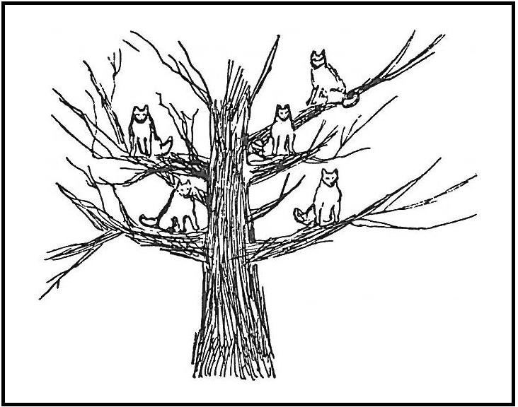
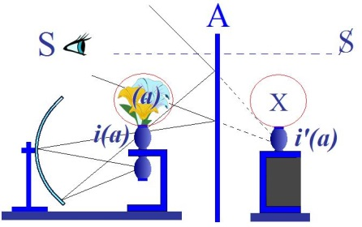
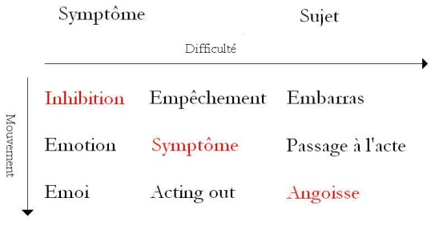
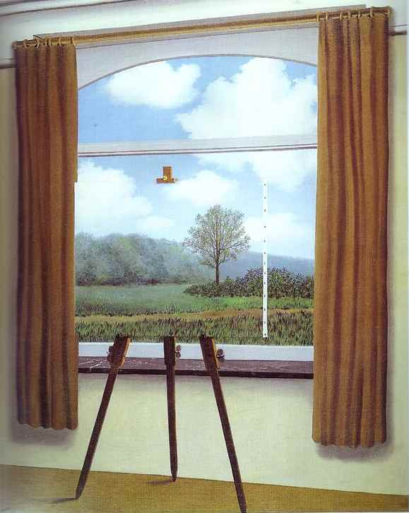

# Leçon 06 | l9 Décembre l962

<!-- source-url: http://staferla.free.fr/S10/S10 L'ANGOISSE.docx -->
<!-- seminar: s10 -->
<!-- lesson: 06 -->

<!-- id: s10-06-0001 -->

Donc ce que j’évoque ici pour vous n’est pas de la métaphysique.
S’il m’était permis d’employer un terme auquel l’actualité a fait depuis quelques années un sort,
je parlerais plutôt de « *lavage de cerveau* ».

<!-- id: s10-06-0002 -->

Ce que j’entends, c’est - grâce à une méthode - vous apprendre à reconnaître, à reconnaître à la bonne place,
ce qui se présente dans votre expérience.
Et bien entendu l’effi­cacité de ce que je prétends faire ne s’éprouve qu’à l’expérience.

<!-- id: s10-06-0003 -->

Et si par­fois on a pu objecter la présence à mon enseignement, de certains que j’ai en analyse,
après tout la *légitimité* de cette coexistence de deux rapports avec moi,

<!-- id: s10-06-0004 -->

- celui où l’on m’entend,

<!-- id: s10-06-0005 -->

- et celui où de moi l’on se fait entendre, ne peut se juger qu’à l’intérieur, et pour autant que ce qu’ici je vous apprends peut effectivement faciliter à chacun...

<!-- id: s10-06-0006 -->

> j’entends aussi bien à celui qui travaille avec moi
> ...l’accès à la reconnaissance de son propre chemin.

<!-- id: s10-06-0007 -->

À cet endroit, bien sûr il y a quelque chose, une limite, où le contrôle externe s’arrête,
mais assurément ce n’est pas un mauvais signe si l’on peut voir que ceux-là qui participent de ces deux positions
y apprendront au moins à mieux lire.

<!-- id: s10-06-0008 -->

« *Lavage de cerveau* », ai-je dit. C’est bien - pour *moi*, m’offrir à ce contrôle - que je reconnaisse dans les propos
de ceux que j’analyse autre chose que ce qu’il y a dans les livres.
Inversement, pour eux, c’est qu’ils sachent dans les livres reconnaître au passage ce qu’il y a effectivement dans les livres.

<!-- id: s10-06-0009 -->

Et à cet endroit, je ne puis que m’applaudir, par exemple d’un petit signe comme celui-ci, récent,
qui m’a été donné de la bouche de quelqu’un justement que j’ai en analyse :
qu’au passage ne lui échappe pas la portée d’un trait comme celui-ci :
qu’on peut au passage accrocher dans un livre dont la traduction est venue récemment - combien tard ! –
d’une œuvre de Ferenczi en français, à savoir ce livre dont le titre original est [*Versuch einer Genitaltheorie*](http://www.archive.org/stream/VersuchEinerGenitaltheorie/IPB_15_Ferenczi_1924_Versuch_einer_Genitaltheorie#page/n3/mode/2up) :
*Recherche -* très exactement : *d’une théorie de la génitalité,* et non pas simplement *Des ori­gines de la vie sexuelle* [^35] comme on l’a ici noyé, livre assurément qui n’est pas sans inquiéter par quelques côtés, que j’ai déjà...

<!-- id: s10-06-0010 -->

> pour ceux qui savent entendre
> ...dès longtemps pointés, comme pouvant à l’occasion participer du délire, mais qui apportant avec lui cette énorme expérience
> laisse tout de même en ses détours déposer plus d’un trait pour nous précieux.

<!-- id: s10-06-0011 -->

Et celui-ci dont je suis sûr que l’auteur lui-même ne lui donne pas tout l’accent qu’il vaut,
jus­tement dans un dessein dans sa recherche d’arriver à une notion trop har­monisante, trop totalisante de ce qui fait son objet,
à savoir la visée de *« la réa­lisation génitale »*.

<!-- id: s10-06-0012 -->

Au passage - je vous en cite un - qui s’exprime ainsi :

<!-- id: s10-06-0013 -->

> « *Le développement de la sexua­lité génitale, dont nous venons -* dit-il, chez l’homme, c’est en effet ce qu’il vient de faire, l’homme mâle, le mâle -*de schématiser les grandes lignes, subit chez la femme -* ce qu’on a traduit par *- une interruption plutôt inat­tendue* ».
>
> \[« *Die soeben kursorisch geschilderte Ausbildung der Genital-Sexualität beim Manne erfährt beim Weiblichen Wesen eine meist ziemlich unvermittelte Unterbrechung*. » ([*Versuch einer Genitaltheorie* p. 33](http://www.archive.org/stream/VersuchEinerGenitaltheorie/IPB_15_Ferenczi_1924_Versuch_einer_Genitaltheorie#page/n38/mode/1up))\]

<!-- id: s10-06-0014 -->

Traduction tout à fait impropre puisqu’il s’agit en allemand d’« *eine meist ziemlich unvermittelte Unterbrechung* », une interruption,
*« meist » :* pour ainsi dire « *le plus souvent »,* qu’elle est sans médiation, qu’elle ne fait donc pas partie de ce procès que Ferenczi qualifie d’« *amphimixie* », et qui n’est en fin de compte *qu’une des formes naturalisées* de ce que nous appelons *thèse, anti­thèse, synthèse,*
de ce que nous appelons *progrès dialectique* si je puis dire. Ce qui sans doute n’est pas le terme qui dans l’esprit de Ferenczi
est valo­risé, mais de ce qui anime effectivement toute sa construction.

<!-- id: s10-06-0015 -->

C’est bien ce qu’il note, c’est que *unvermittelte...*

<!-- id: s10-06-0016 -->

> c’est-à-dire *latéral* par rapport à ce procès,
>
> et n’oublions pas qu’il s’agit de trouver la synthèse de « *l’harmonie génitale* »
> ...donc improprement traduit ici « *plutôt innattendu* » c’est à dire « *en impasse* » plutôt qu’en \[...\], « *en dehors des progrès de la médiation* ».

<!-- id: s10-06-0017 -->

« *Cette interruption -* dit-il *- est carac­térisée -* et il ne fait là qu’accentuer ce que nous dit Freud *- par le dépla­cement de l’érogénéité du clitoris*
*(pénis féminin) à la cavité vaginale. L’expérience analytique nous incline cependant à supposer, que chez la femme, non seulement*
*le vagin, mais aussi d’autres parties du corps, peuvent se génitaliser, comme l’hystérie en témoigne également, en particulier le mamelon*
*et la région qui l’entoure* » \[p. 82 (éd. 2002)\].

<!-- id: s10-06-0018 -->

> \[« *Sie ist vor Allem gekennzeichnet durch die Verlegung der Erogeneität von der Klitoris (dem weiblichen Penis) auf den Hohlraum der Vagina. Psychoanalytische Erfahrungen drängen uns aber die Annahme auf, dass bei der Frau nicht nur die Vagina, sondern auch andere Körperteile nach Art der Hysterie genitalisiert warden,*
>
> *so vor allem die Brustwarze und ihre Umgebung.* » ([*Versuch einer Genitaltheorie* p. 34](http://www.archive.org/stream/VersuchEinerGenitaltheorie/IPB_15_Ferenczi_1924_Versuch_einer_Genitaltheorie#page/n38/mode/1up))\]

<!-- id: s10-06-0019 -->

Et comme vous le savez, bien d’autres zones encore dans l’hystérie !
D’ailleurs aussi bien, la traduction ici...

<!-- id: s10-06-0020 -->

> faute de suivre effectivement *le cru, le précieux* de ce qui ici nous est apporté comme *matériel*,
> ...la traduction « *épelure* » en quelque sorte, *baveuse* : il y a simplement, non pas « *en témoigne également* »,
> mais « *nach Art der Hysterie* » en allemand.

<!-- id: s10-06-0021 -->

Qu’est-ce que ça veut dire ?
Qu’est-ce que ça veut dire pour quelqu’un qui a appris - que ce soit ici ou ailleurs -
à entendre, si ce n’est que l’entrée en fonction du vagin comme tel, dans la relation génitale,
est un mécanisme strictement équivalent à tout autre mécanisme hystérique ?

<!-- id: s10-06-0022 -->

Et ici, pourquoi nous étonner ?
Pourquoi nous en étonner à partir du moment où, par notre schéma de la place du *lieu vide*, dans la fonction du désir,
vous avez, tout prêt à reconnaître, quelque chose dont le moins qu’on puisse dire c’est que, pour vous, pourra au moins
se situer *ce paradoxe*, *ce paradoxe* qui se définit ainsi : c’est que le lieu, la maison de *la jouissance* se trouve normalement,
puisque naturellement placé justement en un organe que vous savez de la façon la plus certaine...

<!-- id: s10-06-0023 -->

> par l’expérience comme par l’investigation anatamo-physio­logique
> ...comme insensible, au sens qu’il ne saurait même s’éveiller à la sen­sibilité pour la raison qu’il est « *é-nervé* »,
> que le lieu, le lieu dernier de la jouis­sance, de la jouissance génitale, est un endroit... après tout, ce n’est pas un mystère :
> on peut y déverser des déluges d’eau brûlante...

<!-- id: s10-06-0024 -->

> et à une tem­pérature telle qu’elle ne saurait être supportée par aucune autre muqueuse
> ...sans provoquer des réactions sensorielles actuelles, immédiates.

<!-- id: s10-06-0025 -->

Qu’est-ce à dire, si ce n’est qu’il y a tout lieu pour nous de repérer de telles corrélations,
avant d’entrer dans *le mythe* diachronique d’une préten­due maturation, qui ferait du point - sans doute nécessaire - *d’arrivée, d’achèvement, d’accomplissement*, de la fonction sexuelle dans *la fonction génitale*, autre chose qu’un procès de maturation,
qu’un lieu de convergen­ce, de synthèse, de tout ce qui a pu se présenter jusque là de tendances partielles.

<!-- id: s10-06-0026 -->

Et qu’à reconnaître non seulement la nécessité de cette place vide en un point fonctionnel du désir,
mais de voir que même, c’est là que *la natu­re* elle-même, que *la physiologie* va trouver son point fonctionnel le plus favorable,
nous nous trouvons ainsi dans une position plus claire, à la fois délivrés de ce poids de paradoxe
qui va nous faire imaginer tant de constructions *mythiques* autour de la prétendue « *jouissance vaginale* ».

<!-- id: s10-06-0027 -->

Non pas, bien sûr, que quelque chose ne soit pas indicable au-delà, et c’est, si vous vous en souvenez bien...

<!-- id: s10-06-0028 -->

> ceux qui ont assisté à notre Congrès d’Amsterdam[^36] : ce dont ils peuvent se souvenir
> ...qu’à l’entrée de ce Congrès j’ai indiqué ce qui, faute d’appareil, faute d’un registre structural
> dont j’es­saye ici de vous donner les articulations, n’a même pas pu...

<!-- id: s10-06-0029 -->

> au cours d’un congrès où beaucoup de choses, et méritoires, se sont dites
> ...être effective­ment articulé et repéré comme tel.

<!-- id: s10-06-0030 -->

Et pourtant combien précieux pour nous est de savoir ceci,
puisqu’aussi bien tous *les paradoxes* concernant *la place à don­ner à l’hystérie* dans ce qu’on pourrait appeler *l’échelle des névroses* ,
cette ambiguïté notamment qui fait que, du fait de ces analogies évidentes...

<!-- id: s10-06-0031 -->

> et dont là je vous pointe la pièce maîtresse, la pièce majeure
> ...avec le mécanisme hys­térique, nous sommes appelés à la mettre dans une échelle diachronique,
> comme « la névrose la plus avancée » parce que la plus proche de *l’achèvement génital*,
> qu’il nous faut, dans cette conception diachronique, mettre au terme de la maturation infantile,
> et dont inversement la clinique nous montre, au contraire, qu’il nous faut bien, dans l’*échelle névrotique*,
> la consi­dérer au contraire comme la plus primaire :

<!-- id: s10-06-0032 -->

- celle sur laquelle nommément, par exemple, les *constructions* de la *névrose obsessionnelle* s’édifient,

<!-- id: s10-06-0033 -->

- que *les relations de l’hystérie*, pour tout dire, *avec la psychose elle-même, avec la schizophrénie, sont évidentes*.

<!-- id: s10-06-0034 -->

La seule chose qui puisse nous permettre de ne pas osciller éternellement...

<!-- id: s10-06-0035 -->

> selon les besoins et les observations que nous rapportons, les points de vue que nous avons à aborder ce jour-là, de la mettre soit ainsi à la fin, soit au début des prétendues « phases » évolutives
> ...c’est avant tout et d’abord, de la rappor­ter à ce qui prévaut, à savoir la structure, *la structure synchronique du désir*.

<!-- id: s10-06-0036 -->

C’est d’isoler dans la structure constituante du désir comme tel, ce qui fait que je vous désigne *cette place* :
*la place du blanc, la place du vide*, comme jouant toujours une fonction essentielle,
et que cette fonction soit mise en évidence de la façon majeure dans la structure achevée, terminale, de la rela­tion génitale,
c’est à la fois la confirmation du bien-fondé de notre méthode, c’est aussi l’amorce d’une vision plus claire,
déblayée de ce dans quoi nous avons à nous repérer concernant les phénomènes proprement du génital.

<!-- id: s10-06-0037 -->

Sans doute y a-t-il obstacle, objection à ce que nous le voyions directe­ment puisqu’il nous faut passer, pour y atteindre,
par une voie de détour. Cette voie de détour, c’est l’angoisse, et c’est pour ça que nous y sommes cette année.
Et le point où nous sommes en ce moment, où s’achève avec l’année une première phase de notre discours,
consiste donc à bien vous dire *qu’il y a une structure de l’angoisse*. Et l’important, le vif de la façon dont,
dans ces premiers entretiens, je l’ai annoncé, amené, abordé pour vous, elle est à chercher dans cette image :

<!-- id: s10-06-0038 -->

<!-- id: s10-06-0039 -->

Je veux dire dans ce qu’elle apporte d’arêtes vives qui est à prendre dans tout son caractère spécifié.
Je dirais même, jusqu’à un certain point, qu’elle ne le montre pas encore assez sous cette forme *tachygraphique*,
où je vous le répète au tableau depuis le début de mon discours, il faudrait insister sur ceci :
que ce trait \[A\] c’est quelque chose que vous voyez par la tranche et qui est *un miroir*.

<!-- id: s10-06-0040 -->

Un miroir ne s’étend pas à l’infini, un miroir a des limites, et ce qui vous le rappelle,
c’est si vous vous rapportez à l’article[^37] dont ce schéma est extrait, c’est que ces limites du miroir, j’en fais état.
On peut voir quelque chose dans ce miroir à partir d’un point situé, si l’on peut dire,
quelque part dans l’espace du miroir d’où il n’est pas, pour le sujet, aper­ceptible.

<!-- id: s10-06-0041 -->

Autrement dit, je ne vois pas forcément moi-même mon œil dans le miroir,
même si le miroir m’aide à apercevoir quelque chose que je ne ver­rai pas autrement.
Ce que je veux dire par là, c’est que la première chose à avancer concernant cette structure de l’angoisse,
c’est quelque chose que vous oubliez toujours dans les observations où elle se révèle :
*fascinés par le contenu du miroir, vous oubliez ses limites, et que l’angoisse est encadrée*.

<!-- id: s10-06-0042 -->

Ceux qui ont entendu mon intervention aux « *Journées Provinciales »* \[Oct. 1962\] concernant le *fantasme*...

<!-- id: s10-06-0043 -->

> intervention dont après deux mois et une semai­ne, j’attends toujours qu’on me remette le texte
> ...peuvent se rappeler de quoi je me suis servi comme métaphore : d’un tableau qui vient se placer dans [*l’enca**drement d’une fenêtre*](#Magritte1).

<!-- id: s10-06-0044 -->

Technique absurde sans doute, s’il s’agit de mieux voir ce qui est sur le tableau, mais comme je l’ai aussi expliqué,
Ce n’est pas de cela justement qu’il s’agit, *c’est*...

<!-- id: s10-06-0045 -->

> quel que soit le charme de ce qui est peint sur la toile
> ...*de ne pas voir ce qui se voit par la fenêtre*.

<!-- id: s10-06-0046 -->

Ce que le rêve inaugural dans l’histoire de l’analyse vous montre, dans ce rêve de *L’homme aux loups*,
dont le privilège est que - comme il arrive incidemment et d’une façon non ambiguë -
c’est qu’il est l’apparition dans le rêve d’une forme pure, schématique, du fantasme.

<!-- id: s10-06-0047 -->

C’est parce que le rêve à répétition de *L’homme aux loups* est le fantasme pur dévoilé dans sa structure,
qu’il prend toute son importance, et que Freud le choisit pour faire, dans cette obser­vation,
qui n’a pour nous ce caractère inépuisé, inépuisable
que parce qu’il s’agit *essentiellement* et de bout en bout du rapport du fantasme au *réel*.

<!-- id: s10-06-0048 -->

<!-- id: s10-06-0049 -->

Qu’est-ce que nous voyons dans ce rêve ?
La béance soudaine - et les deux termes sont indiqués - d’une fenêtre : *le fantasme*
se voit au-delà d’une vitre, et par une fenêtre qui s’ouvre *le fantasme est encadré*.

<!-- id: s10-06-0050 -->

Et ce que vous voyez au-delà, vous y reconnaîtrez...

<!-- id: s10-06-0051 -->

> si vous, bien sûr, savez vous en apercevoir
> ...vous y reconnaîtrez, sous ses formes les plus diverses, *la structure* qui est *telle que ce que vous voyez ici* *dans le miroir de mon schéma.*

<!-- id: s10-06-0052 -->

<!-- id: s10-06-0053 -->

Il y a toujours les deux barres d’un support plus ou moins développé, et de quelque chose qui est supporté :

<!-- id: s10-06-0054 -->

- il y a les loups, sur les branches de l’arbre,

<!-- id: s10-06-0055 -->

- il y a sur tel dessin de schizophrène... je n’ai qu’à ouvrir n’importe quel recueil pour le ramasser, si je puis dire *à la pelle* ...aussi, à l’occasion, quelque arbre avec au bout par exemple...

<!-- id: s10-06-0056 -->

> pour prendre mon premier exemple dans le rapport que Bobon a fait au dernier *Congrès d’Anvers*,
>
> sur le phénomène de l’expres­sion
> ...avec au bout de ses branches - quoi ? - ce qui pour un schizophrène
> remplit le rôle que les loups jouent pour ce cas *border-line* qu’est *L’homme aux loups *: ici *<u>des signifiants</u>*.

<!-- id: s10-06-0057 -->

C’est au-delà des branches de l’arbre que la schi­zophrène en question écrit la formule de son secret : « *Io sono sempre vista* »,
à savoir ce qu’elle n’a jamais pu dire, jusque là : « *Je suis toujours vue* ».

<!-- id: s10-06-0058 -->

Encore ici, faut-il que je m’arrête pour vous faire apercevoir qu’en italien comme en français, « *vista* » a un sens ambigu :
ce n’est pas seulement un participe passé, c’est aussi « la vue » avec ses deux sens, subjectif et objectif,

<!-- id: s10-06-0059 -->

- la fonction de la vue,

<!-- id: s10-06-0060 -->

- et le fait d’être *une vue*, comme on dit *la vue du paysage*, celle qui est prise là comme objet sur une carte postale.

<!-- id: s10-06-0061 -->

Je reviendrai bien sûr sur tout cela.
Ce que je veux seulement, aujourd’hui, ici accentuer c’est que l’horrible, le louche, l’inquiétant...

<!-- id: s10-06-0062 -->

> tout ce par quoi nous traduisons comme nous pou­vons, en français, *ce magistral « unheimlich »*
> *...*se présente par des *lucarnes*, que *c’est « encadré » que se situe pour nous le champ de l’angoisse*.

<!-- id: s10-06-0063 -->

Qu’ainsi, vous retrouvez ce par quoi pour vous j’ai introduit la discussion, à savoir *le rapport de la scène au monde*.
« *Soudain* », « *Tout d’un coup* », toujours ce terme vous le trouverez au moment de l’entrée du phénomène de l’*unheimlich.*

<!-- id: s10-06-0064 -->

La « *scène* » se propose dans sa dimension propre. Au-delà sans doute, nous savons que ce qui doit *s’y révé­ler*,

<!-- id: s10-06-0065 -->

- c’est ce qui dans « *le monde* » ne peut se dire,

<!-- id: s10-06-0066 -->

- c’est ce que nous attendons toujours *au lever du rideau*,

<!-- id: s10-06-0067 -->

- c’est ce court moment, vite éteint, de l’angoisse, mais qui ne manque jamais à la dimension par où nous faisons plus que de venir installer dans un fauteuil - plus ou moins chèrement payé - nos derrières, qui est *le moment des «* *trois coups* », qui est le moment du rideau qui s’ouvre. Et sans ce temps introductif, vite élidé, de *l’angoisse*, rien ne saurait même prendre sa valeur de ce qui va se déterminer comme tragique ou comme comique.

<!-- id: s10-06-0068 -->

*« Ce qui ne peut pas se dire » *:
là encore, toutes les langues ne vous donnent pas les mêmes ressources, ce n’est pas de *können* \[*pouvoir*\] qu’il s’agit...

<!-- id: s10-06-0069 -->

> bien sûr, beau­coup de choses peuvent se dire, matériellement parlant
> ...c’est d’un « *pouvoir* », *dürfen* \[*être autorisé*\] *que traduit mal le* « *permis » ou « pas permis », dürfen* se rapportant à *une dimension plus originelle.*
> C’est même parce que « *man darf nicht* », que « *ça ne se peut pas* », que : « *man kann*  », qu’on va tout de même pouvoir,
> et que là agit le forçage, la dimension de détente, qui constitue à proprement parler l’ac­tion dramatique.

<!-- id: s10-06-0070 -->

Nous ne saurions trop nous attarder aux nuances de cet encadrement de l’angoisse.
Allez-vous dire que je la sollicite dans le sens de la ramener à *l’at­tente*, à *la préparation*, à *un état d’alerte*,
à *une réponse* qui est déjà de défen­se : « *ce qui va arriver, on va bien le recevoir* » ?
Cela oui, c’est l’*Erwartung,* c’est la constitution de l’*hostile* comme tel, c’est le premier recours au-delà de l’*Hilflosigkeit.*

<!-- id: s10-06-0071 -->

*Mais l’angoisse est autre chose*.
Si, en effet l’attente peut servir, entre autres moyens, pour son encadrement,
pour tout dire, nul besoin de cette attente : l’encadrement est *<u>toujours</u>* là !

<!-- id: s10-06-0072 -->

*L’angoisse est autre chose*.
*L’angoisse*, *c’est quand apparaît dans cet encadrement, ce qui était déjà là, beaucoup plus près, à la maison*, *Heim. l’hôte*... allez-vous dire ?

<!-- id: s10-06-0073 -->

En un certain sens, bien sûr, *cet hôte inconnu* qui apparaît de façon inopinée, *a tout à fait affaire avec ce qui se rencontre dans* *l’unheimlich,*
mais c’est trop peu que de le désigner ainsi, car comme le terme vous l’indique alors pour le coup, fort bien, en français :

<!-- id: s10-06-0074 -->

- cet *hôte*, dans son sens ordinaire, est déjà quelqu’un de bien tra­vaillé par l’attente,

<!-- id: s10-06-0075 -->

- cet *hôte*, c’est déjà ce qui était passé dans l’*hostile*, dans l’*hostile* par quoi j’ai commencé ce discours de l’*attente*,

<!-- id: s10-06-0076 -->

- cet *hôte*, au sens ordinaire, ce n’est pas le *heimlich, ce n’est pas l’habitant de la maison : c’est de l’hostile* amadoué, apaisé, admis.

<!-- id: s10-06-0077 -->

Ce qui est de l’*heim,* ce qui est du *Geheimnis,* n’est jamais passé par *ces détours*,
en fin de compte il n’est jamais passé par *ces réseaux*, par *ces tamis* de la reconnaissance,
il est resté *unheimlich,* moins *inhabituable* qu’*inhabitant*, moins *inhabituel* qu’*in­habité*.

<!-- id: s10-06-0078 -->

C’est ce surgissement de l’*heimlich* dans le cadre, qui est le phénomène de l’angoisse,
et c’est pourquoi il est faux de dire que « l’angoisse est sans objet ».
L’angoisse a une autre sorte d’objet que toute appréhension préparée, struc­turée. Structurée par quoi ?

<!-- id: s10-06-0079 -->

Par la grille de *la coupure*, du *sillon*, du *trait unaire*, du « *c’est ça* » \[*du signifiant*\], qui toujours *en opérant,* si l’on peut dire, *ferme leurs lèvres*...

<!-- id: s10-06-0080 -->

> je dis la lèvre ou les lèvres *de cette coupure*
> *...qui deviennent <u>lettre close</u>* sur le sujet, pour...

<!-- id: s10-06-0081 -->

> comme je vous l’ai expliqué la dernière fois
> ...le renvoyer sous pli fermé à d’autres « *traces »*. \[*production de sens, de significations, insertion dans la chaîne signifiante*\]

<!-- id: s10-06-0082 -->

*Les signifiants* font du monde un réseau de *traces* dans lequel le passage d’un cycle à l’autre est dès lors possible.
Ce qui veut dire quoi ? Ce que je vous avais dit la dernière fois :
*le signifiant engendre un monde, « le monde du sujet qui parle » dont la caractéristique essentielle est qu’il est possible d’y « tromper »*.

<!-- id: s10-06-0083 -->

L’angoisse c’est cette *coupure* même...

<!-- id: s10-06-0084 -->

> sans laquelle la présence du signi­fiant, son fonctionnement, son entrée, son sillon dans le *réel* est impen­sable
> ...c’est cette *coupure* qui s’ouvre et qui laisse apparaître ce que main­tenant vous entendrez mieux
> quand je vous dirai « *l’inattendu* » : *la visite*, *la nouvelle*, ce que si bien exprime le terme de « *pressentiment* » qui n’est pas simplement
> à entendre comme *sentiment de quelque chose*, mais aussi *le* « *pré* » *du sentiment*, ce qui est *avant* la naissance d’un sentiment.

<!-- id: s10-06-0085 -->

Tous les aiguillages sont possibles à partir de quelque chose qui est *l’angoisse*, ce qui est en fin de compte ce que nous attendions, et qui est la véritable *substance de l’angoisse*, le « *ce qui ne trompe pas* », le « *hors de doute* ».

<!-- id: s10-06-0086 -->

Car, ne vous laissez pas prendre aux apparences :
ce n’est pas parce que le lien peut vous paraître cliniquement sensible, bien sûr, *de l’angoisse*

<!-- id: s10-06-0087 -->

- *au doute,*

<!-- id: s10-06-0088 -->

- *à l’hésitation,*

<!-- id: s10-06-0089 -->

- *au jeu dit ambivalent de l’obsessionnel*, que c’est la même chose : *l’angoisse n’est pas le doute, l’angoisse c’est la cause du doute*.

<!-- id: s10-06-0090 -->

Je dis « *la cause* » du doute.
Ce n’est pas la première fois et ce ne sera pas la dernière que j’aurai ici à pointer que si se maintient...

<!-- id: s10-06-0091 -->

> après tant de décades et de siècles d’ap­préhension critique,
> *...la fonction de la causalité*, c’est bien parce qu’elle est ailleurs que là où on la réfute,
> et que s’il y a une dimension où nous devons chercher la vraie fonction, le vrai poids, le sens du maintien de *la fonction de cause*, c’est dans cette direction de l’ouverture de *l’angoisse*.

<!-- id: s10-06-0092 -->

*Le doute*, donc, vous dis-je, n’est fait que *pour combattre l’angoisse,*
et juste­ment tout ce que le doute dépense d’efforts, c’est contre des *leurres*.
C’est dans la mesure où ce qu’il s’agit d’éviter, c’est ce qui, dans l’angoisse, se tient d’affreuse *certitude*.

<!-- id: s10-06-0093 -->

Je pense que là vous m’arrêtez pour me dire ou me rappeler ce que j’ai plus d’une fois avancé sous des formes aphoristiques :
que toute activité humaine s’épanouit dans la certitude, ou encore qu’elle engendre la certitude,
ou d’une façon générale que la référence de la certitude c’est essentiellement l’action.

<!-- id: s10-06-0094 -->

Eh ben oui, bien sûr !

<!-- id: s10-06-0095 -->

Et c’est justement ce qui me permet d’intro­duire maintenant le rapport essentiel de *l’angoisse* à l’action comme telle,
c’est justement, peut-être, de *l’angoisse* que l’action emprunte sa certitude :

<!-- id: s10-06-0096 -->

- agir, c’est arracher à l’angoisse sa certitude.

<!-- id: s10-06-0097 -->

- agir, c’est opérer un transfert d’angoisse.

<!-- id: s10-06-0098 -->

\[\*(*passage non enregistré*)\]
Ici je me permets d’avancer ceci - ce discours, en fin de tri­mestre, peut-être un peu vite - c’est *combler*, ou *presque combler*,
les blancs que je vous ai laissés dans le tableau de *mon premier séminaire*, *je pense que vous vous en souvenez*, celui qui s’ordonne ainsi :

<!-- id: s10-06-0099 -->

<!-- id: s10-06-0100 -->

« *Inhibition* », « *symptôme* », « *angoisse* », « *empêcher* », qui l’a complété de « *l’embar­rasser* », de « *l’émotion* » et ici de « *l’émoi* ».
Je vous ai dit : ici qu’est-ce qu’il y a ? Deux choses, « *le passage à l’acte* » et « *l’acting-out* ».
J’ai dit *presque* compléter parce que je n’ai pas le temps de vous dire pourquoi *le passage à l’acte* à cette place et *l’acting-out*
à une autre, mais je vais tout de même vous faire avancer dans ce chemin en vous faisant remarquer, dans le rapport le plus étroit à notre propos de ce matin, l’opposition de ce qui était déjà *impliqué*, et même *exprimé*,
dans ma première introduction de ces termes, et dont je vais maintenant souligner la position, à savoir :

<!-- id: s10-06-0101 -->

- ce qu’il y a d’*en trop* dans « *l’embar­ras* »,

<!-- id: s10-06-0102 -->

- à ce qu’il y a d’*en moins* dans ce que je vous ai...

<!-- id: s10-06-0103 -->

> par un commentaire étymologique dont vous vous souvenez, j’espère, tout au moins ceux qui étaient là
> ...souligné du sens de « *l’émoi* ». « *L’émoi* », vous ai-je dit, c’est essentiellement l’évocation du pouvoir qui fait défaut : *esmayer*, l’expérience de ce qui vous manque, dans le besoin.

<!-- id: s10-06-0104 -->

C’est dans la référence à ces deux termes dont la liaison est essentielle en notre sujet, car cette liaison en souligne l’ambiguïté :

<!-- id: s10-06-0105 -->

- si c’est « *en trop »*, ce à quoi nous avons affaire, alors : il ne vous manque pas,

<!-- id: s10-06-0106 -->

- s’il vient à vous manquer, pourquoi dire qu’ailleurs il vous embarrasse ?

<!-- id: s10-06-0107 -->

Prenons garde ici de ne pas céder aux illusions les plus flatteuses.
En nous attaquant ici nous-mêmes à *l’angoisse*, que voulons-nous, que veulent tous ceux qui en ont parlé « *scientifiquement »* ?

<!-- id: s10-06-0108 -->

Parbleu, ce que j’ai eu le besoin, ce qui était pour moi exigé que je vous pose au départ,
comme néces­saire à la constitution d’un *« monde »*, c’est ici que cela se révèle n’être pas vain, et que vous en avez le contrôle.

<!-- id: s10-06-0109 -->

Ça se voit mieux parce qu’il s’agit justement de *l’angoisse*.
Et ce qui se voit, c’est quoi ?

<!-- id: s10-06-0110 -->

C’est que vouloir en parler « *scientifiquement »*, c’est montrer qu’elle est quoi ? *Une immense duperie !*
On ne s’aperçoit pas que tout ce sur quoi s’étend la conquête de notre discours
revient toujours à montrer que c’est *une immense duperie*.

<!-- id: s10-06-0111 -->

Maîtriser par la pensée le phénomène :

<!-- id: s10-06-0112 -->

- c’est toujours montrer comment on peut le refaire d’une façon trompeuse,

<!-- id: s10-06-0113 -->

- c’est pouvoir le reproduire,

<!-- id: s10-06-0114 -->

- c’est­-à-dire pouvoir en faire un signifiant.

<!-- id: s10-06-0115 -->

Un signifiant de quoi ? Le sujet en le reproduisant peut falsifier le livre des comptes, ce qui n’est pas fait pour nous étonner,
s’il est vrai que comme je vous l’enseigne, *le signifiant c’est la trace du sujet dans le cours du monde*.

<!-- id: s10-06-0116 -->

Seulement, si nous croyons pou­voir continuer ce jeu avec *l’angoisse*, eh bien nous sommes sûrs de man­quer l’affaire,
puisque justement j’ai posé tout d’abord que *l’angoisse c’est ce qui regarde*, ce qui échappe à ce jeu.
Donc c’est cela dont il nous faut nous garder, au moment de saisir ce que veut dire ce rapport :

<!-- id: s10-06-0117 -->

- d’« *embarras* » *au signifiant en trop*,

<!-- id: s10-06-0118 -->

- de « *manque* » *au signifiant en moins*.

<!-- id: s10-06-0119 -->

Je vais *l’illustrer*, si vous ne l’avez déjà fait, *ce rapport*.
S’il n’y avait pas l’analyse, bien sûr, je ne pourrais pas en parler, mais l’analyse l’a rencontré au premier tournant.
Le *phallus* par exemple, le *petit Hans -* logicien autant qu’Aristote - pose l’équation :
« *tous les êtres animés ont un phallus* ».

<!-- id: s10-06-0120 -->

Je suppose bien sûr que je m’adresse à des gens qui ont suivi mon commentaire de l’analyse du *petit Hans*,
qui se souviendront aussi à ce propos, je pense, de ce que j’ai pris soin d’accentuer l’année dernière
concernant la proposition dite « *affirmative uni­verselle* », et *le sens* de ce que je voulais par là vous produire,
à savoir que l’affirmation dite *universelle*, « *universelle positive* », n’a de sens que de *définition du Réel à partir de l’impossible*.

<!-- id: s10-06-0121 -->

C’est *impossible* qu’un être animé n’ait pas un *phallus*, ce qui, comme vous le voyez,
pose la logique dans cette fonction essentiellement précaire de condamner le *Réel* à trébu­cher éternellement dans l’*impossible*.

<!-- id: s10-06-0122 -->

Et nous n’avons pas d’autre moyen de l’appréhender : nous avançons de trébuchement en trébuchement.
Exemple : s’il y a des êtres vivants - *maman par exemple* - qui n’ont *pas de phallus*, alors c’est qu’il n’y a pas d’être vivant : *angoisse*.

<!-- id: s10-06-0123 -->

Et le pas suivant est à faire.
Il est certain que le plus commode, c’est de dire que même ceux qui n’en ont pas, en ont.

<!-- id: s10-06-0124 -->

C’est bien pourquoi c’est celle à laquelle nous nous tenons dans l’ensemble :

<!-- id: s10-06-0125 -->

- c’est que les êtres vivants qui n’ont pas de *phallus* en auront envers et contre tout,

<!-- id: s10-06-0126 -->

- c’est parce qu’ils auront un *phallus*...

<!-- id: s10-06-0127 -->

> que nous autres, psychologues, appellerons « *irréel »*, ce sera simplement *un phallus signifiant*
> *...*qu’ils seront vivants.

<!-- id: s10-06-0128 -->

Ainsi, de trébuchement en trébuchement, progresse, je n’ose pas dire la connaissance, mais assurément la compréhension.

<!-- id: s10-06-0129 -->

Et je ne peux résister au plaisir - au passage - de vous faire part d’une découverte que le hasard - *le bon hasard : ce qu’on appelle*
*le hasard, qui l’est si peu* - une trouvaille que j’ai faite pour vous, pas plus tard que ce week-end, dans un dictionnaire de *slang.*
Mon Dieu... J’aurais mis du temps à y venir, mais la langue anglaise est vrai­ment une belle langue.

<!-- id: s10-06-0130 -->

Qui donc ici sait que déjà depuis le XVème siècle,

<!-- id: s10-06-0131 -->

le *slang* anglais a trouvé cette merveille de remplacer à l’occasion :

<!-- id: s10-06-0132 -->

- « *I* *unders­tand you perfectly* » par exemple,

<!-- id: s10-06-0133 -->

- par « *I understumble* » ?

<!-- id: s10-06-0134 -->

C’est-à-dire...
je l’écris, puisque la phonétisation vous a permis peut-être d’éviter la nuance
...ce que je viens de vous expliquer :

<!-- id: s10-06-0135 -->

- non pas « *je vous entr’entends* » ce que veut dire « *I unders­tand* », « *je vous comprends* »,

<!-- id: s10-06-0136 -->

- mais quelque chose d’*intraduisible en français*, puisque tout le prix de ce mot de *slang* est le fameux « *stumble* » qui veut justement dire ce que je suis en train de vous expliquer : *le trébuchement*.

<!-- id: s10-06-0137 -->

« *Je vous comprends* », ça nous rappelle que cahin-caha, c’est toujours s’avancer dans le malentendu.
Aussi bien, si l’étoffe de l’expérience se composait, comme on nous l’en­seigne en psychologie classique, du *réel* et de l’*irréel* ...
et pourquoi pas ?
...comment ne pas rappeler à ce propos ce que cela nous indique,
d’avoir à projeter quant à ce qu’est proprement la conquête freudienne ?

<!-- id: s10-06-0138 -->

Et que c’est nommément ceci : c’est que si l’homme est tourmenté par *l’irréel* dans *le réel*,
il serait tout à fait vain d’espérer s’en débarrasser pour la raison qui est ce qui, dans la conquête freudienne,
est bien justement l’*inquiétant*, *c’est que dans l’irréel, c’est le réel qui le tourmente.*

<!-- id: s10-06-0139 -->

Son « *souci* », nous dit le philosophe, « *sorge* » dit Heidegger...

<!-- id: s10-06-0140 -->

> bien sûr, et nous voila bien avancés !
> ...est-ce là un terme dernier : qu’avant de s’agiter, de parler, de se mettre au boulot, *le souci est présupposé* ? *Qu’est-ce que ça veut dire ?*

<!-- id: s10-06-0141 -->

Et ne voyons-nous pas que nous sommes déjà là au niveau d’un « *art du souci* » ?
L’homme est évidemment un grand producteur de quelque chose qui le concernant, s’appelle le *souci*.
Mais alors j’aime mieux l’apprendre *d’un livre sacré, qui est en même temps le livre le plus profanateur qui soit*, qui s’appelle l*’Ecclésiaste* [^38].

<!-- id: s10-06-0142 -->

Je pense que je m’y référerai dans l’avenir.
Cet « *Ecclésiaste »* qui est la traduction - vous le savez, grecque, par les [*Septantes*](http://fr.wikipedia.org/wiki/Septante)[^39]- du terme תלהק \[Qohéleth\]: *terme hapax*, unique, employé dans cette occasion, qui vient du להק \[Qahâl\]: *assemblée*, תלהק \[Qohéleth\] en étant une forme à la fois abstraite et féminine, étant à proprement parler « *la vertu assemblante* », « *la rameutante* », l’ἑχχλησία \[ecclesia\] si on veut, plutôt que l’*Ecclésiaste.*

<!-- id: s10-06-0143 -->

Et qu’est-ce qu’il nous dit, nous apprend, ce livre, que j’ai appelé *livre sacré* et *le plus profane*.
Le Philosophe ici ne manque pas de trébucher, *à y lire je ne sais plus quel écho* - j’ai lu ça ! - « *épicurien* » !
« *Épicurien* », parlons-en, à propos de *L’Ecclésiaste* !

<!-- id: s10-06-0144 -->

Je sais bien qu’Épicure depuis longtemps a cessé de nous cal­mer, comme c’était, vous le savez, son dessein.
Mais dire que *L’Ecclésiaste* a eu, même un seul moment, une chance de nous produire le même effet,
c’est vrai­ment pour ne l’avoir jamais même entrouvert !

<!-- id: s10-06-0145 -->

« *Dieu me demande de jouir* »...
Textuel, dans la Bible ! C’est tout de même la parole de Dieu.

<!-- id: s10-06-0146 -->

Et même si ce n’est pas la parole de Dieu pour vous, je pense que vous avez déjà remarqué la différence totale qu’il y a
du Dieu des juifs, au Dieu de Platon, même si l’histoire chrétienne a cru devoir, à propos du Dieu des Juifs,
trou­ver près du Dieu de Platon sa petite évasion psychotique,
il est tout de même temps de se souvenir de la différence qu’il y a entre :

<!-- id: s10-06-0147 -->

- « *le Dieu, moteur universel* » d’Aristote,

<!-- id: s10-06-0148 -->

- « *le Dieu, souverain bien* », conception délirante de Platon,

<!-- id: s10-06-0149 -->

- et « *le Dieu des Juifs* » c’est-à-dire un Dieu avec qui on *parle*, un Dieu qui vous *demande* quelque chose, et qui dans l*’Ecclésiaste* vous ordonne : « *Jouis !* ».

<!-- id: s10-06-0150 -->

-

<!-- id: s10-06-0151 -->

Ça, c’est vraiment le comble !
Car *jouir aux ordres* \[*rires*\], c’est quand même quelque chose dont chacun sent que s’il y a une source, une origine de *l’angoisse*,
elle doit tout de même se trouver quelque part par là.

<!-- id: s10-06-0152 -->

À « *Jouis !* » je ne peux répondre qu’une chose, c’est « *J’ouïs !* ».
Bien sûr ! Mais naturellement, je ne jouis pas si facilement pour autant.
Tel est le relief, l’originalité, la dimension, l’ordre de présence, dans lequel s’active pour nous le « *Dieu qui parle* »,
celui qui nous dit expressément qu’« *il est ce qu’il est* ».

<!-- id: s10-06-0153 -->

Et pour m’avancer, pendant qu’il est là à ma portée, dans le champ de ses demandes,
et parce que vous allez voir que c’est très proche de notre sujet,
j’introduirai - c’est le moment - ce que vous pensez bien que ce n’est pas d’hier que j’ai en effet remarqué, c’est à savoir :
que parmi ces demandes du Dieu à son peuple *élu, privilégié,* il y en a de tout à fait pré­cises
et dont il semble que ce Dieu n’ait pas eu besoin d’avoir la prescience de mon séminaire pour préciser bien les termes.

<!-- id: s10-06-0154 -->

Il y en a une qui s’appelle « *la circoncision* ».
Il nous *ordonne de jouir*, et en plus il entre dans *le mode d’emploi*.
Il précise la demande, il dégage l’objet.

<!-- id: s10-06-0155 -->

C’est en quoi, je pense, à vous comme à moi n’a pas pu ne pas apparaître depuis longtemps l’extra­ordinaire *embrouillamini*,
*le cafouillage*, *l’évocation analogique* qu’il y a dans la prétendue référence *de la circoncision à la castration*.
Bien sûr que ça a un rapport, puisque ça a un rapport avec l’objet de l’angoisse.

<!-- id: s10-06-0156 -->

Mais dire *que la circoncision c’est soit la cause...*

<!-- id: s10-06-0157 -->

> *soit* de quelque façon que ce soit, *le représentant*, l’analogue
> ...de ce que nous appelons *la castration* et son complexe, c’est là faire une grossière erreur.

<!-- id: s10-06-0158 -->

C’est ne pas sortir *du symptôme* justement, à savoir de ce qui, chez tel sujet circoncis, peut s’établir de confusion concernant

<!-- id: s10-06-0159 -->

- sa marque,

<!-- id: s10-06-0160 -->

- avec ce dont il s’agit éventuellement dans sa névrose, relativement au complexe de castration.

<!-- id: s10-06-0161 -->

Car enfin, rien de moins castrateur que la circoncision.

<!-- id: s10-06-0162 -->

Que ce soit net, quand c’est bien fait, assurément, nous ne pouvons dénier que le résultat soit plutôt *élégant*.

<!-- id: s10-06-0163 -->

Je vous assure qu’à côté de tous ces sexes...
j’entends mâles \[*sic*\] - de grande Grèce, que les antiquaires, sous prétexte que je suis ana­lyste,
m’apportent par tombereaux \[*rires*\] et à domicile, ce que ma secrétaire leur rend, dans la cour s’il le faut
...à côté de tous ces sexes, dont je dois dire que par une accentuation que je n’ose qualifier d’esthétique,
le *phimosis* est toujours accentué d’une façon particulièrement dégueulasse,
il y a tout de même dans la pratique de la circoncision quelque chose de déjà salubre du point de vue esthétique.

<!-- id: s10-06-0164 -->

Et d’ailleurs même ceux qui continuent là-dessus à répéter les confusions qui traî­nent dans les écrits analytiques,
tout de même, la plupart, ont saisi depuis longtemps qu’il y a quelque chose du point de vue fonctionnel
qui est aussi essentiel que de réduire, au moins pour une part d’une façon signifiante, l’ambiguïté qu’on appelle de type bisexuel.

<!-- id: s10-06-0165 -->

« *Je suis la plaie et le couteau* », dit quelque part Baudelaire[^40].

<!-- id: s10-06-0166 -->

Eh bien, pourquoi considérer comme la situation normale d’être *à la fois le dard et le fourreau* ?
Il y a évi­demment dans cette attention rituelle de la circoncision,
quelque chose qui peut assurément engendrer quelque chose de salubre quant à la division des rôles.

<!-- id: s10-06-0167 -->

Ces remarques, comme vous le sentez bien, ne sont pas latérales,
elles ouvrent justement la question qui situe au-delà de ce qui déjà, à partir de cette explication,
ne peut plus vous apparaître comme une sorte de caprice rituel,
mais quelque chose qui est conforme à ce qui, dans la demande, je vous apprends à considérer comme ce cernement de l’objet, comme *la fonc­tion de la coupure* - c’est le cas de le dire - de cette zone délimitée.

<!-- id: s10-06-0168 -->

Ici le Dieu demande en offrande, et très précisément pour dégager l’objet après l’avoir *cerné*.
Que si après cela les sources, comme l’expérience de ceux qui sont groupés, se reconnaissent à *ce signe traditionnel*,
que si leur expérience ne voit pas pour autant s’abaisser - peut-être loin de là ! - leur relation à l’angois­se,
c’est à partir de là que la question commence.

<!-- id: s10-06-0169 -->

L’un de ceux qui sont ici évoqués...

<!-- id: s10-06-0170 -->

> et ce n’est vraiment dans mon assistance ne désigner personne
> ...m’a appelé un jour, dans un billet privé : « *Le dernier des Kabbalistes chrétiens* ».

<!-- id: s10-06-0171 -->

Rassurez-vous, si quelques de mes investigations toujours à proprement parler sur *le calcul des signifiants*,
peut être quelque chose où à l’occasion je m’attarde, ma *gématrie* [^41] ne va pas à se perdre dans son *comput*,
elle ne me fera jamais prendre - si j’ose dire - ma vessie pour la lanterne de la connaissance,
mais bien plutôt, si cette lanterne s’avère être une lanterne sourde \[*sic*\], d’y reconnaître à l’occasion ma vessie.

<!-- id: s10-06-0172 -->

Mais plus directement que Freud, parce que venant après lui, j’interroge son Dieu : « *Che vuoi ?* », « *Que me veux-tu ?* »
Autrement dit : *quel est le rapport du désir à la loi ?*

<!-- id: s10-06-0173 -->

*Questions toujours élidées par la tradition philosophique*, mais auquelles Freud a répondu,
et vous en vivez, même si comme *tout le monde* vous ne vous en êtes pas encore aperçus.
Réponse : *c’est la même chose !*

<!-- id: s10-06-0174 -->

Peut-être ce que je vous enseigne, ce à quoi vous conduit ce que je vous enseigne
et qui est déjà là dans le texte, masqué sous le mythe de l’Œdipe,
c’est que *le désir et la loi*...

<!-- id: s10-06-0175 -->

> *ce qui paraît se poser dans un rapport d’antithèse*
> ...ne sont qu’une seule et même barrière, pour nous barrer l’accès de *la Chose*.

<!-- id: s10-06-0176 -->

*Nolens volens,* désirant, je m’engage dans la route de *la Loi*.
C’est pourquoi Freud rapporte à cet opaque, insaisissable « désir du Père », l’origine de la loi.
Mais ce à quoi cette découverte et toute l’enquête analytique nous ramène,
c’est à ne pas perdre de vue ce qu’il y a de vrai derrière ce leurre.

<!-- id: s10-06-0177 -->

Qu’on me normative ou pas mes *objets*, tant que je désire, je ne sais rien de ce que je désire.
Et puis de temps en temps, un *objet* apparaît, parmi tous les autres, dont je ne sais vraiment pas pourquoi il est là.

<!-- id: s10-06-0178 -->

D’un côté, il y a celui dont j’ai appris qu’*il couvre mon angoisse*, mais je ne nie pas qu’il a fallu qu’on me l’explique : *l’objet de la phobie*. Jusque là je ne savais que ce que j’avais en tête, sauf à dire que j’en avais, et que j’en avais eu peur.
De l’autre côté, il y a celui dont je ne peux vraiment justifier pourquoi c’est celui-là que je désire,
et moi, qui ne déteste pas les filles, pourquoi j’aime encore mieux une petite chaussure.
D’un côté il y a *le loup*, de l’autre *la bergère*.

<!-- id: s10-06-0179 -->

C’est ici que je vous laisserai, à la fin de ces premiers entretiens sur l’an­goisse.

<!-- id: s10-06-0180 -->

Il y a autre chose à entendre que l’ordre angoissant de Dieu, il y a la chasse de Diane dont, en un temps que j’ai choisi :
celui du centenaire de Freud \[1956\], je vous ai dit qu’elle était *voie* [^42] de la quête freudienne, il y a...

<!-- id: s10-06-0181 -->

> à quoi je vous donne *rendez-vous* pour le trimestre qui vient, concernant l’angois­se
> ...il y a « *l’hallali du loup* ».

<!-- id: s10-06-0182 -->

##### [MAGRITTE](#RMagritte1)

<!-- id: s10-06-0183 -->

<!-- id: s10-06-0184 -->

## Notes

[^35]: Sandor Ferenczi : « *Thalassa, Psychanalyse des origines de la vie sexuelle »*, Payot, 2002.

[^36]: Du 5 au 9 Septembre 1960. Cf. *Écrits* p.725 ou t. 2 p. 203.

[^37]: J. Lacan : *Remarque*..., in *Écrits* pp. 647 à 684, ou t.2 pp.124 à 162.

[^38]: Cf. André Neher : *Notes sur Qohélét* ([L'Ecclésiaste](http://st.symphorien.metz.free.fr/html/Sommaire/08-ecclesiaste/eccle_intro.htm)), éd. de Minuit, 1999.

[^39]: On appelle *Septante* la version grecque ancienne de la totalité des Écritures bibliques (l'Ancien Testament).

[^40]: Charles Baudelaire, *[Les fleurs du mal](http://www.ebooksgratuits.com/pdf/baudelaire_les_fleurs_du_mal.pdf).* LXXXIII. – L’héautontimorouménos.

[^41]:
    | Le mot Gematria (גימטריה), est dérivé du mot grec signifiant géométrie. La Gematria est une forme d'exégèse propre à la Bible hébraïque dans laquelle on additionne la valeur numérique des lettres et des phrases afin de les interpréter. Elle se fonde sur la numération hébraïque, dans laquelle, comme dans les autres civilisations méditérranéennes anciennes, les nombres sont notés avec les lettres de l'alphabet. Gematria, Temura et Notarikon sont les trois procédés de la combinatoire des lettres (hokmat ha-zeruf), pour déchiffrer la Torah. |
    |----|

[^42]: Cf. « *La chose freudienne »*, *Écrits* p.401, ou t.1 p.398, et sa conclusion : « *Diane à ce qu’ils vaudront reconnaitra les chiens*... »
