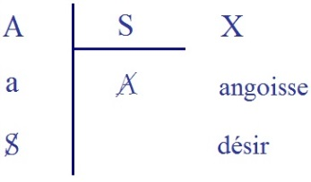
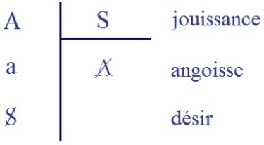
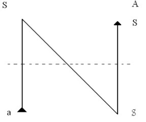
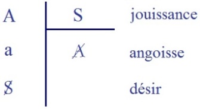
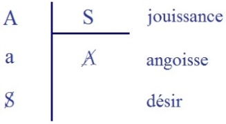

# Leçon 14 | l3 Mars l963

<!-- source-url: http://staferla.free.fr/S10/S10 L'ANGOISSE.docx -->
<!-- seminar: s10 -->
<!-- lesson: 14 -->

<!-- id: s10-14-0001 -->

Страхи Frayeurs

<!-- id: s10-14-0002 -->

У страха глаза велики La peur grossit les objets

<!-- id: s10-14-0003 -->

###### Я боюсъ утоб он не пришёл je crains qu’il ne vienne

<!-- id: s10-14-0004 -->

Небоъ боюсъ, уто он не придёт pour sûr, je crains qu’il n’arrive pas

<!-- id: s10-14-0005 -->

Plusieurs ont bien voulu combler ma plainte de la dernière fois, à savoir de n’avoir pas encore pu connaître le terme russe
qui correspondait à ce morceau dont je dois la connaissance à Monsieur Kaufmann, j’y reviendrai d’ailleurs,
c’est M. Kaufmann lui-même qui - quoiqu’il ne soit pas russophone - m’a amené aujourd’hui le texte exact
que je vais demander à Smirnof, par exemple - comme russophone - de bien vouloir rapidement commenter.

<!-- id: s10-14-0006 -->

Je veux dire... enfin, j’ose à peine *articuler* ces vocables, je n’en ai pas la phonologie, alors énoncez qu’il s’agit donc, dans le titre de...

<!-- id: s10-14-0007 -->

- Wladimir Smirnoff – Страхи.

<!-- id: s10-14-0008 -->

Lacan – De Страхи, qui est le pluriel de...

<!-- id: s10-14-0009 -->

- Wladimir Smirnoff – Страхa.

<!-- id: s10-14-0010 -->

Lacan

<!-- id: s10-14-0011 -->

De Страхa, lequel Страхa, comme tous les mots concernant la crainte, la peur, l’angoisse, la terreur, les affres,
nous pose de très difficiles problèmes de *traduction*.

<!-- id: s10-14-0012 -->

C’est un petit peu...
j’y pense en improvisation, j’y pense à l’instant
...comme ce qu’on a pu soule­ver à propos du problème des couleurs,
dont sûrement la connotation ne se recouvre pas d’une langue à l’autre.

<!-- id: s10-14-0013 -->

La difficulté - je vous l’ai déjà signalée - que nous avons à saisir le terme qui pourrait répondre à « *angoisse »* précisé­ment,
puisque c’est de là que partent tous nos soucis, en russe, le montre bien.

<!-- id: s10-14-0014 -->

Quoi qu’il en soit, si j’ai bien cru comprendre à travers les débats qu’ont soulevés entre les *russophones* qui sont ici...
qu’a soulevé ce mot, il apparaît que de toute façon, ce que j’avançais la dernière fois était correct,
à savoir que Tchekhov n’avait pas entendu, par là, parler de l’angoisse.

<!-- id: s10-14-0015 -->

Là-dessus, j’en reviens à ce que je désirais rendre à Kaufmann, c’est très exactement ceci donc : je me suis servi de cet exemple
la dernière fois pour éclairer, si je puis dire, d’une façon latérale, ce dont je désirais devant vous opérer le *renversement*,
à savoir que pour introduire la question je disais qu’il serait tout aussi légitime de dire, en somme, que la peur n’a pas d’objet.

<!-- id: s10-14-0016 -->

Et comme moi j’allais annoncer, comme je l’avais d’ailleurs déjà fait aupara­vant, que *l’angoisse, elle, n’est pas sans objet*,
ça avait un certain intérêt pour moi. Mais il est évident que ça n’épuise absolument pas la question de ce que sont ces *peurs,*
ou *frayeurs* ou *affres,* tout ce que vous voudrez, qui sont désignées dans les exemples de Tchekhov.

<!-- id: s10-14-0017 -->

Or, comme...
je ne pense pas que ce soit le trahir
...М. Kaufmann а le souci d’articuler quelque chose de tout à fait précis et centré justement sur ces *frayeurs tchékoviennes*,
je crois qu’il importe de souligner que je n’en ai fait donc, qu’un usage latéral
et en quelque sorte dépendant, par rapport à celui qu’il sera amené, lui-même, dans un travail, à faire plus tard.

<!-- id: s10-14-0018 -->

Et là-dessus, je crois que, avant de commencer encore, je vous ferai bénéficier d’une petite *trouvaille*...
toujours due d’ailleurs à М. Kaufmann qui n’est pas russophone,
...c’est que, au cours de cette recherche, il а trouvé un autre terme, *le terme* *le plus commun* pour « *je crains* », qui est « Боюсв » paraît-­il.

<!-- id: s10-14-0019 -->

C’est le premier mot que vous voyez là écrit dans ces deux phrases.
Et alors, à ce propos, il s’est amusé à s’apercevoir que, si je ne me trompe, en russe comme en français, *la négation dite* *explétive*...

<!-- id: s10-14-0020 -->

> celle sur laquelle j’ai mis tellement d’accent[^89], puisque je n’y trouve rien moins que la trace signifiante
>
> dans la phrase de ce que j’appelle *le sujet de l’énonciation*, distincte du *sujet de l’énoncé*
> ...qu’en russe aussi, il у а dans la phrase affirmative, je veux dire la phrase qui désigne, à l’affirmatif, l’objet de ma crainte :
> ce que je crains ce n’est pas qu’il *ne* vienne, c’est qu’il *vienne*, et je dis : « qu’il *ne* vienne »,
> en quoi je me trouve confirmé par le russe à dire qu’il ne suffit pas de quali­fier ce « *ne* » *explétif* de « *discordantiel »*,
> c’est-à-dire de marquer la discordance qu’il у а entre ma crainte : *puisque* je crains qu’il vienne, *j’espère* qu’il ne viendra pas.

<!-- id: s10-14-0021 -->

Eh bien, il semble d’après le russe que nous voyions qu’il faut accorder encore plus de spécificité...
et ça va bien dans le sens de la valeur que je lui donne
...à ce « *ne* » *explétif,* à savoir que c’est bien *le sujet de l’énonciation* comme tel qu’il représente, et non pas simplement son sentiment car, si comme toujours, j’ai bien entendu tout à l’heure, la discordance en russe est déjà indiquée par une nuance spéciale,
à savoir que le Утоб qui serait là, est déjà en lui-même un « *que ne* », mais marqué par une autre nuance.

<!-- id: s10-14-0022 -->

Si j’ai bien entendu Smirnoff, le б*...*
qui distingue ce Утоб du « *que* » simple, du Уто qui est dans la seconde phrase
...ouvre, indique, nuance, le verbe d’une sorte d’aspect conditionnel,
de sorte que cette discordance en somme est déjà marquée au niveau de la lettre б que vous voyez ici.

<!-- id: s10-14-0023 -->

Ce qui n’empêche pas que le « *ne* » de la négation, encore plus explétive donc, du simple point de vue du signifié,
en russe fonctionne quand même, en russe comme en français,
laissant donc ouverte la question de son interprétation, dont je viens de dire comment je la résous. Voilà !

<!-- id: s10-14-0024 -->

Et maintenant comment vais-je entrer en matière aujourd’hui ?
Je dirais que ce matin, assez remarquablement, en pensant à ce que j’allais ici pro­duire,
je me suis mis tout d’un coup à évoquer le temps où l’un de mes ana­lysés les plus intelligents...
il у en а toujours de cette espèce
...me posait avec insistance la question : « *Qu’est-ce qui peut vous pousser à vous donner tout ce mal pour leur raconter ça ?* »

<!-- id: s10-14-0025 -->

C’était dans les années arides où la linguis­tique, voire le calcul des probabilités, tenaient ici quelque place.
En d’autres termes, je me suis dit qu’après tout ce n’était pas non plus un mauvais biais pour introduire *le désir de l’analyste*
que de rappeler qu’il y а une question du *désir de l’enseignant*.

<!-- id: s10-14-0026 -->

Je ne vous en donnerai pas - et pour cause ! - ici le mot,
mais il est frappant que quand une ébauche de culpabilité que j’éprou­ve au niveau de ce qu’on peut appeler « *la tendresse humaine* », quand il m’ar­rive de penser aux *« tranquillités »* auxquelles j’attente, j’avance volontiers l’ex­cuse...
vous l’avez vu pointer plusieurs fois
...que par exemple je n’enseigne­rais pas s’il n’y avait pas eu *la scission*.

<!-- id: s10-14-0027 -->

C’est pas vrai !
Mais enfin, évi­demment j’aurais aimé me consacrer à des travaux plus limités, voire plus intermittents,
mais pour le fond, ça ne change rien.

<!-- id: s10-14-0028 -->

En somme, qu’on puisse poser la question du désir de l’enseignant à quelqu’un,
je dirais que *c’est le signe*, comme dirait M. de La Palisse, *que la question existe*. C’est aussi le signe *qu’il у а* un enseignement.

<!-- id: s10-14-0029 -->

Et ceci nous introduit, en fin de compte, à cette curieuse remarque : *que là où on ne se pose pas la question, c’est qu’il у а le professeur.*
Le professeur existe chaque fois que la réponse à cette question est, si je puis dire, écrite,
écrite sur son aspect ou sur son comportement, dans cette sorte de condition­nement qu’on peut situer au niveau, en somme,
de ce qu’en analyse nous appelons le préconscient, c’est-à-dire de quelque chose qu’on peut sortir,
d’où que ça vienne, des institutions ou même ce qu’on appelle de « *ses pen­chants* ».

<!-- id: s10-14-0030 -->

Ce n’est pas - à ce niveau - inutile de s’apercevoir qu’alors le professeur se définit comme celui qui enseigne sur les enseignements. Autrement dit, il découpe dans les enseignements.
Si cette vérité était mieux connue...
qu’il s’agit en somme au niveau du professeur, de *quelque chose d’analogue au collage*
...si cette vérité était mieux connue, ça leur permettrait d’y mettre un art plus consommé,
dont justement le collage, qui а pris son sens par l’œuvre d’art, nous montre la voie.

<!-- id: s10-14-0031 -->

C’est à savoir que s’ils faisaient leurs col­lages d’une façon moins soucieuse du raccord, moins *tempérée*,
ils auraient quelque chance d’aboutir au même résultat à quoi vise le collage,
d’évoquer proprement ce *manque* qui fait toute la valeur de *l’œuvre figurative* elle-même, quand elle est réussie bien entendu.
C’est par cette voie donc, qu’ils arrive­raient à rejoindre l’effet propre de ce qu’est justement *un enseignement*. Voilà !

<!-- id: s10-14-0032 -->

Ceci donc pour situer, voire rendre hommage à ceux qui veulent bien prendre la peine de voir, par leur présence,
de ce qui s’enseigne ici. Non seulement leur rendre hommage, mais les remercier de prendre cette peine.

<!-- id: s10-14-0033 -->

Là-dessus, moi-même je vais...
puisque aussi bien j’ai quelquefois affai­re à des auditeurs qui ne viennent ici que de façon intermittente
...me faire, pour un instant, le professeur de mon propre enseigne­ment et...
puisque la dernière fois je vous ai apporté des éléments que je crois assez massifs
...rappeler les points majeurs de ce que j’ai apporté la dernière fois.

<!-- id: s10-14-0034 -->

Partant donc de la distinction de *l’angoisse* et de *la peur*, j’ai...
comme je venais de vous le rappeler à l’instant
...tenté - au moins comme premier pas - de renverser l’opposition où s’est arrêtée la dernière élaboration de leur dis­tinction, actuellement pour tout le monde reçue.

<!-- id: s10-14-0035 -->

Ce n’est certainement pas dans le sens de la transition de l’une à l’autre que va le mouvement.

<!-- id: s10-14-0036 -->

S’il en reste des traces dans Freud, ce ne peut être que par erreur qu’on lui attri­buerait l’idée de cette réduction de l’un à l’autre, une erreur fondée sur ce que je vous ai rappelé : qu’il у а chez lui justement l’amorce de ce qui est en réalité ce renversement de position, en ce sens que, il dit justement - mal­gré qu’à tel détour de phrases le terme *objektlos* puisse revenir - il dit que l’angoisse
est *Angst vor etwas, angoisse devant quelque chose*, ce n’est certes pas pour la réduire à être une autre forme de la peur,
puisque ce qu’il souligne, c’est la distinction essentielle de *la provenance* de ce qui provoque l’une et l’autre.

<!-- id: s10-14-0037 -->

C’est donc bien du côté du refus de toute accentuation pour isoler la peur de l’*entgegenstehen,* de ce qui se pose devant,
et de la peur comme une réponse, *entgegen* précisément, que ce que j’ai dit au passage, concernant la peur, а à être retenu.

<!-- id: s10-14-0038 -->

Par contre, c’est bien à rappeler d’abord que *dans l’angoisse le sujet* - ai-je dit - *est étreint, concerné, intéressé*, au plus intime de lui-même, que nous voyons simplement *sur le plan* *phénoménologique* déjà l’amorce de ce que j’ai essayé plus loin d’articuler d’une façon précise.

<!-- id: s10-14-0039 -->

J’ai rappelé à ce propos le rapport étroit de l’angoisse avec tout l’appareil de ce que nous appelons « *défenses* ».
Et sur cette voie j’ai repointé...
pour l’avoir déjà articulé, pré­paré de toutes les façons
...que c’est bien du côté du *réel*, en première approximation, que nous avons à chercher *de l’angoisse, ce qui ne trompe pas*.

<!-- id: s10-14-0040 -->

Ce n’est pas dire que le *réel* épuise la notion de ce que vise *l’angoisse*.
Ce que vise l’angoisse dans le *réel*, ce par rapport à quoi elle se présente comme *signal*,
c’est ce dont j’ai essayé de vous montrer la position dans le tableau dit de - si je puis dire - « *la division signifiante* »,
où l’Х d’un sujet pri­mitif va vers son avènement, c’est-à-dire son avènement comme sujet.

<!-- id: s10-14-0041 -->

<!-- id: s10-14-0042 -->

Ce rapport que j’ordonne selon la figure d’une division, d’un sujet S par rapport au А de l’Autre,
en ceci que c’est par cette voie de l’Autre que le sujet а à se réaliser.
Ce sujet, je vous l’ai laissé indéterminé quant à sa dénomi­nation, dans la première position de ces colonnes de la division,
dont les autres termes se sont trouvés posés selon les formes que j’ai déjà commentées, que j’inscris ici : *a*, **A S**.

<!-- id: s10-14-0043 -->

La fin de mon discours, je pense, vous а suffisamment permis de recon­naître comment pourrait être...
à ce niveau mythique, préalable à tout ce jeu de l’opération
...être dénommé « *le sujet* », en tant que ce terme ait un sens, et justement pour des raisons sur lesquelles nous reviendrons,
qu’on ne peut d’aucune façon l’isoler comme sujet, mais mythiquement nous l’appellerons aujourd’hui « *sujet de la jouissance* »,
car comme vous le savez, je l’ai écrit ici la dernière fois, les 3 étages auxquels répondent les 3 temps de cette opération
sont respectivement : *la jouis­sance*, *l’angoisse* et *le désir*.

<!-- id: s10-14-0044 -->

<!-- id: s10-14-0045 -->

C’est dans cet étagement que je vais aujourd’hui m’avancer pour montrer
*la fonction*, non pas médiatrice mais *médiane de l’angoisse*, *<u>entre</u>*

<!-- id: s10-14-0046 -->

- *la jouissance,*

<!-- id: s10-14-0047 -->

- et *le désir*.

<!-- id: s10-14-0048 -->

Comment pourrions-nous encore commenter ce temps important de notre exposé, sinon à dire ceci,
dont je vous prie de prendre les divers termes avec le sens le plus plein à leur donner :
que *la jouissance ne connaî­tra pas l’Autre,* А*, sinon par ce reste *: *(a)*.

<!-- id: s10-14-0049 -->

-

<!-- id: s10-14-0050 -->

- Que dès lors, pour autant que je vous ai dit qu’il n’y а aucune façon d’opérer avec *ce reste (a),*

<!-- id: s10-14-0051 -->

- et donc que ce qui vient à l’étage inférieur, c’est-à-dire son avènement à la fin de l’opération, à savoir le **S** *sujet barré*,

<!-- id: s10-14-0052 -->

- le sujet en tant qu’impliqué dans le fantasme, en tant donc qu’il est un des termes qui constituent le support du désir...

<!-- id: s10-14-0053 -->

> je dis seulement *<u>un</u>* des termes car le fantasme, c’est **S** dans un certain rapport d’opposition à *((a))* \[S◊*a*\], rapport dont la polyvalence et la multiplicité est suffisamment défini par le caractère composé du losange, qui est aussi bien, la disjonction \[∨\], que la conjonction \[∧\], qui est aussi bien le plus grand \[\>\] que le plus petit \[\<\]
> ...S en tant que terme de cette opération a forme de division, puisque *(a)* est *irréductible*,
> ne peut, dans cette façon de l’imager dans les formes mathématiques, ne peut représenter que le rappel que si la division se faisait, ça serait plus loin, ça serait le rapport de *(a)* à S qui serait, dans le S, intéressé \[*a*/S\].

<!-- id: s10-14-0054 -->

Qu’est-ce à dire ?

<!-- id: s10-14-0055 -->

Que pour ébaucher la traduction de ce que je désigne ainsi, on pourrait suggérer
que *(a)* vient à prendre une sorte de fonction de métaphore du *sujet de la jouissance*.

<!-- id: s10-14-0056 -->

Çа ne serait pas... çа ne serait juste *que si* *(a)*- et dans la mesure où - *(a)* est assimilable à *un signifiant*.
Mais justement, *(a)* c’est *<u>ce</u>* qui *résis­te* à cette assimilation à la fonction du signifiant.
C’est bien pour cela que *(a)* symbolise ce qui - dans la sphère du signifiant, est toujours ce qui se présen­te toujours comme *perdu*, comme ce qui se perd à la significantisation.

<!-- id: s10-14-0057 -->

Or c’est justement *ce déchet*, *cette chute*, *ce qui résiste à la significantisation*,
qui vient à se trouver constituer le fondement comme tel du « *sujet désirant* »,
non plus « *le sujet de la jouissance* », mais le sujet en tant que sur la voie de sa recherche, en tant qu’il jouit,
qui n’est pas recherche de sa jouissance, mais ce « *vouloir* » de faire entrer cette jouissance *au lieu de l’Autre*, comme *lieu du signifiant*.

<!-- id: s10-14-0058 -->

C’est là, sur cette voie, que le sujet se précipite, s’anticipe comme *signifiant* - *Voilà ! J’ai fait un lapsus ! -* s’anticipe comme *désirant.*

<!-- id: s10-14-0059 -->

Or s’il у а ici précipitation, anticipation, ce n’est pas dans le sens que cette démarche sauterait, irait plus vite que ses propres étapes, c’est dans le sens qu’elle aborde - en deçà de sa réalisation - cette béance *du désir* à la *jouis­sance*. C’est là que se situe *l’angoisse*.
Et ceci est si sûr que le temps de l’an­goisse n’est pas absent, comme le marque cette façon d’ordonner les termes,
dans la constitution du désir : même si ce temps est *élidé*, *non repérable* dans le concret, il est essentiel.

<!-- id: s10-14-0060 -->

Je vous prie...
pour ceux à qui j’ai besoin ici de sug­gérer une autorité pour qu’ils se fient à ce que je ne fasse point d’erreur
...de vous souvenir à ce propos de ce que dans l’analyse de *Ein Kind wird geschla­gen* [^90]*...*

<!-- id: s10-14-0061 -->

> dans la première analyse, non seulement structurale mais dynamique du fantasme donnée par Freud
> ...Freud parle justement lui aussi, d’un 2nd temps toujours élidé dans sa constitution,
> tellement élidé que même l’ana­lyse ne peut que le reconstruire.

<!-- id: s10-14-0062 -->

Ce n’est pas dire qu’il soit toujours aussi *inaccessible*, ce temps de l’angoisse, à bien des niveaux est *phénoménologique­ment repérable*.
J’ai dit de l’angoisse,

<!-- id: s10-14-0063 -->

- en tant que terme intermédiaire *entre* *la jouissance* et *le désir*,

<!-- id: s10-14-0064 -->

- en tant que c’est, franchie l’angoisse, fondé sur le temps de l’angoisse, que *le désir* se constitue.

<!-- id: s10-14-0065 -->

Il reste que la suite de mon discours а été faite pour illustrer ceci, qu’au cœur de...

<!-- id: s10-14-0066 -->

> ceci dont on s’était aperçu depuis longtemps et dont nous ne savons pas faire plei­nement notre profit
>
> quand il s’agit pour nous de comprendre à quoi répond
>
> ce qui prend dans notre discours d’analyste une toute autre valeur*, le complexe de castration*
> ...qu’au cœur, dis-je, de l’expérience du désir, *il у а ce qui reste* quand *le désir* est *entre guillemets* « satisfait »,
> *ce qui reste*, si l’on peut dire, *à la fin du désir*, fin qui est toujours une fausse fin, fin qui est toujours le résultat d’une méprise.

<!-- id: s10-14-0067 -->

La valeur que prend, ce que vous me permettrez de téles­coper dans ce que j’ai, la dernière fois, suffisamment articulé
à propos de la détumescence, c’est à savoir ce que *manifeste*, ce que *représente*, de *cette fonction du reste*, *le phallus à l’état flapi*,
est cet élément synchronique tout bête comme chou, même comme la tige d’un chou, comme s’exprime Pétrone,
est là pour nous rappeler que *l’objet choit du sujet* *essentiellement dans sa relation au désir*.

<!-- id: s10-14-0068 -->

*Que l’objet soit dans cette chute*, c’est là une dimension qu’il convient essentiellement d’accentuer,
si nous voulons franchir ce petit pas de plus, auquel je désire vous amener aujourd’hui,
c’est-à-dire ce qui pouvait, avec un peu d’attention, déjà vous apparaître la dernière fois dans mon discours,
à partir du moment où j’ai essayé de montrer sous quelle forme s’incarne cet *objet(a)* du fantasme, support du désir.

<!-- id: s10-14-0069 -->

Est-ce que il ne vous а pas frappé que...
je vous ai parlé du « *sein »* ou des « *yeux »*, en les faisant partir de Zurbaran, de Lucie et d’Agathe
...*ces objets(a) se pré­sentent sous une forme*, si je puis dire, *positive ?*

<!-- id: s10-14-0070 -->

Ce sein et ces yeux que je vous ai montrés là sur le plat où les supportent les deux dignes saintes...
Voire \[*sic*\] sur le sol amer où se portent les pas d’Œdipe,
...ils apparaissent ici avec un signe différent de ce que je vous ai montré ensuite dans le *phallus*
comme spécifié par le fait qu’à un certain niveau de l’ordre animal *la jouis­sance coïncide avec la détumescence*,
vous faisant remarquer qu’il n’y а là rien de nécessaire, de nécessaire ni de lié à la *Wesenheit* de l’orga­nisme au sens goldsteinien.

<!-- id: s10-14-0071 -->

Qu’au niveau du *(a)*, c’est parce que le *phallus*, le *phallus* en tant qu’il est, dans la copulation,

<!-- id: s10-14-0072 -->

- *non pas seulement instrument du désir*,

<!-- id: s10-14-0073 -->

- mais instrument fonctionnant d’une certaine façon \[*détumescence*\], à un certain niveau animal, c’est pour ceci que *<u>lui</u> se présente en la fonction de (a) avec le signe moins*.

<!-- id: s10-14-0074 -->

Ceci est essentiel à bien articuler, à différencier - ce qui est important –

<!-- id: s10-14-0075 -->

- l’angoisse de castration

<!-- id: s10-14-0076 -->

- de ce qui fonctionne chez le sujet *à la fin d’une ana­lyse*, quand ce que Freud désigne comme menace de castration, s’y main­tient.

<!-- id: s10-14-0077 -->

S’il у а quelque chose qui nous fasse toucher du doigt que c’est là un point *dépassable*,
qu’il n’est pas absolument nécessaire que le sujet reste,

<!-- id: s10-14-0078 -->

- suspendu, quand il est mâle, à *la menace de la castration*,

<!-- id: s10-14-0079 -->

- suspendu quand il est de l’autre sexe, *au penisneid,* c’est justement cette distinction.

<!-- id: s10-14-0080 -->

Pour savoir comment nous pourrions le franchir *ce point-limite*,
ce qu’il faut savoir c’est pourquoi l’analyste, mené dans une certaine direction, aboutit à cette impasse
par quoi *le négatif* qui marque dans le fonctionnement physiolo­gique de la copulation chez l’être humain,
se trouve promu au niveau du sujet sous la forme d’un manque irréductible.

<!-- id: s10-14-0081 -->

*C’est ce qui est à retrouver* comme question, *comme direction*, de notre voie par la suite, mais je crois ici important de l’avoir marqué.

<!-- id: s10-14-0082 -->

Ce que j’ai apporté ensuite, lors de notre dernière rencontre,
c’est l’ar­ticulation de deux points très importants concernant *le sadisme* et *le masochisme*, dont je vous résume ici l’essentiel.
L’essentiel, tout à fait capital à maintenir, soutenir, pour autant qu’à vous у tenir,
vous pouvez donner leur plein sens à ce qui s’est dit de plus élaboré dans l’état actuel des choses concernant ce dont il s’agit,
à savoir *le sadisme* et *le masochisme*.

<!-- id: s10-14-0083 -->

Ce qu’il у а à retenir dans ce que j’ai là énoncé, concerne d’abord le masochisme
dont vous pourrez voir que si les auteurs ont vraiment beaucoup peiné, au point de mener très loin,
si loin, qu’une lecture que j’ai faite - récente - ici а pu moi-même me surprendre,
je dirai tout à l’heure un auteur qui а mené les choses - à ma surprise, je dois dire, et à ma joie - aussi près que possible
du point où j’essaierai cette année, concernant le masochisme, pris sous cet angle qui est le nôtre ici, de vous mener.

<!-- id: s10-14-0084 -->

Il reste que cet article même, dont je vous donnerai tout à l’heure le titre, reste comme tous les autres,
strictement incompréhensible pour la seule raison que déjà au départ, il est en quelque sorte comme élidé, non vu...
parce que là, enfin, absolument sous le nez, si l’on peut dire, de l’évidence
...ceci que je vais énoncer à l’instant.

<!-- id: s10-14-0085 -->

On essaie, on arri­ve à se déprendre de mettre l’accent sur ce qui, au premier abord, porte, heurte le plus notre finalisme,
à savoir qu’intervient la fonction de la douleur.

<!-- id: s10-14-0086 -->

Ceci, on est arrivé à bien comprendre que ce n’est pas là l’essentiel...
on est aussi arrivé - Dieu merci - dans une expérience comme celle de l’analyse, à s’apercevoir que l’Autre est visé,
que dans le transfert on peut s’aper­cevoir que *les manœuvres masochistes* se situent à un niveau qui n’est pas sans rapport avec l’Autre.

<!-- id: s10-14-0087 -->

Naturellement, beaucoup d’auteurs en profitent à se tenir là, pour tomber dans un *insight* dont le caractère superficiel saute aux yeux. Quelque maniables que se soient révélés certains cas, à n’être parvenus qu’à ce niveau,
on ne peut pas dire que la fonction du narcissisme, sur laquelle а mis l’accent un auteur...
d’ailleurs non sans un certain talent d’exposition, Ludwig Heidelberg
...puisse être quelque chose qui nous suffise.

<!-- id: s10-14-0088 -->

Ce que...
sans du tout vous avoir fait pour autant pénétrer dans la structure,
comme nous serons amenés à le faire, du fonctionnement du masochisme
...ce que simplement j’ai voulu *accentuer* la dernière fois, parce que c’est la lumière qui éclairera les détails du tableau *d’un tout autre jour*, c’est de vous rappe­ler ce qui se donne apparemment tout de suite...
c’est pour cela que ce n’est pas vu
...dans la visée du masochiste, dans l’accès le plus banal à cette visée...
pourquoi nous le refuser ?
...c’est que *le masochiste vise la jouissance de l’Autre*.

<!-- id: s10-14-0089 -->

Et ce que j’ai accentué la dernière fois comme autre terme de ce en quoi j’entends tendre tout ce qui permettra de *déjouer,*
si l’on peut dire, *la manœuvre*, *c’est que ce qui est caché par cette visée, c’est que ce quil vise*, ce qu’il veut...

<!-- id: s10-14-0090 -->

> ceci bien sûr étant *le terme* éventuel de notre recherche, ne pourra, si vous voulez,
>
> se justifier pleinement que d’une vérification des temps qui prouve que c’est là le dernier terme
> ...le dernier terme est ceci : c’est que *ce qu’il vise c’est l’angoisse de l’Autre*.

<!-- id: s10-14-0091 -->

J’ai dit d’autres choses que j’en­tends vous rappeler aujourd’hui, c’est l’essentiel de ce qu’il у a là-dedans d’irréductible,
à quoi il faut vous tenir, au moins jusqu’au moment où vous pourrez...
de ce que j’ai autour de cela à ordonner
...où vous pourrez en juger.

<!-- id: s10-14-0092 -->

Du côté du *sadisme*, par une remarque entièrement analogue, à savoir que le premier terme est élidé,
et qu’il а pourtant la même évidence que du côté du masochisme, c’est que *ce qui est visé dans le sadisme*...
sous toutes ses formes, à tous ses niveaux
... *c’est quelque chose aussi qui promeut la fonction de l’Autre*, et que justement là ce qui est patent que ce qui est cherché,
*c’est l’angoisse de l’Autre.*

<!-- id: s10-14-0093 -->

*De même que dans le masochisme, ce qui est par là masqué, c’est* - non pas, par un processus inverse, de renverse­ment *- la jouissance de l’Autre*.
Le sadisme n’est pas l’envers du masochis­me pour une simple raison, c’est que ce n’est pas un couple de réversibilité,
la structure est plus complexe, j’y insiste, quoique aujourd’hui je n’isole dans chacun que deux termes.

<!-- id: s10-14-0094 -->

Pour illustrer si vous voulez, ce que je veux dire, je dirai que comme vous pouvez le présumer d’après maints de *mes sché­mas essentiels*, *ce sont des fonctions à quatre termes*, ce sont si vous vou­lez, des fonctions carrées et que le passage de l’un à l’autre
se fait par une *rotation* au quart de tour et non par aucune symétrie ni inversion. \[cf. séminaires 1969-70, 1971-72, 1972-73 et « *L’étourdit* »\]

<!-- id: s10-14-0095 -->

<!-- id: s10-14-0096 -->

Ceci vous ne le voyez pas apparaître au niveau que maintenant je vous désigne, mais ce que je vous ai indiqué la dernière fois
qui se cache derrière *cette recherche de l’angoisse de l’Autre* : *c’est dans le sadisme, la recherche de l’objet(a).*
C’est à quoi j’ai amené comme référence, un terme expressif pris dans les fantasmes sadiens, dans le texte de l’œuvre de Sade[^91],

<!-- id: s10-14-0097 -->

je ne vous le rappelle pas maintenant.

<!-- id: s10-14-0098 -->

Nous nous trouvons donc entre sadisme et masochisme, en présence de ce qui, au niveau second, au niveau voilé, au niveau caché, de la visée de cha­cune de ces deux tendances, se présente comme l’alternance, en réalité l’oc­cultation réciproque :

<!-- id: s10-14-0099 -->

- de *l’angoisse* dans le premier cas,

<!-- id: s10-14-0100 -->

- de *l’objet(a)* dans l’autre.

<!-- id: s10-14-0101 -->

Je termine par un bref rappel qui revient en arrière sur ce que j’ai dit, jus­tement, de ce *(a),* de cet *objet*,
à savoir l’accentuation de ce que je pourrais appeler le caractère manifeste essentiellement...
que nous connaissons bien, encore que nous ne nous apercevions pas de son importance
...le caractère manifeste dont est marqué quoi ? - le mode sous lequel entre cette *anatomie*,
dont Freud а tort de dire qu’elle est - sans autre précision - le destin[^92].

<!-- id: s10-14-0102 -->

C’est la conjonction d’une certaine anatomie, celle que j’ai essayé de vous caractéri­ser la dernière fois au niveau des *objets(a)*
par l’existence de ce que j’ai appe­lé *les caduques*...
à savoir justement ce qui n’existe qu’à un certain niveau, le niveau mammifère parmi les organismes
...la conjonction de ces *caduques* avec quelque chose qui est effectivement *le destin*,
à savoir l’ἀνάγκη \[ananké\] par quoi *la jouissance а à se confronter avec le signifiant*.

<!-- id: s10-14-0103 -->

C’est là le ressort de la limi­tation chez l’homme, à quoi est soumise la destinée du désir, à savoir:
*cette rencontre avec l’objet dans une certaine fonction,* pour autant que cette fonction le localise,
le précipite à ce niveau que j’ai appelé de l’existence *des caduques* et de tout ce qui peut servir comme ces *caduques*.
Terme qui nous servira entre autres à mieux explorer, je veux dire à espérer donner un cata­logue exhaustif des limites,
des frontières*, des moments de coupure où l’an­goisse peut être attendue*, et de confirmer que c’est bien là qu’elle émerge.

<!-- id: s10-14-0104 -->

Et enfin je vous le rappelle, j’ai terminé sur le rappel*...*
par un exemple clinique des plus connus
...sur le rappel de la connexion étroite...
sur laquelle nous aurons à revenir, et qui est beaucoup moins - de ce fait - accidentelle qu’on ne le croit
...*sur la conjonction* dis-je, *de l’orgasme et de l’angoisse* en tant que l’un et l’autre, ensemble peuvent être définis par une situation *exemplaire*, celle que j’ai définie sous la forme d’une certaine *attente de l’Autre*, et d’une attente qui n’est pas n’importe laquelle,
celle qui sous la forme de la copie, blanche ou pas, que doit remettre à un moment le candidat,
est un exemple absolument saisissant de ce que peut être pour un instant pour lui le *(a)*.

<!-- id: s10-14-0105 -->

Nous allons, après tous ces rappels, essayer de nous avancer un peu plus loin.
Je le ferai par une voie qui n’est peut-être pas, je l’ai dit, tout à fait celle à laquelle je me serais de moi-même résolu.
Vous verrez ensuite ce que par là, j’entends dire.

<!-- id: s10-14-0106 -->

Il у а quelque chose que je vous ai fait remarquer à pro­pos du « *contre-transfert »*,
c’est à savoir combien les femmes semblaient s’y déplacer plus à l’aise.

<!-- id: s10-14-0107 -->

N’en doutez pas, si elles s’y déplacent plus à l’aise dans leurs écrits, théoriquement,
c’est - je présume - qu’elles ne s’y dépla­cent pas mal non plus dans la pratique, même si elles n’en voient ou n’en arti­culent...
car là-dessus, après tout, pourquoi ne pas leur faire le crédit d’un petit peu de *restriction mentale...*si elles n’en articulent pas d’une façon tout à fait évidente et tout à fait claire, le ressort.

<!-- id: s10-14-0108 -->

Il s’agit bien évidemment ici, d’attaquer quelque chose qui est de l’ordre *du ressort du désir à la jouissance*.
Notons d’abord ceci, qu’il semble, à nous référer à de tels travaux, *que la femme comprenne très très bien ce qu’est* *le désir de l’analyste*.

<!-- id: s10-14-0109 -->

Comment ça se fait-il ?

<!-- id: s10-14-0110 -->

Il est certain qu’il nous faut ici reprendre les choses au point où je les ai laissées par ce tableau,
vous disant que *l’angoisse c’est <u>le médium</u> du désir à la jouissance*.

<!-- id: s10-14-0111 -->

<!-- id: s10-14-0112 -->

J’apporterai ici quelques formules où je laisse à chacun de se retrouver par son expérience.
Elles seront aphoristiques. Il est facile de comprendre pourquoi.

<!-- id: s10-14-0113 -->

Sur un sujet aussi délicat que celui, *toujours pendant ici*, des rapports de l’homme et de la femme,
articuler tout ce qui peut rendre licite, justifier, la permanence d’un malentendu obligé, ne peut qu’avoir l’effet, tout à fait ravalant, de permettre à chacun de mes auditeurs de noyer ses difficultés personnelles, qui sont très en deçà de ce que je vais ici viser,
dans l’assurance que ce « *malentendu* » est structural.

<!-- id: s10-14-0114 -->

Or comme vous le verrez si vous savez m’entendre, parler de « *malentendu* » ici, n’équivaut nullement à parler « *d’échec nécessaire* ».
On ne voit pas pourquoi, si le *réel* est toujours sous-entendu, la *jouissance* la plus efficace ne pourrait pas être atteinte
par les voies mêmes du « *malentendu* ».

<!-- id: s10-14-0115 -->

De ces *aphorismes* donc, je choisirai, je dirai forcément...
c’est la seule chose qui distingue l’aphorisme du développement doctrinal, c’est qu’il renonce à l’ordre préconçu
...j’avancerai ici quelques formes.

<!-- id: s10-14-0116 -->

Par exemple celle-ci, qui peut vous parler d’une façon, si l’on peut dire, moins sujette à ce que vous vous rouliez dans le ricanement, cette formule que : « *Seul l’amour permet à la jouissance de condescendre au désir* ».

<!-- id: s10-14-0117 -->

Nous en avancerons aussi quelques autres qui se déduisent de notre petit tableau où se montre que :
*(a) comme tel, et rien d’autre, c’est l’accès, non pas à la jouissance, mais à l’Autre*, *que c’est tout ce qui en reste*,
à partir du moment où le sujet veut у faire, dans cet Autre, son entrée.

<!-- id: s10-14-0118 -->

Ceci, enfin, pour dissiper, il semble, au der­nier terme, ce terme, ce fantôme empoisonnant depuis l’an 1927 de l’*oblati­vité*,
inventée par le grammairien Pichon...
dont Dieu sait que je reconnais le mérite dans la grammaire
...dont on ne saurait trop regretter qu’une *analyse*, si je puis dire *absente*, l’ait entièrement livré, dans l’exposé de *la théorie psychanalytique*,
l’ai entièrement laissé capturé dans les idées qu’il avait préalablement, qui n’étaient autres que les idées maurassiennes.

<!-- id: s10-14-0119 -->

<!-- id: s10-14-0120 -->

Quand **S** *ressort de cet accès à l’Autre, il est l’inconscient, c’est-à-dire ça* : **A**, *l’Autre barré*.
Comme je vous l’ai dit tout à l’heure, il ne lui reste qu’à faire de *a* quelque chose dont c’est moins *la fonction métaphorique* qui importe, que le rapport de chute où il va se trouver par rapport à ce *(a)*. Désirer donc, l’Autre, ce n’est jamais désirer *<u>que</u>* *(a)*.

<!-- id: s10-14-0121 -->

Il reste, puisque c’est de l’amour que je suis parti dans mon premier aphorisme,
que pour traiter de l’amour, comme pour traiter de la sublimation, il faut se souvenir de ce que les moralistes...

<!-- id: s10-14-0122 -->

> qui étaient déjà avant Freud, je parle de ceux de la bonne tradition, et nommément de la tradition française,
>
> celle qui passe par ce que je vous ai rappelé de sa scansion dans *L’homme du plaisir* [^93]
> ...que ce que les moralistes ont déjà pleinement articulé, et dont il convient que nous ne considérions pas l’acquis comme dépassé :
> que « *l’amour est la sublimation du désir* ».

<!-- id: s10-14-0123 -->

Il en résulte que nous ne pouvons pas du tout nous servir de l’amour comme premier ni comme dernier *terme*.
Tout primordial qu’il se présente dans notre théorisation, l’amour est un fait culturel,
et comme l’a fort bien articulé La Rochefoucauld[^94], ce n’est pas seulement :
« *Combien de gens n’au­raient jamais aimé s’ils n’en avaient entendu parler* »
c’est :
« *Qu’il ne serait pas question d’amour s’il n’y avait pas la culture* ».

<!-- id: s10-14-0124 -->

Ceci doit nous inciter à poser ailleurs les arches de ce que nous avons à dire concernant...

<!-- id: s10-14-0125 -->

> puisque c’est de cela qu’il s’agit, à ce point où le dit Freud même,
>
> soulignant que ce détour aurait pu se produire ailleurs,
>
> et je reviendrai sur ce pourquoi je le fais maintenant
> ...donc ce sujet de *la conjonction de l’homme et de la femme*, nous avons à en poser autrement les arches.

<!-- id: s10-14-0126 -->

Et je continue par ma voie aphoristique. Si c’est au *désir* et à la *jouissance* qu’il nous faut nous référer, nous dirons que :

<!-- id: s10-14-0127 -->

*Que me proposer comme désirant,* ἔρόν \[erôn\]*, c’est me proposer comme manque de (a)*

<!-- id: s10-14-0128 -->

Et que ce qu’il s’agit de soutenir dans notre propos est ceci, c’est que c’est par cette voie que j’ouvre la porte à *la jouissance de mon être*.

<!-- id: s10-14-0129 -->

Le carac­tère *aporique* de cette position, je pense, ne peut manquer de vous арра­raître, ne peut pas vous *échapper*.
Mais il у а quelques pas de plus à faire.

<!-- id: s10-14-0130 -->

Le caractère *aporique*, ai-je besoin même de le souligner au passage ?
J’y revien­s tout de même, car je pense que vous avez déjà saisi...
parce que je vous l’ai dit depuis longtemps
...que si c’est au niveau de l’ἔρόν \[erôn\] que je suis, que j’ouvre la porte à la jouissance de mon être,
il est bien clair que le plus proche *déclin* qui s’offre à cette entreprise, c’est que je sois apprécié comme ἐρώμενος \[éromenos\]
c’est­-à-dire comme aimable...
ce qui, sans fatuité, ne manque pas d’arriver
...mais où se lit déjà que quelque chose est loupé dans l’affaire.

<!-- id: s10-14-0131 -->

Ceci n’est pas aphoris­tique, mais déjà un commentaire. J’ai cru devoir le faire pour deux raisons :

<!-- id: s10-14-0132 -->

- d’abord parce que j’ai fait une espèce de petit lapsus à double négation, qui devait m’avertir de quelque chose,

<!-- id: s10-14-0133 -->

- et deuxièmement, que j’ai cru entre­voir le miracle de l’incompréhension briller sur certaines figures. \[*rires*\]

<!-- id: s10-14-0134 -->

Je continue : « Toute exigence de *(a)* sur la voie de cette entreprise*...*
*disons, puisque j’ai pris la perspective androcentrique...*de rencontrer la femme, ne peut que déclencher l’angoisse de l’Autre,
justement en ceci que je ne le fais plus que *(a)* », que mon désir le « *a-ise* », si je puis dire.

<!-- id: s10-14-0135 -->

Et ici, mon petit circuit d’aphorisme *se mord la queue* :
c’est bien pour ça que seul *l’amour-sublimation permet à la jouissance* - pour me répéter - *de condescendre au désir*.

<!-- id: s10-14-0136 -->

Que voilà de nobles propos ! Vous voyez que je ne crains pas le ridicu­le.
Çа vous а un petit air de prêche dont, évidemment, chaque fois qu’on avance dans ce terrain, on ne manque pas de courir le risque.

<!-- id: s10-14-0137 -->

Mais il me sem­ble tout de même, que pour bien rire, *vous preniez votre temps*.
Je ne sau­rais que vous en remercier, et je repars.
Je ne repartirai aujourd’hui que pour un court instant.

<!-- id: s10-14-0138 -->

Mais laissez moi encore faire quelques petits pas, car c’est sur cette même voie que je viens de parcourir sur un air qui vous а,
comme ça, un petit air d’héroïsme, que nous pourrons nous avancer dans le sens contraire,
en constatant curieusement une fois de plus, confirmant la non-réversibilité de ces par­cours,
que nous allons voir surgir quelque chose qui vous apparaîtra peut-être d’un ton moins conquérant.

<!-- id: s10-14-0139 -->

Ce que l’Autre veut nécessairement, sur cette voie qui condescend à mon désir, ce qu’il veut...
même s’il ne sait pas du tout ce qu’il veut
...c’est pourtant nécessairement mon angoisse.

<!-- id: s10-14-0140 -->

Car il ne suffit pas de dire que la femme, pour la nommer, surmonte la sienne par amour. Nous у reviendrons : c’est à voir. Procédant par la voie que j’ai choisie aujourd’hui, je laisse encore de côté - ce sera pour la prochaine fois –
comment se définissent les partenaires au départ.

<!-- id: s10-14-0141 -->

L’ordre des choses dans lesquelles nous nous déplaçons implique toujours que ce soit ainsi,
que nous prenions les choses en route et même quelquefois à l’arrivée, *nous ne pouvons pas* les prendre au départ.
Quoi qu’il en soit, c’est en tant qu’elle veut ma jouissance, c’est-à-dire jouir de moi...
ça ne peut pas avoir d’autre sens

<!-- id: s10-14-0142 -->

...que la femme suscite mon angoisse, et ceci pour la raison très simple, inscrite depuis longtemps dans notre théorie,
*c’est qu’il n’y а de désir réalisable*, sur la voie où nous le situons, *qu’impliquant la castration*.

<!-- id: s10-14-0143 -->

C’est dans la mesure où il s’agit de *jouissance*, c’est-à-dire où c’est à mon *être* qu’elle en veut,
que la femme ne peut l’atteindre qu’à me châtrer.

<!-- id: s10-14-0144 -->

Que ceci ne vous conduise...
je parle de la partie masculine de mon auditoire
...à nulle résignation quant aux effets toujours manifestes de cette vérité première,
dans ce qu’on appelle d’un terme classificatoire : « *la vie conjugale* ».

<!-- id: s10-14-0145 -->

Car la définition d’une ἀνάγκη \[ananké\] première n’a absolument rien à faire avec ses incidences accidentelles.
Il n’en reste pas moins qu’on clarifie beaucoup les choses à l’articuler proprement.

<!-- id: s10-14-0146 -->

Or, l’articuler comme je viens de le faire...
encore que ce soit recouvrir l’expérience de la façon la plus manifeste
...est justement ce qui frise le danger que je viens de signaler à plusieurs reprises,
à savoir qu’on у voie ce qu’on appelle dans le langage courant « *une fatalité* », ce qui voudrait dire que « *c’est écrit* ».

<!-- id: s10-14-0147 -->

Ce n’est pas parce que je le dis qu’il faut penser que ce soit écrit.
Aussi bien si je l’écrivais, у mettrais-je plus de formes,
et ces formes consistent justement à entrer dans le détail, c’est-à-dire à *dire* le pourquoi.

<!-- id: s10-14-0148 -->

Supposons, ce qui saute aux yeux, qu’en référence à ce qui *fait la clé de cette fonction de l’objet du désir*,
la femme, ce qui est bien évident, ne manque de rien.

<!-- id: s10-14-0149 -->

Parce qu’on aurait tout à fait tort de considérer que le *penisneid* soit un dernier terme.
Je vous ai déjà annoncé que ce serait là l’originalité - sur ce point - de ce que j’essaie cette année d’avancer devant vous.

<!-- id: s10-14-0150 -->

Le fait qu’elle n’ait, sur ce point, rien à désirer...

<!-- id: s10-14-0151 -->

> et peut-être même essaie­rais-je d’articuler très très précisément anatomiquement pourquoi,
>
> car cette affaire de l’analogie clitoris-pénis est loin d’être absolument fondée,
>
> un cli­toris n’est pas simplement un plus petit pénis, c’est une part du pénis,
>
> ça correspond aux corps caverneux et à rien d’autre. Or, un pénis, que je sache, sauf chez l’hypospadias,
>
> ne se limite pas aux corps caverneux, ceci est une parenthèse
> ...le fait de *n’avoir rien à désirer sur le chemin de la jouissance* ne règle pas assurément pour elle *la question du désir*,
> justement dans la mesure où la fonction du *(a)*, pour elle comme pour nous, joue tout son rôle.

<!-- id: s10-14-0152 -->

Mais quand même, cette question du désir, ça la simplifie beaucoup...
je dis : pour elle, pas pour nous
...en présence de leur désir. Mais enfin de s’intéres­ser à *l’objet* comme *objet de notre désir*, ça leur fait beaucoup moins de complications.

<!-- id: s10-14-0153 -->

L’heure s’avance...
Je laisse les choses au point où j’ai pu les mener.
Je pense que ce point est *suffisamment alléchant* pour que beaucoup de mes auditeurs désirent en connaître la prochaine fois la suite.

<!-- id: s10-14-0154 -->

Pour vous en donner quelques pré­misses,
et vous annoncer ce que le fait que j’entends ramener les choses au niveau de la fonction de la femme,
en tant qu’elle peut nous permettre de voir plus loin, dans un certain niveau dans l’expérience de l’analyse,
je vous dirai que si on peut donner un titre à ce que j’énoncerai la prochaine fois, ce serait quelque chose comme :

<!-- id: s10-14-0155 -->

« *Des rapports de la femme comme psychanalyste avec la position de Don Juan.* »

## Notes

[^89]: Séminaire 1961-62 : *L’identification*, séances des 17-01, 11-04-1962.

[^90]: S. Freud : « *Ein Kind wird geschlagen* », 1919, G.W.XII, « [*Un enfant est battu*](http://pagespro-orange.fr/espace.freud/topos/psycha/psysem/fanbattu.htm) », dans *Névrose, psychose et perversion*, PUF, 1999.

[^91]: Sade : *Histoire de Juliette*, op. cit.

[^92]: S. Freud : « [*Sur le plus général des rabaissements de la vie amoureuse »*](http://www.megapsy.com/textes/freud/biblio031.htm) (1912), in *La vie sexuelle*, Paris, PUF, 1999.

[^93]: Séminaire1959-60 : *L’éthique*, Seuil ,1986.

[^94]: La Rochefoucauld : *Œuvres*, LGF, 2001.
