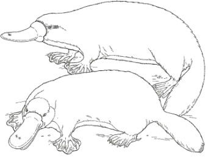
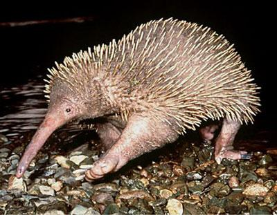
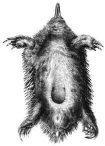
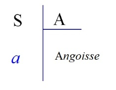
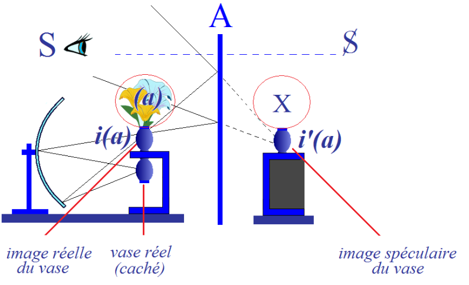
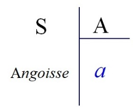

# Leçon 18 | l5 Mai l963

<!-- source-url: http://staferla.free.fr/S10/S10 L'ANGOISSE.docx -->
<!-- seminar: s10 -->
<!-- lesson: 18 -->

<!-- id: s10-18-0001 -->

Si nous partons de la fonction de l’objet dans la théorie freudienne : *objet oral, objet anal, objet phallique*...
et vous savez que je mets en doute que soit homogène à la série, « l’objet génital »
*...*tout ce que j’ai déjà amorcé, tant dans mon enseignement passé que plus spécialement dans celui de cette année,
vous indique que cet objet...
défini dans sa fonction, par sa place comme *(a)*, *le reste de la dialectique du sujet à l’Autre*
...que la liste de ces *objets*, doit être complétée.

<!-- id: s10-18-0002 -->

Le *(а)* objet fonctionnant comme *reste* de cette dialectique, il est bien sûr que nous avons à le définir - dans le champ du désir -
à d’autres niveaux, dont j’en ai déjà assez *indiqué* pour que vous sentiez, si vous voulez,
que grossièrement c’est quelque *<u>coupure</u>* survenant dans le champ de l’œil, et dont est fonction le désir attaché à l’image.

<!-- id: s10-18-0003 -->

Autre chose, plus loin, que nous connaissons déjà et où nous retrouverons ce caractère de certitude fon­damentale
déjà repérée par la philosophie traditionnelle et articulé par Kant sous la forme de la conscience,
c’est là que ce mode d’abord, sous l’angle du *(а)*, nous permettra de situer à sa place
ce qui jusqu’ici est apparu comme énig­matique sous la forme d’un certain *impératif* dit *catégorique*.

<!-- id: s10-18-0004 -->

Le chemin par où nous procédons, qui revivifie toute cette dialectique par l’abord même qui est le nôtre, à savoir *le désir,*
ce chemin par où nous procédons cette année - qui est *l’angoisse* - je l’ai choisi parce qu’il est le seul qui nous permette de faire, d’introduire, une nouvelle clarté quant à la fonc­tion de *l’objet* par rapport au *désir.*

<!-- id: s10-18-0005 -->

Comment...
c’est ce que ma leçon de la dernière fois а voulu présenti­fier devant vous
...comment tout un champ de l’expérience humaine, une expérience qui se propose comme celle d’une forme,
d’une sorte de salut, de l’expérience bouddhique, а-telle pu poser à son principe que « *le désir est illusion* » ?

<!-- id: s10-18-0006 -->

Qu’est-ce que cela veut dire ?
C’est facile de sourire de la rapidité de l’as­sertion que « *tout n’est rien* ».
Aussi bien vous l’ai-je dit, n’est-ce pas de cela qu’il s’agit dans le bouddhisme.

<!-- id: s10-18-0007 -->

Mais si, pour notre expérience aussi, cette assertion que « *le désir n’est qu’illusion* » peut avoir un sens,
il s’agit de savoir par où ce sens peut s’introduire, et pour tout dire : *où est le leurre*.

<!-- id: s10-18-0008 -->

Le désir, je vous apprends à le repérer, à le lier à *la fonction de la coupure*, à le mettre dans un certain rapport avec la fonction du *reste*.
Ce *reste* est ce qui le sou­tient, ce qui l’anime et c’est ce que nous apprenons à repérer dans la fonc­tion analytique de *l’objet partiel*.

<!-- id: s10-18-0009 -->

Pourtant autre chose est le *manque* auquel est liée la satisfaction :

<!-- id: s10-18-0010 -->

- cette distance du *lieu du manque* dans son rapport au *désir* comme structuré par *le fantasme*, *par la vacillation du sujet dans son rapport à l’objet partiel*,

<!-- id: s10-18-0011 -->

- cette *non-coïncidence* du *manque* dont il s’agit avec la fonction du *désir*, si je puis dire, en acte, *c’est là ce qui crée l’angoisse* et *l’angoisse seule se trou­ve viser la vérité de ce manque*.

<!-- id: s10-18-0012 -->

C’est pourquoi à chaque niveau, à chaque étape de la structuration du *désir*,
si nous voulons comprendre ce dont il s’agit dans cette fonction, celle du *désir*,
nous devons repérer ce que j’appellerai « *le point d’angoisse* ».

<!-- id: s10-18-0013 -->

Ceci va nous faire revenir en arrière, et d’un mouvement commandé par toute notre expérience puisque tout se passe comme si, étant arrivé avec l’expérience de Freud *à buter sur unе impasse...*
*impasse* que je promeus n’être qu’apparente mais jusqu’ici jamais franchie, *celle du complexe de cas­tration...*tout se passe comme si c’est cette butée qu’il reste à expliquer,
ce qui peut-être me permettra aujourd’hui de conclure sur quelque affirmation
concernant ce que veut dire la butée de Freud sur *le complexe de castration*.

<!-- id: s10-18-0014 -->

Et pour l’instant, rappelons-en dans la théorie analytique la conséquen­ce : quelque chose comme *un reflux*, comme *un retour,*
qui ramène la théo­rie à chercher en dernier ressort le fonctionnement le plus radical de la pulsion au niveau oral.

<!-- id: s10-18-0015 -->

Il est singulier qu’une analyse, qu’un aperçu qui inauguralement а été celui de la fonction nodale dans toute la formation du désir
de ce qui est pro­prement sexuel, ait été au cours de son évolution historique de plus en plus amené à chercher l’origine de tous
les accidents, de toutes les anomalies, de toutes les béances qui peuvent se produire au niveau de la structuration du désir,
dans quelque chose dont ce n’est pas tout de dire qu’il est *chronolo­giquement* originel : *la pulsion orale*,
dont il faut encore justifier qu’el­le soit *structuralement* originelle, c’est à elle qu’en fin de compte nous devons ramener l’origine, l’étiologie de tous les achoppements auxquels nous avons à faire.

<!-- id: s10-18-0016 -->

Aussi bien ai-je déjà abordé ce qui, je crois, doit pour nous, rouvrir la question de cette réduction à la pulsion orale,
en у montrant cette façon dont actuellement elle fonctionne,
à savoir comme un mode *métaphorique* d’aborder ce qui se passe au niveau de *l’objet phallique*.

<!-- id: s10-18-0017 -->

Une métaphore qui permette d’éluder ce qu’il у а d’impasse créée par le fait que n’a jamais été résolu par Freud, au dernier terme,

<!-- id: s10-18-0018 -->

- ce qu’est le fonctionnement du *com­plexe de castration*,

<!-- id: s10-18-0019 -->

- ce qui *le voile* en quelque sorte,

<!-- id: s10-18-0020 -->

- ce qui permet d’en par­ler sans rencontrer *l’impasse*.

<!-- id: s10-18-0021 -->

Mais si la métaphore est juste,
nous devons, à son niveau même, voir l’amorce de ce dont il s’agit, de ce pour quoi elle n’est ici que métaphore.

<!-- id: s10-18-0022 -->

Et c’est pourquoi c’est au niveau de cette *pulsion orale* que déjà une fois j’ai essayé de reprendre la fonction relative :

<!-- id: s10-18-0023 -->

- de la coupure,

<!-- id: s10-18-0024 -->

- de l’objet,

<!-- id: s10-18-0025 -->

- du lieu de *la satisfaction* et de celui de *l’angoisse*, pour faire le pas qui nous est main­tenant proposé, celui où je vous ai menés la dernière fois, c’est-à-dire le point de jonction entre

<!-- id: s10-18-0026 -->

- *le (а) fonctionnant comme* (- φ), c’est-à-dire *le com­plexe de castration,*

<!-- id: s10-18-0027 -->

- et *ce niveau* que nous appellerons « *visuel »* ou « *spatial »*, selon la face où nous allons l’envisager, qui est à proprement parler celui où nous pouvons au mieux *<u>voir</u>* ce que veut dire « *le leurre du désir »*.

<!-- id: s10-18-0028 -->

Pour pouvoir faire fonctionner ce passage, ce qui est notre fin d’aujourd’hui, nous devons un instant nous reporter en arrière,
revenir à l’analyse de *la pulsion orale*, pour nous demander, pour bien préciser, où est à ce niveau, la fonction de la cou­pure.

<!-- id: s10-18-0029 -->

Le nourrisson et le sein, voilà ce autour de quoi sont venus pour nous se concentrer tous les nuages de la dramaturgie de l’analyse :
l’origine des premières pulsions agressives, de leur réflexion, voire de leur rétorsion, la source des boiteries les plus *fondamentales*
dans le développement libidinal du sujet.

<!-- id: s10-18-0030 -->

Reprenons donc cette thématique qui - il ne convient pas de l’ou­blier - est fondée sur un acte originel
essentiel à la subsistance biologique du sujet dans l’ordre des mammifères : celui de *la succion*.

<!-- id: s10-18-0031 -->

Qu’y a-t-il, qu’est-ce qui fonctionne dans *la succion* ?

<!-- id: s10-18-0032 -->

Apparemment *les lèvres*, les lèvres où nous retrouvons le fonctionnement de ce qui nous est apparu comme essentiel
dans la structure de l’érogénéité: *la fonction d’un bord*.

<!-- id: s10-18-0033 -->

Que *la lèvre* se présente sous l’aspect de quelque chose qui est en quelque sorte *l’image même du bord, de la coupure*,
c’est là en effet quelque chose qui doit suffisament nous indiquer...
après que j’ai essayé pour vous *de figurer*, l’année derniè­re dans *la topologie* que définit le *(а)...*c’est là quelque chose qui doit nous faire sentir que nous sommes en un terrain assuré.

<!-- id: s10-18-0034 -->

Aussi bien, il est clair que la lèvre...
elle-même *incarnation,* si l’on peut dire, *d’une coupure...*que la lèvre singulièrement nous évoque ce qu’il у aura, à un tout autre niveau...
au niveau de l’articulation signifiante, au niveau des *phonèmes les plus fonda­mentaux*,
...de plus lié à la coupure : *les éléments consonantiques du phonè­me*, suspension d’une coupure, étant pour leur stock le plus basal essentiel­lement modulés au niveau des lèvres.

<!-- id: s10-18-0035 -->

Je reviendrai peut-être, si nous avons le temps, sur ce que j’ai plu­sieurs fois déjà indiqué,
de la question des mots fondamentaux et de leur spécifi­cité apparente : du « *mаmа* » еt du « *рара* »,
ce sont des articulations en tout cas labiales, même si quelque chose peut mettre en doute leur répartition apparemment spécifique, apparemment générale, sinon universelle.

<!-- id: s10-18-0036 -->

Que la lèvre, d’autre part, soit le lieu où symboliquement peut être reprise sous forme de rituel la fonction de la coupure,
que la lèvre soit quelque chose qui puisse être, au niveau des rites d’initiation, percée, étalée, triturée de mille façons,
c’est là aussi ce qui nous donne le repère que nous sommes bien en un champ vif,
et dès longtemps dans les praxis humaines reconnu.

<!-- id: s10-18-0037 -->

Est-ce là tout ?

<!-- id: s10-18-0038 -->

Il у а derrière la lèvre, ce que Homère appelle « *l’enclos des dents* » et la morsure.
C’est là autour, que nous faisons jouer dans la façon dont nous en agissons avec la dialectique de *la pulsion orale*,
sa thé­matique agressive : l’isolation fantasmatique de l’extrémité du sein, du mamelon,
cette *virtuelle morsure* impliquée par l’existence d’une *dentition* dite « *lactéale »*,
voilà ce autour de quoi nous avons fait tourner la possibilité du fantasme de l’extrémité du sein comme *isolée*,
ce *quelque chose* qui déjà se présente comme « *objet »* non seulement partiel mais sectionné.

<!-- id: s10-18-0039 -->

C’est par là que s’introduit, dans les premiers fantasmes qui nous permettent
de conce­voir la fonction du morcellement comme inaugurante, c’est là ce dont nous nous sommes, à la vérité, jusqu’ici contentés.

<!-- id: s10-18-0040 -->

Est-ce à dire que nous puissions maintenir cette position ?

<!-- id: s10-18-0041 -->

Vous le savez, parce que déjà dans un séminaire...
qui est, si je me souviens bien, celui que j’ai fait le 6 mars
...j’ai accentué comment toute la dialectique dite « *du sevrage* », de la séparation, devait être reprise,
en fonction même de ce qui dans notre expérience, nous а permis de l’élargir, nous est apparu comme ses résonances,
ses retentissements naturels : à savoir le sevrage et la séparation primordiale, celle de la nais­sance.

<!-- id: s10-18-0042 -->

Et celle de *la naissance*, si nous у regardons de près, si nous у met­tons un peu plus de physiologie, est bien là faite pour nous éclairer.

<!-- id: s10-18-0043 -->

La coupure, vous ai-je dit, est ailleurs que là où nous la mettons.
Elle n’est pas conditionnée par l’agression sur le corps maternel.

<!-- id: s10-18-0044 -->

La coupure, comme nous l’enseigne...

<!-- id: s10-18-0045 -->

> si nous tenons que c’est à juste titre que nous avons reconnu dans notre expérience
>
> qu’il у а analogie entre le sevra­ge oral et le sevrage de la naissance
> ...la coupure est intérieure à l’unité indi­viduelle primordiale, telle qu’elle se présente au niveau de la naissance,
> où *la coupure* se fait entre ce qui va devenir l’individu jeté dans le monde exté­rieur, et ses « *enveloppes* »...

<!-- id: s10-18-0046 -->

- qui sont parties de lui-même,

<!-- id: s10-18-0047 -->

- qui sont - en tant qu’élé­ments de l’œuf - homogènes à ce qui s’est produit dans le développement ovulaire,

<!-- id: s10-18-0048 -->

- qui sont prolongement direct de son ectoderme, comme de son endoderme,

<!-- id: s10-18-0049 -->

- qui sont parties de lui-même ...*la séparation* se fait à l’intérieur d’une unité qui est celle de l’œuf.

<!-- id: s10-18-0050 -->

Or l’accent qu’ici j’entends mettre, tient à la spécificité dans la structure organismique de l’organisation dite « *mammifère* ».

<!-- id: s10-18-0051 -->

Ce qui, pour la presque totalité des mammifères, spécifie le développement de l’œuf, c’est l’existen­ce du *placenta*
et même d’un *placenta* tout à fait spécial :

<!-- id: s10-18-0052 -->

- celui qu’on appel­le *chorio-allantoïdien*,

<!-- id: s10-18-0053 -->

- celui par lequel, sous toute une face de son dévelop­pement, l’œuf dans sa position intra-utérine se présente dans une relation semi-parasitaire à l’organisme de la mère.

<!-- id: s10-18-0054 -->

Quelque chose dans l’étude de l’ensemble de cette organisation mammifère, quelque chose est pour nous suggestif, indicatif,
à un certain niveau de l’apparition de cette structure organismique, nommément celui de deux ordres, si l’on peut dire,
qui sont ceux qu’on appelle les plus primitifs dans l’ensemble des *mammifères*, celui nommément des *monotrèmes* [^131], et des *marsupiaux.*

<!-- id: s10-18-0055 -->

Nous avons la notion chez *les marsu­piaux* de l’existence d’un autre type de placenta, non point *chorio-allantoï­dien* mais *chorio-vitellin,*
nous ne nous arrêterons pas à cette nuance, mais chez les *monotrèmes*, dont je pense que depuis l’enfance, vous avez au moins l’image sous la forme de ces animaux qui, dans le *Petit Larousse*, fourmillent en troupes,
comme se pressant à la porte d’une nouvelle *arche de Noé*, c’est-à-dire qu’il у en а deux, quelquefois voire seulement un par espèce,

<!-- id: s10-18-0056 -->

- vous avez l’image de l’ornithorynque

<!-- id: s10-18-0057 -->

- et aussi bien l’image de ce qu’on appelle le type échidné.

<!-- id: s10-18-0058 -->

   

<!-- id: s10-18-0059 -->

Ce sont des *mammifères*...
Ce sont des *mammifères* chez lesquels l’œuf, quoique nidant dans un utérus, n’a aucun rapport *placen­taire* avec l’organisme maternel. La *mamme* existe pourtant déjà...
la *mamme* dans son rapport essentiel, comme définissant la relation du rejeton à la mère,
...la *mamme* existe déjà au niveau du monotrème, de l’ornithorynque, et fait mieux voir à ce niveau quelle est sa fonction originelle.

<!-- id: s10-18-0060 -->

Pour tout de suite éclairer ce que j’entends dire ici, je dirai que la *mamme* se présente comme quelque chose d’intermédiaire,
et que c’est <u>entre</u> *la mamme* et l’or­ganisme maternel qu’il nous faut concevoir que réside *la coupure*.

<!-- id: s10-18-0061 -->

Avant même que le placenta nous manifeste que le rapport nourricier, à un cer­tain niveau de l’organisme vivant,
se prolonge au-delà de la fonction de l’œuf, qui chargé de tout le bagage qui permet son développement,
ne fera se rejoindre l’enfant à ses géniteurs que dans une expérience commune d’une recherche de nourriture,
nous avons cette fonction de relation que j’ai appelée *parasitaire*, cette fonction ambiguë où intervient cet organe ambocepteur.

<!-- id: s10-18-0062 -->

Le rapport de l’enfant - autrement dit - à la *mamme* est homologique...
et ce qui nous permet de le dire, c’est qu’il est plus primitif que l’appari­tion du placenta
...est homologique à ce *quelque chose* qui fait qu’il у а

<!-- id: s10-18-0063 -->

- d’un côté, l’enfant et la *mamme*,

<!-- id: s10-18-0064 -->

- et que la *mamme* est en quelque sorte pla­quée, implantée sur la mère. C’est cela qui permet à la *mamme* de fonction­ner structuralement au niveau du *(а) *: c’est parce que le *(а)* est *quelque chose* dont l’enfant est séparé d’une façon en quelque sorte *interne* à la sphère de son existence propre, qu’il est bel et bien le *(а)*.

<!-- id: s10-18-0065 -->

Vous allez voir ce qu’il en résulte comme *conséquence* : le lien de la pul­sion orale se fait à cet *objet ambocepteur*.

<!-- id: s10-18-0066 -->

Qu’est-ce qui fait l’objet de la pulsion orale ?
C’est ce que nous appelons d’habitude, *l’objet partiel*, le sein de la mère.

<!-- id: s10-18-0067 -->

Où est à ce niveau ce que j’ai appelé tout à l’heure *le point d’angois­se* ?
Il est justement *au-delà de cette sphère*, car *le point d’angoisse* est au niveau de la mère.

<!-- id: s10-18-0068 -->

L’angoisse *du manque de la mère* chez l’enfant, c’est l’an­goisse du tarissement du sein.

<!-- id: s10-18-0069 -->

*Le point d’angoisse ne se confond pas avec le lieu de la relation à l’objet du désir.*

<!-- id: s10-18-0070 -->

La chose est singulièrement imagée par ces animaux que d’une façon sans doute pour vous inattendue,
j’ai fait là surgir sous l’aspect de ces représentants de l’ordre des monotrèmes.

<!-- id: s10-18-0071 -->

Effectivement, tout se passe comme si cette image d’organisation biologique avait été, par quelque créateur prévoyant, fabri­quée pour nous manifester la *véritable relation* qui existe au niveau du nourrissage, de *la pulsion orale* avec cet objet privilégié qu’est *la mamme*.

<!-- id: s10-18-0072 -->

Car, que vous le sachiez ou non, *le petit ornithorynque*, après sa naissance, séjourne un cer­tain temps hors du cloaque,
dans un lieu situé sur le ventre de la mère, appe­lé *incubatorium*.

<!-- id: s10-18-0073 -->

Il est encore à ce moment dans les enveloppes, qui sont les enveloppes d’une sorte d’œuf dur, d’où il sort...
d’où il sort à l’aide d’une dent dite « *dent d’éclosion* » doublée, puisqu’il faut être *précis*,
de quelque chose qui se situe au niveau de sa lèvre supérieure et qui s’appelle « *caroncule* ».

<!-- id: s10-18-0074 -->

Ces organes ne lui sont pas spéciaux, ils existent déjà avant l’apparition des mammifères.
Ces organes qui permettent à un fœtus de sortir de l’œuf exis­tent déjà au niveau des serpents où ils sont spécialisés,
les serpents n’ayant, si mon souvenir est bon, que la dent dite « *d’éclosion* »,
tandis que d’autres varié­tés : des reptiles plus exactement - qui ne sont pas des serpents - nommé­ment les tortues et les crocodiles, n’ont que la « *caroncule* ».

<!-- id: s10-18-0075 -->

L’important est ceci, c’est qu’il semble que la *mamme*, la *mamme* de la mère de l’ornithorynque ait besoin de la stimulation
de cette pointe-même, armée, que présente le museau du *petit ornithorynque* pour déclencher, si l’on peut dire, son organisation
et sa fonction et qu’il semble que pendant une huitaine de jours, il faille que ce petit ornithorynque s’emploie au déclenchement
de ce qui paraît bien plus *suspendu à sa présence, à son acti­vité*,
qu’à quelque chose qui tienne essentiellement à l’organisme de la mère.

<!-- id: s10-18-0076 -->

Aussi bien d’ailleurs, nous donne-t-il curieusement l’image d’un rapport, en quelque sorte inversé à celui de la protubérance mammaire, puisque ces *mammes* d’*ornithorynque* sont des *mammes* en quelque sorte *en creux*, où le bec du petit s’insère.

<!-- id: s10-18-0077 -->

Voici, à peu près ici, où seraient les éléments glandulaires, les lobules producteurs du lait. C’est là que ce museau armé déjà...
qui n’est pas encore durci sous la forme d’un bec comme il deviendra plus tard
...que ce museau vient se loger.

<!-- id: s10-18-0078 -->

L’existence donc, et la distinction de 2 *points originels* dans l’organi­sation mammifère :

<!-- id: s10-18-0079 -->

- le rapport à la *mamme* comme telle, qui restera structu­rant pour la subsistance, le soutien du rapport de désir, pour le maintien de la *mamme* nommément comme objet qui deviendra ultérieurement *l’objet fantasmatique*,

<!-- -->

<!-- id: s10-18-0080 -->

- et d’autre part la situation, ailleurs, dans l’Autre, au niveau de la mère, et en quelque sorte non coïncidant, déporté, du *point d’angois­se* comme étant celui où le sujet a rapport avec ce dont il s’agit, avec son manque, avec ce à quoi il est suspendu : l’existence de l’organisme de la mère. C’est là ce qu’il nous est permis de structurer d’une façon plus articulée par cette seule considération d’une physiologie qui nous montre :

<!-- id: s10-18-0081 -->

- que le *(a) est un objet* \[*qui a été*\] *séparé de l’organisme de l’enfant*,

<!-- id: s10-18-0082 -->

- que le rapport à la mère est à ce niveau un rapport sans doute essentiel mais qui par rapport à cette totalité organismique où le *(a)* se sépare, s’isole et est méconnu en plus comme tel, comme s’étant isolé de cet orga­nisme, ce rapport à la mère - le rapport de *manque* - se situe *au-delà* du lieu où s’est joué la distinction de l’objet partiel comme fonctionnant dans la relation du désir.

<!-- id: s10-18-0083 -->

Bien sûr le rapport est plus complexe encore, et l’existence dans la fonc­tion de la succion à côté des lèvres,
l’existence de cet organe énigmatique et depuis longtemps repéré comme tel...
souvenez-vous de la fable d’Ésope[^132]

<!-- id: s10-18-0084 -->

...qu’est la langue, nous permet également de faire intervenir à ce niveau ce quelque chose
qui dans les sous-jacences de notre analyse est là pour nour­rir l’homologie avec *la fonction phallique* et *sa dissymétrie singulière*,
celle sur laquelle nous allons revenir à l’instant.

<!-- id: s10-18-0085 -->

C’est à savoir que la langue joue à la fois :

<!-- id: s10-18-0086 -->

- dans la succion ce rôle essentiel de fonctionner par ce qu’on peut appeler aspiration, soutien d’un vide, dont c’est essentiellement la puissan­ce d’appel qui permet à la fonction d’être effective,

<!-- id: s10-18-0087 -->

- et d’autre part, d’être ce quelque chose qui peut nous donner l’image de la sortie de ce plus intime, de *ce secret de la succion*, de nous donner, sous une première forme, ce quelque chose qui restera - je vous l’ai marqué - à l’état de *fantasme*, au fond, de tout ce que nous pouvons articuler autour de *fonction phallique,* à savoir *le retournement du gant*, la possibilité d’*une éversion de ce qui est au plus profond du secret de l’intérieur*.

<!-- id: s10-18-0088 -->

Que le point d’angoisse soit au-delà

<!-- id: s10-18-0089 -->

- du lieu où joue la fonction,

<!-- id: s10-18-0090 -->

- du lieu où s’assure le fantasme dans son rapport essentiel à *l’objet partiel*, c’est ce qui apparaît dans ce prolongement du *fantasme,* qui fait *image*, qui reste toujours plus ou moins sous-jacent à la créance que nous donnons à un cer­tain mode de *la relation orale* : celui qui s’exprime sous *l’image de la fonc­tion dite du « vampirisme »*.

<!-- id: s10-18-0091 -->

Il est vrai que l’enfant, s’il est dans tel mode de son rapport à la mère un *petit vampire*, s’il se pose comme organisme un temps suspendu en position *parasitaire*, il n’en reste pourtant pas moins qu’il n’est pas non plus ce « *vampire* »,
à savoir qu’à nul moment ce n’est de ses dents, ni à la source,
qu’il va chercher chez la mère la source vivante et chaude de sa nourriture.

<!-- id: s10-18-0092 -->

Pourtant *l’image du vampire*, si mythique qu’elle soit, est là pour nous révéler, par l’aura d’angoisse qui l’entoure,
la vérité de ce rapport au-delà, qui se profile dans la relation du nourissage, celle qui lui donne son accent le plus profond,
celui qui ajoute la dimension d’une possibilité du manque réalisé,
au-delà de ce que l’angoisse recèle de craintes virtuelles : le tarissement du sein.

<!-- id: s10-18-0093 -->

Ce qui met en cause comme telle la fonction de la mère est un rapport qui se distingue...
pour autant qu’il se profile dans *l’image du vampirisme*
...qui se distingue comme un rapport angoissant.

<!-- id: s10-18-0094 -->

La distinction donc, je le souligne bien, de la réalité du fonctionnement organismique avec ce qui s’en ébauche au-delà, voilà

<!-- id: s10-18-0095 -->

- ce qui nous permet de distinguer *le point d’angoisse* du *point de désir*,

<!-- id: s10-18-0096 -->

- ce qui nous montre qu’au niveau de la pulsion orale, *le point d’angoisse est au niveau de l’Autre*, et c’est que c’est là que nous l’éprouvons.

<!-- id: s10-18-0097 -->

Freud nous dit « *l’anatomie, c’est le destin* ».
Vous le savez, je me suis... j’ai pu, à certains moments, m’élever contre cette formule pour ce qu’elle peut avoir d’incomplet.

<!-- id: s10-18-0098 -->

Elle devient vraie, vous le voyez, si nous donnons au terme « *anatomie* » son sens strict et si je puis dire étymologique,
*celui qui met en valeur* *ana-tomie* [^133]*, la fonction de la coupure*, ce par quoi tout ce que nous connaissons de l’anatomie est lié à la dissection : c’est pour autant qu’est concevable ce morcellement, *cette coupure du corps propre*...
et qui là \[*cette coupure du corps propre*\] est le lieu des moments élus de fonctionnement
...c’est pour autant que le destin...
c’est-à-dire le rapport de l’homme à cette fonction qui s’appelle *le désir*
…prend toute son animation.

<!-- id: s10-18-0099 -->

La « *sépartition* » fondamentale...
non pas séparation mais partition à l’inté­rieur
...voilà ce qui se trouve, dès l’origine et dès le niveau de la pulsion orale, inscrit dans ce qui sera structuration du désir.

<!-- id: s10-18-0100 -->

Nul étonnement dès lors à ce que nous ayons été à ce niveau pour trouver quelque image plus acces­sible
à ce qui est resté pour nous - pourquoi ? - toujours jusqu’à présent *para­doxe*, à savoir :
que dans le fonctionnement *phallique*, dans celui qui est lié à la copulation, c’est aussi l’image d’une *coupure*, d’une séparation,
de ce que nous appelons *improprement* « *castration* », puisque c’est *une image d’évira­tion qui fonctionne*.

<!-- id: s10-18-0101 -->

Ce n’est sans doute pas au hasard, ni sans doute à mauvais escient, que nous sommes allés chercher dans des fantasmes plus anciens la justification de ce que nous ne savions pas très bien comment jus­tifier au niveau de *la phase phallique*.

<!-- id: s10-18-0102 -->

Il convient pourtant de marquer qu’à ce niveau quelque chose s’est produit
qui va nous permettre de nous repé­rer dans toute la dialectique ultérieure.

<!-- id: s10-18-0103 -->

Comment en effet...
telle que je viens de vous l’énoncer
...comment s’est passée *la répartition au niveau topologique* que je vous ai appris à distinguer,

<!-- id: s10-18-0104 -->

- *du désir, de sa fonction,*

<!-- id: s10-18-0105 -->

- *et de l’angoisse* ?

<!-- id: s10-18-0106 -->

*Le point d’angoisse est au niveau de l’Autre, au niveau du corps de la mère*.

<!-- id: s10-18-0107 -->

Le fonctionnement *du désir*, c’est-à-dire *du fantasme*, *la vacilla­tion* qui unit étroitement le Sujet au *(a)*,
ce par quoi le Sujet se trouve essen­tiellement suspendu, identifié à ce *(a)* \[*comme un*\] « *reste »*...
« *reste »* *toujours élidé*, *toujours caché*, et qu’il nous faut détecter, *sous-jacent à tout rapport du sujet à un objet quel­conque*
...vous le voyez ici :

<!-- id: s10-18-0108 -->

<!-- id: s10-18-0109 -->

Et pour appeler arbitrairement ici S *le niveau du sujet*, ce qui dans mon schéma, si vous le voulez...
mon schéma du vase reflé­té dans le miroir de l’Autre
...se trouve en deçà de ce miroir, voilà au niveau de la pulsion orale où se trouvent les rapports.

<!-- id: s10-18-0110 -->

<!-- id: s10-18-0111 -->

*La coupure*, vous ai-je dit, *est interne au champ du sujet*.

<!-- id: s10-18-0112 -->

Le désir fonc­tionne...
nous retrouvons là la notion freudienne d’auto-érotisme
...à l’in­térieur d’un monde qui, quoiqu’éclaté, porte la trace de sa première clôtu­re,
à l’intérieur de ce qui reste imaginaire, virtuel, *de l’enveloppe de l’œuf*.

<!-- id: s10-18-0113 -->

Que va t-il en être au niveau où se produit le *complexe de castration* ?
Nous assistons à ce niveau à un véritable *renversement* du *point de désir* et du *lieu de l’angoisse * :

<!-- id: s10-18-0114 -->

<!-- id: s10-18-0115 -->

Si quelque chose est promu par le mode sans doute encore imparfait, mais chargé de tout le relief d’une conquête pénible,
faite pas à pas, ceci depuis l’origine de la découverte freudienne qui l’a révélée dans la structure,
c’est le rapport étroit de *la castration*, de *la relation à l’ob­jet* dans *le rapport phallique*, comme contenant - implicite - *la privation de l’organe*.

<!-- id: s10-18-0116 -->

S’il n’y avait pas d’Autre...
et peu importe qu’ici cet Autre nous l’appelions « *la mère castratrice* » ou « *le père de l’interdiction originelle* »
...il n’y aurait pas de *castration*.

<!-- id: s10-18-0117 -->

Le rapport essentiel de cette castration, désormais, avec tout le fonction­nement copulatoire,
nous a ici, d’ores et déjà incités à essayer...

<!-- id: s10-18-0118 -->

> après tout, selon l’indication de Freud lui-même, qui nous dit bien qu’à ce niveau,
>
> sans qu’en rien il ne le justifie pourtant, c’est à quelque *roc biologique* que nous touchons
> ...nous a incités ici à articuler comme gisant dans *une particu­larité de la fonction de l’organe copulatoire* à un certain niveau biologique.

<!-- id: s10-18-0119 -->

Jje vous l’ai fait remarquer : à d’autres niveaux, dans d’autres ordres, dans d’autres branches animales, l’organe copulatoire est un crochet, est un orga­ne de fixation, et ne peut être appelé organe mâle de la façon la plus sommai­rement analogique.

<!-- id: s10-18-0120 -->

Il nous indique assez qu’il convient de distinguer le fonctionnement particulier…
au niveau d’organisations animales dites supé­rieures
...de cet organe copulatoire : il est essentiel de ne pas confondre ses *avatars*...
le mécanisme nommément de la tumescence et de la détumescence
...avec quelque chose qui, par soi, soit essentiel à l’orgasme.

<!-- id: s10-18-0121 -->

Sans aucun doute, nous nous trouvons là devant - si je puis dire - ce qu’on peut appeler une « *limitation de l’expérience* ».

<!-- id: s10-18-0122 -->

Nous n’allons pas, vous ai-je déjà dit, essayer de concevoir ce que peut être l’orgasme dans un rapport copulatoire autrement structuré, suffisamment - *au reste* - de spectacles naturels impressionnants où il vous suffit de vous promener le soir au bord d’un étang pour voir voler étroitement nouées deux *libellules*, et ce seul spectacle peut vous en dire assez sur ce que nous pouvons concevoir comme étant un *long-orgasme*, si vous me permettez ici d’en faire un mot, en y mettant un tiret.

<!-- id: s10-18-0123 -->

Et aussi bien, n’est-ce pas pour rien que j’ai évoqué l’image, ici fan­tasmatique, du *vampire,*
qui n’est point rêvée ni conçue autrement par l’ima­gination humaine, que comme ce mode de *fusion* ou de *soustraction* première
à la source même de la vie, où le sujet agresseur peut trouver la sour­ce de sa jouissance.

<!-- id: s10-18-0124 -->

Assurément l’existence même du *mécanisme de la détu­mescence* *dans la copulation* des organismes les plus *analogues* à l’organis­me humain suffit déjà à soi tout seul à marquer la liaison de *l’orgasme* avec quelque chose qui se présente bel et bien comme la première image, l’ébauche de ce qu’on peut appeler *coupure,* séparation, fléchissement, ἀφάνιςις \[aphanisis\], disparition,
à un certain moment de la fonction de l’organe.

<!-- id: s10-18-0125 -->

Mais alors, si nous prenons les choses sous ce biais, nous reconnaîtrons que *l’homologue du point d’angoisse* dans cette occasion...
qui *se trouve dans une position strictement inversée à celle où il se trouvait au niveau de la pul­sion orale*
...*l’homologue du point d’angoisse, c’est l’orgasme lui-même, comme expérience subjective*.

<!-- id: s10-18-0126 -->

Et c’est ce qui nous permet de justifier ce que la clinique nous montre d’une façon très fréquente,
à savoir la sorte d’équi­valence fondamentale qu’il y a entre l’orgasme et au moins certaines formes de l’angoisse,

<!-- id: s10-18-0127 -->

- la possibilité de la production d’un orgasme au sommet d’une situation angoissante,

<!-- id: s10-18-0128 -->

- l’érotisation, nous dit-on de toute part, l’érotisation éventuelle d’une situation angoissante, recherchée comme telle, et inverse­ment un mode d’éclaircir ce qui fait...

<!-- id: s10-18-0129 -->

> si nous en croyons le témoignage humain universel renouvelé, cela vaut la peine après tout
>
> de noter que quelqu’un - et quelqu’un du niveau de Freud - ose l’écrire, l’attestation de ce fait
> ...qu’il n’y a rien qui soit en fin de compte, qui représente en fin de compte, pour l’être humain, de plus grande satisfaction que l’orgasme lui-même.

<!-- id: s10-18-0130 -->

Une satisfaction qui dépasse assurément, pour pouvoir être articulée ainsi, être non pas seulement mis en balance
mais être mis en fonction de primauté et de préséance par rapport à tout ce qui peut être donné à l’hom­me d’éprouver.

<!-- id: s10-18-0131 -->

Si la fonction de l’orgasme peut atteindre *cette éminence *:

<!-- id: s10-18-0132 -->

- est-ce que ce n’est pas parce que, *dans le fond de l’orgasme réalisé* *il y a quelque chose de ce que j’ai appelé la certitude liée à l’angoisse*,

<!-- id: s10-18-0133 -->

- est-ce que ce n’est pas dans la mesure où l’orgasme c’est la réalisation même de ce que l’angoisse indique comme *repérage*, comme *direction* du *lieu de la certitu­de*, l’orgasme - de toutes les angoisses - est la seule qui réellement s’achève ?

<!-- id: s10-18-0134 -->

Aussi bien, c’est bien pour cela que *l’orgasme* n’est pas d’une atteinte si commune,
et que s’il nous est permis d’en indiquer *l’éventuelle fonction dans le sexe* où il n’y a justement *de réalité phallique que sous la forme d’une ombre*, c’est aussi dans ce même *sexe* que l’orgasme nous reste le plus énigmatique, le plus fermé,
peut-être jusqu’ici dans sa dernière essence jamais authentiquement situé.

<!-- id: s10-18-0135 -->

Que nous indique ce parallèle, cette symétrie, cette réversion établie dans le rapport

<!-- id: s10-18-0136 -->

- du *point d’angoisse,*

<!-- id: s10-18-0137 -->

- et du *point de désir*, sinon que dans aucun des deux cas ils ne coïncident.

<!-- id: s10-18-0138 -->

Et c’est ici sans doute, que nous devons voir la source de l’énigme qui nous est laissée par l’expérience freudienne.

<!-- id: s10-18-0139 -->

Dans toute la mesure où la situation du désir...
virtuellement impli­quée dans notre expérience qui, si je puis dire, la trame toute entière
...n’est pas pourtant dans Freud véritablement articulée :
*la fin de l’analyse* bute sur quelque chose qui fait prendre la forme du signe impliqué dans *la relation phallique*...
le « φ » en tant qu’il *fonctionne structuralement* comme (-φ)
...qui fait prendre cette forme \[(-φ)\] *comme étant le corrélat essentiel de* *la satisfaction*.

<!-- id: s10-18-0140 -->

Si à la fin de l’analyse freudienne, le patient, quel qu’il soit - *mâle ou femelle* - nous réclame *le phallus* que nous lui devons, c’est en fonction de *ce quelque chose* d’insuffisant, par quoi la relation du *désir* à *l’objet*, qui est fondamen­tale,
n’est pas distinguée à chaque niveau de ce dont il s’agit comme manque constituant de la satisfaction.

<!-- id: s10-18-0141 -->

Le désir est illusoire ! Pourquoi ?
Parce qu’il s’adresse toujours ailleurs, à un *reste*, à un *reste* constitué par la relation du sujet à l’Autre et qui vient s’y substituer.
Mais ceci laisse ouvert le lieu où peut être trouvé ce que nous désignons du nom de *certitude*.

<!-- id: s10-18-0142 -->

Nul *phallus* à demeure, nul *phallus* tout puissant,
n’est de nature à clore la dialectique du rapport du sujet à l’Autre et au *réel*, par quoi que ce soit qui soit d’un ordre apaisant.

<!-- id: s10-18-0143 -->

Est-ce à dire que si nous touchons là la fonction structurante du *leurre*, nous devions nous y tenir, avouer notre impuissance : « *notre limite est le point où se brise la distinction de l’analyse finie* à *l’analyse indéfinie »* ?

<!-- id: s10-18-0144 -->

Je crois qu’il n’en est rien.

<!-- id: s10-18-0145 -->

Et c’est ici qu’intervient ce qui est recélé au nerf le plus secret de ce que j’ai avancé dès longtemps devant vous,
sous les espèces du stade du miroir et ce qui nous oblige à essayer d’ordonner dans le même rap­port : *désir, objet et point d’angoisse,*
*ce* dont il s’agit quand intervient *ce nouvel objet(a)* dont ma dernière leçon était l’*introduction*, la mise en jeu, *à savoir l’œil*.

<!-- id: s10-18-0146 -->

Bien sûr, cet *objet partiel* n’est pas nouveau dans l’analyse
et je n’aurai ici qu’à évoquer l’article de l’auteur *le plus classique*, *le plus universellement reçu* dans l’analyse, nommément M. Fenichel[^134], sur le sujet des rapports de la *fonction scoptophilique* à *l’identification*,
et les homologies même qu’il va à découvrir des rapports de cette fonction à la relation orale.

<!-- id: s10-18-0147 -->

Néanmoins, tout ce qui a été dit de ce sujet peut à juste titre paraître insuffisant.
L’œil n’est pas une affaire qui ne nous reporte qu’à l’origine des mammifères ni même des vertébrés, ni même des [*chordés*](http://simulium.bio.uottawa.ca/bio2525/notes/Introduction_aux_Chordes.htm).

<!-- id: s10-18-0148 -->

L’œil apparaît dans l’échelle animale d’une façon extraordinairement différenciée et dans toute son apparence anatomique, semblable essentiellement à celui dont nous sommes les por­teurs, au niveau d’organismes qui n’ont avec nous rien de commun.

<!-- id: s10-18-0149 -->

Pas besoin...
je l’ai déjà maintes fois fait et dans les images que j’ai ici essayé de rendre fonctionnelles
...de rappeler que *l’œil* existe au niveau de *la mante religieuse*, mais aussi au niveau, aussi bien, de *la pieuvre*.

<!-- id: s10-18-0150 -->

Je veux dire l’œil, avec *cette particularité* dont nous devons, dès l’abord, introduire la remarque :
c’est que c’est un organe toujours double, et un organe qui fonc­tionne, en général dans la dépendance d’un *chiasme*,
c’est-à-dire qu’il est lié au nœud entrecroisé qui lie deux parties que nous appelons « *symétriques »* du corps.

<!-- id: s10-18-0151 -->

Le rapport de l’œil avec une symétrie - au moins apparente, car nul organisme n’est intégralement symétrique -
est quelque chose qui doit éminemment pour nous entrer en ligne de compte.

<!-- id: s10-18-0152 -->

S’il y a quelque chose que mes réflexions de la dernière fois, souvenez-vous en...

<!-- id: s10-18-0153 -->

> à savoir la fonction radicale de mirage, qui est incluse dès le premier fonctionnement de l’œil,
>
> le fait que l’œil est déjà miroir et implique en quelque sorte, déjà dans sa structure
>
> le fondement, si l’on peut dire, esthétique transcendantal, d’un espace constitué
> ...est quelque chose qui doit céder la place à ceci :
> c’est que, quand nous parlons de cette structure transcendantale de l’espace, comme d’une donnée irréductible de l’appréhension esthétique d’un certain champ du monde, *cette structure n’exclut qu’une chose, celle de la fonction de l’œil lui-même, de ce qu’il est*.

<!-- id: s10-18-0154 -->

Ce dont il s’agit, est de trouver les traces de cette *fonction exclue*
qui déjà s’indique assez pour nous comme *homologue de la fonction du (а) dans la phénoménologie de la vision* elle-même.

<!-- id: s10-18-0155 -->

C’est ici que nous ne pouvons procéder que par ponctuation, indication, remarque.

<!-- id: s10-18-0156 -->

Assurément, dès longtemps tout ceux - nommément *les mystiques*...

<!-- id: s10-18-0157 -->

> qui se sont attachés à ce que je pourrais appeler *le réalisme du désir,*
>
> pour qui toute tentative d’atteindre à l’essentiel s’est indiquée comme surmontant ce quelque chose d’*engluant*
>
> qu’il y a dans une apparence qui n’est jamais conçue que comme *apparence visuelle*
> ...*ceux-là nous ont déjà mis sur la voie* de quelque chose dont témoignent aussi bien toutes sortes de phénomènes naturels, à savoir ceci...
> qui, hors d’un tel registre, reste énigmatique
> ...à savoir, dis-je, les apparences dites « *mimétiques* » qui se manifestent dans l’échelle ani­male
> exactement au même niveau, au même point, où apparaît l’œil.

<!-- id: s10-18-0158 -->

Au niveau des insectes, où nous pouvons nous étonner - pourquoi pas ? - qu’une paire d’yeux soit une paire *faite comme la nôtre,*
à ce même niveau apparaît cette existence d’une *double tache* dont les physiologistes...
*qu’ils soient évolutionnistes ou qu’ils ne le soient pas*
...se cassent la tête à se demander :

<!-- id: s10-18-0159 -->

« *qu’est-ce qui peut bien conditionner quelque chose*
*dont en tous cas le fonctionnement sur l’autre – prédateur ou non – est celui celui d’une fascination ?* ».

<!-- id: s10-18-0160 -->

La liaison de la paire d’yeux, et si vous voulez du regard,
avec un élément de fascination en lui-même énigmatique,
avec ce point intermédiaire où toute subsistance subjective semble se perdre et s’absorber, sortir du monde,
c’est bien là ce que l’on appelle fascination dans la fonction du regard.

<!-- id: s10-18-0161 -->

*Voilà le point*, si je puis dire, *d’irradiation* qui nous permet de mettre en cause d’une façon plus appropriée,
*ce que nous révèle dans la fonction du désir, le champ de la vision*.

<!-- id: s10-18-0162 -->

Aussi bien est-il frappant que dans la tenta­tive d’appréhender, de raisonner, de logiciser *le mystère de l’œil*...
et ceci au niveau de tous ceux qui se sont attachés à cette forme de capture majeure du désir humain
...*le fantasme du troisième œil se manifeste partout*.

<!-- id: s10-18-0163 -->

Je n’ai pas besoin de vous dire que sur les images de Bouddha, dont j’ai fait état la dernière fois,
le troisième œil, de quelque manière, est toujours indiqué.

<!-- id: s10-18-0164 -->

Ai-je besoin de vous rappeler que ce troisième œil...
qui est promulgué, promu, articulé dans la plus ancienne tradition magico-religieuse
...que ce « *troisième œil* » rebondit jusqu’au niveau de Descartes[^135] qui, chose curieuse, ne va à en trouver le substrat
que dans un organe régressif, rudimentaire, celui de l’épiphyse, dont on peut dire, peut-être,
qu’en un point de l’échelle anima­le, quelque chose apparaît, se réalise, qui porterait la trace d’une antique émergence,
mais ce n’est là, après tout, que rêverie, nous n’avons nul témoignage, fossile ou autre,
de l’existence d’une émergence de cet appareil dit « *troisième œil* ».

<!-- id: s10-18-0165 -->

Dans ce mode d’abord de la fonction de *l’objet partiel* qu’est l’œil, dans ce nouveau champ et son rapport au désir,
*ce qui apparaît comme corréla­tif du* *petit(а)*, fonction de *l’objet du fantasme*, est quelque chose que nous pouvons appeler *un point zéro*,
dont l’éploiement sur tout le champ de la vision, est ce qui donne à ce champ, source pour nous d’une sorte d’apaise­ment,
traduit depuis longtemps, depuis toujours, dans le terme de *contem­plation*, de suspension du déchirement du désir,
suspension certes fragile, aussi fragile qu’un rideau toujours prêt à se reployer pour démasquer ce mystère qu’il cache.

<!-- id: s10-18-0166 -->

Ce *point zéro* vers lequel l’image bouddhique semble nous porter dans la mesure même où ses paupières abaissées
nous préser­vent de la fascination du regard tout en nous l’indiquant...

<!-- id: s10-18-0167 -->

- cette figure qui dans le *visible* est toute tournée vers l’*invisible*, mais qui nous l’épargne,

<!-- id: s10-18-0168 -->

- cette figure, pour tout dire qui prend ici le point d’angoisse tout entier à sa charge, ...ce n’est pas pour rien aussi qu’elle suspend, qu’elle annule, appa­remment, *le mystère de la castration*. C’est ce que j’ai voulu vous indiquer la dernière fois par mes remarques et la petite enquête que j’avais faite sur l’apparente ambiguïté psycholo­gique de ces figures.

<!-- id: s10-18-0169 -->

Est-ce là dire qu’il y ait d’aucune façon possibilité de se confier, de s’assurer, dans *une sorte de champ* qu’on a appelé « *apollinien* »
\- voyez-le aussi bien noétique, contemplatif - où le désir pourrait se suppor­ter *d’une sorte d’annulation punctiforme* de son point central, *d’une iden­tification de (а) avec ce point zéro* entre les deux yeux, qui est le seul lieu d’inquiétude qui reste, dans notre rapport
au monde, quand ce monde est un monde spatial ?

<!-- id: s10-18-0170 -->

Assurément non ! Puisqu’il reste justement ce *point zéro* qui nous empèche de trouver, dans la formule du *désir-illusion*,
le dernier terme de l’expérience. Ici, *le point de désir* et *le point d’angoisse* coïncident, mais ils ne se confondent pas.
Non seulement ils ne se confondent pas, mais ils laissent pour nous ouvert ce « *pourtant* » sur lequel rebon­dit éternellement
la dialectique de notre appréhension du monde. Et nous la voyons toujours resurgir chez nos patients.

<!-- id: s10-18-0171 -->

*Et pourtant...*
cherchez un peu comment se dit « *pourtant* » en hébreu, ça vous amusera
...*et pourtant* [^136], ce désir qui ici se résume à la nullification de son objet central,
il n’est pas sans cet autre objet qu’appelle *l’angoisse *: *il n’est pas sans objet*.

<!-- id: s10-18-0172 -->

Ce n’est pas pour rien que dans ce « *pas sans* » je vous ai donné la formule, l’articula­tion essentielle de l’identification de désir.
C’est au-delà de « *il n’est pas sans objet* » que se pose pour nous la question de savoir où peut être franchie l’impasse
du *complexe de castration*. C’est ce que nous aborderons la pro­chaine fois.

## Notes

[^131]: Les monotrèmes (Monotremata) constituent un ordre animal caractérisé par le fait d'être à la fois ovipare et mammifère. Les femelles pondent des œufs

    et les couvent, comme chez les ornithorynques, ou les protègent dans une poche spéciale, comme chez les échidnés.

[^132]: Ésope : *Fables*, Paris, Belles lettres, 2002, fables [60, 64, **77**](http://www.ebooksgratuits.com/pdf/esope_fables_1.pdf), 280, 350.

[^133]: Anatomia : terme grec signifiant dissection et dérivé du verbe « couper », de « couper » en morceaux.

[^134]: Otto Fénichel : *La théorie psychanalytique des névroses*, Paris. PUF, 2007.

[^135]: René Descartes : *Traité de l'homme*, in *Œuvres et lettres*, Gallimard, Pléiade, p.807.

[^136]: Cf. le célèbre haïku de Issa :

    露の世は 露の世ながら さりながら

    tsuyu no yo wa tsuyu no yo nagara sari nagara

    C’est un monde de rosée un monde de rosée pourtant... et pourtant !
