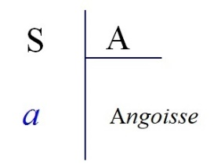
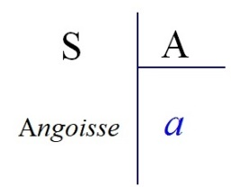
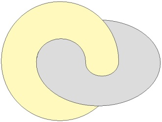
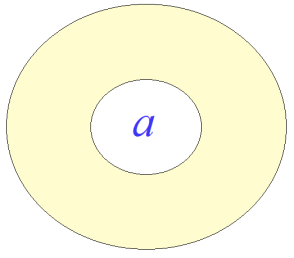
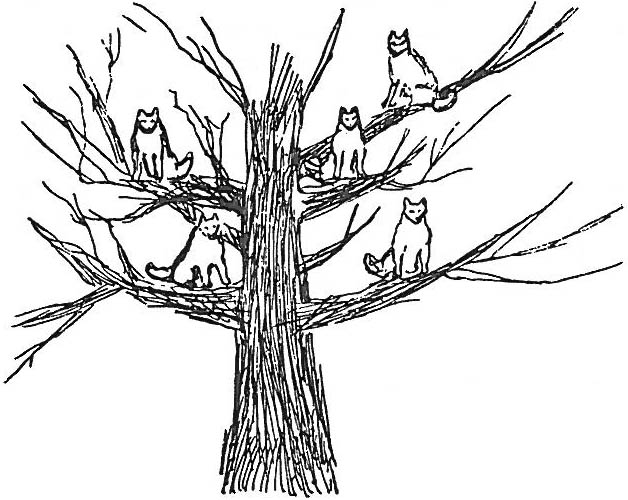

# Leçon 20 | 29 Mai l963

<!-- source-url: http://staferla.free.fr/S10/S10 L'ANGOISSE.docx -->
<!-- seminar: s10 -->
<!-- lesson: 20 -->

<!-- id: s10-20-0001 -->

En lisant ces temps-ci certains ouvrages nouveaux, nouvellement parus, sur les rap­ports du langage et de la pensée,
j’ai été amené à me re-présentifier ce qu’après tout je puis bien à chaque instant pour moi-même mettre en question,
à savoir la place et la nature du biais par où ici j’essaie d’attaquer quelque chose, quelque chose qui, de toute façon,
ne saurait être - *sans ça, qu’aurais-je à vous dire ?* - qu’une *limite,* obligée, nécessaire de votre *compréhension*.

<!-- id: s10-20-0002 -->

Ceci ne présente aucune difficulté particulière dans son principe objectif,
tout progrès d’une science portant autant, et plus, sur le remaniement phasique de ses concepts que sur l’extension de ses prises.

<!-- id: s10-20-0003 -->

Ce qui peut faire ici - je veux dire dans le champ psychanalytique - un obstacle qui mérite une réflexion par­ticulière,
qui n’est pas soluble aussi aisément que le passage d’un système conceptuel à un autre,
par exemple du *système copernicien* au *système einsteinien*,
car après tout, on peut supposer que dans des esprits suffisamment développés, ça ne fait pas longtemps difficulté.

<!-- id: s10-20-0004 -->

À des esprits suffisamment ouverts aux mathématiques, ça ne dure pas longtemps qu’il s’impose que les équations einsteiniennes

<!-- id: s10-20-0005 -->

- se tiennent,

<!-- id: s10-20-0006 -->

- incluent celles qui les ont précédées,

<!-- id: s10-20-0007 -->

- les situent comme cas particuliers,

<!-- id: s10-20-0008 -->

- donc les résolvent entièrement.

<!-- id: s10-20-0009 -->

Ça ne veut pas dire qu’il ne puisse y avoir - comme l’expérience, l’his­toire, le prouvent - un moment de résistance, mais il est court.

<!-- id: s10-20-0010 -->

Dans toute la mesure où comme analystes, je veux dire dans toute la mesure de notre implication...
plus, moins, c’est déjà y être un peu impliqué que de s’intéresser à l’analyse
...dans toute la mesure de notre implication dans la technique analytique
nous devons rencontrer dans l’élaboration des concepts le même obstacle,
désigné, reconnu, comme constituant la limite de *l’expé­rience analytique*, c’est à savoir *l’angoisse de castration*.

<!-- id: s10-20-0011 -->

*Tout se passe comme si*...

<!-- id: s10-20-0012 -->

> ce qui me parvient à des distances diverses de ma voix,
>
> et pas forcément toujours en réponse à ce que je dis, mais cer­tainement dans une certaine zone, en réponse
> ...*tout se passe comme si*, à certains moments, se durcissaient certaines positions techniques,
> stricte­ment corrélatives en cette matière à ce que je puis appeler « *limitation de la compréhension* ».

<!-- id: s10-20-0013 -->

*Tout se passe également comme si* j’avais choisi, pour sur­monter ces limites une voie parfaitement définie - au niveau de l’âge scolai­re - par une école pédagogique posant d’une certaine façon les problèmes du rapport

<!-- id: s10-20-0014 -->

- de l’enseignement scolaire,

<!-- id: s10-20-0015 -->

- avec la maturation de la pensée de l’en­fant.

<!-- id: s10-20-0016 -->

*Tout se passe comme si* j’adhérais...
et j’adhère en effet, à regarder de près ce débat pédagogique
...à ce mode de procédé pédagogique, qui est loin croyez-le...

<!-- id: s10-20-0017 -->

> vous pouvez le constater : il y en a parmi vous qui sont plus près que les autres,
>
> plus nécessités à s’inté­resser à ces procédés pédagogiques
> …vous verrez que les écoles sont loin de s’accorder sur le procédé que je vais maintenant articuler et définir.

<!-- id: s10-20-0018 -->

Pour une école...
si vous voulez, mettons-la où vous voudrez, pour l’instant à ma gauche, ça ne veut rien dire de plus
...tout est commandé par *une maturation autonome de l’intelligence*, on ne fait que la suivre, je parle de l’âge scolai­re.

<!-- id: s10-20-0019 -->

Pour les autres, il y a *une faille, une béance*...
la première, désignons-la par exemple par les théories de Stern. Je ne l’ai pas dit *tout de suite* parce que je pense qu’une bonne part d’entre vous n’ont jamais ouvert les travaux de ce psychologue pourtant universellement reconnu
...pour l’autre disons - c’est Piaget - il y a *une béance, une faille* entre ce que la pensée enfantine est capable de former
et ce qui peut lui être apporté par la voie scientifique.

<!-- id: s10-20-0020 -->

Il est clair que si vous y regardez de bien près, c’est dans les deux cas, rédui­re l’efficacité de l’enseignement comme tel, à zéro.

<!-- id: s10-20-0021 -->

L’enseignement existe.
Ce qui fait que des esprits nombreux dans l’aire scientifique - l’aire : *a.i.r.e.* - peuvent le méconnaître,
c’est qu’effectivement, dans le champ scientifique, une fois qu’on y a accédé,
ce qui est proprement de l’ordre de l’enseignement, au sens où je vais le préciser, peut être en effet tenu pour élidable.

<!-- id: s10-20-0022 -->

C’est à savoir que quand on a franchi une certaine étape de la compréhension mathé­matique, une fois que c’est fait, c’est fait :
on n’a plus à en rechercher les voies.

<!-- id: s10-20-0023 -->

On peut, si je puis dire, y accéder sans aucun mal pour peu qu’on appar­tienne à la génération
à laquelle on aura enseigné les choses sous cette forme, sous cette formalisation, par *première intention*.

<!-- id: s10-20-0024 -->

Des concepts extrêmement compliqués ou plus exactement, qui eussent parus dans une *étape précédente* des mathématiques extrêmement compli­qués, sont immédiatement accessibles à des esprits fort jeunes.
On n’a besoin d’aucun intermédiaire.

<!-- id: s10-20-0025 -->

Il est certain qu’à *l’âge scolaire* il n’en est point ansi, et que tout l’intérêt de la pédagogie scolaire tient à saisir, à constater ce point vif, où à devancer par des problèmes dépassant *légèrement* ce qu’on appelle les « *capacités mentales de l’enfant* », et en l’aidant...
je dis en l’aidant seulement à avancer ces problèmes
...on fait quelque chose qui a un effet, non pas seulement prématurant, effet de hâte sur la maturation mentale,
mais un effet, qui dans certaines périodes qu’on peut appeler – et on les a appelées ainsi – *sensitives...*
Ceux qui en savent un peu sur ce sujet peuvent voir où...
Je poursuis, car l’important est mon discours, et non pas mes références
...on peut obtenir de véritables *effets de déchaî­nement*, d’ouverture, de certaines activités appréhensives dans certains domaines,
effets de fécondité tout à fait spéciaux.

<!-- id: s10-20-0026 -->

C’est exactement ce qu’il me semble pouvoir être obtenu dans le domaine où nous nous avançons ensemble ici,
pour autant, en raison de la spécificité de son champ, et qu’il s’y agit toujours de quelque chose dont il conviendrait un jour
que les pédagogues fassent le repérage.

<!-- id: s10-20-0027 -->

Il y en a déjà des amorces dans les travaux d’auteurs dont le témoignage est d’autant plus intéressant à retenir
qu’ils n’ont aucune notion de ce qu’à nous, peuvent apporter leurs expé­riences.

<!-- id: s10-20-0028 -->

Le fait que tel pédagogue ait pu formuler qu’il n’y a de véritable accès au concept qu’à partir de l’âge de la puberté...
j’entends des expérimenta­teurs qui ne connaissent, qui ne veulent reconnaître rien de l’analyse
...est quelque chose qui mériterait que nous y ajoutions notre regard, que nous y fourrions notre nez,
que nous y saisissions qu’au *Lieu* dont je vous parle, il y a mille traces sensibles que c’est, à proprement parler,
en fonction d’un lien qui peut être fait concernant la maturation de *l’objet(a)* comme tel, c’est-­à-dire tel que je le définis,
à cet âge de la puberté, qu’on pourrait concevoir, donner un tout autre repérage que celui qui est fait par ces auteurs,
de ce qu’ils appel­lent « *le* *moment limite* » où il y a véritablement fonctionnement du concept,
et non pas de cette sorte d’usage du langage qu’ils appellent à cette occasion, non pas « *conceptuel* », mais « *complexuel *»
par une sorte d’homonymie de pure ren­contre avec le terme dont nous nous servons : « *complexe *».

<!-- id: s10-20-0029 -->

Cette *position du* *petit (a)*, au moment *de son passage* par ce que je symbolise *sous la formule du* (- φ),
voilà ce qui est un des buts de notre explication de cette année. \[de (S – *a*) → (S ◊ *a*) \]

<!-- id: s10-20-0030 -->

→ : S ◊ *a* → 

<!-- id: s10-20-0031 -->

voilà ce qui est un des buts de notre explication de cette année.

<!-- id: s10-20-0032 -->

Il n’est valorisable, assumable à vos oreilles, il ne saurait être vala­blement transmis,
si ce n’est par quelque approche, qui ne saurait être ici que détour,
de ce qui constitue ce moment caractérisé par la notion (- φ) et qui est, et ne peut être, que *l’angoisse de castration*.

<!-- id: s10-20-0033 -->

C’est parce que cette angoisse, ici, ne saurait d’aucune façon être présen­tifiée comme telle, mais seulement repérée
par cette sorte de *voie concen­trique* qui me fait, vous le voyez, osciller

<!-- id: s10-20-0034 -->

- du *stade oral,*

<!-- id: s10-20-0035 -->

- à quelque chose que la dernière fois j’ai fait se supporter de l’évocation, sous une forme séparée, matérialisée en *un objet de la voix : ce Shofar* - que vous me permettrez aujourd’hui de prendre pour le mettre un instant de côté - que nous pouvons mainte­nant revenir au point central que j’évoque en parlant de la castration : quel est véritablement ce rapport de l’angoisse à la castration ?

<!-- id: s10-20-0036 -->

Il ne suffit pas que nous le sachions vécu comme tel dans telle phase dite *terminale* ou *non ter­minale* de l’analyse, pour que nous sachions véritablement ce que c’est.

<!-- id: s10-20-0037 -->

Pour dire tout de suite les choses comme elles vont s’articuler au pas sui­vant,
je dirai que *la fonction du phallus comme imaginaire fonctionne par­tout*, à tous les niveaux...
d’en haut, d’en bas - que j’ai définis, caractérisés par une certaine relation du sujet au *petit(a)* \[S ◊ *a*\]
...*le phallus fonctionne partout, sauf là où on l’attend*, dans une fonction médiatrice, nommément au *stade phallique*.

<!-- id: s10-20-0038 -->

Et que *c’est cette carence comme telle du phallus*...
présent, repérable, souvent à notre grande surprise, partout ailleurs
...*c’est cet évanouissement de la fonc­tion phallique comme telle*...
à ce niveau où il est attendu pour fonctionner
...*qui est le principe de l’angoisse de castration*.

<!-- id: s10-20-0039 -->

D’où la notation (- φ), dénotant cette *carence* si je puis dire « *positive *».

<!-- id: s10-20-0040 -->

Et ceci pour n’avoir jamais été formu­lé comme tel sous cette forme,
n’a pas laissé place non plus à ce qu’on en tire les conséquences.

<!-- id: s10-20-0041 -->

Pour vous rendre sensible la vérité de cette formule,
je prendrai diverses voies selon le mode que j’ai appelé tout à l’heure celui de « *tourner autour »*.

<!-- id: s10-20-0042 -->

Et puisque la dernière fois, je vous ai rappelé « *la structure propre du champ visuel »*
concernant ce que j’appelle à la fois « *la sustentation* » et « *l’occultation* » dans ce champ, *de l’objet (a)*,
je ne peux faire moins que d’y revenir quand...
d’une façon que nous savons y être traumatique,
...c’est dans ce champ que se présente le premier abord avec *la présence phallique*, c’est à savoir ce qu’on appelle « *la scène primitive* ».

<!-- id: s10-20-0043 -->

Chacun sait que malgré qu’il \[*le phallus*\] y soit présent, visible sous la forme d’un fonctionnement du pénis,
ce qui frappe dans l’évocation de la réalité de la forme fantasmée de « *la scène primitive* »,
c’est toujours quelque ambiguïté concernant justement cette présence.

<!-- id: s10-20-0044 -->

Combien de fois peut-on dire que justement, *on ne le voit pas à sa place*,
et même parfois que *l’essentiel de l’effet traumatique de la scène*,
c’est justement les formes sous lesquelles il *disparaît*, il s’*escamote*.

<!-- id: s10-20-0045 -->

Aussi bien n’aurai-je qu’à évoquer, dans sa forme exemplaire, le mode d’apparition...

<!-- id: s10-20-0046 -->

> où en tout cas pour notre propos, nous n’avons pas à nous tromper : l’angoisse qui l’accompagne
>
> nous signale assez que nous sommes bien dans la voie que nous cherchons
> ...le mode d’apparition de cette « *scène primitive* » dans l’histoire de *L’homme aux Loups*[^144].

<!-- id: s10-20-0047 -->

Nous avons entendu dire quelque part qu’il y avait quelque chose d’obsessionnel, paraît-il, à ce que nous revenions ici...
je ne pense pas \[*que ce soit*\] chaque fois que je suis en votre présence
...à ce que nous revenions à ces exemples originaux de la découverte freudienne !

<!-- id: s10-20-0048 -->

Ces exemples sont plus que des supports, plus même que des métaphores,
ils nous font toucher du doigt la substance même de ce à quoi nous avons affaire.

<!-- id: s10-20-0049 -->

L’essentiel dans la révélation de ce qui apparaît à *L’homme aux Loups* par la béance...
préfigurant en quelque sorte ce dont j’ai fait une fonction : celle de la fenêtre ouverte
...ce qui apparaît dans son cadre, identifiable en sa forme à la fonction même du *fantasme*, sous son mode le plus angoissant,
il est manifeste que l’essentiel n’y est pas de savoir *où est le phallus*,
il y est si je puis dire, partout, identique à ce que je pourrais appeler « *la catatonie » *de l’image.

<!-- id: s10-20-0050 -->

<!-- id: s10-20-0051 -->

Cet arbre, les loups perchés qui...
retrouvez-y l’écho de ce que je vous ai articulé la dernière fois
...regardent le sujet fixement, il n’est nul besoin de chercher du côté de *cette fourrure* cinq fois répétée dans la queue des cinq animaux,
ce dont il s’agit qui est là - je vous l’ai dit - dans la réflexion même que l’image supporte,
d’une *catatonie* qui n’est point autre chose que celle même du sujet, de *l’enfant médusé*, *fasciné par ce qu’il* *voit*, *paralysé par cette fascination,* au point que ce qui dans la scène le regarde, et qui est en quelque sorte *invisible* d’être partout,
nous pouvons bien le conce­voir comme l’image...
qui ici n’est rien d’autre que la transposition de son état d’*arrêt...de son propre corps, ici transformé dans cet arbre*, que nous dirions, pour faire écho à un titre célèbre, *l’arbre couvert de loups* [^145].

<!-- id: s10-20-0052 -->

Qu’il s’agisse de quelque chose qui fasse écho à ce pôle vécu que nous avons défini comme celui de la *jouissance*,
ceci me paraît ne pas faire ques­tion.

<!-- id: s10-20-0053 -->

Sorte de *jouissance*, parente de ce qu’ailleurs Freud appelle « *hor­reur de la jouissance ignorée* » de *L’homme aux rats,*
une *jouissance* dépassant tout repérage possible par le sujet est là présentifiée sous cette forme *érigée*.
Le sujet n’est plus qu’*érection* dans cette prise qui le fait *phallus*, « *l’arb-horrifie* », le fige tout entier.

<!-- id: s10-20-0054 -->

Il y a quelque chose qui se passe, et dont Freud nous témoigne que dans cette occasion ça n’a été que reconstruit,
que tout essentiel que ce soit au déve­loppement symptomatique des effets de cette scène,
et si essentiel que l’analyse qu’en fait Freud ne saurait même être, un instant, avancée,
si nous n’admettons pas cet élément, qui reste le seul jusqu’au bout, non intégré par le sujet,
et présentifiant en cette occasion ce que Freud a articulé plus tard de « *la reconstruction »* comme telle,
c’est *la réponse du sujet* à la scène trau­matique *par une défécation*.

<!-- id: s10-20-0055 -->

La première fois, ou la quasi-première fois,
la première fois en tous cas où Freud a à faire état d’une façon articulée de cette fonction de *l’apparition de l’objet excrémentiel*,
dans un moment cri­tique, observez - reportez-vous au texte - que sous mille formes,
il l’ar­ticule dans une fonction à laquelle nous ne pouvons pas donner d’autre nom
que celui que nous avons cru devoir articuler plus tard comme carac­téristique du *stade génital*,
à savoir en « *fonction d’oblativité* » : « *C’est un don* », nous dit-il d’ailleurs.

<!-- id: s10-20-0056 -->

Chacun sait que Freud a souligné dès l’abord le caractère de « *cadeau* » de toutes les occasions...

<!-- id: s10-20-0057 -->

> que vous me permettrez bien d’appeler en passant, et sans autre commentaire,
>
> si vous vous souvenez de mes repérages « *des occasions de passage à l’acte* »
> ...où le petit enfant lâche intempestivement quelque chose de son contenu intestinal.

<!-- id: s10-20-0058 -->

Mais dans le texte de *L’homme aux Loups,* les choses vont même plus loin,
donnant son véri­table sens, celui que nous avons noyé sous une vague assomption morali­sante,
à propos de *l’oblativité*, Freud parle à ce propos de *sacrifice*, ce qui, vous l’avouerez, étant donné que Freud « *avait de la lecture* »...
et que par exemple nous savons qu’il avait lu par exemple Robertson Smith[^146],

<!-- id: s10-20-0059 -->

quand il parlait de *sacri­fice*, il ne parlait pas de quelque chose en l’air, d’une *espèce de vague ana­logie morale*.
Freud parle de *sacri­fice à propos de l’apparition de cet objet excrémentiel* dans le champ,
ça doit tout de même bien vouloir dire quelque chose !

<!-- id: s10-20-0060 -->

C’est ici que nous reprendrons les choses au niveau, si vous le voulez, de l’acte normal,
de *l’acte* - à juste titre ou non - *qualifié de mûr*, celui au niveau duquel j’ai cru pouvoir...
à mon *avant-dernier* séminaire \[15-05-1963\], si mon souvenir est bon
...articuler *l’orgasme comme étant l’équivalent de l’angoisse* et se situant dans le champ intérieur au sujet,
tandis que je laissais provisoirement la castration à cette seule marque.

<!-- id: s10-20-0061 -->

Il est bien évident qu’on ne saurait en détacher le signe de l’intervention de l’Autre comme tel,
cette caractéris­tique lui ayant été toujours, et depuis le début, affectée : c’est l’Autre qui menace de castration.

<!-- id: s10-20-0062 -->

J’ai fait remarquer à ce propos qu’à assimiler, *à faire s’équivaloir l’orgasme comme tel à l’angoisse*,
je prenais une position qui rejoignait ce que j’avais dit précédemment de l’angoisse,

<!-- id: s10-20-0063 -->

- comme du repère,

<!-- id: s10-20-0064 -->

- signal de la seule relation qui ne trompe pas, que nous y pouvions trouver la raison de ce qu’il peut y avoir dans l’orgasme de satisfaisant.

<!-- id: s10-20-0065 -->

C’est de quelque chose qui se passe dans la visée *où se confirme que l’angoisse n’est pas sans objet,*
que nous pouvons comprendre *la fonction de l’orgasme* et plus spécialement ce que j’ai appelé *« la satisfaction »* qu’il emporte.

<!-- id: s10-20-0066 -->

Je croyais pouvoir, à ce moment, n’en pas dire plus et être compris.
Il n’en reste pas moins que l’écho m’est parvenu, disons pour le moins de quelque *perplexité,* et dont les termes se sont échangés...
si cet écho est juste
...justement entre *deux personnes* que je crois avoir particulièrement bien formées.
Il n’en est que plus surprenant qu’ils aient pu s’interroger dans l’occasion sur ce que j’entendais par cette « *satisfaction »*.

<!-- id: s10-20-0067 -->

« *S’agit-il donc -* s’entretenaient-ils *- de la jouissance ?*
*Serait-ce revenir d’une certaine façon à cet absolu dérisoire que certains veulent mettre dans la fusion prétendue du génital ?*
*Et puis...*

<!-- id: s10-20-0068 -->

> puisqu’il s’agissait d’apercevoir la relation de ce *point d’angoisse* - mettez dans ce « *point* » toute l’ambiguïté que vous voudrez - d’un point où il n’y ait plus d’angoisse si l’orgasme la recouvre, avec le point de désir
>
> pour autant qu’il se marque de l’absence de *l’objet(a)* sous la forme du (- φ)
> *...qu’en est-il -* s’interrogeaient-ils *- de cette relation chez la femme ?* »

<!-- id: s10-20-0069 -->

Réponse :
je n’ai point dit que la *satisfaction* de l’orgasme s’identifiât avec ce que j’ai défini, dans le séminaire sur *L’éthique,*
sur le lieu de la jouissance.

<!-- id: s10-20-0070 -->

Réponse : il paraît même ironique de le souli­gner,
le « *peu de satisfaction* », même si suffisante, qui est apportée par *l’or­gasme*, pourquoi serait-il le même et au même point,
que cet autre *« peu »* qui est offert dans la copulation - même réussie - à la femme ?

<!-- id: s10-20-0071 -->

C’est ce qu’il convient d’articuler de la façon la plus précise. Il ne suffit pas de dire vague­ment que *la satisfaction de l’orgasme*
est comparable à ce que j’ai appelé ailleurs sur le plan oral : « *l’écrasement de la demande sous la satisfaction du besoin* »[^147].
À ce niveau oral, la distinction du *besoin* à la *demande* est aisée à soutenir,
et n’est point d’ailleurs sans poser pour nous le problème d’où se situe la pulsion.

<!-- id: s10-20-0072 -->

Si par quelque artifice, on peut, au niveau oral, équivoquer sur ce qu’a d’originel la fondation de la demande
dans ce que nous appe­lons, nous analystes, « *pulsion »*,
c’est ce que nous n’avons en aucun cas, aucun droit de faire au niveau du génital.

<!-- id: s10-20-0073 -->

Et justement, là où il semblerait que nous avons affaire à l’instinct le plus primitif : l’instinct sexuel,
c’est là que nous ne pouvons, moins qu’ailleurs, manquer de nous référer à la structure de la pulsion
comme étant supportée par la formule S ◊ D : S rapport de désir à la Demande.

<!-- id: s10-20-0074 -->

Qu’est-ce qui est *demandé* au niveau génital, et à qui ?
Qu’effectivement, l’expérience tellement commune...
fondamentale, pour finir devant l’évi­dence, comme toujours, par n’en plus remarquer le relief
...qu’effectivement la copulation inter­humaine, dans ce qu’elle a de transcendant par rapport à l’existence indi­viduelle,
il nous a fallu le détour d’une biologie déjà un peu avancée,
pour pouvoir remarquer la corrélation stricte de l’apparition de la bisexualité avec l’émergence de la fonction de la mort individuelle.

<!-- id: s10-20-0075 -->

Mais enfin on l’avait *pressenti* depuis toujours, qu’en cet acte où se noue donc étroitement ce que nous devons appeler *survie de l’espèce,* conjoint à quelque chose qui ne peut manquer, si les mots ont un sens, d’intéresser ce que nous avons repéré théoriquement
au dernier terme comme « *pulsion de mort* ».

<!-- id: s10-20-0076 -->

Après tout pourquoi nous refuser à voir
ce qui est après tout immédiatement sensible dans des faits que nous connaissons tout à fait bien,
qui sont signifiés dans les usages les plus courants de la langue : nous demandons, je n’ai pas enco­re dit *à qui*,
mais enfin comme il faut bien toujours demander quelque chose *à quelqu’un,* il se trouve que c’est à notre partenaire,
est-il bien sûr que ce soit à lui, c’est à voir dans un second temps.

<!-- id: s10-20-0077 -->

Mais que ce que nous demandons c’est quoi ?
C’est à satisfaire une demande qui a *un certain rapport avec la mort*.

<!-- id: s10-20-0078 -->

Ça ne va pas très loin, ce que nous demandons, c’est « *la petite mort »,*
mais enfin il est clair que nous la demandons, que la pul­sion est intimement mêlée à cette fonction de la demande :
que nous deman­dons à « *faire l’amour* » si vous voulez à « *faire l’amourir *», c’est à mourir, c’est même *à mourir de rire* !
Ça n’est pas pour rien que je souligne ce qui de *l’amour* participe à ce que j’appelle *un sentiment comique*.

<!-- id: s10-20-0079 -->

En tout cas, c’est bien là que doit résider ce qu’il y a de reposant dans l’après-orgas­me,
si ce qui est satisfait c’est cette demande, eh bien mon Dieu, c’est satisfait à bon compte. On s’en tire !

<!-- id: s10-20-0080 -->

L’avantage de cette conception est de faire apparaître,
de rendre rai­son de ce qu’il en est de l’apparition de l’angoisse, dans un certain nombre de façons d’obtenir l’orgasme.

<!-- id: s10-20-0081 -->

Dans toute la mesure où l’orgasme se détache de ce champ de la Demande à l’Autre...
c’est la première appré­hension que Freud en a eue dans le *coïtus interruptus...*l’angoisse apparaît, si je puis dire, dans cette marge de perte de signification,
mais comme telle, elle \[l’angoisse\] continue à désigner *ce qui est visé d’un certain rapport à l’Autre*.

<!-- id: s10-20-0082 -->

Je ne suis pas en train de dire - justement - que *l’angoisse de castration* soit une angoisse de mort :

<!-- id: s10-20-0083 -->

- c’est une angoisse qui se rapporte au champ où la mort se noue étroitement au renouvellement de la vie,

<!-- id: s10-20-0084 -->

- c’est une angoisse qui, si nous la localisons en ce point, nous permet fort bien de comprendre qu’elle soit équivalemment interprétable comme ce pour quoi elle nous est donnée dans la dernière conception de Freud, comme *le signal d’une mena­ce au statut du « je » défendu*.

<!-- id: s10-20-0085 -->

Elle \[*l’angoisse de castration*\] se rapporte à l’au-delà de ce « *je* » défendu, à ce point d’appel d’une jouissance qui dépasse nos limites,
pour autant qu’ici l’Autre est à proprement parler évoqué dans *ce registre du réel*
qui est ce par quoi un certain *type*, une certaine *forme* de vie se transmet et se soutient.

<!-- id: s10-20-0086 -->

Appelez ça comme vous voudrez, « Dieu » ou « *génie de l’espèce »*, je pense avoir déjà suffisamment inpliqué dans mes discours,
que ceci ne nous porte vers nulle hauteur métaphysique.

<!-- id: s10-20-0087 -->

Il s’agit là *d’un réel,* de ce quelque chose qui maintient ce que Freud a articulé au niveau de son « *prin­cipe de nirvâna* »,
comme étant cette propriété de la vie, de devoir - *pour arri­ver à la mort* - repasser par des formes
qui reproduisent celles qui ont donné à la forme individuelle l’occasion d’apparaître par la conjonction de *deux cellules sexuelles*.

<!-- id: s10-20-0088 -->

*Qu’est-ce à dire* ?
*Qu’est-ce à dire* concernant ce qui se passe *au niveau de l’objet* ?
*Qu’est-ce à dire*, si ce n’est qu’en somme ce résultat, que j’ai appelé « *résultat à si bon compte* »,
n’est réalisé de façon si satisfaisante, au cours d’un certain cycle automatique à définir,
qu’en raison justement du fait que l’organe n’est jamais susceptible de tenir très loin sur la voie de l’ap­pel de *la jouissance.*

<!-- id: s10-20-0089 -->

*Par rapport* à cette fin de *la jouissance,* de l’atteinte de cet appel de l’Autre dans son terme qui serait tragique,
l’organe *ambocepteur* peut être dit « *céder toujours prématurément* ».

<!-- id: s10-20-0090 -->

Au moment, si je puis dire, où il pourrait être *l’objet sacrificiel*,
eh bien disons que dans le cas ordinaire, il y a longtemps qu’il a disparu de la scène.
Il n’est plus *qu’un petit chiffon*, il n’est plus là que comme *un témoignage*, un souvenir, pour la partenaire, de tendres­se.

<!-- id: s10-20-0091 -->

Dans *le complexe de castration*, c’est de cela qu’il s’agit.
Autrement dit *ça ne devient un drame que pour autant qu’est soule­vée*, poussée dans un certain sens,
celui qui fait toute confiance à la consommation génitale, *la mise en question du désir*.

<!-- id: s10-20-0092 -->

Si nous lâchons cet idéal de « *l’accomplissement génital* », en nous apercevant de ce qu’il a de structuralement, d’heureusement leurrant, il n’y a aucu­ne raison que l’angoisse liée à la castration ne nous apparaisse pas

<!-- id: s10-20-0093 -->

- dans une corrélation beaucoup plus souple avec son objet symbolique

<!-- id: s10-20-0094 -->

- et dans une ouverture donc toute différente avec les objets d’un autre niveau, comme ceci est d’ailleurs impliqué depuis toujours par les prémisses de la théorie freudienne, mettant *le désir* dans un tout autre rapport que purement et sim­plement naturel au partenaire naturel, quant à sa structuration.

<!-- id: s10-20-0095 -->

Je voudrais, pour mieux faire sentir ce dont il s’agit,
rappeler tout de même ce qu’il en est de *rapports*, si l’on peut dire, d’abord *sauvages entre l’homme et la femme*.

<!-- id: s10-20-0096 -->

Après tout, une femme qui ne sait pas à qui elle a affaire,
c’est bien conformément à ce que je vous ai avancé du rapport de l’an­goisse avec le désir de l’Autre,
qu’elle n’est pas devant l’homme sans une cer­taine inquiétude sur jusqu’où va pouvoir le mener ce chemin du désir.

<!-- id: s10-20-0097 -->

Quand l’homme, mon Dieu, a fait l’amour comme tout le monde et qu’il est *désarmé*, si la femme...
ce qui, comme vous le savez, est fort concevable
...n’en a pas, je dirai de profit sensible, il y a en tout cas ceci qu’elle a gagné,
c’est qu’elle est, sur les intentions de son partenaire, désormais tout à fait tranquille.

<!-- id: s10-20-0098 -->

Dans ce même chapitre du « *Waste land »* de T.S. Eliott, auquel je me suis référé un certain jour[^148],

<!-- id: s10-20-0099 -->

que j’ai cru devoir confronter avec notre expérience la vieille théorie de la supériorité de la femme sur le plan de la jouissance,
celui où T.S. Eliott fait parler Tirésias, nous trouvons ces vers dont l’ironie m’a tou­jours paru devoir avoir un jour sa place ici
dans notre discours :
« *quand le jeune gandin carbonculaire, petit gratte-papier d’agence immobilière*...
...*a fini* - avec la dactylo dont on nous dépeint, tout au long, l’entourage - *a fini* *sa petite affaire*... »

<!-- id: s10-20-0100 -->

T.S. Eliott s’exprime ainsi :
« *When lovely woman stoops to folly and Paces about her room again, alone,*
*she smoothes her hair with automatic hand, and puts the record on the gramophone.* » \[vers 253-256\]

<!-- id: s10-20-0101 -->

Ce qui veut dire :
« *When lovely woman stoops to folly* », ça ne se traduit pas, c’est une chanson du *Vicaire de Wakefield* [^149],
« *quand une jolie femme s’abandonne à la folie* - « *stoops* » n’est même pas *s’abandonne *: *s’abaisse à la folie –*
*pour enfin se trouver seule, elle arpente la chambre en lissant ses cheveux d’une main automatique, et change de disque.* »

<!-- id: s10-20-0102 -->

Ceci pour la réponse à la question que se posaient entre eux mes élèves, sur ce qu’il en est dans la question du « *désir de la femme* » :
le *désir de la femme* est commandé par la question, à elle aussi, *de sa jouissance*.

<!-- id: s10-20-0103 -->

- Que de *la jouissance* elle soit, non seulement beaucoup plus près que l’homme, mais dou­blement commandée, c’est ce que la théorie analytique nous dit depuis tou­jours.

<!-- id: s10-20-0104 -->

- Que *le lieu de cette jouissance* ne soit lié pour nous au caractère énigma­tique, insituable de son orgasme, c’est ce que nos analyses ont pu pousser assez loin pour que nous puissions dire que ce *lieu* est d’un point assez archaïque pour être plus ancien que le cloisonnement présent du cloaque, ce qui a été dans certaines perspectives analytiques, par telle analyste[^150], et du sexe féminin, parfaitement repéré.

<!-- id: s10-20-0105 -->

- Que *le désir* - qui n’est point *la jouissance* - soit chez elle naturellement là où il doit être selon la nature, c’est-à-dire « *tubaire* », c’est ce que *le désir* de celles qu’on appelle *hystériques* désigne parfaitement.

<!-- id: s10-20-0106 -->

Le fait que nous devions classer ces sujets comme « *hystériques »* ne change rien à ceci que le désir ainsi situé est dans le vrai, dans le vrai organique. C’est parce que l’homme ne portera jamais jusque-là, la pointe de son désir,
*qu’on peut dire que la jouissance de l’homme et de la femme ne se conjoignent pas organiquement*.

<!-- id: s10-20-0107 -->

C’est bien dans la mesure de *l’échec du désir de l’homme* que la femme est *conduite*, si je puis dire *normalement*,
à l’idée d’avoir l’organe de l’homme, pour autant qu’il serait un véritable ambocepteur, et c’est cela qui s’appelle le *phallus*.
C’est *parce que le phallus ne réalise pas* - si ce n’est dans son évanescence - la rencontre des désirs,
qu’il devient le lieu commun de l’angoisse.

<!-- id: s10-20-0108 -->

Ce que la femme nous demande, à nous analystes, à la fin d’une analyse menée selon Freud,
c’est un *pénis* sans doute, *penisneid,* mais pour faire mieux que l’homme.
Il y a quelque chose, il y a bien des choses, il y a mille choses qui confirment tout cela.

<!-- id: s10-20-0109 -->

Sans l’analyse, qu’est-ce qu’il y a pour la femme comme façon de surmonter ce *penisneid*, si nous le supposons tou­jours implicite,
eh bien nous le connaissons très bien, c’est le mode le plus ordinaire de la séduction entre sexes :

<!-- id: s10-20-0110 -->

- c’est d’offrir au désir de l’homme, *l’objet* dont il s’agit de la *revendication phallique*, *l’objet non détumescent* à soutenir son désir,

<!-- id: s10-20-0111 -->

- c’est de faire de ses attributs féminins les signes de la toute puissance de l’homme.

<!-- id: s10-20-0112 -->

Et c’est ce que...
je vous prie de vous référer à mes séminaires anciens
...c’est ce que j’ai cru déjà devoir valoriser en sou­lignant, après Joan Riviere, *la fonction propre de ce qu’elle appelle* « *la mascarade féminine* ». Simplement, *elle doit y faire bon marché de sa jouis­sance*.

<!-- id: s10-20-0113 -->

Dans la mesure où nous la laissons en quelque sorte sur ce chemin,
c’est là que nous signons l’arrêt du renouvellement de cette *revendication phallique*,
qui devient, je ne dirai pas *le dédommagement*, mais comme *l’otage* *de ce qu’on lui demande* *en somme, comme prise en charge de l’échec de l’Autre.*

<!-- id: s10-20-0114 -->

Telles sont les voies où se présentent...
à considérer le plan génital, la réali­sation génitale comme un terme \[*une fin*\],
...ce que nous pourrions appeler « *les impasses du désir* », s’il n’y avait l’ouverture de l’angoisse.

<!-- id: s10-20-0115 -->

Nous verrons...
repartant du point où aujourd’hui je vous ai conduits
...comment toute l’expérience ana­lytique nous montre
*que c’est dans la mesure où* *il est appelé comme objet de propitiation, dans une conjonction en impasse,*
*que le phallus, s’avérant manquer, constitue la castration elle-même* *comme un point impossible à contourner du rapport du sujet à l’Autre*,
*mais comme un point - quant à sa fonction d’angoisse - résolu.*

## Notes

[^144]: S. Freud : *Cinq psychanalyses*, Extrait de l'histoire d'une névrose infantile (L'homme aux loups), p.325, op. cit.

[^145]: Pierre Drieu La Rochelle : *L'homme couvert de femmes*, Gallimard, 1994.

[^146]: [William Robertson Smith](http://www.william-robertson-smith.net/) : *Religion of the Semites*, ed. Transaction Publishers, 2002.

[^147]: J. Lacan : *Écrits*, « *La direction de la cure*... » p.585 ou t.2 p.62 ; Séminaire1957-58 : *Les formations de l’inconscient,* séances des 27-11 et 04-12-1957.

[^148]: Cf. supra séance du 20-03. T.S. Eliot : *La terre vaine*, Point Seuil, p.79.

[^149]: Oliver Goldsmith : *Le Vicaire de Wakefield*, éd. José Corti, 2001.

[^150]: Joan Riviere : *La féminité en tant que mascarade*.
