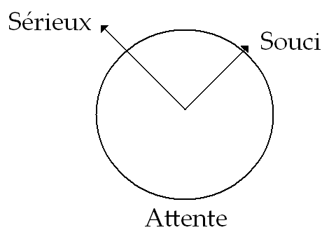
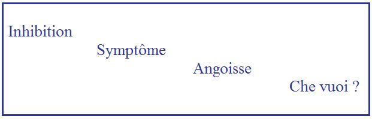
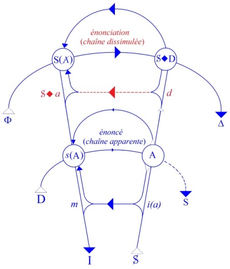
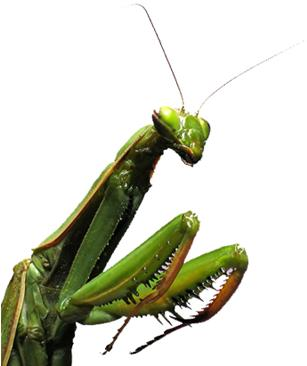
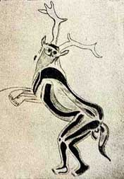
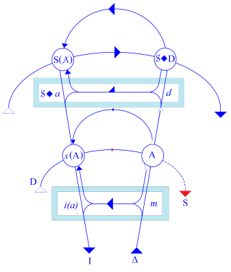
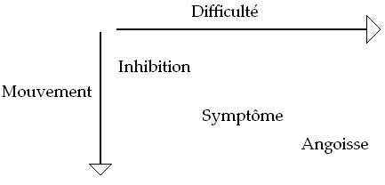
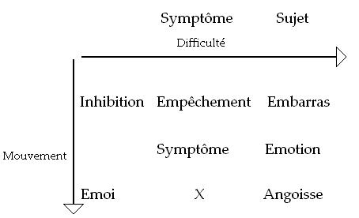
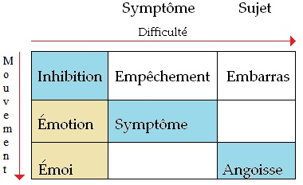

# Leçon 01 | l4 Novembre l962

<!-- source-url: http://staferla.free.fr/S10/S10 L'ANGOISSE.docx -->
<!-- seminar: s10 -->
<!-- lesson: 01 -->

<!-- id: s10-01-0001 -->

Je vais vous parler cette année de l’angoisse.

<!-- id: s10-01-0002 -->

Quelqu’un qui n’est pas du tout à distance de moi dans notre cercle, m’a pourtant l’autre jour laissé apercevoir quelque surprise que j’aie choisi ce sujet qui ne lui semblait pas devoir être d’une tellement grande ressource.

<!-- id: s10-01-0003 -->

Je dois dire que je n’aurai pas de peine à lui prouver le contraire.
Dans la masse de ce qui se propose à nous, sur ce sujet, de questions, il me faudra choisir et sévèrement.
C’est pourquoi j’essaierai, dès aujourd’hui de vous jeter sur le tas.

<!-- id: s10-01-0004 -->

Mais déjà cette question m’a semblé garder la trace de je ne sais quelle naïveté jamais étanchée,
pour la raison que ce serait croire que c’est un choix : que chaque année, je pique un sujet, comme ça,
qui me semblerait intéressant pour continuer le jeu de quelque *sornette*, comme on dit... Non !

<!-- id: s10-01-0005 -->

Vous le verrez, je pense, l’angoisse est très précisément le point de rendez-vous
où vous attend tout ce qu’il en était de mon discours antérieur et où s’at­tendent entre eux un certain nombre de termes,
qui ont pu jusqu’à présent ne pas vous apparaître suffisamment conjoints.

<!-- id: s10-01-0006 -->

Vous verrez sur ce terrain de l’angoisse, comment, à se nouer plus étroitement, chacun prendra encore mieux sa place.
Je dis « *encore mieux* » puisque récemment il a pu m’appa­raître, à propos de ce qui s’est dit du *fantasme*
à une des réunions dites « *provinciales* » de notre Société[^1], que quelque chose avait dans votre esprit...
concer­nant cette structure si essentielle qui s’appelle le *fantasme*
*...*pris effective­ment sa place.

<!-- id: s10-01-0007 -->

Vous verrez que celle de l’angoisse n’est pas loin de celle-la, pour la raison que c’est bel et bien la même.

<!-- id: s10-01-0008 -->

Je vous ai mis sur ce tableau...
pourtant, après tout, ce n’est pas grand un tableau
...quelques petits signifiants-repères ou aide-mémoire,
peut-être pas tous ceux que j’aurais voulu, mais après tout il convient de ne pas non plus abuser quant au schématisme.
Cela, vous le verrez s’éclairer tout à l’heure. Ils forment deux groupes, celui-ci et celui-là : celui-là que je compléterai.

<!-- id: s10-01-0009 -->

 

<!-- id: s10-01-0010 -->

À droite, ce graphe :

<!-- id: s10-01-0011 -->

<!-- id: s10-01-0012 -->

dont je m’excuse depuis si longtemps de vous impor­tuner, mais dont il est tout de même nécessaire - car la valeur de repère vous en apparaîtra, je pense, toujours plus efficace - que je rappelle *la struc­ture* qu’il doit évoquer à vos yeux.
Aussi bien sa forme - qui peut-être ne vous est jamais apparue - de *poire d’angoisse*, n’est peut-être pas ici à évoquer *par hasard*.

<!-- id: s10-01-0013 -->

D’autre part, si l’année dernière à propos de cette petite surface topologique \[*cross-cap*\] à laquelle j’ai fait une si grande part,
certains ont pu voir se suggérer à leur esprit certaines formes de reploiement des *feuillets embryologiques*, voire des *couches du cortex*, personne...
à propos de la disposition à la fois bilatérale et nouée d’intercommunication orientée de ce graphe
...personne n’a jamais évoqué à ce propos, *le plexus solaire*.

<!-- id: s10-01-0014 -->

Bien sûr je ne prétends pas là vous en livrer les secrets, mais cette curieuse petite homologie
n’est peut-être pas si externe qu’on le croit et méritait d’être rappelée au début d’un discours sur l’angoisse.

<!-- id: s10-01-0015 -->

*L’angoisse...*

<!-- id: s10-01-0016 -->

> je dirai jusqu’à un certain point la réflexion par laquelle j’ai introduit mon discours tout à l’heure, celle qui a été faite par un de mes proches, je veux dire dans notre *Société*
> ...*l’angoisse* ne semble pas être ce qui vous étouffe, j’entends, comme psychanalystes.

<!-- id: s10-01-0017 -->

Et pourtant, ce n’est pas trop dire que ça devrait, dans - si je puis dire - la logique des choses,
c’est­-à-dire de la relation que vous avez avec votre patient.

<!-- id: s10-01-0018 -->

Après tout, sentir ce que le sujet peut en supporter de l’angoisse, c’est ce qui vous met à l’épreu­ve à tout instant.
Il faut donc supposer, qu’au moins pour ceux d’entre vous qui sont formés à la technique,
la chose a fini par passer, dans votre régulation, *la moins aperçue,* il faut bien le dire.

<!-- id: s10-01-0019 -->

Il n’est pas exclu - et Dieu merci ! - que l’analyste, pour peu qu’il y soit déjà disposé...
je veux dire par de très bonnes dispositions à être un analyste
...que l’analyste entrant dans sa pra­tique ressente de ses premières relations avec le malade sur le divan *quelque angoisse*.

<!-- id: s10-01-0020 -->

Encore convient-il de toucher à ce propos la question de la communica­tion de l’angoisse.
Cette angoisse que vous savez - semble-t-il - si bien régler et, en vous, tamponner, qu’elle vous guide,
est-ce la même que celle du patient ? Pourquoi pas ?

<!-- id: s10-01-0021 -->

C’est une question que je laisse ouverte pour l’instant,
peut-être pas pour très longtemps, mais qui vaut la peine d’être ouverte dès l’origine,
si toutefois il faut recourir à nos articulations essen­tielles pour pouvoir y donner une réponse valable,
donc attendre un moment au moins, dans les distances, dans les détours que je vais vous proposer
et qui ne sont pas absolument hors de toute prévision pour ceux qui sont mes auditeurs.

<!-- id: s10-01-0022 -->

Car si vous vous en souvenez, déjà à propos justement d’une autre série de journées dites « *provinciales* »
qui étaient loin de m’avoir donné autant de satisfaction,
à propos *desquelles* dans une sorte d’inclusion, de parenthèse, d’anticipation, dans mon discours de l’année dernière,
j’ai cru devoir vous avertir et proje­ter à l’avance une formule vous indiquant le rapport de l’angoisse essentiel au désir de l’Autre.

<!-- id: s10-01-0023 -->

Pour ceux qui n’étaient pas là, *je rappelle la fable, l’apo­logie, l’image amusante* *que j’avais cru devoir en dresser devant vous* pour un instant :
moi-même revêtant le masque animal dont se couvre « *le sorcier de la grotte Des Trois Frères* », je m’étais *imaginé* devant vous,
en face d’un autre animal - d’un vrai celui-là, et supposé géant pour l’occasion - celui de la mante religieuse.

<!-- id: s10-01-0024 -->

 

<!-- id: s10-01-0025 -->

Et aussi bien, comme le masque que moi je portais, je ne savais pas lequel c’était,
vous imaginez facilement que j’avais quelques rai­sons de n’être pas rassuré,
pour le cas où, par hasard, ce masque n’aurait pas été impropre à entraîner ma partenaire dans quelque erreur sur mon identi­té, la chose étant bien soulignée par ceci que j’y avais ajouté :
que dans ce miroir énigmatique du globe oculaire de l’insecte je ne voyais pas ma propre image.

<!-- id: s10-01-0026 -->

Cette *métaphore* garde aujourd’hui toute sa valeur, et c’est elle qui justifie qu’au centre des signifiants que j’ai posés sur ce tableau, vous voyez la question que j’ai depuis longtemps introduite comme étant la charniè­re des deux étages du graphe
pour autant qu’ils structurent ce rapport du sujet au signifiant,
qui sur la subjectivité me paraît devoir être la clé de ce qu’introduit dans la doctrine freudienne le « *Che vuoi ?* », « *Que veux-tu ?* »*.*

<!-- id: s10-01-0027 -->

Poussez un petit peu plus le fonctionnement, l’entrée de la clé, vous avez « *Que me veut-il ?* ».
avec *l’ambiguïté* que le français permet sur le « *me* », entre le complément indirect ou direct :
non pas seulement : « *que veut-il à moi ?* »,
mais quelque chose de suspendu qui concerne directement le *moi,*
qui n’est pas « *comment me veut-il ?* » mais qui est « *que veut-il concernant cette place du moi* »,
qui est quelque chose *en suspens entre les deux étages*

<!-- id: s10-01-0028 -->

- *d* → S **◊** *a,*

<!-- id: s10-01-0029 -->

- et *m* → *i(a),* les deux points de retour qui dans chacun désignent l’ef­fet caractéristique et la distance, si essentielle à construire au principe de tout ce dans quoi nous allons nous avancer maintenant, distance qui rend à la fois homologue et si distinct le rapport du *désir* et l’*identification narcis­sique*.

<!-- id: s10-01-0030 -->

<!-- id: s10-01-0031 -->

C’est dans le jeu de la dialectique qui noue si étroitement ces deux étages, que nous allons voir s’introduire *la fonction de l’angoisse*, non pas qu’elle en soit elle-même *le ressort*, mais qu’elle soit par les moments de son apparition *ce qui nous permet de nous y orienter*.

<!-- id: s10-01-0032 -->

Ainsi donc au moment où j’ai posé la question de votre rapport d’analyste à l’angoisse,
question qui justement laisse en suspens celle-ci : qui ménagez-vous ?
L’autre, sans doute, mais aussi bien vous-même, et ces 2 ménagements pour se recou­vrir ne doivent pas être laissés confondus.
C’est même là une des visées qui à la fin de ce discours vous seront proposées.

<!-- id: s10-01-0033 -->

Pour l’instant, j’introduis cette indication de méthode *que ce que nous allons avoir à tirer d’enseignement* de *cette recherche sur l’angoisse*,
c’est à *<u>voir</u>* en quel point privilégié elle émerge.
C’est à modeler sur *une horographie*[^2] de l’angoisse qui nous conduit directement sur un relief qui est celui *des rapports de terme à terme* que constitue cette tentative structurale plus que condensée dont j’ai cru devoir faire pour vous le guide de notre discours.

<!-- id: s10-01-0034 -->

Si vous savez donc vous arranger avec l’angoisse, cela nous fera déjà avan­cer que d’essayer de voir comment.
Et aussi bien, moi-même, je ne saurais l’introduire sans l’arranger de quelque façon, et c’est peut-être là un écueil :
il ne faut pas que je l’arrange trop vite, cela ne veut pas dire non plus que d’aucune façon, par quelque jeu psychodramatique, mon but doive être de vous *jeter* dans l’angoisse, avec le jeu de mots que j’ai déjà fait sur ce « *je* » du « *jeter* ».

<!-- id: s10-01-0035 -->

Chacun sait que cette projection du « *je* » dans une introduc­tion à l’angoisse est depuis quelque temps l’ambition
d’une philosophie dite *existentialiste* pour la nommer. Les références ne manquent pas, depuis Kierkegaard :
Gabriel Marcel, Chostov, Berdiaev et quelques autres, tous n’ont pas la même place ni ne sont pas aussi utilisables.

<!-- id: s10-01-0036 -->

Mais au début de ce discours, je tiens à dire qu’il me semble que dans cette philosophie...

<!-- id: s10-01-0037 -->

> pour autant que de son patron, nommé le premier à ceux dont j’ai pu avancer le nom,
>
> incontestablement se marque quelque dégradation
> ...il me semble la voir, cette philosophie, *marquée dirais-je*, de quelque hâte d’elle-même méconnue,
> *marquée dirais-je*, de quelque désarroi par rapport à une réfé­rence qui est celle à quoi, à la même époque,
> le mouvement de la pensée se confine : *la référence à l’histoire*.
> C’est *d’un désarroi* - au sens étymologique du terme[^3] - par rapport à cette référence, que naît et se précipite *la réflexion existentialiste*.

<!-- id: s10-01-0038 -->

Le « *cheval de la pensée* »...
dirais-je, pour emprunter au petit Hans l’objet de sa phobie
...*le cheval de la pensée* qui s’imagine, un temps, être celui qui traî­ne le coche de l’histoire, tout d’un coup se cabre, devient fou, choit et se livre à ce grand *Krawallmachen,* pour nous référer encore au petit Hans qui donne une de ces images à *sa crainte chérie*.

<!-- id: s10-01-0039 -->

C’est bien ce que j’appelle là, le mouvement de hâte, au mauvais sens du terme, celui du désarroi.
Et c’est bien pour cela que c’est loin d’être ce qui nous intéresse le plus dans la lignée - la lignée de pensée –
que nous avons épinglée à l’instant, avec tout le monde d’ailleurs, du terme d’*existen­tialisme*.

<!-- id: s10-01-0040 -->

Aussi bien peut-on remarquer que le dernier venu, et non des moins grands : M. Sartre,
s’emploie tout expressément - ce cheval - à le remettre, non seulement sur ses pieds, mais dans les brancards de l’histoire.
C’est précisément en fonction de cela que M. Sartre[^4] s’est beaucoup occupé, beaucoup interrogé sur *la fonction du sérieux*.

<!-- id: s10-01-0041 -->

*Ιl y a aussi quelqu’un* que je n’ai pas mis dans *la série*, et puisque j’aborde - simplement en y touchant à l’entrée - *ce fond de tableau...*

<!-- id: s10-01-0042 -->

> les philosophes qui nous observent, sur le point où nous en venons \[s’interrogent\] :
>
> « *les analystes seront-ils à la hauteur de ce que nous faisons de l’an­goisse ?* »
> *...il y a* Heidegger[^5].

<!-- id: s10-01-0043 -->

Ιl est bien sûr qu’avec l’emploi, que j’ai fait tout à l’heure, de calembour du mot « *jeter* »,
c’est bien de lui, de sa déréliction originelle que j’étais le plus près.

<!-- id: s10-01-0044 -->

« *L’être pour la mort* » pour l’appeler par son nom...

<!-- id: s10-01-0045 -->

> qui est la voie d’ac­cès par où Heidegger, dans son discours rompu,
>
> nous mène à son interro­gation présente et énigmatique sur *l’être de l’étant*
> *...*je crois, ne passe pas vraiment par l’angoisse.

<!-- id: s10-01-0046 -->

La référence vécue de la question heideggerienne, il l’a nommée :
elle est fondamentale, elle est du « *tout* », elle est de « *l’on* », elle est de *l’omnitude* du quotidien humain, elle est « *<u>le souci</u>* ».
Bien sûr, à ce titre elle ne saurait, pas plus que « *le souci* » lui-même, nous être étrangère.

<!-- id: s10-01-0047 -->

Et puisque j’ai appelé ici deux témoins, Sartre et Heidegger, je ne me priverai pas d’en appeler un troisième,
pour autant que *je ne le crois pas indigne* de représenter ceux qui sont ici, en train aussi d’observer ce qu’il va dire, *et c’est moi-même.*
Je veux dire qu’après tout, aux témoignages que j’en ai eus dans, encore, les heures toutes récentes, de ce que j’appellerai *l’attente*, il n’y a pas que la nôtre dont je parle en cette occasion, donc assurément, j’ai eu ces témoignages d’attente.

<!-- id: s10-01-0048 -->

Mais qu’il me soit arrivé hier soir un travail...

<!-- id: s10-01-0049 -->

> dont j’avais demandé à quelqu’un d’entre vous[^6] d’avoir le texte,
>
> voire de m’orien­ter à propos d’une question que lui-même m’avait posée
> ...travail que je lui avais dit attendre avant de commencer ici mon discours,
> le fait qu’il m’ait été ainsi apporté en quelque sorte *à temps*, même si je n’ai pas pu depuis *en prendre connaissance*,
> comme après-tout aussi *je viens ici répondre à temps à votre attente*, est-ce là un mouvement *de nature* en soi-même *à susciter l’angoisse* ?

<!-- id: s10-01-0050 -->

Sans avoir interrogé celui dont il s’agit, je ne le crois pas quant à moi.
Ma foi, je peux répondre, devant cette attente pourtant bien faite pour faire peser sur moi le poids de quelque chose,
que ce n’est pas là - je crois pouvoir le dire par expérience - la dimension qui en elle-même fait sur­gir l’angoisse.

<!-- id: s10-01-0051 -->

Je dirai même : au contraire, et que cette dernière référence, si proche qu’elle peut vous apparaître problématique,
j’ai tenu à la faire pour vous indiquer comment j’entends vous mettre, à ce qui est ma question depuis le début,
à quelle distance la mettre pour vous en parler...
sans la mettre tout de suite dans l’armoire, sans non plus la laisser à l’état flou
...à quelle distance mettre cette angoisse ?

<!-- id: s10-01-0052 -->

Eh bien, mon Dieu : à la distance qui est la bonne, je veux dire celle qui ne nous met en aucun cas trop près de personne,
à - justement - cette distance familière que je vous évoquais en prenant ces dernières références :

<!-- id: s10-01-0053 -->

- celle à mon interlocuteur qui m’apporte *in extremis* mon papier

<!-- id: s10-01-0054 -->

- et celle à moi-même qui dois ici me risquer à mon discours sur l’angoisse.

<!-- id: s10-01-0055 -->

Nous allons essayer, cette angoisse, de la prendre sous le bras. Ça ne sera pas plus indiscret pour cela.
Ça nous laissera vraiment à la distance opaque, croyez-moi, qui nous sépare de ceux qui nous sont les plus proches.

<!-- id: s10-01-0056 -->

Alors, entre ce « *souci* », et ce « *sérieux* », cette *attente*, est-ce que vous allez croire que c’est ainsi que j’ai voulu *la cerner, la coincer* ?
Eh bien, détrompez-vous. Si j’ai tracé au milieu de ces trois termes un petit cercle avec ses flèches écar­tées :

<!-- id: s10-01-0057 -->

<!-- id: s10-01-0058 -->

C’est pour vous dire que si c’est là que vous la cherchiez, vous verriez vite que si jamais elle a été là, l’oiseau s’est envolé.
Elle n’est pas à chercher au milieu. *Inhibition, symptôme, angoisse,* tel est le titre, *le slogan* sous lequel, à des analystes,
apparaît, reste marqué, le dernier terme de ce que Freud [^7] a articulé sur ce sujet.

<!-- id: s10-01-0059 -->

Je ne vais pas aujourd’hui entrer dans le texte d’*Inhibition, symptôme, angoisse* pour la raison que,
comme vous le voyez depuis le début, je suis décidé aujourd’hui à travailler « *sans filet* »,
et qu’il n’y a pas de sujet où *le filet* du discours freudien soit plus près de nous donner une sécurité, fausse en somme.

<!-- id: s10-01-0060 -->

Car justement, quand nous entrerons dans ce texte, vous verrez ce qui est à voir à propos de l’angoisse : qu’il n’y a pas de filet, parce que, s’agissant de *l’angoisse*, chaque *maille* si je puis dire, n’a de sens qu’à justement laisser le vide dans lequel il y a *l’angoisse*. Dans le discours - Dieu merci - d’*Inhibition, symptôme, angoisse,* on parle de tout sauf de l’angoisse.
Est-ce à dire qu’on ne puisse pas en parler ?

<!-- id: s10-01-0061 -->

Travailler sans filet évoque le funambule. Je ne prends comme corde que le titre :

<!-- id: s10-01-0062 -->

> Inhibition,

<!-- id: s10-01-0063 -->

symptôme,

<!-- id: s10-01-0064 -->

angoisse*.*
Ιl saute - si je puis dire - à l’entendement que ces trois termes ne sont pas du même niveau.
Ça fait hétéroclite et c’est pour ça que je les ai écrits ainsi sur trois lignes et décalés.
Pour que ça marche, pour qu’on puisse les entendre comme une série,
il faut vraiment les voir comme je les ai mis là, en diagonale, ce qui implique qu’*il faut rem­plir les blancs*.

<!-- id: s10-01-0065 -->

Je ne vais pas m’attarder à vous démontrer, ce qui saute aux yeux, la différence entre la structure de ces 3 termes,
qui n’ont chacun, si nous voulons les situer, absolument pas les mêmes termes comme *contexte*, comme *entourage*.

<!-- id: s10-01-0066 -->

L’inhibition, c’est quelque chose qui est, au sens le plus large de ce terme, dans *la dimension du mouvement* et d’ailleurs Freud...

<!-- id: s10-01-0067 -->

> je n’entrerai pas dans le texte
> ...tout de même vous vous en souvenez assez pour voir qu’il ne put pas faire autre­ment que de parler de la locomotion
> au moment où il introduit ce terme.

<!-- id: s10-01-0068 -->

Plus largement, ce *mouvement* auquel je me réfère, le *mouvement* existe dans toute fonction, ne fût-elle pas locomotrice,
il existe au moins métaphori­quement, et dans *l’inhibition* c’est de *l’arrêt du mouvement* qu’il s’agit.

<!-- id: s10-01-0069 -->

« *Arrêt* », est-ce à dire que c’est seulement cela qu’« *inhibition* » est fait pour nous suggérer ?
Facilement, vous objecteriez aussi « *freinage* ». Et pour­quoi pas ? Je vous l’accorde !
Je ne vois pas pourquoi nous ne mettrions pas...

<!-- id: s10-01-0070 -->

> dans une *matrice* qui doit nous permettre de distinguer les dimensions
>
> dont il s’agit dans une notion à nous si familière
> ...nous ne mettrions pas :

<!-- id: s10-01-0071 -->

- sur une ligne la notion de « *difficulté* »,

<!-- id: s10-01-0072 -->

- et dans un autre axe de coordonnées, celle que j’ai appelée du « *mouvement* ».

<!-- id: s10-01-0073 -->

<!-- id: s10-01-0074 -->

C’est même cela qui va nous permettre de voir plus clair, car c’est cela aussi qui va nous permettre de redescendre au sol,
au sol de ce qui n’est pas voilé par le mot savant, par la notion, voire le concept avec qui l’on s’arrange toujours.

<!-- id: s10-01-0075 -->

Pourquoi est-ce qu’on ne se sert pas du mot « *empêcher* » ? C’est tout de même bien de ça qu’il s’agit. Nos sujets sont inhibés, quand ils nous parlent de leur inhibition et quand nous en parlons dans des congrès scientifiques, et chaque jour,
ils sont *empêchés *:

<!-- id: s10-01-0076 -->

- être *empêché* c’est un symptôme,

<!-- id: s10-01-0077 -->

- et *inhibé* c’est un symptôme mis au musée.

<!-- id: s10-01-0078 -->

Et si on regarde ce que ça veut dire « *être empêché* »...

<!-- id: s10-01-0079 -->

> sachez-le bien ceci n’implique nulle superstition du côté de l’étymologie, je m’en sers quand elle me sert
> ...tout de même « *impedicare* » ça veut dire *être pris au piège*. Et ça, c’est une notion extrêmement précieu­se,
> car cela implique le rapport d’une dimension à quelque chose d’autre qui vient y interférer *et qui empêche*...

<!-- id: s10-01-0080 -->

> ce qui nous intéresse, ce qui nous rap­proche de ce que nous cherchons,
>
> à savoir ce qui se passe sous la forme, sous le nom d’« *angoisse* »
> ...non pas la fonction, terme de référence, non pas le mouvement, rendu difficile - mais *le sujet*.

<!-- id: s10-01-0081 -->

<!-- id: s10-01-0082 -->

Si je mets ici « *Empêchement* », vous le voyez, je suis dans la colonne du *symptôme*.
Et tout de suite je vous indique ce sur quoi nous serons bien sûr amenés à en articuler beaucoup plus,
c’est à savoir que *le piège c’est la capture narcissique*.

<!-- id: s10-01-0083 -->

Je pense que vous n’en êtes plus tout à fait aux *éléments* concernant la capture narcissique,
je veux dire que vous vous souvenez de ce que j’ai la-dessus articulé au dernier terme,
à savoir de la limite très pré­cise qu’elle introduit quant à ce qui peut s’investir dans *l’objet*.
Et que *le résidu, la cassure*, c’est de ce qu’il *n’arrive pas* à s’investir, à être proprement ce qui donne son support, son matériel,
à l’articulation *signifiante* qu’on va appeler - sur l’autre plan, symbolique - *la castration*.

<!-- id: s10-01-0084 -->

L’*empêchement* survenu est lié à ce cercle qui fait que du même mouvement dont le sujet s’avance vers *la jouis­sance*,
c’est-à-dire vers ce qui est le plus loin de lui, il rencontre *cette cassu­re intime* toute proche - de quoi ? -
de s’être laissé prendre en route à sa propre image, à l’image spéculaire. C’est cela le piège.

<!-- id: s10-01-0085 -->

Mais essayons d’aller plus loin, car nous sommes là encore au niveau du *symptôme*.
Concernant le sujet, quel terme amener ici dans la troisième colonne ?
Si nous poussons plus loin l’interrogation du sens du mot « *inhibi­tion* » : *inhibition*, *empêchement*,
le troisième terme que je vous propose, tou­jours dans le sens de vous ramener au plancher du vécu,
au sérieux dérisoi­re de la question, je vous propose le beau terme d’« *embarras* ».

<!-- id: s10-01-0086 -->

Il nous sera d’autant plus précieux qu’aujourd’hui l’étymologie me comble !
Manifeste­ment le vent souffle sur moi, si vous vous apercevez :

<!-- id: s10-01-0087 -->

- qu’*embarras* c’est très exactement *le sujet* S *revêtu de la barre*,

<!-- id: s10-01-0088 -->

- que l’étymologie *imbaricare* fait à proprement parler l’allusion la plus directe à *la barre* comme telle,

<!-- id: s10-01-0089 -->

- et qu’aussi bien c’est la l’image de ce que l’on appelle le vécu le plus direct de l’« *embarras* ».

<!-- id: s10-01-0090 -->

Quand vous ne savez plus que faire de vous, que vous ne trou­vez pas derrière quoi vous remparder,
c’est bien de l’expérience de la barre qu’il s’agit. Et aussi bien cette barre peut prendre plus d’une forme :
de curieuses références qu’on trouve, si je suis bien informé, dans de nombreux patois où *l’embarrassé*, *l’embarazada...*

<!-- id: s10-01-0091 -->

> il n’y a pas d’Espagnols ici ? - tant pis
> ...car on m’affirme que *l’embarazada -* sans recourir au patois - veut dire la femme enceinte en espagnol.
> Ce qui est une autre forme bien significative de *la barre* à sa place.

<!-- id: s10-01-0092 -->

Et voila pour la dimension de la difficulté, elle aboutit à cette sorte de forme légère de l’angoisse qui s’appelle *l’embarras*.

<!-- id: s10-01-0093 -->

Dans *l’autre dimension, celle du mouvement*, quels sont les termes que nous allons voir se dessiner en descendant vers *le symptôme* ?
C’est l’émotion d’abord. *L’émotion*...

<!-- id: s10-01-0094 -->

> vous me pardonnerez de continuer à me fier à une étymologie qui m’a été jusqu’à maintenant si propice
> ...*l’émotion*, de fait, étymologiquement, se réfère au mouvement.

<!-- id: s10-01-0095 -->

À ceci près que nous donnerons le petit coup de pouce en y mettant *le sens goldsteinien*[^8]

<!-- id: s10-01-0096 -->

- *de* « *jeter hors* », « *ex* » *de la ligne du mouve­ment *: le mouvement qui se désagrège,

<!-- id: s10-01-0097 -->

- de la réaction qu’on appelle « *catastro­phique* ».

<!-- id: s10-01-0098 -->

C’est utile que je vous indique à quelle place il faut le mettre,
car après tout il y en a eu d’aucuns pour nous dire que l’angoisse c’était ça « *la réaction catastro­phique* ».

<!-- id: s10-01-0099 -->

Je crois que bien sûr, ce n’est pas sans rapport. Qu’est-ce qui ne serait pas en rapport avec l’angoisse ?
Ιl s’agit justement de savoir où c’est vraiment l’angoisse.

<!-- id: s10-01-0100 -->

Le fait par exemple *qu’on ait pu*...

<!-- id: s10-01-0101 -->

> et qu’on le fasse d’ailleurs sans scrupules
> ...*se servir de la même référence à* « *la réaction catastro­phique* » *pour désigner la crise hystérique en tant que telle*, *ou enco­re la colère dans d’autres cas*, prouve tout de même assez que ça ne saurait suffire à distinguer, à épingler, à pointer où est l’angoisse.

<!-- id: s10-01-0102 -->

Faisons le pas sui­vant. Nous restons toujours à même distance respectueuse - à deux crans près - de l’angoisse.
Mais y a-t-il dans la dimension du mouvement quelque chose qui plus précisément *réponde*, à l’étage de l’angoisse ?
Je vais l’appeler par son nom que je réserve depuis longtemps, dans votre intérêt, comme friandise.
Peut-être y ai-je fait une allusion fugitive, mais seules des oreilles particulièrement *préhensives* ont pu le retenir :
c’est le mot « *émoi* ».

<!-- id: s10-01-0103 -->

Ici l’éty­mologie me favorise d’une façon littéralement fabuleuse. Elle me comble !
C’est pourquoi je n’hésiterai pas, quand je vous aurai dit d’abord tout ce qu’elle m’apporte à moi, à en abuser encore.
En tout les cas, allons-y.

<!-- id: s10-01-0104 -->

Le sentiment linguistique, comme s’expriment Messieurs Bloch et Von Wartburg
à l’article desquels je vous indique expressément de vous référer...

<!-- id: s10-01-0105 -->

> je m’excuse si cela fait double emploi avec ce que je vais vous dire main­tenant,
>
> d’autant plus double emploi que ce que je vais vous dire en est la citation textuelle,
>
> je prends mon bien où je le trouve, n’en déplaise à qui­conque
> ...Messieurs Bloch et Von Wartburg *disent donc que le sentiment linguistique a rapproché ce terme du mot juste : du mot « émouvoir ».*
> Or détrompez-vous, il n’en est rien. *L’« émoi »* n’a rien à faire avec *l’émotion* pour qui d’ailleurs sait s’en servir.

<!-- id: s10-01-0106 -->

En tout cas, apprenez - j’irai vite - que le terme « *esmayer* »*,* qu’avant lui « *esmais* » et même à proprement parler « *esmoi* »...

<!-- id: s10-01-0107 -->

> « *esmais* »*,* si vous voulez le savoir, est déjà attesté au treizième siècle
> ...n’ont connu... pour m’exprimer avec les auteurs : *n’ont triomphé qu’au seizième*.

<!-- id: s10-01-0108 -->

Qu’« *esmayer* » a le sens de *troubler*, *effrayer*, et aussi *se troubler*.
Qu’« *esmayer* » est effectivement encore usité dans les patois et nous conduit au latin populaire « *exmagare* »,
qui veut dire faire perdre son pou­voir, sa force.

<!-- id: s10-01-0109 -->

Ceci, ce latin populaire, est lié à une greffe d’une racine ger­manique occidentale qui, reconstituée, donne « *magan* »
et qu’on n’a d’ailleurs pas besoin de reconstituer puisqu’en haut allemand et en gothique, elle existe sous cette même forme
et que, pour peu que vous soyez germanophones, vous pouvez rapporter au *mögen* allemand et au *may* anglais.
En italien « *smagare* »*,* j’espère, existe. Pas tellement ?

<!-- id: s10-01-0110 -->

D’après Bloch et Von Wartburg[^9] - enfin, à les en croire - ça voudrait dire *se décourager*. Un doute donc subsiste.
Comme il n’y a ici personne de por­tugais, je n’aurai pas d’objection à recevoir, non pas à ce que j’avance,
mais à Bloch et Von Wartburg, à faire venir *esmagar* qui voudrait dire *écraser*,
ce que jusqu’à nouvel ordre je retiendrai comme ayant pour la suite un gros intérêt. Je vous passe le provençal…

<!-- id: s10-01-0111 -->

Quoi qu’il en soit, il est certain que la traduction qui a été admise, de « *Triebregung* » par « *émoi pulsionnel* »
est une traduction tout à fait impropre et justement de toute la distance qu’il y a entre l’*émotion* et l’*émoi *:

<!-- id: s10-01-0112 -->

- l’*émoi* est trouble, chute de puissance,

<!-- id: s10-01-0113 -->

- la *Regung* est *stimulation*, l’*appel au désordre*, voire *à l’émeute*.

<!-- id: s10-01-0114 -->

Je me remparderai aussi de cette enquête étymologique pour vous dire que jusqu’à une certaine époque...

<!-- id: s10-01-0115 -->

> à peu près la même que ce qu’on appelle dans Bloch et Von Wartburg « *le triomphe de l’émoi* »
> ...« *émeute* » justement a eu le sens d’*émotion* et n’a pris le sens de *mouvement populaire* qu’à peu près à partir du dix-septième siècle.

<!-- id: s10-01-0116 -->

Tout ceci pour bien vous faire sentir qu’ici les nuances, voire les versions linguistiques évoquées,
sont faites pour nous guider sur quelque chose, à savoir que si nous voulons définir par « *émoi* » une tierce place
dans le sens de ce que veut dire l’*inhibition*, si nous cherchons à la faire rejoindre *l’« angois­se »,*
*l’« émoi », le « trouble », le « se troubler »* en tant que tel, nous indiquent l’autre référence qui,
pour correspondre à un niveau disons égal à celui d’« *embar­ras* », ne regarde pas le même versant :

<!-- id: s10-01-0117 -->

- *L’émoi*, c’est le « *se troubler* », le plus profond dans la dimension du *mouvement*.

<!-- id: s10-01-0118 -->

- *L’embarras*, c’est le maximum de *la difficulté* atteinte.

<!-- id: s10-01-0119 -->

Est-ce à dire que pour autant nous ayons rejoint l’*angoisse* ? Les cases de ce petit tableau sont là pour vous montrer
que pré­cisément nous ne le prétendons pas :

<!-- id: s10-01-0120 -->

<!-- id: s10-01-0121 -->

Nous avons rempli ici :

<!-- id: s10-01-0122 -->

- *Émotion, Émoi,* ces deux cases ici,

<!-- id: s10-01-0123 -->

- *Empêchement, Embarras,* celles-là.

<!-- id: s10-01-0124 -->

Ιl reste que celle-ci est vide et celle-là aussi. Comment les remplir ?
C’est un sujet qui nous inté­resse beaucoup et je vais le laisser pour vous pour un temps à l’état de *devi­nette*.
Que mettre dans ces deux cases ? Ceci a le plus grand intérêt quant à ce qui est du maniement de l’*angoisse*.

<!-- id: s10-01-0125 -->

Ce petit préambule étant posé de la référence à la triade freudienne de l’*inhibition*, du *symptôme* et de l’*angoisse*,
voici le terrain déblayé à parler d’elle. Je dirai, doctrinalement ramené par ces évocations au niveau même de l’expérience.

<!-- id: s10-01-0126 -->

Essayons de la situer dans un cadre conceptuel.
L’*angoisse*, qu’est-elle ? Nous avons écarté que ce soit une *émotion*.
Et pour l’introdui­re, je dirai : c’est *un affect*.

<!-- id: s10-01-0127 -->

Ceux qui suivent les mouvements d’affinité ou d’aversion de mon dis­cours, se laissant prendre souvent à des apparences, pensent sans doute que je m’intéresse moins aux *affects* qu’à autre chose. C’est tout à fait absurde.
À l’occasion, j’ai essayé de dire ce que l’*affect* n’est pas :

<!-- id: s10-01-0128 -->

- il n’est pas l’être donné dans son immédiateté,

<!-- id: s10-01-0129 -->

- ni non plus le sujet sous une forme en quelque sorte brute,

<!-- id: s10-01-0130 -->

- il n’est, pour le dire, en aucun cas *protopathique* [^10].

<!-- id: s10-01-0131 -->

Mes remarques occasionnelles sur l’*affect* ne veulent pas dire autre chose.
Et c’est même justement pour ça qu’il a un rapport étroit de structure avec ce qu’est - même traditionnellement - *un sujet*,
et j’espère vous l’articuler d’une façon indélébile la prochaine fois.

<!-- id: s10-01-0132 -->

Ce que j’ai dit par contre de *l’affect,* c’est qu’il *n’est pas refoulé*...

<!-- id: s10-01-0133 -->

> et ça, Freud le dit comme moi
> ..*il est désarrimé, il s’en va à la dérive.* On le retrouve déplacé, fou, inversé, métabolisé, mais il n’est pas refoulé.

<!-- id: s10-01-0134 -->

Ce qui est refoulé, ce sont les signifiants qui l’amarrent.
Ce rap­port de l’*affect* au signifiant nécessiterait toute une année de *théorie des affects*.
J’ai déjà une fois laissé paraître comment je l’entends : je vous l’ai dit à propos de la colère [^11].

<!-- id: s10-01-0135 -->

La colère, vous ai-je dit, c’est ce qui se passe chez les sujets « *quand les petites chevilles ne rentrent pas dans les petits trous* ».
Ça veut dire quoi?

<!-- id: s10-01-0136 -->

Quand, au niveau de l’Autre, du signifiant...

<!-- id: s10-01-0137 -->

> c’est-à-dire tou­jours plus ou moins de la foi et de la bonne foi
> ...on ne joue pas le jeu. C’est ça qui suscite la colère.

<!-- id: s10-01-0138 -->

Et aussi bien, pour vous laisser aujourd’hui sur quelque chose qui vous occupe, je vais vous faire *une simple remarque*.
Où est-ce qu’Aristote[^12] traite le mieux des passions ?
Je pense que tout de même il y en a un certain nombre qui le savent déjà : *c’est au Livre II de sa Rhétorique.*
Ce qu’il y a de meilleur sur les passions est pris dans la réfé­rence, dans *le filet*, dans *le réseau* de la *Rhétorique*.
Ce n’est pas un hasard : ça, c’est *le filet*.

<!-- id: s10-01-0139 -->

C’est bien pour ça que je vous ai parlé du *filet* à propos des *premiers repérages linguistiques* que j’ai tenté de vous donner.
Je n’ai pas pris cette voie dogmatique de faire précéder d’une théorie générale des affects, ce que j’ai à vous dire de l’angoisse.
Pourquoi ? Parce que nous ne sommes pas ici des psychologues, nous sommes des psychanalystes !
Je ne vous développe pas une psychologie directe, logique, un discours de cette réalité irréelle qu’on appelle « psyché »,
mais une praxis qui mérite un nom : érotologie.

<!-- id: s10-01-0140 -->

Ιl s’agit du *désir*, et *l’affec*t...

<!-- id: s10-01-0141 -->

> par où nous sommes sollicités, peut-être, à faire surgir tout ce qu’il comporte comme conséquence universelle,
>
> non pas générale sur la théorie des affects
> ...c’est l’angoisse.

<!-- id: s10-01-0142 -->

C’est sur le tran­chant de l’angoisse que nous avons à nous tenir
et c’est sur ce tranchant que j’espère vous mener plus loin la prochaine fois.
## Notes

[^1]: « *Journées provinciales* » d’octobre 1962 sur le thème du fantasme. Cf. Robert Pujols : *Approche théorique du fantasme*, in *La psychanalyse* n°8, Puf 1964, p.11.

[^2]: Horographie : Art de fabrication des cadrans solaires.

[^3]: Désarroi : Étymol. et Hist. Av. 1475 désaroy « désordre » (Chastelain Chronique, éd. Kervyn de Lettenhove, II, 370, 27); av. 1558 au fig. « trouble,

    incertitude »). Déverbal (cf. arroi) de desarreier), déverbal de desreer « dérouter, égarer, mettre en désordre » (ibid.), issu par substitution de suff. de conreer,

    v\. corroyer. (T.L.F.)

[^4]: Jean-Paul Sartre : *L’être et le néant*, Gallimard, Coll. Folio, 1976.

[^5]: Martin Heidegger : *Être et temps*, Gallimard, 1986. [*Être et temps*, trad. Emmanuel Martineau, hors commerce](http://t.m.p.free.fr/textes/Heidegger_etre_et_temps.pdf).

[^6]: André Green : Sur la pensée sauvage.

[^7]: S. Freud : *Inhibition, symptôme et angoisse*, Paris, PUF, 2005.

[^8]: Kurt Goldstein : *La structure de l'organisme*, Paris, Gallimard, 1983.

[^9]: Oscar Bloch, Walther von Wartburg : *Dictionnaire étymologique de la langue française*, Paris, PUF, 2004.

[^10]: Lésion *protopathique* : celle qui est productrice de toutes les lésions consécutives (Littré).

[^11]: S6 « *Le désir et son interprétation* », séance du 14-01-59 : « *On s’aperçoit tout d’un coup que les chevilles ne rentrent pas dans les petits trous !* »

    S7 « *L’éthique de la psychanalyse* », *séance du* 20-01-1960 : « *Autrement dit que la colère c’est essentiellement quelque chose de lié à cette formule que je voudrais emprunter à Péguy*

    *qui l’a dit dans une circonstance humoristique* : *« C’est quand les petites chevilles ne vont pas dans les petits trous. »*

[^12]: Aristote : *[Rhétorique](http://remacle.org/bloodwolf/philosophes/Aristote/tablerheto.htm),* Paris, Belles Lettres, volume 2, 2003.
