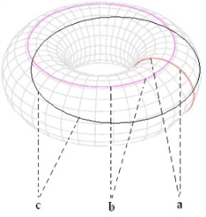
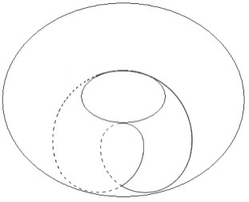
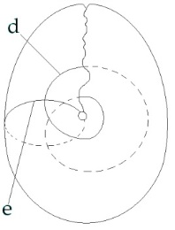
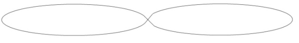
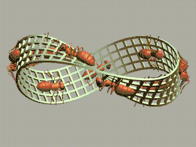
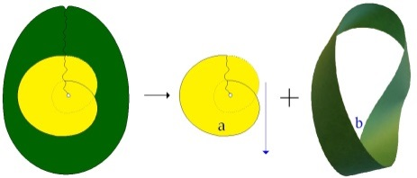
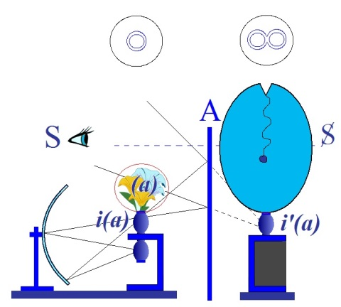
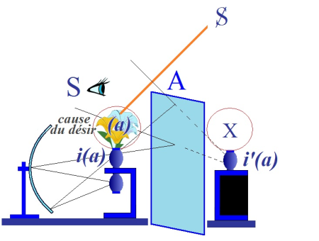
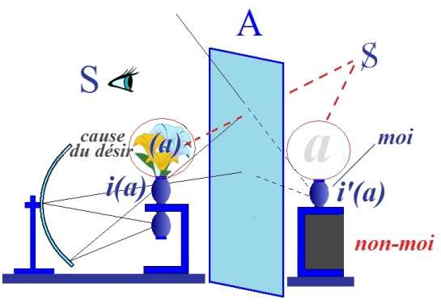

# Leçon 10 | 30 Janvier l963

<!-- source-url: http://staferla.free.fr/S10/S10 L'ANGOISSE.docx -->
<!-- seminar: s10 -->
<!-- lesson: 10 -->

<!-- id: s10-10-0001 -->

L’angoisse, nous enseigne-t-on depuis toujours, *est une crainte sans objet*.
*Chanson !*  déjà pourrions-nous dire ici, où s’est énoncé un autre dis­cours.
*Chanson* qui, pour scientifique qu’elle soit, se rapproche de celle de l’enfant qui se rassure.

<!-- id: s10-10-0002 -->

Car à la vérité, ce que j’énonce pour vous, je le formule ainsi : « *Elle n’est pas sans objet* »*.*
Ce qui n’est pas dire par là que cet objet soit accessible par la même voie que tous les autres.

<!-- id: s10-10-0003 -->

Au moment de le dire, j’ai souligné que ce serait encore une autre façon de se débarrasser de *l’angois­se* de dire qu’un discours...
homologue, semblable, à toute autre part du discours scientifique
...puisse *symboliser* cet *objet*, nous mettre avec lui dans ce rapport du *symbole*, sur lequel - à son propos - nous allons revenir.

<!-- id: s10-10-0004 -->

*L’angoisse* soutient ce rapport de *n’être pas sans objet,* à condition qu’il soit réservé,
que ce n’est pas là dire - ni pouvoir dire - comme pour un autre, de quel objet il s’agit.
Autrement dit, *l’angoisse* nous introduit, avec l’accent de communicabi­lité maximum, à la fonction du *manque*,
en tant qu’elle est, pour notre champ, radicale.

<!-- id: s10-10-0005 -->

Ce rapport au *manque* est si foncier à la constitution de toute logique,
et d’une façon telle qu’on peut dire que *l’histoire de la logique est celle de* *ses réussites à le masquer*.
Ce par quoi elle apparaît comme parente à une sorte de vaste « *acte manqué »*, si nous donnions à ce terme son sens positif.

<!-- id: s10-10-0006 -->

C’est bien pourquoi vous me voyez, par une voie, toujours revenir à ces *paradoxes de la logique*, destinés à vous suggérer les voies,
les portes d’entrée par où se règle, s’impose à nous le *certain style* par où cet acte manqué, nous pourrions, nous, le réussir :
*« ne pas manquer au manque »*.

<!-- id: s10-10-0007 -->

Et c’est pour ça que je pensais introduire une fois de plus mon discours aujourd’hui, par quelque chose
qui bien sûr n’est qu’un apologue, et où vous ne pouvez vous fonder sur aucune analogie à proprement parler
pour y trouver ce qui serait le support d’une situation de ce *manque,*
mais qui pourtant est utile pour en quelque sorte *réouvrir cette dimension* qu’en quelque sorte tout discours...
tout discours de la littérature analytique elle-même
...vous fait, dans les intervalles, je dirai de celui où ici de huit jours en huit jours je vous rattrape,
forcément retrouver l’ornière *de quelque chose qui se clorait* dans notre expérience,
et de quelque *béance* qu’elle entende désigner ce *manque,* y trouverait *quelque chose* que ce discours pourrait *combler*.

<!-- id: s10-10-0008 -->

Donc, petit apologue, le premier qui m’est venu, il y en aurait d’autres, et après tout je ne désire ici qu’aller vite, n’est-ce pas ?
Je vous ai dit en somme, qu’il n’y a de *manque -* dans un temps -
*dans le réel le manque n’est saisissable que par l’intermé­diaire du symbolique*,
c’est au niveau de la bibliothèque, qu’on peut dire : *ici le volume tant manque à sa place*,
cette place qui est une place désignée par, déjà, *l’introduction dans le réel,* du *symbolique*.

<!-- id: s10-10-0009 -->

Et cela, ce *manque ici* dont je parle,
ce *manque* que *le symbole* en quelque sorte comble facile­ment : *il* \[*le symbole*\] *désigne la place, il désigne l’absence, il présentifie ce qui n’est pas là*.
Mais observez : le volume dont il s’agit, à la 1ère page porte...

<!-- id: s10-10-0010 -->

> comme un que j’ai acquis cette semaine, et c’est ça qui m’a inspiré ce petit apologue
> ...à la première page, la notation « *les quatre gravures de tant à tant man­quent* ».

<!-- id: s10-10-0011 -->

Est-ce à dire pour autant, que selon la fonction de « *la double néga­tion* »,
parce que le volume *manque* à sa place,
le *manque* des quatre gravures soit levé, *que les gravures y reviennent  *?

<!-- id: s10-10-0012 -->

Ιl saute aux yeux qu’il n’en est rien.
Ceci peut bien vous paraître un petit peu « *bêta* », mais je vous ferai remarquer que c’est là toute la question de la logique,
la logique transposée dans ces termes intuitifs du schéma eulérien, du *manque inclus*.

<!-- id: s10-10-0013 -->

Quelle est sa posi­tion,
de la famille dans le genre, de l’individu dans l’espèce, qu’est-ce qui constitue, à l’intérieur d’un cercle planifié, *<u>le trou</u>* ?
Si je vous ai fait faire l’année dernière tant de *topologie*, c’est bien pour vous suggérer que *la fonction du trou* n’est pas univoque.

<!-- id: s10-10-0014 -->

Et c’est bien ainsi qu’il faut entendre que toujours s’introduit dans cette voie de la pensée
que nous appelons sous des formes diverses, *métaphoriques*, mais toujours bien se référant à quelque chose : « *planification »*,
cette implication du *plan* tout simple, comme constituant foncièrement le support intuitif de la surface.

<!-- id: s10-10-0015 -->

Or, ce rapport à la surface est infiniment plus complexe.
Et bien sûr, à simplement vous introduire *l’anneau*, *le tore*, vous avez pu voir qu’il suffit d’élaborer *cette surface*,
la plus simple en apparence à imaginer, pour voir, à simplement s’y référer...
à condition que nous la considérions bien comme elle est, comme surface
...de voir que *s’y diversifie* étrangement *la fonction du trou*.

<!-- id: s10-10-0016 -->

Je vous fais observer une fois de plus comment il faut l’entendre,
car puisqu’il qu’il s’agit en effet de savoir *comment un trou peut se remplir, peut se combler*,
vous verrez que n’importe quel cercle dessiné sur cette surfa­ce du tore ne peut pas...
car c’est là le problème
...se rétrécir jusqu’à n’être plus que cette limite évanouissante : *le point*, et disparaître.

<!-- id: s10-10-0017 -->

Car bien sûr, il y a des trous qui pourront... sur lesquels nous pourrons ainsi opérer,
et il suffit que nous dessi­nions notre cercle de la façon suivante : \[a\]...
*si je dessine, c’est pour ne pas autrement m’exprimer*
*...ou de celles-ci :* \[b, c\], pour voir que *ils ne peuvent pas venir à zéro*, *qu’il y a des structures qui ne comportent pas le comblement du trou*.

<!-- id: s10-10-0018 -->

<!-- id: s10-10-0019 -->

L’essence du *cross-cap*, tel que je vous l’ai montré l’année dernière, c’est ceci :
c’est que apparemment, quelque coupure que vous dessiniez sur sa surface...
je ne m’y étendrai pas plus loin, je vous prie d’en faire vous-même l’épreuve
...nous n’aurons pas apparemment cette diversité :

<!-- id: s10-10-0020 -->

- que nous la dessinions cette coupu­re ainsi, qui est l’homologue, au niveau du *cross-cap* \[d\], de la coupure qui sur le *tore* se répète ainsi, c’est-à-dire qui participe des deux autres types de cercle, qui les réunit en elle-même, les deux premiers que je viens de dessiner,

<!-- -->

<!-- id: s10-10-0021 -->

- que vous la dessiniez ici sur le *cross-cap* ainsi : \[d\] ou que vous la dessiniez cette coupure ainsi : \[e\] passant par *ce point terminal* privilégié sur lequel j’ai attiré votre attention l’année dernière...

<!-- id: s10-10-0022 -->

-

<!-- id: s10-10-0023 -->

 

<!-- id: s10-10-0024 -->

...vous aurez toujours quelque chose, qui *en apparence, pourra se réduire à la surface minimum* mais non sans que - *je vous l’ai fait remarquer* - qu’il ne reste à la fin, je répète : *quelle que soit la variété de la coupure,* qu’il ne reste à la fin quelque chose qui se symbolise non pas comme une réduction concentrique, mais irréductiblement sous cette forme :

<!-- id: s10-10-0025 -->

<!-- id: s10-10-0026 -->

ou sous celle-ci qui est la même, et qu’on ne peut pas, comme telle, ne pas *dif­férencier* de ce que j’ai appelé tout à l’heure
*la ponctification concen­trique*.

<!-- id: s10-10-0027 -->

<!-- id: s10-10-0028 -->

C’est en quoi le *cross-cap* a été pour nous une autre voie d’*abord*, à ce qui concerne la possibilité d’*un type irréductible de manque*.
*Le manque est radical, il est radical à la constitution même de la subjectivité* telle qu’elle nous apparaît par la voie de l’expérience analytique.

<!-- id: s10-10-0029 -->

Ce que, si vous le voulez, j’aimerais énoncer en cette formule :

<!-- id: s10-10-0030 -->

« *Dès que ça se sait,* \[*dès*\] *que quelque chose vient au savoir du réel, il y a quelque chose de perdu,*
*et la façon la plus certaine d’approcher ce quelque chose de perdu, c’est de le concevoir comme un morceau de corps.* »

<!-- id: s10-10-0031 -->

Voilà la vérité, qui sous cette forme opaque, massive, est celle que l’expé­rience analytique nous donne,
et qu’elle introduit, *dans son caractère irré­ductible*, dans toute réflexion possible dès lors sur toute forme concevable de notre condition.

<!-- id: s10-10-0032 -->

Ce *point*, faut-il bien dire, comporte assez d’*insoutenable*, pour que nous essayions sans cesse de *le contourner*,
ce qui est sans doute à deux faces, à savoir :

<!-- id: s10-10-0033 -->

- que dans cet effort même nous ne faisons que *<u>plus</u>* en dessiner *les contours*,

<!-- id: s10-10-0034 -->

- et que nous sommes toujours tentés, à mesure même que nous nous rapprochons de *ce contour*, de l’oublier, en fonction même de *la structure* que représente *ce manque*.

<!-- id: s10-10-0035 -->

D’où il résulte - autre vérité - que nous pourrions dire que tout le tournant de notre expérience repose sur ceci :
que le rapport à l’Autre...

<!-- id: s10-10-0036 -->

> en tant qu’il est *ce où se situe* toute possibilité de *sym­bolisation, et* *de lieu du discours*,
> ...rejoint *un vice de structure*, et qu’il nous faut - c’est le pas de plus - concevoir que nous touchons là,
> à ce qui rend *pos­sible* ce rapport à l’Autre, c’est-à-dire *ce d’où surgit qu’il y a du signifiant*.

<!-- id: s10-10-0037 -->

*Ce point d’où surgit qu’il y a du signifiant est celui, qui* en un sens, *ne saurait être signifié*.
C’est là ce que veut dire, ce que j’appelle : *le point* « *manque de signifiant* »*.*

<!-- id: s10-10-0038 -->

Et récemment, j’entendais quelqu’un qui m’entend vraiment pas mal du tout, me répondre,
m’interroger si ce n’est pas là dire que nous nous référons à ce qui de tout signifiant est en quelque sorte *la matière imaginai­re*...
*la forme* du mot ou celle du caractère chinois,
...ce qu’il y a d’*irréductible* à ceci, qu’il faut que tout signifiant ait un support intuitif comme les autres, comme tout le reste ?

<!-- id: s10-10-0039 -->

Eh bien justement non !
Car bien sûr, c’est là ce qui s’offre de tentation à ce propos, ce n’est pas là ce dont il s’agit concernant ce manque.
Et pour vous le faire sentir, je me référerai à des définitions que je vous ai déjà données et qui doivent servir. Je vous ai dit :

<!-- id: s10-10-0040 -->

« *Rien ne manque qui ne soit de l’ordre symbolique. Mais la privation, elle, c’est quelque chose de réel* »*.*

<!-- id: s10-10-0041 -->

Ce dont nous parlons pour l’instant, c’est quelque chose de *réel*.
Ce autour de quoi tourne mon discours quand j’essaie pour vous de représentifier ce point décisif,
pourtant que nous oublions toujours, non seulement dans *notre théorie*, mais dans *notre pratique* de l’expérience analytique,
*c’est une privation* qui se manifeste, tant dans la théorie que dans la pratique, *c’est une privation réelle*,
et qui comme telle, *ne peut être rédui­te*.

<!-- id: s10-10-0042 -->

Est-ce qu’il suffit pour la lever de la désigner ?
Si nous arrivons à la cer­ner scientifiquement, ceci est parfaitement concevable,
il nous suffit de tra­vailler *la littérature analytique*, comme je vous en donnerai tout à l’heure un exemple, à savoir un échantillon.

<!-- id: s10-10-0043 -->

Pour commencer, ça ne peut se faire autrement :
j’ai pris le premier numéro qui m’est tombé sous la main de l’*International journal,*
et je vous montrerai qu’à peu près n’importe où, nous pouvons retrouver le problème dont il s’agit :
qu’on parle de *l’anxiété*, de *l’acting-out,* ou de...
comme c’est le titre de l’article auquel je ferai allusion tout à l’heu­re
...de « *R* »...
il n’y a pas que moi qui me sert de lettres
...« *La Réponse totale* », « *The total response* » de l’analyste dans la situation analytique de quelqu’un qu’il se trouve que nous retrouvons, dont j’ai parlé dans la seconde année de mon séminaire : la nommée Margaret Little[^74].

<!-- id: s10-10-0044 -->

Nous retrouverons, très centré, ce problème et nous pouvons le défi­nir :

<!-- id: s10-10-0045 -->

- *où est-ce que se situe la privation*,

<!-- id: s10-10-0046 -->

- *où est-ce que manifestement elle glisse*, *et à mesure qu’elle entend serrer de plus près le problème que lui pose un certain type de patient*

<!-- id: s10-10-0047 -->

Ce n’est pas cela - *la réduction*, *la privation*, *la symbolisation*, *son articulation -* ici qui lèvera *le manque*.
C’est ce qu’il faut que nous nous mettions bien dans l’esprit,
d’abord et ne serait-ce que pour *comprendre* ce que signifie sous une face, un mode d’apparition de ce *manque*,
je vous l’ai dit : *la privation est quelque chose de réel*.

<!-- id: s10-10-0048 -->

Ιl est clair qu’une femme n’a pas de pénis.
Mais si vous ne symbolisez pas le pénis comme l’élément essentiel *à avoir ou ne pas avoir,* de cette privation elle n’en saura rien.

<!-- id: s10-10-0049 -->

*Le manque* - lui - *est symbolique  *: **S**. \[*ce qui « manque à sa place » dans l’odre symbolique*\]
*La castration* apparaît, le (- φ), au cours de l’analyse, pour autant que ce rapport avec l’Autre,
qui n’a pas attendu l’analyse d’ailleurs pour se constituer, est fondamental.

<!-- id: s10-10-0050 -->

*La castration*, vous ai-je dit, *est symbolique*, c’est-à-dire qu’elle se rapporte à un certain phénomène de *manque,*
et au niveau de cette symbolisation, c’est-à-dire dans le rapport à l’Autre...
pour autant que le sujet a à se constituer dans le discours analytique
...une des formes possibles de l’apparition du *manque* est ici le (- φ), le *support imaginaire* qui n’est qu’une des traductions possibles
du manque originel, du *vice de structure* inscrit dans l’« *être au monde* » du sujet à qui nous avons affaire.

<!-- id: s10-10-0051 -->

Et il est, dans ces conditions, concevable, normal, de s’interroger :
pourquoi amener *jusqu’à un certain point*, et pas au-delà, l’expérience analytique ,
ce *terme* que Freud nous donne comme *dernier*,

<!-- id: s10-10-0052 -->

- du *complexe de castration* chez l’homme - nous dit-il -

<!-- id: s10-10-0053 -->

- ou du *Penisneid* chez la femme, peut être mis en question.

<!-- id: s10-10-0054 -->

Qu’il soit *der­nier* n’est pas nécessaire.
C’est bien pourquoi c’est un chemin d’une approche essentielle de notre expérience, donc,
de concevoir dans sa structure originelle, cette fonction du *manque*.
Et il faut y revenir maintes fois pour ne pas *la man­quer*.

<!-- id: s10-10-0055 -->

Autre fable : l’insecte qui se promène à la surface de *la bande de Mœbius...*
j’en ai maintenant, je pense, assez parlé pour que vous sachiez tout de suite ce que je veux dire
*...*cet insecte peut croire à tout instant...
si cet insecte a la représentation de ce que c’est qu’une surface
...qu’il y a une face, celle tou­jours à l’envers de celle sur laquelle il se promène, qu’il n’a pas explorée, il peut croire à cet envers.

<!-- id: s10-10-0056 -->

<!-- id: s10-10-0057 -->

Or il n’y en a pas, comme vous le savez.
Lui, sans le savoir, explore ce qui n’est pas les deux faces, explore la seule face qu’il y ait.
Et pourtant à chaque instant il y a bien un envers.

<!-- id: s10-10-0058 -->

Ce qui lui manque, pour s’en apercevoir qu’il est passé à l’envers, c’est *la petite pièce man­quante*,
celle que vous dessine cette façon de couper le *cross-cap,* et qu’un jour j’ai matérialisée, pour vous la mettre dans la main, construite, cette *petite pièce man­quante*.

<!-- id: s10-10-0059 -->

C’est *une façon de tourner* ici en court-circuit *autour du point* qui le ramène, par le chemin le plus court,
à l’envers du point où il était l’instant d’avant. Cette petite pièce manquante : le *(a)* dans l’occasion,
est-ce à dire que parce que nous la décrivons sous cette forme paradigma­tique, l’affaire est pour autant résolue ?

<!-- id: s10-10-0060 -->

Absolument pas !
Car c’est qu’elle *manque* qui fait toute la réalité du monde où se promène l’in­secte.

<!-- id: s10-10-0061 -->

 

<!-- id: s10-10-0062 -->

Le petit huit intérieur est bel et bien irréductible, *c’est un manque auquel le symbole ne supplée pas*.

<!-- id: s10-10-0063 -->

Ce n’est pas une *absence*, donc au premier chef, auquel le *symbole* peut parer.
Ce n’est pas non plus *une annulation* ni *une dénégation*, car *annulation et dénégation*...
formes constituées de ce rapport que le *symbole* permet d’intro­duire dans le *réel*, à savoir la définition de l’absence
...*annulation et dénégation*, c’est tentative de défaire ce qui, dans le signi­fiant, nous écarte de l’origine et de ce vice de structure,
*c’est tenter de rejoindre sa fonction de signe*. C’est à quoi pour autant *s’efforce, s’exténue l’obsessionnel*.

<!-- id: s10-10-0064 -->

*Annulation et dénégation* visent donc ce point de manque mais ils ne le rejoi­gnent pas pour autant,
*car ils ne font* - comme Freud l’explique - *que redoubler la fonction du signifiant* en se l’appliquant à elles-mêmes :
et plus je dis que ça n’est pas là, plus ça est là...

<!-- id: s10-10-0065 -->

*La tache de sang*, « *intellectuelle* » ou pas,

<!-- id: s10-10-0066 -->

- que ce soit celle à quoi s’exténue Lady Macbeth,

<!-- id: s10-10-0067 -->

- ou celle que désigne, sous ce terme « *intellectuelle* », Lautréamont, c’est impossible à *effacer* parce que la nature du signifiant est justement ceci : *de s’efforcer d’effacer une trace*. Et plus on cherche à l’*effacer* pour retrouver la *trace*, plus la *trace* insiste comme signifiante.

<!-- id: s10-10-0068 -->

D’où il résulte que nous avons affaire, concernant le rapport à ce comme quoi se manifeste *le (a), cause du désir*,
à une problématique toujours ambiguë.

<!-- id: s10-10-0069 -->

En effet, quand on l’inscrit dans notre schéma - toujours à renou­veler -
il y a *deux modes* sous lesquels, dans le rapport à l’Autre, le *petit(a)* peut apparaître.

<!-- id: s10-10-0070 -->

Si nous pouvons les rejoindre, c’est justement par la fonction de *l’angoisse*, en tant que *l’angoisse*, *où qu’elle se produise*, en est le signal,
et qu’il n’est pas d’autre façon de pouvoir interpréter ce qui, dans *la littératu­re analytique*, nous est dit de *l’angoisse*.

<!-- id: s10-10-0071 -->

Car enfin, observez combien il est étrange de rapprocher ces deux faces du discours analytique :

<!-- id: s10-10-0072 -->

- d’une part, que l’angoisse est la défense majeure la plus radicale et qu’il faut ici que *le discours* à son propos se divise en deux références, l’une au *Réel* pour autant que l’an­goisse est la réponse au danger le plus ori­ginel, à l’insurmontable *Hilflosigkeit,* à *la détresse absolue* de l’entrée au monde,

<!-- id: s10-10-0073 -->

- et que d’autre part elle va pouvoir par la suite, par le *moi*, être reprise pour *signal de dangers infiniment plus légers*, de dangers, nous dit quelque part Jones[^75]...

<!-- id: s10-10-0074 -->

> qui sur ce point fait preuve d’un tact et d’une mesure qui manquent souvent beaucoup à l’emphase du dis­cours analytique, sur ce qu’on appelle *les menaces* de l’*Id,* du *Ça,* de l’*Es*
> ...ce que simplement Jones appelle un *« buried desire », un désir enterré.*

<!-- id: s10-10-0075 -->

Comme il le remarque :
est-ce bien après tout *si dangereux* le retour d’un désir enter­ré, et ça vaut-il la mobilisation d’un *signal* aussi majeur que ce *signal* ulti­me, dernier, que serait *l’angoisse*, si nous sommes obligés, pour l’expliquer, de recourir au danger vital le plus absolu.
Et ce paradoxe se retrouve un peu plus loin, car il n’est pas de discours ana­lytique,
qui après avoir fait de *l’angoisse* le corps dernier de toute défense, ne nous parle pas de défense contre *l’angoisse*.

<!-- id: s10-10-0076 -->

Alors, cet instrument si utile à nous avertir du danger, c’est *contre lui* que nous aurions à nous défendre,
et c’est par là qu’on explique toutes sortes de réactions, de constructions, de formations, dans le champ psychopathologique.

<!-- id: s10-10-0077 -->

Est-ce qu’il n’y a pas là quelque paradoxe, et qui exige de formuler autrement les choses, à savoir que la défense n’est pas
contre l’angoisse, mais contre *<u>ce</u>* dans quoi l’angoisse est le signal, et que ce dont il s’agit, ce n’est pas de défense contre l’angoisse,
mais de ce certain *manque*, à ceci près que nous savons qu’il y a, de ce *manque*, des *structures* différentes et définissables comme telles.

<!-- id: s10-10-0078 -->

<!-- id: s10-10-0079 -->

Que *le manque* du bord simple, de celui du rapport avec l’image narcissique,
n’est pas le même que celui de ce bord redoublé dont je vous parle, et qui se rapporte à la cou­pure plus loin poussée,
à celle qui concerne le *(a)* comme tel, en tant qu’il apparaît, qu’il se manifeste,
*que c’est à lui que nous avons, que nous pou­vons, que nous devons avoir affaire, à un certain niveau du maniement du transfert.*

<!-- id: s10-10-0080 -->

Ici apparaîtra - me semble-t-il mieux qu’ailleurs - que « *le manque de manie­ment* » n’est pas « *le maniement du manque* »[^76],
et que s’il convient de repé­rer, et que vous trouvez toujours, chaque fois qu’un discours est assez loin poussé sur le rapport que nous avons comme Autre à celui que nous avons en analyse, que la question est posée de ce que doit être notre rapport avec ce *(a)*.

<!-- id: s10-10-0081 -->

La béance est manifeste de la mise en question permanente, profonde, que serait en elle-même l’expérience analytique,
renvoyant toujours le sujet à ce quelque chose d’*autre*, par rapport à ce qu’il nous manifeste de quelque nature que ce soit.

<!-- id: s10-10-0082 -->

*Le transfert ne serait*... comme me disait, il n’y a pas long­temps, une de mes patientes : « *Si j’étais sûre que c’était uniquement du transfert* ».

<!-- id: s10-10-0083 -->

La fonction du « *ne que* » : « *ce n’est que du transfert* »...

<!-- id: s10-10-0084 -->

> *en­vers* de : « *Ιl n’a qu’à faire ainsi* », cette *forme* du verbe qui se conjugue,
>
> mais pas comme vous le croyez, celle qui fait dire : « *Ιl n’a qu’avait* »,
>
> qu’on voit spontanément fleurir dans le discours spontané,
> ...c’est l’autre face de ce qu’on nous explique comme étant, semble-t-il, *la charge*, *le fardeau*, du *héros* *analyste*,
> d’avoir à l’intérioriser ce *(a)*, le prendre en lui, « *bon* » ou « *mauvais objet* », mais comme objet interne,
> et que c’est de là que surgirait toute la créa­tivité par où il doit restaurer, du sujet, l’accès au monde.

<!-- id: s10-10-0085 -->

Les deux choses sont *vraies*, encore qu’elles ne soient pas rejointes,
mais que de ne pas les rejoindre c’est justement pour cela qu’on les confond, et qu’à les confondre, rien de clair n’est dit
sur ce qui concerne *le maniement* de cette relation transférentielle, celle qui tourne autour du *(a)*.

<!-- id: s10-10-0086 -->

Et c’est ce qu’explique suffisamment la remarque que je vous ai faite de ce qui distingue
la position du sujet par rapport à ce *(a)*,
et la constitution même comme telle de son désir,
c’est que - pour dire les choses sommairement - s’il s’agit *du pervers* ou *du psychotique*, la relation du *fantasme* S **◊** *a* s’institue ainsi :

<!-- id: s10-10-0087 -->

<!-- id: s10-10-0088 -->

Et que c’est là que pour *manier la rela­tion transférentielle*, nous avons en effet à prendre en nous, à la façon d’un *corps* étranger,
une incorporation dont nous sommes le patient, le *(a)* dont il s’agit, c’est à savoir *l’objet* - au sujet qui nous parle -
absolument étranger en tant qu’il est *la cause de son manque*.

<!-- id: s10-10-0089 -->

<!-- id: s10-10-0090 -->

Dans le cas de *la névrose*, la position est différente
pour autant que, je vous l’ai dit, *quelque chose ici apparaît* qui distingue la fonction du *fantas­me* chez le *névrosé*.
Ici apparaît \[*a*\] quelque chose de son *fantas­me* qui est un *(a)*, et *qui seu­lement le paraît*.

<!-- id: s10-10-0091 -->

Et *qui seulement le paraît* parce que ce *petit(a) n’est pas spé­cularisable*,
et ne saurait ici apparaître, si je puis dire, en personne, mais seu­lement *un substitut*.
Et là seulement s’applique ce qu’il y a de mise en cause profonde de toute authenticité dans l’analyse classique du transfert.

<!-- id: s10-10-0092 -->

Mais ce n’est pas dire que ce soit *là qu’il y ait la cause du transfert*,
et nous avons toujours affaire à *ce petit (a) qui lui, n’est pas sur la scène*, mais qui ne deman­de à chaque instant qu’à y monter
pour y introduire *son discours*, fût-ce à jeter, dans celui qui continue à se tenir sur la scène, à y jeter la pagaille, le désordre, et dire :
« *trêve de tragédie* », comme même aussi bien : « *trêve de comédie* », encore que ce soit un peu mieux.

<!-- id: s10-10-0093 -->

Ιl n’y a pas de drame... Pourquoi est-ce que cet Ajax se met, comme on dit, « *la rate au court-bouillon* » alors qu’après tout,
s’il n’a fait qu’exterminer des moutons, ben c’est tant mieux, c’est quand même moins grave que s’il avait exterminé tous les Grecs. Puis­qu’il n’a pas exterminé tous les Grecs, il est d’autant moins déshonoré et s’il s’est livré à cette manifestation ridicule,
tout le monde sait que c’est parce que Minerve lui a jeté un sort.

<!-- id: s10-10-0094 -->

La comédie est moins facile à exorciser.
Comme chacun sait, elle est plus gaie, et même si on l’exorcise, ce qui se passe sur la scène peut fort bien continuer.
On recommence à la chanson du « *pied de bouc* »[^77], à la vraie histoire dont il s’agit depuis le début, à l’origine du désir.

<!-- id: s10-10-0095 -->

Et c’est bien pour ça d’ailleurs que la tragédie porte en elle-même, dans son terme, dans son nom, sa désignation,
cette référence au *bouc* et au *satyre*, dont d’ailleurs la place était toujours réservée à la fin d’une trilogie :
le bouc qui bondit sur la scène, c’est l’*acting-out.* Et l’*acting-out* dont je parle,
à savoir ce mouvement inverse de ce vers quoi le théâtre moder­ne aspire,
à savoir que les acteurs descendent dans la salle, c’est que les spec­tateurs montent sur la scène et y disent ce qu’ils ont à dire.

<!-- id: s10-10-0096 -->

Et voila pourquoi, quelqu’un comme Margaret Little...

<!-- id: s10-10-0097 -->

> prise parmi d’autres, et je vous l’ai dit, vraiment à la façon dont on peut se bander les yeux
>
> et placer en travers des pages pour faire de la divination, un couteau
> ...Margaret Little dans son article sur *« La réponse totale de l’analyste aux besoins de son patient »,* de Mai-Août l957*, partie* III-IV *du volume* 38*,* poursuit le discours auquel je m’étais déjà arrêté à un point de mon séminaire où cet article n’avait pas enco­re paru.

<!-- id: s10-10-0098 -->

Ceux qui étaient là se souviennent des remarques que j’ai faites,
à propos d’un certain discours angoissé, chez elle, à la fois et tentant de le maîtriser à propos du contre-transfert[^78].

<!-- id: s10-10-0099 -->

Ceux-là sans doute se souviennent que je ne me suis pas arrêté à l’apparence première du problème,
à savoir des effets d’une interprétation inexacte, à savoir qu’un jour, un analyste à un de ses patients qui revient de faire un *broadcast*, un *broadcast* sur un sujet qui intéresse l’analyste lui-même, nous voyons à peu près dans quel milieu ceci a pu se passer, lui dit :

<!-- id: s10-10-0100 -->

« *Vous avez fort bien parlé hier, mais je vous vois aujourd’hui tout déprimé.*
*C’est sûrement de la crainte que vous avez par là, de m’avoir blessé en empiétant sur mes plates-bandes* ».

<!-- id: s10-10-0101 -->

Ιl faut deux ans pour que le sujet s’aperçoive, à propos du retour d’un anniversaire,
que ce qui avait fait sa tristesse était lié au sentiment qu’il avait - en ayant fait ce *broadcast –*
d’avoir en lui ravivé le sentiment de deuil qu’il avait de la mort toute récente de sa mère qui,
dit-il, ne pouvait pas voir ainsi le succès que repré­sentait pour son fils d’être ainsi promu à une position momentanée de vedette.

<!-- id: s10-10-0102 -->

Margaret Little, elle est frappée...
puisque c’est un patient qu’elle a repris de cet analyste
*...*de ceci : qu’effectivement l’analyste n’avait fait, dans son interpré­tation, qu’interpréter ce qui se passait
dans son propre inconscient à lui l’analyste, à savoir qu’effectivement *il était fort marri du succès de son patient*.

<!-- id: s10-10-0103 -->

Ce dont il s’agit pourtant est bien ailleurs, c’est à savoir qu’il ne suffit pas de parler de *deuil*,
et de voir même *la répétition du deuil* où était alors le sujet, de celui que deux ans après il faisait de son analyste,
mais de s’apercevoir de quoi il s’agit dans la fonction du deuil lui-même,
et ici, du même coup, de pousser un peu plus loin ce que Freud nous dit du deuil en tant qu’« *identification à l’objet perdu* ».

<!-- id: s10-10-0104 -->

Ce n’est pas là définition suffisante du deuil.

<!-- id: s10-10-0105 -->

Nous ne sommes en deuil que de quelqu’un dont nous pouvons nous dire « *j’étais son manque* »*,*
nous sommes en deuil de personnes que nous avons, ou bien, ou mal, traitées,
mais vis-à-vis de qui « *nous ne savions pas* » que nous remplissions cette fonction *d’être à la place de son manque*.

<!-- id: s10-10-0106 -->

Ce que nous donnons dans l’amour, c’est essentiellement « *ce que nous n’avons pas* »,
et quand ce « *nous n’avons pas* » nous revient, il y a régression assurément,
et en même temps révélation de ce en quoi nous avons manqué à la person­ne pour représenter ce *manque*.

<!-- id: s10-10-0107 -->

Mais ici, en raison du caractère irréductible de la *méconnaissance* concer­nant *le manque*, cette *méconnaissance* simplement se renverse.
Et à savoir que cette fonction que nous avions *d’être son manque*, nous croyons pouvoir la traduire maintenant en ceci :
que *nous lui avons manqué*, alors que c’était justement en ça que nous lui étions précieux et indispensable.

<!-- id: s10-10-0108 -->

Et voilà ce que je vous demanderai - s’il est possible - ...
cela et un cer­tain nombre d’autres points de références
...de repérer, si vous voulez bien vous y mettre, dans l’article de Margaret Little. C’est une phase ultérieure de sa réflexion,
et assurément considérablement approfondie, sinon améliorée, car améliorée elle ne l’est pas.

<!-- id: s10-10-0109 -->

La définition si problématique du contre-transfert n’est absolument pas avancée,
et je dirai jusqu’à certain point que nous pouvons lui en être reconnaissants,
car si elle s’y était avancée, c’était mathématiquement dans l’erreur.

<!-- id: s10-10-0110 -->

Elle ne veut - vous le verrez - considérer que dès lors que « *<u>La réponse totale</u> de l’analyste* », c’est-à-dire tout :

<!-- id: s10-10-0111 -->

- aussi bien le fait qu’il est là comme *analyste*,

<!-- -->

<!-- id: s10-10-0112 -->

- que des choses à lui *analyste* - comme l’exemple qui est là promu - peuvent de son propre inconscient lui échap­per,

<!-- id: s10-10-0113 -->

- que le fait que, comme tout être vivant, elle éprouve des sentiments au cours de l’analyse,

<!-- id: s10-10-0114 -->

- et qu’enfin, elle ne le dit pas comme ça mais c’est de cela qu’il s’agit, étant l’Autre, elle est dans la position que je vous ai dite la der­nière fois, à savoir, au départ, d’entière responsabilité.

<!-- id: s10-10-0115 -->

C’est donc avec cette classe...
cet *<u>immense total</u>,* comme elle dit, *de sa posi­tion d’analyste*
*...*qu’elle entend devant nous répondre, et répondre honnête­ment sur ce qu’elle conçoit qu’est la réponse de l’analyste.

<!-- id: s10-10-0116 -->

Ιl en résulte... Ιl en résulte qu’elle va aller jusqu’à prendre des positions qui sont les plus contraires...
ce n’est pas dire qu’elles soient fausses
...aux formulations classiques.

<!-- id: s10-10-0117 -->

C’est à savoir que loin de rester hors du jeu, il faut que l’analyste s’y suppose - au principe - engagé jusqu’à la garde,
se considèrer à l’occasion effectivement comme res­ponsable, et en tout cas ne se refusant jamais à témoigner si...
concernant ce qui se passe dans l’analyse
...elle est par exemple, appelée, de son sujet, devant une cour de justice, à répondre !

<!-- id: s10-10-0118 -->

Je ne dis pas que ce ne soit pas là une attitude soutenable, je dis :

<!-- id: s10-10-0119 -->

- que l’évoquer, placer à l’intérieur de cette perspective la fonction de l’analyste est quelque chose qui, assurément, vous paraîtra d’une originalité prêtant à problème,

<!-- id: s10-10-0120 -->

- que les sentiments - j’entends tous les sentiments de l’analyste - peuvent être en quelque occasion mis en demeure, si je puis dire, de se justifier, non seu­lement au propre tribunal de l’analyste, ce que chacun admettra, mais même à l’endroit du sujet, et que le poids de tous les sentiments que peut éprou­ver l’analyste à l’égard de tel ou tel sujet engagé avec lui dans l’entreprise analytique peut avoir, non seulement à être invoqués, mais être pro­mu dans quelque chose qui ne sera pas une interprétation, mais un aveu, entrant par là dans une voie dont on sait que la première introduction dans l’analyse, par Ferenczi, a fait l’objet, de la part des analystes classiques, des plus extrêmes réserves.

<!-- id: s10-10-0121 -->

Assurément, notre auteur fait trois parts parmi les patients auxquels il a affaire.
Comme elle semble admettre le plus large éventail des cas dont elle se charge, nous avons :

<!-- id: s10-10-0122 -->

- d’une part *les psychoses*, où il faut bien qu’elle admette, que ne serait-ce que pour quelques fois l’hospitalisation néces­saire, qu’il faut bien qu’elle se décharge d’une part de ses responsabilités sur d’autres supports.

<!-- id: s10-10-0123 -->

- *Les névroses*, dont elle nous dit que la plus grande part de la responsabilité dont nous nous déchargeons aussi dans les névroses, c’est pour la mettre sur les épaules du sujet, preuve de remarquable lucidité.

<!-- id: s10-10-0124 -->

- Mais entre les deux, les sujets qu’elle définit comme une tierce classe, *névroses de caractère* ou *personnalité réactionnelle*, comme on voudra, ce qu’Alexander définit comme « *neurotic character »* encore*,* bref, tout ce autour de quoi s’élaborent de si problématiques *imitations* classificatoires, alors qu’en réalité il ne s’agit pas d’une espèce de sujet, mais d’une zone du rapport : celle que je définis ici comme *acting-out.*

<!-- id: s10-10-0125 -->

Et c’est bien en effet ce dont il s’agit dans le cas qu’elle va nous développer,
qui est le cas d’un sujet qui est venu à elle parce qu’elle fait des actes que l’on classifie dans le cadre de la kleptoma­nie,
qui pendant un an, d’ailleurs, ne fait pas la moindre allusion à ces vols,
et qui déroule tout un long moment de l’analyse, sous le feu entier et achar­né, de la part de notre analyste,
des interprétations actuelles de transfert les plus répétées, au sens considéré actuellement, dans la voie généralement adoptée, comme ce qui doit, à partir d’un certain moment, être étanché, épongé, sans arrêt, tout au cours de l’analyse.

<!-- id: s10-10-0126 -->

Aucune des interprétations, si subtiles, si variées qu’elle les élabore, n’effleure, même un instant, la défense de ce sujet...

<!-- id: s10-10-0127 -->

Si quelqu’un - je vais terminer la-dessus - veut bien me rendre le service, à une date que nous allons fixer,
d’entrer dans l’exposé détaillé de ce cas, de faire ce quelque chose que je ne puis faire devant vous,
parce que c’est trop long et que j’ai d’autres choses à vous dire,
vous verrez, dans tous ses détails, se manifester la pertinence des remarques que je suis en train de vous faire maintenant.

<!-- id: s10-10-0128 -->

L’analyse ne commence à bouger - nous dit-elle - qu’au moment où un jour, sa patiente arrive la face tuméfiée par les pleurs,
et les pleurs qu’elle verse sur la perte, la mort...
dans un pays qu’elle a quitté depuis longtemps avec ses parents, à savoir l’Allemagne d’alors, l’Allemagne nazie
...d’une per­sonne qui ne se distinguait pas autrement parmi ceux qui avaient veillé sur son enfance,
si ce n’est que c’était une amie de ses parents, et sans doute une amie avec qui elle avait des rapports bien différents
des rapports avec ses parents, car il est un fait qu’elle n’a jamais, de personne, porté un pareil deuil.

<!-- id: s10-10-0129 -->

Devant cette réaction déchaînée, surprenante, quelle est la réaction de notre analyste ?
Assurément celle d’*interpréter*, comme elle fait toujours. Elle les varie encore, histoire de voir celle qui marche.
L’interprétation classique, à savoir :

<!-- id: s10-10-0130 -->

- que ce deuil est un besoin de *rétorsion contre l’objet*,

<!-- id: s10-10-0131 -->

- que ce deuil c’est peut-être adressé à elle, l’analyste,

<!-- id: s10-10-0132 -->

- que c’est une façon, à travers l’écran de la personne dont elle porte le deuil, de lui apporter à elle, l’analyste, tous les reproches qu’elle a à lui faire.

<!-- id: s10-10-0133 -->

Rien ne fonctionne...

<!-- id: s10-10-0134 -->

Un tout petit quelque chose commence à se déclencher quand littéralement l’analyste...
vous le verrez*,* c’est très sensible dans le texte
...avoue devant le sujet qu’« *elle y perd son latin* » et que, la voir comme ça, *ça lui fait de la peine à elle, l’analyste*.

<!-- id: s10-10-0135 -->

Et aussitôt, notre analyste d’en déduire
que c’est là le positif, le réel, le vivant d’un sentiment qui a donné à l’analyse son mouvement...
tout le texte en témoigne assez
...et le sujet choisi, et le style, et l’ordre de son développement, pour que nous puissions dire : ce dont il s’agit...

<!-- id: s10-10-0136 -->

> et qui atteint assurément le sujet, qui fait pour lui, qui lui permet de *transférer*, à proprement parler, dans sa relation à l’analyste, la réaction dont il s’agissait dans ce deuil,
>
> à savoir l’apparition de ceci : qu’il y avait une personne pour qui elle pou­vait être un manque
> ...c’est ce que l’intervention de l’analyste lui fait appa­raître *chez l’analyste*, ceci qui s’appelle *de l’angoisse*.

<!-- id: s10-10-0137 -->

C’est en fonction où nous sommes sur la limite de quelque chose qui désigne dans l’analyse *la place du manque*,
que *cette insertion*, que *cette greffe* si je puis dire, *ce marcottage*...

<!-- id: s10-10-0138 -->

> qui permet à un sujet dont toute la relation avec les parents est définie, vous le verrez dans l’observation,
>
> que sous aucun rapport *il n’a pu se saisir*, ce sujet féminin, *comme un manque*
> *...*trouve ici à s’ouvrir.

<!-- id: s10-10-0139 -->

Ce n’est pas en tant que sentiment positif que l’interprétation...
si on peut l’appeler ainsi, puisqu’on nous le décrit bien dans l’observation,
le sujet ouvre les bras et lâche à cette place
...que cette « interprétation », si on veut l’appeler ainsi, a porté,
c’est en tant qu’introduction, par une voie involon­taire, de quelque chose qui est *ce qui est en question, et qui doit toujours venir en question* à quelque point que ce soit - fût-ce à son terme - dans l’ana­lyse, à savoir *la fonction de la coupure*.

<!-- id: s10-10-0140 -->

Et ce qui va vous permettre de le repérer, de le désigner, c’est que *les tournants qui suivront* - *ceux-là décisifs* - *de l’analy­se, sont* 2 *moments* :
le moment où l’analyste s’armant de courage, au nom de l’idéologie, de la vie, du réel, de tout ce que vous voudrez,
fait tout de même *l’intervention la plus singulière*, à situer comme décisive par rap­port à cette perspective que j’appellerai sentimentale : un beau jour que le sujet lui ressasse toutes ses histoires de différends d’argent...
si mon sou­venir est bon, avec sa mère, elle y revient sans cesse
...l’analyste lui dit en propres termes : « *Écoutez ! Finissez avec ça, parce que littéralement, je ne peux plus l’entendre ! Vous m’endormez* ».

<!-- id: s10-10-0141 -->

La seconde fois...

<!-- id: s10-10-0142 -->

> je ne vous donne pas ça comme un modèle de technique \[*rires*\], je vous demande de lire une observation, de suivre les problèmes qui se posent à une analyste manifestement aussi expérimentée que brûlante d’authenticité
> ...la seconde fois, il s’agit des légères modifica­tions qui ont été faites chez l’analyste, à ce qu’elle appelle *la décoration de son cabinet*...
> si nous en croyons ce qu’est la décoration, en moyenne, chez nos confrères, ça doit être joli \[*rires*\]
> ...déjà notre Margaret Little a été tannée toute la journée par les remarques de ses patients :
> « *C’est bien... c’est mal... ce brun est dégoûtant... ce vert est admirable...* »,
> ...et voilà notre patiente qui rap­plique vers la fin de la journée, nous dit-elle,
> et qui remet ça en termes disons un tout petit peu plus agressifs que les autres, et elle lui dit textuellement :
> « *Écoutez, je me fiche totalement de ce que vous pouvez en penser* ».
> La patiente, je dois dire, comme la première fois, est profondément cho­quée, estomaquée.
> Après quoi, elle ressort de son silence avec des cris d’en­thousiasme : « *Ce que vous avez fait là, c’est formidable* ».

<!-- id: s10-10-0143 -->

Je vous passe les progrès de cette analyse.
Ce que je voudrais simplement ici désigner, c’est qu’à propos d’un cas favorable...
et, si vous voulez, choisi dans une partie du champ parti­culièrement favorable à cette problématique
...ce qui est décisif, dans ce fac­teur de progrès qui consiste à introduire essentiellement la fonction de la coupure, c’est pour autant
qu’elle lui a dit, dans *sa première interprétation décisive :*
« *Vous me faites l’effet, littéralement du bouchon de carafe, vous m’en­dormez !* »
que dans l’autre cas elle l’a littéralement remise à sa place :
« *Pensez ce que vous voudrez de ma décoration, de mon cabinet, moi, je m’en balance !* »
...que quelque chose de décisif a été, dans la relation transférentielle ici en cause, mobilisé.

<!-- id: s10-10-0144 -->

Ceci nous permet de désigner ce dont il s’agit chez ce sujet, le problème pour elle, un de ses problèmes,
est qu’elle n’avait jamais pu faire la moindre *ébauche* de sentiment de deuil à l’égard d’un père qu’elle admirait.
Mais les histoires, vous le verrez, qui nous sont rapportées,
nous montrent que s’il y a quelque chose d’accentué dans ses rapports avec son père c’était bel et bien qu’en aucun cas,
il ne saurait s’agir à son propos d’aucune façon de représenter quelque chose qui pouvait, sous quelque angle que ce soit,
à son père, manquer.

<!-- id: s10-10-0145 -->

Ιl y a une petite promenade avec lui et une scène bien signi­ficative à propos d’un petit bâton de bois,
bien symbolique du pénis, puisque la malade elle-même le souligne, et de façon, semble-t-il, assez innocente,
le père lui balance cette petite badine à l’eau de la façon la moins commentée.

<!-- id: s10-10-0146 -->

Nous ne sommes pas aux *Dimanches de Ville d’Avray* [^79] dans cette histoire.
Et quant à la mère, celle dont il s’agit, dont il s’agit de la façon la plus proche dans le déterminisme des vols,
c’est qu’assurément elle n’a jamais pu faire de cette enfant autre chose qu’une sorte de prolongement d’elle-même,
de meuble, d’instrument, d’instrument de menace et de chantage à l’occasion,
mais en aucun cas quelque chose qui, par rapport à son propre désir, au désir du sujet, aurait pu avoir un rapport causal.

<!-- id: s10-10-0147 -->

C’est pour désigner ceci, à savoir que son désir...
elle ne sait, bien entendu, pas lequel
...pourrait être pris en considération, que chaque fois que

<!-- id: s10-10-0148 -->

- la mère se rapproche,

<!-- id: s10-10-0149 -->

- entre dans le champ d’induction où elle peut avoir quelque effet, le sujet se livre très régulièrement à un vol, *à un vol qui*, comme tous les vols de kleptomane, *n’a aucune signification d’intérêt* particulier, qui veut sim­plement dire : « *je vous montre un objet, un objet que j’ai là ravi par la force ou par la ruse,* *un objet qui veut dire qu’il y a quelque part un autre objet, le mien, le (a),* *celui qui mériterait qu’on le considère, qu’on le laisse un instant s’isoler* »*.*

<!-- id: s10-10-0150 -->

Cette *fonction de l’isolement*, de *l’être-seul*, a le rapport le plus étroit, est en quelque sorte le *pôle corrélatif de cette fonction de l’angoisse*,
vous le verrez dans la suite.
« *La vie...*
nous dit quelque part quelqu’un qui n’est pas analyste : Étienne Gilson
*...l’existence est un pouvoir ininterrompu d’actives séparations* ».

<!-- id: s10-10-0151 -->

*Je pense que vous ne confondrez pas*, après le discours d’au­jourd’hui, cette remarque, avec celle qui est faite d’habitude sur les frustra­tions. Ιl s’agit d’autre chose. Ιl s’agit de *la frontière*, de *la limite* où s’instau­re *la place du* *manque*. \[*cf. « le littoral » de « Lituraterre »*\]

<!-- id: s10-10-0152 -->

Une réflexion continue, je veux dire variée, avec les formes diverses, métonymiques,
où apparaissent dans la clinique « *les points foyers »* de ce *manque*, fera la suite de notre discours.

<!-- id: s10-10-0153 -->

Mais nous ne pouvons pas ne pas le traiter sans cesse avec la mise en question de ce qu’on peut appeler « *les buts de l’analyse* ».
Les positions prises à cet égard sont si instructives, ensei­gnantes, que je voudrais, au point où nous en sommes...
outre cet article sur lequel il y aurait lieu, pour le suivre dans les détails, de revenir
...qu’un autre article d’un nommé Szasz, sur les buts du traitement analy­tique : *On the theory of psychanalytic treatment,*
dans lequel vous verrez qu’est avancé ceci : c’est que les buts de l’analyse sont donnés dans sa règle, et que sa règle,
du même coup ses buts, ne peut se définir que promouvant comme fin dernière de l’analyse...
de toute analyse, qu’elle soit didactique ou pas
...l’initiation du patient à un point de vue *scientifique*, c’est ainsi que s’exprime l’auteur, concernant ses propres mouvements.

<!-- id: s10-10-0154 -->

Est-ce là une définition, je ne dis pas que nous puissions accepter ou repousser,
c’est une des positions extrêmes, c’est une position assurément très *singulière* et *spécialisée*.
Je ne dis pas : « *est-ce là une définition que nous ne puissions accepter ?* »,
je dis : « *qu’est-ce que peut nous apprendre cette défi­nition* ? »

<!-- id: s10-10-0155 -->

Vous en avez ici entendu assez pour savoir qu’*assurément*, s’il y a quelque chose que j’ai mis maintes fois en cause,
c’est justement le rapport du point de vue scientifique...
en tant que sa visée est toujours de considérer le manque comme comblable
...en tout cas, avec la problématique d’une expérience, qui inclut en elle, de tenir compte *du manque* comme tel.

<!-- id: s10-10-0156 -->

Ιl n’en reste pas moins qu’un tel point de vue est utile à repérer,
surtout si on le met en rapport, si on le rapproche d’un article d’une autre analyste, article plus ancien, de Barbara Low,
concernant ce qu’elle appelle les *Entschädigungen, les compensations de la position de l’analyste*.

<!-- id: s10-10-0157 -->

Vous y verrez produite une réfé­rence toute opposée, qui est non pas à celle du *savant* mais à celle de *l’artiste*,
et qu’aussi bien ce dont il s’agit dans l’analyse, c’est quelque chose de tout à fait comparable nous dit-elle...
ce n’est pas certes une analyste moins remarquable pour la fermeté de ses conceptions
...tout à fait comparable, nous dit-elle, à la sublimation qui préside à la création artistique.

<!-- id: s10-10-0158 -->

Est-ce que, avec ces trois textes...
le troisième qui est dans l’*Internazionale Zeitschrift* de l’année 20, enfin de la 20ème année de *l’Internazionale Zeitschrift,*
en allemand, je le tiens, mal­gré sa rareté, à la disposition de celui qui voudrait bien s’en charger
...est ce que nous ne pourrions pas décider, décider que le 20 Février...
qui est le jour où ma rentrée - puisque je vais m’absenter maintenant - est possible, mais non pas certaine
...est-ce que nous ne pourrions pas décider que deux ou trois personnes...
deux personnes qui sont ici et que j’ai interrogées tout à l’heure, pourraient, en faisant, en répartissant entre elles les rôles comme bon leur semblerait, l’un d’exposer, l’autre de critiquer ou de commenter, ou au contraire alternant, comme le chœur, les deux parties que constitueraient ces deux exposés s’opposant
...est-ce que ces deux personnes, s’en adjoignant à l’occasion une troisième pour le troisiè­me article, ce n’est pas impensable,
ne pourraient pas s’engager à ne pas lais­ser trop longtemps ici cette tribune vide et à là reprendre, à ma place si je ne suis pas là,
avec moi dans l’assistance si je reviens, ce problème, à savoir s’occuper exactement des trois articles dont je viens de parler.

<!-- id: s10-10-0159 -->

Je crois avoir obtenu d’eux - il s’agit respectivement de Granoff et de Perrier - leur consentement tout à l’heure.

<!-- id: s10-10-0160 -->

Je vous donne donc rendez-vous pour les entendre, le 20 Février, ici, c’est-à-dire dans exactement trois semaines,
après quoi je reprendrai, le 27, la suite de mes énoncés.
## Notes

[^74]: Cf. Margaret Little : *Le contre-transfert et la réponse qu’y apporte le patient* (1951) p.91, et *« R » La réponse totale de l’analyste aux besoins du patient* (1956),

    p.129, in *Livre-compagnon du séminaire 1962-63 : L’angoisse*, op. cit.

[^75]: Ernest Jones : *Le cauchemar*, op. cit.

[^76]: Cf. « *besoin de répétition* » et « *répétition du besoin* » de D. Lagache in *Le problème du transfert*, op. cit.

[^77]: Cf. Platon : *Cratyle*, Flammarion, 1998, 408c-d. Socrate :

    « *Eh bien, la partie vraie du discours est lisse, divine et réside là-haut chez les dieux, tandis que la partie fausse réside en bas, chez la plupart des hommes, partie rude (trakhú) et tragique (tragikóri) ; car c'est là qu'on a la plupart des mythes et des men­songes : dans la vie tragique* \[...\] *Il serait donc correct que celui qui suggère tout, qui fait toujours tout circuler (pàn aei polên)* \[408d\] *soit Pàn aipôlos (« Pan chevrier »), de nature double en tant que fils d'Hermès, lisse en haut, rude (trakhús) et semblable à un bouc (tragoeidēs) en bas. Et Pan est bien discours,*

    *ou frère du discours, puisqu'il est fils d'Hermès : rien d'étonnant à ce qu'un frère ressemble à son frère. Allons, bonhomme, je le répète : laissons là les dieux !* »

[^78]: Cf. séminaire 1952-53 : *Les écrits techniques de Freud*, Seuil 1975, et Margaret Little : « *Le contre-transfert et la réponse qu’y apporte le patient* » (1951)

[^79]: Film de Serge Bourguignon, 1962. Pierre, un ancien pilote, est devenu amnésique à la suite d’un accident d’avion en Extrême-Orient. Madeleine, une amie,

    lui consacre toute sa vie et sa tendresse de femme seule. Un jour, en la raccompagnant à la gare de Ville-d’Avray, Pierre rencontre Françoise, une orpheline

    de dix ans, qui vit chez les sœurs. Il se prend d’amitié pour la fillette. Puis se faisant passer pour son père, il lui rend visite tous les dimanches. Une tendre et

    pure complicité s’établit entre eux. Mais cette relation fait bientôt scandale dans la ville.
