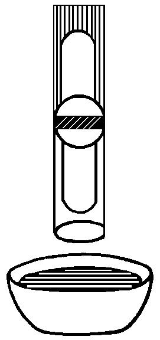
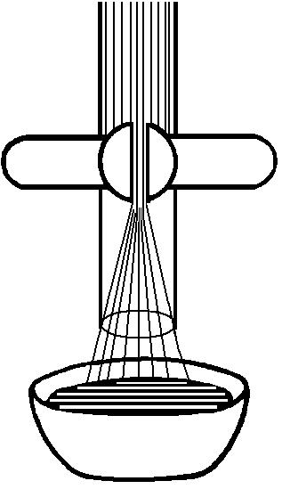
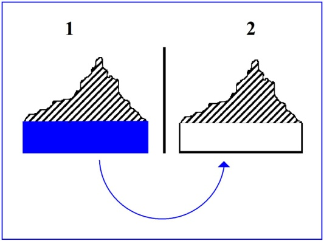
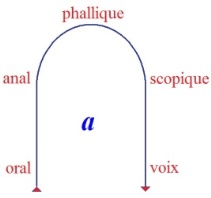
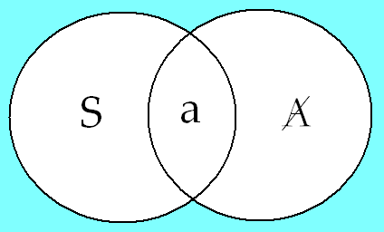
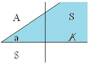
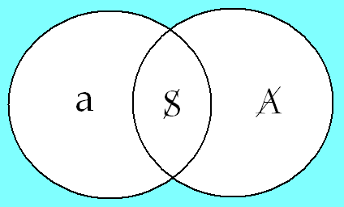
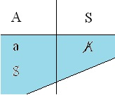
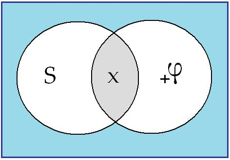

# Leçon 22 | l2 Juin l963

<!-- source-url: http://staferla.free.fr/S10/S10 L'ANGOISSE.docx -->
<!-- seminar: s10 -->
<!-- lesson: 22 -->

<!-- id: s10-22-0001 -->

L’angoisse gît dans ce rapport fondamental où le sujet est dans ce que j’ai appelé jusqu’ici *le désir de l’Autre*, avec un grand A.
L’analyse a, a toujours eu et garde pour objet, *la découverte d’un* *désir*.

<!-- id: s10-22-0002 -->

C’est - vous l’admettrez - pour quelques rai­sons structurales, que je suis amené cette année,
à dégager, à faire fonction­ner comme tel, à cerner, à articuler ceci,

<!-- id: s10-22-0003 -->

- autant par la voie d’une définition, disons *algébrique*, d’une articulation où la fonction apparaît dans une sorte *de béance, de gap, de résidu, de la fonction signifiante* comme telle,

<!-- id: s10-22-0004 -->

- mais je le fais aussi, touche par touche, au moyen d’exemples : c’est la voie que je prendrai aujourd’hui.

<!-- id: s10-22-0005 -->

Dans toute avancée, dans tout avènement de ce *petit(a)* comme tel,
l’angoisse apparaît justement en fonction de son rapport au *désir de l’Autre*.

<!-- id: s10-22-0006 -->

Mais son rapport au *désir du sujet*, quel est-il ?
Il est situable sous la formule que j’ai avancée en son temps :
*petit(a) n’est pas « l’objet » du désir*, celui que nous cherchons à révéler dans l’analyse, *il en est « la cause »* [^158].

<!-- id: s10-22-0007 -->

Ce trait est essen­tiel, car si l’angoisse marque la dépendance de toute constitution du sujet, *sa dépendance de l’Autre*, avec un grand A
le *désir du sujet* se trouve donc *appendu* à cette relation par l’intermédiaire de la constitution première, antécédente du *petit(a)*.
C’est là l’intérêt qui me pousse à vous rappeler comment s’annonce *cette présence du petit(a) comme cause du désir*.
Dès les premières données de la recherche analytique, il s’annonce d’une façon plus ou moins voilée, juste­ment,
dans « *la fonction de la cause* ».

<!-- id: s10-22-0008 -->

Cette fonction est repérable dans les données premières de notre champ, celui sur lequel s’engage la recherche,
c’est à savoir *le champ du symptôme*.

<!-- id: s10-22-0009 -->

Dans tout *symptôme*, en tant qu’un terme de ce nom est ce qui nous intéresse,
cette dimension que je vais essayer de faire jouer devant vous aujourd’hui, se manifeste.

<!-- id: s10-22-0010 -->

Pour vous le faire sentir, je partirai d’un symp­tôme dont ce n’est pas pour rien qu’il a - vous le verrez après coup –
cette fonction exemplaire, c’est à savoir : du symptôme de *l’obsessionnel*.

<!-- id: s10-22-0011 -->

Mais, je l’indique dès à présent, si je l’avance, c’est qu’il nous permet d’entrer dans ce repérage de la fonction de *petit(a)*,
en tant qu’il se dévoile, fonc­tionnant dès les données premières du *symptôme* dans *la dimension de la cause*.

<!-- id: s10-22-0012 -->

Qu’est-ce que *l’obsessionnel* nous présente sous la forme *pathognomo­nique,* si je puis dire, de sa position ?
C’est *l’obsession* ou *compulsion*, pour lui articulée ou non en une motivation dans son langage intérieur :
« *va faire ceci ou cela, véri­fier que la porte est ou non fermée, ou le robinet...* », nous verrons peut-être tout à l’heure.

<!-- id: s10-22-0013 -->

C’est que ce symptôme qu’il prend sous sa forme la plus exemplaire,
implique que la non-suite, si je puis dire, de sa « ligne », éveille l’angoisse.

<!-- id: s10-22-0014 -->

C’est là ce qui fait que le symptôme, je dirai nous « *indique »* dans son phénomène même
que nous sommes au niveau le plus favorable pour lier la position de *petit(a),*
autant aux rapports d’angoisse, qu’aux rapports de désir :

<!-- id: s10-22-0015 -->

- l’angoisse apparaît en effet,

<!-- id: s10-22-0016 -->

- pour *le désir *: au départ, avant la recherche freudienne historiquement, avant l’analyse dans notre *praxis*, il est caché, et nous savons quelle peine nous avons à le démasquer, si nous le démasquons jamais !

<!-- id: s10-22-0017 -->

Mais ici mérite d’être mise en valeur cette donnée de notre expé­rience qui apparaît dès *les toutes premières observations de* Freud,
et qui, je dirai, constitue...
même si on ne l’a pas repérée comme telle
...peut–être le pas le plus essentiel dans l’avancée dans la névrose obsessionnelle.

<!-- id: s10-22-0018 -->

C’est que Freud, et nous-mêmes tous les jours, avons reconnu, pouvons reconnaître ce fait :
que la démarche analytique ne part pas de *l’énoncé du symptôme* tel que je viens de vous le décrire, c’est-à-dire selon sa forme classique, celle qui était déjà définie depuis toujours : la compulsion avec la lutte anxieuse qui l’accompagne,
mais de la reconnaissance de ceci : « *que ça fonctionne çomme ça* ».

<!-- id: s10-22-0019 -->

Cette reconnaissance n’est pas un effet détaché du fonctionne­ment de ce *symptôme*,
ça n’est pas épiphénoménalement que le sujet a à *<u>s’apercevoir</u>* que « *ça fonctionne çomme ça* ».

<!-- id: s10-22-0020 -->

Le *symptôme* n’est constitué que quand le sujet s’en aperçoit,
car nous savons par expérience qu’il est des formes de comportement obsessionnel où le sujet,

<!-- id: s10-22-0021 -->

- ce n’est pas seulement qu’il n’a pas repéré *ses obsessions*,

<!-- id: s10-22-0022 -->

- c’est qu’il ne les a pas constituées comme telles, et le premier pas dans ce cas de l’analyse... des passages de Freud [^159] là-dessus sont célèbres ...est que le *symptôme* se constitue dans *sa forme classique*.

<!-- id: s10-22-0023 -->

Sans ça, il n’y a pas moyen d’en sortir,

<!-- id: s10-22-0024 -->

- et non pas simplement parce qu’il n’y a pas moyen d’en parler,

<!-- id: s10-22-0025 -->

- parce qu’il n’y a pas moyen de l’attraper par les oreilles.

<!-- id: s10-22-0026 -->

Qu’est-ce que c’est que *l’oreille* en question ?
C’est ce *quelque chose* que nous pouvons appeler le *non-assimilé* - par le sujet - *du symptôme*.

<!-- id: s10-22-0027 -->

Pour que le symptôme sorte de l’état d’énigme qui ne serait pas encore formulée, le pas n’est pas qu’il se formule,
c’est que dans le sujet *quelque chose* se dessine dont le caractère est qu’il lui est suggéré « *qu’il y a une cause à ça* ».

<!-- id: s10-22-0028 -->

C’est *<u>là</u>* la dimension originale, ici prise dans la forme du phénomène, dont je vous montrerai *où* ailleurs on peut la retrouver.
Cette dimension « *qu’il y a une cause à ça* », où seulement l’implication du sujet dans sa conduite se rompt.
Cette *rupture* est cette complémentation nécessaire pour que le symptôme pour nous soit abordable.

<!-- id: s10-22-0029 -->

Ce que j’entends vous dire et vous montrer,
c’est que ce *<u>signe</u>* ne constitue pas un pas dans ce que je pourrais appeler l’intelligence de la situation,
qu’il est quelque chose de plus : qu’il y a une raison pour que ce pas soit essentiel dans la cure de l’obsessionnel.

<!-- id: s10-22-0030 -->

Ceci est impossible à articuler si nous ne *manifestons* pas d’une façon tout à fait radicale la relation

<!-- id: s10-22-0031 -->

- de la fonction de *(a)*, *cause du désir*,

<!-- id: s10-22-0032 -->

- à la dimension mentale, comme telle, de *la cause*.

<!-- id: s10-22-0033 -->

Ceci, je l’ai déjà indiqué dans les apartés, si je puis dire, de mon discours, et l’ai écrit quelque part
en un point que vous pourrez retrouver de l’article « *Kant avec Sade »* [^160] qui est paru dans le numéro d’Avril de la revue *Critique.*
C’est là-dessus que j’entends faire jouer aujourd’hui le principal de mon discours.

<!-- id: s10-22-0034 -->

Dès maintenant, vous en voyez l’intérêt, qui est de marquer, rendre vrai­semblable que cette *dimension de la cause* indique...
et seule indique
...l’émergence, la présentification dans des données de départ de l’analyse de *l’obsessionnel,* de ce *petit(a) autour de quoi...*
c’est là l’avenir de ce que pour l’instant, j’essaie de vous expliquer
...*autour de quoi doit tourner toute ana­lyse du transfert* pour ne pas être obligée, nécessitée, à tourner dans un cercle.

<!-- id: s10-22-0035 -->

Un cercle, certes, n’est pas rien : le circuit est parcouru, mais il est clair qu’il y a...
c’est pas moi qui l’ai énoncé
...un problème de la « *fin de l’ana­lyse* », celui qui s’énonce ainsi : « *l’irréductibilité d’une névrose de transfert* ».

<!-- id: s10-22-0036 -->

Cette *névrose de transfert* est, ou n’est pas la même que celle qui était détec­table au départ.
Assurément elle a cette différence d’être tout entière pré­sente,
elle nous apparaît quelquefois *en impasse*, c’est-à-dire aboutit à une parfaite stagnation des rapports de l’analysé à l’analyste.
Elle n’a en somme de différence à tout ce qui pouvait se produire d’*analogue* au départ de l’ana­lyse,
que d’être toute entière rassemblée.

<!-- id: s10-22-0037 -->

On entre dans l’analyse par une porte énigmatique, car la *névrose de transfert* chez tout un chacun, même chez Alcibiade, est là :
c’est Agathon qu’il aime. Même chez un être aussi libre qu’Alcibiade, transfert évi­dent,
encore que cet amour soit ce qu’on appelle un « *amour réel »*.

<!-- id: s10-22-0038 -->

Ce que nous appelons trop souvent « *transfert latéral* », c’est là qu’est le transfert.
L’étonnant, c’est qu’on entre dans l’analyse malgré tout cela qui nous retient dans le transfert fonctionnant comme *réel*.

<!-- id: s10-22-0039 -->

Le vrai sujet d’étonne­ment concernant le circuit de l’analyse,
c’est comment - y entrant *malgré* la névrose de transfert *-* on peut obtenir à la sortie la *névrose de transfert* elle-même.
Sans doute est-ce parce qu’il y a quelque malentendu concernant l’analyse du transfert.

<!-- id: s10-22-0040 -->

Sans cela, on ne verrait pas se manifester cette satis­faction quelquefois et que j’ai entendue exprimer,
qu’avoir donné forme à cette névrose de transfert : « *ce n’est peut-être plus la perfection, mais c’est tout de même un résultat* ».
C’est vrai : « *c’est tout de même un résultat* » lui-même assez perplexifiant.

<!-- id: s10-22-0041 -->

Si j’énonce que la voie passe par *petit(a),* seul objet à proposer à l’analyste, à l’analyse du transfert,
ceci ne veut pas dire que ça ne laissera pas ouvert, vous le verrez, un autre problème.

<!-- id: s10-22-0042 -->

C’est justement dans cette soustraction que peut appa­raître cette dimension essentielle :
celle *d’une question* depuis toujours posée en somme, mais certainement pas résolue...
car chaque fois qu’on la pose, l’insuffisance des réponses est vraiment sensible, évidente, éclatante à tous les yeux
...celle du « *désir de l’analyste* ».

<!-- id: s10-22-0043 -->

Ce bref rappel - pour vous montrer l’intérêt de l’enjeu présent - ce bref rap­pel étant fait, revenons à *petit(a).*

<!-- id: s10-22-0044 -->

*Petit(a) est la cause, la cause du désir*.
Je vous ai indi­qué que ce n’est pas une mauvaise façon de le comprendre
que de revenir à l’énigme que nous propose le fonctionnement de *la catégorie de la cause*.

<!-- id: s10-22-0045 -->

Car enfin, il est bien clair que quelque critique, quelque effort de réduc­tion, phénoménologique ou pas, que nous lui appliquions, *cette catégorie fonctionne*, et non pas comme une étape seulement archaïque de notre développement.

<!-- id: s10-22-0046 -->

Ce qu’indique la façon dont j’entends le rapporter ici à la fonction originelle de l’objet *petit(a)* comme *cause du désir*,
signifie le transfert de la question de la catégorie de causalité :

<!-- id: s10-22-0047 -->

- de ce que j’appellerai avec Kant « *l’esthétique transcendantale »,*

<!-- id: s10-22-0048 -->

- à ce que, si vous voulez bien y consentir, j’appellerai mon « *éthique transcendantale ».*

<!-- id: s10-22-0049 -->

Et là je suis forcé de m’avancer dans un terrain dont je suis forcé, enfin de donner simplement,
de balayer les côtés latéraux avec un projecteur, sans pouvoir même insis­ter.

<!-- id: s10-22-0050 -->

Il conviendrait - dirais-je - que les philosophes fissent leur travail et s’aper­çoivent par exemple, et osent formuler,
quelque chose qui nous permettrait de situer vraiment à sa place, cette opération que j’indique
en disant que j’extrais « *la fonction de la cause* » du champ de *l’esthétique transcendantale,* de celle de Kant[^161].

<!-- id: s10-22-0051 -->

Iil conviendrait que d’autres vous indiquent que ce n’est là qu’une extraction, en quelque sorte toute *pédagogique*,
parce qu’il y a bien des choses, d’autres, qu’il convient d’extraire de cette *esthétique transcendantale.*

<!-- id: s10-22-0052 -->

Et là, il faut que je fasse, au moins à l’état d’indication, ce que j’ai réussi par un tour de passe-passe à éluder la dernière fois,
quand je vous parlais du champ scopique du désir, je ne peux pas y couper, il faut tout de même bien que je dise,
que j’indique ici,au moment même où je m’avance plus loin, ce qui était impliqué dans ce que je vous disais, à savoir :
*que l’espace n’est pas du tout une catégorie « a priori » de l’intuition sensible*.

<!-- id: s10-22-0053 -->

Il est très étonnant, qu’au point d’avancement où nous en sommes de *la science*,
que personne ne se soit encore attaqué directement à ceci à quoi tout nous sollicite :
à for­muler que *l’espace* n’est pas un trait de notre constitution subjective,
au-delà de quoi « *la chose en soi* » trouverait, si l’on peut dire, un champ libre.

<!-- id: s10-22-0054 -->

À savoir, que l’espace fait partie du *réel*, et qu’après tout, dans ce que j’ai énon­cé, articulé, dessiné,
ici devant vos yeux l’année dernière avec toute cette topologie, il y a quelque chose, dont heureusement certains ont senti la note : cette dimension « *topologique »,* en ce sens que son maniement symbo­lique transcende l’espace, a évoqué à beaucoup,
pas seulement à certains, tant de formes qui nous sont présentifiées par les schémas du développe­ment de l’embryon.

<!-- id: s10-22-0055 -->

Ces formes singulières par cette commune et singulière *Gestalt* qui est la leur...
et qui nous porte bien bien loin de la direction où la *Gestalt* est avancée,
c’est-à-dire dans la direction de *la bonne forme*,
...nous montrent au contraire quelque chose qui se reproduit partout, et dont, dans une notation impressionniste, je dirai
qu’elle est sensible dans une sorte de « *torsion* », à laquelle l’organisation de la vie semble l’obliger pour se loger dans l’espace réel.

<!-- id: s10-22-0056 -->

La chose est partout présente dans ce que je vous ai expliqué l’année der­nière et aussi bien cette année,
car c’est justement en ces « *points de torsion* » que se produisent aussi les « *points de rupture* »
dont j’essaie de vous montrer la portée dans plus d’un cas, d’une façon liée à notre propre topologie,

<!-- id: s10-22-0057 -->

- celle du *grand* S,

<!-- id: s10-22-0058 -->

- du *grand* A,

<!-- id: s10-22-0059 -->

- et du *petit(a)*, d’une façon qui *soit plus efficace, plus vraie, plus confor­me* au jeu des fonctions, que tout ce qui est repéré dans la doctrine de Freud, de cette façon dont les différences, les vacillations sont elles-mêmes déjà *indicatives de* la nécessité de ce que je fais là, celle qui est liée à *l’ambiguïté* chez lui, par exemple, des relations : « *moi – non moi », « contenu – contenant », « moi­ – le monde extérieur »*.

<!-- id: s10-22-0060 -->

Toutes ces *divisions*, il saute aux yeux qu’elles ne se recouvrent pas.
Pourquoi ?
Il faut avoir saisi de quoi il s’agit dans *la topologie* et d’avoir trouvé d’autres repères :
cette *topologie subjective*, qui est ici celle que nous explorons.

<!-- id: s10-22-0061 -->

J’en finis avec cette indication...
dont je sais au moins que certains savent très bien la por­tée à m’avoir entendu maintenant
...que *la réalité de l’espace*, en tant qu’*es­pace à trois dimensions*, c’est là quelque chose d’essentiel à saisir, pour défi­nir la forme que prend...
au niveau de l’étage que j’ai essayé d’éclairer dans nos dernières leçons, sous *la fonction de l’étage scopique*
...la forme qu’y prend *la présence du désir, nommément comme fantasme*.

<!-- id: s10-22-0062 -->

C’est à savoir que ce que j’ai essayé de définir dans la structure du *fantasme*,
à savoir que la fonction du *cadre*, entendez de *la fenêtre,* n’est pas une métaphore : *si le cadre exis­te, c’est parce que l’espace est réel*.

<!-- id: s10-22-0063 -->

Pour ce qui est de *la cause*, essayons d’appréhender dans ceci même qui est « *la broussaille commune* » laissée chez vous

<!-- id: s10-22-0064 -->

- par les connaissances qui vous sont léguées d’un certain « *brouhaha de discussions philosophiques* »,

<!-- id: s10-22-0065 -->

- par le passage à travers une classe désignée de ce nom : philosophie, qu’il est bien clair qu’un indice sur cette origine de la « *fonction de la cause* » nous est très claire­ment donné dans l’histoire par ceci : c’est que c’est à mesure de la critique de cette « *fonction de la cause* », de la tentative de remarquer qu’elle est *insaisis­sable*, que ce « *propter hoc »* [^162] est forcément toujours au moins un « *post hoc »*, et qu’est-ce qu’il faut que ce soit d’autre pour équivaloir à cet *incompréhensible [propter hoc](http://fr.wikipedia.org/wiki/Post_hoc_ergo_propter_hoc),* sans quoi d’ailleurs nous ne pouvons même pas commencer à articuler *quoi que ce soit*.

<!-- id: s10-22-0066 -->

Mais bien sûr, cette critique a sa fécondité et on la voit dans l’histoire :
plus la cause est critiquée, plus les exi­gences qu’on peut appeler celles du déterminisme se sont imposées à la pen­sée,
moins la cause est saisissable, plus tout apparaît « *causé »* jusqu’*au der­nier terme* celui qu’on a appelé le « *sens de l’histoire* ».

<!-- id: s10-22-0067 -->

Je ne veux rien dire d’autre que « *tout est causé* »*,* à ceci près que tout
ce qui s’y passe préside, est départ toujours d’un « *assez causé* » au nom de quoi se reproduit, dans l’histoire, un commencement que
je n’oserai pas appeler *absolu* mais qui était certainement inattendu, et qui donne le classique fil à retordre aux *prophètes nachträglich,*
qui sont - qui donne le pain quo­tidien, aux dits *prophètes -* qui sont les « *interprétateurs professionnels du sens de l’histoire* ».

<!-- id: s10-22-0068 -->

Alors, cette « *fonction de la cause* », disons sans plus comment ici nous l’envi­sageons,
nous l’envisageons *cette fonction partout présente dans notre pensée de la cause.*

<!-- id: s10-22-0069 -->

Je dirai d’abord pour me faire entendre : *l’ombre portée,* mais très précisément et mieux *la métaphore* de cette *cause primor­diale...*
substance de cette « *fonction de la cause* »
...qui est précisément le *petit(a)* en tant qu’antérieur à toute cette phénoménologie.

<!-- id: s10-22-0070 -->

*Petit(a),* nous l’avons défini comme *le reste de la constitution du sujet au lieu de l’Autre*, en tant qu’il a à se consti­tuer en sujet barré \[S\].

<!-- id: s10-22-0071 -->

Si le symptôme est ce que nous disons,
c’est-à-dire tout entier implicable dans ce processus de la constitution du sujet en tant qu’il a à se faire au lieu de l’Autre, l’implication de *la cause* dans l’avènement symptomatique, tel que je vous l’ai défini tout à l’heure,
fait partie légitime de cet avènement.

<!-- id: s10-22-0072 -->

Ceci veut dire que *la cause*, impliquée dans la question du *symptôme*, est littéralement,
si vous le voulez, une question, mais dont le *symptôme* n’est pas *l’effet*, il en est le *résultat*. *L’effet, c’est le désir*.

<!-- id: s10-22-0073 -->

Mais c’est un *effet* unique et tout à fait étrange en ceci que c’est lui qui va nous expliquer, ou tout au moins nous faire entendre,
toutes les difficultés qu’il y a eu à lier la relation commune qui s’impose à l’esprit de « *la cause à l’effet* ».

<!-- id: s10-22-0074 -->

C’est que l’ef­fet primordial de cette cause : *petit(a),*
au niveau du *désir*, cet effet qui s’appelle le *désir* est cet effet que je viens de qualifier d’*étrange* en ce que...
remarquez-le, puisque c’est justement le *désir*
...c’est un effet qui n’a rien d’« *effectué* ».

<!-- id: s10-22-0075 -->

Le *désir*, pris dans cette perspective, se situe en effet essentiellement comme *un manque d’effet*.
La cause, ainsi, se constitue comme supposant des effets, de ce fait que *primordialement l’effet y fait défaut*.

<!-- id: s10-22-0076 -->

Et ceci se retrouve - vous le retrouverez - dans toute sa phénoménologie.
Le *gap* entre *la cause et l’ef­fet*, à mesure qu’il est comblé...
c’est bien cela tout ce qui s’appelle, dans une certaine perspective, le progrès de la Science
...fait s’évanouir la « *fonction de la cause* », j’entends : là où il est comblé.

<!-- id: s10-22-0077 -->

Aussi bien l’explication de *quoi que ce soit* aboutit, à mesure qu’elle s’achève, à n’y laisser que *des connexions signifiantes*,
à volatiliser ce qui l’*a-nimait* dans son principe, ce qui a poussé à s’expliquer, c’est-à-dire ce qu’on ne comprend pas, *la béance effective*.
Et il n’y a pas de cause qui se constitue dans l’esprit, comme telle, qui n’implique cette *béance*.

<!-- id: s10-22-0078 -->

Ça peut - tout ça - vous sembler bien super­flu.
Néanmoins, c’est ce qui permet de saisir ce que j’appellerai « *la naïveté* » de certaines recherches de psychologues,
et nommément de celles de Piaget.

<!-- id: s10-22-0079 -->

Les voies où je vous mène cette année, vous l’avez déjà vu s’annoncer,
passent par une certaine évocation de ce que Piaget appelle « le *langage égocentrique *».

<!-- id: s10-22-0080 -->

Comme Piaget le reconnaît lui-même...
il l’a écrit, ici je ne l’interprète pas
...son idée de « *l’égocentrisme »* d’un certain discours enfantin part de cette supposition :
il croit avoir démontré que les enfants ne se com­prennent pas entre eux, qu’ils parlent pour eux-mêmes.

<!-- id: s10-22-0081 -->

Le monde de sup­positions qu’il y a là-dessous est, je ne dirai pas insondable, on peut en pré­ciser la majeure :
c’est une supposition excessivement répandue, c’est-à-dire que la parole est faite pour communiquer. Ça n’est pas vrai !

<!-- id: s10-22-0082 -->

Si Piaget ne peut pas saisir cette sorte de *gap,* là encore, qu’il désigne pourtant bien lui-même...
et c’est vraiment l’intérêt de la lecture de ses travaux
…je vous supplie, d’ici que j’y revienne - ou que je n’y revienne pas - de vous emparer de « *Le langage et la pensée chez l’enfant »*
qui est somme toute, un livre admirable.

<!-- id: s10-22-0083 -->

Il illustre à tout instant combien ce que Piaget recueille de faits, dans cette démarche, aberrante en son principe,
est démonstratif de tout autre chose que de ce qu’il pense.
Naturellement, comme il est loin d’être un sot, il arrive que ses propres remarques, à lui, Piaget, soient dans cette voie même,
en tous les cas, par exemple le problème de savoir pourquoi ce langage du sujet, et fait essentiellement pour lui,
ne se produit jamais en groupe.

<!-- id: s10-22-0084 -->

Ce qu’il manque, je vous prie de lire ces pages, parce que je ne peux pas les dépouiller avec vous, mais à chaque instant vous verrez comment la pensée glisse, adhère à une position de la question qui est justement celle qui voile le phénomène
par ailleurs très clairement manifesté, et l’essentiel en est essentiellement ceci :
qu’autre chose est de dire que la parole a essentiellement pour effet de communiquer,

<!-- id: s10-22-0085 -->

- alors que l’effet de la parole, l’effet du signifiant, est de faire surgir, dans le sujet, la dimension du « signifié », essentiellement.

<!-- id: s10-22-0086 -->

Je vais y revenir, s’il le faut, une fois de plus.

<!-- id: s10-22-0087 -->

Que ce rapport à l’Autre qu’on nous dépeint ici comme la clé, sous le nom de socialisation du langage,
la clé du point tournant entre « *langage égocentrique* » et le langage achevé, dans sa fonction,
ce point tour­nant n’est pas un point d’effet, d’impact effectif, il est dénommable comme « *désir de communiquer »*.

<!-- id: s10-22-0088 -->

C’est bien d’ailleurs parce que ce désir est déçu chez Piaget - la chose est sensible –
que toute sa pédagogie, ici, vient dresser ses appareils et ses fantômes.
Assez « pincé » en somme que l’enfant lui apparaisse ne le comprendre qu’à demi, il ajoute : « *Ils ne se compren­nent même pas entre eux* ».

<!-- id: s10-22-0089 -->

Mais est ce que c’est là la question ?
La ques­tion, on voit très bien dans son texte, comment elle n’est pas là.
On le voit à la façon dont il articule ce qu’il appelle « *compréhension entre enfants* ».

<!-- id: s10-22-0090 -->

Vous le savez, voilà comme il procè­de : il commence par prendre par exemple le *schéma* suivant,
qui va être celui dépeint sur une image qui va être le support des explications, *le schéma d’un robinet*.
Ça donnera quelque chose d’à peu près comme ça, ceci étant les branches du robinet,
on dira à l’enfant, en autant de points qu’il le faudra :

<!-- id: s10-22-0091 -->

> « *Tu vois, le petit tuyau, ici - qu’on appellera aussi la porte et de bien d’autres façons encore - il est bouché ce qui fait que l’eau qui est*
>
> *là ne peut pas couler au travers pour venir ici se vider dans ce qu’on appellera aussi, d’une certaine façon, l’issue, etc*… »

<!-- id: s10-22-0092 -->

Il explique ! Voilà ce schéma, si vous voulez le contrôler :

<!-- id: s10-22-0093 -->

 

<!-- id: s10-22-0094 -->

Il a cru d’ailleurs, je vous le signale en passant, devoir compléter lui-même, par la présence de la cuvette de caoutchou,
et qui n’inter­viendra absolument pas dans les six ou neuf, sept points qu’il lui donne de l’explication.

<!-- id: s10-22-0095 -->

Il va être tout à fait frappé de ceci : c’est que l’enfant répète fort bien tous les termes de l’explication que lui, Piaget, lui a donnée.
Cet enfant, il va s’en servir comme *d’explicateur* pour un autre enfant, qu’il appellera bizarrement, *le reproducteur* !

<!-- id: s10-22-0096 -->

Premier temps : il remarque, non sans quelque étonnement, que ce que l’enfant a si bien répété,
ce qui pour lui va sans dire que cela veut dire qu’il a compris...
je ne dis pas qu’il a tort, je dis que Piaget ne se pose même pas la question
...que ce que l’enfant lui a répété, à lui, Piaget, dans l’épreuve qu’il a faite dans sa perspective de voir ce que l’enfant a compris,
ne va pas être du tout iden­tique à ce qu’il va expliquer à l’autre.

<!-- id: s10-22-0097 -->

À quoi Piaget fait cette très juste remarque que ce qu’il élide, dans ses explications, c’est justement ce que l’enfant a compris,
sans s’apercevoir qu’à donner cette explication, ça impli­querait qu’il n’explique, lui, rien du tout - l’enfant –
s’il a vraiment tout com­pris, comme dit Piaget.

<!-- id: s10-22-0098 -->

Ce n’est bien entendu pas vrai, qu’il ait tout compris, vous allez le voir, non plus que personne.

<!-- id: s10-22-0099 -->

Avec ces explications, très insuffisantes, que donne l’*explicateur* au *reproducteur*,
ce qui étonne Piaget, c’est que, dans un champ comme celui de ces exemples, c’est-à-dire le champ qu’il appelle « *des explications »*, car je vous laisse de côté, faute de temps, le champ qu’il appelle celui *des histoires.*

<!-- id: s10-22-0100 -->

Pour *les histoires,* ça fonctionne autrement. Mais qu’est-ce que Piaget appelle *des histoires ?*
Je vous assure qu’il y a une façon de transcrire l’histoi­re de [Niobé](http://fr.wikipedia.org/wiki/Niob%C3%A9_fille_de_Tantale), qui est un pur scandale.

<!-- id: s10-22-0101 -->

Car il ne semble pas lui venir à l’esprit, que quand on parle de Niobé, on parle d’un mythe,
qu’il y a peut-être *une dimension du mythe* qui s’impose, qui colle absolument au seul terme qui s’avance, sous ce nom propre Niobé,
et qu’à le transformer en une sorte de lavasse émolliente...
je vous prie de vous reporter à ce texte qui est tout simplement fabuleux
...on propose peut-être à l’enfant, quelque chose qui n’est pas simplement hors de sa portée,
qui est simplement quelque chose qui signale un profond déficit de l’expérimentateur, Piaget lui-même,
au regard de ce que sont les fonctions du langage.

<!-- id: s10-22-0102 -->

Si on propose un mythe, que c’en soit un ! Et non pas cette vague petite histoire :

<!-- id: s10-22-0103 -->

> « *Il y avait une fois une dame qui s’appelait Niobé, qui avait douze fils et douze filles.*
>
> *Elle a ren­contré une fée qui n’avait qu’un fils et qu’une fille, alors la dame s’est moquée de la fée parce qu’elle n’avait qu’un garçon.*
>
> *La fée alors s’est fâchée et a attaché la dame à un rocher.*
>
> *La dame a pleuré pendant dix ans, à la fin elle a été changée en ruisseau, ses larmes ont fait un ruisseau qui coule encore* ».

<!-- id: s10-22-0104 -->

Ceci n’a vraiment d’équivalent que les deux autres histoires que propose Piaget,

<!-- id: s10-22-0105 -->

- celle du petit Noir qui casse son gâteau à l’aller et fait fondre la motte de beurre au retour,

<!-- -->

<!-- id: s10-22-0106 -->

- et celle - pire encore - des enfants transformés en cygnes, qui restent toute leur vie séparés de leurs parents par ce maléfi­ce, mais qui, quand ils reviennent, non seulement trouvent leurs parents morts, mais *retrouvant leur première forme* \- ceci n’est pas indiqué dans la dimension mythique - en *retrouvant leur première forme*, aient néan­moins vieilli.

<!-- id: s10-22-0107 -->

Je ne sache pas qu’il y ait *un seul mythe* qui laisse courir pen­dant la transformation le cours du *vieillissement* !
Pour tout dire, les inven­tions de ces histoires de Piaget ont ceci de commun avec celles de Binet,
qu’elles reflètent la profonde méchanceté
de toute position pédagogique \[*rires*\]. Je vous demande pardon de m’être laissé égarer sur cette parenthèse. *Revenons à mes explications*...

<!-- id: s10-22-0108 -->

Au moins y aurez-vous conquis cette dimen­sion, notée par Piaget lui-même, que cette sorte de *déperdition, d’entropie*, si je puis dire,
de la compréhension qui va nécessairement à se dégrader, du fait même d’une necessité verbale de l’explication, lui-même constate
à sa grande surprise, qu’il y a un contraste énorme entre \[*R.i.v. et D.e.v.*\], quand il s’agit *d’un thème* comme celui-là, *explicatif*,
et ce qui se passe dans ses « *his­toires* », « *his­toires* » que je mets *entre guillemets*, je vous le répète, car il est très probable
que si les «*his­toires* » confirment sa théorie concernant l’entropie, si je puis m’exprimer ainsi, de la compréhension, c’est justement parce que ce ne sont pas des *his­toires*, et que si c’était des *his­toires*, le vrai mythe, il n’y aurait probablement pas cette déperdition.

<!-- id: s10-22-0109 -->

En tout cas, moi, je vous en donne un petit signe, c’est que, quand l’un de ces enfants, quand il a à répéter l’histoire de Niobé,
il fait surgir, au point où Piaget nous dit que la dame a été attachée à un rocher...

<!-- id: s10-22-0110 -->

> jamais, sous aucu­ne forme, le mythe de Niobé n’a articulé un tel temps - bien sûr, c’est faci­le,
>
> jouant, vous dira-t-on sur *une faute d’audition* et sur *le calembour* - mais pourquoi justement celui-là ?
> ...fait surgir la dimension d’un rocher qui a une tache, restituant les dimensions que dans mon séminaire précédent,
> je vous faisais surgir comme essentielles à la victime du sacrifice, celles de n’en pas avoir.
> Mais laissons. Ceci n’est bien entendu pas preuve, mais seulement suggestion.

<!-- id: s10-22-0111 -->

Je reviens à mes explications et à la remarque de Piaget, que malgré le défaut d’explication...
je veux dire le fait que l’explicateur explique mal
...celui auquel on explique *comprend beaucoup mieux* que l’explicateur ne se témoigne - *par son insuffisance d’explications* - avoir compris.

<!-- id: s10-22-0112 -->

Bien sûr, ici l’explication surgit toujours, il refait le travail lui-même.
Parce que le taux de compréhension entre enfants, comment le définit-il ?

<!-- id: s10-22-0113 -->

*Ce que le reproducteur a compris /Ce que l’explicateur a compris *

<!-- id: s10-22-0114 -->

Je ne sais pas si vous remarquez qu’il n’y a qu’une chose là dont on ne parle jamais, c’est de ce que Piaget, lui, a compris !
C’est pourtant essentiel, puisque nous ne laissons pas là les enfants au langage spontané, c’est-à-dire à voir ce qu’ils comprennent quand il y en a un qui fait quelque chose à la place de l’autre. Or il est clair que ce que Piaget semble n’avoir pas vu,
c’est que son explication à lui - du point de vue de *quiconque*, de quelque autre tiers - ça ne se comprend pas du tout.

<!-- id: s10-22-0115 -->

Car je vous l’ai dit tout à l’heure, si ce petit tuyau, ici bouché, est mis, grâce à ceci auquel Piaget donne toute son importance :
« *l’opération des doigts qui font tourner le robi­net de façon telle que l’eau puisse couler* » est-ce que ça veut dire qu’elle coule ?

<!-- id: s10-22-0116 -->

Il n’y a pas la moindre précision là-dessus dans Piaget, qui bien entendu sait bien que s’il n’y a pas de pression,
le robinet ne donnera rien, même si vous le tournez, mais qui croit pouvoir l’omettre
parce qu’il se met au niveau du soi-disant « *esprit de l’enfant* ».
Laissez-moi suivre... Ça a l’air *tout à fait bête* tout ça, mais vous allez voir, le *surgissement*, le *jaillisse­ment*, du *sens* de toute l’aventure,

<!-- id: s10-22-0117 -->

ne sort pas de mes spéculations, mais de l’expérience. Vous allez le voir.

<!-- id: s10-22-0118 -->

Il ressort tout de même de *cette remarque* que je vous fais...
moi je ne prétends pas avoir exhaustivement compris
...il y a une chose très certaine, c’est que l’explication du robinet n’est pas bien donnée - s’il s’agit du robi­net comme cause –
à dire que sa manœuvre, tantôt *ouvre* et tantôt *ferme*.

<!-- id: s10-22-0119 -->

Un robinet c’est fait pour fermer. Il suffit qu’une fois, du fait d’une grève, vous deviez ne plus savoir
à quel moment la pression doit revenir pour savoir que, si vous l’avez laissé ouvert, c’est plein d’inconvénients,
qu’il convient donc qu’il soit fermé même quand il n’y a pas de pression.

<!-- id: s10-22-0120 -->

Or, qu’est-ce que marque ce qui se passe dans la transmission de l’explicateur au reproducteur ?
C’est quelque chose que Piaget déplore, c’est que l’enfant reproducteur, soi-disant, ne s’intéresse plus du tout à tout ce dont il s’agit concernant ces deux branches, l’opération des doigts et tout ce qui s’ensuit.

<!-- id: s10-22-0121 -->

Pourtant, fait-il remarquer, l’autre lui en a tout de même transmis une cer­taine partie.
La déperdition de compréhension lui semble énorme, mais je vous assure, si vous lisez les explications du petit tiers,
du petit *reproduc­teur,* du petit « *R.i.v* » dans le texte en question, vous vous apercevrez que ce sur quoi justement il met l’accent,
c’est sur deux choses :

<!-- id: s10-22-0122 -->

- à savoir, l’effet du robinet comme étant quelque chose qui se ferme,

<!-- id: s10-22-0123 -->

- et le résultat : à savoir que grâce à un robinet on peut remplir une cuvette sans qu’elle déborde.

<!-- id: s10-22-0124 -->

Le jaillissement comme tel de *la dimension du robinet comme cause*,
pourquoi est-ce que Piaget manque si bien le phénomène qui se produit, si ce n’est que parce qu’il méconnaît totalement
que ce qu’il y a pour un enfant d’intéressant dans un robinet comme cause, ce sont les désirs que le robinet chez lui provoque.

<!-- id: s10-22-0125 -->

À savoir que par exemple ça lui donne envie de *faire pipi* ou, comme chaque fois qu’on est en présence de l’eau,
qu’on est par rapport à cette eau *un vase communiquant* et que ce n’est pas pour rien que pour vous parler de la libido
j’ai pris cette métaphore de ce qui se passe entre le sujet et son *image spéculaire* :

<!-- id: s10-22-0126 -->

<!-- id: s10-22-0127 -->

Si l’homme avait quelque tendance à oublier qu’il est, en présence de l’eau, comme *un vase communiquant*,
il y a dans l’enfance de la plupart, *le boc à lavement* pour le lui rappeler.

<!-- id: s10-22-0128 -->

Qu’effectivement ce qui se produit, d’un enfant de l’âge de ceux que nous désigne Piaget, en présence d’un robinet,
c’est cet irré­sistible type d’*acting-out* qui consiste à faire quelque chose qui aura les plus grands risques de le démonter.

<!-- id: s10-22-0129 -->

Moyennant quoi le robinet se trouve une fois de plus, à sa place de *cause*, c’est-à-dire au niveau aussi de la relation *phallique*,
comme ceci qui introduit nécessairement que « *le petit robi­net* » est quelque chose qui peut avoir rapport avec le plombier,
c’est-à-dire qu’on peut *dévisser, démonter, remplacer* : (- φ). \[cf. « Petit Hans »\]

<!-- id: s10-22-0130 -->

Ce n’est pas *d’omettre ces éléments de l’expérience*...
qu’aussi bien Piaget, d’ailleurs très informé des choses analytiques, n’ignore pas
...que j’entends souligner le fait, c’est qu’il ne voit pas le rapport de ces relations que nous appelons, nous, « *complexuelles* »
avec toute constitution originelle...
et c’est ceci qu’il prétend interroger
...de la *fonction de la cause*.

<!-- id: s10-22-0131 -->

Nous reviendrons sur ce langage de l’enfant.
Je vous ai indiqué que de nouveaux témoignages, des travaux originaux, dont on s’étonne qu’ils n’aient pas été faits jusqu’ici,
nous permettent maintenant de saisir vraiment *in statu nascendi,*
le premier jeu du signifiant dans ces monologues hypno­pompiques du très très petit enfant à la limite de deux ans,
et d’y saisir - je vous lirai ces textes en leur temps - sous une forme fascinante *le complexe d’Œdipe* lui-même d’ores et déjà articulé, donnant ici la preuve expérimen­tale de l’idée que j’ai toujours avancée devant vous *que l’inconscient est essentiellement effet du signifiant*.

<!-- id: s10-22-0132 -->

J’en finirai à ce propos, avec la position des psychologues, car l’ouvrage dont je vous parle est préfacé par un psychologue,
au premier plan fort sympathique, en ce sens qu’il avoue qu’il n’est jamais arrivé qu’un psycho­logue s’intéresse vraiment
à ces fonctions \[motrices ?\] du très petit enfant, à partir, nous dit-il - aveu de psychologue –
de la supposition *que rien n’est notable* d’*intéressant* concernant l’entrée en jeu du langage dans le sujet, sinon au niveau de l’éducation. En effet, le langage ça s’ap­prend. Mais qu’est-ce qu’il fait le langage, en dehors du champ de l’apprentissa­ge ?

<!-- id: s10-22-0133 -->

Il a fallu la suggestion d’un linguiste, pour commencer d’y prendre intérêt et nous croyons qu’ici, le psychologue rend les armes,
car c’est cer­tainement avec humour qu’il pointe ce déficit jusqu’ici dans les recherches psychologiques. Eh bien, pas du tout !

<!-- id: s10-22-0134 -->

Dans la fin de sa préface, il fait deux remarques qui montrent à quel point l’habitude du psychologue est vérita­blement invétérée.
La première, c’est que puisque ceci fait un volume d’en­viron trois cents pages, et qui pèse lourd,
pour avoir recueilli ces monologues d’un petit enfant pendant un mois, et d’en avoir fait une liste chronologique complète,
de ce train-là, qu’est-ce que ça va nous coûter comme enquêtes ! Première remarque.

<!-- id: s10-22-0135 -->

Mais la seconde est plus forte encore :
« *C’est fort intéressant de noter ce qu’il articule, mais il me semble moi* - dit-il ce psychologue qui s’appelle George Miller - *que la seule*
*chose qui serait intéressante, c’est de savoir : « What of that he knows ? », Qu’est-ce qu’il en sait, l’enfant, de ce qu’il vous dit ?* ».

<!-- id: s10-22-0136 -->

Or c’est justement là, la question.
C’est justement, *s’il ne sait pas ce qu’il dit*, qu’il est très important de noter qu’il le dit tout de même,
ce qu’il saura ou ne saura pas plus tard, à savoir les éléments du *complexe d’Œdipe*.

<!-- id: s10-22-0137 -->

Il est deux heures dix...
Je voudrais quand même vous donner le petit sché­ma de ce sur quoi je m’avançais aujourd’hui concernant l’obsessionnel.
En cinq minutes, la question comme elle se présente.

<!-- id: s10-22-0138 -->

Si les cinq *étages* :

<!-- id: s10-22-0139 -->

<!-- id: s10-22-0140 -->

si je puis m’exprimer ainsi, de la constitution de *(a)* dans cette relation de S à A dont vous voyez ici la première opération :

<!-- id: s10-22-0141 -->

 

<!-- id: s10-22-0142 -->

Le second temps qui est ici :

<!-- id: s10-22-0143 -->

 

<!-- id: s10-22-0144 -->

n’étant pas hors de toute portée de votre *compréhension* à par­tir de la division que j’ai déjà ajoutée comme étant celle-ci,
c’est loin de la transformation de S en S quand il passe de cette partie \[gauche de la 1ère figure\] à celle-là \[centre de la 2ème figure\],

<!-- id: s10-22-0145 -->

le *cercle d’Euler* étant à préciser évidemment.

<!-- id: s10-22-0146 -->

Si les cinq étages donc, de cette *constitution* de *(a)* sont définissables comme je vais vous le dire mainte­nant,
ce qui - je pense - se pose suffisamment du résumé de ce sur quoi j’ai avan­cé pas à pas dans les leçons précédentes.

<!-- id: s10-22-0147 -->

Au niveau du rapport à *l’objet oral*, disons pour être clair aujourd’hui, non pas *besoin de l’Autre*...
cette ambiguïté est riche et nous ne nous refusons certes pas à nous en servir
...mais *besoin dans l’Autre*, au niveau de l’Autre.

<!-- id: s10-22-0148 -->

C’est en fonction de la dépendance à l’être maternel que se produit la fonction de la disjonc­tion du sujet à *(a) :*
la mamelle, dont vous ne pouvez vous apercevoir de la véritable portée que si, comme je vous l’ai très suffisamment indiqué,
vous voyez que la mamelle fait partie du monde intérieur du sujet et non pas du corps de la mère.
Je passe.

<!-- id: s10-22-0149 -->

Au deuxième étage : de *l’objet anal*, vous avez *la demande dans l’Autre*, la demande éducative par excellence,
en tant qu’elle se rapporte à l’objet anal. Aucun moyen d’attraper, de saisir quelle est la véritable fonction de cet objet anal,
si vous ne le centrez pas comme étant *le reste* dans la demande de l’Autre,
que j’appelle ici, pour bien me faire entendre « *demande dans l’Autre ».*

<!-- id: s10-22-0150 -->

Toute la dialectique de ce que je vous ai appris à reconnaître dans *la fonc­tion du* (- φ),
fonction unique par rapport à toutes les autres fonctions de *petit(a)*, en tant qu’elle est définie par un manque,
par le manque d’un objet, ce manque se manifeste comme tel, dans ce rapport effectivement central,
et c’est ceci justifie toute l’axation de l’analyse sur la sexualité, que nous appelle­rons ici « *jouissance dans l’Autre »*.

<!-- id: s10-22-0151 -->

*Le rapport de cette jouissance dans l’Autre comme tel, à toute introduction de l’instrument manquant que désigne* (- φ) *est un rapport interne*.
Tel est ce que j’ai articulé dans mes deux dernières leçons et ce qui est la base,
l’assise solide de toute situation assez efficace de ce que nous appelons *l’angoisse de castration*.

<!-- id: s10-22-0152 -->

À l’étage scopique, proprement celui *du fantasme*, ce à quoi nous avons affaire au niveau de *(a)*, c’est « *la puissance dans l’Autre ».*

<!-- id: s10-22-0153 -->

<!-- id: s10-22-0154 -->

cette *puissance dans l’Autre* qui est le mirage du désir humain, le condamnant...
dans ce qui est pour lui, la forme dominante, majeure, de *toute possession*, la pos­session contemplative
...à méconnaître ce dont il s’agit, c’est-à-dire d’un mira­ge de puissance.
Vous le voyez, je vais très vite, vous complèterez après \[*rires*\].

<!-- id: s10-22-0155 -->

Le cinquième et dernier étage : qu’est-ce qu’il y a au niveau du grand A ?
Provisoirement, nous dirons que c’est là que doit émerger sous une forme pure...
je dis que ce n’est là qu’une formulation provisoire
...ce qui bien sûr est présent à tous les étages, à ce que j’ai défini comme étages inférieurs, à savoir « *le désir dans l’Autre »*.

<!-- id: s10-22-0156 -->

Ce qui nous le confirme, en tout cas ce qui nous le signale dans l’exemple d’où nous sommes partis, à savoir *l’obsessionnel*,
c’est la dominance apparente de l’angoisse dans sa phénoménologie.

<!-- id: s10-22-0157 -->

C’est le fait, structural, dont nous seuls nous apercevons, jusqu’à un certain moment de l’analyse,
que quoi qu’il fasse, à quelque raffinement qu’aboutissent en se construisant ses fantasmes et ses pratiques,
ce que l’obsessionnel en saisit - vérifiez la portée de cette formule - c’est toujours « *le désir dans l’Autre »*.
C’est dans la mesure du retour de *ce désir dans l’Autre*, en tant qu’il est chez lui essentiellement refoulé,
que tout est commandé dans la *sympto­matologie* de l’obsessionnel,
et nommément dans les symptômes où la dimension de la cause est entr’aperçue comme *Angst*.

<!-- id: s10-22-0158 -->

La solution, on la connaît aussi dans le phénomène :
pour couvrir *le désir de l’Autre*, l’obsessionnel a une voie, c’est le recours à sa demande.

<!-- id: s10-22-0159 -->

Observez un obsessionnel dans son comportement biographique,
ce que j’ai appelé tout à l’heure « ses tentatives de passage » à l’endroit du désir.
Ses tentatives, fussent-elles les plus audacieuses, elles sont toujours marquées d’une condamnation originelle à rejoindre leur but.
Si raffinées, si compliquées, si luxuriantes et si perverses que soient ses tenta­tives de passage,
il lui faut toujours se les faire autoriser, *il faut que l’Autre lui demande ça*.

<!-- id: s10-22-0160 -->

C’est là le ressort de ce qui se produit à un certain tournant de toute analyse d’obsessionnel.
Dans toute la mesure où l’analyse soutient une dimension analogue, celle de la demande,
quelque chose subsiste jusqu’à un point très avancé - *est-il même dépassable ?* - de ce mode d’échappe de l’obsessionnel.

<!-- id: s10-22-0161 -->

Or, voyez quelles en sont les conséquences.
C’est, dans la mesure où *l’évitement* de l’obsessionnel est *la couverture du désir dans l’Autre* par *la demande dans l’Autre*,
c’est dans cette mesure que *(a)*, l’objet de la cause, vient se situer là où la demande domine,
c’est-à-dire au *stade anal* où *(a)* est, non pas seule­ment l’excrément purement et simplement comme ça :
c’est l’excré­ment *en tant que demandé*.

<!-- id: s10-22-0162 -->

Or, rien n’a été jamais analysé de ce rapport à *l’objet anal* dans ces coor­données-ci, qui sont les coordonnées véritables.

<!-- id: s10-22-0163 -->

Pour comprendre la source de ce qu’on peut appeler « *angoisse anale* », en tant qu’elle sort d’une analyse d’obsessionnel,
à condition qu’elle ait été poursuivie jusque là...
ce qui n’arrive presque jamais
...la véritable dominance, le caractère de *noyau irréductible* et presque, en certains cas, immaitrisable de l’apparition de l’angoisse
à ce point qui doit apparaître un point terme, c’est ce que nous ne pourrons revoir que la prochaine fois, à condition d’articuler

<!-- id: s10-22-0164 -->

- tout ce qui résulte du rapport de l’objet anal *en tant que cause du désir*,

<!-- id: s10-22-0165 -->

- avec *la demande* qui le requiert, et qui n’a rien à faire avec le mode de désir qui est, par cette cause, déterminé.
## Notes

[^158]: Cf. séminaire1961-62 : *L’identification*, séance du 27-06.

[^159]: S. Freud : *Cinq psychanalyses, L'homme aux rats*, op. cit., p. 244 : « ...*lorsque nous apprenons que les malades ignorent la teneur de leurs propres obsessions*. »

[^160]: J. Lacan : *Kant avec Sade*, Écrits p.765 ou t.2 p.243.

[^161]: E. Kant : *Critique de la raison pure*, (trad. A. Renaut). Paris, Flammarion, 2007.

[^162]:
    #  « *Post hoc non est propter hoc* » : Le sophisme consiste à prétendre que « *post hoc, ergo propter hoc* », alors que « *Après  cela* »  ne veut pas dire « *à cause de cela* », 

    #  le fait que deux événements se succèdent n'implique pas que le premier soit la cause du second. 
