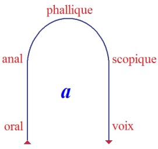
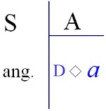
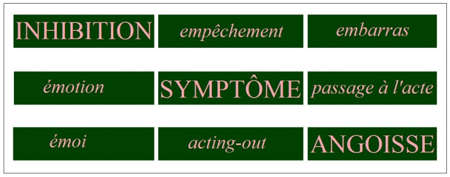

# Leçon 25 | 3 Juillet l963

<!-- source-url: http://staferla.free.fr/S10/S10 L'ANGOISSE.docx -->
<!-- seminar: s10 -->
<!-- lesson: 25 -->

<!-- id: s10-25-0001 -->

Je conclurai aujourd’hui ce que je m’étais proposé de vous dire cette année sur l’angoisse.
J’en marquerai la limite et la fonction, indiquant par là où j’entends que se continuent les positions
qui seules nous permettent, nous permettront s’il se peut, de boucler ce qu’il en est de notre rôle d’ana­lyste.

<!-- id: s10-25-0002 -->

L’angoisse, Freud au terme de son œuvre l’a désignée comme *signal*.

<!-- id: s10-25-0003 -->

Il l’a désignée comme *signal*...
distinct de l’effet de la situation traumatique
...*signal* articulé à ce qu’il appelle « *danger* »*.*

<!-- id: s10-25-0004 -->

Le mot « *danger* » pour lui est lié à la fonc­tion, à la notion - il faut bien le dire : non élucidée - de « *danger vital* »*.*

<!-- id: s10-25-0005 -->

Ce que j’aurai pour vous cette année articulé d’original, c’est la précision sur ce qu’est ce danger. Ce danger c’est
conformément à l’indication freudienne, mais plus précisément articulé
...ce qui est lié au caractère de *cession -* *c,e, deux s, i,o,n* - du moment constitutif de *l’objet petit(a)*.

<!-- id: s10-25-0006 -->

*De quoi* dès lors l’angoisse - pour nous, en ce point de notre élaboration - doit-elle être considérée comme le signal ?
Ici encore nous articulerons autrement que Freud ce moment.

<!-- id: s10-25-0007 -->

Ce moment de fonction de l’angoisse est antérieur à cette cession de l’objet,
car l’expérience nous interdit de ne pas...
comme la nécessité même de son articulation y oblige Freud
...situer quelque chose de plus primitif que l’articulation de la situation de danger...
dès lors que nous la définissons comme nous venons de le faire
...à un niveau, à un moment antérieur à cette *cession de l’objet*.

<!-- id: s10-25-0008 -->

L’angoisse...
ai-je annoncé pour vous d’abord, et dès le séminaire d’il y a deux ans[^172]

<!-- id: s10-25-0009 -->

...l’angoisse se manifeste sensiblement dès le premier abord comme se rapportant, et d’une façon complexe, au désir de l’Autre.
Dès ce pre­mier abord, j’ai indiqué que la fonction *angoissante* du désir de l’Autre était liée à ceci :
*que je ne sais pas quel objet petit(a) je suis pour ce désir*.

<!-- id: s10-25-0010 -->

J’accentuerai aujourd’hui que ceci ne s’articule pleinement, ne prend forme exemplaire qu’à ce que j’ai appelé,
désigné ici en signe au tableau...

<!-- id: s10-25-0011 -->

<!-- id: s10-25-0012 -->

...le 4ème niveau définissable comme caractéristique de la fonction de *la constitution du sujet* dans sa relation à l’Autre,
et pour autant que nous pou­vons l’articuler comme centrée autour de *la fonction de l’angoisse*.
Là seulement, la plénitude spécifique par quoi le désir humain est fonc­tion du désir de l’Autre,
là seulement, à ce niveau, cette forme est remplie.

<!-- id: s10-25-0013 -->

L’angoisse, vous ai-je dit, y est liée à ceci que *je ne sais pas quel objet petit(a) je suis pour le désir de l’Autre*.

<!-- id: s10-25-0014 -->

Mais ceci, en fin de compte n’est lié qu’au niveau où je puis en donner cette *fable* exemplaire où l’Autre serait *un radi­calement Autre*, serait cette « *mante religieuse* » d’un désir vorace, à quoi rien ne me lie de facteur commun.
Bien au contraire, à l’Autre humain quelque chose me lie qui est ma qualité d’être son semblable.
Ce qui reste du « *je ne sais pas* » angoissant est foncièrement méconnaissance,
*méconnaissance* à ce niveau toute spécial de ce qu’est, dans l’économie de mon désir d’homme, le *petit(a)*.

<!-- id: s10-25-0015 -->

Et c’est pourquoi, paradoxalement, c’est au niveau dit 4ème, au niveau du *désir scopique,*
que si la structure du désir est pour nous la plus pleine­ment développée dans son aliénation fondamentale,
c’est là aussi que *l’objet petit(a)* est le plus masqué, et avec lui *que le sujet est*, quant à l’angoisse, *le plus sécurisé*.
C’est ce qui rend nécessaire que nous cherchions, ailleurs qu’à ce niveau, la trace du *petit(a)* quant au moment de sa constitution.

<!-- id: s10-25-0016 -->

L’Autre en effet, si par *essence* il est toujours là dans sa pleine réalité,
et donc toujours que cette réalité, pour autant qu’elle prend présence subjective, peut se manifester par quelqu’une de ses arêtes,
il est clair que *le développement* ne donne pas un accès égal à cette réalité de l’Autre. Au 1er niveau, cette réalité de l’Autre
est présentifiée, comme il est bien net dans l’impuissance originelle du nourrisson enfantin, par le besoin.

<!-- id: s10-25-0017 -->

Ce n’est qu’au 2nd temps, qu’avec la demande de l’Autre, quelque chose à pro­prement parler se détache
qui nous permet d’articuler d’une façon complète la constitution du *petit(a)*par rapport à *sa fonction de lieu de la chaîne signi­fiante*,
*fonction* - j’entends - *de l’Autre* *avec un grand A*.

<!-- id: s10-25-0018 -->

Mais je ne veux pas quitter aujourd’hui ce premier niveau
sans bien poin­ter que l’angoisse paraît *avant* toute articulation comme telle de *la demande de l’Autre*.
Et singulièrement...

<!-- id: s10-25-0019 -->

> je vous prie un instant de vous arrêter au paradoxe qui là conjoint le point de départ de ce premier effet de cession, qu’est celui de l’angoisse, avec ce qui sera au terme quelque chose comme son point d’arrivée
> ...cette manifestation de l’angoisse, coïncidant avec l’émergen­ce même au monde de celui qui sera le sujet, c’est *le cri*.

<!-- id: s10-25-0020 -->

*Le cri* dont j’ai situé dès longtemps[^173] la fonction comme rapport, non pas originel mais *terminal,*
à ce que nous devons considérer comme étant le cœur même de cet Autre,
en tant qu’il s’achève pour nous à un moment comme notre « *prochain* ».

<!-- id: s10-25-0021 -->

Ce cri qui échappe au nourrisson, il ne peut rien en faire. S’il a là *cédé quelque chose*, rien ne l’y conjoint.
Mais cette angoisse, cette angoisse originelle, est-ce que je suis le premier,
est-ce que tous les auteurs n’ont pas accentué son carac­tère dans un certain rapport dramatique de l’émergence de l’organisme, humain en l’occasion, à un certain monde où il va vivre ?

<!-- id: s10-25-0022 -->

Pouvons-nous, dans ces indications multiples et confuses ne pas en voir certains traits contradictoires ?
Pouvons-nous retenir comme valable l’indi­cation ferenczienne que, pour l’ontogenèse elle-même,
il y a émergence de je ne sais quel milieu aqueux primitif qui serait l’homologue du milieu marin ?

<!-- id: s10-25-0023 -->

Quel rapport *du liquide amniotique* avec *cette eau* où peut s’opérer cet échange de l’intérieur à l’extérieur qui s’opère - de l’animal vivant en un tel milieu - au niveau de la branchie : est-ce que jamais, à aucun moment de l’embryon, la branchie humaine fonctionne ?

<!-- id: s10-25-0024 -->

Je vous prierai plutôt, de rete­nir...

<!-- id: s10-25-0025 -->

> car *tout* ce qui nous est indiqué dans cette spéculation souvent confu­se qu’est la spéculation psychanalytique
>
> doit être considéré par nous comme n’étant pas dépourvu de sens, sur la voie de quelque chose d’indi­catif,
>
> qu’elle saute, se traîne et quelque fois illumine
> *...*puisque de *phylogenè­se* on fait état en l’occasion, je vous prie...

<!-- id: s10-25-0026 -->

> du point de vue d’un échan­ge schématisé dans la forme d’un organisme
>
> avec à sa limite et sur cette limi­te un certain nombre de points choisis d’échange
> ...de vous apercevoir combien en effet, c’est une chose incroyable...

<!-- id: s10-25-0027 -->

> si tant est que le schéma vital de l’échange le plus basal est effectivement fait de la fonction *de cette paroi, de cette limite, de cette osmose,* entre un milieu extérieur et un milieu inté­rieur entre lesquels il doit y avoir un facteur commun
> ...de considérer l’étrangeté de ce saut par quoi des êtres vivants sont sortis de leur milieu primitif,
> sont passés à cet air, avec un organe dont...
> je vous prie de consulter là-dessus les livres d’embryologie
> *...*on ne peut qu’être frappé par le caractère, dans le développement, de néo-formations, si l’on peut dire, arbitraires.

<!-- id: s10-25-0028 -->

Il y a autant d’étrangeté à cette intrusion, à l’intérieur de l’orga­nisme, de cet appareil...
dont toute l’adaptation du système nerveux a à lon­guement s’accommoder
avant que ça fonctionne vraiment comme une bonne pompe
...il y a autant d’étrangeté dans le saut que constitue l’appari­tion de cet organe,
qu’on peut dire qu’il y en a dans le fait qu’à un moment de l’histoire humaine on a vu *des êtres humains respirer dans un poumon d’acier*
ou encore s’en aller dans ce qu’on appelle improprement « *le cosmos* » avec autour de soi quelque chose qui, pour sa fonction vitale, n’est pas essentiellement différent de ce que j’évoque ici comme réserve d’air.

<!-- id: s10-25-0029 -->

Que l’angoisse ait été en quelque sorte...
c’est Freud qui nous l’indique ici
...choisie comme *signal de quelque chose*, est-ce que nous ne devons pas en reconnaître le trait essentiel dans cette intrusion radicale
de quelque chose de si *autre* à l’être vivant qu’est déjà *de passer dans l’atmo­sphère* ?

<!-- id: s10-25-0030 -->

Et c’est là *le trait essentiel* par quoi l’être vivant humain qui émerge à ce monde où il doit respirer, est d’abord littéralement étouffé, suffoqué par ce qu’on a appelé « *le trauma »* - il n’y en a pas d’autre - « *le trauma de la nais­sance* »,
qui n’est pas séparation de la mère, mais *aspiration en soi de ce milieu foncièrement autre*.

<!-- id: s10-25-0031 -->

Bien sûr, le lien n’est pas clair de ce moment avec ce qu’on peut appeler *séparation* et *sevrage*,
mais je vous interroge, je vous prie de rassembler les éléments de votre expérience,

<!-- id: s10-25-0032 -->

- *expérience d’ana­lyste, d’observateur de l’enfant,*

<!-- id: s10-25-0033 -->

- *expérience* aussi de tout ce qui doit être reconstruit, de tout ce qui s’avère pour nous comme nécessaire si nous vou­lons donner un sens au terme de *sevrage,* pour voir que le rapport du sevra­ge à ce 1er moment n’est pas un rapport simple, un rapport de phéno­mènes qui se recouvrent, mais bien plutôt quelque rapport de contempora­néïté.

<!-- id: s10-25-0034 -->

Ce n’est pas essentiellement vrai que l’enfant *soit sevré*, *il se sèvre : il se détache du sein, il joue*...

<!-- id: s10-25-0035 -->

> après cette première expérience dont le caractère déjà subjectivé se manifeste aussi sensiblement
>
> par le passage sur sa face, seu­lement ébauchant les premiers signes de la mimique de la surprise
> ...*il joue à se détacher et à reprendre ce sein*.

<!-- id: s10-25-0036 -->

Et s’il n’y avait déjà quelque chose d’assez actif pour que nous puissions l’articuler dans le sens d’un désir de sevrage,
comment même pourrions-nous concevoir les faits très primitifs, très pri­mordiaux dans leur apparition, dans leur datation,

<!-- id: s10-25-0037 -->

- de *refus du sein*,

<!-- id: s10-25-0038 -->

- les formes premières de l’anorexie, auxquelles notre expérience nous apprend à chercher tout de suite les corrélations au niveau du grand Autre ?

<!-- id: s10-25-0039 -->

*Il manque à cet objet premier que nous appelons « le sein » pour fonction­ner <u>authentiquement</u>* \[*comme objet*\]...

<!-- id: s10-25-0040 -->

> pour ce qu’il est donné pour être dans la théorie clas­sique,
>
> à savoir la rupture du lien à l’Autre
> ...*il lui manque* \[à ce sein\] *son plein lien à l’Autre*.

<!-- id: s10-25-0041 -->

Et c’est pourquoi j’ai fortement accentué que son *lien* est plus proche au premier petit sujet néo-natal :

<!-- id: s10-25-0042 -->

- il \[le sein\] n’est pas de l’Autre,

<!-- id: s10-25-0043 -->

- il n’est pas *le lien* qu’il y a *à rompre* de l’Autre,

<!-- id: s10-25-0044 -->

- il est tout au plus le premier signe de ce lien.

<!-- id: s10-25-0045 -->

C’est pourquoi il a rapport avec l’angoisse,
mais aussi, dès l’abord, pourquoi il est en somme la première forme et la forme qui rend possible la fonction de *l’objet transitionnel*. Aussi bien n’est-il pas à ce niveau le seul objet qui s’offre à remplir cette fonction.

<!-- id: s10-25-0046 -->

Et si *plus tard un autre objet*...
celui sur lequel la dernière fois, une autre encore, j’ai longuement insisté
...*l’objet anal,* *vient à remplir <u>d’une façon plus claire</u> cette fonction*
au moment où l’Autre lui-même élabore la sienne sous la forme de la demande,
on peut voir la sagesse de toujours de *ces veilleuses de la venue au monde de l’ani­mal humain* : les « *sages-femmes* » se sont toujours *arrêtées*,
sont toujours *tom­bées en arrêt*, devant ce singulier aussi petit objet qui est dès l’apparition de l’enfant, *le méconium*.

<!-- id: s10-25-0047 -->

Je ne reviendrai pas aujourd’hui, pour l’avoir déjà fait, sur l’articulation beaucoup plus *caractéristique* que cet objet, *objet anal*,
nous permet de faire de la fonction de *l’objet(a)*.,
de *l’objet(a)* en tant qu’il se trouve à être *le premier support*, dans le rapport à l’Autre, de la *subjecti­vation*,
je veux dire de ce en quoi ou ce par quoi le sujet est requis, d’abord par l’Autre, de se manifester

<!-- id: s10-25-0048 -->

- comme *sujet*, et sujet de plein droit,

<!-- id: s10-25-0049 -->

- comme sujet qui déjà a ici à donner ce qu’il est, en tant que ce passage, cette entrée dans le monde de *ce qu’il est, ne peut être que comme reste, comme irréductible,* par rapport à ce qui lui est imposé de *l’empreinte symbolique*.

<!-- id: s10-25-0050 -->

*Ce qu’il est là, c’est ce qu’il a d’abord à* *donner* \[*l’objet* *anal*\] .
Et c’est à cet *objet* \[*anal*\] qu’est appendu - comme à *l’objet causal -* ce qui va l’identifier primordialement *au désir de retenir*.

<!-- id: s10-25-0051 -->

- *La* 1ère *forme* *<u>évolutive du désir</u>* \[*au niveau* 2 *: anal*\] s’apparente, ainsi et comme telle, à l’ordre de *l’inhibition* \[ *« désir de retenir »* \]. Quand *le désir,* <u>*pour la* 1ère *fois formé*</u>*,* apparaît, il s’oppose à l’acte même par où son originalité de *désir* s’in­troduit. \[*au niveau* 2 *: anal, le « désir de retenir » s’oppose au jeu de la séparation du sein, niveau* 1\]

<!-- id: s10-25-0052 -->

- Déjà, s’il était clair au stade précédent que c’est bien à *l’objet* qu’est appendue *la* 1ère *forme de désir* en tant que nous l’élaborons comme *<u>désir de séparation</u>*. \[*niveau* 1 : « *désir » seulement « en formation » car le sein n’est pas de l’Autre*\]

<!-- id: s10-25-0053 -->

*La* 2nde *forme*, il est clair que la fonction de cause que je donne à l’objet se manifeste en ceci, que la forme du désir se retourne contre la fonction qui introduit *l’objet(a)* comme tel.
\[ *« désir de retenir » l’objet cessible de la demande de l’Autre*\]

<!-- id: s10-25-0054 -->

Car bien sûr, il faut voir que cet objet, comme je l’ai rappelé tout à l’heure, il est là déjà donné, déjà produit, et *produit primitivement*, mis à la disposition de cette fonction déterminée par l’introduction de la demande par quelque chose qui est antérieur,
s’il était là déjà, *comme produit de l’angoisse*.

<!-- id: s10-25-0055 -->

Ce n’est donc pas ici *ni l’objet en soi, ni le sujet qui s’autonomiserait* ...
comme on l’imagine, dans une vague et confuse priorité de totalité qui est ici intéres­sée
...mais dès l’abord, initialement : un *objet choisi* pour sa qualité d’être spé­cialement *cessible*, d’être originellement *un objet lâché*.

<!-- id: s10-25-0056 -->

Vous voyez, ce qui est ici en question c’est de s’apercevoir que dans ce point d’insertion primitif du désir,
lié à la conjonction en une même parenthèse du *petit(a)* et du *grand* D *de la demande* \[D **◊** *a*\], il y a ceci
d’un côté \[D **◊** *a*\], et de l’autre côté : *l’angoisse* \[...**◊**\] :

<!-- id: s10-25-0057 -->

<!-- id: s10-25-0058 -->

*Et que c’est <u>dans l’inter-changement de ces positions</u>*

<!-- id: s10-25-0059 -->

- de *l’an­goisse,*

<!-- id: s10-25-0060 -->

- et de ce qui a *pour le sujet à se constituer dans sa fonction* qui restera, jusqu’à son terme essentielle *d’être représenté par* *(a)*, *<u>c’est là</u>* que se trouve le niveau où nous pouvons, où nous devons nous maintenir, nous soutenir, si nous voulons vraiment considérer ce qu’il en est de notre *fonction technique*.

<!-- id: s10-25-0061 -->

Cette angoisse ici, la voici donc - nous le savons depuis longtemps -
comme écartée, dissimulée dans *ce rapport* que nous appelons *ambivalent de l’obsessionnel*,
*ce rapport* que nous simplifions, que nous abrégeons, que nous éludons lui-même quand nous le limitons à être celui de l’agressivité.

<!-- id: s10-25-0062 -->

Cet *objet* qu’il ne peut s’empêcher de *retenir*

<!-- id: s10-25-0063 -->

- comme le « *Bien »* qui le fait valoir,

<!-- -->

<!-- id: s10-25-0064 -->

- mais qui n’est aussi de lui que *le déjet, la déjection*, voilà les deux faces par où il détermine le sujet même

<!-- id: s10-25-0065 -->

- comme *compulsion,*

<!-- id: s10-25-0066 -->

- <u>et</u> comme *doute*.

<!-- id: s10-25-0067 -->

C’est de cette oscillation même entre ces deux points extrêmes que dépend le passage, le passage momentané, possible, du sujet
par ce *point zéro*, où c’est en fin de compte entièrement à la merci de l’autre - ici au sens *duel*, du petit autre - que se trouve le sujet.

<!-- id: s10-25-0068 -->

Et c’est pourquoi dès ma deuxième leçon [^174], je vous *ai signalé*...

<!-- id: s10-25-0069 -->

> en opposant la structure du rapport du désir au désir de l’Autre, au sens où je vous l’enseigne,
>
> avec la structure où il s’articule, se définit, s’algébrise dans la dialectique hégélienne
> ...je vous ai dit que le point où ils se recou­vrent, point partiel...
> celui-là même qui nous permet de définir ce rapport comme rapport d’agressivité
> ...c’est celui que définissait la formule au point où nous égalons à zéro le *« moment »* - je l’entends au sens physique - de ce désir,
> c’est-à-dire de ce que j’ai écrit ici « *d(a)* » :

<!-- id: s10-25-0070 -->

> *d(a)* : *0 \> d (0)*

<!-- id: s10-25-0071 -->

Autrement dit : désir en tant que déterminé par le premier objet caractéristiquement *cessible*.
Ici, effectivement on peut dire que *le sujet* se trouve affronté
avec ce qu’on traduit, dans *la phénoménologie hégélienne* par « *l’impossibilité de la cœxis­tence des consciences de soi* »
et qui n’est que l’impossibilité pour le sujet, au niveau du désir, de trouver en lui-même, sujet, sa cause.

<!-- id: s10-25-0072 -->

Ici, vous devez voir déjà s’amorcer la cohérence de cette « *fonction de cause »* avec « *ce fantasme* »...
ce fantasme caractéristique d’une pensée en quelque sorte forcée pour la spéculation humaine
...*de cette notion* de *causa sui* [^175] où cette pensée se conforte de l’existence quelque part, d’un être à qui sa cause ne serait pas étrangère.

<!-- id: s10-25-0073 -->

*Compensation*, *fantasme*, *surmontement arbitraire de ceci*, de notre condition :
que la cause de son désir, l’être humain est d’abord soumis à la voir produite *dans un danger qu’il ignore*.

<!-- id: s10-25-0074 -->

À cela est lié ce *ton suprême et magistral,* dont retentit, et ne cesse de retentir au cœur de l’Écriture sacrée,
dont malgré ce qu’on appelait l’aspect « *blasphématoire »,* le texte dit de « *L’Ecclésiaste* », a dû rester.

<!-- id: s10-25-0075 -->

Et qu’est-ce qui en fait *le ton*, l’accent, sinon ceci : הַכֹּל הָבֶל \[hébal hèbel\] *tout est vanité *: \[הֲבֵל הֲבָלִים אָמַר קֹהֶלֶת, הֲבֵל הֲבָלִי ם הַכֹּל הָבֶל\],

<!-- id: s10-25-0076 -->

*Vanité* ce que nous traduisons ainsi, et dans l’hébreu ceci הָבֶל \[hèbel\] dont je vous écris les trois lettres radicales, et qui veut dire :
*vent, haleine,* encore si vous le vou­lez : *nuée, chose qui s’efface,* qui nous ramène à une ambiguïté, je crois plus légitime ici à évoquer, concernant ce que peut avoir de plus abject ce *souffle,* que tout ce que Jones a cru devoir élaborer
à propos de *la conception de la Madone par l’oreille*.

<!-- id: s10-25-0077 -->

Ce thème, cette thématique de la *vanité*, c’est bien elle qui donne son *accent*, sa *portée*, sa *résonance*, toujours présente,
à la défini­tion hégélienne de ceci, que la lutte, la lutte originelle et féconde d’où part la *Phénoménologie de l’esprit,*
part nous dit-il, de « *la lutte à mort de pur prestige* » dit-il, ce qui a bien l’accent de vouloir dire « *la lutte pour rien* ».

<!-- id: s10-25-0078 -->

Faire tourner la cure de l’obsession autour de l’agressivité c’est...
de façon patente, et si je puis dire « *avouée* », même si elle n’est pas délibérée
...in­troduire à son principe *la subduction du désir du sujet au désir de l’analys­te,*
en tant que  comme tout désir, il s’articule ailleurs que dans sa référence interne au *(a)*,
ce désir s’identifie à un « *idéal »* auquel, d’une façon obligée, sera courbé le désir du patient
pour autant que cet « *idéal »* est la position que l’ana­lyste a obtenue, ou cru obtenir, à l’endroit de la réalité*.*

<!-- id: s10-25-0079 -->

Or *(a),* *petit(a)* dont il s’agit, ainsi *marqué* comme *cause du désir*, n’est pas cette vanité, ni ce déchirement.
S’il est bien, dans sa fonction ce que j’articule,
à savoir cet « *objet* » défini comme *un reste*, comme *ce qui est irréductible à la symbolisation au lieu de l’Autre*...
qui en dépend \[de l’Autre\], certes, car autrement comment se constituerait ce *reste*
*...si petit(a) est l’unique de l’existence*, en tant qu’elle se fait valoir, non pas comme on l’a dit, dans *sa facticité*,
car cette *facticité* ne se situe que de sa référence à une prétendue et mythique *nécessité noétique*
qui serait posée elle-même comme la référence première.

<!-- id: s10-25-0080 -->

Il n’y a nulle facticité dans ce *reste* où s’enracine *le désir* qui, plus ou moins, arrivera à culminer dans *l’existence,*
*la sévérité plus ou moins poussée de sa réduction*, à savoir de ce qui le fait irréductible
et où chacun peut reconnaître le niveau exact où il s’est haussé au *lieu de l’Autre*,
voilà ce qui se définit dans ce dialogue qui se joue sur une scène d’où, principe de ce désir, après y être monté,
*(a)* a en retomber *à tra­vers* l’épreuve de ce qu’il y aura laissé dans un rapport de *tragédie*, ou de *comédie* plus souvent.

<!-- id: s10-25-0081 -->

Il s’y joue bien sûr en tant que *rôle*, mais ce n’est pas le *rôle* qui compte...
et cela nous le savons tous d’expérience et de cer­titude intérieure
...c’est ce qui, *au-delà de ce rôle, reste.*
*Reste* précaire et livré sans doute, car je suis à jamais *l’objet cessible*, et comme chacun sait de nos jours, *l’objet d’échange*.
Et cet objet est le principe qui me fait désirer, qui me fait *désirant d’un manque,* qui n’est pas *un manque du sujet,*
*mais un défaut fait à la jouissance qui se situe au niveau de l’Autre*.
Et c’est en cela que *toute fonction du* *petit(a)* *ne se réfère qu’à cette béance cen­trale* qui sépare au niveau sexuel *le désir du lieu de la jouissance*,
qui nous condamne à cette nécessité qui veut

<!-- id: s10-25-0082 -->

- que la jouissance ne soit pas « *de nature* » pour nous, promise au désir,

<!-- id: s10-25-0083 -->

- que le désir ne peut faire que d’aller à sa ren­contre,

<!-- id: s10-25-0084 -->

- que *pour la rencontrer le désir* ne *doit* pas seulement *comprendre* mais *franchir le fantasme* même qui le soutient et le construit.

<!-- id: s10-25-0085 -->

Ceci que nous avons découvert comme cette butée qui s’appelle *angoisse de castration* disons-nous, mais pourquoi pas *désir de castration*, puisqu’au manque central qui *dis­joint* *le désir* de *la jouissance*, là aussi un *désir* est suspendu dont la menace pour chacun
n’est fait que de *sa reconnaissance* dans le désir de l’Autre.

<!-- id: s10-25-0086 -->

À la limite, l’Autre, quel qu’il soit dans le fantasme paraît être le châtreur, l’agent de la castration.
Assurément, ici les positions sont différentes, et l’on peut dire que pour la femme, la position est plus confortable :
*l’affaire est déjà faite* et c’est bien ce qui fait son lien, bien plus spécial, au *désir de l’Autre*.
C’est bien aussi pourquoi, Kierkegaard[^176] peut dire cette chose *singulière* et *juste* :

<!-- id: s10-25-0087 -->

« *profondé­ment je crois, que la femme est plus angoissée que l’homme* ».

<!-- id: s10-25-0088 -->

Comment cela serait-il possible si justement à ce niveau central,
l’angoisse n’était pas faite précisément et comme telle de *la relation au désir de l’Autre*.

<!-- id: s10-25-0089 -->

Le désir, en tant qu’il est « *désir de désir* », c’est-à-dire tentation,
c’est là qu’en son cœur il nous ramène à cette *angoisse* dans sa fonction la plus originelle.
L’angoisse, au niveau de la castration, représente l’Autre,
si la rencontre du fléchisse­ment de l’appareil nous donne ici *l’objet* sous la forme d’une *carence*.

<!-- id: s10-25-0090 -->

Ai-je besoin de rappeler ce qui dans *la tradition analytique,* ici confir­me ce que je suis en train d’articuler :
qui est celui qui nous donne d’abord l’exemple de la castration attirée, assumée, désirée comme telle, sinon Œdipe ?
Œdipe n’est pas d’abord le père, c’est ce que j’ai voulu dire depuis longtemps
en faisant remarquer *ironiquement* qu’Œdipe *n’aurait su avoir un complexe d’Œdipe.*

<!-- id: s10-25-0091 -->

Œdipe est :

<!-- id: s10-25-0092 -->

- celui qui veut passer *authentiquement*, et *mythiquement* aussi, au 4ème niveau qu’il me faut bien aborder par sa voie exemplaire,

<!-- id: s10-25-0093 -->

- celui qui veut violer l’interdit concernant la conjonction du *petit(a*), ici *-* φ, et de *l’angoisse*,

<!-- id: s10-25-0094 -->

- celui qui veut « *voir* » ce qu’il y a au-delà de la satisfaction réussie, elle, de son désir.

<!-- id: s10-25-0095 -->

Le péché d’Œdipe est la *cupido scien­di, il veut savoir*.
Et ceci se paie par l’horreur que j’ai décrite : que ce qu’il voit enfin ce sont ses propres yeux, *(a),* jetés au sol.

<!-- id: s10-25-0096 -->

Est-ce à dire que ce soit là la structure du 4ème niveau, et que quelque part il y ait toujours présent ce rite sanglant d’aveuglement ? Non ! Il n’est pas nécessaire, et c’est bien là par quoi le drame humain n’est pas tragique mais *comédie* :

<!-- id: s10-25-0097 -->

« *ils ont des yeux pour ne point voir* », *il n’est pas nécessaire qu’ils se les arrachent* !

<!-- id: s10-25-0098 -->

L’angoisse est suffisamment repoussée, méconnue dans la seule capture de *l’image spéculaire* *i(a)*,
dont le mieux qu’on pourrait souhaiter est qu’il \[*(a)*\] se reflète dans les yeux de l’Autre.
Mais ce n’est même pas besoin puisqu’il y a *le miroir*.

<!-- id: s10-25-0099 -->

Et ici l’articulation selon le tableau de référence que je vous ai décrit la dernière fois
*Inhibition, Symptôme, Angoisse* du quatrième niveau, voici à peu près comment je la décrirai :

<!-- id: s10-25-0100 -->

|  |  |  |  |
|----|:--:|:--:|:--:|
| **I** | *Désir de ne pas voir* | *Impuissance (à soutenir le désir de ne pas voir)* | *Concept d’angoisse* |
| **S** | *Méconnaissance (ne pas savoir)* | *Fantasme de toute puissance* | *Fantasme de suicide* |
| **A** | *Idéal du moi* | *Fonction du deuil* | *Angoisse masquée* |

<!-- id: s10-25-0101 -->

<!-- id: s10-25-0102 -->

- Au niveau de l’*inhibition*, c’est ce désir de « *ne pas voir* » qui a - vu la dis­position des phénomènes - à peine besoin d’être soutenu.

<!-- -->

<!-- id: s10-25-0103 -->

- Tout ce qui satisfait la *méconnaissance* comme structurale au niveau du « *ne pas savoir* » est là, à la deuxième ligne.

<!-- id: s10-25-0104 -->

- Et à la troisième, comme *émoi : l’idéal, l’idéal du moi*, c’est-à-dire ce qui de l’Autre est - comme on dit - le plus commode à *intro­jecter*.

<!-- id: s10-25-0105 -->

Bien sûr, ce n’est point sans raisons que ce terme *d’introjection* est ici introduit,
néanmoins je vous prie de ne le prendre qu’avec réserve,
car à la vérité *l’ambiguïté* qui reste *de cette introjection à la projection,*
suffisam­ment nous indique qu’ici il faut, pour donner son plein sens *au terme d’in­trojection*, l’introduction d’un autre niveau.

<!-- id: s10-25-0106 -->

Ce qu’au cœur du *symptôme cen­tral* de ce niveau...
tel qu’il s’incarne spécialement au niveau de l’obsessionnel
...j’ai déjà désigné, c’est *le fantasme de la « toute-puissance »,* corrélatif de l’impuissance fondamentale à soutenir ce désir de « *ne pas voir* ».

<!-- id: s10-25-0107 -->

Ici, ce que nous mettrons au niveau de l’*acting-out,* c’est la fonction du *deuil*,
pour autant que je vais à l’instant vous prier d’y reconnaître ce qu’au cours d’une année passée
je vous ai appris à y voir *d’une structure fonda­mentale de la constitution du désir* [^177].

<!-- id: s10-25-0108 -->

- Ici, au niveau du *passage à l’acte,* un fantasme de suicide dont le carac­tère et l’authenticité sont à mettre en question essentiellement à l’intérieur de cette dialectique.

<!-- id: s10-25-0109 -->

- Ici, *l’angoisse* toujours en tant qu’elle est masquée.

<!-- id: s10-25-0110 -->

- Ici, au niveau de *l’embarras,* ce que nous appellerons légitimement le concept d’angoisse.

<!-- -->

<!-- id: s10-25-0111 -->

-

<!-- id: s10-25-0112 -->

- Car je ne sais pas si l’on se rend bien compte de l’auda­ce qu’apporte Kierkegaard en parlant de « *concept d’angoisse* ». Qu’est-ce que ça peut vouloir dire, sinon l’affirmation que :

<!-- id: s10-25-0113 -->

- ou il y a la fonction du concept selon Hegel, c’est-à-dire quelque part, symboliquement, une prise véritable sur le *réel*,

<!-- id: s10-25-0114 -->

- ou la seule prise que nous ayons, et c’est ici qu’il faut choisir, c’est celle que nous donne l’angoisse, seule appréhension dernière et comme telle, de toute réalité. Le « *concept de l’angoisse* » comme tel ne surgit donc *qu’à la limite,* et *d’une méditation* dont rien ne nous indique qu’elle ne rencontre pas très tôt sa butée.

<!-- id: s10-25-0115 -->

Mais ce qui nous importe, c’est de retrouver ici la confirmation des véri­tés que nous avons déjà, par d’autres biais, abordées.
Qu’est-ce que Freud articule au terme de sa spéculation sur l’angoisse, si ce n’est ceci :

<!-- id: s10-25-0116 -->

« *Après -* dit-il *- tout ce que je viens de vous dire, d’avancer sur les rapports de l’an­goisse avec la perte de l’objet,*
*qu’est-ce qui peut bien la distinguer du deuil ?* »

<!-- id: s10-25-0117 -->

Et tout ce codicille, cet appendice à son article - vous pourrez vous y reporter - ne marque que le plus extrême embarras à définir
la façon dont on peut comprendre que *ces deux fonctions*, auxquelles il donne la même référence, aient des manifestations si diverses.

<!-- id: s10-25-0118 -->

Je vous prie ici de vous arrêter avec moi un instant à ce que je crois devoir vous rappeler
de ce à quoi nous a menés notre interrogation ici quand *il s’est agi* de parler d’Hamlet[^178] comme personnage dramatique éminent, comme *émergence à l’orée de l’éthique moderne du rapport du sujet à son désir*.

<!-- id: s10-25-0119 -->

Ce que j’ai pointé : qu’à la fois c’est *l’absence du deuil*...
et seulement et à proprement parler du deuil chez sa mère
*...*qui chez lui a fait *s’évanouir, se dissiper, s’effondrer* jusqu’au plus radical élan possible d’un désir chez cet être qui
nous est présenté par ailleurs assez bien je crois, pour que *tel* ou *tel* l’ait reconnu, voire identifié *au style même des héros de la Renaissance*,
[Salvador de Madariaga](http://fr.wikipedia.org/wiki/Salvador_de_Madariaga) par exemple, ai-je besoin de le rappeler,
c’est un personnage dont le moins qu’on puisse dire, c’est qu’il ne recule pas devant grand-chose et qu’il n’a pas froid aux yeux*.*
La seule chose qu’il ne puisse pas faire, c’est justement l’acte qu’il est fait pour faire,
parce que *le désir manque, et le désir manque en ceci : que s’est effondré l’idéal*.

<!-- id: s10-25-0120 -->

Quoi de plus douteux dans les paroles d’Hamlet que cette sorte de rapport idolâtrique qu’il dessine de la révérence de son père,
à cet être devant lequel nous sommes étonnés que ce roi suprême, le vieil Hamlet, l’Hamlet mort,
*il se courbe* littéralement pour lui faire hommage, tapis de son allégeance amoureuse ?

<!-- id: s10-25-0121 -->

Est ce que nous n’avons pas là les signes mêmes de quelque chose de trop forcé, de trop exalté, pour n’être pas de l’ordre
d’un amour unique, d’un amour mythique, d’un amour apparenté à ce style de ce que j’ai appelé « *l’amour courtois* » qui...
en dehors de ses références proprement culturelles et rituelles
par où il est évident qu’il s’adresse à autre chose qu’à *la Dame*
*...est le signe au contraire, de je ne sais quelle carence, de je ne sais quel alibi, devant les difficiles chemins que représente l’accès à un véridique amour.*

<!-- id: s10-25-0122 -->

La correspondance de l’évasion animale de la Gertrude maternelle, de toute cette dialectique,
avec cette survalorisation, qui nous est présentée dans les souvenirs d’Hamlet de l’attitude de son père, est là patente.

<!-- id: s10-25-0123 -->

Et le résultat c’est que, quand cet *idéal* est contredit, quand il s’effondre, constatons-le, ce qui disparaît, c’est chez Hamlet
le pouvoir du désir qui ne sera, comme je vous l’ai montré, restauré qu’à partir de la vision au-dehors,
d’un deuil, d’un vrai, avec lequel il entre en concurrence :
celui de Laërte par rapport à sa sœur, à l’objet aimé par Hamlet et dont il s’est trouvé soudain, par la carence du désir, séparé.

<!-- id: s10-25-0124 -->

Est-ce que ceci ne nous ouvre pas la porte, ne nous donne pas la clé, qui nous permet de mieux articuler que ne le fait Freud,
et dans la ligne de son interrogation même, ce que ça signifie *un deuil* ?

<!-- id: s10-25-0125 -->

Freud nous fait remarquer que le sujet du deuil a affaire à une tâche qui serait en quelque sorte
de consommer une seconde fois la perte provoquée par l’accident du destin de l’objet aimé.

<!-- id: s10-25-0126 -->

Qu’est-ce à dire ?

<!-- id: s10-25-0127 -->

Est-ce que « *le travail du deuil* » ne nous apparaît pas, dans un éclairage à la fois identique et contraire,
comme le travail qui est fait pour maintenir, pour soutenir tous ces liens de détails ?

<!-- id: s10-25-0128 -->

Et Dieu sait combien Freud insiste, à juste titre, sur le côté minutieux, détaillé,
de la remémoration du deuil concernant tout ce qui a été vécu du lien avec l’ob­jet aimé.

<!-- id: s10-25-0129 -->

*C’est ce lien qu’il s’agit de restaurer avec l’objet fondamental, l’objet masqué, l’objet petit(a),*
véritable objet de la relation auquel, dans la suite, un substitut pourra être donné
qui n’aura pas, en fin de compte, plus de portée que celui qui d’abord en a occupé la place.

<!-- id: s10-25-0130 -->

Comme le disait un d’entre nous - humoriste - au cours d’une de nos « *Journées Provinciales* »,
que l’histoire est bien faite pour nous montrer au cinéma que n’importe quel « *allemand irremplaçable* »*...*
il fait allusion à l’aventure qui nous est décrite dans le film *Hiroshima mon amour* [^179]
*...*peut trouver *un substitut immédiat et parfaitement valable*, cet « *allemand irremplaçable* », *dans le premier japonais rencontré au coin de la rue*.

<!-- id: s10-25-0131 -->

Le problème du *deuil* est celui du maintien au niveau de quoi ?
Des liens par où le désir est suspendu, non pas à *l’objet petit(a)* au niveau 4ème,

<!-- id: s10-25-0132 -->

*mais à* *i(a) par quoi tout amour*, en tant que ce terme implique la dimension idéalisée que j’ai dite, *est narcissiquement structuré*.

<!-- id: s10-25-0133 -->

Et c’est ce qui fait la différence avec ce qui se passe dans *la mélancolie* et dans *la manie *:
si nous ne distinguons pas *l’objet petit(a)* du *i(a)*, nous ne pouvons pas concevoir ce que Freud, dans la même note,
rappelle et articule puissamment, ainsi que dans l’article bien connu sur *Deuil et mélancolie,*
sur la différence radicale qu’il y a entre *mélancolie* et *deuil*.

<!-- id: s10-25-0134 -->

Ai-je besoin de me référer à mes notes et de vous rappeler ce passage,
où après s’être engagé dans la notion du *retour*, de *la réduction de la libido* prétendument *objectale* sur le *moi propre* du sujet, il avoue :
dans la mélancolie, ce processus, il est évident - *c’est lui qui le dit* - q’il n’aboutit pas : *l’objet surmonte sa direction, c’est l’objet qui triomphe*.

<!-- id: s10-25-0135 -->

Et parce que c’est autre chose que ce dont il s’agit comme retour de la libido dans le deuil,
c’est aussi pour cela que tout le processus, que toute la dialectique s’édifie autrement.

<!-- id: s10-25-0136 -->

À savoir que cet *objet petit(a)* Freud nous dit qu’il faut alors...
« pourquoi ? » : dans ce cas je le laisse ici de côté
...il faut alors que le sujet s’explique, mais que comme cet *objet petit(a)* est d’habitude masqué derrière le *i(a)* du narcissisme,
que le *i(a)* du narcissisme est là pour qu’au quatrième niveau le *petit(a)* soit masqué, méconnu dans son essence,
c’est là ce qui nécessite pour *le mélancolique*, de passer, si je puis dire « *au travers de sa propre image* »
et l’attaquant, d’abord de pouvoir atteindre *dans cet objet petit(a) qui le transcende*, ce dont la commande lui échappe,
ce dont la chute l’entraînera dans la précipitation, le suicide, avec cet automatisme, ce mécanisme, ce caractère nécessaire
et foncièrement aliéné avec lequel vous savez que se font les suicides de mélancoliques et pas dans n’importe quel *cadre*.

<!-- id: s10-25-0137 -->

Et si ça se passe si souvent à la fenêtre, sinon « *à travers la fenêtre* », ceci n’est pas un hasard,
c’est le recours à une structure qui n’est autre que celle que j’accentue comme étant celle du *fantasme*.

<!-- id: s10-25-0138 -->

Ce rapport à *(a)* par où se distingue

<!-- id: s10-25-0139 -->

- tout ce qui est *du cycle manie-mélan­colie,*

<!-- id: s10-25-0140 -->

- de tout ce qui est du *cycle idéal*, de la référence *deuil ou désir, nous ne pouvons le saisir que dans l’accentuation de la différence de fonction*

<!-- id: s10-25-0141 -->

- *du* *petit(a) par rapport au i(a),*

<!-- id: s10-25-0142 -->

- par rapport à ce quelque chose qui fait cette référence au *petit(a)* foncière, radicale, plus enracinante pour le sujet que n’importe quelle autre relation, mais aussi comme foncièrement méconnue, aliénée, dans *le rapport narcissique*.

<!-- id: s10-25-0143 -->

Disons tout de suite en passant, que dans *la manie* c’est la non-fonction de *petit(a),*
et non plus simplement sa méconnaissance qui est en cause,
c’est *le quelque chose* par quoi le sujet n’est pas lesté par aucun *petit(a),*
qui le livre, en quel­que sorte *sans aucune possibilité de liberté*, à *la métonymie* infinie et ludique, pure, de la chaîne signifiante.

<!-- id: s10-25-0144 -->

Ceci...
sans doute ai-je ici éludé bien des choses
...ceci va nous per­mettre de conclure, au niveau où cette année j’ai l’intention de vous laisser.

<!-- id: s10-25-0145 -->

Si le désir comme tel, et dans son caractère le plus aliéné, le plus foncière­ment fantasmatique, est ce qui caractérise le 4ème niveau, vous pou­vez remarquer que si j’ai amorcé la structure du 5ème, que si j’ai assez indi­qué qu’à ce niveau le *(a)* se retaille...
cette fois ouvertement aliéné
...comme *support du désir de l’Autre*, qui cette fois *se nomme*, c’est aussi pour vous dire pourquoi je m’arrêterai cette année à ce terme.

<!-- id: s10-25-0146 -->

<!-- id: s10-25-0147 -->

Toute la dialectique en effet, de ce qui se passe au niveau de ce 5ème niveau,

<!-- id: s10-25-0148 -->

implique une articulation plus *détaillée* qu’elle n’a jamais été faite, avec ce que j’ai désigné tout à l’heure comme *introjection*,
laquelle implique comme telle - je me suis contenté de l’indiquer - la dimension *auditive*, et laquelle implique aussi *la fonction paternelle*.

<!-- id: s10-25-0149 -->

> *Si l’année prochaine les choses se passent de façon que je puisse poursuivre - selon la voie prévue - mon séminaire,*
>
> *c’est autour, non pas seu­lement du nom, mais des Noms du Père que je vous donnerai rendez-vous.*

<!-- id: s10-25-0150 -->

Ce n’est pas pour rien que dans le mythe freudien, le père intervient, de la façon la plus évidemment mythique,
comme étant celui dont le désir sub­merge, écrase, s’impose à tous les autres.

<!-- id: s10-25-0151 -->

Est-ce qu’il n’y a pas là une contra­diction évidente avec ce fait, évidemment donné par l’expérience :
que par sa voie c’est justement tout autre chose qui s’opère, à savoir *la normalisation du désir dans les voies de la Loi* ?

<!-- id: s10-25-0152 -->

Mais est-ce là tout ?

<!-- id: s10-25-0153 -->

La nécessité même...

<!-- id: s10-25-0154 -->

> à côté de ce qui nous est ici tracé, représenté, rendu sensible par l’expérience,
>
> et jusque par les faits, maintes fois pesés par nous, de la carence de la fonction du père
> ...est-ce que la néces­sité du maintien du mythe n’attire pas notre attention sur autre chose,
> sur la nécessité de l’articulation, de l’appui, du maintien, d’une fonction qui est celle-ci :
> qui est que le père dans la manifestation de son désir, sait - lui - à quel *(a)* ce désir se réfère ?

<!-- id: s10-25-0155 -->

Le père n’est pas « *causa sui »* selon le mythe religieux, mais *sujet* qui a été assez loin dans la réalisation de son désir
pour le réintégrer à *sa cause* quelle qu’elle soit, à ce qu’il y a d’irréductible dans cette fonction du *(a)*
en tant que je vous prie de saisir ce qui nous permet d’articuler...
au principe de notre recherche même, sans l’éluder d’aucune façon
...qu’il n’est aucun sujet humain qui n’ait à se poser comme un objet, et un objet fini, auquel sont appendus des désirs finis,
lesquels ne prennent l’apparence de s’infi­nitiser que pour autant qu’à s’évader les uns des autres toujours plus loin de leur centre,
ils portent le sujet toujours plus loin de toute réalisation authentique.

<!-- id: s10-25-0156 -->

Or ce rapport, *cette méconnaissance du* *(a)* est quelque chose qui laisse une porte ouverte...

<!-- id: s10-25-0157 -->

> nous le savons depuis toujours, il n’y a même pas eu besoin de l’analyse pour nous le montrer
>
> puisque j’ai cru pouvoir vous le montrer dans un dialogue de Platon, *Le Banquet*
> *...l’objet(a)* en tant qu’au terme - terme sans doute jamais achevé - il est notre existence la plus radicale,
> qu’il est la seule voie dans laquelle le désir puisse nous livrer ce en quoi nous aurons nous-mêmes à nous reconnaître :
> *cet objet(a) est à situer comme tel, dans le champ de l’Autre*.

<!-- id: s10-25-0158 -->

Et non seulement il est à y être situé, mais il y est situé par chacun et par tous, et c’est cela qu’on appelle la possibilité de *transfert*.
L’interprétation que nous donnons porte toujours sur le *plus ou moins* de dépendance des désirs les uns par rapport aux autres.

<!-- id: s10-25-0159 -->

Mais ce n’est pas *l’affrontement à l’angoisse* : *il n’y a de surmontement de l’angoisse que <u>quand l’Autre s’est nommé</u>*. *Il n’y a d’amour que d’un nom*, comme chacun le sait d’expérience et le moment où *le nom* est prononcé de celui ou de celle à qui s’adresse *notre amour*,
nous savons très bien que c’est un seuil qui a la plus grande importance.

<!-- id: s10-25-0160 -->

Ceci n’est qu’une trace, une trace de ce *quelque chose* qui va de l’exis­tence du *(a)* à son passage dans l’histoire.

<!-- id: s10-25-0161 -->

Ce qui fait d’une psychanalyse une aventure unique est cette *recherche de l’*ἄγαλμα \[agalma\] *dans le champ de l’Autre*.
Je vous ai plusieurs fois interrogé sur ce qu’il convient que soit le désir de l’analyste
pour que là où nous essayons de pousser les choses au-delà de la limite de l’angoisse, le travail soit possible.

<!-- id: s10-25-0162 -->

Assurément, il convient que l’analyste soit celui qui ait pu, si peu que ce soit, par quelque biais, par quelque bord,
assez faire rentrer son désir dans ce *(a)* irréductible pour offrir à la question du « *concept de l’angoisse* » une garantie réelle.

<!-- id: s10-25-0163 -->

\[Fin du séminaire\]

<!-- id: s10-25-0164 -->

[[[Table des séances](#TABLE)](#TABLE)](#TABLE)
## Notes

[^172]: Séminaire 1960-61 : *Le transfert*..., séance du 14-06-1961.

[^173]: Cf. Séminaires *Les écrits Techniques* : séance du 07-04, *La relation d’objet* : séance du 27-02, *L’éthique* : séance du 25-11, *L’identification *: séance du 02-05.

[^174]: Cf. supra, séance du 21-11.

[^175]: Expression utilisée par Spinoza pour une définition « géométrique » de la substance , c'est-à-dire de Dieu, désignée comme une réalité objective qui, étant « en soi et pour soi », est nécessairement « cause première » d'elle-même. En elle, *cause et effet coïncident en un seul point* , étant à la fois mère et fille : sinon, elle serait l'effet d'une cause qui lui est antérieure...

[^176]: S. Kierkegaard : *Le concept d’angoisse*.

[^177]: Séminaire 1958-59 : *Le désir*…, séances des 18-03, 22-04 et 29-04.

[^178]: Séminaire 1958-59 : *Le désir*…, séances des 04-03 au 29-04 et 27-05.

[^179]: Hiroshima mon amour, film franco-japonais d’Alain Resnais, scénario de Marguerite Duras (1959).
