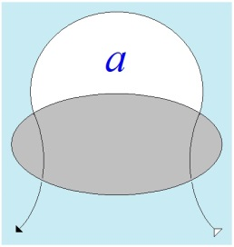

# Leçon 05 | 12 février 1964

<!-- source-url: http://staferla.free.fr/S11/S11 FONDEMENTS.docx -->
<!-- seminar: s11 -->
<!-- lesson: 05 -->

<!-- id: s11-05-0001 -->

Je vais poursuivre aujourd’hui, si je le peux, l’énoncé de ce qui regar­de le concept de répétition, tel qu’il est pour nous présentifié
par l’indi­cation de FREUD et par l’expérience de la psychanalyse.

<!-- id: s11-05-0002 -->

Ce que j’entends accentuer, c’est que *la psychanalyse*, au premier abord bien faite pour nous diriger vers un *idéalisme*, et Dieu sait que c’est ce qu’on lui a reproché : de « *réduire l’expérience* » - disent cer­tains qui nous sollicitent de trouver dans les durs appuis du conflit,
de la lutte, voire de « *l’exploitation de l’homme par l’homme* », les raisons de nos déficiences - que l’expérience soit par elle dirigée
vers *je ne sais quelle ontologie de* « *tendances* » toutes primitives, *toutes internes, toutes données déjà* par la condition du sujet.

<!-- id: s11-05-0003 -->

Il suffit de nous reporter, depuis ses premiers pas, au tracé de cette expérience *pour voir qu’au contraire*, rien en elle qui nous permette de nous résoudre à l’aphorisme qui s’exprimerait comme « *La vie est un songe* » ! Rien n’est plus centré, orienté vers ce qui,
au cœur de notre expérience, est *le noyau du réel*. Où, ce *réel*, le rencontrons-nous ?

<!-- id: s11-05-0004 -->

C’est bien en effet de la structure de cette *rencontre*, *de la fonction nodale, de la fonction répétitive d’une rencontre essentielle*, *d’un rendez-vous auquel nous sommes toujours appelés avec un réel qui se dérobe,* qu’il s’agit dans tout ce que *la psy­chanalyse* a découvert. Et c’est pour cela que j’ai mis au tableau ces quelques mots qui sont pour nous aujourd’hui repère de ce que nous voulons avancer. À savoir d’abord :

<!-- id: s11-05-0005 -->

- la τύχη \[tuché\] que nous avons empruntée - je vous l’ai dit la dernière fois - au vocabulaire d’ARISTOTE *en quête de sa recherche de la cause* :

<!-- id: s11-05-0006 -->

- *le réel au-delà de l’*αύτόματον \[automaton\], du *retour*, de *la revenue*, de *l’in­sistance* des signes, ce à quoi nous nous voyons *commandés par le principe du plaisir*, …c’est *cela qui gît toujours derrière et dont il est si évident*, dans toute la recherche de FREUD, *que c’est là ce qui est son souci*.

<!-- id: s11-05-0007 -->

Rappelez-vous le développement de *L’homme aux loups,* si central pour nous, pour comprendre ce qui est la véritable préoccupation de FREUD à mesure et dans la mesure même où se révèle plus pour lui la fonction du *fantasme *: il poursuit, il s’attache, et sur un mode presque angoissé, à en inter­roger *quel est ce réel, quelle est cette rencontre première que nous pou­vons assurer, affirmer, derrière le fantasme*.

<!-- id: s11-05-0008 -->

*Ce réel*, nous sentons qu’à travers toute cette observation, *il a* - entraînant avec lui le sujet, et le pres­sant - *tellement dirigé sa recherche* qu’après tout nous pouvons aujour­d’hui nous demander *si cette pression, si cette présence, si ce désir* de FREUD dans l’analyse
de *L’homme aux loups* n’est pas ce qui chez lui a pu conditionner l’accident tardif de sa psychose.

<!-- id: s11-05-0009 -->

Ainsi donc - nous l’avons dit la dernière fois - *il n’y a pas lieu de confondre ni retour des signes, ni reproduction*, modulation par la conduite de quelque chose qui en quelque sorte ne serait qu’une *remé­moration* *agie,* il ne s’agit pas de confondre cela *avec ce dont il s’agit au fond, dans la répétition*.

<!-- id: s11-05-0010 -->

Quelque chose nous est toujours volé de sa véritable fonction, de sa véritable nature, *dans l’analyse*, par quelque chose dont il faut bien dire que c’est *une faiblesse dans la conceptuali­sation* qu’ont donné les analystes, *du transfert*, l’identifiant en quelque sorte à *la répétition*.
Or, c’est bien là le point où il y a lieu de porter la distinction. La relation au *réel* dont il s’agit dans *le transfert* a été exprimée
par FREUD en ceci, dit-il, que : « *Rien ne peut être appréhendé « in effigie », « in absentia »* ».

<!-- id: s11-05-0011 -->

\[« *Es ist unleugbar, daß die Bezwingung der Übertragungsphänomene dem Psychoanalytiker die größten Schwierigkeiten bereitet, aber man darf nicht vergessen, daß gerade sie uns*
*den unschätzbaren Dienst erweisen, die verborgenen und vergessenen Liebesregungen der Kranken aktuell und manifest zu machen, denn schließlich kann niemand*
*in absentia oder in effigie erschlagen werden.* » (S. Freud : *Zur Dynamik der Übertragung*, 1912)
« *Ich antwortete : Es ist schwer möglich, jemand in absentia zu erschlagen.* » (S. Freud : *Der Rat Man Bemerkungen über einen Fall von Zwangsneurose*, 1909)\]

<!-- id: s11-05-0012 -->

Et pourtant *le transfert* ne nous est-il pas donné *comme effigie, et relation à l’absence* ? Cette *ambiguïté* de la réalité en cause dans *le transfert*, nous ne pourrons arriver à la démêler qu’à partir d’une saisie de ce dont il s’agit dans la fonction du *réel* concernant *la répétition*.

<!-- id: s11-05-0013 -->

Ce qui se répète, en effet toute l’expérience de l’analyse nous le montre, *c’est toujours quelque chose dont le rapport à la* τύχη \[tuché\]
*nous est suffisamment désigné par l’expression qui image le mieux*, ce devant quoi, à tout instant, nous nous trouvons arrêtés,
ce qui nous retient, et d’où que cela vienne en apparence dans l’expérience, pas seulement de l’intérieur mais aussi de l’extérieur,
*ce qui se produit « comme par hasard* ».

<!-- id: s11-05-0014 -->

À quoi nous ne nous laissons - *par principe*, si je puis dire - nous analystes, jamais *duper*. Tout au moins que nous marquons toujours du pointage de ceci : qu’il ne faut pas nous y laisser prendre quand le sujet nous dit qu’il est arrivé quelque chose qui ce jour-là, l’a empêché de réa­liser sa volonté, soit de venir à la séance.

<!-- id: s11-05-0015 -->

Ceci nous indique qu’il n’y a pas à prendre les choses au pied de la déclaration du sujet, que ce dont il s’agit, ce à quoi précisément nous avons affaire, c’est à cet achoppement, à cet accroc dont la présence, dont la formule…

<!-- id: s11-05-0016 -->

> vous le verrez, j’y revien­drai à tous les étages, non seulement les « défauts » de notre expérience,
>
> mais la structure même que nous donnons à la formation du sujet
> …nous la retrouverons à chaque instant comme étant le mode - le mode d’ap­préhension par excellence - de ce qui pour nous commande cette sorte de *déchiffrage* nouveau que nous avons donné des rapports du sujet à tout ce qui fait sa condition.

<!-- id: s11-05-0017 -->

De cette fonction de la τύχη \[tuché\] - du *réel comme rencontre*, de la *rencontre* en tant qu’elle peut être *manquée*, qu’essentiellement
elle serait *« présence » comme « rencontre manquée »*, voilà ce qui d’abord s’est présenté dans l’histoire de la psychanalyse
sous la forme première, qui à elle toute seule suffit déjà à faire naître notre attention, celle du traumatisme.

<!-- id: s11-05-0018 -->

Est-ce qu’il n’est pas remarquable que, à l’origine, l’accès qui a été le nôtre au début de l’expérience analytique, le *réel* se soit présenté sous la forme de ce qu’il y a en lui d’inassimilable, sous la forme du *trauma*, déterminant toute sa suite comme quelque chose imposant au dévelop­pement *une origine en apparence accidentelle* ?

<!-- id: s11-05-0019 -->

Par là nous nous trouvons au cœur de ce qui peut nous permettre de comprendre le caractère *radical*, *essentiel*, de la notion conflictuelle qui est introduite par l’opposition du *principe du plaisir* au *principe de réa­lité*. Ce qui fait que le *principe de réalité* ne saurait être, par le progrès de son ascendant, aucunement conçu comme donnant le dernier mot, enveloppant dans sa « solution »
la direction indiquée par la fonction du *principe du plaisir*.

<!-- id: s11-05-0020 -->

Car *si le trauma est conçu comme devant être « tamponné » par l’ho­méostase subjectivante* qui oriente tout le fonctionnement défini comme *principe du plaisir*, il ressort que ce que notre expérience nous pose alors comme problème, c’est justement que c’est en son sein,
au sein des processus primaires, que nous voyons conservée *l’insistance à se rappe­ler à nous* - dans les formes motivées par *le principe du plaisir* - de ce *trauma*, qui y reparaît et reparaîtrait souvent à figure dévoilée, et qui nous pose la question : *comment, si le rêve est défini comme manifestant le vœu - le Wunsch* - porteur du désir du sujet, si ce rêve est ainsi défini, *comment peut-il produire ce qui si souvent se présente comme faisant resurgir - et à répétition - sinon la figure du moins l’écran derrière lequel s’indique encore le trauma ?*

<!-- id: s11-05-0021 -->

Ainsi le système de la « *réalité* », si long qu’il se développe, laisse en quelque sorte prisonnière une partie essentielle de ce qui est
bel et bien pourtant à rapporter au *réel*, partie essentielle comme prisonnière des rets du *processus primaire*. C’est ceci que nous avons à sonder, cette « *réalité* » si l’on peut dire, qui représente pour nous - sous une forme majeure - cette présence supposée exigible pour que le *développement, l’enchaînement, le déboîtement*, si l’on peut dire, *de la théorie la plus récente de l’analyse*, celle qu’une Mélanie KLEIN par exemple nous repré­sente comme donnant le mouvement du développement, ne soit pas réductible à ce que j’ai appelé
tout à l’heure « *La vie est un songe* ».

<!-- id: s11-05-0022 -->

Il n’y a pas d’autre « sens du sens » concevable dans ce registre que l’exigence de ces *points particuliers*, en quelque sorte *radicaux*
dans le *réel*, que j’appelle la « *rencontre* » et qui nous font concevoir la réalité comme *unterlegt, unter tragen,* ou si vous voulez ce qui
en français se traduirait par le mot même, en sa superbe ambiguïté dans la langue fran­çaise \[*cf. séminaire sur « La lettre volée »*\], de « *souffrance* ». La réalité est « *en souffrance »* se présentant pour nous en quelque sorte comme *ce qui est là, qui attend*.

<!-- id: s11-05-0023 -->

Et ce *Zwang,* cette *contrainte* à quoi nous sommes obligés, dit FREUD, qu’il définit par la *Wiederholung* \[*répétition*\],
*ce quelque chose par où toujours nous ne pouvons que cerner ce point central où elle commande le détour même du processus primaire*.
Ce *processus primaire*, qui n’est autre que ce que j’ai essayé pour vous de définir dans les dernières leçons sous la forme de *l’inconscient*, il nous faut bien une fois de plus le saisir dans son expérience de rupture « *entre perception et conscience* », vous ai-je dit, *dans ce lieu,*
*ce lieu intem­porel* et qui force à ce que FREUD appelle : « *einer anderen Lokalität* » [^29] qui est *une autre localité, un autre espace, une autre scène*.

<!-- id: s11-05-0024 -->

Cet « *entre perception et conscience* », nous pouvons à tout instant le saisir. L’autre jour, n’ai-je point été éveillé, d’un court sommeil
où je cherchais le repos, *par quelque chose qui frappait à ma porte déjà avant que je me réveille*. Avec ces coups pressés, j’avais déjà formé
un rêve, un rêve qui me *manifestait* autre chose que ces coups. Et quand je me réveille, ces coups, cette perception, si j’en prends conscience, c’est pour autant qu’autour d’eux, je reconstitue, je replace toute ma représenta­tion, je sais que je suis là,
à quelle heure je me suis endormi, et ce que je cherchais par ce sommeil.

<!-- id: s11-05-0025 -->

Quand le bruit du coup parvient non point à ma perception mais à ma conscience, c’est que ma conscience se recons­titue autour
de cette représentation, que je sais que je suis sous le coup du réveil, que je suis *knocked.* Mais là, il me faut bien m’interroger
sur ce que je suis à cet instant-là, si immédiatement avant et si séparé, qui était celui où j’ai commencé de rêver sous ce coup
qui est en apparence ce qui me réveille - *à ce moment je suis*, que je sache, avant que je ne me réveille, *ce « ne » explétif* [^30] - dit *explétif* -
qui déjà dans tel de mes *Écrits* [^31] désignait le mode même de présence de ce « *je suis* » d’avant le réveil.

<!-- id: s11-05-0026 -->

Il n’est point *explé­tif*, il est plutôt *l’explétion* *de mon impléance* chaque fois qu’elle a à se manifester, qui fait ce que la langue
\- la langue française - définit si bien dans l’acte de son emploi.

<!-- id: s11-05-0027 -->

- Je dis : « *Aurez-vous fini avant qu’il ne vienne ?* » quand cela m’importe que vous ayez fini, *à Dieu ne plaise qu’il vînt avant* !

<!-- id: s11-05-0028 -->

- Je dis : « *Passerez-vous avant qu’il vienne ?* » car déjà quand il viendra, vous ne serez plus là.

<!-- id: s11-05-0029 -->

Ce vers quoi je vous dirige, c’est vers la symétrie, à quoi nous sommes sollicités, de *la structure qui me fait*, après le coup du réveil, devoir me poser, *ne pouvoir me soutenir en apparence, que comme dans ce rapport avec ma représentation*, qui dans *sa transparence* ne me fait
que conscient : tel un reflet, en quelque sorte *involutif* en ce sens que dans ma conscience, c’est ma représentation que je ressaisis.

<!-- id: s11-05-0030 -->

Mais justement, est-ce bien là tout ? Et FREUD nous a assez dit qu’il lui faudrait - ce qu’il n’a jamais fait ! - revenir sur cette fonction de la conscien­ce. Peut-être verrons-nous mieux ce dont il s’agit, à *saisir ce qui tout de même est là, qui motive le surgissement*
*de cette réalité représentée*, à savoir le phénomène, la distance, *la béance même qui constitue le réveil*.

<!-- id: s11-05-0031 -->

Et nous ne pouvons tout de même le faire, que d’accentuer…

<!-- id: s11-05-0032 -->

> enfin je vous ai laissé le temps à tous, soit de le lire, soit - je l’espérais - peut-être aussi d’intervenir
> …la fonction que donne dans son *chapitre VII*, *si étran­gement*, FREUD, à ce rêve que je vous ai brièvement décrit,
> aussi briève­ment d’ailleurs qu’il l’est dans FREUD.

<!-- id: s11-05-0033 -->

Notez comme ce rêve, tout entier fait aussi sur *l’incident, le bruit,* qui détermine ce malheureux père…

<!-- id: s11-05-0034 -->

> qui a été prendre, dans la chambre voisi­ne de celle où repose son enfant mort, quelque repos,
>
> laissant l’enfant à la garde, nous dit le texte, d’un grison, d’un autre vieillard
> …qui, atteint, réveillé, par quelque chose qui, non seulement est la réalité, le choc, le *knocking* d’un bruit fait pour le rappeler au réel,
> mais qui dans son rêve, traduit juste la quasi identité de ce qui se passe, à savoir la réalité même d’un cierge renversé
> et en train de mettre le feu au lit où repose cet enfant.

<!-- id: s11-05-0035 -->

- *Que voilà quelque chose qui semble peu désigné pour confirmer ce qui est la thèse de* FREUD *dans la Traumdeutung,*

<!-- id: s11-05-0036 -->

> *à savoir que le rêve est la réalisation d’un désir !*

<!-- id: s11-05-0037 -->

Nous voyons presque pour la première fois dans la *Traumdeutung,* ici surgir, ce que FREUD donne en apparence comme *une fonction seconde*, à savoir que le rêve ici ne satisfait que le besoin de prolonger le sommeil. Que veut donc dire FREUD en mettant là,
à cette place, et en accen­tuant qu’il est en lui-même \[ce rêve\] la pleine confirmation de tout ce qu’il nous a dit du rêve ?

<!-- id: s11-05-0038 -->

Ceci, qui peut à une première vue nous paraître si singulièrement - disons pour le moins - ambigu. *Si la fonction du rêve est de prolonger*
*le sommeil*, si le rêve après tout peut approcher de si près la réalité qu’il propose, est-ce que nous ne pouvons pas nous dire après tout qu’*à cette réalité, il pourrait être répondu sans sortir du sommeil* ? Il y a des activi­tés somnambuliques après tout. Et ce dont il s’agit,
la question, qu’au reste toutes les indications précédentes de FREUD nous permettent ici de produire, c’est : *qu’est-ce qui réveille ?*

<!-- id: s11-05-0039 -->

Est-ce que cela n’est pas une autre réalité, celle que dans le rêve, FREUD nous décrit ainsi :

<!-- id: s11-05-0040 -->

*« …daß das Kind, an seinem Bett steht » : « que l’en­fant est près de son lit », « ihn am Arme faßt » : « le prend par le bras » et « lui murmure sur un ton de reproche » : « Vorwurfsvoll zuraunt » : « Vater, siehst du denn nicht » : « Père, ne vois-tu pas », « daß ich verbrenne ? » : « que je brûle ? »*
\[*Nach einigen Stunden Schlafes träumt der Vater, daß das Kind an seinem Bette steht, ihn am Arme faßt und ihm Vorwurfsvoll zuraunt : Vater, siehst du denn nicht, daß ich verbrenne ? (*VII. *Zur Psychologie der Traumvorgänge)*\]

<!-- id: s11-05-0041 -->

- Est-ce qu’il n’y a pas *plus de réalité dans ce message* que dans ce bruit par quoi le père aussi bien identifie *l’étrange réalité*, sur laquelle nous reviendrons à l’instant, de ce qui se passe dans la pièce voisine ?

<!-- id: s11-05-0042 -->

- Est-ce que dans ces mots ne passe pas la réalité manquée qui a causé la mort de l’enfant ?

<!-- id: s11-05-0043 -->

- Est-ce que FREUD lui-même ne nous dit pas que dans cette phrase, il faut reconnaître *quelque chose* qui, pour le père, *perpétue cette phrase*, ces mots à jamais séparés de l’enfant mort...

<!-- id: s11-05-0044 -->

> et qui lui auront été dits, suppose-t-il, « *peut-être à cause de la fièvre* », mais qui sait ?
>
> ...pour lui, *perpétue la question, l’angoisse, le remords*, de ce dont FREUD pointe la question concernant ce qui, chez le père peut perpétuer le désir qu’aussi celui qu’il a mis près du lit de son fils à veiller : le grison, ne sera peut-être pas « *à la hauteur de bien tenir sa tâche* » *Besorgnis* \[…\] *gewachsen* il ne sera pas, peut-être, en mesure, à la hau­teur de sa tâche. *Et en effet, il s’est endormi*.
>
> \[*Vielleicht hatte selbst der Vater die Besorgnis mit in den Schlaf hinübergenommen, daß der greise Wächter seiner Aufgabe nicht gewachsen sein dürfte*.\]

<!-- id: s11-05-0045 -->

Cette référence à la phrase dite à propos de la *fièvre* est-ce que ce n’est pas aussi bien à ce propos, à ce que dans un de mes derniers discours j’ai appe­lé « *la cause de la fièvre* », qu’elle se rapporte ?

<!-- id: s11-05-0046 -->

- Est-ce que si ici, aussi urgente qu’elle se présente, l’action soit selon toute vraisemblance de parer à ce qui se passe dans la pièce voisine - peut-être aussi est-elle sentie comme « *de toute façon maintenant trop tard* » par rapport à ce dont il s’agit, à la « *réalité psychique* » qui se manifeste dans la phrase prononcée ?

<!-- id: s11-05-0047 -->

- Est-ce que le rêve poursuivi n’est pas *essentiellement*, si je puis dire l’homma­ge à la réalité manquée, qui ne peut plus se faire qu’à se répéter indéfini­ment en un indéfiniment jamais atteint réveil ?

<!-- id: s11-05-0048 -->

Quelle rencontre peut-il y avoir désormais avec cet être inerte à jamais, même à être dévoré par les flammes, sinon celle-ci qui se passe justement, où la flamme par accident, « *comme par hasard* », *vient à le rejoindre* ?
Et où est-elle la réalité dans cet accident, sinon qu’il répète quelque chose en somme plus fatal, *au moyen* de la réalité, d’une réalité où celui qui était chargé de veiller près du corps reste encore endormi, même d’ailleurs quand le père survient après s’être réveillé ?

<!-- id: s11-05-0049 -->

Ainsi la rencontre, toujours manquée,

<!-- id: s11-05-0050 -->

- est passée entre le rêve et le réveil,

<!-- id: s11-05-0051 -->

- entre celui qui dort toujours et dont nous ne saurons pas le rêve, et celui qui n’a rêvé que pour ne pas se réveiller.

<!-- id: s11-05-0052 -->

Si FREUD s’en émerveille comme confirmant la théorie du désir, *c’est bien qu’il s’agit d’autre chose que d’un fantasme comblant un vœu !*
*Ce n’est pas même que dans le rêve se soutienne que son fils vit enco­re, mais bien que cette vision atroce désigne un au-delà qui s’y fait entendre.*

<!-- id: s11-05-0053 -->

- C’est que le désir s’y présentifie, de la perte imagée au point le plus cruel de l’objet.

<!-- id: s11-05-0054 -->

- C’est que dans le rêve, se fasse *la rencontre vrai­ment unique*, *après quoi le désir n’a plus à subsister que comme deuil*, après quoi la réalité n’a plus de sens que du nettoiement de *la scorie*.

<!-- id: s11-05-0055 -->

- C’est que seul un rite, un acte toujours répété, peut commémorer cette rencontre immémorable, puisque personne ne peut dire ce que c’est que la mort d’un enfant sinon le père en tant que père, c’est-à-dire nul être conscient.

<!-- id: s11-05-0056 -->

Car la véritable formule de l’athéisme n’est pas que « *Dieu est mort* » - et même en fondant l’origine de la fonction du père sur son meurtre, FREUD protège le Père - la véritable formule de l’athéisme c’est que « *Dieu est inconscient* ».

<!-- id: s11-05-0057 -->

« *Ce qui serait peut-être* » il faut le chercher, le voir dans la réalité avant le réveil. Le réveil nous montre l’éveil de la conscience du sujet dans la représentation de ce qui s’est passé, à savoir le fâcheux accident de la réa­lité à quoi on n’a plus qu’à parer.

<!-- id: s11-05-0058 -->

Mais *qu’était donc cet accident* quand tout le monde dort…

<!-- id: s11-05-0059 -->

- celui qui a voulu prendre un peu de repos, celui qui n’a pu soutenir la veille,

<!-- id: s11-05-0060 -->

- et celui dont sans doute, devant son lit, quelqu’un de bien intentionné a dû dire : « *On dirait qu’il dort* » ? …*qu’était cet accident* quand nous n’en savons qu’une chose, c’est que dans ce monde tout entier assoupi, *seule la voix s’est fait entendre :* « *Père, ne vois-tu pas, je brûle ?* ».

<!-- id: s11-05-0061 -->

Cette phrase elle-même est un brandon : à elle seule elle porte le feu là où elle tombe, on ne voit pas *ce qui brûle*, car la flamme aveugle sur ce qu’il porte, sur *l’un­terlegt,* sur l’ὑποχείμενον \[upokeimenon\], *mais non sur le réel*.

<!-- id: s11-05-0062 -->

Et c’est bien ce qui nous porte à reconnaître dans cette phrase, *dans cette pièce détachée du père dans sa souffrance,* l’envers de ce qui sera
\- éveillé - sa conscience, nous portant à nous demander ce qui est *le corré­latif*, dans le rêve, de la représentation.

<!-- id: s11-05-0063 -->

Ce qui se confronte à lui à ce moment est d’autant plus frappant qu’ici nous le voyons vraiment comme *l’envers de la représentation* : c’est l’imagerie du rêve, c’est ce qui nous impose d’y désigner ce que FREUD, quand il parle de l’inconscient, désigne comme
ce qui le détermine essentiellement, le *Vorstellungsrepräsentanz,* ce qui veut dire, non pas comme on l’a traduit en grisaille,
le *représentant représentatif*, mais le « *tenant-lieu de la représentation* ». Nous en verrons la fonction, *par la suite essentiellement*.

<!-- id: s11-05-0064 -->

Revenons maintenant à notre chemin.

<!-- id: s11-05-0065 -->

Si j’ai réussi à vous faire saisir ce qui, *de la rencontre comme à jamais manquée, est ici nodal* et soutient réellement dans le texte de FREUD, ce qui lui semble dans ce rêve être absolument exemplaire : ce point de la place du *réel* qui va du *trauma* au *fantasme*, en tant que
*le fantasme n’est jamais que l’écran qui le dissimu­le,* a quelque chose de tout à fait premier, déterminant dans la fonction de la répétition :

<!-- id: s11-05-0066 -->

- voilà ce qu’il nous faut repérer,

<!-- id: s11-05-0067 -->

- voilà ce à quoi il nous faut revenir,

<!-- id: s11-05-0068 -->

- voilà, au reste, ce qui pour nous explique à la fois *l’ambiguïté de la fonction de l’éveil et de la fonction du réel* dans cet éveil.

<!-- id: s11-05-0069 -->

Le réel peut se représenter par l’*accident*, le *petit* *bruit*, le *peu de réalité* [^32] qui témoigne que nous ne rêvons pas. Mais d’un autre côté, cette réalité n’est pas *peu*, car ce qui nous réveille c’est *l’autre réalité cachée derrière le manque de ce qui tient lieu de représentation.*
« *C’est le Trieb* », nous dit FREUD, mais attention, nous n’avons pas encore dit ce qu’est ce *Trieb*. Et si - faute de représentation –
il n’est pas là qui se donne, ce *Trieb* dont il s’agit, nous pouvons avoir à le considérer comme n’étant que *Trieb à venir*.

<!-- id: s11-05-0070 -->

Et cet éveil, comment ne pas voir qu’il est à double sens, que cet éveil qui nous resitue dans une réalité constituée et représentée,
se redouble, fait double emploi de ce qui nous désigne :

<!-- id: s11-05-0071 -->

- que c’est au-delà du rêve que nous allons, nous avons à le rechercher,

<!-- id: s11-05-0072 -->

- que c’est *dans ce que le rêve a enrobé, a enveloppé : nous a caché derrière le manque de la représenta­tion dont il n’y a là qu’un tenant-lieu,*

<!-- id: s11-05-0073 -->

- que c’est vers cela que nous sommes ramenés, et que la psychanalyse nous désigne qu’il est un *réel* qui commande plus que tout autre nos activités.

<!-- id: s11-05-0074 -->

> 
>
> \[schéma de la séance du 13-05-64\]

<!-- id: s11-05-0075 -->

Ainsi nous pouvons voir que FREUD se trouve apporter la solution à ce qui, pour le plus aigu des *questionneurs de l’âme* avant lui : KIERKEGAARD[^33] s’était déjà centré sur la forme de la question autour de *La* *répétition*.

<!-- id: s11-05-0076 -->

Je vous invite à relire ce texte éblouissant de légèreté et de jeu ironique, *texte véritablement mozartien dans son mode donjuanesque d’abolir*
*les mirages de l’amour*. Cette lucidité des affects, laquelle, sans possible réplique, est accentuée de ce que dans l’amour du jeune homme dont il nous fait le portrait à la fois ému et dérisoire, ce jeune homme ne s’adres­se qu’à soi, par l’intermédiaire de la mémoire.
Vraiment n’y a-t-il pas là quelque écho plus profond de la formule de LA ROCHEFOUCAULD que :

<!-- id: s11-05-0077 -->

« *Combien peu éprouveraient l’amour si on ne le leur en avait expliqué les modes et les chemins, les formules.* »

<!-- id: s11-05-0078 -->

Oui, mais qui a commencé ? Et tout ne commence-t-il pas essentielle­ment dans la tromperie ? À qui s’adresserait le premier qui,
en disant l’enchantement de l’amour, *a fait passer cet enchantement pour exalta­tion de l’autre*, en se faisant le prisonnier de cette exaltation jusqu’à l’es­soufflement, celui qui avec *l’offre* a créé *la demande* la plus fausse, celle de la satisfaction narcissique,
qu’elle soit de *l’idéal du moi* ou du *moi qui se prend pour l’idéal* ?

<!-- id: s11-05-0079 -->

Pas plus que dans KIERKEGAARD, il ne s’agit dans FREUD quant à *la répé­tition*, d’aucune répétition qui s’assoie dans le naturel, d’aucun *retour du besoin*. Le retour du besoin vise à la consommation mise au service de l’appétit. *La répétition* demande du nouveau. Elle se tourne vers le ludique qui fait de ce nouveau sa dimension, et cela, FREUD nous le dit aussi dans le texte du chapitre
dont je vous ai donné la référence, la der­nière fois. *Tout ce qui, dans la répétition, se varie, se module, n’est qu’aliénation de son essence*.
L’adulte - voire l’enfant plus avancé - exige dans ses acti­vités, de ce jeu, du nouveau.

<!-- id: s11-05-0080 -->

Mais - FREUD le désigne - ceci n’est que le glissement de ce qui donne *le vrai secret du ludique*, glissement d’une diversité plus radicale qui est celle même que constitue la répétition en elle-même. À savoir celle qui chez l’enfant, dans son premier mouvement,
au moment où il se forme, où il se forme comme être humain, se manifeste chez lui comme exigence que le conte soit toujours
le même, que sa réa­lisation racontée soit ritualisée, c’est-à-dire textuellement la même.

<!-- id: s11-05-0081 -->

Et ce point donc, comme dessinant une consistance distincte des détails de son récit, un signifiant de renvoi, à la réalisation
du signifiant qui ne pourra jamais être assez soigneuse dans sa mémorisation pour atteindre à dési­gner la primauté de la signifiance comme telle et c’est donc s’en évader que de la développer en variant les significations. Bien sûr cette variation fait oublier la visée de cette signifiance en transformant son acte en jeu, en lui donnant des décharges bienheu­reuses au regard du principe du plaisir.

<!-- id: s11-05-0082 -->

Mais cette répétition peut bien être saisie par FREUD sur le jeu de son petit-fils comme *le « fort-da » réitéré dans la disparition de la mère*, FREUD peut bien souligner que c’est *tam­ponner son effet en s’en faisant l’agent*.

<!-- id: s11-05-0083 -->

Il reste que le phénomène est corrélatif de ce que nous souligne WALLON, *à savoir que ce n’est que secondaire*.

<!-- id: s11-05-0084 -->

Tellement, que celui-ci surveille par la porte, surveille la porte par où est sortie sa mère, marquant qu’il s’attend à l’y revoir,
mais qu’*auparavant* - avant ce stade - c’est au point même où elle l’a quitté, au côté proche qu’elle a abandonné près de lui, qu’il porte sa vigilance, que *la béance introduite par l’absence* dessinée est donc toujours ouverte et reste cause d’un tracé centrifuge où ce qui choit, ce n’est pas l’autre en tant que figure où se projette le sujet, mais cette *bobine*, à lui-même par un fil seulement retenue, où *s’exprime* ce qui de lui se détache dans *cette épreuve*, l’automutilation à partir de quoi l’ordre de la signifiance va se mettre en perspective.

<!-- id: s11-05-0085 -->

Car *le jeu de la bobine* est la réponse du sujet à ce que l’absence de la mère est venue à créer sur la frontière de son domaine,
c’est-à-dire le bord de son berceau, à savoir un fossé autour de quoi il n’a plus qu’à faire le jeu du saut : cette bobine, ce n’est pas
la mère réduite à cette peti­te boule, par je ne sais quel jeu digne des JIVAROS, c’est un petit quelque chose du sujet qui se détache tout en étant encore bien à lui encore rete­nu. Et dont on doit dire - comme ARISTOTE dit, que « *L’homme pense <u>avec</u> son âme* »[^34],
que c’est *avec* celle-ci qu’il saute les frontières de ce domaine maintenant transformé en \[...\], qu’il commence, autour, l’incantation.

<!-- id: s11-05-0086 -->

Car s’il est vrai de dire que le signifiant est la première marque du sujet, comment ne pas l’appliquer ici et du seul fait que ce jeu s’accom­pagne d’une des premières à paraître des oppositions phonématiques scandant son *acte involutif*, c’est-à-dire d’alternances restitutives, com­ment ne pas reconnaître que *<u>ce</u>* à quoi cette opposition s’applique en acte, *c’est là que nous devons désigner le sujet*. Nommément dans la bobine à quoi ultérieurement, nous donnerons son *nom d’algèbre laca­nien* sous le terme de *(a)*.

<!-- id: s11-05-0087 -->

Il en reste bien que l’ensemble de l’activité *symbolise la répétition*, non pas du tout d’un besoin qui en appellerait au retour de la mère
et qui se manifesterait tout simplement dans le cri, mais de son *départ* comme cause d’une *Spaltung* dans le sujet, celle que surmonte une alternative qui est un *vel : fort-da* qui est un « *ici ou là* » et qui ne vise en son alternance que d’être « *fort »* d’un « *da »* et *da* d’un *fort.*

<!-- id: s11-05-0088 -->

*Mais ce qu’il vise, c’est ce qui essentiellement n’est pas là, en tant que terme représenté*, car c’est le jeu qui est le *Repräsentanz* de la *Vorstellung.*
Que deviendra la *Vorstellung* quand *ce Repräsentanz de la mère* à nouveau, dans son dessin marqué des touches, des gouaches du désir,
le *Vorstellungsrepräsentanz* manquera ?

<!-- id: s11-05-0089 -->

> « *J’ai vu, moi aussi, vu de mes yeux dessillés par la divination mater­nelle, comment l’enfant, traumatisé par mon départ malgré un appel précocement ébauché de la voix et désormais plus renouvelé pour des mois entiers, j’ai vu bien longtemps après encore quand je prenais*
>
> *ce même enfant dans mes bras, je l’ai vu laisser aller sa tête sur mon épaule pour tomber dans le sommeil seul capable de lui rendre l’accès*
>
> *au signi­fiant vivant que j’étais depuis la date du trauma.* » [^35]

<!-- id: s11-05-0090 -->

Ce dessin qu’aujourd’hui je vous ai donné de la fonction de la τύχη \[tuché\], vous verrez qu’elle nous sera essentielle pour interpréter, pour diriger, pour rectifier, ce qu’est le devoir de l’analyste dans *l’interprétation du transfert*. Qu’il me suffise d’accentuer aujourd’hui que ce n’est point en vain que l’analyse se pose comme modulant d’une façon plus radicale ce rapport de l’homme au monde qui s’est longtemps pris pour « *connaissance* ».

<!-- id: s11-05-0091 -->

Si elle se trouve si souvent, dans *les écrits théoriques*, rapportée à je ne sais quoi qui se découvrirait comme analogue à la relation
de l’*ontogenèse* à la *phylogenèse*, qu’on ne s’y trompe pas : c’est par une confusion. Et l’ontogenèse psychologique, nous montrerons
la prochaine fois que toute l’originalité de l’analyse est de la centrer, non pas sur ces pré­tendus stades qui n’ont littéralement
aucun fondement repérable dans le développement observable en termes biologiques.

<!-- id: s11-05-0092 -->

Si ce développement s’anime tout entier de l’accident, de l’achoppement, de la τύχη \[tuché\] \[...\] c’est dans la mesure - et c’est ce que je voulais pointer aujourd’hui - où la τύχη \[tuché\] et ce qu’elle vise nous ramènent au même point où la philosophie présocratique
cherchait à motiver le monde lui-même.

<!-- id: s11-05-0093 -->

Il lui fallait quelque part un *clinamen* [^36] et DÉMOCRITE, quand tenté de le désigner, se posant déjà comme adversaire d’une pure fonction de néga­tivité, pour y introduire la pensée, nous dit :

<!-- id: s11-05-0094 -->

« *Ce n’est pas le* μηδεν \[meden : *zéro*\] *qui est essentiel...*

<!-- id: s11-05-0095 -->

Et vous montrant que dès le début, dès l’ori­gine de ce qu’une de nos élèves appelait « *l’étape archaïque de la philoso­phie* »,
les jeux de mots, la manipulation des mots était utilisée tout comme au temps de HEIDEGGER :

<!-- id: s11-05-0096 -->

*...ce n’est pas un* μηδεν \[meden : *zéro*\]*, c’est un* δεν \[den : *sans*\] »

<!-- id: s11-05-0097 -->

Ce qui, vous le savez, en grec est un mot forgé.

<!-- id: s11-05-0098 -->

Il n’a pas dit ἕν \[èn : *un*\] pour ne pas parler de l’ὄν \[on : *pronom possessif : son*\], il a dit quoi ?

<!-- id: s11-05-0099 -->

Il a dit, répondant à la question qui est la nôtre, celle de l’idéalisme :

<!-- id: s11-05-0100 -->

> « *rien peut-être ?* ».
> Il n’a pas répondu :

<!-- id: s11-05-0101 -->

> « *peut-être rien* »
> mais pas \[*non plus*\] :

<!-- id: s11-05-0102 -->

> « *rien* ».

## Notes

[^29]: [Gustav Theodor Fechner](http://fr.wikipedia.org/wiki/Gustav_Fechner) (1801-1887). Cf. Isabelle Dupéron : *G. T. Fechner : Le parallélisme psychophysiologique*, PUF 2000.

[^30]: Explétif : terme de grammaire. Se dit de mots inutiles au sens, mais qui servent à remplir la phrase. Particule explétive, petit mot ou partie de mot qui

    s'ajoute sans changer le sens. Cf. Édouard Pichon et Jacques Damourette : *Des mots à la pensée : Essai de grammaire de la langue française*, Vrin 2000.

[^31]: *Écrits : Subversion du sujet et dialectique du désir,* p. 800.

[^32]: Cf. Séminaire 1965-66 : *L’objet*… séance du 08-06-1966 : «…*m’emparant d'un terme dont je pense vous savez l'origine d'André Breton*. »

    (Cf. André Breton : *Introduction au discours sur le peu de réalité*, in Œuvres complètes, volume II, Paris, Gallimard, Pléiade, 1992, p.265-80.)

[^33]: Søren Kierkegaard : *La répétition*, in *Œuvres complètes*, vol. 5, pp. 3- 96, éd. de L’Orante, 1972 ;

    ou « *La reprise* », Flammarion, 1990, Coll. GF ;

    ou « *La reprise* », Laffont 1993.

[^34]: [Aristote : *De l’âme*](http://remacle.org/bloodwolf/philosophes/Aristote/ame1.htm), I, 4, 408b, Belles Lettres, 2002. « *Mais soutenir que c'est l'âme qui s'indigne, revient à peu près à dire que c'est l'âme qui tisse une toile, ou qui bâtit*

    *une maison. Il vaudrait peut-être mieux dire, non pas que c'est l'âme qui a pitié, qui apprend ou qui pense, mais plutôt que c'est l'homme qui fait tout cela par son âme.* »

[^35]: André Gide : « *Les faux monnayeurs* », conversation entre La Pérouse et Édouard.

[^36]: Clinamen : Terme de philosophie. La déclinaison des atomes, dans le système d'Épicure. Étymologie : inclinaison, déviation, de *clinare*, incliner.
