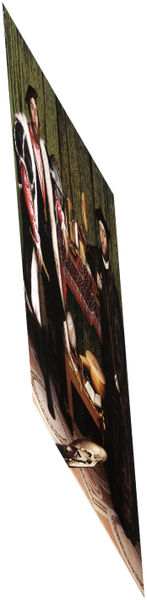
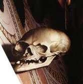
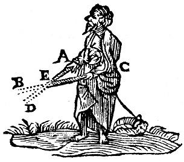
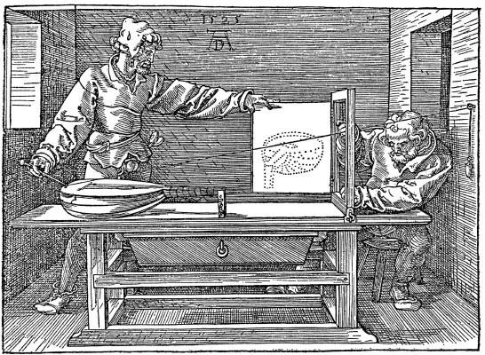
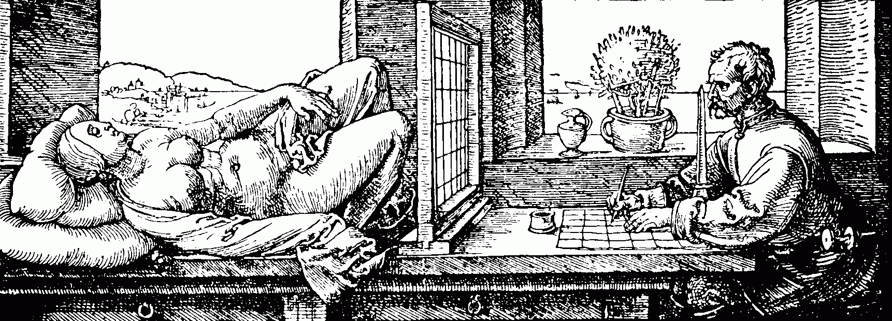

# Leçon 07 | 26 février 1964

<!-- source-url: http://staferla.free.fr/S11/S11 FONDEMENTS.docx -->
<!-- seminar: s11 -->
<!-- lesson: 07 -->

<!-- id: s11-07-0001 -->

*Vainement*… je répète,

<!-- id: s11-07-0002 -->

> *Vainement ton image arrive à ma rencontre*
>
> *Et ne m’entre où je suis qui seulement la montre*
>
> *Toi te tournant vers moi tu ne saurais trouver*
>
> *Au mur de mon regard que ton ombre rêvée*
>
> *Je suis ce malheureux comparable aux miroirs*
>
> *Qui peuvent réfléchir mais ne peuvent pas voir*
>
> *Comme eux mon œil est vide et comme eux habité*
>
> *De l’absence de toi qui fait sa cécité*

<!-- id: s11-07-0003 -->

Vous vous souvenez peut-être que lors d’un de mes derniers propos, *j’ai commencé par ces vers qui, dans* *Le Fou d’Elsa* d’ARAGON, sont inti­tulés « *Contre-chant* ». Je ne savais pas alors que je donnerais autant de développement à ce qui concerne *le regard*.
Sans doute, j’y ai été infléchi par le mode sous lequel j’ai été amené à vous présenter plus spécialement la fonction, le concept,
dans FREUD, de la « *répétition* ».

<!-- id: s11-07-0004 -->

Ne nions pas que c’est *en ce point* du développement que, disons cette « *digression »* concernant spécialement *la fonction scopique*,
que c’est *à l’in­térieur de l’explication de la répétition* que cette digression se situe, sans doute soutenue, encouragée, induite,
par ce qui m’est venu dans l’intervalle - m’a-t-il semblé - *de nécessaire, de nécessaire* à vous présenter dans l’œuvre qui vient de paraître
de MERLEAU-PONTY : *Le visible et l’invisible.*

<!-- id: s11-07-0005 -->

Aussi bien, me paraît-il que s’il y a là « *rencontre* », c’est une *rencontre heureuse* \[εὐτυχία (eutuchia)\], fondamentale, et destinée à ponctuer, comme j’essaierai de le faire plus avant aujourd’hui, comment dans la perspective de l’incons­cient nous pouvons situer *la conscience*.

<!-- id: s11-07-0006 -->

Vous le savez, que *quelque voile*, *quelque ombre* ou même, pour employer un terme dont nous nous servirons, *quelques réserves* - *au sens*
*où l’on parle de* « *réserves* [^42] » *dans une toile exposée à la teinture* - *quelques réserves marquent ce fait de la conscience dans le discours même de* FREUD.

<!-- id: s11-07-0007 -->

Reprenons les choses au point où nous les avons laissées la dernière fois.

<!-- id: s11-07-0008 -->

Je voudrais dire qu’elles ne m’ont pas donné à moi-même toute satisfaction quant à ce que j’ai pu vous faire apercevoir
de ce que j’ai appelé : « *schize de la vision et du regard* ». C’est ceci, qu’avec quelque chan­ce, j’espère pouvoir vous présenter aujourd’hui, vous faire sentir dans sa fonction propre.

<!-- id: s11-07-0009 -->

Je dois pourtant, avant de m’y engager et justement à propos de la fonction fondamentale de la rencontre, préciser un point qui n’est point de l’ordre de ce que nous allons développer aujourd’hui concer­nant *la fonction visuelle*. C’est quelque chose dont j’ai appris qu’il avait été mal entendu la dernière fois, par les oreilles qui m’entendent, à savoir je ne sais quelle perplexité qui est restée
dans ces oreilles concernant pourtant l’emploi d’un mot bien simple que j’ai employé en le commentant : j’ai parlé du « *tychique* ».

<!-- id: s11-07-0010 -->

Il n’a résonné pour cer­tains que comme un *éternuement*. *J’avais pourtant précisé qu’il s’agis­sait* *de l’adjectif de* τύχη \[tyché\] *- comme « psychique » est l’adjectif qui corres­pond à* ψυχή \[psyché\] - et aussi bien n’est-ce pas sans intention que je me ser­vais de cette analogie au cœur
de l’expérience de *la répétition*, au cœur de toute conception du développement psychique telle que l’analyse l’a éclairé.

<!-- id: s11-07-0011 -->

Le fait du « *tychique* », vous ai-je dit, est central et c’est par rap­port à l’œil, par rapport

<!-- id: s11-07-0012 -->

- à cette εὐτυχία \[eutuchia : *rencontre heureuse*\] ou cette δυστυχία \[dustuchia : *rencontre malencon­treuse* \],

<!-- id: s11-07-0013 -->

- cette « *rencontre heureuse* » ou cette « *rencontre malencon­treuse* »,

<!-- id: s11-07-0014 -->

…que mon discours d’aujourd’hui aussi s’ordonnera.

<!-- id: s11-07-0015 -->

« *Je me voyais me voir* », dit quelque part *La Jeune Parque*. Assurément cet énoncé a son sens, plein et complexe à la fois, quand il s’agit *du thème que développe La Jeune Parque, à savoir celui de la féminité*. Nous n’en sommes point arrivés là. Nous avons affaire au philosophe qui, lui, sai­sit quelque chose, dont on peut dire que c’est un des corrélats essentiels de *la conscience dans son rapport à la représentation,*
et qui se désigne comme : « *je me vois me voir* ». Quelle *évidence* peut bien s’attacher à cette formule ?

<!-- id: s11-07-0016 -->

Comment se fait-il qu’elle reste en somme corrélative à ce mode fondamental, inau­gurant, originel, où nous nous sommes référés dans le *cogito* cartésien, par quoi le sujet se saisit comme pensée, au point même - dernier - où cette pensée, il l’isole en une sorte
de doute, qu’on a appelé « *le doute métho­dique* », que tout ce qui pourrait lui porter appui dans *la représentation* où qu’il croit devoir limiter à sa saisie par elle-même, dans le doute.

<!-- id: s11-07-0017 -->

Comment se fait-il que ce « *je me vois me voir* » reste en quelque sorte l’enveloppe, le fond, *le quelque chose de collé à ce point extrême* et dont peut-être - *plus qu’on le pense* - dépend sa certitude ? Ce n’est pas tout de dire qu’il y aurait là ce point de référence derniè­re par où le sujet, malgré son attache à un corps, nulle évidence ne s’at­tacherait à une formule comme celle-ci : « *Je me chauffe à me chauffer* ».
Ici, nul doute, c’est d’une référence au corps qu’il s’agit : comme corps je suis gagné par cette sensation de chaleur qui d’un point quelconque en moi se diffuse, et me localise comme corps.

<!-- id: s11-07-0018 -->

Dans le « *je me vois me voir* », il n’est point sensible que je sois, d’une façon analogue, gagné par la vision. Bien plus, *les phénoménologues* ont pu articuler avec précision et de la façon la plus confondante, qu’il est tout à fait clair que je vois *au dehors*, « hors de... »,
que la perception n’est pas en moi, qu’elle est sur les objets qu’elle appréhende.

<!-- id: s11-07-0019 -->

Je saisis le monde dans une perception qui pourtant semble relever de cette immanence qu’il y a dans le « *je me vois me voir* ».
Le privilège du sujet, donc ici paraît s’établir de cette *relation bipolaire* - si l’on peut dire - à la suite de quoi il semble que dès lors
mes représentations m’appartiennent.

<!-- id: s11-07-0020 -->

Et c’est par là que le monde - dans cette *réflexion* - est frappé d’une pré­somption d’idéalisation, du soupçon de ne me livrer que
mes représen­tations, idéalisant toute théorie, dont le sérieux pratique n’a su... ne pèse pas vraiment lourd, mais par contre
qui met le philosophe, aussi bien vis-à-vis de lui-même que vis-à-vis de ceux qui l’écoutent, dans une position d’embarras : comment dénier que rien du monde ne m’ap­paraît que dans *mes représentations* ?

<!-- id: s11-07-0021 -->

Et vous le savez, *c’est là la démarche irréductible, fondamentale, de l’évêque* BERKELEY[^43], *dont il y aurait, quant à sa position subjective,*
*beaucoup à dire*, nommément concernant ce qui sans doute vous a échappé au passage, à savoir ce « *m’appartient* » de *mes représentations*, qui évoque le monde de la pro­priété. À la limite, le procès de cette méditation va jusqu’où vous savez qu’il a été, par le progrès de cette réflexion réfléchissante, à savoir : de réduire ce sujet saisi dans la méditation cartésienne à un pouvoir de néantisation.
Le mode de *ma présence au monde*, c’est ce sujet en tant qu’à force de se réduire à cette seule certitude d’être sujet, il devient néantisation active, que la suite de la méditation philosophique fait basculer effectivement vers l’action historique transformante,
et - autour de ce point - ordonne les modes configurés, actifs de la *conscience de soi*, à travers ses métamor­phoses dans l’Histoire.

<!-- id: s11-07-0022 -->

À la limite enfin, cette *méditation sur l’Être* qui vient, par exemple, à son *culmen* dans la pensée de HEIDEGGER, et telle qu’elle est reprise par SARTRE dans *L’être et le néant,* viendra restituer à l’être même, ou tout au moins à poser la question :
*comment c’est à l’être que peut être rappor­tée cette présence dans le monde - et au milieu des étant - de ce pouvoir de néantisation ?*

<!-- id: s11-07-0023 -->

C’est bien là *le point* où nous mène Maurice MERLEAU-PONTY dans sa réflexion centrée sur *Le visible et l’invisible*,
et si vous vous reportez à son texte, vous verrez que c’est en ce point qu’il s’arrête ou plus exacte­ment qu’il choisit de reculer,
pour nous proposer de retourner aux sources de l’intuition concernant *Le visible et l’invisible* :

<!-- id: s11-07-0024 -->

- de repartir à ce qui est avant toute réflexion, qu’elle soit *théthique* [^44] ou non *théthique*,

<!-- id: s11-07-0025 -->

- de tenter de repérer dans cette phase antérieure, le point de surgissement de la vision elle-même,

<!-- -->

<!-- id: s11-07-0026 -->

- d’essayer de restaurer, car aussi bien, nous dit-il, ne peut-il s’agir que d’une reconstruction ou d’une restauration, non point d’un chemin parcouru dans le sens inverse, ce qui est à proprement parler impossible, de retourner en ce point où c’est - pour s’exprimer dans son langage - non point du corps mais de *quelque chose* qu’il appelle « *la chair du monde* », qu’a pu surgir *ce point originel* de la vision, de quelque chose qui apparaît, pour y révéler cette dimension originale pour nous si liée à ce qui, par la suite de la réflexion philosophique de la recherche de l’επιστήμε \[épistémè\] et *du juste savoir*, paraît toujours si enraciné dans ce champ de la vision.

<!-- id: s11-07-0027 -->

Il semble qu’on voie dans cet ouvrage inachevé, se dessiner quelque chose comme la recherche de ce point d’une manifestation, d’une sub­stance innommée, où moi-même, le voyant, je m’extrais des rets - ou rais si vous voulez - d’un chatoiement
dont je suis d’abord une part. C’est dans le sens de ce secret, d’où je surgirai comme « *œil* », prenant en quelque sorte émergence,
origine, de ce que je pourrai appeler *la fonction de la voyure *:

<!-- id: s11-07-0028 -->

- quelque chose comme une odeur sauvage en émane qui aussi bien dans le texte est ponctué de ce mot même, laissant entrevoir quelque chose comme « *la chasse d’Artémis* » à l’horizon,

<!-- id: s11-07-0029 -->

- quelque chose dont aussi bien la touche semble s’associer au moment de *la tragique défaillance*,

<!-- id: s11-07-0030 -->

> où nous avons perdu celui qui parle.

<!-- id: s11-07-0031 -->

*Est-ce bien là pourtant le chemin qu’il voulait prendre* ? Ce qui nous reste des traces concernant la partie à venir de sa méditation
nous per­met aussi bien d’en douter. Dans ces traces, les repères qui sont donnés très spécialement à l’inconscient - à l’inconscient proprement psychana­lytique - nous laissent entrevoir que c’est dans la perspective d’une recherche proprement articulée
autour de ce fait dimensionnel nouveau, original de *la méditation sur le sujet* telle que l’analyse nous permet à nous de la tracer,
qu’il se serait peut-être dirigé.

<!-- id: s11-07-0032 -->

Aussi bien, quant à moi, ne puis-je qu’être frappé de certaines de ses notes qui m’apparaissent moins *énigmatiques*
qu’elles ne paraîtront à d’autres lecteurs, pour se recouvrir très exactement avec des schèmes, avec spécialement l’un d’entre eux
que je serais amené à promouvoir ici : notes concernant ce qu’il appelle *le retournement en doigt de gant,* pour autant qu’il semble
y apparaître - je sais, dans un tel retournement imaginé à la façon dont la peau enveloppe la fourrure dans un gant d’hiver -
*que la conscience dans son illusion de « se voir se voir », trouve son fondement dans quelque chose qui concerne la structure retournée du regard*.

<!-- id: s11-07-0033 -->

Mais qu’est-ce que *le regard* ? C’est ce dans quoi j’essaierai de m’avancer aujourd’hui à partir de *ce fait premier, décisif*, où se marque dans ce champ, toujours poursuivi plus loin, de la réduction du sujet, à ce point de néantisation qui marque la cassure,
quelque chose où l’analyse nous avertit que, fondée ou infondée, cette direction exige que nous l’introduisions d’une autre référence que l’analyse prend à réduire les privilèges de la conscience, en lui fixant des bornes, en considérant la conscience comme bornée irrémédiable­ment, quant à cette attente dont il s’agit : du sujet comme pensée, ou l’ins­tituant - cette conscience - comme principe non seulement d’idéalisation, mais de méconnaissance et comme on l’a dit, en un terme qui prend sa valeur
de nouveau de se référer au domaine visuel, en l’instituant pro­prement, comme « *scotome* ».

<!-- id: s11-07-0034 -->

Vous savez que le terme a été introduit dans le champ du vocabulaire analytique et nommément au niveau de l’École française.
Est-ce là simple métaphore ? Nous retrouvons de nouveau l’ambiguïté concer­nant tout ce qui touche à ce qui pour nous s’inscrit dans le registre de *la pulsion scopique*.

<!-- id: s11-07-0035 -->

La conscience, ici pour nous désormais, ne compte que par son rap­port à ce que - *dans des fins trop propédeutiques, n’oublions pas -*
j’ai essayé de vous montrer comme s’articulant au mieux dans la fiction du *texte décomplété*, à partir duquel il s’agit de recentrer le sujet - comme *parlant*, précisément - dans *les lacunes* de ce dans quoi il se présente au premier abord comme *parlant*.

<!-- id: s11-07-0036 -->

Qu’est-ce ici à dire ? Que nous n’énonçons que le rapport du préconscient à l’inconscient. Mais que, comme FREUD l’a souligné,
la fiction particulière, la dynamique qui s’attache à la conscience comme telle, à l’attention que le sujet a apporté à son propre texte, est quelque chose qui reste en quelque sorte jusqu’ici, en dehors et à proprement parler non encore articulé.

<!-- id: s11-07-0037 -->

C’est ici que j’avance que ce rapport d’intérêt que le sujet prend à sa propre *schize*, est lié à *ce caractère par quoi cette schize est déterminée*, déterminée - comme en *tout fantasme,* en tant que je vous en donne la for­mule générale *comme dépendance de la schize du sujet par rapport*
*à un objet privilégié surgi de quelque séparation primitive, de quelque auto-mutilation -* déterminée par l’approche même du *réel*.

<!-- id: s11-07-0038 -->

Dans ce rapport, qui est *le rapport scopique*, cet objet - d’où dépend le fantasme, auquel le sujet est appendu dans une vacillation essentielle - cet objet s’appelle *le regard*. Son privilège, et aussi bien ce pourquoi le sujet pendant si longtemps a pu se méconnaître comme étant dans cette dépendance, tient à la struc­ture, à la nature même, puis-je dire, du regard.

<!-- id: s11-07-0039 -->

Tout de suite, *schémati­sons* ce qu’ici nous voulons dire. Dès que ce regard, le sujet essaie, si je puis dire, de s’y accommoder,
*il devient cet objet punctiforme, ce point d’être évanouissant, avec quoi le sujet confond sa propre défaillance.*

<!-- id: s11-07-0040 -->

De tous les objets où le sujet peut reconnaître la dépendance où il est dans le registre du désir, *le regard* se spécifie comme insaisissable, et c’est pour cela qu’il est, *plus que tout autre objet*, méconnu. C’est aussi peut-être pour cela que le sujet trouve
si heureusement à se symboliser dans son propre trait évanouissant et punctiforme, dans ce quelque chose où il ne reconnaît pas
*le regard*, à savoir dans cette illusion de la conscience de « *se voir se voir*. »

<!-- id: s11-07-0041 -->

La question est donc : *si le regard est cet envers de la conscience, comment allons-nous essayer* - si vous me permettez l’expression –
*de nous « imaginer » le regard* ? L’expression n’est point indue, car enfin, le regard, nous pouvons lui donner *corps*.

<!-- id: s11-07-0042 -->

Vous le savez, SARTRE, en un des passages les plus brillants de *L’être et le néant* le fait entrer en fonction dans la dimension
de *l’existence d’au­trui*. Entreprise à proprement parler fascinante, car elle est heureuse. Je veux dire qu’elle nous donne le sentiment que quelque part, en un point absolument privilégié, il lui est donné réellement, réalisé.

<!-- id: s11-07-0043 -->

Vous le savez, c’est comme *regard* qu’autrui se présentifie, dans un champ qui est celui que SARTRE a d’abord défini comme celui de l’objectivité. Pour autant qu’il laisse dans une confrontation - liés en une incertitude fonda­mentale - *l’objet et la conscience néantisante*, autrui resterait suspendu aux mêmes conditions.

<!-- id: s11-07-0044 -->

*L’autrui* - ai-je dit, j’espère - resterait suspendu aux même conditions partiellement irréalisantes qui seraient celles de *l’ob­jectivité,*
s’il n’y avait *le regard*. *Le regard* tel que le conçoit SARTRE, c’est *le regard dont je suis surpris*, surpris en tant :

<!-- id: s11-07-0045 -->

- qu’il change toutes les *perspectives* de mon monde,

<!-- id: s11-07-0046 -->

- qu’il en change ses lignes de force,

<!-- id: s11-07-0047 -->

- qu’il - du point de néant où je suis - ordonne le monde dans une sorte de *réticulation rayonnée des organismes*.

<!-- id: s11-07-0048 -->

Ce lieu de rapport de *moi*, sujet néantisant, par rapport à ce qui m’entoure, aussi bien *le regard* à son sens aurait là un tel privilège
qu’il irait jusqu’à me faire « *scotomiser* » - c’est moi qui ici ajoute le mot - l’œil de celui qui me regarde comme objet : en tant que
je suis sous le regard, écrit SARTRE, je ne verrais plus l’œil qui me regarde, et si je vois l’œil, c’est alors le regard qui disparaît.

<!-- id: s11-07-0049 -->

Est-ce là une analyse phénoménologique qui puisse être tenue pour effectivement juste ? Il n’est pas vrai que quand je suis
sous le regard, que quand je demande un regard, que quand je l’obtiens, *je ne m’y intéresse point, je ne le vois point comme regard*.
*Cette sphère qui peut s’étendre assez loin* - et il s’agit justement de savoir jusqu’où elle s’étend - *cette sphère du masque que j’appelle le regard*,
des peintres ont été éminents à le saisir, ce *regard* comme tel, *dans le masque*, et je n’ai besoin que d’évoquer GOYA, par exemple, pour vous le faire sentir.

<!-- id: s11-07-0050 -->

Le regard se voit, ce regard dont parle SARTRE, ce regard qui me sur­prend et me réduit à quelque honte, puisque c’est là
le sentiment qu’il dessine comme le plus accentué. La raison de cette rencontre du regard, c’est curieusement à repérer
dans le texte même de SARTRE, *non point tant dans un regard vu*, *qu’un regard par moi imaginé au champ de l’Autre*.

<!-- id: s11-07-0051 -->

Car si vous vous reportez à son texte, vous verrez que loin de parler de l’entrée en scène de ce regard comme de quelque chose
qui concerne ce que nous appelons un « *regard* », c’est à *un bruit de feuilles* soudain entendu tandis que je suis à la chasse,
qu’il se reporte, c’est à *un pas surgi dans le couloir* - *et à quel moment* ? - au moment où lui-même s’est présenté dans l’action de regarder et pas n’importe comment : par un trou de serrure. C’est un *regard* qui, le surprend dans la fonction de voyeur imaginaire
qu’il soutient, qui le déroute, le chavire et le réduit à ce sentiment de la honte. Le *regard* dont il s’agit est bien *présence d’autrui*
comme tel, et sans doute rapport à quelque chose dont il n’est point fondamentalement erroné de l’appeler « *regard* ».

<!-- id: s11-07-0052 -->

Mais est-ce bien dire qu’originalement c’est dans ce rapport de sujet à sujet, dans *la fonction de l’existence d’autrui comme me regardant*,
que nous saisissons bien ce dont il s’agit d’origi­nal dans le *regard* ? Peut-être y aurait-il moyen de repérer dans le champ de la vision même auquel il appartient si évidemment, ce regard comme *objet*, objet dans la fonction dont il s’agit, à savoir :
dans ce rapport à l’inconscient pour autant qu’il nous permet - pour la première fois dans l’histoire - de situer la relation du désir.

<!-- id: s11-07-0053 -->

Et aussi bien dans l’exemple sartrien lui-même, se voit-il que le regard ici n’intervient, n’est efficace que pour autant que le sujet
s’y sent surpris, non pas tellement comme sujet - comme *cet élément néantisant, punctiforme* qui est le corrélatif du monde de l’ob­jet, d’idées - mais de SARTRE qui s’*incarne* devant nous, qui se représente comme surpris dans une fonction, elle-même, *de désir*.

<!-- id: s11-07-0054 -->

Et ce n’est pas parce que ce désir s’instaure dans le domaine même dont il s’agit, celui que j’ai appelé de *la voyure*, que nous pouvons esca­moter cette dimension, puisque là elle fait surgir pour le relater, mon désir d’une façon qui, par rapport à ce qui précède, introduit une dimen­sion nouvelle.

<!-- id: s11-07-0055 -->

Le privilège du regard dans la fonction du désir, dans le mécanisme de la vision même, est en nous, *coulant* si je puis dire, le long même des veines par où ce domaine de la vision comme tel, est inté­gré à ce qui concerne le désir. Ce n’est point pour rien que c’est à la même époque, où la méditation cartésienne inaugure dans sa pureté la fonction du sujet, que se déve­loppe au plus haut point *cette dimension de l’optique*, que je distingue­rai ici en l’appelant « *géométrale* ».

<!-- id: s11-07-0056 -->

Je vais tout de suite centrer autour d’un objet, et pour que ma démonstration ne vous paraisse point se perdre dans l’abstraction, illustrer par un objet entre autres - *il en est de nombreux* - ce qui me paraît exemplaire dans ce qui, si curieusement, a attaché tant de réflexions, tant de constructions à l’époque. Une référence - pour ceux qui voudront pousser plus loin ce que j’es­saie de vous faire sentir aujourd’hui - le livre de BALTRUSAÏTIS [^45] sur les *Anamorphoses.*

<!-- id: s11-07-0057 -->

J’ai fait, dans le temps, dans mon séminaire, grand usage de certaines propriétés de cette fonction de l’anamorphose précisément dans la mesure où elle était une structure exemplaire. Pour ceux qui n’ont pas été là au moment où j’en parlais, et qui ne savent pas d’autre part, ce que c’est qu’une anamorphose, j’en ai mon­tré à mon séminaire un très, très, bel exemple que j’ai pris soin d’appor­ter du dehors. Une anamorphose simple, non pas cylindrique, consis­te en ceci :

<!-- id: s11-07-0058 -->

- supposons un portrait qui serait ici sur cette feuille plane, et vous voyez là, par chance, ce tableau noir dans cette position oblique.

<!-- id: s11-07-0059 -->

- Supposez qu’à l’aide d’une série de fils ou de traits idéaux, je reporte sur cette paroi oblique chaque point de l’image ici dessinée.

<!-- id: s11-07-0060 -->

Je pense que vous imaginez facilement ce qui en résultera sur un tableau si c’est *un tableau oblique* : vous obtiendrez cette figure extraordinai­rement élargie et déformée selon les lignes de ce qu’on peut appeler une perspective. Ça suppose que si ce travail étant fait, j’en laisse… j’enlève ce qui a servi à la construction, à savoir l’image placée dans mon propre champ visuel, l’impression que
je retirerai en me plaçant, en restant à cette place par rapport à la paroi oblique qui est là-bas en face de moi, sera sensiblement
la même, à savoir, disons qu’au moins je reconnaîtrai les traits généraux de l’image, au mieux j’en aurai une impression iden­tique.

<!-- id: s11-07-0061 -->

Je vais maintenant faire circuler quelque chose qui date d’une centai­ne d’années auparavant, 1533, à savoir l’image que je pense
vous recon­naissez tous : *[Les Ambassadeur](http://fr.wikipedia.org/wiki/Les_Ambassadeurs)s* peints par Hans HOLBEIN. Ceux qui le connaissent s’en verront par là remémorés.
Ceux qui ne le connaissent pas, auront à la considérer avec attention pour l’usage que j’espère en faire dans ce qui va venir.

<!-- id: s11-07-0062 -->

  

<!-- id: s11-07-0063 -->

Déjà, le mode sous lequel je viens d’être amené à vous exposer la construction d’une *anamorphose* vous introduit à la considération de quelque chose concernant *le champ de la vision* que j’exprimerai ainsi : il y a un mode sous lequel la vision s’ordonne
dans ce qu’on peut appeler en général *la fonction des images*, cette fonction se définissant en relation à *une correspondance point par point*
de deux unités dans l’espace. Qu’une image *soit une image virtuelle, qu’elle soit une image réelle*, quels que soient les intermédiaires optiques pour établir leur rela­tion, cette correspondance *point par point* est *essentielle*.

<!-- id: s11-07-0064 -->

Ce qui est de cet ordre dans le champ de la vision est donc réductible à ce schéma, le plus simple, celui qui est matérialisé
dans le mode sous lequel tout à l’heure je vous expliquais que pouvait s’établir *l’anamor­phose*, à savoir le rapport d’une image,
en tant qu’elle est liée à une sur­face, à un certain point que nous appellerons si vous le voulez, pour nous entendre, « *point géométral* ».
Et que quoi que ce soit qui soit déter­miné de cette façon méthodique où *la ligne droite* joue son rôle du fait d’être *le trajet de la lumière*, quoi que ce soit qui s’établisse dans un tracé ainsi constitué, pourra s’appeler « *image* ».

<!-- id: s11-07-0065 -->

Il est clair qu’au point de la réflexion artistico-scientifique, l’art se mêle à la science : Léonard de VINCI est à la fois savant par
ses constructions dioptriques et en même temps artiste. Aussi bien le traité de [VITRUVE](http://fr.wikipedia.org/wiki/Vitruve) \[[Vitruve : De Architectura](http://www.bvh.univ-tours.fr/Consult/consult.asp?numtable=B372615206_2994&numfiche=131&mode=3&offset=0)\] sur l’architecture, n’est pas loin. C’est dans [VIGNOLE](http://fr.wikipedia.org/wiki/Vignole)[^46] \[[Vignola : Le Due regole dé lia prospettiva](http://books.google.fr/books?id=x1lLAQAAIAAJ&pg=PA103&lpg=PA103&dq=Le+Due+regole+d%C3%A9+lia+prospettiva&source=bl&ots=GiRmKpV1cy&sig=Gci4lV79_oPgAYkK_OJVq23Sg44&hl=fr&sa=X&ei=MHY8UdayLKHR7Ab-p4HAAQ&ved=0CFIQ6AEwBw#v=onepage&q=Le%20Due%20regole%20d%C3%A9%20lia%20prospettiva&f=false)\], et dans [ALBERTI](http://fr.wikipedia.org/wiki/Leon_Battista_Alberti)[^47] \[[Léon Battista Alberti : *De Pictura*](http://gallica.bnf.fr/ark:/12148/bpt6k65009h.capture)\]
que nous trouvons *l’interrogation progres­sive des lois géométrales de la perspective*, et autour des recherches pour la perspective que s’institue un intérêt privilégié concernant le domaine de la vision dont nous ne pouvons pas ne pas voir *la relation avec l’in­terrogation*
\- j’allais dire *l’institution* - du sujet cartésien, qui est lui aussi une sorte de point géométral.

<!-- id: s11-07-0066 -->

Le sujet ici s’institue comme *point de pers­pective*, d’où l’ordre de *la vision,* tel qu’à cette époque *le tableau* - cette fonction si importante sur laquelle nous aurons à revenir - s’instau­re, s’organise d’une façon complètement nouvelle dans l’histoire de la peinture,
de cette *perspective*, rigoureuse en tant qu’elle est *géométrale*. C’est là ce à quoi, en ce point crucial de la constitution du sujet
et de son rapport à la vision, c’est là ce à quoi nous avons affaire.

<!-- id: s11-07-0067 -->

Or, je vous prie de vous reporter à l’œuvre de DIDEROT *[Lettre sur les aveugles à l’usage de ceux qui voient](http://fr.wikisource.org/wiki/Lettre_sur_les_aveugles_%C3%A0_l%E2%80%99usage_de_ceux_qui_voient),* pour que vous y voyez développé de façon manifeste, *quelque chose* qui vous rendra sensible que ceci lais­se totalement échapper ce qu’il en est de la vision. Car cet espace de la vision - *même en y incluant ces parties imaginaires dans l’espace virtuel : dans le miroir dont vous savez que j’ai fait grand état -*
est parfaitement reconstructible, imaginable par un aveugle.

<!-- id: s11-07-0068 -->

Ce dont il s’agit est *repérage de l’espace*, et non pas *vue*. L’aveugle peut concevoir que sous certains modes, ce champ de l’espace
qu’il connaît et qu’il connaît comme réel, peut-être perçu à distance et comme simultanément. C’est bien plus d’une fonction temporelle, d’une instantanéité dans une exploration où, comme les ouvrages d’optique le montrent - - voyez l’ouvrage même
de DESCARTES en sa *[Dioptrique](http://classiques.uqac.ca/classiques/Descartes/dioptrique/dioptrique.pdf) - l’action des yeux est représentée comme l’action conjuguée de deux bâtons*.

<!-- id: s11-07-0069 -->

<!-- id: s11-07-0070 -->

\[Descartes : Dioptrique, Fig. 21\]

<!-- id: s11-07-0071 -->

Cette dimension géométrale de la vision est quelque chose qui, *à tout le moins* devons-nous dire, n’épuise pas - et loin de là -
*ce que le champ de la vision* comme tel, *nous propose comme relation subjectivante originelle*. Aussi bien devons-nous entendre *cet usage*,
en somme - vous le voyez - *inversé, qui est fait dans l’anamorphose, de l’établissement de la pers­pective*. Car quel en est l’appareil originel ?

<!-- id: s11-07-0072 -->

C’est [DÜRER](http://fr.wikipedia.org/wiki/Albrecht_D%C3%BCrer)[^48] \[[Albrecht Dürer : Underweysung der Messung](http://gallica.bnf.fr/ark:/12148/btv1b2100033g.planchecontact)\] lui-même qui l’a inventé. *Le « portillon de Dürer »*, c’est quelque chose qui est comme ce que tout à l’heure je mettais entre moi et ce tableau, à savoir *une certaine image*. Ou plus exactement une toile, un treillis que vont tra­verser les points, les lignes droites, qui ne sont pas du tout obligatoire­ment des rayons mais aussi bien des fils qui relieront chaque point que j’ai à voir dans l’entourage, *la structure du monde*, à un point où *la toile, le réseau* sera par cette ligne traversé.
C’est pour établir une image pers­pective correcte que le *« portillon de Dürer »* est institué.

<!-- id: s11-07-0073 -->

<!-- id: s11-07-0074 -->

<!-- id: s11-07-0075 -->

Que *j’en renver­se l’usage*, que je prenne plaisir à quelque chose qui n’est *pas du tout la restitution du mon*de qu’il y a au bout, mais
\- *pour une autre surface* - *la déformation* de ce que j’aurais moi-même obtenu *d’une image* sur cette surface de champ, que je m’attarde comme à un jeu délicieux à *ce procédé* qui fait apparaître quelque chose dans un étirement, une déformation particulière,
et je vous prie de croire que la chose a eu sa place dans son temps.

<!-- id: s11-07-0076 -->

Le livre de BALTRUSAÏTIS vous dira les polémiques furieusement pas­sionnées qui sont surgies de ces pratiques qui avaient abouti à des ouvrages considérables.

<!-- id: s11-07-0077 -->

Le *Couvent des Minimes -* actuellement détruit, mais qui était du côté de la rue des Tournelles - portait sur une très longue paroi
d’une de ses galeries, comme par hasard *Le Saint Jean l’Evangéliste à Patmos,* tableau qui est à la mesure d’une galerie d’une longueur
à peu près comparable. Où, encore, il fallait le voir à travers un trou pour que tout l’effet fût porté à toute sa valeur déformante
et pouvait - comme ce n’était pas le cas dans cette fresque particulière mais comme ça l’était dans d’autres –
prêter à toutes les *ambiguïtés paranoïaques.* Tous les usages ont été faits, depuis [ARCIMBOLDO](http://fr.wikipedia.org/wiki/Giuseppe_Arcimboldo) jusqu’à Salvador DALI.

<!-- id: s11-07-0078 -->

Est-ce qu’il ne vous paraît pas singulier, voire frappant, que ce quelque chose, où j’irai jusqu’à voir la fascination complémentaire
de ce que laissait échapper ce type de recherches sur la perspective, comment se fait-il que personne n’ait jamais songé à y évoquer *quelque chose qui ressemble à l’effet… d’une érection* ? Imaginez un tatouage qui se déve­loppe sur l’organe *ad hoc* où il était tracé
à l’état de repos, où il prend - *dans un autre état* - sa forme si j’ose dire, développée.

<!-- id: s11-07-0079 -->

Est-ce que vous n’avez pas là quelque chose où apparaît, comme im­manente à cette phase spécifiée - extraite, \[...\] - dans la formation du regard, comme étant cette fonction géométrale qui, je vous le souligne, n’a rien à faire à proprement parler comme telle
avec la vision qui n’en suppose absolument pas la dimension que nous essaierons dans sa forme propre d’articuler, et d’articuler
la prochaine fois ? Comment ne pas là voir dans ce jeu même, ici *manifesté*, au niveau de cette dimension partielle,
*manifesté* quelque chose comme ce qui pour nous prend toute sa valeur d’être par ailleurs symbolique de *la fonction du manque*,
à savoir *l’apparition du fantôme phallique* !

<!-- id: s11-07-0080 -->

Or, dans ce tableau des *Ambassadeurs,* qui j’espère a circulé assez pour qu’il ait passé maintenant entre toutes les mains,
*que voyez-vous : qu’est-ce cet objet étrange, suspendu, oblique au premier plan*, en avant de ces deux personnages, dont la valeur comme *regard*, je pense, vous est apparue à tous, ces deux personnages figés, raidis dans leurs ornements monstrateurs, entre lesquels toute une série d’objets qui ne sont rien d’autre que ces objets là même, qui dans la peinture de l’époque figurent les symboles de la *vanitas* ?

<!-- id: s11-07-0081 -->

[CORNEILLE AGRIPPA](http://fr.wikipedia.org/wiki/Henri-Corneille_Agrippa_de_Nettesheim) à la même époque écrit son *[De vanitate](http://gallica.bnf.fr/ark:/12148/bpt6k52599r.capture) [scientarum](http://gallica.bnf.fr/ark:/12148/bpt6k57277t.capture).* Il s’agit autant des sciences que des arts, et ces objets sont tous symboliques des sciences et des arts tels qu’ils étaient à l’époque groupés dans les *trivium* et *quadri­vium* [^49] que vous savez. Qu’est-ce que, devant cette monstration du *domaine de l’apparence* sous ses formes les plus fascinantes, que *cet objet volant ici incliné* ? Vous ne pouvez le savoir : *vous vous détournez pour échapper à la fascination du tableau*. Commencez à sortir de la pièce où sans doute vous a-t-il longuement captivé. C’est alors que, vous retournant en par­tant, comme le décrit l’auteur des *Anamorphoses,*
vous saisissez sous cette forme - quoi ? - une tête de mort.

<!-- id: s11-07-0082 -->

Or ce n’est point ainsi qu’elle se présente d’abord, cette figure que l’auteur compare à un os de seiche qui, quant à moi, m’évoque
ce pain de deux livres que DALI, dans l’ancien temps, se complaisait à poser sur la tête d’une vieille femme choisie exprès bien miséreuse, crasseuse et d’ailleurs inconsciente, ou bien encore ces montres molles - du même - dont évidemment la signification non moins *phallique* que celle de ce que vous voyez se dessiner en position volante au premier plan de ce tableau.

<!-- id: s11-07-0083 -->

Tout de ceci nous manifeste qu’au cœur même de ces recherches concernant la fonction géométrale, au cœur même de ce moment historique où se dessine le sujet, HOLBEIN nous manifeste ici, d’une façon visible, quelque chose qui n’est rien d’autre que de voir au premier plan du tableau ce qui est suffisamment indiqué par sa forme enfin aperçue dans la perspective anamorphique,
à savoir le sujet comme néantisé. Mais néantisé sous une forme qui est à proprement parler l’incarnation dans l’image de ce –ϕ
de la castration qui pour nous, centre et rend nécessaire de centrer tout ce qui concerne l’organisation des désirs à travers les cadres des pulsions fondamentales.

<!-- id: s11-07-0084 -->

Comment le dire plus profondément et voir que c’est plus loin enco­re qu’il faut chercher la fonction de la vision et voir se dessiner à partir d’elle, non point ce *symbole phallique* ni ce *fantôme anamorphique*, mais *le regard* comme tel, dans sa fonction pulsatile à la fois éclatante, étalée si l’on peut dire, comme elle l’est dans le tableau que vous avez, par exemple, qui n’est rien d’autre que ce que tout tableau est, à savoir *un piège à regard* ?

<!-- id: s11-07-0085 -->

Ce *regard -* dans quelque tableau que ce soit - c’est précisément à le chercher en chacun de ses points que vous le verrez disparaître.

<!-- id: s11-07-0086 -->

C’est ce que j’essaierai d’articu­ler mieux la prochaine fois.

## Notes

[^42]: Réserve (*terme de teinturerie*) : impression par techniques de réserve : méthode qui permet de masquer provisoirement des zones de tissu

    pour les isoler des produits tinctoriaux. Le tissu peut être réservé par réserve mécanique, liquide ou pâteuse (gutta, cire).

[^43]: George Berkeley : *Towards a New Theory of Vision*. Cf. D. M. Armstrong : *Berkeley's theory of vision, A critical examination of Bishop Berkeley's Essay :*

    *Towards a new theory of vision.* Melbourne University Press (1960).

[^44]: Thétique (adj.) : qui pose un contenu de pensée comme thèse. Chez Fichte, « jugement thétique » : jugement qui pose quelque chose de manière

    absolue. En phénoménologie : qui pose quelque chose en tant qu'existant.

[^45]:
    #  Jurgis Baltrusaitis : *Les perspectives dépravées* : Tome 2, *Anamorphoses*, éd. Flammarion 2008.

[^46]: Vignole : Iacopo Barozzi, dit Il [Vignola](http://www.bvh.univ-tours.fr/Consult/consult.asp?numtable=B372615206%5F2699&numfiche=214&mode=3&offset=4) (1507-1573), *Le Due regole dé lia prospettiva*. Cf. Les deux règles de la perspective pratique de Vignole,

    Egnatio Danti, Paris, CNRS Éditions, 2003.

[^47]: Léon Battista [Alberti](http://www.bvh.univ-tours.fr/Consult/consult.asp?numtable=B372615206%5F4781&numfiche=53&mode=3&offset=4) (1404-1472), De Pictura, 1435, Allia, 2007.

[^48]: Albrecht Dürer (1471-1528) *Underweysung der Messung*, Nuremberg, 1525. *Instruction sur la manière de mesurer*, Paris, Flammarion, 1995.

    *Géométrie*, Paris, Seuil, 1995.

[^49]: Le *trivium* et le [*quadrivium*](http://fr.wikipedia.org/wiki/Quadrivium) sont deux divisions, introduites à certaines époques du Moyen Âge, dans les matières de l'enseignement scolastique. Traditionnellement, on distingue [sept arts libéraux](http://fr.wikipedia.org/wiki/Sept_arts_lib%C3%A9raux). Trois d'entre eux, *la grammaire, la rhétorique et la [dialectique](http://fr.wikipedia.org/wiki/Dialectique)*, forment le trivium. Les quatre autres, *l'arithmétique, la géométrie, l'astronomie et la musique*, forment le quadrivium. Pour d'autres, le trivium représente les trois arts, le quadrivium, les quatre sciences.
