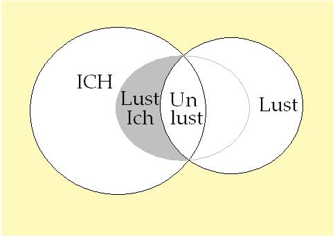
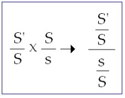
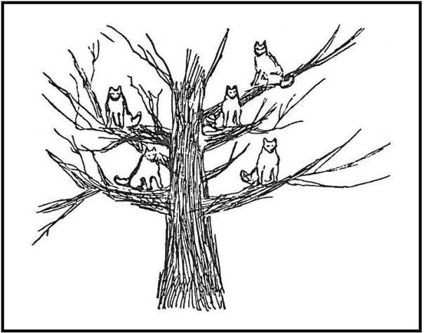
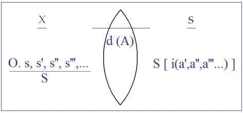

# Leçon 19 | 17 ju in 1964

<!-- source-url: http://staferla.free.fr/S11/S11 FONDEMENTS.docx -->
<!-- seminar: s11 -->
<!-- lesson: 19 -->

<!-- id: s11-19-0001 -->

Ce que je vais introduire aujourd’hui - qui n’est, aussi bien, quant à son vocabulaire, rien à quoi vous ne soyez hélas familiarisés -
va être une tentative de donner à un certain nombre de ces termes, une articulation, un ordre *fondamental* destiné au moins à ce que, vous en souvenant lorsque vous les rencontrerez -­ lesdits termes -­ l’ordre dans lequel je les aurai mis pour vous, vous fera évoquer un problème. Il s’agit, par exemple, des termes les plus usuels comme ceux : d’*iden­tification*, d’*idéalisation*, de *projection*, d’*introjection*.
Ce ne sont pas des termes évidemment, commodes à manier et -­ *vous l’observerez bien sûr* -­ d’autant moins commodes
à manier proprement qu’ils font sens.

<!-- id: s11-19-0002 -->

*Quoi de plus commun que d’identifier* ? *Ça semble même l’opération essentielle de la pensée*, il semble qu’on pourrait l’appliquer *à tous les tournants*. *Idéaliser* aussi, ça pourra beaucoup servir sans doute, à partir du moment où la position psychologiste se fera plus enquêteuse.
*Projeter* et *introjecter*, il semble que pour certains ils passent volontiers pour deux termes réciproques l’un de l’autre.

<!-- id: s11-19-0003 -->

Le fait que j’ai depuis longtemps pointé - peut-­être il conviendrait de s’en apercevoir - qu’un de ces termes se rapporte à un champ où domine le *symbolique*, l’autre l’*imaginaire*, ce qui doit faire qu’au moins dans une certaine dimension ils ne se rencontrent pas,
n’est assurément qu’un commence­ment de distinction. L’usage intuitif de ces termes, je veux dire à partir du sentiment qu’on a
de comprendre et de comprendre d’une façon isolée, comme déployant leur dimension dans la compréhension commune,
est évi­demment à la source de tous les glissements, de toutes les confusions, c’est le sort commun de toutes les choses du discours.

<!-- id: s11-19-0004 -->

Si dans le discours commun, celui qui parle - au moins dans sa langue maternelle s’exprime - d’une façon sûre et en somme avec
un tact si parfait que c’est à l’usager le plus commun d’une langue - aussi bien à l’homme *non instruit* - qu’on recourt pour savoir
quel est l’usage propre d’un terme. C’est bien donc que *dès que l’homme veut seulement parler, il s’orien­te dans cette topologie fondamentale*
qui est celle du langage, qui est bien différente du réalisme simpliste auquel se cramponne, plus ou moins désespérément,
trop souvent celui qui croit être à son aise dans le domai­ne de la science.

<!-- id: s11-19-0005 -->

L’usage naturel de termes - enfin, prenons-les vraiment au hasard - « *à part soi* », « *bon gré mal gré* », la différence qu’il y a entre
ce que c’est qu’une « *affaire* » et *une chose* « *à faire* », enfin l’usage du langage total implique cette topologie enveloppante
où le sujet se reconnaît quand il parle spontanément.

<!-- id: s11-19-0006 -->

Si je puis m’adresser à *des psychanalystes* concernant des termes comme ceux que je viens d’énumérer tout à l’heure et les solliciter
de repérer à quelle *topologie* implicite ils se rapportent en usant de chacun de ces termes, c’est *évidemment* - je suppose, et qu’après tout on peut constater, si incapables qu’ils soient souvent, faute d’enseignement, d’articuler ces termes - qu’ils en font couramment,
et avec la même spontanéité que l’homme du discours commun, ils en font dans l’en­semble un usage adéquat. Bien sûr, s’ils veulent absolument *forcer* les résultats d’une observa­tion, *comprendre là où ils ne comprennent pas*, on les verra en faire un usage *forcé*.
Dans ce cas-là, il y aura peu de gens pour les reprendre.

<!-- id: s11-19-0007 -->

Aujourd’hui donc, implique que je me réfère à ce tact de l’usage psy­chanalytique, concernant certains mots, pour pouvoir les mettre, les rac­corder, à l’évidence d’une topologie qui est déjà celle que j’ai apportée, décrite ici, et qui est par exemple incarnée *au tableau*, dans ces deux registres, ces deux articulations que j’ai déjà inscrites au tableau la der­nière fois et déjà distinguées :

<!-- id: s11-19-0008 -->

- celle du champ de l’*Ich primordial*, de l’*Ich objectivable* en fin de compte dans l’appareil nerveux, de l’*Ich du champ homéostatique*,

<!-- id: s11-19-0009 -->

- par rapport auquel se distinguent, se situent dans ce qui l’entoure, un champ du ou de la *Lust -* selon que vous considérez la façon dont il convient de traduire les genres - disons un *champ du* *Lust ou du plaisir*, et un *champ de l’Unlust.*

<!-- id: s11-19-0010 -->

<!-- id: s11-19-0011 -->

J’ai scandé que FREUD distingue bien ce niveau - il le distingue par exemple dans *l’article sur les Triebe,* sur *Les pulsions et leur vicissitudes -* il le distingue en marquant :

<!-- id: s11-19-0012 -->

- que ce niveau est à la fois marqué du signe d’organisation qui est un signe narcissique, et que c’est justement dans cette mesure qu’il est proprement articulé au champ du *réel*,

<!-- id: s11-19-0013 -->

- que dans le *réel* il ne distingue, il ne privilégie que ce qui se reflète dans son champ par un effet de *Lust,* qui se reflète dans son champ comme retour à *l’homéostase*. Bien plus, de ce fait, ce qui ne favorise pas *l’homéostase*, ce qui se maintient à tout prix comme *Unlust,* mord encore bien plus dans son champ.

<!-- id: s11-19-0014 -->

Et c’est ainsi que ce qui est de l’ordre de l’*Unlust,* s’y inscrit comme *non-moi*, comme négation du *moi*, comme écornage du *moi*.
Le *non-moi* ne se confond pas avec ce qui l’entoure, la vastitude du *réel*, le *non-moi* se distingue comme *corps étranger, fremde Objekt* :
il est là, situé dans la lunule \[Unlust\] que ces deux petits cercles à la EULER constituent.

<!-- id: s11-19-0015 -->

<!-- id: s11-19-0016 -->

Cela, je l’ai dit à la fin de mon discours de la dernière fois donc, et c’est là que je reprends. Et vous voyez que c’est là un registre
\- *le registre du plaisir* - un fondement objectivable que nous pouvons nous faire, en tant que le sachant étranger à l’objet
dont nous constatons le fonctionnement.

<!-- id: s11-19-0017 -->

Mais nous ne sommes pas que ça, et même pour être ça, il faut que nous soyons *le sujet qui pense*. Et en tant que nous sommes
*le sujet qui pense*, nous sommes alors impliqués, impliqués d’une façon toute différente, pour autant que nous dépendons du champ de l’Autre qui était là, et depuis un bout de temps, et avant que nous venions au monde, et dont ce sont les structures circulaires
qui nous déterminent comme sujet.

<!-- id: s11-19-0018 -->

Or il s’agit de savoir dans quel champ se passent les différentes choses auxquelles nous avons affaire dans le champ de l’analyse.
Eh bien, il s’en passe certaines au niveau du premier champ et certaines autres - qu’il convient de distinguer des premières,
si on les confond, on n’y comprend plus rien - d’autres choses, dans l’autre champ dont je vous ai montré les articulations essentielles *dans les deux fonctions* qui sont fonction du rapport du sujet à l’autre comme tel, *dans les deux fonctions* que j’ai *définies*
et *articulées* comme :

<!-- id: s11-19-0019 -->

- *celle de l’aliénation *: *premier temps*,

<!-- id: s11-19-0020 -->

- impliquant un *deuxième temps,* *celle de la séparation*. Il est évident que la suite de mon discours aujourd’hui suppose que depuis que j’ai introduit *ces deux fonctions*, vous y avez réfléchi, ça veut dire que vous avez essayé de les faire fonctionner, de les appliquer à dif­férents niveaux, de les mettre à l’épreuve.

<!-- id: s11-19-0021 -->

Dans ce champ, champ de l’aliénation, j’ai déjà fait remarquer cer­taines des conséquences de ce *vel* très particulier qui constitue l’aliénation : soit la mise en suspens du sujet, au sens. Mais la liaison en quelque sorte *interne*, consécutive de *cette sorte de vacillation*
*du sujet, disons même, la chute de sens,* qui vraiment renouvelle les articulations menaçantes de ce que j’ai essayé d’incarner autour
des formes familières : « *la bourse ou la vie* » ou la « *liberté ou la mort* », se reproduit, je dirais ici d’un « *l’être ou le sens* ».

<!-- id: s11-19-0022 -->

Termes que je n’avance pas, assurément, sans *réluctance* ou sans vous prier de ne pas vous précipiter, non plus à les trop *charger*
*de ces sens* qui les feraient basculer dans *une hâte* dont il convient avant tout que, dans l’avancée d’un tel discours, nous nous gardions. Mais néanmoins je l’introduis ici, puisque aussi bien le nerf de tout ce qu’impliquera, après cette année, *la poursuite de mon discours*, sera d’essayer d’articuler - s’il se peut - pendant l’année qui suivra, quelque chose qu’il s’agira d’intituler : « *Les positions subjectives »*.

<!-- id: s11-19-0023 -->

Car toute cette *préparation*, concernant *Les fondements de l’analyse*, doit normalement se déployer - puisque rien ne se centre convenablement que de la posi­tion du sujet - à montrer ce que l’articulation de l’analyse, de partir du désir, permet d’en illustrer.

<!-- id: s11-19-0024 -->

*Positions subjectives* donc, de quoi ? Si je me fiais à ce qui s’offre…

<!-- id: s11-19-0025 -->

> et à ce qui se ferait facilement entendre, et à ce qui rejoindrait après tout *l’expérience analytique la plus commune*
> …je dirais là : *Positions subjec­tives de l’existence*, avec toutes *les faveurs que ce terme peut trouver d’être déjà ambiant dans l’air*.

<!-- id: s11-19-0026 -->

Malheureusement ça ne nous permettrait une *application* rigoureuse qu’au niveau - *ça ne serait pas d’ailleurs sans faveurs : une tentation ?* - qu’au niveau du névrosé. C’est pour ça qu’à «* Positions subjectives de l’être *» je serai amené probablement. Après tout, je ne jure pas
à l’avance de mon titre, j’en trouverai peut-être un meilleur, mais de toute façon, c’est de cela qu’il s’agira. Donc avançons.

<!-- id: s11-19-0027 -->

Dans un article[^91] auquel je me suis déjà référé, pour en corriger ce qui m’en est apparu les dangers, on a voulu donner forme
et sans doute en un effort non sans mérite, à ce que mon discours introduit concernant *la structure de langage* inhérent à l’inconscient. On a abouti à une formule qui consiste en somme à traduire *la formule* que j’ai don­née *de la métaphore* d’une façon assurément bien dirigée, car cette for­mule est essentielle - et elle était utilisable - cette formule est essentielle à manifester la dimension où l’inconscient apparaît, pour autant que l’opération de *condensation signifiante* est fondamentale.

<!-- id: s11-19-0028 -->

Bien sûr *la condensation signifiante, avec son effet de métaphore, on peut l’observer* à ciel ouvert *dans la moindre métaphore poétique*.
C’est pour ça que, quand j’en ai pris l’exemple pour l’incarner, l’exemple - vous vous reporterez à mon article de « *La Psychanalyse* » qui s’appelle « *L’instance de la lettre dans l’inconscient* », qui est je crois dans quelque chose comme le n° 3, si je ne me trompe -
j’ai pris pour l’illustrer, une *métaphore* poétique. J’ai pris, de tous les poèmes - mon Dieu - celui peut-être qui, en langue française, peut être dit *chan­ter* aux plus de mémoires : qui n’a appris dans son enfance à réciter *Booz endormi* ? Et ce n’est pas, il faut le dire,
un exemple défavorable à être manié par des analystes, surtout au moment où je l’introduisais, c’est-à-dire où j’introduisais
en même temps *la métaphore paternelle*.

<!-- id: s11-19-0029 -->

Je ne vais pas vous refaire ce discours, mais son vif - en l’occasion où nous l’introduisons ici - est *évidemment* de vous montrer
ce qu’apporte de *création de sens* le fait de désigner celui qui est là en jeu dans cette position à la fois de *père divin* et *d’instrument de Dieu* : BOOZ. Ce qui se gagne dans le poème - et ce qui d’ailleurs fait tout le poème - c’est de le désigner à un moment par *la métaphore* :
« *sa gerbe, n’était pas avare ni haineuse.* »

<!-- id: s11-19-0030 -->

*La dimension de songe, ouverte par cette métaphore* n’est rien moins que ce qui nous apparaît dans *l’image terminale*, celle de cette faucille d’or négligemment jetée dans le champ des étoiles, c’est-à-dire *la dimension cachée* dans ce poème, et plus cachée que vous ne le pen­sez.
Parce qu’il ne suffit point que je fasse là, surgir la serpe dont JUPITER se sert pour inonder le monde du sang de CHRONOS :
*la dimension de la castration* dont il s’agit est *dans la perspective biblique* d’un bien autre ordre et justement joue là, présente de tous
les échos de l’histoire et jusque des invocations de BOOZ au Seigneur : « *Comment surgira-t-il de moi, vieil homme, une descendance ?* »

<!-- id: s11-19-0031 -->

Or, je ne sais pas si vous l’avez remarqué...

<!-- id: s11-19-0032 -->

> *vous le sauriez beaucoup mieux si j’avais pu faire cette année ce que je me destinais à faire sur les Noms-du-Père*
> ...je ne sais pas si vous avez remarqué que Le Seigneur au nom imprononçable est précisément celui qui veille à l’enfantement
> \- *de qui ?* - *des femmes bréhaignes* \[stériles\] *et des hommes hors d’âge*. Le caractère fondamentalement *transbiologique* - si j’ose m’exprimer ainsi - de la paternité introduite par *l’ordre de la tradition du* *destin du Peuple Élu*, a quelque chose qui là, est justement ce qui est, si je puis dire, originellement refoulé, et qui ressurgit toujours dans cette sorte d’ambiguïté qui est celle de *la boiterie, de l’achoppement et du symp­tôme*, de la δυστυχία \[dustuchia\], de la *non-rencontre,* avec le sens qui demeure caché.

<!-- id: s11-19-0033 -->

C’est là cette sorte de dimension que nous retrouvons toujours et qui, si nous voulons la formaliser - comme s’y efforçait l’auteur dont je par­lais tout à l’heure - mérite d’être manié avec plus de prudence qu’il ne l’a fait effectivement, se fiant en quelque sorte
au *formalisme de fraction* qui résulte de marquer le lien qu’il y a *du signifiant au signifié* par une barre intermédiaire. Cette barre, il n’est pas absolument *illégitime* de considérer qu’à certains moments et dans un certain mode de rapports, elle marque, elle permet de désigner, de situer, dans ce rapport du signi­fiant au signifié, l’indication d’une valeur qui est proprement ce qu’ex­prime son usage
au titre de fraction, au sens mathématique du terme.

<!-- id: s11-19-0034 -->

Et bien sûr, comme ce n’est pas le seul, et qu’il y a du *signifiant* au *signifié* un autre rapport, qui est celui d’*effet de sens* - précisément
au moment où il s’agit, dans la métaphore, de marquer l’*effet de sens*[^92] - on ne peut pas absolument prendre sans précaution,
et d’une façon si hasardeuse qu’on l’a fait, la manipulation, au titre de *transformation fractionnaire*, qui serait en effet permise
*s’il s’agissait d’un rapport de proportion*.

<!-- id: s11-19-0035 -->

Bien sûr, de ce que A/B... de ce qui résulte de la multiplication A/B . C/D, on peut transformer ce produit, quand il s’agit
de la fraction, par *une formule à quatre étages* qui serait par exemple : A/B / D/C. C’est ce qu’on a fait, en disant que ce qui fait
le poids, dans l’inconscient, d’une articulation du signifiant dernier qui vient à incarner *la métapho­re*, avec le sens nouveau,
comme je l’ai dit, qui est créé par l’usage de *la métapho­re,* qu’à cela devait répondre *je ne sais quel épinglage*, *de l’un à l’autre*
de deux signifiants dans *l’inconscient*.

<!-- id: s11-19-0036 -->

<!-- id: s11-19-0037 -->

Il est tout à fait certain que cette formule ne peut pas donner satisfac­tion. D’abord parce qu’on devrait savoir qu’il ne peut pas
y avoir de rap­port tel, du signifiant à lui-même, *le propre du signifiant étant de ne pas pouvoir* - j’y ai insisté maintes fois - sans engendrer
le piège de quelque faute de logique, *se signifier lui-même*. Il n’est besoin que de se référer aux antinomies, qui sont intervenues
dès qu’on a essayé une formalisa­tion logique exhaustive des mathématiques pour s’en rendre compte que :
*« le catalogue des catalogues qui ne se contiennent pas eux-mêmes »* n’est évidemment pas le même catalogue ne se contenant pas lui-même
en tant qu’il est celui introduit dans la définition, et encore moins quand il est celui qui va être *inscrit dans le catalogue*.

<!-- id: s11-19-0038 -->

Il est tellement plus simple de nous apercevoir que ce dont il s’agit est ce qui se passe ainsi, à savoir qu’un *signifiant substitutif*
est venu à la place d’un autre signifiant constituer *l’effet de métaphore* en tant qu’il renvoie ailleurs le signifiant qu’il a chassé.

<!-- id: s11-19-0039 -->

Eh bien justement, de vou­loir en faire, de vouloir en conserver la possibilité d’un maniement du type *maniement fractionnel*,
impliquera de mettre au-dessous de la barre principale, au dénominateur, le signifiant disparu, le signifiant refoulé,
au dénominateur de la valeur qui va apparaître, en dessous, *unterdrückt.* Et loin qu’on puisse dire que « *l’interprétation* - comme on l’a écrit - *est ouverte à tout sens* » puisqu’il ne s’agirait que de la liaison d’un signifiant à un signifiant et par conséquent d’une espèce de liaison folle, il est tout à fait inexact de dire que « *l’interprétation est ouverte à tout sens* ». C’est concéder, je dirais à nos objecteurs,
à ceux qui parlent le plus souvent contre les caractères incertains de l’interprétation analytique, leur concé­der qu’en effet
toutes les interprétations sont possibles, ce qui est pro­prement absurde.

<!-- id: s11-19-0040 -->

Ce n’est pas parce que j’ai dit que *l’effet de l’interpré­tation* - car je l’ai dit dans mon dernier ou avant-dernier discours *- est d’isoler,*
*de réduire, dans le sujet un cœur*, un *Kern* pour s’exprimer comme FREUD, *de non-sens,* que *l’interprétation* est elle-même un *non-sens*.
L’interprétation est un signifié, une signification qui n’est pas n’im­porte laquelle, qui vient ici à la place du *s* et renverse justement
le rap­port qui fait que *le signifiant,* dans le langage *a pour effet* *le signifié,* elle - l’interprétation significative - *a pour effet* de faire surgir
*un signifiant irréductible*.

<!-- id: s11-19-0041 -->

C’est en interprétant au niveau de ce *s*, qui n’est pas ouvert à tous les sens et qui ne peut être n’importe quoi, qui ne peut être qu’une *signification seulement approchée* sans doute, car ce qui est là riche et complexe quand il s’agit de l’inconscient du sujet,
est destiné à évoquer, à faire surgir, des éléments *signifiants irréductibles*, *non-sensical,* faits de *non-sens*, que le travail de LECLAIRE
a si particulièrement bien illustré.

<!-- id: s11-19-0042 -->

Dans ce même article, il nous sort, à propos de son obsédé, la formule dite « *POOR (d) J'e - LI* » qui lie l’un à l’autre
les deux syllabes du mot « *licorne* » en per­mettant d’introduire dans sa séquence, toute une chaîne où s’anime son désir.
Vous verrez dans ce qu’il publiera par la suite, que les choses vont même là beaucoup plus loin.

<!-- id: s11-19-0043 -->

*L’interprétation* donc, il est bien clair qu’elle n’est pas ouverte à tous les sens, qu’elle n’est point n’importe laquelle,
qu’elle est une interpréta­tion significative et qui ne doit pas être manquée. Ce qui n’empêche pas que ce n’est pas cette *signification* qui est pour le sujet, pour l’avènement du sujet, essentielle, mais qu’il voit, au-delà de cette signification, à quel *signifiant*
\- non sens irréductible, traumatique, c’est là le sens du trau­matisme - il est, comme sujet, *assujetti*.

<!-- id: s11-19-0044 -->

Ceci vous permet de concevoir, de comprendre, ce qui est matérialisé dans l’expérience. Je vous en prie, ceux qui ne l’ont pas fait, qu’ils prennent une des grandes psychanalyses de FREUD, et nommément *la plus grande de toutes, la plus sensationnelle*, parce qu’elle est littéralement accrochée à ce problème et qu’on y voit, plus que partout ailleurs, où vient converger ce problème de la conversion
du fantasme et de la réali­té, à savoir de quelque chose d’irréductible, de *non sensical* qui fonc­tionne comme signifiant originellement refoulé - je parle de l’observation de *L’homme aux loups*.

<!-- id: s11-19-0045 -->

Dans *L’homme aux loups,* disons pour éclairer votre lanterne et pour vous donner *le fil d’Ariane* qui vous guidera dans sa lecture,
la brusque apparition de ces loups dans la fenêtre du rêve, jouera - je dis « *jouera* » - la fonction du *s*, *refoulé primordial*.
Bien sûr, je dis « *jouera* » ce rôle : cela ce n’est que relatif, mais c’est effectivement le rôle qui est dans le développement
et dans tout ce que permet d’articu­ler la recherche de FREUD. Il est à proprement parler représentant ce moment de perte du sujet.

<!-- id: s11-19-0046 -->

<!-- id: s11-19-0047 -->

Ce n’est pas seulement que le sujet soit fasciné par *le regard de ces loups* au nombre de sept - et qui d’ailleurs dans son dessin ne sont que cinq - perchés sur l’arbre, *c’est que leur regard fasciné, c’est le sujet lui-même*. Or, qu’est-ce que vous démontre toute l’observation ? C’est qu’à chaque étape de la vie du sujet *quelque chose* est venu à chaque instant, de l’indice déterminant que constitue ce *signifiant originel*, remanier la valeur, et qui est proprement ainsi *la dialectique* de *désir* *du sujet*, en tant que se constituant comme *désir de l’Autre*.

<!-- id: s11-19-0048 -->

Rappelez-vous l’aventu­re du père, de la sœur, de la mère, de GROUCHA la servante, autant de temps qui viennent enrichir le désir inconscient du sujet de quelque chose qui est à mettre comme signification constituée dans cette relation au désir de l’Autre,
au numérateur.

<!-- id: s11-19-0049 -->

<!-- id: s11-19-0050 -->

Observez bien alors ce qui se passe. Dans ce moment inaugurant, inaugural, dont je vous prie de considérer *la nécessité*, *disons*
\- si vous voulez bien - *logique*, où *le sujet* comme X ne se constitue que de l’*Urverdrängung*, de la *chute* nécessaire de ce *premier signifiant* autour duquel il se constitue, *parce qu’il ne pourrait y subsister qu’avec la représentation d’un signifiant pour un autre, c’est-à-dire pas pour un sujet.*

<!-- id: s11-19-0051 -->

Dans cet X qui est là, nous devons *considérer deux faces* , sans doute ce moment constituant où choit le signifiant que nous articulons à une place dans sa fonction au niveau de l’inconscient, mais aussi l’effet de retour qui s’opère justement de cette sorte de *relation* que nous devons introduire avec prudence, mais qui nous est indiquée par *les effets de langage*. L’effet de *relation* peut se concevoir comme celui qui s’opère au niveau du symbole mathématique dans la façon dont nous concevons une fraction.
Chacun sait que si *zéro* apparaît au dénominateur, la valeur de la fraction, disons *n’a plus de sens*, mais c’est aussi bien ce que,
par convention, les mathématiciens appellent une valeur infinie.

<!-- id: s11-19-0052 -->

Et puis d’une certaine façon, c’est là un des temps de la constitution du sujet : en tant que *le signifiant primordial est pur non-sens*,
il devient en effet porteur de cette *infinitisation* *de la valeur du sujet*, non point ouverte à tous les sens mais *les abolissant tous*,
ce qui est différent et, si vous le voulez bien, qui justifie que dans la relation d’aliénation j’ai été amené plus d’une fois
\- et il est impossible de la manier sans l’y faire intervenir - à amener le mot « *liberté* ». Car ce qui fonde, dans le *sens* et *non-sens radical* du sujet, la fonction de « *la liberté* », c’est proprement ceci : de *ce signifiant qui tue tous les sens*.

<!-- id: s11-19-0053 -->

C’est pour cela qu’il était *faux* de dire tout à l’heure que le signifiant dans l’inconscient soit ouvert à tous les sens :
il constitue le sujet dans sa liberté à l’égard de tous les sens. Mais ça ne veut pas dire pour autant qu’il n’y soit pas déterminé,
pour autant *qu’à ces numérateurs, à la place du zéro* - car c’est un zéro que j’ai écrit ici - *les choses qui sont venues s’inscrire sont significations*,
significations dialectisées dans le rapport du désir de l’Autre, *qui donnent au rapport du sujet à l’inconscient une valeur déterminée*.

<!-- id: s11-19-0054 -->

Il sera important, dans la suite de mon discours - je veux dire : *pas cette année -* de montrer comment l’expérience de l’analyse,
qui nous contraint, nous force à chercher dans la voie d’*une formalisation telle* que la médiation de cet *infini du sujet* avec ce que l’expérience nous montre de la *finitude du désir,* ne peut se faire que par l’intervention de ce qu’à son origine, à son entrée dans
la gravitation de *la pensée* que l’on appelle *philosophique,* KANT [^93] a introduit avec tant de « *fraîcheur* » du terme de « *grandeur négative* ».

<!-- id: s11-19-0055 -->

La *fraîcheur* a ici son importance bien sûr, parce que entre forcer les philosophes à réfléchir sur le fait que –1 n’est pas 0,
et à ce qu’un pareil discours, les oreilles après tout rede­viennent sourdes en pensant *qu’on s’en fout* et que c’est tout à fait ailleurs qu’on use de –1, là évidemment, il y a une distance.

<!-- id: s11-19-0056 -->

Il n’en reste pas moins, et *c’est cela uniquement l’utilité de la référence à l’ar­ticulation philosophique*, c’est de nous montrer - puisqu’après tout, les hommes ne survivent qu’à être à chaque instant si oublieux de toutes leurs conquêtes, je parle de leurs *conquêtes subjectives -*
au moins nous rappeler le moment où, de ces *conquêtes*, ils se sont aper­çus. Bien sûr, à partir du moment où ils les oublient,
elles n’en restent pas moins conquises, mais c’est plutôt eux qui sont conquis par les effets de ces conquêtes.
Et d’être *conquis par quelque chose* qu’on ne connaît pas, ça a quelquefois de redoutables conséquences dont la pre­mière est *la confusion*.

<!-- id: s11-19-0057 -->

Grandeur négative donc, c’est là que nous trouverons à désigner l’un des supports de ce qu’on appelle « *le complexe de castration* »,
à savoir l’in­cidence négative dans lequel y entre l’objet *phallus*. Ceci n’est qu’une pré-indication, mais je crois - à donner - utile.

<!-- id: s11-19-0058 -->

Il nous faut cependant progresser, concernant ce qui nous agite, à savoir : *le transfert*. Comment ici en reprendre le propos ?
Je vous l’ai dit la dernière fois, *le transfert est impensable, sinon à prendre son départ dans le sujet supposé savoir, vous voyez mieux aujourd’hui quoi.*
Mais après tout, nous serrons là de plus près ce qu’il en est, non point seulement *du point de vue phénoménologique*, mais au point de vue de l’efficace, de l’action, de l’expérience. Il est *supposé savoir* ce à quoi nul ne saurait échapper, dès lors qu’il la formule :
purement et simplement la signification.

<!-- id: s11-19-0059 -->

Cette signification implique, bien sûr - et c’est pourquoi d’abord, j’ai fait surgir la dimension de son désir - qu’il ne puisse s’y refuser.
*Qu’en un certain sens, ce point privilégié ait ce caractère - le seul auquel nous puissions reconnaître un tel caractère - d’un point absolu sans aucun savoir*.

<!-- id: s11-19-0060 -->

Il est absolu justement de n’être nul savoir, mais ce point d’attache qui lie son désir même à la résolution de ce qu’il s’agit de révéler.
Le sujet entre dans *ce jeu* de ce support fondamental : de ce que *le sujet est supposé savoir, de seulement être sujet du désir*.

<!-- id: s11-19-0061 -->

Or, que se passe-t-il ? Il se passe, dans son apparition la plus commune, *ce qu’on appelle effet de transfert*, au sens où *cet effet c’est l’amour*.
Il est clair que cet amour n’est repérable - comme FREUD nous l’in­dique - comme tout amour, que dans le champ du narcissisme : l’amour c’est essentiellement vouloir être aimé.

<!-- id: s11-19-0062 -->

Ce qui surgit dans *l’effet de transfert* est indiqué dans l’expérience comme étant ce qui s’oppose à la révélation dont il s’agit,
dans ce sens que *l’amour* intervient *dans sa fonction* - ici révélée comme essentielle - *dans sa fonction de tromperie*.
*L’amour* sans doute *est un effet de transfert*, mais aussi bien nous savons tous, et c’est articulé :

<!-- id: s11-19-0063 -->

- que *c’en est la face de résistance*,

<!-- id: s11-19-0064 -->

- qu’à la fois nous sommes liés à attendre cet *effet de transfert* pour pouvoir interpréter,

<!-- id: s11-19-0065 -->

- et qu’en même temps nous savons que c’est ce qui ferme le sujet à l’effet de notre interprétation.

<!-- id: s11-19-0066 -->

L’effet d’aliénation, où s’articule essentiellement l’effet que nous sommes dans le champ *du rapport du sujet à l’Autre*,
est ici absolument manifeste. Mais alors, il convient ici de pointer ce qui est toujours éludé, à savoir ce que FREUD articule
\- non pas *excuse* mais *raison* du transfert - que *rien ne saurait être atteint* *in absentia, in effigie* [^94].
Ce qui veut dire que *le transfert* n’est pas - de sa nature - *l’ombre de quelque chose qui eût été auparavant vécu.*

<!-- id: s11-19-0067 -->

Bien au contraire, à ce temps essentiel qui est le temps de l’amour trompeur, du sujet qui, en tant qu’assujetti au désir de l’analyste, désire le tromper de cet assujettissement, en se faisant aimer de lui, et en lui proposant de lui, cette fausseté même essentielle
qu’est *l’amour*, ceci montre que *cet effet de transfert* en tant qu’il se répè­te présentement *ici et maintenant*, c’est *effet de tromperie*.

<!-- id: s11-19-0068 -->

Il n’est répétition de ce qui s’est passé de tel, que pour être de la même forme :

<!-- id: s11-19-0069 -->

- il n’est pas *ectopie* [^95],

<!-- id: s11-19-0070 -->

- il n’est pas *ombre* de ses anciennes *trompe­ries de l’amour*,

<!-- id: s11-19-0071 -->

- il est isolation dans l’actuel de son fonctionnement pur de tromperie.

<!-- id: s11-19-0072 -->

C’est pourquoi derrière *l’amour* dit « *de transfert »*, nous pouvons dire que le *réel*, ce qu’il y a, c’est l’affirmation de ce lien, du *désir*
*de l’analyste* au *désir du patient* lui-même. Mais c’est ce que FREUD a traduit en une espèce de rapide *escamotage*, miroir aux alouettes, en disant, qu’après tout, ce n’est que le désir du patient, histoire de ras­surer les confrères !

<!-- id: s11-19-0073 -->

*C’est le désir du patient, dans sa rencontre avec le désir de l’analyste !* Ce *désir de l’analyste*, dont je ne dirais point que je ne l’ai point enco­re nommé, car comment nommer un désir ? Un désir on le cerne, mais c’est justement de le cerner dans sa fonction par rapport au désir de l’Autre qu’il s’agit. Beaucoup de choses, bien sûr, dans l’histoire, nous donnent ici piste et trace. N’est-il point singulier
cet *écho* que nous trouvons, pour peu que nous allions bien sûr y mettre le nez*, de l’éthique de l’analyse avec l’éthique stoïcienne*.
Qu’est-ce que *l’éthique stoïcienne* dans son fond - et bien sûr, aurai-je jamais le temps de vous le démontrer

<!-- id: s11-19-0074 -->

- sinon cette reconnaissance de la régence absolue du désir de l’Autre,

<!-- id: s11-19-0075 -->

- sinon ce « *Que ta volonté soit faite* », repri­s dans un certain registre chrétien ?

<!-- id: s11-19-0076 -->

Bien sûr, nous sommes sollicités d’une articulation plus radicale, et si je vous ai opposé, dans le choix aliénant, le rapport du maître à l’esclave, la question peut se poser assurément - elle est, dans HEGEL, indiquée comme résolue : *elle ne l’est strictement à aucun degré* - du rapport du désir du maître et de l’esclave.

<!-- id: s11-19-0077 -->

Ici après tout - mon Dieu - près de vous faire pour cette année mes adieux, puisque ce sera, la prochaine fois, mon dernier cours,
vous me permettrez bien de jeter quelques pointes qui vous indiqueront dans quel sens nous progresserons dans la suite.

<!-- id: s11-19-0078 -->

*Le maître*, dans le statut que lui donne HEGEL, et s’il est vrai qu’il ne se situe que d’un rapport originel à l’assomption de la mort,
je crois qu’il est bien difficile, dans ce pur statut, de lui donner une relation saisissable au *désir*. Je parle du maître dans HEGEL,
non pas du *maître antique*, dont nous avons quelque portrait et nommément celui de la dernière fois, que j’ai introduit sous la figure d’ALCIBIADE, dont le rapport au désir est jus­tement assez visible.

<!-- id: s11-19-0079 -->

Il vient demander à SOCRATE quelque chose dont il ne sait pas ce que c’est, mais qu’il appelle ἄγαλμα \[agalma\] - chacun sait l’usage que dans un temps j’en ai fait, je le reprendrai - cet ἄγαλμα, ce mystère qui, sans doute, dans la brume qui entoure
le regard d’ALCIBIADE, représente quelque chose d’au-delà de tous les biens. Comment voir autrement qu’une première ébauche de la technique du repérage du transfert, dans le fait que SOCRATE lui réponde…

<!-- id: s11-19-0080 -->

- non pas, là dans l’âge adulte, ce qu’il lui disait quand il était jeune : « *Occupe-toi de ton âme* »,

<!-- id: s11-19-0081 -->

- mais devant l’homme floride et endurci : « *Occupe-toi de ton désir, occupe-toi de tes oignons* ».

<!-- id: s11-19-0082 -->

Tes oignons dans l’occasion et c’est un comble d’ironie de la part de PLATON, de les avoir désignés par un homme à la fois futile et absurde, bouffon. Je crois avoir été le premier à remarquer que les vers qu’il lui met dans la bouche concernant la nature
de l’amour, sont l’indication même de cette futilité confinant à une sorte d’allure bouffonne qui fait de cet AGATHON
l’objet sans doute le moins propre à retenir le désir d’un maître. Et aussi bien qu’il s’appelle AGATHON, c’est-à-dire du nom auquel PLATON a donné la valeur souveraine, est là *une note* - *peut-être involontaire mais incontes­table* - *d’ironie* qui se surajoute.

<!-- id: s11-19-0083 -->

Ainsi le désir du maître n’en paraît être, dès son entrée en jeu dans l’histoire, le terme de par nature le plus égaré. Par contre,
je ne saurais ne pas m’arrêter au fait que quand SOCRATE désire obtenir sa propre réponse, c’est à celui qui n’a aucun droit
de faire valoir son désir, à l’es­clave, qu’il s’adresse, et dont - *cette réponse* - il est assuré toujours de l’ob­tenir.

<!-- id: s11-19-0084 -->

« *La voix de la raison est basse* - dit quelque part FREUD [^96] - *mais elle dit toujours la même chose*. » \[*die Stimme des Intellekts ist leise, aber sie ruht nicht, ehe sie sich Gehör geschafft hat*.\] Ce qu’on ne fait pas comme rapproche­ment, c’est que FREUD dit exactement la même chose *du* *désir incons­cient*.
À lui aussi sa voix est basse, mais son insistance est indestructible. C’est peut-être qu’il y a de l’un à l’autre un rapport et que c’est, dans le sens de quelque parenté sans doute transformée, mais à situer dans des coordonnées plus exactes, qu’il nous faudra diriger notre regard vers l’esclave, quand il s’agira de repérer qu’est-ce que c’est que *le désir de l’analyste*.

<!-- id: s11-19-0085 -->

Je ne voudrais pas vous quitter aujourd’hui pourtant, sans avoir, pour la prochaine fois, amorcé *deux remarques*, deux remarques
qui sont fondées dans le repérage que fait FREUD de la fonction de l’*identification*.

<!-- id: s11-19-0086 -->

Il y a des énigmes dans l’*identification* et il y en a pour FREUD lui-même puisqu’il paraît s’étonner que *la régression de l’amour se fasse*
*si aisément dans les termes de l’identification*. Ceci, à côté des textes mêmes où il articule :

<!-- id: s11-19-0087 -->

- *qu’amour et identification* ont, dans un certain registre, à proprement parler, équivalence,

<!-- id: s11-19-0088 -->

- *que la face narcissique de l’amour et la surestimation de l’objet, la Verliebheit, dans l’amour,* *c’est exactement la même chose.*

<!-- id: s11-19-0089 -->

Je crois que si FREUD ici s’est arrêté ­- et je vous prie d’en trouver, d’en retrouver ici, dans les textes, les divers « *dues* »,
comme disent les Anglais, *les traces, les marques,* laissées sur la piste - c’est faute d’avoir suffi­samment distingué...
Dans le chapitre « *L’identification »* de *[Massen­psychologie und Ich-Analyse](http://zenisis.de/images/ebook/Buch00101-Sigmund-Freud-auf-www.zenisis.de.pdf),* j’ai mis l’accent sur *la deuxième forme d’identification*
pour vous y repérer, mettre en valeur et détacher l’*einzi­ger Zug *: *le trait unaire*, le fondement, *le noyau de l’idéal du moi*.

<!-- id: s11-19-0090 -->

Qu’est-ce, ce *trait unaire* ? Est-ce un objet privilégié dans le champ de la *Lust* ? *Non, ça n’est pas dans ce champ premier de l’identification narcis­sique auquel Freud rapporte la première forme d’identification*, que très curieusement d’ailleurs, il incarne, dans une sorte de fonction,
de modèle primitif que prend le père, antérieur à l’investissement libidineux lui-même sur la mère, *temps mythique* assurément, significatif, car FREUD désigne ainsi lui-même que c’est *le temps de l’iden­tification*, la *Lust.*

<!-- id: s11-19-0091 -->

*Le trait unaire*, en tant que le sujet s’y *accroche,* c’est dans *le champ du désir*, à condition de comprendre que ce champ du désir ne saurait
de toute façon se constituer que dans le règne du signi­fiant, qu’au niveau où il y a rapport du sujet à l’Autre, et où c’est *le signi­fiant*
*de l’Autre* qui le détermine.

<!-- id: s11-19-0092 -->

La fonction du *trait unaire* - en tant que de lui s’inaugure un temps majeur de l’*identification* dans la topique alors développée par FREUD, à savoir l’*idéalisation*, *l’idéal du moi -* c’est pour autant qu’un signifiant, *un signifiant de cette classe, de cette origi­ne, signifiant n°1,*
le premier signifiant en tant qu’il fonctionne - je vous en ai montré les traces, sur l’os primitif où le chasseur met une coche,
compte le nombre de fois qu’il a fait mouche, *le signifiant* pro­prement *unaire*, en tant qu’il vient fonctionner ici dans *le champ*
*de la Lust,* c’est-à-dire dans *le champ de l’identification primaire*, c’est là, c’est dans cet entrecroisement qu’est le ressort, le ressort premier, essentiel, de l’incidence de *l’idéal du moi*.

<!-- id: s11-19-0093 -->

Et c’est de la visée en miroir, de *l’idéal du moi*, de cet être qu’il a vu le premier apparaître, sous la forme du parent qui *devant le miroir*
le porte, c’est de pouvoir *s’accro­cher à ce point de repère*, celui qui le regarde dans un miroir et fait appa­raître, non pas son *idéal du moi* mais son *moi idéal*. Ce point où il dési­re se complaire en lui-même, c’est là qu’est la fonction, le ressort, l’ins­trument efficace,
que constitue *l’idéal du moi*.

<!-- id: s11-19-0094 -->

Pour tout dire, il n’y a pas si longtemps qu’une petite fille me disait gentiment qu’il était bien grand temps que quelqu’un s’occupe d’elle, pour qu’elle s’apparaisse aimable à elle-même. Elle donnait là l’aveu simple, innocent, du ressort qui est jus­tement celui
qui entre en jeu dans le premier temps du transfert. Le sujet a cette relation à son analyste dont le centre est au niveau
de ce signifiant privilégié qui s’appelle *idéal du moi*, pour autant que de là il se sentira aussi satisfaisant qu’aimé.

<!-- id: s11-19-0095 -->

Mais il est une autre fonction différente, et qui, elle, joue toute entière au niveau de l’aliénation, celle par où y est introduite
*une identification* d’une nature singulièrement différente, celle qui est constituée par ce que j’ai institué, du sujet,
le procès de sépa­ration.

<!-- id: s11-19-0096 -->

- Cet *objet* privilégié, découverte de l’analyse, *objet* dont je vous dirai, en fin de compte que sa réalité même n’est que purement topologique.

<!-- id: s11-19-0097 -->

- Cet *objet* dont le mouvement de la pulsion, en tant qu’il est lié dans ce rapport du sujet à l’Autre - je pense vous l’avoir suffisamment articulé - en fait le tour.

<!-- id: s11-19-0098 -->

- Cet *objet* qui fait bosse, si je puis dire, comme l’œuf de bois, dans le tissu que vous êtes - dans l’analyse - en train de repriser.

<!-- id: s11-19-0099 -->

- Cet *objet(a)* et sa fonction essentielle, cet *objet(a)* en tant qu’il *supporte* ce qui dans *la pulsion*, est défini et spécifié de ce que l’entrée en jeu dans la vie de l’homme, du signifiant, lui permet de faire surgir ce qui est le sens du sexe.

<!-- id: s11-19-0100 -->

À savoir que pour lui, pour l’homme, et parce qu’il connaît les signifiants, le sexe, ce qui exprime les significations du sexe,
sont sus­ceptibles toujours de présentifier pour lui ce qu’il aurait d’*inhérent* : la présence de la mort. La distinction entre *pulsion de vie*
et *pulsion de mort* est vraie pour autant qu’elle manifeste *deux aspects de la pulsion*, mais à condition de concevoir ce qu’il en est de ces deux faces.

<!-- id: s11-19-0101 -->

Et si vous le voulez, pour pointer aujourd’hui, devant vous, une formule que je vous ai ici écrite, je dirais que c’est ici, au niveau
des *significations*, dans l’inconscient, que toutes les *pulsions sexuelles* s’articulent, mais pour autant qu’en tant que *pulsions*, ce qu’elles font surgir comme signifiant bien sûr, et rien que comme *signifiant* - car peut-on dire sans précaution qu’il y a un « *être-pour-la-mort* » -
comme *signifiant* à proprement parler : la mort.

<!-- id: s11-19-0102 -->

Dans quelle condition, dans quel déterminisme, ce signifiant peut-il s’intro­duire efficacement et jaillir, si l’on peut dire, tout armé dans *la cure*, c’est justement ce qui ne peut être compris que de cette façon d’articuler les rapports. La fonction de cet *objet(a)*
\- pour autant que *c’est là que le sujet se sépa­re*, qu’il n’est pas lié à cette vacillation de l’être au sens, qui fait l’essen­tiel de l’aliénation - nous est suffisamment *indiquée* par suffisamment de *traces*.

<!-- id: s11-19-0103 -->

J’ai montré en son temps qu’il est impossible de concevoir *la phé­noménologie de l’hallucination verbale*, si nous ne comprenons pas
ce que veut dire le terme même que nous employons pour le désigner, c’est-à-dire : des voix.

<!-- id: s11-19-0104 -->

C’est en tant que *l’objet de la voix* y est présent, qu’aussi y est présent, à proprement parler *le percipiens. L’hallucination verbale* n’est pas un faux *perceptum, c’est un percipiens dévié*. Le sujet est immanent à son *hallucination verbale*. Cette possibilité est là, ce qui nous doit faire poser la question de ce que nous essayons d’obtenir dans l’analyse, concernant l’accommodation du *percipiens.*

<!-- id: s11-19-0105 -->

Jusqu’à l’analyse, le chemin de la connaissance a toujours été tracé dans celui d’une purification du sujet, du *percipiens.* Eh bien *nous*, nous disons que nous fondons l’assurance du sujet dans sa rencontre avec *la saloperie* qui peut le supporter, avec le *(a)* dont il est aussi peu illégitime de dire que sa présence est nécessaire que - pensez à SOCRATE - SOCRATE et sa pureté inflexible
et son άτοπία \[atopia\] sont corrélatifs. À tout instant, intervenant, c’est la voix démonique.

<!-- id: s11-19-0106 -->

Allez-vous dire que la voix qui guide SOCRATE n’est pas SOCRATE lui­-même ? *Le rapport de* SOCRATE *à sa voix*, énigme sans doute, qui à plu­sieurs reprises a tenté les *psychographes* du début du XIXème siècle, et c’est déjà de leur part grand mérite d’avoir osé, puisque maintenant, aussi bien on ne s’y frotterait plus. C’est <u>là</u> où est désigné pour nous une fois de plus la trace, d’interroger,
de savoir, ce que nous voulons dire en parlant du sujet de la perception.

<!-- id: s11-19-0107 -->

Mais bien sûr ne me faites pas dire ce que je ne dis pas, ce n’est pas là pour vous dire que l’analyste doit entendre des voix.
Mais quand même, si vous lisez un bon analyste, un analyste du bon cru, un Théodore REIK, élève direct et familier de FREUD, son livre *Listening with the third ear,* *Écouter avec la troisième oreille*…

<!-- id: s11-19-0108 -->

> dont je n’approuve pas à vrai dire la formule : *comme si on n’en avait pas déjà assez de deux pour être sourd*
> …cette *troisième oreille*, il l’indique, lui aussi, c’est à je ne sais quelle *voix* qui lui parle pour lui désigner - selon bien sûr une dialectique encore demeurée primitive, il est de la bonne époque, de l’époque héroïque où l’on savait entendre - ce qui parle derrière la tromperie du patient. Et avec quoi l’entend-il ? Avec toujours, nous dit-il, *une voix* qui l’avertit.

<!-- id: s11-19-0109 -->

Ce n’est pas parce que nous avons fait mieux depuis, parce que nous savons quelque part nous reconnaître dans ces biais,
dans ces clivages, et désigner les points qui s’appellent *l’objet(a),* assurément encore à peine *émergé*, dont assurément beaucoup a été appris, a été connu depuis. Ce n’est point ce qui nous dispense d’interroger ce qu’il en est de cette fonction du *(a)*.

<!-- id: s11-19-0110 -->

C’est là-dessus que je pense la prochaine fois com­pléter mon discours.

<!-- id: s11-19-0111 -->

*Discussion*

<!-- id: s11-19-0112 -->

Pierre KAUFMANN

<!-- id: s11-19-0113 -->

On sent qu’il y a quelque espèce de rapport entre ce que vous avez redit à propos de *Booz endormi* et Théodore REIK,
et ce que vous avez dit par ailleurs à propos du père, au début du *chapitre VII* de *La science des rêves.*

<!-- id: s11-19-0114 -->

LACAN

<!-- id: s11-19-0115 -->

C’est tout à fait clair, il est endormi, quoi. Il n’y a pas moyen d’y insister, il est endormi pour que nous le soyons aussi
avec lui, c’est-à-dire que nous n’y comprenions que ce qui est à comprendre.

<!-- id: s11-19-0116 -->

Pierre KAUFMANN - Il y a plus à dire...

<!-- id: s11-19-0117 -->

LACAN

<!-- id: s11-19-0118 -->

Mais oui, bien sûr, il y a plus à dire, *naturellement*. Il y a infiniment à dire sur ce BOOZ... Mais enfin, j’en ai dit un bout aujourd’hui. C’est une petite compensation, non pas que je me suis donnée, mais que je vous ai donnée de l’absence de ce… avec tout de même une indication. Je voulais faire intervenir la tradition juive, pour essayer de reprendre les choses - il faut bien le dire - de reprendre les choses où FREUD les a laissées, parce que ce n’est quand même pas pour rien, dans une œuvre aussi rigoureuse que celle de FREUD, si on pense que *la plume lui est tombée des mains sur la division du sujet*, mais que *ce qu’il avait fait juste avant, c’était avec Moïse et le monothéisme, une mise en cause des plus radi­cales*, et quels qu’en soient les caractères contestables historiquement…

<!-- id: s11-19-0119 -->

> on peut toujours contester, bien sûr, naturellement, le propre de l’his­toire étant que,
>
> si on n’a pas de fil conducteur, il faut construire les choses n’importe comment
> …mais quel que soit le contestable de ses appuis ou même de ses cheminements, il reste que d’introduire, au cœur de l’histoire juive, la distinction radicale, d’ailleurs absolument évidente, de la tradition prophétique par rapport à un autre message, c’est tout à fait porter au cœur - comme il en avait conscience, comme il l’écrit, il l’ar­ticule de toutes les façons - de mettre au cœur de la fonction si on peut dire, la collusion à *la vérité* comme absolument essentielle à notre opération, en tant qu’analyste. Et justement nous ne pouvons nous y fier, nous y consacrer que dans la mesure où nous nous détournons de toute collusion avec *la vérité*.

<!-- id: s11-19-0120 -->

Il y a quelque chose tout de même d’amusant *puisque nous sommes là un petit peu entre familiers* et qu’après tout il y a plus d’une per­sonne ici qui n’est pas sans être au courant du travail qui se produit au cœur de la communauté analytique.

<!-- id: s11-19-0121 -->

Je réfléchissais ce matin - à entendre quelqu’un qui venait m’exposer « *sa vie* » disons, voire ses déboires - à ce que peut avoir d’encombrant dans une carrière scientifique normale, d’être disons *le maître d’études* ou *le chargé de recherches* ou *le chef de laboratoire*
*d’un agrégé* dont il faut bien que vous teniez compte des idées pour l’avenir de votre avancement. Ce qui, naturellement,
est une chose des plus encombrantes, au point de vue du développement de la pensée scientifique. Bon.

<!-- id: s11-19-0122 -->

Eh bien, il y a un champ, celui de l’analyse, où en somme, sis quelque part, le sujet n’est là que pour chercher son habilitation
à la recherche libre, dans le sens d’une exigence véridique, et ne pouvoir à proprement parler s’y considérer comme autorisé
qu’à par­tir du moment où il y opère librement. Eh bien, par une sorte de singu­lier effet de vertige, c’est là qu’ils vont tenter de reconstituer *au maxi­mum* *la hiérarchie de l’habilitation universitaire* et faire dépendre leur agrégation d’un autre déjà agrégé.

<!-- id: s11-19-0123 -->

Ça va même plus loin. Quand ils auront trouvé *leur chemin*, *leur mode de pensée*, *leur façon même de se déplacer dans le champ analytique*,
à partir de l’enseignement, disons d’une certaine personne, c’est par d’autres - qu’ils considèrent comme des imbéciles –
qu’ils essaieront de trouver l’autorisation, l’expresse qualifica­tion, qu’ils sont bien capables de pratiquer l’analyse.

<!-- id: s11-19-0124 -->

Je trouve que c’est là encore une illustration, une illustration de plus, de la différence à la fois, et des conjonctions et des ambiguïtés, pour tout dire, entre ces deux champs.

<!-- id: s11-19-0125 -->

Si l’on dit que l’analyste lui-même, dans ses fonctions présentes - non seulement collectives, « *collective* » ça ne veut rien dire,
ça veut dire : comme des êtres de chair qu’ils sont plongés dans un bain social - si l’on dit que les analystes eux-mêmes font partie du problème de l’inconscient, est-ce qu’il ne vous semble pas qu’une fois de plus :

<!-- id: s11-19-0126 -->

- en voilà ici *une belle illustration*,

<!-- id: s11-19-0127 -->

- et ici *une belle occasion à analyser*.

## Notes

[^91]: J. Laplanche et S. Leclaire, « *L’inconscient : une étude psychanalytique* », in *L’inconscient*, VIème Colloque de Bonneval (1960), Paris, Desclée de Brouwer, 1966 ;

    ou Bibliothèque des introuvables, 2007.

[^92]: Cf. *Écrits* p. 557, et séminaire 1966-67 : *La logique du fantasme*, séance du 16-11-1966.

[^93]: Emmanuel Kant : *Essai pour introduire en philosophie le concept de grandeur négative*, Paris, Vrin, 1972.

[^94]: Sigmund Freud : « *La dynamique du transfert* », in *La technique psychanalytique*, Paris, PUF, 1977 p. 60 : « ...*enfin, rappelons-nous que nul ne peut être tué*

    *« in absentia » ou « in effigie »* » : *« denn schließlich kann niemand in absentia oder in effigie erschlagen werden. » (phrase conclusive de l’article). Cf. supra p. 27*

[^95]: Ectopie : anomalie de situation d'un organe qui ne se trouve pas à sa vraie place.

[^96]: S. Freud : [*L’avenir d’une illusion*](http://classiques.uqac.ca/classiques/freud_sigmund/avenir_dune_illusion/t1_avenir_une_illusion/avenir_une_illusion.pdf), Paris, PUF, 1971, p. 77.
