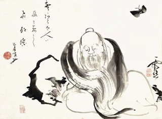

# Leçon 06 | 19 février 1964

<!-- source-url: http://staferla.free.fr/S11/S11 FONDEMENTS.docx -->
<!-- seminar: s11 -->
<!-- lesson: 06 -->

<!-- id: s11-06-0001 -->

Je continue en essayant de vous mener à *la fonction*, dans notre découverte analytique, *de la répétition*. Je tends à vous marquer que
ce n’est pas là notion facile à concevoir dans l’accession, dans la pratique que nous lui donnons. *Wiederholung* vous ai-je dit, *et déjà assez,* pour accentuer ce qu’elle implique, *dans la référence étymologique de « haler » à nouveau,* de connotation lassante. « *Tirer* » quoi ?
Peut*-*être, jouant sur l’ambiguïté du mot « *tirer* » en français : « *tirer au sort* », ce *Zwang* \[contrainte\] nous dirigerait alors vers quelque chose comme la carte forcée, et après tout s’il n’y a qu’une seule carte dans le jeu, je ne puis en tirer d’autre !

<!-- id: s11-06-0002 -->

Le caractère d’*ensemble* - *au sens mathématique du terme -* qu’a la bat­terie signifiante, qui l’oppose à l’indéfinité du nombre, du nombre entier par exemple, peut nous permettre de concevoir un schéma où cette fonction de la carte forcée tout de suite s’applique.
Si le sujet est le sujet du signifiant *-* déterminé par lui *-* on peut imagi­ner le réseau synchronique tel qu’il donne, dans la diachronie, des *effets préférentiels*. Et entendez bien qu’il ne s’agit même pas là *d’effets statistiques imprévisibles* mais que c’est la *structure* même
de ce réseau qui en implique les retours. *C’est là la notion qu’a pour nous*, à travers l’élucidation de ce que nous appelons les « *stratégies* », *c’est là la figure que prend pour nous* l’αύτόματον \[automaton\] d’ARISTOTE. Et aussi bien, c’est par *automatique* que nous traduisons
ce *Zwang* de la *Wiederholung, Zwang* : *la compulsion de répétition*.

<!-- id: s11-06-0003 -->

Je vous donnerai, en son temps, les faits qui suggèrent que dans le fait, dans un fait observable, en certains moments de *ce monologue infantile*, imprudem­ment, *faussement qualifié d’égocentrique,* ce sont des jeux proprement syntaxiques...

<!-- id: s11-06-0004 -->

> je vous le répète : je vous montrerai cela plus tard, là où cela a été relevé particulièrement ingénieu­sement
> ...et donc relevant du champ que nous appelons *préconscient*, *qui font*, si je puis dire, *le lit de la réser­ve inconsciente* - « *réserve* » dans le sens de « *réserve d’Indiens » -* à l’intérieur de notre *réseau social*. La syntaxe bien sûr, est préconsciente, mais ce qui échappe au sujet
> c’est que sa syntaxe se constitue en rapport avec certaines *réserves incons­cientes*.

<!-- id: s11-06-0005 -->

Dans l’effet de *remémoration* disons*-*nous - *mémorialisation* insistais*-*je plus précisément - qui consiste pour le sujet à *raconter son histoi­re*,
il y a là *-* latente *-* ce qui commande à cette *syntaxe*, pour avancer, de se faire de plus en plus serrée par rapport *-* à quoi ? *–*
à ce que FREUD au départ de sa description de la résistance psychique nous appelle un « *noyau* ». Que ce *noyau* se présente d’abord comme se référant à quelque chose de « *traumatique* » n’est après tout qu’une approximation.

<!-- id: s11-06-0006 -->

Il est clair d’abord qu’il faut, pour nous, distinguer *la résistance du sujet* de cette première *résistance du discours*, s’il procède dans le sens de ce serrage autour du noyau. Car « *résistance du sujet* » n’implique que trop que nous y supposions un « *moi* », qui à l’approche
de ce noyau n’est pas quelque chose dont nous puissions être sûrs que sa qualification de « *moi* » soit encore fondée.

<!-- id: s11-06-0007 -->

Ce noyau, je vous l’ai dit, nous apparaît d’abord comme devant être désigné comme du *réel*, du *réel* en tant que *l’identité de perception* est sa règle. À la limite il se fonde sur ce que FREUD - quand il l’articule, l’énonce - va jusqu’à pointer comme simplement
une sorte de prélèvement qui nous assure que nous sommes dans la perception, par le sentiment de la réalité qui l’authentifie.
Qu’est-ce que ça veut dire si ce n’est - du côté du sujet - ce qui s’appel­le l’éveil ?

<!-- id: s11-06-0008 -->

Et c’est ce que j’ai essayé - je le rappelle pour ceux à qui mon discours de la dernière fois n’aurait pas été suffisamment indi­quant, déterminant - c’est pourquoi je reviens à dire que si la dernière fois c’est autour de ce rêve que j’ai commencé d’aborder ce dont
il s’agit dans *la répétition*, c’est bien parce que ce rêve si clos, si fermé, si doublement et tri­plement fermé qu’il est, puisque aussi bien il n’est pas analysé, il n’est ici indicatif que par le choix qu’en a fait FREUD au moment où c’est du processus du rêve,
dans son ressort dernier, qu’il s’agit.

<!-- id: s11-06-0009 -->

L’éveil, la réalité qui le détermine, est-elle ce bruit léger contre lequel l’empire du rêve et du désir se maintient, ou quelque chose d’autre qui s’exprime au fond de l’angoisse de ce rêve, à savoir le plus intime de la relation du père au fils qui vient à surgir
non pas tant dans cette mort, si je puis dire, que dans son au-delà, dans ce qu’elle est au-delà, de ce fait dans son sens de destinée ?

<!-- id: s11-06-0010 -->

Je dis que quelque chose est figuré par ce qui arrive « *comme par hasard* », quand tout le monde dort - à savoir : *le cierge qui se renverse,*
et *le feu aux draps -* il y a là le même rapport…

<!-- id: s11-06-0011 -->

> d’événement insensé, d’ac­cident, de *mauvaise fortune* à ce dont il s’agit de poignant dans le sens,
>
> quoique *voilé,* qu’il y a dans ce : « *Père, ne vois*-*tu pas, je brûle ?* »
> …il y a le même rapport entre l’un et l’autre, que dans ce à quoi nous avons affaire dans une *répétition* qui pour nous se figure
> dans l’appellation de « *névrose de destinée* » de « *névrose d’échec* » : ce qui est manqué n’est pas *adaptation*, mais τύχη \[tuché\]*,* « *rencontre* ».

<!-- id: s11-06-0012 -->

Disons au passage que ce qu’ARISTOTE formule...

<!-- id: s11-06-0013 -->

- *que la* τύχη \[tuché\] *est définie de ne pouvoir nous venir que d’un être capable de choix, de* προαίρεσις \[[proairesis](http://www.pedagogie.ac-nantes.fr/1189438484234/0/fiche___ressourcepedagogique/&RH=1160580886171)\],

<!-- id: s11-06-0014 -->

- *que la* τύχη \[tuché\] - *bonne ou mauvaise fortune* \[εὐτυχία ou δυστυχία\]- *ne saurait venir d’un objet inanimé ou d’un animal*, ...ici se trouve *controuvé* \[infirmé\] : l’accident même de ce rêve exemplaire nous le figure. ARISTOTE marquant ici la même limite qui l’arrête au bord des formes extravagantes, monstrueuses, de la conduite sexuelle, qu’il ne saurait qualifier que de τερατῶδες \[teratodes\], monstruosités.

<!-- id: s11-06-0015 -->

Le côté fermé de la relation entre l’accident qui se répète et ce *sens voilé* qui est la véritable « *réalité* » et qui nous conduit vers *le Trieb, la pulsion*, voilà ce qui nous donne la certitude qu’il y a autre chose pour nous dans l’analyse, qu’à démystifier l’artefact du traitement que l’on appelle « *le transfert* » pour le ramener à ce qu’on appelle *« la réalité » prétendument toute simple « de la situation »* \[Bouvet, cf. p.d.a\].

<!-- id: s11-06-0016 -->

Il ne semble pas qu’une valeur, même *propédeutique*, puisse se suffire de cette direction qui s’indique dans la réduction à l’actualité, si l’on peut dire, de la séance ou de la suite de séances, qu’il n’y a là qu’un *alibi d’éveil*, que *la juste répétition* doit être obtenue dans
une autre direction que nous ne pouvons confondre avec l’ensemble des effets de transfert, mais qui sera justement notre problème quand nous aborderons la fonction du transfert : comment *le transfert* peut nous conduire *au cœur de* *la répétition* ?

<!-- id: s11-06-0017 -->

C’est pourquoi il est nécessaire que nous fondions, que nous insérions, cette *répétition* dans cette *schize* même, qui se produit
dans le sujet à l’endroit de *la rencontre*, dans cette dimension caractéristique de la découverte analytique et de notre expérience,
qui nous fait appréhender, concevoir le *réel,* dans son incidence dialectique, comme originellement malvenu \[δυστυχία dustuchia\],
et comprendre en quoi c’est par là qu’il se trouve le plus complice de *la pulsion* chez le sujet.

<!-- id: s11-06-0018 -->

Terme où nous arriverons en dernier, car *seul ce chemin parcouru pourra nous faire concevoir de quoi il retourne radicalement dans la pulsion*.

<!-- id: s11-06-0019 -->

Car après tout :

<!-- id: s11-06-0020 -->

- pourquoi *la scène primitive* est-elle si traumatique ?

<!-- id: s11-06-0021 -->

- Pourquoi est-elle toujours *trop tôt* ou *trop tard* ?

<!-- id: s11-06-0022 -->

- Pourquoi le sujet y prend-il ou trop de plaisir, du moins est-ce ainsi que d’abord nous avons conçu *la causalité traumatique de l’obsessionnel*, ou trop peu comme chez l’*hystérique* ?

<!-- -->

<!-- id: s11-06-0023 -->

- Pourquoi n’*éveille*-t-elle pas tout de suite le sujet, s’il est trop libidinal ?

<!-- id: s11-06-0024 -->

- Pourquoi le fait est-il si δυστυχία \[dustuchia\][^37] ?

<!-- id: s11-06-0025 -->

- Pourquoi sommes-nous forcés ainsi de rappeler que la prétendue maturation des dits « *instincts* » est en quelque sorte *transfilée*, *transper­cée*, *transfixée*, de « *tychique* » dirai-je (du mot τύχη \[tuché\]) ?

<!-- id: s11-06-0026 -->

Encore bien sûr, le « *tychique* » est-il une notion *opaque*. Peut-elle nous ouvrir *le sens* de ce qui serait *sa résolution* ?
Et nous ne devons pas moins exiger avant de concevoir ce que pourrait être la satisfaction d’une pulsion.
Pour l’instant, notre horizon, c’est ce qui apparaît de *factice* dans le rapport fondamental à la sexualité.

<!-- id: s11-06-0027 -->

Ce dont il s’agit dans l’expérience ana­lytique, c’est de bien partir de ceci : que de même que *la scène primitive* est traumatique,
ce n’est pas l’empathie sexuelle qui soutient les modulations de l’analy­sable, *c’est un fait factice* comme celui qui apparaît
dans la scène si *farouchement* tra­quée dans l’expérience de *L’Homme aux loups* : *l’étrangeté de la dispari­tion et de la réapparition du pénis*.

<!-- id: s11-06-0028 -->

Alors, qu’il soit bien entendu que ce sur quoi j’ai voulu articuler les choses la dernière fois, c’est de pointer *où est cette schize du sujet*. Celle même qui, après tout, après le réveil, persiste entre le retour au réel, la représentation du monde enfin retombé sur ses pieds...

<!-- id: s11-06-0029 -->

> les bras levés, « *quel malheur ! Qu’est*-*ce qui est arrivé ! Quelle erreur ! Quelle bêtise ! Quel idiot que celui qui s’est mis à dormir !* »
> ...et la conscience qui se *retrame*, qui se sait vivre tout cela, disons *comme un cau­chemar*, mais qui tout de même se rattrape à elle-même : « *C’est moi qui vis tout ça, je n’ai pas besoin de me pincer pour savoir que je ne rêve pas* ».

<!-- id: s11-06-0030 -->

*Et cette schize n’est là encore que représentant l’autre*, plus profonde et qui s’élude dans ce repérage, *cette schize qui dans le rêve révèle le sujet*
à cette machinerie du rêve, à l’image de l’enfant qui s’approche avec ce regard plein de reproche, *et d’autre part ce en quoi le sujet choit* :
*Invocation *: *voix* de l’enfant \[*(a)* « *voix » : « pulsion invocante »*\], sollicitation du *regard *: « *Père, ne vois*-*tu pas*... » \[*(a) « regard  » : pulsion scopique*\].

<!-- id: s11-06-0031 -->

C’est pourquoi c’est là que…

<!-- id: s11-06-0032 -->

> libre comme je le suis de poursuivre, dans le chemin où je vous mène, la voie par les temps qui me semblent les meilleurs
> … ici il me semble que s’indique - *passant mon aiguille courbe à travers la tapis­serie -* de sauter du côté où se pose *la question la plus pressante*, et d’abord de s’offrir comme objet, comme objet de débat, comme carrefour, entre nous et tous ceux qui essaient de penser
> les chemins du sujet, à savoir :

<!-- id: s11-06-0033 -->

- si ce chemin, en tant qu’il est repérage, recherche de la véri­té, est bien à chercher dans *notre style d’aventure*, avec *son traumatis­me*, reflet en quelque sorte de cette facticité,

<!-- id: s11-06-0034 -->

- ou s’il est à chercher là où la tradition depuis toujours l’a localisé, au niveau de la dialectique du *vrai* et de *l’apparence*, prise au départ de la perception, dans ce qu’el­le a de fondamentalement « *idéique* », plus esthétique en quelque sorte, et accen­tuée d’un centrage visuel.

<!-- id: s11-06-0035 -->

*Ce n’est point ici simple hasard*, que rapporté à l’ordre du pur « *tychique* », si cette semaine vient à votre portée par sa parution le livre,
posthume, de notre ami MERLEAU-PONTY sur *Le visible et l’invisible. Ici s’exprime, incarné, ce qui faisait l’alternance de notre dialogue*.
Et je n’ai pas à évoquer bien loin pour me souvenir de ce congrès de Bonneval où son intervention était, pour nous, ramenée à ce qui était son chemin, celui justement qui s’est brisé en un point de cette œuvre, qui ne la laisse pas moins dans un état d’achèvement qui se préfigure - et se préfigure d’abord - dans ce travail de piété que nous devons à Claude LEFORT, dont je veux ici dire l’hommage que je lui rends pour la sorte de *perfection* à quoi, dans une transcription longue et difficile, il me semble être arrivé.

<!-- id: s11-06-0036 -->

Ce « *visible* » et cet « *invisible* » qui, pour nous, peut en quelque sorte pointer le moment d’arrivée de *quelque chose* que j’ai appelé
la « *tradition philoso­phique* » dans cette recherche du *réel*, cette tradition qui commence à PLATON par cette *promotion de l’Idée*,
dont on peut dire qu’elle se déter­mine d’un départ pris dans un monde *esthétique*, d’une nécessité, d’une fin, d’un but donné à *l’être* conçu comme « *Souverain Bien* », dans une *beau­té* qui est aussi sa limite, dans *quelque chose* dont assurément ce n’est pas pour rien
que Maurice MERLEAU-PONTY en reconnaît *le recteur* [^38] dans l’« *œil* ».

<!-- id: s11-06-0037 -->

La première ébauche de ce travail nous est donnée dans un article qu’il a appelé *L’œil et l’esprit.* Dans le progrès que vous trouverez dans cette œuvre, qu’on peut dire à la fois termi­nale et inaugurante, dans « *Le Visible et l’invisible »*, titre de cette œuvre,
c’est le rappel et le pas en avant dans la voie, dans la trace, de ce qu’avait formulé pour nous sa *Phénoménologie de la perception.*

<!-- id: s11-06-0038 -->

À savoir *la régulation de la forme* comme devant être rappelée au niveau déterminant de ce qui, au fur et à mesure du progrès
de la pensée philosophique, avait été poussé jusqu’à cet extrême qui avait fini par faire pour nous question prégnan­te, du vertige,
du danger, de l’interrogation toujours imminente qui s’est manifestée dans le terme d’idéalisme :

<!-- id: s11-06-0039 -->

« *Comment jamais faire rejoindre cette doublure que devenait la représentation, avec ce qu’elle est censée recouvrir ?* ».

<!-- id: s11-06-0040 -->

La *phénoménologie,* en nous rapportant à cette *régulation de la forme* à laquelle, non pas seulement l’œil du sujet préside,
mais toute son attente, sa prise, son émotion, je dirai non seule­ment *musculaire* mais aussi bien *viscérale*, bref sa *présence* constitu­tive pointée dans une *intentionnalité totale*, celle du *sujet*. Ici \[dans « Le visible et l’invisible »\] Maurice MERLEAU-PONTY fait le pas suivant
en - en quelque sorte - forçant les limites de cette *phénoménologie* même, et c’est à travers des voies que je ne retracerai pas ici,
car c’est en un autre champ que je veux vous mener et dont je vous dési­gnerai tout à l’heure l’incidence toute particulière.

<!-- id: s11-06-0041 -->

Mais je note que l’essentiel : son rappel et les voies par où il vous y mènera, ne seront pas seulement de l’ordre du visuel,
mais, vous le verrez, de l’interrogation et de la dialectique, à nous rappeler pourtant - c’est le point essentiel - à nous rappeler
*la dépendance du « visible » par rapport à* ce qui nous met essentiellement sous *l’œil du voyant*. Encore est-ce trop dire, puisque cet « *œil* » n’est qu’*une métaphore*, quelque chose que j’appellerai en quelque sorte, plutôt « *la pousse* » du voyant, quelque chose d’avant mon œil.

<!-- id: s11-06-0042 -->

Et ce qu’il s’agit de cerner par les voies du chemin qu’il nous montre, c’est en quelque sorte *la préexistence d’un regard* :

<!-- id: s11-06-0043 -->

*je ne vois que d’un point, mais dans mon existence, je suis regardé de partout.*

<!-- id: s11-06-0044 -->

Ce « *voir* » à quoi je suis soumis d’une façon *originelle* est-ce là ce qui doit nous mener à ce qui semble bien l’ambition de cette œuvre, à une sorte de *retournement ontologique*, dont les lois, les assises, seraient à reprendre dans *une plus primitive institution de la forme*.

<!-- id: s11-06-0045 -->

C’est bien là l’occasion pour moi de *définir*, de *rappeler,* ce qui assu­rément dans mon discours *<u>n’est pas</u>*. *Un tel*...
de ceux qui depuis mes *Écrits* m’a assez suivi pour réviser ce que contient telle note
...de dire que *je semble poursuivre le dessein particulier de la recherche d’un statut ontologique de la psychanalyse* sur les fondements d’une cohérence philosophiques d’où tout aspect du freudisme est à réinterpréter, celui qu’on a coutu­me de qualifier de « *naturalisme* ».

<!-- id: s11-06-0046 -->

Malgré les impasses où il peut paraître conduire, son maintien semble indispensable, car cette perspective représente une des rares tentatives sinon la seule pour donner corps à la réalité du psychisme sans la substantifier. Or bien sûr dirai-je, *j’ai mon ontologie*
\- pourquoi pas ? - comme tout le monde au niveau d’une philosophie, qu’elle soit naïve ou élaborée.

<!-- id: s11-06-0047 -->

Mais assurément ce que j’essaie de dessiner dans un discours qui, s’il réinterprète celui de FREUD, n’en n’est pas moins essentiellement centré sur la particularité de l’expé­rience qu’il dessine, c’est justement quelque chose qui n’a nullement
la prétention de recouvrir l’entier champ de l’expérience où il vient à se constituer.

<!-- id: s11-06-0048 -->

Même ce qui peut être dans cet *entre*-*deux* que nous ouvre l’appréhen­sion de l’inconscient, cet *entre*-*deux* - je vous l’ai dit,
et c’est pour ça que je l’ai accentué au début de mon discours cette année - cet *entre*-*deux* ne nous intéresse que pour autant
qu’il nous est désigné par la consigne freudienne comme ce dont le sujet, comme tel, a à prendre possession.
*Et il ne peut en prendre, de possession, que* dans ces lignes de départ, celles précisément *où il le cerne comme sujet schizé*.

<!-- id: s11-06-0049 -->

Ce qui nous intéressera ici, *à l’intérieur de ce champ* dont Maurice MERLEAU-PONTY - d’ailleurs plus ou moins polarisé par les fils de notre expérience - va nous donner le statut ontologique, ce sera encore quelque chose qui se pré­sentera dans ce champ
par ses incidences, par son bout le plus *factice* je dirais, voire le plus *caduc*.

<!-- id: s11-06-0050 -->

Et la *schize* qui nous intéresse, ce n’est pas cette distance qu’il y a des formes - pour nous, imposées par le monde - vers quoi *l’intentionnalité de l’expérience phénoménologique* peut nous diriger dans son ouverture essentielle, et les limites que nous allons y rencontrer dans l’expérience du visible, c*e n’est pas entre l’invisible et le visible que nous allons, nous, avoir à passer*, c’est en ce *quelque chose* que nous pourrons peut-être nous aussi qualifier de « *regard* », mais dont vous allez voir qu’il ne se présente à nous que sous la forme d’une étrange contingence, elle-même *symbolique* de ce que nous trouvons à l’horizon et comme butée de notre expérience,
à savoir *le manque* constitutif de l’angoisse de la castration.

<!-- id: s11-06-0051 -->

*L’œil et le regard, telle est* pour nous *la schize* dans laquelle se mani­feste la pulsion, qui nous représente - dans cette entreprise du sujet qui est la nôtre - *au niveau du champ scopique*. Ce à quoi nous avons à nous référer, c’est à *ceci qui fait que dans notre rapport aux choses*...

<!-- id: s11-06-0052 -->

- tel qu’il est constitué,

<!-- id: s11-06-0053 -->

- tel qu’il progresse par ce chemin de la vision qui nous ordon­ne les choses dans *les figures de la représentation* ...*quelque chose glisse*, passe, se transmet d’étage en étage *pour y être toujours* à quelque degré *élidé, et qui s’appelle « le regard »*.

<!-- id: s11-06-0054 -->

Pour l’aborder, vous le faire sentir, il y a plus d’un chemin. L’imagerais-je, comme à son extrême, d’*une des énigmes que nous présente* justement la référence à *la nature*, il ne s’agit de rien moins que *des phénomènes dits du « mimé­tisme* ». Là-dessus beaucoup - vous le savez - a été dit, et d’abord beaucoup d’absurde. L’idée que les phénomènes du *mimétisme* puissent être, d’aucune façon, expliqués par
une fin d’adaptation. Je n’ai qu’à vous renvoyer, entre autres, à un petit ouvrage, celui sans doute que beaucoup d’entre vous connaissent, celui de CAILLOIS intitulé *Méduse et compagnie* [^39] où ces choses sont *critiquées d’une façon particulièrement perspicace*.

<!-- id: s11-06-0055 -->

Vous y voyez combien elles sont fragiles les références adapta­tives, au moins dans le sens d’une sélection dont on voit mal non seulement comment elles auraient pu opérer, si ce n’est en laissant le problème entier, à savoir que pour être efficace, la mutation déterminante du *mimétisme* chez l’insecte par exemple, ne peut se faire que d’emblée et au départ, mais aussi bien que ses prétendus effets sélectifs sont anéantis par l’expérience qui montre que chez les oiseaux, prédateurs en particulier, je veux dire *dans leur estomac*, on trouve autant d’insectes soi-disant protégés par quelque *mimétisme,* que d’insectes qui ne le sont pas.

<!-- id: s11-06-0056 -->

Mais aussi bien le problème n’est pas là. *Le problème le plus radical, le plus foncier, du mimétisme*, si aussi bien il nous faut le rapporter
à quelque puissance formative attribuée à l’organisme même qui nous en montre les manifestations, c’est qu’il conviendrait d’abord que nous puissions arriver à concevoir par quel circuit cette force orga­nique pourrait se trouver en position de « *voyant* »,
non seulement sur *le corps lui*-*même* qu’il s’agit de *mimétiser*, à savoir la forme de son propre orga­nisme, mais \[aussi\] *sa relation au milieu* dans lequel il s’agit : soit qu’il s’y distingue, soit au contraire qu’il s’y confonde.

<!-- id: s11-06-0057 -->

Et pour tout dire - comme le rappelle avec beaucoup de pertinence, voire d’élégance, CAILLOIS - s’apercevoir que pour telle
ou telle forme du mimétisme et plus spécialement celles qui peuvent nous évoquer leur rapport à la fonction des *yeux*,
à savoir les *ocelles*, il s’agit peut-être de comprendre que si les *ocelles* impressionnent - c’est un fait qu’elles le font - le pré­dateur
ou la victime présumée qui vient à les regarder, est-ce à dire *que ce soit par leur ressemblance avec des yeux,*
*ou les yeux ne sont*-*ils pas fascinants que par leur relation avec la forme des ocelles* ?

<!-- id: s11-06-0058 -->

Autrement dit, devons-nous à ce propos - ce qui semble en effet s’imposer - distinguer *la fonction de* *l’œil* de *la fonc­tion du* *regard* ?

<!-- id: s11-06-0059 -->

Ce dont il s’agit ici dans cet exemple distinctif et choisi comme tel, pour sa localité, pour son factice, pour son caractère exceptionnel, c’est que justement dans sa distinction, dans le fait que, concernant ce que, pour nous, pose la question des formes
du monde, il n’est qu’une petite part, qu’une *fonction distinguée*, spécifiquement celle, disons le mot, de « *la tache* ». C’est par cela même qu’il tient de la suggestion - pour nous exemplaire - qu’il nous fait, de marquer *l’antériorité, la préexistence au « vu » d’un « donné à voir »*.

<!-- id: s11-06-0060 -->

Nul besoin pour nous de nous reporter à je ne sais quelle supposition de l’existence d’un « *voyant universel* », car aussi bien,
si cette fonction se trouve ainsi ins­tituée dans son autonomie - elle nous le suggère - l’important pour nous dans le champ
de notre expérience, c’est - identifiant dans son origine la fonction de « *la tache* » comme telle avec celle du *regard -* d’en chercher
la menée, le fil, la trace, à tous les niveaux où se produisent les étages d’une constitu­tion du monde dans *un champ scopique*,
pour nous apercevoir que *cette fonction de la tache et du regard* y joue comme étant à la fois, ce qui le commande le plus secrètement,
et ce qui y échappe toujours plus ou moins à la saisie de cette forme de la vision, qui se satisfait d’elle-même en s’imagi­nant
comme conscience.

<!-- id: s11-06-0061 -->

Ce en quoi la conscience peut se retourner sur elle-même et s’y saisir, comme *La Jeune Parque* de VALÉRY[^40] « *se voyant se voir* »,
représente un escamotage, une ambiguïté. Et pour employer un terme qui est celui dont elle s’assure, terme d’évidence emprunté
au domaine *visuel*, qu’elle nous permette de retourner le mot par un jeu de mots, et de dire que cette fausse évidence qu’il y a
dans ce « *se voyant se voir* » dont s’affecte la conscien­ce, ne représente qu’un évitement, qui s’y opère, de *la fonction du regard*.

<!-- id: s11-06-0062 -->

C’est ce qui nécessite pour nous de le repérer, de le chercher *à tous les étages* que nous venons justement de nous ébaucher
*en quatre termes*, dans cette topologie que la dernière fois, à propos de ce rêve, nous nous sommes faits : de ce qui apparaît
de la position du sujet dans le moment où s’ouvre pour lui ce monde auquel il accède dans le rêve et ses formes ima­ginaires
qui lui sont données par le rêve comme opposées à celles *d’une* *autre structure*, et déterminées par *un autre horizon dans l’état de veille*.

<!-- id: s11-06-0063 -->

Est-ce que nous ne pouvons pas - *guidés par ces indices* - commencer d’abord de nous apercevoir

<!-- id: s11-06-0064 -->

- que dans cet ordre particulièrement satisfai­sant pour le sujet que l’expérience analytique a connoté du terme de « *narcissisme »*, et où je me suis efforcé de réintroduire la structure essen­tielle qu’il tient de sa référence à *l’image spéculaire*, à *l’ima­ge reflétée du corps*, dans ce qu’il diffuse de *satisfaction* voire de *com­plaisance* où le sujet trouve appui pour une si foncière méconnaissance, quelque chose n’entre pas, qui nous montre seulement jusqu’où en va l’empire.

<!-- id: s11-06-0065 -->

- que dans cette référence qui est celle où la pensée a établi cette ligne que j’ai appelée « *tradition philosophique »* de notre recherche, *dans ce côté satisfaisant, dans cette plénitude rencontrée par le sujet sous le mode de la contemplation*, est-ce que nous ne pouvons pas d’abord y saisir ce qu’il y a justement d’éludé : *la fonction du regard* ?

<!-- id: s11-06-0066 -->

J’entends : là où Maurice MERLEAU-PONTY sous la pointe que nous sommes des êtres regardés, dans le spectacle du monde, dans ceci qui nous fait conscience, en nous insti­tuant, en nous instaurant comme *Speculum mundi, e*st-ce que n’est pas cachée
cette satisfaction d’être sous ce regard - dont je parlais tout à l’heure, avec Maurice MERLEAU-PONTY - qui nous cerne
et nous fait d’abord être regardés mais sans qu’on nous le montre ?

<!-- id: s11-06-0067 -->

*Le monde*, en ce sens, nous apparaît - je veux dire son spectacle - *comme omnivoyeur*. Et c’est bien là *le fantasme* que nous trouverons dans la perspective platonicienne *d’un Être absolu*, lui être transféré comme la qualité de l’*omnivoyant*, mais au niveau même
de l’expérience phénoménale de la contemplation.

<!-- id: s11-06-0068 -->

Ce côté *omnivoyeur* est bien celui, après tout, de la satisfaction d’une femme qui se sent regardée : aussi bien est-ce *à condition*
*qu’on ne lui montre pas.* *Le monde est omnivoyeur*, mais il n’est pas *exhibitionniste.* Quand il commence à le provo­quer,
c’est là que commence le sentiment d’étrangeté. *Mais qu’est-ce là, sinon justement l’élision de ce regard, l’élision de ceci que non seulement*
*ça regarde mais que ça montre*, et dans le champ du rêve, ce qui caractérise les images oniriques c’est que ça montre.
*« Ça montre »,* mais là encore, quelque forme *d’élision, de glissement du sujet,* se démontre*.*

<!-- id: s11-06-0069 -->

Car reportez-vous à *quelque texte de rêves que ce soit*, et pas seu­lement à celui dont je me suis servi la dernière fois où après tout
ce que je vous ai dit peut rester énigmatique, mais à tout rêve tel que vous le replaciez dans ces coordonnées, c’est que dans le rêve ce « *ça montre* » vient en avant, tellement en avant que les caractéristiques en quoi il se coordonne, à savoir de n’avoir pas l’horizon,
la fermeture de ce qui est contemplé dans l’état de veille, le fait d’être aussi bien *émergence*, *contraste*, *sorte de tache*, *couleurs plus intenses,*
quelle est notre position dans le rêve, sinon en fin de compte d’être foncière­ment celui qui ne voit pas ?

<!-- id: s11-06-0070 -->

Il ne voit pas où ça mène, il suit, il peut même à l’occasion se détacher, se dire que c’est un rêve, mais *il ne sau­rait en aucun cas*
*se saisir dans le rêve à la façon dont dans le cogito cartésien il se saisit comme pensant*. Il peut se dire « *ce n’est qu’un rêve* », il ne se saisit pas comme celui qui se dit, « *mais malgré tout je suis* *conscience de ce rêve* ».

<!-- id: s11-06-0071 -->

Aussi bien TCHOANG TSEU[^41] rêve qu’il est un papillon. Qu’est-ce que ça veut dire ?

<!-- id: s11-06-0072 -->

<!-- id: s11-06-0073 -->

Ça veut dire qu’*il voit le papillon dans sa réalité de regard*, car qu’est-ce que *tant de figures, tant de dessins, tant de couleurs*, sinon ce *donné à voir* gratuit, avec ces marques pour nous de la primitivité de cette essence du regard ? C’est - mon Dieu - un papillon qui n’est pas tellement différent de celui qui terrorise *L’Homme aux loups*, et MERLEAU-PONTY en connaît bien l’importance
et nous y réfère dans une note non intégrée à son texte.

<!-- id: s11-06-0074 -->

« *Quand Tchoang* *Tseu est réveillé, il peut se demander si ce n’est pas le papillon qui rêve qu’il est Tchoang Tseu. Il a raison d’ailleurs et doublement* :

<!-- id: s11-06-0075 -->

- *d’abord parce que c’est ce qui prouve qu’il n’est pas fou, il ne se prend pas pour absolument identique à Tchoang Tseu,*

<!-- id: s11-06-0076 -->

- *et deuxièmement parce qu’il ne croit pas si bien dire, et plutôt parce qu’il devait savoir si bien dire, à savoir qu’effectivement, c’est quand il était papillon, qu’il se saisissait à quelque racine de son identité, qu’il était et qu’il est ce papillon qui se peint à ses propres couleurs, que c’est par là, en dernière raci­ne qu’il est Tchoang Tseu.*

<!-- id: s11-06-0077 -->

*Et la preuve c’est que quand il est papillon, il ne lui vient pas à l’idée de se demander si, quand il est Tchoang Tseu éveillé, il n’est pas le papillon*
*qu’il est train de rêver d’être. C’est que rêvant d’être papillon il aura sans doute à témoi­gner plus tard qu’il se représentait comme papillon,*
*mais ceci ne veut pas dire qu’il est captivé par le papillon. Il est papillon capturé mais capture de rien car dans le rêve il n’est papillon pour personne,*
*et c’est quand il est réveillé - qu’il est Tchoang Tseu pour les autres - qu’il est pris dans le filet à papillons.* »

<!-- id: s11-06-0078 -->

C’est pour cela que le papillon peut, s’il n’est pas TCHOANG TSEU mais *L’Homme aux loups,* lui inspirer la terreur phobique
d’y reconnaitre dans *le battement* - qui n’est pas tellement loin du battement de losange de la causation \[**◊**\] - la rayure primitive
marquant son être, atteint pour la première fois par la griffe du désir.

<!-- id: s11-06-0079 -->

Nous sommes arrivés au bout de ce dont je me propose dans ce que je vous dirai la prochaine fois, de mieux marquer,
de vous introduire à ceci qui est l’*essentiel* de la *satisfaction sco­pique*, ce *regard* que nous venons de saisir comme pouvant définir,
en lui-même, cet *objet(a)* de l’algèbre lacanienne où le sujet peut venir à choir, que là, et pour des raisons qui sont des raisons structurantes, cette chute du sujet reste inaperçue parce qu’elle se réduit à zéro.

<!-- id: s11-06-0080 -->

À savoir que c’est dans la mesure où ce regard, en tant qu’*objet(a)* peut venir à symboliser *le manque central* exprimé dans
les phénomènes pour nous terminaux, butées de notre expérience de la castration, c’est justement parce que c’est un *objet(a)*
qui se réduit à *une fonction punctiforme, évanescente* de sa propre nature, qu’il laisse le sujet dans l’ignorance tel­lement caractéristique
de tout le progrès de la pensée, de cette voie constituée par la recherche philosophique de ce qu’il y a au-delà de l’apparence,
qu’elle a toujours manqué : le caractère clé du phénomène entr’aperçu de *la castration*.
## Notes

[^37]: δυστυχία \[dustuchia\] : rencontre malheureuse, « *malencontre* » du réel, εὐτυχία \[eutuchia\] : rencontre heureuse.

[^38]: Recteur : celui qui dirige.

[^39]: Roger Caillois : *Méduses et compagnie*, Gallimard 1960.

[^40]: Paul Valéry : *La jeune Parque*, Gallimard, Coll. Poésie Gallimard, p.18 :

    « *Toute ? Mais toute à moi, maîtresse de mes chairs,*

    *Durcissant d'un frisson leur étrange étendue,*

    *Et dans mes doux liens, à mon sang suspendue,*

    *Je me voyais me voir , sinueuse, et dorais*

    *De regards en regards, mes profondes forêts.* »

[^41]: [Tchoang Tseu ](http://fr.wikipedia.org/wiki/Tchouang-tseu): « *Jadis, une nuit, je fus un papillon, voltigeant content de son sort. Puis je m'éveillai, étant Tchoang Tseu. Mais suis-je bien le philosophe TchoangTseu*

    *qui se souvient d'avoir rêvé qu'il fut papillon, ou suis-je un papillon qui rêve maintenant qu'il est le philosophe TchoangTseu ?* »
