# Leçon 08 | 04 Mars 1964

<!-- source-url: http://staferla.free.fr/S11/S11 FONDEMENTS.docx -->
<!-- seminar: s11 -->
<!-- lesson: 08 -->

<!-- id: s11-08-0001 -->

Il n’est pas facile dans notre domaine... j’allais dire, de maintenir la ligne si possible mais de la serrer au plus près.
Sur le point précis, où nous nous avançons, de la fonction de l’œil en tant qu’elle nous intéres­se, cela peut mener celui qui cherche
à vous éclairer, à de lointaines explorations, à chercher depuis son apparition dans la lignée vivante, cette fonction de l’organe,
et tout d’abord, sa présence.

<!-- id: s11-08-0002 -->

De tous les organes auxquels nous avons affaire, et j’y insiste, c’est le rapport du sujet, non point tant avec *l’instinct*, non point tant,
jusqu’à présent, car nous ne l’avons pas défini, assuré, affermi dans son statut psychanalytique sous le nom de pulsion,
non point tant avec la tendan­ce, non point tant avec l’instinct, que *le rapport du sujet avec l’organe* qui est au cœur de notre expérience.

<!-- id: s11-08-0003 -->

Or, de tous les organes auxquels nous avons affaire, comme *organe significatif* : *le sein*, *les fèces*, d’autres encore, il est frappant de voir que *l’œil* remonte aussi loin, dans les espèces qui représentent l’apparition de la vie. Vous consommez sans doute, innocemment,
des huîtres, sans savoir qu’à son niveau, dans le règne animal, déjà l’œil est apparu. Ces sortes de plongées nous en apprennent,
c’est le cas de le dire, sinon de toutes, de bien des couleurs. C’est au milieu de cela pourtant qu’il s’agit de choisir, en ramenant
les choses à ce dont il s’agit pour nous. La dernière fois, je pense avoir suf­fisamment accentué ce qu’on appelle le petit *schéma* triangulaire, fort simple, que j’ai reproduit en haut du tableau :

<!-- id: s11-08-0004 -->

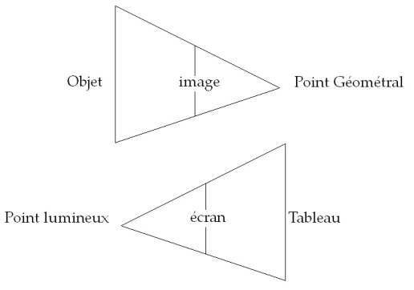

<!-- id: s11-08-0005 -->

qui n’est là que pour vous rappeler en trois termes, ce qui faisait le fond de ma remarque : c’est que, ce qu’il en est
de ce qu’on appelle, à un certain niveau *l’optique*, celle qui semblait être en usage, dans ce montage opératoire dont je voyais l’usa­ge
à la fois exemplaire et orienté, pointer comme significatif dans cette forme inversée, cet *usage inversé* qui est donné *de la perspective* comme venant dominer - au premier plan - *une certaine technique, celle de la peinture*, et nommément entre les siècles : fin du XVème, XVIème et XVIIème, cette anamorphose, en tant qu’elle nous montre que les choses ne sont pas si simples, qu’il ne s’agit pas tant là d’une reproduction réaliste de ce que l’on appelle plus ou moins proprement dans la peinture *les choses de l’espace*, sur lesquelles
il y a beaucoup de réserves à faire.

<!-- id: s11-08-0006 -->

Ce que je voulais par ce petit schéma pointer d’essentiel, de central dans notre approche, c’est en quelque sorte ce quelque chose : qu’il convient de remarquer *que ce qu’il en est d’une certaine optique, laisse échapper ce qu’il en est de la vision.*

<!-- id: s11-08-0007 -->

Comme je vous l’ai fait remarquer, *cette optique-là est à la portée des aveugles*. Je vous ai référé au texte de DIDEROT,
*Lettre sur les aveugles,* où il essaie dans la démonstration qu’il en donne, de s’apercevoir combien, de toute une fonction,
qui est celle de la vision, *nommément justement ce qu’elle nous livre de l’espace.*

<!-- id: s11-08-0008 -->

L’aveugle :

<!-- id: s11-08-0009 -->

- est capable de rendre compte,

<!-- id: s11-08-0010 -->

- est capable de le reconstruire,

<!-- id: s11-08-0011 -->

- est capable de l’imaginer,

<!-- id: s11-08-0012 -->

- est capable d’en parler.

<!-- id: s11-08-0013 -->

Sans doute, sur cette possibilité DIDEROT construit une sorte d’équi­voque permanente à *sous-entendus métaphysiques*,
et d’ailleurs c’est bien là cette ambiguïté qui anime ce texte et qui lui donne son caractère mordant, prenant.

<!-- id: s11-08-0014 -->

Pour nous, insistons sur ceci : c’est que cette dimension géométrale, où nous avons vu la possibilité d’un certain repérage du sujet, du sujet comme appelé à un certain point, commandé, déterminé, nécessaire - c’est en effet *une des dimensions* par où nous pouvons entrevoir com­ment ce *sujet* qui nous intéresse, est amené à être, en quelque sorte, pris, manœuvré, capté dans le champ de la vision.

<!-- id: s11-08-0015 -->

Et ce que je vous montrais, à la fin de mon exposé, à savoir le tableau d’HOLBEIN :

<!-- id: s11-08-0016 -->

<!-- id: s11-08-0017 -->

Le tableau d’HOLBEIN avec ce *singulier objet flottant* au pre­mier plan, dont j’ai tout de suite, à l’endroit de mon but,
et sans plus dis­simuler que je ne fais d’habitude ce que j’appellerai « *le dessous des cartes* », je vous ai montré que cet objet,
qui est en somme bien là - comme nous allons retrouver aujourd’hui ce que signifie la chose, enfin, à regarder - que cet objet est là pour prendre - et je dirais presque « *prendre au piège » - le regardant*, c’est-à-dire nous. Et qu’en somme, c’est une façon manifeste,
sans doute exceptionnelle, et due à je ne sais quel moment de réflexion du peintre, de nous montrer comme quoi, en tant que sujet, nous sommes - dans le tableau - littéralement *appelés* et ici représentés comme pris.

<!-- id: s11-08-0018 -->

Car, aussi bien, ce rapport avec *ce tableau fascinant* - *dont je vous ai montré les résonances, les parentés avec ces tableaux qu’on appelle des* *[vanitas](#vanitas) -*
ce tableau fascinant d’être, entre ces deux personnages parés et fixes, d’entre lesquels tout ce qui nous rappelle, dans la perspective de l’époque, *la vanité des arts et des sciences*, est là pour nous captiver. Le secret de ce tableau est donné pour ce moment où,
nous éloignant légè­rement, peu à peu de lui vers la gauche, dans un retour de fait, nous ver­rons la signification de l’objet flottant,
de l’objet sérieux, magique, qui nous reflète notre propre néant, dans la figure de la tête de mort.

<!-- id: s11-08-0019 -->

Usage donc de cette *dimension géométrale de la vision* pour captiver le sujet, rapport évident à ce désir qui pourtant, reste énigmatique.
Quel est le désir qui se prend, qui se fixe, qui a cette rencontre avec ce tableau, qui - *aussi bien ce tableau est chose faite, chose construite -*
le motive à pousser l’artiste à mettre quelque chose - et quoi - en œuvre ?

<!-- id: s11-08-0020 -->

Tel est le chemin où nous allons essayer de plus nous avancer aujourd'hui. Dans cette matière de la vision, disons du visible,
tout est piège, et singulièrement disposition que vous retrouvez présente à tous les niveaux, à tous les étages, qui est si bien désignée par Maurice MERLEAU-PONTY, dans ce livre *Le visible et l'invisible*, par le titre d'un des chapitres : *L'entrelacs, le* *chiasme.*

<!-- id: s11-08-0021 -->

Il n'est pas une seule des *divisions*, des *doubles versants* que présente cette fonction de la vision, qui ne se présente à nous à la façon
de dédale, de ce fait que, à mesure des champs que nous y distinguons, nous ne nous apercevons que plus avant combien ces champs se croisent. Il semble d'abord, qu'après tout, dans ce domaine que j'ai appelé celui du *géométral*, que ce soit - si je puis dire - la lumière qui nous donne le fil.

<!-- id: s11-08-0022 -->

Et en effet ce *fil*, vous l'avez vu la dernière fois agir pour nous relier à chaque point de l'objet, et au lieu où il traverse le réseau
en forme d'écran sur lequel nous allons repérer l'image, fonctionner comme fil. *La lumière*, comme on dit, *se propage en ligne droite*,
et ceci est assuré : il semble que ce soit elle qui nous donne le fil. Pourtant, réfléchissez que ce fil n'a pas besoin de la lumière,
il n'a besoin que d'être un fil tendu.

<!-- id: s11-08-0023 -->

Et aussi bien, c'est pourquoi l'aveugle, pourra suivre toutes *nos démonstrations*, pour peu que nous nous donnions quelque peine
à lui montrer - *pourquoi pas ?* - à tâter un objet d'une certaine hauteur, puis à *suivre* le fil tendu, comment *quelque part quelque chose*,
que nous lui apprendrions aussi par le toucher, à distinguer comme quelque chose de réparable et repérable au bout des doigts
sur une surface et y répondre, donne une certaine configuration, une certaine limite qui reproduit la façon même dont
nous imaginons, dans l'optique pure, le repérage des images, dont nous imaginons les rapports diversement proportionnés
et fondamentalement homologiques, les correspondants d'un point à un autre dans l'espace, ce qui revient toujours,
à la fin du compte, à être deux points d'un même fil.

<!-- id: s11-08-0024 -->

C'est quelque chose qui n'appartient pas spécialement à ce que livre la lumière.

<!-- id: s11-08-0025 -->

Comment tenter, essayer de saisir, ce qui donc semble nous échap­per, dans cette structuration optique de l’espace qui est toujours ce sur quoi joue d’ailleurs l’argumentation traditionnelle, quand *les philosophes* - d’ALAIN[^50], le dernier à s’y être montré dans les exercices les plus brillants, en remontant vers KANT et jusqu’à PLATON - s’exercent sur la prétendue *tromperie de la perception*
et en même temps, ils se retrouvent maîtres de l’exercice à insister sur le fait que ce qu’il faut que nous saisissions,
c’est que la perception trouve l’objet là où il est, que cette apparence du cube qui est faite, nous le voyons en parallélo­gramme :

<!-- id: s11-08-0026 -->

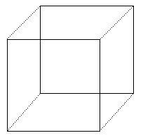

<!-- id: s11-08-0027 -->

…c’est précisément là, *en raison de cette rupture de l’espace* qui sous-tend votre perception même, ce qui fait que nous percevons comme cube. Tout le jeu, le « *passez muscade* » de la dialectique classique, autour de la perception, est autour de ceci qu’il s’agit de la vision géo­métrale, de la vision en tant qu’elle se situe dans un espace qui n’est pas, dans son essence, ce dont il s’agit concernant le visuel.

<!-- id: s11-08-0028 -->

Et aussi bien, ce rapport, de l’apparence à l’être dont le philosophe, afin de se donner ce champ, se rend si aisément maître,
est ailleurs. Il est ailleurs, dans *l’autre propriété de la lumière, qui est d’être le point lumineux*, c’est-à-dire quelque chose d’autre que
ces objets consti­tués dans la référence de l’espace, qui est point d’irradiation, ruisselle­ment de lumière, source jaillissante de reflets.
La lumière se propage sans doute en ligne droite, mais elle se réfracte, elle diffuse, elle inonde, elle remplit - n’oublions pas -
cette coupe qu’est notre œil, elle en déborde aussi. Elle nécessite, pour nous, autour de cette coupe, toute une série d’organes, d’appareils, de défenses.

<!-- id: s11-08-0029 -->

Ce n’est pas simplement à la distan­ce que l’iris réagit, c’est aussi à la lumière, et il a à protéger ce qui se passe au fond de la coupe, qui pourrait, dans certaines conjonctures, en être lésé, et aussi bien notre paupière, elle aussi, devant une trop grande lumière,
est appelée à se resserrer, clignant d’abord, voire d’une façon plus ou moins ferme, se resserrant en une grimace bien connue.
Aussi bien n’y a-t-il pas que l’œil à être photosensible, nous le savons. Toute la surface du tégument, à des titres sans doute divers, qui ne sont point que visuels, peut être pourtant photosensible, et cette dimension ne saurait être réduite d’aucune façon
dans le fonctionnement de la vision, du rôle du pigment.

<!-- id: s11-08-0030 -->

Il est certaine première forme, ébauche, d’organes photosensibles qui sont les tâches pigmentaires, et au fond, dans l’œil,
le pigment fonctionne à plein, et de façon, certes, que le phé­nomène montre *infiniment complexe*, fonctionnant à l’intérieur des cônes, par exemple, sous la forme de la rhodopsine et aussi, fonctionnant à l’intérieur des diverses couches de la rétine. Allant, venant
\- ce pigment - dans des fonctions, aussi bien, qui ne sont pas toutes, pour nous, ni tou­jours, immédiatement repérables et claires, mais suggérant la profondeur et la complexité et en même temps l’unité, de toute une série de méca­nismes qui sont,
à proprement parler, ceux de la relation à la lumière.

<!-- id: s11-08-0031 -->

Pour vous mener, vous faire cheminer, dans ce qui est proprement ce qui nous intéresse, à savoir *la relation du sujet avec ce qu’il en est proprement de la lumière*, qui semble bien déjà s’annoncer pour ambiguë puisque, vous le voyez *ces deux schémas triangulaires s’inversent* :

<!-- id: s11-08-0032 -->

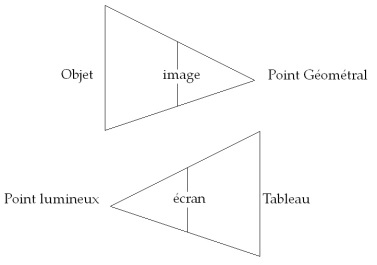

<!-- id: s11-08-0033 -->

en même temps qu’ils doivent se superposer, vous donnant là l’exemple premier de ce que j’in­diquais tout à l’heure,
devant être essentiellement ce fonctionnement d’entrelacs, d’entrecroisement, de *chiasma*, qui est celui auquel, ou dans lequel,
nous devons nous déplacer dans tout ce domaine.

<!-- id: s11-08-0034 -->

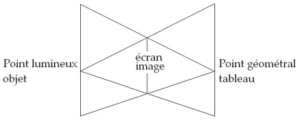

<!-- id: s11-08-0035 -->

Pour articuler, vous faire sentir ce qu’il en est de la question que pose, ou plus exactement d’un premier ordonnancement
de la question dans son rapport à la lumière, concernant le *sujet*, et sa place, sa place en tant qu’elle est autre chose que cette place
de point géométral que définit l’optique pure, ou l’optique géométrique.

<!-- id: s11-08-0036 -->

Je vais vous raconter un petit apologue, une petite histoire, elle est vraie. Elle date de quelque chose comme mes vingt ans, et dans ce temps, bien sûr, jeune intellectuel, je n’avais d’autre souci que d’aller ailleurs, enfin, de me baigner dans quelque pratique directe, rurale, chasseresse, voire marine. Et un jour, sur un petit bateau où j’étais en train, avec quelques personnes membres d’une famille de pêcheurs dans une petite ville, un petit port…

<!-- id: s11-08-0037 -->

> à ce moment-là, notre Bretagne n’était pas encore au stade de la grande industrie, ni du chalutier, le pêcheur pêchait dans sa coquille de noix, et à ses risques et périls, c’est ces risques et périls que j’aimais partager, mais ce n’était pas
>
> tout le temps risques ni périls, il y avait aussi des jours de beau temps
> …et un jour que nous attendions le moment de retirer les filets, le nommé Petit-Jean, nous l’appellerons ainsi…

<!-- id: s11-08-0038 -->

> il est comme toute sa famille disparu très promptement du fait de la tuberculose qui était
>
> à ce moment-là la maladie vraiment ambiante, dans laquelle toute cette couche sociale se déplaçait
> …me montre *ce quelque chose qui flottait* à la surface des vagues : *c’était une petite boîte,* et même précisons : *une boîte à sardines*.

<!-- id: s11-08-0039 -->

Elle flottait là dans le soleil, témoignage de l’industrie de la conserve que nous étions par ailleurs chargés d’alimenter.
*Elle miroitait dans le soleil*. Et Petit-Jean me dit : « *Tu vois, cette boîte ? Tu la vois ? Eh bien, elle, elle te voit pas !* »
Ce petit épisode - *il trouvait ça très drôle, moi moins. J’ai cherché pourquoi, moi, je le trouvais moins drôle* - ce petit épisode est fort ins­tructif.
Ce petit apologue doit nous retenir un instant. D’abord, si ça a un sens, que Petit-Jean me dise que la boîte ne me voit pas,
c’est parce que, en un certain sens, tout de même *elle me regarde* : au niveau *du point lumineux c’est là qu’est tout ce qui me regarde*,
et ce n’est point là métaphore.

<!-- id: s11-08-0040 -->

La portée de cette petite histoire, telle qu’el­le venait de surgir dans l’invention de mon partenaire, le fait qu’il la trouvât si drôle
et que moi, moins, tient au fait que si on me regarde, si on me raconte une histoire comme celle vous donnant là l’exemple premier
de ce que j’in­diquais tout à l’heure, devant être essentiellement ce fonctionnement d’entrelacs, d’entrecroisement, de *chiasma*,
qui est celui auquel, ou dans lequel, nous devons nous déplacer dans tout ce domaine.

<!-- id: s11-08-0041 -->

Là, c’est tout de même dans la mesure où moi, à ce moment vous donnant là l’exemple premier de ce que j’in­diquais tout à l’heure, devant être essentiellement ce fonctionnement d’entrelacs, d’entrecroisement, de *chiasma*, qui est celui auquel, ou dans lequel,
nous devons nous déplacer dans tout ce domaine - là, tel que je me suis dépeint, avec ces types qui gagnaient là péniblement
leur existence à *cette étreinte avec ce qui était, pour eux, la rude nature,* moi *je faisais tableau* d’une façon assez inénarrable.

<!-- id: s11-08-0042 -->

Pour tout dire, *je faisais* tant soit peu *tâche dans le tableau*, et c’est bien de le sentir - rien qu’à entendre, à m’entendre interpeller ainsi, dans cette humoristique, ironique histoire - que je ne la trouve pas si drôle que ça. Je prends ici la structure au niveau du sujet,
mais elle reflète quelque chose qui se trouve déjà dans le rapport naturel que l’œil inscrit à l’en­droit de la lumière. Je ne suis pas simplement cet être punctiforme qui se repère au point géométral d’où est saisie la perspective : *au fond de mon œil se peint le tableau*.
Je suis ici dans une entière ambiguïté : le tableau, certes est dans mon œil, *mais moi je suis dans le tableau*.

<!-- id: s11-08-0043 -->

*Ce qui est lumière me regarde*, et grâce à cette lumière, quelque chose - au fond de mon œil - se peint, qui n’est point simplement
le rapport construit, l’objet sur quoi s’attarde le philosophe, qui est *impression*, qui est *ce ruisselle­ment d’une surface* \[cf. *Lituraterre,* 12-05-1971\]
qui n’est pas d’avance située, pour moi, dans sa dis­tance.

<!-- id: s11-08-0044 -->

Justement, il fait intervenir ce quelque chose d’élidé dans la rela­tion géométrale, ce point que définit bien la notion, le terme,
le maniable même, grâce à nos appareils - car c’est d’*un appareil photogra­phique* qu’il s’agit - de la « *profondeur de champ* » avec tout
ce qu’elle pré­sente d’ambigu, de variable, de nullement maîtrisé par moi et bien plu­tôt qui me saisit, qui me sollicite à chaque instant et fait du *paysage*, quelque chose de bien autre qu’*une perspective*, ce que j’ai appelé *le tableau*.

<!-- id: s11-08-0045 -->

La *référence* du tableau, celle qui est à situer à la même place, c’est-à-dire au dehors, c’est *le point du regard*. Et ce qui, de l’un à l’autre, fait la médiation, ce qui est entre les deux, c’est quelque chose qui est d’une autre nature que ce que nous saisissions l’autre jour, comme ce qu’on peut appeler cette mise au point, ou encore *cette mise en coupe réglée* qui constitue l’*espace optique géométral*,
c’est quelque chose qui joue un rôle exactement inverse, je veux dire, qui opère, non point par ce fait d’être traversable
mais au contraire d’être opaque, c’est l’écran. Ce qui, au niveau du *regard*, de ce qui dans les points divers de ce qui se présente
pour moi comme espace de la lumière est pour moi *regard* :

<!-- id: s11-08-0046 -->

- c’est toujours *quelque jeu de la lumière et de l’opacité,*

<!-- id: s11-08-0047 -->

- c’est toujours *ce chatoiement, ce miroitement* qui était là tout à l’heure au cœur de ma petite histoire,

<!-- id: s11-08-0048 -->

- c’est toujours *ce qui, en chaque point, me retient d’être écran, de faire apparaître la lumière comme chatoiement*, chose qui la déborde.

<!-- id: s11-08-0049 -->

*Pour tout dire, le point de regard participe toujours de l’ambi­guïté du joyau.* Et moi, si je suis quelque chose dans le tableau,
c’est aussi sous l’autre face qui est aussi face de *l’écran*, à savoir comme ce que j’ai appelé tout à l’heure : *la tâche*.

<!-- id: s11-08-0050 -->

Tel est le rapport du sujet avec le domaine de la vision et qui n’est point un rapport au sens courant du mot sujet, subjectif,
je veux dire qu’il ne saurait être considéré comme un rapport *idéaliste*. Ce survol que j’appelle le sujet - quand je le donne
comme donnant la consistan­ce, faisant la solidité du tableau, son unité - n’est pas un survol simple­ment représentatif.

<!-- id: s11-08-0051 -->

Il est ici plusieurs façons de se tromper concernant cette fonction du sujet dans le domaine de ce qui se développe comme *spectacle*. Assurément, l’autonomie, « *la fonction de synthèse* », comme on dit, de ce qui se passe *en arrière*, disons, de la rétine, dans ce qui fait que, phé­noménalement, nous pouvons nous *apercevoir*, il y en a des exemples tout à fait remarquables donnés dans le livre
de MERLEAU-PONTY qui s’ap­pelle *Phénoménologie de la perception.*

<!-- id: s11-08-0052 -->

Il extrait très savamment d’une *abondante littérature* - une étude de la phénoménologie de la vision - des faits très remarquables, moyennant quoi la seule intervention de mas­quer, grâce à un écran, une partie d’un champ fonctionnant comme sour­ce de couleurs composées, faites par exemple de deux roues, de deux écrans, qui en tournant l’une derrière l’autre, doivent composer un cer­tain ton de lumière, que l’intervention simplement d’*un écran*, fait voir d’une façon toute différente *la composition dont il s’agit*.

<!-- id: s11-08-0053 -->

Ici, bien effectivement en effet, nous saisissons la fonction purement subjective *au sens ordinaire du mot*, la note de mécanisme central qui, pour nous *intervient* et donne à ce qui fut construit dans l’expérience, dont nous connaissons toutes les composantes,
ce qui distingue la construction du jeu de lumière de ce qui est perçu par le sujet.

<!-- id: s11-08-0054 -->

Autre chose, vous le sentez bien, sera de nous apercevoir - ce qui aura encore, pourtant, une face subjective mais tout autrement accommodée - de nous apercevoir par exemple des effets de reflet, d’un certain champ, d’une certaine couleur, disons par exemple, un jaune, sur le champ qui est à côté, qui sera bleu par exemple, et qui, du fait de recevoir la lumiè­re réfléchie sur le champ jaune,
en recevra aussi quelque modification.

<!-- id: s11-08-0055 -->

Mais assurément, *tout ce qui est couleur n’est que subjectif*. Nul corrélat objectif dans le spectre ne nous permet d’attacher la qualité de la couleur à la longueur d’onde ou à la fréquence intéressée à ce niveau de la vibration lumineuse, il y a là quelque chose d’encore subjectif, mais tout de même situé différemment que dans la première expérien­ce évoquée. Est-ce là tout ?
Est-ce là ce dont je parle quand je parle de la relation du sujet à ce que j’ai appelé le tableau ? Assurément pas !

<!-- id: s11-08-0056 -->

*La relation* *du sujet à ce qui est appelé le tableau*, nous donne précisément ce *quelque chose* qui, très curieusement, est approché par certains philosophes *mais situé*, si je puis dire, *à côté*. Lisez le livre de Raymond RUYER appelé *Néo-finalisme* et voyez com­ment il se trouve appelé à exiger, à construire, pour situer la perception - et qu’il conçoit comme étant la perception dans une perspective *téléolo­gique -*
à situer le sujet en survol absolu.

<!-- id: s11-08-0057 -->

Il n’y a manifestement aucune nécessité, si ce n’est de la façon la plus abstraite, à penser le sujet en sur­vol absolu quand il s’agit, comme dans son exemple, de nous faire saisir ce que c’est que la perception d’un damier, lequel appartient par essence à cet espace, à cette vision, à cette optique géométrale que j’ai pris soin d’abord de distinguer : nous sommes là dans le *partes extra partes,*
dans l’*espace* tel qu’il est justement constitué, défini comme tel, et qui fait toujours tellement dif­ficulté, objection à la saisie de l’objet.

<!-- id: s11-08-0058 -->

Mais dans cette direction, la chose est irréductible, nous sommes dans le *partes extra partes.*

<!-- id: s11-08-0059 -->

Et pourtant, il est un domaine phénoménal, et quand on y regarde de près infiniment plus étendu que les points privilégiés
où il apparaît, qui nous fait saisir dans sa véritable nature ce sujet en survol absolu - ce n’est point parce que nous ne pouvons pas lui donner d’être, qu’il n’est point exigible - nommément, cette dimension où ici je me situe dans le tableau, et comme *tache*
très précisément, ce qui nous est amené dans le domaine naturel *par les phénomènes qu’on appelle, plus ou moins proprement,* *du mimétisme*.

<!-- id: s11-08-0060 -->

Je ne puis ici même m’engager dans le foisonnement des faits et des problèmes qui sont suggérés, imposés, plus ou moins élaborés, dans cette dimension du *mimétisme*. Là-dessus, vous vous reporterez aux ouvrages spéciaux, qui ne sont pas simplement fascinants,
captivants mais extrêmement riches en matière à réflexion. Ce que je veux accentuer, c’est ce qui, peut-être, n’a pas été, jusqu’alors, suffisamment souligné, concernant ce dont il s’agit.

<!-- id: s11-08-0061 -->

À la rigueur, on peut parler, dans certains phénomènes du mimétisme, de coloration adaptative ou adaptée, comme vous voudrez, et par exemple en saisir comme l’a indiqué [CUENOT](http://fr.wikipedia.org/wiki/Lucien_Cu%C3%A9not) avec dans certains cas une pertinence probable, que la coloration en tant qu’elle s’adapte au fond, ne serait - ce qui est déjà fort important à saisir - qu’un mécanisme, qu’*un mode de défense contre la lumière*.

<!-- id: s11-08-0062 -->

En d’autres termes, un animalcule, quel qu’il soit, il en est d’innom­brables qui peuvent ici nous fournir des exemples,
dans un certain milieu, où du fait de l’entourage domine le rayonnement vert, dans un fond d’eau au milieu d’herbes vertes,
ne se fait vert que pour autant que pour lui la lumière pouvant être - c’est nous qui l’avançons et la chose n’est point invraisemblable, elle peut être dans certains cas, contrôlée - pou­vant être pour lui un agent nocif, il se fait vert pour la renvoyer,
comme chacun sait que c’est là ce qui se produit, la renvoyer en tant que verte : il se met, par son adaptation colorée,
*à l’abri des effets* de cette lumière.

<!-- id: s11-08-0063 -->

Mais dans le *mimétisme*, c’est de tout autre chose qu’il s’agit. Ici, je suis forcé de prendre un exemple, c’est un exemple choisi
presque au hasard, ne croyez pas que ce soit un cas ni un exemple privilégié.

<!-- id: s11-08-0064 -->

Un petit crustacé qu’on appelle *[caprella](http://www.mer-littoral.org/24/galerie-crustaces.php),* et auquel on ajoute un autre adjec­tif *acanthifera* quand il loge, quand il niche au milieu
de ces sortes d’ani­maux, à la limite de l’animal, qu’on appelle des *briozoaires* - imite quoi ? - imite ce qui chez le *briozoaire* se présente comme tache, dans cet ani­mal quasi plante qu’est le *briozoaire* : à telle de ses phases, une anse intes­tinale fait tache,
à une autre de ses phases, il y a quelque chose comme un centre coloré aussi qui fonctionne.

<!-- id: s11-08-0065 -->

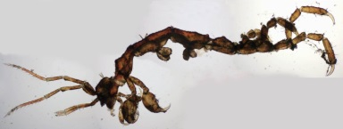

<!-- id: s11-08-0066 -->

C’est de ce rapport d’une forme à une forme tachée que le crustacé s’*accommode* : *il se fait tache, il se fait tableau, il s’inscrit dans le tableau*. C’est là ce qui est à proprement parler le ressort original dans le *mimétisme*. Et à partir de là, les dimensions fondamentales de ce qu’il en est du sujet en tant qu’il a à s’inscrire dans le tableau, apparaissent, et appa­raissent infiniment plus justifiées qu’au premier abord, une sorte de *divination* plus ou moins tâtonnante, ne peut nous le donner.

<!-- id: s11-08-0067 -->

J’ai fait allusion déjà, il y a deux de mes conférences, à ce que CAILLOIS en dit dans son petit livre « *Méduse et compagnie »*
avec une pénétration incontestable, qui est quelquefois celle du non spécialiste, en ceci que justement sa distance lui permet
peut-être de mieux saisir les reliefs de ce que le spécialiste n’a pu faire qu’épeler.

<!-- id: s11-08-0068 -->

Il y arrive, je crois, d’une façon beaucoup *plus juste et efficace* que ne l’ont fait ceux qui ne veulent voir dans *le registre des colorations*
*que des faits d’adaptation* diversement réussis et aussi bien toujours ambigus, car les faits, comme je vous l’ai indiqué, démontrent
qu’à peu près rien *de l’ordre de l’adaptation* - tel qu’il est envisagé d’une façon ordinaire, *à savoir adaptation liée aux besoins de la survie* -
qu’à peu près rien n’est justifié du *mimétisme*, qui aussi bien dans la plupart des cas se montre soit inopérant soit opérant strictement en sens contraire de ce que voudrait le résultat présumé adaptatif.

<!-- id: s11-08-0069 -->

Par contre, CAILLOIS met en relief les trois termes qui sont effective­ment les dimensions majeures où se déploie cette activité mimétique, il les appelle, il les distingue au catalogue dans les trois rubriques qui sont à la vérité, semble-t-il, celles qui, au moins pour un temps, nous parais­sent essentielles à retenir notre réflexion :

<!-- id: s11-08-0070 -->

- celle du travesti, dit-il,

<!-- id: s11-08-0071 -->

- celle du camouflage,

<!-- id: s11-08-0072 -->

- celle de l’intimidation.

<!-- id: s11-08-0073 -->

Je répète : *travesti, camouflage, intimidation. C’est dans ce domaine, en effet, que se présente la dimension par où le sujet a à s’insérer dans le tableau.*
*Il donne à voir quelque chose en tant que ce quelque chose est distinct de ce qu’on pourrait appeler « un lui*-*même » qui est derrière.*

<!-- id: s11-08-0074 -->

L’effet du *mimétisme* est *camouflage*, et au sens, je vous l’ai dit, proprement technique, ce n’est pas de se mettre en accord avec le fond dont il s’agit, mais sur un accord bigarré, un fond bigarré de se faire bigarrure, exactement comme la *technique* du camouflage
dans les opérations de guerre humaine s’opère.

<!-- id: s11-08-0075 -->

Quand il s’agit du *travesti*, il s’agit à proprement parler de la visée d’une certaine *finalité sexuelle*, et la nature nous montre
cette référence à *la visée sexuelle* comme se produisent par toutes sortes d’effets qui sont essentiellement de *déguisement*, de *mascarade*, en ce sens qu’ici se constitue un plan distinct de la visée sexuelle elle-même qui se trouve y jouer un rôle essentiel et qu’il ne faut pas distinguer et isoler trop vite comme étant celui de la *tromperie*. La fonction du *leurre* en cette occasion est autre chose, devant quoi
il convient de suspendre les décisions de notre esprit avant que d’en avoir bien mesuré l’incidence.

<!-- id: s11-08-0076 -->

Enfin le phénomène dit de *l’intimida­tion* comporte, lui aussi, toujours cette sur-value que le sujet essaie d’at­teindre dans son apparence, mais dont, là aussi, il convient de ne pas voir trop vite l’effet comme comportant, disons le mot, une *intersubjectivité*.
Chaque fois qu’il s’agit de l’*imitation*, gardons-nous de trop vite penser à l’autre qui serait soi-disant *imité*.
*Ce que le sujet imite fonciè­rement dans l’imitation, c’est une certaine fonction qu’il tend à donner de lui*-*même*.

<!-- id: s11-08-0077 -->

C’est à ceci que nous devons provisoirement nous arrê­ter si nous ne voulons pas aller trop vite, car ce qui nous sollicite, en cette occasion, concernant la véritable fonction, qui est ici évoquée, sur ce sujet, dans un survol, qu’il nous faut bien considérer comme subsis­tant, puisque des faits, des choses se manifestent comme ne pouvant se situer, se déterminer, que dans ce plan de survol.

<!-- id: s11-08-0078 -->

Tel *le mimétisme*, ce qu’il nous faut, c’est essayer de regarder de plus près et non pas simplement dans cette référence à la fin,
*plus ou moins* confuse, toujours *plus ou moins* évoquée par la fonction de l’instinct, c’est de voir ce qu’il en est, au *point* *où* pour nous,
il est nécessaire de *l’accommoder*, à savoir au niveau de ce que nous apprend *la fonction inconsciente*, comme telle,
en tant qu’elle est ce champ, pour nous, qui se propose à la conquête du sujet.

<!-- id: s11-08-0079 -->

Dans cette direction, nous aurons à nous avancer, guidés par une « *remarque* » disons, du même CAILLOIS. Par exemple il perçoit,
il indique, assurément il devine là quelque chose : que dans ce qu’il s’agit, concer­nant les faits du *mimétisme,* il ne s’agirait de rien d’autre que l’analogue, au niveau animal de ce qui, chez l’être humain, se manifesterait comme art et nommément celui de *la peinture*.

<!-- id: s11-08-0080 -->

Je ne peux pas dire que ce soit là remarque qui soit suggestive pour l’usage que nous allons être amenés à en faire. La seule chose qu’on puis­se y objecter, c’est que, pour *René* CAILLOIS \[*lapsus : <u>Roger</u> Caillois*\], ceci semble indiquer que la peinture,
ça serait si clair que ça, qu’on puisse s’y référer comme à quelque chose qui serait plus clair. Qu’est-ce que cette peinture ?
Ce n’est évidemment pas pour rien que nous avons accentué comme tableau, la fonction où le sujet a à se repé­rer comme tel.
Mais quand un sujet humain s’engage à *en faire un tableau*, à mettre en œuvre *ce quelque chose qui a pour centre le regard*, de quoi s’agit-il ?

<!-- id: s11-08-0081 -->

J’avancerai la thèse suivante : *dans le tableau l’artiste* - nous dit-on - *veut être* *sujet*, il se distingue de tous les arts - celui de la peinture –
en ceci que dans l’œuvre, c’est comme sujet, c’est comme regard que l’artiste entend, à nous, s’imposer. À ceci, d’autres répondront en insistant, non sans rencontrer effectivement quelques *difficultés*, mais *en mettant en valeur le côté objet du produit de l’art*. En somme, que dans ces deux directions de remarques, quelque chose d’également efficace, de plus ou moins approprié se manifeste,
mais qui assurément n’épuise pas ce dont il s’agit.

<!-- id: s11-08-0082 -->

J’avance qu’assurément dans le tableau, toujours se manifeste quelque chose du *regard*.
Le peintre le sait bien dont aussi bien la morale, la recherche, la quête et l’exercice est vraiment,
qu’il s’y tienne ou qu’il en varie la sélection, si je puis dire, d’un certain mode de regard.

<!-- id: s11-08-0083 -->

Assurément, à une vision particulièrement approfondie et perspicace de ce qui aura été avancé devant vous, il sera livré
qu’à regarder des tableaux, même les plus privés de ce qu’on appelle *le regard*, constitué par une paire d’yeux, même dans les tableaux où toute représentation de la figure humaine est absente, dans tel tableau de paysage d’un peintre hol­landais ou flamand, suffisamment *averti* vous finirez par voir, comme en filigrane, quelque chose de si spécifié pour chacun des peintres,
que vous aurez le sentiment de *la présence du regard*.

<!-- id: s11-08-0084 -->

Mais ce n’est là qu’objet de recherche et après tout qu’illusion, peut-être. La fonction du tableau, par rapport à *celui à qui le peintre*, littéra­lement, *donne à voir son tableau, a un rapport avec le regard*. *Ce rapport n’est pas*, comme il semblerait à une première appréhension, d’être « *piège à regard »*. On pourrait croire que tel l’acteur, le peintre vise au « *m’as*-*tu vu* » et *désire être regardé*. Je ne le crois pas.

<!-- id: s11-08-0085 -->

Je crois qu’il y a un rapport au regard de l’amateur mais qu’il est plus complexe : *le peintre, à celui qui doit être devant son tableau,*
*donne quelque chose* qui dans toute une partie au moins de la peinture, pourrait se résumer ainsi : « *Tu veux regarder, eh bien, vois donc ça !* »
Il donne quelque chose en *pâture* à l’œil, mais *il invite* celui auquel le tableau est présenté, *à déposer là son regard*, comme on dépose
les armes, et c’est là l’effet pacifiant, apollinien de la peinture, c’est que *quelque chose est donné* non point tant au regard qu’*à l’œil*,
mais il comporte cet *abandon, ce dépôt du regard*. Comme tel, il appelle le sujet à ce niveau où il a déposé son propre regard.

<!-- id: s11-08-0086 -->

Assurément, il y a là quelque chose qui fait problème, car toute une face de la peinture, celle qui - à tout le moins, peut-on dire, quelque place qu’on lui donne - se sépare de ce champ que je viens ici d’articuler, de définir, toute une face de la peinture est expressionniste, à savoir que celle-là, elle donne quelque chose - et c’est ce qui la distingue - qui va dans le sens d’une certaine *satisfaction* - au sens où FREUD emploie le terme quand il s’agit de *satisfaction de la pulsion -* une certaine *satisfaction*
à ce qui est demandé par *le regard*.

<!-- id: s11-08-0087 -->

C’est là justement ce qui peut nous per­mettre d’y distinguer des autres ce que sont les exigences. En d’autres termes, il s’agit de poser maintenant la question de ce qu’il en est de l’œil comme organe. *La fonction* - dit-on - *crée l’organe*. Pure absurdité !
Elle ne l’explique même pas. Tout ce qui est dans l’organisme comme organe, se présente toujours comme ayant une grande multipli­cité de fonctions.

<!-- id: s11-08-0088 -->

Et dans l’œil - déjà à simplement marquer l’ambiguïté que nous avons marquée aujourd’hui - il est clair, que des fonctions diverses se conjuguent, au niveau de *la fonction discriminatoire*, celle qui s’individualise, s’isole au maximum au niveau de la *fovea,* au point élu de la vision distincte, qu’il ne s’agit pas de la même chose que dans ce qui se fait sur toute la surface de la rétine, injustement distingué par les spécialistes comme *fonction scopique*, point où *le même chiasme, le même entrecroisement* que nous avons souligné se retrouve, puisque ce champ, qui est soi-disant fait pour percevoir ce qui est dans des effets d’éclairement moindre, c’est là que se voit,
au maximum, la possibilité de percevoir des effets de lumière.

<!-- id: s11-08-0089 -->

Je veux dire qu’une étoile de cinquième ou sixième grandeur si vous voulez la voir - c’est le phénomène d’ARAGO -
ne la fixez pas tout droit : c’est très précisément à regarder un tout petit peu de côté qu’elle peut vous apparaître.

<!-- id: s11-08-0090 -->

Ces fonctions de l’œil n’épuisent pas le caractère de l’organe en tant qu’il surgit sur le vivant et qu’il y détermine ce que tout organe déter­mine, à savoir des devoirs. Ce qui fait la faute de notre référence à l’ins­tinct, si confuse, c’est que nous ne nous apercevons pas que l’instinct c’est la façon dont un organisme a à se dépêtrer, aux meilleures fins, avec un organe.

<!-- id: s11-08-0091 -->

Les exemples sont nombreux, dans l’échelle animale, de cas où c’est *le surcroît, le faix, le fardeau, l’hyper-développement* d’un organe devant quoi l’organisme succombe. La prétendue fonction de l’instinct dans ce rapport, dans ce rapport de l’organisme à l’organe, qui semble bien plus avoir à se définir dans le sens d’une *morale*. C’est une analogie, bien sûr, mais l’organisme a à se dépêtrer de
ce qu’on peut faire de cet organe et nous nous émerveillons des soi-disant *préadaptations* de l’instinct, en ce sens que de son organe, l’organisme peut faire quelque chose.

<!-- id: s11-08-0092 -->

Pour nous, dans la référence qui est la nôtre, concernant l’inconscient, où il est si net que c’est le rapport à l’organe dont il s’agit,
à savoir, non pas la sexualité, ni même le sexe, si tant est que nous puissions donner, et nous le ferons, à ce terme une référence spécifique, mais quelque chose de particulier, *le phallus, en tant qu’il fait défaut à ce qui pourrait être atteint de réel dans la visée du sexe*.

<!-- id: s11-08-0093 -->

C’est pour autant, que nous avons affaire au cœur de l’expérience de l’inconscient, à cet organe, déterminé chez le sujet par
une insuffisance, celle qui est organisée dans *le complexe de castration,* que nous avons à voir dans quelle mesure l’œil est intéressé
dans une dialectique semblable. Eh bien, dès le premier abord, nous voyons dans la dialectique de *l’œil* et du *regard*, qu’il n’y a point coïncidence, mais foncièrement *leur­re  *: je demande *un regard* quand, dans l’amour, je fais cette prière. Ce qu’il y a là de foncièrement insatisfaisant et de toujours manqué, c’est que :

<!-- id: s11-08-0094 -->

> « *Jamais tu ne me regardes, là où je te vois* ».

<!-- id: s11-08-0095 -->

Inversement, *ce que je regarde n’est jamais ce que je veux voir*.

<!-- id: s11-08-0096 -->

Et dans ce jeu, que j’ai évoqué tout à l’heure, du peintre et de l’amateur, qui est un jeu, un jeu de trompe-l’œil, quoi qu’on en dise,
et ici nulle exi­gence, nulle référence, à ce qu’on appelle improprement figuratif. Si là-dedans, vous mettez, je ne sais quelle
sous-jacence, c’est qu’elle est réfé­rence à la réalité.

<!-- id: s11-08-0097 -->

Quand dans l’apologue antique, concernant [ZEUXIS](http://fr.wikipedia.org/wiki/Zeuxis) et [PARRHASIOS](http://www.google.fr/search?client=firefox-a&rls=org.mozilla%3Afr%3Aofficial&channel=s&hl=fr&q=Parrhasios&meta=&btnG=Recherche+Google), le mérite de ces peintres nous est donné,

<!-- id: s11-08-0098 -->

- le premier d’avoir fait des raisins qui ont attiré les oiseaux, l’accent n’est point mis sur le fait que ces rai­sins fussent d’aucune façon, des raisins parfaits, l’accent est mis sur le fait que *même l’œil des oiseaux y a été trompé,*

<!-- id: s11-08-0099 -->

- et la preuve, c’est que son confrère PARRHASIOS triomphe de lui, qui n’a eu à peindre sur la muraille qu’un *voile*, un voile si ressemblant que ZEUXIS, se tournant vers lui, lui a dit :

<!-- id: s11-08-0100 -->

> « *Alors et maintenant, montre*-*nous - toi - ce que tu as fait derrière ça.*[^51] »

<!-- id: s11-08-0101 -->

En quoi il est montré que ce dont il s’agit, c’est bien de tromper l’œil, non pas par l’apparence, mais que *c’est par ce qui est donné*
*à supposer au*-*delà de cette apparence, qu’est le triomphe sur l’œil du regard*.

<!-- id: s11-08-0102 -->

Sur cette fonction de l’œil et du regard, nous poursuivrons notre che­min la prochaine fois.

<!-- id: s11-08-0103 -->

[vanitas](#Rvanitas)

<!-- id: s11-08-0104 -->

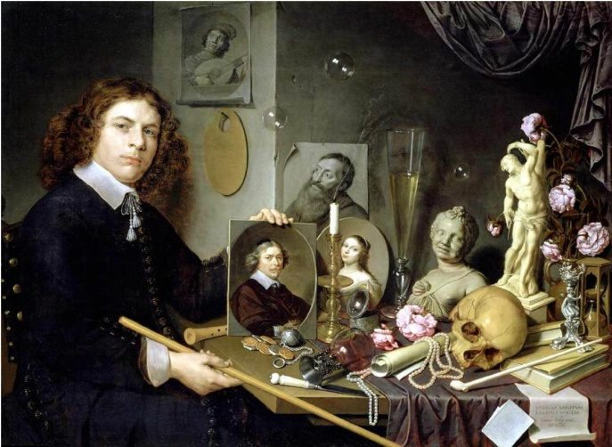 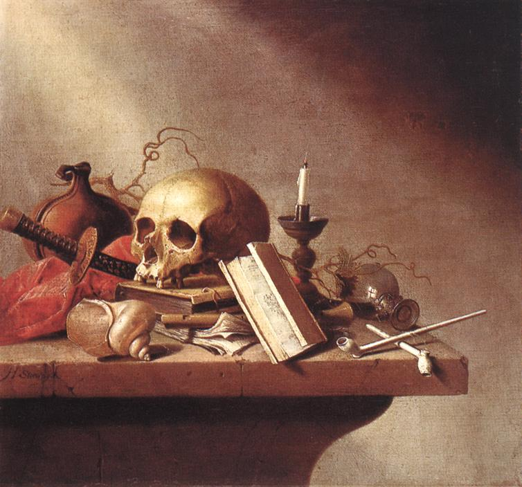

<!-- id: s11-08-0105 -->

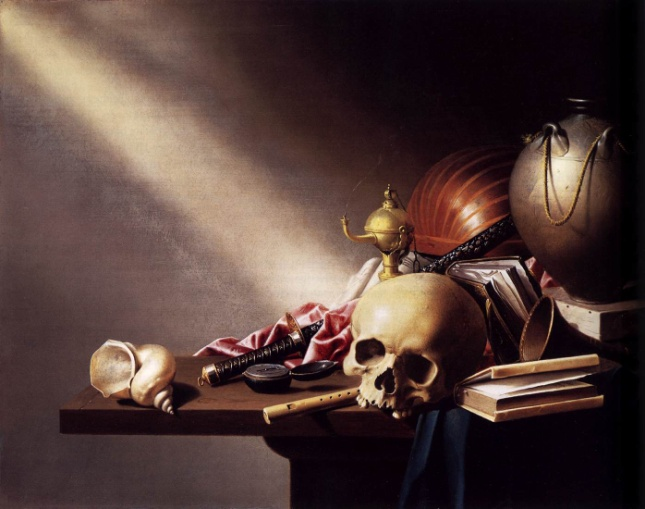 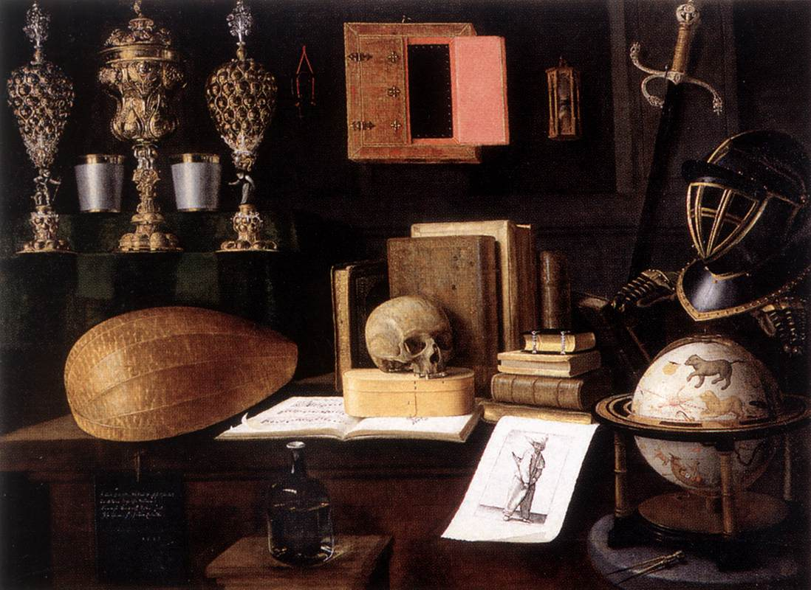

<!-- id: s11-08-0106 -->

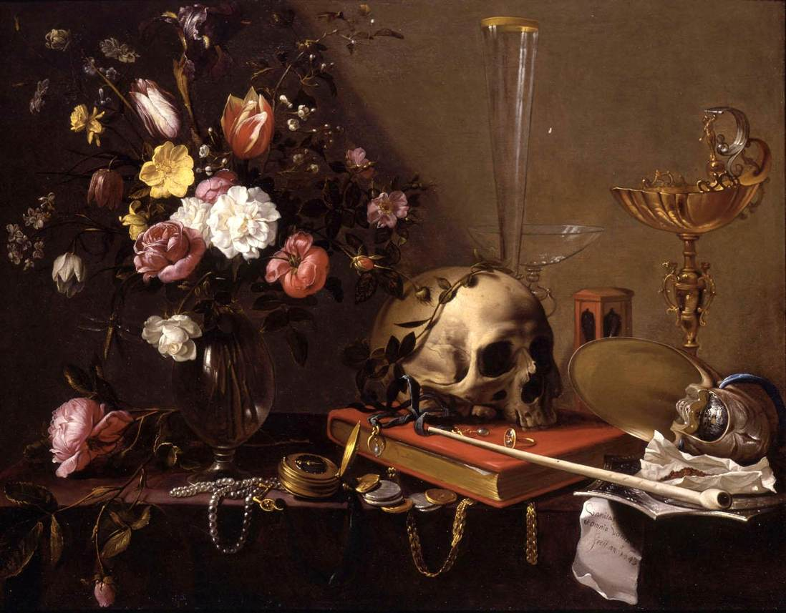 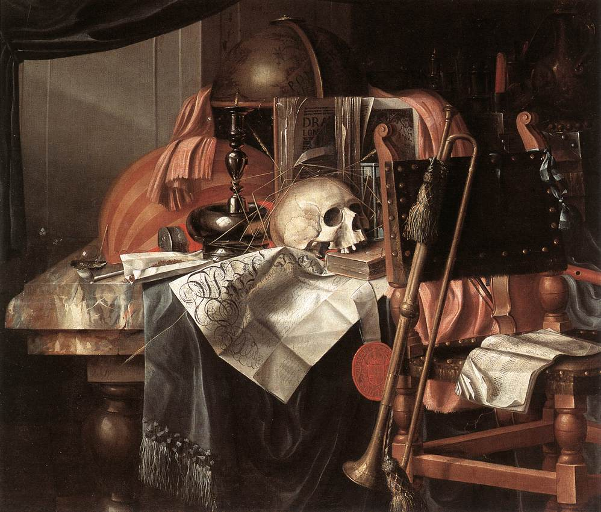
## Notes

[^50]: [Alain : *Éléments de philosophie*](http://classiques.uqac.ca/classiques/Alain/elements_de_philo/alain_element_de_philo.pdf), Folio-Essais, p. 32-33.

[^51]: Cf. Hegel : La Phénoménologie de l’Esprit, trad. Hyppolite, Aubier-Montaigne, 1941 (réimpression 1975) t..1, p.140-141 :

    « *Il est clair alors que derrière le rideau, comme on dit, qui doit recouvrir l'Intérieur, il n'y a rien à voir, à moins que nous ne pénétrions nous-mêmes derrière lui, tant pour qu’il y ait quelqu’un pour voir, que pour qu'il y ait quelque chose à voir.* » Et la note (55) qui est ajoutée  : « *Le dedans des choses est une construction de l’esprit. Si nous essayons de soulever le voile qui recouvre le réel, nous n’y trouverons que nous-même, l’activité universalisatrice de l’esprit que nous appelons entendement.* »
