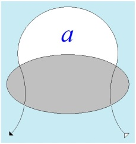

# Leçon 13 | 06 mai 1964

<!-- source-url: http://staferla.free.fr/S11/S11 FONDEMENTS.docx -->
<!-- seminar: s11 -->
<!-- lesson: 13 -->

<!-- id: s11-13-0001 -->

J’ai terminé mon dernier propos en ponctuant l’endroit où je vous avais menés, par cette schématisation topologique
d’un certain partage, d’un périmètre, non seulement commun, mais destiné à s’involuer sur lui-même,
et qui est celui que constitue ce qu’on appelle ordinairement et d’une façon impropre « la situation analytique ».

<!-- id: s11-13-0002 -->

Car ce que vise cette *topologie*, c’est à vous faire centrer tout ce qui peut être énoncé de cette prétendue « *situation* »
d’un certain point *trans-subjectif*, c’est arriver justement à concevoir où est *ce point* à la fois de *disjonction* et de *conjonction*,
d’*union* et de *frontière*, qui ne peut être occupé que par le désir de l’analyste.

<!-- id: s11-13-0003 -->

Avant d’aller plus loin, de vous montrer comment effectivement ce repérage est nécessité par tous les détours de concepts
et de pratiques que nous permet déjà d’accumuler une longue expérience de l’analyse et de *ses énoncés doctrinaux*,
avant d’aller plus loin, à l’épreuve j’ai vu que je ne pouvais - au moins pour ceux qui, jusqu’ici n’ont pu suivre pour des raisons simplement de fait, mes discours antérieurs - que je ne pouvais aller plus loin au moins sans commencer aujourd’hui de mettre
en avant le quatrième concept que je vous ai annoncé comme essentiel à l’expérience analytique, à savoir *le concept de la pulsion*.

<!-- id: s11-13-0004 -->

Ce que je vais aujourd’hui essayer, c’est une approche, une introduction - pour employer le terme de FREUD, *Einführung –*
cette introduction, nous ne pouvons la faire qu’à la suite de FREUD. C’est pour autant que - vous le savez - la notion dans FREUD est une notion absolument nouvelle, je veux dire, qui sans doute, par rapport à tous les emplois antérieurs du terme *Trieb,*
a une longue histoire, et aussi bien dans la... pas seulement dans *la psychologie* ou même dans *la* *physio­logie*, *mais dans la physique elle-même*, dans le passé de ses emplois en langue allemande, assurément ce n’est pas là pur hasard si FREUD a été choisir ce terme.

<!-- id: s11-13-0005 -->

Mais il lui a donné un emploi si spécifié, si essentiel, si intégré à notre pensée concernant *la pratique*, qu’en quelque sorte
il va tellement de soi, il est tellement intégré dans la pratique analytique elle-même, que ce passé est vraiment occulté, oublié :

<!-- id: s11-13-0006 -->

- autant le passé du terme « *inconscient* » pèse sur l’usage du terme d’« *inconscient* » dans la théorie analytique,

<!-- id: s11-13-0007 -->

- autant, pour ce qui est du *Trieb,* chacun l’emploie comme la désigna­tion d’une sorte de donnée radicale de ses points ou buts de notre expé­rience.

<!-- id: s11-13-0008 -->

Et on irait presque - *on va quelquefois* - à l’invoquer, par exemple et spécialement *<u>contre</u>* la doctrine qui est la mienne concernant
l’in­conscient, y désignant - de sa référence au signifiant et aux effets du signi­fiant - y désignant ce qu’on appelle, à tort ou à raison, peu importe, une intellec­tualisation. Si l’on savait ce que je pense de l’intelligence, assurément peut-être, on pourrait revenir
sur ce reproche, y désignant je ne sais quelle négligence prétendue, de ce quelque chose que tout analyste, en quelque sorte connaît d’expérience, à savoir ce qu’on appelle « *le pul­sionnel* », ce quelque chose que nous rencontrons dans l’expérience avec ce caractère d’irrépressible, même à travers les répressions : s’il doit y avoir répression, c’est qu’il y a au-delà ce quelque chose qui « *pousse* ».
Et bien sûr, il n’est nul besoin d’aller bien loin dans une analyse d’adulte, ni d’être un praticien d’enfants, pour connaître cet élément qui fait *le poids clinique de chacun des cas que nous avons à manier*, à traiter, et qui s’ap­pelle *la pulsion*.

<!-- id: s11-13-0009 -->

Et ici - cette référence à une donnée dernière, de quelque chose dont je vous dis que pour comprendre l’inconscient, il y a telle­ment lieu d’y renoncer, de l’écarter : *l’archaïque, le primordial -* et ici, il semble que ce recours dernier soit ce qui ne puisse d’aucune façon être négligé quand il s’agit d’aborder, de décrire l’inconscient. Est-ce bien là même une objection valable ?

<!-- id: s11-13-0010 -->

La question d’ailleurs est secondaire, il importe de savoir si - concernant la pulsion - ce dont il s’agit est du ressort, est du registre
de ce *primaire*, de ce poids de *l’organique*. Est-ce que c’est ainsi qu’il faut interpréter ce que - par exemple dans un texte de FREUD qui est dans *[Jenseits des Lustprinzips](http://www.textlog.de/sigmund-freud-jenseits-des-lustprinzips.html)* [^70] - que la pulsion, le *Trieb,* représenterait - dit-il - *die Äußerung der Trägheit,* quelques *manifestations*
*de l’inertie* dans la vie organique ? \[*Jenseits des Lustprinzips,* V* : Revision der Trieblehre. Ichtriebe und Sexualtriebe*\]

<!-- id: s11-13-0011 -->

Est-ce que c’est là la notion en quelque sorte *simple*, qui s’adjoin­drait de la référence à quelque *arrimage* de cette inertie
qui est juste­ment ce que nous appellerions, occasionnellement et ici d’une façon opaque, comme une référence à quelque *donné,*
la fixation, la *Fixierung* ? Non seulement je ne le pense pas, mais je pense qu’un exa­men sérieux de l’élaboration que donne FREUD de cette notion de la pul­sion va contre : *La pulsion* n’est pas *la poussée*, le *Trieb* n’est pas le *Drang.*

<!-- id: s11-13-0012 -->

Ne serait-ce, et c’est bien évident, que parce que, quand FREUD vient dans un article, écrit en 1915, c’est-à-dire un an après l’*[Einführung zum Narzissmus](http://www.irwish.de/PDF/Sigmund%20Freud%20-%20Zur%20Einf%FChrung%20des%20Narzi%DFmus.pdf)* [^71] - *vous verrez l’importance de ce rappel tout à l’heure* - nous écrit dans l’article *[Triebe und Triebschicksal](http://zenisis.de/images/ebook/Buch00105-Sigmund-Freud-auf-www.zenisis.de.pdf)* [^72]*,*
que j’aurais eu envie, en hommage à un livre de notre ami Maurice MERLEAU-PONTY, de traduire, moi, par : « *Les Pulsions*
*et les avatars de la pulsion ». M*ais après tout, c’est pour éviter justement *avatar* qui ne me paraît pas de très bonne traduction :
si c’était *Triebwandlungen,* ce serait « *avatars »*, *Schicksale* c’est *« aventures*, *vicissitudes » -* eh bien dans cet article, il dit que dans la pulsion, il importe d’y dis­tinguer quatre termes :

<!-- id: s11-13-0013 -->

- mettons *le « Drang »* d’abord, *la poussée*, ça n’en est qu’une part,

<!-- id: s11-13-0014 -->

- *la « Quelle » : la source*,

<!-- id: s11-13-0015 -->

- *l’« Objekt » : l’objet*,

<!-- id: s11-13-0016 -->

- *le « Ziel » : le but*.

<!-- id: s11-13-0017 -->

Et bien sûr - je vais donc l’écrire en français - et bien sûr on peut, à lire cette énumération, la trouver toute naturelle. Mon propos est de vous montrer que tout le texte est fait pour nous montrer que *ce n’est pas si naturel que ça*. Cette chose qui semble aller de soi, décrire en quelque sorte la ligne d’un rapport d’échange entre l’organisme et - nous dirions par exemple - *l’objet* de son besoin,
c’est là quelque chose contre quoi va tout ce que nous allons pouvoir lire, avant et après cet énoncé, dans le texte de FREUD.

<!-- id: s11-13-0018 -->

Il est essentiel d’abord de rappeler que FREUD lui-même nous désigne au départ de cet article que c’est là un *Grundbegriff,*
un *concept fonda­mental*, que ce concept - il en fait la remarque, en quoi FREUD se montre bon épistémologue - il faut s’attendre,
à partir du moment où lui FREUD l’introduit dans la science, que dans la suite tout soit possible.

<!-- id: s11-13-0019 -->

De deux choses l’une : où *il sera gardé*, où il sera *rejeté*. Il sera gardé s’il *fonctionne*, dirait-on de nos jours, je dirais s’il trace sa voie
dans le réel qu’il s’agit de pénétrer, mais comme tous les autres *Grundbegriff* dans le domaine scientifique. Et là nous voyons
se dessiner ce qu’il y a de plus présent - pour l’époque - à l’esprit de FREUD, à savoir *les concepts fonda­mentaux de la physique*
et du point de développement où la physique est arrivée.

<!-- id: s11-13-0020 -->

Point toujours présentifié par FREUD par le fait que ses maîtres, que les gars de son école en *physiologie*, sont ceux qui promeuvent de mener à réalisation les programmes - tel BRÜCKE - d’intégration de la *phy­siologie* aux concepts fondamentaux de *la physique* moderne et spécia­lement à ceux de l’*énergétique*. Et combien au cours de l’histoire, cette notion d’*énergie*, comme celle de *force* aussi bien, ont-elles pu en quelque sorte glisser de *l’extension progressive*, ou plus exactement, de *la généralisation des reprises de leur thématique* sur une réalité de plus en plus englobée ! C’est bien ce que prévoit FREUD :

<!-- id: s11-13-0021 -->

« *le progrès de la connaissance* - dit-il - *ne supporte aucune Starrheit* - je dirais - *aucune fascination des défini­tions* ».

<!-- id: s11-13-0022 -->

Il dit quelque part ailleurs que *la pulsion*, en quelque sorte, fait partie de nos *mythes*. J’écarterai ce terme de *mythe*, au sujet de *la pul­sion*. D’ailleurs, dans ce texte même et au premier paragraphe, FREUD emploie le terme de « *Konvention »,* de *convention*, qui est beaucoup plus près de ce dont il s’agit, et que j’appellerai d’un terme « *benthamien* » que j’ai à un moment bien repéré et fait repérer
à ceux qui me suivent : *une fiction*.

<!-- id: s11-13-0023 -->

Terme aussi, je le dis en passant, qui est tout à fait préférable à celui de *modèle* dont on a trop abusé, et qui s’en distingue en ceci : vous savez que le *modèle* n’est jamais un *Grundbegriff* \[*concept de base*\]*.* Ce qu’un certain style d’empirisme dans la théorie - qui est la caractéristique de *la physique anglaise -* a introduit sous le terme de *modèle*, c’est essentiellement quelque chose qui, concernant
ce sur quoi il y a à opérer dans un cer­tain champ, peut comporter aussi bien plusieurs *modèles* fonction­nant corrélativement.
Il n’en est pas de même pour un *Grundbegriff*, pour un *concept fondamental*, ni pour une *fiction fondamentale*.

<!-- id: s11-13-0024 -->

Et maintenant, demandons-nous ce qui apparaît *d’abord*, quand nous regardons de plus près ce qu’il en est de ces quatre termes, concer­nant la pulsion. Disons, pour aller vite, que ces quatre termes - si on regarde de près ce qu’en dit FREUD -
ne peuvent qu’apparaître disjoints.

<!-- id: s11-13-0025 -->

*La poussée* d’abord, nous allons…

<!-- id: s11-13-0026 -->

> si au moment où elle est intro­duite, nous nous reportons au début des énoncés de FREUD dans l’ar­ticle
> …*la poussée* va être identifiée à une pure et simple *tendance à la décharge*, c’est à savoir, à ce qui se produit du fait d’un *stimulus*, à savoir la transmission de la part admise, au niveau du stimulus, du *sup­plément d’énergie*, la fameuse quantité « Qή » de l’*Esquisse* [^73]*.*

<!-- id: s11-13-0027 -->

À ceci près que FREUD *nous fait là-dessus*, et d’emblée, *une remarque qui va très loin* dans le départ de ce dont il s’agit.

<!-- id: s11-13-0028 -->

Sans doute ici aussi il y a stimulation, excitation, pour employer le terme dont FREUD se sert à ce niveau : « *Reiz »,* l’*excitation*.
Le *Reiz,* à pre­mière lecture, le *Reiz* dont il s’agit concernant *la pulsion* est différent de toute stimulation venant du monde extérieur, c’est un *<u>Reiz interne</u>*.

<!-- id: s11-13-0029 -->

Qu’est-ce que ceci veut dire ? Nous avons là pour l’expliciter, la notion de *besoin* - et aussi bien est-elle dans le texte : le *Not -*
tel qu’il se manifeste dans l’organisme, à des niveaux divers et d’abord au niveau de la faim, de la soif, voilà qui est suffisamment explicite, *ce qu’on paraît vouloir dire* en distinguant le *Reiz interne*, *l’excitation interne* de *l’excitation externe*.

<!-- id: s11-13-0030 -->

Qu’il soit bien dit, pesé, que c’est dès les premières pages, dès les premières lignes, que FREUD définit, pose ce point vraiment inaugural, et de la façon la plus articulée, la plus formelle, *qu’il ne saurait d’aucu­ne façon s’agir de la pression d’un besoin tel le Hunger, la faim, ou le Durst, la soif* : *que ce n’est absolument pas de cela qu’il s’agit dans le Trieb !* Ce à quoi il va se référer, posant tout de suite pour nous
la question de ce dont il s’agit : dans le *Trieb,* s’agit-il de quelque chose dont *l’instance* s’exerce au niveau de l’organisme,
dans sa totalité, dans son état d’ensemble ?

<!-- id: s11-13-0031 -->

*Le réel ici fait-il son irruption*, au sens de faut-il que ce soit *le vivant* qui soit intéressé dans ce dont il s’agit, à savoir le champ freudien ?

<!-- id: s11-13-0032 -->

Non, il s’agit bien toujours et tout spécialement de ce champ lui-même, et sous la forme la plus indifférenciée que FREUD lui ait donné au départ, qui - pour nous reporter à l’*Esquisse* que je donnais tout à l’heure, que je désignais tout à l’heure - est à ce niveau appelé le *Ich,* le *Real*-*ich.*

<!-- id: s11-13-0033 -->

Le *Real*-*ich* est conçu d’abord comme supporté, non par l’organisme tout entier, mais par *le système nerveux dans son ensemble*
*en tant que* - sa trame et ce qu’il reçoit : les *stimuli* - *ce qui en règle la décharge*.

<!-- id: s11-13-0034 -->

Le *Ich* dont il s’agit a *ce caractère de sujet planifié, de sujet objecti­vé*, champ dont je souligne *les caractères de surface* justement,
en le traitant *topologiquement* dans la forme *d’une surface*, en tentant de vous montrer comment *à le prendre sous cette forme*, il répond à tous les besoins de son maniement. Ceci est essentiel, car quand nous y regarderons de plus près, nous verrons que le *Triebreiz,*
c’est ce par quoi certains éléments de ce champ sont, dit FREUD, *Triebbesetzt,* investis pulsionnellement.

<!-- id: s11-13-0035 -->

Ceci nous montre que ce dont il s’agit - pour m’exprimer d’une façon qui mériterait sans doute d’être plus développée, mais
je ne dois point me laisser entraîner trop loin mais rester près du texte de FREUD, qui d’ailleurs me donne ici tous les éléments -
c’est que si nous sommes nécessités à concevoir là quelque chose qui s’attarde au texte de FREUD parce que c’est articulé,
c’est que cet *investissement*, qui nous place sur le terrain d’une énergie, et pas de n’importe quelle énergie, *une énergie potentielle*,
car ce qu’il y a de frappant c’est que FREUD l’articule de la façon la plus pressante : la caractéristique de *la pulsion* est d’être
une *konstante Kraft,* une *force constante*, et qu’il ne peut pas le concevoir comme une *momentane Stosskraft.*

<!-- id: s11-13-0036 -->

Qu’est-ce que ça veut dire *momentane Stosskraft* ? Sur ce mot « *Moment »,* nous avons déjà l’exemple de quelque *malentendu historique* : les Parisiens, pendant le siège de Paris en 1870, se sont gaussés d’un certain *psychologische Moment* dont BISMARK aurait fait usage.
Ça leur a paru absolument marrant, car les Français ont toujours été cha­touilleux - *jusqu’à une époque récente qui les a habitués à tout* -
sur l’usa­ge exact des mots. Ce *moment psychologique* tout à fait nouveau, leur a paru l’occasion de bien rire.
Ça voulait dire le *facteur psychologique* tout simplement.

<!-- id: s11-13-0037 -->

Cette *momentane Stosskraft,* ici, qui n’est peut-être pas à prendre tout à fait dans le sens de *facteur*, mais dans le sens de « *moment »*
en ciné­matique, et cette *Stosskraft, force de choc*, je crois que ce n’est pas autre chose qu’une référence à *la force vive, à l’énergie cinétique*.
*Ici il ne s’agit point d’énergie cinétique*, en d’autres termes il ne s’agit pas de *quelque chose* qui va se régler avec *du mouvement*,
*la décharge dont il s’agit est d’une toute autre nature* et sur un tout *autre plan*.

<!-- id: s11-13-0038 -->

Quoi qu’il en soit au niveau de la poussée et - chose plus singulière - de cette constance qui, elle, témoigne, va tellement *<u>contre</u>*
toute assimila­tion possible à un autre, c’est-à-dire à une fonction biologique, c’est-à-dire à quelque chose qui a toujours un *rythme*.
*La pulsion*, la pre­mière chose qu’en dit FREUD c’est, si je puis dire, qu’elle n’a pas de jour ou de nuit, qu’elle n’a pas de printemps
ni d’automne, qu’elle n’a pas de montée, de descente : *c’est une force « constante »*.

<!-- id: s11-13-0039 -->

Il faudrait tout de même tenir compte des textes, et aussi de l’expérience. Parce que si, d’autre part - *à l’autre bout de la chaîne* –
nous nous aper­cevons que ce dont il s’agit, et ce à quoi nous sert le maniement de cette *fonction* de la pulsion, c’est toujours
la référence à ce que FREUD, ici aussi, *écrit en toutes lettres*, mais avec une paire de guillemets : la « *Befriedigung* »*,* la « *satisfaction* ».
C’est là que se pose pour nous la question de savoir ce que ça veut dire « *la satisfaction de la pulsion* ».

<!-- id: s11-13-0040 -->

Car vous allez me dire : « *Bon, c’est assez simple, la satisfaction de la pulsion, c’est arriver à son but, à son Ziel. Le fauve sort de son trou et quand il a trouvé ce qu’il a à se mettre sous la dent, il est satisfait, il digère* ». Le fait même qu’une image semblable puisse être évoquée, montre assez en fin de compte, qu’on la laisse résonner en harmonique à cette *mythologie* – alors : à proprement parler - de *la pulsion*.

<!-- id: s11-13-0041 -->

Il n’y a qu’une chose qui y objecte tout de suite…

<!-- id: s11-13-0042 -->

> et c’est d’ailleurs assez remarquable que depuis le temps que c’est là à nous poser comme une *énigme* qui, à la façon de toutes les *énigmes* de FREUD, est une énigme qui a été soutenue comme une gageure, enfin jusqu’au terme de la vie de FREUD, et même sans que FREUD ait daigné s’en expli­quer plus.
>
> Il laissait probablement le travail à ceux qui auraient pu le faire
> …c’est une des *vicissitudes*, des quatre *vicissitudes* fondamentales que FREUD nous pose au départ, et il est curieux que ce soit aussi *quatre vicissitudes*, comme il y a *quatre éléments de la pulsion,* c’est *<u>la troi­sième</u>*, celle qui précède juste la quatrième dont FREUD
> dans cet article ne traite pas, il la rejette à l’article suivant, à savoir *Le refoulement* - *<u>la troisième c’est la sublimation</u>*. \[*cf. « [La Troisième](http://www.ecole-lacanienne.net/documents/1974-11-01.doc)», Rome* 74\]

<!-- id: s11-13-0043 -->

Or, dans cet article - et à mille reprises - FREUD nous dit proprement que *la sublimation* aussi donne *la satisfac­tion d’une pulsion* alors qu’elle est *zielgehemmt*, *inhibée* *quant à son but*, en d’autres termes : qu’elle ne l’atteint pas. *Ça n’en est pas moins la satisfaction de la pulsion*,
et ceci, *sans refoulement*. En d’autres termes, pour l’instant je ne baise pas, je vous parle. Eh bien, je peux avoir exactement la même satisfaction que si je baisais. C’est ce que ça veut dire. C’est ce qui pose d’ailleurs la question de savoir si, effectivement, je baise.

<!-- id: s11-13-0044 -->

C’est entre ces deux termes que se pose, si on peut dire, l’extrême antinomie qui consiste tout d’abord en ceci : de nous rappeler
que l’usage de *la fonction de la pulsion* n’a pour nous d’autre portée que de *mettre en question* ce qu’il en est de la « *satis­faction* ».
Dès que je l’introduis, que je la promeus, tous ceux qui sont psycha­nalystes doivent sentir à quel point j’apporte là le niveau d’*accommo­dation* le plus essentiel.

<!-- id: s11-13-0045 -->

C’est à savoir qu’il est clair que ceux à qui nous avons affaire, les patients, ne se satisfont pas, comme on dit, de ce qu’ils ont.
Et pourtant, nous savons que *tout ce qu’ils sont, tout ce qu’ils vivent - leurs symptômes mêmes* - relève de la satisfaction.
Ils satisfont *quelque chose* qui va sans doute à l’encontre de ce dont ils pourraient se satisfaire, ou peut-être mieux encore
pourrait-on dire : *ils satisfont <u>à</u> quelque chose*. Ils ne se contentent pas de leur état *mais quand même*, en étant dans cet état si peu *contentatif, ils <u>se</u> contentent*, *et toute la question est justement de savoir* : qu’est-ce que c’est que ce « *se* » qui est là *contenté*.

<!-- id: s11-13-0046 -->

Dans l’ensemble et à une première approximation, nous irons même à dire que *ce* à quoi ils satisfont par les voies du déplaisir,
c’est - nous le savons, et aussi bien d’ailleurs est-ce communément reçu - c’est quand même *la loi du plaisir*.
Leur activité, si l’on peut dire, à un certain niveau, évident pour *cette sorte de satisfaction*, disons qu’ils se donnent « *beaucoup de mal* »
et que, jusqu’à un certain point c’est justement ce « *trop de mal* » qui est la seule justification de notre intervention.
On ne peut pas dire que, quant à la satisfaction, le but ne soit pas atteint. Il ne s’agit pas là *d’une prise de position éthique définitive*.
Il s’agit de savoir qu’à un certain niveau *c’est ainsi* que nous analystes, abordons le problème.

<!-- id: s11-13-0047 -->

Que pour autant que nous en savons un peu plus long que les autres sur tout ce qui est du normal et de l’anormal, nous savons que les formes d’arrangement qu’il y a de ce qui marche bien à ce qui marche mal, forment *une série continue* et que ce que nous avons là devant nous, c’est un système où tout s’arrange et qui a atteint sa sorte - à lui propre - de *satisfaction*.

<!-- id: s11-13-0048 -->

Si nous nous en mêlons, c’est dans la mesure où nous pensons qu’il y a des *voies plus courtes*, par exemple. En tout cas,
quand nous nous réfé­rons à *la pulsion*, c’est dans la mesure où nous entendons que *c’est à ce niveau de la pulsion que l’état de satisfaction*,
à rectifier sans doute, *auquel nous avons affaire, prend son sens, sa portée et sa stase*.

<!-- id: s11-13-0049 -->

Cette *satisfaction* est paradoxale parce que quand on y regarde de près, on aperçoit - et c’est là ce que j’ai voulu indiquer comme
*point d’insertion* dans notre discours de cette année - *quelque chose* qui va prendre dans la suite tout son développement, *quelque chose*
*de nou­veau* : c’est *la catégorie de l’impossible*. Elle est - dans les fondements des conceptions freudiennes - absolu­ment radicale.

<!-- id: s11-13-0050 -->

*Le chemin du sujet* - pour prononcer ici ce terme, par rapport auquel seul peut se situer ce terme de satisfaction –
*le chemin du sujet passe entre* - si je puis dire - *deux murailles de l’impossible*. *Cette fonction de l’impossible* n’est pas à aborder sans prudence, comme toute fonction qui se présente sous *une forme négative*.

<!-- id: s11-13-0051 -->

Je vou­drais simplement vous suggérer que, comme toutes les autres notions qui se présentent sous *une forme négative*,
la meilleure façon de les aborder n’est pas de les prendre par la négation, parce que ça va nous porter à la question sur le possible. *Et l’impossible ça n’est pas forcément le contrai­re du possible*, ou bien alors, comme ce qui est l’opposé du possible c’est assurément *le réel,* nous serons amenés à *définir le réel comme l’impos­sible*.

<!-- id: s11-13-0052 -->

Je n’y vois pas, quant à moi, d’obstacle, et ceci d’autant moins que dans FREUD, c’est sous cette forme qu’apparaît - en apparence - le *réel*, à savoir l’*obstacle* au *principe du plaisir*. Le *réel*, c’est le heurt, le fait que ça ne s’arrange pas tout de suite, comme le veut la main qui se tend vers les objets extérieurs.

<!-- id: s11-13-0053 -->

Je pense que c’est là une conception tout à fait *illu­soire* et *réduite* de la pensée de FREUD sur ce point. *Le réel s’y distingue*,
comme je l’ai dit la dernière fois, par sa sépara­tion *du champ du principe du plaisir*, par sa désexualisation, par le fait que son économie, de ce fait, admet quelque chose de nouveau juste­ment. *Ce quelque chose de nouveau c’est l’impossible*. Et ceci veut dire que l’*impossible*
est présent dans l’autre champ comme essentiel. Le *principe du plaisir* se caractérise par ceci que l’*impossible* y est si pré­sent
qu’*il n’y est jamais reconnu* comme tel. L’idée de la fonction du *principe du plaisir* de se satisfaire par *l’hal­lucination* est là pour l’illustrer.

<!-- id: s11-13-0054 -->

Mais ce n’est qu’une illustration de ceci : que supposée dans ce champ, ce champ de la pul­sion, la pulsion saisissant son objet apprend en quelque sorte, eh bien que ce n’est justement pas par là qu’elle est satisfaite !

<!-- id: s11-13-0055 -->

Car *si on ne distingue*, au départ de cette *dialectique* de la pulsion, *le Not, du Bedürfniss,* dont nous allons voir tout à l’heure *ce qu’il en est,*
le besoin, de l’exigence pulsionnelle, *c’est justement parce que, aucun objet d’aucun Not - besoin - ne peut satisfaire la pulsion.*

<!-- id: s11-13-0056 -->

Parce que, quand bien même vous gaveriez la bouche, cette bouche qui s’ouvre dans le registre de *la* *pulsion*, de *la pulsion orale*,
*ce n’est pas de la nourriture qu’elle se satisfait*, c’est comme on dit : du *plaisir de la bouche*. Et c’est bien pour cela qu’elle se reconnaîtra, qu’elle se ren­contrera, au dernier terme et dans l’expérience analytique, comme pul­sion orale, justement dans une situation où *elle ne fait rien d’autre que de commander le menu*. Ce qui se fait sans doute avec la bouche, qui est au principe de la satisfaction, *ce qui va à la bouche retourne à la bouche* et s’épuise dans ce plaisir que je viens d’appeler - pour me réfé­rer à des termes d’usage - « *plaisir de bouche* ».

<!-- id: s11-13-0057 -->

Et aussi bien c’est ce que nous dira FREUD. Prenez le texte :

<!-- id: s11-13-0058 -->

« *Pour ce qui est de l’objet dans la pulsion, qu’on sache bien* - nous dit-il -
*qu’il n’a à proprement parler aucune importance. Il est totalement indifférent* ».

<!-- id: s11-13-0059 -->

Il ne faut jamais lire FREUD en n’ayant pas *les oreilles bien dressées*. Quand on lit tant de choses pareilles, ça doit tout de même les faire bouger un peu. L’objet, comment faut-il le concevoir ? L’objet de la pulsion, com­ment faut-il le concevoir pour qu’on puisse dire que dans la pulsion - et quelle qu’elle soit - qu’il est indifférent ? Ce que ça nous désigne ainsi - pour prendre par exemple
ce que je viens d’annoncer concernant *la pulsion orale -* il est bien clair et bien évident que ce n’est point de nourriture,
ni de souvenir de nourriture, ni d’écho de la nourriture, ni de sein de la mère qu’il s’agit - quoi qu’on en pense –
mais de quelque chose qui s’ap­pelle « *le sein* » et qui a l’air d’aller tout seul parce qu’étant de la même série.

<!-- id: s11-13-0060 -->

Si on nous fait cette remarque que *« l’objet dans la pulsion n’a aucune importance »* c’est probablement parce que *le sein* - puisque
c’est ainsi dans la pulsion orale que nous le désignons - c’est que « *le sein* » est tout entier à réviser quant à sa fonction d’*objet*.
C’est que justement dans sa fonction d’*objet* - l’*objet(a)* tel que, sans doute, *dans un temps d’élaboration* qui est celui proprement
que moi-même j’apporte - *c’est que le sein*, *objet(a), comme cause du désir*, est quelque chose auquel nous devons donner la fonction
que FREUD lui a assigné primitivement, une fonction telle, que nous puissions dire sa place dans *la satisfaction de la pulsion*.
Nous dirons que la meilleure formule nous semble être celle-ci : *que la pulsion en fait le tour*.

<!-- id: s11-13-0061 -->

<!-- id: s11-13-0062 -->

Nous trouverons à l’appliquer à propos *d’autres objets*. « *Tour* » étant à prendre ici dans les deux sens - ambiguïté que lui donne
la langue fran­çaise - qui est à la fois de *turn :* forme *autour* de quoi on tourne, et de « *tour* », de *trick :* « *tour d’escamotage* ».
Sur le sujet de *la source* que j’ai fait venir en dernier, parce qu’assu­rément chacun des quatre termes est tel qu’il peut nous donner
la prise, disons, *d’un point d’origine auquel, au moins à titre heuristique, nous puissions d’abord nous accrocher*.

<!-- id: s11-13-0063 -->

Il est certain que du point de vue de ce qu’on pourrait appeler la régulation vitale, que nous voudrions à tout prix faire rentrer
dans cette fonction de la pulsion, ça se dirait au premier abord que c’est là que nous devons la trouver. Et pourquoi ?

<!-- id: s11-13-0064 -->

- Et pourquoi les zones dites *érogènes* ne sont-elles reconnues qu’en ces points qui ne se différencient pour nous dans la fonction qu’ils représentent que par *leur structure de bord* ?

<!-- id: s11-13-0065 -->

- Pourquoi parle-t-on de la bouche, et non pas de l’œsophage, de l’estomac : ils participent tout autant dans ce qui est de la fonction orale. Mais *au niveau érogène nous parlons* - et non pas en vain, pas au hasard - *de la bouche*, et pas seulement de *la bouche,* plus spécialement *des lèvres* et *des dents*, de ce qu’HOMÈRE appelle « *l’enclos des dents* ».

<!-- id: s11-13-0066 -->

De même pour ce qui est de *la pulsion anale*, ce n’est pas tout de dire qu’ici certaine fonction vivante prend sa *fonction*,
intégrée à une fonc­tion d’échange avec le monde qui serait là *l’excrément*. Il y a d’autres fonctions excrémentielles.
Il y a d’autres éléments à y participer que *la marge de l’anus* qui est pourtant spécifiquement ce qui pour nous, éga­lement se définit comme la source et le départ d’une certaine pulsion.

<!-- id: s11-13-0067 -->

Je ne me serai peut-être pas aujourd’hui avancé bien loin, mais uni­quement à ceci : de vous suggérer que s’il y a quelque chose
à quoi d’abord, pour nous, ressemble la pulsion, ce quelque chose par quoi elle se présentifie, c’est *un montage*. Mais pas *un montage*
au sens où, dans une perspective qui - même pour vouloir y réduire *la fonction du finalisme* - se développe tout de même en référence
à *la finalité*, celle qui s’instaure dans *les théories modernes de l’instinct*.

<!-- id: s11-13-0068 -->

Là aussi l’appa­rition, le jeu, seulement la présentification d’une image de montage est tout à fait saisissante : le mécanisme, la forme spécifique qui fera que la poule dans la basse-cour se planque sur le sol si vous faites passer à quelques mètres au-dessus un papier découpé en forme de faucon, quelque chose qui déclenche une réaction qui est en somme plus ou moins appropriée et dont l’astuce est de nous faire remarquer - bien sûr, puisqu’on peut user d’un leurre - qu’elle ne l’est pas forcé­ment appropriée.

<!-- id: s11-13-0069 -->

Est-ce de *cette sorte de montage*, où je veux mettre l’accent quand je parle de *montage* à propos de *la pulsion* ? Non, ça va bien plus loin. Je dirai que le montage de *la pulsion* c’est un montage qui d’abord en apparence se présente pour nous comme n’ayant ni queue
ni tête, comme un montage au sens où l’on parle de montage dans un *collage surréaliste*.

<!-- id: s11-13-0070 -->

Si nous rapprochons *les paradoxes* que nous venons de *défi­nir* au niveau du *Drang de l’objet*, du *but de la pulsion*, je crois que l’image
qui nous viendrait, c’est je ne sais quoi qui montrerait :

<!-- id: s11-13-0071 -->

> « *la marche d’une dynamo qui serait branchée sur la prise du gaz avec quelque part une plume de paon qui en sort*
>
> *et vient chatouiller le ventre d’une jolie femme qui est là à demeure, pour la beauté de la chose.* »
> La chose commençant d’ailleurs à devenir intéressante de ceci : c’est que ce que FREUD nous définit par *la pulsion*,
> c’est toutes les formes dont on peut inverser un pareil mécanisme. Je ne veux pas dire qu’on retourne *la dynamo*, on déroule ses fils : c’est eux qui deviennent la plume de paon, la prise du gaz passe dans la bouche de la dame et un croupion sort au milieu.
> Voilà ce qu’il montre comme exemple développé.

<!-- id: s11-13-0072 -->

Lisez ce texte de FREUD d’ici la prochaine fois, que je le reprenne. Vous y verrez à tout ins­tant le saut sans transition des images les plus hétérogènes les unes aux autres. Et tout ceci ne passant que par des références grammaticales dont il vous sera aisé,
la prochaine fois, de saisir l’artifice.

<!-- id: s11-13-0073 -->

À savoir, qu’à moins de savoir de quoi l’on parle, quel est, si l’on peut dire...
et je le mets entre guillemets, parce que je pense que le mot n’est pas valable
...le « *sujet* » de la pulsion, comment on peut dire purement et simple­ment, comme il va nous le dire :

<!-- id: s11-13-0074 -->

- que l’exhibition est le contraire du voyeurisme,

<!-- id: s11-13-0075 -->

- ou que le masochisme est le contraire du sadisme, …ce qu’il avance pour des raisons simplement purement grammaticales d’inver­sion du sujet et de l’objet comme si l’objet et le sujet grammaticaux étaient des fonctions réelles, alors qu’il est facile de démontrer qu’il n’en est rien, et qu’il suffit de se reporter à notre structure du langage pour que la déduction devienne impossible.

<!-- id: s11-13-0076 -->

Mais ce qu’autour de ce jeu, il nous fait parvenir, concernant ce qui est l’essence de la pulsion, le point nécessaire,
le point topologique où quelque chose se réalise qui est sans doute satisfaction, satisfaction qui est à placer à un niveau du sujet,
à un niveau du sujet où assurément nous sommes requis d’y voir autre chose que sa détermination, une autre façon de s’atteindre, de se réaliser, de se *satisfaire*, ce que la prochaine fois je vous définirai comme « *le tracé de l’acte* » :
voilà ce qui maintenant comme « devoir » se propose devant vous.
## Notes

[^70]: S. Freud : [*Au-delà du principe du plaisir*](http://classiques.uqac.ca/classiques/freud_sigmund/essais_de_psychanalyse/Essai_1_au_dela/Au_dela_principe_plaisir.pdf), in *Essais de psychanalyse*, Payot 2004.

[^71]: S. Freud : *Pour introduire le narcissisme*, in *La vie sexuelle*, PUF 1999.

[^72]: S. Freud : *Pulsions et destin des pulsions* in *Métapsychologie*, Gallimard ,1968, Coll. idées.

[^73]: S. Freud : [*Esquisse d'une psychologie scientifique*](http://www.lutecium.fr/Jacques_Lacan/transcriptions/freud_esquisse_fr.pdf) (1895), éd. Érès 2011.
