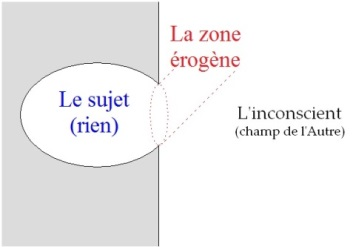
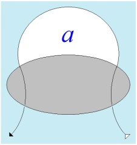
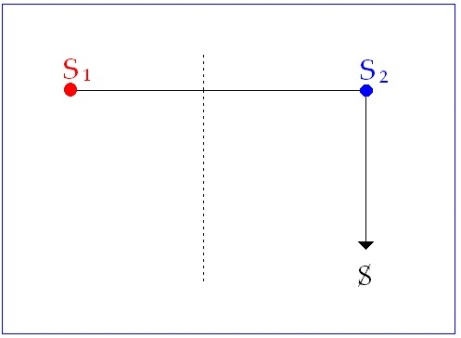

# Leçon 15 | 20 mai 1964

<!-- source-url: http://staferla.free.fr/S11/S11 FONDEMENTS.docx -->
<!-- seminar: s11 -->
<!-- lesson: 15 -->

<!-- id: s11-15-0001 -->

J’ai le propos aujourd’hui - ça ne veut pas dire que *j’aurai le temps* de le tenir - de vous mener, *de l’amour*, au seuil de quoi j’ai laissé
les choses la dernière fois, *à la libido*. J’annonce tout de suite ce qui sera la pointe, la nouveauté d’une cer­taine élucidation concernant la façon dont il faut concevoir *la libido*, en vous disant :

<!-- id: s11-15-0002 -->

« *La libido n’est pas quelque chose de fuyant, de fluide, à savoir de se répartir, s’accumuler, tel un magnétisme dans les centres de cristallisation que lui offre le sujet, la libido est à concevoir comme un organe, organe aux deux sens du mot, « organe » partie de l’organisme, ou « organe » instrument* ».

<!-- id: s11-15-0003 -->

Je m’excuse si - comme on a pu me le dire - dans l’intervention de la dernière fois, par les chemins où je vous mène, il y a divers temps et quelques obscurités. Je crois que c’est la caractéristique de notre champ. N’oublions pas qu’il est commun de représenter l’incons­cient comme une cave, sinon comme une caverne pour évoquer celle de PLATON. Ce que je vais vous dire aujourd’hui, c’est que ce n’est pas la bonne comparaison : c’est bien plutôt quelque chose proche de la vessie.

<!-- id: s11-15-0004 -->

Et *cette vessie*, il s’agit juste­ment de vous faire voir qu’à condition d’y mettre une petite lumière à l’intérieur, ça *peut servir de lanterne* et ce n’est point se tromper. Mais pourquoi s’étonner si la lumière met quelquefois un peu de temps à prendre, à s’allumer ? Bien sûr.

<!-- id: s11-15-0005 -->

<!-- id: s11-15-0006 -->

En vous faisant… en vous menant la dernière fois à quelque chose que je pense avoir articulé : c’est que, pour représenter le sujet dont il s’agit, en tant qu’alternativement, par la pulsation de l’incons­cient, le sujet se montre et se cache. Dans ce sujet
nous ne saisissons que des *pulsions partielles*. La *ganzen Sexualstrebung, représentation de la totalité de la pression sexuelle*,
FREUD nous dit qu’elle n’y est pas.

<!-- id: s11-15-0007 -->

Sur ce résultat, où je vous conduis après lui, je vous dis où vous pouvez y aller voir, *je vous affirme* que tout ce que j’ai appris
de mon expérience, y est « *convenient* ».

<!-- id: s11-15-0008 -->

À tout ceux qui sont ici, je ne peux demander de s’y accorder pleinement par là même puisqu’à certains elle manque, mais le fait même, que je vous guide dans cette voie suppose bien sûr - et votre présence ici suppose - en *répons* [^78] *-* *une certaine confiance faite*
*à ce que nous appellerons - dans le rôle* où je suis par rapport à vous : celui de *l’Autre* - *la* *bonne foi*. Bien sûr, aussi *cette bonne foi est toujours précaire, <u>supposée</u>,* car ce *rapport* du sujet à l’Autre, où, à la fin se termine-t-il ?

<!-- id: s11-15-0009 -->

*Ce rapport du sujet*, *difficile,* qui est celui sur les chemins duquel nous mène l’analyse, c’est à savoir qu’il n’est, comme sujet, rien moins que dans l’incertitude, pour la raison qu’il est divisé ce sujet, par l’ef­fet de langage, et c’est ce que je vous dis, vous enseigne,
moi en tant que LACAN, suivant sans doute les traces de *la fouille freudienne*, comme je l’appelle, comme je l’appelais la dernière fois.

<!-- id: s11-15-0010 -->

*Par l’effet de parole il se réalise toujours plus dans l’Autre*, *mais là il ne poursuit déjà plus qu’une moitié de lui*-*même* - vous verrez que c’est
là-dessus que je vous ramènerai *-* il ne trouvera son désir que toujours plus divisé, pulvérisé, *dans la* cernable *métonymie de la parole*.
*L’effet de langage* est tout le temps mêlé à ce *quelque chose* qui est le fond de l’expérience analytique, l’ac­tualisation de ce qu’*il n’est <u>sujet</u> que d’être <u>assujettissement</u>, assujettis­sement au champ de l’Autre***.**

<!-- id: s11-15-0011 -->

*Assujettis­sement* synchronique dans ce champ de l’Autre : que ce soit de là qu’il provient, c’est aussi pour cela qu’il lui faut en sortir, s’en sortir, et dans le « *s’en sortir* », à la fin, il saura que l’*autre* réel a tout autant que lui à « *s’en sortir* », à *s’en dépatouiller*.
C’est bien là que la nécessité s’impose de cette *bonne foi* fondée sur cette certitude que cette même implication de la difficulté,
par rapport aux *voies du désir*, est aussi dans l’Autre.

<!-- id: s11-15-0012 -->

*La vérité, en ce sens, c’est ce qui court après la vérité, et c’est là où je cours, où je vous emmène - tels les chiens d’Actéon - après moi* : quand j’aurai trouvé *le gîte* de la dées­se, *je me changerai sans doute en cerf*, et vous pourrez me dévorer. Mais nous avons encore un peu de temps devant nous !

<!-- id: s11-15-0013 -->

FREUD donc, vous l’ai-je représenté la dernière fois telle cette figure d’ABRAHAM, d’ISAAC et de JACOB que Léon BLOY,
dans *Le salut par les Juifs* [^79]*,* représente sous la forme de ces - *trois également* - vieillards, qui sont là, selon une des formes de la vocation d’Israël, autour de je ne sais quel­le bâche à cette occupation fondamentale qui s’appelle la brocante. Ils trient. Il y a quelque chose qu’ils mettent d’un côté, et une autre de l’autre.

<!-- id: s11-15-0014 -->

FREUD d’un côté met *les pulsions partielles*, et de l’autre, *l’amour*. Il dit « *C’est pas pareil* » : les *pulsions* nous nécessitent dans l’ordre sexuel, *ça*, ça vient du cœur.

<!-- id: s11-15-0015 -->

À notre grande surprise, il nous apprend que *l’amour*, de l’autre côté - c’est tout au moins comme ceci qu’il s’ex­prime dans cet article, je vous prie de vous y reporter pour le lire, quelque chose comme ceci - « *ça, ça vient du ventre, c’est ce qui est miam-miam* ».
Ça peut surprendre. Mais ça nous éclaire sur quelque chose, sur *quelque chose de fondamental à l’expérience analytique*, c’est que *la pulsion génitale*, si elle existe - or justement, c’est justement ce que FREUD nous enseigne : à examiner la pulsion génitale - c’est que,
comme pulsion, ce n’est pas du tout articulé comme les autres, malgré l’appa­rence, malgré l’ambivalence.

<!-- id: s11-15-0016 -->

Donc dans ses prémisses, et dans son propre texte, il se contredit proprement, quand il nous dit que ça \[*l’ambivalence*\] pouvait passer pour *une des caractéristiques de la Verkehrung, de la reversion de la pulsion*. Quand il l’examine cette ambivalence - *là, où* seulement
*dans sa première avancée, il l’a désignée dans l’ambivalence amour-haine* - il nous dit *« Ce n’est pas du tout pareil que la reversion de la pulsion »*.

<!-- id: s11-15-0017 -->

Si donc la pulsion génitale n’existe pas, elle n’a qu’à aller se faire f... façonner ailleurs. Ailleurs, *de l’autre côté que du côté où il y a*
*la pul­sion*, à gauche - sur mon schéma là-bas - de *la zone érogène*.

<!-- id: s11-15-0018 -->

<!-- id: s11-15-0019 -->

Vous la voyez déjà se dessiner dans cette botte que j’ai appelé tout à l’heure quelque chose de flottant comme un voile, une vessie, que c’est à droi­te, dans le champ de l’Autre, qu’elle a à aller se faire façonner, *la pul­sion génitale*. Eh bien, qu’est-ce que ça rejoint, ça ? Eh bien, justement ce que nous apprend *l’expérience analytique*  ! C’est à savoir que la pulsion génitale est soumise :

<!-- id: s11-15-0020 -->

- à la circulation du *complexe d’Œdipe*,

<!-- id: s11-15-0021 -->

- aux *struc­tures élémentaires* et autres *de la parenté*,

<!-- id: s11-15-0022 -->

- à quelque chose qu’on désigne comme *champ,* insuffisamment comme *champ de la culture*, puisque *ce champ de la culture*, justement, se fonde de ce *no man’s land,* sans doute où *la génitalité* comme telle a à subsister, mais où elle est dis­soute

<!-- id: s11-15-0023 -->

> sans doute, non rassemblée.

<!-- id: s11-15-0024 -->

Nulle part n’est saisissable dans le sujet, cette *ganzen Sexualstrebung.* Mais, pour ce qu’elle n’y soit nulle part, elle y est pourtant *diffuse*, et c’est là ce que FREUD essaie dans cet article de nous faire sentir. Car tout ce qu’il va dire de *l’amour* - et pour accentuer, et justement dans la mesure où il s’agit là de cerner la pulsion - que *l’amour*, pour le concevoir c’est à *une autre sorte de structure*
qu’il faut nécessairement se référer. Il la divise en trois cette *structure*, en trois niveaux :

<!-- id: s11-15-0025 -->

- *niveau du réel,*

<!-- id: s11-15-0026 -->

- *niveau de l’économique,*

<!-- id: s11-15-0027 -->

- *niveau du biologique,* en dernier.

<!-- id: s11-15-0028 -->

Les oppositions qui y correspondent sont triples.

<!-- id: s11-15-0029 -->

- Au *niveau du réel* : c’est ce qui *intéresse* et ce qui est *indifférent*.

<!-- id: s11-15-0030 -->

- Au *niveau de l’écono­mique* : ce qui fait *plaisir* et ce qui fait *déplaisir*.

<!-- id: s11-15-0031 -->

- Seulement au *niveau du biologique*, l’opposition activité-passivité, ici se présente en sa forme propre, vous le verrez, la seule valable quant à son sens grammatical, la position : « *aimer*-*être aimé* ».

<!-- id: s11-15-0032 -->

Nous sommes très proprement invités par lui à considérer que l’amour, dans son essence, n’est à juger que comme passion sexuelle du *gesamt Ich.* Or *gesamt Ich* est ici dans son œuvre, un *hapax*[^80] auquel nous avons à donner le sens de ce qui est dessiné
quand il a à nous rendre compte du *principe du plaisir*.

<!-- id: s11-15-0033 -->

\[*Daß ein Trieb ein Objekt »haßt«, klingt uns aber befremdend, so daß wir aufmerksam werden, die Beziehungen Liebe und Haß seien nicht für die Relationen der Triebe zu ihren Objekten verwendbar, sondern für die Relation des Gesamt-Ichs zu den Objekten reserviert.* ([*Triebe und Triebschicksale*](http://staferla.free.fr/Freud/freud.htm))\]

<!-- id: s11-15-0034 -->

*Le gesamt Ich est ce champ*, ce champ que je vous ai invité à considérer dans ce fait qu’il est *à considérer comme une surface* et une surface limitée que le tableau noir y soit pro­pice à le représenter *que tout puisse s’y mettre, comme on dit, sur le papier.* Qu’il s’agisse de ce réseau qui se représente par des arcs, des lignes, liant des points de concours, marquant dans ce cercle fermé ce qui a à s’y conserver d’homéostase tensionnelle, de moindre tension, de ne pas dépasser un seuil de tension, de nécessaire dérivation, diffusion
de l’excitation en mille canaux, chaque fois qu’en l’un d’entre eux elle pourrait être trop intense.

<!-- id: s11-15-0035 -->

Cette filtration, de la stimulation à la décharge, c’est là cet appareil, cette *calotte* - si vous voulez, *cornée* - à cerner *sur une sphère*,
où se défi­nit d’abord ce qu’il appelle le stade du *Real*-*Ich*, c’est à ceci qu’il va dans son discours attribuer la qualification *d’auto-erotisch.*

<!-- id: s11-15-0036 -->

De là, les analystes ont conclu que - comme ce devait être à situer quelque part dans ce qu’on appelle le développement,
il est tout à fait clair, pensent-ils, que puisque la parole de FREUD est parole d’Évangile - le nourrisson doit tenir toutes choses autour de lui pour indifférentes. On se demande comment les choses peuvent tenir dans un champ d’observateurs pour qui les *articles de foi* ont, par rapport à l’observa­tion, valeur tellement écrasante. Car enfin, s’il y a quelque chose dont le nourrisson ne donne pas l’idée, c’est de se désintéresser de ce qui entre dans son champ de perception : qu’il y ait des objets dès le temps le plus précoce de la phase néo­natale, c’est ce qui ne fait aucun doute.

<!-- id: s11-15-0037 -->

*Auto-erotisch* ne peut absolu­ment pas avoir ce sens. Et si vous lisez FREUD dans le texte, vous ver­rez que le second temps, le temps économique, consiste en ceci juste­ment, que le second *Ich,* le second de droit, le second dans un temps logique, si vous voulez,
c’est *Lust*-*Ich,* qu’il appelle *purifiziert* - *Lust*-*Ich purifié* - que celui-ci s’instaure, justement dans le champ *exté­rieur* à la calotte dans lequel je désigne le premier *Real*-*Ich* de l’explica­tion de FREUD.

<!-- id: s11-15-0038 -->

*Au*-*dehors*, dans les objets, et c’est cela qui est l’*autoerotisch,* et FREUD le souligne lui-même, qu’il n’y aurait pas de surgissement
des objets, en effet s’il n’y avait pas des « *objets bons pour moi* ». Ici se consti­tue le *Lust*-*Ich* et le champ de l’*Unlust* : *l’objet comme reste, l’objet* comme non plus « *bon pour moi* », mais *étranger,* et comme tel d’ailleurs *l’objet bon à connaître*, et pour cause, c’est celui qui
se définit dans le champ de l’*Unlust*. À ce niveau apparaît comme tel le *lieben, aimer* : les objets du champ du *Lust*-*Ich* sont aimables. Le *hassen* \[*avoir en horreur*\]*,* avec son lien d’ailleurs profond à la connaissance, c’est l’autre champ.

<!-- id: s11-15-0039 -->

Il n’y a pas trace, à ce niveau, d’autre fonction pulsionnelle que jus­tement celles qui ne sont pas de véritables pulsions,
ce qu’on appelle dans le texte de FREUD les *Ichtriebe,* et tout son texte - je vous prie de le lire attentivement - consiste à fonder
le niveau de *l’amour* à ce niveau-là, et à dire que si ce qui est ainsi divisé, ainsi défini au niveau de l’*Ich* ne prend valeur, fonction sexuelle, ne passe de l’*Erhaltungstrieb,* de la *conservation*, au *Sexualtrieb* qu’en fonction de l’appropriation de cha­cun de ces champs,
sa saisie par une des pulsions partielles se définit ailleurs.

<!-- id: s11-15-0040 -->

Ceci je pourrais vous le montrer à chaque ligne de texte. Si depuis trois fois que j’en parle, vous ne l’avez pas encore lu, *ma foi tant pis*. Car bien sûr ce texte vaudrait - *peut-être le fait-on ailleurs* - vau­drait toute une année de commentaires, c’est là-dessus que je vous demande de le lire, quitte à confirmer ensuite ce que je vous dis par la lecture de ce texte.

<!-- id: s11-15-0041 -->

FREUD dit proprement que *vorhebung des Wesentlichen, à faire sortir ici l’essentiel*, c’est d’une façon purement *passive*, *non pulsionnelle*, ici dans ce champ de *l’amour*, que le sujet enregistre les *äußeren Reize* \[*stimuli externes*\]*, ce qui vient du monde extérieur*, que son activité ne vient que « *par rapport* ». Et inversement il le dit *actif,* *durch seine eigenen Triebe*, *par ses propres pulsions*. *Il s’agit ici de la diversité des* *pulsions partielles*.

<!-- id: s11-15-0042 -->

\[*Das Ich verhält sich passiv gegen die Außenwelt, insoweit es Reize von ihr empfängt, aktiv, wenn es auf dieselben reagiert. Zu ganz besonderer Aktivität gegen die Außenwelt wird es durch seine Triebe gezwungen, so daß man unter Hervorhebung des Wesentlichen sagen könnte : Das Ich-Subjekt sei passiv gegen die äußeren Reize, aktiv durch seine eigenen Triebe. Der Gegensatz Aktiv*-*Passiv verschmilzt späterhin mit dem von Männlich*-*Weiblich, der, ehe dies geschehen ist, keine psychologische Bedeutung hat. Die Verlötung der Aktivität mit der Männlichkeit, der Passivität mit der Weiblichkeit tritt uns nämlich als biologische Tatsache entgegen; sie ist aber keineswegs so regelmäßig durchgreifend und ausschließlich, wie wir anzunehmen geneigt sind.* (*Triebe und Triebschicksale*)\]

<!-- id: s11-15-0043 -->

C’est en cela que nous sommes amenés au tiers niveau qu’il fait intervenir, de *l’activité-passivité*, mais avant d’en marquer les consé­quences, c’est l’accent, je vous fais bien remarquer, le caractère, si je puis dire « *traditionnel* », classique, de cette conception de l’amour : « *se vou­loir son bien* ». Est-il besoin de souligner que cela est exactement l’équiva­lence de ce qu’on appelle dans la tradition
« *la théorie physique de l’amour* », le *velle bonum alicui* [^81] de Saint THOMAS, pour nous, en raison de la fonction du narcissisme
ayant exactement la même valeur.

<!-- id: s11-15-0044 -->

J’ai depuis longtemps souligné le caractère captieux de ce prétendu altruisme, qui se satisfait de préserver le bien - de qui ? de celui qui, précisément, nous est nécessaire. Voilà où FREUD entend asseoir les bases de l’amour. C’est seulement avec l’activité-passivité qu’entre en jeu ce qu’il en est proprement de *la relation sexuelle*. *Or, la couvre*-*t*-*elle, cette relation d’activité*-*passivité ? Si peu*, que c’est
à cette occasion, mais aussi bien, en plus d’une autre - je vous prie de vous référer à tel passage de *L’homme aux loups,* par exemple, ou réparti en d’autres points des cinq grandes psychanalyses - où FREUD nous dit que *la référence polaire activité*-*passivité*
est là pour *dénommer*, pour *recouvrir*, pour *métaphoriser* ce qui reste d’*inson­dable* - le terme n’est pas de lui…

<!-- id: s11-15-0045 -->

Mais *que jamais il ne dise nulle part que* psychologiquement *la relation masculin*-*féminin ne soit saisis­sable autrement que par ce représentant*
*de l’opposition activité-passi­vité*, en tant que jamais l’opposition masculin-féminin comme telle soit atteinte, ceci désigne assez l’importance de ce qui est *répété ici sous la forme d’un verbe particulièrement aigu à exprimer ce dont il s’agit*, cette opposition passivité-activité : *verschmilzt* dit-il, quelque chose comme *« se coule », « se moule », « s’injecte ».* C’est une *artériographie* [^82] et les rapports *masculin*-*féminin* même ne l’épuisent pas. \[*Der Gegensatz Aktiv*-*Passiv verschmilzt späterhin mit dem von Männlich*-*Weiblich, der, ehe dies geschehen ist, keine psychologische Bedeutung hat.*\]

<!-- id: s11-15-0046 -->

On sait bien naturellement, qu’on peut avec cette opposition acti­vité-passivité, rendre compte de beaucoup de choses dans
le domaine de l’amour. Mais alors, ce à quoi nous avons affaire, c’est justement cette « *injection* » si je puis dire, de *sado-masochisme*,
qui n’est *point du tout à prendre*, quant à la réalisation proprement sexuelle, *pour argent comptant*.

<!-- id: s11-15-0047 -->

Bien sûr que dans la relation sexuelle, vont venir se mettre en jeu tous les intervalles du désir.
Quelle valeur a pour toi, mon désir ? *Question éternelle*, qui se pose *dans le dialogue des amants.*

<!-- id: s11-15-0048 -->

Mais quant à cette prétendue valeur, par exemple, du *masochisme* - du *masochisme féminin* comme on s’exprime - il convient
de le mettre dans la paren­thèse d’une interrogation sérieuse. C’est qu’elle fait partie de ce dia­logue, de ce qu’on peut définir
en bien des points comme étant *un fan­tasme masculin*.

<!-- id: s11-15-0049 -->

Beaucoup de choses laissent à penser que c’est compli­cité de notre part que de le soutenir mais, pour ne pas nous livrer, je veux dire, nous livrer tout entier, aux résultats de *l’enquête anglo*-*saxonne* - qui sur ce sujet, je pense, ne donnerait pas grand chose,
si nous disons qu’il y a là quelque *consentement* des femmes, ce qui ne veut rien dire - nous nous limiterons, plus légitimement,
nous autres *analystes*, aux *femmes* qui font partie *de notre groupe*.

<!-- id: s11-15-0050 -->

Et il est tout à fait frappant de voir que les représentantes de ce sexe dans le cercle ana­lytique, sont tout à fait spécialement disposées à entretenir cette créan­ce comme basale, du *masochisme féminin*. Sans doute y a-t-il là un voile, qu’il convient de ne pas soulever trop vite, concernant les intérêts du sexe. *Excursion* à notre propos d’ailleurs, *excursion* profondément liée - vous le verrez, nous aurons à revenir sur ce qu’il en est de ce joint.

<!-- id: s11-15-0051 -->

Quoi qu’il en soit, s’introduit ici une remarque, c’est que rien ne nous sert - ici, au maximum, de ce champ, tel qu’il vient d’être défini comme celui de l’amour - rien ne nous sert de *ce cadre narcissique* dont FREUD, en propres termes, dans cet article,
nous indique qu’il est fait justement de l’articulation de cet *autoerotisch - à sentir, comme je vous l’ai indiqué, à savoir comme le critère de surgissement, la répartition des objets -* à cette insertion de l’*auto*-*érotisme*, dans les intérêts organi­sés du moi qui s’appellent le *narcissisme*.

<!-- id: s11-15-0052 -->

Ceci veut dire que s’il y a représentation des objets du monde exté­rieur, d’un choix et d’un discernement et d’une possibilité de connais­sance, bref de tout le champ dans lequel s’est exercée la psychologie classique, rien encore - et c’est bien pour cela que toute la psychologie dite *affective* a jusqu’à FREUD échoué - rien encore n’y représente *l’Autre radical, l’Autre comme tel*, l’Autre justement entre ceci que la sexualité nous désigne comme deux champs, deux pôles, deux mondes opposés, dans le masculin et le féminin.

<!-- id: s11-15-0053 -->

Au maximum, seront-ils représentés par quelque chose qui est diffé­rent, même que cette *opposition activité-passivité* dont je parlais
tout à l’heure, *l’idéal viril* et *l’idéal féminin*, ceux-là ressortissent proprement d’un terme que ce n’est pas moi qui introduis - justement pour rendre des points à nos collègues féminins - qui a été introduit par une psycha­nalyse, et concernant le rôle de l’attitude sexuelle féminine, par un terme qui s’appelle « *la mascarade* ». *La mascarade* n’est pas ce qui entre en jeu dans *la parade* - nécessaire au niveau des animaux à l’appariage, et aussi bien la parure se révèle-t­elle là généralement du côté du mâle - *la mascarade* a un autre sens
dans le domaine humain, c’est précisément de jouer au niveau non plus *imaginaire* mais *symbolique*.

<!-- id: s11-15-0054 -->

C’est à partir de là qu’il nous reste maintenant à montrer que la sexualité comme telle fait sa rentrée, exerce son activité propre,
par l’in­termédiaire - *si paradoxal que cela paraisse* - *des pulsions partielles*. Tout ce que nous en dit FREUD, tout ce qu’il en épelle,
tout ce qu’il en articule, nous montre ce mouvement que je vous ai tracé au tableau la dernière fois, ce mouvement circulaire
de quelque chose de *la poussée* qui sort à travers le bord érogène pour y revenir comme étant sa cible, après avoir fait le tour de quelque chose(x), que j’appelle *l’objet(a)*.

<!-- id: s11-15-0055 -->

<!-- id: s11-15-0056 -->

Je pose que c’est par là que le sujet vient, tente à atteindre ce qui est à proprement parler la dimension de l’Autre (avec un grand A). Et qu’un examen également ponctuel de tout ce texte est la mise à l’épreuve - avec soin, comme de pièces dures à mordre, selon l’image que j’évoquai tout à l’heure - c’est celle qui nous fera apparaître, dans l’exa­men même de FREUD, et jusque dans les échecs de cet examen, la vérité de ce qu’ici j’avance.

<!-- id: s11-15-0057 -->

C’est à savoir, la distinction radicale qu’il y a, de « *s’aimer à travers l’autre* », ce qui ne laisse dans ce champ narcissique de l’objet aucune transcendance à l’objet, aucune transcendance à l’ob­jet inclus, à ce qui se passe dans cette «* circularité de la pulsion *»,
où l’hé­térogénéité même de l’aller et du retour montre dans son intervalle une béance. Car qu’est-ce qu’a de commun *voir* et *être vu*, et aussi bien, la façon dont FREUD est amené à l’articuler en tableaux et caractéristiques. Prenons la *Schaulust,* la *pulsion scopique*,
il oppose soi-même : *bes­chauen : « regarder un objet étranger* », à « *être regardé* - l’objet propre - *par une personne étrangère* » : *beschaut werden.*

<!-- id: s11-15-0058 -->

\[*Beispiele für den ersteren Vorgang ergeben die Gegensatzpaare Sadismus–Masochismus und Schaulust–Exhibition. Die Verkehrung betrifft nur die Ziele des Triebes; für das aktive Ziel : quälen, beschauen, wird das passive : gequält werden, beschaut werden eingesetzt. Die inhaltliche Verkehrung findet sich in dem einen Falle der Verwandlung des Liebens in ein Hassen.*
(*Triebe und Triebschicksale*)\]

<!-- id: s11-15-0059 -->

C’est qu’un objet et une personne, c’est pas pareil. Au bout du cercle, disons qu’ils se relâchent, ou que le pointillé nous en échappe quelque peu. D’ailleurs, pour les lier, c’est à la base, là où l’origine et la pointe se rejoignent qu’il faut que FREUD les serre dans sa main, et qu’il s’essaie à y trouver l’union, justement au point de retour, et à le resser­rer en disant que la racine de la pulsion scopique est toute entière à prendre dans le sujet, dans le fait que le sujet se voit lui-même.

<!-- id: s11-15-0060 -->

Seulement, là, parce que c’est FREUD, il ne s’y trompe pas. Ce n’est pas - lui - se voir dans la glace, c’est *selbst ein Sexualglied beschauen,* il se regarde - je dirais - dans son membre sexuel. Seulement là non plus ça ne va pas, parce qu’il faut identifier ceci avec son inverse qui est assez curieux et je m’étonne que personne n’en ait relevé l’humour : ceci est égalé à *Sexualglied von eigener Person beschaut werden,* c’est-à-dire qu’en quelque sorte, « *le numéro deux se réjouit d’être impair* », le sexe ou la quéquette se réjouit d’être regardé.

<!-- id: s11-15-0061 -->

\[*Diese Vorstufe ist nun dadurch interessant, daß aus ihr die beiden Situationen des resultierenden Gegensatzpaares hervorgehen, je nachdem der Wechsel an der einen oder anderen Stelle vorgenommen wird. Das Schema für den Schautrieb könnte lauten :*
α) *Selbst ein Sexualglied beschauen = Sexualglied von eigener Person beschaut werden,*
*β) Selbst fremdes Objekt beschauen (aktive Schaulust),*
*γ) Eigenes Objekt von fremder Person beschaut werden (Zeigelust, Exhibition).*\]

<!-- id: s11-15-0062 -->

Qui, jamais à pu vraiment saisir le caractère vraiment subjectivable d’un pareil sentiment ? En fait, l’articulation, le lien de ce nœud, de cette boucle, qui est celui de l’aller et retour de la pulsion, s’obtient fort bien à ne changer qu’un des termes de FREUD :
non pas « *eigenes Objekt », l’objet propre* qui est bien en fait, ce à quoi se réduit le sujet, à un objet, ni « *von fremder Person », l’autre*,
bien entendu, ni « *beschaut »,* mais « *werden »* non pas *machen,* ce dont il s’agit dans *la pulsion*, c’est de « *se faire voir* ». Dans ce « *se faire* » l’activité de *la pulsion* se concentre, et c’est à le reporter, sur le champ des autres pulsions, que nous pourrons peut-être avoir, saisir, quelque lumière.

<!-- id: s11-15-0063 -->

Il faut que j’aille vite, hélas, et que non seulement j’abrège, mais que je comble - chose très frappante, très remarquable - les trous que FREUD a laissés ouverts dans son énumération des pulsions.Après le « *se faire voir* », j’en amènerai un autre, le « *se faire entendre* », dont il ne nous parle même pas. Et il faudra que, très vite, je vous indique cette différence à remarquer qu’il y a, au « *se faire voir* ». Vous avez quand même des oreilles : *les oreilles sont cette sorte d’orifice, le seul dans le champ de l’inconscient, qui ne peut pas se fermer*.

<!-- id: s11-15-0064 -->

Alors je pense que vous allez entendre ce que je veux vous dire, en marquant que le « *se faire voir* », s’indique d’une flèche qui vraiment revient ainsi, et entendez un peu le « *se faire entendre* » - *c’est là, c’est une indication sim­plement pour plus tard -* le « *se faire entendre* » va vers l’autre si le « *se faire voir* » va vers le sujet. Et ceci a une raison structurale, il importait que je le dise au passage.

<!-- id: s11-15-0065 -->

Venons à la pulsion orale. Qu’est-ce que c’est ? On parle des fan­tasmes de dévoration. « *Se faire boulotter *», chacun sait qu’en effet c’est bien là, et confinant à toutes les résonances du *masochisme,* ce que nous voyons : le terme, le terme *autrifié* de la pulsion orale.
Mais pour­quoi ne pas mettre les choses *au pied du mur*, justement de ce que nous agitons tout le temps et puisque nous nous référons au nourrisson et au sein, et que le nourrissage, le sein, c’est la succion, c’est le « *se faire sucer* », c’est le vampire.
Ce qui nous éclaire d’ailleurs, sur ce qu’il en est de cet objet singu­lier - que je m’efforce à décoller dans votre esprit de la métaphore nour­riture - le sein.

<!-- id: s11-15-0066 -->

Le sein est aussi quelque chose de plaqué et qui suce - quoi ? - l’organisme de la mère.

<!-- id: s11-15-0067 -->

Est suffisamment indiquée à ce niveau, quelle est la revendication, en quelque sorte - et ceci nous met sur le biais de ce que je vais avoir à vous montrer - *la revendication par le sujet de quelque chose de lui séparé mais lui appartenant, dont il s’agit qu’il se complète*.

<!-- id: s11-15-0068 -->

Au niveau de la pulsion anale, écoutez - un peu de détente - naturelle­ment, là, ça ne semble plus aller du tout. Et pourtant
« *se faire chier* » ça a un sens. Quand on dit « *Ici, on se fait rudement chier* », rapport à l’emmerdeur éternel ! Ça devient d’autant plus intéressant, que tout ce qui est, dans le champ de la pulsion anale, de l’économie de ce fameux objet qu’on a bien tort de purement et simplement identifier à la fonc­tion, diversement spécifiée, qu’on lui donne dans le métabolisme de la névrose obsessionnelle.

<!-- id: s11-15-0069 -->

On aurait bien tort de l’amputer de tout ce qu’il représente, ce fameux *scybale*, comme du cadeau, à l’occasion, de tout le rapport qu’il a, au fond, à la souillure, à la purification, à la *catharsis* - de ne pas voir que sans doute c’est là, *et pour cause, c’est de là qu’el­le sort cette notion,* que c’est là que se situe *la fonction de l’oblativité*. Et que pour tout dire, l’*objet* ici, n’est pas très loin - ce qui nous ramè­ne fort bien, au cycle de la formule que j’ai mise, là, en exergue - du domaine que l’on appelle celui de l’âme.

<!-- id: s11-15-0070 -->

Qu’est-ce que ce bref survol *nous indique*, *nous révèle* ?

<!-- id: s11-15-0071 -->

Dans ce flux, ce retournement que représente la poche de la pulsion, comme si là en quelque sorte, s’invaginant à travers la zone érogène, c’était elle qui était chargée d’aller quelque part, quêter quelque chose, qui à chaque fois répond dans l’Autre à la pulsion.
Et je ne referai pas la série : disons qu’au niveau de la *Schaulust,* c’est *le regard*, mais je ne l’indique que pour vous dire
que j’y reviendrai plus tard, sur ses effets sur l’Autre de ce mouvement d’appel.

<!-- id: s11-15-0072 -->

Marquons ici cette polarité du *cycle pulsionnel* avec ce rapport à quelque chose toujours au centre désigné qui est un organe, à prendre au sens, ici, d’instrument de la pulsion. Cet organe, cet objet, dans un autre sens que le sens qu’il avait tout à l’heure, comme instauré à la sphère d’induction de *l’Ich,* cet objet insaisissable, est objet que nous ne pouvons que contourner, et pour tout dire ce « *faux organe* », voilà ce qu’il convient maintenant d’interroger.

<!-- id: s11-15-0073 -->

Je dis, \[*ce faux organe*\] il se situe par rapport à *quelque chose* qui est le vrai organe, et pour le faire sentir, et pour dire que c’est là le seul pôle qui, dans le domaine de la sexualité, soit à notre portée, soit capable d’être appré­hendé, je me permettrai d’avancer devant vous *un mythe* sur lequel je prendrai le parrainage historique de ce qui est dit au *Banquet* de PLATON, dans la bouche d’ARISTOPHANE, concernant justement ce sur quoi il s’in­terroge, à savoir la nature de l’amour.

<!-- id: s11-15-0074 -->

Ceci suppose bien sûr, que nous nous donnions le loisir, que nous nous donnions *la permission d’user*, dans le judo avec la vérité,
de cet appareil, cet appareil que, devant mon auditoire antérieur, j’ai toujours évité d’user.

<!-- id: s11-15-0075 -->

- Je leur ai donné les modèles antiques, et nommément dans le champ de PLATON, mais je n’ai fait que leur donner l’appareil à creu­ser ce champ. Je ne suis pas de ceux qui disent : « *Mes enfants, ici, il y a un trésor* », moyennant quoi ils vont labourer le champ.

<!-- id: s11-15-0076 -->

- Je leur ai donné le soc et la charrue, à savoir que « *l’inconscient était fait de langage* », et à un moment-pointe, qui a eu lieu, il y a à peu près trois ans et demi, il en est résulté 2 au moins fort bons travaux, 3 même. Mais il s’agit maintenant de dire : « *Le trésor, ce qui est à trouver, on ne peut le dire que par la voie que j’annonce* ».

<!-- id: s11-15-0077 -->

Cette voie qui participe *du comique*, absolument essentielle à comprendre le moindre des dia­logues de PLATON*, a fortiori ce qu’il y a dans Le Banquet,* et même - si vous voulez - *du canular*, car bien sûr, ce n’est pas autre chose que la fable d’ARISTOPHANE.

<!-- id: s11-15-0078 -->

C’est un défi aux siècles, car cette fable les a tra­versés sans que personne n’essaie de faire mieux. Je vais essayer. Précisément, m’efforçant de faire le point de ce qui s’est dit à ce Congrès, Congrès de Bonneval, j’arrivais à peu près à fomenter quelque chose qui va s’exprimer ainsi : « *Je vais vous parler de la lamelle* ». Si vous voulez accentuer son effet de *canular*, vous l’appellerez l’*hommelette*. Cet *hommelette*, vous allez le voir, est plus facile à ani­mer que *l’homme primordial*, dans la tête duquel il faut toujours que nous mettions un *homoncule* pour le faire marcher.

<!-- id: s11-15-0079 -->

Chaque fois que se rompent les membranes de l’œuf d’où va sortir le fœtus en passe de devenir un nouveau-né, imaginez un instant que quelque chose s’en envole, qu’on peut faire avec un œuf aussi bien qu’un homme, à savoir *l’hommelette* ou *la lamelle*. *La lamelle*, c’est quelque chose d’extra plat, et qui se déplace comme l’amibe, simplement c’est un peu plus compliqué. Mais ça passe par­tout.

<!-- id: s11-15-0080 -->

Et comme c’est quelque chose - je vous dirai tout à l’heure pour­quoi - qui a rapport avec ce que l’être sexué perd dans la sexualité, c’est - comme est l’amibe par rapport aux êtres sexués - *immortel*, pour la raison que *ça survit* à toute division, que ça subsiste à toute inter­vention scissipare. Et ça court.

<!-- id: s11-15-0081 -->

Eh bien, ça n’est pas rassurant ! Parce que, supposez seulement que ça vienne vous envelopper le visage, pendant que vous dormez tran­quillement. Je vois mal comment nous n’entrerions pas en lutte avec *un être capable de ces propriétés*.
Mais ça ne serait pas une lutte bien commo­de.

<!-- id: s11-15-0082 -->

Cette *lamelle*, cet organe qui a pour caractéristique de ne pas exis­ter, mais qui n’en est pas moins un organe - et je pourrai vous donner plus de développement sur sa place zoologique - je vous l’ai déjà indi­qué, c’est *la libido*.
*La libido*, je vous ai dit, en tant que pur *instinct de vie*, c’est-à-dire dans ce qui est retiré de vie…

<!-- id: s11-15-0083 -->

- de vie immortelle, de vie irrépressible,

<!-- id: s11-15-0084 -->

- de vie qui n’a besoin - elle - d’aucun organe,

<!-- id: s11-15-0085 -->

- de vie simplifiée et indestruc­tible, …de ce qui est justement soustrait à l’être vivant d’être soumis *au cycle de la reproduction sexuée*.

<!-- id: s11-15-0086 -->

C’est de cela que représente *l’équivalent*, *les équivalents* possibles, toutes les formes que l’on peut énumérer de *l’objet(a)*. Ils ne sont
que représentants, figures. Le sein comme équivoque, comme élément caractéristique de l’organisation mammifère, le placenta
par exemple représente bien cette part de lui*-*même que l’individu perd à la naissan­ce, et qui peut servir à symboliser *l’objet perdu*
plus profond. Pour tous les autres objets, je pourrai évoquer la même référence, et ceci alors s’éclaire de démontrer ce dont il s’agit, et qui est désigné dans la partie inférieure, pour ce que j’ai dessiné au tableau, marquant le rapport du sujet au champ de l’Autre,
en dessous, en voici l’origine :

<!-- id: s11-15-0087 -->

<!-- id: s11-15-0088 -->

S’il est vrai que *le sujet* ne surgit au monde, n’existe - car après tout dans le monde du *Real-Ich*, du *moi* de la connaissance, tout peut exister comme maintenant, y compris vous et la conscience, sans qu’il y ait, pour cela, quoi qu’on en pense, le moindre sujet -
si le sujet est ce que je vous enseigne, à savoir le sujet déterminé par le langage et la parole, ceci veut dire que *le sujet in initio commence au lieu de l’Autre*, en tant que là surgit le premier signifiant.

<!-- id: s11-15-0089 -->

Or, *qu’est-ce qu’un signifiant*, qu’est*-*ce que je vous serine depuis assez longtemps je pense, pour n’avoir pas à de nouveau, ici,
à l’articuler ? C’est qu’*un signifiant est ce qui représente un sujet* - pour qui ? *-* non pas pour un autre sujet, mais *pour un autre signifiant*.

<!-- id: s11-15-0090 -->

Si vous découvrez dans le désert une pierre couverte de hiéroglyphes, vous ne doutez pas un instant qu’il y a eu un sujet derrière pour les ins­crire. *Mais que chaque signifiant s’adresse à vous, c’est une erreur*, la preuve d’ailleurs, c’est que vous pouvez n’y rien entendre.

<!-- id: s11-15-0091 -->

Par contre *vous les définissez comme signifiants, de ce que vous êtes sûr que cha­cun de ces signifiants se rapporte à chacun des autres*.
Et c’est de ceci qu’il s’agit dans le rappel du sujet *au champ de l’Autre*. Le sujet naît, en tant qu’*au champ de l’Autre* surgit *le signifiant*. Mais de ce fait même, ceci qui auparavant n’était rien, comme sujet à venir, devient, se fige en *signifiant*, ce qui ne nous étonne pas.

<!-- id: s11-15-0092 -->

Si ce rapport à l’Autre est justement ce qui pour nous fait surgir ce que représente ici *la lamelle*, à savoir, non pas la polarité sexuée,
le rapport du masculin au féminin, mais le rapport du sujet, du sujet vivant, à ce qu’il perd, de devoir passer pour sa reproduction, par le cycle sexuel. Ceci explique l’affinité essentielle de toute pulsion avec la zone de la mort.

<!-- id: s11-15-0093 -->

Si je fais la conciliation de cette double face de la pulsion, de présen­tifier *la sexualité* dans l’inconscient et d’être, dans son essence, repré­sentante de la mort. Si je vous ai parlé de l’inconscient comme de ce qui s’ouvre et se ferme, c’est que son essence est de marquer ce temps, ori­gine du sujet, par quoi, de naître avec le signifiant il naît divisé, sujet incontestablement attesté dans l’Autre,
et sujet qui s’identifie à ce sur­gissement au niveau de ce qui, juste avant, auparavant, comme sujet n’était rien,
mais qui, à peine apparu, se fige en signifiant.

<!-- id: s11-15-0094 -->

De ce rapport, de cet effort, de cette conjonction, de ce rappel du sujet - là où il est dans le *champ de la pulsion*, vers le sujet
là où il s’évoque dans le *champ de l’Autre*, de cet effort pour se rejoindre, dépend qu’il y ait un support pour la *ganzen Sexualstrebung.*
Il n’y en a pas d’autre. *C’est pour cela, c’est seulement là*, que la relation des sexes se représente, au niveau de l’inconscient.
Pour le reste :

<!-- id: s11-15-0095 -->

- elle est livrée aux aléas de ce champ de l’Autre,

<!-- id: s11-15-0096 -->

- elle est livrée aux explications qu’on lui donne, qu’on lui apprend, de savoir comment il faut s’y prendre,

<!-- id: s11-15-0097 -->

- elle est livrée à la vieille dont il faut - ce n’est pas une fable vaine - qu’elle apprenne à DAPHNIS comment il faut faire pour faire l’amour.

<!-- id: s11-15-0098 -->

*Discussions*

<!-- id: s11-15-0099 -->

François WAHL - Cette force qu’est la libido, qui est antérieure à toute pul­sion, c’est*-*à*-*dire, si la libido, si vous pesez la libido…

<!-- id: s11-15-0100 -->

LACAN *-* La libido c’est la lamelle, c’est un organe.

<!-- id: s11-15-0101 -->

François WAHL

<!-- id: s11-15-0102 -->

Comment justifiez*-*vous la perte par rapport à ça, du pas­sage par la sexualité ? À quel moment s’introduit par rapport à elle,
l’ar­ticulation activité*-*passivité ?

<!-- id: s11-15-0103 -->

LACAN

<!-- id: s11-15-0104 -->

Parfait, vous soulignez très bien, un des manques de mon discours. Vous allez aussi me faire le crédit, qu’étant donné le temps
où nous sommes, je ne fasse pas une réponse très longue.

<!-- id: s11-15-0105 -->

1\) Cette sorte de « *corps de lamelle* », avec son insertion quelque part, car cette lamelle, elle a un bord, elle vient s’insérer là où je vous l’ai mis, écrit au tableau, à savoir, sur la zone érogène, à savoir, sur l’un des orifices du corps, en tant que ces orifices - toute notre expérience *-* sont liés à *l’ouverture-fermeture* de la béance de l’inconscient. Elles y sont liées, parce que c’est là que s’y noue la présence du vivant.

<!-- id: s11-15-0106 -->

Si nous avons découvert quelque chose qui lie à l’incons­cient *la pulsion* dite *orale*, *anale*, auxquelles j’ajoute *la pulsion scopique*
et celle qu’il faudrait presque appeler *la pulsion invocante*, qui a ce privilè­ge, comme je vous l’ai dit incidemment - rien de ce que je dis n’est pure plaisanterie - a pour propriété de ne pas pouvoir se fermer, c’est là l’insertion de la lamelle.
Dieu merci, je ne l’ai pas dit mais je l’ai écrit. C’est au tableau.

<!-- id: s11-15-0107 -->

2\) Le rapport de *la pulsion* avec *activité-passivité* :
je pense m’être suffi­samment fait entendre, en disant qu’au niveau de *la pulsion*, il est purement *grammatical*. Il est support, artifice que FREUD emploie pour nous faire saisir l’aller et retour du *mouvement pulsionnel*. Mais je suis revenu à *quatre ou cinq reprises* sur le sujet : que nous ne saurions purement et simplement, le réduire à une réciprocité.

<!-- id: s11-15-0108 -->

Il n’y en a nulle, au niveau de la pulsion, et j’ai indiqué de la façon la plus articulée aujourd’hui, qu’à l’ensemble des trois temps,
vous verrez le texte (*a*),(*b*),(*c*), dont FREUD articule chaque pulsion, il importe, il est nécessité de substituer la formule du «* se faire… quelque chose *», « *voir* », « *entendre* » etc., et toute la liste que j’ai donnée.

<!-- id: s11-15-0109 -->

Ceci *implique* essentiellement et fondamentalement *activité*, en quoi je rejoins ce que - dans le point que je vous ai cité –
FREUD lui*-*même articule en disant - en distinguant les deux champs : le champ pul­sionnel d’une part, et d’autre part le champ narcissique de l’amour - en disant que *-* là *-* au niveau de l’amour, il y a réciprocité de l’« *aimer* » à l’« *être aimé* », et que dans l’autre champ, il s’agit d’une pure activité *durch seine eigene Triebe,* pour le sujet. Vous y êtes ?

<!-- id: s11-15-0110 -->

En fait, il saute aux yeux que même dans leur prétendue « *phase pas­sive* », l’exercice d’une pulsion masochique par exemple,
exige que le masochiste se donne un mal de chien, si j’ose m’exprimer ainsi.
## Notes

[^78]: Répons : subst. masc. - (relig.), refrain repris par le chœur, alternant, dans la psalmodie *responsoriale* (qui qualifie tout chant où alternent versets et répons,

    où se répondent soliste et chœur), avec les versets donnés par un soliste.

    \- parole, geste faits en retour à une parole, une demande.

[^79]: [Léon Bloy](http://agora.qc.ca/mot.nsf/Dossiers/Leon_Bloy) : *Le salut par les Juifs*, in Œuvres de Léon Bloy, tome 9, Mercure de France, 1983.

[^80]: Hapax : mot, forme dont on n'a pu relever qu'un exemple ; en particulier, vocable n'ayant qu'une seule occurrence dans un corpus donné.

    En fait, on retrouve une autre occurrence de « *Gesamt-Ich* » dans *Massenpsychologie und Ich-Analyse* (1921)

[^81]: Thomas d’Aquin : *Somme théologique* (I, q.20, a.2) : « *amare nil aliud est quam velle bonum alicui* », *aimer n’est rien d’autre que vouloir le bien de l’autre*.

[^82]: Artériographie : - méthode d'exploration qui consiste à injecter dans les artères des substances opaques aux rayons, puis à prendre des clichés successifs

    qui permettent d'examiner la configuration interne des canaux artériels.
