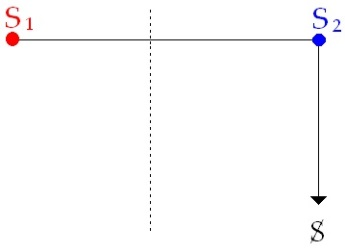
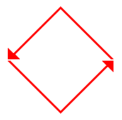
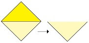
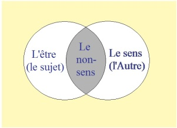
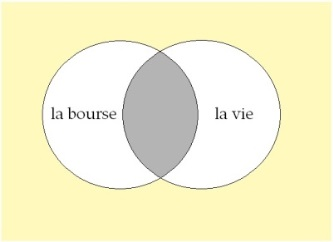

# Leçon 16 | 27 mai 1964

<!-- source-url: http://staferla.free.fr/S11/S11 FONDEMENTS.docx -->
<!-- seminar: s11 -->
<!-- lesson: 16 -->

<!-- id: s11-16-0001 -->

Si *la psychanalyse* doit se constituer comme *science* *de l’inconscient*, les fondements - vous le savez - sont qu’il convient de partir
de ce que : *l’inconscient est structuré comme un langage*. De ceci j’ai déduit, je déve­loppe devant vous, essentiellement une topologie,
dont la fin est de rendre compte de la constitution du sujet.

<!-- id: s11-16-0002 -->

À ceci il est arrivé, dans un temps que j’espère dépassé, qu’on m’ob­jecte que ce faisant - donnant la dominante à la structure -
je néglige cette dynamique si présente dans notre expérience, allant jusqu’à dire que pour autant, j’arrive à éluder le principe affirmé dans la doctrine freudienne que cette dynamique dans son essence, de bout en bout, est sexuelle. Je crois, j’espère, que le *procès*
de mon développement cette année, et nommément au point où il est arrivé à une sorte de *culmen,* la dernière fois,
vous montre que cette dynamique est loin d’y perdre.

<!-- id: s11-16-0003 -->

Je rappelle, peut-être à dessein que ceux qui ont été absents à cette séance la dernière fois le sachent que j’y ai pu accentuer
\- *première chose essentielle que je vais dire -* que j’y ai ajouté un élément, je crois, tout à fait nouveau, à cette dynamique,
et dont nous verrons l’usage que je ferai par la suite, qui est la *deuxième chose que je vais rappeler*.

<!-- id: s11-16-0004 -->

La première est d’accentuer que dans cette répartition du champ que je constitue à opposer, par rapport à ce que nous appellerons « l’entrée de l’inconscient », *les deux champs du sujet et de l’Autre*,

<!-- id: s11-16-0005 -->

- *L’Autre* avec un grand A en tant qu’il est le lieu où se situe la chaîne du signifiant, en tant qu’elle commande tout ce qui va pouvoir se présentifier d’abord du sujet,

<!-- id: s11-16-0006 -->

- l’autre comme le champ de ce vivant où le sujet a à apparaître. Et j’ai dit : du côté de ce vivant appelé à la subjectivité, c’est là que se manifeste essentiellement *la pulsion*.

<!-- id: s11-16-0007 -->

Toute pulsion étant - par essence de pulsion - pulsion partielle, aucune pulsion ne représente - ce que FREUD évoque un instant, pour se demander *si c’est l’amour qui la réalise* - *la totalité de la Sexualstrebung, de la tendance sexuelle*, en tant qu’on pour­rait la concevoir,
telle que se conçoit à la limite, mais justement dans un champ qui est exclu de notre expérience, comme devant - si elle y rentrait - présentifier, dans le psychisme, la fonction de la *Fortpflanzung, la fonc­tion de la reproduction*.

<!-- id: s11-16-0008 -->

Cette *fonction*, qui ne l’admettrait sur *le plan biologique ?* Ce que j’affirme, ce que j’avance - d’après FREUD qui en témoigne de toutes les façons - c’est qu’elle n’est pas représentée comme telle dans le psychisme, c’est que dans le psychisme rien n’est suffisant,
par quoi le sujet puisse se situer comme « *être de mâle* » ou « *être de femelle* ».

<!-- id: s11-16-0009 -->

Il n’en situe dans son psychisme que des *équivalents* : *activité* et *passivité*, qui sont loin de la représenter d’une façon exhaustive. FREUD le souligne, l’y accentue, y ajoute même l’*ironie* de dire proprement qu’elle n’est - cette *représentation* - ni si contraignante,
ni si exhaustive que ça, *durchgreifend, ausschlieblich,* dans les deux termes qu’il emploie, la *polarité de l’être*, du mâle et du femelle,
n’est représentée que par :

<!-- id: s11-16-0010 -->

- la polarité de *l’activité*, laquelle repré­sente, laquelle se manifeste à travers les *Triebe,*

<!-- id: s11-16-0011 -->

- tandis que *l’autre terme de polarité, la passivité*, n’est que *la passivité* vis-à-vis de l’extérieur *gegen die äusseren Reize.*

<!-- id: s11-16-0012 -->

Seule cette division essentiellement - et c’est là-dessus que *j’ai conclu* la dernière fois - rend nécessaire ce qui a été d’abord présentifié, mis au jour par l’expérience analytique : que *les voies* de ce qu’il faut faire, *comme homme, comme femme,* sont entièrement, si je puis dire *aban­données au drame*, au modèle d’un scénario qui se place au champ de l’Autre, ce qui est proprement l’Œdipe.

<!-- id: s11-16-0013 -->

Je l’ai accentué la dernière fois, en vous disant que *ce qu’il faut faire comme homme ou comme femme, cet être humain* - que nous abordons dans le champ de sa réalité psychique *- au dernier terme a à l’apprendre, de toute pièce, toujours de l’Autre*. Et j’ai évoqué là, *la vieille femme dans le conte de Daphnis et Chloé*, fable qui nous représente qu’il est un der­nier champ, et qui est justement le champ,
sommet de l’accomplissement sexuel, où en fin de compte, l’*innocent* ne sait pas les chemins.

<!-- id: s11-16-0014 -->

Que ce soit *la pulsion* - *la pulsion partielle* - qui l’y oriente, qui l’y dirige, que seule *la pulsion partielle* soit le *représentant*, dans le psychis­me des conséquences de la sexualité, c’est le signe que dans le psychisme, la sexualité se présente, se *représente* par une relation du sujet :

<!-- id: s11-16-0015 -->

- *qui se déduit d’autre chose que de la sexualité elle*-*même*,

<!-- id: s11-16-0016 -->

- *qui s’instaure dans le champ du sujet par une voie qui est la voie du manque*.

<!-- id: s11-16-0017 -->

Deux *manques*, ici se recouvrent :

<!-- id: s11-16-0018 -->

- L’un qui ressortit au défaut, au défaut central autour de quoi tourne la dialectique de *l’avènement du sujet* à son propre être dans la relation à l’Autre, par le fait que le sujet dépend du *signifiant,* en tant que le *signi­fiant* est d’abord *au champ de l’Autre*.

<!-- id: s11-16-0019 -->

- Et *ce manque* vient *à recouvrir*, vient *à reprendre* *un autre manque* qui est *le manque réel*, antérieur à ce que nous le situions à l’avènement du vivant, à la reproduction sexuée. *Ce manque c’est ce que le vivant perd de sa part de vivant* à être ce vivant qui se reproduit par la voie sexuée, c’est *ce manque* qui se rapporte à quelque chose de *réel* qui est ceci : *que le vivant, d’être sujet au sexe, est tombé sous le coup de la mort individuelle.* cette poursuite du complément que nous image de façon *aussi pathé­tique*

<!-- id: s11-16-0020 -->

> et de façon *aussi leurrante* *le mythe* d’ARISTOPHANE : que c’est *l’autre*, que c’est *sa moitié sexuelle* que le vivant cherche dans l’amour.

<!-- id: s11-16-0021 -->

<!-- id: s11-16-0022 -->

À cette façon de *représenter mythiquement* « *le mystère de l’amour* », l’analy­se, l’expérience analytique substitue la recherche,
non du complément, du *complément sexuel*, mais la recherche de *cette part à jamais perdue de lui-même dans le vivant*, qui est constituée
du fait : qu’il n’est qu’un vivant sexué, et qu’il n’est plus immortel.

<!-- id: s11-16-0023 -->

C’est ceci à quoi s’attache, et qu’il nous fait saisir, que *la pulsion* - la seule : *la pulsion partielle* - a cette face foncière, au principe même de ce qu’il la fait servir à induire le vivant par un leurre, dans sa réalisation sexuelle, c’est au départ qu’elle est *pulsion*
*-* pulsion que FREUD a appelé « *pulsion de mort* » *-* qu’elle représente en elle*-*même la part de la mort dans le vivant sexué.

<!-- id: s11-16-0024 -->

C’est pour cela que défiant, peut*-*être pour la première fois dans l’his­toire, ce *mythe* pourvu d’un si grand prestige - que j’ai évoqué sous le chef où PLATON le met - d’ARISTOPHANE, j’y ai substitué la dernière fois, ce *mythe* fait pour incarner *cette part manquante*,
*ce mythe* que j’ai appelé celui *de la lamelle*, qui a cette importance nouvelle, dont nous verrons à l’usage ce qu’il nous apportera d’appui, de désigner *la libido* comme *à concevoir*, non pas sous la forme d’un champ de forces mais *sous la forme d’un organe*.

<!-- id: s11-16-0025 -->

*La libido* est l’organe essentiel à comprendre de la nature de la pulsion. Si cet organe n’est que « *la part perdue de l’être* » dans cette spécification qu’il est un être sexué qui assure... est*-*ce *un organe irréel* ? J’aurais*, de plus d’une façon,* à vous montrer à ce sujet que l’*irréel* ici n’est point *imaginaire*, que l’*irréel* se définit de *s’articuler au* *réel* d’une façon, certes qui nous échappe, et c’est justement ce qui nécessite que sa représenta­tion soit *mythique*, comme nous la faisons. Et je puis tout de suite vous désigner que, de ce qu’il soit *irréel*, cela n’empêche même pas un organe de s’incarner, et je vais vous en donner tout de suite la matérialisation.

<!-- id: s11-16-0026 -->

*Une des formes les plus antiques à incar­ner dans le corps cet organe irréel*, *il n’y a pas à la chercher loin, c’est le tatouage, c’est la scarification*.
Bel et bien *cette entaille*, à s’incarner au point de proliférer sous la forme de *tatouages, qui a bien cette fonction* d’où cet organe vient
à culminer dans ce rapport du sujet à l’Autre, *d’être pour l’Autre*, où *ce tatouage, cette scarification primitive* vient à :

<!-- id: s11-16-0027 -->

- *situer le sujet*, à marquer sa place, *dans le champ des relations entre tous les membres du groupe*, entre chacun et tous les autres,

<!-- id: s11-16-0028 -->

- et en même temps avoir de façon évidente *cette fonction érotique* que tous ceux qui en ont appro­ché la réalité, ont perçue.

<!-- id: s11-16-0029 -->

Dans ce rapport, dans ce rapport foncier de *la pulsion*, le mouvement est essentiel par quoi l’élan, la flèche qui part vers la cible,
ne remplit sa fonction qu’à réellement en émaner, pour sur le sujet revenir. *Le pervers*, en ce sens est celui qui, en court*-*circuit,
plus directement qu’aucun autre y réussit son coup, en intégrant le plus profondément sa fonction de sujet à son existence de *désir*.

<!-- id: s11-16-0030 -->

C’est là tout autre chose que la variation d’ambivalence qui fait pas­ser du champ de la haine à celui de l’amour *-* et inversement *-* l’objet, selon ou non qu’il profite au bien*-*être du sujet : ce n’est pas lorsque l’objet n’est pas bon à sa *visée,* qu’on devient masochiste,
ce n’est pas parce que son père la déçoit, que la petite malade de FREUD, dite « *l’homosexuelle* », devient homosexuelle, elle aurait pu prendre un amant, c’est autre chose qui se manifeste chaque fois que nous sommes dans la dialectique de *la pulsion*.

<!-- id: s11-16-0031 -->

Cette direction, foncièrement se distingue de ce qui est de « *l’amour comme ce qui est du champ du bien du sujet* »[^83].
Ce qui est de « *la pulsion comme ce qui est du champ de son effort à se réa­liser dans sa relation à l’Autre* », est radical à mettre au principe
de ce champ où nous nous avançons.

<!-- id: s11-16-0032 -->

C’est pourquoi aujourd’hui je veux revenir à accentuer cette tension - à toujours maintenir comme la plus fondamentale –
de *la réalisation du sujet dans sa dépendance signifiante* comme étant d’abord au lieu de l’Autre, et ce sur quoi j’entends aujour­d’hui revenir pour vous en répartir en deux opérations fondamentales, la dialectique.

<!-- id: s11-16-0033 -->

Qu’il soit vrai que tout surgisse *de la structure du signifiant* implique que *ce que j’ai d’abord appelé* « *la fonction de la coupure* », se structure maintenant dans le développement, dans *ce que j’ai appelé* «* la fonction topologique du bord* » : la relation du sujet à l’Autre s’engendre toute entière dans ce proces­sus de béance.

<!-- id: s11-16-0034 -->

Tout pourrait être là sans cela - les relations entre *les êtres* dans le *réel* et jusques et y compris vous qui êtes là, les êtres animés -
*tout pourrait s’engendrer en termes de relations inversement réciproques*. C’est à quoi la psychologie, c’est à quoi toute une sociologie s’efforce, et elle peut y réussir, dans ce qu’il ne s’agit que du domaine animal. La capture de *l’imaginaire* suffit à motiver toutes sortes
de comportements du vivant.

<!-- id: s11-16-0035 -->

Ce que l’analyse revient à introduire - singulièrement puisque après tout, à maintenir cette dimension, *la voie philosophique* aurait suffi :
*ce en quoi elle s’est montrée insuffisante, faute d’une suffisante définition de l’inconscient -* ce qu’il y a de remarquable dans la psychanalyse,
c’est qu’elle nous rappelle que les faits de la psychologie humaine ne sau­raient se concevoir, qu’ils ne le pourraient en l’absence, comme telle, de cette « *fonction du sujet* », *le sujet étant défini comme l’effet du signifiant*.

<!-- id: s11-16-0036 -->

*Ici*, où les *procès* sont à définir, certes comme *circulaires*, je vise entre le sujet et l’Autre :

<!-- id: s11-16-0037 -->

- du sujet appelé à l’Autre,

<!-- id: s11-16-0038 -->

- au sujet de ce qu’il a vu lui*-*même apparaître au champ de l’Autre,

<!-- id: s11-16-0039 -->

- de l’Autre y revenant ...*ce pro­cessus est circulaire mais* de sa nature *sans réciprocité*, pour être circu­laire *il est dissymétrique*.

<!-- id: s11-16-0040 -->

Vous sentez bien qu’aujourd’hui, je m’avance ici, je vous ramène sur le terrain d’une logique dont j’espère vous accentuer l’importance essentielle. Le *schéma* que j’ai inscrit au tableau l’autre fois - il n’y a rien aujourd’hui que j’ai inscrit au tableau mais je vais y mettre quelque chose - du départ apodictique que je vous ai donné du rappel, de ce qui dis­tingue le signifiant du signe.

<!-- id: s11-16-0041 -->

Car *le signe*, s’il est vrai comme on dit, nous pouvons nous tenir à *cette définition qu’il est* « *ce qui représente quelque chose pour quelqu’un* »,
toute son ambiguïté tient à ceci, que ce « *quelqu’un* » ça peut être beaucoup de choses* *:

<!-- id: s11-16-0042 -->

- ça peut être l’univers tout entier, pour autant qu’on nous apprend depuis quelque temps, que l’in­formation y circule, au négatif, comme on dit, de l’entropie,

<!-- id: s11-16-0043 -->

- tout nœud où se concentre *des signes en tant qu’ils représentent quelque chose*, peut être pris pour un quelqu’un.

<!-- id: s11-16-0044 -->

Ce qu’il faut accentuer à l’encontre, parce que c’est là la ligne sur quoi nous pouvons faire avan­cer le procès, ici, de notre intérêt
c’est, *c’est ce que j’avais mis au tableau la dernière fois, et que j’évoque* : « *qu’un signifiant est ce qui représente un sujet*, là, *pour un autre signifiant* ».

<!-- id: s11-16-0045 -->

*Le signifiant se produisant au champ de l’Autre, fait surgir le sujet de sa signification*, *mais il n’est, il ne joue comme signifiant*, que pour à ce point, dont je viens suffisamment de vous dire à propos du *quelqu’un*, qu’il peut être *toutes sortes de choses*, s’il est ce point, celui où est ce qui va être appelé à parler comme sujet, *il ne fonctionne*

<!-- id: s11-16-0046 -->

- *qu’à réduire le sujet en instance,*

<!-- id: s11-16-0047 -->

- *à n’être plus qu’un signifiant,*

<!-- id: s11-16-0048 -->

- *à le pétrifier du même mouvement où il l’appelle à fonctionner comme un sujet*.

<!-- id: s11-16-0049 -->

Là est propre­ment *la pulsation temporelle* où s’institue ce qui est la *caractéristique* de départ *de l’inconscient* comme tel : cette fermeture.
Ce que des analystes *-* *l’un d’entre eux tout au moins* *-* a senti à un autre niveau, pour le faire surgir, *essayer de le signifier*, dans un terme
qui fut alors nouveau et d’ailleurs qui n’a jamais été exploité dans le champ de l’analyse, l’ἀϕάνι*σ*ις \[aphanisis\], *la disparition*.
Ce que JONES - qui l’a inventée - a pris pour ce quelque chose, si je puis dire d’assez absurde : la crainte de voir disparaître le désir, est à situer *d’une façon plus radicale* à ce niveau où je vous le mets *le sujet* : dans son champ de sujet se manifeste, dans ce mouvement d’ἀϕάνι*σ*ις \[aphanisis\] que j’ai appelé *létal*, et d’une autre façon en un point même, *le fading du sujet*.

<!-- id: s11-16-0050 -->

Qu’*ici j’insiste* un moment, que je vous fasse bien sentir à quel point il est toujours possible à retrouver à chaque temps de *l’expérience concrè­te* et même *de l’observation*, à condition que ce ressort la dirige et lève d’elle ses aveuglements, j’y reviendrai, peut-être, si l’avenir me donne d’avoir encore à parler devant vous, j’y reviendrai dans le champ de ce qu’on appelle la *dissertation psychologique*.
*L’erreur profonde, l’erreur piagétique* - pour les gens qui croiraient que c’est là un néologisme, je souligne qu’il s’agit de M. PIAGET,
je dis ça parce que, depuis quelque temps, je suis habitué à ce qu’il me revienne qu’on est resté suspendu à un terme que je croyais facilement compréhensible - l’erreur qui gît - bien sûr aujourd’hui je ne pourrai pas beaucoup y insister, mais je l’indique –
dans la notion de ce qu’on appelle « *le discours égocentrique* » de l’enfant, précisé comme le stade où il manquerait de ce qui paraît, à cette « *psycho­logie alpine* », *le manque de la réciprocité, alors que la réciprocité, à ce moment-là, est bien loin de l’horizon de ce qui doit nous nécessiter*.

<!-- id: s11-16-0051 -->

La notion du « *discours égocentrique* » - si vous observez bien dans quelles conditions il se produit, il est observable - est un contresens, l’enfant, *dans ce fameux discours qu’on peut magnétophoner, ne parle pas pour lui comme on le dit*. *Sans doute il ne s’adresse pas à l’autre* - pour faire ici cette répartition théorique qu’on nous déduit de la fonc­tion du *je* et du *tu* - mais il faut qu’il y en ait d’autres là : c’est pendant qu’ils sont là, tous ensemble, par exemple à se livrer à des petits jeux d’opération, comme on leur donne dans certaines - par exemple - méthodes dites *d’éducation active*, là ils parlent. Qu’ils ne s’adressent pas à tel ou à tel autre, ce n’est pas cela qui est l’important, il parle, si vous me permettez le mot, « *à la cantonade *». Ce *discours égocentrique*, c’est un « *à bon entendeur, salut !* ».

<!-- id: s11-16-0052 -->

Mais c’est ce qui nous permet aussi de pointer, de retrouver là, cette construction du sujet au champ de l’Autre,
telle que vous la désigne cette petite flèche au tableau.

<!-- id: s11-16-0053 -->

<!-- id: s11-16-0054 -->

Ici, à être saisi, pris dans sa naissance au champ de l’Autre, *la caractéristique du sujet de l’inconscient* se définit dans ceci,
où nous le retrouvons au même champ de l’Autre, de l’*autre scène* par exemple, dans le rêve, que sous le signifiant qui développe
ses réseaux, ses chaînes et son histoire, *le sujet* est à une place indéterminée.

<!-- id: s11-16-0055 -->

Plus d’un élément du rêve, presque tous, peuvent être le point où, dans l’interprétation, nous le situerons diversement.
C’est ce qu’on prend - au dehors quand on n’a rien compris, il faut dire que les psychanalystes ne s’expliquent pas très bien -
ce qu’on prend pour *la « pliation »* à tout sens *de l’interprétation* : elle n’est pas pliable à tout sens, elle ne désigne qu’une seule suite
de signifiants, mais le sujet peut en effet occuper diverses places, selon qu’on le met sous l’un ou l’autre de ces signifiants.

<!-- id: s11-16-0056 -->

Mais maintenant, *j’en viens à mes deux opérations que j’entends arti­culer aujourd’hui* dans cette référence du sujet à l’autre.
Processus de bord, processus circulaire, il est à supporter de ce *petite losange* dont - vous le savez - je me sers comme *algorithme*
dans mon *graphe* précisément. Précisément parce qu’il est nécessaire à intégrer à quelques-uns des produits finis de cette *dialectique* :

<!-- id: s11-16-0057 -->

- il est impossible de ne pas l’intégrer, par exemple, au *fantasme* lui-même, c’est le S **◊** *a*,

<!-- id: s11-16-0058 -->

- il n’est pas possible de ne pas l’intégrer aussi à *ce nœud radical*, où se conjoint *la demande* et *la pulsion*, celui que désigne le S **◊** D, et qu’on pourrait appeler *le cri*.

<!-- id: s11-16-0059 -->

Mais pour l’instant, tenons-nous en à ce *petit losange* : bord, bord fonctionnant : il suffit de le pourvoir d’une direction vectorielle, dont le sens, *ici inverse des aiguilles d’une montre*, dépend de ce qu’au moins dans nos écritures, vous lisez les choses de gauche à droite.

<!-- id: s11-16-0060 -->

<!-- id: s11-16-0061 -->

Le petit V inférieur, où se divise ici le losange - ce sont là supports, pour votre pensée, qui ne vont pas sans artifice, mais il n’y a pas de topo­logie qui ne demande à se supporter de quelque artifice, c’est le résultat justement du fait que le sujet dépend du signifiant, autrement dit, d’une certaine impuissance de votre pensée - le petit V d’en bas, c’est le *vel,* constitué de la première opération,
où j’entends un instant vous sus­pendre.

<!-- id: s11-16-0062 -->

<!-- id: s11-16-0063 -->

Vous trouverez peut-être d’ailleurs, en fin de compte, que ce sont là des choses assez *bêta*, mais la logique ça l’est toujours un peu : si on ne va pas jusqu’à la racine du *bébette*, on est infailliblement préci­pité dans la connerie comme il est facile d’en donner
des exemples. Les prétendues *antinomies de la raison*, vous savez : « *Le catalogue de tous les catalogues qui ne se comprennent pas eux*-*mêmes* »
Et on arrive à une impasse, ce qui donne - on ne sait pourquoi - aux logiciens des ver­tiges.

<!-- id: s11-16-0064 -->

Alors que la solution en est très simple : c’est que *le signifiant* avec lequel on désigne *le même* *signifiant*, ça n’est évidemment pas
*le même signifiant* que celui par lequel on désigne l’autre, lequel est *le même* en l’occa­sion, ça saute aux yeux : le mot « *obsolète* »,
en tant qu’il peut signifier que le mot « *obsolète* » lui-même, est un mot obsolète, *n’est pas le même mot « obsolète »* d’un côté et de l’autre.

<!-- id: s11-16-0065 -->

Alors, ceci doit nous encourager à mettre au point ce *vel* que je vous introduis : c’est le *vel* de la première opération essentielle *où se fonde le sujet,* qui, ma foi, n’est pas du tout dépourvu d’intérêt à développer ici, devant un public assez vaste, en raison qu’il ne s’agit de rien de moins que de cette opération que nous pouvons appeler l’*aliénation*.

<!-- id: s11-16-0066 -->

Comme cette « *aliénation* » - mon Dieu - je ne peux pas dire qu’elle, elle ne circule pas : de nos jours, quoi qu’on fasse, on est toujours un petit peu plus aliéné, que ce soit dans l’*économique*, le *politique*, le *psychopatho­logique*, l’*esthétique* et ainsi de suite,
ça ne serait peut-être pas une mauvaise chose de voir en quoi consiste la racine de cette fameuse alié­nation.

<!-- id: s11-16-0067 -->

Est-ce que par exemple ça voudrait dire ce dont je parais bien être le tenant, à savoir : que le sujet est condamné à ne se voir surgir, *in initio* qu’au champ de l’Autre ? Ça pourrait être ça ? Eh bien : *pas du tout, pas du tout, pas du tout !*

<!-- id: s11-16-0068 -->

L’aliénation consiste dans ce *vel* qui - si le mot « *condamné* » n’appelle pas d’objections de votre part, je le reprends - le *condamne*
à n’apparaître comme *sujet* *<u>que</u>* dans cette *division*, que je viens - me semble-t-il - suffi­samment d’articuler, en disant que
s’il apparaît d’un côté comme *sens produit par le signifiant*, de l’autre, il apparaît comme ἀϕάνι*σ*ις \[aphanisis\] [^84]*.*

<!-- id: s11-16-0069 -->

Là est un *vel* qu’il vaut bien la peine d’illustrer, pour *le différencier des autres usages du vel * : de l’*« ou ».* Il y en a deux vous savez,
je pense, déjà de votre minimum d’éducation logicienne :

<!-- id: s11-16-0070 -->

- il y a le *vel* exhaustif : je vais ou là, ou là. Si je vais là, je ne vais pas là, il faut choisir.

<!-- id: s11-16-0071 -->

- Il y a aussi une autre façon d’employer *vel* : je vais d’un côté ou de l’autre, on s’en fout, c’est équivalent. Ce sont deux *vel qui ne sont pas pareils*.

<!-- id: s11-16-0072 -->

Je vais essayer de vous apprendre qu’*il y en a un troisième* et tout de suite, pour ne point vous égarer, je vais vous dire à quoi
il est destiné à servir. La logique symbolique - *très utile, pour ce* qu’elle a été introduite de nos jours, et *qu’elle a apporté quelques clartés* dans ce domaine délicat - nous a appris à distinguer *la portée de cette opération* que nous appe­lons « *réunion* », pour parler comme
on parle quand il s’agit des ensembles, à savoir d’une collection d’objets : c’est autre chose *d’addi­tionner deux collections ou de les réunir*.

<!-- id: s11-16-0073 -->

Je vais tout de suite vous le faire sentir. Si dans ce cercle, celui de gauche, il y a cinq objets et si dans l’autre il y en a encore cinq,
les addi­tionner, ça fait dix. Mais comme il y en a qui peuvent appartenir aux deux, vous voyez bien que la réunion est différente
de l’addition, puisque s’il y en a, ici par exemple, deux qui appartiendront bien, en effet, à chacun des deux cercles,
les réunir consistera en l’occasion, à ne pas redoubler leur nombre, il n’y aura, dans la réunion que huit objets.

<!-- id: s11-16-0074 -->

Je m’excuse de ce qui peut paraître là enfantin à ces rappels, mais ceci est fait pour vous donner la notion que ce *vel* que je vais essayer de vous articuler, ne se supporte que de cette base de la forme logique de la réunion. Le *vel* de l’aliénation se définit
d’un choix dont les propriétés dépendent de ceci, qu’il y a dans la réunion un élément qui comporte que, quel que soit le choix
qui s’opère, il a pour conséquence un « *ni l’un ni l’autre* ». Le choix donc n’y est que de savoir si l’on entend garder une des parties.

<!-- id: s11-16-0075 -->

L’autre *disparaissant* en tout cas. Illustrons-le par ce qui nous intéresse : l’être du sujet, celui qui est là sous le sens.

<!-- id: s11-16-0076 -->

- *Nous choisissons l’être : il disparaît, il nous échappe, il tombe dans le non-sens.*

<!-- id: s11-16-0077 -->

- *Nous choisissons le sens* : le sens ne subsiste qu’écorné de cette partie de *non-sens* qui est à proprement parler ce qui constitue, dans la réa­lisation du sujet, *l’inconscient*.

<!-- id: s11-16-0078 -->

<!-- id: s11-16-0079 -->

En d’autres termes : *il est de la fonction, de la nature de ce sens*, tel qu’il vient à émerger au champ de l’Autre, *d’être dans une grande partie*
*de son champ, éclipsé par la disparition de l’être, induite par la fonction même du signifiant*.

<!-- id: s11-16-0080 -->

*Ceci*, je vous l’ai dit, *a une implication tout à fait directe* dans ceci qui n’est que trop inaperçu : que *l’interprétation n’a point son dernier res­sort*
\- et quand je vais vous le dire vous verrez que c’est une éviden­ce, seulement *c’est une évidence qu’on ne voit pas - n’a point son dernier ressort en ceci qu’elle nous livre les significations de la voie où chemine le psychique que nous avons devant nous.* Elle a cette portée, mais elle n’est
que de prélude. *L’interprétation ne vise pas tellement le sens, que de cerner, que de réduire les signifiants dans leur non*-*sens*,
et nous pouvons retrouver les guides, les déterminants de toute la condui­te du sujet.

<!-- id: s11-16-0081 -->

Et je me permets pour certains, pour ceux qui ont lu, en particulier ce que dans un certain congrès[^85] mon élève LECLAIRE
a apporté dans le sens d’une application de mes thèses à l’examen de ceux qui l’entou­raient, et je vous prie de vous y reporter
pour voir sous quel biais il est incontestable que ce qu’il apportait, que ce qu’il *isolait*, dans justement, non pas comme on l’a cru dans la discussion, toute *la dépendance signi­ficative* de sa séquence - simplement là dans l’occasion la séquence de la licorne -
mais justement dans le caractère irréductible et insensé de cette *chaîne de signifiants*. On ne saurait trop revenir, on ne saurait trop *marteler* l’importance de quelque chose comme ce que je viens de vous décrire ici.

<!-- id: s11-16-0082 -->

Cet « *ou* » *alié­nant* n’est point une invention arbitraire, et comme on dit, une vue de l’esprit. Elle est dans le langage. Cet « *ou* » existe.
Il est tellement dans le langage qu’il faudrait tout de même bien rappeler qu’il conviendrait aussi, quand on fait de la linguistique,
de le distinguer, ce *vel aliénant*. Je vais vous en donner un exemple, et tout de suite : « *La bourse ou la vie* » :

<!-- id: s11-16-0083 -->

<!-- id: s11-16-0084 -->

- Si je choisis la bourse, je perds les deux.

<!-- id: s11-16-0085 -->

- Si je choi­sis la vie, j’ai la vie sans la bourse, à savoir une vie écornée. Je vois que je me suis suffisamment fait comprendre. Je n’insiste donc pas, au moins tout de suite.

<!-- id: s11-16-0086 -->

Quand HEGEL nous introduit au principe de l’*aliénation* - c’est bien là que j’ai trouvé légitimement la justification de l’appeler le *vel* « *aliénant* » - de quoi s’agit-il ? Économisons nos traits. *Il s’agit d’engendrer la pre­mière aliénation*, celle par quoi l’homme entre dans
la voie de *l’esclava­ge.* « *La liberté ou la vie* » :

<!-- id: s11-16-0087 -->

- *s’il choisit la liberté* - couic ! - *il perd les deux immédiatement*.

<!-- id: s11-16-0088 -->

- *S’il choisit la vie, il a la vie amputée de la liberté.* C’est curieux, il doit y avoir là-dedans *quelque chose de particulier*. Ce *quelque chose de particulier* nous allons l’appeler « *un facteur léthal* », celui en effet qui résulte, dans certaines autres répartitions que nous montre ce jeu des signifiants que nous voyons quelquefois jouer au cœur de la vie elle-même : on appelle ça des chromosomes. Il arrive qu’il y en ait un qui ait cette fonction léthale, c’est pour ça que je l’évoque ici.

<!-- id: s11-16-0089 -->

Nous allons en trouver le contrôle dans quelque chose d’un peu particulier, c’est de faire intervenir, dans un de ces champs,
la mort elle-même. Par exemple, ça va être : « *la liberté ou la mort* »*.* Eh bien là il se produit - justement parce que *la mort* entre en jeu,
*quelque chose d’une structure un petit peu différente* : *c’est très exactement qu’on peut dire que dans les deux cas, j’aurai les deux*.

<!-- id: s11-16-0090 -->

La liberté, vous savez, après tout c’est comme la fameuse liberté du travail, pour laquelle la Révolution fran­çaise s’est, paraît-il, battue, ça peut aussi bien être la liberté de crever de faim, c’est même à ça que ça a conduit, pendant tout le XIXème siècle.

<!-- id: s11-16-0091 -->

C’est pourquoi, depuis, il a fallu réviser certains principes. Vous choisissez la liberté, eh bien, c’est la liberté de mourir.

<!-- id: s11-16-0092 -->

Chose curieuse, dans les conditions où on vous dit « *la liberté ou la mort* »*,* la seule preuve de la liberté que vous puissiez faire,
dans les conditions où on vous l’indique, c’est justement de choisir *la mort*, car là vous démontrez que vous avez *la liberté* du choix. Cette répartition toute différente des résultats - en ce moment d’ailleurs qui est aussi *un moment hégélien*, car c’est ce qu’on appelle
le moment dit de *« la Terreur » -* cette répartition toute différente, est destinée à vous mettre en évidence ce que j’ai appelé,
l’essentiel du *vel alié­nant *: *le facteur léthal*.

<!-- id: s11-16-0093 -->

La deuxième opération - au point où je ne peux ici que l’introduire, étant donnée l’heure avancée - je vais au moins vous en annoncer le titre, *vous annoncer aussi ce que ce temps vous démontrera*, car s’il achève le *circulus,* la circularité de la relation du sujet à l’Autre,
ce sera pour vous y démontrer *une torsion* essentielle.

<!-- id: s11-16-0094 -->

De même que *ce temps est fondé sur la sous-structure de la réunion*, l’autre est fondé sur *la sous*-*structure de* ce qu’on appelle - dans la même *logique des ensembles* si vous voulez, ou de la *logique symbolique -* non plus la réunion mais *l’intersection ou le produit*. *L’intersection ou le produit de deux ensembles*, vient justement à se situer dans cette même *lunule* où vous retrouvez la forme de la béance, du bord.
Cette *intersection ou produit de deux ensembles* est constitué par ceux qui appartiennent, *les éléments qui appartiennent aux deux ensembles*.

<!-- id: s11-16-0095 -->

C’est ici que va se produire *le temps second où le sujet est conduit par cette dialectique*. *Ce temps second*, *cette opération secon­de*, *aussi essentielle*
*que la première, à définir, parce que c’est là que nous allons voir pointer le champ du transfert,* c’est ce que j’appelle­rai - *introduisant ici mon second nouveau terme pour aujourd’hui -* la *séparation.*

<!-- id: s11-16-0096 -->

*Separare,* « *séparer* », j’irai tout de suite - moins à *l’équivoque* du *se parare,* du « *se parer* » dans tous les sens fluctuants qu’il a en français,
qui est aussi bien « *s’habiller* » que « *se défendre* », « *se fournir de ce qu’il faut pour vous mettre en garde* » - j’irai tout de suite plus loin,
ce à quoi m’auto­risent les spécialistes du latin, au *se parere,* au « *s’engendrer* », dont il s’agit dans l’occasion.

<!-- id: s11-16-0097 -->

Comment, dès ce niveau, le sujet a « *à se procurer* », car - j’y reviendrai - c’est là l’origine du mot qui en latin sert à désigner l’« *engendrer* ». Originellement, il est juridique, comme d’ailleurs, chose curieuse, en indo-européen, tous les mots
\- jusques et y compris *parere -* qui désignent le « *mettre au monde* ».

<!-- id: s11-16-0098 -->

Le mot « *parturition* » lui-même, ainsi se trouve s’originer dans un mot qui, dans sa racine ne veut rien dire d’autre que « *pro­curer un enfant au mari* », opération juridique et - disons-le - même sociale. Ce n’est donc pas ici pour faire ressurgir sinon pour la motiver, cette extraordinaire *saltation symbolique* qui fait que nous sommes si contents d’introduire dans *les fantasmes* du sujet ce terme qui fait rêver : de « *se pondre lui*-*même* », c’est bien d’autre chose qu’il s’agit dans ce *sepa­rare,* dans cette séparation.

<!-- id: s11-16-0099 -->

J’essaierai de vous montrer la prochaine fois comment, à l’instar de ce que nous a montré de radicalement différent cette fonction du *vel aliénant*, par rapport aux autres *vel* jusqu’ici définis, un usage est à faire de cette notion de l’*intersection*, comme pouvant
nous montrer com­ment *elle surgit du recouvrement de deux manques* : c’est en tant qu’un *manque* va être, par le sujet, rencontré dans l’Autre et dans cette intima­tion même qu’il lui fait par son discours, à savoir les intervalles de son discours, à savoir ceci qui surgit dans l’expérience de l’enfant et y est radicalement repérable, qui est essentiellement ceci : « *Il me dit ça, mais qu’est*-*ce qu’il veut ?* »

<!-- id: s11-16-0100 -->

Dans ces intervalles coupant les signifiants et qui font partie de la structure même du signifiant, là est le gîte de ce que,
en d’autres registres de mon développement j’ai appelé *la métonymie*. C’est là que *rampe*, c’est là que *glisse*, c’est là que *fuit*, tel le furet, ce que nous appelons *le désir*. Le désir de l’Autre par le sujet, dès qu’il surgit, est appréhendé dans ce qui ne colle pas,
dans les manques du discours de l’Autre. Et tous les « *pourquoi ?* » de l’enfant s’adressent moins, comme on le croit, à cette sorte d’avidité de *la raison des choses*, qu’ils ne constituent une mise à l’épreuve de l’adulte, un « *pourquoi est*-*ce que tu me dis ça ?* »
toujours renouvelé, toujours ressuscité de ce qui est le fond de ce « *pourquoi ?* », *à savoir de l’énigme du désir de l’adulte*.

<!-- id: s11-16-0101 -->

Or, à répondre à cette prise, *le sujet* tel GRIBOUILLE, va apporter la réponse du manque antécédent de sa propre disparition,
qu’il vient ici situer *au point du manque aperçu dans l’Autre*. Le premier objet qu’il propose à ce désir parental dont l’objet est inconnu, c’est ceci, sa propre perte « *Peut*-*il me perdre ?* ». « *Me perdre* », *le fantasme* de sa mort, de sa disparition, est le premier *objet* que *le sujet* dans cette dialectique, a à mettre en jeu, et qu’il met en effet : nous le savons par mille faits, ne serait-ce que par, par exemple, l’anorexie mentale. Et aussi bien nous savons que *le fantasme de sa mort* est agité communément par l’enfant dans ses rapports d’amour avec ses parents.

<!-- id: s11-16-0102 -->

Cette indication d’un manque recouvrant l’autre, et dont l’essentiel est qu’il ne va pouvoir engendrer *la dialectique des objets du désir*,
en tant qu’elle fait le joint *du désir du sujet au désir de l’Autre* - il y a long­temps que je vous ai dit que c’était le même *–*
cette dialectique passe par ceci qui est essentiel à retenir :

<!-- id: s11-16-0103 -->

- qu’il n’y est pas répondu directement,

<!-- id: s11-16-0104 -->

- que c’est un manque engendré du *temps précédent*, qui sert à répondre au manque suscité par *le temps suivant*.

<!-- id: s11-16-0105 -->

Je pense avoir suffisamment accentué les deux éléments essentiels que j’ai tenté d’avancer aujourd’hui, dans cette nouvelle, fondamentale, opé­ration logique : la *non*-*réciprocité* d’abord, et cet élément de *torsion* *dans le retour* qui fait que ce à quoi on revient, c’est à une utilisation déplacée de ce qui s’était formé d’abord.

<!-- id: s11-16-0106 -->

*Discussion*

<!-- id: s11-16-0107 -->

Jacques-Alain MILLER

<!-- id: s11-16-0108 -->

J'ai quand même l'impression que ce travail - un peu obscur pour nous - vous l'éclairez et le situez par rapport au travail précédent.

<!-- id: s11-16-0109 -->

LACAN – Oui, c'est fait pour ça.

<!-- id: s11-16-0110 -->

Jacques-Alain MILLER

<!-- id: s11-16-0111 -->

Vous avez, en quelque sorte donné la définition la plus claire et du sujet et de sa constitution. Vous avez caractérisé le procès
de *cette constitution circulaire et dissymét[rique](file:///C:\Users\ALAIN\LACAN%20séminaires\triq.ua)*, circulaire il me semble, puisque du champ du signifiant, on ne pourrait dire de préférence ou qu'il y naisse et que les étapes du parcours du sujet ne sont pas, ne sauraient être, distribuées dans un temps sans torsion.

<!-- id: s11-16-0112 -->

Maintenant, cette circularité du procès n'entame pas la souveraineté du grand Autre, puisque le sujet, d'entrer simplement dans
son champ, y est obligatoirement vassal. Maintenant, vous avez surtout, il me semble, montré dans le procès de cette constitution, que ce procès était unitaire, mais qu'on pouvait y distinguer des étapes, que la sexualité en particulier, ne constituait pas un autre défilé que celui du signifiant, défilé qui serait *réel* alors que les défilés du signifiant seraient *symboliques*.

<!-- id: s11-16-0113 -->

Vous avez montré au contraire que la [sexualité](file:///C:\Users\ALAIN\LACAN%20séminaires\aoxual.it) tient au sujet du discours du grand Autre et à partir de ce discours, et donc que
la sexualité se place comme une des structures, *isomorphes* et pourtant décalées, en quoi se constituent les défilés du signifiant.

<!-- id: s11-16-0114 -->

Et c'est de ce passage que *le sujet* reçoit tout son *être*, c'est–à–dire que son *être* est proprement *le don du signifiant*, étant entendu qu'en même temps qu'il reçoit son *être*, il reçoit son *manque à être* et que ce don est en quelque sorte, unique.

<!-- id: s11-16-0115 -->

Et alors maintenant, j'en arrive…

<!-- id: s11-16-0116 -->

LACAN

<!-- id: s11-16-0117 -->

Est-ce que je peux me permettre simplement de ponctuer en marge, là, quelque chose qui est... il faudrait que je reprenne
ce que vous venez de me dire : « *isomorphe* ». Je ne suis pas sûr qu'on puisse absolument le dire. N'est-ce pas ?

<!-- id: s11-16-0118 -->

Ceci veut dire que la sexualité vient à s'engager dans les défilés du signifiant par *son facteur léthal*. Ce n'est pas parce que
nous le constatons, *ce facteur léthal*, qu'il est élucidé là-dedans, pas plus que « *l'être pour la mort* » n'est absolument, chez nous,
monnaie courante, quoi qu'on dise, n'est-ce pas ? Il s'introduit dans le circuit, mais il n'est pas complètement dominé là-dedans.
Après tout, il n'est même pas tranché absolument.

<!-- id: s11-16-0119 -->

Qu'il soit sûr qu'il soit un correctif du sexe, il l'est dans le sujet certes, voilà ce que je voulais ajouter.

<!-- id: s11-16-0120 -->

Jacques-Alain MILLER

<!-- id: s11-16-0121 -->

Je vais maintenant vous poser une question sur ce contexte d'aliénation qui est enfin apparu à la fin et qu'il semble que vous avez voulu traiter en dernier.

<!-- id: s11-16-0122 -->

LACAN

<!-- id: s11-16-0123 -->

En dernier ? Non, j'ai l'impression que j'ai l'ai mis au milieu. Le tout est peut–être un peu, naturellement, poussé vers la sortie
parce que je n'ai jamais tout à fait le temps, mais enfin quand même j'ai bouclé ce que j'avais à dire sur le concept d'aliénation.
J'ai même introduit l'autre le concept de séparation.

<!-- id: s11-16-0124 -->

Jacques-Alain MILLER

<!-- id: s11-16-0125 -->

Est-ce que vous voulez dire que l’aliénation d’un sujet qui a reçu cette définition : il est à la fois *né dans*, *constitué par*, et *ordon­né à*
un sens qui lui est extérieur, est-ce qu’on peut dire que l’aliénation d’un sujet ainsi défini, ne peut radicalement pas avoir la structure
de l’aliénation d’une « *conscience de soi* », c’est-à-dire est-ce qu’il faut com­prendre cette béance comme LACAN contre HEGEL ?

<!-- id: s11-16-0126 -->

LACAN

<!-- id: s11-16-0127 -->

C’est très bien ce que vous venez de dire là, parce que c’est juste ce que venait tout de suite de me dire GREEN.
Il s’est approché en me serrant la pince, au moins moralement, et il m’a dit : « *Mort du struc­turalisme, vous êtes le fils de* HEGEL*.* »
Je ne suis pas d’accord !

<!-- id: s11-16-0128 -->

Mais alors, je pense qu’en disant « LACAN *contre* HEGEL », vous êtes beaucoup plus près de la vérité. Encore que bien sûr,
il ne s’agit pas du tout d’un débat phi­losophique, et puisqu’en somme deux questions la présentifie égale­ment, peut-être j’essaierai
la prochaine fois, avec le temps qu’il faut tout de même que je calcule pour clore ce que j’ai à vous dire cette année,
de *mettre* là-dessus *quelques points sur les i*.

<!-- id: s11-16-0129 -->

André GREEN - *Les fils tuent les pères*.
## Notes

[^83]: Cf. Thomas d’Aquin : *Somme théologique* (op. cit) : *« amare nil aliud est quam velle bonum alicui* » (*aimer n’est rien d’autre que vouloir le bien de l’autre*).

[^84]: Cf. *Écrits*, *Position de l’inconscient*, p.840 (ou t.2 p.321) : « *ce qu'il y avait là, disparaît de n'être plus qu'un signifiant* ».

[^85]: L’inconscient, 6ème colloque de Bonneval,(1960), Desclée De Brouwer,1966, pp.95-130 et pp.143-177(discussion) ; ou Bibliothèque des introuvables, 2007.
