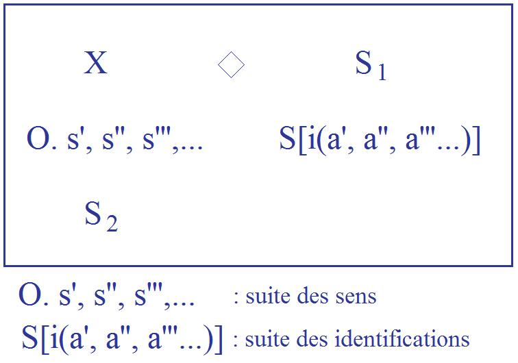

# Leçon 18 | 10 juin 1964

<!-- source-url: http://staferla.free.fr/S11/S11 FONDEMENTS.docx -->
<!-- seminar: s11 -->
<!-- lesson: 18 -->

<!-- id: s11-18-0001 -->

Le but de mon enseignement a été, et reste, de former des analystes. La formation des analystes est un sujet qui est à l’ordre du jour de la recherche analytique. Néanmoins il est clair - et je vous en ai déjà donné des témoignages, tout au moins indiqué l’endroit
dans la littérature ana­lytique où vous pouvez les trouver - que les principes s’en dérobent.

<!-- id: s11-18-0002 -->

Il est clair, dans l’expérience de tous ceux qui ont passé par cette for­mation, qu’à l’insuffisance des critères se substitue, à beaucoup d’étapes de cette formation, quelque chose qui est de l’ordre de *la cérémonie*, ce qui, pour ce dont il s’agit, ne peut se traduire
que d’une façon : *la simu­lation*. Car il n’y a pour le psychanalyste *aucun au-delà*, *aucun au-delà* sub­stantiel à quoi pourrait se rapporter
ce en quoi il se sent fondé à exercer sa fonction.

<!-- id: s11-18-0003 -->

Ce qu’il obtient pourtant, est *d’un prix inexprimable*, ce qu’il obtient, à savoir - je vous l’articulerai aujourd’hui - la confiance d’un sujet en tant que tel, et les résultats que ceci, par les voies d’une certaine tech­nique, comporte. Ceci est ce qui doit nous arrêter
car *le psychanalyste ne se présente pas comme un Dieu*, il n’est pas Dieu pour son patient. Que signifie cette confiance - confiance d’ailleurs dont nous allons montrer les articulations - que signifie cette confiance, autour de quoi tourne*-*t*-*elle ?

<!-- id: s11-18-0004 -->

Sans doute, pour celui qui s’y fie, qui en reçoit la récompense, la question peut être élidée. Elle ne peut pas l’être pour *le psychanalyste*. La formation du psychanalyste exige qu’il sache, dans ce procès où il conduit son patient, autour de quoi le mouvement tourne.
Lui, doit savoir, à lui doit être transmis *-* et dans une expérience *-* ce dans quoi il retourne.

<!-- id: s11-18-0005 -->

Ce point, ce point*-*pivot, c’est ce que je désigne d’une façon qui, je le pense, vous apparaît déjà suffisamment motivée mais qui,
j’es­père, à mesure de notre progrès, vous apparaîtra de plus en plus claire, de plus en plus nécessaire, c’est ce que je désigne
sous ce nom : *le désir du psychanalyste.*

<!-- id: s11-18-0006 -->

Je vous ai montré la dernière fois, cette place où se situe la démarche cartésienne, cette place par où s’est une fois désengrenée
une démarche, une démarche qui dans son origine et dans sa fin *ne va pas essentielle­ment vers la science* mais vers sa propre certitude,
et qui est au principe de ce qui n’est pas la science, au sens où depuis PLATON et avant elle a fait l’objet de la méditation des philosophes, mais *<u>La</u>* science, l’accent étant mis sur ce « *<u>La</u>* » et non pas sur le mot « science ».

<!-- id: s11-18-0007 -->

On savait déjà ce qu’il en était des conditions de *la science*, mais celle dans laquelle nous sommes pris, qui forme
le contexte de notre action à tous, dans le temps que nous vivons, et à laquelle ne peut pas échapper le psychanalyste lui*-*même, parce qu’elle fait, à lui aussi, partie de ses conditions, cette science c’est *<u>La</u>* science, celle*-*là.

<!-- id: s11-18-0008 -->

C’est par rapport à celle*-*là que nous avons à situer la psychanalyse. Nous ne le pouvons faire que par l’articulation
de cette démarche pre­mière, *la démarche cartésienne* en tant qu’elle fonde le sujet. Et c’est à la place du sujet cartésien que nous avons affaire à ce phénomène décou­vert, de l’inconscient, qui ne peut s’articuler que par la révision
que nous avons faite du fondement du sujet cartésien et de ce qu’il comporte de fécond.

<!-- id: s11-18-0009 -->

J’irai d’abord aujourd’hui à la phénoménologie de ce *transfert*. Le *transfert* est un phénomène où sont inclus ensemble le sujet
et le psychanalyste. Le diviser dans *les termes de* « *transfert* » *et de* « *contre-transfert* », quelle que soit *la hardiesse*, quelle que soit
*la désinvolture* des propos qu’on se permet sur ce thème, ce n’est jamais qu’*une façon d’élu­der* ce dont il s’agit.
Le transfert est un phénomène essentiel, lié au désir comme phéno­mène nodal de l’être humain, qui a été découvert avant FREUD.

<!-- id: s11-18-0010 -->

Il a été parfaitement articulé - j’ai employé une grande partie d’une année consacrée au transfert à le démontrer sur un texte, nommément *Le Banquet* de PLATON - il a été articulé avec la plus extrême rigueur dans ce texte où il est débattu de l’amour.
Il a pu être fait, ce texte, *pour sa relation au personnage de* SOCRATE, qui s’y montre pourtant particulièrement discret.

<!-- id: s11-18-0011 -->

Et autour de ce texte se désigne qu’un autre moment essentiel, initial, est celui auquel la question que nous avons à nous poser,
de l’action de l’analyste, doit se reporter, c’est que SOCRATE - et déjà j’indique la visée du chemin que je veux aujourd’hui vous faire parcourir en disant - que SOCRATE *n’a jamais pré­tendu rien savoir, sinon savoir ce qu’il en est de l’*ἔρως \[erôs\]*,* ce qui veut dire *le désir*.

<!-- id: s11-18-0012 -->

Par ce seul fait et par ce que SOCRATE est, et parce que dans *Le Banquet* PLATON en quelque sorte va plus loin qu’en aucun
de ses dialogues à nous indiquer la signification fondamentale de *comédie* - et pousser la chose jusqu’au mime - que constituent
ces dialogues, à cause de cela, il n’a pu faire que de nous indiquer de la façon la plus précise, dans *Le Banquet,* la place du transfert.

<!-- id: s11-18-0013 -->

*Dès qu’il y a quelque part le sujet supposé savoir* - ce que je vous ai écrit aujourd’hui au haut du tableau par « S*. s.* S*.* »,
c’est une abréviation - *il y a transfert*.

<!-- id: s11-18-0014 -->

Qu’est*-*ce que signifie l’ordre, l’organisation des psychanalystes - avec ce qu’il confère de certificats de capacités - sinon d’indiquer
à qui l’on peut s’adresser pour représenter ce sujet ? Or il est, bien sûr, à la connaissance de tous, qu’aucun psychanalys­te
ne peut prétendre représenter *-* de façon si mince soit*-*elle *-* un savoir absolu. C’est pourquoi, en un sens on peut dire que
*celui-là* à qui l’on peut s’adresser, il ne saurait y en avoir *-* *s’il y en a* *-* qu’un, qu’*un seul*. Cet « *un seul* » fut même un temps vivant,
c’était FREUD. Et le fait que FREUD, concernant ce qu’il en est de l’inconscient, *était légitimement le sujet qu’on pouvait supposer savoir*, spécifie, met à part, tout ce qu’il en fut de la *rela­tion analytique*, quand elle a été engagée par ses patients avec lui*-*même.

<!-- id: s11-18-0015 -->

À ceci près qu’il ne fut pas seulement *le sujet supposé savoir*, et qu’il nous a donné, en des termes que l’on peut dire indestructibles pour autant que depuis qu’ils furent émis, ils supportent une interrogation qui jusqu’à présent n’a jamais été épuisée.
Il n’a pu se faire de progrès, si petit que ce progrès se soit manifesté, de travail des sociétés dites *scientifiques* en analyse,
que ce progrès n’ait pu ne pas dévier chaque fois que fut négligé un des termes autour desquels FREUD a ordonné les voies
qu’il a tracées et les chemins de l’inconscient. Ceci nous montre assez ce qu’il en est de la fonction du *sujet supposé savoir*.
La fonction et si je puis dire, du même coup, sa conséquence, le pres­tige de FREUD, sont à l’horizon de toute *position de l’analyste*, elles constituent même le drame de ce qu’on appelle l’organisation commu­nautaire des psychanalystes.

<!-- id: s11-18-0016 -->

De ce *sujet supposé savoir* - *qu’il soit FREUD ou réduit à ce terme, à cette fonction -* peu peuvent se sentir pleinement investis.
Mais là n’est pas la question. Et la question d’abord de chaque sujet est d’où il se repère, pour s’adresser au *sujet supposé savoir*.
Il est clair que chaque fois que cette fonction peut pour lui, être incarnée dans *qui que ce soit*, *analyste ou pas*, il résulte de la définition que je viens de vous donner que le transfert est, d’ores et déjà, fondé. Si les choses vont au point que ceci, chez le *patient*, soit déjà
\- *pour quiconque de nommable, pour une figu­re à lui accessible -* suffisamment déterminé, il en résultera pour qui­conque se chargera
de lui en analyse, une difficulté toute spéciale concer­nant la mise en question dans l’analyse, du transfert.

<!-- id: s11-18-0017 -->

Et il arrive que même ce qu’il peut y avoir de plus borné dans ses vues, au niveau des analystes, que *même l’analyste le plus bête*…

<!-- id: s11-18-0018 -->

> je ne sais pas si ce terme extrême existe, c’est une fonction ici que je ne désigne
>
> qu’à la façon dont on désigne, en mathématiques, cette sorte de nombre mythique,
>
> par exemple, le plus grand nombre qui puisse s’exprimer en tant de mots
> …*même l’analyste le plus bête* s’en aperçoit, le reconnaît, et dirige l’analy­sé vers ce qui reste pour lui *le sujet supposé savoir*.

<!-- id: s11-18-0019 -->

Ceci n’est qu’un détail et presque une anecdote. Entrons maintenant dans l’examen de *ce dont il s’agit*. L’analyste, vous ai*-*je dit,
tient cette place pour autant qu’il est l’objet du transfert. Et cette place, l’expérience nous prouve que le sujet, quand il entre
dans l’analyse, est loin de la lui donner. Laissons pour l’instant, un instant seulement, l’hypothèse *-* l’*hypothèse cartésienne* *–*
que le psychanalyste soit trompeur. Elle n’est pas absolument à exclure du contexte - je dis : phénoménologique - de certaines entrées en analyse. Ceci n’est pas pour l’instant ce qui est le plus à retenir.

<!-- id: s11-18-0020 -->

La psychanalyse nous montre que ce qui limite - surtout dans la phase de départ - le plus la confidence, l’abandon à la *règle analytique* chez le patient, c’est la menace, disons pour ne pas trop accentuer les choses dans le sens subjectif, dans le sens de la crainte
*que le psychanalyste soit*, par lui le *patient*, *trompé*.

<!-- id: s11-18-0021 -->

Combien de fois dans notre expérience arrive*-*t*-*il que nous ne sachions que *très tard* *un détail biographique gros comme ça* !
Et pour me faire entendre, je dirai par exemple l’aveu par le sujet qu’à tel moment de sa vie, il a attrapé la vérole,
un exemple simple, pas très fré­quemment rencontré ni très particulièrement illustratif.

<!-- id: s11-18-0022 -->

« *Et pourquoi ne me l’avez-vous pas dit plus tôt ?* » pourra*-*t*-*on poser la question si l’on est, encore pour la poser, assez naïf.

<!-- id: s11-18-0023 -->

« *Très exactement -* vous dira l’analysé *- pour ne pas vous tromper, car si je vous l’avais dit plus tôt, vous y auriez pu attribuer une partie*
*au moins, voire le fond de mes troubles. Or si je suis ici, ça n’est pas pour que vous donniez à mes troubles, une cause organique* ».

<!-- id: s11-18-0024 -->

Ceci est une illustration, un exemple de portée assurément illimitée, et qu’il y a bien des façons de prendre, sous l’angle des préjugés sociaux, du débat scientifique, de la confusion qui reste autour du principe même de l’analyse.

<!-- id: s11-18-0025 -->

Je ne le donne ici que pour illustration à ceci que *le patient peut penser que l’analyste peut être trompé* si on lui donne certains élé­ments,
*il y a des éléments qu’il retient* pour que l’analyste n’aille pas trop vite. Il faudrait assurément - ce n’est pas l’exemple le meilleur,
je pourrais vous l’incarner dans d’autres exemples - dans une partie de *son texte*, dans une partie, comme on dit, « *de ses problèmes* », que le patient se donne, disons au moins, le prétexte d’en retenir le thème un certain temps, que l’analyste ne se précipite pas dans son jugement. *Combien plus, celui qui peut être trompé devrait-il*, pouvoir être sous le soupçon de *pouvoir* *-* tout simplement *-* *se tromper* !

<!-- id: s11-18-0026 -->

Or, c’est bien là la limite, autour de ce « *tromper* », de ce « *se tromper* » que gît la bascule, la balance de ce point subtil, de ce point infinitésimal, que j’entends mar­quer. Comment se fait*-*il... *Sur quel point pouvons-nous articuler ce que nous voyons dans l’analyse* de la façon la plus manifeste ? C’est que, même étant admis que l’analyste puisse être trompé, et je dirais, même l’analyse chez certains sujets étant mise en question au départ de l’ana­lyse elle*-*même, je veux dire étant supposé qu’après tout elle puisse n’être qu’une sorte de leurre, pour mieux encore accentuer ce que je veux faire entendre et ce que nous disent les patients, autour de ce « *se tromper* », quelque chose s’arrête.

<!-- id: s11-18-0027 -->

Même au *psychanalyste mis en question*, il est fait ce crédit d’une certaine infaillibilité quelque part qui - même à l’*ana­lyste mis en question ! -*
fera attribuer quelquefois à propos d’un geste de hasard, des intentions : « *Vous l’avez fait pour me mettre à l’épreuve* ».
Ici je veux essayer de centrer votre attention, et je vous le répète, appeler sur le terrain du phénomène sur ce de quoi il s’agit.
Depuis la discussion socratique, il a été introduit ce thème que la reconnaissance des conditions du *bien* pour l’homme aurait en soi quelque chose qui *s’impose*, qui soit irrésistible.

<!-- id: s11-18-0028 -->

C’est le paradoxe de l’enseignement, sinon de SOCRATE - qu’en savons*-*nous, sinon par la *comé­die platonicienne* ? - mais je ne dirais même pas « de PLATON », car PLATON se développe dans le terrain du dialogue, et du dialogue *comique*, et laisse ouvertes toutes les questions, mais *dans une certaine exploitation du platonisme* dont on peut dire qu’elle se perpétue au milieu d’une déri­sion générale.
Car à la vérité qui ne sait que la reconnaissance la plus par­faite des conditions du *bien*, n’empêchera quiconque de se ruer dans son contraire !

<!-- id: s11-18-0029 -->

De quoi s’agit*-*il donc, dans cette confiance faite à l’analyste ? Quel crédit pouvons*-*nous lui faire, ce *bien*, de le vouloir,
de le vouloir pour un autre qui plus est ? Et pourtant nous ne doutons pas que là où se situe notre point de rencontre,
il ne puisse être que d’assumer ce dont il s’agit. Je m’explique :

<!-- id: s11-18-0030 -->

- Qui ne sait, d’expérience, qu’on peut ne pas vouloir jouir ?

<!-- id: s11-18-0031 -->

- Qui ne le sait *d’expérience* pour ce recul qu’impose à chacun, en ce qu’elle comporte *d’atroces promesses*, l’approche de la jouissance comme telle ?

<!-- id: s11-18-0032 -->

- Qui ne sait qu’on peut « *ne pas vouloir penser* » ? Il y a là, pour nous en témoigner, tout le collège universel des professeurs.

<!-- id: s11-18-0033 -->

Mais qu’est*-*ce *que peut vouloir dire* : « *ne pas vouloir désirer* » ? Toute l’expérience analytique, qui ici ne fait que donner forme à ce qui est pour chacun à la racine même de son expérience, nous témoigne :

<!-- id: s11-18-0034 -->

- que « *ne pas vouloir désirer* » et *désirer*, c’est la même chose,

<!-- id: s11-18-0035 -->

- que le *désir* même, comporte en lui cette phase de défense qui le rend identique, parce que c’est le même que

<!-- id: s11-18-0036 -->

> « *ne pas vouloir désirer* » et « *vouloir ne pas désirer* ».

<!-- id: s11-18-0037 -->

Discipline à quoi se sont employés, comme issue précisément aux impasses de l’interrogation socratique, des gens qui ne furent pas seulement des *philosophes*, mais des espèces de *reli­gieux* à leur manière, les *stoïciens*, les *épicuriens* par exemple. Le sujet sait que
ce « *ne pas vouloir désirer* », *en soi a quelque chose d’aussi irré­futable que cette bande de Mœbius qui n’a pas d’envers,* à savoir *qu’à la parcourir*
on reviendra mathématiquement à la surface qui serait sup­posé la doubler.

<!-- id: s11-18-0038 -->

C’est parce que c’est en ce point de rendez*-*vous que l’analyste est attendu, que nous pouvons dire que là, sur le sujet du désir,
c’est en tant que l’analyste est supposé savoir qu’il est *supposé* aussi, également *nécessité,* que celui*-*ci le sache ou non,
qu’il sache ou non le formuler, qu’il part *à la rencontre* du désir inconscient.

<!-- id: s11-18-0039 -->

C’est pourquoi je dis - et je vous l’illustrerai par *un petit dessin topo­logique* qui a déjà été au tableau, je le reproduirai la prochaine fois -
que le *désir* est *l’axe, le pivot, le manche, le marteau* *si on peut dire*, grâce à quoi s’applique cet élément*-*force, cette *inertie* qu’il y a derrière, ce qui va d’abord, dans le discours du patient se formuler en *demande*, et ce qui lui donne son véritable poids, à savoir -
ce qui n’est pas pareil - *le trans­fert*. L’axe, le point commun de cette double hache, c’est *le désir de l’ana­lyste* que je désigne ici comme une place, comme une fonction, comme une articulation *essentielle*. Qu’on ne me dise pas que ce *désir*, je ne le nomme pas, je ne l’articule pas, car c’est précisément d’abord ce point qui n’est articulable que du rapport du *désir* au *désir*. Or ce rapport est interne :

<!-- id: s11-18-0040 -->

> « *Le désir de l’homme, c’est le désir de l’Autre.* ».
> Est*-*ce qu’il n’y a pas, ici reproduit, cet élément d’aliénation que je vous ai désigné comme essentiel dans le fondement du sujet comme tel à savoir qu’assurément : *ce n’est qu’au niveau du* « *désir de l’Autre* » *que l’homme peut reconnaître son désir*, et qu’assurément :
> *en tant que* « *désir de l’Autre* » *?* Est*-*ce qu’il n’y a pas là quelque chose qui doit lui paraître en quelque sorte *l’obstacle à ce point d’évanouissement* où jamais son désir ne pourra se reconnaître ?

<!-- id: s11-18-0041 -->

Mais justement, c’est ce qui n’est ni sou­levé, ni à soulever, car l’expérience analytique nous montre que c’est à voir jouer toute
une chaîne au niveau du « *désir de l’Autre* » que le désir du sujet se constitue. Quelque chose est donc conservé ici de l’aliénation, mais non pas avec les mêmes éléments, non pas avec ce S1 et ce S2 du premier couple de signifiants d’où j’ai déduit toute *la formule de l’aliénation du sujet* dans mon avant*-*dernier cours, mais ailleurs, entre :

<!-- id: s11-18-0042 -->

- quelque chose qui s’est constitué du refoulement originaire, de ce que j’ai appelé *la chute*, l’*Unterdrückung* du deuxième S2 du couple, premier binaire des signi­fiants,

<!-- id: s11-18-0043 -->

- et *cette place de manque, cette place* qui apparaît d’abord *comme manque*, dans ce qui est signifié par *le couple* dans l’intervalle qui les lie et qui s’appelle le « *désir de l’Autre* ».

<!-- id: s11-18-0044 -->

Faut*-*il - pour ceux à qui les mots ne suffisent pas - que je désigne qu’il y a une différence entre « ce qui se passe de là à là »,
ou « ce qui se passe d’ici à là » ? Je l’ai d’ailleurs, il me semble, déjà suffisamment indiqué dans ce que j’ai émis précédemment.

<!-- id: s11-18-0045 -->

Ce doit m’être ici, au passage, l’occasion de re-pointer, de réarticuler, un certain nombre de formules tout à fait essentielles
pour vous à conserver, comme en quelque sorte, points*-*terme, points d’accrochage, faute desquels ne peut *-* sur tous ces termes *-* que glisser notre pensée.

<!-- id: s11-18-0046 -->

La fonction initiante, inaugurale, quant à la constitution de cette divi­sion du sujet où j’accentue l’essence de l’aliénation, n’est pas liée par hasard - par un hasard de simple besoin d’illustrer - à la fonction du couple des signifiants, ce n’est pas une façon plus simple de vous présenter les choses, mais il est essentiellement différent qu’il y en ait deux ou qu’il y en ait trois. Si nous voulons saisir où est la fonction du sujet dans cette articula­tion signifiante, nous devons opérer avec deux, parce qu’il n’y a qu’avec deux
qu’il est, si je puis dire, *coinçable* dans l’*aliénation*. Dès qu’il y en a trois, le glissement devient circulaire : passé du *deuxième* au *troisième*,
il revient au premier, mais non pas au *deuxième*.

<!-- id: s11-18-0047 -->

L’effet d’*aphanisis* qui se produit sous l’un des deux *signifiants* est lié à ceci : que ce en quoi se définit, disons pour employer le langage de la mathématique moderne : *un ensemble de signifiants*, c’est que c’est un ensemble tel que si nous le réduisons à deux -

<!-- id: s11-18-0048 -->

il n’en « existe », comme on dit dans la théorie, avec un grand E inversé :  pour la notation, il n’en existe que deux –

<!-- id: s11-18-0049 -->

le phé­nomène de l’aliénation se produit, à savoir *que le signifiant est ce qui représente le sujet pour l’autre signifiant. D’où il résulte qu’au niveau de l’autre signifiant - si l’autre signifiant est au niveau d’un autre - le sujet s’évanouit*.

<!-- id: s11-18-0050 -->

C’est pourquoi aussi j’ai éprouvé aujourd’hui…

<!-- id: s11-18-0051 -->

> et ceci en raison de la relecture que j’ai faite du travail d’un de mes élèves auquel j’ai fait allu­sion la dernière fois
> …je vous ai indiqué *l’erreur qu’il y a dans une cer­taine traduction de ce Vorstellungsrepräsentanz qui est le signifiant* S2 *du couple*.

<!-- id: s11-18-0052 -->

Il faut ici articuler ce dont il s’agit, et ce qui dans ce texte dont je parle, a été pressenti mais exprimé à côté, et d’une façon qui prête à l’erreur, pour précisément y omettre le caractère fondamental de la fonction du sujet dans cette articulation.

<!-- id: s11-18-0053 -->

Il y est parlé sans cesse du *rapport du signifiant et du signifié* :

<!-- id: s11-18-0054 -->

- ce qui est là se tenir dans ce que j’appellerai le « *b, a, ba »* de la question,

<!-- id: s11-18-0055 -->

- ce qu’il a bien fallu, en effet, qu’un jour je mette au tableau noir pour montrer de quoi je partais, quel appui je prenais dans *quelque chose* qui avait été formulé *à la raci­ne du développement saussurien*,

<!-- id: s11-18-0056 -->

- mais ce dont tout de suite j’ai montré que ce n’était efficace et maniable qu’à y inclure *la fonction du sujet* au stade originel.

<!-- id: s11-18-0057 -->

Il ne s’agit pas simplement de dire - cette chose est vraiment à la portée de la plus mince expérience - que de réduire la fonction
du *signifiant* au *signifié*, à *la nomination*, à savoir *une éti­quette collée sur une chose*, c’est laisser échapper toute l’essence du langage.
Je dois dire que ce texte, dont j’ai dit la dernière fois qu’il fai­sait preuve *d’infatuation*, fait preuve aussi *d’ignorance crasse*, en lais­sant entendre que c’est de cela qu’il s’agit, au niveau de l’expérience pavlovienne !

<!-- id: s11-18-0058 -->

Même un instant, dans les idées de PAVLOV, ce que PAVLOV « désire » - pour l’appeler du terme dont nous venons de désigner ici la fonction dont il s’agit - il le fait *-* *mais le sait-il lui-même ?* *-* et assurément, s’il y a quelque chose qui puisse se situer au niveau de l’expérience du *réflexe condi­tionné*, ça n’est assurément pas d’associer un *signe* à une *chose*.

<!-- id: s11-18-0059 -->

Comme je vous l’ai dit la dernière fois, c’est proprement, que PAVLOV le reconnaisse ou non, *associer un signifiant* qui est caractéristique de toute condition d’expérience, en tant qu’elle est d’expérience instituée avec en effet quelque chose que j’ai appelé *la coupure* qu’on peut faire dans l’organisation organique d’un besoin. Ce *quelque chose* qui se désigne par une manifestation au niveau d’un cycle de besoins interrom­pus et que désigne, au niveau de l’expérience pavlovienne, ce que nous retrouvons ici comme étant
*la coupure du désir*. Et - comme on dit « *Voilà pourquoi votre fille est muette !* » - *voilà pourquoi l’animal n’apprendra jamais à parler*, au moins par cette voie, parce qu’évidemment, il est d’un temps, en retard. Ceci peut provoquer en lui toutes sortes de *désordres*, toutes sortes de troubles, mais il n’est pas prédestiné, il n’est pas appelé - n’étant pas jusqu’à présent un être parlant - à mettre en ques­tion le désir de l’expérimentateur qui aussi bien, si on l’interrogeait lui*-*même, serait bien embarrassé pour répondre.

<!-- id: s11-18-0060 -->

Il n’en reste pas moins qu’à l’articuler ainsi, *cette expérience a l’inté­rêt, en effet essentiel, de nous permettre de situer, comme je l’ai fait la der­nière fois* en réponse aux questions qui m’ont été posées, *de situer ce qui est*, à proprement parler, à concevoir de *l’effet psychosomatique*.
Ceci peut aller infiniment plus loin, de façon de formuler ainsi la for­mule à quatre termes qui est ici représentée en bas,
je pense que vous la reconnaissez, malgré sa complication d’aujourd’hui, qui se justifie par ce que je vais vous dire maintenant.

<!-- id: s11-18-0061 -->

<!-- id: s11-18-0062 -->

C’est que c’est pré­cisément dans la mesure où *il n’y a pas l’intervalle entre* S1 *et* S2 - où le pre­mier couple de signifiants *se solidifie*, « *s’holophrase* » si je puis m’exprimer ainsi - que nous avons le modèle de toute une série de cas qui peuvent l’illustrer, encore que dans chacun le sujet n’y occupera pas la même place.

<!-- id: s11-18-0063 -->

C’est pour autant, par exemple, que l’enfant - l’*enfant débile*, sur lequel notre collègue Maud MANNONI[^90] vient de sortir un livre dont je vous conseille à tous la lecture - prend la place en bas, et à droite de ce S, au regard de ce *quelque chose* à quoi la mère le réduit à n’être plus que le support de son désir dans un terme le plus obscur, que s’introduit dans la manœuvre de l’éducation du débile,
cette dimension psychotique précisément, ce que le livre de Maud MANNONI essaie de désigner à ceux qui d’une façon quelconque peuvent être commis à en lever l’hypo­thèque.

<!-- id: s11-18-0064 -->

De même, c’est assurément quelque chose du même ordre dont il s’agit dans la psychose : cette *solidité*, cette *prise en masse*, de *la chaîne* *signifiante primitive*, c’est ce qui interdit cette ouverture dialectique qui se manifeste dans le phénomène de la *croyance*.
Au fond de la paranoïa - de la paranoïa elle*-*même qui nous paraît pourtant toute animée de croyance - au fond règne *ce phénomène*
*de l’Unglauben* \[incroyance\] qui n’est pas le « *n’y pas croire* », mais l’absence d’un des termes de la croyance, de cet endroit où se désigne
la division du sujet.

<!-- id: s11-18-0065 -->

S’il n’est pas en effet de *croyance* qui soit, si l’on peut dire, pleine et entière, c’est même qu’il n’est pas de *croyance* qui ne suppose
dans son fond que la dimension dernière qu’elle a à révéler est *strictement* *corrélative* du moment où c’est *son sens* qui va s’évanouir.
*Toutes sortes d’expériences* sont là pour en témoigner, dont l’une d’entre elles, un jour me fut donnée *très humoristiquement* à propos d’une mésaventure de CASANOVA, par MANNONI, ici présent, et qui fait là*-*dessus des considérations, à la fois les plus amusantes
et les plus démonstratives.

<!-- id: s11-18-0066 -->

Car c’est au terme d’une mystification, qui réussit au point *d’émouvoir les forces célestes, de déchaîner autour de lui un orage* qui, à la vérité,
le terrifie, que le personnage, qui jusque-là a pour­suivi l’aventure la plus cynique avec une petite oie qui lui donne le motif de tout
ce autour de quoi il entraîne tout un cercle d’imbéciles et pour avoir vu, si l’on peut dire, en quelque sorte, sa mystification prendre son sens, s’incarner, se réaliser, que le personnage lui*-*même entre dans cette sorte d’effondrement - comique à surprendre au niveau d’un CASANOVA qui défie la terre et le ciel au niveau de son désir - de tom­ber dans l’impuissance comme si vraiment il avait rencontré la figure de Dieu pour l’arrêter.

<!-- id: s11-18-0067 -->

Entendons donc bien ici que, quand par exemple on me présente comme quelque chose de rebattu - encore dans ce texte dont
je vous par­lais tout à l’heure, c’est tout juste si la personne ne s’excuse pas de reprendre une fois de plus le *fort-da,* sur lequel chacun s’est essuyé les pieds. Vous savez de quoi il s’agit, *fort-da,* l’opposition phonématique où FREUD surprend le jeu initial de l’instauration chez le petit enfant du rapport à la présence et à l’absence - le texte en question, pour le reprendre comme un exemple de la symbolisation primordiale, et je vous dis, en s’excusant d’une chose qui est maintenant passée dans le domai­ne public,
eh bien n’en fait pas moins une erreur et une erreur grossiè­re, car ce n’est pas de leur opposition, le *fort* et le *da,* pur et simple aller
et retour, qu’il tire sa force inaugurale, que son essence répétitive s’explique.

<!-- id: s11-18-0068 -->

Et dire qu’il s’agit simplement pour le sujet de s’instituer dans *une fonction de maîtrise* est une sottise. C’est *dans la mesure* où ici,
dans les deux phonèmes, s’incarnent les mécanismes proprement de l’aliénation qui s’expriment, si paradoxal que cela vous paraisse, au niveau du *fort. Pas de « fort » sans « da » et* *-* si l’on peut dire *-* *sans Dasein.* Mais justement, contrairement à ce qu’essaie de saisir, comme le fondement radical de l’existence, toute la *Dasein-analyse,* toute une certaine phénoménologie, *il n’y a pas de Dasein avec le fort.*

<!-- id: s11-18-0069 -->

C’est*-*à*-*dire qu’on n’a pas le choix et que si le petit sujet peut s’exercer à ce jeu *du fort-da,* c’est justement qu’il ne s’y exerce pas
du tout, car nul sujet ne peut saisir cette articulation radicale : *il s’y exerce à l’aide d’une petite bobine*, c’est*-*à*-*dire avec *l’objet(a)*.
Et le poids, la fonction de cet exercice avec cet *objet* se réfère à une *aliénation* et non pas à une quel­conque et supposée « *maîtrise* » dont on voit mal ce qui l’augmenterait dans une répétition indéfinie, alors que *la répétition indéfinie* dont il s’agit, exprime, manifeste, *met au jour la vacillation radicale du sujet.*

<!-- id: s11-18-0070 -->

Comme à l’habitude, il me faut interrompre les choses dans une cer­taine limite. Pourtant je veux désigner, ne serait*-*ce qu’en termes brefs, ce qui maintenant, va faire l’objet de ce que nous pourrons dire la prochai­ne fois. J’en ai marqué au tableau, sous la forme de deux schémas, la dif­férence essentielle.

<!-- id: s11-18-0071 -->

Quand, au niveau du texte sur les *Triebe* et les *Triebschicksale,* sur les *Pulsions et vicissitudes des pulsions*, FREUD met l’amour à la fois :

<!-- id: s11-18-0072 -->

- au niveau du *réel*,

<!-- id: s11-18-0073 -->

- au niveau du *narcissisme*,

<!-- id: s11-18-0074 -->

- au niveau du *principe du plai­sir* dans sa corrélation avec le *principe de réalité*, …et en déduit *la fonction d’ambivalence* comme absolument différente de ce qui se produit dans la *Verkehrung* \[reversion\]*,* dans le mouvement circulaire, bref au point, au niveau où il s’agit de l’amour, nous avons le schéma, le schéma dont FREUD nous dit qu’il s’étage en deux temps.

<!-- id: s11-18-0075 -->

Premièrement un *Ich,* un *Ich* défini objectivement par le fonctionne­ment solidaire de l’appareil système nerveux central avec les conditions d’homéostase, à un certain niveau - le plus bas possible à conserver - des tensions. Autour de cela, nous dit-il primitivement, nous pouvons concevoir ce qu’il y a *hors de ça* - *si tant est qu’il y ait un hors* - comme indifférence, et à ce niveau, puisqu’il s’agit de tensions, indifférence veut dire simplement inexistence. Et puis *qu’est-ce qu’il nous dit qu’il nous donne* *après* ?
C’est que la règle de cet auto*-*érotisme n’est pas, non pas l’inexistence des objets, mais le fonctionnement des objets uniquement
en rapport avec cette règle. Dans cette zone d’indifférence, se dif­férencient ce qui apporte *Lust* et ce qui apporte *Unlust.*

<!-- id: s11-18-0076 -->

tel que je vous l’ai mis ici à gauche ?

<!-- id: s11-18-0077 -->

<!-- id: s11-18-0078 -->

Il répondra à certaines questions qui m’ont été posées ici, sur la fonction spéculaire dans le rapport du sujet à l’autre.
Nous ne sommes pas ici, au niveau du rapport du sujet à l’autre, nous sommes dans cet *Ich hypothétique* où se motive la première construction d’un appareil fonctionnant comme un psychisme.

<!-- id: s11-18-0079 -->

Qu’est*-*ce que nous pou­vons en donner comme figure, la plus proche et la plus exacte à le faire fonctionner ?
C’est ceci, à gauche : avec ses grandes lettres : ICH, ce *Ich* en tant qu’il est appareil tendant à une certaine *homéostase*.
Et chacun sait qu’*elle ne peut pas être la plus basse puisque ce serait la mort*, et que d’ailleurs la chose a été, par FREUD, envisagée
en second temps. Mais il s’agit de comprendre si c’est à ce niveau*-*là ou à un autre qu’elle a été évoquée.

<!-- id: s11-18-0080 -->

Le *Lust* est bel et bien un objet, un objet qui n’est pas dans ce cercle du *Ich,* un objet qui est reconnu, qui est miré dans cet *Ich* comme étant objet de *Lust. Le Lust-Ich purifié* dont parle FREUD, *c’est l’image en miroir*, c’est la correspondance point par point,
c’est la connotation bi-­univoque de quelque chose qui est au niveau de l’objet et de quelque chose qui dans l’*Ich* s’en satisfait,
en tant que *Lust.* Ce qui est inassimilable, ce qui est irréductible, au *principe du plaisir*, ce qui est *Unlust* fondamental,
FREUD nous le dit, c’est cela à partir de quoi va se constituer le *non*-­*moi*.

<!-- id: s11-18-0081 -->

Mais le *non*-­*moi* se constitue à l’inté­rieur du cercle du *moi primitif*, et ce qui dans cet *objet* mord, c’est ce que le fonctionnement
de l’*Ich* n’arrivera jamais à évacuer, c’est là *l’origi­ne de ce que nous retrouverons plus tard, dans la fonction dite du mau­vais objet.*
Vous le voyez donc ici, ce qui articule ce niveau du fonctionnement, c’est quelque chose d’abord qui donne l’amorce à une possible articula­tion de l’*aliénation*. Car, en fin de compte, ce qui est du champ du *Lust,* c’est -­ dit FREUD -­ dans la zone extérieure à l’*Ich,* c’est quand même *quelque chose* dont il faut s’occuper. Il y a *quelque chose où la parfaite tranquillité de l’Ich choit*.

<!-- id: s11-18-0082 -->

Mais ceci ne comporte pas l’exigence de la dis­parition de l’appareil, bien au contraire. Ici l’*écornure* ou l’*écornage* dont je parle dans
*la dialectique du sujet à l’Autre* se produit dans l’autre sens. La formule de ceci, c’est le « *pas de bien sans mal* », « *pas de bien sans souffrance* », et qui garde à ce bien, à ce mal, son caractère d’alternance, de dosage possible, qui est en effet celui où l’articulation que je donnais tout à l’heure du couple des signifiants va se réduire, et faussement.

<!-- id: s11-18-0083 -->

Car, pour reprendre les choses au niveau de ce bien et de ce mal primitif, de *l’hédonisme* dont chacun sait qu’il échoue, qu’il dérape pour expliquer la mécanique du désir, c’est qu’à passer à l’autre registre, à l’articulation aliénante, ceci s’exprime tout différemment. Et je rougis presque ici d’agiter ces chiffons avec lesquels les imbéciles font *joujou* depuis si longtemps : « *Au-delà du bien et du mal* » sans savoir exactement de quoi ils parlent.

<!-- id: s11-18-0084 -->

Il n’en reste pas moins qu’il faut articuler ce qui se passe au niveau de *l’articulation aliénante*, comme un :

<!-- id: s11-18-0085 -->

> « *pas de mal sans qu’il en résulte un bien* »
> et quand le bien est là :

<!-- id: s11-18-0086 -->

> « *il n’y a pas de bien qui tienne avec le mal* ».

<!-- id: s11-18-0087 -->

C’est pour ça qu’à se situer dans le registre pur et simple du plaisir, l’éthique échoue, et que très légitimement KANT lui objecte
que le *Souverain bien* ne saurait en être aucunement conçu d’infinitisation d’un *petit bien* quelconque, car - comme il l’observe –
il n’y a pas de loi pos­sible à donner, de ce qui peut être *le bien* dans les objets.

<!-- id: s11-18-0088 -->

Le *Souverain bien*, si tant est que ce terme qui fait confusion doive être maintenu, ne peut se retrouver qu’au niveau de la loi,
et j’ai démon­tré dans mon article KANT sur SADE : « *Kant avec Sade »* que ceci veut dire qu’au niveau du désir, passivité, narcissisme, ambivalence : telles sont les caractéristiques qui gouvernent la *dialectique du plaisir* au niveau du tableau de gauche.
Son terme est à proprement parler ce qu’on appelle l’*identification*.

<!-- id: s11-18-0089 -->

Les caractères de ce qui se produit, de ce qu’introduit l’activité de la pulsion… ce qui permet de construire avec la plus grande certitude le fonctionnement dit « *division du sujet* » ou « *aliénation* » avec ses consé­quences, c’est *la reconnaissance de la pulsion*.
Et comment a-­t-­elle été reconnue ? Elle a été reconnue en ceci que loin que nous puissions limi­ter *la dialectique de ce qui se passe dans l’inconscient du sujet*, à la réfé­rence au champ du *Lust,* aux *images des objets bénéfiques, des objets bienfaisants, des objets favorables*,
nous avons trouvé la fonction privi­légiée d’un *certain type d’objets* qui en fin de compte ne peuvent servir à *rien*.

<!-- id: s11-18-0090 -->

Ce sont les *objets(a)* : *les seins, les fèces, le regard, la voix*. C’est autour de cette expérience nouvelle, de cette introduction d’un terme nouveau que toute dialectique amène, *que gît le point expérimental, le point démonstratif*, qui introduit la dialectique du sujet
en tant que sujet de l’inconscient.

<!-- id: s11-18-0091 -->

C’est là que je poursuivrai la prochaine fois et que je retrouverai la suite de ce qui est à développer dans le sujet du *transfert*.

<!-- id: s11-18-0092 -->

*Discussion*

<!-- id: s11-18-0093 -->

Moustafa SAFOUAN

<!-- id: s11-18-0094 -->

Je ne peux poser de question car je trouve toujours une difficulté à saisir la différence entre *l’objet dans la pulsion* et *l’objet dans le désir*. Maintenant qu’il s’agit de voir la différence du *Ça* et *l’objet* dans la pulsion, je perds le fil.

<!-- id: s11-18-0095 -->

LACAN

<!-- id: s11-18-0096 -->

Écoutez, là il s’agit, mon cher, d’une question de terminolo­gie. C’est très gentil de votre part de poser une question même si elle témoigne d’un embarras parce que ça peut servir à tout le monde.

<!-- id: s11-18-0097 -->

Je ne suis pas le premier, je pense, à prendre le parti, par exemple de dire qu’*au sens du déterminé* - je veux dire d’un génitif objectif : désir de quelque chose - je ne suis pas le premier à dire… prenez même M. SARTRE : le désir est une passion inutile, ça n’est pas ce qu’il a l’air de désirer qu’il désire... Il faut s’entendre !

<!-- id: s11-18-0098 -->

Il n’en reste pas moins qu’il y a un tas de choses très agréables, disons que nous croyons désirer, pour autant que nous sommes sains mais nous ne pouvons pas en dire plus que ceci : c’est que nous croyons les désirer. Il a là des choses d’un niveau - il me semble, enfin - tout à fait transmissibles, ce n’est pas de la théorie analytique. Les objets qui sont là dans le champ du *Lust* et qui
ont ce rapport si fondamentalement narcissique avec le sujet qu’en fin de compte le sys­tème de *la prétendue régression de l’amour dans l’identification a sa raison* simplement de la symétrie de ces deux champs que je vous ai désignés par *Lust* et *Lust–Ich* de l’autre côté.

<!-- id: s11-18-0099 -->

*Ce qu’on ne peut pas gar­der au-dehors, on en a toujours l’image au dedans. C’est aussi bête que ça l’identification à l’objet d’amour*.

<!-- id: s11-18-0100 -->

Et je ne vois pas pourquoi ça a fait tant de difficultés et même pour FREUD lui-­même. C’est l’objet d’amour, ça, mon cher.
D’ailleurs, quand il s’agit d’objets qui n’ont pas cette valeur pulsionnelle, à proprement parler que vous soulevez en parlant
de l’objet de la pulsion, vous dites quoi, alors, comme FREUD le fait remarquer : « *J’aime bien ça, j’aime bien le ragoût de mouton* »

<!-- id: s11-18-0101 -->

C’est exactement la même chose que quand vous dites : « *J’aime Mme Une telle* ». À cette différence que « *J’aime Mme Une telle* »,

<!-- id: s11-18-0102 -->

vous le lui dites à elle, ce qui change tout. Vous lui dites pour des raisons que je vous expliquerai la prochaine fois.
Il n’en reste pas moins que *vous aimez le ragoût de mouton*, vous n’êtes pas sûr de le *désirer*. Prenez l’expérience de la belle bouchère,
elle aime le caviar, seulement elle n’en veut pas. C’est pour ça qu’elle le dési­re.

<!-- id: s11-18-0103 -->

*Alors l’objet du désir c’est la cause du désir, et cet objet cause du désir, c’est l’objet de la pulsion.*
*Ce qui veut dire, c’est l’objet autour de quoi tourne la pulsion.*

<!-- id: s11-18-0104 -->

Nous sommes là au niveau d’un dialogue de quelqu’un qui a tout de même assez travaillé mes textes pour que je puis­se m’exprimer dans des formules algébriques resserrées. Il y a l’objet de la pulsion, l’objet de la pulsion c’est ce dont il s’agit dans son carac­tère *déterminant*, non pas du tout que le désir s’y accroche, le désir en fait le tour, en tant qu’il est agi dans *la pulsion*.

<!-- id: s11-18-0105 -->

Tout désir n’est pas forcément agi dans la pulsion. Il y a aussi des désirs vides, des désirs fous, qui partent justement de ceci,
il ne s’agit que du désir, par exemple, de ce qu’on vous a défendu quelque chose, du fait qu’on vous l’a défen­du, vous ne pouvez pas faire, pendant un certain temps, autrement qu’y penser. C’est encore du désir.

<!-- id: s11-18-0106 -->

Mais vous voyez bien, là comme ailleurs, l’existence de l’objet au niveau du déterminé du désir. Chaque fois que vous avez affaire à *un objet de bien*, et vous pourriez m’objecter que c’est comme objet de désir, nous le désignons - c’est une question de termino­logie, mais c’est une terminologie justifiée - nous le désignons comme *objet d’amour*. Et c’est justifié en ceci que vous verrez la prochaine fois : comment j’essaierai pour vous d’articuler le rapport qu’il y a entre *l’amour, le transfert, le désir*.

<!-- id: s11-18-0107 -->

La fonction de *l’amour*, là où nous pouvons le voir vivre, là où *Le Banquet,* je pense, pendant une année, m’a permis de vous faire entendre comment ça jouait.
## Notes

[^90]: Maud Mannoni : *L'enfant arriéré et sa mère* (1964), Seuil, 1981.
