# Leçon 03 | l6 Décembre l964

<!-- source-url: http://staferla.free.fr/S12/S12 PROBLEMES.docx -->
<!-- seminar: s12 -->
<!-- lesson: 03 -->

<!-- id: s12-03-0001 -->

Si la psychologie, quel que soit son *objet*, mais cet *objet* même, comme on le soutient vainement, pouvant être défini comme unique, cet *objet*, de quelque façon, pouvant nous conduire, par quelque voie que ce soit, à la connaissance, autrement dit, si l’âme existait, si la connaissance relevait de l’âme, les professeurs de psychologie, les psychologues enseignants devraient se recruter par *les moyens mêmes* dont ils appréhendent leur objet et, pour illustrer ce que je veux dire, ils devraient réaliser ce qui se passerait dans quelque section de Muséum - nommons en une au hasard, la plus représentative la conchyliologie[^21] \[*sic*\] : science des coquillages - et devraient en somme réaliser d’un seul coup, *l’ensemble du personnel enseignant* et la collection elle-même. Le résumé de leurs titres universitaires servant d’ailleurs assez bien dans cette métaphore à figurer *l’étiquette de provenance* collée sur le dit exemplaire.

<!-- id: s12-03-0002 -->

L’expérience prouve, encore que rien ne soit exclu dans l’avenir, qu’il ne s’est passé jusqu’à présent rien de pareil.

<!-- id: s12-03-0003 -->

La tentative d’un PIAGET…

<!-- id: s12-03-0004 -->

> qui est à proprement parler celle de faire confiner d’une façon si étroite le procès, le progrès de la connaissance effective avec un supposé développement de quelque chose de supposé immanent à une espèce, humaine ou autre …est quelque chose qui assurément…

<!-- id: s12-03-0005 -->

> d’une façon certes analogique, puisque aucune *Phénoménologie de l’esprit*, si élémentaire soit-elle, ne peut y être impliquée …devrait aboutir à cette sorte de sélection, d’échantillonnage dont je parle, dont on ferait en quelque sorte du quotient intellectuel le seul étalonnage possible de quiconque a à répondre d’un certain fonctionnement, d’une certaine intégration du fonctionnement de l’intelligence.

<!-- id: s12-03-0006 -->

L’objet de la psychologie est si peu unitaire d’ailleurs que cette traduction du mot *âme*, au niveau où il sert à une théorie du *développement intellectuel*, est parfaitement insuffisante à combler son emploi.

<!-- id: s12-03-0007 -->

Et chacun sait que dans d’autres registres, nous arriverions au même paradoxe que ceux qui ont, d’une façon quelconque, à reconnaître, voire à administrer ce champ de l’âme, devraient aussi réaliser en eux-mêmes quelques types, quelques prototypes ou quelques moments élus de ce qui, en fin de compte, devrait s’appeler « *la belle âme* ». Heureusement, personne n’y songe plus, la méfiance la plus profonde ayant été jetée sur cette catégorie de « *la belle âme* », vous le savez, par HEGEL.[^22] Le rapport de *la belle âme* aux désordres du monde a été une fois pour toutes et définitivement *stigmatisé* par la remarque assurément pénétrante, et qui nous introduit de toutes ses portes à la dialectique ici appliquée, *que* « *la belle âme* » *ne se soutient que de ce désordre même*.

<!-- id: s12-03-0008 -->

Il est clair pourtant que dans le recrutement que les psychanalystes s’imposent à eux-mêmes, il y a dans tout ce champ que je n’ai pas pu parcourir du faisceau du projecteur, il y a un lieu qui se distingue par quelque chose qui se rapproche d’une façon très singulière de cette hypothèse paradoxale et de l’idée que quelqu’un qui a à enseigner, à rendre compte de ce qu’est effectivement *la praxis analytique*, de ce qu’elle prétend conquérir sur le *réel*, ce quelqu’un, d’une certaine façon, est lui-même ce qui se choisit comme étant un échantillon particulièrement bien trié de ce progrès.

<!-- id: s12-03-0009 -->

Vous sentez bien d’ailleurs qu’ici il s’agit d’autre chose que de typique, que de statique, il s’agit d’une certaine épreuve.

<!-- id: s12-03-0010 -->

Mais alors, d’autant plus importante est à préciser la portée de cette épreuve, et sans aucun doute, le terme d’*identification* qu’ici on introduira, par exemple en le donnant comme terme à l’expérience analytique, ne pourra du même coup qu’introduire un point tout à fait aigu de cette problématique.

<!-- id: s12-03-0011 -->

À quel niveau cette identification se produit elle ? Au niveau d’une expérience elle-même particulière.

<!-- id: s12-03-0012 -->

L’analysé sera-t-il quelqu’un qui transmet un certain mode d’expérience de celui qui l’a analysé tel que lui-même l’a reçu ?

<!-- id: s12-03-0013 -->

Comment ces expériences peuvent-elles, l’une par rapport à l’autre se repérer : celle qui antécède a-t-elle toujours quelque chose, qui en quelque sorte, dépasse et inclut celle qui va en sortir, ou au contraire, laisse-t-elle la porte ouvert à quelque surmontement ?

<!-- id: s12-03-0014 -->

C’est assurément là le niveau le plus difficile où poser le problème. C’est certainement aussi celui où il doit être *résolu*.

<!-- id: s12-03-0015 -->

Comment même pouvoir l’envisager si nous ne saisissons pas la structure de cette expérience ?

<!-- id: s12-03-0016 -->

Car d’aucune façon dans la théorie analytique, quoi que ce soit qui pourrait s’affirmer au niveau de cette identification comme substantiel, d’aucune façon ceci ne peut servir de module et de mesure, et les analystes eux-mêmes…

<!-- id: s12-03-0017 -->

> voire les plus *inféodés* à tel ou tel procès *traditionnel*, et mon Dieu à ne pas trop l’approfondir …riraient si on leur disait que ce qu’il s’agit de transmettre c’est une fonction du type de *l’idéal du moi* : l’identification dont il s’agit ne peut qu’être définie, saisie, autre part.

<!-- id: s12-03-0018 -->

Nous ne saurions bien sûr, nous contenter de quelque chose qui évoquerait de s’être exercée une fois à une certaine dynamique.

<!-- id: s12-03-0019 -->

Comment trouver là quoi que ce soit qui ne puisse se résoudre que dans une sorte d’endogénie, prise de conscience d’un certain nombre de déplacements saisis par l’intérieur ?

<!-- id: s12-03-0020 -->

Mais quoi de saisissable, quoi de transmissible, quoi d’organisable, quoi - pour tout dire - de *scientifique* pourrait-il s’asseoir sur quelque chose qui ne reviendrait alors que d’être au niveau d’une certaine *massothérapie*, si vous voulez, d’exercice du type respiratoire, voire de quelque relaxation, quelque chose d’aussi primitivement près de la sphère la plus interne d’une épreuve, en fin de compte, corporelle.

<!-- id: s12-03-0021 -->

C’est pour cela qu’il est si important d’essayer de saisir ce dont il peut s’agir dans une expérience qui s’annonce elle–même comme être de la dimension la plus pleine, qui sans aucun doute n’est pas sans s’identifier entièrement à quelque chose d’aussi absolu, d’aussi radical, que ce serait de parler de la vérité, ne peut néanmoins pas refuser…

<!-- id: s12-03-0022 -->

> j’entends au niveau de son expérience, au niveau de ses résultats …cette dimension du véridique, de quelque chose qui, d’être conquis, se révèle non seulement libératoire mais plus authentique que ce qui était inclus dans le nœud dont il s’agit de se libérer.

<!-- id: s12-03-0023 -->

Aussi bien n’est-ce pas pour rien que viennent dans mon discours des éléments de *métaphore* aussi singuliers…

<!-- id: s12-03-0024 -->

> aussi inaperçus peut-être, mais aussi frappants si nous les retenons …que ceux qui de ce nœud nous ramènent à ce que déjà la dernière fois, j’ai fait entrer ici dans *ce petit modèle* que je vous apportais, sous la forme de *la bande de Mœbius*, en vous rappelant l’importance de quelque chose qui est de l’ordre de la topologie.

<!-- id: s12-03-0025 -->

Et son emploi est en quelque sorte tout de suite suggéré par cette simple remarque que nous devons faire, fût-ce à partir d’une épreuve, d’une épreuve, en quelque sorte naïve, quant à son réalisme, comme celle de PIAGET, qui est assurément qu’il n’est pas difficile à tel ou tel tournant du texte de pointer la faille par où il s’avère qu’à prendre simplement le langage pour être l’instrument de l’intelligence, c’est de la façon la plus profonde méconnaître que loin qu’il s’agisse là d’être l’instrument de l’intelligence, il démontre en même temps et de la même voix, du même discours, comment se fait-il, alors qu’il le souligne dans le même *discours*, que cet instrument soit si inapproprié, que *le langage* soit justement ce qui, *à l’intelligence*, fasse difficulté ?

<!-- id: s12-03-0026 -->

Peut-être, à l’intelligence, tout aussi difficiles sont à soulever les problèmes posés par le langage : il lui est difficile de guider une conduite appropriée au niveau du pur et simple obstacle, de la pure et simple et *immédiate réalité*, celle contre laquelle on bute en se cognant le front contre. Renvoyer cette inappropriation du langage à je ne sais quel état primitif de ce qu’on appelle en cette occasion, la pensée, n’est vraiment ici que rejeter le problème sans aucunement le résoudre.

<!-- id: s12-03-0027 -->

Car si effectivement *le langage* fut d’abord quelque cristallisation qui s’est imposée à l’exercice de *l’intelligence* comme un appareil, comment n’est-il pas évident que *l’intelligence* aurait fait *le langage* aussi *approprié* qu’elle a fait, après tout, ses *instruments primitifs*.

<!-- id: s12-03-0028 -->

Lesquels nous savons qu’ils sont, *de tous les instruments,* souvent les plus merveilleusement habiles, les plus saisissants pour nous, au point qu’à peine en pouvons-nous restituer la perfection d’équilibre :

<!-- id: s12-03-0029 -->

<!-- id: s12-03-0030 -->

faits avec le minimum de matière, et en même temps la matière la plus choisie, qui nous les fait - *les instruments que nous pouvons voir, ceux-ci, les primitifs -* être en quelque sorte les plus précieux du point de vue de la qualité de l’objet. Comment le langage n’aurait-il pas été quelque chose d’analogue à sa façon, si effectivement, il était création, sécrétion, prolongement de l’*acte intelligent* ?

<!-- id: s12-03-0031 -->

Bien au contraire, s’il est quelque chose que dans une première approche nous pourrions essayer de définir comme étant *le champ* *de la pensée*, eh bien, pourquoi pas à titre provisoire, s’il faut absolument partir de l’intelligence, ne dirais-je pas que la pensée…

<!-- id: s12-03-0032 -->

> et mon Dieu, et que ce soit une formule qui s’appliquera bien assez à divers niveaux, au moins d’une façon descriptive, pour avoir l’air, au moins au premier plan, d’une approche …que la pensée c’est l’intelligence s’exerçant à se retrouver dans les difficultés que lui impose la fonction du langage.

<!-- id: s12-03-0033 -->

Loin que nous puissions d’aucune façon, bien sûr - *c’est là la première porte qu’ouvre la linguistique -* nous contenter de ce premier *schéma* grossier, qui ferait du langage l’appareil, l’instrument, de quelque correspondance biunivoque, *quelle qu’elle soit*.

<!-- id: s12-03-0034 -->

Est-ce qu’il n’est pas clair que cette poursuite même qui est faite, de l’y réduire sous la forme critique de la signification du *logico-positivisme* et de son mythe d’arriver à une exhaustion du *meaning of meaning*[^23], d’épuiser en tout emploi du signifiant l’exhaustion des significations différentes, qui une fois *connotées*, nous dit-on, permettront d’avoir un discours, un dialogue qui sera sans ambiguïté, de savoir toujours dans quel sens, dans quel emploi, dans quelle acception, tel mot est apporté ?

<!-- id: s12-03-0035 -->

Qui ne voit que tout ce qu’apporte le langage de fécondité, voire même de pur et simple fonctionnement, consiste toujours…

<!-- id: s12-03-0036 -->

> non pas à opérer sur cette sorte de conjonction d’appareil, en quelque sorte préformé qui \[...\] après quoi, nous n’aurions plus qu’à *y* recueillir, qu’à y lire la solution d’un problème …qui ne voit que c’est justement cette opération qui constitue elle-même la solution du problème, que cette *opération de fonction*, et que j’ai appelée pour l’instant idéalement biunivoque, c’est justement ce qu’il s’agit d*’*obtenir au terme de toute recherche.

<!-- id: s12-03-0037 -->

Ceci étant posé comme de l’ordre de la plus simple introduction de toute préface à aborder la difficulté du problème, nous voyons que *si l’approche linguistique*, qui est loin de dater à proprement parler, de notre époque… Récemment on m’interrogeait sur cet emploi du *signifiant* et du *signifié*, qui, comme je répondais, me paraît maintenant être vraiment ces mots en cours qu’on commence à entendre à tous les coins de rue et qui sont usités, mis en avant dans des répliques les plus communes du *meeting*. Ces termes, ces termes ne datent pas d’hier, et si *les Stoïciens* peuvent passer pour les avoir introduits techniquement sous les formes du *signans* et du *signatum*, en fait on peut en faire voir *la racine* bien plus loin.

<!-- id: s12-03-0038 -->

Et il suffit de s’approcher de la fonction du langage pour que s’introduise un certain type de division qui n’est pas ambiguïté, qui vise quelque chose de tout à fait *radical* et par situation, du fait que dans ce *radical*, nous sommes tellement impliqués, que nous ne sommes *sujets*, dis-je, que d’être impliqués à ce niveau *radical*, et d’une façon, pourtant, qui nous permette de voir ce dans quoi nous sommes impliqués.

<!-- id: s12-03-0039 -->

Et ce n’est pas autre chose qui s’appelle *la structure*. L’ambiguïté que nous saisissons…

<!-- id: s12-03-0040 -->

> et que je vais vous faire suivre à la trace dans tel ou tel champ plus favorable à le manifester …entre *le sens* et *la signification* par exemple, seuls capables - ce n’est pas toujours plaisir - de jouer avec un chatoiement, de ce qui nous apparaîtrait dernier de ne pas pouvoir même être référé à la catégorie supérieure d’être un chatoiement du sens, puisque c’est déjà d’une division à l’intérieur du sens qu’il s’agit.

<!-- id: s12-03-0041 -->

C’est parce que *c’est uniquement à ce niveau que se résolvent* - vous le verrez quand il s’agit de tel ou tel type d’usage du mot - *que se résolvent des contradictions patentes,* *patentes* simplement à se révéler, quant à propos *des même mots*, par exemple de ce qu’on appelle *le nom propre,* vous voyez :

<!-- id: s12-03-0042 -->

- les uns y voir ce qu’il y a de plus indicatif, les autres ce qu’il y a de plus arbitraire, donc de ce qui semble le moins indicatif,

<!-- id: s12-03-0043 -->

- l’un ce qu’il y a de plus concret, l’autre ce qui semble aller à l’opposé : ce qu’il y a de plus vide,

<!-- id: s12-03-0044 -->

- l’un ce qu’il y a de plus chargé de sens, l’autre ce qui en est le plus dépourvu.

<!-- id: s12-03-0045 -->

Alors qu’à prendre les choses, vous le verrez : dans un certain débat, dans un certain registre, dans un certain biais, cette fonction du *nom propre* - c’est clair de la façon la plus transparente - est à proprement parler, pour ce qu’il est et pour ce que son nom indique, et qui n’est pas du tout : que *le nom propre* c’est un - comme dit RUSSELL - *word for particular*, un *mot pour le particulier*, assurément pas, assurément pas, vous le verrez. Mais reprenons.

<!-- id: s12-03-0046 -->

La fonction de la tautologie, je voudrais tout de suite vous l’illustrer de quelque chose. J’ai parlé tout à l’heure de *réalisme*, de *réalisme naïf*. J’y opposerai, j’y opposerai un mode sous lequel le matérialisme, qui entre couramment dans notre discours comme une référence - mon Dieu - bien peu explorée, le matérialisme consiste à n’admettre comme existant que des signes matériels.

<!-- id: s12-03-0047 -->

Est-ce que ceci fait cercle ? Que non pas ! Ceci suggère un sens. La matérialité n’est assurément pas expliquée, mais qui de nos jours se sentirait bien à l’aise pour l’expliquer comme *une essence*, comme *une substance* *dernière* ?

<!-- id: s12-03-0048 -->

Mais que ce terme soit ici expressément porté sur les signes…

<!-- id: s12-03-0049 -->

> *sur les signes au temps où - d’autre part - comme une référence radicale, j’ai dit que le signe c’est ce qui représente quelque chose pour quelqu’un* …voilà qui, à la fois nous donne le modèle de ce qu’un certain type de référence apparemment *tautologique*…

<!-- id: s12-03-0050 -->

> car donc je n’ai dit qu’une chose, c’est que *le matérialisme c’est ce qui ne pose pour existant que ce dont nous avons des signes matériels* …n’a assurément pas effleuré le sens du mot matière. Et pourtant donc, *tout tautologique qu’il est, il nous apporte un sens* et nous montre en quelque sorte sous une figure exemplaire, paradigmatique, *l’utilité de ce petit nœud* dont je vous ai fait, l’autre jour, le contour :

<!-- id: s12-03-0051 -->

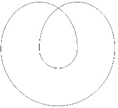

<!-- id: s12-03-0052 -->

Ce double point originel qui, à le dessiner comme étant le cercle introductif à tout abord possible de la fonction, qu’elle soit du *signifiant* ou du *signe*, est là déjà pour vous montrer que nous ne pouvons pas nous en servir comme de quelque chose qui, d’aucune façon, pourrait se réduire au terme, à une référence *ponctuelle*.

<!-- id: s12-03-0053 -->

Si le cercle est favorable à l’appréhension mythique de son rétrécissement jusqu’à quelque point zéro, il reste toujours quelque chose d’irréductible, dans une structure qui ne saurait s’anéantir à se serrer sur elle-même. Et ici, après tout encouragé par le fait que n’est point absolument tombé dans le vide, j’ai pu m’en rendre compte, ce que j’ai apporté la dernière fois, concernant *la bande de Mœbius*, dont, pour l’illustrer, donner l’éclairage qui pousse, qui commence à pousser à son plus haut point sa valeur exemplaire, je vais vous faire remarquer, dès lors l’implication.

<!-- id: s12-03-0054 -->

C’est SAUSSURE qui, parlant du *signifié*...

<!-- id: s12-03-0055 -->

> et chacun sait, qu’il n’en a point parlé d’une façon qui soit définitive, ne serait-ce
>
> qu’en raison des ambiguïtés qui se sont engouffrées par la porte de sa théorie justement en ce point ...ce qu’il en a dit de plus efficace, est assurément ceci que, *eu égard au signifiant le signifié se présente dans le rapport de l’envers à l’endroit ou comme vous voudrez de l’endroit à l’envers.*

<!-- id: s12-03-0056 -->

Et bien sûr, il y a quelque chose de cet ordre qui nous est suggéré par l’existence du signe sémantique du signe dans le langage.

<!-- id: s12-03-0057 -->

Il s’agit assurément - *adhérât-on de la façon la plus étroite à l’analyse phonématique -* il est possible de parler d’élément sonore dans l’analyse moderne de la linguistique sans le considérer comme étroitement lié - à quoi ? - à ce qu’on appelle le *meaning* et nous retrouvons ici l’ambiguïté de signification, de sens.

<!-- id: s12-03-0058 -->

Si j’ai commencé cette année mon discours par cet exemple, exemple cueilli au niveau d’*un ouvrage de grammaire* qui est un exemple dont je vous montrais que, quoi qu’il en fût de son effort vers l’*asémantisme*, du fait même d’être grammatical il n’était pas sans porter un sens. Et assurément, à ce propos, j’ai pu vous faire sentir les deux voies dans lesquelles ce qui s’appelle ici « *sens* » nous pouvions le chercher, et que l’une n’était pas l’autre.

<!-- id: s12-03-0059 -->

Et qu’à l’une, voie de la signification, que nous avions vu pouvoir se construire comme à foison et presque tellement surabondante que nous n’avions que l’embarras du choix, c’était dans la mesure où nous opérions par quelque chose, par quelque voie, et ce n’est pas indifférent de remarquer - *c’est pour ça que j’avais choisi l’exemple dans une langue étrangère -* qu’il m’était de là *plus facile*, plus naturel, de vous ramener dans *la voie de la traduction*, c’est en le traduisant en français, que j’arrivais à en faire surgir à peu près tout ce que je voulais par une procédé très simplement opératoire et tout à fait ressemblant à celui du *prestidigitateur.*

<!-- id: s12-03-0060 -->

Mais qu’autre chose était l’autre direction qui…

<!-- id: s12-03-0061 -->

> pour nous faire aboutir sans doute à l’impasse, et fermée de ce qu’est *le point de saisissement, le charme d’un texte poétique* …nous indiquait bien que ce dont il s’agissait était d’une autre dimension. Sans doute ce qu’elle a laissé dans le plan, dans la brume, dans la nuée, de cette direction *poétique* est quelque chose qui d’aucune façon ne pourrait nous paraître suffisant.

<!-- id: s12-03-0062 -->

Mais c’est ici que je vous ramène à la propriété de cette surface singulière, qui bien sûr en chaque point a un *endroit* et un *envers*.

<!-- id: s12-03-0063 -->

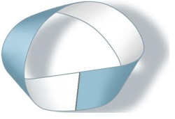

<!-- id: s12-03-0064 -->

L’important est qu’on puisse, par un certain trajet sur son contour, arriver de quelque point que ce soit, que ce soit de cet endroit, à un correspondant de l’envers. Eh bien, quand je vous ai dit : « *Le signifiant c’est essentiellement quelque chose structuré sur le modèle de la dite surface de Mœbius.* » c’est cela que ça veut dire, à savoir que *c’est sur la même face, tout en constituant endroit et envers*, que nous pouvons rencontrer le matériel.

<!-- id: s12-03-0065 -->

Le matériel qui ici se trouve *structuré de l’opposition phonématique* est ce quelque chose qui ne se traduit pas mais qui passe, qui passe d’un signifiant à une autre, dans son fonctionnement, dans le fonctionnement quel qu’il soit du langage, voire le plus hasardeux.

<!-- id: s12-03-0066 -->

C’est ce que démontre cette expérience poétique en quelque sorte, que quelque chose passe, et que c’est cela qui est le sens…

<!-- id: s12-03-0067 -->

> selon le mode où cela passe, diversement repérable et diversement pointé : c’est ce que nous allons tenter de faire …c’est cela seul qui pour nous, permet un repérage exact d’une expérience qui du seul fait d’être une expérience entièrement, non seulement de paroles mais de paroles artificielles, de paroles structurées par un certain nombre de conditions qui infléchissent la portée du discours, doit être repéré par rapport à ce que j’ai appelé tout à l’heure l’usage du langage, par quelque chose ou par quelqu’un, sujet, agent, patient, qui y sont pris.

<!-- id: s12-03-0068 -->

Alors, je vais aujourd’hui introduire… introduire une de ces formes, de ces *formes topologiques*, une de ces formes fondées sur la surface dont je vous ai donné la dernière fois l’exemple, vous introduire, vous introduire dans cette fonction, car je pense que quand même, vous avez entendu parler de *la bouteille de Klein*.

<!-- id: s12-03-0069 -->

Reprenons-la cette bouteille, approprions-la nous, et dans la *bouteille de Klein* et *bouteille de Lacan* , allons-y !

<!-- id: s12-03-0070 -->

Elle a un gros intérêt, elle nous servira beaucoup et vous allez voir pourquoi.

<!-- id: s12-03-0071 -->

Je vous rappelle que j’ai introduit la dernière fois cette remarque, que l’espace - l’espace à trois dimensions - c’est quelque chose de pas clair du tout, et qu’avant d’en parler comme des sansonnets, il faudrait voir dans quelles formes diverses nous pouvons l’appréhender, justement dans la voie mathématique qui est essentiellement combinatoire.

<!-- id: s12-03-0072 -->

Et que toute autre chose est de tenir l’affaire pour résolue avec les formes qu’on peut appeler : *formes de révolution d’une surface*, qui nous donnent quoi ? Après tout rien d’autre qu’un volume dont ce n’est pas pour rien que ça s’appelle comme ça.

<!-- id: s12-03-0073 -->

Ca s’appelle comme ça parce que c’est fabriqué sur le modèle, et ce n’est point au hasard de quelque chose qui est une surface roulée, surface où l’on fait un rouleau.

<!-- id: s12-03-0074 -->

Et bien évidemment ça remplit un certain petit *espace*. Après, vous pouvez prendre ça à pleine main et vous amuser avec :

<!-- id: s12-03-0075 -->

- faites tourner le cercle autour d’un axe, ça s’appelle une sphère. Je l’ai dit.

<!-- id: s12-03-0076 -->

- Faites tourner cette chose que j’appellerai un triangle, ou simplement un angle selon que je le limiterai ou non par une ligne qui coupe les deux côtés et vous aurez un cône, une section de cône, ou un cône infini selon les cas.

<!-- id: s12-03-0077 -->

Mais il y a des choses qui ne se comportent pas du tout comme ça, qui se passent provisoirement de tenir l’espace pour construit et qui font rudement bien. Je vous l’ai dit, *il y a trois formes fondamentales* : *le trou *- nous y reviendrons - *le tore*, et je vous ai dit *le cross-cap*.

<!-- id: s12-03-0078 -->

*Le tore*, ma foi, ça n’a pas l’air bien compliqué. Prenez *ce que vous voudrez *: *un anneau de Backgammon*, *une chambre à air* simplement, et commencez dans votre tête, à vous poser des petits problèmes.

<!-- id: s12-03-0079 -->

Par exemple celui-ci : faites-y une coupure comme celle-là, exactement comme celle-là, et si vous ne l’avez pas déjà fait, et si vous n’avez pas déjà réfléchi sur le tore, dites-moi combien ça va faire de morceaux, *par exemple*.

<!-- id: s12-03-0080 -->

Ce qui vous prouve - qu’on puisse ainsi poser ces questions - que ce n’est pas, comme je l’ai fait remarquer la dernière fois, des objets d’une intuition immédiate. Mais nous n’allons pas nous attarder *à de telles amusettes*. Je veux simplement vous faire remarquer comment, d’une façon simple et combinatoire, on construit ces figures. On les construit de la façon suivante : la forme la plus *élémentaire* qui puisse en être donnée, est celle d’une figure à quatre côtés, dont les côtés sont vectorialisés.

<!-- id: s12-03-0081 -->

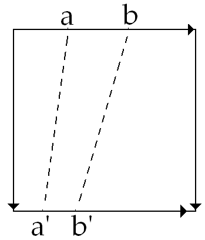

<!-- id: s12-03-0082 -->

Qu’est–ce que signifie ici la vectorialisation ? Ça signifie que nous construisons ces figures par suture, que nous cousons ce qui s’appelle ici *un bord* - je vous passe la définition intermédiaire de ce que signifie ici bord - que c’est dans le sens de la vectorialisation, c’est-à-dire qu’un point étant ici sur le vecteur qui est *le point a* aboutit à *un point a’* qui ne lui est pas correspondant d’une façon métrique mais qui lui est correspondant d’un façon ordonnée, au sens *qu’un point b* qui sera (+) dans le sens du vecteur, sera donc cousu - quel qu’il soit, et quelle que soit la distance métriquement définie de *a’* à *b’ -* cousu *au point b’*.

<!-- id: s12-03-0083 -->

Même chose pour le couple des autres côtés de la dite construction. Il n’est évidemment strictement ici carré que pour l’intelligibilité à l’œil, visuelle, gestaltique de la figure. Je pourrais aussi bien le construire, comme ceci :

<!-- id: s12-03-0084 -->

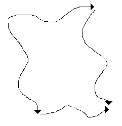

<!-- id: s12-03-0085 -->

je mettrai les mêmes vecteurs, et ça aurait exactement la même signification, pour quoi ?

<!-- id: s12-03-0086 -->

Pour construire *un tore*… Comment *un tore* se construit-il ?

<!-- id: s12-03-0087 -->

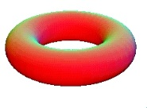

<!-- id: s12-03-0088 -->

Un tore se construit - c’est très facile à comprendre et c’est pour cela que je commence par là - …[*un tore se construit*](http://www.youtube.com/watch?v=0H5_h-RB0T8&NR=1) en suturant d’abord ce coté avec l’autre, c’est-à-dire en faisant ce qui, pour l’intuition commune est un premier cylindre, où si vous voulez, on peut supposer que l’espace dans l’intervalle a une fonction quelconque…

<!-- id: s12-03-0089 -->

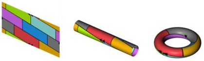

<!-- id: s12-03-0090 -->

Il y a des gens comme ça, il y a Saint THOMAS, il y a des gens qui veulent toujours bourrer les choses avec le doigt.

<!-- id: s12-03-0091 -->

C’est un type humain, ils font du boudin toute leur vie ! Enfin si vous voulez le remplir, vous aurez donc un rouleau plein et à partir de là, vous pouvez fermer ce rouleau et vous obtenez ce qui est ici dessiné.

<!-- id: s12-03-0092 -->

Qu’est-ce que ça veut dire ?

<!-- id: s12-03-0093 -->

*C’est que, dans une structure qui est d’ordre essentiellement spatial, qui ne comporte aucune histoire, vous introduisez pourtant un élément temporel*.

<!-- id: s12-03-0094 -->

Pour que ceci soit pleinement déterminé il faut que vous connotiez 1 et 1 du même chiffre, mais 2 et 2 d’un chiffre ou d’une connotation quelconque, qui implique de ne venir qu’après.

<!-- id: s12-03-0095 -->

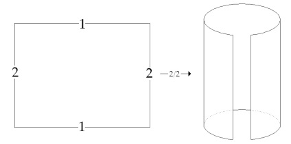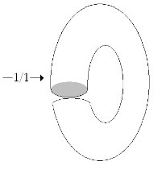

<!-- id: s12-03-0096 -->

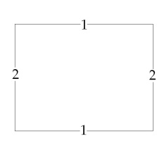 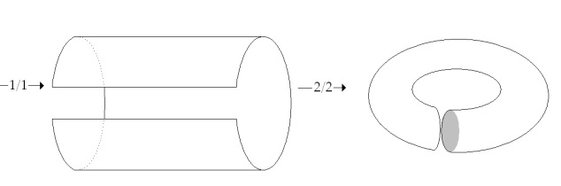

<!-- id: s12-03-0097 -->

Les deux opérations, vous ne pouvez pas les faire en même temps. Peu importe laquelle précède l’autre, ça aura toujours le même résultat : *un tore*. Mais ça ne donnera *pas le même tore*, puisqu’à l’occasion ça donnera *deux tores* l’un traversant l’autre : c’est même une de leurs plus intéressante fonctions.

<!-- id: s12-03-0098 -->

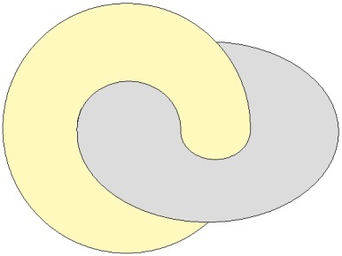

<!-- id: s12-03-0099 -->

Alors là-dessus, c’est un simple exercice introductif, qu’est-ce que c’est qu’une *bouteille de Klein* ? Une *bouteille de Klein* c’est une construction exactement *du même type*, à cette différence près que si deux des bords vectorialisés sont vectorialisés dans le même sens - c’est disons *sous le mode du tore*, donc comme le *tore*, approprié à faire un boudin - les autres bords opposés…

<!-- id: s12-03-0100 -->

> donc peu importe que l’opération de suture se fasse avant ou après l’autre, ça donnera le même résultat, mais l’opération doit être faite d’une façon successive …les deux autres bords sont *vectorialisés en sens contraire*.

<!-- id: s12-03-0101 -->

Je vais vous montrer tout de suite au tableau ce que ça donne pour ceux qui n’ont pas entendu parler encore de la *bouteille de Klein*.

<!-- id: s12-03-0102 -->

Ça donne quelque chose qui, si vous voulez, en coupe…

<!-- id: s12-03-0103 -->

> en coupe bien sûr ne voulant rien dire dans ce registre, puisque nous n’introduisons pas la troisième dimension de l’espace …c’est une façon pour l’intuition commune, pour le repérage qui est habituellement le vôtre, dans l’expérience…

<!-- id: s12-03-0104 -->

> et après tout, peut-être peut-on dire aussi la coutume car rien n’objecterait à ce que vous soit plus immédiatement accessibles et familières les dimensions de la topologie des surfaces : il suffit que vous vous y exerciez un peu, c’est même ce qui est souhaitable …[*voici ce que cela donne*](http://www.youtube.com/watch?v=E8rifKlq5hc&mode=related&search=) en coupe :

<!-- id: s12-03-0105 -->

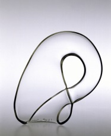

<!-- id: s12-03-0106 -->

Bon. Qu’est-ce que ça veut dire ? Ça veut dire que ceci, je vous l’ai dit, c’est en coupe, c’est-à-dire qu’il y a ici \[a\], disons, un volume qui est commun, qui a au centre, un conduit qui passe \[b\]… en d’autres termes, ceci mérite de s’appeler bouteille parce que voici ici : le corps de la bouteille \[2\], voici ici le goulot : c’est un goulot qui serait prolongé \[3\] de telle sorte que, rentrant dans le corps de la bouteille - si vous voulez, pour mieux l’accentuer, je vais vous montrer cette rentrée ici \[4a\] - il va s’insérer, *se suturer sur son fond* à cette bouteille \[4b\].

<!-- id: s12-03-0107 -->

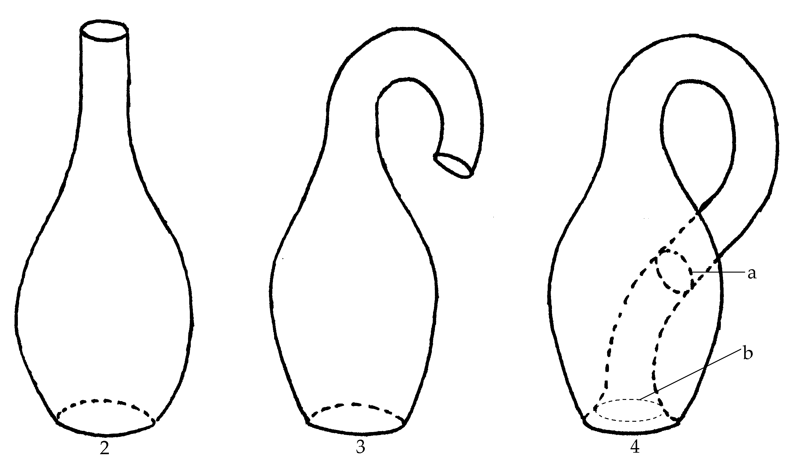

<!-- id: s12-03-0108 -->

Donc sans même recourir à ma figure, *en mots, en termes* : vous avez *une bouteille de Vichy*, *une bouteille de Vittel*, vous tordez son goulot, vous le faites traverser la paroi latérale de cette bouteille, et vous allez l’insérer sur le cul de la bouteille.

<!-- id: s12-03-0109 -->

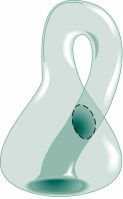

<!-- id: s12-03-0110 -->

Du même coup, cette insertion ouvre \[4b\]… vous pouvez constater que vous avez ainsi quelque chose qui se réalise, avec les caractères d’une surface complètement close : partout cette surface est close et pourtant, on peut entrer dans son intérieur, si j’ose dire, comme dans un moulin. Son intérieur communique complètement, intégralement, avec son extérieur, néanmoins cette surface est complètement close.

<!-- id: s12-03-0111 -->

Ceci ne ferait partie que de la physique amusante que bien entendu cette bouteille soit capable de contenir un liquide, et même dans les conditions ordinaires, comme je vais vous le représenter, et de ne permettre d’aucune façon qu’il se reverse au dehors, c’est-à-dire de le contenir sans même qu’on ait à se donner les soucis d’un bouchon, c’est ce que la plus simple réflexion vous permettra de concevoir.

<!-- id: s12-03-0112 -->

<!-- id: s12-03-0113 -->

Si vous redressez effectivement ceci, tel que je l’ai dessiné, et que vous le faites effectivement fonctionner comme bouteille, qui se remplit une fois qu’elle est le cul en l’air, mais si vous la retournez, vous lui mettez le cul en bas, il est bien certain que le liquide n’ira pas se répandre au *dehors*.

<!-- id: s12-03-0114 -->

Ceci, je vous le répète, n’a strictement *aucun intérêt* ! Ce qui est intéressant, c’est que les propriétés de cette bouteille sont telles que la surface en question, la surface qui la ferme, la surface qui la compose, a exactement les mêmes propriétés qu’une *bande de Mœbius*, à savoir qu’il n’y a qu’une face, comme il est facile d’en répondre et de le constater.

<!-- id: s12-03-0115 -->

Alors, comme ceci aussi peut paraître… être un petit peu du registre du *tour de passe-passe*, et que ça ne l’est pas du tout, malgré - bien entendu - que ça pourrait passer pour analogique à un effet de sens, et que ce n’est point du tout d’une façon analogique vous la matérialiser d’une façon qui soit tout à fait claire.

<!-- id: s12-03-0116 -->

Si nous partons de la sphère, que nous puissions faire d’une sphère une bouteille - c’est une chose qui n’est point du tout impossible : supposez que la sphère soit *une balle en caoutchouc*, vous la reployez, en quelque sorte ainsi sur elle-même :

<!-- id: s12-03-0117 -->

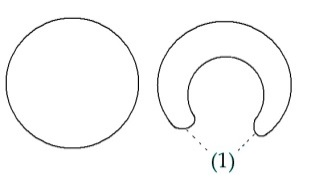

<!-- id: s12-03-0118 -->

Il n’est pas même forcé, qu’ici vous ayez ce petit retour \[1\]. C’est plus clair, vous pouvez toujours en faire une coupe *à la renfoncer en elle-même*. Je dirais même que c’est ainsi que commence le processus de la formation d’un corps animal : c’est le stade *blatusla* après le stade *morula*. Ici qu’est-ce que vous avez ?

<!-- id: s12-03-0119 -->

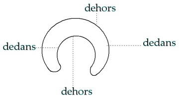

<!-- id: s12-03-0120 -->

Vous avez un dehors, un dedans, un dedans, la surface, série primitive et un dehors. Vous avez, en réalisant quelque chose qui peut être un *contenant*, vous n’avez rien codifié de la fonction des deux faces de la surface par rapport à *la sphère primitive*.

<!-- id: s12-03-0121 -->

Toute autre chose est ce qui se passe, si prenant d’abord la sphère, et, en faisant cette chose étranglée, vous prenez l’une des moitiés de la sphère et la faites rentrer dans l’autre. En d’autres termes… je schématise… Vous y êtes ?

<!-- id: s12-03-0122 -->

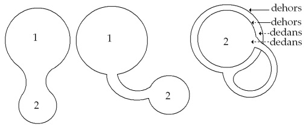

<!-- id: s12-03-0123 -->

De *l’haltère*, de *la double boule* que j’ai ici construite par étranglement de cette surface sphérique, je fais : mettez que c’est ici *la boule* 1, ce que je vais faire, *la boule* 2 est rentrée à l’intérieur. Ici vous avez le dehors primitif, le dedans, et ce qui est affronté, c’est une surface du dehors premier avec le dedans - non plus comme dans ma *blastula* de tout à l’heure - le dedans restant toujours affronté, et le dedans est ici, de la seconde partie de la surface.

<!-- id: s12-03-0124 -->

Est-ce que c’est ça une *bouteille de Klein* ? Non, pour arriver à la *bouteille de Klein* il faut *autre chose*. Mais c’est ici que je vais pouvoir vous expliquer quelque chose qui va vous montrer l’intérêt de la mise en évidence de la dite *bouteille de Klein*.

<!-- id: s12-03-0125 -->

C’est que, supposez qu’il y ait quelque rapport, *quelque rapport structural*, comme c’est tout de même bien indiqué depuis longtemps par *la constance, la permanence de la métaphore du cercle et de la sphère dans toute pensée cosmologique*, supposez que ce soit comme ça qu’il faille *construire*, pour se le représenter d’une façon saine, qu’il faille construire ce qui concerne justement *la pensée cosmologique*.

<!-- id: s12-03-0126 -->

*La pensée cosmologique* est fondée essentiellement sur la correspondance, non pas biunivoque, mais structurale, l’enveloppement du *microcosme* par le *macrocosme* :

<!-- id: s12-03-0127 -->

- que ce *microcosme* vous l’appeliez comme vous voulez : *sujet, âme,* νοῦς \[nouss\],

<!-- id: s12-03-0128 -->

- que ce *cosmos* vous l’appeliez comme vous voulez : réalité, univers…

<!-- id: s12-03-0129 -->

Mais supposez que l’un enveloppe l’autre et le contient, et que celui qui est contenu se manifeste comme étant comme le résultat de ce cosmos, ce qui y correspond membre à membre.

<!-- id: s12-03-0130 -->

Il est impossible d’extirper cette hypothèse fondamentale et c’est en cela que date une certaine étape de la pensée qui, si vous suivez ce que j’ai dit tout à l’heure, est d’un certain usage *du langage*.

<!-- id: s12-03-0131 -->

Et ceci y correspond justement dans la mesure, et uniquement dans la mesure où, dans ce registre de pensée, le microcosme, comme il convient, n’est pas fait d’une partie en quelque sorte retournée du monde à la façon dont on retourne une peau de lapin…

<!-- id: s12-03-0132 -->

> ça n’est pas tout à l’heure… comme tout à l’heure dans une *blastula* telle que je l’avais dessinée,
>
> le dedans qui est en dehors pour le microcosme …c’est bel et bien lui aussi un dehors qu’il a, et qui s’affronte au dedans du cosmos.

<!-- id: s12-03-0133 -->

Telle est la fonction symbolique de cette étape où je vous mène de la reconstruction de *bouteille dite de Klein*.

<!-- id: s12-03-0134 -->

Nous allons voir que ce schéma est essentiel, bien sûr, d’un certain mode de pensée et de style, mais pour représenter \- *je vous le montrerai dans le détail et dans les faits -* une certaine limitation, une implication *non éveillée* dans l’usage du langage.

<!-- id: s12-03-0135 -->

Le moment de l’éveil, pour autant, vous l’ai-je dit, que je le pointe, que je le repère, historialement dans le *cogito* de DESCARTES, c’est quelque chose qui n’est point immédiatement apparent, justement dans la mesure où de ce *cogito* on fait quelque chose d’une valeur psychologique. Mais si on repère exactement ce dont il s’agit, s’il est ce que j’ai dit, à savoir *la mise en évidence* de ce que la fonction du signifiant est, et n’est rien d’autre que le fait que : *le signifiant représente le sujet pour un autre signifiant*.

<!-- id: s12-03-0136 -->

C’est à partir de cette découverte que, la rupture du pacte supposé préétabli du signifiant à ce quelque chose étant rompu, il s’avère, il s’avère dans l’histoire - et parce que c’est de là qu’est partie la science - il s’avère que c’est à partir de cette rupture…

<!-- id: s12-03-0137 -->

> même si, tout de suite et simplement parce qu’on ne l’enseigne qu’incomplètement,
>
> et on ne l’enseigne qu’incomplètement parce qu’on n’en voit pas le dernier ressort …*que c’est à partir de là que peut s’inscrire une science : à partir du moment où se rompt ce parrallélisme du sujet au cosmos qui l’enveloppe* *et qui fait du sujet, psyché, psychologie, microcosme.*

<!-- id: s12-03-0138 -->

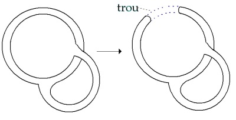

<!-- id: s12-03-0139 -->

C’est à partir du moment où nous introduisons ici une autre *suture*, et ce que j’ai appelé ailleurs un *point* *de capiton* essentiel, qui est celui qui ouvre ici un *trou* : et grâce auquel la structure de la *bouteille de Klein* alors, et seulement alors, s’instaure.

<!-- id: s12-03-0140 -->

C’est-à-dire que dans la couture qui se fait au niveau de ce trou, ce qui est noué, c’est la surface à elle-même, d’une façon telle que ce que nous avons jusqu’à présent repéré pour dehors, se trouve conjoint à ce que nous avons repéré jusque présent comme dedans, et ce qui était repéré comme dedans est suturé, noué à la face qui était repérée, jusqu’alors, comme dehors.

<!-- id: s12-03-0141 -->

> *Est-ce que c’est visible ?... Est-ce que c’est assez clair... ? Est-ce qu’on voit de là-bas, de cette façon mal éclairée ?*

<!-- id: s12-03-0142 -->

Ici nous avons ouvert un orifice traversant à la fois ce qui dans mon dessin symbolisait le *cosmos* *enveloppant*, et ce qui dans mon dessin symbolisait le microcosme enveloppé, et que c’est ça par où nous rejoignons la structure de *la bouteille de Klein*.

<!-- id: s12-03-0143 -->

> *Est-ce que vous l’avez assez vu ? Non, eh bien je vais le faire plus grand, sinon nous n’y comprendrons jamais rien. La voici complète.*
>
> *Est-ce que ça commence à se voir ? Est-ce que ça commence à se voir ?*
>
> *Est-ce que vous retrouvez l’essentiel de ce que je vous ai expliqué de tout à l’heure, la structure de la bouteille de Klein ?*
>
> *Il faut que ce tableau soit vraiment mal éclairé. Est-ce qu’il n’y a pas de la lumière, pour que je voie là-bas les personnes se pousser du col ?*
>
> *Ce serait quand même important que vous voyez ce que j’ai dessiné !*

<!-- id: s12-03-0144 -->

Je vous emmène là, par une voie difficile, et qui, vues l’heure et la nécessité de l’explication, ne vous mènera pas aujourd’hui directement sur sa relation au langage.

<!-- id: s12-03-0145 -->

Aussi bien, puisque nous n’avons plus que dix minutes, je vais essayer de vous en donner une petite explication, amusante, dont vous verrez le rapport global avec le champ de l’expérience analytique. Il y a plus d’une façon de traduire cette *construction*. Je pourrai vous y donner la figure de GAGARINE le cosmonaute. GAGARINE le cosmonaute, apparemment est bel et bien enfermé, disons pour simplifier et aller vite - nous n’avons plus beaucoup de temps - comme l’image antique, dans son petit *cosmos baladeur*.

<!-- id: s12-03-0146 -->

Du point de vue biologique, c’est d’ailleurs entre nous, permettez–moi de vous le faire remarquer au passage, quelque chose de bien curieux et qui pourrait se ponctuer par rapport à l’évolution de la lignée animale : je vous rappelle qu’il est très difficile de saisir, de saisir d’une façon un tant soit peu concevable, comment un animal qui échangeait régulièrement ce dont il avait besoin, du point de vue respiratoire, avec le milieu dans lequel il était plongé au niveau des branchies, *a réalisé cette chose absolument fabuleuse de pouvoir sortir hors de l’eau* dans le cas présent *en s’envoyant à l’intérieur de lui-même une fraction importante de l’atmosphère*.

<!-- id: s12-03-0147 -->

De ce point de vue évolutionniste, vous pouvez remarquer que GAGARINE, si tant est qu’il ait dans tout cela la moindre responsabilité, fait une opération redoublée, il s’enveloppe dans son propre poumon, ce qui nécessite qu’en fin de compte, il pisse a l’intérieur de son propre poumon, car il faut bien que tout ça se fourre quelque part !

<!-- id: s12-03-0148 -->

D’où le syllogisme que j’aurai à vous développer dans le futur parce qu’il est exemplaire, à la suite du fameux syllogisme : *Tous les hommes sont mortels, Socrate est un homme, donc Socrate est mortel*. J’ai trouvé bon, pour des usages que vous verrez mieux plus tard, mais dont l’introduction est une caricature, une cari­cature de ce fameux syllogisme sur SOCRATE, que GAGARINE… que *tous les cosmonautes sont des pisseurs, que Gagarine est un cosmonaute donc que Gagarine est un pisseur*.

<!-- id: s12-03-0149 -->

Ce qui a à peu près autant de portée que la formule sur SOCRATE… Mais laissons ceci pour l’instant. Loin que GAGARINE se contente d’être un pisseur, il n’est pas non plus un cosmonaute. Il n’est pas un cosmonaute parce qu’il ne se balade pas dans le cosmos, quoi qu’on en dise, parce que la trajectoire qui le porte était, du point de vue du cosmos, complètement imprévue et qu’on peut dire, en un certain sens, qu’aucun dieu qui ait jamais présidé à l’existence d’un cosmos n’a jamais prévu, n’a jamais connu en rien la trajectoire précise, la trajectoire nécessaire, en fonction des lois de la gravitation, et qui n’a pu littéralement être découverte qu’à partir d’un rejet absolu de toutes les évidences cosmiques.

<!-- id: s12-03-0150 -->

Tous les contemporains de NEWTON ont rejeté, *indignés*, la possibilité de l’existence d’*une action à distance*, d’une action qui ne se propage pas *de proche en proche*, parce que c’était là, jusqu’alors, la loi du cosmos, la loi de l’interaction réciproque entre ses parties.

<!-- id: s12-03-0151 -->

Il y a dans la loi de NEWTON, en tant qu’elle permet que notre petit projectile dénommé *Spoutnik* est quelque chose qui se tient d’une façon parfaitement stable, au niveau d’une loi préconçue, il y a là quelque chose *d’une nature absolument acosmique* comme d’ailleurs de ce fait, du fait même de ce point d’insertion, *tout le développement de la science moderne*.

<!-- id: s12-03-0152 -->

Et c’est en ceci que l’ouverture donc il s’agit ici, à savoir que le cosmos lui-même, que le petit cosmos qui permet à GAGARINE de subsister à travers les espaces, est quelque chose qui dépend d’une construction d’une nature profondément acosmique.

<!-- id: s12-03-0153 -->

C’est à ceci, à la sphère interne que, sous le nom de réalité, nous avons affaire dans l’analyse. *Réalité apparente* qui est celle de *la correspondance*, en apparence modelée l’une sur l’autre, *de quelque chose qui s’appelle l’âme, à quelque chose qui s’appelle la réalité*.

<!-- id: s12-03-0154 -->

Mais par rapport à cette appréhension qui reste l’appréhension psychologique du monde, la psychanalyse nous donne deux ouvertures : la première, celle qui de ce forum, de cette place de rencontre où l’homme se croit le centre du monde.

<!-- id: s12-03-0155 -->

Mais ce n’est pas cette notion de centre qui est là, la chose importante dans ce qu’on appelle, comme des perroquets « *la révolution copernicienne* », sous prétexte que *le centre* a sauté *de la terre au soleil* ce qui est un net désavantage, à savoir qu’à partir du moment où nous croyons que le centre est le soleil nous croyons du même coup aussi qu’il y a un centre absolu, ce que les Anciens, qui voyaient le soleil bouger selon les saisons, ne croyaient pas, ils étaient beaucoup plus relativistes que nous.

<!-- id: s12-03-0156 -->

Ce n’est pas ça qui est important, c’est que le psychisme, l’âme, le sujet au sens où il est employé dans la théorie de la connaissance, se représente non comme le centre mais comme la doublure d’une réalité qui du même coup devient réalité cosmique.

<!-- id: s12-03-0157 -->

Ce que la psychanalyse nous découvre c’est  *premièrement* *ce passage, ce passage* par où on arrive dans l’entre-deux, de l’autre côté de la doublure, *où cet intervalle* - cet intervalle qui a l’air d’être ce qui fonde la correspondance de l’intérieur à l’extérieur - *où cet intervalle*, et c’est là le monde du rêve, c’est « *l’autre scène* » - est aperçu.

<!-- id: s12-03-0158 -->

Le *Heimlich* de FREUD - *et c’est pour cela qu’il est en même temps l’Unheimlich -* c’est cela que cette chose, ce lieu, cette place secrète, où vous qui vous promenez dans les rues…

<!-- id: s12-03-0159 -->

> dans cette réalité singulière, si singulière que sont les rues… que c’est là-dessus que je m’arrêterai la prochaine fois
>
> pour en repartir : pourquoi est-il nécessaire de donner aux rues des noms propres ? …vous vous promenez donc dans les rues, et vous allez de rue en rue, de place en place.

<!-- id: s12-03-0160 -->

Mais un jour, il arrive que sans savoir pourquoi, vous franchissiez, invisible à vous-même, je ne sais quelle limite, et vous tombiez sur une place où vous n’aviez jamais été et que… Où pourtant… où vous-même la reconnaissez comme étant celle-là, de place, où il vous souvient d’avoir été depuis toujours et d’être retourné cent fois, vous vous en souvenez maintenant. Elle était là dans votre mémoire comme une sorte d’*îlot* à part, *quelque chose* de non repéré et qui soudain là pour vous se rassemble.

<!-- id: s12-03-0161 -->

Cette place, qui n’a pas de nom…

<!-- id: s12-03-0162 -->

> mais qui se distingue par *l’étrangeté* de son décor, par ce que FREUD pointe justement si bien,
>
> de l’ambiguïté qui fait que *Heimlich* ou *Unheimlich*, voilà un de ces mots où, dans sa propre négation,
>
> nous touchons du doigt la continuité, l’identité, de son endroit à son envers …cette place qui est à proprement parler « *l’autre scène* » parce que c’est celle où vous voyez la réalité - sans doute vous le savez - naître à cette place comme un décor.

<!-- id: s12-03-0163 -->

Et vous savez que ce n’est pas ce qui est de l’autre côté du décor qui est *la vérité* et que si vous êtes là devant la scène, c’est vous qui êtes à *l’envers du décor*, et qui touchez quelque chose qui va plus loin, dans la relation de la réalité à tout ce qui l’enveloppe.

<!-- id: s12-03-0164 -->

J’ai eu… en son temps : l’année dernière, j’ai eu l’air ou peut-être même quelque chose qui mériterait qu’on dise que j’ai médit de l’amour, quand j’ai dit que son champ *- le champ de la Verliebtheit -* c’est un champ à la fois profondément *ancré dans le réel*, dans la régulation du plaisir, et en même temps foncièrement narcissique.

<!-- id: s12-03-0165 -->

Assurément, une autre dimension nous est donnée en cette singulière conjoncture : celle dont il arrive que par les voies les plus réelles du rêve, elle soit notre compagne à l’arrivée dans ce lieu d’expérience singulière.

<!-- id: s12-03-0166 -->

Ceci est un indice de quelque chose, d’une dimension qu’assurément nul plus que le poète romantique n’a su en faire vibrer l’accent.

<!-- id: s12-03-0167 -->

Il est d’autres voies encore pour nous le faire entendre, c’est celui du *non-*sens, celui d’*Alice* [^24], non pas *in wonderland*, mais justement ayant opéré ce *franchissement*, ce franchissement impossible, dans la réflexion spéculaire qui est le passage au-delà du miroir, c’est cela, \[...\] se présente pour être celle qui peut venir à cette singulière rencontre \[...\] c’est cela qui, dans *une autre dimension* - je l’ai dit, explorée par l’expérience romantique - c’est cela qui s’appelle, *avec un autre accent*, *l’amour*.

<!-- id: s12-03-0168 -->

Mais à revenir de ce lieu, et pour le comprendre, et pour qu’il ait pu être saisi, pour qu’il ait pu même être découvert, pour qu’il existe dans cette structure, qui fait qu’ici se rencontre *la structure* de deux faces apposées qui permettent de constituer cette « *autre scène* », il faut qu’ailleurs ait été réalisée la structure d’où dépend l’acosmisme du tout, à savoir que *quelque part*, ce qui s’appelle la structure, *la structure du langage est capable de nous répondre*.

<!-- id: s12-03-0169 -->

Non pas bien sûr, il ne n’agit pas là d’aucune façon de quelque chose qui préjuge de l’adéquation absolue du langage au *réel*, mais de ce qui, comme langage, introduit dans le *réel* tout ce qui nous y est accessible d’une façon opératoire.

<!-- id: s12-03-0170 -->

*Le langage entre dans le réel et il y crée la structure.* Nous participons à cette opération et y participant nous sommes inclus impliqués dans une topologie rigoureuse et cohérente, telle que toute découverte, toute porte poussée, décisive en un point de cette structure, ne saurait aller sans le repérage dans l’exploration stricte, sans l’indication définie du point où est l’autre ouverture.

<!-- id: s12-03-0171 -->

Ici il me serait facile d’évoquer le passage incompris de VIRGILE à la fin du *Chant VI* [^25] : les deux portes du rêve, elles sont exactement là inscrites, « *porte d’ivoire* », dit-il et « *porte de corne* » :

<!-- id: s12-03-0172 -->

- la « *porte de corne* » qui nous ouvre le champ sur ce qu’il y a de vrai dans le rêve… et c’est *le champ du rêve*,

<!-- id: s12-03-0173 -->

- et la « *porte d’ivoire* » qui est celle par où sont renvoyés ANCHISE et ENÉE avec la SIBYLLE *vers le jour* : c’est celle par où passent les rêves erronées.

<!-- id: s12-03-0174 -->

*Porte d’ivoire du lieu du rêve* le plus captivant, du rêve le plus chargé d’erreurs, c’est *le lieu* où nous nous croyons être une âme subsistante au cœur de la réalité.

## Notes

[^21]: La conchyliologie est la branche des sciences naturelles consacrée à l'étude des « mollusques à coquille » \[*sic*\].

[^22]: Georg Wilhelm Friedrich Hegel : *Phénoménologie de l'Esprit*, Paris, Aubier Montaigne, 1998.

[^23]: Ogden and Richards : *The Meaning of meaning*. Harcourt, 1989.

[^24]: [Lewis Carroll : De l'autre côté du miroir](http://www.ebooksgratuits.com/pdf/carroll_de_autre_cote_miroir.pdf), Paris, Aubier Flammarion Bilingue, 1971.

[^25]: [Virgile, Enéide](http://bcs.fltr.ucl.ac.be/Virg/V06-679-901.html), Paris, Les Belles Lettres, I et II, 2002 et 2003 :

    « *Il existe deux Portes du Sommeil ; la première, dit-on, est de corne, et donne un accès facile aux ombres véritables ;* *l'autre est faite d'un ivoire éclatant, et resplendit,*

    *mais c'est par elle que les Mânes envoient vers le ciel des songes trompeurs. Tout en parlant ainsi, Anchise reconduit à cet endroit son fils et la Sibylle,*

    *et les fait sortir par la porte d'ivoire. Énée coupe au plus court vers ses navires et retrouve ses compagnons.* »
