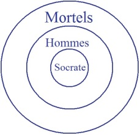
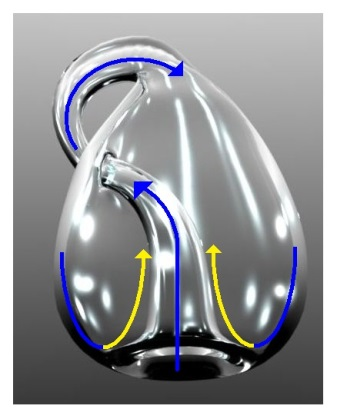
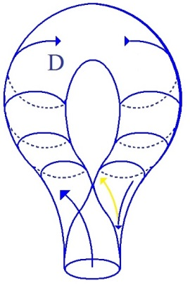
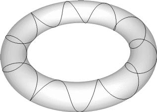
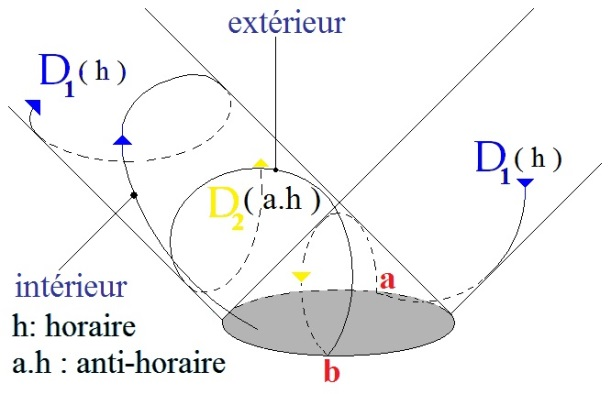
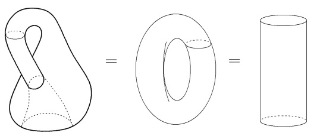
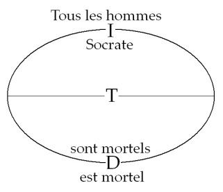
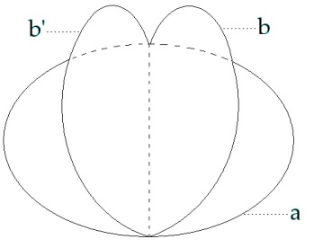
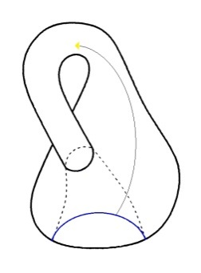
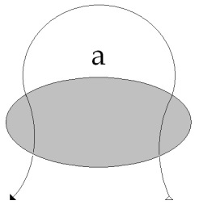

# Leçon 06 | 20 Janvier l965

<!-- source-url: http://staferla.free.fr/S12/S12 PROBLEMES.docx -->
<!-- seminar: s12 -->
<!-- lesson: 06 -->

<!-- id: s12-06-0001 -->

Il me faut avancer dans ce *problème pour la psychanalyse* qui est celui de *l’identification*.

<!-- id: s12-06-0002 -->

*L’identification* qui représente dans l’expérience, dans le progrès, le pas que j’essaie ici de vous faire franchir dans la théorie, l’écran qui nous sépare de cette visée qui est la nôtre parce qu’irrésolue, et que nous avons pointée l’année dernière comme étant le moment nécessaire sans quoi reste en suspens la qualification de la psychanalyse comme science, j’ai dit *le désir du psychanalyste*.

<!-- id: s12-06-0003 -->

*L’identification*, j’essaie dans une topologie, de rattraper en une sorte de faisceau, de rassemblement de fils plus simples que tout ce dont vous témoigne les tours et les détours, le labyrinthe de la logique moderne pour autant qu’entre *Classes, relations et nombres* [^41], *elle voit se dérober devant elle, à la façon de la muscade sous les trois gobelets, ce qu’il s’agit de saisir concernant l’énonciation de l’identique*.

<!-- id: s12-06-0004 -->

Aussi bien, pour faciliter votre accès à notre chemin d’aujourd’hui vais-je partir de la forme la plus vulgarisée depuis deux siècles, à cerner - c’est le cas de le dire - ce problème de *l’identification* : *l’image du cercle d’Euler*, si saisissante qu’il n’est nul étudiant qui, à avoir ouvert, s’être approché d’un livre de logique, ne puisse - si je puis dire - se dépêtrer de *sa simplicité*.

<!-- id: s12-06-0005 -->

Elle est fondée en effet sur le plus structural, et si elle est trompeuse c’est précisément d’assurer sur ce qu’on appelle un point particulier, un point privilégié de la topologie, sa fausse simplicité. Le cercle qui définit la classe, cercle lui-même inclus, exclus, se recoupant, avec un autre cercle voire plusieurs, eux–mêmes censée représenter les attributs de la classe à identifier.

<!-- id: s12-06-0006 -->

Ai-je besoin de reproduire au tableau ce qui déjà je pense, a été tracé lorsqu’aux première fois j’ai abordé le syllogisme dont la conclusion : « *Socrate est mortel* », *Socrate*… *les hommes*… *les mortels*…

<!-- id: s12-06-0007 -->

<!-- id: s12-06-0008 -->

Cet extraordinaire attrape-nigaud forgé par EULER selon la mode de l’époque, il y a eu un grand bon siècle…

<!-- id: s12-06-0009 -->

> c’est l’envers \[Euler : 1707-83\] de ce qu’on a appelé par ailleurs le siècle du génie \[XVIIème siècle\] …à s’être fascinés - comme les ouvrages en témoignent, innombrables à être parus dans ce siècle sur ce sujet - à s’être fascinés sur cet ouvrage apparemment impensable pour eux qu’était l’éducation des femmes.

<!-- id: s12-06-0010 -->

C’est pour une femme, une princesse de surcroît[^42],qu’ont été forgés ces cercles d’EULER qui meublent maintenant vos manuels.

<!-- id: s12-06-0011 -->

Une telle préoccupation, si tenace, recèle toujours une sous-estimation du sujet visé, qui porte assez ces marques dans tous les ouvrages qui s’intitulent de cette fin, et aussi bien je pense, c’est dans la mesure où EULER, qui n’était point un esprit médiocre, pensait qu’il s’adressait à un double titre *à une demeurée*, qu’il a mis en circulation ces cercles captivants, mais dont j’espère vous montrer qu’ils laissent échapper tout l’essentiel de ce qu’ils entendent cerner.

<!-- id: s12-06-0012 -->

Aussi bien, n’est-il pas surprenant que ce soit en un temps où la figure était en quelque sorte intégrée à l’image mentale commune de la sphère, qu’on puisse agir avec un cercle - comme on fit au temps romain du [*cercle de Popilius*](http://fr.wikipedia.org/wiki/Gaius_Popilius_Laenas) - sans se soucier qu’il apparaît, à réfléchir, que ce cercle, selon la surface sur laquelle il est tracé, délimite des champs de valences qui peuvent être bien différentes, et quant à ce qu’il en est de la sphère, il délimite exactement la même chose, à l’extérieur et à l’intérieur : si petit que vous traciez le cercle autour de moi, je puis dire que *ce que vous enfermez c’est tout le reste* de la machine ronde. Euler

<!-- id: s12-06-0013 -->

Faisons donc un peu attention avant de manier le cercle et surtout n’oublions pas que son mérite majeur en l’occasion, est de nous donner, par sa *forme*, une sorte de substitut de ce que j’ai appelé, dans le sens où je l’ai fait venir, la *compréhension,* dans le double sens de :

<!-- id: s12-06-0014 -->

- la compréhension vraie, conceptuelle, du *Begriff*, ce sur quoi le *Begriff* se referme, c’est *cette prise dont le cercle donne l’image* en tant que - je l’y ai ai introduit la dernière fois - il est la coupe de cette partie torique de notre surface sur laquelle va porter notre discours d’aujourd’hui en partie.

<!-- id: s12-06-0015 -->

- Et d’autre part *donnant seulement de cette compréhension une image*, qui est d’ailleurs *support de tous les leurres *, et en particulier :

<!-- id: s12-06-0016 -->

> – qu’« *extension* » et « *compréhension* » peuvent être confondues,
>
> – que dans le cercle on imagine *l’ensemble numérique* des objets sans mettre l’accent sur les *conditions* qu’implique
>
> l’entrée en jeu du *nombre* et qui sont radicalement différentes des *caractéristiques classificatoires*,
>
> au moins dans ce qui nous permet de l’appréhender dans *la fonction de signification*.

<!-- id: s12-06-0017 -->

Le repérage numérique est d’un autre ordre. c’est là un champ sur lequel je ne m’engagerai pas aujourd’hui, pour la raison que c’est proprement le type de question que j’ai voulu réserver à la partie fermée de ce cours, qui prendra nom de séminaire.

<!-- id: s12-06-0018 -->

Je veux dire que *l’homologie de la fonction que prend le nom de « nombre »* - *le nom de « nombre »* en tant qu’il ne saurait être distingué de la fonction du nombre entier - *l’homologie*  au sens où il est plus *frappant* encore, plus *nécessaire* que dans les indications que j’ai pu déjà commencer de vous donner de *la fonction du nom*, en tant qu’il couvre quelque chose, qu’il couvre précisément un cercle mais d’une nature très spéciale, *ce cercle* privilégié qui marque le niveau *de réflexion* de la surface de *la bouteille de Klein* en tant qu’elle est *surface de Mœbius*.

<!-- id: s12-06-0019 -->

Le nombre, vu son *corps,* occupe là d’une façon évidente, évidente à l’analyse de sa structure pour les problèmes qu’il pose au mathématicien, vous savez que le mathématicien, dans son élan moderne, ne saurait tolérer qu’aucun point de son langage ne puisse, ne soit construit de telle sorte qu’il saisisse plusieurs sortes d’objets hétérogènes à la fois.

<!-- id: s12-06-0020 -->

Les « *privilèges* », les « *résistances* » de la fonction du nombre entier, à cette généralisation mathématique…

<!-- id: s12-06-0021 -->

> je mets ici des termes entre guillemets, pour ne pas introduire de références plus techniques …voilà ce qui fait problème au mathématicien, ce qui l’a poussé à des efforts considérables - *la question est de savoir s’ils ont réussi* - pour homogénéiser *la fonction du nombre* à celle *des classes*. C’est ce qui, j’espère, sera traité lors de notre prochaine rencontre, rencontre fermée, ici au niveau du séminaire.

<!-- id: s12-06-0022 -->

Qu’il me suffise ici d’indiquer, en connexion avec la figure du cercle, qu’on aboutit - et justement à suivre *la recherche mathématique -* qu’*on aboutit à un schéma strictement homologue de celui qu’ici j’avance en vous donnant le signifiant pour représentant le sujet pour un autre signifiant*.

<!-- id: s12-06-0023 -->

La théorie mathématique...

<!-- id: s12-06-0024 -->

> qui représente à la fois la solution - c’est ce que je mets en question - et la butée, peut-être-est-il plus vrai de le dire,
>
> de cette tentative *de réduire, de résoudre la fonction du nombre entier dans le langage mathématique* …aboutit à la formule suivante, schématisée exactement de la même façon que je vous montre : comment en quelque sorte *le sujet* *se véhicule de signifiant à signifiant*, chaque représentant *signifiant* pour celui qui le suit, c’est - sous le 1 - du 0 qu’il s’agit pour la suite, des 1 qui vont venir : 1/0 – 1– 1n.

<!-- id: s12-06-0025 -->

Autrement dit, la découverte conditionnée par *la recherche logico-mathématique la plus récente*, la découverte, comme nécessaire :

<!-- id: s12-06-0026 -->

- que le 0, le manque, est la raison dernière de la fonction du nombre entier,

<!-- id: s12-06-0027 -->

- que le 1 originellement le représente,

<!-- id: s12-06-0028 -->

- et que *la genèse de la dyade* est pour nous fort distincte de la genèse platonicienne, en ceci que *la dyade est déjà dans le* 1, pour autant que *le* 1 *est ce qui va représenter le* 0 *pour un autre* 1.

<!-- id: s12-06-0029 -->

*Chose singulière*, ceci qui fait et qui porte en soi sur tout nombre *n* *la nécessité du n+1*, justement de ce 0 qui s’y ajoute, *chose extraordinaire*, il a fallu les longs détours de l’analyse mathématique pour quelque chose qui se donne au niveau de l’expérience de l’enfant, pour l’infatuation des pédagogues pour avoir mis au niveau des tests de *moins-value mentale, d’insuffisant développement*, l’enfant qui dit :

<!-- id: s12-06-0030 -->

> « *J’ai trois frères, Paul, Ernest et moi.* »[^43]

<!-- id: s12-06-0031 -->

Comme si justement ce n’était pas de *cela qu’il s’agit*, à savoir que « *moi* », ici, doit être à deux places :

<!-- id: s12-06-0032 -->

- à la place de la série des frères,

<!-- id: s12-06-0033 -->

- et aussi à la place de celui qui énonce.

<!-- id: s12-06-0034 -->

L’enfant là-dessus en sait plus que nous, et essayant récemment de reproduire avec mon petit-fils et, en quelque sorte *pour mettre à l’épreuve*, honnêtement, avec une petite fille de quatre ans et demi, les premiers balbutiements, non pas de l’énonciation du nombre mais de sa mise en usage, j’ai pu être surpris que nulle part PIAGET ne tire parti - *lui qui assurément est loin de manquer d’une suffisante culture dans le domaine de la logique* - que nulle part PIAGET ne tire parti de ceci qu’on fait jaillir, et précisément au niveau où il prétend réduire l’abord du petit enfant - concernant la numération des objets - à un tâtonnement *sensori-moteur* [^44].

<!-- id: s12-06-0035 -->

Précisément, avec une petite fille de 4 ans et demi - c’est probablement 5 - je dis probablement parce qu’on n’est jamais sûr - qui ne sait compter au-delà de la dizaine, jouant avec elle selon les formules piagétiques elles-mêmes, à savoir avec ce fameux : « *couverts, couteaux et assiettes* » qu’il s’agit de faire s’apparier précisément suivant les voies définies théoriquement par la première formation du nombre. Tout de même, la mettant à l’épreuve du comptage *devant trois verres, la petite me dit* : – « *Quatre* ».

<!-- id: s12-06-0036 -->

– *Voyons, vraiment ?*

<!-- id: s12-06-0037 -->

– *Oui dit-elle  : un, deux, trois, quatre !* Sans aucune espèce d’hésitation !

<!-- id: s12-06-0038 -->

Le quatre, c’est son 0 à elle en tant que c’est à partir de ce 0 qu’elle compte, parce que, toute de quatre ans et demi qu’elle est, elle est déjà le petit cercle, le trou du sujet.

<!-- id: s12-06-0039 -->

Ce cercle… ce cercle dont j’ai recherché ce matin, ou plutôt fait demander à quelqu’un de me rechercher ce fameux texte de PASCAL que je ne voulais pas évoquer ici pour vous prier de vous y reporter, sans l’avoir relu moi-même… Grâce aux soins des innombrables universitaires qui se sont chargés de donner chacun leur reclassement personnel de ces [*Pensées*](http://abu.cnam.fr/cgi-bin/donner_html?penseesXX1) qui nous ont été livrées selon un dossier dont le désordre se suffisait bien à soi tout seul, il faut en général trois quarts d’heure pour retrouver dans n’importe laquelle de ces éditions la citation la plus simple.

<!-- id: s12-06-0040 -->

Les trois quarts d’heure, quelqu’un les a dépensés à ma place, ce qui me permet de vous signaler que dans la grande édition, l’édition HAVET, c’est à la page 72 des [*Pensées*](http://gallica.bnf.fr/ark:/12148/bpt6k57717b.capture) que vous verrez la référence à cette fameuse : « *sphère infinie* [^45] *dont le centre est partout et la circonférence nulle part* ».

<!-- id: s12-06-0041 -->

Ceci est important parce que *Dieu sait que* PASCAL *est notre ami*, et notre ami, si je puis dire, à la façon dont l’est celui qui nous guide dans tous nos pas : le névrosé qu’il était. Ce n’est pas là le diminuer. Vous savez bien qu’ici ce n’est pas dans la note de la psychopathologisation du génie que nous donnons, mais enfin il suffit d’ouvrir les *Mémoires* de sa sœur, pour voir à quel point son angoisse et ses abîmes et toute cette horreur dont il était environné, a pu prendre racine dans l’aversion dont il témoigne si précocement, et dont il est si frappant de voir témoigner par sa sœur, qu’assurément, nous en témoignant - c’est évidemment la meilleure condition pour donner crédit au témoignage - elle ne comprend absolument rien de ce qu’elle dit [^46], l’horreur, *poussée jusqu’à la panique, jusqu’à la crise, à la crise noire, aux convulsions,* de PASCAL, chaque fois qu’il voyait s’approcher le couple parental amoureux, de son lit, est tout de même quelque chose dont il y a lieu de tenir compte à condition bien sûr, d’être en état de se poser la question de savoir quelles limites la névrose doit imposer au sujet.

<!-- id: s12-06-0042 -->

Ce ne sont pas forcément des limites d’adaptation comme on le dit, mais peut-être de détours métaphysiques et c’est pour cela que ce même homme, à qui nous devons cet exemple de prodigieuse audace qu’est ce fameux « *pari* » sur lequel on a dit tant de sottises, jusque du point de vue de *la théorie de la probabilité*, mais dont il suffit de s’approcher pour voir que c’est précisément la tentative désespérée de résoudre la question que nous essayons de soulever ici : celle du désir comme désir du grand Autre.

<!-- id: s12-06-0043 -->

Ceci n’empêche pas ni que cette solution soit un échec, ni non plus que PASCAL, au moment où il nous formule sa « *sphère infinie dont le centre est partout* », ne se démontre précisément achopper sur le plan métaphysique. Quiconque est *métaphysicien* sait que c’est le contraire, et que s’il y a sphère infinie - ce qui n’est pas démontré assurément de la surface dont il s’agit - ce qui est circonférenciel est partout et le centre n’est nulle part.

<!-- id: s12-06-0044 -->

C’est ce dont j’espère vous convaincre à l’appréhension de cette topologie.

<!-- id: s12-06-0045 -->

En effet, pour reprendre ce que la dernière fois je vous signalais, si c’est le jeu de cette surface qui commande ce qui se passe au niveau du sujet, si le sujet est à concevoir comme butée par les enveloppements mais aussi les reversions, les points de reversion de cette surface, pas plus que la surface elle-même, si je puis dire, ces points de réversion il ne les connaît.

<!-- id: s12-06-0046 -->

C’est bien de ce qu’impliqué dans cette surface il ne puisse, de ce cercle de rebroussement, connaître en étant lui-même, que la question se pose *d’où* nous pouvons saisir *la fonction de ce cercle privilégié* dont - je vous l’ai dit - il n’est point à concevoir d’une façon intuitive, il n’est pas besoin qu’il soit un cercle.

<!-- id: s12-06-0047 -->

Il est possible à atteindre - tout comme un cercle - par une coupure, mais observez que si vous pratiquez cette coupure, la surface n’a plus rien de *sa spécificité* : tout se perd, la surface se présente égale en tout, semblable à un tore auquel vous auriez pratiqué la même coupure.

<!-- id: s12-06-0048 -->

La question de ce qui se passe au niveau du *cercle de réversion*, voilà ce que, aujourd’hui je veux essayer de vous faire approcher, pour autant que nous y pouvons « *saisir* »…

<!-- id: s12-06-0049 -->

> je passe le terme, je le mets entre guillemets pour me faire entendre …le modèle de ce qui est mis en question pour nous par la fonction de l’identification.

<!-- id: s12-06-0050 -->

La dernière fois j’ai rappelé que *les spires d’une trace* poursuivie sur la surface externe de *la bouteille de Klein*…

<!-- id: s12-06-0051 -->

<!-- id: s12-06-0052 -->

> que vous voyez ici représentée entière à gauche, représentée seulement partiellement à droite, à savoir sur le point
>
> qui nous intéresse aux abords de ce que je viens d’appeler *cercle de réversion*, ou *de rebroussement* comme vous l’entendez …*les spires de la demande avec leur répétition* sur un tore ordinaire…

<!-- id: s12-06-0053 -->

> comme je l’ai longuement développé autrefois[^47] et précisément en relation avec *la structure du névrosé*

<!-- id: s12-06-0054 -->

<!-- id: s12-06-0055 -->

…arriveront à revenir sur elles-mêmes, se recoupant ou ne se recoupant pas, mais même sans avoir à se recouper, simplement *se poursuivant*, comme il est facile de le figurer, une fois le pourtour du tore accompli, *s’insérant* à l’intérieur de ces spires précédentes, pourra se poursuivre indéfiniment sans que jamais apparaisse dans le compte des tours, cette suite de tours supplémentaires, accomplis de faire le tour du tore et le tour, si vous le voulez, de son trou central.

<!-- id: s12-06-0056 -->

Ici, dans la *bouteille de Klein* que voyons-nous se produire ?

<!-- id: s12-06-0057 -->

Je vous l’ai déjà dit la dernière fois, et *le schéma* que je viens de vous figurer aujourd’hui vous le montre : par une nécessité interne à la courbe, ces tours de la demande, de devoir nécessairement sur le cercle de reversion se réfléchir d’un bord à l’autre de ce cercle pour rester à la surface même, au point, dans le champ de la surface où elle se trame, viendra, nécessairement ayant franchi…

<!-- id: s12-06-0058 -->

> selon - là vous le voyez, je vous en ai représenté l’incidence minimale - selon, pour vous, à vos yeux, un demi-cercle …ayant franchi cette passe, devant toujours le franchir selon un nombre impair de ces demi-cercles, reparaîtra de l’autre côté torique de la *bouteille de Klein* *dans une giration en sens contraire* :

<!-- id: s12-06-0059 -->

  

<!-- id: s12-06-0060 -->

ce qui était *à droite* \[ici vers la gauche, en bleu\], puisque c’est de là que nous faisons partir, comme vous l’indiquent les pointes de flèche qui *vectorisent* ce trajet - *à droite*, disons que nous tournons *dans le sens des aiguilles d’une montre* \[h\], si nous nous plaçons convenablement, gardant la même place, c’est *en sens inverse des aiguilles d’une montre* \[**ah**, ici en jaune\], que vient à opérer le mouvement de la spirale.

<!-- id: s12-06-0061 -->

Or ceci, ceci est pour nous, en quelque sorte de la faveur ici touchée que nous présente cette figure topologique : elle nous livre le nœud, si je puis dire intuitif, puisque je vous le représente par une figure…

<!-- id: s12-06-0062 -->

> mais qui n’a nul besoin de cette figure, que je pourrai simplement, d’une façon qui vous serait plus obscure, plus opaque, faire supporter pour vous par une disposition réduite de quelques symboles algébriques en y ajoutant des vecteurs et qui serait beaucoup plus opaque pour votre représentation …cette figure donc, avec son appel intuitif, je la destine à vous permettre de saisir la cohérence qu’il y a en ce point…

<!-- id: s12-06-0063 -->

> si nous le définissons, le déterminons comme cernant les conditions,
>
> les faveurs, mais aussi les ambiguïtés et donc les *leurres,* de *l’identification* …de vous faire saisir aussi la connexion de *ce point*, et *qui lui donne son vrai sens* avec ce que nous constatons dans notre expérience, *ce qui est pour nous la clinique, la clinique analytique*, ce qui est pour nous tellement forcé que nous avons dû y modeler notre langage, *à savoir la réversibilité essentielle de la demande* et ce qui fait que dans le jeu dynamique complexuel, il n’y a point par exemple de *fantasme de dévoration* que nous ne tenions pour impliquant, nécessitant à quelque moment - qui hors de cette théorie reste obscur - en son inversion propre, je dis résultant en cette inversion et commandant le passage au *fantasme d’être dévoré*.

<!-- id: s12-06-0064 -->

Saisir la cohérence…

<!-- id: s12-06-0065 -->

> avec le point focal, avec toutes les déterminations que va nous permettre de nouer la localisation de ce point focal …*saisir la cohérence de ce fait d’expérience avec* ce que nous appelons tellement confusément *l’identification*, du même coup, précise ce qu’il en est de cette identification telle ou telle, de celle-ci et de pas une autre, voilà dans quoi nous avançons et qui commande notre pas.

<!-- id: s12-06-0066 -->

Une chose est assurée : je vous ai parlé des spirales de la demande, vous me permettrez de ne pas motiver plus, puisque aussi bien c’est quelque chose d’accessible, je veux dire de pas trop difficile à m’accorder, simplement à en faire l’épreuve des conséquences.

<!-- id: s12-06-0067 -->

Je ne puis pas ici poursuivre *un discours qui s’astreigne* - sauf à transformer tout à fait la nature de ce que je vous enseigne – à ne pas faire de saut logique.

<!-- id: s12-06-0068 -->

Ce que nous appellerons *un énoncé*…

<!-- id: s12-06-0069 -->

> au sens où il nous intéresse, au sens où il a des incidences d’identification,
>
> je dis là non pas d’identification analytique, mais d’identification analytique et conceptuelle …c’est quelque chose qu’en effet nous voulons bien symboliser par un cercle.

<!-- id: s12-06-0070 -->

À ceci près que notre topologie nous permet de le distinguer strictement du *cercle d’Euler *:

<!-- id: s12-06-0071 -->

- à savoir qu’il n’y a pas à élever contre lui *l’objection* que nous avons pu élever tout à l’heure,

<!-- id: s12-06-0072 -->

- à savoir que ce cercle, faute de préciser sur quelle surface il est porté, peut définir deux champs strictement équivalents à l’intérieur et à l’extérieur !

<!-- id: s12-06-0073 -->

En outre *le cercle d’Euler*, pour être porté apparemment sur un plan - je veux dire qu’à cet endroit, rien n’est précisé - *a tout de même manifestement cette portée de devoir se réduire à un point.* Un cercle qui, à la façon des spires de notre demande, fait le tour de la partie torique, qu’elle soit du *tore* ou de la *bouteille de Klein,* c’est un cercle qui n’a pas cette propriété, ni l’une ni l’autre.

<!-- id: s12-06-0074 -->

<!-- id: s12-06-0075 -->

D’abord il ne définit pas de champs équivalents pour la bonne raison qu’il n’en définit qu’un seul : ouvrir *la bouteille* ou ouvrir *le tore*, à l’aide d’une coupure ainsi circulaire, c’est simplement en faire *un cylindre* dans les deux cas. En outre, ce cercle n’est point *réductible* *à un point*.

<!-- id: s12-06-0076 -->

Ce qui nous intéresse, c’est à quoi peut nous servir ce cercle ainsi défini. C’est précisément ce cercle qui va nous servir à discerner ce qui nous intéresse quant aux fonctions de *l’identification*. Disons que, selon ce cercle - qui comme vous le voyez, est une coupure, n’est plus un bord - nous allons essayer de voir ce que deviennent nos propositions à nous, celles qui nous intéressent : les propositions de *l’identification*.

<!-- id: s12-06-0077 -->

Comme je vous l’ai déjà montré une fois, à mettre en pratique, nous pouvons - la proposition *prédicative*, comme on dit pour la caractériser grammaticalement - l’inscrire, puisque c’est la proposition la plus simple, celle qui dans la tradition s’est présentée la première concernant l’identification, nous pouvons l’inscrire sur le pourtour de ce cercle.

<!-- id: s12-06-0078 -->

Nous pouvons de ce cercle ainsi écrit, tel qu’il est là par exemple :

<!-- id: s12-06-0079 -->

<!-- id: s12-06-0080 -->

> ne tenez compte encore ni des lettres ni de la fonction de cette ligne diamétrale …nous pouvons écrire : « *Tous les hommes sont mortels.* ». Le « *sont mortels* » aurait dû être écrit à la suite, j’aurais dû aussi l’écrire à l’envers mais ça n’aurait rien ajouté. Nous pouvons aussi écrire : « *Socrate est mortel* ». Il s’agit de savoir ce que nous faisons en articulant ces énoncés, que selon les cas nous appellerons *prédication*, *jugement*, ou *concept*.

<!-- id: s12-06-0081 -->

C’est ici que peut nous servir le cas particulier où ce cercle opère en devant se réfléchir sur ce que j’ai appelé tout à l’heure le cercle de rebroussement dans *la bouteille de Klein*.

<!-- id: s12-06-0082 -->

<!-- id: s12-06-0083 -->

Vous voyez alors, qu’à figurer en bleu ce cercle de rebroussement \[a\], l’autre cercle est fait d’une ligne qui vient se réfléchir sur son bord \[b\], pour reprendre son tracé sur l’autre partie de la surface \[b’\], sur celle que sépare de la première, *le cercle de rebroussement*.

<!-- id: s12-06-0084 -->

Mais s’il en est ainsi, *la première moitié du cercle, celle qui était extérieure à la première moitié* de la surface telle que je viens ainsi de la définir, *se poursuit au contraire à l’intérieur de la même surface*, si nous considérons que l’intérieur c’est ça : l’intérieur de *la bouteille de Klein* \[flèche\].

<!-- id: s12-06-0085 -->

<!-- id: s12-06-0086 -->

Bref que *les deux moitiés du cercle à ce niveau ne sont point homogènes*, que ce n’est pas dans le même champ…

<!-- id: s12-06-0087 -->

> sauf à tout prix vouloir s’aveugler comme c’est la fonction du logicien formel …que ce n’est pas dans le même champ, du point de vue de l’identification au sens où elle nous intéresse :

<!-- id: s12-06-0088 -->

- que se posent le « *tous les hommes* » et le « *sont mortels* »,

<!-- id: s12-06-0089 -->

- que se posent le « *Socrate* » et le « *est mortel* »,

<!-- id: s12-06-0090 -->

- qu’il n’est point dit à l’avance que le SOCRATE ne doit point être distingué dans sa fonction même, logique, de ce qui serait le sujet d’une classe simplement définie comme prédicative.

<!-- id: s12-06-0091 -->

Et qui ne sent qu’il ne s’agit de toute autre chose, à dire que « *un homme* » ou « *tous les hommes* » *sont mortels,* qu’il ne s’agit de toute autre chose que de définir par exemple « *la classe des oies blanches* » ?

<!-- id: s12-06-0092 -->

Il y a une distinction radicale qui s’impose ici - que nous appuierons avec le vocabulaire philosophique comme nous pourrons - que la distinction des *qualités* par exemple, et d’un *attribut* n’est assurément pas homogène, ce qui n’est pas dire d’ailleurs que « *la classe des oies blanches* » ne nous pose pas de problème, pour autant que l’usage de la métaphore nous donnera du fil à retordre à calculer ce qu’il en est de la priorité de l’oisellerie ou de la blancheur.

<!-- id: s12-06-0093 -->

Et assurément « *la classe des oies blanches* » peut se réduire d’une autre façon que celle de la définition qui nous fait articuler que « *tous les nommes sont mortels* » : parlant de tous les hommes comme mortels, nous ne parlons pas d’une classe qui spécifie, parmi les autres, les mortels humains. Il y a une autre relation de l’homme à l’être mortel et c’est précisément cela qui est en suspens à propos de la question de SOCRATE.

<!-- id: s12-06-0094 -->

Car nous pouvons nous lasser d’évoquer les problèmes qui peuvent nous paraître rebattus et sentir *leur odeur d’école* sur ce qu’il en est de *l’universelle affirmative*, à savoir : y a-t-il *un universel* de l’homme, ou l’homme dans l’occasion veut-il simplement dire, comme s’efforce de le poser *la logique de la quantification, n’importe quel homme*. *C’est que ça n’est pas du tout la même chose !*

<!-- id: s12-06-0095 -->

Mais aussi bien, *puisque on en est encore aux débats de l’école sur ce thème,* peut-être que nous, qui sommes un peu plus pressés et qui pouvons peut-être soupçonner qu’il y a quelque part *fourvoiement*, nous reposerons la question au niveau du nom propre et demanderons si cela va tout seul, même étant admis que « *tous les nommes sont mortels* » que ce soit une vérité qui se porte assez elle-même pour que nous ne débattions pas du sens de la formule, si partant de là, il est légitime de dire, d’en conclure, d’en déduire que SOCRATE est mortel.

<!-- id: s12-06-0096 -->

Car nous n’avons pas dit : «* L’homme quelconque qui s’appelle peut-être Socrate, est mortel.* », nous avons dit : « *Socrate est mortel.* » Le logicien, sans doute passe trop vite. ARISTOTE n’a point sauté ce pas, car il savait ce qu’il disait, mieux peut–être que ceux qui ont suivi.

<!-- id: s12-06-0097 -->

Mais bientôt dans l’école sceptique, stoïcienne, l’exemple est devenu commun, et pourquoi avec une telle aisance le saut a-t-il été fait de dire : « *Socrate est mortel.* » ?

<!-- id: s12-06-0098 -->

Je n’ai pu ici - parce qu’après tout, comme de bien d’autres choses, je vous en ai fait grâce - vous marquer qu’un pas justement fut franchi au niveau de l’école stoïcienne, autour de quoi a viré le sens comme tel accordé au terme *nom propre* : l’ὄνομα \[onoma\]…

<!-- id: s12-06-0099 -->

> comme opposé à la ρῆσις \[rhésis\], à savoir comme d’une des deux fonctions essentielles du langage …l’ὄνομα \[onoma\]…

<!-- id: s12-06-0100 -->

> au temps de PLATON et d’ARISTOTE, aussi bien de PROTAGORAS et aussi bien dans le *Cratyle* [^48] …l’ὄνομα \[onoma\] s’appelle, quand il s’agit du *nom propre,* l’ὄνομα κύριον \[onoma keriun\], ce qui veut dire *le nom par excellence*.

<!-- id: s12-06-0101 -->

C’est seulement avec les stoïciens que l’ἴδιον \[idion\], qui prend l’aspect du nom qui vous appartient en particulier, prend le pas.

<!-- id: s12-06-0102 -->

Et c’est bien là ce qui permet cette *faute de logique*. Car à la vérité, si nous préservons l’originalité de la fonction de nomination…

<!-- id: s12-06-0103 -->

> entendez de ceci où au maximum se majore cette fonction *propre au signifiant* qui est de ne pouvoir s’identifiera soi-même, ce qui assurément vient culminer dans la fonction de la nomination …ce SOCRATE qui est à la fois un « *soi-disant* » et un « *autre-disant* » : celui qui se déclare comme SOCRATE et celui que d’autres, d’autres qui sont les éléments de sa lignée, qu’ils soient incarnés ou non, que d’autres sont couverts du nom de SOCRATE, voilà qui ne peut pas se traiter *d’une façon homogène* avec quoi que ce soit qui puisse être inclus sous la rubrique de « *tous les hommes* ».

<!-- id: s12-06-0104 -->

Essayons de voir ceci de plus près. Il est clair que le venin, je dirais l’agression de ce syllogisme particulier est tout entier dans sa conclusion. Et aussi bien, il n’aurait point été promu dans cette valeur d’exemple classique s’il ne comportait en soi ce *quelque chose* qui se satisfait du plaisir de réduction que nous éprouvons toujours à propos d’un *escamotage* quelconque, parce qu’après tout, c’est toujours de la même chose qu’il s’agit et qu’il s’agit d’escamoter, à savoir *la fonction du sujet qui parle*.

<!-- id: s12-06-0105 -->

Et rendre nécessaire de dire tout simplement que « *Socrate est mortel* » parce ce que tous les hommes le sont, c’est escamoter aussi qu’il est plus d’une façon pour un sujet de tomber sous le coup d’être mortel.

<!-- id: s12-06-0106 -->

Nous savons peu de choses de SOCRATE. Si surprenant que ceci paraisse, cet homme d’où est sortie toute la tradition philosophique depuis qu’il est apparu, toute la tradition philosophique qu’on appelle « *occidentale* », enfin la nôtre.

<!-- id: s12-06-0107 -->

Ouvrez si vous voulez :

<!-- id: s12-06-0108 -->

- les cinq cents volumes *philosophico-psychologiques* où vous pourrez voir abordé son sujet,

<!-- id: s12-06-0109 -->

- les quelques cinq cents autres auxquels vous verrez apprécier *la date* qu’il constitue, le pas philosophique qu’il a apporté : …vous ne verrez non seulement pas une seule de ces appréciations, de ces repérages que ce bilan fait coïncider, mais *vous les verrez même s’opposer point par point*, terme à terme, il vous sera impossible de vous assurer là-dessus d’aucune certitude, il n’y a pas de sujet sur lequel les savants, les *scholiastes*, ne peuvent plus radicalement diverger.

<!-- id: s12-06-0110 -->

Et ce n’est pas parce que PLATON nous en donne une image abondante, multipliée et quelquefois séduisante, comme un croquis d’époque, voire une photographie, ce n’est pas la multiplicité de ces témoignages qui ajoute une ombre de plus de consistance à cette figure, si nous voulons - lui, le grand questionneur - à notre tour l’interroger.

<!-- id: s12-06-0111 -->

Quel mystère ! Il y a pourtant chez ce « *soi-disant* » par excellence…

<!-- id: s12-06-0112 -->

> ce que grâce à ceux qui l’ont suivi, et sans doute n’est-ce point par hasard, à ce *soi-disant* toujours *soi-disant* SOCRATE,
>
> ce qui veut dire ici exactement le contraire, à savoir *qu’il ne se dit pas* …il y a tout de même quelque chose… deux choses, qui sont irréfragables, deux façons qui ne prêtent pas à interprétation quant aux dires de SOCRATE.

<!-- id: s12-06-0113 -->

*Le premier… la première de ces choses* c’est la voix :

<!-- id: s12-06-0114 -->

- la voix dont SOCRATE nous témoigne assurément qu’elle n’était point une métaphore.

<!-- id: s12-06-0115 -->

- La voix pour laquelle il s’arrêtait de parler pour entendre ce qu’elle avait à lui dire, tout comme un de nos hallucinés.

<!-- id: s12-06-0116 -->

Et, chose curieuse, *même en ce grand siècle* - le XIXème - *de la psychopathologie*, on est resté très modéré sur ce point du diagnostic, et en effet : tant qu’on n’a pas une idée vraiment adéquate de *ce que ça peut être une voix*…

<!-- id: s12-06-0117 -->

> *dans quelles fonctions ça rentre au-delà de son phénomène ?*
>
> *qu’est-ce que cela veut dire dans le champ subjectif ?* …tant qu’on n’a pas ce qui nous permet, dans mon discours de la formuler comme *ce petit objet déchu de l’autre*, comme il y en a d’autres de ces objets - l’*objet(a)* pour l’appeler par son nom - alors nous n’avons pas l’appareil suffisant pour situer sans imprudence *la fonction de la voix* dans un cas comme celui de SOCRATE, en effet privilégié.

<!-- id: s12-06-0118 -->

Et ce que nous savons aussi, c’est qu’il y a un rapport entre cet *objet(a)* quel qu’il soit, fondamental, et le désir.

<!-- id: s12-06-0119 -->

*Et puis d’autre part*, concernant ce qui nous intéresse ici de tout à fait près, à savoir que SOCRATE, s’il est légitime de dire qu’il est ou non mortel, nous avons ceci qui pourrait se dire rapidement : que SOCRATE a demandé la mort.

<!-- id: s12-06-0120 -->

C’est une façon brève de s’exprimer. Il a aussi demandé d’être nourri au Prytanée, dans le même discours dit *Apologie de Socrate,* et bien sûr, vous m’épargnerez - comme aussi je vous ai demandé tout à l’heure de m’épargner d’autres détours - de vous faire ici la lecture de l’*Apologie de Socrate* et du *Phédon* et peut-être aussi de *cette stupéfiante rencontre avec ce curé* qui s’appelle EUTRIPHRON qu’il a eu justement la veille, et à laquelle naturellement personne n’a jamais vraiment accentué ce que ça voulait dire que PLATON lui fasse faire la veille cette rencontre, ni non plus comment il se fait que PLATON, qui était tout de même à ce moment-là de ses disciples, n’ait justement pas été là ni au procès, ni au moment de l’entretien dernier, de l’entretien avant la mort.

<!-- id: s12-06-0121 -->

Peut-être que toute l’œuvre de PLATON n’est faite que pour couvrir cette carence.

<!-- id: s12-06-0122 -->

La demande d’être nourri au Prytanée, *on en fera une insolence*. On commence vite à faire de la psychologie et je ne veux pas, ici, autrement désigner un discours qui m’a beaucoup frappé en son temps, discours sans doute admirable, où j’ai pu entendre, dans un haut lieu, parler, de la dernière façon qui m’ait ému, du procès de SOCRATE, quelque chose quand même venait qui était dit « *que sans doute Socrate aurait pu* - disons le mot, la nuance est peut-être un peu trop accentuée *- mieux se défendre* », on peut toujours se battre, se débattre en tenant compte de la pensée des juges.

<!-- id: s12-06-0123 -->

Il y a là *l’idée* - animatrice du secret de l’engagement existen­tiel - *que quelque chose nous demande de toujours suivre sur son terrain de situation l’interlocuteur*, et vous voyez aussi où cette pente nous conduit : la pente de l’analyse que j’appellerai vulgaire, celle sur laquelle tout à l’heure ma déclaration que SOCRATE a demandé la mort faisait ambiguïté. Nous en serons bientôt à dire que SOCRATE l’a fuie dans une agression peureuse, ou bien encore - pour les plus hardis - que SOCRATE désirait la mort.

<!-- id: s12-06-0124 -->

SOCRATE désirait la mort ? Non, justement !

<!-- id: s12-06-0125 -->

*La troisième chose*, celle que nous ne savons pas et sur laquelle nous sommes mis en demeure d’accepter ou non ce que lui-même nous a dit : *il nous a dit qu’il ne savait rien*, il ne s’y connaissait en rien, sinon en désir et que pour le désir, il en savait quelque chose.

<!-- id: s12-06-0126 -->

Seulement voilà, ce désir de SOCRATE…

<!-- id: s12-06-0127 -->

> dont ce n’est peut-être pas trop dire qu’il est à la racine des trois quarts de ce qui,
>
> dans *la réalité*, ou ce que vous avez appelé telle, nous configure, nous tous qui sommes là …ce désir de SOCRATE, celui qui s’affirme dans l’ἀτοπία \[atopia\], c’est celui qui fait SOCRATE - de son temps – être « *celui qui interroge le maître* ».

<!-- id: s12-06-0128 -->

Et c’est une des grandes illusions qui ont pu se développer autour du fait que la question du désir de SOCRATE n’est point soulevée et pour cause : c’est une des grandes dérisions philosophiques que d’identifier le maître au désir pur et simple.

<!-- id: s12-06-0129 -->

Cette vision du maître est la vision de l’esclave, ce qui veut dire que l’esclave, lui, a un désir. Bien sûr le maître aussi, mais le maître, bête comme il est, n’en sait rien. Le maître se soutient, et c’est justement ce qui pêche dans l’analyse hégélienne.

<!-- id: s12-06-0130 -->

On a souvent soulevé la question : si le maître dans HEGEL est ce que HEGEL nous dit, alors comment la société des maîtres ?

<!-- id: s12-06-0131 -->

Bien sûr. C’est insoluble…C’est fort soluble en fait puisque le grand appui du maître ce n’est pas son désir, mais ses *identifications*, la principale étant celle au *Nom du maître*, à savoir au nom qu’il porte, lui, bien spécifié, isolé, primordial, dans la fonction du nom, de ce fait qu’il est un aristocrate.

<!-- id: s12-06-0132 -->

SOCRATE interroge le maître sur ce qu’il appelle *son âme*. Je soupçonne que le point où il l’attend, où il le retrouve toujours, et jusque la révolte furieuse de THRASYMAQUE, c’est sur le point de son désir et justement, en faisant témoigner qui ?

<!-- id: s12-06-0133 -->

L’Autre *par excellence*, l’Autre qui peut–être aisément dans la société représenté par l’Autre *radical*, celui qui n’en fait pas partie, à savoir l’esclave, et c’est là… de là qu’il fait surgir la parole *valable*.

<!-- id: s12-06-0134 -->

Telles sont les manœuvres qui assurément devaient bien finir - quels que soient *l’admiration*, *l’amour* qu’un personnage comme SOCRATE pouvait traîner après lui - finir par provoquer quelque impatience. *On en a assez quand-même celui-là de l’entendre toujours*. \[*sic*\]

<!-- id: s12-06-0135 -->

Or SOCRATE dit ceci :

<!-- id: s12-06-0136 -->

> « *Il n’y a pas de choix, ou vous me laissez être comme je suis, fusse à me mettre sur la cheminée comme une pendule, au Prytanée,*
>
> *ou bien alors la mort, ce qui, à mon âge*... » *ajoute-t-il*.

<!-- id: s12-06-0137 -->

C’est une des rares touches d’humour qu’il y ait dans le discours de SOCRATE, car chose très curieuse, PLATON est un humoriste, mais rien ne nous témoigne que SOCRATE le fut, *c’est un cas très très particulier*.

<!-- id: s12-06-0138 -->

SOCRATE ne cherche en aucun cas à être drôle, il n’est tragique…

<!-- id: s12-06-0139 -->

> et encore : quel est ce singulier tragique des derniers moments de SOCRATE ? Laissons ce point suspendu …il n’est tragique qu’à la fin. En tout cas ce qu’il n’a jamais dit c’est qu’il était un homme.

<!-- id: s12-06-0140 -->

« *Homo sum et nihil humanum alienum puto* » c’est un vers de poète comique parce que si nous ne savons plus très bien ce qu’il en est de l’homme, il y a une chose certaine, que l’homme c’est *le comique.*[^49]

<!-- id: s12-06-0141 -->

Alors ? L’articulation des deux cercles « *Tous les hommes sont mortels* » et « *Socrate est mortel* » : je ne saurai - à cause du temps - pousser plus loin ici ce qu’il en résulte de leur interférence, ce n’est pas de ma faute si *la voie est longue* et s’il faut que je vous en fasse sentir tous les détours. Car vous voyez bien pointer aux *deux termes, entre *:

<!-- id: s12-06-0142 -->

- *ce désir énigmatique,*

<!-- id: s12-06-0143 -->

- *et ceci* : que s’il en est ainsi, ce à quoi nous sommes arrivés, nous ne savons pas trop comment, à parler de *la pulsion de mort* et à ou bien en parler sans savoir ce que nous voulons dire, ou au contraire à la rejeter parce que c’est trop difficile, nous voyons bien que c’est vers là, vers ce point de rendez-vous que nous allons.

<!-- id: s12-06-0144 -->

Et quel rapport, et comment épeler ce qu’il y a, entre la demande de mort d’un grand vivant et cette fameuse pulsion de mort que nous allons voir impliquée tellement à un « *tous les hommes* » d’une autre nature que les deux termes logiques que j’ai déjà avancés, à savoir le « *n’importe quel* » ou « *l’universel homme* », en tous les cas, *l’homme sans nom*, et d’autant plus sans nom encore, que *cela* que nous trouvons derrière, c’est l’inconscient de l’homme, assurément celui-là innominé \[*sic*\], parce qu’il est indéterminé.

<!-- id: s12-06-0145 -->

Je ne pointerai ma ponctuation d’aujourd’hui qu’autour d’un trait topologique…

<!-- id: s12-06-0146 -->

> en tout cas, et de quelque façon que ces deux cercles s’articulent, et assurément ils ne se recouvrent pas, disjoints qu’ils sont de toute la force de la reversion topologique autour de laquelle j’ai fait tourner aujourd’hui le jeu de mon discours …ponctuation que je marquerai de cette ligne virtuelle qui n’existe pas, qui n’est pas dans la surface, justement qui est essentiellement trompeuse.

<!-- id: s12-06-0147 -->

C’est celle qui fait l’articulation du syllogisme dans la mineure, à savoir non pas « *Socrate est un homme* » dont nous venons de voir toute la fragilité, mais simplement l’introduction du « *est un homme* » ici, diamétralement dans la proposition, *quelle qu’elle soit* :

<!-- id: s12-06-0148 -->

- soit de « *tous les hommes sont mortels* » au pourtour,

<!-- id: s12-06-0149 -->

- soit le recoupant si vous voulez - c’est évidemment ce qui est suggéré - « *Socrate est mortel* » avec comme trait de recoupement commun, ce *diamètre* qui, aussi bien d’ailleurs puisqu’il s’agit d’une topologie et non pas d’un *espace métrique* peut être n’importe quelle corde, ce *diamètre* sur lequel nous inscrirons « *est un homme* ».

<!-- id: s12-06-0150 -->

<!-- id: s12-06-0151 -->

*Qu’est-ce que veut dire* ceci qui, dans la mesure de l’hétérogénéité radicale de la prémisse et de la conclusion, s’affirme et se propose à nous comme *leurre* ?

<!-- id: s12-06-0152 -->

*Qu’est-ce que veut dire* cette intersection de plan entre des plans qui, justement n’en sont pas, puisque ce sont tous les deux des trous, des trous par nature, si vous me permettez de m’exprimer ainsi ?

<!-- id: s12-06-0153 -->

*Qu’est-ce que veut dire* cette identification qui permet ce pas faux du syllogisme ?

<!-- id: s12-06-0154 -->

*Que veut-elle dire* ? Ce qu’elle veut dire, vous le voyez amorcé dans les lettres dont j’ai marqué les trois étages du cercle diamètré qui est à droite et en bas.

<!-- id: s12-06-0155 -->

La relation entre deux moitiés du cercle qui sont, vous ai-je dit, hétérogènes - *si l’une est identification, l’autre est demande et inversement -* la relation entre les deux, pour autant quelle est leurrante, est précisément ce diamètre qui les soutient et qui n’existe nulle part.

<!-- id: s12-06-0156 -->

J’y ai mis la lettre T parce que nous y retrouverons *la fonction du transfert* :

<!-- id: s12-06-0157 -->

- *la fonction du transfert* en tant qu’il est *essentiellement* lié à l’autre trompé ou à l’Autre trompeur,

<!-- id: s12-06-0158 -->

- la fonction du *transfert* en tant qu’elle est la fonction de la tromperie.

<!-- id: s12-06-0159 -->

Voilà autour de quoi tournera la dialectique de ma leçon de Février : les rapports entre *identification*, *transfert* et *demande*, en tant qu’ils se solidarisent entre trois termes, trois termes que je vous ai rendu, je pense, familiers par mon discours de l’année dernière :

<!-- id: s12-06-0160 -->

- le terme de *l’indétermination*, sujet de l’inconscient,

<!-- id: s12-06-0161 -->

- le terme de *la certitude*, comme constituant le sujet dans l’expérience et la visée de l’analyse,

<!-- id: s12-06-0162 -->

- le terme de *la tromperie* comme étant la voie où l’appelle son appel même à l’identification.

<!-- id: s12-06-0163 -->

Si les choses sont ainsi nouées entre ces termes, où il semble que nous ne puissions trouver issue qui ne soit de *leurre*, c’est en raison de la structure de ces grandes boucles, de ce grand nœud, qui se faisant et se conjoignant dans le champ où se joue la partie, nous met, concernant le désir dont le support, dont la conception ne peut être que de cette boucle même, représentée par la poignée torique \[de la *bouteille de Klein*\] dont nous essaierons la prochaine fois de faire parler l’intérieur.

<!-- id: s12-06-0164 -->

N’y reconnaissez-vous pas, après *mes schémas de l’année dernière* :

<!-- id: s12-06-0165 -->

<!-- id: s12-06-0166 -->

Cette issue, cette sortie comme spasmodique, hors de la béance palpitante de l’inconscient qui, au trou majeur autour duquel nous avons tourné aujourd’hui, s’ouvre et se ferme : le trajet même aller et retour de *la pulsion*, pour autant qu’il entoure quelque chose que nous avons laissé en suspens, c’est le cas de le dire, dans le vide ?

<!-- id: s12-06-0167 -->

Ce désir et ce qu’il détermine, et ce qui n’est point sans figure, qui au niveau de SOCRATE aujourd’hui - et j’ai choisi mon exemple d’intention - se présente comme une énigme, le désir introduit *la 4ème catégorie*…

<!-- id: s12-06-0168 -->

> après les autres : *indétermination, tromperie, incertitude* …nous introduit la *4ème* qui commande tout et qui est notre position même - ceci clairement articulé, vu et énoncé par FREUD – qui est celle même du désir en tant qu’elle détermine dans la réalité *la catégorie de l’impossible*.

<!-- id: s12-06-0169 -->

Cet *impossible* que nous trouvons parfois le moyen de franchir en résolvant ce que j’ai appelé la partie : partie construite, construite de façon à ce qu’elle soit, en tous les cas, et assurément, perdue.

<!-- id: s12-06-0170 -->

Comment cette partie peut être gagnée, c’est là me semble-t-il le majeur problème : *problème crucial pour la psychanalyse*.

## Notes

[^41]: Cf. Jean Piaget : *Classes, relations et nombres*, Paris, Vrin, 1942.

[^42]: Leonhard Euler : *Lettres à une princesse d'Allemagne*, Ulan Press, 2011.

[^43]: Cf. test de Binet-Simon, dont une question était : « *Quelqu'un disait : J'ai trois frères : Louis, Roger et moi. Qu'est-ce qu'il y a de bête dans cette phrase-là ?* »

[^44]: Jean Piaget et Alina Szeminska : La genèse du nombre chez l'enfant, Neuchâtel, Delachaux et Niestlé, 1980.

[^45]: Que l'homme contemple donc la nature entière dans sa haute et pleine majesté, qu'il éloigne sa vue des objets bas qui l'environnent. Qu'il regarde cette éclatante lumière mise comme une lampe éternelle pour éclairer l'univers, que la terre lui paraisse comme un point au prix du vaste tour que cet astre décrit, et qu'il s'étonne de ce que ce vaste tour lui-même n'est qu'une pointe très délicate à l'égard de celui que ces astres, qui roulent dans le firmament, embrassent. Mais si notre vue s'arrête là que l'imagination passe outre, elle se lassera plutôt de concevoir que la nature de fournir. Tout le monde visible n'est qu'un trait imperceptible dans l'ample sein de la nature. Nulle idée n'en approche, nous avons beau enfler nos conceptions au-delà des espaces imaginables, nous n'enfantons que des atomes au prix de la réalité des choses. C'est une sphère infinie dont le centre est partout, la circonférence nulle part. Enfin c'est le plus grand caractère sensible de la toute-puissance de Dieu que notre imagination se perde dans cette pensée. Que l'homme étant revenu à soi considère ce qu'il est au prix de ce qui est, qu'il se regarde comme égaré, et que de ce petit cachot où il se trouve logé, j'entends l'univers, il apprenne à estimer la terre, les royaumes, les villes, les maisons et soi-même, son juste prix. Qu'est-ce qu'un homme, dans l'infini ?

[^46]: « Lorsque mon oncle - dit Marguerite Périer - eut un an, il luy arriva une chose fort extraordinaire. Dans ce temps-là il arriva que le petit Pascal tomba dans une langueur semblable à ce qu'on appelle à Paris tomber en chartre; mais cette langueur étoit accompagnée de deux circonstances qui ne sont pas ordinaires : l'une qu'il ne pouvoit pas souffrir de voir de l'eau sans tomber dans des transports d'emportemens très grands; et l'autre, bien plus étonnante, c'est qu'il ne pouvoit souffrir son père et sa mère proche l'un de l'autre. Il souffroit avec plaisir les caresses de l'un et de l'autre en particulier; mais, aussitôt qu'ils s'approchoient ensemble, il crioit et se débattoit avec une violence excessive. Tout cela dura plus d'un an, durant lequel le mal augmentoit.

    Il tomba dans une telle extrémité qu'on le croyoit prez de mourir. »

[^47]: Séminaire1961-62 : *L’identification*, 07-03, 14-03, 21-03, 28-03, 04-04.

[^48]: Platon : *Cratyle,* Paris, Belles lettres, 2000 \[384, 391d, 393, 399b, 425a, 431b\]

[^49]: Terence : « *Homo sum, humani nihil a me alienum puto* ». Je suis homme, et rien de ce qui touche l'homme ne me paraît indifférent.

    [Térence : «  *Le bourreau de soi-même* »](http://remacle.org/bloodwolf/comediens/Terence/eautonfr.htm).
