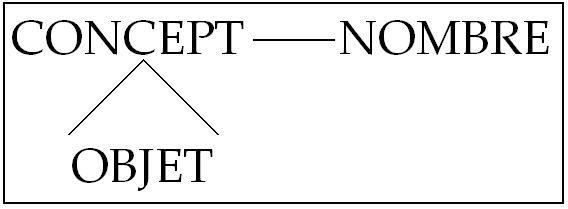
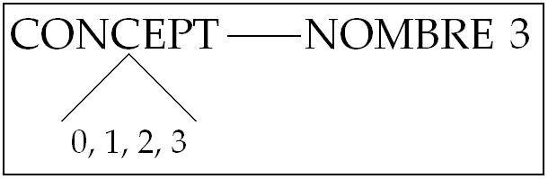
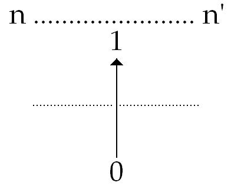

# Leçon 09 | 24 Février l965

<!-- source-url: http://staferla.free.fr/S12/S12 PROBLEMES.docx -->
<!-- seminar: s12 -->
<!-- lesson: 09 -->

<!-- id: s12-09-0001 -->

[MILLER](#MILLER2402)

<!-- id: s12-09-0002 -->

LACAN

<!-- id: s12-09-0003 -->

Je vous salue comme quelqu’un qui est heureux de vous retrouver après une longue absence.

<!-- id: s12-09-0004 -->

Je vais préciser certains points à cause de petits flottements qui ont eu lieu : il est bien entendu qu’on n’a pas à aller rechercher chaque fois, pour venir ici - même si ça ne se passe que tous les mois - une carte. Les personnes qui ont eu leur carte à divers titres et qui l’ont - en somme la dernière fois, du fait de la façon dont les choses sont organisées - déposée dans une boîte où elle porte donc témoignage que la venue de ces personnes est régulière. Les choses se régulariseront avec le temps. Ne viendront ici que ceux qui ont leur carte et cette carte sera dans une boite que la personne qui contrôle l’entrée à laquelle il faut toujours se référer pour savoir si la personne qui passe et qui dit : « j’ai ma carte », l’a bien en effet. C’est une fois pour toutes qu’on a sa carte.

<!-- id: s12-09-0005 -->

Pour les autres, leur demande est en instance, certains ont une carte de diverses couleurs, une carte provisoire que je destine à marquer que j’ai à faire plus ample connaissance avec la personne qui a été ainsi admise. Je vous fais donc mes excuses pour les malentendus qui ont pu se produire. Certaines personnes se sont dérangées pour rien. J’en marque ici que *je suis désolé*.

<!-- id: s12-09-0006 -->

Je pense d’ailleurs qu’il n’est pas extraordinaire que ces petits flottements puissent se produire au début d’une organisation délicate à mettre au point. Aujourd’hui, je voudrais introduire ce que vous allez entendre, *avec le désir de laisser le champ libre le plus vite possible*.

<!-- id: s12-09-0007 -->

Je désire l’introduire de quelques remarques destinées à situer, pour les personnes qui…

<!-- id: s12-09-0008 -->

> venant ici avec des préjugés divers je veux dire avec l’idée qu’elles se font de ce qui doit être fait dans ce séminaire fermé …pourraient très bien ne pas réaliser tout de suite, pourquoi vous allez entendre expressément ce qui va venir, ainsi que pour les personnes qui - rares - viennent ici depuis très peu de temps.

<!-- id: s12-09-0009 -->

Vous allez entendre parler de *logique* aujourd’hui. Je suppose que la chose ne surprendra pas ceux qui viennent… qui suivent depuis assez longtemps mon enseignement. Pour ces personnes, il doit avec le temps se dessiner d’une façon de plus en plus ferme, qu’il y a des rapports intimes, profonds, essentiels, entre la psychanalyse et la logique.

<!-- id: s12-09-0010 -->

Je ne suppose pas qu’ici tout le monde, ni même beaucoup, soient des logiciens, et que je puisse là-dessus faire le crédit de parler à des oreilles déjà averties, mais néanmoins si peu que ce soit qu’ils aient eu l’occasion de se référer par exemple, au chapitre introductif de n’importe quel traité de logique, ils s’apercevront que les logiciens…

<!-- id: s12-09-0011 -->

> pour situer la logique elle-même, pour la placer, ce qui est vraiment bien le minimum de ce à quoi un logicien
>
> doive s’obliger quand il commence un traité de logique …il verront, ils seront frappés, surtout si je leur mets à cet endroit la puce à l’oreille, à quel point l’ordre de difficulté que le logicien rencontre pour placer sa science, dans la hiérarchie, dans *la classification des sciences*, sont vraiment analogues, correspondent, aux difficultés que peut avoir de même l’analyste. Ceci n’est qu’une indication.

<!-- id: s12-09-0012 -->

La psychanalyse est une logique et inversement, on peut dire que la logique a beaucoup à s’éclairer de certaines *questions radicales* qui sont posées dans la psychanalyse. Pour nous en tenir à la phénoménologie la plus sommaire, ce qui frappe…

<!-- id: s12-09-0013 -->

> ce qui frappe *celui qui vient de l’extérieur*, quand il arrive et qu’il entend le psychanalyste s’exprimer, sur la valeur à donner,
>
> sur l’accent, sur la traduction de telle ou telle manifestation dans le comportement, de tel ou tel symptôme …c’est quelque chose, en général chez ce *nouveau venu*, qui se manifeste par l’idée d’une certaine absence de logique, tout au moins d’un certain renversement, d’un certain désordre dans la logique.

<!-- id: s12-09-0014 -->

Et il est fréquent de voir poussée en avant l’objection, qu’on tirera en psychanalyse la même conclusion de faits qu’on dira improprement contradictoires, car les faits ne peuvent guère l’être contradictoires : ils peuvent être opposés, jouant en sens contraire, on remarquera aussitôt les mêmes conclusions.

<!-- id: s12-09-0015 -->

Est-ce à dire… est- ce à dire que l’interprétation analytique, la structuration de la théorie, fait bon marché de la logique ?

<!-- id: s12-09-0016 -->

Justement pas ! Cet usage psychanalytique de la logique, c’est une raison de plus, pour nous, de nous interroger sur ce qu’en sont les règles effectives, car tout de même ça ne fonctionne pas sans règle.

<!-- id: s12-09-0017 -->

C’est pour nous une précieuse suggestion, d’autant plus insistante à nous y mettre, plus que jamais, à la logique et même à nous apercevoir que - je le disais et je l’indiquais tout à l’heure - que la vraie question est de voir s’il n’y a pas quelque rapport profond, qui fait que la question que posent les logiciens, à savoir : sur quoi en fait a-t-elle prise la logique ?

<!-- id: s12-09-0018 -->

Car ce n’est pas si simple, la logique ne nous donne pas les faits ou comme on dit, les prémisses. La logique nous donne quoi ?

<!-- id: s12-09-0019 -->

Le moyen d’en tirer parti. Sur quel miracle, sur quoi porte cette effectivité de la logique, puisque après tout, les logiciens eux-mêmes le remarqueront : la logique on *l’observe*, on n’a pas besoin de tellement y penser pour *l’observer*, si ce n’est qu’on s’aperçoit qu’à *l’observer*, quelquefois on fait des *faux pas de logique* et que c’est ceci qui nous met en éveil.

<!-- id: s12-09-0020 -->

Mais enfin, en principe on ne pense pas tout le temps quand on raison de suivre les règles de la logique, et pour tout dire, on peut très bien, pour bien raisonner, dire que de la logique, c’est-à-dire des règles de bien raisonner, on s’en passe.

<!-- id: s12-09-0021 -->

Mais quand, comme l’analyste, on fait plus, on a le sentiment *- en tout cas on donne le sentiment -* qu’on *passe outre*.

<!-- id: s12-09-0022 -->

C’est là que commence peut-être d’autant plus la nécessité qui nous impose qu’on ne peut plus s’en passer de la logique.

<!-- id: s12-09-0023 -->

On a le sentiment de *passer outre*, que ce sur quoi elle a prise normalement, redevient alors une question de tout premier plan.

<!-- id: s12-09-0024 -->

Ceci ce sont des vérités tout à fait générales.

<!-- id: s12-09-0025 -->

Il y a un deuxième plan qui est celui d’où je suis parti tout à l’heure, à savoir l’enseignement que j’ai pu déjà donner, organiser, dégager depuis quelques années. J’y ai mis en valeur des fonctions que je n’ai point inventées :

<!-- id: s12-09-0026 -->

- elles ne sont pas latentes, elles sont patentes.

<!-- id: s12-09-0027 -->

- Elles se sont articulées à l’intérieur de l’analyse, même chez ceux, chez les auteurs qui ne les expriment pas avec les mêmes concepts, selon les mêmes fonctions que je le fais,

<!-- id: s12-09-0028 -->

- elles sont présentes, elles sont manifestes, elles sont là depuis l’origine.

<!-- id: s12-09-0029 -->

On peut décrire, *une partie* tout au moins, tout *un* *pan*, toute une face de ce que j’ai articulé, comme la tentative de situer, d’établir, *une logique du manque*, mais dire cela ça ne suffit pas. Lors de mon dernier discours, celui *du début de Février* par exemple, vous avez pu voir s’articuler, s’opposer deux horizons dans *deux pôles* : fonctions de l’*idéal du moi* et du *moi idéal* par exemple, fonction pivot, déterminante de l’*objet(a)* dans ces deux termes opposés de *l’identification*.

<!-- id: s12-09-0030 -->

Vous m’avez vu, entendu, l’articuler d’une certaine façon qui, il me semble, a pu…

<!-- id: s12-09-0031 -->

> tout au moins pour ceux qui étaient déjà suffisamment entraînés dans cette voie …à ceux-là donner *quelque satisfaction*, c’est dire que…

<!-- id: s12-09-0032 -->

> qu’elle se manifeste, qu’elle soit prise au niveau du sujet, ou au niveau de cet objet privilégié, singulier, qui s’appelle l’*objet(a)*,
>
> au niveau des diverses formes - plus ou moins leurrantes - de *l’identification*, au niveau des voies
>
> par où nous mettons à l’épreuve cette fonction de *l’identification*, ce que j’ai appelé les voies de *la tromperie* ou *du transfert* …nous avons là des plans qu’il ne suffit pas d’*énumérer*, voire de caresser au passage, pour croire que nous possédons la clé de ce qu’il y a à manier.

<!-- id: s12-09-0033 -->

Ces deux mêmes niveaux, ces plans, s’articulent, et s’articulent d’une façon qui doit être d’autant plus précise qu’elle est plus nouvelle, qu’elle est plus inhabituelle. Habituelle - n’en doutez pas - elle le deviendra cette nouvelle logique : *elle trouvera dans assez d’esprits son articulation et sa pratique pour que de son sujet les lieux communs, si je puis m’exprimer ainsi, s’en répandent* *et fassent le fondement organisateur de notre recherche, et de là puissent passer au dehors, filtrer, s’osmoser au dehors, d’une façon telle que d’autres,* *qui dans d’autres domaines rencontraient telles impasses logiques, précisément, reconnaissent que là se forge un appareil qui est d’un usage qui,* *comme on peut s’y attendre, bien sûr, dépasse infiniment l’ordre de simple règle pratique à l’usage des thérapeutes qui s’appelleraient des psychanalystes.*

<!-- id: s12-09-0034 -->

Parmi ces problèmes essentiels…

<!-- id: s12-09-0035 -->

> *et véritablement énormes, proéminents, presque écrasants, et pas seulement dans notre domaine* …la question de savoir si l’*Un* est une constitution subjective *essentiellement*, est une question première.

<!-- id: s12-09-0036 -->

*Cette question de l’Un* …

<!-- id: s12-09-0037 -->

> pour autant que je l’ai longuement martelée,
>
> je puis dire - pendant presque une année entière, il y a trois ans dans mon *séminaire* sur *l’identification* …*cette question de l’Un* du *trait unaire*…

<!-- id: s12-09-0038 -->

> pour autant qu’elle est à *la clé de la deuxième espèce d’identification* distinguée par FREUD …*cette question de l’Un* est essentielle, pivotale, pour cette logique qu’il s’agit de constituer dans son statut, et qui sera ce vers quoi j’entends diriger la suite de mon discours jusqu’à la fin de cette année.

<!-- id: s12-09-0039 -->

Que cet *Un* soit de constitution subjective ceci élimine-t-il que cette *constitution* soit réelle ?

<!-- id: s12-09-0040 -->

Voilà le problème, voilà le problème à quoi est destiné à contribuer une réflexion, une méditation, qui fut extraordinairement en avance, très exactement de vingt-cinq ans, sur tout ce que les esprits étaient aptes, à ce moment, à recevoir : la méditation de FREGE dans le domaine spécifique où l’*Un* a à prendre son statut, à savoir celui de l’arithmétique.

<!-- id: s12-09-0041 -->

C’est pour cela que nous en avons avancé la *référence*, le point terme dans notre discours de cette année.

<!-- id: s12-09-0042 -->

Et c’est aussi pour que ce ne soit pas là une espèce de simple signe - fait au large de quelque île - de quelque PHILOCTÈTE \[[Sophocle : *Philoctète*](http://www.ebooksgratuits.com/pdf/sophocle_tragedies.pdf)\] abandonné, qui aurait poussé ses cris en vain pendant quelques années, et nous ne ferions, nous aussi que renouveler le passage de cette croisière *indifférente*, parce qu’évidemment là il se passait quelque chose d’important.

<!-- id: s12-09-0043 -->

Je ne veux pas plus insister sur ce que l’essence en serait passée ailleurs. Non ! Ceci n’est jamais vrai. L’essence d’une recherche ne passe pas ailleurs, c’est au lieu même de la trouvaille qu’il s’agit de revenir si nous voulons vraiment en recevoir *l’empreinte,* *la marque*, en relever aussi pour nous la répercussion.

<!-- id: s12-09-0044 -->

C’est à ce titre que j’avais demandé la dernière fois à quelqu’un de ceux qui ici, ont été pour moi signes de la vérité de ce à quoi je crois : que ce que nous avons à dire dans la psychanalyse dépasse de beaucoup son application thérapeutique, que le statut du sujet y est essentiellement intéressé.

<!-- id: s12-09-0045 -->

C’est pour autant que j’ai pu ici recueillir cette sorte de réponse qui me témoigne :

<!-- id: s12-09-0046 -->

- qu’effectivement ce n’est pas là simplement espoir en l’air,

<!-- id: s12-09-0047 -->

- qu’effectivement sont intéressés d’une certaine position, un certain nombre d’esprits …à une seule condition si je puis dire :

<!-- id: s12-09-0048 -->

- qu’ils soient ouverts,

<!-- id: s12-09-0049 -->

- qu’ils aient ce qui doit reposer au fond de toute ouverture docte, à savoir une certaine ignorance, une certaine fraîcheur,

<!-- id: s12-09-0050 -->

- ceux pour qui l’usage des concepts n’est pas quelque chose dont on sait depuis toujours que quand on se réfère à la bonne sagesse pratique de papa et de maman, on peut toujours laisser parler ceux qui spéculent, on peut toujours aussi laisser passer au loin les cris d’indignation, qui passent à droite ou à gauche entre tel ou tel désordre du monde.

<!-- id: s12-09-0051 -->

Chacun sait que la réalité, ça consiste à ne pas se laisser atteindre par ces cris. Ce qu’on appelle réalité, ce n’est trop souvent, et c’est à ça bien sûr que nous avons affaire dans la psychanalyse, que rendre la fonction de la réalité, *pour nous spécialement : analystes*, à un certain coefficient de surdité mentale. C’est pour ça que la référence, trop souvent mise en avant dans la psychanalyse, la référence à la réalité, doit toujours nous inciter à plus que de la réserve : à quelque *méfiance*.

<!-- id: s12-09-0052 -->

Dieu merci, il m’est arrivé une nouvelle classe, une nouvelle génération de gens non sourds, pour me répondre.

<!-- id: s12-09-0053 -->

C’est à un de ceux là qu’aujourd’hui je donne la parole, pour répondre à un autre…

<!-- id: s12-09-0054 -->

> à un de ceux qui, la dernière fois, a bien voulu nous rendre le service d’introduire ici le discours et la question de FREGE …pour lui répondre, pour vous ouvrir aussi les diverses voies dans lesquelles nous souhaitons qu’intervienne quiconque a été admis ici, et le fait que cette salle soit remplie prouve assez que je n’y mets nulle barrière artificielle, que je laisse place à quiconque se présente avec le désir manifeste de prendre part à notre dialogue.

<!-- id: s12-09-0055 -->

Mais puisque je fais cet accueil si large, *je vous en prie*

<!-- id: s12-09-0056 -->

- *apportez-moi* par quelque forme que ce soit *votre réponse*,

<!-- id: s12-09-0057 -->

- apportez–moi *le témoignage* que c’est là de ma part conduite justifiée.

<!-- id: s12-09-0058 -->

LECLAIRE, qui la dernière fois nous a fait, avant la communication de DUROUX à laquelle je fais allusion... LECLAIRE n’est pas là aujourd’hui, ayant un engagement pris depuis longtemps : il devait parler dans une ville étrangère - à Bruxelles nommément – de sorte que ce qui aujourd’hui pourrait être *rapporté*, *référé* à ce que LECLAIRE a dit, ceci ne pourra pas avoir lieu aujourd’hui.

<!-- id: s12-09-0059 -->

Grâce à cela, je n’ai pas trop à déplorer le fait - pourtant en soi regrettable - qu’après que j’ai demandé que chacun de ceux qui ont pu avoir le bénéfice de ce texte ronéotypé qui a été mis à la disposition de tout un chacun - de qui voulait – que chacun s’engage à y apporter une courte remarque écrite.

<!-- id: s12-09-0060 -->

J’en ai reçu en effet, un certain nombre. Elles ne vont pas jusqu’à dépasser le chiffre de six ce qui est peu étant donné que 35 textes de LECLAIRE ont été retirés à la place où j’avais dit qu’ils pouvaient être trouvés.

<!-- id: s12-09-0061 -->

Je ne commente pas plus le fait de cette carence. J’ai dit, j’ai bien prévenu que j’y donnerai les suites qui conviennent, à savoir qu’il est certain que je ne puis - ce n’est pas dans mon dessein - faire de cette assemblée dite du séminaire fermé, quelque chose où viennent trop de personnes qui, quelque bénéfice qu’elles puissent en tirer, se mettent dans une position de retrait, que je ne puis, à l’intérieur du séminaire fermé, que faire équivaloir à une position de refus.

<!-- id: s12-09-0062 -->

Il faut évidemment que je puisse savoir dans quelle mesure chacun est disposé à contribuer à ce qui doit être ici essentiellement séance de travail. Ceci étant dit, les remarques à apporter au rapport de DUROUX, je ne les avais pas, elles, expressément demandées et je n’en ai reçu jusqu’à présent aucune.

<!-- id: s12-09-0063 -->

Je souhaite en recevoir, après que vous ayez entendu la réponse qui était prévue, à laquelle nous n’avons pas pu donner place à la fin du séminaire dernier, la réponse que va lui apporter maintenant Jacques-Alain MILLER à qui je donne la parole.

<!-- id: s12-09-0064 -->

[Jacques-Alain MILLER](#fev24) : éléments de la logique du signifiant

<!-- id: s12-09-0065 -->

« *Il n’a pas le droit de se mêler de psychanalyse celui qui n’a pas acquis, d’une analyse personnelle, ces notions précises que seule elle est capable de délivrer.* »

<!-- id: s12-09-0066 -->

« *Il n’a pas le droit…* » : de la rigueur de cet interdit, prononcé par FREUD dans ses *Nouvelles Conférences sur la psychanalyse,* vous êtes certainement, Mesdames et Messieurs, j’imagine, très respectueux. Aussi, une question se pose pour moi à votre propos particulier, articulée en dilemme : si - transgressant les interdits - c’est de *psychanalyse* que je vais parler et sans en avoir le droit, à écouter quelqu’un absolument incapable de produire le titre qui autoriserait votre créance, *que faites-vous ici* ?

<!-- id: s12-09-0067 -->

Ou bien, si mon sujet n’est pas de psychanalyse, encore une fois, vous qui reconduisez si fidèlement vos pas dans cette salle pour vous entendre, être entretenu régulièrement des problèmes relatifs au champ freudien, *que faites-vous donc ici* ?

<!-- id: s12-09-0068 -->

*Que faites-vous ici*, vous surtout Mesdames et Messieurs les analystes, vous qui avez entendu cette *mise en garde*… à vous tout particulièrement adressée par FREUD …d’avoir à ne pas vous en remettre à ceux qui de votre science, ne sont pas les adeptes directs ?

<!-- id: s12-09-0069 -->

Comme dit FREUD : tous ces soi-disant savants, tous ces littérateurs qui font cuire leur *petit potage* sur votre four sans même se montrer reconnaissants de votre hospitalité. Que si la fantaisie de celui qui fait office dans vos cuisines de *maître-queue* pouvait bien s’amuser à voir un « *pas même gâte-sauce* » s’emparer de cette *marmite* dont il est bien naturel après tout qu’elle vous *tienne à cœur*, puisque c’est d’elle que vous tirez votre *subsistance*.

<!-- id: s12-09-0070 -->

Il n’est pas sûr et j’en ai - je l’avoue - douté, qu’un petit potage mijoté de cette façon, vous soyez disposés à le boire.

<!-- id: s12-09-0071 -->

Et pourtant, vous êtes là. Permettez que je m’émerveille un instant de votre assistance et d’avoir pour un moment le privilège de manipuler cet organe, précieux entre tous ceux dont vous avez l’usage, votre oreille. C’est donc votre présence ici que je vais m’employer à justifier à vous mêmes par des raisons au moins qui soient avouables.

<!-- id: s12-09-0072 -->

Cette justification tient en ceci, qui ne saurait vous avoir échappé après les développements dont vous avez été enchantés à ce séminaire depuis le début de l’année scolaire, à ceci : que *le champ freudien n’est pas représentable comme une surface close*.

<!-- id: s12-09-0073 -->

L’ouverture de la psychanalyse ne tient pas au libéralisme, à la fantaisie, voire à l’aveuglement de celui qui s’est institué à la place de son *gardien*. Cette ouverture tient à ce que, de n’être pas situés en son intérieur, on n’en est pas pour autant, rejetés dans son extérieur, s’il est vrai qu’en un certain point - qui échappe à *une topologie* restreinte *à deux dimensions* - leur convergence s’opère.

<!-- id: s12-09-0074 -->

Que ce point je puisse l’occuper un instant voilà que vous échappez au dilemme que je vous présentais et que vous trouvez l’argument justifiant, nécessaire à ce que vous soyez ici des auditeurs de bonne foi. Il s’agit donc que ce point j’arrive à l’occuper.

<!-- id: s12-09-0075 -->

Vous voyez par là - Mesdames, Messieurs - combien vous êtes intéressés à l’entreprise que je fomente, combien vous êtes impliqués dans son succès ou dans son échec.

<!-- id: s12-09-0076 -->

<u>Concept de la logique du signifiant</u>

<!-- id: s12-09-0077 -->

Ce que je vise à restituer ici en rassemblant des morceaux épars dans le discours de Jacques LACAN , doit être désigné du nom de « *logique du signifiant* » :

<!-- id: s12-09-0078 -->

- logique générale en ce que son fonctionnement est formel par rapport à tous les champs du savoir qui pourraient le spécifier, y compris celui de la psychanalyse,

<!-- id: s12-09-0079 -->

- logique élémentaire pour autant qu’y seront données les seules pièces minimales indispensables à lui assurer une marche réduite à son mouvement linéaire.

<!-- id: s12-09-0080 -->

La simplicité de son économie ne devrait pourtant pas nous dissimuler que les conjonctions qui s’y accomplissent entre certaines fonctions, sont assez essentielles pour ne pouvoir être négligées sans dévoyer les raisonnements proprement analytiques, ce dont j’essaierai, en m’engageant sur un terrain que je connais mal, ce dont j’essaierai d’administrer la preuve en effectuant selon des critères purement formels, un repérage sommaire des *aberrations conceptuelles* où se trouve contraint un exposé…

<!-- id: s12-09-0081 -->

> dont on ne peut par ailleurs que reconnaître son mérite …publié dans le *tome 8* de la revue *La Psychanalyse* [^65], *aberrations* qui peuvent peut-être se déduire de la négligence qui s’y manifeste de cette *logique du signifiant*.

<!-- id: s12-09-0082 -->

Son rapport à ce que nous appellerons « *la logique logicienne* » s’avère singulier, par cela qu’elle traite exactement de son émergence et qu’elle doit se faire connaître comme *logique de l’origine de la logique*, c’est-à-dire - et le point est capital - qu’elle n’en suit pas les lois, qu’elle tombe hors du champ de leur juridiction puisqu’elle la prescrit.

<!-- id: s12-09-0083 -->

Ici, en ce qui nous concerne, nous atteindrons cette dimension de l’archéologique par un *mouvement rétroactif* à partir de ce champ de la logique où précisément s’accomplit la méconnaissance la plus radicale en ce qu’elle s’identifie à sa possibilité même.

<!-- id: s12-09-0084 -->

Le fil conducteur en sera le discours tenu par Gotlob FREGE dans ses *Grundlagen der Arithmetic* [^66], privilégié parce qu’il questionne les termes acceptés comme premiers *dans l’axiomatique* suffisante à construire la théorie des nombres naturels, *axiomatique de* P*éano*.

<!-- id: s12-09-0085 -->

Ces termes qui sont acceptés comme premiers de cette axiomatique, on vous les a énumérés au dernier séminaire fermé, il s’agit du terme de « *zéro* », de celui de « *nombre* » et de celui de « *successeur* ».

<!-- id: s12-09-0086 -->

Aucun des infléchissements apportés ensuite à cette visée première par FREGE ne nous retiendra : nous nous tiendrons donc en deçà de la thématisation de la différence du sens et de la référence, comme de la définition du *concept* plus tard introduite à partir de la prédication, qui le fait alors fonctionner - le concept - dans la dimension de la non-suturation qui est comme « *le reste »* de la différence entre prédication et identité.

<!-- id: s12-09-0087 -->

Ceci pour répondre à quelqu’un qui reprochait à l’exposé précédent de négliger le concept de *suturation*.

<!-- id: s12-09-0088 -->

Il est donc bien clair que je ne parle pas - ce serait bien présomptueux - en philosophe. D’ailleurs du philosophe je ne connais qu’une seule définition, celle de Henri HEINE acceptée par FREUD, citée par lui, qui dit : « *Avec ses bonnets de nuit et des lambeaux de sa robe de chambre, il bouche les trous de l’édifice universel* [^67] ».

<!-- id: s12-09-0089 -->

La fonction du philosophe, celle de suturation, ne lui est pas particulière. Ce qui ici caractérise le philosophe comme tel c’est l’étendue de son champ, étendue qui est celle de l’édifice universel. Ce dont il importe que vous soyez persuadés, c’est que *le linguiste* comme *le logicien* à leurs niveaux, suturent.

<!-- id: s12-09-0090 -->

Ce sera donc, non pas de la philosophie mais peut-être de l’épistémologie que je ferai ici, et peut-être plus précisément ce que Georges CANGUILHEM - qui serait bien étonné d’être cité ici - appelle un travail sur des concepts.

<!-- id: s12-09-0091 -->

Ici ces concepts sont le sujet et le signifiant.

<!-- id: s12-09-0092 -->

<u>Le 0 et le 1.</u>

<!-- id: s12-09-0093 -->

La question, dans sa forme la plus générale, s’énonce ainsi :

<!-- id: s12-09-0094 -->

> « *Qu’est-ce qui fonctionne dans la suite des nombres entiers naturels à quoi il faut rapporter leur progression ?* »

<!-- id: s12-09-0095 -->

La question est donc : *Qu’est-ce qui*…* ?* La réponse - je la livre avant de l’atteindre - est que dans le procès logique de la constitution de cette suite, c’est-à-dire dans la genèse de la progression, *la fonction du sujet*, méconnue, opère. Cette *proposition* ne peut manquer de prendre *figure de paradoxe* pour qui n’ignore pas - et sans doute vous êtes maintenant au fait - que le discours logique de FREGE s’entame d’exclure *ce qui* dans une théorie dite empiriste, s’avère essentiel à faire passer la « *collection d’unités* » à « *l’unité du nombre* ».

<!-- id: s12-09-0096 -->

*Ce qui* permet, dans cette théorie empiriste, de passer de « *la collection d’unités* » à « *l’unité du nombre* » c’est *la fonction du sujet*, ainsi nommée dans une théorie empiriste. L’unité ainsi assurée à *la* *collection* n’est permanente qu’autant que *le nombre* y fonctionne comme *un nom* : *nom de la collection*, *nom* qui a dû lui venir pour que sa transformation s’accomplisse en *unité*.

<!-- id: s12-09-0097 -->

*La nomination* a donc ici pour fonction d’assurer *l’unification*.

<!-- id: s12-09-0098 -->

Et dans ces théories empiristes le sujet assure cette fonction corrélative du *nom*, qui est celle du *don du nom*, dont la liaison essentielle à la nomination s’avoue sans fard, telle quelle, et on peut ajouter que c’est de ce *don du nom* où *la fonction du sujet* peut se laisser réduire, que s’origine sa définition comme *créateur de la fiction*.

<!-- id: s12-09-0099 -->

Seulement ce sujet, ici nommément désigné, est un sujet défini par ses attributs psychologiques.

<!-- id: s12-09-0100 -->

Le sujet que FREGE *exclut* au début de son discours est ce sujet là, ce sujet défini comme détenteur d’un pouvoir et essentiellement détenteur d’une mémoire qui lui permet de circonscrire cette collection, et de ne pas laisser se perdre tous ses éléments qui sont interchangeables. Donc le discours de FREGE, se dressant *d’entrée de jeu* contre la fondation *psychologique* de l’arithmétique exclut le sujet du champ où le concept du nombre a à apparaître. Ce qu’il s’agit de montrer, c’est que le sujet ne se réduit pas dans sa fonction la plus essentielle à son pouvoir psychologique.

<!-- id: s12-09-0101 -->

Vous savez que le discours de FREGE se développe tout entier à partir du système fondamental de *trois concepts* :

<!-- id: s12-09-0102 -->

- le concept de « *concept* »,

<!-- id: s12-09-0103 -->

- le concept d’ « *objet* »,

<!-- id: s12-09-0104 -->

- le concept de « *nombre* », et de deux relations :

<!-- id: s12-09-0105 -->

- la *relation du concept à l’objet*, relation qui se nomme *la subsomption*,

<!-- id: s12-09-0106 -->

- la seconde qui est *la relation au concept de nombre*, qui sera pour nous *l’assignation*.

<!-- id: s12-09-0107 -->

Le schéma est donc très simple. Je le reproduis :

<!-- id: s12-09-0108 -->

<!-- id: s12-09-0109 -->

Il est clair que cette ouverture est la marque de la relation de *subsomption* comme telle. La définition du concept telle que FREGE la donne, n’est pas faite pour surprendre en ce qu’elle se situe dans la ligne de la pensée la plus classique, puisque sa fonction est de rassemblement.

<!-- id: s12-09-0110 -->

Mais l’inédit ici et le spécifiquement logique est que le concept est défini par la seule relation qu’il entretient avec *le subsumé *: *l’objet* qui tombe sous le concept prend son sens de la différence d’avec la chose, simple corps occupant une certaine spatio-temporalité dans le monde. Car ici l’objet est défini seulement par sa propriété de *tomber sous un concept* sans égard à ses déterminations, qu’une investigation autre que la logique pourrait lui découvrir. Il est donc ici essentiellement privé de ses déterminations empiriques.

<!-- id: s12-09-0111 -->

Il apparaît donc que le concept qui sera opératoire dans le système, ne sera pas le concept formé à partir des déterminations, mais le concept de l’identité à un concept. C’est par ce redoublement là que nous entrons dans la dimension logique comme telle.

<!-- id: s12-09-0112 -->

Il est essentiel de voir que l’entrée dans la dimension logique comme telle est produite par l’apparition de l’identité.

<!-- id: s12-09-0113 -->

C’est ainsi que dans l’œuvre de FREGE ce n’est qu’apparemment qu’il est question du concept par exemple : *lune de la terre*.

<!-- id: s12-09-0114 -->

Il s’agit en fait du concept identique au concept *lune de la terre*. Car, comme il s’agit du *concept identique* au concept *lune de la terre*, ce qui tombe sous le concept n’est pas *la chose* comme telle, mais seulement *la chose en tant* *qu’elle est une.*

<!-- id: s12-09-0115 -->

L’assignation du nombre, la deuxième relation, se déduit de cette subsumption comme extension du concept identique au concept *lune de la terre*. On voit donc que ce qui tomberait sous le concept *lune de la terre* serait la lune, mais ce qui tombe sous le concept identique au concept *lune de la terre*, *c’est un objet*, c’est *l’objet* « *lune de la terre* », c’est-à-dire l’unité.

<!-- id: s12-09-0116 -->

D’où la formule de FREGE : « *Le nombre assigné au concept F est l’extension du concept « identique au concept F »* ». Cette tripartition de FREGE a donc pour effet de ne laisser à *la chose* que le seul support de *son identité à elle-même* : *en quoi elle est objet de ce concept*.

<!-- id: s12-09-0117 -->

Le fondement du système de FREGE est donc à pointer dans la fonction de l’*identité*, en tant que c’est elle qui accomplit la transformation de toute *chose* en *objet*, à ne lui laisser que la détermination de son unité.

<!-- id: s12-09-0118 -->

Par exemple, si je m’occupe à rassembler ce qui tombe sous le concept « *Enfant d’Agamemnon* », j’aurai ces enfants qui ont pour noms CHRYSOTHÉMIS, ÉLECTRE, IPHIGÉNIE et ORESTE. Et je ne peux pas assigner un nombre à cette collection, sinon à faire intervenir le concept de « *l’identique au concept : enfant d’Agamemnon* ». Grâce à la fiction de ce concept, chaque enfant interviendra ici en tant qu’appliqué à lui-même, ce qui le transforme en unité, ce qui le fait passer au statut d’objet comme tel numérable.

<!-- id: s12-09-0119 -->

Le logique, ici s’origine de la conjonction de *la fonction de subsomption* c’est-à-dire *de rassemblement*, à *la fonction de l’identité* par quoi \- le point est capital, nous en verrons l’incidence tout à l’heure - le subsumé se ramène à l’identique.

<!-- id: s12-09-0120 -->

Et le nom de la collection subsummée c’est d’être « *enfant de* » pour devenir quatre.

<!-- id: s12-09-0121 -->

L’important ici, vous le saisissez déjà, c’est que l’unité qu’on pourrait dire unifiante du concept comme assignat du nombre, est subordonnée à la fonction de l’unité comme distinctive. *Le nombre comme nom* n’est plus alors le nom unifiant d’une collection mais *le nom distinctif d’une unité*.Le Un, cet Un de l’identique du subsummé, cet Un là, est ce qu’a de commun tout nombre, d’être avant tout constitué comme une unité.

<!-- id: s12-09-0122 -->

Au point de l’élaboration où nous atteignons, je pense que vous sentirez le poids de la définition de l’identique que je vais produire, dans ceci que c’est la fonction qu’assure l’identité qui permet que *les choses du monde reçoivent leur statut de signifiant*.

<!-- id: s12-09-0123 -->

Vous comprenez que, en ce qui concerne cette définition de l’identité en tant qu’elle va donner son vrai sens au concept du *nom*, il s’en déduit qu’elle ne doit rien lui remprunter afin de pouvoir engendrer la possibilité de la numération. Cette définition, pivotale dans son système, FREGE l’emprunte à LEIBNIZ. Elle tient dans cette courte phrase : « *Eadem sunt quorum unum potest substitui alteri salva veritate.* »

<!-- id: s12-09-0124 -->

« *Identiques sont les choses dont l’une peut être substituée à l’autre sans que la vérité se perde*. »

<!-- id: s12-09-0125 -->

Ce qui s’accomplit *dans cette formule* qui pourrait paraître anodine si FREGE lui-même n’y mettait pas l’accent, vous en mesurez l’importance : c’est l’émergence de la dimension de *la vérité* comme nécessaire à ce que fonctionne *l’identité*.

<!-- id: s12-09-0126 -->

Comme logicien occupé de la genèse du nombre, FREGE n’utilise cette définition que pour autant qu’elle laisse le loisir de la modifier dans une définition de *l’identité à soi-même*. Et là nous touchons en un point encore plus radical que celui que vise la définition de LEIBNIZ puisque, après tout la définition de *la vérité*, quand *l’identité à soi* est concernée, est bien plus menacée.

<!-- id: s12-09-0127 -->

Si l’on suit la phrase de LEIBNIZ, *la défaillance de la vérité* : cette perte de *la vérité* dans la substitution d’une chose à une autre, cette perte, dont la possibilité un instant est ouverte par la phrase de LEIBNIZ, cette perte serait aussitôt suivie du rétablissement de *la vérité* pour une nouvelle relation, car si je substitue à une chose, une chose qui ne lui est pas identique, *la vérité se perd*, mais elle se retrouve en ce que cette nouvelle chose sera *identique à elle même*. Tandis que « *qu’une chose ne soit pas identique à elle-même* » subvertit de fond en comble le champ de *la vérité*, le ruine et l’abolit jusqu’à sa racine. Vous comprenez en quoi *la sauvegarde de la vérité est intéressée à cet identique à soi qui assure le passage de la chose à l’objet*. C’est au champ de la vérité que *l’identité à soi* surgit. Et l’identique est à situer au champ de la vérité en tant qu’elle est essentielle à ce que ce champ puisse être sauvegardé.

<!-- id: s12-09-0128 -->

<u>La vérité est. Chaque chose est identique à soi.</u>

<!-- id: s12-09-0129 -->

Maintenant, faisons un peu fonctionner *le schéma de* FREGE, *cette tripartition si simple*, parcourons ce parcours réglé qu’il nous prescrit

<!-- id: s12-09-0130 -->

- soit une chose x du monde,

<!-- id: s12-09-0131 -->

- soit le concept de cet x,

<!-- id: s12-09-0132 -->

Le concept qui va intervenir ici ne sera pas le concept de x mais concept de l’identique à x.

<!-- id: s12-09-0133 -->

Tel est l’objet qui tombe sous le *concept identique à x* : x lui-même. En cela le nombre - et là c’est le troisième terme du parcours – le nombre qu’on va assigner à cette chose devenue objet par cette translation sera le nombre **1**. J’ai pris x ce qui veut dire que la fonction du nombre est répétitive pour tous les objets du monde. Cette répétition qui fait que chaque chose, de passer au concept de l’identité à soi puis au concept de l’objet produit, fait émerger le nombre **1**.

<!-- id: s12-09-0134 -->

C’est à partir de son système ternaire, en tant qu’il est supporté par la fonction de l’identité, que FREGE peut accomplir l’engendrement qu’il poursuit, de la suite des nombres entiers naturels, selon un ordre qui est le suivant :

<!-- id: s12-09-0135 -->

- d’abord engendrement du **0**,

<!-- id: s12-09-0136 -->

- ensuite engendrement du **1**,

<!-- id: s12-09-0137 -->

- enfin engendrement du *successeur*.

<!-- id: s12-09-0138 -->

L’engendrement du **0** est admirable dans sa simplicité qui est de s’effectuer ainsi : **0** *est le nombre assigné au concept* « *non identique à soi* », autrement dit, comme la vérité existe il n’y a pas d’objet qui tombe sous ce concept objet **0**, et le nombre alors, qui qualifie l’extension de ce concept, est le nombre **0**.

<!-- id: s12-09-0139 -->

Dans cet engendrement du **0**, j’ai mis en évidence qu’il est soutenu par cette proposition qui lui est nécessairement antécédente que « *la vérité existe* » et doit être sauvée. Si aucun objet ne correspond au concept *non identique à soi*, c’est que la vérité persiste.

<!-- id: s12-09-0140 -->

S’il n’y a pas de chose qui ne soit pas *identique à soi*, c’est qu’elle est contradictoire avec la dimension même de la vérité.

<!-- id: s12-09-0141 -->

C’est dans l’énoncé décisif « que le nombre assigné au concept de la non-identité à soi est **0** », que se suture le discours logique.

<!-- id: s12-09-0142 -->

Mais - là je vais traverser décidément l’énoncé de FREGE - il est clair que pour réaliser cette primordiale suturation, il a fallu évoquer, au niveau du concept cet « *objet non identique à soi* » qui s’est trouvé rejeté ensuite de la dimension de la vérité et dont le **0** qui s’inscrit à la place du nombre, trace comme la marque de l’exclusion. Il n’y a pas à la place de *l’objet subsumé* lui-même, à cette place intérieure du système, il n’y a pas d’écriture possible, et le **0** qui *s’y inscrit*, qui pourrait s’y inscrire, ne serait que la figuration d’un blanc.

<!-- id: s12-09-0143 -->

Le **1** maintenant. Il s’engendre de ce que le **0** comme nombre est susceptible de devenir *concept* et *objet*. S’il faut passer par le **0** pour engendrer le **1**, c’est que ce que j’ai dit du x n’était qu’une *fiction*. Nous sommes dans le domaine logique et on n’a pas le droit de se donner un objet du monde. C’est pourquoi, une fois qu’on engendre le nombre **0** on tient enfin le premier objet. C’est dire que FREGE compte pour rien cet objet qu’il a dû évoquer et rejeter primordialement.

<!-- id: s12-09-0144 -->

Alors, maintenant, comment engendrer le **1** à partir de ce premier objet qu’est le nombre **0** ? Eh bien on se donne *le concept *« *identique au concept du nombre* **0** ». À ce moment-là, l’objet qui tombe sous ce concept identique au concept du nombre **0** est l’objet nombre **0** lui-même. Et donc l’objet qu’il faut assigner à ce concept : voilà le **1** produit.

<!-- id: s12-09-0145 -->

Vous voyez donc que ce système joue grâce à une translation des éléments définis, à toutes les places du système.

<!-- id: s12-09-0146 -->

On a le concept du nombre **0** et le nombre **0** devient objet pour enfin produire le nombre **1**.

<!-- id: s12-09-0147 -->

J’aimerai poser cette formule en évidence devant vous qui commencez à croire que ce fonctionnement est un peu lent à s’effectuer. J’aimerais poser cette formule en évidence, puisque c’est à elle que tout notre développement donnera une conséquence dont vous commencez peut-être à apercevoir la valeur : *que le zéro est compté pour* **1**.

<!-- id: s12-09-0148 -->

Cette propriété fondamentale du **0** *d’être compté pour* **1**, alors que son assignat conceptuel ne subsumme sous lui qu’absence d’objet, qu’un blanc, cette propriété fondamentale est le support général de la suite des nombres telle que FREGE l’engendre.

<!-- id: s12-09-0149 -->

Ce qui est assez caractérisé, dans une recherche moins approfondie que celle de FREGE, d’être nommé *le successeur*, c’est-à-dire successeur de *n* obtenu par l’adjonction du *un* alors que certains se satisfont de la simple présentation de l’opération : *n… n + 1* donne *n’* successeur de *n*, *3 + 1* donne *4*. Cette opération dont on peut se satisfaire, ce *n + 1*, FREGE l’ouvre pour découvrir comment est possible le passage de *n* à son *successeur*, en tant qu’il est assuré par cette opération.

<!-- id: s12-09-0150 -->

Le paradoxe de cet engendrement, vous le saisissez aussitôt, vous allez le saisir aussitôt que je vais produire la formule la plus générale du successeur à laquelle FREGE parvienne. Cette formule est celle-ci : Le nombre assigné au concept « *membre de la série des nombres naturels se terminant par n* » suit dans la série des nombres naturels immédiatement *n*.

<!-- id: s12-09-0151 -->

Autrement dit, la définition de *n + 1* c’est : le nombre assigné au concept « *membre de la série des nombres naturels se terminant par n* ».

<!-- id: s12-09-0152 -->

Donnons un chiffre, vous allez voir comme c’est drôle, comme le tour de passe-passe est absolument étonnant. Voilà le nombre 3. Un nombre honnête que nous connaissons bien, ici surtout. Eh bien ce nombre *3* va me servir à constituer *le concept* « *membre de la série des nombres naturels se terminant par* 3 ». Il se trouve que *le nombre* qu’on assigne à *ce concept* est 4.

<!-- id: s12-09-0153 -->

Voilà le **1** qui est venu, et d’où est-il venu ce **1** ? Il faut un petit instant pour saisir la subtilité de la chose. Voilà le nombre 3 :

<!-- id: s12-09-0154 -->

<!-- id: s12-09-0155 -->

Je passe *le concept* « *membre de la série des nombres naturels se terminant par* 3 », c’est-à-dire que je fais fonctionner 3 comme *une réserve*, 3 je ne le prends plus comme nombre, je le prends cette fois-ci, si vous voulez, comme concept. Je vais essayer de voir ce qu’il a dans le ventre, alors je décompose. Qu’est ce que 3 *a dans le ventre* ? Il a 1, 2, 3 : 3 objets comme vous diriez. Seulement, nous sommes dans l’élément du *nombre*, et dans l’élément du *nombre* on compte le **0**. Dans la série des nombres naturels, *le* **0** *compte* *pour* **1**, c’est-à-dire qu’en plus il y a le **0** et que *le* **0** *compte pour* **1** voilà la formule fondamentale de *l’engendrement de la suite des nombres*.

<!-- id: s12-09-0156 -->

D’où il ressort que c’est de l’*émergence* du **0** comme **1**, *émergence* qui est produite comme le parcours du nombre à l’intérieur du cycle, qui détermine l’apparition du nombre successeur où s’évanouit le **1** : *n + 1 = n’*. Le **0** *est monté, il s’est fixé comme* **1** *au nombre suivant* *qui a disparu*. Si bien que ce nombre suivant, il suffit de le rouvrir une nouvelle fois et on y trouvera de nouveau ce **0** *qui compte pour* **1**.

<!-- id: s12-09-0157 -->

Ce **1** du *n + 1* qui est substituable - vous l’avez vu tout à l’heure - à tous les membres de la suite des nombres, en tant que chacun, d’être identique à soi, l’évoque nécessairement - s’il n’est rien d’autre que le compte du **0**, autorise à donner ici cette interprétation du signe (+), du fait que sa fonction d’addition apparaît superfétatoire, pour produire la suite.

<!-- id: s12-09-0158 -->

Voilà donc la représentation si l’on veut, classique, de l’engendrement : *n... n+1... n’.* Et voilà celle à laquelle il faut arriver :

<!-- id: s12-09-0159 -->

<!-- id: s12-09-0160 -->

C’est-à-dire qu’il faut passer *de la représentation* absolument *horizontale*, ici marquée, *à une représentation verticale* ou l’on voit s’effectuer par ce soi-disant signe (+) l’émergence du **0**, qui vient ici se fixer comme **1** et produire là la différence de *n* à *n’,* ce que vous avez déjà reconnu comme un effet métonymique.

<!-- id: s12-09-0161 -->

Le **1** est donc à prendre comme le symbole originaire de l’émergence du **0** au champ de *la vérité*, comme le signe de la transgression par quoi le **0** vient à être représenté par **1**, représentation nécessaire à produire *- comme un effet de sens -* *le nom d’un nombre* comme *successeur*.

<!-- id: s12-09-0162 -->

Vous voyez donc que dans une représentation logique, le *schéma* est comme *écrasé sur lui-même* et que l’opération ici effectuée consiste à *le déplier* dans une dimension verticale pour faire surgir le nouveau nombre.

<!-- id: s12-09-0163 -->

Vous voyez donc que si le **1** constitue *le support* de chacun des nombres de la suite c’est en tant qu’il est pour chacun d’eux *le support du* **0**. Le schéma restitué vous présentifie donc la différence de *la logique du signifiant* à la *logique logicienne*.

<!-- id: s12-09-0164 -->

Il doit alors vous permettre d’isoler le nombre comme effet de signification, la fonction de la métonymie comme effet du **0**.

<!-- id: s12-09-0165 -->

Vous comprenez alors que *cette proposition suture la logique*, cette proposition formulée dans *le premier des cinq axiomes de* PÉANO, proposition qui établit le **0** comme un nombre :

<!-- id: s12-09-0166 -->

- *cette proposition que le* **0** *est un nombre* est ce qui permet au niveau logique d’exister comme tel.

<!-- id: s12-09-0167 -->

- *Cette proposition que le* **0** *est un nombre est comme telle insoutenable.*

<!-- id: s12-09-0168 -->

*Et sa non validité se marquerait assez de l’hésitation* qui se perpétue de sa localisation dans la suite des nombres chez Bertrand RUSSELL. Mais sa singularité nous est assez dénoncée ici, en ceci que ce nombre compté pour objet est assigné à un concept sous lequel n’est subsumé aucun objet. Si bien que pour le compter, il faut encore le faire supporter par le **1** minimum afin de lui attribuer le **1** décisif de la progression.

<!-- id: s12-09-0169 -->

La répétition qui se développe dans la suite des nombres se soutient de ceci, que le **0** passe selon :

<!-- id: s12-09-0170 -->

- un acte d’abord horizontal, franchissant le champ de la vérité sous la forme de son représentant comme **1**,

<!-- id: s12-09-0171 -->

- et selon un axe vertical, pour autant que son *représentant* ne tient lieu que de son absence.

<!-- id: s12-09-0172 -->

Si ceci vous l’avez entendu, qu’est–ce qui fait alors obstacle pour nous, au moins ici - car sans doute, il serait normal que les logiciens se mettent à pousser les hauts cris - qu’est-ce qui fait obstacle pour nous, au moins ici, à reconnaître dans le **0**, en tant qu’il est fonction de l’excès, le lieu même du sujet qui n’est rien d’autre que cela, la possibilité d’*un signifiant de plus* ?

<!-- id: s12-09-0173 -->

<u>Rapport du sujet et du signifiant.</u>

<!-- id: s12-09-0174 -->

Le rapport du sujet au champ de l’Autre - car maintenant nous jouons cartes sur table - le rapport du sujet au champ de l’Autre, n’est rien que le *rapport matriciel* du **0** au champ de *la vérité*.

<!-- id: s12-09-0175 -->

*Ce rapport* en tant qu’il est *matriciel,* ne saurait être…

<!-- id: s12-09-0176 -->

> je vous le rappelle, car cette proposition a été avancée par Jacques LACAN
>
> il doit y avoir trois ans si j’en crois les notes sur son séminaire sur l’identification …*ce rapport matriciel* ne saurait être intégré dans une définition de l’objectivité.

<!-- id: s12-09-0177 -->

Vous l’avez, j’espère, peut-être mieux compris, en tout cas cela vous a été illustré par *l’engendrement du* **0** *à partir de la non-identité à soi*, sous le coup de laquelle aucune chose du monde ne tombe.

<!-- id: s12-09-0178 -->

Et *ce rapport matriciel* - et là nous tenons une conjonction essentielle à cette *logique du signifiant* si souvent appelé *« unaire »* - fait que : *la représentation du sujet auprès de l’Autre sous la forme du* **1** *du trait unaire est corrélative de son exclusion hors de ce champ*.

<!-- id: s12-09-0179 -->

Vous savez assez que ce rapport du sujet à l’Autre, au Grand Autre, fait que *ce sujet doit être représenté affligé de cette barre du signifiant* *qui le fait fonctionner hors du champ de l’Autre, quitte à ce que, si l’on se place du côté du sujet, ce soit le grand Autre qui soit frappé de cette barre.*

<!-- id: s12-09-0180 -->

Vous voyez donc là, dans cet échange - un échange fondamental - cette logique du signifiant : *la barre du grand A n’est rien d’autre* *que le rapport d’extériorité du sujet à l’Autre, qui constitue cet Autre comme inconscient en tant que le sujet n’atteint pas l’Autre.*

<!-- id: s12-09-0181 -->

Maintenant, si le sujet se soutient de la suite des nombres, il n’est rien qui puisse le définir dans la dimension de la conscience au niveau de la constitution et de la progression. *La conscience du sujet est à situer au niveau des effets de signification régis*, *jusqu’à pouvoir être dits ses* « *<u>reflets</u> », par la répétition du signifiant, répétition elle–même produite du passage du sujet comme manque.*

<!-- id: s12-09-0182 -->

Ces *formules*, j’espère qu’il est clair qu’elles peuvent - qu’elles pourraient en tout cas - se déduire d’une simple avancée transgressive dans le discours de FREGE. Mais s’il faut, disons *matière de preuve* qui vous montre que *cette fonction de l’excès* supporté par le sujet, au fond a toujours été patente, je vous citerai un passage de DEDEKIND cité par [CAVAILLÈS](http://methodos.revues.org/document55.html) dans son livre

<!-- id: s12-09-0183 -->

*La philosophie mathématique*, où d’ailleurs il note que DEDEKIND retrouve ici BOLZANO.[^68]

<!-- id: s12-09-0184 -->

Il s’agit de donner à *la théorie des ensembles* son *théorème d’existence*, il s’agit d’expliquer l’existence ou la possibilité d’existence, d’un *infini dénombrable*. Et quel exemple donne ici DEDEKIND ? Il dit : « *À partir du moment qu’une proposition est vraie, je peux toujours en produire une seconde,* *à savoir que la première est vraie, ainsi de suite à l’infini.* »

<!-- id: s12-09-0185 -->

C’est donc ici - et à nu - que la fonction du sujet se montre comme *fonction de l’excès* qui reçoit dans le langage de CAVAILLÈS le nom de *fonction de la thématisation*. Lorsque le Docteur LACAN substitue à la définition, met en regard, en face de...

<!-- id: s12-09-0186 -->

- la définition du *signe* comme ce qui *représente quelque chose pour quelqu’un*,

<!-- id: s12-09-0187 -->

- la définition du *signifiant* comme ce qui *représente le sujet pour un autre signifiant*,

<!-- id: s12-09-0188 -->

Ce qui ici veut se réaliser, c’est l’exclusion de toute référence à la conscience pour autant que la chaîne signifiante est concernée.

<!-- id: s12-09-0189 -->

*Dans cette chaîne signifiante, il est en effet nécessaire d’y insérer le sujet, mais cette insertion inévitablement le rejette à l’extérieur de cette chaîne*.

<!-- id: s12-09-0190 -->

Ce qui fait que *l’émergence du sujet*, son *insertion*, comme on dit, ou *sa représentation, est nécessairement corrélative de son évanouissement*.

<!-- id: s12-09-0191 -->

Et nous tenons là encore un rapport fondamental de la logique du signifiant.

<!-- id: s12-09-0192 -->

Maintenant nous pourrions essayer de représenter ces engendrements si originaux dans *le temps*, comme il serait au fond naturel de le faire, et *le temps*, où au moins sa représentation linéaire, comprenez bien qu’ils sont sous la dépendance de cette chaîne.

<!-- id: s12-09-0193 -->

Et donc que ce *temps*, qui serait nécessaire à représenter cet engendrement, ne peut pas être linéaire puisque : il va *produire* au contraire la linéarité de la suite. Alors si l’on veut, on peut dire, et le Docteur LACAN a tenu ces deux propositions ensemble :

<!-- id: s12-09-0194 -->

- le premier accent était mis - je crois, dans *le séminaire sur l’identification -* sur ce point que *le sujet est à l’origine du signifiant*.

<!-- id: s12-09-0195 -->

- Et il a pu être mis ailleurs - je pense dans *le séminaire sur l’angoisse* - au contraire que *l’origine du sujet tient en ceci : *

<!-- id: s12-09-0196 -->

> *qu’il est exclu du signifiant qui le détermine*

<!-- id: s12-09-0197 -->

Autrement dit :

<!-- id: s12-09-0198 -->

- *le signifiant est à l’origine du sujet,*

<!-- id: s12-09-0199 -->

- *la naissance du sujet doit être rapportée à l’antériorité du signifiant.*

<!-- id: s12-09-0200 -->

On n’a pas à s’étonner ici d’apercevoir un effet de *rétroaction*, la *rétroaction* c’est essentiellement ceci : ce moment d’*engendrement* *d’un temps* qui pourra enfin être linéaire et dans lequel peut-être, on pourra vivre. Garder simplement ces propositions… J’ai trouvé, bien sûr ici et là, dans le discours de Jacques LACAN, les deux propositions qu’il faut garder ensemble, tenir fermes :

<!-- id: s12-09-0201 -->

- *Le sujet est l’effet du signifiant.*

<!-- id: s12-09-0202 -->

- *Le signifiant est le représentant du sujet.*

<!-- id: s12-09-0203 -->

Voilà, c’est là que se tient le temps circulaire. Vous voyez qu’à partir d’un discours simplement *logique* on peut rigoureusement en déduire *cette structure du sujet dans son rapport au signifiant*, telle que, avec la plus grande simplicité, le Dr LACAN l’a martelée : « *Structure en équilibre de ce qui apparaît pour disparaître.* »

<!-- id: s12-09-0204 -->

Ouverture ou fermeture du nombre :

<!-- id: s12-09-0205 -->

- on découvre un **0** dans le nombre,

<!-- id: s12-09-0206 -->

- il y a un **1** pour s’abolir dans *le nombre qui se referme*.

<!-- id: s12-09-0207 -->

Et là vous comprenez pourquoi on trouve toujours **1** *de plus* que ce qu’on avait dit, et que ce manque aussi est que ce « **1** *de plus* » devient bien sûr quand on passe dans le *réel* : *un manque*. C’est là l’histoire qu’il vous a été souvent narrée, quand le Dr LACAN avait le goût à la blague : cette histoire des naufragés dans une île qui se comptent, et qui se trouvent toujours **1** *de plus*.

<!-- id: s12-09-0208 -->

LACAN

<!-- id: s12-09-0209 -->

C’est SHACKLETON[^69] qui la rapporte dans une exploration de l’Antarctique. Ils vivent dans des conditions très très spéciales : un petit groupe isolé, et ils se trouvent toujours à la fois « *un de plus* » et du même coup avec « *un qui manque* ».

<!-- id: s12-09-0210 -->

Jacques-Alain MILLER

<!-- id: s12-09-0211 -->

Donc ce signe (+) que nous avons transformé, nous comprenons qu’il n’est pas l’addition, qu’il est plus essentiellement *la sommation.*

<!-- id: s12-09-0212 -->

*Dans ce pseudo (+) est le sujet qui est sommé de comparaître au champ de l’Autre, et <u>qui ne comparaît jamais en personne</u>. Voilà donc la dimension fondamentale d’un appel et d’un rejet, appel et rejet qui structurent la division du sujet, et c’est là* - *vous le savez depuis la fin de l’année dernière –* *qu’est située l’aliénation.*

<!-- id: s12-09-0213 -->

<u>Questions à Mme Piera AULAGNIER</u>

<!-- id: s12-09-0214 -->

Je n’ai guère le temps et de toute façon guère la compétence de parler de cet article, de cet exposé dont je voulais parler, et à propos duquel je voulais poser quelques questions en relation avec *la logique du signifiant*. Mais enfin je vais essayer de le faire *très rapidement*. Le temps au fond ici me rend service puisqu’il me permet de ne pas avoir à avancer trop avant dans ce terrain que je connais mal.

<!-- id: s12-09-0215 -->

Je parle de l’article publié dans le tome 8 de *La Psychanalyse* sous le titre : *Remarques sur la structure psychotique. I.– Ego spéculaire, corps phantasmé et objet partiel* par Mme Piera AULAGNIER. \[pp. 47-67\]

<!-- id: s12-09-0216 -->

J’y relèverai donc très rapidement ces points que l’aliénation ici m’y paraît constituée dans une référence primordiale à la conscience et qu’on touche peut-être par là - j’espère que Mme AULAGNIER ne m’en voudra pas - à une certaine déviation « *lagachienne* » \[*sic*\] du lacanisme, puisque l’aliénation, au lieu d’être rapportée à la division, ne saurait trouver sa référence dernière que dans ce qui ici s’appelle des réponses, des reconnaissances, enfin la prise de conscience.

<!-- id: s12-09-0217 -->

Il me semble ensuite qu’une phrase de cet article pourrait permettre de croire que l’Autre n’y est pas ici conçu essentiellement d’abord comme « *un champ* ». Cette phrase qui dit : « ...*le discours, en ce début aliénant par définition, ce mal-entendu initial et originel est ce qui témoigne de l’insertion de celui qui est le lieu* *de la parole dans une chaîne signifiante, condition préalable à toute possibilité pour le sujet de pouvoir, à son tour s’y insérer*... » \[p.48\]

<!-- id: s12-09-0218 -->

Ce terme d’« *insertion* » ensuite, me semble trop commode *en ce qu’il permet de négliger la dimension* justement *de l’évanouissement du sujet*, et me semble - en ce qu’il est, en un certain point, affligé de l’adjectif « *mauvaise* » - tenir beaucoup trop *des interprétations culturalistes*. C’est ce qu’on appelle ici « *l’entrée dans les défilés du signifiant* ».

<!-- id: s12-09-0219 -->

Enfin - et là je ne peux que l’indiquer parce que, disons je n’ai pas assez travaillé - ce que Mme Piera AULAGNIER essaie d’articuler sur la castration, en tant que le grand Autre en serait l’agent et le sujet le lieu, ne me paraît pas possible à développer sans la référence au *trait unaire*, ce qui se marquerait peut-être de cette phrase : « *Ce qu’il faut ajouter, c’est que ce qui se reflète dans le miroir en tant qu’ego spéculaire* *ferme à tout jamais au psychotique toute possibilité et toute voie à l’identification.* » \[p.57\]

<!-- id: s12-09-0220 -->

La conclusion de ce mécanisme essentiel, comme dit, il me se semble très bien, Mme Piera AULAGNIER, cette « *forclusion* » comment serait-elle concevable sans ce rapport à ce -ϕ corrélatif essentiellement du S en tant que ce qui se diminue ici, se barre là ?

<!-- id: s12-09-0221 -->

Ce corps fantasmé, ce corps que le psychotique voit dans le miroir, n’est-ce pas qu’il lui manque en définitive cette unification que seule pourrait lui assurer la distinction du trait ? N’est-ce pas donc : ce qui manque ici, c’est la subordination qu’au début nous avons dite essentielle : de *la fonction de l’unité unifiante* à *la fonction de l’unité distinctive,* et donc la fonction du *trait unaire* comme cœur, racine, de cette *castration* ?

<!-- id: s12-09-0222 -->

Encore une fois je crois avoir trop peu travaillé, pour en dire ici plus long parce que, effectivement je n’en sais pas plus.

<!-- id: s12-09-0223 -->

Ce qui par contre me semble et m’a paru tout à fait compatible et articulé selon les règles de *la logique du signifiant,* c’est ici le point rappelé par le Dr LACAN au début de cet exposé, qui est *l’objet(a)*, où il est bien dit dans cet article, qu’il *a pour point tournant de* *sa constitution, le phallus.* Il est clair que *la fonction du nombre* peut être rapportée à cette *fonction du* *(a)* comme effet de métonymie qui abolit le sujet en obturant sa place, de ce que le sujet se trouve identifié à lui.

<!-- id: s12-09-0224 -->

Car enfin, si j’ose dire quelques mots plus en rapport avec l’analyse et encore sans doute ici d’un point de vue tout à fait formel, je dirai que ce que marque *la métonymie de cet objet(a) comme la fonction du nombre*, c’est que *l’infinitude du désir est une pseudo-infinitude*, c’est-à-dire qu’elle est une infinitude dénombrable en ce qu’elle n’est qu’une métonymie telle qu’elle apparaît sous la forme de la récurrence dans la théorie, du nombre entier. Le désir - et ici vous voyez à quel point les catégories articulées dans cette logique peuvent servir dans l’algèbre analytique - cette infinitude, est à concevoir comme *la loi du passage du* **0** *en tant qu’il abandonne* \- comme fait celui qu’on appelle « *le malin* » - *sa trace*.

<!-- id: s12-09-0225 -->

En quoi vous voyez qu’il n’est pas si malin, puisqu’on peut le suivre à la trace. Encore faut-il chausser les lunettes vertes de l’analyste pour lui emboîter le pas : *le pas du* **0***, c’est le* **1** *dans sa fonction de répétition*.

<!-- id: s12-09-0226 -->

J’aurais voulu dire un mot de ce que cette *logique du signifiant* pouvait nous apprendre dans le discours - parfois apparemment si conjoint à celui du Dr LACAN - de Claude LÉVI-STRAUSS.

<!-- id: s12-09-0227 -->

Je dirai - c’est peut-être un peu elliptique et un peu cavalier, je m’en excuse - que c’est faute de discerner dans l’articulation de la combinatoire et dans le mouvement de ses variations, *le passage du* **0**, que s’exprime pour lui *la nécessité d’une référence extérieure* *à la combinatoire* telle que la trouve LÉVI-STRAUSS - retournant en cela au plus primitif des matérialismes du XVIIIème - dans la structure du cerveau.

<!-- id: s12-09-0228 -->

Ce retour nous est épargné par ce que nous savons de *l’implication du sujet dans la structure* - et non pas de sa position à l’extérieur - de cette *implication du sujet dans la structure*, en tant que cette implication y fonctionne comme intimation, par « *la sommation* » que le signifiant y fait du sujet.

<!-- id: s12-09-0229 -->

Je vais terminer par où j’avais un moment pensé commencer, qui était de vous dire le rapport que cet exposé entretenait *expressément*, exactement, avec *le début* de ce que le Docteur LACAN a expliqué *cette année*. Quelqu’un s’était une fois étonné que le séminaire de cette année ne s’appelât point « *Les positions subjectives*... », comme il avait été dit l’an dernier, or c’est bien d’une certaine façon des *positions subjectives* :

<!-- id: s12-09-0230 -->

- qu’il s’est agi cette année,

<!-- id: s12-09-0231 -->

- qu’il continue de s’agir ici,

<!-- id: s12-09-0232 -->

- et que peut-être il continuera de s’agir.

<!-- id: s12-09-0233 -->

Ce que le Dr LACAN nous a expliqué surtout au début de cette année, ce qu’il s’est essayé à faire, c’était de situer *dans une topologie* unique les rapports qu’entretiennent *dans l’espace du langage, les circonscriptions du champ logique, du champ linguistique et du champ analytique*.

<!-- id: s12-09-0234 -->

Il a essayé de donner *le principe* des partitions opérées, selon leur pertinence particulière, par *les trois discours : de la logique,* *de la linguistique, de la psychanalyse*, dans l’espace du langage. La pertinence pour chacun de ces trois discours…

<!-- id: s12-09-0235 -->

> et on voit en quoi ici la psychanalyse peut donner le principe d’une nouvelle classification …la pertinence pour chacun de ces discours, c’est la position où se soutient le sujet par rapport au *représenté* qui le produit, l’institue.

<!-- id: s12-09-0236 -->

Ce qui peut, ce qui doit même se dire ainsi : « *Le principe de la variation des pertinences est la variation des positions du sujet.* »

<!-- id: s12-09-0237 -->

L’ensemble de ce que j’ai dit ici *n’a de valeur que de fiction*. C’est justement parce que cela *n’a de valeur que de fiction* qu’on peut imaginer d’en exporter certains des termes ailleurs, en quoi consiste essentiellement un travail sur des concepts, à la réduire *cette logique* à :

<!-- id: s12-09-0238 -->

1)  l’action du signifiant comme ce que le sujet ne peut pas atteindre sinon à être représenté,

<!-- id: s12-09-0239 -->

2)  et à la possibilité pourtant du signifié.

<!-- id: s12-09-0240 -->

Cette action du signifiant et cette possibilité du signifié, elles nous semblent - je le dis par parenthèse - caractériser cette inversion que MARX met au principe de l’idéologie.

<!-- id: s12-09-0241 -->

Maintenant, il se peut qu’on n’accepte pas seulement que ceci soit une fiction. À ceux qui ne l’accepteraient pas, *je dirai* alors *mieux*, pour les combler plus complètement, je dirai qu’il s’est agi ici d’une farce dont j’ai peut-être été la marionnette, mais qu’à ceux qui veulent que ç’ait été une farce, qu’ils soient bien persuadés qu’ils en ont été les dindons.

<!-- id: s12-09-0242 -->

LACAN

<!-- id: s12-09-0243 -->

Après cet exposé extrêmement plein, comme - je pense - le marque suffisamment l’attention qu’il a *recueillie*, je vais - hélas, simplement pour la forme, vue l’heure avancée - demander si quelqu’un ne pourrait pas apporter le complément d’une question qui lui aurait été suggérée, comme tout à fait spécialement urgente.

<!-- id: s12-09-0244 -->

Est-ce que Piera AULAGNIER…

<!-- id: s12-09-0245 -->

> Piera AULAGNIER qui, bien entendu, ayant été mise sur la sellette - d’une façon je dois dire, assez flatteuse …peut bien penser que nous n’allons pas en rester là et que, comme nous avons encore d’autres textes de Piera AULAGNIER publiés ou pas publiés, et un récemment produit en public, j’aurai l’occasion de m’y référer, dans toute la mesure où cet exposé radical, cet exposé noyau, concernant la fonction du **0** et du **1**…

<!-- id: s12-09-0246 -->

> vous verrez en quoi il est un pivot absolument essentiel …moyennant quoi nous pourrons étager, reprendre des questions qui - je m’en suis aperçu au cours de cette période de… disons le mot : d’isolement que j’ai voulu prendre récemment, de reprendre dis-je, dans leur ordre…

<!-- id: s12-09-0247 -->

> où je me suis aperçu qu’elles avaient été énoncées dans un ordre qui, assurément à tous ceux qui se rapporteraient au texte de mes séminaires des années passées, apparaîtrait tout à fait rigoureux, je dois dire : je dois m’attribuer ce bon point parfaitement didactique …de reprendre dans leur ordre, tout ce dont j’ai montré la conséquence, au niveau respectif de la position de la demande et du désir, d’abord, et d’une distinction tout à fait fondamentale que j’ai faite, à propos desquels se sont produits autour de moi, et *pas seulement* dans l’article de Piera AULAGNIER, certains glissements, presque obligés, mais qu’il s’agit toujours de redresser, concernant la distinction des fonctions que j’ai dites opposées, comme étant respectivement de *la privation*, de *la frustration*, de *la castration*, qui sont tellement essentielles à distinguer pour remettre en place toute la théorie que nous donnons de la cure dans sa forme la plus concrète.

<!-- id: s12-09-0248 -->

Je pense que ce qui vous a été apporté aujourd’hui…

<!-- id: s12-09-0249 -->

> qui sera ronéotypé et mis à votre disposition dans les mêmes conditions, c’est-à-dire *sans engagement*, si l’on peut dire, de votre part à y intervenir immédiatement, dans les mêmes conditions que le discours de DUROUX la dernière fois …je pense qu’on ne pouvait attendre de meilleure base de départ pour la suite de ce que je vais vous développer maintenant pendant le mois de Mars, et auquel alors pourra être apporté, peut-être d’abord d’une façon qui nous laissera le temps de le faire…

<!-- id: s12-09-0250 -->

> nous aurons deux séances fermées à la fin du mois de mars …et d’une façon aussi qui sera diversifiée par les divers rejets que j’aurais eu le temps de reprendre d’ici la fin.

<!-- id: s12-09-0251 -->

Je repose donc ma question : est-ce qu’il y a quelqu’un qui veut poser une question urgente ?

## Notes

[^65]: Piera Aulagnier : «  *Remarques sur la structure psychotique* », *La Psychanalyse,* n° 8, Paris, PUF, 1964, p.47.

[^66]: Gotlob Frege : Les fondements de l'arithmétique: Recherche logico-mathématique sur le concept de nombre, Seuil, 1970

[^67]: « *Au point de vue de la méthode, la philosophie s'égare en surestimant la valeur cognitive de nos opérations logiques et en admettant la réalité d'autres sources de la connaissance,*

    *telle que, par exemple, l'intuition. Assez souvent, l'on approuve la boutade du poète (Henri Heine) qui a dit en parlant du philosophe : « Avec ses bonnets de nuit et des*

    *lambeaux de sa robe de chambre, il bouche les trous de l'édifice universel. » Mais la philosophie n'exerce aucune influence sur la masse et n'intéresse qu'un nombre infime de*

    *personnes, même parmi celles qui forment le petit clan des intellectuels.* ». Sigmund Freud, [Nouvelles conférences sur la psychanalyse](http://classiques.uqac.ca/classiques/freud_sigmund/nouvelles_conferences/nouvelles_conferences.html), Paris, Gallimard, 1936.

[^68]: Dedekind cité par Cavaillès : *Philosophie mathématique*, Hermann, 1962, p.124.

[^69]: Sir E. Shakleton : *L'Odyssée de « l’Endurance »*, Paris, Phébus, 2000.
