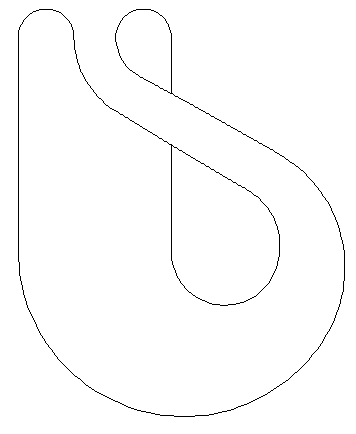
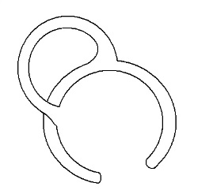
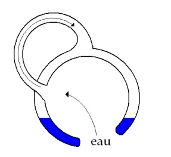
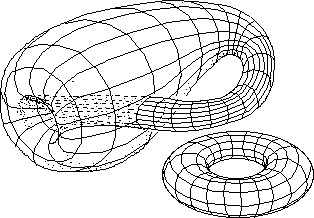
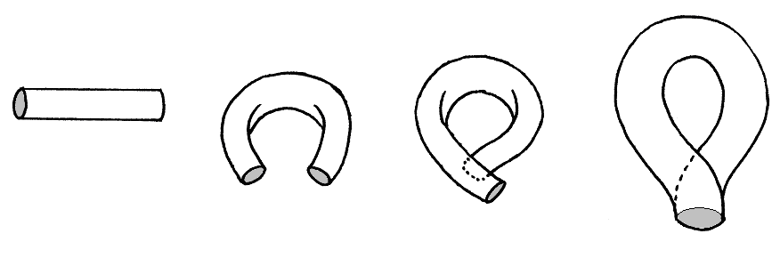
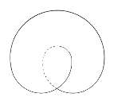
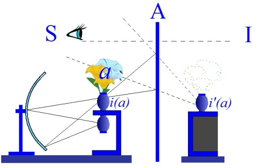
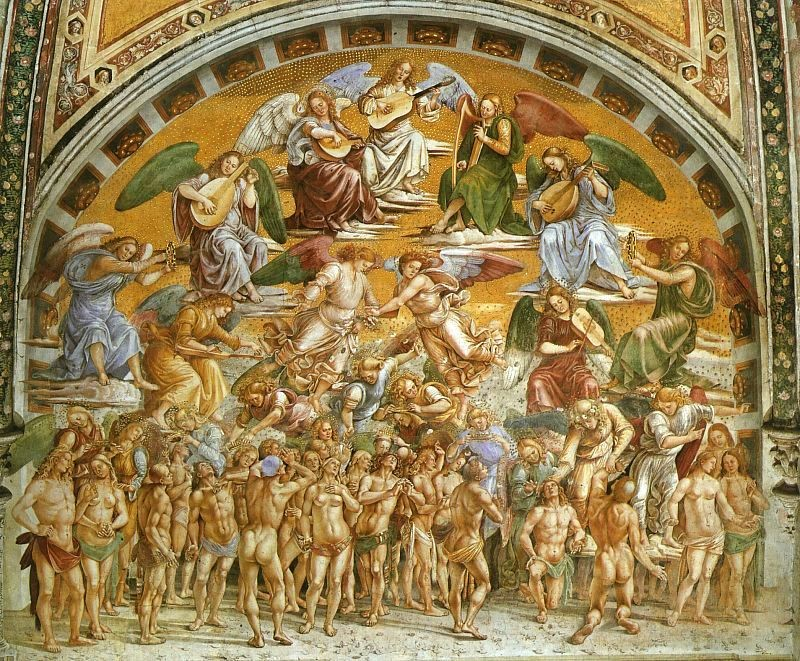

# Leçon 04 | 06 Janvier l965

<!-- source-url: http://staferla.free.fr/S12/S12 PROBLEMES.docx -->
<!-- seminar: s12 -->
<!-- lesson: 04 -->

<!-- id: s12-04-0001 -->

*Problèmes pour la psychanalyse*.

<!-- id: s12-04-0002 -->

C’est ainsi que j’ai entendu situer mon propos pour cette année. Pourquoi, après tout n’ai-je pas dit : *Problèmes pour les psychanalystes* ?

<!-- id: s12-04-0003 -->

C’est qu’à l’expérience il s’avère que pour les psychanalystes, comme on dit, il n’y a pas de problème en dehors de celui-ci : les gens viennent-ils à la psychanalyse, ou pas ?

<!-- id: s12-04-0004 -->

Si les gens viennent à leur pratique, ils savent qu’il va se passer quelque chose - c’est cela la position ferme sur laquelle est ancré le psychanalyste - ils savent qu’il va se passer quelque chose qu’on pourrait qualifier de miraculeux, si l’on entend ce terme en le référant au *mirari,* qui à l’extrême peut vouloir dire s’étonner.

<!-- id: s12-04-0005 -->

À la vérité - Dieu merci - il reste toujours dans l’expérience du psychanalyste cette marge : que ce qui se passe est pour lui *surprenant*.

<!-- id: s12-04-0006 -->

Un psychanalyste de l’époque héroïque, Théodore REIK...

<!-- id: s12-04-0007 -->

> *c’est un bon signe, je viens de retrouver son prénom, je l’avais oublié ce matin, au moment de prendre*
>
> *mes notes, et vous verrez que ceci a le rapport le plus étroit avec mon propos d’aujourd’hui*

<!-- id: s12-04-0008 -->

...Théodore REIK donc, a intitulé un de ses livres : *[Der Überraschte Psychologue](http://www.archive.org/details/Reik_1935_Der_ueberraschte_Psychologe_k)* [^26], *Le psychologue surpris*.

<!-- id: s12-04-0009 -->

C’est qu’à la vérité, à la période héroïque à laquelle il appartient, de *la technique psychanalytique*, on avait encore plus de raisons que maintenant de s’étonner, car si j’ai parlé tout à l’heure de marge, c’est que le psychanalyste, pas à pas, au cours des décades, a refoulé cet étonnement à ses frontières. C’est peut–être qu’aussi maintenant, cet étonnement lui sert de frontière, c’est-à-dire à se séparer de ce monde, d’où tous les gens viennent - ou ne viennent pas - à la psychanalyse.

<!-- id: s12-04-0010 -->

À l’intérieur de ces frontières il sait ce qui se passe ou croit le savoir. Il croit le savoir parce qu’il y a tracé ses chemins.

<!-- id: s12-04-0011 -->

Mais s’il est quelque chose que devrait lui rappeler son expérience, c’est justement cette part d’illusion qui menace, en tout savoir trop sûr de lui.

<!-- id: s12-04-0012 -->

Au temps de Théodore REIK, cet auteur a pu donner l’étonnement, l’*Überraschung*, comme le signal, l’illumination, la brillance qui, à l’analyste, désigne qu’il appréhende l’inconscient, que quelque chose vient de se révéler qui est de cet ordre, de *l’expérience subjective* de celui qui passe tout à coup, et aussi bien sans savoir comment il a fait, de l’autre côté du décor, c’est cela l’*Überraschung*, et que c’est sur cette voie, sur ce sentier, sur cette trace, qu’il sait tout au moins qu’il est dans son propre chemin.

<!-- id: s12-04-0013 -->

Sans doute, à l’heure d’où partait l’expérience de Théodore REIK, ces chemins étaient-ils empreints de ténèbres et la surprise en représentait-elle la soudaine illumination. Des éclairs, si fulgurants soient-ils, ne suffisent pas à constituer un monde[^27].

<!-- id: s12-04-0014 -->

Et nous allons voir que là où FREUD avait vu s’ouvrir les portes de ce monde, il ne savait encore - de ces portes - proprement dénommer ni *les pans* ni *les gonds*.

<!-- id: s12-04-0015 -->

Cela doit-il suffire pour que l’analyste, pour autant qu’il a pu depuis repérer le déroulement régulier d’un processus, sache forcément *ou il est*, ni même *ou* *il va* ? Une « nature » peut être repérée sans être pensée et nous avons assez de témoignages, que de ce processus repéré, beaucoup de choses - et l’on peut dire *peut-être tout*, en tout cas *les fins -* …restent pour lui, problématiques.

<!-- id: s12-04-0016 -->

La question de la terminaison de l’analyse et du sens de cette terminaison n’est point, à l’heure actuelle, résolue. Je ne l’évoque ici que comme témoignage de ce que j’avance concernant ce que j’appelle *le repérage* qui n’est point forcément un repérage pensé.

<!-- id: s12-04-0017 -->

Assurément, il est quelque chose qui reste, dans cette expérience, assuré, c’est qu’elle est associée à ce que nous appellerons des *effets de dénouement*. Dénouement de choses chargées de sens qui ne sauraient être dénouées par d’autres voies, là est le sol ferme sur lequel s’établit le camp de l’expérience analytique. Si j’em­ploie ce terme, c’est justement pour désigner ce qui résulte de cette fermeture dont je suis parti dans mon discours d’aujourd’hui, franchissant ou non les frontières du camp.

<!-- id: s12-04-0018 -->

Le psychanalyste est en droit d’affirmer que *certaines choses*, les *symptômes*, au sens analytique du terme…

<!-- id: s12-04-0019 -->

> qui n’est pas celui de *signe* mais d’un certain *nœud* dont la forme, le serrage, ni le fil n’ont jamais été pro­prement dénommés …qu’un certain *nœud de signes avec les signes*, et qui est proprement ce qui est au fondement de ce qu’on appelle *le symptôme analy­tique*…

<!-- id: s12-04-0020 -->

> à savoir *quelque chose d’installé dans le subjectif*, qui d’aucune façon de dialogue raisonnable et logique ne saurait être résolu …ici le psychanalys­te affirme à celui qui en souffre, au patient :

<!-- id: s12-04-0021 -->

> « V*ous n’en serez délivré, de ce nœud, qu’à l’intérieur du camp* ».

<!-- id: s12-04-0022 -->

Mais est-ce dire qu’il y a là, pour lui l’analyste, plus qu’une vérité empirique, tant qu’il ne la *manœuvre*, tant qu’il ne la *manie*, qu’en raison de l’expérience qu’il a des chemins qui se tracent dans les conditions d’artifice de *l’expérience analytique* ?

<!-- id: s12-04-0023 -->

Est-ce à dire que tout soit dit au niveau de ce dont il peut témoigner de sa pratique dans des termes qui sont ceux de *demande,* de *transfert,* d’*identification* ?

<!-- id: s12-04-0024 -->

Il suffit de constater le tâtonnement, l’impropriété, l’insuffisance des références qui sont données à ces termes de l’expérience.

<!-- id: s12-04-0025 -->

Et pour ne prendre que le premier - le capital, la plaque tournante : *le transfert -* pour constater sur le texte même du discours analytique, qu’à proprement parler à un certain niveau de ce discours on peut dire que celui qui opère ne sait point ce qu’il fait.

<!-- id: s12-04-0026 -->

Car *le résidu* en quelque sorte *irréductible* qui reste dans tous ces discours concernant *le transfert*, en tant qu’il n’a point réussi encore, pas plus que *le langage commun*, que *le langage courant*, que ce qui en est passé dans la représentation commune d’un « rapport *affectif »,* tant que ceci ne sera pas éliminé - puisque « *affectif* » n’a exactement pas d’autre sens que celui d’*irrationnel* - on saura, concernant l’un de ces termes, le *transfert* …

<!-- id: s12-04-0027 -->

> et je n’ai pas besoin ici de revenir sur les autres, les ténèbres s’épaississent progressivement,
>
> à mesure qu’on s’avance vers l’autre terme de la série : l’identification …que rien n’est saisi, que rien n’est théorisé, d’une expérience, si sûrs que soient les règles et les préceptes jusqu’ici accumulés.

<!-- id: s12-04-0028 -->

Il ne suffit pas de savoir faire quelque chose, tourner un vase ou sculpter un objet, pour savoir sur quoi on travaille.

<!-- id: s12-04-0029 -->

D’où la mythologie ontologique sur quoi, *à juste titre*, on vient attaquer le psychanalyste quand on lui dit : « *Ces termes auxquels vous vous référez, et qui en fin de compte vont pointer vers ce lieu confus de la tendance*...

<!-- id: s12-04-0030 -->

puisque c’est à cela que dans la philosophie commune de la psychanalyse se ramènera enfin et de façon erronée, *la pulsion* ...*voilà donc ce sur quoi vous travaillez, vous entifiez, vous ontifiez, une propriété immanente à quelque chose de substantiel : votre « Homme ». Anthropologie de l’analyste, nous la connaissons depuis longtemps cette vieille* οὐσία \[ousia\]*, cette âme, toujours là bien vivante, intacte, inentamée*.

<!-- id: s12-04-0031 -->

Mais l’analyste, pour ne pas la nommer - sauf avec quelque vergogne - exactement par son nom, c’est quand même à elle qu’il se réfère en sa pensée, moyennant quoi il est parfaitement exposé, à juste titre et à bon droit, aux *attaques* dont vous savez d’où elles lui viennent, d’un peu partout où la pensée est en mesure, est en droit, de revendiquer qu’il est inadéquat de parler de « l’homme » comme d’un donné, que « l’homme »…

<!-- id: s12-04-0032 -->

> dans des déterminations nombreuses, qui lui apparaissent aussi bien internes qu’externes,
>
> autrement dit, qui se présentent à lui comme des choses, comme des fatalités …que l’homme ne sait pas qu’il est au cœur de ces prétendues choses, de ces prétendues fatalités, que c’est d’*un certain rapport initial*, *rapport de production*, dont il est le ressort, que ces choses se déterminent - *sans doute à son insu* - pourtant de *sa lignée*.

<!-- id: s12-04-0033 -->

Il est à savoir si, me joignant *par ce que j’enseigne,* à ceux qui ainsi mettent en doute, à juste titre, les statuts donnés, naturels, de l’être humain, il est à savoir si faisant les choses ainsi :

<!-- id: s12-04-0034 -->

- je favorise - comme on me l’a reproché récemment, et venant de très près de moi - *la résistance* de ceux qui n’ont point encore franchi la frontière, qui ne sont point venus à *l’analyse*,

<!-- id: s12-04-0035 -->

- ou si la vérité de ce qu’apporte l’analyse peut être, oui ou non, un accès pour y entrer, si d’une certaine façon de refuser qu’un discours englobe l’expérience analytique…

<!-- id: s12-04-0036 -->

> *et d’autant plus légitimement que cette expérience n’est possible que du fait d’une détermination primordiale de l’homme par le discours*
>
> …si faisant ainsi, ouvrant la possibilité qu’on parle de l’analyse en dehors du champ analytique, je favorise, ou non, la résistance à l’analyse,

<!-- id: s12-04-0037 -->

- ou si la résistance dont il s’agit, ce n’est pas de l’intérieur, *la résistance de l’analyste* à ouvrir son expérience à quelque chose qui la comprenne.

<!-- id: s12-04-0038 -->

Notre départ, notre donné, qui n’est point un donné fermé, *c’est le sujet qui parle*. Ce que l’analyse apporte, c’est que le sujet ne parle pas pour dire ses pensées, qu’il n’y a point le monde \[d’un côté\], et \[de l’autre\] le reflet intentionnel ou significatif à quelque degré que ce soit de ce *personnage grotesque et infatué* qui serait au centre du monde, prédestiné de toute éternité à en donner le sens et le reflet.

<!-- id: s12-04-0039 -->

Voyez-vous ça : *ce pur esprit*, *cette conscience* annoncée depuis toujours *serait là comme un miroir et vaticinerait !*

<!-- id: s12-04-0040 -->

Comment se ferait-il alors - revenons-y toujours - qu’elle vaticinerait en un langage qui lui fait précisément obstacle à elle-même à tout instant, pour manifester ce qu’elle expérimente de plus sûr de son expérience, comme le manifeste clairement *la contradiction* depuis toujours étreinte par les philosophes *entre la logique et la grammaire* ?

<!-- id: s12-04-0041 -->

Puisqu’*ils se plaignent que c’est la grammaire qui entache leur logique*, comment se fait-il qu’on soit depuis toujours aussi attaché à parler dans un langage grammatical,

<!-- id: s12-04-0042 -->

- avec des parties du discours qui fondent comme eux–mêmes, qui réfléchissent les purs miroirs,

<!-- id: s12-04-0043 -->

- avec des parties du discours dont ils constatent que ces parties c’est ce qui entache leur logique et que s’ils s’y fient, ...c’est justement à ce moment qu’*ils se mettent le doigt dans l’œil.*

<!-- id: s12-04-0044 -->

Nous avons *une expérience* :

<!-- id: s12-04-0045 -->

- *une expérience* qui se poursuit tous les jours dans le cabinet de chaque analyste : *qu’il le sache ou qu’il ne le sache pas n’a aucune espèce d’importance*,

<!-- id: s12-04-0046 -->

- *une expérience* qui nous évite de recourir à ce détour de *la critique philosophique* en tant qu’elle *témoigne de sa propre impasse*,

<!-- id: s12-04-0047 -->

- *une expérience où* nous touchons du doigt que *c’est le fait qu’il parle*, le sujet, le patient - *qu’il parle, c’est-à-dire, qu’il émette ces sons rauques ou suaves qu’on appelle le matériel du langage - qui a déterminé <u>d’abord</u> le chemin de ses pensées*, *qui l’a déterminé tellement <u>d’abord</u>,*

<!-- id: s12-04-0048 -->

> et d’une façon tellement originelle*, qu’il en porte sur la peau la trace* comme un animal marqué*,* *qu’il est identifié d’abord par ce quelque chose* d’ample ou de réduit.

<!-- id: s12-04-0049 -->

Mais on s’aperçoit maintenant que c’est beaucoup plus réduit qu’on ne croit, qu’une langue ça tient sur une feuille de papier grande comme ça, avec la liste de ses phonèmes, et on peut bien continuer d’essayer de conserver les vieux clivages et de dire qu’il y a deux niveaux dans la langue :

<!-- id: s12-04-0050 -->

- le niveau de *ce qui ne signifie pas* : c’est *les phonèmes*,

<!-- id: s12-04-0051 -->

- et les autres qui *signifient*, ce sont *les mots*.

<!-- id: s12-04-0052 -->

Eh bien je suis là aujourd’hui pour vous rappeler que les premières appréhensions des effets de *l’inconscient* ont été réalisées par FREUD *dans des années entre* l890 et l900. Qu’est-ce qui lui en a donné le modèle ?

<!-- id: s12-04-0053 -->

- Article de l898[^28] sur *l’oubli d’un nom propre* : *l’oubli du nom de* SIGNORELLI comme auteur des célèbres [*Fresques d’Orvieto*](#SIGNRELLIfresques).

<!-- id: s12-04-0054 -->

Je vous ferai remarquer que le premier effet *manifeste*, structurant pour lui, pour sa pensée, et qui ouvrait la voie, ne s’est produit… et il l’a parfaitement pointé, il l’a articulé d’une façon si appuyée dans cet article dont vous savez qu’il a été repris au début du livre de la [*Psychopathologie de la vie quotidienne*](http://classiques.uqac.ca/classiques/freud_sigmund/psychopathologie_vie_quotid/Psychopahtologie.pdf) [^29] qui devait paraître quelques six ans plus tard.

<!-- id: s12-04-0055 -->

C’est de là qu’il est reparti parce que c’est de là que s’originait son expérience. *Qu’est-ce qui fout le camp dans cet oubli ?*…

<!-- id: s12-04-0056 -->

> qu’on appelle *oubli*, et dès les premiers pas , vous voyez bien que ce à quoi, il y a toujours à faire attention c’est à la signification car bien sûr, ce n’est pas un *oubli*, l’*oubli* freudien c’est une forme de la mémoire, c’est même sa forme la plus précise, alors il vaut mieux se défier de mots comme *oubli*, *Vergessen*. Disons, un trou. …*qu’est-ce qui a foutu le camp par ce trou ? C’est des phonèmes !*

<!-- id: s12-04-0057 -->

Ce qui lui manque c’est pas SIGNORELLI en tant que SIGNORELLI lui rappellerait des choses qui lui tournent sur l’estomac.

<!-- id: s12-04-0058 -->

Il n’y a rien à refouler justement, vous allez le voir, c’est articulé dans FREUD. Il ne refoule rien, il sait très bien de quoi il s’agit, et pourquoi SIGNORELLI et les *Fresques d’Orvieto* l’ont profondément touché, sont parentes de ces choses, de ce qui le préoccupe le plus, le lien de *la mort* avec *la sexualité*.

<!-- id: s12-04-0059 -->

Rien n’est refoulé mais ce qui fout le camp c’est *les deux premières syllabes* du mot SIGNORELLI. Et tout de suite, il dit, il pointe : « *C’est ça qui a le plus grand rapport avec ce que nous voyons, avec les symptômes*... »

<!-- id: s12-04-0060 -->

*Et à ce moment-là il ne connaît encore que les symptômes de l’hystérique*.

<!-- id: s12-04-0061 -->

C’est au niveau du matériel signifiant que se produisent *les substitutions, les glissements, les tours de passe-passe, les escamotages* auxquels on a affaire quand on est sur la voie, sur la trace de la détermination du symptôme et de son dénouement. *Seulement, à ce moment-là*...

<!-- id: s12-04-0062 -->

> encore que tout son discours est là pour nous témoigner qu’il est tellement sur le vif de ce dont il s’agit
>
> dans ce phénomène que, il ne cesse à tous les détours, d’accentuer comme il peut ce dont il s’agit …*il dit* « *Dans ce cas, c’est une « äusserlichen Bedingung » une détermination de l’extérieur .*».

<!-- id: s12-04-0063 -->

Secondairement, dans un retour de plume, il dira : « *On pourrait m’opposer qu’il y a*…

<!-- id: s12-04-0064 -->

> ce qui prouve à quel point il sent bien la différence entre deux types de phénomènes, qui pourraient là se différencier …*il pourrait y avoir à l’intérieur, en effet, quelques rapports entre le fait qu’il s’agisse d’un achoppement sur le nom de Signorelli et le fait que Signorelli, ça traîne avec soi* - étant données les *Fresques d’Orvieto* puisque c’est de ça qu’il s’agit - *ça traîne avec soi beaucoup de choses qui peuvent m’intéresser un peu plus que je ne le sais moi-même*.»

<!-- id: s12-04-0065 -->

Néanmoins, il dit : « *On pourrait m’objecter*... ». Mais c’est tout ce qu’il peut dire car lui sait bien *qu’il n’en est rien*.

<!-- id: s12-04-0066 -->

Et nous allons tâcher de voir, d’entrer plus profondément dans le mécanisme et de démontrer ce que ce cas *princeps*, ce modèle premier, surgi dans la pensée de FREUD de quelque chose pour nous d’initial, de crucial, nous allons voir plus en détail comment il faut le *concevoir*, quels *appareils* nous sont imposés pour pouvoir rendre compte exactement de ce dont il s’agit.

<!-- id: s12-04-0067 -->

Que nous y trouvions quelque aide, du fait que depuis ce temps il y a quelque chose que nous avons appris à manier comme *un objet* et qui s’appelle *le système de la langue*, bien sûr c’est une aide pour nous, mais d’autant plus frappant est le fait que *le premier témoignage* de FREUD, de son discours quand il aborde ce champ, laisse complètement en réserve, absolument dessiné, qu’il n’y a absolument rien à ajouter à son discours, il n’y a qu’à y ajouter ici : *signans* et *signatum* \[Cf. Stoïciens\].

<!-- id: s12-04-0068 -->

C’est ici qu’assurément *la fonction du nom propre* - comme je vous ai annoncé que je serai amené à m’en servir *-* prend assez d’intérêt.

<!-- id: s12-04-0069 -->

Elle prend de l’intérêt pour le privilège qu’elle a conquis, cette notion du *nom propre*, dans le discours des linguistes.

<!-- id: s12-04-0070 -->

Soyez contents, ceux à qui je parle jusqu’à présent de la façon la plus majeure, la plus *ad hominem*, soyez contents les analystes : il n’y a pas que vous qui avez des embarras avec le discours. Vous en êtes même justement les mieux protégés.

<!-- id: s12-04-0071 -->

Les linguistes j’aime mieux vous le dire, avec ce *nom propre*, eh bien, ils ne s’en sortent pas facilement !

<!-- id: s12-04-0072 -->

Il est paru une quantité considérable d’ouvrages sur ce sujet, qui sont pour nous - qui devraient être pour nous - fort intéressants à scruter au sens propre du terme, à prendre partie par partie, avec des notes. Comme je ne peux pas tout faire, j’aimerais bien par exemple que quelqu’un s’en charge *dans les séances dites fermées,* que je réserve à ce cours pour cette année, en essayant d’y réintroduire la fonction du séminaire.

<!-- id: s12-04-0073 -->

*Un livre par exemple* de M. Viggo BRØNDAL[^30]: *Les parties du discours*, excellent livre paru à Copenhague chez MUNKSGAARD.

<!-- id: s12-04-0074 -->

Un autre, d’une demoiselle SØRENSEN, bien sympathique qui s’appelle : *The meaning of proper names*[^31], paru également à Copenhague. *Il y a des lieux dans le monde où on peut s’occuper de choses intéressantes, mais pas entièrement se consacrer à créer la bombe atomique.*

<!-- id: s12-04-0075 -->

Et puis il y a *The theory of proper names* de *Sir* Alan H.GARDINER[^32] égyptologue bien connu - paru à *Oxford University press*.

<!-- id: s12-04-0076 -->

Celui-là est particulièrement intéressant et je dirai *gratiné* car c’est vraiment *une somme*, une sorte de *point* - concentré sur le sujet des noms propres - de ce qu’on peut appeler l’erreur, l’erreur consommée, évidente, apparente, étalée.

<!-- id: s12-04-0077 -->

Cette erreur, comme beaucoup d’autres, prend son origine sur les chemins de la vérité, à savoir qu’elle part d’une petite remarque qui avait son sens sur les voies de l’*Aufklärung*. Il remarque que John Stuart MILL[^33], instituant une différence fondamentale dans *la fonction du nom en général* - personne n’a encore jusqu’à présent dit ce que c’est que le nom, mais enfin on en parle – *du nom en général : il a deux fonctions, de dénoter ou de connoter.*

<!-- id: s12-04-0078 -->

- Il y a des noms qui comportent en eux des possibilités de développement, cette sorte de richesse qui s’appelle définition et qui vous renvoie dans le dictionnaire, de nom en nom indéfiniment. Ça, ça *connote*.

<!-- id: s12-04-0079 -->

- Et puis il y en a d’autres qui sont faits pour *dénoter*. J’appelle par son nom une personne présente ici au premier rang ou au dernier, en apparence, ça ne concerne qu’elle. Je ne fais que *la dénommer*. Et à partir de là, nous définirons *le nom propre comme quelque chose qui n’intervient dans la nomination d’un objet qu’en raison des vertus propres de sa sonorité*, il n’a en dehors de cet effet de *dénotation* aucune espèce de percée significative.

<!-- id: s12-04-0080 -->

Tel est ce que nous enseigne M. GARDINER. Bien sûr, ceci n’a que de très petits inconvénients : par exemple de le forcer, au moins dans un premier temps, à éliminer tous les noms propres - ils sont nombreux - qui ont en eux-mêmes un sens.

<!-- id: s12-04-0081 -->

Oxford, vous pouvez le couper en deux, ça fait quelque chose, ça se rapporte à quelque chose qui a rapport au bœuf, *et ainsi de suite*, je prends ses propres exemples. Villeneuve, Villefranche, tout ça c’est des noms propres mais en même temps, ça a un sens.

<!-- id: s12-04-0082 -->

En soi-même ça pourrait nous *mettre la puce à l’oreille*. Mais bien sûr, on dit : c’est indépendant de cette signification que ça a, que ça sert comme nom propre. Malheureusement, il saute aux yeux que si un nom propre n’avait aucune espèce de signification, au moment où je présente quelqu’un à quelqu’un d’autre, il ne se passerait absolument rien du tout.

<!-- id: s12-04-0083 -->

Alors qu’il est clair que si moi je me présente à vous comme Jacques LACAN , je dis quelque chose, quelque chose qui tout de suite comporte pour vous un certain nombre d’effets significatifs. D’abord parce que je me présente à vous *dans un certain ordre*.

<!-- id: s12-04-0084 -->

Si je suis dans une société, c’est que je ne suis pas dans cette société un inconnu, d’autre part, du moment que je me présente à vous Jacques LACAN, ça élimine déjà que ce soit un ROCKFELLER *par exemple*, ou le Comte de Paris.

<!-- id: s12-04-0085 -->

Il y a déjà un certain nombre de références qui viennent tout de suite avec un nom propre.

<!-- id: s12-04-0086 -->

Il peut se faire aussi que vous ayez déjà entendu mon nom quelque part. Alors bien sûr ça s’enrichit.

<!-- id: s12-04-0087 -->

Dire qu’un *nom propre*, pour tout dire, *est sans signification*, est quelque chose de grossièrement fautif.

<!-- id: s12-04-0088 -->

Il comporte au contraire avec soi beaucoup plus que des significations, toute une espèce de somme d’avertissements.

<!-- id: s12-04-0089 -->

On ne peut en aucun cas, désigner comme son trait distinctif, ce caractère par exemple, d’arbitraire ou de conventionnel, puisque c’est la propriété par définition de toute espèce de signifiants, qu’on a assez insisté, d’ailleurs maladroitement, sur cette face du langage, en accentuant qu’il est ainsi *arbitraire* et *conventionnel* : en réalité, c’est autre chose qu’on vise, c’est d’autre chose qu’il s’agit.

<!-- id: s12-04-0090 -->

C’est ici que prend sa valeur *ce petit modèle*, que sous des formes différentes, mais en réalité toujours les mêmes, j’agite devant vous, je parle de ceux qui sont *mes auditeurs en ce lieu* depuis mon cours de cette année et que d’autres connaissent bien depuis longtemps, une *bande de Mœbius*, ma *bouteille* dite *de Klein* de la dernière fois.

<!-- id: s12-04-0091 -->

C’est de ça qu’il s’agit. C’est de ça qu’il retourne : c’est *d’un modèle, d’un support*, dont il n’est absolument pas propre de le considérer comme s’adressant à la seule imagination, puisque d’abord j’ai voulu vous faire, si l’on peut dire, « *toucher de la comprenette* » quelque chose ici, là, derrière le front, qui se caractérise par ceci justement : qu’elle ne se comprend pas… Et c’était là que FREUD dans ses premiers essais, portait ses mains sur la tête de la patiente dont il voulait justement lever la résistance. C’était une des formes primitives de cette opération.

<!-- id: s12-04-0092 -->

Il n’est pas si facile d’opérer, là, avec ces modèles topologiques. Ce n’est pas *plus facile* à moi qu’à vous. Il arrive quelquefois que quand je suis tout seul, je m’embrouille. Naturellement, quand j’arrive devant vous, j’ai fait des exercices !

<!-- id: s12-04-0093 -->

Alors, pour reprendre mon schéma de la dernière fois, cette espèce de petite méduse, ce petit nautilus flottant, sous lequel on m’a laissé toutes sortes de figures qui doivent pour vous, beaucoup éclaircir la situation.

<!-- id: s12-04-0094 -->

*Est-ce qu’on arrive à voir ?*

<!-- id: s12-04-0095 -->

<!-- id: s12-04-0096 -->

Si je vous l’ai schématisé ainsi la dernière fois, cette *bouteille de Klein*, c’est-à-dire telle que les mathématiciens, qui ne sont pas de mauvaises gens, ont cru devoir la souffler, si je puis dire, cette *bouteille de Klein*, pour l’amusement du public !

<!-- id: s12-04-0097 -->

Si je vous la représente ainsi, exactement tout comme l’ont fait les mathématiciens, car il y a toute une face des mathématiques qui volontiers s’introduit par le biais de la récréation… Ce n’est pas compliqué, une *bouteille de Klein*, vous pouvez en faire faire…

<!-- id: s12-04-0098 -->

> quelqu’un proposait même qu’on fasse *une petite boutique à l’entrée*, ici où chacun pourrait se procurer *sa petite bouteille de Klein*. Ce serait un signe de reconnaissance. Ça ne coûte pas très cher une *bouteille de Klein*, surtout si on les commande en série.

<!-- id: s12-04-0099 -->

Comme je vous l’ai expliqué, c’est une bouteille, c’est celle-ci :

<!-- id: s12-04-0100 -->

 

<!-- id: s12-04-0101 -->

Une bouteille dont le goulot serait rentré à l’intérieur pour aller, comme je vous l’ai expliqué, s’insérer sur le cul de la bouteille.

<!-- id: s12-04-0102 -->

Et si en plus, vous soufflez un peu ce goulot rentré, alors vous avez ce très très joli schéma d’une double sphère, l’une comprenant l’autre, et comme la dernière fois je pense que vous l’avez entendu, ceci est particulièrement heureux pour vous faire, en quelque sorte, toucher du doigt de la façon la plus originelle quel avantage pour son modèle l’homme a pu trouver très tôt dans cette double et conjuguée image du *microcosme* et du *macrocosme*.

<!-- id: s12-04-0103 -->

<!-- id: s12-04-0104 -->

À savoir que ce serait pour moi un jeu - auquel malheureusement je n’ai pas le temps de me livrer, je vous l’esquisse – de vous montrer que par exemple, la première astronomie chinoise, qui est géniale, je vous l’assure, la première astronomie chinoise, celle qu’on appelle du *Kai Thien* se composait d’une terre ainsi formulée, d’un ciel qui la recouvrait comme bol sur bol, et dont les racines du ciel étaient censées plonger dans quelque chose qu’on tendait plutôt à considérer comme aqueux, et qui étaient portées, comme sur l’eau serait porté un bol retourné. Ceci permettait bien plus que le repérage très exact d’un certain nombre de coordonnées géographiques et astronomiques, mais toute une conception du monde.

<!-- id: s12-04-0105 -->

L’ordre, l’ordre des pensées comme des choses, et l’ordre de la société étant… s’inscrivant, entièrement de façon plus ou moins analogique, homologique, par rapport à ce qu’un tel schéma permettait de marquer des rapports de ce qu’on pourrait appeler les coordonnées verticales, les coordonnées à l’azimut, avec les coordonnées équatoriales.

<!-- id: s12-04-0106 -->

Quand on était en Chine, bien sûr le pôle nord venait à peu près se placer comme ça, comme un bonnet incliné, et puis le pôle de l’écliptique - *on savait parfaitement qu’il était différent* - venait se marquer à côté, ça pouvait prêter à toutes sortes de différenciations, d’analogies, je vous l’ai dit, d’inter-nœuds classificatoires et de correspondances où chacun pouvait retrouver sa place avec plus d’aise qu’ailleurs.

<!-- id: s12-04-0107 -->

Ce schéma fondamental - *je vous fais intervenir l’astronomie chinoise, c’est un exemple -* ce schéma fondamental vous le retrouvez toujours et à tous les niveaux de métamorphose de la culture, plus ou moins enrichi mais sensiblement le même, plus ou moins cabossé mais avec les mêmes issues, je veux dire issues nécessaires : toujours plus ou moins camouflées, car bien entendu ici on ne sait pas ce qui se passe, mais comme à la base de l’expérience analytique on peut également se passer de savoir ce qui se passe, à savoir où est le point de la suture : le point de la suture est entre ce que je pourrais appeler « *la peau externe de l’intérieur* », et ce que je pourrais appeler « *la peau interne de l’extérieur* ».

<!-- id: s12-04-0108 -->

Sans doute l’analyse - vous ai-je dit - nous a appris un certain chemin d’accès à l’entre-deux, une certaine façon que le sujet peut avoir en quelque sorte de se dépayser par rapport à sa situation à l’intérieur de *ces deux sphères*, *la sphère interne* et *la sphère externe*, il peut arriver à se mettre dans l’entre-deux, lieu étrange, lieu du rêve et de l’*Unheimlichkeit*.

<!-- id: s12-04-0109 -->

En somme, si vous me permettez de trancher dans le vif, je dirai que la question est la suivante : quand vous aurez une fois tenu entre vos mains - et ce serait peut-être pour cela, une raison de répandre, en effet, le modèle de cette bouteille - une *bouteille de Klein* vous pourrez y verser de l’eau par le seul orifice qu’elle présente pour vous qui la tenez comme un objet, elle passera donc ici, par ce petit *col de cygne* et viendra dans cet entre-deux se loger ainsi, réalisant un certain niveau.

<!-- id: s12-04-0110 -->

<!-- id: s12-04-0111 -->

Par l’opération inverse, vous pourrez en faire sortir un certain nombre de gorgées, vous pourrez même boire à cette bouteille, mais vous verrez qu’elle est *malicieuse*, car une fois l’eau introduite à l’intérieur il n’est pas si facile que ça de la sortir toute.

<!-- id: s12-04-0112 -->

Ici nous passons sur le plan de la métaphore. Qu’est–ce que c’est en somme, d’aller explorer le champ du rêve ou de l’étrangeté dans l’analyse ? C’est aller s’apercevoir de ce qui s’est coincé, si l’on peut dire, entre ces deux sphères d’une signification, d’un signifié, qui d’abord… dont d’abord s’est fait là, la mixture.

<!-- id: s12-04-0113 -->

On remet du *signifié* en circulation, il s’agit de savoir pourquoi faire. Si nous nous fions à l’aide que j’attends de cette petite image, ce devrait être pour *l’évacuer* purement et simplement, ce n’est pas pour la remettre là à l’intérieur. Ce n’est pas pour nous refaire *une âme* avec cette *âme* qui déjà nous encombrait assez de ce ballant qui *résistait* - comme nous ne savons pas exactement ni le mode, ni l’équilibre, ni les étranglements de cette *vacuité* - jouait comme un lest absolument immaîtrisable.

<!-- id: s12-04-0114 -->

Car il suffit de *compliquer* un petit peu cette figure, je livre ça à votre fantaisie et à votre imagination, pour que vous voyiez, qu’à cette seule condition bien sûr d’y inscrire des logettes, on peut en faire un instrument d’une stabilité particulière, un instrument, par exemple, qu’il suffit d’incliner un tout petit peu pour qu’aussitôt il se précipite et il bascule par terre.

<!-- id: s12-04-0115 -->

Le but, l’objectif de l’évacuation de la signification est tout de même bien le premier aspect suggéré par la visée de notre expérience.

<!-- id: s12-04-0116 -->

Jusqu’à un certain degré, comment se fait-il qu’elle ne s’opère pas plus facilement ? C’est en raison des propriétés trompeuses de la figure. Je vais tâcher de m’expliquer et de vous faire comprendre ce que je veux dire en cette occasion.

<!-- id: s12-04-0117 -->

Elle est justement - la figure, la *bouteille de Klein -* ici dessinée sous un aspect trompeur, parce que c’est l’aspect sous lequel effectivement *la structure nous trompe* : c’est l’aspect sous lequel il semble que notre conscience, que notre pensée, que notre pouvoir de signifier, redouble comme une doublure interne ce qui l’envelopperait, moyennant quoi vous n’avez plus qu’à retourner l’objet et vous créerez cette idée de sujet de la connaissance qui inversement, ici, enveloppe l’objet du monde qu’il propose.

<!-- id: s12-04-0118 -->

Seulement, quand tout à l’heure je disais :

<!-- id: s12-04-0119 -->

- que ce n’est pas là avancer quelque chose qui soit de l’ordre de l’intuitif,

<!-- id: s12-04-0120 -->

- que ce n’est point là, même l’ébauche d’une nouvelle esthétique transcendantale, ...que je vous invitais plutôt à vous méfier des propriétés imaginatives de ce que j’appelais improprement « *le modèle* », c’est que, une vraie *bouteille de Klein* - si j’ose m’exprimer ainsi, introduisant pour la première fois ici le mot vérité, et au niveau où il convient -

<!-- id: s12-04-0121 -->

Une vraie *bouteille de Klein* ne prend cette forme, cette forme sous laquelle je vous la dessine au tableau grossièrement, à savoir pour la clarté sous une forme en coupe transversale, et que naturellement vous imaginez, si je puis dire, dans son volume, ce qui veut dire dans sa rondeur. Vous en faites chacune des parties tourner autour d’elle-même, se *cylindrifier*, ce qui vous permet de voir.

<!-- id: s12-04-0122 -->

Seulement voilà, *une surface* topologique est quelque chose qui nécessite la distinction entre deux espèces de ses propriétés : les propriétés inhérentes à la surface et les propriétés qu’elle prend du fait que, cette surface, *vous la mettez dans un espace*, lui, réel, *à trois dimensions*.

<!-- id: s12-04-0123 -->

De même... de même tout ce qui peut être ici imagé de la signification fondamentale du rapport microcosme-macrocosme, n’a de sens que pour ce que les propriétés subjectives inhérentes à cette topologie sont immergées dans l’espace de la représentation commune, de ce qu’on appelle communément *intersubjectivité*, mot dont j’ai entendu pendant des années un certain nombre de gens, censés travailler avec moi, se gargariser le fond de la gorge, en croyant qu’ils tenaient dans ce mot « *intersubjectivité* » l’équivalent de mon enseignement. Que c’est le fait qu’un sujet comprend un autre sujet, qu’un vicomte rencontre un autre vicomte, qu’un gendarme rencontre un autre gendarme qui fait le fondement du mystère et l’essence de l’expérience psychanalytique, la dimension de l’intersubjectivité n’a absolument rien à faire avec la question que nous sommes en train d’élucider.

<!-- id: s12-04-0124 -->

La vraie forme, nous pouvons essayer de l’approcher, toujours pour votre commodité, *en la mettant dans notre espace à trois dimensions*. Mais vous allez voir ce qu’elle va vous suggérer, concernant les impasses dont il s’agit dans notre expérience, de toutes autres voies. Dans son essence, cette *bouteille de Klein* qu’est-ce que c’est ? C’est tout simplement quelque chose de fort voisin d’un tore :

<!-- id: s12-04-0125 -->

 

<!-- id: s12-04-0126 -->

Je veux dire d’un cylindre que vous recourbez pour qu’il se rejoigne par la suture des deux coupures circulaires qui terminent ce cylindre tronqué moyennant quoi vous ferez ce qu’on appelle un anneau.

<!-- id: s12-04-0127 -->

Au lieu de cela, supposez que ce cylindre tronqué que vous êtes en train de transformer en tore, vous laissiez ici, ouverte la coupure circulaire mais que l’autre coupure circulaire qu’il s’agit de suturer, vous l’ameniez, comme vous l’image ce petit dessin :

<!-- id: s12-04-0128 -->

<!-- id: s12-04-0129 -->

…de façon à la laisser ouverte, ou d’une façon où la suture, où la couture - évoquez votre pratique ménagère - où la couture se fasse, si l’on peut dire *de l’intérieur*, de telle sorte que, si vous voulez, prenez par le bas ici : *l’extérieur du bas* va venir se conjoindre, se continuer avec *l’intérieur de l’autre partie du bas* et de même ici de l’autre côté. Vous saurez alors quoi ?

<!-- id: s12-04-0130 -->

Si vous ne le plongez pas dans l’espace à trois dimensions de l’intersubjectivité commune, vous aurez quelque chose qui est à la fois ouvert et fermé, puisque ces surfaces ne se traversent que pour autant que vous êtes dans un espace à trois dimensions.

<!-- id: s12-04-0131 -->

De par leur propriété interne de surface, il n’est nul besoin de supposer qu’elles se traversent pour aboutir à cet état de suture.

<!-- id: s12-04-0132 -->

C’est exactement le même schéma, qui est celui que je vous ai rappelé, quand vous représentant la forme fondamentale d’une *surface de Mœbius*, qui est cette sorte de lame, telle que vous pouvez la figurer en prenant une simple bande et en la nouant à elle-même après un simple *demi-tour,* vous ne pouvez la fermer que par une surface qui se recoupe elle-même, et si cette surface ne se recoupe pas elle-même, la *surface de Mœbius* la traversera.

<!-- id: s12-04-0133 -->

Ceci est une nécessité impliquée par la plongée dans l’espace à trois dimensions mais ne définit aucunement en elle-même les propriétés de la surface. Vous me direz : nous y sommes dans l’espace à trois dimensions ! Eh bien en effet, allons-y.

<!-- id: s12-04-0134 -->

Même dans l’espace à trois dimensions, il reste que cette structure a une qualité privilégiée qui la distingue d’une autre, et qui est celle-ci : ce qui vient occuper dans mon schéma *le pourtour de cette entrée, de ce trou, de cet orifice*, qui la spécifie, et qui en fait cette surface d’où les choses ne sont point orientables, parce qu’elles peuvent toujours passer de l’endroit à l’envers, la place de cette ouverture est essentielle, structurante pour les propriétés de la surface : *elle peut être occupée par n’importe quel point de la surface.*

<!-- id: s12-04-0135 -->

Il vous suffira d’un petit peu d’imagination pour voir que contrairement à un anneau, à un tore, qui ne peut en quelque sorte que virer sur lui-même - vous pouvez le faire rester à la même place mais il vire dans tout son tissu - d’une façon ici tout à fait contraire, c’est à chaque place du tissu que peut, par un souple glissement, se produire *cet anneau de manque* qui lui donne sa structure.

<!-- id: s12-04-0136 -->

Ceci est à proprement parler ce que nous essayons de considérer aujourd’hui concernant le phénomène dit de *l’oubli du nom propre*.

<!-- id: s12-04-0137 -->

La thèse est la suivante : tout ce que *les théoriciens*, et nommément les linguistes, ont essayé de dire sur *le nom propre*, achoppe autour de ceci qu’assurément il est plus spécialement indicatif, dénotatif qu’un autre, mais qu’on est incapable de dire en quoi.

<!-- id: s12-04-0138 -->

Que d’autre part, il a justement par rapport aux autres cette propriété, tout en étant le nom en apparence le plus propre à quelque chose de *particulier*, d’être justement ce qui se déplace, ce qui voyage, ce qu’on lègue, et pour tout dire *si j’étais entomologiste,* qu’est-ce que je désirerais de plus au monde que de voir un jour une tarentule s’appeler de mon nom ?

<!-- id: s12-04-0139 -->

Qu’est-ce que ça peut vouloir dire ? Pourquoi est-ce que *le nom propre*, tout en étant soi-disant cette partie du discours qui aurait des caractéristiques qui la spécifieraient absolument, pourquoi justement est-ce qu’on peut l’employer, contrairement à ce que disent à l’occasion - car on ne peut pas imaginer à quelle sorte de glissements de plume un sujet pareil a pu entraîner les linguistes - *ça peut s’employer parfaitement au pluriel* comme chacun sait : on dit les DURAND, les POMMODORE, tout ce que vous voudrez, les BROSSARBOURG dans COURTELINE, vous vous souvenez : *L’honneur des BROSSARBOURG*.[^34] On peut employer un nom*,* verbalement, en fonction de verbes, en fonction d’adjectifs, voire d’adverbes comme peut-être un jour je vous le ferai *toucher du doigt*.

<!-- id: s12-04-0140 -->

Qu’est-ce que c’est que ce *nom propre* dans l’ambiguïté de cette fonction indicative et qui semble trouver la compensation du fait que ses propriétés de renvoi ne sont pas spécifiquement - encore qu’elles le soient - *du champ significatif*, deviennent des propriétés de déplacement, de saut ?

<!-- id: s12-04-0141 -->

Faut-il à ce niveau dire - comme je le crois - que c’est ce à quoi Claude LÉVI-STRAUSS aboutit, dans sa pensée, et dans ce qu’il articule, au niveau du chapitre *Universalisation et particularisation* et du chapitre *L’individu comme espèce* dans *La Pensée sauvage*[^35] : il tente d’intégrer, de montrer que *le nom propre* n’attache rien de plus spécifique que l’usage *consciemment classificatoire* qu’il donne aux catégories dans leur opposition pour que, dans la pensée, dans son rapport avec le langage, elle détermine un certain nombre *d’oppositions fondamentales*, *de recoupements successifs*, de clivages qui permettent en quelque sorte à *la pensée sauvage* de retrouver exactement la même méthode qui est celle que donne PLATON pour être celle, fondamentale, de la création du concept.[^36]

<!-- id: s12-04-0142 -->

Et notre *nom propre* ne serait en fin de compte qu’à insérer comme le dernier terme de ce processus classificatoire, celui qui serre les choses d’assez près pour enfin atteindre l’individu comme point précisément particulier de l’espèce.

<!-- id: s12-04-0143 -->

Il est clair - je vous prie de vous reporter à ces chapitres - que dans le mouvement même d’élucidation, qui est celui auquel il s’efforce, LÉVI-STRAUSS rencontre l’obstacle, et qu’il le désigne. Il le désigne… il le désigne à proprement parler en ceci qu’il rencontre… *qu’il rencontre la fonction du donneur de nom*. Le *nom propre* c’est un nom qui est donné. Par le *parrain*, direz-vous et ceci pourra vous suffire, en effet, si vous vous résolvez à faire du parrain le *quelqu’un d’autre*.

<!-- id: s12-04-0144 -->

Seulement, il n’y a pas que le parrain, il y a aussi toutes sortes de règles, il y a des moments, il y a toute une configuration qui est une configuration de l’échange et de la structure sociale, et c’est ici que Claude LÉVI-STRAUSS s’arrêtera à dire, et à dire à juste titre, que le problème du *nom propre* ne saurait être traité sans introduire une référence étrangère au champ proprement linguistique, qu’il ne saurait être isolé comme « *partie du discours* » en dehors de la fonction, de l’usage qui le définit.

<!-- id: s12-04-0145 -->

C’est très précisément ce contre quoi, ici, j’élèverai une objection d’un autre registre : il est aussi faux de dire que *le nom propre* est là le serrage, la réduction, au niveau de *l’exemplaire unique*, du même mécanisme par où on a procédé du genre à l’espèce et par où a progressé la classification, il est aussi faux de le faire, et aussi dangereux, et aussi lourd de conséquences, que dans la théorie mathématique des ensembles, de confondre ce qu’on appelle *un sous-ensemble qui ne comprend qu’un seul objet*, avec cet objet lui-même. Et c’est ici que ceux qui se trompent, qui font erreur, que ceux qui s’enfoncent très loin et persévèrent dans leur erreur, finissent par devenir pour nous un objet de démonstration.

<!-- id: s12-04-0146 -->

Bertrand RUSSELL a tellement identifié *le nom propre* au dénotatif et à l’indicatif qu’il a fini par dire que *le démonstratif*, *le démonstratif « that »,* comme il dit dans sa langue,* ceci c’est le nom propre par excellence*. On se demande pourquoi il n’appelle pas, ce point x sur le tableau noir qui lui est familier, pourquoi il ne l’appelle pas Antoine par exemple, et ce bout de craie Honorine. *Pourquoi est-ce que ça nous apparaît tout de suite absurde* cette sorte de conséquence ?

<!-- id: s12-04-0147 -->

*Il y a bien des manières* de vous mener dans la voie où je veux vous mener et d’abord, par exemple, ceci qui peut vous sauter aux yeux tout de suite, ceci ne viendra à l’idée de personne parce que ce point x, par définition si je le mets au tableau par ici, dans une démonstration mathématique*,* c’est justement dans la mesure où ce point est essentiellement remplaçable et c’est pour ça aussi que je n’appellerai jamais un bout de craie Honorine.

<!-- id: s12-04-0148 -->

Je pourrai appeler de ce nom, par contre, ce que DIDEROT appelait [*ma vieille robe de chambre*](http://www.ebooksgratuits.com/pdf/diderot_regrets_sur_ma_vieille_robe_de_chambre.pdf). Ceci n’est qu’un *hint* \[allusion\], qui fait intervenir la fonction du remplaçable et du même coup, à la place et pour aujourd’hui - vue l’heure - faire tout de suite, le bond qui peut-être nous permettrait mieux d’articuler, d’enchaîner, la prochaine fois.

<!-- id: s12-04-0149 -->

Je vous dirai que *ce n’est pas comme exemplaire de l’espèce*…

<!-- id: s12-04-0150 -->

> resserré comme unique à travers un certain nombre de particularités, aussi *exemplaire* qu’il puisse être …*que le particulier est dénommé d’un nom propre*, c’est en ce sens qu’il est irremplaçable, c’est-à-dire qu’il peut manquer, qu’il suggère *le niveau du manque, le niveau du trou,* et que ce n’est pas en tant qu’individu que je m’appelle Jacques LACAN mais en tant que quelque chose qui peut manquer, moyennant quoi, ce nom ira vers quoi ? Recouvrir un autre manque.

<!-- id: s12-04-0151 -->

*Le nom propre* c’est *une fonction volante*, si l’on peut dire, comme on dit qu’il y a une partie du personnel, du personnel de la langue dans l’occasion, qui est volante, il est fait pour aller combler le trou, pour lui donner son obturation, pour lui donner sa fermeture, pour lui donner une fausse apparence de suture.

<!-- id: s12-04-0152 -->

C’est pour ça… je m’en excuse, l’heure est trop avancée pour que je puisse aujourd’hui parler encore longtemps, mais peut-être n’est-ce là qu’une occasion pour vous - *et mon Dieu, facile à remplir* - d’aller au texte, d’aller au texte qui concerne cet *oubli du nom propre*.

<!-- id: s12-04-0153 -->

Qu’est–ce que vous y verrez ? Vous y verrez quelque chose qui s’imagera beaucoup mieux, si vous partez de la notion que le sujet est inhérent à un certain nombre de points privilégiés de la structure signifiante, et qui sont en effet - c’est là, la part de vérité dans le discours de GARDINER - à mettre au niveau du phonème.

<!-- id: s12-04-0154 -->

Moyennant quoi, il convient de donner tout son relief à ceci, c’est que si FREUD n’a pas évoqué le nom de SIGNORELLI \- il le dit - c’est en raison de circonstances en apparence tout à fait extérieures, tout a fait contingentes : il était avec un monsieur dans une voiture qui le menait à Raguse vers un endroit où il devait reprendre le chemin de fer.

<!-- id: s12-04-0155 -->

De quoi est-ce qu’on parle ? On parle d’un certain nombre de choses et puis *il y a des choses qu’on ne dit pas*… Et pourquoi ne les dit-on pas, c’est ce que nous allons voir. On ne les dit pas, sûrement pas parce qu’on les refoule ! Bien loin de là.

<!-- id: s12-04-0156 -->

Il est en train de parler donc, avec cet homme…

<!-- id: s12-04-0157 -->

> *dont la curiosité des biographes nous a même réservé le nom : c’est un M. Freyhau, légiste ou homme de loi à Vienne* …et on parle *de choses et d’autres*, et en particulier, FREUD évoquant ce que lui a raconté récemment un ami, FREUD l’évoquant, parle des gens de ce pays, qu’on n’est pas à proprement parler en train de traverser puisqu’on est en Dalmatie mais qui n’est pas loin : c’est la Bosnie, c’est la Bosnie encore conservant toutes sortes de traces d’une population musulmane… la Bosnie n’était pas depuis si longtemps arrachée à l’empire ottoman. FREUD fait remarquer à quel point ces paysans sont - quoi ? - respectueux, déférents, excellents, vis à vis de celui qui se charge de leur santé, bref qui opère auprès d’eux comme médecin.

<!-- id: s12-04-0158 -->

Et évoquant ce que lui rapportait cet ami…

<!-- id: s12-04-0159 -->

> dont nous avons également le nom, grâce à FREUD cette fois, dans les notes de l’article de l898, dont je vous parlais
>
> tout à l’heure \[L’informateur s’appelle Pick\] …que ces gens, quand on est amené à leur dire qu’assurément leur proche qui est là, sur son grabat, va mourir : « *Herr !* » *dit le paysan bosniaque*, « *Monsieur !* »…

<!-- id: s12-04-0160 -->

> mais avec la note de révérence que dans un pays de structure sociale archaïque, la note de révérence que comporte ce nom, l’accent volontiers de « *Seigneur !* » …« *Herr ! Nous savons bien que si tu avais pu faire quelque chose, assurément, ce serait fait il serait guéri. Mais puisque tu ne le peux pas,* *que les choses se passent comme Dieu le veut, c’est en somme… c’est la volonté d’Allah.* »

<!-- id: s12-04-0161 -->

Voilà ce que raconte FREUD. Et qu’est-ce qu’il ne raconte pas ? Il ne raconte pas des choses - mon Dieu - qu’on ne raconte pas comme ça, à n’importe qui, et tout spécialement pas à quelqu’un devant qui justement on vient de hausser un tant soit peu la dignité médicale.

<!-- id: s12-04-0162 -->

On ne lui raconte pas que votre même ami, médecin dans la région bosniaque, vous a dit que pour ces gens le prix de la vie est tellement lié, est essentiellement lié à la sexualité, qu’à partir du moment où de ce côté là, il n’y a plus rien, la vie, eh bien, on fait aussi bien de s’en débarrasser.

<!-- id: s12-04-0163 -->

Or, sans doute est-ce là un terme qui n’est point indifférent à FREUD, à quelque titre que ce soit, à ce détour de sa vie, on ne peut assurément pas dire en tout cas que ce soit un nœud, un lien qui soit d’aucune façon par lui repoussé, puisque c’est justement dans la mesure où *cela l’intéresse doublement* :

<!-- id: s12-04-0164 -->

- Premièrement sa pratique. Rappelez-vous le texte, pour ceux tout au moins qui l’ont encore frais à la mémoire, rappelez-vous la fonction qui fait intervenir un autre nom propre, le nom d’un petit village, d’un petit village qui est au pied du col du *Vertains spitze,* qui s’appelle Trafoï, où il a reçu la nouvelle, précisément, de la mort d’un de ses patients qui n’a pas pu tolérer une telle déchéance que celle de sa puissance virile et qui s’est tué. Il en a reçu la nouvelle quand il était à Trafoï.

<!-- id: s12-04-0165 -->

- D’autre part, chacun sait bien qu’à ce moment, précisément c’est sur l’importance fondamentale, psychique, structurante, des fonctions du sexe et de l’attachement du sujet à tout ce qui en ressort, que sa pensée est portée.

<!-- id: s12-04-0166 -->

- C’est justement dans cette mesure qu’il n’avancera pas, qu’il n’avancera pas ce qu’il pourrait rapporter de ce qu’il a donné en quelque sorte, comme autre caractéristiques de sa clientèle particulière de médecin.

<!-- id: s12-04-0167 -->

Qu’est-ce que ça veut dire ? Qu’est-ce que ça veut dire que quelque chose qui n’est pas refoulé…

<!-- id: s12-04-0168 -->

> qui est réévoqué : un discours... un discours parfaitement formulé pour lui, et qu’il ne lui est même pas besoin
>
> de faire un effort quelconque pour le réévoquer, il le réévoque tout de suite quand il rend compte de l’affaire …qu’est-ce que ça veut dire que les effets, non point d’un refoulement, mais d’un discours rentré, *unterdrückt*, pour employer même le terme que nous avons à notre portée dans le vocabulaire de FREUD, de s’intéresser sur ce sujet de l’articulation, de la distinction, de la définition, entre *unterdrückt* et *verdänkt* n’a jamais été convenablement articulé.

<!-- id: s12-04-0169 -->

Voilà *Rede*, un discours, un discours qui, sur le bas de soie cousu de cette bizarre façon, à l’intérieur et à l’extérieur \[...\] : il est *ausdrükt* si vous donnez à *aus* non pas le sens qu’il a dans exprimer, mais passer au dehors, *hin aus*.

<!-- id: s12-04-0170 -->

Et alors quoi ? Comment ça se fait ? Pourquoi est-ce que ça tire ? Et qu’est-ce qui se passe pour que quelque chose à ce moment là se perturbe - et c’est cela, et c’est *là-dessus*, que FREUD a mis l’accent - que quelque chose se perturbe qui ait pour résultat que de SIGNORELLI, qu’est-ce qui sort ?

<!-- id: s12-04-0171 -->

C’est que, dans ce phénomène singulier que nous appelons ici « *oubli* », et dont je vous ai dit tout à l’heure qu’il était aussi bien un mécanisme de la mémoire, devant le trou qu’il produit, et que chacun sait par son expérience, chacun sait ce qui arrive quand nous cherchons justement *le nom propre* que nous n’arrivons pas à retrouver : eh bien il se produit des choses.

<!-- id: s12-04-0172 -->

Il se produit *une métaphore*, il se produit des *substitutions*, *mais c’est une métaphore bien singulière, car cette métaphore est tout à fait l’inverse* *de celle dont j’ai pour vous articulé la fonction : fonction créatrice de sens,* de signification. Substitutions de sons, de sons purs qui viennent.

<!-- id: s12-04-0173 -->

Et pourquoi – bizarrement – ce « *BO* » de BOTICELLI , terme si près de SIGNORELLI, si près, qu’il y en a même plus que FREUD ne l’a dit : que ce n’est pas seulement le « ELLI » qui surnage c’est même le « O » de « SIGNORELLI-Boltraffio ».

<!-- id: s12-04-0174 -->

Sans doute, ici l’autre partie est fournie par Trafoï mais encore ce « BO »… et ce « BO » FREUD le trouve tout de suite, il sait très bien d’où il vient, il vient d’un autre couple de noms propres qui sont à proprement parler Bosnie-Herzégovine.

<!-- id: s12-04-0175 -->

Et le <u>Her</u> de Herzégovine, c’est quoi ? Ce « Herr » de l’histoire, ce « Herr » autour duquel tourne donc quelque chose.

<!-- id: s12-04-0176 -->

Est-ce que ce n’est pas là - ici je quitte le texte, le texte de FREUD car ce que je veux vous montrer, c’est qu’ici *tout se passe comme si*...

<!-- id: s12-04-0177 -->

> du fait de l’accommodation du sujet sur le « Herr » puissamment éclairé par la conversation, mis au sommet de l’accent, de ce qui vient de faire de l’un à l’autre des sujets la confidence …c’est comme si le « BO » venait là se placer quelque part, en un point marginal.

<!-- id: s12-04-0178 -->

Et qu’est-ce qu’il désigne sinon la place où le « Herr », dit FREUD \[...\], ce que FREUD ne dit pas dans ce premier tâtonnement…

<!-- id: s12-04-0179 -->

> parce qu’il ne peut point encore le voir, l’articuler, parce que la notion n’est même pas venue au jour, n’est même pas émergée pleinement dans la théorie analytique …ce qu’il ne voit pas c’est que le trouble dont il s’agit ici est essentiellement lié à l’identification.

<!-- id: s12-04-0180 -->

Ce « Herr » dont il s’agit…

<!-- id: s12-04-0181 -->

> et ce « Herr » qui a gardé à cette occasion tout son poids et toute sa gourme, *qui ne veut pas se laisser aller*
>
> avec ce simple petit bonhomme de loi, à aller un peu trop loin *dans la confidence médicale* …ici c’est le médecin. Le Herr, le voici : FREUD pour une fois identifié au personnage médical, qui se tient avec un autre à carreau.

<!-- id: s12-04-0182 -->

Mais qu’est-ce qu’il y perd ? *Il y perd comme son ombre, son double*, qui n’est peut-être pas tellement, comme le texte le dit, le *Signor*, c’est peut-être aller trop loin, comme on va toujours dans la traduction, dans le sens de donner \[...\].

<!-- id: s12-04-0183 -->

Je serai plutôt, quant à moi, porté - à voir que le « *O* » de *Signor* n’est pas perdu du tout et même redoublé dans ce Boltraffio, ce BOTICELLI - à penser que c’est le « *sig* », qui est aussi bien le *<u>sig</u>nans* que le *<u>Sig</u>mund* FREUD.

<!-- id: s12-04-0184 -->

C’est la place de son désir, à proprement parler, en tant qu’elle est la vraie place de son identification, qui ici se trouve placée au point de scotome, au point en quelque sorte aveugle de l’œil.

<!-- id: s12-04-0185 -->

Et - car tout ceci a tellement affaire avec ce que l’année dernière je vous ai évoqué concernant la fonction du regard dans l’identification \[Séminaire 1964 : « Les fondements... » 26-02, 04-03, 11-03, 22-04, 24-06\] - n’omettez pas ceci qui est dans le texte, et aussi puissamment articulé et laissé sans solution*,* c’est que FREUD note que dans plusieurs des cas qu’il a ainsi pointé, il se produit quelque chose de tout à fait singulier, *au moment même où de ce* SIGNORELLI, par lui tellement admiré, *il échoue à retrouver le nom*, qu’est-ce qui sans cesse - laissez-moi devancer mon propre discours - qu’est-ce qui ne cesse de le regarder ?

<!-- id: s12-04-0186 -->

Je dis « *j’anticipe* », parce que ce n’est pas ce que FREUD nous dit. Il nous dit qu’à ce moment, pendant tout le temps qu’il a cherché le nom de SIGNORELLI - et il a fini par le retrouver : quelqu’un lui a donné ce nom, il ne l’a pas retrouvé lui-même - pendant tout ce temps, la figure de SIGNORELLI qui est dans la *Fresque d’Orvieto*, quelque part en bas à gauche et les mains jointes, la figure de SIGNORELLI n’a cessé de lui être présente, pourvue d’une brillance particulière.

<!-- id: s12-04-0187 -->

J’envoie la balle ici, à quelqu’un qui, attentif à mes propos, me posait récemment la question : « *Qu’est-ce qu’exactement vous vouliez dire, qu’est-ce qui reste écrit dans le texte de votre séminaire quand vous avez dit :* *« le sujet d’où il se voit, ce n’est pas là où il se regarde. »* »

<!-- id: s12-04-0188 -->

Et souvenez-vous aussi de ce :

<!-- id: s12-04-0189 -->

- que je vous ai dit qu’était le tableau, le vrai tableau : il est regard,

<!-- id: s12-04-0190 -->

- que c’est le tableau qui regarde celui qui tombe dans son champ et dans sa capture,

<!-- id: s12-04-0191 -->

- que le peintre est celui qui, de l’autre, fait tomber devant lui le regard.

<!-- id: s12-04-0192 -->

SIGNORELLI ici, et dans la mesure même où il luit dans cette fausse identification, dans ce recoupement fallacieux de la surface où FREUD se cramponne, se tient, et se refuse à donner tout son discours, ce qu’il perd là de cette identifié cernée, de ce trou du nom perdu et de ce « *sign* », de ce « *sign* » incarné jusque dans le terme - par une sorte de prodigieuse chance de la destinée – qui est là vraiment écrit, écrit en signifiant, qu’est-ce qui sort là ?

<!-- id: s12-04-0193 -->

Mais la figure, la figure projetée devant lui, de lui qui ne sait plus d’où il se voit, le point d’où il se regarde.

<!-- id: s12-04-0194 -->

<!-- id: s12-04-0195 -->

Car ce S du schéma, où je vous ai montré que *l’identification primordiale*, *l’identification du trait unaire*, *l’identification du* I, d’où quelque part, pour le sujet, tout se repère, ce S bien entendu, lui n’a aucun point : il est ce en quoi cet au dehors qu’est le point de naissance, le point d’émergence de quelque création qui peut être :

<!-- id: s12-04-0196 -->

- de l’ordre du reflet,

<!-- id: s12-04-0197 -->

- de l’ordre de ce qui se voit,

<!-- id: s12-04-0198 -->

- de ce qui s’organise de secret,

<!-- id: s12-04-0199 -->

- de ce qui se repère,

<!-- id: s12-04-0200 -->

- de ce qui s’institue comme intersubjectivité.

<!-- id: s12-04-0201 -->

Cet éclairage soudain apparu sur l’image même de celui dont le nom est perdu, de celui qui se présentifie là comme le manque, c’est vraiment - et FREUD laisse la chose suspendue, nous laisse en quelque sorte appendus, nous laisse sa langue au chat, comme on dit, sur ce sujet - *c’est l’apparition du point d’émergence dans le monde, de ce point de surgissement par où ce qui ne peut, dans le langage, se traduire que par le manque, vient à l’être.*

<!-- id: s12-04-0202 -->

[SIGNORELLI : fresques d’Orvietto](#retourSIGNORELLI)

<!-- id: s12-04-0203 -->

<!-- id: s12-04-0204 -->

## Notes

[^26]: Théodor Reik : *Le psychologue surpris*, Paris, Denoël, Coll. L’espace analytique, 2001.

[^27]: Cf. M. Heidegger : « *Entre la mort et la parole la relation essentielle scintille le temps d'un éclair, mais elle demeure encore impensée*.» in « *Acheminements vers la parole »,*

    Paris, Gallimard, 1976, p. 201.

[^28]: S. Freud : *Sur le mécanisme psychique de l'oubli*, in *Résultats, idées, problèmes*, Paris, PUF, 2001, vol 1.

[^29]: S. Freud : *Psychopathologie de la vie quotidienne*, Paris, Gallimard, 1997.

[^30]: Viggo Brøndal : *Les parties du discours*, éd. Einar Munksgaard, Copenhague,1948.

[^31]: Holger Steen Sørensen : *The Meaning of Proper Names*, G. E. C. Gad Publisher, Copenhagen, 1963.

[^32]: Alan H. Gardiner : The theory of proper names, Oxford University Press, 1940.

[^33]: John-Stuart Mill : [*Système de logique déductive et inductive*](http://classiques.uqac.ca/classiques/Mill_john_stuart/systeme_logique/livre_1/systeme_de_logique_1.pdf), Paris, Mardaga, 1995.

[^34]: Georges Courteline : *L'honneur des Brossarbourg* in *Les fourneaux*, Paris, Robert Laffont, 1990, Coll. Bouquins, p358.

[^35]: Claude Lévi-Strauss : *La Pensée sauvage*, Paris, Plon 1962.

[^36]: Platon : *Le Sophiste,* Paris, Belles Lettres, 1986.
