# Leçon 05 | l3 Janvier l965

<!-- source-url: http://staferla.free.fr/S12/S12 PROBLEMES.docx -->
<!-- seminar: s12 -->
<!-- lesson: 05 -->

<!-- id: s12-05-0001 -->

Il faut que vous sachiez que je me demande si je satisfais aussi bien que je le peux aux devoirs de mon discours.

<!-- id: s12-05-0002 -->

Il ne me suffit pas que m’en viennent des hommages que *- comme par exemple la dernière fois -* la *faena* [^37] ait été réussie.

<!-- id: s12-05-0003 -->

Ce qu’il peut comporter d’*éloquence* est une complaisance à l’endroit de mes auditeurs, et non pas - comme dans plus d’un lieu on feint de s’en assurer - une source pour moi de satisfaction. Et cette sorte de compliments, surtout quand ils me viennent de là où j’adresse un message précis, me laisse encore plus déçu.

<!-- id: s12-05-0004 -->

Mais aussi bien, s’il est des points de cette assemblée où je sais fort bien à qui je m’adresse, il en est toute une part…

<!-- id: s12-05-0005 -->

> *toute une part de ces visages que je vois et revois au point, à la fin de les repérer, de les reconnaître* …dont j’ai pu m’interroger sur ce qui motivait ici leur présence.

<!-- id: s12-05-0006 -->

Et c’est cela une des raisons pour lesquelles j’ai voulu instituer le mercredi fermé de mon séminaire. À proprement parler, c’est lui qui redonnera un sens à ce mot de *séminaire*, pour autant que j’espère que certains voudront bien y contribuer.

<!-- id: s12-05-0007 -->

C’est à cette occasion, qu’ayant prié qu’*on me demande* cette entrée qui n’est pas faite pour être refusée mais tout le contraire, j’ai eu aussi l’occasion pour moi précieuse, non pas seulement de voir…

<!-- id: s12-05-0008 -->

> je suis capable, à bien des sortes d’échos d’imaginer ce que peuvent recueillir tant d’oreilles tendues à suivre mon discours …mais de recueillir de leur bouche le témoignage de ce que chacun et chacune de cette part de mon auditoire semble chercher effectivement dans ce qu’ils viennent ici entendre.

<!-- id: s12-05-0009 -->

Il y a ceux qui me disent tout uniment « *qu’ils ne comprennent pas tout* » mais qui après, bien inconsidérément, viennent quelquefois à me donner *le témoignage* qu’ils se reprochent de l’avoir fait et *qu’ils se sont à l’occasion trouvés bêtes*. *Qu’ils se rassurent : ils ne sont pas les seuls* et ils ont l’avantage sur les autres *de s’en rendre compte* ! Qu’est–ce que ça veut dire « *qu’ils ne comprennent pas tout* » ?

<!-- id: s12-05-0010 -->

Qu’ils ne comprennent pas, et pour cause, parce que je ne peux ici leur livrer tout un contexte qui est celui des points d’appui où j’essaie pour vous d’asseoir ce qui me paraît se conclure d’une *expérience*, l’expérience analytique, que forcément j’ai plus avancée qu’ils ne l’ont – je parle pour *cette part de mon auditoire* à laquelle je fais à l’instant allusion.

<!-- id: s12-05-0011 -->

Je ne puis, ce contexte… je veux dire, celui qui ici me permet de pointer, pour tel ou tel secteur plus averti de mon auditoire, quelle correspondance précise peut se trouver aux formules qui, issues de mon expérience, ne sont point entièrement lisibles à tous, dans telle voie de recherche précisément.

<!-- id: s12-05-0012 -->

Par exemple, la dernière fois, ces recherches sur *le nom propre*, où le flottement, voire la défaillance, le paradoxe éclatant des formules de tel penseur nous donnent le moyen de contrôle, qui nous assure d’être…

<!-- id: s12-05-0013 -->

> quand nous abordons un point de cohérence, de cohérence interne, de cohérence que je pourrai dire globale
>
> de toute notre expérience comme celui que j’ai avancé la dernière fois sous le titre d’identification …qui nous donne le témoignage qu’à propos du *nom propre*, non seulement des *linguistes* mais des *logiciens* voire…

<!-- id: s12-05-0014 -->

> disons le mot, il n’est point immérité à être prononcé quand il s’agit de Bertrand RUSSELL …des penseurs hésitent, dérapent, voire font erreur, quand ils abordent ce point de l’identification à propos de l’usage privilégié qu’aurait *le nom propre* comme désignant le moyen élu de l’indication du repérage du particulier pris comme tel.

<!-- id: s12-05-0015 -->

Assurément ici nous sommes responsables, *nous analystes*. Je veux dire que nous ne saurions être dispensés d’apporter notre contribution, si notre expérience nous permet de témoigner d’une fonction d’*oscillation*, de *vacillation*, de dynamique spécialement indicatrice par où la fonction du *nom propre* se trouve prise dans quelque chose qui est bien notre champ, le champ de l’expérience psychanalytique, elle mérite d’être désignée comme je le fais, dans une certaine façon *plus intégrante*, *plus spécifique* que toute autre, d’y intéresser le sujet.

<!-- id: s12-05-0016 -->

C’est pourquoi il n’est point nécessaire que tous ceux qui soient ici, aient présents encore au niveau de leurs connaissances, de leur culture disons-le, des termes de référence où il peut rester là-dessus bien des points d’accrochage, des hameçons suspendus, des points ou ils auront plus tard, plus loin, à retrouver leurs pieds dans le sillon des lignes auxquelles ils auront à se référer.

<!-- id: s12-05-0017 -->

Assurément ils n’auront *rien à perdre* dans leur marche à se souvenir ici du fil conducteur qu’ils auront pu y prendre.

<!-- id: s12-05-0018 -->

Et chez beaucoup ce sentiment du *fil conducteur*, du *Leitfaden*, m’est donné d’une façon qui n’est pas ambiguë et qui m’assure que le langage n’a pas besoin d’être chargé d’érudition explicite, *de références* que le champ que j’ai à parcourir *m’empêche* de pouvoir vous en donner la liste à chaque fois, qu’ils n’ont pas besoin de tout cela pour sentir que dans tel ou tel de leurs travaux particuliers, mon discours leur sert de fil conducteur.

<!-- id: s12-05-0019 -->

C’est pourquoi à tous ceux qui m’apportent, d’une façon que je crois entendre et dont je crois pouvoir m’assurer, ce témoignage, la porte de ce séminaire est ouverte de droit, même s’ils n’entendent pas, pour des raisons qui dans certains cas sont bien légitimes, se presser trop d’y contribuer.

<!-- id: s12-05-0020 -->

Tout un chacun chez qui je sens que *ce discours radical*, comme *notre expérience* *- l’expérience analytique -* l’est, apporte, *de si près ou de si loin que ce soit*, un tel secours, de ceux-là je souhaite, tous, la présence et ils peuvent tenir que je ne la leur refuserai pas. La demande que j’ai faite n’est donc pas une exigence destinée, si je puis dire, à faire un acte d’*allégeance*, à courber la tête sous je ne sais quel *arc* *à l’entrée* : c’est un désir de connaître à qui je parle et dans quelle mesure je peux avoir à répondre plus précisément à leurs questions.

<!-- id: s12-05-0021 -->

Il est à remarquer d’ailleurs qu’à part certaines exceptions éminentes ou remarquables, j’ai été surpris, je vous le signale - ça ne me manque pas : j’attends - j’ai été surpris peut-être du peu d’empressement de ceux qui, ayant plus de titre à venir ici ou précisément à contribuer, n’ont pas cru, pour une raison ou pour une autre, peut-être parce qu’ils sentent d’avance acquis leur *droit d’entrée,* devoir me préciser expressément ce que d’eux j’attendrai de plus articulé, à savoir *dans quelle mesure ils seront disposés à apporter* alors, ici à ce cercle, ce cercle plus restreint, *la contribution de leur travail*.

<!-- id: s12-05-0022 -->

Je pense donc avoir suffisamment précisé, répété, répété en temps puisque nous sommes à quinze jours de ce qui sera le premier mercredi que j’ai qualifié, vous avez entendu en quel sens, « *mercredi fermé* ».

<!-- id: s12-05-0023 -->

Je suis forcé de revenir sur la formule, bien que vous sentiez qu’elle n’est point à prendre d’aucune façon, d’aucune façon exclusive, ce « *mercredi fermé* » veut dire que n’y entreront que ceux qui seront à cette date, pourvus de la carte qui les y invite expressément.

<!-- id: s12-05-0024 -->

Revenons à notre propos, celui auquel je vous ai laissé la dernière fois, je veux dire sur quoi pointait le moment où nous étions arrivés ? Où reprendrais-je aujourd’hui ?

<!-- id: s12-05-0025 -->

Quel est le sens de ce menu appareil dont certains remarquent ce que j’appellerai, ou ce qu’ils ont appelé « *la tendresse* » avec laquelle je vous ai modelé la forme de cette *bouteille de Klein* ? Quelle est cette fantaisie ? *Est-ce qu’il faut entendre là autre chose que parabole* ?

<!-- id: s12-05-0026 -->

Et comme bien souvent pour certains la question semble nouvelle : *ou veux-je - avec ces modèles - en venir ?*

<!-- id: s12-05-0027 -->

Je pense avoir suffisamment désigné le point pour lequel ce modèle *spécial*, entre autres puisqu’il fait partie d’une *famille*, il n’est point tout seul, il s’associe à ce que j’ai appelé à l’occasion, vous les évoquant plus ou moins pour votre usage, le *tore* et le *cross-cap*.

<!-- id: s12-05-0028 -->

Avec cette introduction fondamentale de ce qui peut les distinguer les uns des autres, pour autant qu’y intervient ou non cette *singulière surface*, à se nouer d’une façon spécifique à soi-même, qui lui donne, si elle se dessine ou s’isole en *une bande,* la singulière propriété de n’avoir qu’une seule face, qu’un seul bord : la *surface de Mœbius,* je l’ai nommée.

<!-- id: s12-05-0029 -->

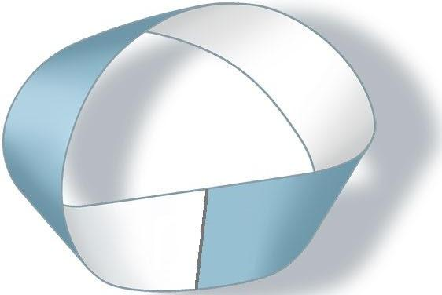

<!-- id: s12-05-0030 -->

Mon discours a pointé sur ceci que dans la *bouteille de Klein,* où s’image d’une façon frappante à donner *un support maniable à l’imagination* dans son schématisme, que la *bouteille de Klein* illustre quelque chose qui s’appelle, dans *une surface* propre à nous retenir, de s’offrir en quelque sorte à la prise - puisque à la manière du *tore*, elle se présente d’un premier aspect comme une *poignée -* de nous offrir l’image de ce qui résulte de ce *point de rebroussement* qui lui vient dans son propre décours, par où ce qui vient d’un coté, se trouve en *continuité intérieure* avec l’extérieur de l’autre côté, et que de l’autre coté de même : l’intérieur avec l’extérieur.

<!-- id: s12-05-0031 -->

Ce n’est point en somme si facile à imaginer, mais après tout, il n’est pas si simple d’en donner un schéma si propice à nous retenir.

<!-- id: s12-05-0032 -->

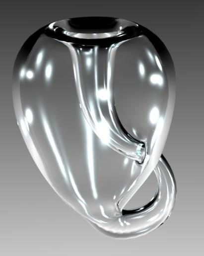

<!-- id: s12-05-0033 -->

Si d’autre part dans le discours, dans le discours hégélien par exemple…

<!-- id: s12-05-0034 -->

> et cet admirable prologue à la *Phénoménologie* \[*de l’esprit*\] que HEIDEGGER isole dans les *Holzwege* [^38] pour en faire un long commentaire, mais qui à lui tout seul, en deux ou trois pages vraiment admirables, increvables, sensationnelles,
>
> et qui, presque à elles toutes seules, pourraient suffire à nous donner l’essence du sens de la phénoménologie …nous voyons quelque part désigné *ce point de retournement de la conscience* comme le point seul nécessaire où peut s’achever la boucle.

<!-- id: s12-05-0035 -->

Et nulle part mieux que dans ce texte ne s’avère le caractère de *boucle* que constitue la notion du *savoir* *absolu*, permettant en poussant du petit doigt, en poussant d’un cran, le sens de ce « *sujet supposé savoir* » dont je vous parle ici souvent et que vous entendez à juste titre comme le « *sujet supposé savoir*... *pour le patient* » celui qui attend, celui qui met dans l’Autre - dans l’*Autre* dont il ne sait point encore la nature, pour ne point savoir qu’il y a deux acceptions de l’*autre -* qui met ce « *sujet supposé savoir* » - *dont je vous ai dit* *qu’il est déjà tout le transfert* \[Cf. séminaire 1960-61 : *Le transfert*...\] - au niveau du discours de HEGEL.

<!-- id: s12-05-0036 -->

Prenez ce terme de « *sujet identifié à la boucle du savoir »*, et meilleure que cette *métaphore,* après tout *approximative*, et dont rien n’évoque spécialement à l’imagination la nature absolument radicale …cette métaphore du moment de *retournement de la conscience* : *ce n’est pas, je crois, vainement ni sans raison fondamentale* que nous touchions là ce que j’appellerai - formule simple - que nous touchions là ce que j’appellerai « *les choses comme elles sont* ».

<!-- id: s12-05-0037 -->

Après tout, il nous est bien loisible de faire usage philosophique, j’entends pour vous mener dans une certaine voie, *des formules les plus communes et les moins accrocheuses* en apparence, si par leur portée elles indiquent que nous entendons nous tenir également éloignés d’un discours prématuré sur « *l’être en tant qu’être* », plus éloignés encore d’un discours sans doute galvaudé, non sans raison, par toutes les ambiguïtés qu’on a laissé se mêler à l’usage du terme d’« *existence* ».

<!-- id: s12-05-0038 -->

« *Comme elles sont* » ça veut dire… Ça veut dire que - pour approcher tout doucement les choses - nous n’avons pas tellement à nous étonner d’avoir à parler du *sujet* comme d’*une surface* !

<!-- id: s12-05-0039 -->

Et sans doute n’en est-ce pas là la raison, *mais si j’avais*, à quelqu’un de tout à fait inhabitué à notre discours, *à introduire la justification* de ce procédé, je dirais : quoi d’étonnant que, si ce qu’il s’agit d’aborder…

<!-- id: s12-05-0040 -->

> il s’agirait, je suppose de quelqu’un qui nous viendrait de la science
>
> qui pourrait prétendre à monopoliser le titre d’objective, du fait d’être la science de laboratoire …je dirais : quoi d’étonnant à ce que nous soyons habitués ici à parler comme d’une surface de ce dont il s’agit ?

<!-- id: s12-05-0041 -->

En somme : de quoi ? Du fonctionnement de l’appareil que vous connaissez bien comme l’appareil nerveux, et l’appareil nerveux, sans avoir besoin d’y entrer plus loin, mais c’est aussi la porte par où est entré FREUD au moment même de la découverte assurée de connexions inter-neuroniques, de la fonction fondamentale de réseau que représente le névraxe.

<!-- id: s12-05-0042 -->

Or tout ce qui se présente comme réseau est réductible à une surface, tout ce qui est réseau peut s’inscrire sur une feuille de papier.

<!-- id: s12-05-0043 -->

\[Bruits dans la salle... \] Vous voyez que nous sommes dans un état policé !

<!-- id: s12-05-0044 -->

Donc j’espère que cet intermède saugrenu ne vous a pas fait perdre la corde assez pour que vous n’ayez point entendu qu’il est le propre d’*une structure de réseau* de se manifester dans son ensemble comme quelque chose d’essentiellement *réductible à une surface*.

<!-- id: s12-05-0045 -->

À savoir qui n’appelle point dans sa nature cette fonction ambiguë, non résolue, qui nous paraît aller de soi du fait de notre expérience de l’espace réel, qui s’appelle le volume. À la vérité je n’ai point à entrer ici dans une *critique préalable* qui serait celle *de la troisième dimension*. Mais tenez pour assuré que cette *critique préalable*, au point ou nous en sommes de l’expérience *philosophique*, ne paraît n’avoir point été tout à fait aussi creusée qu’il conviendrait, j’entends dire *nachträglich*, par ce qui en apparaît des *dissymétries*, des failles, de la non homologie de ce qui se constate par rapport au système des deux dimensions, quand on passe à celui des trois dimensions.

<!-- id: s12-05-0046 -->

Et à vrai dire, il y a là quelque chose dont on pourrait dire que - comme d’un exercice de gammes - nos gammes sont si mal faites que, ne serait-ce que pour cela, commencer par des gammes, je dirai que pour aborder ce qu’il en est de la structure subjective, ce serait déjà suffisante justification et prudence de méthode de nous en tenir à la surface. À savoir quelque chose qui satisfait tellement au niveau de l’expérience subjective, ce qui colle tellement au plus près de ce qui nous est, à ce niveau, commandé d’appréhender.

<!-- id: s12-05-0047 -->

Ce n’est point hasard que *le tableau*, j’entends le tableau de chevalet, dont j’ai tant tiré l’année dernière \[Séminaire Les fondements...

<!-- id: s12-05-0048 -->

19-02, 26-02, 04-03, 11-03-1964\] pour vous manifester ce dont il s’agit dans la structure de la pulsion scopique, ce n’est point hasard s’il se contente d’être sur un plan.

<!-- id: s12-05-0049 -->

Et à qui m’opposera que l’architecture c’est autre chose, je répondrai…

<!-- id: s12-05-0050 -->

> avec un architecte spécialement, et avec d’autres avec qui j’ai pu converser depuis …que l’architecture se définit bien plutôt comme un vide que des plans, que des surfaces entourent : que c’est cela qui est, au moins sur le plan de ce qu’elle nous pose comme problème de réalisation subjective, son essence et son essentielle structure.

<!-- id: s12-05-0051 -->

*L’instant de voir, c’est toujours un tableau*. Et si j’affirme me contenter, comme d’un stade constructif d’une marche de notre progrès en somme, de ce maniement de ce qu’il y a de proprement *spatial* dans notre expérience du sujet, et si vous voulez, de la *res extensa* telle qu’elle peut pour nous se réduire, j’entends pour autant que sa purification, son extraction, nous sommes forcés de la faire par des voies différentes de DESCARTES, non point à prendre ce morceau de cire, déjà tellement tout pris dans le malléable, l’informe, et le plus accessible à la réduction de toutes les qualités, mais dont il peut nous venir en doute…

<!-- id: s12-05-0052 -->

> si nous sommes moins sûrs que lui de l’absence de commune trame entre la *res cogitans* et la *res extensa*,
>
> si nous pensons que la *res cogitans* pour nous, ne nous livre qu’un sujet divisé *de se déposer* sous le coup des effets du langage …si déjà dans cette schize, dans cette division, nous ne sommes point appelés à faire intervenir un schéma qui n’est pas d’« *étendue* » mais qui en est parent à proprement parler : *le schéma topologique*.

<!-- id: s12-05-0053 -->

Par contre, s’il est quelque chose que notre expérience nous commande d’introduire, et justement dans la mesure aussi où elle noue, pour nous étroitement, aux fondements du sujet *le lieu* qui lui est propre, si en effet c’est dans le rapport au langage qu’il détermine sa structure, si c’est *le lieu de l’Autre*, avec un grand A, *le champ de l’Autre* qui va commander cette structure, *le champ de l’Autre*, lui \- je l’annonce ici comme l’amorce de ce que j’aurai à ouvrir cette année - *ce champ de l’Autre s’inscrit dans ce que j’appellerai des coordonnées cartésiennes : une sorte d’espace, lui, à trois dimensions, à ceci près que ce n’est point l’espace, <u>c’est le temps</u>.*

<!-- id: s12-05-0054 -->

Car dans l’expérience qui est l’expérience créatrice du sujet au lieu de l’Autre, nous avons bel et bien - quoi qu’on en ait de toutes *les formulations antérieures -* à tenir compte d’un temps qui ne peut d’aucune façon se résumer à la propriété linéaire « *passé, présent, avenir* », où il s’inscrit dans le discours à l’indicatif, dont encore ce qu’on peut appeler *l’esthétique transcendantale* communément reçue dans toute tentative d’inscrire, disons dans les termes les plus généraux, l’ensemble du monde, l’univers, en termes d’*événements*.

<!-- id: s12-05-0055 -->

Ces trois dimensions de ce que j’ai appelé *en son lieu*, dans un article difficile à trouver, j’en conviens, mais qui je l’espère sera de nouveau mis à la portée de ceux qui en voudront lire le caractère de *sophisme* - je l’ai appelé ainsi - *fondamental* : *Le temps logique* *où l’assertion de certitude anticipée*, ici vient lier étroitement son instance à ce dont il s’agit, à savoir ce point privilégié de l’*identification*.

<!-- id: s12-05-0056 -->

Dans toute *identification* il y a ce que j’ai appelé : *l’instant de voir, le temps pour comprendre, et le moment de conclure.* Nous y retrouvons les *trois dimensions du temps* qui sont - même pour la première - loin d’être identiques à ce qui s’offre pour les recevoir.

<!-- id: s12-05-0057 -->

*L’instant de voir* - peut être - n’est qu’instant, il n’est point pourtant entièrement identifiable à ce que j’ai appelé tout à l’heure *le fondement structural de la surface du tableau*. Il est *autre chose* en ce qu’il a d’inaugural : il s’insère dans *cette dimension que le langage instaure* \- comme l’analyse - que le langage instaure *comme synchronie*, qui n’est aucunement à confondre avec la simultanéité.

<!-- id: s12-05-0058 -->

*La diachronie*, c’est le second temps où s’inscrit ce que j’ai appelé « *le temps pour comprendre* », qui n’est point *fonction psychologique* mais qui est, si la structure du sujet représente cette courbe, cette apparente solidité, ce caractère irréductible, qu’a une forme comme celle que je promeus sous le titre de *la bouteille de Klein* devant vous. Le terme « *comprendre* » est à appréhender par nous dans ce geste même qui s’appelle *appréhension*, et…

<!-- id: s12-05-0059 -->

> pour autant que reste irréductible à *cette forme* substantielle de la surface dans cet aspect d’enveloppe où elle se présente …*ceci que les mains peuvent la saisir* et que c’est là sa forme d’appréhension la plus adéquate, qu’il ne suffit pas de croire qu’elle est là grossièrement *imaginaire* et d’aucune façon réductible au tangible.

<!-- id: s12-05-0060 -->

Assurément pas, car si c’est là que *la notion de* *Begriff* même, de *concept*, peut se porter de la façon la plus adéquate, comme j’espère \- à l’occasion, par un de ces éclairages latéraux fait en passant, comme il arrive que je doive m’en contenter ici, pour tel ou tel aspect de l’expérience - vous verrez que c’est là assurément mode d’abord infiniment plus subtil que celui que donne l’opposition des termes « *extension* » et « *compréhension* ».

<!-- id: s12-05-0061 -->

Le troisième temps, où *la troisième dimension du temps* où il convient que nous voyons là où nous avons à repérer, à donner *les coordonnées de notre expérience*, c’est celui que j’appelle « *le moment de conclure* » qui est *le temps logique comme hâte*, et qui désigne expressément ceci qui s’incarne dans le mode d’entrée dans son existence, qui est celle qui se propose à tout homme autour de ce terme *ambigu* - puisqu’il n’en a point épuisé le sens et que plus que jamais en ce tournant historique, il vit son sens en vacillant - « *Je suis un homme.* ».

<!-- id: s12-05-0062 -->

Qui ne saura, et plus encore au niveau de notre expérience analytique que de toute autre, voir que dans cette *identification* où

<!-- id: s12-05-0063 -->

- sans doute la venue au départ du semblable,

<!-- id: s12-05-0064 -->

- l’expérience qui se mène par les chemins contournés sur eux–mêmes,

<!-- id: s12-05-0065 -->

- les cycles qu’accomplit à se poursuivre tout autour de cette forme torique dont *la bouteille de Klein* est une forme privilégiée,

<!-- id: s12-05-0066 -->

- ce temps de cerner les tours et les retours, et l’ambigu, et l’aliénation, et l’inconnu de la demande …après ce « *temps pour comprendre* » il est tout de même un moment, le seul d’ailleurs décisif, le moment où se prononce ce :

<!-- id: s12-05-0067 -->

« *Je suis un homme… et je le dis tout de suite, de peur que les autres l’ayant dit avant moi, ne me laissent seul en arrière d’eux* ».

<!-- id: s12-05-0068 -->

Telle est cette fonction de l’ *identification* par quoi *la bouteille de Klein* *nous paraît la plus propice à désigner ceci.*

<!-- id: s12-05-0069 -->

Si une fois de plus, j’en dessine pour vous ce que, bien sûr, il est tout à fait impropre d’en appeler les contours…

<!-- id: s12-05-0070 -->

> puisque, à la vérité ces contours n’ont absolument rien de ce que je vous ai déjà présenté de deux manières, dont l’aspect l’un à l’autre est franchement étranger jusque dans l’utilisation qu’on peut faire de tel ou tel de ses *recessus* …suivant la formule, la forme la plus simple est non pas *un contour*, mais ce qui associe deux surfaces \[*de Mœbius*\] :

<!-- id: s12-05-0071 -->

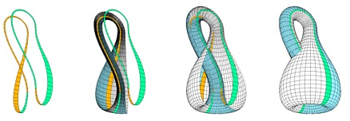

<!-- id: s12-05-0072 -->

cette forme très particulière où vous retrouvez ici, venant s’insérer sur l’orifice circulaire par où également est marquée l’entrée possible dans chacun de ces deux espaces enclos que définit cette surface, pour autant que nous la situons précisément dans l’espace, et qu’il convient de distinguer ce rapport à l’espace de ces propriétés internes.

<!-- id: s12-05-0073 -->

Or sur cette surface, nous allons…

<!-- id: s12-05-0074 -->

> non pas parce que c’est un jeu mais parce que c’est un support, qui sera essentiel pour nous,
>
> à repérer des temps majeurs de l’expérience …nous allons marquer et définir que si cette forme est une de celles dans lesquelles nous pouvons donner le support le plus adéquat *à ce qui est*…

<!-- id: s12-05-0075 -->

> au point où je vous ai toujours articulé les choses pour pouvoir le faire entendre sans prêter à malentendu …*à ce qui est « sous » la structure du langage : non pas substance, non pas* ὑποχείμενον \[upokeimenon\], *mais « sous » en tant que je dis que le sujet c’est ce que le signifiant, comme tel, représente auprès d’un autre signifiant, ceci qui est sous la trame du signifiant*.

<!-- id: s12-05-0076 -->

Et pour autant que nous devons considérer tout système de signifiant comme constituant une batterie cohérente et implicitement qui doit suffire, et comme je vous l’ai dit, il n’en faut pas beaucoup plus \[de 4 ? Cf. les α,β,γ,δ de « *La lettre volée* »\], qui doit suffire pour l’usage de tout ce qui peut être du « *dire* ».

<!-- id: s12-05-0077 -->

Et pour tout dire, le sujet ainsi défini : comme ce qui du signifiant se représente à l’intérieur du système du signifiant, c’est là ce que nous entendons par le sujet, le sujet a une forme telle que celle-ci...

<!-- id: s12-05-0078 -->

ou 2 ou 3 autres, tout au plus, car *le système de liens à soi-même, de couture à soi-même de la surface*, est extrêmement limité ...celle-ci prise comme exemple qui nous en permet l’abord le plus accessible, au moins pour le temps présent de mon exposé, dont c’est ici que se représentera l’exercice effectif de ce signifiant, à savoir ce qui s’appelle « *dires* » ou « *paroles* »*,* ce sera le tracé de quelque chose que nous pouvons, selon les besoins, concevoir comme *ligne* ou comme *coupure,* ce sera le tracé de quelque chose qui sur cette surface, s’inscrit.

<!-- id: s12-05-0079 -->

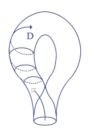 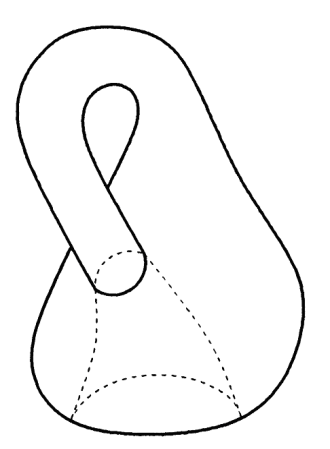 

<!-- id: s12-05-0080 -->

Prenons par exemple ceci que semble suggérer la forme même de cette partie torique de la bouteille : la courbe, et les retours, et la succession, et le parcours, de quelque chose qui ne se soumet qu’à la seule condition de ne pas se recouper.

<!-- id: s12-05-0081 -->

Ceci nous mène à une progression à la fois circulaire et forcément progressante puisqu’à revenir *en arrière*, elle ne saurait que se recouper, ce qui est exclu par la définition que nous avons donnée ici à un certain type de coupure.

<!-- id: s12-05-0082 -->

Nous arrivions à ceci : que *la demande* comme telle…

<!-- id: s12-05-0083 -->

> si ce que j’appelle *demande* c’est ce mouvement circulaire qui tend à être à soi–même parallèle, et toujours répétée …que *la demande* pour autant qu’elle n’est point essentiellement à réduire à *la demande de satisfaction du besoin* d’où *une psychologie empirique* tendra à la faire partir, mais où elle est essentiellement ce en quoi le discours s’inscrit au lieu de l’Autre : tout ce qui se dit, en tant qu’il se dit au lieu de l’Autre, est une *demande*, même si elle est, pour la conscience du sujet, à soi-même cachée, et de cette face de *demande* et de ce qui en dépend, à savoir essentiellement d’ores et déjà la schize causée par la demande dans le sujet, dépend la fonction de ce que j’ai inscrit *dans le coin droit de mon graphe* sous la formule S**◊**D sur laquelle nous aurons peut-être, d’ici la fin de mon discours d’aujourd’hui, l’occasion de revenir.

<!-- id: s12-05-0084 -->

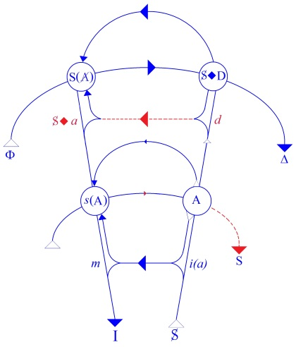

<!-- id: s12-05-0085 -->

Mais pour l’instant, entendons que *la demande* est définie comme le discours qui vient expressément s’inscrire au *lieu de l’Autre* \[A\].

<!-- id: s12-05-0086 -->

Je dirai, *la demande,* *d’où qu’elle parte*, progresse nécessairement - vous pouvez la faire partir de l’autre côté, c’est exactement le même résultat - *la demande progresse vers* un point qui est celui que j’ai désigné la dernière fois comme *le point de l’identification* \[I\].

<!-- id: s12-05-0087 -->

C’est bien en effet ce dont témoigne pour nous l’expérience analytique et ce qui - à l’insu ou non des parleurs, des théoriciens, je veux dire qu’ils en sachent ou non la portée - est par eux repéré, par eux affirmé.

<!-- id: s12-05-0088 -->

Toute la doctrine de l’expérience analytique qui met tout son registre sur ces trois termes conjugués, de la *demande*, du *transfert*, et de l’*identification*, effectivement ne se conçoit, ne s’appréhende, ne se justifie, jusqu’à un certain point… même si ici j’ajoute, même si ici je viens pour introduire qu’une autre dimension est nécessaire, sans quoi celle-ci, telle qu’elle nous est définie et décrite, est et restera obligatoirement enfermée dans cette forme qui, indéfiniment tournant sur elle-même, ne saura nulle part repérer la certitude d’*un point d’arrêt*.

<!-- id: s12-05-0089 -->

J’ai - l’année dernière - indiqué dans quel sens par rapport à ce que nous pouvons appeler l’ensemble de la figure, essentiellement s’inscrivait la fonction du *transfert* et du *sujet supposé savoir*.

<!-- id: s12-05-0090 -->

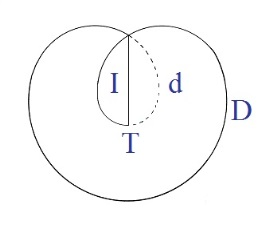

<!-- id: s12-05-0091 -->

Nous aurons à la ré-évoquer ces temps-ci, mais ce que simplement je veux présentifier à votre regard, c’est à ce point précis : où ce que j’ai dessiné comme *la boucle de la demande*, s’engage *au niveau du point de retournement, de rebroussement de la surface*.

<!-- id: s12-05-0092 -->

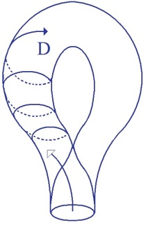 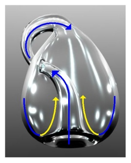

<!-- id: s12-05-0093 -->

Et pour essayer de vous faire sentir d’une façon aussi simple ce qui pourrait peut-être s’énoncer beaucoup plus rigoureusement, beaucoup plus correctement du point de vue de *la théorie topologique*, par l’emploi de vecteurs pour schématiser *la bouteille de Klein* de la même façon que vous pourriez schématiser un *tore*, c’est-à-dire *une peau carrée* dont le premier enroulement cylindrique est suivi d’une attache qui en fait un anneau circulaire.

<!-- id: s12-05-0094 -->

<!-- id: s12-05-0095 -->

La différence avec *la bouteille de Klein*, c’est que si le premier enroulement cylindrique se fait ainsi, ce qui se produira sera un nœud des deux extrémités circulaires du cylindre, mais d’une façon qui est l’une par rapport à l’autre, inversée .

<!-- id: s12-05-0096 -->

|  |  |  |  |
|----|----|----|----|
| 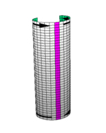 | 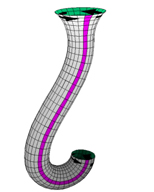 | 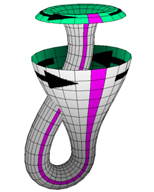 | 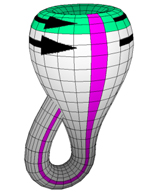 |

<!-- id: s12-05-0097 -->

Du seul fait de cette inversion quand la demande vient ici à s’engager - *si l’on peut dire, si je peux me permettre de parler en termes aussi grossiers du point de vue topologique -* à s’engager - voilà un langage d’accoucheur à ce propos - dans le faux S du *point de retournement* de la surface, nous avons un aspect différent, tout différent qui se présente par la boucle par laquelle chacun des tours qui jusqu’à présent se nouaient l’un à l’autre. Ici, si nous allons dans ce sens, qu’est-ce que nous allons trouver ?

<!-- id: s12-05-0098 -->

<!-- id: s12-05-0099 -->

Mettons qu’ici les choses en arrivent là : que se passe-t-il ? C’est que *la boucle fait un retour* pour aller *se réfléchir* sur le bord que nous appellerons *le cercle de rebroussement*. Ici, elle passe dans ce que nous pouvons appeler le second segment du faux tore qui est *la bouteille de Klein*, puis de nouveau, abordant le bord de ce cercle, elle passe dans la sorte de moitié de tuyau que constitue à ce niveau chacune des parties de ce tore, au moment où elles s’intègrent de cette façon tellement *spéciale*.

<!-- id: s12-05-0100 -->

Auquel cas il est facile de démontrer que le nombre de ses points de retour ne pouvant être que pair, la façon dont elle en ressortira sera que la demande, de l’autre coté *tournera dans un sens inversé*. À savoir que si ici c’est *dans un sens comme celui-ci* \[en rouge\] c’est-à-dire si vous voulez pour vous, dans le sens, à regarder les choses d’en haut, contraire à celui des aiguilles d’une montre que va tourner la demande, de l’autre côté, ce sera dans le sens propre des aiguilles d’une montre ou *inversement.*

<!-- id: s12-05-0101 -->

Car il est important de saisir que même à ce niveau radical, aussi simple que possible de la fonction du langage, nous avons affaire à une réalité orientable. Car si assurément les aspects que présente cette figure n’ont qu’un caractère externe ou contingent par rapport à la surface, de n’être repérables que d’être plongés dans l’espace, à l’intérieur de la surface, nulle part *le point de* *ce rebroussement* ne se manifeste, pour la surface elle-même d’une façon *tangible*.

<!-- id: s12-05-0102 -->

Inversement, la surface, dirais-je, ou qui que ce soit qui y habite, peut s’apercevoir, si elle y fait assez attention, de quelle nature de surface elle est, précisément en raison de ce phénomène, que les parcours qui s’y font sont repérables comme *non orientables*, autrement dit sont repérables comme pouvant en un point quelconque, se retrouver comme inversé.

<!-- id: s12-05-0103 -->

Je répète : à ne considérer que les propriétés internes à la surface, il y a *un mouvement vers la droite* et *un mouvement vers la gauche*, il y a une droite et une gauche d’un tracé, d’un pur tracé de discours, et il est repérable qu’une chose y soit *dextrogyre* ou *lévogyre*, indépendamment d’images spatiales, indépendamment du phénomène du miroir.

<!-- id: s12-05-0104 -->

La surface en elle-même, je l’ai dit, ne se mire pas, et sans se mirer, elle connaît cette possibilité de :

<!-- id: s12-05-0105 -->

- ou qu’il soit possible que les choses qui tournent dans un sens tournent toujours dans le même sens,

<!-- id: s12-05-0106 -->

- ou que si elle est une autre espèce de surface, il peut se faire que ce qui à un moment y tourne dans un sens, vienne, après un certain parcours, y tourner dans le sens exactement contraire.

<!-- id: s12-05-0107 -->

Ceci est quelque chose d’absolument essentiel à définir, parce que c’est ça qui nous permet d’aborder ce quelque chose autour de quoi tournent toute la difficulté et les achoppements présents, je veux dire les achoppements qui sont venus, avec son progrès, de la théorie analytique, qui consistent *essentiellement* en ceci : si les choses sont comme je vous le décris, à savoir si nous ne pouvons d’aucun développement, d’aucun progrès de l’inconscient, en tant qu’il est saisissable au dernier terme :

<!-- id: s12-05-0108 -->

- dans quelque chose qui est de la nature de la trace du discours, de la coupure,

<!-- id: s12-05-0109 -->

- dans ce voile singulièrement topologisé, que nous essayons de donner du sujet comme étant le sujet de la parole, le sujet en tant qu’il est déterminé par le langage …eh bien nous avons là le seul support valable, et qui ne se trouve point à la merci des plus grossières images qui sont celles qui ont été données dans la seconde topique de FREUD, je parle spécialement des images de l’*Idéal du moi*, voire du *surmoi,* c’est en tant que nous pouvons arriver *à saisir*, *à serrer* les problèmes, à serrer *les points nodaux* notamment…

<!-- id: s12-05-0110 -->

> et celui que je vise aujourd’hui, à savoir celui de l’identification …c’est en tant que pareil *schéma* nous le permet que nous pouvons essayer d’aborder dans toute sa généralité, d’une façon différente, de la façon dont elle se formule pour l’instant dans *la théorie analytique*, à savoir une façon extrêmement insatisfaisante pour tout lecteur capable simplement d’un peu d’audition et d’un peu de ton, d’une façon extrêmement différente, dis-je, ce qui a rapport à ce que j’appellerai « *l’inconscient structural* ».

<!-- id: s12-05-0111 -->

Car c’est assurément tout ce qui justifie tant d’élucubrations autour de formules comme celle de *distorsion du moi*, voire de *formes atypiques, anormales surmontantes du surmoi*, car c’est en effet cette recherche nécessitée, rencontrée dans notre *expérience*.

<!-- id: s12-05-0112 -->

Notre expérience qui a été faite d’abord de quoi ? De ce qu’on a appelé les achoppements, les points analysables de ce qu’on appelle improprement l’analyse de matériel.

<!-- id: s12-05-0113 -->

J’ai fait quoi la dernière fois ? J’ai essayé de vous suggérer ceci : c’est que, pour une part par exemple de cette analyse de matériel, à savoir ce que FREUD a appelé *Psychopathologie de la vie quotidienne* mais dont tout de même, il est assez frappant que ça ne parle, en fin de compte jamais, de la première page à la dernière, que d’affaires de *paroles* !

<!-- id: s12-05-0114 -->

Car il n’y a pas une page, quelle que soit la diversité des titres qui sont donnés aux chapitres dans ce volume, il n’y a pas une page où nous ne soyons affrontés de la façon la plus directe et de la façon la plus radicale à ceci : qu’il s’agit de quelque chose où entre en jeu ce qui, au sens ou je l’entends, s’appelle à proprement parler les signifiants, c’est-à-dire des mots ou des signes écrits, des choses qui ont valeur de signifiant et par rapport à quoi tout ceci se situe, et sans quoi aucun échange, aucune substitution, métaphore, métabolisme de tendance, n’est jamais saisie - au moins dans ce volume - n’est jamais saisie, accessible, ni au sens où je l’entends, saisissable, compréhensible.

<!-- id: s12-05-0115 -->

Car bien sûr, là nous saisissons la divergence, l’ambiguïté, les deux parts, qui de ce fait se proposent et qui sont, aussi bien par FREUD que par les auteurs qu’avec les années il a intégrés à son texte, soulignées.

<!-- id: s12-05-0116 -->

À savoir que dans certains cas dominent ce qu’on peut appeler les effets de signification mais que dans d’autres cas…

<!-- id: s12-05-0117 -->

> je dois dire à la surprise, car c’est ça qui les surprend le plus, surtout à une époque
>
> où ils n’avaient d’autre recours que d’y voir la contingence de traces mnésiques …il y a les cas qui opèrent essentiellement, non sur le *meaning*, non sur la signification, mais sur quelque chose que provisoirement, j’appelle autre, et dont je peux me contenter de vous dire qu’il est autre, et dont je pense tout de même avoir dit assez devant vous pour qu’en l’appelant « *non-sens* » - ce qui ne veut dire *ni absurde ni insensé*, je pense déjà vous l’avoir fait suffisamment entrevoir \- « *non-sens* » dans ce qui est le plus justement… ce qu’il y a de plus *positif*, de plus *unitaire*, de plus *nodal*, dans l’effet de sens, à savoir dans quelque chose qui s’incarne au maximum dans *ces effets d’oubli des noms propres,* *si riches*, *si éclairants* au niveau du texte de FREUD et du texte de *ceux*… *les premiers à l’avoir entendu*. C’est là donc que nous trouvons le champ de *la première découverte analytique*.

<!-- id: s12-05-0118 -->

Qu’est-ce que veut dire qu’autre chose ait été nécessaire, sinon précisément que, sans doute d’une façon obscure, maladroite et fourvoyante, ce qui est là derrière rencontré, est la structure du support, c’est à tout cela qu’aide à suppléer, cette topique singulière qui retombe souvent si grossièrement dans les voies de la psychologie la plus erronée.

<!-- id: s12-05-0119 -->

C’est là aussi qu’il s’agit de constituer *quelque chose*, je ne dirais pas de plus maniable, mais *quelque chose* de purement et simplement de plus *vrai*, si nous donnons à ce terme de *vrai* ici, *l’orientation* qui veut dire simplement - ce qui n’est pas la même chose que l’usage que j’en fais dans d’autres registres, quand je dis : « *la parole est ce qui introduit dans le monde la vérité* » - le mot « *vrai* », là tel que je l’emploie, de même que *tout à l’heure* j’essayais de dire ici « *les choses comme elles sont* », le mot « *vrai* » veut dire *réel*.

<!-- id: s12-05-0120 -->

Car :

<!-- id: s12-05-0121 -->

- ou ceci est quelque chose en son genre, qui est à entendre à proprement parler, comme le *réel*, fusse ce *réel* que nous sommes tous prêts à admettre comme étant une dimension, la dimension peut-être propre et essentielle du *réel*, à savoir *l’impossible,* ou ceci est le *réel*,

<!-- id: s12-05-0122 -->

- ou tout ce que je vous dis n’a aucun lieu d’être.

<!-- id: s12-05-0123 -->

Or si nous partons de là, de là que j’illustrerai la prochaine fois, en vous montrant :

<!-- id: s12-05-0124 -->

- non seulement combien cela nous permet d’avancer dans ce dont il s’agit, à savoir la cohérence des points sensibles de l’expérience analytique,

<!-- id: s12-05-0125 -->

- mais ce qui nous permet aussi d’avancer dans l’institution même de la logique et de nous permettre de surmonter ces impasses, je dois dire *extravagantes*, où nous voyons proliférer à l’époque moderne, *ces systèmes si satisfaits d’eux-mêmes, si infatués de la logistique ou de la logique symbolique*, qui semblent *ne pas s’apercevoir* qu’à critiquer ARISTOTE, ils s’enfoncent dans des voies encore plus *en impasse*.

<!-- id: s12-05-0126 -->

Des voies *en impasse* en ce sens qu’ils ne peuvent d’aucune façon se proposer comme ce quelque chose qui s’appelle « *métalangage* », comme ce quelque chose qui prétendrait surmonter, coiffer, maîtriser, déterminer l’essence du langage, *alors qu’au contraire, ils n’en sont que des extraits.*

<!-- id: s12-05-0127 -->

Il est vraiment dérisoire, et c’est là un point sur lequel justement j’aimerais - *à ceux qui collaboreront à nos travaux du quatrième mercredi -* j’aimerais…

<!-- id: s12-05-0128 -->

> puisque je ne peux tout de même pas - dans la position où je suis… je veux dire avec tout ce que j’ai à parcourir comme chemin cette année - *m’engager dans ce que j’appellerai par exemple, la critique du livre de Bertrand* RUSSELL *Signification et vérité* …j’aimerais que quelqu’un y ayant plongé le nez - c’est un livre fascinant…

<!-- id: s12-05-0129 -->

> et d’ailleurs *c’est un d’entre vous qui m’en a apporté le texte*, actuellement difficile à trouver, tout au moins le texte en français …ce texte fascinant où vous verrez que tout l’édifice du langage…

<!-- id: s12-05-0130 -->

> une construction entièrement arbitraire - encore qu’extraordinairement séduisante
>
> par tout ce qu’elle permet d’apercevoir, dans les impasses où elle nous pousse …que cette construction du langage comme fait en quelque sorte d’une superposition, d’un édifice en nombre indéterminé de successifs métalangages s’incluant et se coiffant les uns les autres. Ce qui *nécessite à la base un langage* qui serait en quelque sorte *primaire* et qu’il vient à appeler *langage-objet*, dont je défie quiconque de donner un seul exemple.

<!-- id: s12-05-0131 -->

Tout ceci étant supporté d’*une note* qui…

<!-- id: s12-05-0132 -->

> Comme souvent dans des textes comme ceux-là, n’est pas moins importante que le texte et l’est peut-être même plus …qui dit que cette conception du langage comme devant être nécessairement commandée par la théorie qui s’appelle « *la théorie des types* », à savoir du niveau d’affirmation de la vérité :

<!-- id: s12-05-0133 -->

- premier langage : *langage-objet*,

<!-- id: s12-05-0134 -->

- deuxième niveau : ce qui parle sur ce qui vient d’être dit au niveau du langage-objet, à savoir, par exemple :

<!-- id: s12-05-0135 -->

> « *J’ai dit que*… *ceci est vert* - métalangage déjà qui commence à ce moment-là - *mais je n’aurais pas dû le dire.* »

<!-- id: s12-05-0136 -->

Il a fallu d’abord que la seconde proposition fût amorcée, donc la négation suppose un troisième étage du langage.

<!-- id: s12-05-0137 -->

Cette construction dont on peut dire :

<!-- id: s12-05-0138 -->

- qu’à part la volupté d’un logicien, elle ne saurait saisir absolument en rien ce qui est de la constitution du sujet, à savoir de ce qui met l’homme en position d’avoir un rapport à tout ce qui se peut dire ou être,

<!-- id: s12-05-0139 -->

- que ce qui - littéralement - élude dans une fuite éperdue, ce qui est à proprement parler les problèmes du langage.

<!-- id: s12-05-0140 -->

Tout cela repose, nous dit Bertrand RUSSELL, sur la seule nécessité d’éviter les paradoxes, à savoir ce grossier paradoxe dont je pense vous avoir assez dit comment il convient de le résoudre :

<!-- id: s12-05-0141 -->

- ce paradoxe dit « *du menteur* », de la prétendue impasse logistique du « *je mens* » dont véritablement, en tout cas pour nous analystes il est absolument aisé de voir que l’objection, l’antinomie logique, ne tient pas un seul instant, et n’a aucun besoin d’être rapportée à l’herméneutique de Bertrand RUSSELL pour pouvoir être surmontée,

<!-- id: s12-05-0142 -->

- pas plus bien sûr le prétendu *paradoxe du catalogue des catalogues qui ne se contiennent pas eux-mêmes,* avec la suite que vous savez.

<!-- id: s12-05-0143 -->

Pour aujourd’hui simplement, je vous dis sur quel chemin je vous mène, et sur quel chemin mon prochain discours espère vous mener, à un terme tel, qu’au prochain encore, notre prochaine rencontre, à savoir le séminaire fermé, nous puissions en discuter sur des points de détail, pour que je puisse y recevoir telle contribution, telle objection qui paraîtra à tel ou tel, loisible.

<!-- id: s12-05-0144 -->

Il s’agit de ceci, qui se dessine de la façon la plus claire à travers…

<!-- id: s12-05-0145 -->

> je vous prie de vous y reporter, après tout, pourquoi ferais-je ici,
>
> comme après l’avoir fait pendant des années, une pure et simple *lecture commentée* …des textes de FREUD.

<!-- id: s12-05-0146 -->

Le point est celui-ci, la première appréhension qui résulte de la lecture de la *Psychopathologie de la vie quotidienne* est faite de ceci : « *effet de signification* ». Si quelque chose *ne va pas*, c’est que vous *désirez* ça. Quelque chose qui signifie quelque chose, tuer votre père par exemple. Or, ceci n’est aucunement suffisant pour la raison que ce n’est pas tel ou tel désir plus ou moins facilement décelable dans tel achoppement de la conduite qui n’est pas, je vous l’ai dit, n’importe lequel, mais un achoppement qui concerne toujours, au moins dans ce volume, mon rapport au langage.

<!-- id: s12-05-0147 -->

Ce qui est important, c’est justement que le langage, et en un point qui ne concerne pas ce désir, y soit intéressé.

<!-- id: s12-05-0148 -->

Intéressé non point dans son organe, ni simplement comme délimitation…

<!-- id: s12-05-0149 -->

> qui d’ailleurs, disant cela, ne dit pas simplement ce que je désire écarter,
>
> et ce que FREUD écarte dès le départ, car c’est la condition même de son débat …d’*un trébuchement de parole* dans le sens où ce serait une paraphasie au sens purement moteur du terme, où c’est *un trébuchement* *de parole* qui est *un trébuchement de langage*.

<!-- id: s12-05-0150 -->

C’est en fonction d’une *substitution phonématique* qui est elle-même *trace*, et trace essentielle, et seule à pouvoir nous conduire au ressort véritable de ce dont il s’agit, c’est en ce sens que le désir intervient.

<!-- id: s12-05-0151 -->

Et du désir de tuer mon père, je suis renvoyé au *Nom du Père* car c’est autour du nom - et non point d’une façon diffuse autour de n’importe quel achoppement de paroles - c’est toujours au niveau du nom, de l’évocation proprement nominale, que se fait, au moins dans tout ce champ de l’expérience, le repérage freudien.

<!-- id: s12-05-0152 -->

Or ce *Nom du Père*, si nous considérons *la structure* de l’expérience freudienne, si nous considérons *la théorie* et *la pensée* de FREUD, ce *Nom du Père*, c’est là qu’est le mystère. Car c’est en raison de ce *Nom du Père* que mon désir, non seulement est conduit en ce point douloureux, crucial, refoulé, qu’est le désir de tuer mon père à l’occasion, mais bien d’autres encore, puisque jusque ce désir de coucher avec ma mère qui est la voie par laquelle se fait ma *normalisation hétérosexuelle*, est également dépendant d’un effet de signifiant : celui que j’ai désigné - pour abréger - ici sous le terme du *Nom du Père*.

<!-- id: s12-05-0153 -->

Or, *c’est ceci qu’il s’agit de suivre à la trace* dans tout l’énoncé de FREUD, et même pour y voir la solution de ce qui reste ouvert, à savoir de ce que d’une façon maladroite, il appelle « *le caractère contagieux de l’oubli de noms* ».

<!-- id: s12-05-0154 -->

Et dans un cas qui est celui qui se trouve à la fin du premier chapitre[^39], il nous montrera ceci qui est une première approche : c’est sans doute parce que tous les assistants d’un *certain dialogue* à plusieurs, d’une *certaine conversation* se trouvent ensemble pris dans quelque chose de commun, qui sans doute a affaire avec un désir - vous allez le voir, pas n’importe lequel - qu’un même nom propre qu’ils sont tous très bien à savoir, puisque c’est le titre d’un livre, dont j’imagine qu’il ne doit pas être brillant ni quant au contenu ni quant à la théorie, qui s’appelle *Ben Hur* - mais peu importe !

<!-- id: s12-05-0155 -->

C’est une charmante jeune fille qui à ce propos, a cru pouvoir dire - histoire d’épater un peu l’entourage - qu’elle y a trouvé telles idées essentielles - je ne sais pas quoi - sur les Esséniens. Ce *Ben Hur* que la fille ne retrouve pas, qu’est-ce que l’auteur qui nous apporte cet exemple… qui est je crois FERENCZI[^40], si je ne me trompe, d’ailleurs peu importe : vous prenez n’importe quel exemple, vous retrouvez toujours la même structure. Ce dont il s’agit, c’est quoi ? C’est de quelque chose qui a peut-être un certain rapport avec un désir, mais qui était si je puis dire… ou qui passait par cette vocalisation, cette émission de voix qui ne serait fortuite, par « *bin Hure* » : « *je suis la putain* ». Et c’est là en tant qu’*il s’agit de quoi*, allez-vous dire ? *Où est l’important, où est le décisif ?*

<!-- id: s12-05-0156 -->

Est-ce que c’est ce que cette déclaration cache du furet qui passe à travers l’assemblée, entre cette jeune fille et les jeunes gens qui l’entourent, à savoir de quelque chose qui tendrait à faire sortir les désirs de chacun, où verrions-nous la garantie que ces désirs ont même un facteur commun mais que chez tous, quelque chose qui intéresse *la déclaration du nom propre* pour autant que dans toute cette déclaration, l’identification du sujet, et quelle que soit la distance où se produise le rapport au nom propre, l’identification du sujet est intéressée, et là, c’est à ce niveau que se tient le ressort.

<!-- id: s12-05-0157 -->

Or, la façon dont nous avons à définir *topologiquement* ce dont il s’agit dans l’analyse, qui est bien évidemment le repérage du désir…

<!-- id: s12-05-0158 -->

> mais non pas de tel ou tel désir qui n’est que dérobement, métonymie, métabolisme voire défense comme c’en est la figure la plus commune quand il s’agit de repérer ce désir où l’analyse doit trouver son terme et surtout son axe, si, comme à la fin de l’année dernière nous l’avons avancé, *c’est le désir de l’analyste, comme tel, qui est l’axe de l’analyse* \[Cf. *Les fondements*... 24-06\] …ce désir, nous devons savoir topologiquement le définir en relation avec cette passe, ce phénomène, qui lui est assurément lié d’une certaine façon, que là nous ne commençons qu’à appréhender, qu’à déchiffrer, qu’à approcher, à savoir *l’identification*.

<!-- id: s12-05-0159 -->

C’est là ce qui sera le sens de mon discours, là où je le reprendrai la prochaine fois.

## Notes

[^37]: Dans une corrida : passe effectuée avec la muleta.

[^38]: Martin Heidegger : *Holzwege*, 1950. *Chemins qui ne mènent nulle part*, Paris, Gallimard, 1986, « *Hegel et son concept de l'expérience* », p.147.

[^39]: Fin du chapitre 3 de la *[Psychopathologie](http://www.ebooksgratuits.com/pdf/freud_psychopathologie_de_la_vie_quotidienne.pdf) de la vie quotidienne*.

[^40]: C’est en fait Theodor Reik. Cf. [Theodor Reik : « *Über kollektives Vergessen* », *International Zeitschrift fur Psychoanalyse*, VI, 1920p. 203](http://www.archive.org/details/InternationaleZeitschriftFrPsychoanalyseVi1920Heft3).

    Cité par Freud in *Zur Psychopathologie des Alltagslebens* (1904), G.W., IV, p. 49 ; *Psychopathologie de la vie quotidienne*, Payot, 1968, p. 48.
