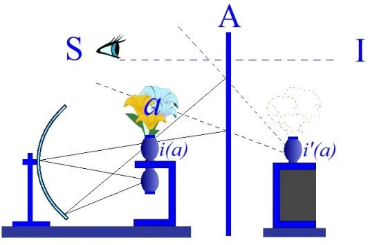
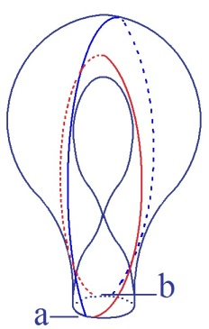
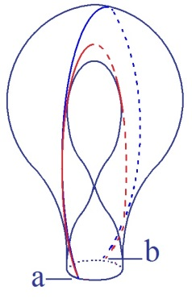

# Leçon 08 | 03 Février l965

<!-- source-url: http://staferla.free.fr/S12/S12 PROBLEMES.docx -->
<!-- seminar: s12 -->
<!-- lesson: 08 -->

<!-- id: s12-08-0001 -->

Je voudrais faire, avant de commencer mon cours, une annonce que je serai bien reconnaissant à Mademoiselle HOCQUET, à la fin du cours, de rappeler sous la forme de l’écrire au tableau : à savoir qu’il n’y aura pas de cours dans huit jours et qu’il n’y en aura pas non plus dans quinze. Je vais en effet m’absenter pendant cette période de quinze jours, un petit peu plus.

<!-- id: s12-08-0002 -->

Je reprendrai donc ici notre entretien à la date du 24 Février, ce qui tombera un 4ème mercredi du mois, 4ème mercredi qui, vous le savez maintenant, est réservé à cette forme de rencontre que j’appelle le « *séminaire fermé* » et qui, comme vous le savez, est ouvert à tous ceux qui m’en font la demande, à charge pour eux ensuite de comprendre…

<!-- id: s12-08-0003 -->

> comme je m’y suis essayé lors du dernier de ces séminaires fermés …de comprendre ce qu’ils ont à y faire dans ce séminaire, c’est-à-dire à en tirer eux–mêmes les conséquences : à choisir s’ils doivent y rester ou en partir.

<!-- id: s12-08-0004 -->

À l’adresse des gens…

<!-- id: s12-08-0005 -->

> nombreux parmi vous, ce qui rend légitime ma communication ici publique …qui étaient à ce dernier séminaire fermé, je précise qu’ils pourront trouver…

<!-- id: s12-08-0006 -->

> dans un délai que j’espère court, c’est-à-dire, je pense d’ici la fin de la semaine qui maintenant est commencée …l’un des textes et un peu plus tard l’autre de ceux dont il a été somme toute décidé que leur ronéotypie serait mise à la disposition des personnes qui voudraient s’y référer pour la suite de ces séminaires. Ce sera à leur disposition 54 rue de Varenne, au deuxième étage au fond de la cour : ils s’adresseront aux huissiers de Madame DURAND.

<!-- id: s12-08-0007 -->

Du même coup, je signale aux membres de l’*École freudienne* qui ont évidemment tous leur accès au *séminaire fermé*, je pense que la plupart d’entre eux se rendront 54 rue de Varenne pour se procurer ces textes, ils y retireront en même temps leur carte, d’une pile approximative de ces cartes d’entrée que j’ai faites à leur usage pour le séminaire fermé. Je m’excuse auprès de ceux qui ne l’y trouveraient pas. Ça voudrait dire simplement qu’ils n’ont pas déposé sur une fiche bleue leur nom à l’entrée de ce séminaire fermé.

<!-- id: s12-08-0008 -->

Ceci étant dit, je voudrais aujourd’hui que nous continuions à nous avancer dans ce qui est le problème crucial : nous cherchons à proposer une forme, et pour dire le mot précisément, une topologie essentielle à la *praxis psychanalytique*.

<!-- id: s12-08-0009 -->

C’est à cette fin que j’ai reproduit ici sous cette forme de *la bouteille de Klein*, forme si vous voulez qui n’est pas l’unique comme vous le savez bien, puisque celle-là même est une forme qui peut vous apparaître…

<!-- id: s12-08-0010 -->

> eu égard à la forme la plus répandue, la plus courante, la plus imagée, dans les livres les plus élémentaires …elle peut vous apparaître simplifiée, elle n’est nullement simplifiée, c’est exactement la même, mais on pourrait la représenter de bien d’autres façons pour la simple raison que toute représentation en est une représentation inexacte, forcée, puisque toute représentation que je peux vous en donner, est sur ce tableau plan, évidemment, une *représentation* qui est une *projection* dans l’espace à trois dimensions à laquelle *la surface* d’une *bouteille de Klein* n’appartient pas.

<!-- id: s12-08-0011 -->

C’est donc toujours d’une certaine immersion dans l’espace qu’il s’agit. Néanmoins, il y a un rapport tout de même analogue entre *la structure*, l’essence de *la surface,* et cette *immersion.* Il y a un rapport analogue, dis-je, entre ce que la surface est faite pour représenter pour nous et l’espace où elle fonctionne, l’espace où elle fonctionne étant précisément l’espace de *l’Autre en tant que lieu de la parole*.

<!-- id: s12-08-0012 -->

Ce n’est pas aujourd’hui que j’essaierai de *poursuivre cette analogie d’un champ à trois dimensions* et de ce que j’ai appelé *l’espace de l’Autre* et le « *lieu de l’Autre* » - ce qui n’est pas du tout pareil - disons qu’une certains analogie avec les trois dimensions cartésiennes de l’espace pourrait être ici introduite, mais je ne le ferai pas aujourd’hui.

<!-- id: s12-08-0013 -->

Il y a au tableau quatre schémas : celui d’en haut à gauche est limité, encadré par une barre en équerre pour l’isoler des autres : il n’a aucun rapport avec les autres.

<!-- id: s12-08-0014 -->

Pour tous ceux qui ont eu le loisir d’ouvrir certaine *Remarque* que j’ai faite sur le discours d’un de mes anciens collègues[^56].

<!-- id: s12-08-0015 -->

Remarque impliquant une *reprise*, voire une *rectification* de certaines analogies, introduites par lui, des termes qui servent à définir les instances dans *la seconde topique*, plus spécialement les termes *moi idéal* et *idéal du moi* dont il reste d’ailleurs en suspens de savoir si FREUD les a authentiquement distingués, et il y a longtemps que j’ai articulé que oui, mais la chose peut rester en effet sous forme de question.

<!-- id: s12-08-0016 -->

Quoi qu’il en soit le pas avait été franchi par l’auteur auquel je me réfère, si mon souvenir est bon dans quelque numéro, quatre ou cinq de la revue, *La Psychanalyse,* le pas avait été franchi puisque, aussi bien, *moi idéal* et *idéal du moi* ont un sens en psychologie et que c’est ce sens que l’auteur visait à raccorder à l’expérience analytique.

<!-- id: s12-08-0017 -->

Il le faisait dans des termes, qu’on peut dire être des termes de *la personne*, voire du *personnalisme*, et j’essayais dans ces remarques, sans à proprement parler mettre en question une phénoménologie qui garde son prix, j’essayais de montrer ce que l’analyse nous permet d’y articuler. C’est donc à une simple allusion au schéma que j’ai donné alors, et dont vous verrez le détail dans cet article, que les quelques traits des dessins que j’ai faits à gauche, se rapportent.

<!-- id: s12-08-0018 -->

Il n’est peut-être pas vain que je vous rappelle de quoi il s’agit. La vertu, la verve de cette construction repose toute entière sur une expérience de physique amusante qu’on appelle celle *du bouquet renversé* [^57] grâce à quoi par *l’usage d’un miroir sphérique*...

<!-- id: s12-08-0019 -->

> pour l’instant laissez de côté cette partie du schéma \[partie droite\] ...grâce à *l’usage d’un miroir sphérique*, on peut faire apparaître à l’intérieur d’un vase supposé réel qui serait placé ici, un « *faux bouquet* ».

<!-- id: s12-08-0020 -->

<!-- id: s12-08-0021 -->

Pourvu que ce bouquet soit ici dissimulé à la vue du spectateur par quelque écran propice. Le bouquet donne - par l’effet de retournement que le miroir sphérique produit - ici une image qui, à la différence de l’image qui est dans le miroir plan, au-delà du miroir plan, est une *image* qu’on appelle *réelle*.

<!-- id: s12-08-0022 -->

C’est-à-dire que c’est effectivement quelque chose qui se soutient dans l’espace à la façon d’une illusion : les illusionnistes dans certains cas, et naturellement dans des conditions d’éclairage favorables, dans une atmosphère protégée par des écrans noirs, arrivent à faire surgir ces sortes de fantôme d’une façon très suffisante pour au moins intéresser l’œil.

<!-- id: s12-08-0023 -->

C’est en partant de là que, d’une façon purement fictive je me suis plu à imaginer le modèle suivant, celui qui *autour* *- au contraire -* *d’un bouquet ferait surgir un vase illusoire* :

<!-- id: s12-08-0024 -->

<!-- id: s12-08-0025 -->

Il est bien clair que ceci, cette illusion, ne se produit que pour un œil qui est quelque part placé dans le champ, d’une façon telle que pour lui ça puisse faire *image*, c’est-à-dire qu’un certain renvoi des rayons du *miroir sphérique*, après s’être recroisés pour constituer l’image réelle, va s’*épanouir* en un cône dans le fond de l’espace intéressé. Il faut bien entendu que l’œil susceptible de *recevoir* \- supposé recevoir - *l’image réelle*, soit dans ce cône. En d’autres termes, *ce qui est bien facile à comprendre,* il faut que le spectateur de ce spectacle illusoire soit dans un certain champ, assez limité pour qu’il n’échappe pas purement et simplement aux effets du miroir sphérique.

<!-- id: s12-08-0026 -->

C’est ici que gît le ressort de la petite *complication* supplémentaire que j’y ajoute :

<!-- id: s12-08-0027 -->

<!-- id: s12-08-0028 -->

À savoir que cette *illusion de l’image réelle*, c’est un sujet - ce sujet est tout à fait mythique : c’est pour ça qu’ici le S n’est pas barré - c’est un sujet qui est placé au contraire - comme on peut facilement comprendre que c’est exigible - du côté du miroir sphérique.

<!-- id: s12-08-0029 -->

Ce miroir sphérique représente quelque mécanisme interne au corps qui voit dans un miroir \[A\] ce qui se produit ici d’illusion pour celui qui serait là \[I\]. Ceci n’est pas très difficile à comprendre.

<!-- id: s12-08-0030 -->

En effet, la position du S et du I par rapport au plan du miroir, même s’il n’apparaît pas dans cette figure, est strictement *symétrique*.

<!-- id: s12-08-0031 -->

Il suffit donc que S trouve sa propre image éventuelle au-delà du miroir - quelque part dans ce cône où l’illusion du miroir sphérique a sa portée - pour qu’il voie *dans le miroir* exactement ce qu’il verrait s’il était là, à savoir à l’endroit marqué de I.

<!-- id: s12-08-0032 -->

C’est exactement *le rapport entre l’identification qui s’appelle idéal du moi, à savoir ce point d’accommodation* que le sujet, je dirai, de toujours…

<!-- id: s12-08-0033 -->

> *de toujours* ce n’est pas ce qui couvre *une histoire*, à savoir l’histoire de l’enfant dans sa relation d’identification avec l’adulte …c’est donc d’*un certain point d’accommodation dans le champ de l’Autre*…

<!-- id: s12-08-0034 -->

> en tant qu’*il est tissé*, non seulement de la *relation symbolique* mais d’*un certain plan imaginaire*,
>
> tels ses rapports avec les adultes qui veillent sur sa formation …c’est en quelque sorte *fixé là, repéré là, accommodé en ce point,* qu’il va avoir tout au long du même développement - *pour faire entrer ici ce à quoi on se réfère dans la genèse -* qu’il va avoir, au cours de ce développement, *à accommoder cette illusion qui est là l’illusion du vase renversé,* c’est-à-dire à faire jouer autour de quelque chose qui est *le bouquet*…

<!-- id: s12-08-0035 -->

> que nous avons ici réduit pour la clarté à une seule fleur, voire à ce signe : le petit rond au bout d’une tige …*à accommoder autour de ce quelque chose* *qui n’a pas encore dit son nom*… encore qu’il soit déjà écrit sur le tableau …*à accommoder autour de ce quelque chose qui est l’image virtuelle de la fleur, à accommoder en somme cette image réelle du vase renversé.*

<!-- id: s12-08-0036 -->

*Cette image réelle du vase renversé c’est le moi idéal*, c’est la succession de formes dont cristallisera ce qui s’appelle - de ce que l’on appelle d’une façon beaucoup trop monolithique par une sorte *d’extrapolation* qui produit dans toute la théorie un trouble - le *moi*.

<!-- id: s12-08-0037 -->

*Le moi se forme des histoires successives des « moi idéaux »* : celles-ci incluant toute l’expérience de ce qu’on pourrait dire *la prise en main* *de l’image du corps.* C’est là que gît toujours ce que j’ai accentué sous le titre du *stade du miroir* \[*Écrits* p.93\], autrement dit, du caractère de *noyau* - par rapport à l’instance du *moi -* de l’*image spéculaire*.

<!-- id: s12-08-0038 -->

Voyez ce qu’apporte de plus élaboré ce schéma : il est clair qu’ici le miroir a sa raison d’être puisqu’il définit *un certain rapport* entre :

<!-- id: s12-08-0039 -->

- le corps, ici pris en tant que caché,

<!-- id: s12-08-0040 -->

- et ce qui se produit de maîtrise de son image dans le sujet, …il y introduit d’une façon visible ce qui est tout à fait clair dans l’expérience du miroir, à savoir que, antérieur à cette expérience, le lieu de l’Autre, le champ de l’Autre, le support de l’Autre, l’Autre pour tout dire qui tient l’enfant dans les bras devant le miroir, il peut se faire - c’est là une dimension essentielle - que le fait que le premier geste de l’enfant, dans cette assomption jubilatoire, ai-je dit, de son image dans le miroir, est très souvent coordonnée avec ce retournement de la tête vers l’autre - l’autre réel – aperçu en même temps que lui dans le miroir, et dont la référence tierce semble inscrite dans l’expérience. Alors ?

<!-- id: s12-08-0041 -->

Ce dont il s’agit dans le rappel que j’ai fait ici de ce petit schéma, c’est de *montrer que la fonction et le rapport qu’il y a entre cette fleur*...

<!-- id: s12-08-0042 -->

> comme je l’ai appelée tout à l’heure, ici désignée par *(a)* et qui est effectivement ce que nous appelons l’*objet(a)* ...cette fleur n’a pas, dans cette expérience et par rapport au miroir, n’a pas la même fonction, n’est pas homogène à ce qui vient jouer autour d’elle comme repère*,* à savoir *l’image du corps* et le *moi*.

<!-- id: s12-08-0043 -->

Je peux même ajouter, pour ceux qui ont déjà suivi là-dessus mes développements *lors du séminaire sur l’identification* \[30-05, 06-06, 20-06\] que, à cette seule condition de faire intervenir un autre registre, celui de la topologie, on peut dire…

<!-- id: s12-08-0044 -->

> mais évidemment c’est une métaphore. N’étant là qu’une métaphore, plus spécialement la métaphore de cette petite expérience physique - ne cherchez pas, alors là à l’y faire rentrer - de toute façon, malgré que FREUD ait lui-même utilisé des schémas, en somme tout à fait semblables, vous ne pouvez en aucun cas y apporter plus de réalité
>
> que nous ne le faisons ici nous-mêmes …néanmoins, n’oubliez pas que par ailleurs, et à l’aide d’une référence beaucoup plus près du *réel*, qui est justement la référence topologique, j’ai bien souligné que si *l’image du corps*, le *i(a)* s’origine dans le sujet, dans l’expérience *spéculaire*, le *petit(a)* - vous savez quelle instance je lui donne dans l’économie du sujet et son identification - *le (a) n’a pas d’image spéculaire*, il n’est pas spécularisable.

<!-- id: s12-08-0045 -->

Et c’est bien là tout le mystère : *Comment, n’étant pas spécularisable, peut-on* *soutenir*, maintenir - parce que c’est là le fait de notre expérience - *qu’il se trouve centrer tout l’effort de* *spécularisation ?* C’est de là, je le rappelle, que doit partir toute la question pour nous, plus exactement la mise en question, de ce dont il s’agit dans l’identification et plus spécialement dans l’identification telle qu’elle se poursuit, qu’elle s’accomplit dans *l’expérience analytique*.

<!-- id: s12-08-0046 -->

Vous voyez là que le jeu de de l’identification, du même coup que la fin de l’analyse, est suspendu dans une alternative entre deux termes qui commandent, qui déterminent les identifications du *moi*, qui sont distinctes sans qu’on puisse les dire opposées, car ils ne sont pas du même ordre.

<!-- id: s12-08-0047 -->

L’*idéal du moi *: lieu de la fonction du *trait unaire* au départ, *accrochage du sujet dans le champ de l’Autre*, autour de quoi sans doute se joue le sort des *identifications* du *moi* dans leur racine imaginaire mais aussi ailleurs, le point de réglage « *invisible* » si vous voulez, mais je mets cet « *invisible* » entre guillemets car s’il n’est pas vu dans le miroir, son rapport au visible est tout entier à reprendre, et vous savez que l’année dernière, pour ceux qui étaient ici, j’en ai jeté les fondements, mais je laisse ici ce point entre parenthèse.

<!-- id: s12-08-0048 -->

Autour disons du *(a)* caché dans la référence à l’Autre, autour du *(a)* - tout autant et plus qu’autour de l’*idéal du moi -* se joue le drame des *identifications* du sujet, et *la question* est de savoir 

<!-- id: s12-08-0049 -->

- si nous devons considérer que la fin de l’analyse peut se contenter d’une seule des deux dimensions que déterminent ces deux pôles \[I, *a*\], à savoir *aboutir à la rectification de l’idéal du moi*, à savoir *à une autre identification du même ordre* et nommément ce qu’on a appelé, ce qu’il est admis de désigner, comme *l’identification à l’analyste*,

<!-- id: s12-08-0050 -->

- si *toutes les apories, les difficultés, les impasses* - dont effectivement l’expérience des analystes et les dires des analystes nous apportent le témoignage - si ce n’est pas autour de *quelque chose d’insuffisamment vu*, *visé et non repéré*, au niveau de *(a)*

<!-- id: s12-08-0051 -->

> que jouent à la fois ces impasses et la possibilité de leur solution.

<!-- id: s12-08-0052 -->

C’est un rappel sur le chemin où nous devons maintenant avancer, et pour vous proposer une formule qui réintroduit ici notre appréhension de *la bouteille de Klein* et de ce dont il s’agit dans cette figure, je dirai « *la clé »* que ce nous essayons de donner avec cette topologie, *c’est* ce dont il s’agit concernant *le désir*. Si le désir est quelque chose à quoi nous avons affaire dans l’inconscient freudien, c’est dans la mesure où il est tout autre chose que ce qu’on a appelé jusque là : tendance inconnue, mystère animal.

<!-- id: s12-08-0053 -->

Si l’inconscient est ce qu’il est : *cette ouverture qui parle*, *le désir est* pour nous, *à formuler quelque part dans la coupure* caractéristique de la scansion de ce langage, et c’est ce qu’essaie d’exprimer notre référence topologique. J’avance la formule suivante, avant de la commenter : nous pourrions dire que *le désir est la coupure par quoi se révèle une surface comme acosmique*.

<!-- id: s12-08-0054 -->

C’est là l’ordre dans lequel…

<!-- id: s12-08-0055 -->

> vous devez bien le sentir depuis un bon moment, car déjà ce terme d’« *acosmique* » je l’ai sorti et sous plus d’un horizon …le caractère *non vu*, profondément *anti–intuitif*, et comme me disait encore tout récemment un mathématicien avec qui j’essayais de mettre en jeu, sur cette fameuse petite *bouteille* \[*de Klein*\], quelques autres exercices : « *ces surfaces horribles à voir* ».

<!-- id: s12-08-0056 -->

Je veux dire que mon mathématicien, pour résoudre ces problèmes dont il s’agit, d’un commun accord se refuse énergiquement, et à juste titre, à même regarder effectivement du côté de *l’horrible issue* de la bouteille - *cette espèce de curieuse bouche double,* à la fois embrassée, accolée à elle-même *-* mais de par l’intérieur - ce qui fait qu’on arrive à ce bord des deux côtés à la fois.

<!-- id: s12-08-0057 -->

Il y a des choses qui peuvent se représenter au niveau de la réflexion sur ce bord, et moi qui ne crains pas de vous entraîner dans l’horrible, je vous en ai parlé comme d’un *cercle de rebroussement*, mais en fait il n’y a nulle part de *cercle de rebroussement* : si nous prenons la surface, en toute rigueur il n’y a nulle part ce cercle parce que simplement, pour nous en tenir à la façon dont il est là *représenté*, il peut glisser partout.

<!-- id: s12-08-0058 -->

Déjà j’ai fait une fois la comparaison avec vous *du bas singulier dans une espèce de nylon immatériel rebroussé sur lui-même* quelque part.

<!-- id: s12-08-0059 -->

Supposons ce nylon pouvoir se traverser lui-même sans dommage, d’une façon plus facile qu’au tableau, eh bien vous verrez qu’en tous les points de son parcours, ce *cercle de rebroussement* peut être déplacé. C’est justement de son ubiquité qu’est faite l’essence de la *bouteille* \[*de Klein*\], c’est pour cela bien sûr que les questions que je peux poser au mathématicien lui font horreur.

<!-- id: s12-08-0060 -->

Il a d’autres méthodes pour formuler les conséquences de ce cercle de rebroussement insaisissable, et ce que je vous représente, parce que je pense que c’est tout de même, si horrible à voir que soit la construction, plus saisissable, non pas à vos habitudes mentales, car dès que vous essayez de la manipuler un peu cette bouteille vous verrez quelles difficultés vous pouvez avoir, mais quand même, que ces images singulièrement plus parlantes que si je me contentais de quelque petit symbole et de quelque calcul, vous n’auriez pas du tout le sentiment que cela fait sens.

<!-- id: s12-08-0061 -->

 

<!-- id: s12-08-0062 -->

Mais il est clair que je vous prie par là de repérer certaines choses que je ne vais pas vous faire sentir maintenant…

<!-- id: s12-08-0063 -->

> vous pourrez vous exercer dans la solitude à en vérifier l’importance …c’est que pour aller d’un point a à un point b, qui sont ici représentés sur *le cercle de rebroussement* mais qui peuvent être quelquonques, si nous prenons un certain type de chemin aller et retour, nous coupons *la bouteille* d’une certaine façon qui laisse intacte ses caractéristiques, à savoir que nous la coupons - si ça vous amuse - en deux *bandes de Mœbius*, c’est-à-dire deux surfaces non orientables comme la bouteille.

<!-- id: s12-08-0064 -->

Si au contraire nous procédons d’une façon qui n’a l’air que légèrement différente, si vous voulez le premier trait est le même mais l’autre trait passe d’une autre façon, eh bien, nous coupons aussi *la bouteille* mais nous la transformons en une sorte de *cylindre* pur et simple, autrement dit en quelque chose de parfaitement orientable, en quelque chose qui a un endroit et un envers, ce qui est absurde : l’envers étant hors d’état de passer *- sauf à franchir un bord -* du côté de l’endroit.

<!-- id: s12-08-0065 -->

 

<!-- id: s12-08-0066 -->

Ceci ne faisant qu’imager, encore qu’ici laissé en suspens, nous pourrions maintenant entrer dans le plus grand détail, voir à quoi ceci se rapporte la divergence de ces possibilités et, si le temps nous en est laissé, ce serait là l’occasion de montrer ce que ceci sert à figurer. Vous verrez même qu’il y a là :

<!-- id: s12-08-0067 -->

- *une bonne coupure* : celle qui révèle la surface dans sa véritable nature qui est de surface non orientable,

<!-- id: s12-08-0068 -->

- *et une mauvaise* : qui l’escamote, l’épuise, qui la réduit à une surface différente et de toute façon plus banale, plus commune, plus accessible à l’intuition.

<!-- id: s12-08-0069 -->

Puisqu’aussi bien vous savez qu’historiquement, chose curieuse en un champ comme les mathématiques où de toujours *la récréation* a servi en bien des cas de tête-pilote aux véritables problèmes, c’est *dans la haute mathématique, dans la spéculation mathématique pure*, que sont apparus d’abord ces étranges êtres topologiques, et que si elle descend maintenant à *la récréation*, c’est secondaire.

<!-- id: s12-08-0070 -->

*Ce qui est un processus strictement opposé à toutes nos observations* dans d’autres champs des *mathématiques*, si ce n’est de répéter « *que nul n’entre ici s’il n’est topologiste* », comme on disait autrefois à la porte de certaines écoles de pensée : « *Que nul n’entre ici s’il n’est géomètre* ».

<!-- id: s12-08-0071 -->

Serait-ce donc là *la fonction de ce fameux désir de l’analyste dans cette surface acosmique*, d’être celui qui sait tailler les quelques figures ?

<!-- id: s12-08-0072 -->

Car rien n’est sans s’annoncer dans le champ de la pensée et de l’histoire : L’ouvrages de CARLYLE *Sartor Resartus* [^58], *le tailleur retaillé*, serait-il en quelque sorte l’annonce et la préfigure de ce qu’avec MARX et FREUD le sujet va subir ?

<!-- id: s12-08-0073 -->

Assurément il y a quelque chose de cela : il y a quelque chose dont l’analyse qui fait écho à ce que *le sous-titre de CARLYLE porte * *« la philosophie des habits »* et ce n’est pas pour rien que nous commençons à *entrer* dans le champ de l’analyse du désir par le terme de *Verkleidung* si futile, avec la présence dans le mot du terme « *habit* » : *Kleid* [^59]*, ce que le terme de déguisement en français laisse glisser*.

<!-- id: s12-08-0074 -->

Mais la *Verkleidung* \[*habillage, parement, travestissement*\] est autre chose. Elle a affaire avec quelque habit. Mais alors nous servira la phrase d’une reine défunte parlant à son fils : « *bien taillé mais il faut recoudre* »[^60].

<!-- id: s12-08-0075 -->

Tout est - dans le champ de l’analyse - assurément dans l’efficace de la bonne coupure, mais aussi à considérer dans la façon dont cette coupure faite, elle nous permet le vêtement, le vêtement derrière lequel il n’y a peut-être rien.

<!-- id: s12-08-0076 -->

Il ne s’agit que - du vêtement... le vêtement, de le retourner d’une autre façon.

<!-- id: s12-08-0077 -->

Le *Sartor Resartus* dont il s’agit est donc, je le pointe - et dont je veux vous parler aujourd’hui :

<!-- id: s12-08-0078 -->

- ce n’est pas *le patient*,

<!-- id: s12-08-0079 -->

- ce n’est pas *le sujet*,

<!-- id: s12-08-0080 -->

- *c’est l’analyste*.

<!-- id: s12-08-0081 -->

Car ce que je voudrais essayer de faire vivre un instant, et d’imager pour vous, c’est une certaine difficulté qu’a l’analyste avec ses propres théories. Je prendrai ceci dans le texte - je l’ai pris parce que c’est le dernier qui m’est venu entre les mains – il n’a pas, je crois, été publié dans le dernier numéro de l’*International Journal of psychoanalysis* rendant compte du *Congrès de Stockholm* où cette *communication* a été produite.

<!-- id: s12-08-0082 -->

Il est l’ouvrage, disons d’une jeune femme[^61] ou à la limite, du moment où ce terme « jeune » commence à prendre un sens plus flou, elle n’est pas non plus une jeune analyste, elle est quand même dans une position assez particulière dans ce très curieux milieu qu’est la communauté analytique, disons que dans la société anglaise elle représente une sorte de « *bébé à tous* ».

<!-- id: s12-08-0083 -->

Elle est ma foi fort active et fort aiguë, fort intelligente, comme vous allez le voir, et après tout non sans quelque audace : une audace dont le titre de sa communication porte la trace, puisque en somme, elle met en question l’un des termes passés, tissés, intégrés de la façon la plus courante à l’expérience psychanalytique.

<!-- id: s12-08-0084 -->

Elle le développe dans un certain champ proprement éducationnel, bref un style bien anglais de la psychanalyse et bien sûr, parler de ce style n’est pas trancher des orientations doctrinales, car des orientations doctrinales devraient bien *s’opposer,* voire se battre, à l’intérieur de ce propos général, qui est tout de même de référence formative.

<!-- id: s12-08-0085 -->

Le titre est donc : *L’exploration inconsciente du « mauvais parent », bad parent to maintain, pour maintenir la croyance dans l’omnipotence infantile*.

<!-- id: s12-08-0086 -->

Il s’agit ici de vous montrer par quel chemin un praticien vient à *mettre en doute* ce autour de quoi tourne tout ce qu’on lui apprend comme étant *le ressort de l’expérience analytique*, en raison des chemins où cet enseignement, cette direction, l’a conduite.

<!-- id: s12-08-0087 -->

Elle s’aperçoit que tout ce qu’on dit ordinairement du transfert à savoir : erreur sur la personne, reproduction des expériences faites avec les parents dans la relation avec l’analyste, a conduit à mettre l’accent de façon de plus en plus prévalente aux effets qu’ont produit dans le développement du sujet - ce qu’on peut appeler par exemple, sous un signe caractéristique, un *conditionnement émotionnel inadéquat* - ont conduit de plus en plus les esprits dans ce versant génétique : que le bon parent c’est celui qui se soucie d’apporter, *à chaque phase du développement* de l’enfant et des besoins qui y correspondent, ce quelque chose qui ne va pas produire, ce qu’on appelle *emotional disturbance*, *trouble émotionnel*.

<!-- id: s12-08-0088 -->

Bref à centrer l’affaire autour d’un idéal de formation effective, où ce dont il s’agit c’est quelque chose d’une relation entre *deux* êtres vivants : l’un ayant des besoins, l’autre étant là pour les satisfaire, et qu’en quelque sorte, l’issue, la bonne formation est là suspendue à des questions d’harmonie, d’opportunité, d’étapes de soins.

<!-- id: s12-08-0089 -->

Qu’une analyste élevée dans ce bain*…* d’ailleurs il n’y a pas lieu de s’en étonner car *ce versant, cette pente*, n’est quand même que le bas d’une pente : l’analyse n’est nullement sortie de là et ce à quoi nous avons affaire ce n’est pas ça vers quoi sa *praxis*… dans un certain champ, dans un certain milieu …vient à se pointer fascinée.

<!-- id: s12-08-0090 -->

C’est bien sûr d’une tout autre expérience que nous partons, à savoir que ceci apparaît comme le ressort possible de ce dont il s’agit effectivement, à savoir l’[*ectopie*](http://www.cnrtl.fr/lexicographie/ectopie) d’une réponse chez l’enfant à ces prétendus méfaits d’éducation, qui est là, ectopique, présente dans le champ analytique à l’endroit de l’analyste : c’est ce qu’on appelle *le transfert*.

<!-- id: s12-08-0091 -->

II faut tout de même savoir…

<!-- id: s12-08-0092 -->

> bien sûr si l’on accorde de l’importance à mes formules, si elles peuvent être appliquées,
>
> c’est-à-dire - quoi ? - traduites, et c’est moi-même qui ai apporté une traduction : …« *transfert* » c’est « *tromperie* » dans son essence.

<!-- id: s12-08-0093 -->

Alors, s’il en est ainsi on doit pouvoir donner portée, vigueur, à l’équivalence « *névrose de transfert* » et « *névrose de tromperie* ».

<!-- id: s12-08-0094 -->

Et pourquoi pas ? Essayons. Qui trompe-t-on ?

<!-- id: s12-08-0095 -->

*Si le transfert est bien ce quelque chose par quoi le sujet, à la portée de ses moyens, établit son assiette au lieu de l’Autre*…

<!-- id: s12-08-0096 -->

> et il n’est pas besoin de beaucoup de références pour nous le confirmer …il s’agit de savoir si *l’interprétation du transfert*…

<!-- id: s12-08-0097 -->

> qui se limite à constater que ce qui nous est là figuré et représenté dans le comportement
>
> du patient vient *d’ailleurs, de plus loin, d’il y a longtemps :* de ses rapports avec ses parents, …si l’interpréter ainsi, ne peut être *favoriser cette tromperie*.

<!-- id: s12-08-0098 -->

C’est tout au moins la question que bien sûr je soulève mais que pour aujourd’hui je vous avance comme étant justement la question soulevée par notre « espoir » de l’analyse, par cette personne précieuse dont - par hasard - le prénom est Pearl.

<!-- id: s12-08-0099 -->

Après quelques salutations aux autorités de son milieu, elle pose correctement la question : « *Comment discriminer dans le retour de l’expérience traumatique dans le transfert, dans la situation analytique… et l’exploitation*

<!-- id: s12-08-0100 -->

> \- dit-elle : elle s’exprime fort bien - *de ces expériences traumatiques pour le maintien* - dit-elle - *de l’omnipotence ou toute-puissance bien connue dans les références analytiques communes qui sont celles qui appartiennent à l’enfant et aussi bien à l’inconscient.* »

<!-- id: s12-08-0101 -->

En d’autres termes, quelqu’un *- une analyste -* pose…

<!-- id: s12-08-0102 -->

> dans le penchant, dans la pente présente, le versant suivi par l’expérience analytique …pose la question de savoir si…

<!-- id: s12-08-0103 -->

> sans doute, cette interprétation du transfert qui a la portée d’une expérience rectificative et d’un jeu qui est important …si de se limiter à ce champ, ce n’est pas pour l’analyste, en tant qu’il est ici l’Autre…

<!-- id: s12-08-0104 -->

> l’Autre du sujet cartésien : ce Dieu dont je vous ai dit qu’il ne s’agit pas tant de savoir s’il n’est pas trompeur mais
>
> \- ce que DESCARTES ne soulève pas - s’il n’est pas trompé. Et si DESCARTES ne le soulève pas c’est bien pour une raison, c’est que ce Dieu non trompeur auquel il fait remise si généreusement de l’arbitraire des vérités éternelles,
>
> n’a-t-on pas depuis toujours senti qu’il y a là, de la part du *Grand Joueur* qui là s’avance masqué, quelque tromperie.
>
> Car, que lui importe de lui laisser ces vérités, si lui, le sujet du *cogito*, il lui soustrait après tout la seule chose qui compte pour lui : sa certitude d’être celui qui pense, *res cogitans*. Dieu peut bien être le *Maître des Vérités Éternelles*, il n’est même pas assuré dans cette remise qu’il le sache lui-même …alors, c’est bien de cela qu’il s’agit pour *l’analyste*.

<!-- id: s12-08-0105 -->

C’est de savoir jusqu’à quel point ce dont il s’agit, c’est-à-dire la structure d’un sujet, est quelque chose qu’on puisse radicalement et purement référer à ce double registre d’une certaine « *normativité des besoins* », au milieu de quoi interviennent, d’une façon plus ou moins opportune, ces incidences qu’autrefois on appelait « *traumatiques* » mais qu’on tend de plus en plus avec le temps, à réduire à ce qu’on appelle *des effets de traumatismes cumulatifs*, autrement dit à dissoudre dans ce *je ne sais quoi* qui donne la raison bien simple, toujours nécessaire à rendre compte, de ce « *pourquoi votre fille est muette* », à savoir : qu’il y a bien eu *quelque chose* qui, à *quelque moment,* n’est pas allé !

<!-- id: s12-08-0106 -->

En d’autres termes : *si l’on ne suit pas*, au moins pour un certain nombre de patients, *un chemin dangereux*, à leur permettre de s’installer eux-mêmes dans une histoire qui en fin de compte prend figure de s’arranger à partir du défaut de certaines exigences idéales.

<!-- id: s12-08-0107 -->

Bien sûr *toutes sortes d’insights*, comme on dit, *de points de vues, d’appréhensions révélantes,* peuvent s’installer *dans cette fonction* et ce registre.

<!-- id: s12-08-0108 -->

Il n’est pas faux non plus de dire que le *moi* peut *s’y assouplir*, voire *s’y remanier*, c’est bien ce que la figure - sur laquelle je m’excuse d’avoir dû rester trop longtemps au début de ce discours d’aujourd’hui - vous illustre :

<!-- id: s12-08-0109 -->

<!-- id: s12-08-0110 -->

Tout ce qui se joue autour du *transfert* et des *identifications,* à la fois provisoires et successivement réfutées, qui y prennent place, viendra jouer sur l’image *i’(a)* et permettre au sujet de rassembler ses variantes. Mais est-ce là tout ?

<!-- id: s12-08-0111 -->

Si ceci aboutit à négliger la fonction également radicale, la fonction à l’autre pôle de ce qui est du plus secret, de ce que l’analyse nous a appris à repérer dans l’*objet(a).* J’insiste, que si l’*objet(a)* a la fonction que tout le monde sait, il est clair qu’*il ne vient* pas dans notre incidence, *de la même façon* chez les différents malades. Je veux dire qu’il est exigible que dans ce qui va suivre, je vous dise ce que c’est qu’un *objet(a)* dans la *psychose*, dans la *perversion*, dans la *névrose*, *et il y a toutes les chances que ce ne soit pas pareil*.

<!-- id: s12-08-0112 -->

Mais aujourd’hui je veux vous dire comment, à une analyste assurément sensible, comme vous allez le voir, à son expérience, l’*objet(a)* lui apparaît à elle. Donc ici *peu importe* que le cas avec lequel elle promeut ses réflexions soit :

<!-- id: s12-08-0113 -->

- un cas *border line* comme elle dit, avec des crises qu’on a même été jusqu’à vaguement étiqueter « *petit mal* », à moins que ce ne soit crise de dépersonnalisation,

<!-- id: s12-08-0114 -->

- un sujet qui a vécu jusqu’à l’âge de quatorze ans, dans l’atmosphère d’un couple entre lesquels des tensions, des à-coups, des *rows* plus que nombreux, se produisaient, jusqu’à ce que l’enfant ayant quatorze ans, *le couple se dissolve*. Un *frère* *aîné de trois ans* et une *sœur* *plus âgée encore*.

<!-- id: s12-08-0115 -->

Qu’on l’appelle *schizoïde*, pour l’instant *peu nous importe* : qu’il souffre à la façon de ces sujets que nous mettons sur le bord du champ psychotique, de cette espèce de *fausseté* ressentie *de son self*, de soi-même, de cette mise en suspens, voire de ce vacillement de toutes ses identifications, tout ceci pour nous, pour l’instant, est secondaire.

<!-- id: s12-08-0116 -->

Ce qui importe est ceci :

<!-- id: s12-08-0117 -->

- que ce patient est psychanalysé par l’analyste en question *- avec une courte interruption -* pendant dix ans,

<!-- id: s12-08-0118 -->

- qu’elle fait en l954, une communication sur lui à la *British psycho-analytical Society*.[^62]

<!-- id: s12-08-0119 -->

En l954, ça a l’air d’être justement les dix ans, mais ce qui nous est rapporté est d’un temps antérieur et que, elle-même autour de ce patient sait distinguer - avec ce que j’appellerai son petit *Geiger*, son petit *appareil à radiation* de l’inconscient - deux champs, deux périodes, deux phases d’expérience possibles avec un tel sujet. Celles pendant lesquelles il y a quelque chose qui marche : le sujet dirai-je, se prête au jeu, en tout cas il fait d’étonnants progrès et la psychanalyste est contente ! Je veux dire qu’elle connaît bien elle-même tout *cet effet de voile* derrière lequel se passe ce mystérieux échange, ce par quoi l’analyste encore, enfin, dans les champs qui lui sont les plus rapprochés, sait bien que se situe son expérience de *l’au-jour le jour de la séance analytique*.

<!-- id: s12-08-0120 -->

On sait ce que le discours du patient vous adresse à vous directement, et si *ça marche*, ou si *ça ne marche pas*, comment ça joue, et quelle sorte de leurre à la fois nous est présentée qui est en même temps ouverture à *la vérité*, et elle le sait bien quand ça se produit.

<!-- id: s12-08-0121 -->

« *Mais il y a des périodes -* nous dit-elle - *où je repère, je ressens quelque chose que je connais bien*...

<!-- id: s12-08-0122 -->

dit-elle, car c’est loin d’être seulement avec des patients ainsi spécifiés que pour elle, ça se produit ...*je me trouve en quelque sorte -* dit-elle - *fixé par lui.* »

<!-- id: s12-08-0123 -->

Comme il faut bien qu’elle le place quelque part, son petit GEIGER, elle le place là, alors c’est là que ça lui pèse, ça lui fait une plaque là, à l’estomac, et là ça ne veut pas bouger du tout. Et qu’est-ce qui est emprisonné - c’est son terme : *imprisonned* - qu’est-ce qui est *emprisonné à l’intérieur* ? C’est elle, l’analyste ! Voilà. Eh bien ça, elle a soutenu ça d’une façon… Elle a soutenu ça, elle, pendant dix ans.

<!-- id: s12-08-0124 -->

Je ne suis pas en train - analyste que je suis aussi - d’essayer de faire de l’ironie sur les analyses qui durent dix ans, je parle des *analystes* qui soutiennent une situation pareille dix ans. C’est autre chose qu’ils soutiennent avec la plaque qui est ici.

<!-- id: s12-08-0125 -->

Qu’est-ce que ça veut dire ? Ça veut dire que les résultats obtenus ont donné au patient du champ, et qu’après tout, toutes sortes de choses n’ont pas trop mal tourné y compris qu’il a cessé d’être un *beatnik*, il s’est marié, il lui est arrivé des choses généralement considérées comme sympathiques.

<!-- id: s12-08-0126 -->

Il faut dire que déjà, lors du premier retour à une période de traitement c’est à la suite d’un de ses petits « *fits* », d’une de ces crises qui lui était survenue au moment - où chose curieuse - il était en train d’abattre un arbre. Ça l’a fait revenir très vite, incertain, de panique. La seconde fois, eh bien c’est quelque chose d’*analogue*, ma foi, le patient en est au point de ne plus pouvoir articuler un mot, d’avoir des *sueurs profuses* et d’être tout à fait empêtré de ce fait dans son travail.

<!-- id: s12-08-0127 -->

Il est assez frappant que dans ces conditions une analyste comme je vous l’ai dit, fort bien introduite dans le champ des milieux officiels, prenne le parti de faire, en somme ce qu’on pourrait appeler, comme elle l’exprime elle-même, une sorte de supervision du cas : elle prend le patient en face à face. Et alors là, il arrive des choses tout à fait *curieuses*.

<!-- id: s12-08-0128 -->

Si au niveau de sa communication, elle dit que, assurément on s’est peut-être fourvoyé pendant *dix ans* à laisser tout l’accent se mettre du côté des ravages des mauvais parents - du père en l’occasion - la chose est peut-être révisable. Dans *la théorie ordinaire*, disons que « *la partie saine du moi* » de l’analyste, comme on s’exprime, qui jusque là avait donné la mesure des choses, a dû faire place à une partie « *sur-saine* ». En fin de compte, il peut venir à être *mis en question* que le père soit vraiment à l’origine des ravages.

<!-- id: s12-08-0129 -->

Ce qui est frappant, c’est que dans des remarques de plus en plus fines que va faire l’analyste, et qui en quelque sorte - chose assez intéressante dans son propre rapport - lui viennent, lui viennent d’une espèce de parole tout haut, parole d’elle-même, dont elle recevrait le message secondairement : il lui vient un jour de s’écrier que sans doute le patient doit tout de même avoir grand besoin du mythe du père non satisfaisant. Elle se le dit avant de le penser. C’est elle même qui le note.

<!-- id: s12-08-0130 -->

Bref, devant les déclarations de ce patient, déclarations dont il n’y aurait pas lieu de s’étonner venant d’un sujet psychotique : «* Qu’il a le sentiment que quand ça va bien, tout va bien, sans doute, mais que ce n’est pas lui quand même, que lui est ailleurs. *»

<!-- id: s12-08-0131 -->

On peut laisser passer ça comme un trait clinique. On peut aussi se demander jusqu’où, et dans quelle mesure l’analyste a travaillé dans un sens à justement laisser intact, voire à renforcer le côté falsifié de l’identification fondamentale du patient.

<!-- id: s12-08-0132 -->

L’analyste aperçoit tout cela. Elle aperçoit, sans doute avec quelque retard, que cette relation détériorée avec le père, tout ce qu’on en peut saisir, quand on est à portée d’en voir le signe et le ressort, c’est que le patient a tout fait pour la maintenir.

<!-- id: s12-08-0133 -->

Le rôle de l’analyste ou plutôt le renversement qui se produit dans sa visée, est de se demander pourquoi le patient en somme, par une sorte de retournement qui lui vient d’une prise où elle s’est laissée elle-même engluer, englober, pendant dix ans, pourquoi le patient, disons pour le moins, a été aussi complice du maintien de cette *mauvaise relation*.

<!-- id: s12-08-0134 -->

C’est ici qu’il nous faut bien dire que tout en apercevant cette possibilité, *la dissection qu’en fait l’analyste*, *sur la voie de cette révision déchirante si l’on peut dire, est tout à fait insuffisante*. Pour vous le faire apercevoir, il faut que moi-même je formule, je veux dire non pas d’une façon *décisive*, *définitive* et en quelque sorte *radicale*, mais au niveau de ce dont il s’agit, à savoir du désir. Là encore, si on donne un sens aux formules que j’avance, si l’on peut admettre qu’*à tel détour de mon discours j’ai dit que le désir de l’homme c’était le désir de l’Autre,* avec un grand A, et si c’est de cela essentiellement qu’il s’agit dans l’analyse, où se présente ce désir de l’Autre ?

<!-- id: s12-08-0135 -->

Le désir de l’Autre, dans ce champ radical où le désir du sujet lui est irréductiblement non pas noué, mais précisément fait de cette torsion qu’essaie ici de vous représenter ma *bouteille de Klein*, ceci est intenable et exige truchement. Le truchement majeur, celui avec lequel il n’y a pas de question, c’est la Loi, la Loi supportée par quelque chose qui s’appelle le *Nom du Père*.

<!-- id: s12-08-0136 -->

C’est-à-dire un registre tout à fait précis et articulé d’identifications, sur lequel j’ai été empêché dans son temps de pointer les repères majeurs, avec la conséquence que je ne le ferai point de sitôt.

<!-- id: s12-08-0137 -->

Mais au niveau où nous sommes ce que nous avons à *voir*, c’est que dans le *transfert*, il s’agit toujours de *suppléer* par quelque *identification*, à ce problème fondamental : la liaison du *désir* avec le *désir de l’Autre*. *L’Autre n’est pas désiré puisque c’est le désir de l’Autre* *qui est déterminant : c’est en tant que l’Autre est désirant.*

<!-- id: s12-08-0138 -->

En son temps je l’ai articulé autour du *Banquet* [^63]* *: ALCIBIADE s’approche de SOCRATE et veut le séduire pour ravir son désir, et il prend la métaphore de la petite boite silénique, je veux dire en forme de silène, au centre de quoi il y a un objet précieux.

<!-- id: s12-08-0139 -->

SOCRATE ne possédait rien d’autre que ceci : *son désir*. *Le désir*, comme SOCRATE lui-même - dans PLATON - l’articule, *ça ne s’attrape pas comme ça, ni par la queue* - comme dit PICASSO - *ni autrement, puisque le désir, comme on le souligne, c’est le manque.*

<!-- id: s12-08-0140 -->

*On habite le langage*…

<!-- id: s12-08-0141 -->

> je me suis même laissé dire récemment - ce qui est amusant, qu’il y a quelque part dans HEIDEGGER[^64],
>
> je ne m’en étais pas aperçu, une suggestion que c’est là une *issue à la crise du logement* *…mais on n’habite pas le manque. Le manque, lui par contre, peut habiter quelque part.*

<!-- id: s12-08-0142 -->

Il habite en effet quelque part et la métaphore du *Banquet* prend ici sa valeur : *il habite à l’intérieur de l’objet(a).*

<!-- id: s12-08-0143 -->

*Non pas l’Autre, espace dans lequel se déploie les versants de la tromperie, mais le désir de l’Autre est là, caché au cœur de l’objet(a).*

<!-- id: s12-08-0144 -->

Celui qui sait ouvrir avec une paire de ciseaux *l’objet* de la bonne façon, celui-là est *le maître du désir*.

<!-- id: s12-08-0145 -->

Et c’est ce qu’avec ALCIBIADE, SOCRATE fait *en moins de deux* en lui disant : « *Regarde, non pas ce que je désire, mais ce que tu désires, et te le montrant je le désire avec toi, c’est cet imbécile d’Agathon.* »

<!-- id: s12-08-0146 -->

Alors quand le patient, lors d’une séance qui est analysée longuement par notre analyste, vient apporter le symptôme suivant : « *Les choses en sont au point pour lui qu’il ne peut à son breakfast, tenir sa fourchette* *sans s’apercevoir qu’il voudrait piquer à la fois le pain grillé et le beurre.* »

<!-- id: s12-08-0147 -->

Qui évidemment sont faits pour se conjoindre mais qui, à ce moment sont encore dans des plats séparés. Eh bien ce qui est instructif, c’est de voir - mise à l’aise par l’attitude face à face - ce qu’à cette brève communication notre analyste lui répond :

<!-- id: s12-08-0148 -->

> « *La partie de vous qui est mal d’aller mieux* - je traduis l’anglais du mieux que je peux - *et a fait alliance avec moi, en a par-dessus la tête*
>
> \- *is fed up* en anglais - *de la façon dont vous continuez à être incapable de faire un pas vers ce qui vous manque. C’est là le statu quo dont vous parliez et il me semble que la raison pour laquelle vous ne pouvez vous avancer jusqu’à saisir un des objets que vous désirez, est que vous avez placé votre propre bouche de bébé affamé dans chacun des deux. Alors, comme vous croyez inconsciemment qu’il n’y a assez de nourriture que pour une bouche, c’est-à-dire que vous ne pouvez faire qu’une chose à la fois, l’autre va succomber à la faim et probablement en mourir.*
>
> *C’est une raison pour laquelle vous étiez mis en demeure de préserver le statu quo, ce qui veut dire de ne pas vous permettre de sentir* - car c’est comme ça que le patient s’est exprimé - *que vous pouviez faire ou aviez fait quelque chose, parce que ceci aurait voulu dire qu’une partie de vous ou un de vos self, de vos soi aurait été abandonné pour toujours et serait mort de faim.* »

<!-- id: s12-08-0149 -->

Voilà une interprétation dont on peut dire :

<!-- id: s12-08-0150 -->

- premièrement qu’elle est fort circonlocutive,

<!-- id: s12-08-0151 -->

- deuxièmement qu’elle cherche à rejoindre *à tire d’ailes* ce dont il s’agissait au départ, et que pourtant l’analyste *met en question* à savoir : *à tout prix* *la demande*.

<!-- id: s12-08-0152 -->

Et non seulement *la demande*, mais justement ce vers quoi converge forcément toute analyse de *la demande*.

<!-- id: s12-08-0153 -->

Comme *la demande* dans l’analyse est faite par la bouche, on n’a pas à s’étonner que ce qui s’offre à la fin, ce soit l’orifice oral, il n’y a absolument pas d’autre explication à la butée prétendue régressive qu’on considère comme nécessaire, au point de croire qu’elle est obligatoire, qu’elle est *inscrite dans la nature des choses* de toute régression dans *le champ analytique*.

<!-- id: s12-08-0154 -->

Si vous cessez de prendre pour guide *la demande* avec son horizon d’identification par *le transfert*, il n’y a aucune raison que la régression aboutisse forcément à la demande orale, étant donné

<!-- id: s12-08-0155 -->

- que *le cercle des pulsions est un cercle continu*, circulaire,

<!-- id: s12-08-0156 -->

- et que la seule question est de savoir dans quel sens on le parcourt,

<!-- id: s12-08-0157 -->

- *mais comme il est circulaire on le parcourt forcément, obligatoirement de bout en bout* et même au cours d’une analyse, on a le temps de faire plusieurs tours.

<!-- id: s12-08-0158 -->

Ce qui est frappant c’est que tout de même par une sorte de sentiment de ne palper juste que ce dont il s’agit, elle distingue quelque chose qui est exactement notre structure, à savoir que justement…

<!-- id: s12-08-0159 -->

> parce que *la demande orale* se fait par le même orifice que *la demande invoquante*,
>
> que *la demande de manger* est la même du fait que *c’est la bouche qui parle*, …il a deux bouches.

<!-- id: s12-08-0160 -->

Tout ça est fort ingénieux mais loupe complètement l’essentiel, à savoir que dans un pareil *symptôme*, qui est un *symptôme* depuis longtemps repéré et qui fait l’énigme des philosophes, le *symptôme* que j’appellerai celui *de Buridan*, à savoir du *dédoublement de l’objet* et non pas, comme on dit, de *la liberté d’indifférence*. L’allusion, la référence essentielle qui lui est donnée à ce moment par le sujet c’est qu’il s’agit de tout autre chose que de la demande, *il s’agit de la dimension du désir et qu’elle ne sait pas y porter le bon coup de ciseaux*.

<!-- id: s12-08-0161 -->

Il est tard et j’aurai à revenir sur ce cas - puisque je dois ici m’interrompre - à revenir sur ce cas dans la suite.

<!-- id: s12-08-0162 -->

Je souhaite que le temps ne se soit pas assez allongé dans votre mémoire pour que vous en perdiez le fil. Mais ce que nous allons voir comme essentiel est ceci, c’est que, à aucun moment après avoir eu cette inspiration que ce que le sujet a maintenu au travers de toute son histoire, c’est un besoin de maintenir sa prise sur l’adulte, *sa toute puissance*. Les ténèbres sont si épaisses sur la nature de *la toute puissance infantile* et ses exigences, que l’analyste n’entrevoit même pas ce qui pourtant est articulé de toutes les façons dans le champ d’observation - c’est que dans ce cas, et par rapport à un père…

<!-- id: s12-08-0163 -->

> un père dépressif souvenons-nous en, c’est-à-dire dans l’économie duquel l’objet partiel a une importance prévalente …c’est que le patient, comme tout enfant, mais plus qu’un autre, justement en raison de cette structure du père, le patient \- je le répète : *comme tout enfant l’est à des degrés divers* - le patient est lui-même cet *objet(a)*.

<!-- id: s12-08-0164 -->

La *prise* de l’enfant sur l’adulte…

<!-- id: s12-08-0165 -->

> et tout ce qu’il y a dans les mythes de l’enfant, comme s’exprimait tout à l’heure l’analyste concernant sa toute puissance …n’a nullement son ressort là où on le dit, dans une espèce de prétendue magie qu’on lui attribue également à condition bien sûr que le patient ne soit pas capable de parler de sa propre magie, tout le monde est capable de parler de ce langage, mais ce n’est pas une raison pour les en croire.

<!-- id: s12-08-0166 -->

Il y a dans cette observation des moments très fins où l’analyste va jusqu’à dire : « *Ces sortes de patients ont une façon de provoquer chez moi un certain mood, une nuance sentimentale qui fait que là c’est irrésistible, je les crois.* ». C’est dans ce fait de les croire que gît le ressort fatal, car elle s’aperçoit aussi très bien que quand on les croit, les patients s’en aperçoivent. Quand ils vous trompent, ils se sentent récompensés. Il n’y a pas d’autre source de *la toute puissance infantile*. Et je ne dirai des illusions qu’elle engendre de sa réalité, que ceci : l’enfant est le seul *objet(a)* *authentique, vivant, réel*, et qu’il apprend tout de suite qu’à ce titre, il tient, il contient, le désirant.

<!-- id: s12-08-0167 -->

Eh bien, jusqu’au bout de cette reprise de l’*observation*, de cette cohabitation qui se termine - je vous dirai pourquoi dans la suite - dans une espèce de satisfaction générale, de *happy end* tout aussi illusoire, malgré tout ce qui s’est passé auparavant, *l’analyste n’arrive pas encore à s’apercevoir de ce dont il s’agit vraiment*. Elle croit que l’arme du patient ça devient « *le mauvais enfant* » après avoir été le « *mauvais parent* », c’était de réduire son père à rien, de le réduire, lui, à être un objet.

<!-- id: s12-08-0168 -->

Alors qu’il n’en est rien de semblable, que ce dont il s’agit, ce n’est pas de l’effet que l’enfant essayait d’obtenir sur le père, mais de l’effet que lui en ressentait, à savoir : d’être placé en ce point aveugle qu’est l’*objet(a),* et si l’analyste avait su justement repérer la fonction de son désir, elle se serait aperçue que le patient lui faisait, à elle, le même effet, à savoir qu’elle était, par lui, transformée en *objet(a)*.

<!-- id: s12-08-0169 -->

Et la question est de savoir pourquoi elle a supporté dix ans une tension, qui lui était à elle-même si intolérable, sans se demander quelle jouissance elle pouvait y prendre elle-même. Là est la véritable question et là se pointe ce qu’on appelle plus ou moins légitimement « *contre-transfert* » et qui est comme il en est toujours dans *la névrose de transfert *: *névrose de transfert* dont on dit qu’elle est au ressort des analyses interminables.

<!-- id: s12-08-0170 -->

C’est vrai, et ce mot, ce n’est point en vain qu’il est homonyme et homologue du terme *névrose de transfert* pour désigner les névroses analysables. Et la névrose de transfert est une névrose de l’analyste : l’analyste s’évade dans le transfert dans la mesure stricte où il n’est pas au point quant au désir de l’analyste.

## Notes

[^56]: Jacques Lacan : *Remarque sur le rapport*…, Écrits, Paris, Seuil, 1966, cf. le séminaire 1960-61 : Le transfert .

[^57]: Expérience du bouquet renversé : cf. Henri Bouasse : *Optique et photométrie dites géométriques*, Paris, Delagrave, 1947.

    N° 13 des Cahiers de lectures freudiennes, Paris, Lysimaque, 1988.

[^58]: Th. Carlyle : « *Sartor resartus, la philosophie du vêtement* », Paris, Aubier, 1973. Coll. bilingue des classiques étrangers.

[^59]: Verkleidung : [Cf. *Le mot d'esprit et ses rapports avec l'inconscient*](http://classiques.uqac.ca/classiques/freud_sigmund/le_mot_d_esprit/freud_le_mot_d_esprit.pdf).

[^60]: Conseil de Catherine de Médicis à son fils Henri III après l'assassinat, sur son ordre, du duc de Guise, le 23 décembre 1588 à Blois :

    « *C'est bien taillé, mon fils ; maintenant il faut coudre !* »

[^61]: Pearl King **:** *Psychic Experience and Problems of Technique***,** Taylor and Francis, 1991.

[^62]: Pearl King : *Time présent and Time passed*, in *Selected Papers*, London, Karnac, 2005.

[^63]: Cf. séminaire 1960-61 : Le transfert.

[^64]: Cf. Martin Heidegger : « bâtir, habiter, pen­ser » in Essais et conférences, Paris, Gallimard, 1980, Coll. Tel.
