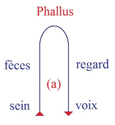
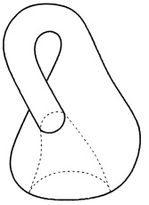
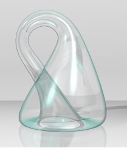
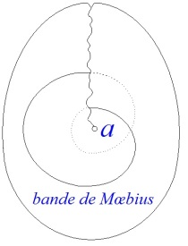
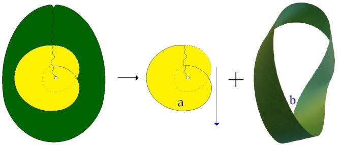

# Leçon 12 | 17 Mars l965

<!-- source-url: http://staferla.free.fr/S12/S12 PROBLEMES.docx -->
<!-- seminar: s12 -->
<!-- lesson: 12 -->

<!-- id: s12-12-0001 -->

Peut-être aurais-je eu aujourd’hui prétexte à vous demander un peu de repos. *Comment renvoyer tant de monde* ? Et d’autre part, jusqu’à un certain point le temps me presse : insuffisant il l’est presque à tenir la trajectoire que je me suis assigné cette année.

<!-- id: s12-12-0002 -->

Je vous demande votre attention dans la mesure surtout où je puis être amené à aller assez vite dans la ligne que j’entends aujourd’hui tendre d’un point à un autre, et qui répond à ce que j’ai déjà annoncé, voire amorcé la dernière fois concernant ce qu’au point où nous en sommes d’une reprise, je dirai plus que de l’expérience, de la technique analytique, à partir de cette affirmation : *qu’elle n’est pensable* - je ne dis pas « *praticable* » - *qu’elle n’est pensable* qu’à partir d’une notion tout à fait articulée du sujet, du sujet comme tel, du sujet tout au moins tel que j’ai essayé pour vous de le focaliser autour d’une certaine conception de ce qu’est l’expérience du *cogito* *cartésien*, et de ce qu’il introduit de nouveau du point de vue de l’être, quant à la position pensée de celui qui va s’offrir à quelque chose qui s’appelle *la psychanalyse*.

<!-- id: s12-12-0003 -->

Il n’est point *nécessaire* pour autant que le *sujet* le sache, si la formule clé qui nous donne la place dans l’expérience de l’inconscient c’est « *Il ne savait pas que*… ».

<!-- id: s12-12-0004 -->

C’est là *le statut*, tel que je vous l’ai introduit l’année dernière[^89], *de cette pulsation* ou apparaît ce quelque chose dont on peut dire que, moins qu’elle ne se révèle, elle se trahit et comme déjà l’écrit, nous l’allègue, la formule d’HÉRACLITE[^90] parlant d’ὁ ἄναξ : « ...*du prince, de celui à qui appartient le lieu de la divination, celui qui est à Delphes*...

<!-- id: s12-12-0005 -->

ὀ ἄναξ  οὗ τὸ μαντεῖόν ἐστι τὸ ἐν Δελφοῖς, οὔτε λέγει οὔτε κρύπτει ...*il ne dit pas, il ne cache pas*... » ἀλλὰ σημαίνει

<!-- id: s12-12-0006 -->

Ce n’est pas \[...\] qui est employé, il n’y a pas d’autre traduction possible que celle–ci : « …*il fait du signifiant* ».

<!-- id: s12-12-0007 -->

Ce signifiant c’est celui qui le recueille qui en fait quelque chose et littéralement *ce qu’il veut*. Chacun sait qu’à l’endroit de ce « *ce qu’il veut* » l’analyste n’est pas dans une position simple, que de ce « *ce qu’il veut* » il se sépare par toutes sortes de *murailles* qui sont *d’expérience, de principe, de doctrine*… Mais quand il s’agit d’aborder ce que j’ai appelé la dernière fois *le second étage de l’usage de la parole dans l’analyse*, il nous importe, ce second étage, dont on peut dire qu’il a été, au cours des années freudiennes et postfreudiennes, fort bien exploré, fort bien développé, il s’agit pour nous de situer ce qui à ce second étage appartient, et aussi ce qui constitue sa frontière et sa limite.

<!-- id: s12-12-0008 -->

Comme référence, dans ce *défrichage* qui est ici le mien, et dont vous pensez bien que ce n’est pas par hasard si au moment de reprendre aujourd’hui mon discours, je vous indique, désigne si c’est un autre geste que celui que j’évoquais tout à l’heure : que c’est de la position de l’analyste que - pour moi, pour vous, parce que vous attendez ici - il s’agit de partir, j’ai rappelé au tableau d’une façon encore plus *simple*, je dirai presque fruste, ce qui dans *le premier temps*, de ce défrichage, quand pour des analystes…

<!-- id: s12-12-0009 -->

> dont il faut bien dire que jusque-là, bien souvent dans le langage, pour eux, ces trois espèces de formes de la dialectique
>
> du manque qui s’appellent : *privation, frustration, castration*, étaient employées de façon presque interchangeable …quand j’ai rappelé que, au niveau de la référence au *symbolique*, à *l’imaginaire* et au *réel*, il convenait de voir qu’il y avait quelque chose, à ces trois niveaux, de radicalement différent.

<!-- id: s12-12-0010 -->

Que *la frustration*, je dirais simplement *à l’analyser de façon sémantique, c’est quelque chose qui porte en soi*, dans son centre, *son essence* et si l’on peut dire, son acte, cet acte vain, cette chose qui fuit, cette fraude, ce frustrage qui en fait, incontestablement de son statut, la déception sous son versant le plus *imaginaire*, et que ceci n’excluait pas que sa référence objectale fut quelque chose de *réel*.

<!-- id: s12-12-0011 -->

Que d’autre part ce qui en était le support et l’*agent*, l’Autre pour l’appeler par son nom, ne pouvait être pour nous situé que sous la forme la plus générale du lieu du *symbolique*, qu’il n’y a *frustration* à proprement parler, que là où quelque chose est revendicable et qu’aussi bien - *c’est la dimension qu’on ne saurait éliminer de sa définition -* qu’aussi bien est-ce là le cadre le plus large où a paru, à l’expérience des psychanalystes, se situer la situation quotidienne, l’« *au jour le jour* » de ce que peut découvrir par étape une expérience analytique quand il s’agit de le conjoindre dans le *hic et nunc* du rapport à l’analyste.

<!-- id: s12-12-0012 -->

Est–ce là quelque chose dont nous puissions d’aucune façon nous contenter ?

<!-- id: s12-12-0013 -->

Quand il s’agit d’articuler cette frustration il ne se peut que tout ce qui s’énonce dans le discours de l’analyste ne s’inscrive dans le double registre de la demande : qui parle ? Ce qui est une question qui se pose depuis le départ, depuis le premier pas dans l’analyse : l’analyse, le sujet vient la demander. *Qu’est-ce* qu’il vient demander dans l’analyse ?

<!-- id: s12-12-0014 -->

Toute *la littérature psychanalytique* quand elle se porte sur cette expérience, sur *- comme disent certains -* ce « *vécu des étapes analytiques* », elle s’emploie à dévoiler, à manifester ce qui, à travers ce quelque chose est fait à la fois de *repérage* mais aussi de *construction*.

<!-- id: s12-12-0015 -->

Là-dessus la pensée de ce que vit l’analyste, a démontré, a conjoint, a justifié la succession de ce qui se présente aux diverses étapes de l’analyse comme *demande*. Or la conjonction de cette *demande* avec quelque conception génétique que ce soit, ne saurait s’opérer sans qu’en fait s’y présente une certaine marge d’arbitraire.

<!-- id: s12-12-0016 -->

Car à la vérité ce qui est fait - je veux dire *effectivement* par les auteurs : ceci n’est pas sans devoir nous arrêter - *se réfère*, ose se référer à *une fonction* en quelque sorte, je ne dirai pas *biologique,* car ce serait déjà faire intervenir là un registre d’un niveau élevé qui n’est certainement *pas en cause à ce niveau simple*, que nous appellerons *celui du rapport vital tout simplement*, et même *- disons un peu plus -* *du rapport charnel* : *la dépendance, la dépendance physique*, animale, où le petit enfant se trouve par rapport à sa mère, est invoquée, comme étant ce quelque chose qui définit, donne, met au premier arrière-fond de ce sur quoi va se développer la demande, ce que nous appellerons *la position [anaclitique](http://www.cnrtl.fr/lexicographie/anaclitique)*, avec la plupart des auteurs analystes.

<!-- id: s12-12-0017 -->

Qu’on y conjoigne à cette conception d’ailleurs - *dont le terme central est pris à la plume de Freud -* qu’on y conjoigne une notion comme celle de *l’auto-érotisme primordial* où encore du *narcissisme* *primaire*, de cette époque où, dans une étape tout à fait initiale de *sa venue au monde*, *le sujet dans la théorie freudienne* est conçu comme ne faisant - *comme on l’explique très couramment dans plus d’un endroit* – qu’*une seule unité* ou qu’*un seul être*, comme vous voulez, avec l’être dont il vient de se détacher, avec l’être du ventre duquel il vient de sortir, c’est là *quelque chose qui est associé à cette position dite anaclitique* qui se révèle dans l’exercice par le sujet de *sa fonction de demande*.

<!-- id: s12-12-0018 -->

Or, il y a là incontestablement un saut, parce que, après tout, s’il n’est point impossible que *cette position anaclitique*, qui tout de même si elle est là présente dans le traitement, *n’a rien à faire avec la position de dépendance vitale* dont je vous parlais tout à l’heure, dont je vous parlais à l’instant, *si cette position anaclitique* peut être conçue, doctrinée plus exactement, comme de même niveau dans la *structure imaginaire* que *la position narcissique*, il n’en restera pas que la question soit tranchée de *la relation primaire à la mère*.

<!-- id: s12-12-0019 -->

Néanmoins, au moins quelque chose serait-il exigé qui en justifie le joint, *et qui nous assure qu’il ne s’agit pas*, dans cette image souvent évoquée au cours du traitement analytique, d’un appui pris, fusionnel, d’une aspiration au retour comme aux origines, conçues sous leur forme, comme je le disais tout à l’heure, la plus charnelle, *qu’il ne s’agit pas là d’un fantasme* à proprement parler, que nous pouvons là-dessus faire appui sur quelque continuité *où se traduirait l’empreinte qui, elle, serait au-delà du langage*.

<!-- id: s12-12-0020 -->

Or jusqu’à présent rien ne nous l’assure, pour autant que ce domaine de *la demande* étant exploré, nous pouvons toujours justifier ce qui y apparaît de plus *paradoxal*, sans nous référer à *ses origines concrètes* et qui sont celles qui seraient à concevoir *comme fondamentalement celles du nourrissage, du nourrissage* si tant est qu’il apparaît essentiel dans quelque chose qui, ici ou là, peut apparaître comme constant ou gravé dans l’histoire du sujet.

<!-- id: s12-12-0021 -->

Ce n’est point tant parce qu’il a été en fait *- et réellement -* que dans une fonction, dans une fonction qui est autre, qui fait en particulier que ce qui sert dans l’analyse *-* à ce nourrissage *-* de symbole, à savoir *le sein maternel*, est absolument exclusivement…

<!-- id: s12-12-0022 -->

> vu les métamorphoses sous lesquelles nous avons à le repérer et à le voir se traduire …*absolument exclusif d’une pure et simple expérience concrète*.

<!-- id: s12-12-0023 -->

Caractère du premier aspect *symbolique*, métabolisable, métonymisable, traductible et très tôt - c’est là l’intérêt de l’expérience kleinienne - son apparition très tôt sous la forme, pourquoi ne pas le dire, déguisée, *entstellt*, *déplacée,* du *phallus*, c’est là quelque chose qui doit attirer notre attention et nous faire ne pas nous contenter de quelque \[...\] quels que puissent être le poids, la commodité, de voir les recoupements souvent fallacieux que nous pouvons trouver dans l’observation directe, qui doit au moins nous faire mettre en suspens le statut de ses origines. Car cette expérience de la demande, cette analyse centrée sur le stade où le sujet incarne sa parole, ce n’est plus le sujet dont nous avons marqué le statut au niveau du plus radical du langage, du *trait unaire* et du statut de *privation* où le sujet s’installe.

<!-- id: s12-12-0024 -->

Comment ne sent-on pas qu’il est à retenir de l’expérience ainsi centrée, ainsi articulée, que ce qui est venu au cours des ans et par étapes, en donnant matière à arguer de façon assurément nuancée, subtile, parce qu’extrêmement divisée - je dirais d’école à école, si tant est que ce terme permette d’assurer des limites bien nettes à l’intérieur de l’analyse, que ce quelque chose dont cette expérience nous apporte le témoignage, c’est la découverte, c’est la manipulation, c’est la mise au point, c’est l’interrogation précise qui s’est centrée depuis Karl ABRAHAM jusqu’à Mélanie KLEIN, et depuis se multipliant en des efforts multiples, d’en assurer la venue : *l’objet partiel*, ce que - dans notre discours ici - j’articule comme étant le *(a)*.

<!-- id: s12-12-0025 -->

*Je m’excuse, je suis un petit peu fatigué. Vous entendez vraiment très mal ? Merci de m’en avoir averti.*

<!-- id: s12-12-0026 -->

Je pense que la diversité, la variété de ce *(a)*, si tant est que la liste que je vous en ai faite ici, non pas déborde, mais assurément articule d’une façon différente leur ampleur, sans pour autant - du tout - aller dans le sens de ne pas retenir les réductions majeures auxquelles *l’expérience analytique* *- ces objets(a) -* *les soumet*.

<!-- id: s12-12-0027 -->

La prévalence de *l’objet oral* - si tant est qu’il est appelé communément le sein - de *l’objet fécal* d’autre part, si nous le mettons sur le même tableau ou le même pourtour que celui où se situent deux de *ces objets*, articulés sans doute dans l’expérience analytique mais de façon infiniment moins assurée quant à leur *statut* que nous le faisons, à savoir : *le regard et la voix.*

<!-- id: s12-12-0028 -->

<!-- id: s12-12-0029 -->

Il faut que nous nous interrogions comment… que nous nous interrogions sur le fait de savoir comment l’expérience analytique peut y trouver le statut fondamental de ce à quoi elle a affaire dans la demande du sujet. Car après tout ça ne va pas de soi que d’abord cette liste soit aussi limitée. Et sans doute le privilège de ces *objets* s’éclaire *d’être chacun dans une certaine homologie de position*, à ce niveau de joint que j’évoquais la dernière fois, entre le sujet et l’Autre.

<!-- id: s12-12-0030 -->

Néanmoins, il n’est pas à dire que ce que le sujet demande - dans la demande à l’Autre - ce soit *le sein*. Dans la demande à l’Autre, le sujet demande tout ce qu’il peut avoir à demander, au premier abord dans l’analyse par exemple : que l’Autre parle.

<!-- id: s12-12-0031 -->

Il y a quelque chose *d’abusif, d’excessif,* à aussitôt traduire ce qui est caractéristique de la demande, à savoir que c’est vrai, il est demandé *quelque chose que l’analyste aurait*, mais ce qui est demandé comme ce qu’il a, c’est en fonction d’une autre chose, que l’analyste lui-même pose comme la vraie visée de ce que demande le sujet.

<!-- id: s12-12-0032 -->

Ceci mérite qu’on s’y arrête quand cet *objet(a)* s’installe ainsi, moins comme la pointe de la visée, que comme ce qui aurait dans une certaine béance, qui est celle créée par la demande, et ce sur quoi la dernière fois j’ai insisté, poussant mon pinceau de lumière dans le sens d’aller chercher la demande et la phrase sous sa forme la plus ramassée : celle qui pourrait passer pour être au niveau de l’expression pure et simple, et que là : dans *l’interjection*, j’ai insisté à vous montrer que ce qui fait sa valeur et son prix, sa spécificité, d’autant plus saisissable qu’elle est ici plus ramassée, c’est qu’elle vient toujours frapper au joint du sujet et de l’Autre.

<!-- id: s12-12-0033 -->

Que ce que l’interjection, en apparence la plus simple impose à l’interlocuteur, c’est cette référence commune au tiers qu’est le grand Autre, et c’est quelque chose qui à \[...\] toujours, plus ou moins, invite à prendre du recul, à tempérer, à reconsidérer, à revoir, à ré–opposer, à rediriger le regard vers quelque antérieur interlocuteur, à -assurément on peut poser la question - entrevoir s’il n’est pas quelque incidence plus réduite, plus simple, plus efficace aussi, *du langage*.

<!-- id: s12-12-0034 -->

Toute la théorie de Pierre JANET est construite sur la théorie du commandement : l’ordre donné, en tant que, de celui qui *parle* au bras qui *agit*, il instaure une sorte de statut commun, inaugural, dans l’instance de la conduite humaine. Chacun sait que l’analyse ne peut pas se contenter de cette reconstruction qui n’est que reconstruction au tableau noir, et que ce qu’il en est du *gubernator* sur les barques égyptiennes, *de celui qui de sa baguette rythme le battement des rames,* n’est pas quelque chose qui soit du statut du sujet effectif, qu’il n’y a d’ordre qui ne soit référence à un sur-ordre.

<!-- id: s12-12-0035 -->

Assurément la question se pose des cas où l’ordre va cheminer pour aller droit à son but et se manifester efficacement dans ce qu’on appelle la suggestion. Mais qu’est-ce que nous montre l’analyse si ce n’est que, dans ce cas, la suggestion fonctionne par rapport à ce terme tiers qui est, dans ce cas-là, celui du désir inconnu. C’est au niveau de la répercussion, de l’intérêt obtenu du désir inconscient, que celui qui sait manier cette sorte de téléguidage - ce qu’on appelle *la suggestion -* prend son point d’appui, et s’il ne l’a pas, la suggestion est inefficace. Qu’on puisse le prendre par des moyens extrêmement primitifs comme celui de la boule de cristal, est simplement là pour nous montrer la fonction éminente par exemple du point brillant au niveau de *l’objet(a)*.

<!-- id: s12-12-0036 -->

Il y a donc toujours cette référence tierce dans l’effet de la demande et pourtant, n’est-il pas possible de découvrir quelque part, ce qui aurait le privilège de nous faire saisir ce quelque chose dont nous avons besoin, à savoir : quel est le statut, quelles sont les limites, de ce champ du grand Autre, auquel nous avons été amenés, amenés au niveau de l’expérience, qui est celle du champ \- du champ d’artifice - assuré à la parole dans la psychanalyse ?

<!-- id: s12-12-0037 -->

C’est ici que j’espère que l’objet que j’ai fait tout à l’heure circuler dans vos rangs, à savoir la reproduction du tableau célèbre d’Edouard MÜNCH qui s’appelle [*Le* *Cri*](#munch1703), est quelque chose - une figure - qui m’a semblé propice à articuler pour vous un point majeur, fondamental, sur lequel beaucoup de glissements sont possibles, beaucoup d’abus sont faits, et qui s’appelle *le silence*.

<!-- id: s12-12-0038 -->

*Le silence*, il est frappant que pour vous l’illustrer, je n’ai pas trouvé mieux, à mon sens, que cette image que vous avez tous vue, je pense, maintenant, et qui s’appelle *Le Cri*.

<!-- id: s12-12-0039 -->

<!-- id: s12-12-0040 -->

Dans ce paysage singulièrement dépouillé, dessiné par le moyen de lignes concentriques, ébauchant une sorte de bipartition dans le fond, qui est celle d’une forme du paysage à son *reflet*, un lac, aussi bien formant trou est là au milieu, et au bord, droite, diagonale, en travers, barrant en quelque sorte le champ de la peinture : une route qui fuit. Au fond, deux passants, ombres minces qui s’éloignent dans une sorte d’image d’indifférence, au premier plan *cet être, cet être* dont - sur la reproduction qui est celle du tableau - vous avez pu voir que l’aspect est étrange, qu’on ne peut même pas le dire sexué. Il est peut-être plus accentué dans le sens d’un être jeune et d’une petite fille dans certaines des *redites* qu’en a faites Edouard MÜNCH, mais nous n’avons pas de raison spéciale de plus en tenir compte. Cet être, cet être ici dans la peinture d’aspect plutôt vieillot, au reste forme humaine si réduite, que pour nous, elle ne peut pas même manquer d’évoquer celles des images les plus sommaires, les plus rudement traitées de l’enfance phallique, *cet être se bouche les oreilles, ouvre grand la bouche, il crie.*

<!-- id: s12-12-0041 -->

Qu’est-ce que c’est que ce cri ? Qui l’entendrait ce cri que nous n’entendons pas, sinon justement qu’il impose ce règne du silence qui semble monter et descendre dans cet espace à la fois centré et ouvert. Il semble là que ce silence soit en quelque sorte le corrélatif qui distingue dans sa présence ce cri de tout autre modulation imaginable, et pourtant, ce qui est sensible, c’est que le silence n’est pas le fond du cri, il n’y a pas là rapport de *Gestalt* : littéralement *le cri semble provoquer le silence,* et s’y abolissant, il est sensible qu’il le cause, il le fait surgir, il lui permet de tenir la note.

<!-- id: s12-12-0042 -->

C’est *le cri* qui le soutient, et non le silence *le cri*. Le cri fait en quelque sorte - le silence - se pelotonner dans l’impasse même d’où il jaillit pour que le silence s’en échappe. Mais c’est *déjà fait* quand nous voyons l’image de MÜNCH : *le cri est traversé par l’espace du silence sans qu’il l’habite, ils ne sont liés ni d’être ensemble ni de se succéder, le cri fait le gouffre où le silence se rue* .

<!-- id: s12-12-0043 -->

Cette image où la voix se distingue de toute voix modulante, car dans le cri ce qui le fait *différent* - *même de toutes les formes les plus réduites du langage -* c’est la simplicité, la réduction de l’appareil mis en cause : ici le larynx n’est plus que syrinx, l’implosion, l’explosion, la coupure, manquent.

<!-- id: s12-12-0044 -->

Ce cri, là peut-être, nous donne l’assurance de ce quelque chose où le sujet n’apparaît plus que comme signifié mais dans quoi ?

<!-- id: s12-12-0045 -->

Justement dans cette béance ouverte qui, ici anonyme, cosmique, tout de même marquée dans un coin, de deux présences humaines absentes, se distingue, se manifeste comme la structure de l’Autre. Et d’autant plus décisivement que le peintre l’a choisie divisée, en forme de reflet, nous indiquant bien dans ce quelque chose une forme fondamentale qui est celle que nous trouvons dans l’affrontement, l’accolement, la suture de tout ce qui s’affirme dans le monde comme organisé.

<!-- id: s12-12-0046 -->

C’est pourquoi *quand il s’agit dans l’analyse* - où le mot court, et dont on fait un usage approximatif - *de silence* : *Silence and verbalisation* [^91] excellent article écrit par le fils de Wilhelm FLIESS, le compagnon de l’auto-analyse de FREUD : Robert FLIESS donc.

<!-- id: s12-12-0047 -->

Assurément Robert FLIESS dénomme, d’une façon correcte ce qu’il en est du silence dans ce qu’il nous explique : ce silence c’est le lieu même où apparaît le tissu sur quoi se déroule le message du sujet, et là où le *rien d’imprimé* laisse apparaître ce qu’il en est de cette parole, et ce qu’il en est c’est précisément, à ce niveau, son équivalence avec une certaine fonction de *l’objet(a).*

<!-- id: s12-12-0048 -->

C’est en fonction de l’objet d’excrétion, de l’objet urinaire ou fécal, par exemple, ou du rapport à l’objet oral, que FLIESS nous apprend à distinguer la valeur d’un silence par la façon dont le sujet : y entre, fait durer, s’y soutient, en sort, il nous apprend la qualité de ce silence. Il est clair qu’il est indiscernable de la fonction même de la verbalisation. Ce n’est nullement en fonction de quelque défense, de quelque prédominance des appareils du moi, qu’il est apprécié, c’est au niveau de la qualité la plus fondamentale qui manifeste la *présence instante* dans le jeu de la parole, de celui est indistinguable de la pulsion.

<!-- id: s12-12-0049 -->

D’un analyste de souche ancienne, et de grande classe sans doute - ce travail, cette référence est assurément d’un grand prix - montrant comment les voies d’une certaine aperception de ce qu’il en est de la présence *érotique* du sujet, est quelque chose sur quoi nous sommes en droit de faire fond et qui est fort éclairant. Néanmoins, ce silence, si dénoté dans sa fonction musicale, aussi intégré au texte que peut l’être, dans ses variétés, le silence dont le musicien sait faire un temps aussi essentiel que celui d’une note soutenue, de la pause ou du silence, est-ce là quelque chose que nous puissions nous permettre d’appliquer seulement au fait de l’arrêt de la parole ? Le « *se taire* » n’est pas le silence : *Sileo* n’est pas *taceo*.

<!-- id: s12-12-0050 -->

PLAUTE[^92] quelque part, dit aux auditeurs, comme c’est l’ambition de tout un chacun qui sait - ou veut - se faire entendre :

<!-- id: s12-12-0051 -->

> « *Sileteque et tacete atque animum aduortite.* » « *Faites attention, faites le silence et taisez-vous.* »

<!-- id: s12-12-0052 -->

Ce sont deux choses différentes. La présence du silence n’implique nullement qu’il n’y en ait pas un qui parle - c’est même dans ce cas-là que le silence prend éminemment sa qualité - et le fait qu’il arrive que j’obtienne ici quelque chose qui ressemble à du silence, n’exclut absolument pas que, peut–être, devant ce silence même, tel ou tel s’emploie dans un coin à le meubler de réflexions plus ou moins haut poussées. La référence du silence au « se taire » est une référence complexe. Le silence forme un lien, un nœud fermé entre quelque chose qui est une entente et quelque chose qui, parlant ou pas, est l’Autre : c’est ce nœud clos qui peut retentir quand le traverse - et peut-être même le creuse - le cri.

<!-- id: s12-12-0053 -->

Quelque part dans FREUD[^93], il y a la perception du *caractère primordial de ce trou*, de ce trou du cri quand FREUD lui-même dans une lettre à FLIESS l’articule : c’est au niveau du cri qu’apparaît le *Nebenmensch*, \[Cf. *L’éthique* 02-12, 09-12, 16-12, 20-01\] ce *prochain* dont j’ai montré que c’est bien effectivement ainsi qu’il doit être nommé, le plus proche, parce qu’il est justement ce creux, *ce creux infranchissable, marqué à l’intérieur de nous-mêmes* et dont nous ne pouvons qu’à peine nous approcher.

<!-- id: s12-12-0054 -->

Ce silence, c’est peut-être là le modèle ainsi dessiné, et, vous l’avez senti, par moi confondu, avec cet espace enclos par la surface \- et d’elle-même, par elle-même *inexplorable* - qui fait *la structure originale* que j’ai essayé de vous figurer au niveau de la *bouteille de Klein*.

<!-- id: s12-12-0055 -->

Qu’est-ce alors qu’il nous faut distinguer dans les opérations qui sont celles de *la parole* et de *la demande* ?

<!-- id: s12-12-0056 -->

Au premier aspect, au premier temps, cette coupure que le schéma de la bouteille :

<!-- id: s12-12-0057 -->

 

<!-- id: s12-12-0058 -->

nous permet d’imager comme étant celle de sa division en deux champs dont le caractère « *surface de Mœbius* » est là pour nous figurer le côté fermé sur lui-même : le côté - non pas à double - mais *à une seule surface*, le côté qui dans le signifiant donne la prévalence, l’unicité, à l’effet de sens :

<!-- id: s12-12-0059 -->

- dans la mesure où il ne comporte pas par lui-même l’envers d’un signifié,

<!-- id: s12-12-0060 -->

- dans la mesure où il se ferme sur lui-même et où il *est* avant tout cette *coupure* à quoi peut se réduire, vous ai-je dit, tout ce qu’il y a d’essentiel dans la structure de la surface puisque, pratiquée d’une façon appropriée :

<!-- id: s12-12-0061 -->

- elle en fait disparaître cette fonction essentielle d’être sens et pur sens,

<!-- id: s12-12-0062 -->

- elle y fait apparaître cette duplicité, cet endroit et cet envers qui, pour nous, figureront la correspondance, la division du signifiant et du signifié.

<!-- id: s12-12-0063 -->

Or ce que veut dire que dans *la demande* se dégage, donc apparaisse, quelque chose qui est d’une autre structure, qui apparaît si l’on peut dire, hors de la prévision de ce qui est demandé : ceci qui vous est figuré par le rapport que j’ai reproduit une fois de plus ici, sur le tableau :

<!-- id: s12-12-0064 -->

 

<!-- id: s12-12-0065 -->

de la *bande de Mœbius* périphérique et de cette rondelle réduite, de ce quelque chose d’indépendant qu’on peut en détacher :

<!-- id: s12-12-0066 -->

- qui est chute,

<!-- id: s12-12-0067 -->

- qui est apparition *d’un résidu, d’un reste* dans l’opération de la demande,

<!-- id: s12-12-0068 -->

- et qui apparaît comme la cause d’une reprise par le sujet de ce qui s’appelle *fantasme* \[S**◊***a*\], et qui à l’horizon de la demande fait apparaître la structure du désir dans son ambiguïté.

<!-- id: s12-12-0069 -->

À savoir que le désir :

<!-- id: s12-12-0070 -->

- s’il peut se détacher, surgir, apparaître comme condition absolue et parfaitement présentifiable, comme étant ce quelque chose dont le sujet qui le désire, qui le prend comme tel au niveau de l’Autre, le fait subsister simplement de le soutenir insatisfait : mécanisme hystérique dont j’ai marqué la valeur essentielle,

<!-- id: s12-12-0071 -->

- que ce soit le seul point, le seul terme où converge en l’expliquant la jonction de la demande et du transfert,

<!-- id: s12-12-0072 -->

- que dans la tromperie du transfert, ce dont il s’agit, c’est de quelque chose qui, à l’insu du sujet, tourne autour de capter

<!-- id: s12-12-0073 -->

> d’une façon qui est imaginaire ou bien qui est agie, cet *objet(a),*

<!-- id: s12-12-0074 -->

- que ce soit là le terme et la commune mesure, autour de quoi fonctionne tout le niveau dit de la frustration, ...c’est là ce qu’il s’agit de poser d’une façon qui permette, à partir de là les questions - et seulement à partir de là - de distinguer ce que l’expérience peut nous permettre actuellement d’entériner concernant : quelle est l’origine, par quelle porte est venue la fonction de cet *objet(a)* ?

<!-- id: s12-12-0075 -->

C’est ici qu’il faut accentuer, rappeler toujours, que toute nos connaissances, quant à ce qu’il s’agit d’un développement qui serait psychanalytiquement justifié, partent et s’originent toujours dans l’expérience de la cure. C’est pourquoi le statut de l’analyste, il ne nous suffit pas pour l’instant ici, simplement de le fonder, en quelque sorte d’une façon arbitraire préfigurée par nos catégories.

<!-- id: s12-12-0076 -->

Il s’agit de voir si nos catégories ne sont pas celles qui nous permettent précisément de faire la carte, de comprendre, ce qu’il en est de telle ou telle tendance théorique dans le milieu analytique, dans la communauté des analystes, avec cette position qui, chez chaque analyste, et bien naturellement, pas simplement d’une façon isolée, mais à la mesure de l’expérience qu’il a faite, à savoir de son expérience formatrice, de ce qui chez chaque analyste peut être repéré comme un désir essentiel pour lui, de référence.

<!-- id: s12-12-0077 -->

Car ici, il ressort de ce qui dans les théories de la technique et des communications, s’affirme et se repère :

<!-- id: s12-12-0078 -->

- que de mettre l’accent, par exemple, sur une technique qui fait apparaître au niveau de l’Autre, pour le sujet, dans le fantasme, l’image phallique sous la forme positive où elle est conçue et représentée comme *objet de fellatio*,

<!-- id: s12-12-0079 -->

- qu’il y a là quelque chose qui déjà se distingue, en ceci que dans *la coupure*, *c’est du côté du grand A que cet objet tombe* et que cet *objet* est chargé, au moins dans certains registres nosologiques, spécialement par exemple dans le cas de *la névrose de l’obsessionnel*, pour l’auteur et le praticien que je vise[^94], et que beaucoup ici peuvent repérer.

<!-- id: s12-12-0080 -->

Il est clair que de centrer autour du surgissement de ce fantasme, en tant qu’il apparaît au niveau de l’Autre, c’est-à-dire de l’analyste, un repérage , une approche, une critique de l’approche de la réalité, qui semblerait dans cette perspective être la clé, le gond, la porte, par où peut se résoudre la mise en accord du sujet avec un indiqué prétendu objet réel*,* c’est là quelque chose qui se distingue en tout cas, d’une autre pensée, d’une autre théorie, moyennant quoi il ne saurait y avoir d’analyse qui puisse d’aucune façon se dire achevée, si ce n’est pas au niveau du sujet lui-même…

<!-- id: s12-12-0081 -->

> qu’à une phase qui est précisément une phase qui franchit cette étape purement identificatoire de repérage,
>
> de pointage, de « tâtage » d’un *certain réel* qui est celui où une *certaine technique* se confine …c’est dans la mesure où le sujet lui-même peut en venir, au-delà de cette identification, à vivre l’effet de cette coupure comme étant lui-même *ce reste, ce déchet* même, si vous voulez, cette chose extrêmement réduite d’où il est effectivement parti, à une origine qu’il ne s’agit pas tant de concevoir comme celle de son histoire mais comme cette origine qui reste inscrite dans la synchronie, dans le statut même de son être, que quelque chose un temps soit éprouvé comme : qu’il le soit, lui, cet objet - soit demandé à l’Autre, soit qu’on lui demande *sein*, voire même *déchet*, *excrément* à proprement parler - et en d’autres cas, en d’autres registres qui ne sont pas ceux de la névrose : cette fonction de *la voix* ou du *regard*.

<!-- id: s12-12-0082 -->

Ici la référence est essentielle que j’ai faite en son temps à propos du transfert[^95]. Au point où dans l’histoire apparaît le surgissement, surgissant d’une façon primordiale, voilé depuis, mais dans un texte célèbre de PLATON qui en garde le témoignage, il s’agit du texte du [*Banquet*](http://philia.online.fr/lectures/oeuvres/plat_banquet.php).

<!-- id: s12-12-0083 -->

À la fin de cette succession de discours où se constitue le Συμπόσιον \[symposion\] \[Cf. Platon, *Banquet*, 177d\], de ces discours qui sont ἔπαινον \[épainon : citations\], Ερωτος \[éloge\] ou illumination, de toute façon louanges et célébration de la fonction de l’amour, voici qu’entre alors le cortège de ces gens fêtards, non certes inspirés mais vrais *trouble-fêtes*, vrais personnages venant ici renverser toutes les règles de cette *célébration extraordinairement civilisée,* c’est ALCIBIADE, cet ALCIBIADE qui pourtant se trouve ainsi au sommet du dialogue, encore que la plupart des traducteurs, dans la tradition française, depuis Louis LE ROY jusqu’à RACINE, et jusqu’à Monsieur Léon ROBIN, n’aient pas cru, *bien sûr* d’aucune façon, devoir se passer de ce complément essentiel.

<!-- id: s12-12-0084 -->

*On sait que certains traducteurs dans le passé ont coupé là, ont reculé, comme si ce n’était pas là qu’était le dernier mot, le secret de ce dont il s’agit !*

<!-- id: s12-12-0085 -->

Pour comprendre ce dont il s’agit *entre le sujet et l’analyste*, quel meilleur modèle que cet ALCIBIADE qui *tout d’un coup vient raconter l’aventure qui lui est arrivée avec* SOCRATE, ceci devant SOCRATE et devant l’assemblée des autres éminents et savants invités.

<!-- id: s12-12-0086 -->

Il dit alors de ce SOCRATE, il en fait d’abord la louange et en quels termes ! En ces termes qui le figurent à la façon d’un parement, d’une boîte, piquée de… de quelque chose qui enveloppe un objet précieux \[Cf. séminaire *Le transfert*..., 01-02\], et qui souvent, *à l’extérieur*, se présente sous *une figure grotesque, caricaturale, déformée*.

<!-- id: s12-12-0087 -->

L’antique *figure* de SOCRATE dans son aspect de SILÈNE, « *si elle n’est vraie, elle est belle* » \[*« si no è vero, è bello »*\], elle sort de là, vous le savez, et à l’origine de son [*Grand livre*](http://www.bvh.univ-tours.fr/Consult/consult.asp?numfiche=63&index=3&numtable=B372616101_3923&mode=1) RABELAIS[^96] le reprend quand il s’adresse à ceux qui sont faits pour l’entendre : « *les buveurs très précieux et les vérolés* ».

<!-- id: s12-12-0088 -->

De tous temps, une assemblée qui se choisit a été, du dehors et de l’intérieur, reprise avec humour, comme spécifiée par quelque trait de caricature. Il est arrivé que ceux qui ont constitué mon *auditoire* pendant dix années ne soient pas, du dehors - quoique sous d’autres termes - qualifiés de façon plus favorable. Ici nous avons SOCRATE, ainsi d’abord sous cette forme énigmatique, loué, chanté, exalté. Et de quoi va nous témoigner ALCIBIADE ?

<!-- id: s12-12-0089 -->

C’est que pour obtenir *ce qu’il y a dans cette « boîte* », ce qu’il en est du *secret de Socrate*, si je puis dire, de quoi n’a-t-il pas été capable ?

<!-- id: s12-12-0090 -->

De quoi nous dit-il qu’il l’a été ? De rien de moins que de mentir !

<!-- id: s12-12-0091 -->

Du moins c’est lui qui le dit, puisqu’aussi bien, tout ce qu’il nous dépeint de sa conduite : *de déclaration d’amour, de séduction* à l’endroit de SOCRATE, est quelque chose qu’il nous présente comme étant entièrement pointé vers l’obtention - sans doute, un moment, de la part de SOCRATE - de ce qu’il en est au fond de lui de cette science mystérieuse, énigmatique, profonde, dont rien de plus assuré ne lui est donné, que de cette extraordinaire ἀτοπία \[atopia\] de SOCRATE, de ce quelque chose qui dans sa conduite, le laisse en dehors, le distingue de tout ce qui est autour de lui, le laisse, disons le mot : sans dépendance. \[Cf. *Banquet*, 219e\]

<!-- id: s12-12-0092 -->

Et si ALCIBIADE *pousse les choses plus loin* que d’avoir l’air d’avoir l’occasion d’y faire la démonstration de la vertu de SOCRATE, puisque le cours de ses assauts va le pousser à aller coucher la nuit sous le même manteau que lui,sous le manteau de SOCRATE, et après tout, mon Dieu, c’était probablement quelque chose qui valait la peine d’être remarqué, puisque, si nous en croyons les témoignages, il arrivait que SOCRATE se lavât mais pas toujours, et là - si aux déclarations de cet être, dont par ailleurs il est dit que SOCRATE lui porte une *particulière attention*, qui est une attention d’amour - il est un fait, c’est que SOCRATE le renvoie, et que toute la fable, dirais-je, car comment savoir si la racontant, ALCIBIADE ment ou non ?

<!-- id: s12-12-0093 -->

Assurément il en témoigne : « j’ai rusé, j’ai menti... », mais comment qualifier ce mensonge alors qu’il avait pour visée, ce dont lui-même ne saurait *rendre compte* ? Car que veut-il ? La vérité est-elle si précieuse à ALCIBIADE, qui est celui qui est l’image même du désir : qui va toujours tout droit devant lui, rompt tous les obstacles, fend les flots de la société jusqu’au terme où il arrive au bout de sa course et est abattu ? Qu’est-ce donc cet ἄγαλμα \[agalma\] dont il s’agit et qui est ici le centre de la captivation d’ALCIBIADE par la figure de SOCRATE ?

<!-- id: s12-12-0094 -->

Et que veut dire… que veut dire ceci que lui répond SOCRATE : « *Tout ce que tu viens de dire...Tout ce que tu viens de dire est là quelque chose qui n’a pour toi raison et lieu que de ceci : que tu aimes Agathon*... ». \[Cf. Platon, [*Banquet*](http://philia.online.fr/lectures/oeuvres/plat_banquet.php), 222c-d\]

<!-- id: s12-12-0095 -->

Laissons la figure d’AGATHON dont le nom pourrait tôt ou tard nous servir à rêver. Indiquons seulement qu’il ne semble pas que personne, avant moi, ait fait la découverte :

<!-- id: s12-12-0096 -->

- que les propos imputés à AGATHON dans le *Banquet* ne peuvent être qualifiés que de caricaturaux,

<!-- id: s12-12-0097 -->

- que la façon dont il a loué l’amour est certes celle d’un précieux, mais qui dans son effet, n’aurait articulé que les vers les plus dérisoires.

<!-- id: s12-12-0098 -->

- Jusqu’à la façon dont ils sont alitérés, souligne ce trait excessif qui fait de lui ce que nous pourrions nettement épingler

<!-- id: s12-12-0099 -->

> \- *bien plus légitimement que Nietzsche* \[[*La naissance de la tragédie*](http://fr.wikisource.org/wiki/L%E2%80%99Origine_de_la_Trag%C3%A9die)\] *ne l’a fait pour Euripide* - comme un tragique assurément, perçant vers la comédie. Mais qu’importe !

<!-- id: s12-12-0100 -->

Ce dont il s’agit n’est-ce pas là, de nous faire apparaître la structure de tromperie qu’il y a dans le transfert qui accompagne ce certain type de demande, celui de l’ἄγαλμα \[agalma\] caché.

<!-- id: s12-12-0101 -->

Que *ce transfert très spécial* que nous avons le droit... qui est mis là au *culmen* de ce qu’il en est de *l’amour*, est-ce que nous ne voyons pas se renvoyer, quoique avec des accents contraires, deux paroles d’amour : celle d’ALCIBIADE et celle de SOCRATE, qui - je l’ai dit - avec des accents qui ne sont pas les mêmes, tombent sous la clé de la même définition :

<!-- id: s12-12-0102 -->

> « *L’amour, c’est donner ce qu’on n’a pas à quelqu’un qui n’en veut pas.* »

<!-- id: s12-12-0103 -->

C’est vrai d’ALCIBIADE qu’il peut *donner ce qu’il n’a pas*, à savoir l’amour que lui demande SOCRATE, l’amour qui le renverra à son propre mystère et qui, dans le dialogue d’ALCIBIADE est incroyablement *figuré*, d’une façon qui me paraît tellement actuelle, pour notre réflexion ici, puisque :

<!-- id: s12-12-0104 -->

- *c’est à cette petite image qui apparaît au fond de la prunelle*,

<!-- id: s12-12-0105 -->

- c’est à ce quelque chose qui, dans la vision n’est pas vision mais est à l’intérieur de l’œil,

<!-- id: s12-12-0106 -->

- *c’est à cette place où nous situons cet objet fondant qu’est le regard,* que dans le texte de PLATON, ALCIBIADE est renvoyé.

<!-- id: s12-12-0107 -->

Et que SOCRATE n’en veuille pas, c’est là aussi une articulation essentielle mais qui demande à être retenue. *Pourquoi n’en veut-il pas*, puisque, aussi bien, chacun sait que SOCRATE est non seulement dit « *attaché* » à ALCIBIADE mais jusqu’au point d’être jaloux, c’est le texte et la tradition qui nous le disent. Et ce que SOCRATE renvoie à ALCIBIADE, c’est aussi quelque chose qu’il affirme ne pas avoir, *puisqu’il n’a aucune science* qui ne soit, dit-il, accessible à tous. Et la seule chose qu’il sait, c’est *la nature du désir* : que le désir est le manque. C’est ici que les choses restent suspendues dans le texte de PLATON et que, après

<!-- id: s12-12-0108 -->

- *l’égaillement* d’une partie de l’assemblée, lassée,

<!-- id: s12-12-0109 -->

- le passage à travers *le sommeil* d’une autre partie …les choses se retrouvent au matin dans une discussion sur la tragédie et la comédie.

<!-- id: s12-12-0110 -->

Ce qui est essentiel, c’est cette suspension autour du point où ALCIBIADE est renvoyé - vers quoi ? - ce que nous appel­lerions la vérité de son transfert. Et qu’est-ce qu’il essaie d’obtenir d’AGATHON si ce n’est, à proprement parler, ce qui est défini dans FREUD comme *le désir hystérique* ?

<!-- id: s12-12-0111 -->

Ce que ALCIBIADE *simule* c’est ce qui a été précédemment défini dans le *Banquet* comme *le mérite maximum de l’amour* : le fait que le désiré, le désirable, se fasse, se pose, se dévoue comme étant le désirant. Et c’est là, et c’est par là qu’il pense *fasciner* *le regard* de celui que, de toute façon nous avons déjà vu comme étant un personnage de *type* extraordinairement *incertain* quant au fondement de sa parole.

<!-- id: s12-12-0112 -->

Telle est la voie par quoi nous est ouverte, et dès - vous le voyez - une antiquité qui lui donne tous ses titres de noblesse, la dialectique du transfert si l’on peut dire, l’entrée dans l’histoire d’une question à proprement parler analytique.

<!-- id: s12-12-0113 -->

Je proposerai de faire l’épreuve sur un texte que j’ai choisi, que j’ai déjà proposé à certains, et qui j’espère sera choisi et accepté par tel ou tel, de vous montrer à propos d’un texte précisément choisi en raison de ceci : qu’assurément à travers des choix, peut-être prématurés - c’est un article où l’auteur dont il s’agit fait ses premières armes - mais le prix de cet article est d’apporter le témoignage, de faire la preuve de sa première expérience analytique avec le silence - qu’il soit juste ou pas qu’il intitule ceci

<!-- id: s12-12-0114 -->

« *Le silence »*, est une autre question car, après tout, ce n’est peut-être pas vraiment d’un silence dont il s’agit - mais où il est mené en toute cohérence - et on ne peut pas dire, au premier aspect sous l’influence de quelque guidage doctrinal - où il est mené dans sa conception de la relation du sujet à l’objet partiel et de l’Autre à cet énigmatique objet total, dont on croit pouvoir purement et simplement déposer le sort et l’avenir entre les mains de l’analyste.

<!-- id: s12-12-0115 -->

Là où il est amené, et la façon dont il a à *se repérer* avec les diverses références qui lui sont offertes par les doctrines plus ou moins courantes dans leur diversité, est quelque chose qu’assurément je ne peux faire poursuivre que dans un séminaire plus réduit que celui qui est ici, mais qui est, au dernier terme, la chose essentielle que nous visons.

<!-- id: s12-12-0116 -->

Si ces catégories, si leur articulation, celle du S, du A et du *(a)*, ont quelque sens, ce n’est pas de pouvoir s’adjoindre à je ne sais quel bagage culturel destiné à être appliqué là où il se peut, plus ou moins aveuglément. Ces choses sont construites autour de *l’expérience analytique*, et *l’expérience analytique* il n’est pas là moins précieux de savoir comment l’analyste la pense.

<!-- id: s12-12-0117 -->

Qu’il veuille ou qu’il ne veuille pas le faire en termes de pensée - qu’il s’exprime : « *moi je ne suis pas de ceux qui philo­sophent* » - ne change rien à la question : moins on veut faire de philosophie, plus on en fait !

<!-- id: s12-12-0118 -->

Et aussi bien, il est absolument obligé que dans une expérience comme l’expérience analytique, le sujet laisse voir ce que nous appellerons « *le fond de son sac* », et que dans une analyse, l’analyste soit autant en cause que l’analysé, est le sens et la visée de ce vers quoi je vous dirige.

<!-- id: s12-12-0119 -->

Et ce n’est pas pour rien qu’au niveau de cette expérience d’un silence prolongé avec une patiente, l’auteur mette en avant la mise à jour de ce qu’il appelle d’ailleurs improprement son « *contre-transfert* » - je l’ai souvent dit, le terme est impropre – et tout ce qui est de la position de l’analyste, tout et y compris l’ensemble et le bagage de ses règles, de ses indications, de sa doctrine et de sa théorie, tout doit toujours être mis au compte de ce que nous appelons « *transfert* ».

<!-- id: s12-12-0120 -->

C’est-à-dire qu’il n’est en aucun cas *quoi que ce soit*, qui par l’analyste, ne puisse être mis en suspicion, en suspension, de participer pour lui d’une identification indue.

<!-- id: s12-12-0121 -->

[MÜNCH : Le cri](#retourMUNCH1703) [[[Table des séances](#Table_des_seances)](#retourtable)](#retourtable)

<!-- id: s12-12-0122 -->

## Notes

[^89]: Cf. séminaire Les 4 concepts... séances des 07-05, 10-06, 17-06, 24-06-1964.

[^90]: « Le maître dont l’oracle est à Delphes ne dit pas, ne cache pas, mais signifie » [Héraclite](http://philoctetes.free.fr/heraclite.pdf) fragment 93, traduction : Simone Weil.

    ὁ ἄναξ οὗ τὸ μαντεῖόν ἐστι τὸ ἐν Δελφοῖς, οὔτε λέγει οὔτε κρύπτει ἀλλὰ σημαίνει.

[^91]: Traduit en français in « *Le silence en psychanalyse* », sous la direction de Juan-David Nasio, Paris, Payot, 1998.

[^92]: Plaute : [*Comédies* tome I, *Pœnulus, prologue*](http://remacle.org/bloodwolf/Plaute/spectateurs1.htm).

[^93]: S. Freud : *Esquisse d'une psychologie,* Érès, 2011, bilingue*.*

[^94]: M. Bouvet : *La psychanalyse d'aujourd'hui*, Paris, PUF, 1956.

[^95]: Cf. séminaire 1960-61 : *Le transfert*... Seuil, 2001.

[^96]: [Rabelais François, *Vie très horrifique du Grand Gargantua*](http://un2sg4.unige.ch/athena/rabelais/rab_garg.html)*,* Livre Ier, prologue :

    *« Buveurs très illustres et vous très précieux vérolés, car c’est à vous que je dédie mes écrits et non à personne d’autre, Alcibiade, ou le dialogue de Platon intitulé le Banquet, louant son précepteur Socrate, qui est sans controverse le Prince des philosophes, dit entre autres mots qu’il est semblable à Silènes. Silènes était jadis de petites boites, que que nous voyons aujourd’hui présentes dans la boutique des apothicaires, peintes au dessus de joyeuses et frivoles figures, comme les harpies, les satyres, les oisons bridés, les lièvres cornus, les canes bâtées, les boucs volants, les cerfs limoniers et autres figures  ou images peintes à plaisir pour exciter le monde à rire. (comme le fut Silène, maître du bon Bacchus): mais au dedans, on y tenait de fins remèdes comme les baumes, l’ambre gris, l’amomon, le musc, la civette, les pierreries, et autres choses précieuses. Aussi précieux que l’on disait être Socrate, parce que le voyant d’apparence extérieure, et l’estimant par cette apparence, vous n’en auriez donné une pelure d’oignon, tant il était laid de corps et ridicule de son maintien, le nez pointu, le regard d’un taureau, le visage d’un fou, simple de manières et ridicule de maintien, pauvre de bien, infortuné avec les femmes, inapte à tous offices de la République, toujours riant, toujours buvant d’autant avec l’un ou avec l’autre, toujours se réjouissant, toujours dissimulant son divin savoir, mais ouvrant cette boîte, vous auriez alors trouvé une céleste et appréciable drogue. Compréhension plus qu’une humaine, vertus merveilleuses, courage invincible, sobriété non pareille, contentement certain, assurance parfaite, mépris incroyable de tout ce pourquoi les humains sont pris de convoitise, travaillent, courent, naviguent et bataillent.*».
